# Lec 8 B

📊 **Progress:** `37` Notes | `51` Screenshots

---

## Lec 8 B

 

<kbd>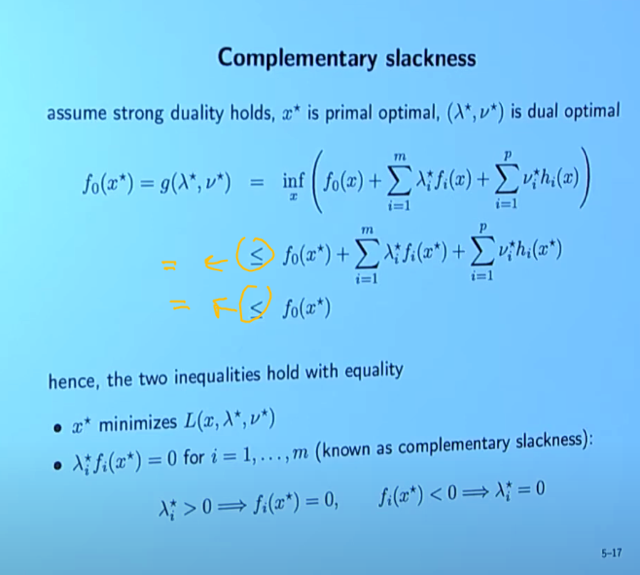</kbd>

> [!NOTE]
> COMPLEMENTARY SLACKNESS
>
> Nói qua tính chất Complementary Slackness:
>
> Đại khái là vầy, cái này thật ra rất đơn giản:
>
> Theo định nghĩa g(λ, v) = inf x f0(x) + Σ λifi(x) + Σ vihi(x)
>
> nên đương nhiên g(λ*, v*) = inf x f0(x) + Σ λ*ifi(x) + Σ v*ihi(x)
>
> Mà vế trái sẽ <= f0(x) + Σ λ*ifi(x) + Σ v*ihi(x), điều này là đương nhiên vì
> vế trái nó là "infimum".
>
> nên: 
>
> g(λ*, v*) = inf x f0(x) + Σ λ*ifi(x) + Σ v*ihi(x)
>
>               <=  f0(x) + Σ λ*ifi(x) + Σ v*ihi(x)  | tức L(x, λ*, v*)
>
> và vì ta có điều này với mọi x, do đó nó cũng đúng với x*:
>
> g(λ*, v*) ≤ f0(x*) + Σ λ*ifi(x*) + Σ v*ihi(x*) | cái này chính là L(x*, λ*, v*) 
>
> Vậy:
>
> g(λ*, v*) =  inf x f0(x) + Σ λ*ifi(x) + Σ v*ihi(x)
>
>               ≤  f0(x*) + Σ λ*ifi(x*) + Σ v*ihi(x*)   | tức L(x*, λ*, v*) (***)
>
> Đây là cái dấu ≤ thứ nhất trong slide.
>
> ====
>
> Thế thì tuy nhiên ta cũng có một "bất đẳng thức" như sau:
>
> Bắt đầu từ lập luận là, với x*, là  optimal, thì dĩ nhiên trước hết nó phải feasible. 
> Nên nó thỏa các constraint: fi(x*) ≤ 0, và hi(x*) = 0 Do đó Σ λ*i fi(x*) < 0 (vì λ*i 
> là dual optimal nên dĩ nhiên nó phải dual feasible: ≥ 0) và Σ v*i hi(x*) = 0 (lí do
> tương tự)
>
> Vậy  f0(x*) + Σ λi fi(x*) + Σ v*i hi(x*) ≤ f0(x*)
>
> Vậy nối vào tiếp (***) ta có:
>
> g(λ*, v*) = inf x f0(x) + Σ λ*ifi(x) + Σ v*ihi(x)
>
>                           <=  f0(x*) + Σ λ*ifi(x*) + Σ v*ihi(x*)   | tức L(x*, λ*, v*) (***)
>
>                           <= f0(x*)
>
> Vậy là với chuỗi các dấu <= này, ta thấy rằng, g(λ*,v*) vốn dĩ phải <= f0(x*)
>
> Thế thì ta đã nói, nếu Strong Duality thỏa mãn, tức là ta sẽ có p* = d* gọi là 
> primal optimal = dual optimal. Dĩ nhiên p* = f0(x*).
>
> Và d* = g(λ*, v*)
>
> Nên cũng là ta có f0(x*) = g(λ*, v*).
>
> Vậy một mặt là ta có:
>
> g(λ*,v*) ≤ f0(x*) + Σ λ*ifi(x*) + Σ v*ihi(x*) ≤ f0(x*), 
>
> một mặt ta có nếu strong duality thỏa khiến g(λ*, v*) = f0(x*) thì ta hai hệ quả:
>
> 1) Vì g(λ*, v*) = inf x L(x, λ*, v*) = f0(x) + Σ λ*ifi(x) + Σ v*ihi(x)
>
> mà dấu ≤ thứ nhất cho ta g(λ*, v*) = f0(x*) + Σ λ*ifi(x*) + Σ v*ihi(x*), cái này lại chính
> là L(x*, λ*, v*)
>
> Vậy L(x*, λ*, v*) = inf x L(x, λ*, v*) ⇨ x* là minimizer của L(x, λ*, v*) 
>
> Từ đây sẽ cho ta điều kiện thứ 4 của KKT conditions:
>
> vì x* là minimizer của L(x, λ*, v*) nên tại x*, gradient vanishing:
>
> D_x L(x*, λ*, v*) = 0
>
> D_x L(x*, λ*, v*) = D_x [f0(x*) + Σ λ*ifi(x*) + Σ v*ihi(x*)
>
> = D_x [f0(x*)] + D_x [Σ λ*ifi(x*)] + D_x [Σ v*ihi(x*)] 
>
> = ∇f0(x*) + Σ D_x [λ*ifi(x*)] + Σ  D_x [v*ihi(x*)]  | f0(x) là vector - scalar nên derivative là 
> gradient ∇f0
>
> = ∇f0(x*) + Σ λ*i D_x [fi(x*)] + Σ v*i D_x [hi(x*)] | đưa scalar ra ngoài 
>
> = ∇f0(x*) + Σ λ*i ∇fi(x*) + Σ v*i ∇hi(x*) | fi, hi cũng là vecror scalar function nên ta cũng
>  có gradient
>
> Vậy ta có: ∇f0(x*) + Σ λ*i ∇fi(x*) + Σ v*i ∇hi(x*) = 0
>
> 2) Σ λ*ifi(x*) + Σ v*ihi(x*) = 0
>
> mà vốn dĩ hi(x*) đã bằng 0 rồi. Vậy Σ λ*i fi(x*) = 0. Đây là complementary slackness
>
> CHAPTER 5 - DUALITY
>
> 5.5 OPTIMALITY CONDITION

**🔗 See also:** [KKT và tính tối ưu lồi](#node-0kgn4eu) · [linked note](#node-tp163f0)

 

<kbd>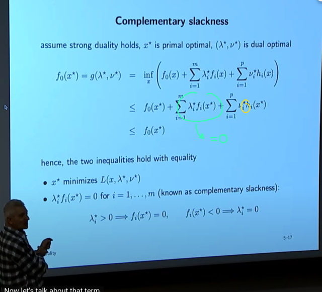</kbd>

> [!NOTE]
> Vậy Σ λi fi(x) = 0
>
> Mà λi* fi(x*) là <= 0, do λi* > 0, và fi(x*) <= 0.
>
> Nên Σ λi* fi(x*) = 0 
>
> <=> λ*i fi(x*) = 0 với mọi i
>
> Và đó gọi là COMPLEMENTARY SLACKNESS
>
> Và điều này sẽ có hệ quả là vì fi(x) <= 0 và λi >= 0 nên
>
> NẾU λ*i > 0 THÌ fi(x*) = 0 VÀ NGƯỢC LẠI NẾU fi(x*) < 0 THÌ MỌI λi 
> PHẢI = 0
>
> Gs nói thêm khi fi(x) = 0 ta gọi constraint là TIGHT
>
> Nếu fi(x) < 0 ta gọi nó là constraint is SLACK
>
> Nói cách khác khi constraint is SLACK thì chắc chắn λi, tức là
> các Lagrange multipliers phải bằng 0
>
> Ngược lại, khi λi dương thì constraint is TIGHT

 

<kbd>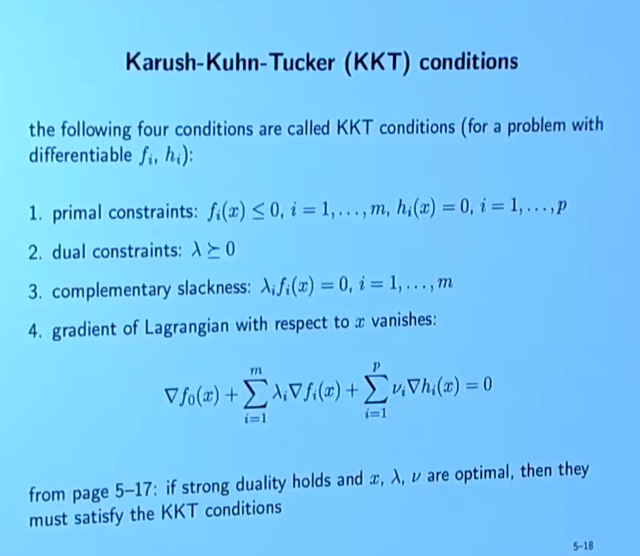</kbd>

> [!NOTE]
> Ở đây là nói về cái gọi là các điều kiện KKT.
>
> 1) Primal Constraint: dĩ nhiên là feasibility: Phải thỏa các
> constraint.
>
> 2) Dual Constraint: λ ≽ 0, như đã biết, nó đồng nghĩa với λ
> ≽R^n+ 0 và có nghĩa là component λi đều >= 0.
>
> Vì sao λ ko âm, là vì ta đã bàn về cái này rồi, λ mang ý nghĩa là
> khi ta violate inequality constraint, tức fi(x) > 0 thì ta sẽ bị tăng
> cost (cost sẽ là λifi(x). Do đó λi phải ko âm. Từ đó bài toán
> optimization khi minimize Lagrangian sẽ cố giảm cost bằng cách ko
> cho violate constraint
>
> 3) Complementary Slackness: Đó là, λ như condition 2 nói rằng
> nó phải ko âm. Thì nếu nó dương, thì fi(x) phải bằng 0 (đây
> chính là Complementary Slackness vừa rồi . Đây chính là ý nghĩa
> của condition thứ 3 khi nói λ*ifi(x*) = 0
>
> 4) Gradient của Lagrangian function L(x*, λ*, v*) bằng 0 (vanish)
>
> Cái này chính là xuất phát từ việc: x* là minimizer của L(x, λ*, v*)
> ⇨ D_x L(x*, λ*, v*) = 0
>
> Và gs cho biết nếu ta có bài toán CẢ CONVEX LẪN KHÔNG
> CONVEX và nếu ta có STRONG DUALITY, và x*, λ*, ν* là
> các optimal. Thì 4 KKT conditions sẽ phải thỏa.
>
> Và  nếu x, λ, v thỏa KKT conditions thì nó gọi là KKT POINT

 

<kbd></kbd>

> [!NOTE]
> Gs nói thêm, nếu trong bài toàn non-convex, khi giải gradient =
> 0. Thì đó có thể là optimal hoặc không. Người ta gọi là
> Stationary point
>
> Còn NẾU LÀ CONVEX PROBLEM, việc THỎA KKT
> CONDITIONS ĐỒNG NGHĨA LÀ OPTIMAL

 

- **KKT và tính tối ưu lồi**

<kbd>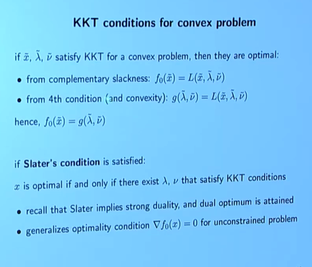</kbd>

> [!NOTE]
> Như vừa nói, nếu là convex problem thì khi x~, λ~, ν~
>
> (kí hiệu tilde ý là x, λ, v đều feasible: x (primal) feasible và λ,
> v cũng dual feasible)
>
> x~, λ~, ν~ THỎA KKT CONDITION THÌ CHÚNG LÀ OPTIMAL: 
> x~ LÀ PRIMAL OPTIMAL, (λ~, ν~) LÀ DUAL OPTIMAL
>
> Khi đó, từ điều kiện complement slackness ta sẽ có: 
>
> f0(x~) = L(x~, λ~, ν~). Tại sao?
>
> Vì thỏa KKT conditions, thì condition #1 là nó phải feasible. Tức là ta
> có hi(x~) = 0 => Σ v~ihi(x~) = 0
>
> Rồi, vì thỏa condition #3 - complement slackness nghĩa là Σ λifi(x~) = 0
>
> Vậy f0(x~) = f0(x~) + 0 + 0 = f0(x~) + Σ λ~ifi(x~) + Σ v~ihi(x~)
>
> Thì đây chính là L(x~, λ~, ν~)
>
> ====
>
> Thế thì đang xét convex problem nên Lagrangian CŨNG CONVEX (gs
> nói cái này rất dễ thấy, f0 convex, fi convex, λi dương, nên λifi vẫn
> convex, nên Σ λifi convex. Còn Σ vihi là các affine, cũng convex luôn.)
>
> Thế thì condition #4 nói rằng:
>
> gradient theo x ∇_x L(x~, λ~, ν~) = 0, tức đạo hàm theo x của L
> (với λ = λ~, v = v~, coi như chỉ là hàm theo x) bằng 0.
>
> Và vì L convex nên x~ chính là tức là minimum point, mà tại đó L(x,
> λ~, ν~) đạt giá trị nhỏ nhất:
>
> L(x~, λ~, ν~) = inf x L(x, λ~, ν~).
>
> Mà g(λ~, ν~) theo định nghĩa là inf x L(x, λ~, ν~)
>
> Vậy ta có thể kết luận L(x~, λ~, ν~) = g(λ~, ν~)
>
> ====  
>
> Và do đó f0(x~) = L(x~, λ~, ν~) = g(λ~, ν~)
>
> Phần về Slater's gs ko nói

**🔗 See also:** [linked note](#node-6du1rri)

 

<kbd></kbd>

> [!NOTE]
> Tới đây gs nói một điều mà Yoshua Bengio đã nói, KKT chính là
> khái quát hoá những cái ta đã học trong Calculus về Langrange
> multipliers

 

<kbd>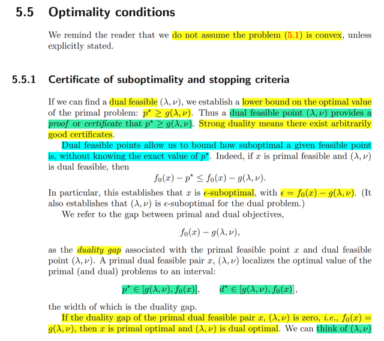</kbd>

<kbd>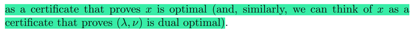</kbd>

> [!NOTE]
> CERTIFICATE OF SUB-OPTIMALITY
> & STOPPING CRITERIA
>
> Đại khái là, họ nói rằng, NẾU TA CÓ THỂ TÌM THẤY MỘT (λ, v) 
> DUAL FEASIBLE (nhớ lại, dual feasible là khi g(λ, v) > -infinity)
> THÌ KHI ĐÓ NHỜ QUAN HỆ p* >= g(λ, v), TA CÓ MỘT GIỚI HẠN
> DƯỚI (LOWER BOUND) CỦA PRIMAL PROBLEM p*
>
> Và điều này có nghĩa là việc chứng minh sự tồn tại / tìm được 
> dual feasible λ, v cho ta MỘT GIẤY CHỨNG NHẬN / BẰNG CHỨNG
> rằng CÓ MỘT LOWER BOUND CỦA p*
>
> Thế thì, một điểm quan trọng nữa là: DUAL FEASIBLE points CHO
> PHÉP TA ĐÁNH GIÁ ĐƯỢC MỘT FEASIBLE POINT x CÒN CÁCH
> OPTIMAL p* BAO XA, DÙ KHÔNG BIẾT p*
>
> Cụ thể là vầy: ta biết p* >= g(λ, v). Nên nếu ta có một feasible point
> x, với giá trị f0(x) thì ta có: f0(x) - p* <= f0(x) - g(λ, v)
>
> Mà như vậy có nghĩa là, KHOẢNG CÁCH CỦA f0(x) ĐẾN OPTIMAL
> p* NHIỀU NHẤT LÀ BẰNG f0(x) - g(λ, v)
>
> Và theo định nghĩa của ε-SUBOPTIMAL: LÀ TẬP (SET) CÁC ĐIỂM
> MÀ GIÁ TRỊ f0 CHỈ LỚN HƠN GIÁ TRỊ OPIMAL MỘT KHOẢNG ε 
> TRỞ XUỐNG
>
> ε-suboptimal = {x: f0(x)  <= p* + ε}
>
> Thì theo đó, ta có thể kết luận x THUỘC ε-SUBOPTIMAL SET 
> VỚI ε = f0(x) - g(λ, v)
>
> Và f0(x) - g(λ, v) được gọi là DUALITY GAP
>
> ====
>
> Một điểm nữa, một (PRIMAL) FEASIBLE POINT x, và DUAL FEASIBLE
> POINT (λ, v) sẽ ĐẶT RA MỘT KHOẢNG MÀ TA BIẾT SẼ CHƯA p*, d*:
>
> p*, d* ∈ [g(λ, v), f0(x)]
>
> Dễ thấy khi ta có STRONG DUALITY thì ta có p* = d* và đoạn này chập
> lại làm 1 (1 điểm)
>
> Ý cuối chưa hiểu lắm
>
> 5.5 OPTIMALITY CONDITIONS
>
> 5.5.1 CERTIFICATE OF SUBOBTIMALITY 
> & STOPPING CRITERIA

**🔗 See also:** [Các khái niệm như unattainable & unsolvable, ε-suboptimal](./lec_5.md#node-vzno2dm) · [linked note](#node-74sfwci)

 

<kbd>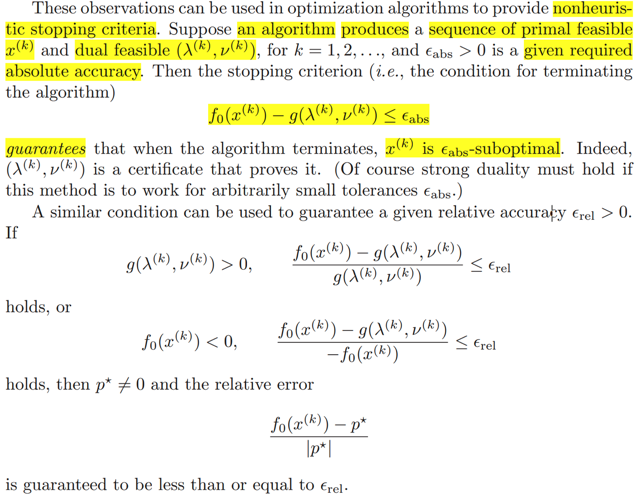</kbd>

> [!NOTE]
> Tại sao:
>
> Theo định nghĩa, nếu x^(k) ∈ ε-suboptimal thì có nghĩa là f0(x^(k)) <= p* + ε
>
> mà ta có f0(x^(k)) - g(λ^(k), v^(k)) <= ε
>
> <=> f0(x^(k)) <= g(λ^(k), v^(k)) + ε 
>
> Mà ta đã có g(λ, v) <= p* nên g(λ^(k), v^(k)) <= p*
>
> Vây f0(x^(k)) <= g(λ^(k), v^(k)) + ε  <= p* + ε 
>
> =>  x^(k) ∈ ε-suboptimal
>
> Lập luận ở trên kiểu như giúp ta có một tiêu chuẩn để dừng "chương trình"
> kiểu như nếu ta có thuật toán giúp lần lượt "tính ra" các primal feasible x^(k)
> và dual feasible λ^(k), v^(k) thì nếu ta MUỐN CHƯƠNG TRÌNH DỪNG
> KHI TÌM ĐƯỢC MỘT FEASIBLE x THỎA MÃN LÀ f0(x) RẤT GẦN OPTIMAL
> (CHỈ CÁCH OPTIMAL MỘT KHOẢNG NHIỀU NHẤT LÀ ε_abs (ý là một
> giá trị tuyệt đối) thì tiêu chí f0(x^(k)) - g(λ^(k), v^(k)) <= ε có thể giúp ta đạt
> được điều này
>
> Còn ở dưới thì thay vì có ε mang tính tuyệt đối thì ta có thể áp dụng ε mang 
> tính tương đối. Đọc phần này sau

 

<kbd>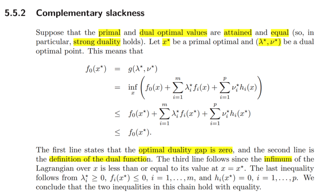</kbd>

> [!NOTE]
> phần này trong sách cơ ko có gì khác bản mình
> đã hiểu rồi
>
> 5.5 OPTIMALITY CONDITIONS
>
> 5.5.2 COMPLEMETARY SLACNESS

**🔗 See also:** [linked note](#node-6du1rri)

 

<kbd>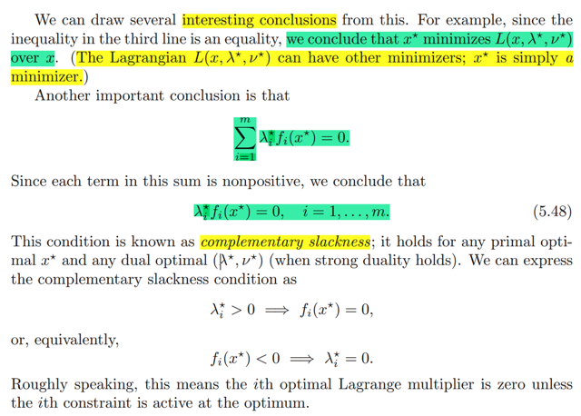</kbd>

> [!NOTE]
> Và kết quả này dẫn đến tính chất COMPLEMENTARY
> SLACKNESS mà ta đã hiểu trong bài.
>
> Chỉ có một ý nữa mà sách bổ sung so với bài giảng, đó là còn
> một kết  luận nữa đó:
>
> vì g(λ*, v*) =  inf x f0(x) + Σ λ*ifi(x) + Σ v*ihi(x) (đây là định nghĩa
> của dual function)
>
> và strong duality cho ta f0(x*) = g(λ*, v*) nên
>
> f0(x*) = inf x f0(x) + Σ λ*ifi(x) + Σ v*ihi(x)
>
> Giúp kết luận x* là điểm minimize L(x, λ*, v*) vốn là cái mà ta ko
> có nếu strong duality ko hold

 

<kbd>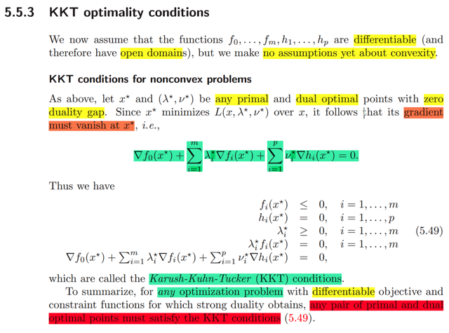</kbd>

> [!NOTE]
> Định nghĩa về KKT OPTIMALITY CONDITIONS, ko có gì thêm
> đã hiểu rồi. Chỉ nhấn mạnh rằng nếu primal problem KHÔNG 
> CONVEX thì: 
>
> NẾU x*, λ*, v* LÀ PRIMAL OPTIMAL và DUAL OPTIMAL VÀ
> ZERO DUALITY GAP THÌ CHÚNG PHẢI THỎA KKT CONDITION.
>
> Chú ý, trong bài toán primal non-convex thì việc thỏa KKT
> condition chưa chắc dẫn đến chúng là primal optimal / dual
> optimal.
>
> Lập luận như sau: Giả sử bài toán primal problem non-convex.
>
> Thì nếu a) x* là primal optimal, và b) λ*, v* là dual optimal và 
> c) duality gap = 0, ta sẽ có: 
>
> 1) x* primal optimal => x* feasible: hi(x*) = 0, fi(x*) <= 0 với mọi i
>
> 2) λ* là dual optimal nên λ* thỏa dual constraint: λ* ≽ 0, hay λ*i >= 0
> với mọi i
>
> 3) Ta lặp lại luận luận sau để thấy x*, λ*, v* sẽ phải thỏa complementary
> slackness:
>
> Theo định nghĩa g(λ, v) = inf x L(x, λ, v) => g(λ*, v*) = inf x L(x, λ*, v*)
>
> inf L(x, λ*, v*) <= L(x, λ*, v*) với mọi x, trong đó có x*
>
> => inf x L(x, λ*, v*) <= L(x*, λ*, v*)
>
> Từ đó:
>
> g(λ*, v*) = inf x L(x, λ*, v*) <= L(x*, λ*, v*) = f0(x*) + Σ λ*ifi(x*) + Σ v*ihi(x*)
>
> Tiếp, f0(x*) + Σ λ*ifi(x*) + Σ v*ihi(x*) <= f0(x*) vì λ*ifi(x*) < 0 còn v*ihi(x*) = 0
> (lí do là x* là optimal thì trước hết nó feasible => thỏa các constraint)
>
> Vậy ta có quan hệ sau: 
>
> g(λ*, v*) = inf x L(x, λ*, v*) <= L(x*, λ*, v*) = f0(x*) + Σ λ*ifi(x*) + Σ v*ihi(x*) <= f0(x*)
>
> Và từ quan hệ này, xét sự điều kiện ban đầu cho rằng duality gap = 0 tức:
>
> d* = g(λ*, v*) = p* = f0(x*) thì điều này ĐỒNG NGHĨA LÀ DẤU BẰNG Ở ĐÂY
> PHẢI XẢY RA:
>
> f0(x*) + Σ λ*ifi(x*) + Σ v*ihi(x*) <= f0(x*)
>
> và vì v*ihi(x*) = 0 rồi, nên dẫn đến 3) λ*ihi(x*) = 0 với mọi i (COMPLEMENTARY 
> SLACKNESS)
>
> Cuối cùng, đó là, với việc d* = p* cũng ĐỒNG NGHĨA LÀ DẤU BẰNG Ở ĐÂY 
> (VÀ NHỮNG CHỖ KHÁC) CŨNG XẢY RA:
>
> inf x L(x, λ*, v*) <= L(x*, λ*, v*) 
>
> Và như đã nói về cái này ở note trước (hai hệ quả của ..) thì điều này có nghĩa
> là x* LÀ ĐIỂM MINIZE L(x, λ*, v*)
>
> Mà như vậy thì GRADIENT CỦA LAGRANGIAN L(x, λ*, v*) tại x* PHẢI BẰNG 0
> VÌ NẾU KHÔNG TA CÓ THỂ TIẾP TỤC ĐI THEO HƯỚNG - GRADIENT ĐỂ
> GIẢM L THÊM NỮA.
>
> Vậy ta có / thỏa điều kiện 4): ∇x L(x, λ*, v*) | x=x* = 0
>
> Vậy ta đã lập luận để thấy nếu x* là primal optimal, λ*, v* là dual optimal
> và duality gap = 0 thì x*, λ*, v* sẽ THỎA 4 ĐIỀU KIỆN TRÊN, CHÍNH LÀ KKT
> CONDITIONS
>
> 5.5 OPTIMALITY CONDITIONS
>
> 5.5.3 KKT CONDITIONS

 

<kbd>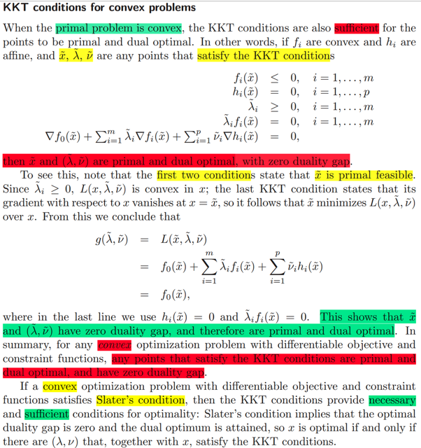</kbd>

> [!NOTE]
> Đại khái là, như vừa rồi, ta đã chứng minh rằng nếu mà ta có bài toán primal
> problem NON-CONVEX với x* là primal optimal, và λ*, v* là dual optimal và zero
> duality gap thì chúng sẽ thỏa KKT conditions.
>
> Thế thì, vì việc chứng minh đó không care primal là convex hay không nên dĩ
> nhiên với convex problem thì ta cũng có như vậy.
>
> Tuy nhiên, ở đây với CONVEX problem ta có thể chứng minh chiều ngược lại:
> Nếu primal feasible x~ và dual feasible λ~, v~ thỏa KKT conditions thì
> CHÚNG SẼ LÀ PRIMAL OPTIMAL VÀ DUAL OPTIMAL VỚI DUALITY GAP
> = 0
>
> Chứng minh như sau:
>
> Dựa trên việc chúng đã thỏa các KKT conditions tức là ta có:
>
> 1) x~ thỏa primal feasible: fi(x~) <= 0, hi(x~) = 0
>
> 2) λ~ thỏa dual constraint: λ~ ≽ 0
>
> 3) thỏa complementary slackness: Σ λ~i fi(x~) = 0 với mọi i
>
> 4) ∇x L(x, λ~, v~) | x=x~ = 0
>
> Thế thì ta cần chứng minh x~ chính là x*, g(λ~, v~) = g(λ*, v*) và g(λ~, v~) =
> f0(x~)
>
> Đầu tiên, dựa vào việc đây là CONVEX PROBLEM, tức là f0, f1, ...fm convex
> hi là affine. Do đó L CŨNG CONVEX. Mà với convex function, thì CRITICAL
> POINT CHÍNH LÀ MINIMUM.
>
> Do đó điều 4 cho ta kết luận x~ chính là minimum của L(x, λ~, v~):
>
> L(x~, λ~, v~) = inf x L(x, λ~, v~)
>
> Thế thì theo định nghĩa g(λ, v) = inf L(x, λ, v) nên g(λ~, v~) = inf x L(x, λ~, v~)
>
> Vậy kết hợp với điều trên, ta có g(λ~, v~) = L(x~, λ~, v~)
>
> cũng là: g(λ~, v~) = L(x~, λ~, v~) = f0(x~) + Σ λ~ifi(x~) + Σ v~ihi(x~)  
>
> Thế thì: Dùng tiếp điều kiện 1): hi(x~) = 0, và 4) Σ λ~ihi(x~) = 0 ta suy ra:
>
> g(λ~, v~) = L(x~, λ~, v~) = f0(x~) + Σ λ~ifi(x~) + Σ v~ihi(x~) = f0(x~)
>
> Vậy ta có được kết luận g(λ~, v~) = f0(x~)
>
> Theo sách nói điều này CHỨNG TỎ HẾT NHỮNG ĐIỀU CẦN CHỨNG
> MINH:
>
> λ~, v~ CHÍNH LÀ DUAL OPTIMAL 
>
> x~ CHÍNH LÀ PRIMAL OPTIMAL
>
> và DĨ NHIÊN LÀ DUALITY GAP = 0.
>
> Vì sao nhỉ?
>
> Đó là vì ta luôn có quan hệ sau:
>
> g(λ, v) <= g(λ*, v*) <= f0(x*) <= f(x~), hay g(λ, v) <= d* <= p* <= f0(x) chính
> là cái mà gs nói rằng λ, v cho ta một INTERVAL của p*, d* (xem link xanh):
>
> d*, p* ∈ [g(λ, v), f0(x)]
>
> Do đó khi ta có g(λ~, v~) = f0(x~) thì điều này CHỈ XẢY RA KHI g(λ~, v~)
> chính là 1) g(λ*, v*), 2) f0(x~) chính là f0(x*) và 3) Ta có Strong duality xảy ra.

**🔗 See also:** [linked note](#node-l8otevv)

 

<kbd>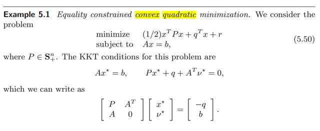</kbd>

<kbd>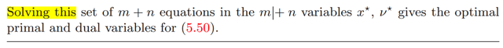</kbd>

> [!NOTE]
> một ví dụ là bài toán convex optimization trong đó objective là quadratic
> (dĩ nhiên là convex function) function với equality affine constraint Ax = b
>
> Thì như vừa nói, với convex problem thì nếu thỏa KKT thì ta sẽ có ngay
> optimal. Do đó ta thiết lập KKT condition để giải ra x và v (không có λ)
>
> Thì trong KKT conditions, điều kiện 1) primal feasible đơn giản là phải
> thỏa constraint: Ax* = b.
>
> Không có inequality constraint nên không cần λ* ≽ 0, cũng như không có
> complementary slackness
>
> Vậy chỉ còn điều kiện 4) ∇x L(x, v*) = 0
>
> L(x, v) = f0(x) + Σvi hi(x) = f0(x) + vTh(x) = (1/2)xTPx + qTx + r + vT(Ax-b)
>
> Tính ∇x L: Nhờ mit 18s096 làm rất dễ dàng:
>
> dL = L(x+dx,v) - L(x,v)
>
> = (1/2)(x + dx)TP(x + dx) + qT(x + dx) + r + vT[A(x + dx) - b] - (1/2)xTPx - qTx - r -
> vT(Ax - b)
>
> = (1/2)(xTPx + dxTPx + xTPdx + dxTPdx) + qTx + qTdx + r + vTAx + vTAdx - vTb -
> (1/2)xTPx - qTx - r - vTAx + vTb
>
> = (1/2)xTPx + (1/2)dxTPx + (1/2)xTPdx + (1/2)dxTPdx + qTx + qTdx + r +
> vTAx + vTAdx - vTb -  (1/2)xTPx - qTx - r - vTAx + vTb
>
> = xTPdx + qTdx  + vTAdx = (xTP + qT + vTA)dx = (PTx + q + ATv)Tdx
>
> => ∇x L = PTx + q + ATv
>
> ∇x L(x, v*) |x=x* = 0 <=> PTx* + q + ATv* = 0
>
> Vậy ta cần giải: 
>
> Ax* = b và PTx* + q + ATv = 0

 

<kbd>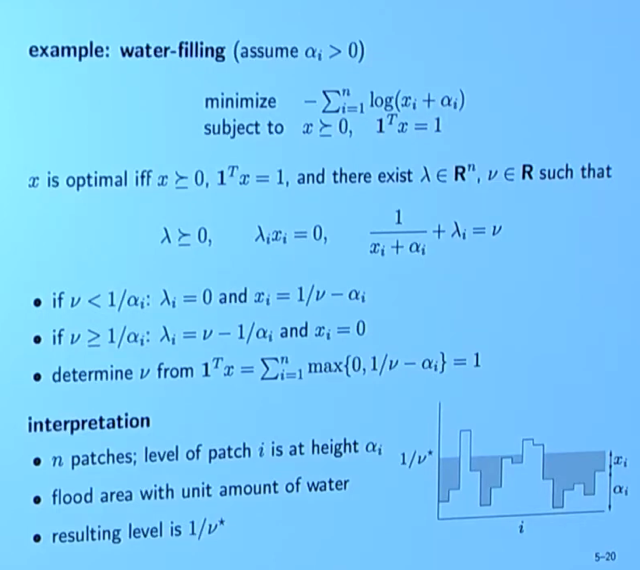</kbd>

> [!NOTE]
> Một ví dụ thuộc lĩnh vực lý thuyết thông tin. Đại khái là ta có convex problem. 
> Áp dụng KKT ta sẽ nói rằng x là optimal nếu và chỉ nếu thỏa  KKT conditions:
>
> Condition 1: x* Drimal feasible: Đồng nghĩa x* ≽ 0 và 1Tx = 1. 
>
> Condition 2: Dual constraint λ ≽ 0.
>
> Condition 3: Complementary Slackness: λ*ix*i = 0
>
> Condition 4: Gradient wrt x của Lagrangian L(x, λ*, v*) tại x* = 0:
>
> Lagrangian: 
>
> L(x, λ, ν) = - Σ log(xi+αi) + Σ λi(-xi) + ν (1Tx-1)
>
> Chỗ này chú ý, equalities constraint x ≽ 0, thì ta có n constraints: x1 >= 0, 
> x2 >= 0,....xn >= 0. Nên mỗi cái gắn với một λ: λ1, λ2...
>
> Còn 1Tx = 0 thì thật ra chỉ có 1 equality constraint: -> chỉ có 1 ν
>
> L(x, λ, v) = - Σ log(xi+αi) + Σ λi(-xi) + ν (Σxi-1)
>
> ∇_x L_i = ∂/∂xi L = ∂/∂xi [- log(xi+αi) + λi(-xi) + ν(xi-1)]
>
> = ∂/∂xi [- log(xi+αi)] + ∂/∂xi[λi(-xi)] + ∂/∂xi[ν(xi-1)]
>
> = -1/(xi+αi) - λi + v
>
> ∇_x L_i = 0 <=> - 1/(xi+αi) - λi + v = 0
>
> <=>  1/(xi+αi) + λi = vi
>
> Ở trên là mình tính ∂L/∂xi, thử tính theo lối holistically như  MIT18s096 xem:
>
> L = - 1Tlog(x+α) + λT(-x) + v(1Tx-1) = - 1Tlog(x+α) - λTx + v(1Tx-1)
>
> dL = L(x+dx) - L(x)
>
> = - 1Tlog(x+dx+α) - λT(x+dx) + v(1Tx+1Tdx-1) - [- 1Tlog(x+α) - λTx + v(1Tx-1)]
>
> = - 1Tlog(x+dx+α) - λT(x+dx) + v(1Tx+1Tdx-1) + 1Tlog(x+α) + λTx - v(1Tx-1)
>
> = - 1Tlog(x+dx+α) - λTx - λTdx + v(1Tx) + v(1Tdx) - v + 1Tlog(x+α) + λTx - v(1Tx) + v
>
> = - 1Tlog(x+dx+α) + 1Tlog(x+α) - λTdx + v(1Tdx) 
>
> = - 1T[log(x+dx+α) - log(x+α)] - λTdx + v(1Tdx) 
>
> = -1Tlog[(x+dx+α)/(x+α)] - λTdx + v(1Tdx) 
>
> = -1Tlog[1+dx/(x+α)] - λTdx + v(1Tdx) (1)
>
> Tới đây dùng linear approximation của hàm log: Với x~= x0
>
> log(x) ~= log(x0) + log'(x0)(x-x0) = log(x0) + (1/x0)(x-x0)
>
> Từ đó với x~=1: log(x) ~= log(1) + (1/1)(x-1) = x-1
>
> áp dụng vào bài toán trên 1 + dx/(x+α) ~= 1 => log[1+dx/(x+α)] ~= 1+dx/(x+α) - 1
>
> <=> log[1+dx/(x+α)] ~= dx/(x+α) 
>
> Vậy (1) = -1T[dx/(x+α) ] - λTdx + v(1Tdx)
>
> = [-λT + v(1T) - 1T/(x+α)]dx = [-λ + v(1) - 1/(x+α)]Tdx  | cho đến đây v vẫn là scalar
>
> => ∇_x L(x, λ, v) = -λ + v - 1/(x+α)  | có thể coi v như scalar hoặc vector component 
> giống nhau = v
>
> => Điều 4 của KKT: ∇_x L(x, λ*, v*) |x=x* = 0
>
> <=> -λ* + v* - 1/(x*+α)
>
> <=>  -λ*i + v* - 1/(x*+αi) = 0 
>
> <=> λ*i + 1/(x+αi) = v*
>
> Còn những ý ở dưới thì vài bữa nghiên cứu sau

 

<kbd>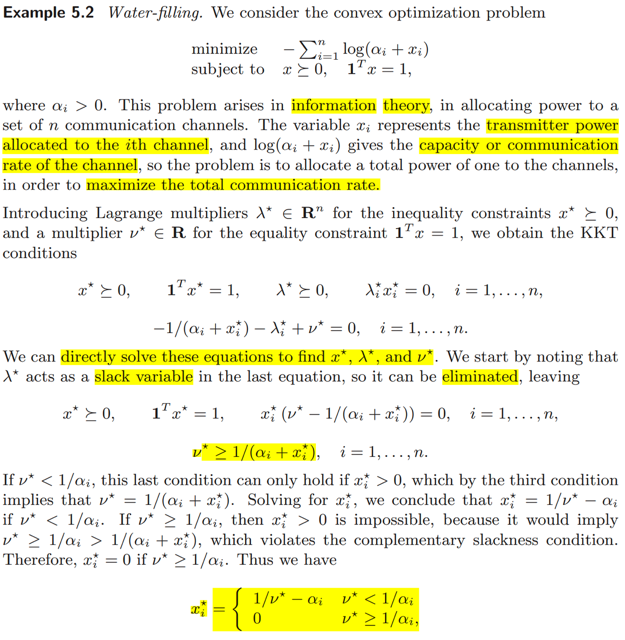</kbd>

<kbd>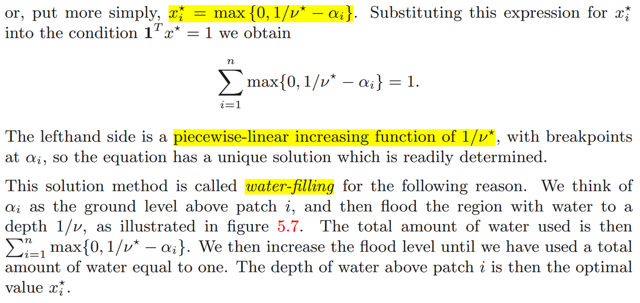</kbd>

> [!NOTE]
> Từ note trước ta đã tự derive lại condition 4) gradient L wrt x = 0.
> thì phần trong sách giúp hiểu rõ hơn về việc giải các KKT conditions
> (để ra optimal x*)
>
> Nói chung là cũng ko có gì khó hiểu. Chỉ có đáng chú ý một bước
> gọi là eliminate slack variable, đại khái là vầy:
>
> Ta có (điểm 4 của KKT): λ*i + 1/(x+αi) = v* <=> -1/(x+αi) - λ*i + v* = 0
>
> mà cái này <=> -1/(x+αi) + v* = λ*i 
>
> Kết hợp với λ*i >= 0 => -1/(x+αi) + v* >= 0 
>
> <=> v* >= 1/(αi + x*)
>
> Và gỉai ra ta có solution như vậy
>
> (Quay lại sau)

 

<kbd>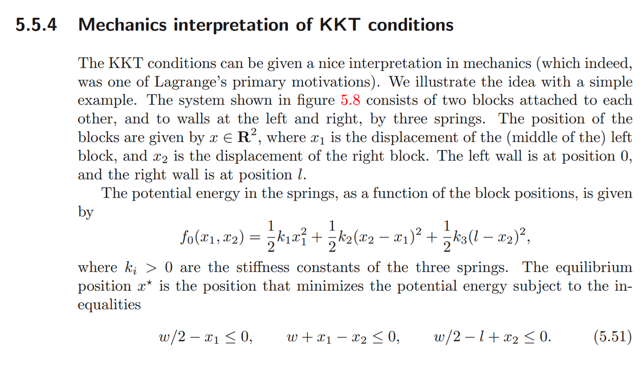</kbd>

> [!NOTE]
> SÁCH (XEM SAU)
>
> 5.5 OPTIMALITY CONDITIONS
>
> 5.5.4 MECHANICS INTERPRETATION OF
> KKT CONDITIONS

 

<kbd>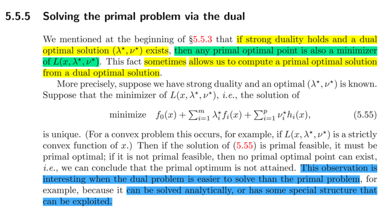</kbd>

> [!NOTE]
> 5.5 OPTIMALITY CONDITIONS
>
> 5.5.5 SOLVING THE PRIMAL PROBLEM VIA
> THE DUAL
>
> Đại khái là ở đây ta nhắc lại một nhận định rằng khi ta có STRONG
> DUALITY, và ta cũng đã có DUAL OPTIMAL  λ*, v*. Thì BẤT KÌ PRIMAL
> OPTIMAL NÀO CŨNG LÀ MINIMIZER CỦA L(x, λ*, v*)
>
> Tại sao như vậy: Lập luận là vầy:
>
> g(λ, v) = inf x L(x, λ, v)   |  định nghĩa của dual function
>
> => g(λ*, v*) = inf x L(x, λ*, v*)   | vẫn là định nghĩa của dual function, chỉ
> là evaluate tại λ* và v*
>
> g(λ*, v*) = inf x L(x, λ*, v*) ≤ L(x*, λ*, v*)   |  vì nó là ý nghĩa của infimum
>
> thì nó phải nhỏ nhất trong các L(x, λ*, v*) với x ∈ dom và dĩ nhiên trong 
> đó có L(x*, λ*, v*)
>
> Thay công thức L(x*, λ*, v*) vào:
>
> g(λ*, v*) = inf x  f0(x) + Σ λ*ifi(x) + Σ v*ihi(x) 
>
> ≤ f0(x*) + Σ λ*ifi(x*) + Σ v*ihi(x*)
>
> ≤ f0(x*)
>
> Vì f0(x*) + Σ λ*ifi(x) + Σ v*ihi(x) ≤ f0(x*) do:
>
> λ*i ≥ 0 vì nó là dual optimal nên phải thỏa "dual constraint" λ ≽ 0 (cũng
> đồng nghĩa λ*i ≥ 0)
>
> fi(x*) < 0 và hi(x*) = 0 vì x* là primal optimal nên phải "primal feasible" 
> (fi(x) ≤ 0, hi(x) = 0)
>
> Rồi từ việc nói ta có STRONG DUALITY, tức là: 
>
> p* = d* ⇔ f0(x*) = g(λ*, v*)
>
> Vậy điều này xảy ra khi các dấu ≤  đều là dấu bằng:
>
> Trong đó dấu bằng đầu tiên:
>
> inf x  f0(x) + Σ λ*ifi(x) + Σ v*ihi(x)  = f0(x*) + Σ λ*ifi(x*) + Σ v*ihi(x*)
>
> Chính là L(x*, λ*, v*) = inf x L(x, λ*, v*)
>
> Và ý nghĩa của nó chính là: "primal optimal x* chính là minimizer  của
> L(x, λ*, v*)"
>
> Thành ra dựa vào điều này, nếu ta có strong duality, và có λ*, v* rồi.
>
> Thì việc tìm x* có thể được thực hiện bằng cách thay vì giải bài toán
> gốc (minimize f0(x) subject to constraint)  có thể được thay thế bằng
> bằng toán:
>
> minimize Lagrangian L(x, λ*, v*)
>
> Và nếu bài toán này có nghiệm feasible thì nó chính là x* còn
> không thì ta nói PRIMAL OPTIMAL KHÔNG TỒN TẠI
>
> VÀ MỘT SỐ TRƯỜNG HỢP THÌ VIỆC GIẢI BÀI TOÁN SAU DỄ HƠN
> BÀI TOÁN GỐC

 

<kbd>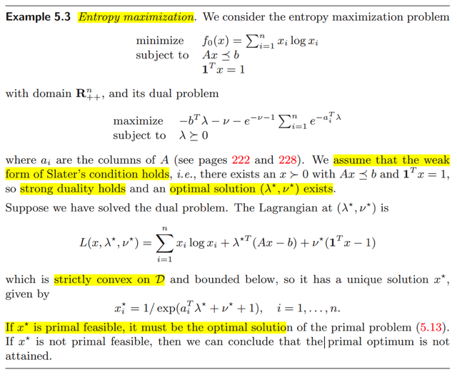</kbd>

> [!NOTE]
> Đại khái là áp dụng điều này vào ví dụ này - bài toán Entropy
> maximization (mà trong bài trước (theo link) mình đã triển khai để thấy
> dual function g(λ, v) = - v - λTb - e^(-v-1) Σ e^(- aiTλ)
>
> Nên theo như kiến thức ở đây, người ta nói nếu giả dụ mình đã có dual
> optimal λ*, v*, bằng cách giải dual problem: maximize g(λ, v) subject to
> dual constraint: λ ≽ 0.
>
> Thì khi đó, ta giả sử ta chắc chắn có STRONG DUALITY:
>
> Chỗ này ta sẽ liên hệ kiến thức đã học ở phần trước, đó là khi một
> primal problem là CONVEX problem mà lại thỏa SLATER'S
> CONDITION thì ta có thể chắc chắn STRONG DUALITY xảy ra.
>
> Còn Slater's condition nôm na là với các inequality constraints ví dụ
> fi(x) <= 0 thì điều kiện đó là tồn tại những điểm STRICTLY
> FEASIBLE: những điểm mà fi(x) < 0
>
> Nhưng bên cạnh đó, nếu như các inequality constraints là affine function,
> thì khi đó Slater's condition trở thành WEAK SLATER'S CONDITION  
> (đại khái là những inequality constraints nào mà là có dạng tuyến tính
> aiTx <= bi thì khỏi cần có tồn tại strictly feasible, mà feasible là đủ rồi)
>
> Thành ra với bài toán này khi INEQUALITY CONSTRAINT ĐỀU
> LINEAR để thể hiện thành Ax ⪯ b thì điều kiện Slater trở thành
> chỉ còn là điều kiện TỒN TẠI FEASIBLE POINTS / hay nói cách khác
> chỉ yêu cầu BÀI TOÁN FEASIBLE là đủ. Vậy dĩ nhiên x feasible có
> nghĩa là x phải thuộc domain của f0 (đây gọi là implicit constraint) mà f0
> có log(x) nên domain là x phải DƯƠNG x ≻ 0. Đồng thời feasible
> thì nó phải thỏa Ax ⪯ b và 1Tx = 1
>
> Thế thì giả sử bài toán feasible. Thì theo kiến thức ở đây, ta chỉ việc giải
> bài toán minimize L(x, λ*, v*) và nếu bài toán này có feasible point, thì  nó
> chính là PRIMAL OPTIMAL x*.  Ngược lại, thì PRIMAL OPTIMAL
> NOT ATTAINED
>
> Để giải bài toán này thì ta cũng làm như thông thường, tìm critical point
> của L(x, λ*, v*) (chỉ là function theo x). Liên hệ bài trước khi mình tự
> derive hàm g(λ, v) thì có hai cách: 1 là dùng hệ quả của conjugate
> function và 2) là dùng calculus. Thì trong cách 2 ta đã cho ra critical point
> là:
>
> x = e^(- ATλ - v - 1)
>
> = e^[-(ATλ + v + 1)]
>
> = 1 / e^(ATλ + v + 1)
>
> Và trong note trước ta cũng tìm Hessian để thấy nó = diag([1/x1, 1/x2...]
> với  x ≻ 0 thì Hessian POSITIVE DEFINITE, do đó L(x, λ*, v*)
> STRICTLY CONVEX  => CRITICAL POINT LÀ UNIQUE MINIMUM
>
> x* = 1 / e^(ATλ + v + 1)
>
> Áp dụng kết quả đó ở đây thì ta có x* = 1 / e^ (ATλ* + v* + 1)
>
> => x*i = 1 / e^(aiTλ* + v* + 1) 
>
> Và như đã nói, ta sẽ CHECK XEM x* có PRIMAL FEASIBLE KHÔNG. 
> NẾU CÓ THÌ NÓ CHÍNH LÀ PRIMAL OPTIMAL.

**🔗 See also:** [Entropy maximization](./lec_8_a.md#node-myefxtz)

 

<kbd>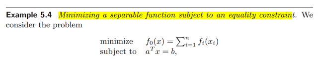</kbd>

<kbd>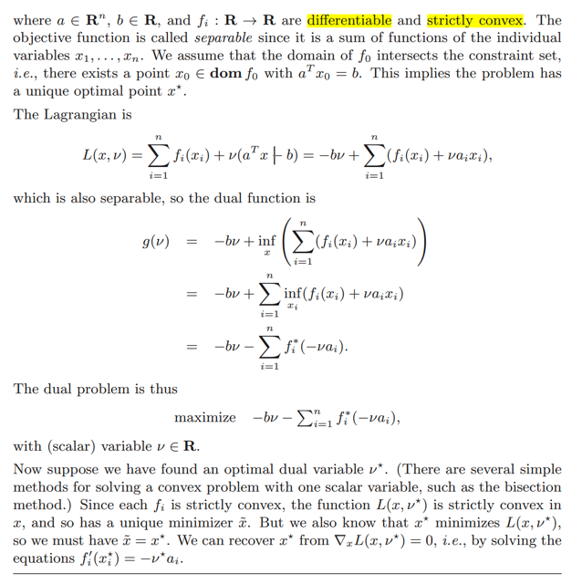</kbd>

> [!NOTE]
> Qua ví dụ này, objective (primal objective) là f0(x) có dạng SUM CỦA
> CÁC FUNCTION ĐƠN BIẾN KHÁC NHAU: Σi fi(xi) do đó nó gọi là
> SEPARABLE FUNCTION. Constraint là aTx = b. Với nói thêm fi đều
> differentiable và STRICTLY CONVEX.
>
> Thế thì họ assume là trong problem domain (như đã biết PROBLEM
> DOMAIN là INTERSECTION của objective function domain và
> các constraint function domain) tồn tại point thỏa aTx = b, thì ta sẽ
> có thể kết luận là TỒN TẠI UNIQUE OPTIMAL POINT x*
>
> Tại sao lại vậy? Đó đơn giản là vì objective function STRICTLY
> CONVEX, và gs đã nói ở đâu đó, nếu có tính chất này thì khi optimal
> tồn tại thì nó là unique.
>
> Thử build Lagrangian: 
>
> L = f0(x) + Σ vi hi(x) = Σ fi(xi) + v(aTx - b) = Σ fi(xi) + vaTx - vb
>
> = Σ fi(xi) + v Σaixi - vb = Σ fi(xi) + Σvaixi - vb
>
> = Σ(fi(xi) + vaixi) - vb
>
> => g(v) = inf x L(x, v) = inf x Σ(fi(xi) + vaixi) - vb
>
> = Σ inf x [fi(xi) + vaixi] - vb
>
> = Σ - sup x [-fi(xi) - vaixi] - vb
>
> = Σ - sup x [- vaixi - fi(xi)] - vb
>
> Và ta nhớ conjugate function của f(x) có định nghĩa là:
>
> f*(y) = sup x [yTx - f(x)]
>
> => sup x [ (-vai)xi - fi(xi) ] chính là fi*(-vai)
>
> Vậy:
>
> g(v) = [Σ - fi*(-vai) ] - vb = -vb - Σ fi*(-vai) 
>
> Và đại khái là họ nói nếu ta bằng cách nào đó đã tìm được dual 
> optimal v* thì vì strong duality hold (primal problem convex và ko
> có inequality constraint và bài toán feasible) nên ta có thể tìm x*
> bằng cách minimize L(x, v*)

 

<kbd>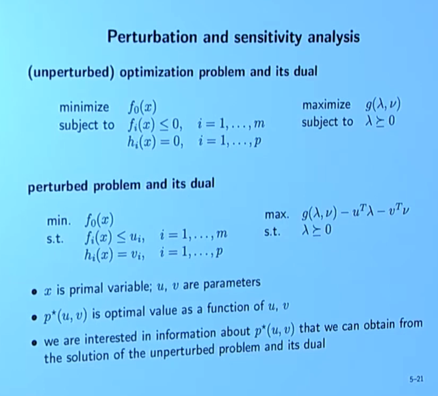</kbd>

> [!NOTE]
> Gs nói qua bài toán rất hữu dụng trong thực tế. Gọi là Perturbed
> problem. Đại khái là bài toán optimization bình thường, có thể gọi
> là unperturbed thì ta có objective function f0(x). Cũng như constraint
> fi(x) <= 0, hi(x) = 0 như đã biết. Để rồi ta sẽ xây dựng Lagrangian 
> sau đó minimize over x để có Dual function g(λ,ν) giúp ta có lower
> bound của p*, và cuối cùng ta giải bài toán Dual problem bằng cách
>  maximize g(λ,v) subject to λ ≽ 0 để có best lower bound d*.
>
> Thế thì perturbed problem đại khái là ta có thể NỚI LỎNG hoặc THẮT
> CHẶT constraint bằng cách thay fi(x) <= 0 bằng fi(x) <= ui. Để khi ui
> dương, dễ hiểu là ta đang mở rộng feasible set, giúp nới lỏng hơn
> constraint. Còn khi ui âm, ta làm cho ràng buộc khó khăn hơn. Và
> từ đó chính là thắt chặt hơn ràng buộc.
>
> Thế thì trong perturbed problem, thì Lagrangian
>
> L(x, λ, v) = f0(x) + Σ λi [fi(x)-ui] + Σ vi [hi(x)-wi]   
>
> (Trong slide là hi(x) = vi, nhưng mình dùng wi cho khỏi nhầm với "nu"
> nên equality constraint bây giờ là là hi(x) - wi = 0)
>
> ⇨ Dual function của perturbed problem (ta kí hiệu là g_u,v(λ, ν)
> để phân biệt với dual function của problem gốc g(λ, v) 
>
> g_u,v(λ, ν) = inf x L(x, λ, v) 
>
> = inf x  f0(x) + Σ λi [fi(x) - ui] + Σ νi [hi(x) - wi]
>
> = inf x  f0(x) + Σ λi fi(x) - Σ λi ui + Σ vi hi(x) - Σ viwi 
>
> = inf x  f0(x) + Σ λi fi(x) + Σ vi hi(x) - Σ λiui - Σ viwi 
>
> = inf x  f0(x) + Σ λi fi(x) + Σ vi hi(x)  - Σ λiui - Σ viwi 
>
> (λiui, viwi ko depend on x đưa ra ngoài infimum)
>
> = g(λ, ν) - Σ λiui - Σ viwi
>
> = g(λ, ν) - λTu - vTw
>
> Vậy dual function của perturb problem là: 
>
> g_u,v(λ, ν) =  g(λ, ν) - λTu - vTw
>
> Và khi ta maximize cái này ta sẽ có dual optimal của perturbed problem
>
> d* = sup g(λ, ν) - λTu - vTw
>
> CHAPTER 5 - DUALITY
>
> 5.6 PERTURBATION & SENSITIVITY
> ANALYSIS

 

<kbd>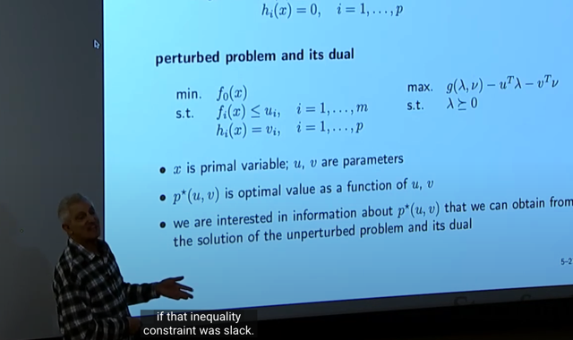</kbd>

> [!NOTE]
> Gs hỏi nếu ui dương, thì optimal value sẽ thay đổi ra sao so với
> optimal value ban đầu:
>
> Câu trả lời là nó có thể nhỏ hơn (hoặc giữ nguyên).
>
> Hiểu nôm na tại sao nó có thể NHỎ HƠN (tức là tìm được optimal
> value tốt hơn), là vì khi ta nới lỏng constraint bằng cách thay fi(x)
> <= 0 bởi fi(x) <= ui với ui dương (again, ta hiểu rằng khi làm vậy x
> có thể feasible trong phạm vi lớn hơn)
>
> Vì x: fi(x) <= ui <=> fi(x) ∈ (-inf, ui) thì RỘNG HƠN x: fi(x) <= 0
> <=> fi(x) ∈ (-inf, 0)  vì với ui dương thì khoảng (-inf, ui) RỘNG
> HƠN (-inf, 0)
>
> Nhưng nếu nó giữ nguyên, thì gs nói rằng điều đó có nghĩa là
> ràng buộc của ta đang slack, kiểu như bị chùng sẵn rồi (giống như
> ta có ràng buộc bởi sợi dây, nhưng optimal value chưa "xài hết"
> khoảng ràng buộc cho phép thành ra ràng buộc còn dư, bị chùng,
> dẫn đến khi ta nới lỏng ràng buộc thì mọi chuyện vẫn vậy, dây càng
> thêm chùng.
>
> Ngược lại, nếu ràng buộc đang căng (tight), thì nới lỏng ràng
> buộc, optimal value sẽ xa hơn (tức giảm hơn), tốt hơn ban đầu

 

<kbd></kbd>

> [!NOTE]
> Giống như ta đang giải bài toán cầm tiền đi ăn cơm sao cho no.
> Thì nếu như ta chỉ có 10k trong khi cần 50 k mới đủ no.  Thì ăn
> hết 10k vẫn thấy chưa no. Nhưng đó là hết khả năng rồi, hết tiền
> rồi. Đây minh họa cho việc ta đạt optimal trong trạng thái
> constraint đang căng (tight)
>
> Để rồi khi nới lỏng constraint thành 20k. Ta vẫn ăn được nữa,
> thêm 10k cơm nữa. Để rồi optimal better so với 10k. Nhưng
> vẫn chưa no, nhưg ko làm gì được, vì hết tiền. Constraint vẫn
> căng.
>
> Nới thêm nữa thành 100k. Thì mình ăn tới 50k cơm là no. KO ăn
> thêm được nữa. Lúc bấy giờ ta đạt optimal trong trạng thái slack
> - chùng của constraint (vì còn tiền, chẳng qua lại đạt giới hạn của
> cái bụng ăn ko nổi nữa)
>
> Khi đó nếu có tăng lên 200k, thì mọi chuyện ko đổi. Vì cũng
> chỉ cần 50k là no  Ngược lại khi ta thắt chặt. Thì cũng có hai
> khả năng. Nếu constraint đang slack, như từ 100k còn 75k thì
> ta vẫn vô tư (ý là optimal value không đổi) vì vốn dĩ vẫn chỉ cần
> 50k để ăn no. Nhưng nếu constraint đang tight, ví dụ như thắt
> chặt từ 50k còn 40k. Thì optimal sẽ phải rút lại, vì giờ ta chỉ ăn
> có 5k thôi.
>
> Và nếu thắt chặt hơn nữa thì gs cho rằng nó sẽ trở thành
> unfeasible với hình ảnh là ví dụ như từ 5k xuống còn 2k thì ko còn
> feasible nữa vì ko đủ để mua cái gì ăn cả

 

<kbd>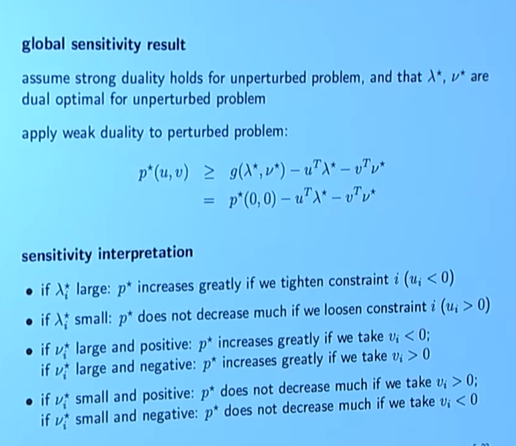</kbd>

> [!NOTE]
> Thế thì, giả sử ta đang có trạng thái Strong Duality thỏa và λ*, ν* 
> là dual optimal của bài toán gốc (unperturbed problem).
>
> Ở đây người ta kí hiệu p*(0, 0) ý là primal optimal value của bài 
> toán unperturbed (u = 0, w = 0). 
>
> Thế thì ta biết weak duality nói rằng p* ≥ d*. 
>
> Còn strong Duality thì ta có d* = p*.
>
> Tức là, khi ta giải bài toán dual problem: maximize g(λ, ν) over 
> λ, v với constraint λ ≽ 0 thì ta có d*: d* = sup λ, ν g(λ, ν)
>
> và vì ở đây nói bài toán gốc (unperturbed) có strong duality nên ta có: 
>
> d*(0,0) g(λ*, v*) = p*(0,0)  | λ* và v* là dual optimal của unperturbed problem
>
> ===
>
> Còn với pertubed problem thì chưa chắc có strong duality, nhưng luôn có
> weak duality:
>
> p*(u, v) ≥ d*(u, v) (1)
>
> Hồi nãy ta đã có dual function của perturb problem là  g(λ, ν) - λTu - vTw
>
> nên d*(u, v) = sup λ, ν g(λ, ν) - λTu - vTw
>
> = g(λ*, ν*) - λ*Tu - v*Tw (chú ý ko bằng cái này đâu nhé)
>
>
> ⇨ d*(u, v) ≥ g(λ, ν) - λTu - vTw   | theo định nghĩa của supplemum
>
> Và vì cái này áp dụng với mọi λ, v nên cũng áp dụng với
> λ*, v* là dual optimal của unperturbed problem
>
> ⇨ d*(u, v) ≥ g(λ*, ν*) - λ*Tu - v*Tw (2)
>
> (1) (2) ⇨ p*(u, v) ≥ g(λ*, ν*) - λ*Tu - v*Tw
>
> Thay d*(0,0) = g(λ*, ν*) = p*(0,0) ỡ trên vào:
>
> ⇨ d*(u, v) ≥ g(λ*, ν*) - λ*Tu - v*Tw
>
> ⇔ p*(u, v) ≥ p*(0, 0) - λ*Tu - v*Tw
>
> Thế thì dễ thấy g(λ*, ν*) chính là dual optimal value của bài toán 
> unperturbed problem: tức là d*(0,0): d*(0, 0) = g(λ*,ν*) 
>
> Và vì đang nói ta có Strong Duality nên p*(0, 0)  = d*(0, 0) 
>
> Vậy tóm lại ta có: p*(u, v) >= p*(0, 0) - λ*Tu - v*Tw

**🔗 See also:** [linked note](#node-khfilej)

 

<kbd>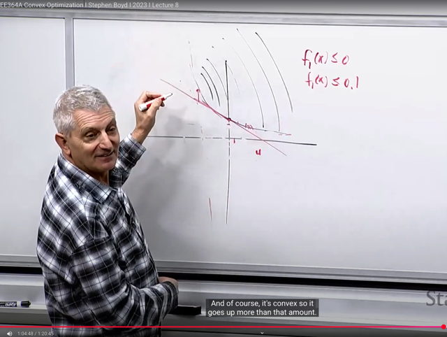</kbd>

> [!NOTE]
> Nói lại chút về cái hình này kẻo quên: Đây là ví dụ khi có một inequality constraint
> f1(x) < 0. Thì trong hệ trục này, trục vertical t là cho f0, và trục ngang u là f1.
> Xong người ta mới vẽ ra mọi điểm (f0, f1) với x lấy từ domain (f0 = f0(x), f1 = f1(x))
> Thì cái hình gạch gạch, là tập G, là mọi giá trị của (f0, f1). Dĩ nhiên ta sẽ làm việc
> trong đó thôi (bởi làm gì làm, x phải nằm trong domain trước hết để các objective và
> constraint xác định cái đã, sau đó mới tính đến x feasible, khi nó thỏa constraint và rồi
> optimal khi nó thỏa constraint và minimize objective)
>
> Thế thì với constraint f1 ≤ 0 thì ta sẽ chỉ quan tâm phần của blob G (cái tập hợp
> các điểm f0,f1 nói trên) nằm BÊN TRÁI trục tung thôi. Và sau đó ta sẽ muốn tìm điểm
> (f0, f1) sao cho f0 nhỏ nhất. Thì dễ thấy nó sẽ là cái điểm màu đỏ, giao điểm của
> trục tung và boundary của G. Đó chính là optimal value f0(x*) = p*
>
> Nói thêm chút nữa cho nhớ. Thì để giải bài toán này, trước nhất ta cũng xây dựng
> Lagrangian L = f0(x) + λf1(x). Rồi ta mới tìm Dual function:
>
> g(λ) = inf x ∈ dom L(x, λ) = inf x [f0(x) + λf1(x)]
>
> cái này tương đương = inf (t,u) ∈ G t + λu (chuyển từ theo x, sang theo u, t vì t,
> u tức f0, f1 cũng là  tính từ x)
>
> Viết lại g(λ) = inf (t, u) ∈ G t + λu)
>
> Đến đây ta đã có cái lower bound của p*:
>
> Lập luận: g(λ) = inf x L(x, λ) theo định nghĩa ⇨ g(λ) ≤ L(x, λ) ∀ x, λ.
>
> ⇨ g(λ) ≤ L(x*, λ) = f0(x*) + λf1(x*) | vì inequality ở trên áp dụng với mọi x
>
> và vế phải lại ≤ f0(x*) do λ ≥ 0, f1(x*) ≤ 0 (vì x* là primal optimal thì nó phải primal feasible)
>
> ⇨ g(λ) ≤ f0(x*) = p*
>
> Ý nghĩa của nó sẽ là với λ khác nhau thì ta có các lower bound khác nhau của p*
>
> Và đương nhiên ta muốn tìm cái lower bound "cao nhất"
>
> ====
>
> ====
>
> Nói một chút về ý nghĩa của: g(λ) = inf x ∈ dom L(x, λ) cũng là inf (t, u) ∈ G (t +
> λu).
>
> Đó chính là ta chọn một λ nào đó ví dụ λ = λ1. Khi đó L = t + λ1u coi như chỉ phụ
> thuộc t, u  (mình có thể kí hiệu là L_λ1(t, u)).
>
> Để rồi xét L(x, λ) = constant c <=> t + λ1u = c thì với c khác nhau ta có các level
> set khác nhau của L_λ1(t, u). Chúng là các đường thẳng song song với phương
> quy định bởi normal vector (1, λ1), cũng chính là gradient vector ∇L_λ1(t, u) = (∂L/∂t,
> ∂L/∂u) = (1, λ1)
>
> Khi c = 0, ta có t + λ1u = 0 là đường thẳng đi qua 0, còn với c khác nhau ta có các
> đường thẳng song song.
>
> Thế thì khi ta tìm x trong dom sao cho t + λ1u nhỏ nhất, cũng chính là tìm trong họ
> đường thẳng này, cái nào có c nhỏ nhất. Hay tương đương ta giảm c đến mức có thể
> sao cho t + λ1u = c vẫn còn tiếp xúc với G (tại vì x phải trong dom, tương đương (t, u)
> phải trong G).
>
> Thì hình ảnh là ta sẽ đẩy dần đẩy dần đường thẳng t + λ1u = c này (bằng cách thay đổi
> sao cho c nhỏ dần) theo hướng ngược với gradient (1, λ1).
>
> Thì cuối cùng nó trở thành tiếp tuyến của G (nếu chưa phải là tiếp tuyến tức là nó chưa
> phải support hyperplane của G, thì còn có thể có điểm trong G khiến t + λu nhỏ hơn)
> khi đó L_λ1(t, u) đạt giá trị nhỏ nhất = c1*. Phương trình của nó: t + λ1u = c1*
>
> Thế thì, c1* cũng chính là t tại giao điểm với trục t (cho u = 0 => t = c1*). Và theo định
> nghĩa, nó chính là g(λ1) (vì theo định nghĩa g(λ) = inf x ∈ dom f0(x) + λfi(x) = inf (t, u)
> ∈ G t + λu. Nên g(λ1) = inf (t, u) ∈ G t + λ1u
>
> Và như ở trên đã nói g(λ) với λ bất kì đều là lower bound của p*, thì với λ = λ1, kiểu như ta
> có một lower bound cụ thể:
>
> p* = f0(x*) >= f0(x*) + λ1f1(x*) = L(x*, λ1) >= inf x∈dom L(x, λ1) = g(λ1). Rút gọn p* >=
> g(λ1)
>
> (cái dấu >= thứ 2, in đậm là cái dấu dễ khó hiểu, nhưng phía trên đã giải thích rồi, xem lại)
>
> Lower bound tốt nhất phải là cái có giá trị lớn nhất, chứ -infinity cũng là lower bound
> nhưng nó vô dụng  Nên ta sẽ tìm λ khác sao cho g(λ) lớn nhất giúp có được cái lower
> bound tốt nhất.
>
> Đó chính là bài toán Dual problem: maximize g(λ) subject to λ ≽ 0 (chú ý đang ví dụ
> đơn giản nên chỉ có inequality constraint f1(x) <= 0, ko có equality constraint nên không có
> ν. Nên Dual problem ta chỉ maximize over λ. Chứ ko là phải over cả v nữa)
>
> Kết quả cho ta highest lower bound cho p*: d* = sup λ≽0 g(λ) = g(λ*)
>
> Gắn nó vào quan hệ dây chuyền ở trên:
>
> p* >= g(λ) mà d* là max của g(λ) (d* = sup λ≽0 g(λ))
>
> thì p* cũng vẫn luôn lớn hơn hoặc bằng g(λ*)
>
> p* >= d*. Đây là Weak Duality.
>
> Nếu mà bài toán là convex. Trong hình, chính là như vậy. Thì khi G là convex set, trong
> các λ khác nhau, dẫn đến các g(λ) khác nhau, thì sẽ có cái trùng với p*. Đó chính là
> Strong Duality:
>
> p* = d*
>
> Gs nói về interpretation cho cái này
>
> p*(u, v) >= p*(0, 0) - λ*Tu - v*Tw (1)
>
> Đầu tiên ông nói cái đường cong boundary chính là p*(u). Là sao?
>
> Có thể hiểu ngắn gọn vầy: Với việc thay constraint f1(x) < 0 thành
> f1(x) < u thì p* sẽ là hàm theo u, tức là có thể kí hiệu p*(u). Để
> rồi khi u tăng từ 0 -> dương, đồng nghĩa với  việc thả lỏng
> constraint do feasible set được mở rộng, vì cái trục vertical nhích
> về bên phải, thì giao điểm của nó với đường boundary này, như đã biết,
> chính là p*, sẽ nhích xuống. Do đó khiến cho ta có thể có optimal tốt
> hơn (nó sẽ không đi xuống nếu như đường cong boundary giảm dần
> độ dốc và thành ra đi ngang)
>
> Ngược lại, khi u giảm (0 -> âm) tức là giờ ràng buộc khó hơn, kiểu như
> ko chỉ là yêu cầu f1 < 0 mà còn phải bé hơn -5 chẳng  hạn => feasible
> set bị thu hẹp. Khi đó optimal value có thể sẽ giữ nguyên nếu như
> optimal đang ở trạng thái chùng. Còn khi đang ở trạng thái tight thì
> optimal chắc chắn sẽ tăng (cái đường cong gs vẽ ở screenshot sau chính
> là minh họa cho trạng thái này)

 

<kbd>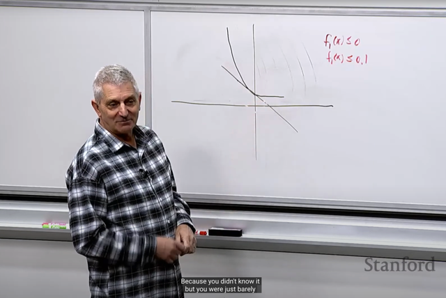</kbd>

> [!NOTE]
> đây là minh họa cho optimal ở trạng thái constraint đang chùng.
> (Ý là, cái điểm optimal ở đây, là giao điểm của boundary của G với
> trục t)
>
> Khi thả lỏng constraint bằng cách tăng u (thay fi(x) <= 0 bằng fi(x)
> <= ui với ui dương) thì hình ảnh là ta dịch trục vertical về bên phải
> và vì đường boundary không đi xuống thêm, nên optimal value
> (là giao điểm của vertical axis với boundary) ko giảm xuống thêm mà
> chỉ giữ nguyên.
>
> Nhưng nếu ta thắt chặt constraint thì có thể thấy optimal value sẽ
> tăng (kém hơn).
>
> HÌnh ảnh này giống như đang có vừa đủ 50k để ăn cơm vậy (ăn no
> cần 50k). Thì khi cho thêm tiền thì trạng thái no vẫn ko đổi. Nhưng
> nếu thắt chặt, bớt tiền, thì sẽ ko còn đủ no (trạng thái optimal nhưng
> tight)

 

<kbd>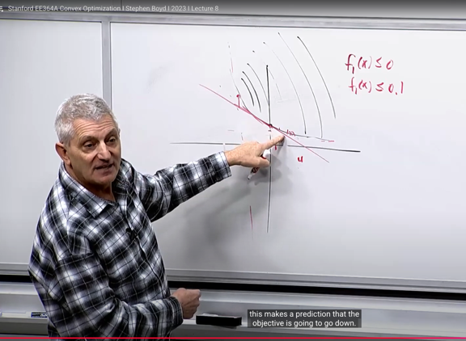</kbd>

<kbd>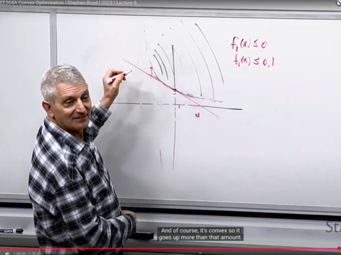</kbd>

> [!NOTE]
> Sau đoạn ôn tập vừa rồi thì ta có thể nhớ lại cái đường tuyến tính tiếp xúc với G tại
> điểm màu đỏ chính là kết qủa khi ta minimize L_λ(t, u) = t + λu:
>
> inf (t,u) ∈ G L_λ (t, u)
>
> = inf (t,u) ∈ G (t + λu) = g(λ)
>
> (L_λ (t, u) là mình tự đặt, ý là với một giá trị λ thì L chỉ là hàm theo t,u)
>
> Và đặc biệt với cái hình này, đường thẳng này chính là ứng với λ* (nói đặc biệt là
> bởi, với λ không phải optimal λ, thì t + λu sau khi minimize over t,u sẽ là tiếp tuyến với
> G nhưng tiếp điểm tại điểm khác trên phần boundary bên trái chứ không phải tại giao
> điểm của boundary với trục t - là cái mà trong trường hợp này là điểm "nằm bên trái"
> và "thấp nhất")
>
> t + λ*u = c* với c* chính là g(λ*), là d* và trong trường hợp Strong Duality
> này thì nó cũng chính là p*, là f0(x*) nốt.
>
> Vậy đường thẳng này có phương trình là t + (λ*)u = p*(0,0)
>
> =====
>
> Lúc nãy ta đã có bất đẳng thức này p*(u, v) >= p*(0, 0) - λ*Tu - v*Tw (1)
>
> Mà trong trường hợp chỉ có một constraint f1(x) < 0, thì bất đẳng thức là:
>
> p*(u, v) >= p*(0, 0) - λ*Tu (2)
>
> Gs: cái hình này thể hiện điều đó rất rõ. Điểm màu đỏ chính là p*(0, 0) (optimal) của
> bài toán gốc, unperturbed. (Ở bên trái, ứng với f1(x) <= 0 để thỏa constraint, và sau
> đó đi xuống thấp nhất có thể để minimize f0)
>
> Thế thì cái đường màu đỏ chính là thể hiện vế phải của bất đẳng thức (2)  (p*(0, 0) -
> λ*Tu): Đó là  kiểu như tiếp tuyến tại điểm màu đỏ mà ta đã chứng minh phương
> trình của nó  là t + (λ*)u = p*(0,0) <=> t = p*(0,0) - (λ*)u 
>
> Thì khi dịch trục tung về bên trái, tức cho u âm, thắt chặt thêm constraint, thì
> đường thẳng t = p*(0,0) - (λ*)u  cho ta thấy giá trị optimal sẽ tăng lên. Qủa thực khi u
> từ 0 thành âm thì t = p*(0, 0) - (λ*)u sẽ tăng lên, và đây CÓ THỂ COI NHƯ LÀ KẾT
> QUẢ ĐƯỢC DỰ BÁO BỞI ĐƯỜNG THẲNG TIẾP TUYẾN NÀY
>
> Nhưng vì bài toán là convex, nên thực tế THỰC TẾ CÓ THỂ ĐI LÊN NHIỀU HƠN
> thể hiện bởi:
>
> Optimal của perturbed problem, tức p*(u) >= p*(0,0) - λ*Tu, hay p*(u) >= t
>
> Và cái đoạn màu đỏ mũi tên đi lên chính là ý gs nói đây là chênh lệch của p*(u) và
> p*(0,0) - λ*Tu
>
> ====
>
> Ngược lại nếu ta "cho thêm tiền ăn cơm" (nới lỏng constraint, bằng việc tăng
> u từ 0 lên u dương) thì cái đường thẳng nó nói rằng: "ta sẽ dự đoán rằng optimal
> value sẽ giảm một khoảng theo đường thẳng này quy định".
>
> Nhưng như đã phân tích, có thể ko giảm được như vậy, nhưng cũng có thể hơn,
> hoặc có thể không giảm chút nào.

 

<kbd>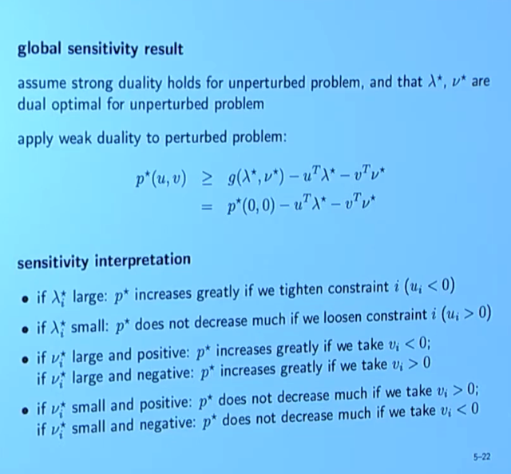</kbd>

> [!NOTE]
> Những ý sau gs cho là rất hữu ích. Đại loại là, hai trạng thái đều
> tight nhưng nếu λ lớn hơn thì mức độ tight cao hơn
>
> Nên nếu λ* lớn, tức là trạng thái đang tight nhưng tight mạnh thì khi
> thắt chặt constraint hơn (giảm u -> u âm hơn) thì chắc chắn p* sẽ 
> tăng lên mạnh.
>
> Nhưng ngược lại, nếu cũng tight, nhưng tight yếu thì nhả constraint
> chưa chắc p* giảm nhiều
>
> Giống như:
>
> Có hai  người, ứng với λ khác nhau một lớn một nhỏ.
>
> Thì khiến cho với ông ăn nhiều, cần 70 mới no, và ông ăn ít chỉ cần
> 30 đã no thì thì tại mức 20k cả hai ông đều tight. Nhưng ông 70
> tight hơn nhiều. Nên khi bóp xuông còn 10k. Thì độ đói của ông 70
> tăng vọt. Còn của ông 30 tăng lên xíu thôi.
>
> Ngược lại, từ 20->25, độ đói ông 70 giảm mạnh hơn là của ông 30.
>
> hiểu nôm na là vậy

 

<kbd>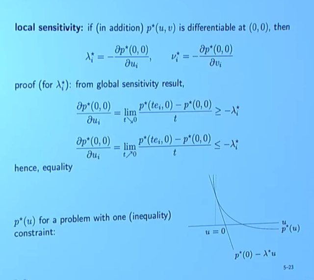</kbd>

> [!NOTE]
> Và một cái cũng dễ hiểu, đó là nếu p*(u,v) (nhớ v này là "vê", là trong
> hi(x) = vi, thể hiện constraint "mới", cũng như fi(x) <= ui, thay cho fi(x)
> <= 0) khả vi (differentiable) tại (0,0) thì
>
> λ*i chính là bằng - ∂p*(0,0)/∂ui, và ν*i = ∂p*(0,0)/∂vi
>
> Hiểu cái này như vầy: Đại khái là ta đã thấy rằng, khi tăng ui, tức là
> đồng nghĩa với thắt chặt constraint, thì p(u,v), tức optimal "mới" /
> optimal của perturbed problem sẽ có thể giảm, và -p sẽ tăng. Và rate of
> change giữa - p(ui,vi) và u chính là λi.
>
> Chưa hiểu lắm nhưng hiểu đại khái cái này đơn giản là cho biết thêm
> rằng rate of change của (-) p*(u,v) đối với ui chính là λi

 

<kbd>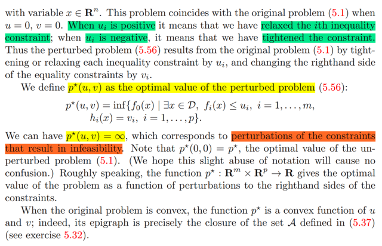</kbd>

<kbd>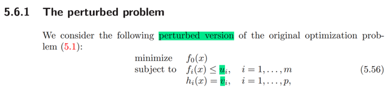</kbd>

> [!NOTE]
> CHAPTER 5 - DUALITY
>
> 5.6 PERTURBATION & SENSITIVITY
> ANALYSIS
>
> Cũng như trong bài giảng đã biết, nhưng có thể không để ý nên
> cần nhắc lại "perturbed problem" là khi ta tạo ra các problem mới
> từ problem gốc {minimize f0(x) constraint fi(x) ≤ 0, hi(x) = 0}
> bằng cách tăng hoặc giảm vế phải của các constraint. Để rồi khi 
> đó ta có các optimal value sẽ thay đổi.
>
> Nói cách khác ta coi optimal value p* của bài toán gốc như sau:
>
> p* = inf x {f0(x) | x ∈ D, fi(x) ≤ ui, hi(x) = vi và ui = vi = 0}
>
> và rồi ta gọi p*(u, v) là một hàm trả ra optimal value khi ta giải 
> bài toán với u, v khác nhau:
>
> p*(u, v) = inf x {f0(x) | x ∈ D, fi(x) ≤ ui, hi(x) = vi}
>
> Như vậy p* chính là p*(0, 0) và khi thay đổi u, v ta sẽ có các 
> optimal value khác. Thì các bài toán mà ta thay đổi u, v không
> còn cho bằng 0 nữa gọi là perturbed problem (perturbed dịch 
> là nhiễu loạn)

 

<kbd>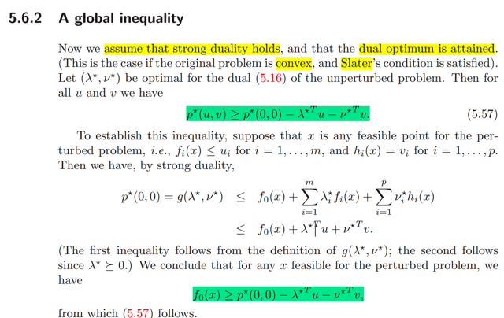</kbd>

> [!NOTE]
> Tại sao có cái bất đẳng thức này thì ta hiểu rồi
>
> Đại khái là xét p*(u, v) tức optimal value của perturbed problem. Lagrangian: L(x,
> λ, w) = f0(x) + Σi λi(fi(x) - ui) + Σi vi(hi(x) - vi)
>
> (nhắc lại ở đây dùng w là equality Lagrange multiplier cho khỏi trùng với v)
>
> g_u,v(λ, w) = inf L(x, λ, w) = inf x [f0(x) + Σi λi(fi(x) - ui) + Σi wi(hi(x) - vi)]
>
> = inf x [f0(x) + Σi λifi(x) - Σi λiui + Σi vihi(x) - Σi wivi]
>
> = inf x [f0(x) + Σi λifi(x) + Σi vihi(x) ] - Σi λiui - Σi wivi
>
> | đưa cái ko liên quan tới x ra khỏi infimum
>
> = g(λ, w) - Σi λiui - Σi wivi  | g(λ, w) là dual function của unperturbed problem
>
> Vậy g_u,v(λ, w) = g(λ, w) - Σi λiui - Σi wivi
>
> Ta sẽ giải bài toán dual: maximize λ, w g_u,v(λ, w) để tìm dual optimal value
>
> d* = g(λ*, w*) = sup λ, w g_u,v(λ, w) = sup λ, w g(λ, w) - Σi λiui - Σi wivi
>
> = sup λ, w g(λ, w) - Σi λiui - Σi wivi
>
> Tới đây mà nói cái này bằng g(λ*, w*) - Σi λ*iui - Σi w*ivi thì không chặt chẽ
>
> ====
>
> Cách làm trong sách:
>
> p*(0,0) = g(λ*, w*) Cái này là vì ta có strong duality nên f0(x*) (chính là p*(0,0) =
> g(λ*,w*)
>
> ⇔ p*(0,0) = inf x [f0(x) + Σi λ*ifi(x) + Σi w*ihi(x) ] | định nghĩa của dual function
>
> ⇨ p*(0,0) ≤ f0(x) + Σi λ*ifi(x) + Σi w*ihi(x) | định nghĩa của infimum
>
> Vì đã nói x là feasible point CỦA PERTUBED PROBLEM nên hi(x) = vi, fi(x) ≤ ui,
> λ* thì dĩ nhiên phải dual feasible rồi, λ* ≽ 0:
>
> Nên vế phải f0(x) + Σi λ*ifi(x) + Σi v*ihi(x) ≤ f0(x) + Σi λ*iui + Σi w*ivi
>
> Và từ đó ta có: p*(0,0) ≤ f0(x) + Σi λ*iui + Σi w*ivi
>
> ⇔ f0(x) ≥ p*(0,0) - Σi λ*iui - Σi w*ivi
>
> Và cái này đúng ∀ x ⇨ cũng đúng với x* của perturbed problem: 
>
> f0(x*) = p*(u, v) ≥ p*(0,0) - Σi λ*iui - Σi w*ivi

**🔗 See also:** [linked note](#node-nqqrjwj) · [linked note](./lec_9.md#node-tad98fl)

 

<kbd>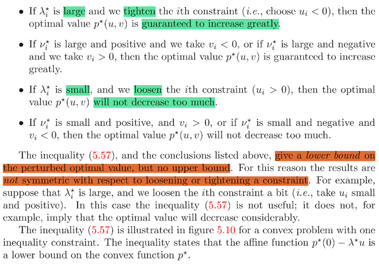</kbd>

<kbd>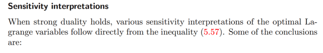</kbd>

> [!NOTE]
> Một số kết luận:
>
> Nếu λ*i lớn và ta thắt chặt (tightening) constraint bằng cách giảm ui thì
> p*(u, w) sẽ tăng lên đáng kể.
>
> Vì sao, vì như đã nói λ*i lớn hay nhỏ sẽ thể hiện mức độ tight/slack ở
> trạng thái optimal ban đầu. Để rồi nôm na là nếu p*(0,0) ở trạng thái đang
> rất căng (tight) thì lúc này nếu thắt chặt hơn constraint, thì optimal value
> sẽ tăng vọt. HÌnh ảnh là độ dốc của đường cong set G tại điểm cắt với
> trục t đang rất dốc (và độ dốc đó quả thật  chính là λi) thì khi dời trục qua
> bên trái (hay dời set G qua bên phải) thì điểm p* CHẮC CHẮN sẽ chạy lên
> rất nhanh. Ngược lại, nếu dời trục t qua bên  phải, nới lỏng constraint thì
> p* CÓ THỂ cũng sẽ giảm xuống rất nhanh (hình 1), nhưng KHÔNG CHẮC
> CHẮN, mà có thể nó không giảm nhanh (hình 2)
>
> Ngược lại, nếu λ*i nhỏ, tức là đường cong tại điểm cắt với trục t có độ dốc
> nhỏ, thì p*(0, 0) đang ở trạng thái tight nhưng không tight lắm thì khi dời
> trục qua bên phải để nới lỏng constraint thì p* sẽ CHẮC CHẮN  giảm
> không bao nhiêu (hình 3)
>
> Nhưngn ngược lại thắt chặt thì KHÔNG CHẮC LÀ p* chỉ tăng chậm (hình
> 4)
>
> Hai trường hợp liên quan đến v* cũng tương tự chỉ là phải xét dấu của v
> (vì với v ("nu") thì không có yều cầu ≥ 0)
>
> Lí do của việc CHẮC CHẮN HAY KHÔNG CHẮC Ở TRÊN là do bất đẳng
> thức p*(u, v) ≥ p*(0, 0) - λ*Tu - w*Tv (dùng w thay cho "nu") CHỈ QUY
> ĐỊNH CÁI CHẶN DƯỚI CỦA p*(u,v)
>
> Có nghĩa là, nó chỉ nói rằng "p*(u,v) sẽ lớn hơn hoặc bằng mức nào đó"
>
> Thế thì, nếu tăng cái chặn dưới đó lên, thì ta có thể suy ra p*(u,v) chắc
> chắn phải tăng theo.
>
> Nhưng ngược lại, giảm cái chặn dưới đó xuống thì chưa chắc p*(u,v) sẽ
> giảm.
>
> Do đó trong sách nói về tính bất đối xứng của việc thắt chặt hay nới lỏng
> constraint

 

<kbd>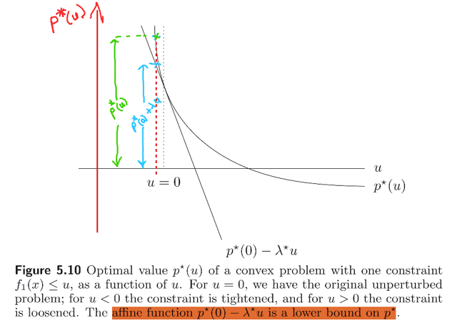</kbd>

<kbd>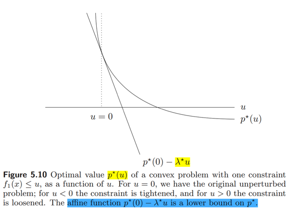</kbd>

<kbd></kbd>

> [!NOTE]
> Hình ảnh này phù hợp để mô ta trạng thái constraint đang tight. Ta
> thấy độ dốc của đường cong (hay tiếp tuyến cũng được) tại điểm
> optimal  (giao điểm với trục t) đang rất lớn, nên khi dời trục qua
> trái, thì giá trị của t, tức p* sẽ chạy lên rất nhanh (và ngược lại, khi
> nới lỏng thì nó cũng chạy xuống rất nhanh)
>
> Cùng trong hình ảnh này thể hiện p*(u) là hàm theo u. Quả thật giá
> trị của p* là "độ cao" của giao điểm giữa đường cong và trục t. Nên
> khi dịch trục t qua trái hay phải, ứng với cho u giảm xuống (thành
> âm) hay tăng lên thành dương sẽ khiến điểm giao này chạy lên
> hay xuống - tương ứng với p*(u)
>
> Constraint đang chùng (slack) hoặc không căng lắm (slightly
> tight) thì khi nới lỏng constraint thì chưa chắc p* giảm hoặc có
> giảm thì cũng ko nhiều
>
> hình ảnh này thể hiện cái bất đẳng thức vừa rồi: p*(u) ≥ p*(0) + λ*u
>
> ý nghĩa của nó là với mọi u thì giá trị của p*(u) đều từ p*(0) + λ*u trở
> lên, hay hình ảnh là đường cong đồ thị của p*(u) luôn nằm trên đường
> thẳng f(u) = p*(0) + λ*u
>
> Xét hàm số f(u) = p*(0) + λ*u, làm affine function của λ*, dĩ nhiên d/dui f(u)
> = λ (nếu λ là vector thì ta có ∂/∂ui = λ*i.
>
> Nên nhớ ta không biết function p* có dạng cụ thể là gì mà chỉ biết là với
> u, khi giải bài toán perturbed problem thì ta có p*(u).
>
> Vậy thì hàm số f(u) tiếp tuyến với p*(u) tại u = 0. Nên tại u = 0 độ dốc của
> p*(u) bằng với độ dốc hàm f(u). Nên:
>
> d/du p*(u) = d/du f(u) = λ*
>
> Tại sao nói f(u) tiếp tuyến với p*(u) tại u = 0? Là vì tại 0 f(0) = p*(0) còn
> lại thì p*(u) luôn > f(u) ⇨ f(u) tiếp xúc với p*(u) chỉ tại một điểm u = 0

 

<kbd>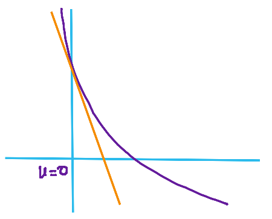</kbd>

<kbd>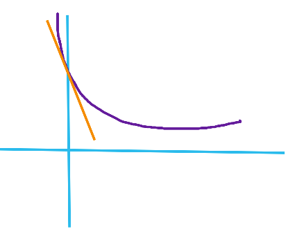</kbd>

> [!NOTE]
> 1) (trị tuyệt đối) λ đang lớn, mà thắt chặt (giảm u từ 0 ->
> âm) thì chắc chắn p*(u, v) sẽ tăng vọt. Hình ảnh cho thấy
> như vậy. Vì với λ lớn, đường màu cam rất dốc, thì độ dốc
> của đường màu tím (p(u,v)) chỉ có thể còn dốc hơn nữa,
> nên đi về phía trái thì chắc chắn p sẽ tăng vọt.
>
> Cái này giải thích theo toán học:
>
> p*(u, v) ≥ p*(0,0) - λ*u - v*v. Với λ* dương lớn mà cho u từ
> 0 -> âm thì -λ*u sẽ dương và do đó vì cái bất đẳng thức
> này thể hiện một cái chặn dưới của p*(u, v) nên cái chặn
> này đã nâng lên ⇨ p* chắc chắn phải tăng
>
> Ngược lại trong trường hợp này nếu nới lỏng thì p* sẽ 
> giảm mạnh NHƯNG KHÔNG PHẢI LÚC NÀO CŨNG VẬY
> VÍ DỤ DƯỚI SẼ THẤY
>
> 2) (trị tuyệt đối) λ đang lớn, mà nới lỏng (tăng u từ 0 ->
> dương) thì CHƯA CHẮC p*(u, v) sẽ tăng vọt. 
>
> Hình ảnh cho thấy
> như vậy. Vì với λ lớn, đường màu cam rất dốc, thì độ dốc
> của đường màu tím (p(u,v)) chỉ có thể còn dốc hơn nữa,
> NẾU LÀ ĐI VỀ PHÍA TRÁI, CÒN ĐI VỀ PHÍA PHẢI THÌ
> CHƯA CHẮC HÀM GIẢM MẠNH.
>
> Cái này giải thích theo toán học là bởi cái
>
> p*(u, v) ≥ p*(0,0) - λ*u - v*v. Với λ* dương lớn mà cho u từ
> 0 -> dương thì -λ*u sẽ âm cái giới hạn dưới của p*(u, v)
> được hạ xuống, nhưng việc hạ giới hạn dưới không
> đảm bảo là p* sẽ hạ
>
> HÌNH 1
>
> HÌNH 2

 

<kbd>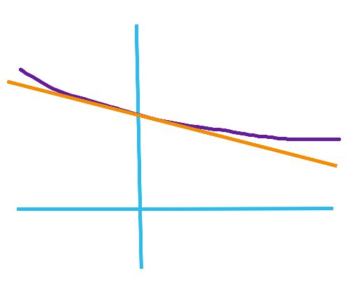</kbd>

<kbd>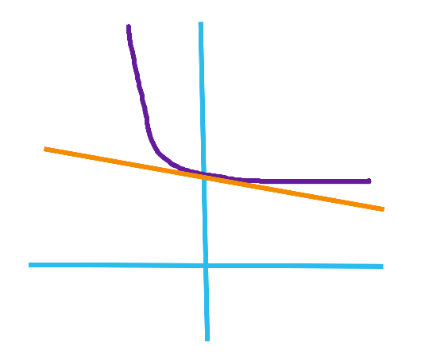</kbd>

> [!NOTE]
> Tương tự, khi λ* đang nhỏ, thì đi qua phía phải (nới lỏng)
> sẽ ĐẢM BẢO p* KHÔNG GIẢM QUÁ NHANH, vì độ dốc
> của đường màu tím sẽ ko thể dốc hơn đường màu cam
> khi đi về phía phải.
>
> Nhưng nếu λ* nhỏ mà thắt chặt, đi về phía trái thì
> không đảm bảo p* sẽ chỉ tăng chậm mà nó hoàn
> toàn có thể tăng vọt
>
> HÌNH 3
>
> HÌNH 4

 

<kbd>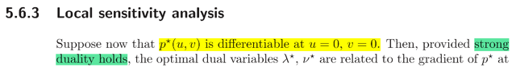</kbd>

<kbd>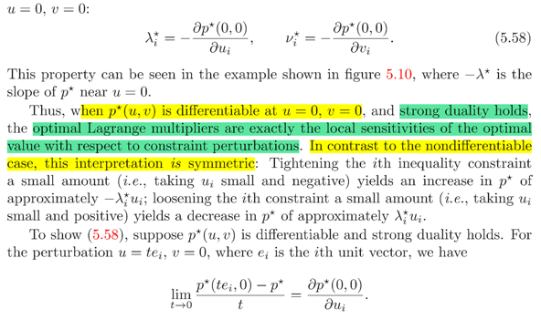</kbd>

<kbd>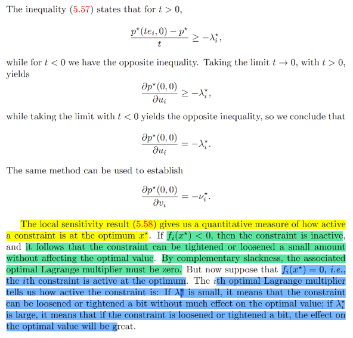</kbd>

> [!NOTE]
> Đại khái là:
>
> Bất đẳng thức 5.57 rằng p*(u, v) ≥ p*(0, 0) - λ*Tu - v*Tv
>
> Áp dụng với v = 0 và u = t ei
>
> p*(u, 0) ≥ p*(0, 0) - λ*Tu - v*T0
>
> ⇔ p*(u, 0) ≥ p*(0, 0) - λ*Tu 
>
> ⇔ p*(u, 0) ≥ p*(0, 0) - Σi λ*iui
>
> Xét u = u1 + u2 + ...+ui +... = 0e1 + 0e2 + ...tei + ... với t dương
>
> Bây giờ đang xét u = t ei có nghĩa là trừ component thứ i 
> của u là bằng t, còn lại đều bằng 0 hết. Nên λ*Tu = λ*i ui = λ*i t
>
> ⇔ p*(tei, 0) ≥ p*(0, 0) - λ*it
>
> ⇔ p*(tei, 0) - p*(0, 0) ≥ - λ*it (1)
>
> ⇔ [p*(tei, 0) - p*(0, 0)] / t ≥ - λ*i
>
> Do đó lấy lim t → 0 [p*(tei, 0) - p*(0, 0)] / t
>
> ([p*(tei, 0) - p*(0, 0)] / t đây chính là difference quotient)
>
> Đây chính là định nghĩa của partial derivative của p*(u, v)
> đối với ui evaluate tại ui = 0
>
> Do đó ta có ∂p*(0,0)/∂ui ≥ - λ*i
>
> Ngược lại nếu t âm thì từ (1) chia hai vế cho t sẽ đổi dấu
> giúp ta có:
>
> [p*(tei, 0) - p*(0, 0)] / t ≤ - λ*i
>
> Lấy limit t → 0 hai vế ta có:
>
> ∂p*(0,0)/∂ui ≤ - λ*i
>
> Từ đó suy ra ∂p*(0,0)/∂ui = - λ*i
>
> Cái này giúp mình hiểu hơn về một thứ có lẽ ít để ý:
>
> Câu hỏi là d/dx f(a) là gì? Cách hiểu sai bét đó là lấy function f(x) rồi tính giá trị
> của nó tại a, để được kết quả, xong lấy đạo hàm theo x.
>
> Đó là cách hiểu ngu ngốc. Cách hiểu đúng phải là d/dx f bản chất là  một hàm số,
> mà ý nghĩa của nó là nó đo mức độ biến thiên của hàm f theo x. Nói rõ hơn nếu
> f(x) là hàm số đo một đại lượng nào đó ví dụ như vận tốc của cái xe theo thời
> gian x để tại thời điểm x0 nào đó thì f(x0) cho ta biết vận tốc cái xe.
>
> Thì f'(x), hay d/dx f(x) là một hàm số khác, đo tốc độ biến thiên của hàm f(x) tại
> các điểm x khác nhau là nhanh hay chậm thế nào, nói cách khác tại x0, f'(x0) nó
> cho ta biết là độ biến thiên của vận tốc là như thế nào. Để rồi f(x) có thể là = 100,
> cho thấy cái xe đang chạy rất nhanh. Nhưng f'(x) vẫn chỉ bằng -10, cho thấy cái
> xe đang chậm lại.
>
> Thế thì d/dx f(a) chính là apply / evaluate function d/dx f(x) tại a, hay f'(a)
>
> Và định nghĩa của đạo hàm mà ta đã học ở 1801 là:
>
> f'(x), again, hiểu nó là function f', evaluate tại x, đó là:
>
> limit δx → 0 [f(x + δx) - f(x)] / δx
>
> ý nghĩa của nó, là đứng tại x, thay đổi một chút xíu thành x + δx, khiến f từ f(x)
> thay đổi thành f(x + δx). Thì cái tỉ lệ [f(x + δx) - f(x)] / δx gọi là different quotient,
> và khi ta chỉ xét cái tỉ lẹ này ở δx vô cùng nhỏ thì nó chính là giá trị của đạo hàm
> TẠI x: f(x)
>
> Tương tự, d/dx f(a) sẽ là lim δx → 0 f(a + δx) - f(a) / δx. là gía trị đạo hàm tại a.
>
> ====
>
> Vậy giờ xét qua đa biến. HÌnh dùng hàm f là hàm đa biến, nó evaluate giá trị của
> đại lượng nào đó tại một điểm x trong khong gian đa chiều Rn
>
> Vậy thì nó là hàm có nhiều biến x1, x2....xn
>
> Để rồi nếu tại điểm ban đầu x, ta thay đổi x1 một chút: x1 + δx, mấy cái còn lại
> giữ nguyên. Để f thay đổi từ f(x) thành f([x1 + δx, x2, ....])
>
> Thì khi ta chỉ xét sự thay đổi ở vô cùng nhỏ:
>
> lim δx → 0 [f([x1 + δx, x2, ....] - f(x)] / δx
>
> Thì đây chính là ĐẠO HÀM TỪNG PHẦN CỦA F THEO X1 EVALUATE TẠI X
>
> ∂/∂x1 f(x).
>
> Và hoàn toàn phải hiểu rằng bản thân nó ∂/∂x1 f(x), là một hàm số, theo x.
>
> Để rồi ∂/∂x1 f(a), sẽ chính là đứng từ a, thay đổi 1 chút theo hướng x1:
>
> [a1, a2,....an] → [a1 + t, a2, ...an] và xét different quotion tại limit:
>
> lim t → 0 [f([a1 + t, x2, ....] - f(a)] / δt thì nó chính là ∂/∂x1 f(a)
>
> Vậy thì từ [a1, a2,....an] thay đổi xíu thành [a1 + t, a2, ...an] thể hiện như thế nào:
>
> Đó chính là a → a + t e1 vì e1 là unit vector = [1, 0, ....0]
>
> Rồi thế thì, nếu a chọn là 0 thì sao, thì ta sẽ có từ [0, 0...0] → [0, 0,...0] + te1
>
> hay chính là te1.
>
> Do đó: Quay lại đây ta xét hàm p*(u, v).
>
> Thì hoàn toàn tương tự, đứng tại 0,0 (giống như a = 0), ta thay đổi chút xíu theo
> phương u1:
>
> để từ điểm [0, 0, ...0, | 0, 0, ...0] thành [0, 0, ...0, | 0, 0, ...0] + t e1 cũng là t e1
>
> thì different quotient là p*(te1, 0) - p*(0, 0)
>
> Và theo định nghĩa lim t → 0 [p*(te1, 0) - p*(0, 0)] / t CHÍNH LÀ ĐẠO HÀM TỪNG
> PHẦN CỦA p* THEO u1 EVALUATE TẠI a. KÍ HIÊU LÀ:
>
> ∂/∂u1 p*(0,0)  | y như ∂/∂x1 f(a) vậy  =====
>
> Và ý nghĩa của cái này chính là:
>
> - λ*i chính là local sensitivity, ý là, rate of change của hàm p*(u, v) đối với ui tại (0,
> 0). Và nó cho ta thấy rằng: TỪ 0,0 (TỨC LÀ TA ĐANG Ở BÀI TOÁN GỐC /
> UNPERTURBED PROBLEM mà tại đó ta có optimal value là p*(0, 0) NẾU TA
> NỚI LỎNG HAY THẮT CHẶT CONSTRAINT THỨ I: cho ui dương nhỏ (nới lỏng)
> hay âm nhỏ (thắt chặt) thì NHÌN VÀO GIÁ TRỊ CỦA λ*i (tức optimal dual variable
> hay Lagrange multipler) TA CÓ THỂ ĐOÁN ĐƯỢC LÀ GIÁ TRỊ CỦA p* (p*(u,v)
> SẼ TĂNG GIẢM NHIỀU HAY ÍT.
>
> Cụ thể là nếu λ*i đang dương (khi đó dĩ nhiên fi(x*) phải bằng 0, theo
> complementary slackness, đã biết rồi), tức là constraint đang căng. Thì nếu λ*i
> nhỏ, thì ta nới lỏng hay thắt chặt thì cũng chỉ thay đổi p* chút đỉnh.
>
> Ngược lại λ*i mà lớn, thì nới lỏng hay thắt chặt sẽ thay đổi p* rất nhanh.
>
> Còn khi λ* = 0 thì dĩ nhiên fi(x*) < 0 (theo c.slacness) mà nư vậy thì có nghĩa là
> đang ở trạng thái chùng, nói lỏng hay thắt chặt constraitn cũng ko tác động gì

 

<kbd></kbd>

> [!NOTE]
> Tiếp gs nói đại khái là ta đã biết về equivalent problem, là cái mà
> khi solve nó sẽ cho phép ta solve original problem.
>
> Thế thì ông nói những gì CSYV làm đó là ta có original problem,
> nó sẽ tạo equivalent problem 1, rồi tạo e.problem 2....cứ thế.
> cho đến khi ta có một equivalent problem mà solver có thể
> solve được

 

<kbd>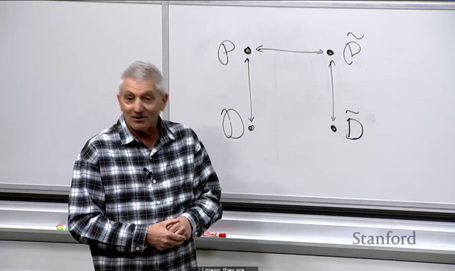</kbd>

> [!NOTE]
> Cái này gs nói giả sử ta có problem P, và equivalent problem P~ (có
> thể là thêm / bớt constraint gì đó)
>
> Từ P ta có Lagrange Dual D, và từ P~ ta có Lagrange Dual D~
>
> (Lagrange Dual có lẽ gs ý nói Lagrange function và Dual problem)
>
> Thế thì P <-> P~ (có thể gọi là closely intimate) vì chúng equivalent,
> và P <-> D, và P~ <-> D~.
>
> Thì câu hỏi là D và D~ có quan hệ gì không. Đây sẽ là nội dung của
> bài sau

 

<kbd>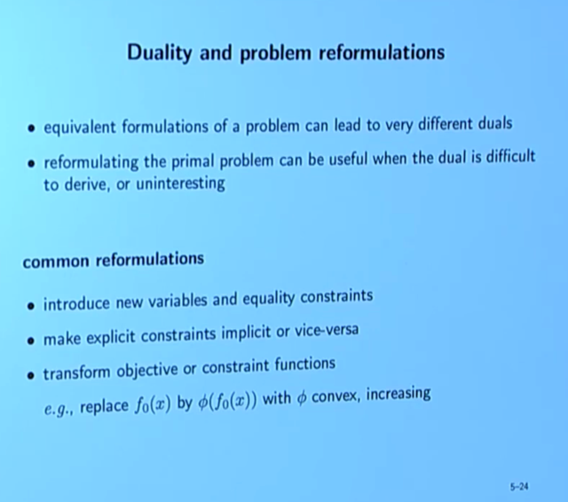</kbd>

 

