# Lec 9

📊 **Progress:** `48` Notes | `64` Screenshots

---

## Lec 9

 

<kbd></kbd>

> [!NOTE]
> GS Có vài dặn dò về Homework.
>
> Và đại ý là ta sẽ kết thúc phần Lí thuyết và chuyển sang
> phần Thực hành

 

<kbd>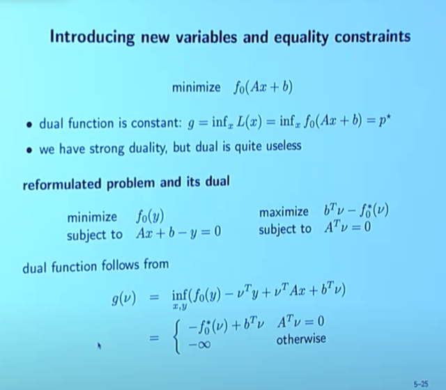</kbd>

> [!NOTE]
> Đại khái là ở đây ta có bài toán optimization nhưng ko có constraint: Chỉ có objective
> là minimize f0(Ax+b).
>
> Thế thì vì ko có constraint, nên Lagrangian dĩ nhiên chỉ có objective:
>
> L(x) = f0(Ax + b) 
>
> và việc minimize over x sẽ cho ra ngay p* thay vì dual function g(λ, ν). Hay nói cách 
> khác dual function là constant function.
>
> Và cũng dễ hiểu ta cũng có strong duality, tức d* = p* nhưng cơ bản là ko có tác dụng
> gì.
>
> Thế thì ta sẽ thay thế bài toán gốc này, bằng cách cho y = Ax + b. Từ đó bài toán
> tương đương là minimize f0(y) với equality constraint là y = Ax + b <=> Ax + b - y = 0
>
> Để rồi sau đó ta sẽ thể hiện nó bằng conjugate of function. 
>
> Thế thì ta có thể nhớ lại về conjugate function như này:
>
> f*(y) = sup x ∈ dom f (yTx - f(x)), tức là theo định nghĩa, maximize hàm yTx - f(x) over
> x, ta sẽ được hàm theo y là conjugate function của f(x): f*(y).
>
> Vậy thì, với f0(y), thì theo định nghĩa trên conjugate function của nó sẽ là 
>
> f*0(v) = sup y ∈ dom vTy - f0(y)
>
> Quay lại đây, ta có Lagrangian của equivalent problem là:
>
> L(y) = f0(y) + νT(Ax + b - y) = f0(y) + vTAx + vTb - vTy
>
> = f0(y) + vTAx - vTy + vTb
>
> Dual function g(v) = inf x, y f0(y) + vTAx - vTy + vTb
>
> = inf x, y f0(y) + vTAx - vTy + vTb
>
> Thế thì ta sẽ infimum over x trước.
>
> = inf x f0(y) + vTAx - vTy + vTb = inf x vTAx + f0(y) - vTy + vTb
>
> Ta sẽ nhận xét đây (vTAx + f0(y) - vTy + vTb) cơ bản là affine function của x, thì như 
> bài trước ta đã biết với function pTx + q, thì inf x pTx + q sẽ bằng -infinity, trừ khi p = 0 
> thì infimum = q (khi p = 0 thì ta có hàm constant, = q, đường thẳng nằm ngang, nên nhỏ 
> nhất của nó cũng = q. 
>
> Còn khi p khác 0 thì kiểu gì ta cũng có đường thẳng "xéo lên hoặc xuống" thì cũng đều 
> có giá trị kéo dài về -infinity ở đầu này hoặc kia
>
> Và dĩ nhiên ta muốn có infimum xác định, để có lower bound nào  đó chứ lower bound bằng 
> -infinity thì vô dụng (Đây chính là Dual Feasible (theo link))
>
> inf x vTAx + f0(y) - vTy + vTb 
>
> = f0(y) - vTy + vTb khi vTA = 0 (hay ATv = 0 cũng dc, đây chính là kiểu như constraint để 
> dual problem feasible, tức là giúp g(λ, v) > -infinity)
>
> Tiếp ta sẽ infimum over y:
>
> inf y f0(y) - vTy + vTb = inf y f0(y) - vTy + vTb
>
> Thế thì cái inf y f0(y) - vTy sẽ tương đương - sup y - f0(y) + vTy  
>
> (giống như minimize f sẽ bằng với maximize -f
>
> Và như lúc trên đã ôn lại, sup y vTy - f0(y) chính là cái gọi là CONJUGATE function 
> của f0(y). Kí hiệu là f0*(v)
>
> sup y vTy - f0(y) = f0*(v)
>
> Do đó:
>
> inf y f0(y) - vTy + vTb = - sup y vTy - f0(y) + vTb = - f0*(v) + vTb = - f0*(v) + bTv
>
> Nói thêm ở cái vụ infimum over x, rồi over y. Thì đơn giản thôi, ta chỉ là "làm" theo x rồi
> sau đó làm theo y: Vì cơ bản là tìm x, y sao cho hàm có giá trị nhỏ nhất.
>
> Hay g(v) = inf x,y L(x, y, v) = inf y inf x L(x, y, v)
>
> = inf y inf x vTAx + f0(y) - vTy + vTb
>
> = inf y f0(y) - vTy + vTb, khi ATv = 0 (và = inf y -infinity khi ATv khác 0)
>
> = inf y f0(y) - vTy + vTb, khi ATv = 0 (và = inf y -infinity khi ATv khác 0)
>
> = - sup y - f0(y) + vTy + vTb, khi ATv = 0 (và = inf y -infinity khi ATv khác 0)
>
> = - f0*(v) + bTv, khi ATv = 0 
>
> (và = inf y -infinity = -infinity khi ATv khác 0)

**🔗 See also:** [linked note](./lec_7.md#node-agqew85) · [linked note](./lec_8_a.md#node-3hxz63z)

 

<kbd>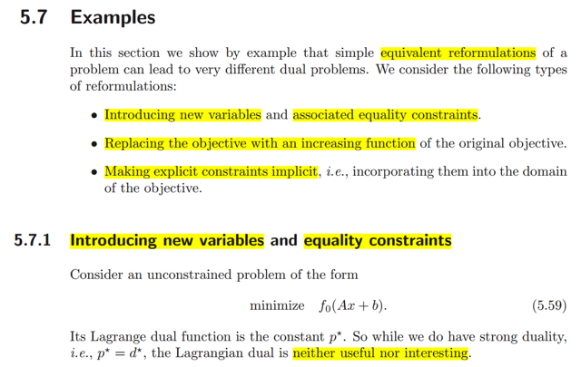</kbd>

<kbd>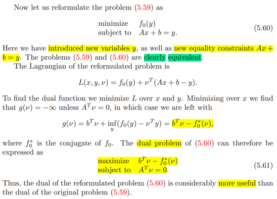</kbd>

> [!NOTE]
> đại khái là cái này nằm trong nội dung liên quan đến đại khái là ta
> thay đổi bài toán để có dual problem khác.
>
> Thì phần đầu tiên đại khái là thêm equality constraints.
>
> Bài toán làm ví dụ là bài toán unconstraint, tức chỉ có objective
> f0(Ax+b) thì dĩ nhiên do đó Lagrangian cũng chỉ có objective, mà
> như vậy khi tạo Dual function thì nó ra constant. và constant này
> cũng đồng thời là p* và d* luôn.
>
> Thế thì gs mới nói là làm vậy thì không ích lợi lắm (chưa hiểu chỗ
> này) cho nên thay vì vậy, ta sẽ đặt variable mới y = Ax + b, và tạo
> ta bài toán tương đương là minimize f0(y) với equality constraint y
> = Ax + b
>
> Thì khi đó triển khai tiếp như thế nào thì ta đã biết rồi, nhưng ý
> chính là dual problem của bài toán equivalent tỏ ra hữu ích hơn
>
> Còn tại sao lại vậy thì xét ví dụ sau mới hiểu nhưng theo gpt đại
> khái là khi có dual function (khác constant) thì ta mới phân tích
> được các tính chất sensitivity này kia.
>
> 5.7 EXAMPLES
>
> 5.7.1 INTRODUCING NEW VARIABLES 
> & EQUALITY CONSTRAINTS

 

<kbd>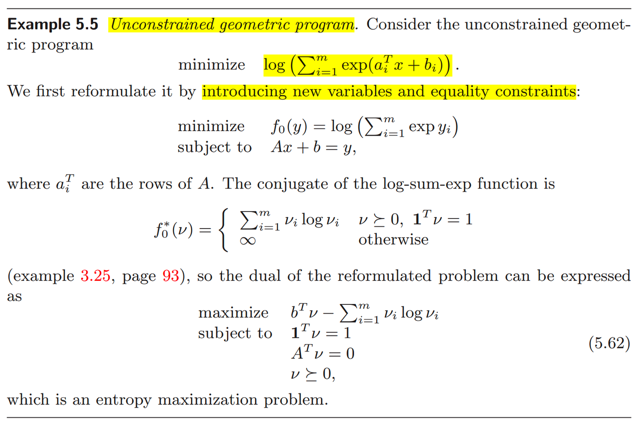</kbd>

> [!NOTE]
> Rồi, qua ví dụ này, thì đây là unconstraint problem với f0(x) là
> log sum exp: log Σ e^(aiTx + bi)
>
> Thì ta sẽ đặt yi = aiTx + bi và đưa bài toán thành minimize log Σ
> e^i  = log (1Te^y) với (new introduced constraint: yi = aiTx + bi,
> <=> Ax + b = y với A là matrix các row là ai)
>
> Thế thì ta sẽ tìm Lagrangian:
>
> L(y, v) = f0(y) + vTh(y) = log(1Te^y) + vT(Ax + b - y) 
>
> = log(1Te^y) + vTAx + vTb - vTy
>
> Dual function: g(v) = inf x,y  log(1Te^y) + vTAx + vTb - vTy 
>
> *Minimize over x trước: Thì với y fixed, L là affine function theo x
> (có dạng pTx + q, nó sẽ nhỏ vô hạn trừ khi q = 0) nên:
>
> g(v, y) = inf x  log(1Te^y) + vTAx + vTb - vTy  =
>
> a) log(1Te^y) + vTb - vTy nếu vTA = 0
>
> b) -infinity nếu otherwise
>
> *Minimize over y: 
>
> g(v) = inf y  log(1Te^y) + vTb - vTy  subject to vTA = 0
>
> = - sup y  - log(1Te^y) + vTy  + vTb  
>
> = - sup y   vTy - log(1Te^y)  + vTb   
>
> Theo định nghĩa conjugate function của f(x): 
>
> f*(y) = sup y ∈ dom f yTx - f(x)
>
> => sup y  vTy - log(1Te^y)  = sup x  vTy - f0(y)   chính là f*0(v)
>
> - conjugate function của log-sum-exp.
>
> => g(v) = - f*0(v) + vTb 
>
> Và ta đã tự làm để biết nếu conjugate function của log-Σ-exp f(x)
> là f*(y) = yTlog(y) nếu y ≻ 0 và 1Ty = 1
>
> Thì áp dụng ở đây, f*0(v) = vTlog(v) khi v ≻ 0 và 1Tv = 1
>
> Vậy g(v) = - vTlog(v) + vTb khi vTA = 0, v ≻ 0 và 1Tv = 1
>
> Do đó bài toán Dual Problem là:
>
> maximize g(v) = vTb - vTlog(v) = bTv - Σvi log(vi) 
> subject to vTA = 0, v ≻ 0 và 1Tv = 1

 

<kbd>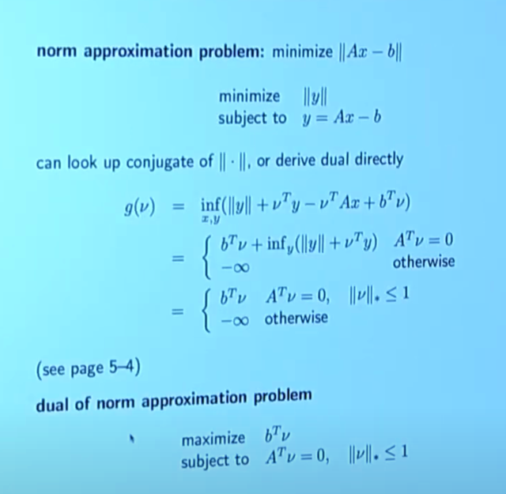</kbd>

> [!NOTE]
> Rồi, ta qua một ví dụ nữa, norm approximation problem:
>
> minimize ||Ax-b||.
>
> Thế thì, đây cũng là một cái ko có constraint nữa thì ta sẽ chuyển thành bài
> toán tương đương là minimize ||y|| với constraint y = Ax - b
>
> Lagrangian L(y, x, v) = ||y|| + vT(y - Ax + b) = ||y|| + vTy - vTAx + vTb
>
> Dual function g(v) = inf x,y ||y|| + vTy - vTAx + vTb
>
> = inf y inf x ||y|| + vTy - vTAx + vTb    |   ý là minimize over x trước
>
> Xét inf x ||y|| + vTy - vTAx + vTb
>
> = inf x  - vTAx + ||y|| + vTy  + vTb again, với x thì đây là infimum  affine
> function của x, nên nó sẽ bằng:
>
> = ||y|| + vTy  + vTb khi - vTA = 0 <=> ATv = 0, và bằng -infinity
> otherwise
>
> => g(v) = inf y ||y|| + vTy  + vTb khi ATv = 0, và bằng -infinity otherwise
>
> = inf y ||y|| + vTy + vTb khi ATv = 0, và bằng -infinity otherwise (1)
>
> Tới đây xét inf y ||y|| + vTy
>
> Ta sẽ nhớ lại khái niệm Dual norm: ||v||* = sup u:||u||<=1 uTv hay
>
> sup y:||y||<=1 yTv
>
> Ý nghĩa là: dual norm của norm (norm kí hiệu là ||.||, dual norm của l2 norm
> kí hiệu là ||.||*) là vầy: Ta sẽ tìm vector y có norm <= 1 sao cho maximize
> yTv, thì khi đó y*Tv là dual norm của v: ||v||*
>
> Thế thì, nếu ta sẽ xét hai trường hợp:
>
> 1) ||v||* <= 1, theo định nghĩa của dual norm, điều này sẽ có nghĩa là
> yTv <= 1 với mọi vector y có norm <= 1:
>
> yTv <= 1 với mọi y: ||y|| <= 1 
>
> Và điều này cũng tương đương (y/||y||)Tv <= 0 với mọi y (vì y/||y|| sẽ có
> norm = 1)
>
> <=> vTy/||y|| <= 1 <=> vTy <= ||y|| <=> ||y|| - vTy >= 0 (với mọi y)
>
> Vậy inf y ||y|| - vTy = 0 nếu ||v||* <= 1
>
> Do đó quay lại (1): g(v) = vTb (cũng là bTv) khi ATv = 0 và ||v||* <= 1
>
> Ngược lại nếu ko thỏa hai điều kiện trên thì g(v) = -infinity  
>
> ====
>
> Và dual problem của bài toán norm approximation sẽ là:
>
> maximize bTv subject to ATv = 0 và ||v||* <= 1

 

<kbd>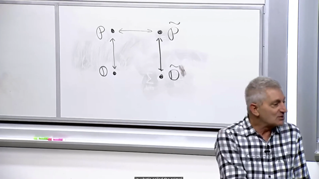</kbd>

> [!NOTE]
> Thế thì đại khái gs cho rằng tới đây ta có thể trông thấy một quy
> luật rằng: Khi xuất hiện function trong PRIMAL (original) problem
> thì ta sẽ kì vọng rằng sẽ xuất hiện CONJUGATE của function đó
> trong DUAL PROBLEM
>
> Thành ra ví dụ ta có hàm KL Divergence thì dual sẽ xuất hiện
> log exponential

 

<kbd>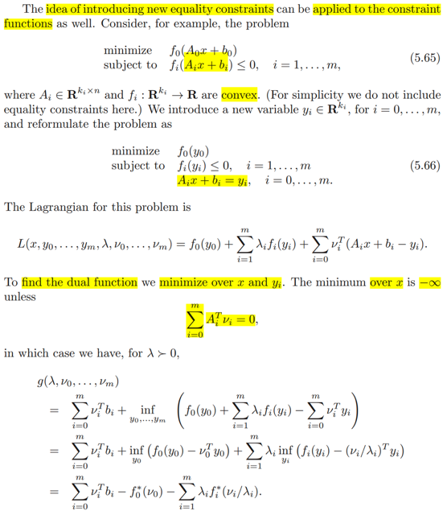</kbd>

<kbd>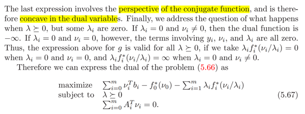</kbd>

> [!NOTE]
> Đại khái là ý tưởng của việc thêm variable và equality constraints (để khiến
> bài toán trở nên hữu ích hơn - vẫn chưa hiểu lợi ích hơn chỗ nào, nhưng tạm
> biết vậy) có thể áp dụng đối với inequality constraints. Ví dụ như nếu
> inequality constraint có dạng fi(Aix + bi) <= 0 thì ta có thể introduce yi = Aix +
> bi, để inequality constraint trở thành fi(yi) <= 0 và thêm một equality constraint
> Aix + bi - yi = 0
>
> Như trong bài toán ở đây, objective là f0(A0x + b0) và các inequality
> constraint fi(Aix + bi) <= 0. Sẽ trở thành objective f0(y0) và inequality
> constraint: fi(yi) <= 0, và xuất hiện thêm các equality constraint: Ajx + bj - yj =
> 0 với j = 0,1,2....
>
> Thế thì Lagrangian sẽ là L(x, y0, y1,....ym, λ1, λ2...λm, v0, v1,.. vm) (trong
> sách ghi λ nhưng nó là vector [λ1, ...λm] vì ta có m inequality constraint
>
> L = f0(y0) + Σi=1:m λi fi(yi) + Σi=0:m viT(Aix + b - yi)
>
> Chú ý chỗ này: Ta có m inequality constraint ban đầu fi(Aix + bi) <= 0 i = 1,2....
> m. Nên với việc đặt yi = Aix + bi thì ta vẫn có m inequality constraint fi(yi) <=
> 0, mỗi cái gắn với một scalar λi => Ta có λ1, λ2,.. λm mà có thể ghi là vector λ
>
> Nhưng, mỗi yi sẽ tạo thêm một equality constraint: Aix + b - yi = 0 Và có m + 1
> cái như vậy vì có y0 nữa. và mỗi equality constraint này bản thân nó là một
> linear equation system, hay nói cách khác, mỗi cái là hệ nhiều cái. Do đó mỗi
> equality constraints Aix + b - yi = 0 sẽ gắn với một vector vi
>
> Do đó trong công thức L ở trên ta thấy λi là scalar không có dấu transpose
> còn vi thì là vector nên có dấu transpose.
>
> Thế thì như thường lệ g(λ, v1, v2...) = inf x,y L(...)
>
> Và ta sẽ infimum x trườc: g = inf y [inf x L(x, y0, y1,...ym, λ, v0, v1...vm)]
>
> Và khi giữ y fixed, thì L có bản chất là affine function đối với x:
>
> Điều này dễ thấy, L = f0(y0) + Σi=1:m λi fi(yi) + Σi=0:m viT(Aix + b - yi)
>
> = f0(y0) + Σi=1:m λi fi(yi) + Σi=0:m (viTAix + viTb - viTyi)
>
> = f0(y0) + Σi=1:m λi fi(yi) + (Σi=0:m viTAi) x + Σi=0:m (viTb - viTyi)
>
> = (Σi=0:m viTAi) x + f0(y0) + Σi=1:m λi fi(yi) + Σi=0:m (viTb - viTyi)
>
> có dạng px + q, với p = (Σi=0:m viTAi), còn lại là q.
>
> Nên khi minimize affine function, như đã biết, ta sẽ ra q khi p = 0 và -infinity
> khi p khác 0. Và như đã biết, DUAL FEASIBLE là khi g > -infinity. Do đó ta sẽ
> cần p = 0 <=> (Σi=0:m viTAi) = 0
>
> Rồi vậy sau khi minimize over x, ta mới minimize over y0,y1,...ym
>
> g = inf y0,..ym f0(y0) + Σi=1:m λi fi(yi) + Σi=0:m (viTb - viTyi)
>
> = inf y0,..ym f0(y0) + Σi=1:m λi fi(yi) + Σi=0:m (viTb) - Σi=0:m(viTyi)
>
> = inf y0 f0(y0) - v0Ty0 + Σi=1:m inf y λi fi(yi) - (viTyi) + Σi=0:m (viTb)
>
> = - sup y0 v0Ty0 - f0(y0) - Σi=1:m sup y viTyi - λi fi(yi) + Σi=0:m (viTb)
>
> = - sup y0 v0Ty0 - f0(y0) - Σi=1:m sup y λi(viTyi/λi - fi(yi)) + Σi=0:m (viTb)
>
> = - sup y0 v0Ty0 - f0(y0) - Σi=1:m λi sup y (viTyi/λi - fi(yi)) + Σi=0:m (viTb)
>
> Tới thời điểm này mình đã quen / nhớ conjugate function của f(x) là: f*(y) =
> sup x yTx - f(x)
>
> = - f*0(v0) - Σi=1:m λi f*i(vi/λi) + Σi=0:m (viTb)
>
> = Σi=0:m (viTb) - f*0(v0) - Σi=1:m λi f*i(vi/λi) 
>
> Khúc dưới chưa hiểu lắm quay lại sau

 

<kbd>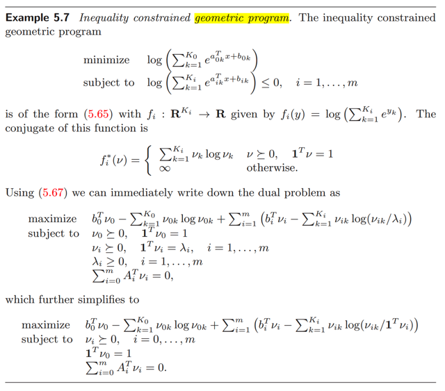</kbd>

> [!NOTE]
> Một ví dụ cụ thể của bài toán khái quát vừa rồi (objective f0(A0x + b0)
> và inequality constraint fi(Aix + bi) để rồi ta introduce new variable y0, y1..
> và new equality constraint A0x + b0 = y0, A1x + b1 = y1...
>
> Thế thì, ở đây fi(y) = log(Σk e^yk) = log (1Te^y)
>
> Thế thì với hàm f(x) = log Σi e^xi = log (1Te^x) ta đã tự derive conjugate
> của nó = f*(y) = sup x yTx - log (1Te^x) và nó bằng Σ yi log yi = yTlogy
> khi y ≽ 0 và 1Ty = 1, và = +infinity otherwise
>
> Quay lại sau

**🔗 See also:** [Conjugate function của log-sum-exp](./lec_4.md#node-ub6i6o2)

 

<kbd>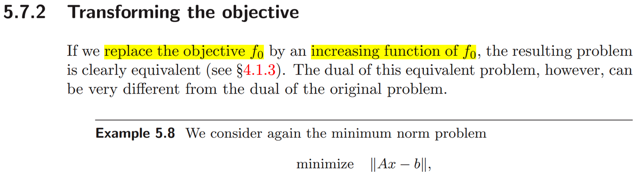</kbd>

<kbd>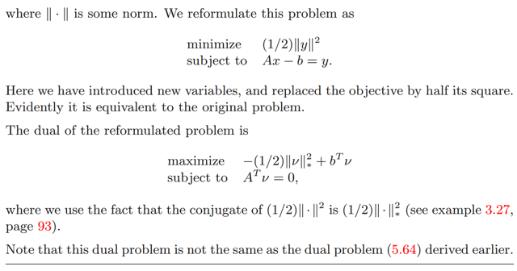</kbd>

> [!NOTE]
> cái này nói về cách thức ta tạo equivalent problem bằng cách thay 
> objective bằng một increasing function của f0, ví dụ f0(x) = ||Ax - b||
> thì thay nó bằng (||Ax-b||)^2, là hàm increasing do ||Ax-b|| >= 0.
>
> Khi đó x minimize (f0)^2 cũng là x minimize f0.
>
> Thế thì ta thay bài toán minimize f0(x) = ||Ax - b|| (no constraint)
> thành minimize f0(y) = (1/2) ||y||^2 với constraint Ax - b = y.
>
> Again nhắc lại mục đích là chuyển bài toán gốc là bài toán unconstraint
> khiến khi minimize nó ta ra dual function là constant và khi đó bài toán
> không hữu ích lắm. Nên ta sẽ thay bằng equivalent problem.
>
> Thế thì Lagrangian của new equivalent problem:
>
> L(x,y,v) = (1/2)||y||^2 - vT(Ax - b - y) 
>
> = (1/2)||y||^2 - vTAx + vTb + vTy
>
> g(v) = inf y [inf x (1/2)||y||^2 - vTAx + vTb + vTy]
>
> = inf y (1/2)||y||^2 + vTb + vTy subject to vTA = 0  
>
> (với x thì function L là affine có dạng px + q => minimize nó theo x
> sẽ ra q khi p = 0 và -infinity khi p khác 0, và vì dual feasible nên ta cần
> g > -infinity)
>
> = inf y  (1/2)||y||^2 + vTy + vTb  với vTA = 0
>
> = - sup y  - (1/2)||y||^2 - vTy  + vTb với vTA = 0
>
> Xét sup y  - (1/2)||y||^2 - vTy  
>
> Nên f*(-v) = (1/2)||-v||*^2 và vì norm của v cũng bằng norm của -v
> (dual norm ||.||* cũng là một loại norm)
>
> nên f*(-v) = (1/2)||v||*^2
>
> Vậy g(v) = - (1/2)||v||*^2 + bTv
>
> Do đó dual problem là maximize - (1/2)||v||*^2 + bTv với constraint
> vTA = 0
>
> 5.7 EXAMPLES
>
> 5.7.2 TRANSFORMING THE OBJECTIVE

**🔗 See also:** [Conjugate function của norm squared](./lec_4.md#node-gtqvaka)

 

<kbd>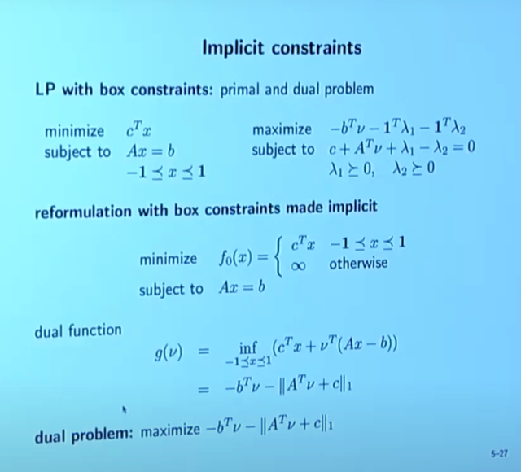</kbd>

> [!NOTE]
> Ta qua một cái gọi là Implicit constraints.
>
> Ví dụ có bàn toán minimize cTx với constraint Ax = b, -1 ⪯ x ⪯ 1
>
> Gs nói nếu ta làm (Lagrangian Dual như thông thường thì nó sẽ ra
> như bên phải). Thử làm:
>
> L = cTx + vT(Ax - b) + λ1T(- x - 1) + λ2T(x - 1)
>
> = cTx + vTAx - vTb - λ1Tx - λ1T1 + λ2Tx - λ2T1
>
> = cTx + vTAx - vTb - λ1Tx - λ1T1 + λ2Tx - λ2T1
>
> = cTx + vTAx - λ1Tx + λ2Tx - vTb - λ1T1 - λ2T1
>
> = (cT + vTA - λ1T + λ2T)x - vTb - λ1T1 - λ2T1
>
> là affine function của x
>
> g(v, λ1, λ2) = inf x  (cT + vTA - λ1T + λ2T)x - vTb - λ1T1 - λ2T1  
>
> = - vTb - λ1T1 - λ2T1 khi cT + vTA - λ1T + λ2T = 0, và -infinity otherwise
>
> cũng là -bTv - 1Tλ1 - 1Tλ2 khi c + ATv - λ1 + λ2 = 0 dĩ nhiên λ1, λ2 ≽ 0
>
> Và dual problem sẽ là maximize g(v, λ1, λ2) over v, λ1, λ2 với constraint
> c + ATv - λ1 + λ2 = 0 dĩ nhiên λ1, λ2 ≽ 0
>
> Thế thì trong bài toán này, ta sẽ chuyển nó về dạng tương đương với
> objective function sẽ là dạng indicator function: cTx khi -1 ⪯ x ⪯ 1 và
> +infinity nếu otherwise với subject to Ax = b
>
> Chỗ này nhớ lại rằng, nếu feasible set rỗng, tức không có điểm nào thỏa 
> constraint, thì việc minimize f0(x) sẽ là minimize trên tập rỗng, nên nó sẽ ra
> + infinity (theo quy ước). Do đó bài toán minimize indicator function
> f0(x) = cTx khi -1 ⪯ x ⪯ 1 và = +infinity khi x không thỏa điều kiện này là bài
> toán equivalent với bài toán gốc.
>
> Và dual function, theo thông thường sẽ là:
>
> g = inf x cTx + vT(Ax - b) 
>
> = inf x cTx + vTAx - vTb
>
> = inf x (cT+vTA)x - vTb 
>
> Theo lẽ thường thì đây là affine function, infimum sẽ bằng -vTb khi cT +
> vTA = 0 và bằng -infinity otherwise
>
> Tuy nhiên vì ở đây x chỉ từ -1, đến 1 nên kết quả sẽ là - bTv - ||ATv + c||
>
> Đại khái ra vậy là vì, inf x (cT+vTA)x - vTb = inf x (cT+vTA)x - vTb = inf x
> (ATx + c)Tx - vTb
>
> và khi minimize (ATx + c)Tx với x từ -1, đến 1 thì ta sẽ cơ bản là dùng bất
> đẳng thức Cauchy gì đó để rồi nó sẽ là, nếu component của ATx + c
> dương, thì chọn x = 1, và ngược lại component của ATx + c âm thì chọn x
> = -1. Kết quả sẽ là - bTv - ||ATv + c||
>
> Và dual problem sẽ là maximize - bTv - ||ATv + c||
>
> Và gs cho rằng ta có thể coi constraint gốc (-1 ⪯ x ⪯ 1) là: infinity norm
> của vector x < 1 (vì infinity norm của vector a là trị tuyệt đối của component
> lớn nhất của a, nên cơ bản hai cái này là tương đương) thì theo một cái
> rule mà gs đã nhận định khi nãy đó là khi ta có một function của constraint
> thì conjugate của function đó sẽ xuất hiện trong dual problem: Và bài toán 
> gốc là infinity norm thì conjugate của nó là L1 norm xuất hiện ở dual problem
>
> Một điểm nữa đáng chú ý, đại khái đó là sự liên hệ giữa D (là dual problem
> của bài toán gốc C) và D~ (dual problem của bài toán  reformulation /
> equivalent C~) trong trường hợp này là giống nhau
>
> cụ thể là gs cho rằng khi ta ngẫm nghĩ về dual problem của bài toán gốc:
> maximize -bTv - 1Tλ1 - 1Tλ2 subject to c + ATv + λ1 - λ2 = 0 với λ1 ≽ 0, λ2 ≽
> 0. Thì ta thấy c + ATv + λ1 - λ2 = 0 tương đương λ1 - λ2 = - (c + ATv)
>
> Khúc này chưa hiểu lắm, gs ko nói rõ nhưng đại khái là thật ra  D và D~
> trong bài toán này là như nhau, thể hiện mối liên hệ gần gũi giữa dual
> problem của bài toán gốc và bài toán tương đương mà ta đã nhận định

 

<kbd>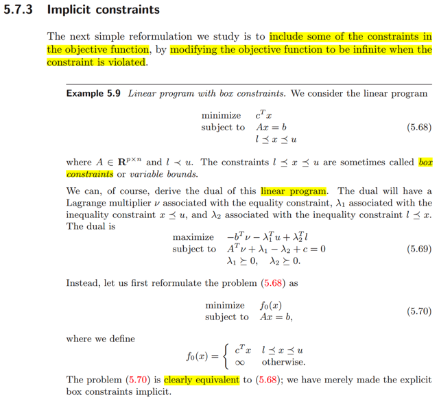</kbd>

<kbd>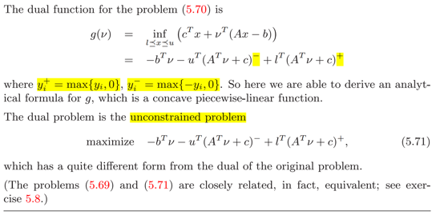</kbd>

> [!NOTE]
> 5.7 EXAMPLES
>
> 5.7.3 IMPLICIT CONSTRAINTS
>
> SÁCH (XEM SAU)

 

<kbd>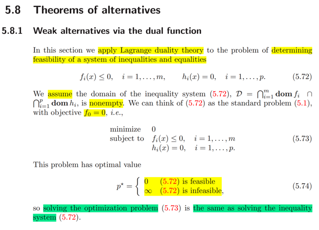</kbd>

> [!NOTE]
> 5.8 THEOREMS OF ALTERNATIVES
>
> 5.8.1 WEAK ALTERNATIVES VIA THE DUAL
> FUNCTIONS
>
> Đại khái là phần này ta sẽ ứng dụng Lagrange duality theory vào bài
> toán xác định tính FEASIBILITY của hệ các inequalities và
> equalities.
>
> Nôm na là ta đã biết về FEASIBILITY PROBLEM, là bài toán
> optimization mà trong đó, KHÔNG CÓ OBJECTIVE FUNCTIONS, 
> hoặc có thể coi như f0(x) = 0.
>
> Để rồi cơ bản chỉ là tìm x sao cho nó THỎA CÁC CONSTRAINT
> (feasible) là đủ. Khi đó, nếu có feasible x, thì có thể coi optimal value
> là 0 ngược lại, nếu không có feasible x, thì feasible set = rỗng, và
> như đã biết minimize over tập rỗng sẽ ra kết quả + infinity theo quy
> ước.
>
> Do đó, ở đây mới nói bài toán feasible problem này về cơ bản chỉ là
> tìm nghiệm của hệ (bất phương trình fi(x) <= 0 và phương trình
> hi(x) = 0)

 

<kbd>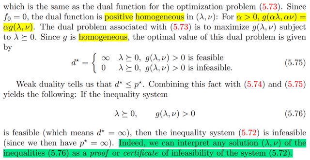</kbd>

<kbd>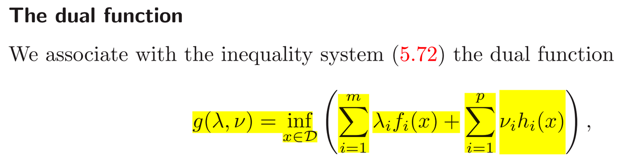</kbd>

> [!NOTE]
> Rồi, đại khái, ý chính đó là muốn nói rằng DỰA VÀO DUAL PRBLEM CÓ
> FEASIBLE HAY KHÔNG CÓ THỂ GIÚP KẾT LUẬN PRIMAL PROBLEM CÓ
> FEASIBLE HAY KHÔNG.
>
> Cụ thể là như đã nói, ta đang xét một bài toán optimization mà không có
> objective, hay objective f0(x) = 0. Nên cơ bản là chỉ tìm x thỏa constraint fi(x) <=
> 0, hi(x) = 0 là được, nếu có, thì optimal value = 0, ngược là thì optimal value =
> +infinity. Nói cách khác, bài toán là xem problem có FEASIBLE hay không.
>
> Thế thì ta sẽ có Lagrangian = 0 + λTf(x) + vTh(x)
>
> và Dual function g(λ,v) = inf x λTf(x) + vTh(x)
>
> ghi theo kiểu triển khai ra:
>
> g(λ, v) = inf x  Σ λi fi(x) + Σ vi hi(x) 
>
> thì nhận xét nó là hệ POSITIVE HOMOGENOUS có nghĩa là g(αλ, αv) = αg(λ,
> v)
>
> Nguyên nhân là vì xét inf x  Σ αλi fi(x) + Σ αvi hi(x)  thì nó sẽ bằng:
>
> inf x  α [Σ λi fi(x) + Σ vi hi(x)]  để rồi nếu α dương, ta có thể đưa α ra ngoài
> infimum luôn: α * inf x  [Σ λi fi(x) + Σ vi hi(x)]  = αg(λ, v)
>
> Và bài toán Dual problem như đã biết sẽ là:
>
> d* = g(λ*, v*) = sup λ, v g(λ, v) với λ ≽ 0.
>
> Thế thì, ý chính là: vì tính chất g(αλ, αv) = α g(λ, v) nên khi ta giải bài toán dual
> problem : d* = sup λ, v g(λ, v) thì chỉ cần tồn tại λ, v sao cho g(λ, v) dương thì ta chỉ
> việc cứ scale λ, v mãi với hệ số dương α thì α g(λ, v) sẽ lớn dần thành
> + infinity.
>
> Bởi lẽ bài toán dual problem là tìm λ, v để maximize g(λ, v), và việc scale λ với hệ số
> α thì cũng chính là "tìm / thử các λ, v khác nhau".
>
> Do đó có thể hiểu tại sao d* = +infinity khi tồn tại λ, v sao cho g(λ, v) dương và g có
> tính chất  homogeneous: g(αλ, αv) = α g(λ, v)
>
> Mà việc tồn tại λ, v sao cho g(λ, v) > 0 (dĩ nhiên là λ cần ≽ 0) chính là việc ta nói hệ
> g(λ, v) > 0, λ ≽ 0 feasible.
>
> Mà g(λ, v) > 0, λ ≽ 0 feasible => d* = infinity tức p* = infinity (do d* ≤ p*) thì có nghĩa
> là bài toán ban đầu (primal problem) infeasible (feasible set rỗng thì minimize f0(x)
> over empty set sẽ = +infinity)
>
> Từ đó ta mới có nhận định rằng: Xét hệ các inequalities của primal problem: fi(x) ≤ 0
> hi(x) = 0 thì nếu hệ g(λ, v) > 0, λ ≽ 0 feasible thì hệ fi(x) ≤ 0, hi(x) = 0 i = 1,2,... 
> infeasible
>
> Do đó người ta mới nói việc tồn tại λ, v khiến hệ  g(λ,v) > 0, λ ≽ 0  FEASIBLE
> là PROOF / CERTIFICATE cho việc kết luận bài toán gốc là INFEASIBLE 
>
> Chú ý là  g(λ,v) > 0, λ ≽ 0  INFEASIBLE KHÔNG giúp kết luận hệ gốc FEASIBLE

 

<kbd>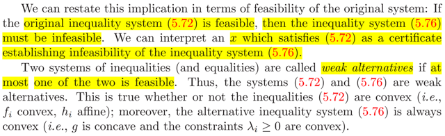</kbd>

> [!NOTE]
> Tiếp, nhắc lại:
>
> g(λ, v) > 0, λ ≽ 0 feasible ⇨ fi(x) ≤ 0, hi(x) = 0 infeasible
>
> fi(x) ≤ 0, hi(x) = 0 feasible => g(λ, v) > 0, λ ≽ 0 infeasible
>
> Và ta có thể xem x khiến hệ gốc feasible làm PROOF để chứng minh hệ
> sau infeasible.
>
> Và quan hệ này, khi CHỈ CÓ NHIỀU NHẤT LÀ MỘT TRONG HAI HỆ FEASIBLE, 
> khi đó hai hệ này được gọi là WEAK ALTERNATIVES
>
> VÀ ĐIỂM KHÁC BIỆT VỚI STRONG ALTERNATIVE Ở SAU CHÍNH LÀ
> TA CHỈ CÓ QUAN HỆ: CÁI NÀY FEASIBLE ⇨ CÁI KIA INFEASIBLE
>
> CHỨ KHÔNG CÓ CHUYỆN CÁI NÀY INFEASIBLE ⇨ CÁI KIA FEASIBLE
>
> NHƯNG STRONG ALTERNATIVE THÌ CÓ

 

<kbd>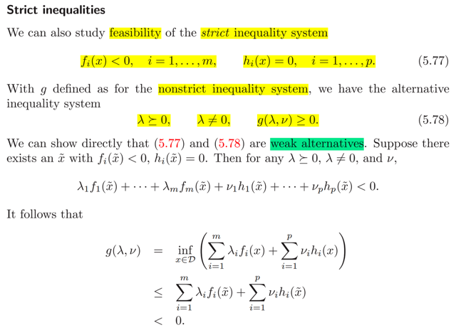</kbd>

<kbd>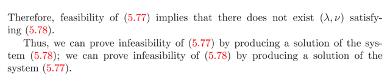</kbd>

> [!NOTE]
> Đại khái là nếu hệ gốc chỉ có dấu < (strict inequalities): fi(x) < 0, hj(x) = 0 
> (tự hiểu là i = 1,2....m, j = 1,2...p) thì ta cũng có quan hệ như vậy 
> với hệ λ ≽ 0, g(λ, v) ≥ 0, λ khác 0 
>
> (g ≥ 0, hồi nãy khi hệ gốc là dấu ≤ thì hệ sau là g > 0)
>
> 1) Nếu hệ fi(x) < 0, hj(x) = 0 FEASIBLE thì λ ≻ 0, g(λ, v) ≥ 0 INFEASIBLE
>
> 2) Nếu hệ λ ≻ 0, g(λ, v) ≥ 0 FEASIBLE thì hệ fi(x) < 0, hj(x) = 0 INFEASIBLE
>
> Chứng minh cũng dễ:
>
> 1) fi(x) < 0, hj(x) = 0 feasible ⇔ ∀ λi > 0, thì 
>
> Σ λi fi(x) < 0 ⇔ Σ λi fi(x) + Σ vi hi(x) < 0
>
> ⇔ inf λ, v  Σ λi fi(x) ≤ 0 ⇔ Σ λi fi(x) + Σ vi hi(x)  ≤ Σ λi fi(x) ≤ 0 ⇔ Σ λi fi(x) + Σ vi hi(x) ≤ 0
>
> ⇔ g(λ, v) < 0 => hệ λ ≻ 0, g(λ, v) ≥ 0 infeasible
>
> 2) Nếu λ ≻ 0, g(λ, v) ≥ 0 feasible:
>
> Thì cũng từ 
>
> g(λ, v) = inf λ, v  Σ λi fi(x) ≤ 0 ⇔ Σ λi fi(x) + Σ vi hi(x)  ≤ Σ λi fi(x) ≤ 0 ⇔ Σ λi fi(x) + Σ vi hi(x)
>
> ta có tồn tại λ, v:
>
> 0 ≤ g(λ, v) = inf λ, v  Σ λi fi(x) ≤ 0 ⇔ Σ λi fi(x) + Σ vi hi(x)  ≤ Σ λi fi(x) ≤ 0 ⇔ Σ λi fi(x) + Σ vi hi(x)
>
> Từ đó suy ra Σ λi fi(x) + Σ vi hi(x) ≥ 0 
>
> ⇔ Σ λi fi(x) ≥ 0 (do Σ vi hi(x) = 0)
>
> mà λi > 0 thì fi(x) cũng phải ≥ 0 => hệ  fi(x) < 0, hj(x) = 0 infeasible

 

<kbd>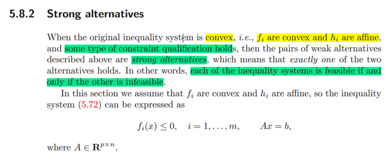</kbd>

> [!NOTE]
> Đại khái là khi hệ inequalities & equalities gốc là convex (tức các
> fi convex, hi affine, và một số loại constraint qualification hold)
>
> (Ôn lại constraint qualification là nói về những extra condition khiến 
> bài toán có strong duality)
>
> Thì Strong alternative là:
>
> Hệ gốc feasible ⇔ Hệ dual infeasible 
>
> Hệ gốc infeasible ⇔  Hệ dual feasible

 

<kbd>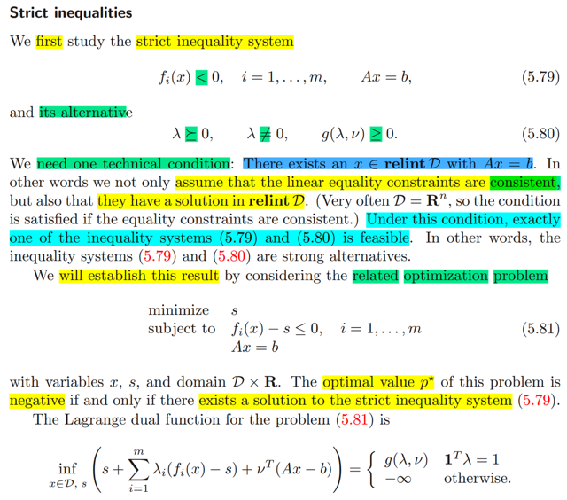</kbd>

<kbd>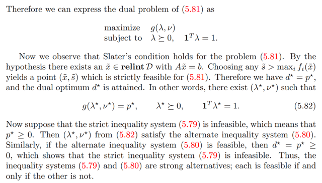</kbd>

> [!NOTE]
> đại khái là, như vừa nói, khi hệ gốc là các convex inequalities function
> và affine equalities. Thì nếu có thêm vài điều kiện (gọi qualification
> constraint) nữa thì ta sẽ có strong alternative (y như khi optimization
> problem là convex thì nếu có thêm vài điều kiện nữa như Slater's
> condition thì ta sẽ có Strong duality)
>
> Vậy thì xét hai hệ thuộc dạng strict equality trước:
>
> {fi(x) < 0, Ax = b} và {λ ≽ 0, λ ≠ 0, g(λ, v) ≥ 0}
>
> (hệ ko strict sẽ là {fi(x) ≤ 0, Ax = b} và {λ ≽ 0, g(λ, v) > 0})
>
> Thì điều kiện để có strong alternative là hệ Ax = b phải có nghiệm (gọi
> là consistent) và nghiệm phải nằm trong relative interior của D. Là sao? D
> là domain của problem, tức là intersection của các domain fi và hi.
> Nên nói có nghiệm trong relint D tức là có những x thỏa Ax = b và 
> x nằm bên trong relative interior của D.
>
> Sau đó là người ta chứng minh điều này. QUAY LẠI SAU

 

<kbd>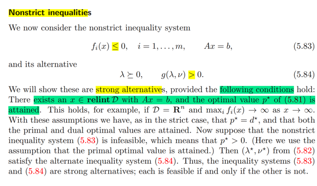</kbd>

> [!NOTE]
> Với non-strict inequalities thì điều kiện có strong alternative
> đó là tồn tại x thỏa Ax = b nằm trong relint D nhưng có thể điều kiện
> là p* của bài toán:
>
> minimize s constraint fi(x) - s ≤ 0 , Ax = b
>
> phải attained (tức là primal optimization problem có optimal
> value nhưng phải attainable nữa)
>
> Sau đó là phần chứng minh CÓ THỂ ĐỌC SAU

 

<kbd>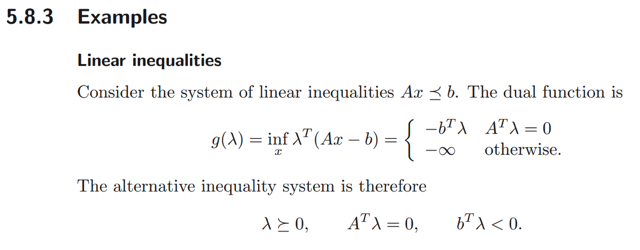</kbd>

<kbd>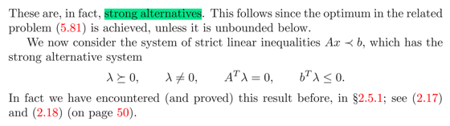</kbd>

> [!NOTE]
> Rồi, vài ví dụ, đầu tiên là hệ các inequalities tuyến tính 
> (trong phần lí thuyết vừa rồi là nói về hệ các inequalities
> và equalities: 
>
> non-strict:
>
> {fi(x) ≤ 0, i=1,2.. hi(x) = 0, j=1,2..} và {λ ≽, λ ≠ 0, g(λ, v) > 0}
>
> strict: 
>
> {fi(x) < 0, i=1,2.. hi(x) = 0, j=1,2..} và {λ ≽, g(λ, v) ≥ 0}
>
> Thì ở đây ta chỉ có hệ gốc là các { fi(x) ≤ 0 } là các linear
> inequalities aiTx ≤ bi có thể represent bởi Ax ⪯ b
>
> Thế thì, ta sẽ cần xây dựng dual g:
>
> Lagrangian = λT(Ax - b) = λTAx - λTb
>
> Dual function g(λ) = inf x {λTAx - λTb}
>
> λTAx - λTb là affine function của x, nên infimum nó sẽ ra
>
> 1) - λTb nếu λTA = 0
>
> 2) - infinity khi otherwise
>
> Nên để dual function > -infinity (cái này ta nhớ gọi là Dual 
> feasible) thì ta sẽ có thêm constraint λTA = 0, bên cạnh λ ≽ 0
>
> thì g(λ) = - λTb, λTA = 0, λ >=* 0
>
> Vậy thì ta sẽ có hai hệ strong alternative:
>
> {Ax ⪯ b} và { g = - λTb > 0, λTA = 0, λ ≽ 0}
>
> Nó strong alternative vì theo như lí thuyết với non-strict
> system thì để có strong alternative điều kiện kèm thêm
> là tồn tại x thỏa equalities (nếu có) và nằm trong relint D
> và p* của bài toán:
>
> minimize s constraint fi(x) - s ≤ 0 , Ax = b
>
> phải attained: Mà ở đây, bài toán đó là có p* attained
>
> QUAY LẠI SAU: TẠI SAO BÀI TOÁN NÀY CÓ P* ATTAINED

 

<kbd>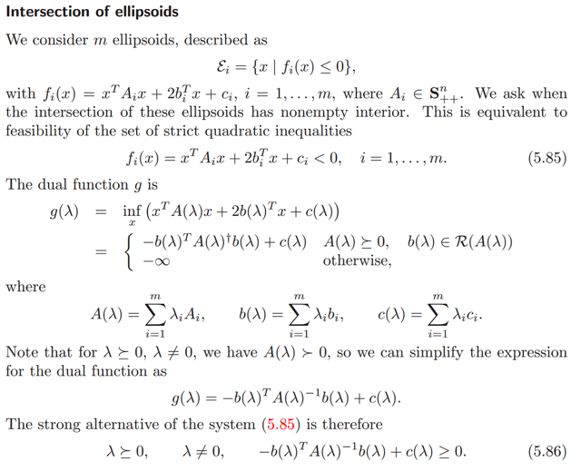</kbd>

<kbd>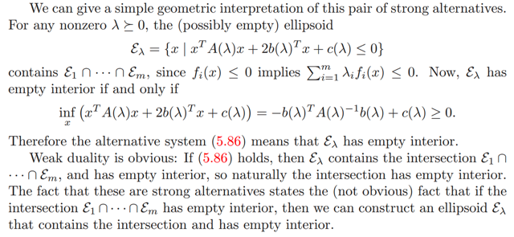</kbd>

> [!NOTE]
> SÁCH (XEM SAU)

 

<kbd>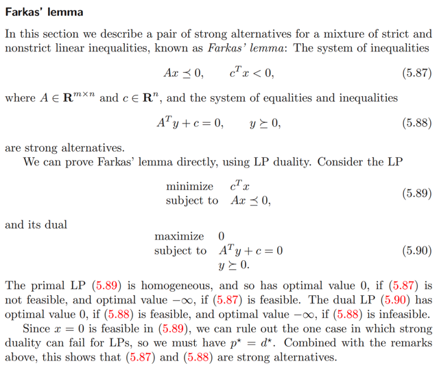</kbd>

> [!NOTE]
> SÁCH (XEM SAU)

 

<kbd>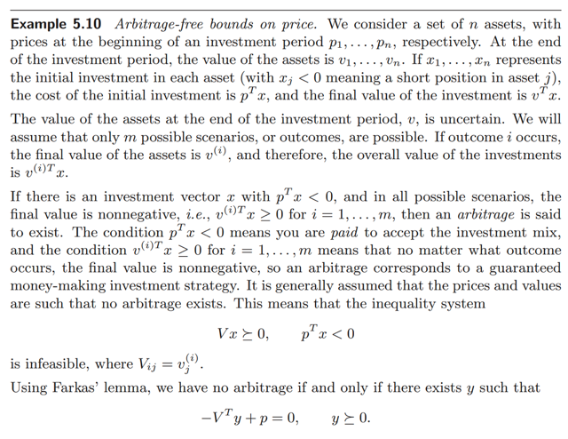</kbd>

<kbd>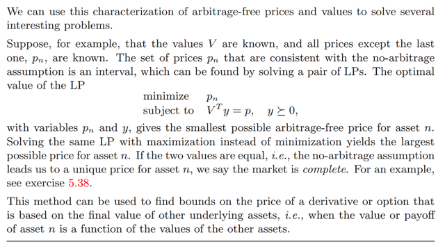</kbd>

> [!NOTE]
> SÁCH (XEM SAU)

 

<kbd>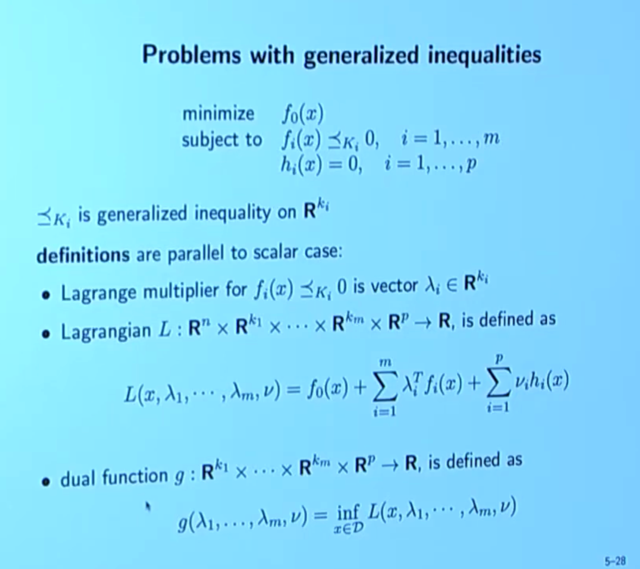</kbd>

> [!NOTE]
> Chuyển qua bài toán generalized inequalities: thay đổi đó là fi(x)
> ⪯Ki 0, tức là fi(x) là vector function (bao gồm chỉ cả matrix
> output function) thay vì scalar function. Do đó ví dụ như fi(x) là
> matrix thì fi(x) ⪯ 0 có nghĩa là (constraint là) "fi(x) là negative
> semi definite matrix"
>
> Nhớ lại khái niệm ⪯Ki, ví dụ x ⪯K y thì y - x thuộc cone K.
> Thế thì nếu K là R^n thì có việc y - x ∈ cone K sẽ tương
> đương mọi component của y đều lớn hơn component tương ứng
> của x.
>
> Lúc này mọi λi cũng ko còn là scalar mà gs cho rằng sẽ thuộc
> non-negative dual cone của cone R^ki: R^ki*
>
> Định nghĩa dual cone của K: K* = y | yTx >= 0 for all x ∈ K
>  thế thì dual cone của R^ki, sẽ là tập mọi vector mà khi inner
> product với vector bất kì trong cone R^ki đều ra kết quả không âm
>
> Điều này tương ứng với khi ở scalar case thì λ dương để f(x) khi
> nhân λ dương để ra λfi(x) > 0, dẫn tới việc khi optimize objective
> (minimize objective f0(x) + λfi(x)) sẽ khiến quá trình giảm objective sẽ
> gắn với việc giữ fi(x) < 0: fi(x) càng âm thì giá trị của f0(x) + λf(x) càng
> nhỏ, từ đó giúp quá trình optimization thỏa constraint là f(x) <= 0.
>
> Rồi Lagrangian và Dual function cũng tương tự, nói chung chỉ là khái
> quát lên khi fi(x) là vector function thôi

 

<kbd>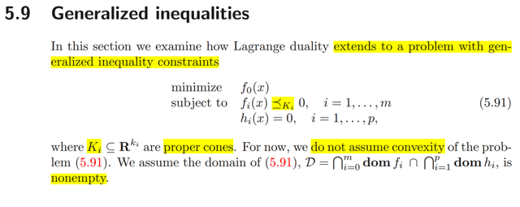</kbd>

> [!NOTE]
> Ôn lại khái niệm "proper cone" là cone có các tính chất: 
>
> 1) Closed: Chứa boundary của nó 
>
> 2) Pointy: Không chứa đường thẳng 
>
> 3) Solid: Non-empty interior
>
> 5.9 GENERALIZED INEQUALITIES
>
> 5.9.1 THE LAGRANGE DUAL

 

<kbd>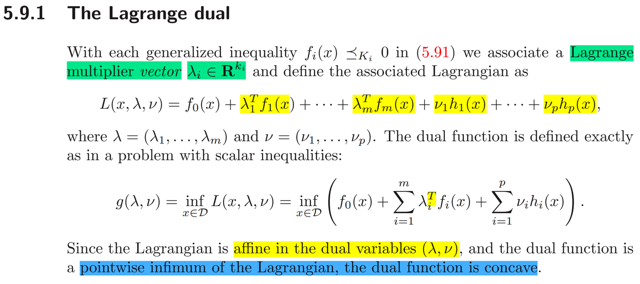</kbd>

> [!NOTE]
> Với việc inequality constraint được khái quát hóa lên thành
> vector function, để từ fi(x) ≤ 0 trở thành fi(x) ⪯Ki 0 mang ý
> nghĩa là vector fi(x) less than (vector) 0 wrt proper cone Ki.
>
> Lúc này Lagrange multiplier λi sẽ thay vì là scalar, sẽ trở
> thành vector λi. Và inequality constraint term trong Lagrangian sẽ
> là λiTfi(x).
>
> Dĩ nhiên có thể có nhiều inequality constraints.
>
> Và vẫn không có gì khác trước, Lagrangian:
>
> L = f0(x) + Σ λiTfi(x) + Σ vihi(x)
>
> Và đối với λ, v, L vẫn chỉ là affine function.
>
> Do đó khi xét Dual function g(λ, v) = inf x L(x, λ, v) thì nó là
> point-wise infimum của affine function (vừa là convex, vừa
> concave ⇨ là concave function
>
> (Nếu là point-wise supremum của của các convex function thì sẽ là
> convex function)

 

<kbd>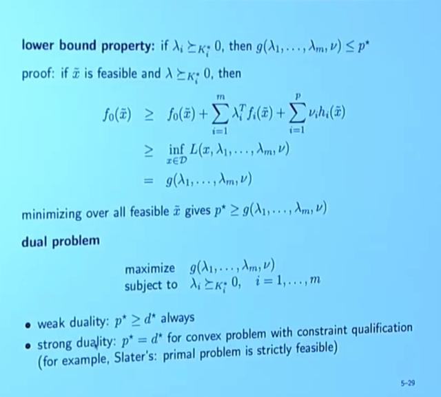</kbd>

> [!NOTE]
> Rồi gs nói về tính chất lower bound cũng hoàn toàn tương tự.
>
> Nhớ lại khi ở scalar case, ta sẽ lập luận rằng:
>
> Vì λi > 0 (đây là điều kiện để dual feasible: λ > 0 & g(λ, v) > - infinity)
> nên λifi(x) < 0, và từ đó f0(x) ≥ f0(x) + λifi(x)
>
> Tiếp tục ...để rồi ta có tính chất g(λ) ≤ p* (có thể xem lại hoặc lập
> luận lại chỗ này)
>
> Thì ở case khái quát này cũng vậy: là fi(x) thuộc cone K, và λi thuộc
> dual cone của cone K thì λiTfi(x) sẽ ⪯ 0.
>
> (nói chung mọi thứ tương tự)

 

<kbd>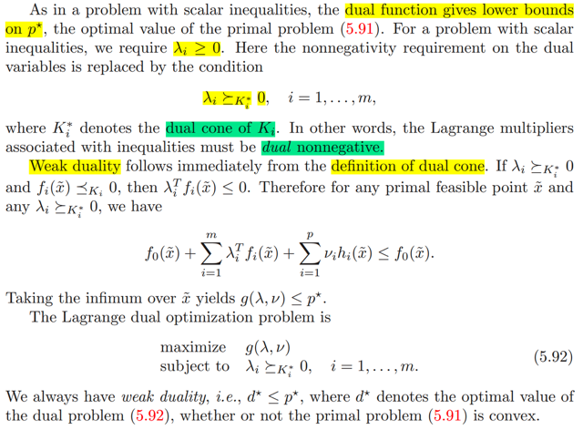</kbd>

> [!NOTE]
> Cụ thể hơn một chút và tính chất lower bounds của p* vẫn y nguyên với trạng
> thái khái quát của inequality (generalized) inequalities.
>
> Với "original case" khi constraint f(x) ≤ 0 với f(x) là scalar, thì ta nhớ có một
> ràng buộc là g(λ,v) > -infinity. Và λ ≥ 0, và g(λ, v) > -infinity chính là điều kiện 
> để dual feasible  g(λ, v) >-infinity (Search "dual feasible condition)
>
> Và với nhiều scalar inequality constraint fi(x), ta có nhiều scalar λi,  tạo nên
> vector λ, và constraint này trở thành λ ≽ 0
>
> Còn bây giờ, mỗi inequality constraint là vector function, và inequality cũng trở
> thành generalized inequality: fi(x) ⪯Ki 0. Thì Lagrange multiplier gắn với mỗi
> cái cũng là một vector λi. Thì lúc này constraint trên trở thành λi ≽ Ki* 0, có
> nghĩa là bigger than 0 wrt DUAL CONE of cone Ki.
>
> Vậy thì tại sao nói điều này khiến WEAK DUALITY tự nhiên xuất hiện.
>
> Đầu tiên ôn lại về Weak Duality trong scalar case : Nó nói rằng d* ≤ p*.
>
> Và lập luận là vầy:
>
> g(λ, v) = inf x L(x, λ, v) = inf x  f0(x) + Σ λi fi(x) + Σ vi hi(x) 
>
> ≤ f0(x) + Σ λi fi(x) + Σ vi hi(x)  | vì định nghĩa của infimum
>
> ⇨ g(λ, v) ≤ f0(x*) + Σ λi fi(x*) + Σ vi hi(x*)
>
> (vì x* phải là một trong feasible point nơi mà ta tìm kiếm minimum)
>
> ≤ f0(x*) | vì với λi ≥ 0 và x* feasible thì fi(x*) ≤ 0, và hi(x*) = 0
>
> Vậy suy ra g(λ, v) ≤ f0(x*) = p* với mọi λ, v
>
> Suy ra d* = sup λ, v g(λ, v) ≤ p*
>
> Quay lại đây, ta sẽ lập luận Weak Duality với generalized inequality như sau:
>
> Vì λi ≽Ki* 0, theo định nghĩa của ≽Ki* , λi - 0 = λi ∈ Ki*.
>
> Và theo định nghĩa của DUAL CONE CỦA Ki (tức Ki*) thì nó là y: yTx ≥ 0 với
> mọi x ∈ Ki, tức là vì λi ∈ dual cone của Ki nên với vector bất kì của cone Ki thì
> λiTx đều ≥ 0.
>
> Rồi, bên cạnh đó ta có inequality constraint: fi(x) ⪯Ki 0, theo định nghĩa của 
> "⪯Ki" thì nó có nghĩa là - fi(x) sẽ ∈ Ki mà theo trên thì λiT(- fi(x)) sẽ ≥ 0
>
> Vậy nên ta có λiTfi(x) ≤ 0.
>
> Và từ đó lập luận như scalar case ta cũng sẽ có d* ≤ p*

 

<kbd>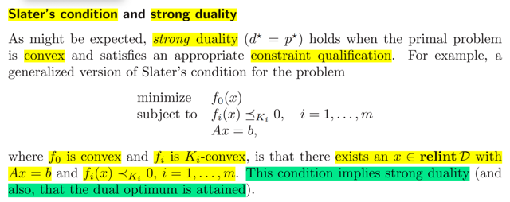</kbd>

> [!NOTE]
> Tiếp theo là nói về Slater's condition và strong duality.
>
> Thì cũng không có gì, khi khái quát lên với generalized inequality
> thì ta vẫn có cái này. Tức là nhớ lại trong scalar case. Thì khi
> primal problem là CONVEX: Đồng nghĩa các objective function và
> f0(x) inequality constraint fi(x) đều convex, và equality constraint
> function là affine, và có thêm một số điều kiện gọi là CONSTRAINT
> QUALIFICATION, mà điển hình là Slater' condition thì ta có thể
> chắc chắn có STRONG DUALITY: p* = d*.
>
> Thế thì, với generalized inequality, thì cũng vậy. Nếu f0 convex, fi 
> Ki-convex (review nhanh, nghĩa là domain của fi convex, và fi thỏa:
> fi(mixture) ≤ mixture of fi: fi(θx+(1-θ)y) ≤ θfi(x) + (1-θ)fi(y))
>
> Khi đó, nếu ta có Slater's condition (review nhanh, trong scalar case,
> cái này đại khái là tồn tại điểm trong relative interior của domain D (
> problem domain) khiến thỏa constraint Ax = b và strictly inequality:
> fi(x) ≺Ki 0 (thay vì chỉ thỏa fi(x) ⪯Ki 0, thì nay nó thỏa fi(x) ≺Ki 0 gọi là
> strictly inequality). 
>
> Thì khi đó ta sẽ có Strong Duality.
>
> Và một điểm cần nhớ, là trong sách bữa trước có nói, việc thoả 
> Strong Duality không chỉ cho thấy p* = d* mà nó còn cho thấy rằng
> có thể đạt được / tìm được DUAL OPTIMAL λ*, v* để có d* = g(λ*, v*) 
> nữa

 

<kbd>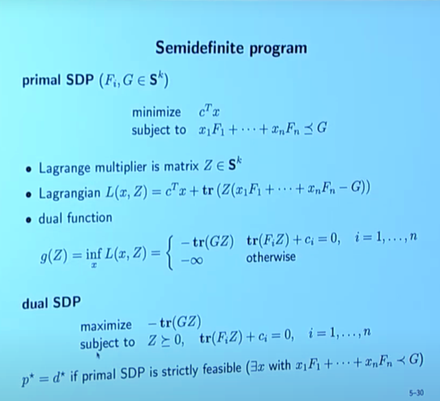</kbd>

> [!NOTE]
> Qua ví dụ, bài toán gọi là semi-definite program:
>
> objective là minimize cTx với inequality constraint x1F1 + ...xnFn
> ⪯ G  trong đó Fi, G là các symmetric matrix (∈ S^k) và
> constraint này mang ý nghĩa là x1F1 + ...xnFn - G là negative
> semi-definite matrix
>
> (vì nếu chỉ ghi ≤ ⪯ hay ≺ thì đồng nghĩa với ⪯ ≺R^n+, do đó Σi xiFi ⪯ G
> chính là Σi xiFi - G ⪯ 0 và đây chính là kí hiệu của việc nói Σi xiFi - G là
> negative semi definite matrix)
>
> Thế thì trong bài toán này khi Fi, G là symmetric matrix, thì Lagrange
> multiplier (vai trò của λ) bây giờ sẽ là symmetric matrix Z.
>
> Để rồi tương đương với vector case Σ λiTfi(x), thì bây giờ sẽ là:
>
> tr[Z(x1F1+...xnFn - G)]
>
> Nói thêm chỗ này, tại sao lại có trace ở đây. Lí do là vì, nếu như fi là
> vector, thì Lagrange multiplier là vector luôn, và lúc này ta sẽ có λiTfi để
> ra scalar như đã biết. Vậy thì ý chính là đây bản chất là inner product
> trong đó mỗi element của vector này nhân với phần tử tương ứng của
> vector kia và cộng lại hết.
>
> Thế thì đối với matrix: Phép inner product làm tương tự giữa hai matrix
> A, và B để lấy phần tử tương ứng của hai cái nhân nhau rồi cộng lại hết
> Σij Aij*Bij chính là có thể thể hiện bởi tr(ATB) vì mỗi phần tử đường
> chéo của ATB sẽ là một cột của A dot product với cột tương ứng của B,
> và tổng đường chéo sẽ chính là Σij Aij*Bij). Vì Z cũng symmetric nên
> tr(ZT(Σi xiFi - G)) cũng = tr(Z(Σi xiFi - G))
>
> Và dù phức tạp thì thực chất gs cho rằng nó chỉ là affine function
> đối với x. Nên khi minimize over x thì ta sẽ có constant part
> (-tr(GZ)  hoặc = -infinity.

 

<kbd>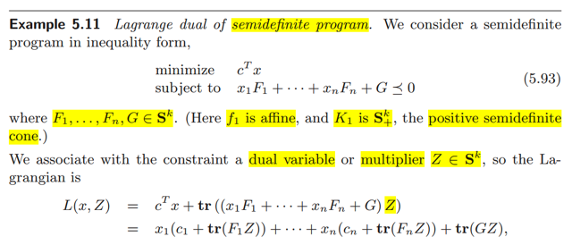</kbd>

<kbd>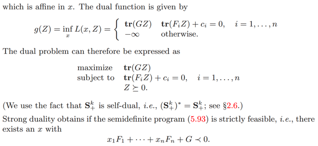</kbd>

> [!NOTE]
> Rồi thế thì L = cTx + tr(Z(Σi xiFi + G)) (Chỗ này chú ý trong slide
> hơi khác trong sách nên qua đây ta đổi lại thành + G theo sách)
>
> cũng có thể ghi là cTx + tr((Σi xiFi + G)Z) vì tr(ATB) = tr(BTA)
>
> = cTx + tr((x1F1 + x2F2 + ...+ xnFN + G)Z)
>
> = cTx + tr(x1F1Z + x2F2Z + ...+ xnFNZ + GZ) | phân phối vô thôi
>
> = cTx + tr(x1F1Z) + tr(x2F2Z) + ...+ tr(xnFNZ) + tr(GZ) 
>
> (trace operator có tính tuyến tính)
>
> = cTx + tr(F1Z)x1 + tr(F2Z)x2 + ...+ tr(FNZ)xn + tr(GZ) 
>
> = [c1 + tr(F1Z)]x1 + [c2 + tr(F2Z)]x2 + ...+ [cn + tr(FNZ)]xn + tr(GZ) 
>
> (tr(αA) = αtr(A), cái này dễ hiểu)
>
> Tới đây có thể thấy L là affine function của x: L = kTx + tr(GZ)
>
> với k = [c1 + tr(F1Z), c2 + tr(F2Z), ...]
>
> Và vì vậy khi minimize over x của L nó sẽ ra -infinity trừ khi mọi
> hệ số gắn với x = 0. Hay, k = 0
>
> Vậy g(Z) = inf Z L 
>
> a) tr(GZ) nếu ci + tr(FiZ) = 0 ∀i và 
>
> b) -infinity otherwise
>
> Và để thỏa dual feasible (λ ≽ 0, ở đây là Z ≽ 0, và g(Z) > -infinity) 
> thì ta sẽ có thêm điều kiện: ci + tr(FiZ) = 0 ∀i
>
> Do đó dual problem sẽ là:
>
> maximize tr(GZ) subject to ci + tr(FiZ) = 0 ∀i, Z ≽ 0
>
> Và cuối cùng như đã biết nếu ta có Slater condition: tồn tại x
> khiến primal strictly feasible: tức x khiến Σi xiFi + G ≺ 0 thì 
> ta sẽ có strong duality

 

<kbd>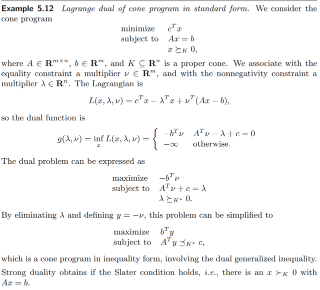</kbd>

> [!NOTE]
> Ta hoàn toàn có thể hiểu cái này: 
>
> Nói ngắn gọn như sau, xét bài tóan minimize cTx constraint Ax = b, x ≽K 0
>
> ⇔ 0 - x ⪯K 0 ⇔ - x ⪯K 0
>
> Lagrangian: f0(x) + λT(-x) + vT(Ax - b) = cTx - λTx + vTAx - vTb
>
> = (c - λ + ATv)Tx - bTv, dễ thấy là affine function của x.
>
> Dual function g(λ, v) = inf x L(x, λ, v). Thì như đã biết khi minimize affine
> function qx + p thì kết quả sẽ ra p khi q = 0 và ngược lại, sẽ ra -infinity.
>
> Thế thì ta nhớ khái niệm dual feasible: Đó là λ ≽ 0 VÀ g(λ, v) > - infinity. 
> Thì thêm vào đó, ở đây, để g(λ, v) > -infinity thì ta có constraint 
> (c - λ + ATv) = 0.
>
> Vậy từ đó dual problem là: maximize g(λ, v) = - bTv constraint λ ≽K* 0
> và c - λ + ATv = 0 ⇔ λ = ATv + c.
>
> Tiếp, với bài toán này, ta có thể bỏ bớt inequality constraint λ ≽K* 0
> bằng cách gộp nó với constraint λ = ATv + c để có ATv + c ⪯K* 0
>  ⇔ ATv ⪯K* c 
>
> Cái này nó cũng nằm trong phần equivalent problem
>
> Và nếu có Slater condition, thì ta sẽ có Strong Duality

 

<kbd>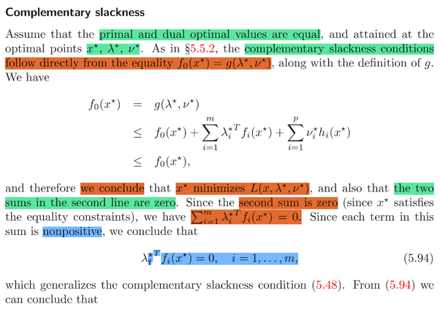</kbd>

<kbd>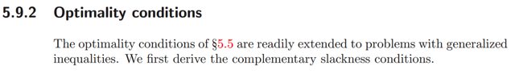</kbd>

<kbd>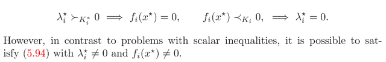</kbd>

> [!NOTE]
> 5.9 GENERALIZED INEQUALITIES
>
> 5.9.2 OPTIMALITY CONDITIONS
>
> Đại khái là ở đây họ giả sử ta đã có strong duality d* = p* (hay g(λ*, v*) = f0(x*)). Thì
> cái complementary slackness (dịch tiếng Việt tạm gọi là điều kiện bù trừ) có lập luận
> xuất phát từ như sau:
>
> Ta có:
>
> g(λ, v) ≤ L(x, λ, v) = f0(x) + Σi λiTfi(x) + Σi vihi(x) ∀ x, λ, v
>
> Dấu ≤ này là vì định nghĩa  của g = inf x L.
>
> Do đó g(λ, v) ≤ L(x*, λ, v) = f0(x*) + Σi λiTfi(x*) + Σi vihi(x*) | chỉ là áp dụng với x* (vì
> bất đẳng thức trên áp dụng với mọi x, λ, v)
>
> Và cũng có g(λ*, v*) ≤ L(x*, λ*, v*) = f0(x*) + Σi λ*iTfi(x*) + Σi v*ihi(x*) | chỉ là áp dụng
> với λ*, v* (vì bất đẳng thức trên áp dụng với mọi x, λ, v)
>
> Mà λ*iTfi(x*) ≤ 0 vì x* thì nó phải primal feasible (fi(x*) ≤ 0) và λ* thì nó phải dual
> feasible: λ* ≥ 0
>
> Và v*i hi(x*) = 0 vì f* phải primal feasible ⇨ hi(x*) = 0
>
> Suy ra:  g(λ*, v*) ≤ f0(x*) + Σi λ*iTfi(x*) + Σi v*ihi(x*) ≤ f0(x*)
>
> Từ đây, dùng sự thật là đang assume strong duality:
>
> g(λ*, v*) = f0(x*) khiến ta có chuỗi các dấu ≤ ở trên trở thành dấu =:
>
> g(λ*, v*) = f0(x*) + Σi λ*iTfi(x*) + Σi v*ihi(x*) = f0(x*)
>
> Hệ quả là:
>
> 1)Σi λ*iTfi(x*) = 0 (thì f0(x*) + Σi λ*iTfi(x*) + Σi v*ihi(x*) mới = f0(x*) 
>
> 2) x* chính là minimizer của L(x, λ*, v*). Vì sao?
>
> Vì theo định nghĩa g(λ, v) = inf L(x, λ, v) nên g(λ*, v*) = inf L(x, λ*, v*) Mà g(λ*, v*) =
> f0(x*) + Σi λ*iTfi(x*) + Σi v*ihi(x*) (dựa trên dấu bằng thứ nhất) thì vế phải chính là
> L(x*, λ*, v*). Vậy L(x*, λ*, v*) = inf L(x, λ*, v*) Nên điều này có nghĩa là x* chính là
> minimizer của L(x, λ*, v*)
>
> Hai hệ quả này có gì hay ho mà phải nói đến:
>
> Hệ quả thứ nhất Σi λ*iTfi(x*) = 0, chính là complementary slackness và nó có ý
> nghĩa là: Vì λ*i ≽ 0 và fi(x*) ⪯ 0 nên tích của chúng sẽ không dương. Do đó để cái
> tổng này = 0 thì mọi component phải bằng 0:
>
> λ*iTfi(x*) = 0 ∀ i
>
> Như vậy, nếu fi(x*) ≺Ki 0 thì λ*i = 0. Nếu λ*i ≻Ki* 0 thì fi(x*) = 0.
>
> Hệ quả hai khi ta có  x* chính là minimizer của L(x, λ*, v*) sẽ cho phép ta giải tìm x*
> (là cái minimize f0(x) với constraint) bằng cách giải tìm λ*, v* trước. Sau đó lắp vào
> L rồi giải bài toán unconstraint problem minimize L(x, λ*, v*)
>
> Nhưng một ứng dụng quan trọng hơn của hệ quả hai là: Nó giúp thiết lập một trong
> những điều kiện của KKT conditions: (tiếp note sau)

 

<kbd>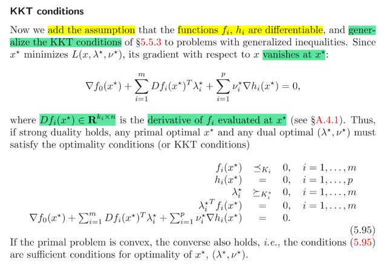</kbd>

> [!NOTE]
> Gradient của L(x, λ*, v*) tại x* vanish (vì x* là minimizer của L(x, λ*, v*)  mà):
> ∇_x L(x, λ*, v*) = 0.
>
> TÍnh ∇_x L(x, λ*, v*):
>
> L(x, λ*, v*) = f0(x) + Σi λ*iTfi(x) + Σi v*iThi(x)
>
> D_xL = D_x[f0(x)] + D_x [Σi λ*iTfi(x)] + D_x [Σi v*iThi(x)]
>
> a) D_x[f0(x)] chính là ∇f0(x)
>
> b) D_x [Σi λ*iTfi(x)]:
>
> Nếu theo 18.s096 thì ta đang tính derivative của g = aTf(x):
>
> g = aTf ⇨ dg = aT(f+df) - aTf = aTdf.
>
> f = f(x) ⇨ df = D_x f(x) dx (Với việc f là vector ⇨ vector function thì f'(x) là
> Jacobian kí hiệu D_x f(x), để rồi D_x f(x) dx là matrix J nhân vector dx cho ra
> vector df)
>
> Từ đó dg = aT D_x f(x) dx
>
> Cái này có thể hiểu như sau :
>
> aT[D_x f(x) dx]: Vector a dot product với vector df = D_x f(x) dx
>
> Hoặc:
>
> [aTD_x f(x)] dx: Row vector aT[D_x f(x)] dot product với vector dx
>
> Rồi, g là scalar function nên D_x g(x) là gradient vector ∇x_g(x). và như ta đã
> học trong MIT 18s096, khi đã triển khai cho thấy df = [vector]Tdx thì ∇f chính
> là [vector]T
>
> Từ đó suy ra: D_x g(x) = ∇g(x) = [aT[D_x f(x)]]T = [D_x f(x)]Ta
>
> Vậy áp dụng vào đây ta có các function gi = λ*iTfi(x):
>
> D_x [Σi λ*iTfi(x)] = Σi D_x [λ*iTfi(x)] = Σi [D_x fi(x)]Tλ*i
>
> (nhớ rằng D_x fi(x) là Jacobian)
>
> c) D_x [Σi v*iThi(x)]: Hoàn toàn tương tự = Σi D_x hi(x)Tv*i = Σi ∇hi(x)Tv*i
>
> Điểm khác là hi(x) là scalar function, không phải vector function như fi(x), Do
> đó D_x hi(x) là gradient vector không phải Jacobinan, nên ghi là ∇hi(x)
>
> Vậy D_x L(x, λ*, v*) = ∇f0(x) + Σi [D_x fi(x)]Tλ*i + Σi ∇hi(x)Tv*i
>
> Vậy ta có điều kiện vanishing gradient của KKT đv bài toán generalized
> inequality:
>
> ∇f0(x) + Σi [D_x fi(x)]Tλ*i + Σi ∇hi(x)Tv*i = 0

 

<kbd>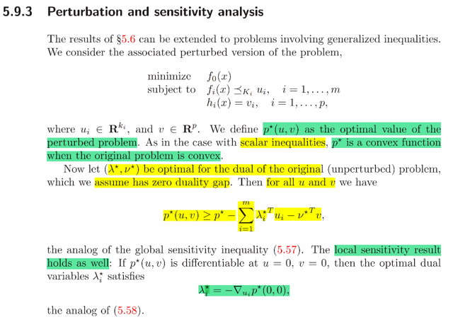</kbd>

> [!NOTE]
> 5.9 GENERALIZED INEQUALITIES
>
> 5.9.3 PERTURBATION & SENSITIVITY ANALYSIS
>
> đại khái là những phân tích về bài toán perturbed trong phần 5.6
> cũng được áp dụng với bài toán generalized inequality này.
>
> Đại khái là, như ta biết từ 5.6, kiểu như là ta có thể nới lỏng hoặc
> thắt chặt constraint, bằng cách thay vì constraint là fi(x) ≤ 0, thì nay
> ta có thể thay bằng fi(x) ≤ ui, để rồi nếu ui dương thì ta đang nới
> lỏng constraint, đang mở rộng feasible set, và ngược lại nếu ui âm
> thì ta đang thắt chặt constraint. Với equality constraint cũng tương
> tự vậy.
>
> Đương nhiên điểm khác là bây giờ ui là vector, vì fi(x) là vector.
>
> Và bài toán minimize f0(x) subject to fi(x) ≤Ki ui, hi(x) = wi được gọi
> là perturbed problem. Và optimal value của nó sẽ là hàm theo u, v
> p*(u, v): Khi thay đổi u, v thì optimal value của bài toán sẽ tăng hay
> giảm, dĩ nhiên p*(0, 0) là optimal value của bài toán gốc,
> unperturbed problem.
>
> Và nếu ta giả sử đang có strong duality thì ta sẽ có thể chứng minh
> một cái bất đẳng thức, mang ý nghĩa là một cái chặn dưới của giá
> trị optimal value của perturbed problem p*(u, v):
>
> p*(u, v) ≥ p*(0, 0) + Σ λ*Tu + Σ v*Tw.
>
> Mình sẽ chứng minh lại cái này, đầu tiên là Lagrangian function, mà
> ta sẽ kí hiệu L_u,v để biết đây là Lagrangian của perturbed
> problem u,v:
>
> Ta có
>
> p*(0,0) = g(λ*, v*) = inf x [f0(x) + Σ λ*iTfi(x) + v*iThi(x)] 
>
> ≤ f0(x) + Σ λ*iTfi(x) + v*iThi(x)
>
> Xét x bất kì thuộc feasible set của perturbed problem: fi(x) ≤K ui,
> hi(x) = wi
>
> ⇨ vế phải ≤ f0(x) + Σ λ*iTui + v*iTwi
>
> ⇨ p*(0,0) ≤ f0(x) + Σ λ*iTui + v*iTwi
>
> Và do nó đúng với mọi x thuộc feasible set của perturbed problem
> nên trong đó có cá optimal của perturbed problem:
>
> ⇨ p*(0,0) ≤ f0(x*) + Σ λ*iTui + v*iTwi
>
> ⇔ p*(0,0) ≤ p*(u, v) + Σ λ*iTui + v*iTwi
>
> ⇔ p*(u, v) ≥ p*(0,0) - Σ λ*iTui - v*iTwi
>
> Còn cái vụ local sensitivity, ôn lại chút, với scalar case trước
>
> Ta có thể chứng minh rằng ∂/∂ui p*(u, v) | u = 0, v = 0 là bằng λ*i
>
> Mang ý nghĩa là tại điểm (0,0), độ dốc theo phương ui của hàm p*(u, v) 
> là bằng λ*i
>
> Ôn lại cách chứng minh:
>
> Xét hàm p*(u, v). 
>
> Đầu tiên evaluate tại điểm (u0, v0) = (0, 0): p*(0, 0)
>
> p*([0, 0,...0], [0, ...0])
>
> Thay đổi (u, v) ở component thứ 2 của cái phần tương ứng với inequality 
> constraint thứ 2: f2(x) ≤ u2
>
> ([0, ε,.0..,0], [0, 0...0]) và nó chính là:
>
> = ([0, 0,...0], [0, ...0]) + ([0, ε,...0], [0, ...0]) 
>
> = ([0, 0,...0], [0, ...0]) + (ε[0, 1,...0], [0, ...0]) 
>
> = ([0, 0,...0], [0, ...0]) + (εe2, [0, ...0]) 
>
> và cũng là (εe2, [0, ...0])
>
> Tại đó ta có p*(εe2, [0, ...0])
>
> Và ta sẽ thiết lập difference quotient: 
>
> [p*(εe2, [0, ...0]) - p*([0, 0,...0], [0, ...0])] / ε 
>
> viết gọn lại:
>
> [p*(εe2, 0) - p*(0, 0)] / ε 
>
> Thì theo định nghĩa đạo hàm thì lim ε → 0 [p*(εe2, 0) - p*(0, 0)] / ε 
>
> chính là partial derivative của p*(u, v) wrt u2, evaluate tại 0.
>
> ∂/∂u2 p*(u,v) | u=0, v=0
>
> Thế thì, [p*(εe2, 0) - p*(0, 0)] / ε là cái gì ta ko biết nhưng ta biết nó sẽ ≥ λ*i
>
> Vì p*(u, v) ≥ p*(0, 0) - λ*Tu - v*Tw ∀ u, v
>
> ⇨ p*(εe2, 0) ≥ p*(0, 0) - (λ*1.0 + λ*2.ε + ...) - v*T0
>
> ⇔ p*(εe2, 0) ≥ p*(0, 0) - λ*2.ε
>
> ⇔ p*(εe2, 0) - p*(0, 0) ≥ - λ*2.ε
>
> Nếu ε dương thì ta có:
>
> ⇔ [p*(εe2, 0) - p*(0, 0)] / ε ≥ -λ*2
>
> Do đó sau khi tính giới hạn thì ta cũng có ∂/∂u2 p*(u,v) | u=0, v=0 ≥ -λ*2
>
> Nếu ε âm thì ta có:
>
> [p*(εe2, 0) - p*(0, 0)] / ε ≤ -λ*2
>
> Tính giới hạn thì ta có: 
>
> ∂/∂u2 p*(u,v) | u=0, v=0 ≤ -λ*2
>
> Từ đó suy ra ∂/∂u2 p*(u,v) | u=0, v=0 = -λ*2
>
> Vậy ∂/∂ui p*(u, v) | u=0, v=0 = -λ*i
>
> ====
>
> Vậy nay với generalized inequality constraint ta cũng có điều tương tự
>
> Chỉ khác là p*(u, v), trong scalar case, u là vector các [u1, u2, ....un], u1, u2
> ...là scalar trong inequality constraint: fi(x) ≤ ui
>
> Còn này, với việc fi(x) là vector, thì ui là vector. Nên có thể coi u giờ là ma
> trận (v vẫn chỉ là vector) 
>
> Nên mình sẽ dùng kí hiệu p*(U, v)
>
> Và nếu xét quan hệ giữ ui và p* thì nó là hàm vector → scalar
>
> Khác với trước đây là scalar → scalar
>
> Nên ∂/∂ui p*(u, v) sẽ là một gradient vector. Kí hiệu - ∇ui p*(u, v)   
>
> Và nó chính là vector λ*i (trước đây là scalar, nay cũng là vector) 
>
> Ta sẽ chứng minh để thấy rõ ở note sau
>
> Xét tại (U, v)
>
> U là matrix [u1T; u2T; ...unT]
>
> v là vector [v1, v2,...vm]
>
> (u1 là vector của inequality constraint f1(x) ≤K u1,...
>
> v1 là scalar của equality constraint h1(x) = v) 
>
> Tại điểm (0, 0), tức ([0T, 0T, ....], [0,...,0]) 
>
> (0 là vector [0,..0], 0 là scalar 0)
>
> Thay đổi u11 (đang là 0) một khoảng chút xíu ε  
>
> Nhớ u1 là vector [u11, u12, ...u1k] = [0, 0...0] trở thành 
>
> [ε, 0...0] và nó chính là ε[1, 0...0] = εe1
>
> thì ta có điểm mới (U, v) = ([εe1T; 0T; ...0T], [0, 0,...0])
>
> Hàm số thay đổi:
>
> Δp* = p*(εe1T, 0T, ...0T), [0, 0,...0]) - p*([0T, 0T, ....], [0,...,0])
>
> Quotient difference tại limit ε → 0
>
> lim ε → 0 Δp* / ε  CHÍNH LÀ ∂/∂u11 p*(U, v) | U = 0, v = 0
>
> Và ta hoàn toàn chứng minh tương tự để thấy nó = λ*i1:
>
> p*(U, v) ≥ p*(0, 0) - Σ λ*iTui - v*iTwi
>
> Bản chất vế phải là:
>
> p*(0,0) - (λ*1Tu1 + ...λ*nTun) - v*1Tw1 
>
> Tại (U, v) = (εe1T, 0T, ...0T, 0) thì vế phải nó là:
>
> p*(0,0) - (λ*1Tu1 + λ*2T0 +... + λ*nT0) - v*1T0
>
> = p*(0,0) - (λ*1Tu1)
>
> = p*(0,0) - (λ*11ε + λ*12 0 + ..λ*1n 0) 
>
> = p*(0,0) - λ*11ε
>
> Nên ta có:
>
> [p*(U, v) - p*(0,0)] / ε ≥ - λ*11
>
> Và ta có thể chứng minh được như trên rằng 
>
> ∂/∂u11 p(U, v) | U=0, v=0 = - λ*11
>
> tương tự 
>
> ∂/∂u12 p(U, v) | U=0, v=0 = - λ*12
>
> ...
>
> ∂/∂u1k p(U, v) | U=0, v=0 = - λ*1k
>
> Do đó:
>
> [∂/∂u11 p(U, v), ∂/∂u12 p(U, v)], .... | U=0, v=0 = - [λ*11, λ*12,....]
>
> Và vế trái chính là ∇u1 p*(U,v) | U=0, v=0
>
> ⇨ ∇u1 p*(U,v) | U=0, v=0 = - λ*1
>
> Tương tự:
>
> ∇ui p*(U,v) | U=0, v=0 = - λ*i

**🔗 See also:** [linked note](./lec_8_b.md#node-khfilej)

 

<kbd>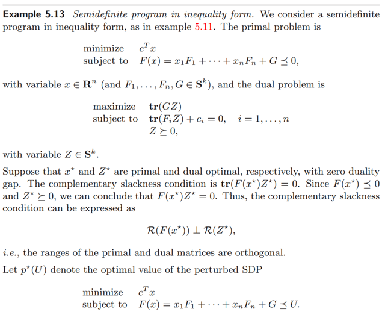</kbd>

<kbd>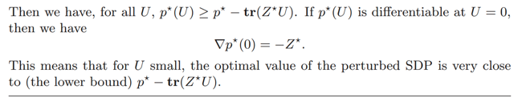</kbd>

> [!NOTE]
> Gặp lại ví dụ này:
>
> minimize cTx subject to F(x) = x1F1 + ...xnFn + G ⪯ 0.
>
> x ∈ R^n, Fi, G ∈ S^k (symmetric matrix [k, k])
>
> Thử làm lại xem tại sao dual problem lại là vậy
>
> Công thức tổng quát Lagrangian:  L(x, λ, v) = f0(x) + Σi λifi(x) + Σi vihi(x)
>
> Với việc fi(x) là vector function, thì mỗi component của fi(x) sẽ gắn với một
> Lagrange multiplier, đồng nghĩa mỗi vector fi(x) sẽ gắn với một vector λi, nên
> công thức trở thành.
>
> L(x, λ, v) = f0(x) + Σi λiTfi(x) + Σi vihi(x)
>
> Bây giờ, nếu fi(x) là matrix thì sao: Nhờ MIT 18s096 ta biết rằng, bản chất là ta
> đang dùng cái gọi là inner product giữa hai vector (vector theo nghĩa rộng, có
> thể là matrix). Để với hai column vector u và v thì inner product cuả chúng được
> gọi là dot product u . v = uTv có bản chất là Σi uivi
>
> Thì với matrix U, V, ta cũng có định nghĩa của inner product giúp tính  Σij UijVij:
> U . V = Σij UijVij (tức element-wise nhân các phần tử với nhau rồi cộng lại hết)
>
> Thế thì Σij UijVij có thể thể hiện theo dạng gọn gàng hơn: Nhìn vào bản chất
> của phép tính này, nó là lấy cột 1 của U, nhân elementwise với cột 1 của V, rồi
> cộng lại hết, và làm tương tự với các cột kia. Và tính tổng kết qủa lại. Thế thì
> cột 1 của U nhân element-wise với cột 1 của V rồi cộng lại hết thì chính là cột 1
> của U dot product với cột 1 của V.
>
> Vậy bản chất phép tính này là Σj=1: số cột [cột j của U]T.[cột j của V]
>
> Mà nhờ 18.06 ta nhớ lại một trong 4 góc nhìn về việc nhân matrix A với B đó là
> [AB]ij = [Hàng i của A].[Cột j của B].
>
> Do đó, nếu lật matrix U lại và xét UTV thì:
>
> với i cho trước, [hàng i của UT] . [cột i của V] chính là Σj UijVij
>
> đó chính là phần tử ii của matrix UTV: [UTV]ii
>
> nên Σij UijVij chính là Σ mọi phần tử ii của UTV, tức là mọi entries trên đường
> chéo. Ta biết nó chính là trace(UTV)
>
> Vậy với matrix thì phép inner product U . V = tr(UTV)
>
> Thế thì áp dụng vào đây: λ1Tf1(x) (và có nhiều inequality constraint fi(x) i=1,2...
> thì thành ra Σ λiTf trong vector case) trong vector case, là inner product giữa
> vector Lagrange multiplier λ1 với vector f1(x)
>
> sẽ tương đương với
>
> Z1 . F1(x), tức inner product giữa matrix Lagrange multiplier Z1 với matrix F1(x)
>
> và nó như đã nói ở trên chính là tr(F1(x)TZ1) hoặc tr(Z1TF1(x)) (vì tr(A) =
> tr(AT))
>
> do đó Lagrangian của bài toán này chính là:
>
> L(x, Z) = cTx + tr(F(x)TZ)
>
> = cTx + tr([x1F1 + ...xnFn + G]TZ)
>
> = cTx + tr(x1F1TZ) + ...+ tr(xnFnTZ) + tr(GTZ)
>
> = cTx + x1tr(F1TZ) + ...+ xntr(FnTZ) + tr(GTZ)
>
> = Σi cixi + x1tr(F1TZ) + ...+ xntr(FnTZ) + tr(GTZ)
>
> = x1(c1 + tr(F1TZ))  + ...+ xn(cn + tr(FnTZ)) + tr(GTZ)
>
> Dual function:
>
> g(Z) = inf x L(x, Z) = inf x x1(c1 + tr(F1TZ))  + ...+ xn(cn + tr(FnTZ)) + tr(GTZ)
>
> L chỉ là affine function của x (nó có dạng aTx + b với ai = ci + tr(FiTZ), b =
> tr(GTZ)
>
> nên khi minimize over x nó sẽ bằng: - inf nếu a khác 0, và bằng b nếu a = 0.
>
> Và để dual problem feasible, điều kiện là g phải > -inf, thì ta sẽ thêm điều kiện a
> = 0, tức ci + tr(FiTZ) i=1,...n = 0, để g(Z) = b = tr(GTZ).
>
> Khi đó dual problem sẽ là:
>
> maximize Z tr(GTZ) constraint Z ≽ 0, ci + tr(FiTZ) i=1,...n = 0
>
> Rồi thử xem khúc sau nói vậy là sao:
>
> Họ giả sử x* và Z* là primal và dual optimal của bài toán này. và giả sử thêm ta có
> zero duality gap, tức p* = d*, hay còn gọi là  strong duality.
>
> Như vậy. Ta thử lập luận lại optimality condition
>
> g(Z) = inf x L(x, Z) (theo định nghĩa của dual function) nên
>
> ⇨ g(Z) = inf x L(x, Z) ≤ L(x, Z) ∀x, Z (định nghĩa của infimum)
>
> vì nó đúng với mọi Z nên ta có quyền áp dụng với Z*
>
> ⇨ g(Z*) = inf x L(x, Z*) ≤ L(x, Z*) ∀x (chỉ là áp dụng với Z*)
>
> tương tự ta có quyền áp dụng với x*
>
> ⇨ g(Z*) = inf x L(x, Z*) ≤ L(x*, Z*) (chỉ là áp dụng với x*)
>
> ⇔ g(Z*) = inf x f0(x) + Z* . F(x) ≤ f0(x*) + Z* . F(x*)
>
> tới đây dùng giả định ta có strong duality nên :
>
> g(Z*) (= d* = sup Z g(Z)) = f0(x*) (= p*)
>
> Vậy áp dụng nó vào sự thật ta đang có: g(Z*) = inf x f0(x) + Z* . F(x)
>
> ⇨ g(Z*) = f0(x*) = inf x f0(x) + Z* điều này chứng tỏ x* là minimizer của L(x, Z*) ⇨
> ∇L(x*, Z*) = 0
>
> ⇔ ∇f0(x*) + ∇x [Z* . F(x)]|x=x* = 0
>
> (phải hiểu ∇L(x*, Z*) như vầy: với giá trị Z = Z*, thì hàm L chỉ là làm theo x, và
> gradient ∇L(x, Z*) cũng là hàm theo x. và ta có kết luận là hàm ∇L(x, Z*) evaluate tại
> x=x* sẽ bằng 0.)
>
> Đây là hệ quả thứ 1, còn hệ quả thứ 2 là ta dùng sự thật:
>
> g(Z*) = inf x f0(x) + Z* . F(x) ≤ f0(x*) + Z* . F(x*)
>
> với g(Z*) = f0(x*)
>
> ⇨ f0(x*) ≤ f0(x*) + Z* . F(x*) ⇔ 0 ≤ Z* . F(x*)
>
> thế thì với primal optimal x* thì dĩ nhiên nó primal feasible nên F(x*) ⪯ 0. Còn Z* là
> dual optimal thì dĩ nhiên phải thỏa Z ≽ 0. Vậy Z* . F(x*) ≤ 0
>
> Từ đó Z* . F(x*) vừa không dương vừa không âm thì nó phải bằng 0
>
> Z* . F(x*) = 0 ⇔ tr(F(x*)TZ) = 0 ⇔ tr(F(x*)Z) = 0 , đây chính là complimentary
> slackness:
>
> (Chú ý là F là symmetric nên F(x*)TZ cũng là F(x*)Z)
>
> Nó nói rằng, nếu F(x*)ij mà < 0 thì Z*ij phải phải bằng 0 và ngược lại nếu Z*ij > 0 thì
> F(x*)ij phải = 0.
>
> Sẵn ôn lại thêm như ta đã từng phân tích λ*i chính là ∂/∂ui p*(0, 0) tức là slop theo
> phương ui của perturbed p*(u, v) tại (0,0) Nên nếu fi(x*) < = và λ*i = 0  có nghĩa là
> constraint fi đang slack (chùng), ta có chuyền thắt chặt hay nới lỏng constraint ui
> mà ko ảnh hưởng gì mấy để p*(u,v). Ngược lại nếu fi(x*) = 0 và λ*i > 0 tức là
> constraint fi đang chặt (tight). Nếu nới lỏng hay thắt chặt constraint thì sẽ thay đổi
> p* nhanh
>
> Rồi, tại sao
>
> Nói Vì F(x*) ⪯ 0, tức là negative semi definite matrix (ma trận bán xác
> định âm) và Z* ≽ 0, tức positive semi definite matrix nên:
>
> tr(F(x*)Z*) = 0 suy ra F(x*)Z* = 0.
>
> Gọi A ⪯ 0, B ≽ 0. Vì B ≽ 0 nên nó thể factor thành CTC
>
> Đó là vầy: Vì B symmetric, nên ta có orthogonal factorization = QΛQT
>
> Vì B positive semi definite nên mọi eigenvalues λi của nó đều không âm, 
> dẫn tới có thể viết ở dạng (√λi)(√λi)
>
> Dẫn tới Λ có thể tách thành Λ'T Λ' (hoặc Λ' Λ'T) với Λ' = diag([√λ1, √λ2, ...√λn])
>
> (hình dung thế này Λ' là diagonal nên cũng symmetric, nên Λ'T = Λ'. 
> Phần tử thứ ii của Λ'Λ' là kết qủa dot product của hàng thứ i của Λ' và
> cột thứ i của Λ', đều là √λi*ei, nên kết quả là λi) 
>
> ⇨ Q Λ QT = Q Λ'T Λ' QT 
>
> Rồi, xét quadratic form của AB, cũng là Q Λ'T Λ' QT 
>
> = uTQ Λ'T Λ' QT u = (Λ' (uTQ)T)T  Λ' QT u = (Λ' QTu)T  Λ' QTu
>
> = ||Λ' QTu||^2 ≥ 0
>
> Vậy từ đó kết luận AB là positive semi definite matrix.
>
> Áp dụng vào ta có: F(x*) ⪯ 0, Z* ≽ 0 thì F(x*)Z* ≽ 0. Mà tr(F(x*)Z*) = 0
> ⇔ tổng mọi eigenvalues của F(x*)Z* bằng 0, mà như đã nói đây là positive
> semi definite matrix nên mọi eigenvalues của chúng đều không âm, dẫn
> đến để tổng bằng 0 thì mọi eigenvalues đều bằng 0, điều này chỉ xảy ra khi
> F(x*)Z* = 0
>
> ====
>
> Và từ đây kết luận được gì?
>
> Đó là mọi row của F(x*) đều dot product với mọi columns của Z* cho ra 0 ⇨
> chúng vuông góc nhau ⇨ rowspace của F(x*) orthogonal với columnspace
> của Z*, mà F(x*) symmetric nên rowspace của cũng al2 columnspace.
>
> Vậy columns space của F(x*) orthogonal compliment với column space của Z*
>
> Kết quả ở dưới hoàn toàn tương tự vector case. Khi - Z* (optimal
> dual variable) chính là local sensitivity ∇p*(0) của perturbed problem
> tại (0).
>
> Ôn lại chút về là eigendecomposition:
>
> Với matrix có đủ bộ eigenvector độc lập A, ta biết nó có thể factor bởi
> eigendecomposition:
>
> Gốc rễ là: gọi λ1, λ2,...λn là eigenvalue, x1, x2...xn là eigenvector tương
> ứng:
>
> Ax1 = λ1x1, Ax2 = λ2x2, ...Axn = λnxn
>
> Đặt x1, x2...xn làm các cột của S, và λ1, λ2... làm các entries trên đường
> chéo của Λ, các equation trên thể hiện bởi dạng matrix:
>
> AS = SΛ
>
> Rồi, cần nhấn mạnh, nói về eigenvector thì đang nói về SQUARE matrix.
>
> Lí do: Ax = λx thể hiện điều này, gọi A là (m,n) matrix thì x trước khi nhân
> với  A thì nó nằm trong R^n (vì A có n cột, nên x phải có n phần tử). Rồi,
> sau khi nhân với A thì nó được nằm trong Rm (vì A sẽ map vector trong
> Rn thành Rm) Vậy thì m phải bằng n là đương nhiên.
>
> Vậy thì, ta mới nói đến điều kiện để S trở thành invertible, từ đó A =
> SΛSinv
>
> Dĩ nhiên S cũng phải square, nên S invertible khi column của nó
> independent tức là các eigenvector của A independent.
>
> Và ko phải lúc nào cũng vậy, tức là có khi eigenvalue trùng nhau khiến
> eigenvector trùng nhau dẫn đến ko có đủ eigenvector độc lập.
>
> Mà chỉ có một trường hợp duy nhất ngoại lệ khi mọi eigenvector có chung
> eigenvalue nhưng vẫn độc lập chính là matrix I khi  nó có đủ n
> eigenvector độc lập dù eigenvalue đều là 1.
>
> Thế thì, khi A thỏa điều kiện có đủ n eigenvector độc lập thì S invertible và
> ta có A = S Λ Sinv, gọi là eigen-decomposition hay A khi đó là
> diagonalizable (chéo hóa được)
>
> Rồi, khi A symmetric, thì nó có tính chất rất hay là các eigenvector có thể
> được chọn là orthogonal nhau, và eigenvalue đều là số thực
>
> Và hơn nữa, sẽ luôn có đủ eigenvector độc lập. Nên S, lúc này có thể
> thay bằng orthogonal matrix Q, sẽ cũng invertible. Mà Q lại có tính chất
> hay ho là QTQ = I ⇨ QT = Qinv
>
> Vậy với symmetric matrix A, diagonalization của nó là: A = Q Λ QT

 

<kbd>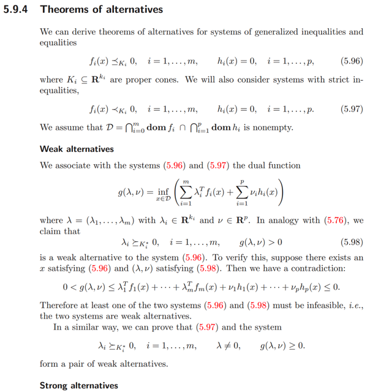</kbd>

> [!NOTE]
> 5.9 GENERALIZED INEQUALITIES
>
> 5.9.4 THEOREMS OF ALTERNATIVES

 

<kbd>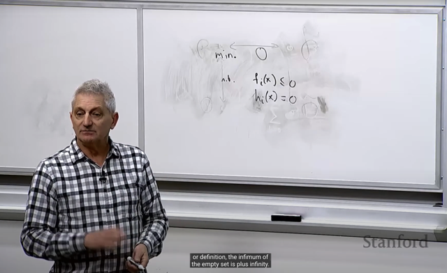</kbd>

> [!NOTE]
> một điểm nữa mà gs cho rằng ta nên biết đó là bài toán này:
>
> minimize 0 (tức objective function là constant f0(x) = 0) với
> constraint fi(x) <= 0; hi(x) = 0
>
> Thế thì ở bài toán này, optimal value sẽ là 0 nếu x feasible
> (cứ feasible thì sẽ có optimal value = 0), còn nếu feasible set empty
> tức ko có x nào feasible thì theo định nghĩa khi ta minimize over x
> một tập rỗng thì kết quả sẽ là +infinity, tức là khi ko có feasible x thì
> optimal value sẽ là +infinity

 

<kbd>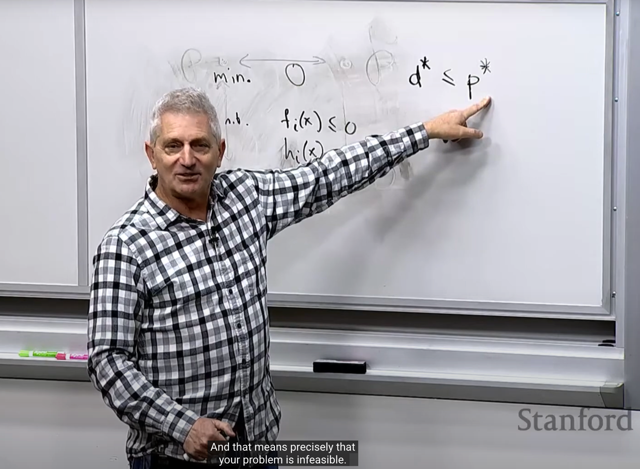</kbd>

> [!NOTE]
> Và đại khái là, khi ta làm các bước thông thường, để tìm ra d*
> thì d* luôn <= p* như đã biết. Thì nếu như d* = infinity hoặc một
> giá trị dương nào thì cũng kết luận rằng p* = +infinity (Vì optimal
> value p* như đã nói, chỉ có thể bằng 0 hoặc +infinity thôi)

 

<kbd>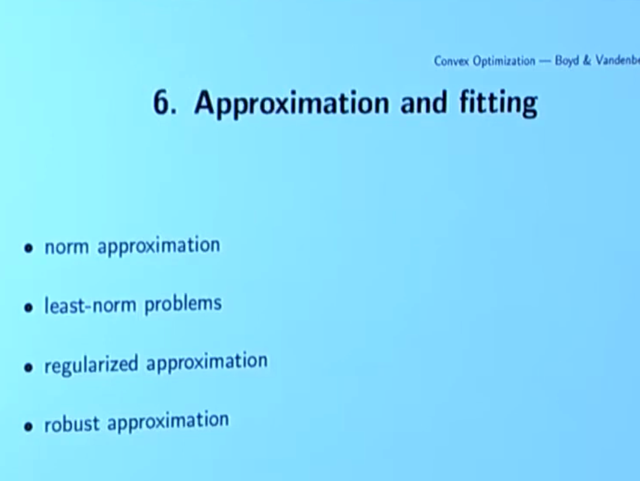</kbd>

> [!NOTE]
> Thế thì đến đây ta đã finish phần 1 của class, với rất nhiều lí thuyết.
> Tiếp theo ta sẽ đi vào các bài toán cụ thể:
>
> Gs cho rằng ta sẽ thấy thực ra chúng là một.

 

<kbd>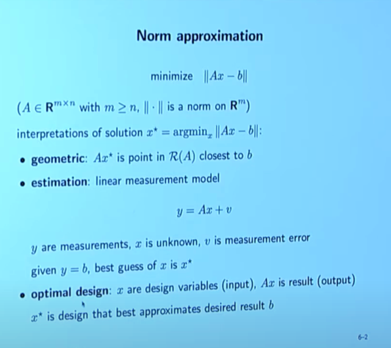</kbd>

> [!NOTE]
> Đầu tiên là bài toán norm approximation:
>
> Objective là minimize ||Ax - b||. norm này chưa nói là norm gì, có thể là
> l1, l2, infinity norm...
>
> Đại khái là ta có thể có một số interpretation hay ý nghĩa / ứng dụng 
> của bài minimize norm:
>
> Về hình học: Ax* là điểm nằm trong R(A) (hay C(A) - column space)
> mà gần nhất so với b với khoảng cách đo bởi norm. Nếu b nằm trong
> C(A) thì optimal value sẽ bằng 0.
>
> Ý nghĩa trong bài toán optimal design: đại khái là có dạng bài toán
> mà ta muốn estimate variable x sao cho result tạo bởi Ax gần nhất
> với result mong muốn là b. 
>
> Còn trong estimation, dù chưa hiểu lắm nhưng đại khái là y cũng
> đóng vai của giá trị "mong muốn" và Ax là kết qủa mà ta muốn
> nó gần với y: tức cũng là muốn v = ||y - Ax|| nhỏ.

 

<kbd>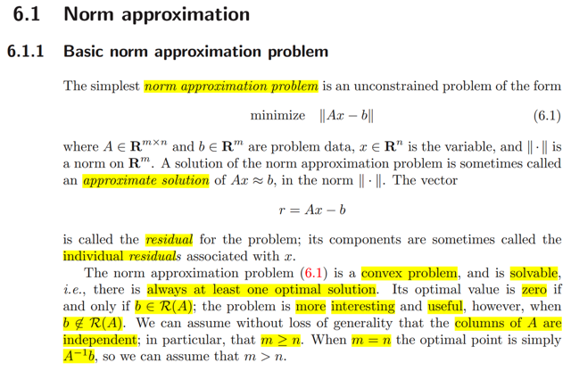</kbd>

> [!NOTE]
> nói cả rồi. Ngắn gọn là bài toán norm approximation này, đặt
> vấn đề tìm x khiến Ax gần b nhất. Ax là linear combination
> các A's columns. Với giả định A có m>=n và các cột độc lập,
> thì hệ Ax = b gọi là over-determined system. Nó sẽ có nghiệm
> duy nhất nếu b nằm trong C(A), dĩ nhiên khi đó minimizer ||Ax-b||
> chính là nghiệm này, và optimal value = 0 (vì Ax* = b)
>
> Ngược lại khi b không thuộc C(A), không có các kết hợp tuyến
> tính nào của A's columns có thể cho ra b. Ta chỉ có thể tìm điểm x^
> trong, giúp tạo Ax^ gần nhất với b. Đây chính là projection của
> b lên C(A) và phần dư còn lại e = b - p nằm trong N(AT). Nên ta có
> thể thiết lập normal equation bằng cách tiếp cận hình học:
>
> e thuộc left null space, vuông góc với C(A) => e vuông góc với mọi 
> vector trong C(A) => vuông góc với basis của C(A), là các A's columns
>
> Nên ATe = 0 <=> AT(b-Ax^) = 0 <=> ATb = ATAx^
>
> Từ đó, với việc A full column rank nên ATA full rank => ATA invertible
>
> => x^ = (ATA)invATb
>
> Còn khi m=n thì (ATA)invAT cũng chính là Ainv, x* = Ainvb
>
> 6.1 NORM APPROXIMATION
>
> 6.1.1 BASIC NORM APPROXIMATION PROBLEM

 

<kbd>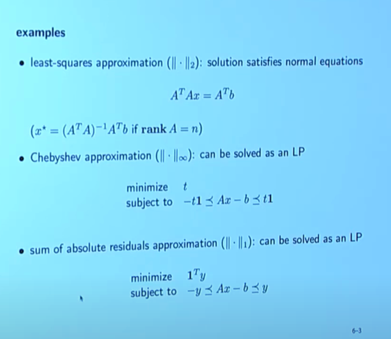</kbd>

> [!NOTE]
> Ví dụ khi dùng l2 norm thì ta có least-square approximation: để rồi
> ta có thể solve analytically: xây dựng normal equation (từ
> calculus hoặc hình học) để từ đó có thể solve solution x* bằng
> pseudo inverse matrix  (cái này đã phân tích kĩ trong 1806 hoặc sẽ
> còn nói lại trong EE263)
>
> gs nói sơ cái thứ hai và chả nói gì cái thứ 3.
>
> Đọc sách để hiểu thêm nói chung là với các norm function khác
> nhau thì ta có các bài toán khác nhau nhưng đều là norm
> approximation.

 

<kbd>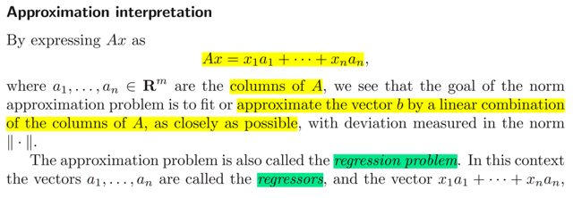</kbd>

> [!NOTE]
> một cách diễn giải bài toán norm approximation, khi ta muốn minimize
> ||Ax - b|| đó là ta muốn tìm x khiến tạo linear combination của các A's
> columns sao cho kết quả ra gần nhất với b, đo bởi ||.||.
>
> Đây là cái vừa nói rồi.
>
> Thì bài toán này với cách hiểu như vậy gọi là REGRESSION. Với
> các cột của A là REGRESSOR

 

<kbd>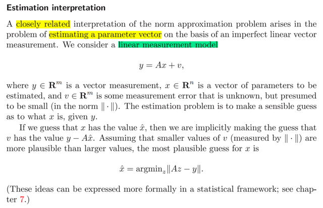</kbd>

> [!NOTE]
> SÁCH (XEM SAU)

 

<kbd>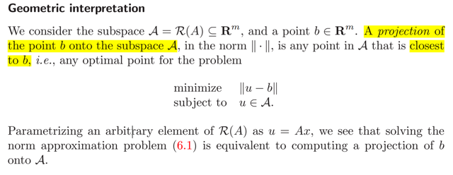</kbd>

> [!NOTE]
> Cách interpretation hình học thì ta muốn project b lên
> C(A). Nếu b đã thuộc C(A) thì dĩ nhiên projection là chính
> nó

 

<kbd>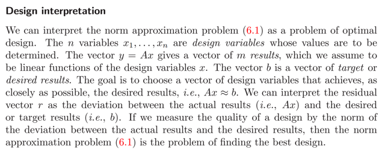</kbd>

<kbd>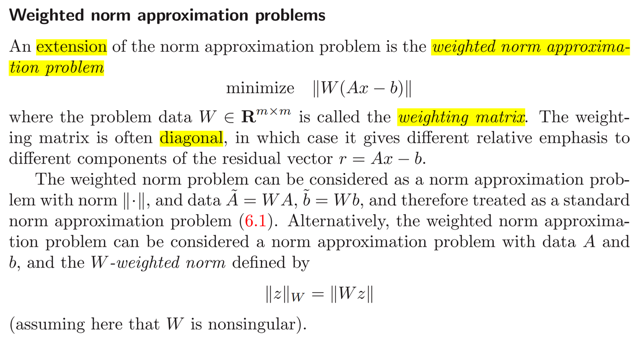</kbd>

> [!NOTE]
> SÁCH (XEM SAU)

 

<kbd>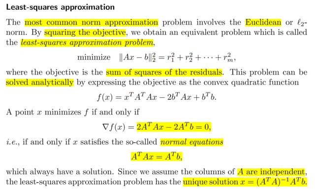</kbd>

> [!NOTE]
> SÁCH (XEM SAU)

 

<kbd>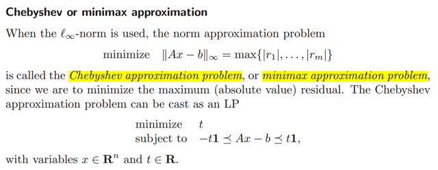</kbd>

<kbd>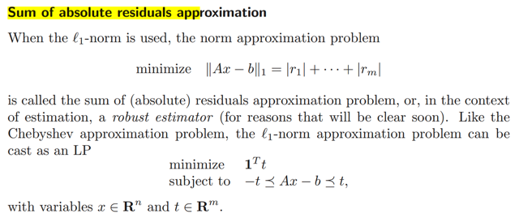</kbd>

> [!NOTE]
> SÁCH (XEM SAU)

 

