# Lec 9b

📊 **Progress:** `26` Notes | `50` Screenshots

---

## Lec 9b

 

<kbd>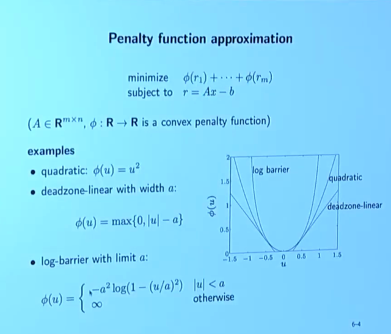</kbd>

> [!NOTE]
> tiếp theo là một cái rất useful:
>
> Ta biết thêm khái niệm SEPARABLE function: là khi function
> là tổng của  việc APPLY FUNCTION fi LÊN CÁC COMPONENT
> CỦA VECTOR r
>
> Đại khái là khi φ(u) = u^2 thì có thể thấy ta có bài toán least
> square (vì khi đó objective là minimize Σ ri^2 với r = Ax - b.
>
> Rồi khi φ là các function khác thì ta có các bài toán khác (đại
> khái vậy)
>
> Thế thì gs cho rằng ta có thể hiểu φ là function đo mức độ "khó
> chịu" của ta khi đối mặt với một residual (như error).
>
> Ví dụ như khi φ(u) bằng max 0, |u| - a thì có nghĩa là nếu u có trị
> tuyệt đối nhỏ hơn a thì ta ko care (bằng cách cho rằng độ khó chịu
> với residual như vậy là 0) nhưng khi u lớn hơn thì "độ khó chịu" sẽ
> tăng tuyến tính theo u

 

<kbd>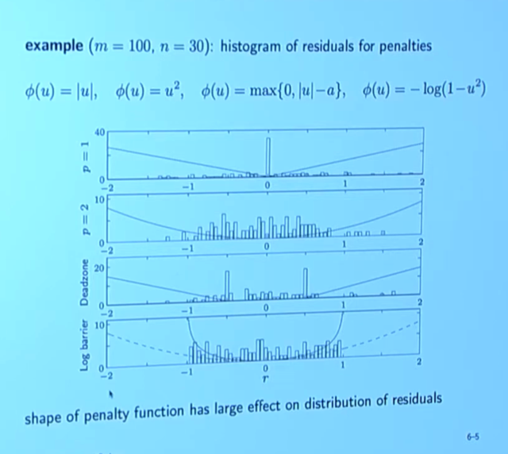</kbd>

> [!NOTE]
> đại khái cái này giống như là ta có 100 rows, 30 columns, giống như ta
> fit dataset có 100 samples và 30 features. thì u là errors (residuals) và
> φ(u) là penalty function (giống như loss function), HÌnh ảnh sẽ là cho ta
> thấy các hệ quả khác nhau khi ta dùng các penalty function khác nhau.
>
> Đầu tiên là nói về φ(u) = u^2. Ta quan sát có rất nhiều cột ở trong
> khoảng -1 tới 1. Điều này có nghĩa là, có nhiều "sai sót" với độ lớn nằm
> trong khoảng này được tồn tại. Giải thích cho hiện tượng này là vì, khi u
> có |u| <= 1 thì bình phương nó lên nó sẽ ra số còn nhỏ hơn nữa. Do đó,
> với u trong khoảng này thì đại khái là penalty nhỏ. Do đó optimizer kiểu
> như cho phép các sai sót  ở mức độ này tồn tại.
>
> Như khi residual lớn hơn 1, thì khi u tăng thì φ(u) tăng theo bậc hai, tức
> là tăng nhanh, nên điều này khiến ngày càng ít residual mang giá trị lớn
> còn  tồn tại. Nên ta thấy ra khỏi mốc 1.5 là không còn "cột" nào trong
> histogram thứ 2.
>
> Ta có thể xem cái case log barrier: Nó sẽ giống với u^2 ở khúc gần 0
> nhưng khi "ra xa" hơn chút, cỡ từ khi |u| > 0.4 thì log barrier tăng rất
> nhanh đến vô cùng. Do đó không có residual nào còn tồn tại ở ngoài
> khoảng [-1,1]
>
> Nói qua cái Deadzone, như đã biết, ý nghĩa của penalty này kiểu
> như là nếu u nằm trong -a đến a thì ok, penalty = 0, còn khi u nằm
> ngoài thì penalty tăng tuyến tính.
>
> Gs giải thích tại sao lại có hai cây cột ở đầu nơi mà penalty bắt đầu
> tăng: Đơn giản là kiểu như: ta nên hiểu optimizer sẽ tìm cách giảm
> penalty (giống như giảm loss function) thế thì với các residual tại
> đầu mút này, thì vì penalty vẫn bằng 0 nên không có lợi ích gì để
> mà optimizer tìm các giảm chúng
>
> Còn cái |u|. thì có cái cột cao ở giữa, là vì hàm này nó penalize
> tuyến tính theo u, nên chỉ khi u ~= 0 thì penalty mới ~= 0 (và để
> cho survive) nên có thể thấy optimizer sẽ ép cả các residual nằm
> trong khoảng -1,1 chứ không dễ dãi với đám này như hàm u^2 và
> log barrier, nên số residual trong khoảng -1, đến 1 ít hơn nhiều so
> với u^2 (các cột của histogram thấp hơn).
>
> Nhưng nó chỉ penalize residual tuyến tính nên vẫn tồn tại các residual
> lớn ở ~2, trái với u^2 không cho phép cái nào có giá trị lớn cả

 

#### Hành vi tối ưu |u| và u^2

<kbd></kbd>

> [!NOTE]
> gs nói thêm về |u| và u^2: Đó là "mức độ quan tâm" của u^2 sẽ nhỏ
> dần:
>
> cụ thể là, độ giảm penalty của r1=9 và r2=8 sẽ lớn hơn nhiều so với độ
> giảm penalty từ r1=2 và r2=1 (81-64 > 4-1) HIểu nôm na là optimizer
> sẽ quan tâm nhiều hơn tới việc giảm từ 9 xuống 8 hơn là giảm từ 2
> xuống 1
>
> Trong khi đó với |u|, độ giảm penalty trong hai case là như nhau. Mang
> ý nghĩa giống như optimizer sẽ tiếp tục quan tâm giảm penalty cho đến
> khi về 0 thì thôi với động lực giữ nguyên chứ không giảm dần như
> thằng u^2. Thằng u^2 thì kiểu như chỉ "hăng" / care nhiều khi u lớn mà
> thôi còn khi u nhỏ rồi thì nó vẫn care nhưng dễ dãi bớt / bớt hăng.
>
> Dẫn tới gs nói một ý liên quan đến machine learning là khi dùng |u| thì
> kết quả sẽ có nhiều zero (giống như ta đã biết với l1 regularizer
> optimizer sẽ tiếp tục ép các parameters về 0) còn u^2 thì chỉ ép về rất
> nhỏ chứ không về 0

 

<kbd>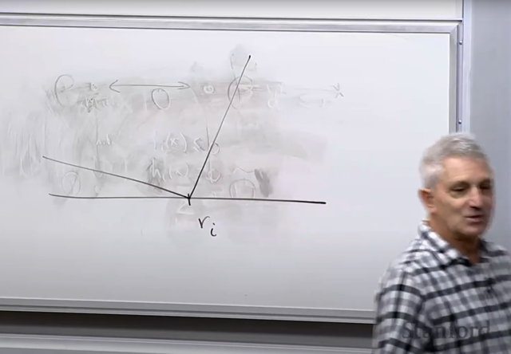</kbd>

> [!NOTE]
> gs đặt câu hỏi là nếu ta có penalty function như thế này, thì
> nghĩa là gì?
>
> Thử trả lời: nó sẽ có hệ quả là muốn residual = ri, nhưng
> encourage residual nhỏ hơn ri hơn là lớn hơn ri.
>
> Một student: bias đối với underestimating (ý là thiên vị case mà
> ta  dùng giá trị nhỏ hơn ri)
>
> gs: correct

 

<kbd>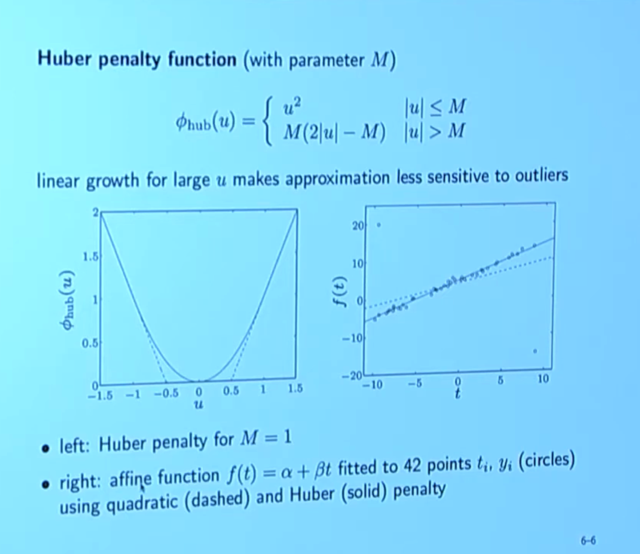</kbd>

> [!NOTE]
> Một cái quan trọng mà gs cho rằng ai cũng nên biết đó là Huber
> penalty function. Đại khái nó là u^2 khi |u| < M và khi ngược lại |u| >
> M thì penalty tăng tuyến tính thay vì quadratic.
>
> Gs cho rằng ý nghĩa của nó đối với bài toán regression là, ta sẽ giống
> như dùng squared error nhưng nếu error lớn thì ta bớt nghiêm trọng
> hơn. Điều này giúp approximation bớt nhạy cảm với outlier. Và cái
> này chính là cái gọi là Robust Estimator
>
> Hình ảnh của nó là vầy, có thể thấy phần khi u < -M và u > M là tuyến
> tính.
>
> Hình ảnh bên phải là bài toán regression fit 42 data points. Khi dùng
> quadratic (mean squared error loss) thì đường fitted line là đường
> chấm chấm. Nó rõ ràng bị kém là do ảnh hưởng của hai outliner.
>
> Nhưng với huber loss thì ta có fitted line tốt hơn nhiều.
>
> Vài bữa quay lại bàn về chỗ này khi ôn và học tiếp Stat110
>
> Gs nói thêm khi fitting data thì thường sẽ tốt hơn nếu dùng Huber
> thay vì least square
>
> Gs cũng dùng hình ảnh trong cơ học kiểu như khi ta kéo giãn lò xo thì
> lực kéo cũng tăng theo quaratic lúc đầu nhưng khi quá một giới hạn
> nào đó thì lực kéo chỉ tăng tuyến tính

 

<kbd>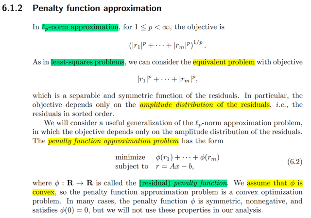</kbd>

> [!NOTE]
> Đại khái là, trong bài toán NORM-APPROXIMATION thì objective
> function là (Σi |ri|^p)^1/p.
>
> Và LEAST-SQUARE là equivalent problem là khi objective thay 
> bằng Σi |ri|^p
>
> Thế thì khái quát từ bài toán least-square này mà trong đó thực
> chất objective là Σi Φ(ri) với Φ(ri) = |ri|^2 với ri = Ax - b
>
> Thì khi objective là Σi Φ(ri) với ri = Ax - b, ta có bài toán PENALTY 
> FUNCTION APPROXIMATION.
>
> Trong đó hàm Φ gọi là RESIDUAL, function. Gỉa định đây là CONVEX
> function, thì ta sẽ có CONVEX OPTIMIZATION PROBLEM (vì khi
> đó objective là sum của các convex = convex, còn constraint là
> affine
>
> 6.1 NORM APPROXIMATION
>
> 6.1.2 PENALTY FUNCTION APPROXIMATION

 

<kbd>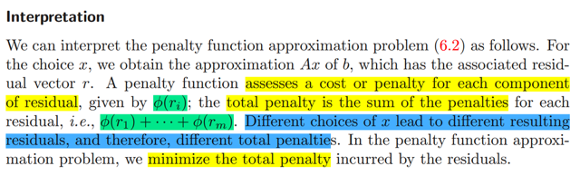</kbd>

> [!NOTE]
> Ta có thể diễn giải ý nghĩa của PENALTY FUNCTION là vầy: Với x, ta
> có Ax là approximation của b (ví dụ như prediction của target b từ
> data và parameter Ax). Thì sai khác giữa Ax và b là error / residual r
>
> Thế thì penalty function Φ(r) = [Φ(r1), Φ(r2), ...Φ(rm)] thì Φ(i) sẽ
> mang ý nghĩa là định ra một chi phí (cost) / "cái giá phải trả" / 
> hình phạt, mức phạt cho residual component thứ i'th
>
> Để rồi objective = Σ Φ(ri) mang ý nghĩa là tổng penalty
>
> Thế thì khi khái quát như vậy, thì mỗi một function cụ thể của Φ sẽ 
> dẫn đến kết quả khác nhau khi giải bài toán tối ưu trong đó ta tìm
> cách minimize penalty

 

<kbd>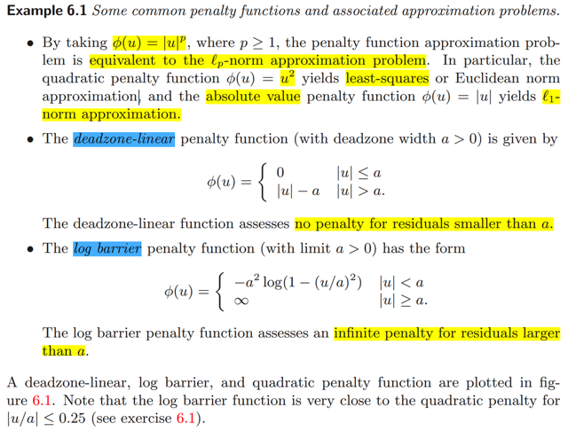</kbd>

> [!NOTE]
> Như đã nói, các khi Φ(r) = (|r|)^p, thì ta quay lại / có lại bài toán 
> norm approximation: minimize (Σ|ri|^p)^1/p. 
>
> Ví dụ p = 2, (Σ ri^2)^1/2 tức L2 square norm.

 

<kbd>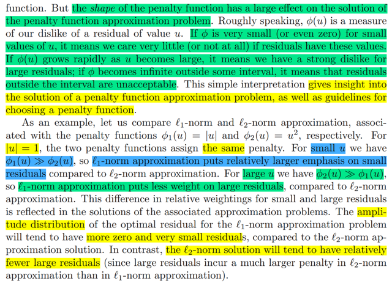</kbd>

<kbd>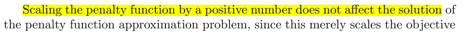</kbd>

> [!NOTE]
> Này nói rồi, đại ý là các penalty function khác nhau thì hành vi của
> chúng đối với mức độ lớn nhỏ của residual sẽ khác nhau.
>
> Ví dụ như nếu với r nhỏ mà Φ(r) nhỏ, thì tức là nó không khó chịu lắm
> với error nhỏ. Nhưng khi r tăng mà Φ(r) tăng rất nhanh thì chứng tỏ nó
> rất không thích error lớn. Và khi Φ(r) trở thành +infinity thì mang ý
> nghĩa là "không thể chấp nhận được"
>
> Rồi lấy ví dụ so sánh giữa khi Φ là L1, với L2. Thì khi u nhỏ, ví dụ nhỏ
> hơn 1, thì |u| >> u^2, ví dụ 0,1 > 0.01, cho thấy L1 norm "khó chịu với
> error nhỏ hơn" là L2 norm.
>
> Nhưng khi u lớn, thì |u| << u^2, ví dụ 1000 << 1000000, cho thấy L2
> norm khó chịu với error lớn hơn so với L1.
>
> Thành ra khi ta dùng hai function này, mỗi cái sẽ cho ra một kết quả
> (sau khi chạy bài toán tối ưu) khác nhau. Trong đó, với L1 norm thì sẽ
> có hầu hết residual là 0 hoặc rất nhỏ, vì L1 như đã nói, rất khó  chịu với
> residual nhỏ so với L2, đồng nghĩa là kết quả của L2 norm sẽ có thể
> tồn tại nhiều residual nhỏ (vì với L2, penalty trên residual nhỏ là không
> đáng kể, nên kiểu như dù vẫn còn residual dương nhỏ, nhưng coi như
> đã đạt optimal)
>
> Ngược lại, khi với L2 norm, ta sẽ không thấy tồn tại residual lớn so với
> L1, vì L2 norm penalty phạt rất nặng, cost rất cao đối với large residual.

 

<kbd>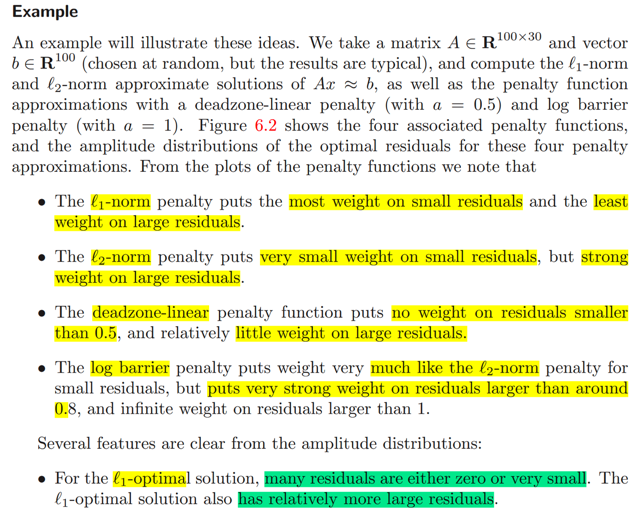</kbd>

<kbd>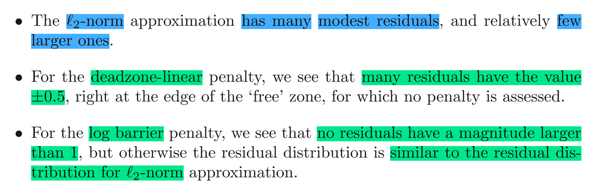</kbd>

<kbd>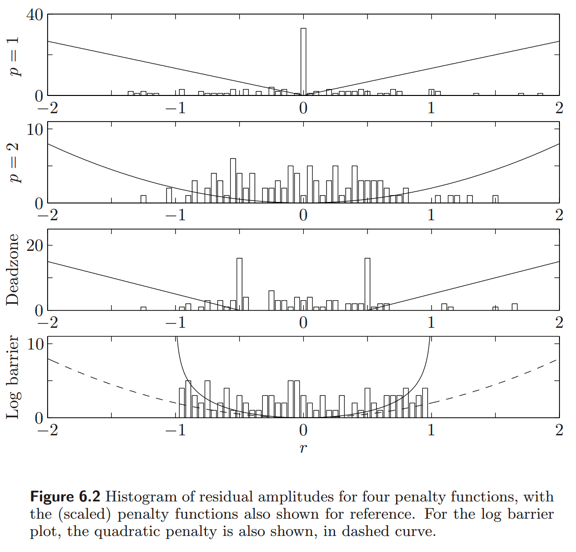</kbd>

 

<kbd>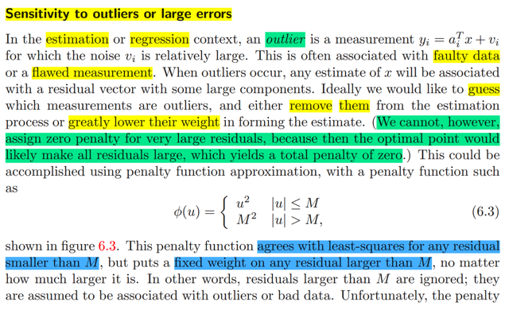</kbd>

<kbd>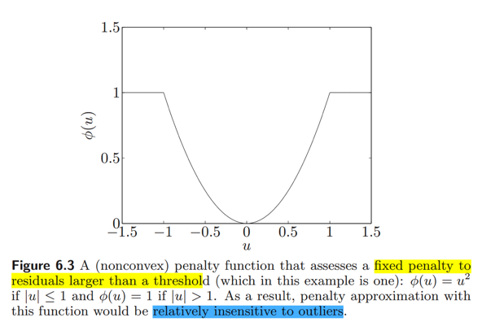</kbd>

> [!NOTE]
> đại khái là nói về OUTLIER, kiểu như khi dữ liệu bị đo sai, khiến
> residual nó lớn khác thường.
>
> Thì đại ý nói là, lí tưởng thì ta sẽ đoán xem cái nào là outlier
> để bỏ nó ra khỏi dữ liệu, hoặc gán weight cho nó rất nhỏ.
>
> (Ở đây có nói, ta chỉ gán weight rất nhỏ thôi, chứ nếu mà gán
> bằng 0 luôn thì optimizer sẽ làm sao cho mọi residual đều lớn
> để rồi chúng đều được gán weight = 0 khiến penalty = 0)
>
> Nhưng khó mà biết cái nào là outliner, nên một cách là dùng
> PENALTY FUNCTION NÀO CÓ TÍCH CHẤT ÍT NHẠY CẢM
> VỚI OUTLIER. 
>
> Một ví dụ là function mà nếu error nhỏ hơn mức M nào đó thì
> cho nó giống L2, còn quá mức đó thì cho Φ(u) = fixed value nào đó
>
> Làm vậy tuy cũng giúp ích nhưng nhược điểm là penalty function 
> này KHÔNG CONVEX
>
> Nhìn cái hình là thấy không convex rồi, nhớ lại định nghĩa convex
> là f(mixture) phải <= mixture of f. Biểu hiện hình ảnh đoạn nối
> hai điểm trên đồ thị (dây cung) phải luôn nằm trên đồ thị

 

<kbd>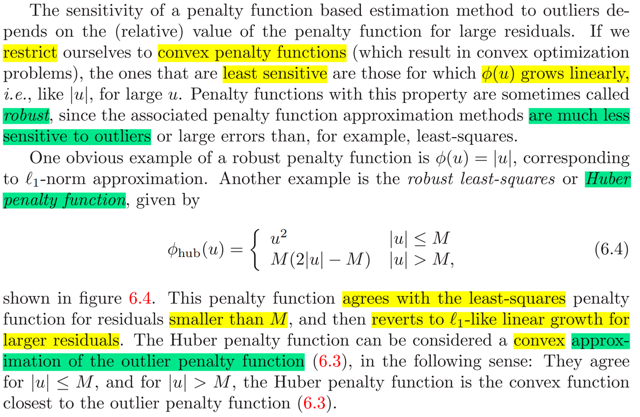</kbd>

> [!NOTE]
> Rồi thì đại khái là nếu ta yêu cầu phải có tính convex thì những cái
> mà có tính tuyến tính thì sẽ less sensitive với 
> outlier Do đó ví dụ như L1 norm, hoặc Huber penalty
>
> Công thức thì nó như vậy, cơ bản là giống L2 khi u nhỏ hơn mức nào
> đó và gần như tuyến tính khi u lớn hơn.
>
> Thì đại khái là cái này có thể coi như PHIÊN BẢN XẤP XỈ CỦA CÁI
> HỒI NÃY, có điều nó CONVEX
>
> Và gs cho biết thêm, Với bài toán regression dùng L1 norm thì 
> nó có tên là ROBUST REGRESSION bắt nguồn từ việc L1 norm 
> penalty là cái (tuy không phải the best, nhưng nằm trong số) những
> cái less sensitive với outlier tốt nhất

 

<kbd>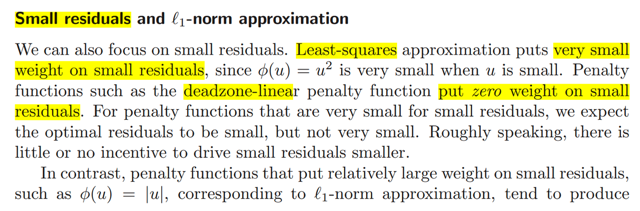</kbd>

<kbd>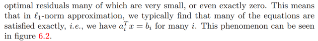</kbd>

<kbd>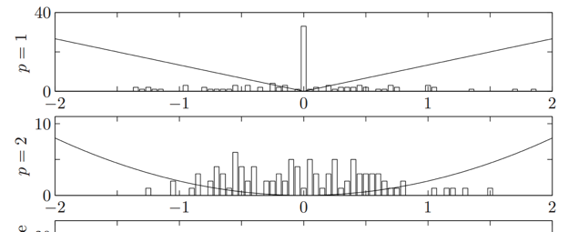</kbd>

> [!NOTE]
> Đại khái là với residual nhỏ. Thì khi penalty mà đối với chúng
> nhỏ, thì như đã nói hồi nãy, kiểu như không có động lực nào
> để qúa trình optimization thu nhỏ hơn nữa những residual nhỏ
> này. Kết quả là ví dụ như dùng L2 penalty, kết quả của quá trình
> optimization là tồn tại nhiều residual nhỏ (nhìn hình, ở dưới, trong 
> khoảng -1 đến 1 có nhiều cột thể hiện có nhiều residual mang giá
> trị trong khoảng này)
>
> Còn với L1 norm, là cái mà vẫn tạo penalty ko nhỏ đối với residual
> nhỏ, thì kết quả của quá trình tối ưu ép cho các residual rất nhỏ
> hoặc bằng 0 luôn. Nên ta thấy trong hình, ở trên, có lúp xúp các
> cột rất thấp quanh mốc 0 (là những residual mang giá trị rất nhỏ)
> và một cột rất cao ở 0 - tức là phần lớn các residual sau khi optimize
> (trong sách gọi là ở optimal) sẽ đều thành 0
>
> Hiểu cái này thì ta liên hệ với L1 norm / L2 norm regularization.
> L1 norm sẽ ép các parameter của model nhỏ thành 0 - khiến nó
> giống như feature selection = những feature ít ảnh hưởng sẽ bị
> set weight thành 0
>
> L2 norm thì chỉ ép chúng nhỏ lại, nhưng không thành 0.

 

<kbd>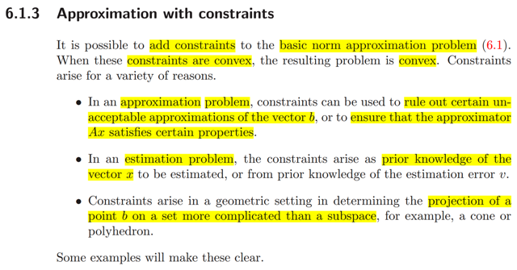</kbd>

> [!NOTE]
> Đại khái là bài toán Approximation ||Ax-b|| có thể có
> constraint (Nãy h là ko có constraint, chỉ có objective) Để rồi
> khi constraint function là convex thì ta có convex problem.
>
> Nói chung có nhiều lí do mà có thể ta có constraint. Xét ví dụ
> sẽ rõ
>
> 6.1 NORM APPROXIMATION
>
> 6.1.3 APPROXIMATION WITH CONSTRANTS

 

<kbd>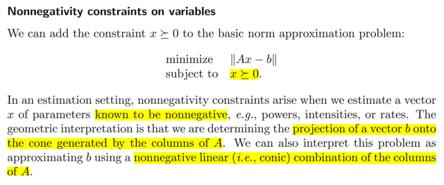</kbd>

<kbd>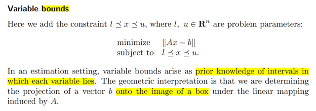</kbd>

<kbd>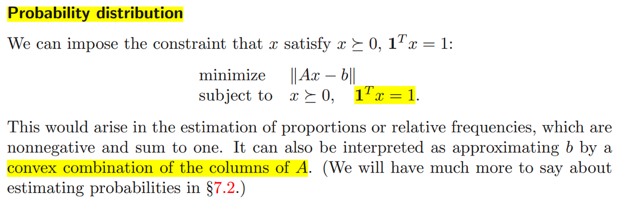</kbd>

> [!NOTE]
> Ví dụ như vầy, minimize ||Ax - b|| với x ≽ 0. Thì lí do của cái
> constraint này là có thể đôi khi trong bài toán thực tế ta biết
> x's component phải ko âm.
>
> Trong context hình học thì constraint này có nghĩa là ta project
> b lên một cone tạo bởi các cột của C(A). Hiểu nôm na là, thay vì
> project lên C(A) là một subspace, thì nay ta chỉ project nó lên
> một phần / một góc của subspace đó thôi (chính là một cone, 
> ví dụ nói R2 là một subspace thì R^2+ là một cone).
>
> Hoặc nếu nhìn bài toán như việc tìm x là coefficient tạo linear 
> combination các cột của A cho ra b thì với constraint thì nó trở
> thành tìm CONIC COMBINATION các cột của A (Conic combination
> là khi các hệ số không âm)
>
> ====
>
> Hoặc ví dụ như constraint là l ⪯ x ⪯ u. Nói chung là có thể vì 
> có prior knowledge nào đó mà ta biết x phải bị giới hạn trong 
> khoảng này.
>
> ====
>
> Hoặc là khi ta đang làm việc với x là probability distribution thì 
> dĩ nhiên phải có constraint xT1 = 1 (Σ x P(X=x) = 1

 

<kbd>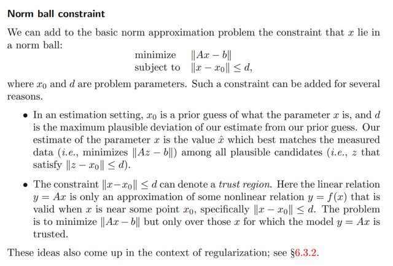</kbd>

 

<kbd>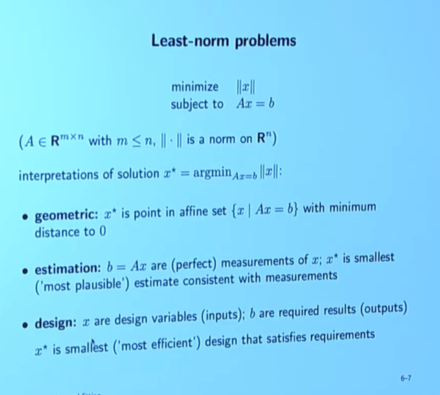</kbd>

> [!NOTE]
> Bài toán tiếp theo là Least-norm problem:
>
> minimize ||x|| subject to Ax = b với A là matrix (m, n) với m <=
> n. Và  ||.|| là norm (có thể là l1, l2...norm)
>
> Thế thì, review lại một chút: Nếu hệ phương trình Ax=b có nhiều
> phương trình hơn số biến, tức matrix A mập lùn thì Ax=b khi b
> ∈ C(A) thì khi đó nó sẽ có vô số nghiệm với công thức tổng
> quát là:
>
> x_complete = x_particular + α*x_null  khi đó ta sẽ có bài toán tìm
> solution có norm nhỏ nhất. và least norm solution x* = argmin Ax=b
> ||x|| sẽ có ý nghĩa hình học là điểm trong affine set x: Ax=b sao
> cho có khoảng cách nhỏ nhất tới 0
>
> hai ý nghĩa estimation và design thì chưa hiểu lắm

 

<kbd>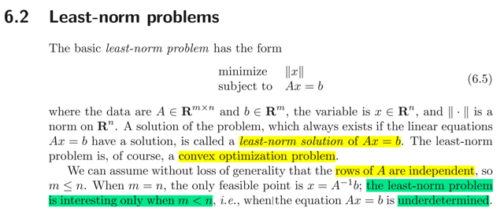</kbd>

<kbd>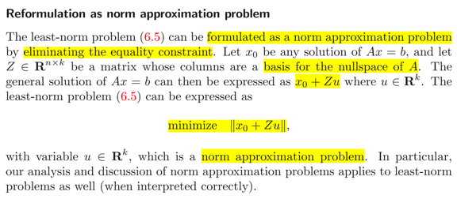</kbd>

> [!NOTE]
> Ta sẽ qua ứng dụng thứ hai, đó là LEAST-NORM PROBLEM.
> Trong đó ta sẽ minimize ||x|| subject to Ax = b.
>
> Thế thì cái này ta đã nói nhiều lần, nói lại lần nữa cũng không thừa.
> Xét constraint Ax = b, nó là hệ phương trình tuyến tính aiTx = bi Nó
> có thể vô nghiệm, unique hoạc vô số nghiệm.
>
> Và trong trường hợp vô nghiệm thì dĩ nhiên bài toán trở thành
> INFEASIBLE. Nếu nó có nghiệm duy nhất thì nó chính là optimal
> luôn. Do đó dĩ nhiên bài toán này chỉ thú vị khi hệ có vô số nghiệm
> và ta muốn minimize ||x||, tức tìm nghiệm có norm nhỏ nhất.
>
> Như đã biết từ MIT 18.06, nghiệm của Ax = b có dạng x_particular
> + x_null, tức trong đó x_particular là x thỏa Ax = b, x_null là nghiệm
> của Ax = 0.
>
> Vậy thì, như đã biết x_particular nằm trong rowspace, được map
> với b nằm trong columns space thông qua A. còn x_null dĩ nhiên
> nằm trong nullspace. Do rowspace và nullspace orthogonal
> complement nên x_null vuông góc với x_particular. Và do đó x =
> x_null + x_particular sẽ nhỏ nhất khi x_null = 0.
>
> Thế thì cũng vì vậy mà ta có thể thể hiện x = x0 + Zu, trong đó x0 là
> một prticular solution của Ax = b. Zu với Z là matrix có các cột là
> nullspace basis thì Zu là nullspace vector (x_null)
>
> 6.2 LEAST-NORM PROBLEMS

 

<kbd>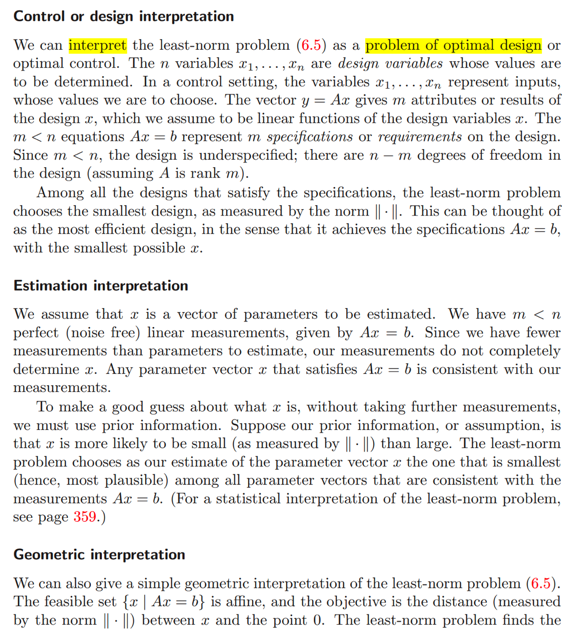</kbd>

<kbd>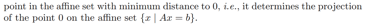</kbd>

 

<kbd>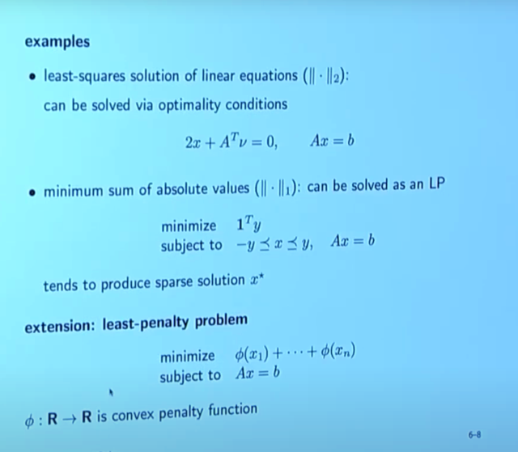</kbd>

> [!NOTE]
> một số ví dụ về least-norm problems: gồm có least-squares
> solution của linear equations:

 

<kbd>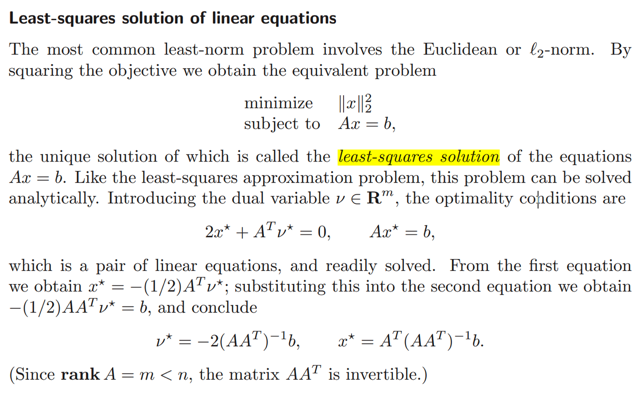</kbd>

> [!NOTE]
> Thực tế rất phổ biến khi ta bình phương norm lên để chuyển về equivalent
> problem: minimize ||x||^2 subject to Ax = b.
>
> Thế thì khi đó, optimal sẽ được gọi là least-square solution của Ax = b.
>
> Thử giải thích tại sao lại có cái optimal condition như vậy:
>
> g(λ, v) = inf x L(x, λ, v) <= L(x, λ, v)   | định nghĩa của infimum. 
>
> nên g(λ*, v*) = inf x L(x, λ*, v*) = inf x f0(x) + λ*Tf(x)  + v*Th(x)..
>
> .. <= L(x*, λ*, v*) = f0(x*) + λ*Tf(x*)  + v*Th(x*)
>
> (cái dấu <= này là do x* cũng thuộc feasible set, nên L(x*, λ*, v*) phải >=
> inf x L(x, λ*, v*)
>
> ..<= f0(x*) 
>
> (Dấu <= này là vì x* là optimal thì nó trước hết phải feasible: λifi(x*) <= 0, 
> và vihi(x*) = 0)
>
> Vậy ta có quan hệ d*= g(λ*,v*) = inf x f0(x) + λ*Tf(x)  + v*Th(x) <= f0(x*) = p*
>
> Khi ta có Strong Duality thì các dấu bằng sẽ xảy ra:
>
> d*= g(λ*,v*) = inf x f0(x) + λ*Tf(x)  + v*Th(x) = f0(x*) = p*
>
> Và cho thấy f0(x*) chính là = inf x f0(x) + λ*Tf(x)  + v*Th(x), tức x* là minimizer
> của L(x, λ*, v*)
>
> Từ đó dẫn đến KKT condition thứ 4: ∇f(x, λ*, v*) = 0
>
> Thế thì trong bài toán này, với square norm (objective) là convex function,
> các inequality constraint là affine thì ta nhớ slater condition chỉ trở về là
> bài toán có feasible hay không. Nếu feasible, thì ta sẽ có Strong Duality.
>
> Lagrangian: L = ||x||^2 + vT(Ax - b) = xTx + vTAx - vTb
>
> g(v) = inf x xTx + vTAx - vTb
>
> Gradient ∇xL: dL = (x+dx)T(x+dx) + vTA(x+dx) - vTb - xTx - vTAx + vTb
>
> = dxTx + xTdx + vTAdx = vTAdx + 2xTdx = (ATv + 2x)Tdx
>
> => ∇x L(x, v*) =  ATv* + 2x*
>
> Gradient của L tại optimal bằng 0:
>
> ∇xL(x*, v) = 0  <=> ATv* + 2x* = 0 
>
> KKT Condition đối với bài toán này (không có inequality constraint) sẽ
> chỉ gồm điểm thứ 4: ∇xL(x*, v) = 0
>
> Vậy cùng với Ax* = b ta sẽ giải ra v* , x*

 

<kbd>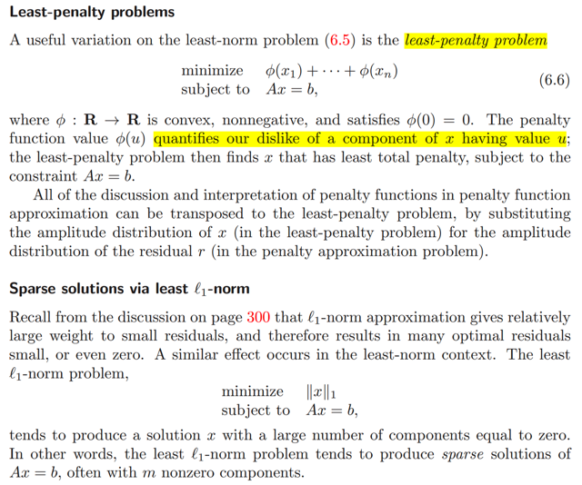</kbd>

<kbd>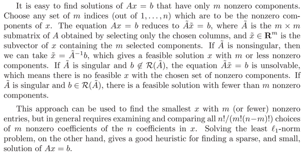</kbd>

> [!NOTE]
> SÁCH (XEM SAU)

 

<kbd>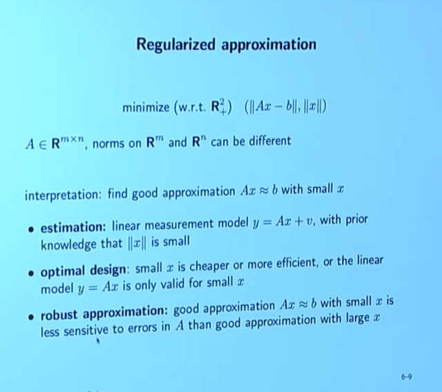</kbd>

 

<kbd>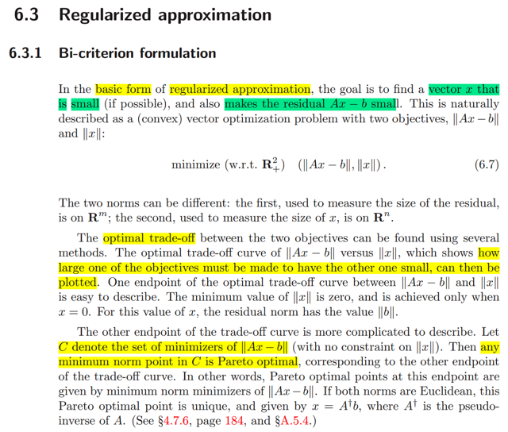</kbd>

> [!NOTE]
> Nói qua bài toán gọi là REGULARIZED APPROXIMATION, trong
> đó ta muốn minimize ||Ax - b|| và  đồng thời minimize ||x||.
>
> Thì cách tiếp cận đầu tiên là coi nó như bài toán VECTOR
> OPTIMIZATION (là bài toàn mà objective là vector: f0(x) = [F1(x), .
> ..Fn(x)]) f0(x) = [F1(x), F2(x)] với F1(x) = ||Ax - b||, F2(x) = ||x||.
>
> Để rồi như đã biết ở chapter 4. Cách tiếp cận phổ biến khi gặp bài
> toán vector optimization đó là ta sẽ SCALARIZATION,  chuyển
> thành bài toán có objective f0(x) = Σi λiFi(x).
>
> Và bằng cách minimize f0(x) (dĩ nhiên vẫn trong set O ={f0(x), x ∈
> feasible set, tức x phải thỏa các constraint nếu có, nhưng ở đây
> thì không có constraint} ta sẽ có OPTIMAL của bài toán này chính
> là PARETO OPTIMAL của bài toán vector optimization
>
> Thế thì, đại khái là họ nói ta có thể vẽ ra đường cong OPTIMAL
> TRADE-OFF CURVE (đã thấy ở chapter 4) từ đó có thể phân tích.
>
> Đoạn dưới chưa hiểu lắm

 

<kbd>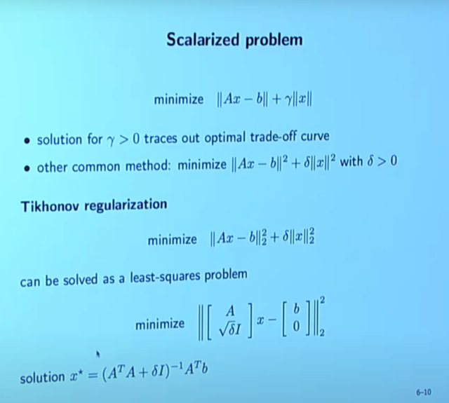</kbd>

 

<kbd>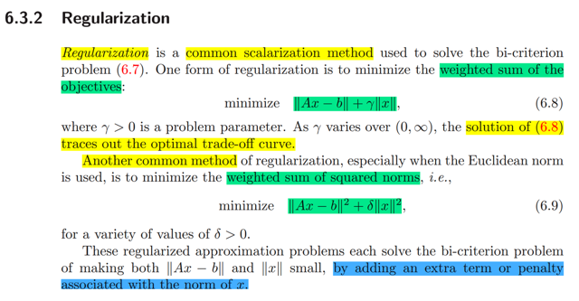</kbd>

> [!NOTE]
> Đại khái có thể hiểu là, đối diện với bài toán REGULARIZED
> APPROXIMATION": minimize hai objective ||Ax - b||, và ||x||.
>
> Thì một cách là thiết lập vector [F1(x), F2(x)] với F1(x) = ||Ax - b||
> F2(x) = ||x||. Và CHUYỂN THÀNH BÀI TOÁN VECTOR
> OPTIMIZATION (minimize objective function f0(x) là một vector)
>
> Mà để giải, phương pháp thông thường cũng là scalarization: lại
> chuyển thành bài toán khác với objective là Σ λi Fi(x) và optimal
> của bài toán này là Pareto optimal của bài toán vector
> optimization.
>
> Còn ở đây, một cách khác, đó là ta chuyển thành bài toán mà
> objective là ||Ax - b|| + α||x||, cũng là scalar. Rồi minimize nó. Thì
> cũng dễ thấy cái này thật ra cũng tương tự như giải bài toán
> vector optimization với λ = (1, α) vậy mà ta nhớ trong cách tiếp
> cận vector optimization, thì bằng cách chọn λ1, λ2 khác nhau (
> chính xác hơn là khác tương đối so với nhau, thông qua thay đổi
> tỉ lệ λ1/λ2) thì ta sẽ cơ bản là ưu tiên F1, hay F2, thì ở đây cũng
> vậy khi thay đổi α thì ta thực chất đang thay đổi tỉ lệ relative 
> weight của mỗi objective  
>
> ====
>
> Một cách khác là cũng vậy, mà bình phương lên: ||Ax - b||^2 +
> β||x||^2
>
> Và những kiểu này gọi là add extra term vào objective (trong bối
> cảnh machine learning ta thấy nhiều, add regularizer vào loss
> term)

 

<kbd>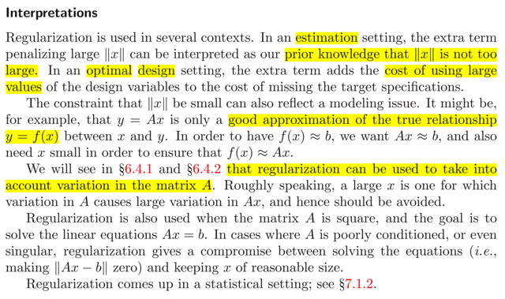</kbd>

> [!NOTE]
> Đại khái là một interpretation cho cái vụ / bài toán REGULARIZATION.
>
> Một trong số đó mà ta đã biết trong machine learning đó là ta muốn
> giảm loss (main loss) là sai khác giữa prediction của model với target
> value nhưng cũng muốn giá trị của parameter không trở nên lớn nhằm
> giúp tránh overfit.
>
> Ở đây gs nói trong bối cảnh ESTIMATION, thì giữ không có ||x|| lớn 
> để phản ảnh một prior knowledge của ta là x không lớn.
>
> Một lí do nữa mà gs có nói trong bài đó là, vì ta chưa biết A, A có
> thể variate, thì bằng cách muốn / giữ cho x nhỏ, ta sẽ giảm mức biến
> động của Ax
>
> Ngoài ra còn nhiều cách giải thích khác cho những bài toán khác

 

<kbd>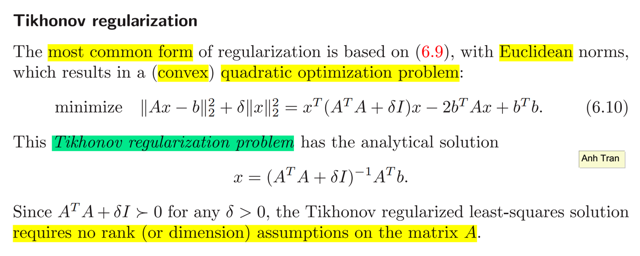</kbd>

> [!NOTE]
> Đại khái là như hồi nãy nói, một cách tiếp cận bài toán
> regularized approximation là giải nó như vector
> optimization.
>
> Cách khác là scalarizing bằng cách add hai cái lại, ||Ax - b|| +
> α||x||.
>
> Thì một cách phổ biến khác là cũng vậy nhưng bình phương:
>
> ||Ax - b||^2 + β ||x||^2
>
> Cách này khiến objective trở thành QUADRATIC function (và
> do đó là bài toán convex). Thì cái này có tên riêng thì cái này có
> tên riêng là TIKHONOV REGULARIZATION PROBLEM
>
> Việc tìm ra x = (ATA + δI)inv ATb thì không khó gì, chỉ cần tìm
> gradient ∇f, và giải ∇f = 0, thì nó chính là optimal (đây là quadratic
> function, nên  critical point cũng là minimum)
>
> Và sở dĩ (ATA + δI) invertible là vì ATA luôn ≽ 0 (positive
> semi definite, cái này đã biết từ MIT 18.06: check quadratic form
> của nó xATAx = ||Ax|| >= 0 => ATA positive semi definite) nên với
> δ > 0, thì ATA + δI sẽ trở thành ≻ 0 (positive definite) Vì sao:
>
> Gọi λ là eigenvalue của ATA với eigenvector x: ATAx = λx
>
> <=> ATAx + δIx = λx + δIx <=> (ATA + δI)x = (λ + δ)x
>
> Điều này cho thấy x cũng là eigenvector của (ATA + δI) nhưng
> eigenvalue tương ứng là λ + δ.
>
> Thế thì với ATA, là positive sem definite matrix, λ có thể = 0
> (không âm) nhưng vì δ > 0 nên λ + δ chắc chắn > 0. Vậy có thể
> kết luận mọi eigenvalues của (ATA + δI) đều dương nên nó là 
> positive definite. Và cũng vì vậy mà det (ATA + δI) > 0 => invertible
>
> Do đó miễn là δ > 0 thì luôn có analytic solution x = (ATA + δI)inv ATb
> mà ko cần giải định gì về rank của A (ý là nếu mà δ ko dương, ví dụ 
> δ = 0 đi, khi đó để ATA invertible thì A phải full column rank)

**🔗 See also:** [linked note](./lec_7.md#node-szbvhet)

 

<kbd>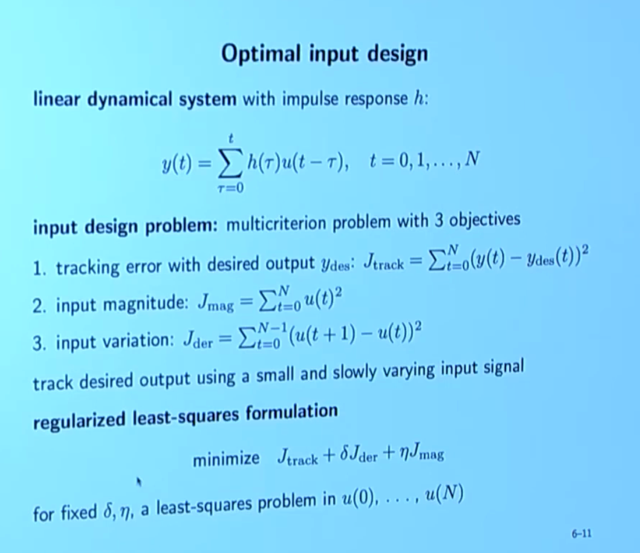</kbd>

 

<kbd>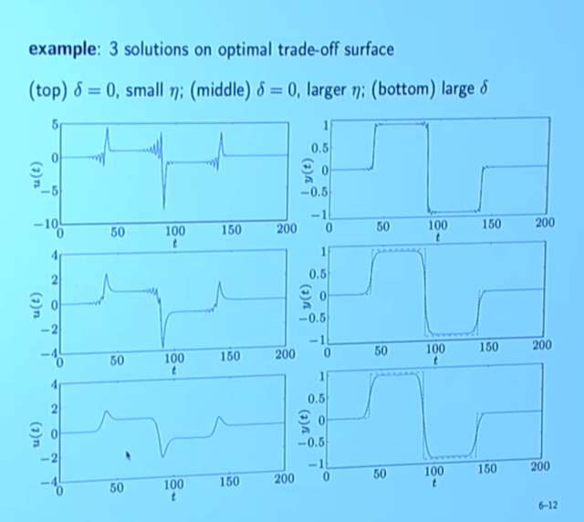</kbd>

 

<kbd>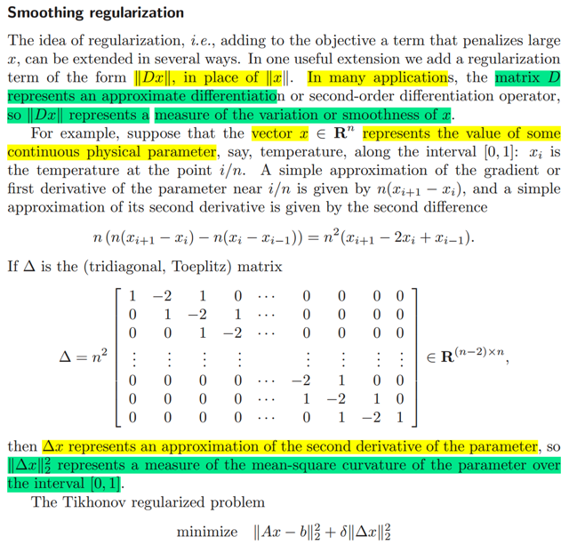</kbd>

<kbd>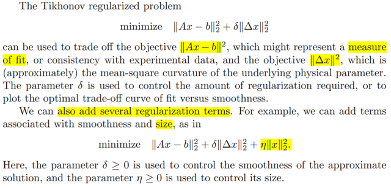</kbd>

> [!NOTE]
> Đại khái là có thể mở rộng regularization thay vì ||x|| thì dùng ||Dx||.
>
> Chưa hiểu rõ lắm nhưng đại khái trong nhiều bài toán, ta có thể dùng
> matrix D là matrix biểu thị approximate differentiation. Từ đó ||Dx|| thể
> hiện mức biến động của x, hoặc độ mượt.
>
> Ví dụ như một bài toán mà x là giá trị của một đại lượng liên tục.
> Và Δ gọi là Toeplizt matrix, đại diện cho ươc lượng của đạo hàm cấp
> 2 của parameters. Khi đó ||Δx||^2 đại diện cho chỉ số trung bình bình
> phương của độ cong (curvature)
>
> Khi đó ý nghĩa của bài toán minimize ||Ax - b||^2 + δ||Δx|| sẽ là làm sao
> fit nhất (Ax -  b) nhưng phải smooth
>
> Sơ sơ vậy thôi

 

<kbd>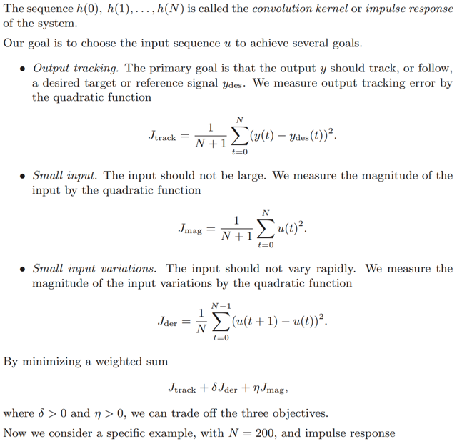</kbd>

<kbd>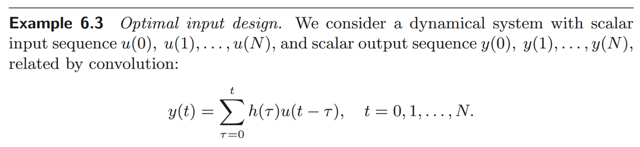</kbd>

<kbd>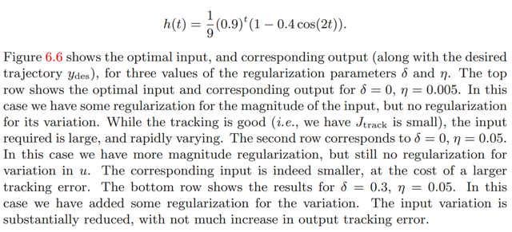</kbd>

> [!NOTE]
> đây là ví dụ nói về cái này
>
> Với các hệ số khác nhau ta ra các kêt quả khác nhau

 

<kbd>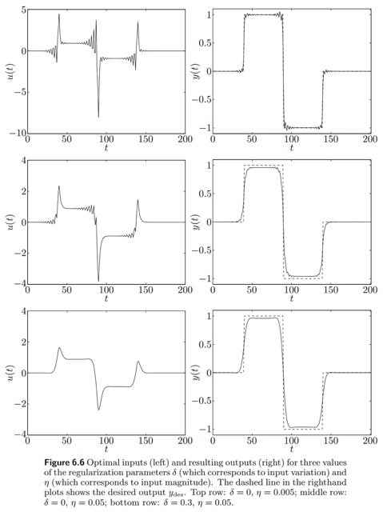</kbd>

 

<kbd>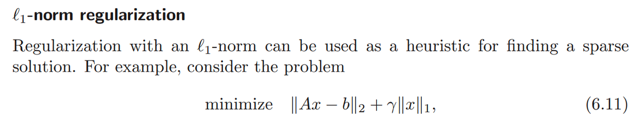</kbd>

<kbd>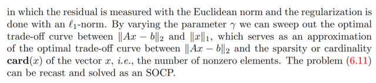</kbd>

<kbd>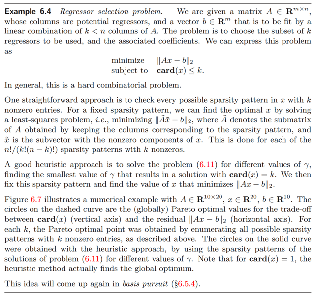</kbd>

> [!NOTE]
> Đại khái là, mục tiêu là tìm x, để giảm ||Ax - b|| nhưng MUỐN X
> SPARES = THƯA tức có nhiều component = 0.
>
> thì bằng cách dùng l2 norm ở main primary objective, và l1 norm ở
> secondary objective ta sẽ trade off giữa ||Ax - b|| và sparsity.
>
> Một ví dụ đại khái là bài toán Regressor - theo định nghĩa là ta muốn
> tìm x để linear combine các columns của A để cho ra  b => objective
> ||Ax - b|| (l2 norm). Nhưng constraint là card(x) <= k (card là
> cardinality. là function tính số non-zero component của x) Nên ý nghĩa
> của bài toán này là muốn tìm (hệ số của) linear combination  các cột
> của A (gọi là các regressor) để cho ra b. Nhưng (với constraint card(x)
> <= k) sao cho chỉ lấy k cột thôi (vì thỏa card(x) <= k tức vector x chỉ có
> <= k non-zero components, dẫn đến khi nhân Ax nó sẽ chỉ "lấy" k cột
> trong n cột của A thôi)
>
> ....Còn nữa quay lại sau

 

