# Giới thiệu Mô hình ngôn ngữ lớn

📊 **Progress:** `22` Notes | `28` Screenshots | `21` AI Reviews

---

## Giới thiệu Mô hình ngôn ngữ lớn

<kbd>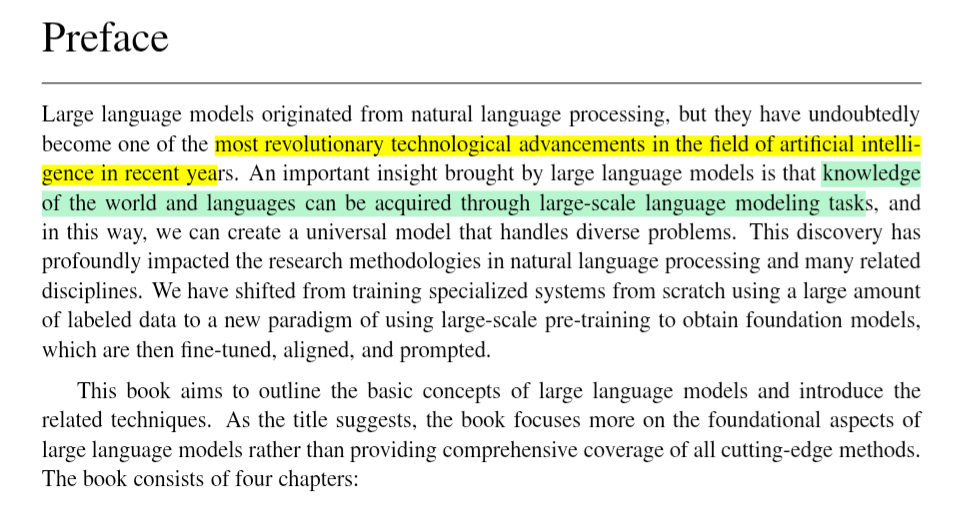</kbd>

> [!NOTE]
> - **Mô hình ngôn ngữ lớn (LLM)**, có nguồn gốc từ một nhánh của **Xử lý ngôn ngữ tự nhiên (NLP)**, hiện là một trong những **cuộc cách mạng công nghệ** quan trọng nhất trong lĩnh vực **Trí tuệ nhân tạo (AI)** những năm gần đây.- Một đặc điểm nổi bật của LLM là khả năng tiếp nhận, tiếp thu và học hỏi **kiến thức của nhân loại** và **ngôn ngữ** thông qua việc huấn luyện mô hình ở **quy mô lớn**.- Điều này cho phép tạo ra các **mô hình thông minh, tổng quát**, có khả năng xử lý và giải quyết các **tác vụ và vấn đề phức tạp**.- Sự phát triển này đã dịch chuyển phương pháp từ việc huấn luyện các mô hình hay bài toán **chuyên biệt** sang việc huấn luyện một **mô hình nền tảng (base model)** quy mô lớn sử dụng **dữ liệu có gắn nhãn** phong phú.- Sau đó, **mô hình nền tảng** này có thể được **tinh chỉnh (fine-tune)** hoặc sử dụng **lời nhắc (prompt)** để áp dụng cho nhiều bài toán khác nhau.- Tóm lại, **kiến thức tổng quát** được học bằng cách huấn luyện một mô hình trên **dữ liệu ngôn ngữ**, tạo ra một **mô hình nền tảng**, sau đó được **tinh chỉnh** cho các nhiệm vụ chuyên biệt.

> [!TIP]
> **🤖 AI Feedback** — ✅ Score: **98/100**
>
> Bản ghi chú rất chính xác và đầy đủ, bao quát tất cả các điểm chính trong văn bản gốc. Cách diễn đạt mượt mà và truyền tải tốt ý nghĩa.

 

## Nền tảng mô hình ngôn ngữ lớn

<kbd>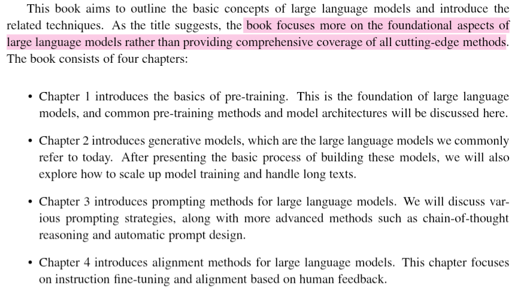</kbd>

> [!NOTE]
> Cuốn sách tập trung vào các nền tảng của mô hình ngôn ngữ lớn. Tác giả nhấn mạnh sẽ không đề cập đến công nghệ tiên tiến ('cutting edge'), mà chỉ các phần nền tảng. Nội dung sách được chia thành bốn chương. Chương 1 nói về các nền tảng cơ bản của quá trình tiền huấn luyện (pre-training), đây là nền tảng của một mô hình ngôn ngữ lớn. Chương này sẽ đề cập đến các phương pháp tiền huấn luyện thông dụng và kiến trúc mô hình. Chương 2 nói về generative model (mô hình tạo sinh), cụ thể là large language model (mô hình ngôn ngữ lớn). Chương này sẽ trình bày các quá trình và bước cơ bản để xây dựng một mô hình như vậy, cách scale up model (tăng quy mô huấn luyện) và xử lý dữ liệu có ngữ cảnh dài. Chương 3 sẽ nói về các phương pháp và chiến lược prompting (kích thích), bao gồm các phương pháp cao cấp hơn như Chain-of-Thought (chuỗi suy luận). Chương 4 sẽ nói về alignment method (phương pháp điều chỉnh), tức là các cách làm để mô hình có thể tuân theo chỉ dẫn và yêu cầu của con người. Chương này sẽ bao gồm phương pháp Instruction fine-tuning (tinh chỉnh có hướng dẫn) và tinh chỉnh dựa trên human feedback (phản hồi từ con người). Tóm lại, đây là tổng quan về nội dung chính của cuốn sách.

> [!TIP]
> **🤖 AI Feedback** — ✅ Score: **97/100**
>
> Bản tóm tắt rất chính xác và đầy đủ, truyền tải tốt nội dung chính và cấu trúc của cuốn sách. Chỉ thiếu một chi tiết nhỏ về 'automatic prompt design' trong Chương 3.

 

### Ghi chú mô hình ngôn ngữ lớn

<kbd>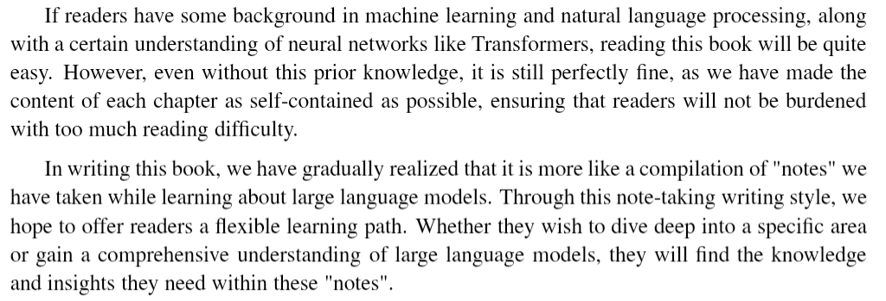</kbd>

> [!NOTE]
> Cuốn sách này được thiết kế để dễ đọc cho những người đã có kiến thức nền tảng về học máy, xử lý ngôn ngữ tự nhiên, và các mô hình như Neural Network, Transformer. Tuy nhiên, nếu người đọc chưa có, tác giả sẽ cung cấp đầy đủ kiến thức nền tảng trong mỗi chương, nên không cần lo lắng. Thực chất, sách là tập hợp ghi chú của nhóm tác giả trong quá trình tìm hiểu mô hình ngôn ngữ lớn. Do đó, người đọc được khuyến khích học theo cách tùy ý, không cần tuân thủ cấu trúc cố định.

> [!TIP]
> **🤖 AI Feedback** — ✅ Score: **97/100**
>
> Bản tóm tắt tiếng Việt rất chính xác và truyền tải đầy đủ các ý chính của văn bản gốc, bao gồm cả đối tượng độc giả và phương pháp học linh hoạt. Cách diễn đạt tự nhiên, dễ hiểu.

> [!IMPORTANT]
> **🎤 Review Session 1** — Score: **60/100**
>
> Phần giải thích của bạn chính xác về đối tượng độc giả được khuyến nghị có kiến thức nền tảng. Tuy nhiên, bạn đã bỏ lỡ các điểm quan trọng khác như cách sách hỗ trợ người đọc chưa có kinh nghiệm, bản chất của sách là một tập hợp ghi chú, và cách tiếp cận học tập linh hoạt mà sách mang lại. Điều này khiến cho phần giải thích của bạn còn thiếu sót đáng kể về mục đích và cấu trúc tổng thể của cuốn sách.

> [!IMPORTANT]
> **🎤 Review Session 2** — Score: **70/100**
>
> Bạn đã nắm bắt tốt ý chính về cách tiếp cận linh hoạt của cuốn sách. Tuy nhiên, có một chi tiết quan trọng về phương pháp hỗ trợ người đọc chưa có kiến thức nền tảng đã bị nhầm lẫn.

 

#### Bảng ký hiệu toán học

<kbd>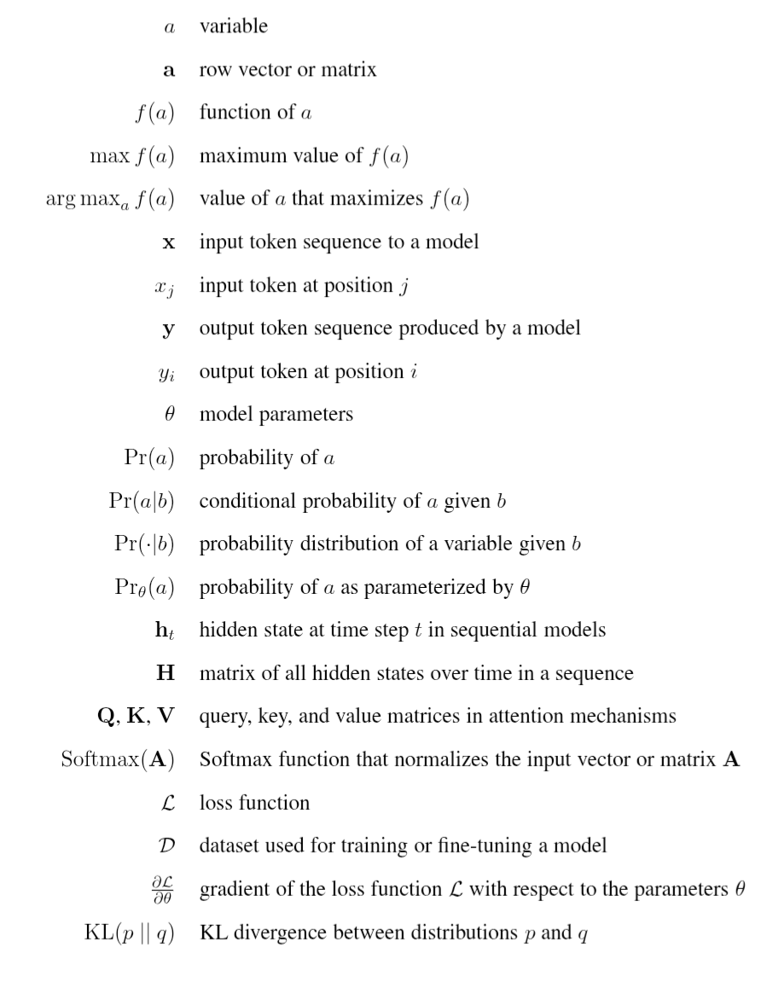</kbd>

> [!NOTE]
> Phần này thì có thể thấy rằng á là tác giả cung cấp một số những cái à những cái ký hiệu toán học và sử dụng ở trong sách. Ví dụ như là biến ngẫu nhiên variable. À không phải không phải biến ngẫu nhiên mà là biến thôi. À ký hiệu của những cái function à những cái ký hiệu xác suất, nói chung là ký hiệu toán học. Ký hiệu toán học cũng như là một số những cái sử dụng trong những mô hình transformer. Như mình có thể thấy ở đây là QKV, viết tắt của query, key và value. Những ký hiệu xác suất cũng như xác suất có điều kiện. À tham số mô hình. À đạo hàm, mình thấy có ký hiệu của đạo hàm riêng. Cụ thể đây là gradient. Tức là vector à đạo hàm. Vector các đạo hàm riêng đó, gradient vector đó. Nói chung giải thích đây thì đây chỉ là một cái list những cái ký hiệu toán học sử dụng trong sách thôi.Tác giả cung cấp các ký hiệu toán học và xác suất được sử dụng trong sách. Các ký hiệu này bao gồm: biến (không phải biến ngẫu nhiên), ký hiệu hàm số (function), ký hiệu xác suất (nói chung và xác suất có điều kiện), tham số mô hình, và các ký hiệu liên quan đến đạo hàm (đạo hàm riêng, gradient – vector đạo hàm riêng). Đặc biệt, có đề cập đến các ký hiệu trong mô hình Transformer như QKV (Query, Key, Value). Đây là danh sách tổng hợp các ký hiệu toán học quan trọng dùng trong tài liệu.

 

##### Tiền huấn luyện

<kbd>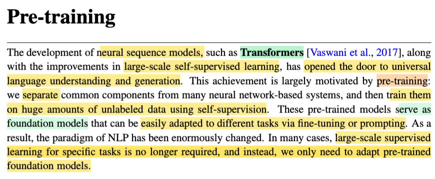</kbd>

> [!NOTE]
> Trong đoạn này, tôi hiểu đại khái là họ nói về một sự thay đổi lớn trong cách con người thực hiện các bài toán xử lý ngôn ngữ tự nhiên (Natural Language Processing - NLP). Trước đây, người ta thường phải giải quyết từng bài toán riêng biệt bằng cách huấn luyện các mô hình độc lập cho mỗi bài toán. Tuy nhiên, bước chuyển lớn đến từ sự phát triển của các mô hình neural sequence (mô hình tuần tự thần kinh). Neural sequence là các mô hình dựa trên nền tảng mạng thần kinh (neural network). Thuật ngữ 'sequence' ở đây ám chỉ việc các mô hình này có khả năng tạo ra ngôn ngữ theo cách tuần tự, vì vậy chúng được gọi là sequence model. 'Neural' chỉ ra rằng chúng dựa trên mạng thần kinh và học sâu (deep learning). Một ví dụ điển hình là mô hình Transformer, ra mắt năm 2017. Sự phát triển của những mô hình này, kết hợp với huấn luyện có giám sát (supervised learning) trên quy mô lớn, đã tạo ra một bước chuyển dịch. Bước chuyển dịch này đã mở ra khả năng xây dựng các mô hình có thể hiểu, nói và tạo ra ngôn ngữ con người một cách phổ quát. Từ đó, chúng đóng vai trò là những mô hình nền tảng, có thể áp dụng để giải quyết nhiều bài toán khác nhau, thay vì phải xây dựng một mô hình riêng lẻ cho mỗi bài toán. Đây chính là những bước tiền huấn luyện (pre-training). Trong quá trình tiền huấn luyện, các mô hình nền (base models) được huấn luyện trên một bộ dữ liệu khổng lồ bằng phương pháp học tự giám sát (self-supervised learning). Sau đó, chúng đóng vai trò là các mô hình nền. Dựa trên các mô hình nền này, người ta thực hiện thêm các bước như tinh chỉnh (fine-tuning) hoặc tạo câu lệnh (prompting) để giải quyết các bài toán cụ thể. Tuy nhiên, tất cả đều dựa trên các foundation model. Khác với trước đây, khi mỗi bài toán yêu cầu một mô hình riêng biệt. Giờ đây, sau bước tiền huấn luyện, chúng ta có một foundation model làm trung tâm, sau đó thực hiện các bước tinh chỉnh hoặc tạo câu lệnh để giải quyết một bài toán cụ thể. Sự thay đổi này đã thay đổi hoàn toàn lĩnh vực và cộng đồng NLP. Đây là điểm cốt lõi: không còn phải giải quyết từng bài toán cụ thể bằng một mô hình cụ thể riêng biệt nữa, thay vào đó, chỉ cần điều chỉnh (adapt) các mô hình nền đã được tiền huấn luyện.

> [!TIP]
> **🤖 AI Feedback** — ✅ Score: **95/100**
>
> Bài tóm tắt của bạn thể hiện sự hiểu biết rất sâu sắc và chính xác về sự chuyển đổi mô hình trong NLP từ các mô hình đặc thù cho từng tác vụ sang các mô hình nền tảng.

 

- **Thành tựu của tiền huấn luyện**

<kbd>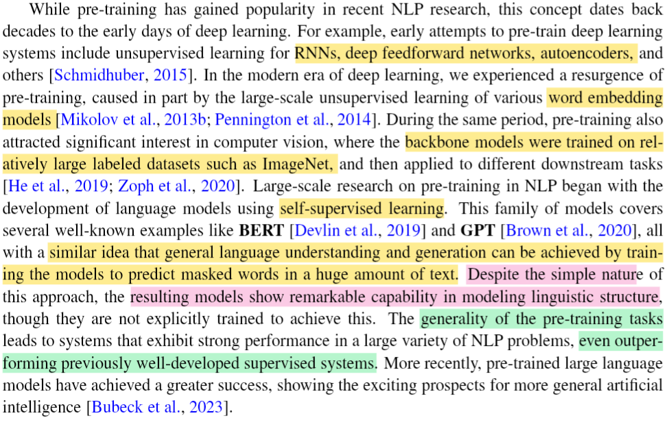</kbd>

> [!NOTE]
> Dù khái niệm **tiền huấn luyện** (**pre-training**) gần đây trở nên nổi tiếng, đặc biệt với sự phát triển của các **mô hình ngôn ngữ lớn**, thực tế nó đã xuất hiện từ lâu. Các nỗ lực ban đầu bao gồm việc sử dụng **autoencoder** hoặc huấn luyện trên các mô hình **deep feed forward network**. Vào năm 2013, với sự phát triển của deep learning, các nhà nghiên cứu như Microlab đã xây dựng những mô hình **tiền huấn luyện** nhằm tạo ra **word embedding**. **Word embedding** là những vector trong không gian đa chiều, phản ánh ý nghĩa ngữ nghĩa của từ vựng. Cùng thời điểm đó, khái niệm **tiền huấn luyện** cũng được áp dụng rộng rãi trong lĩnh vực **thị giác máy tính** (**computer vision**). Cụ thể, các mô hình thị giác được huấn luyện trên các bộ dữ liệu lớn như **ImageNet** (do bà Feifei Li tại Đại học Stanford chuẩn bị), và các **tham số** (**parameters**) từ những mô hình được **tiền huấn luyện** này sau đó được sử dụng làm nền tảng cho các bài toán cụ thể. Trong lĩnh vực Xử lý ngôn ngữ tự nhiên (NLP), các mô hình như **BERT** và **GPT** đã áp dụng phương pháp **tiền huấn luyện** theo kiểu **tự giám sát** (**self-supervised**). Ví dụ, mô hình được đưa một đoạn văn, che đi một từ và tự dự đoán từ bị che; quá trình này được lặp lại và huấn luyện mô hình trên một lượng lớn dữ liệu (ví dụ: toàn bộ internet). Mặc dù cách thức **tự giám sát** có vẻ đơn giản, **tiền huấn luyện** đã chứng minh được hiệu quả vượt trội: nó giúp mô hình học được tri thức và hiểu ngôn ngữ một cách phổ quát; đóng vai trò là mô hình nền tảng vững chắc cho nhiều bài toán cụ thể; và thậm chí có thể vượt qua hiệu suất của các mô hình được xây dựng và huấn luyện riêng cho từng bài toán cụ thể.

> [!TIP]
> **🤖 AI Feedback** — ✅ Score: **98/100**
>
> Phần phân tích rất toàn diện, dịch chính xác tất cả các điểm nổi bật và cung cấp ngữ cảnh cũng như giải thích chuyên sâu tuyệt vời cho các khái niệm chính, như word embedding và self-supervised learning, giúp nâng cao hiểu biết tổng thể. Bạn đã giải thích rất chi tiết và dễ hiểu.

 

- **Huấn luyện trước trong NLP**

<kbd>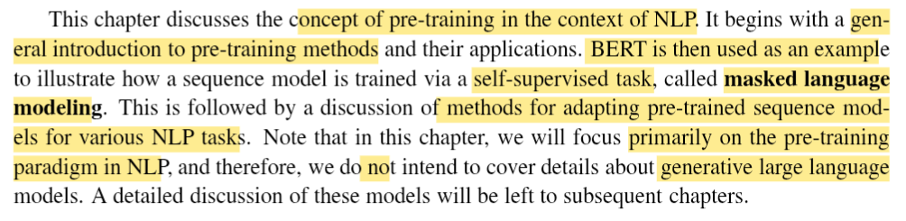</kbd>

> [!NOTE]
> Đại khái là chương này họ sẽ nói về những vấn đề cơ bản của pre training, với ví dụ là mô hình Bert, trong đó nó được train theo kiểu selft supervised learning, với cái tên cụ thể là Masked Language Model. Nhờ học qua ro nên mình biết đại khái là nó sẽ có cái kiểu tự che và tự đoán lại. 
>
> Sau đó họ sẽ nói về việc áp dụng các pretrained model này vào các bài toán cụ thể của nlp.

> [!TIP]
> **🤖 AI Feedback** — ⚠️ Score: **88/100**
>
> Bản tóm tắt nắm bắt các điểm chính của chương rất chính xác và cung cấp hiểu biết sâu sắc về Masked Language Model. Tuy nhiên, nó chưa đề cập đến việc chương này sẽ không đi sâu vào các mô hình ngôn ngữ lớn tạo sinh.

 

- **Tiền huấn luyện mô hình NLP**

<kbd>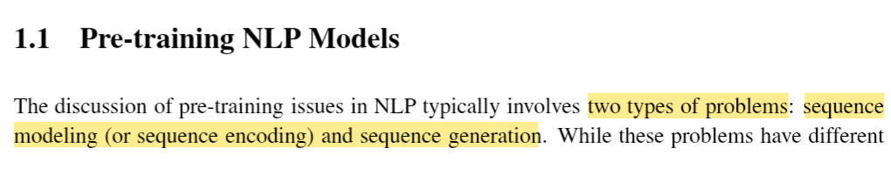</kbd>

<kbd>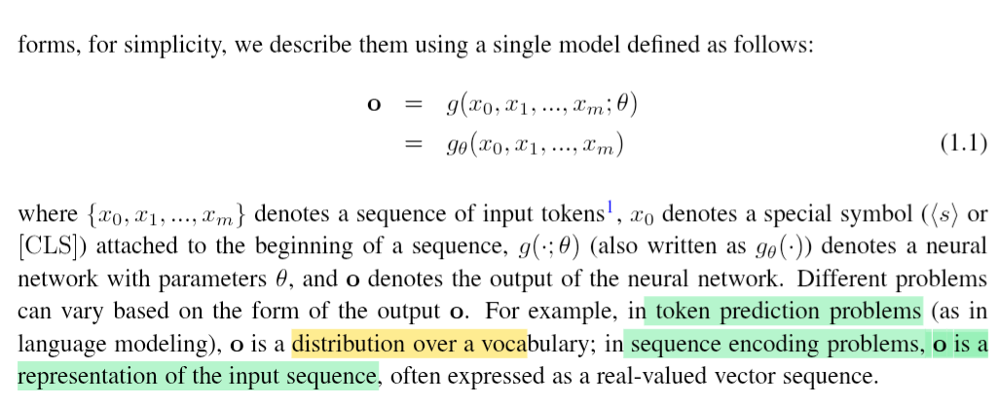</kbd>

> [!NOTE]
> Phần này đại khái là mình sẽ bắt đầu qua cái cái cái việc gọi là pre-training NLP model, những cái mô hình việc mà mình nói chung mình sẽ bắt đầu vào tìm hiểu những cái vấn đề liên quan đến cái pre-training. Thì mở đầu là họ nói đại khái là có hai loại vấn đề. Có hai loại. Một loại á, tức là có hai loại sequence modeling. Một cái là sequence modeling, một cái là sequence generation. Mình tạm hiểu thế này, sequence modeling á là ví dụ như mình muốn tức là mình muốn nắm bắt, mình muốn giống như mình nén một cái chuỗi dữ liệu, một cái một cái câu thành ra một cái vector mà sao cho nó chứa những vector số, làm sao nó chứa được những con số mà phản ánh được cái ngữ nghĩa của cái câu đó, để rồi mình dùng cái vector đó trong những cái bước tiếp theo. Đó là gọi là sequence modeling hoặc là sequence encoding. Còn cái sequence generation á thì mình lại muốn là nhận vào một cái câu nhưng mà mình muốn output ra một cái dự đoán cho cái câu, cho cái từ tiếp theo. Đó, đại khái là vậy. Vậy thì ở đây họ mới mới cho mình một cái gọi là cái ký hiệu, một cái cách ký hiệu. Hoặc là một cái cách mô tả về mặt theo kiểu ký hiệu của một cái mô hình. Tất nhiên là nó có dạng như một cái hàm số. Nhận vào X0, X1, vân vân, đến Xm, tức là nhận vào một cái chuỗi input. Và cái hàm số này được tham số hóa, tức là cái parameter đó là là ký hiệu bởi theta. Theta tất nhiên không phải là một một một một tham số duy nhất mà nó là một cái vector ờ tất cả các tham số của cái cái mô hình. Để rồi cái input nhận vô là cái chuỗi X0, X1, Xm thì nó sẽ trả ra cái output là cái chữ O này. Thì nói về cái input á thì người ta có cho biết cái X0, cái chữ đầu tiên, cái X0, cái input đầu tiên á thường là được ký hiệu tức là thường là mang một cái cái symbol đặc biệt, nó là giống như mở đầu một cái câu vậy đó. Ở đây nó có cái symbol đặc biệt, tức là nó mang mang một cái vai trò đặc biệt, làm vai trò làm cho biết đây là cái bắt đầu của một cái cái cái ờ một cái sequence của một cái chuỗi. Rồi theta thì như nó nói nó là là là đại diện cho toàn bộ tham số của cái neural network, của cái mô hình. Và tất nhiên đó là cái thứ mà mình cần phải phải thay đổi, phải phải tìm, phải chọn, phải thay đổi, phải học cho được ra giá trị của cái tham số. Trong quá trình huấn luyện. Vậy thì cái output á thì nó sẽ khác nhau tùy vào từng bài toán. Ví dụ như nói ở trên đó là bài toán sequence encoding thì cái output nó có thể là ở đây nó là một cái ờ xin lỗi, output nó có thể là một cái một cái vector, thấy không? Có thể là một cái vector ờ mang giá trị thực và nó nó sẽ phản ánh cái cái cái nội dung của cái câu đó. Nó giống như là mình lấy một cái câu rồi mình mình lấy cái ngữ nghĩa của nó, mình nén nó lại thành một cái vector các con số vậy đó. Đó là trong cái bài toán gọi là sequence encoding. Còn trong cái bài toán mà sequence generation đó generating đó thì cái output nó lại là gì? Nó lại là một cái vector thể hiện một cái phân phối xác suất. Over một cái vocabulary thì mình tạm hiểu là mình nhận vô một cái chuỗi input thì mình thông qua mô hình nó dự đoán ra một cái vector. Ví dụ như có 1000 cái con số tổng bằng 1 và tất cả đều không âm. Và nó là một cái phân phối xác suất tương ứng với một cái bộ từ điển 1000 từ. Để rồi trong đó mình có thể xác định được cái từ nào có xác suất cao nhất thì chính là cái từ mà mô hình nó đang dự đoán là sẽ là cái từ tiếp theo của cái chuỗi mà đưa vô. Đó thì thì đây là là một số cái cách, một số cái cái cái cái ghi chú về cái ký hiệu.

> [!TIP]
> **🤖 AI Feedback** — ✅ Score: **100/100**
>
> Bạn đã nắm bắt rất chính xác và chi tiết về hai loại vấn đề chính trong pre-training NLP models, bao gồm giải thích rõ ràng và minh họa bằng ký hiệu. Bài làm rất xuất sắc.

 

- **Hai vấn đề về pretraining**

<kbd>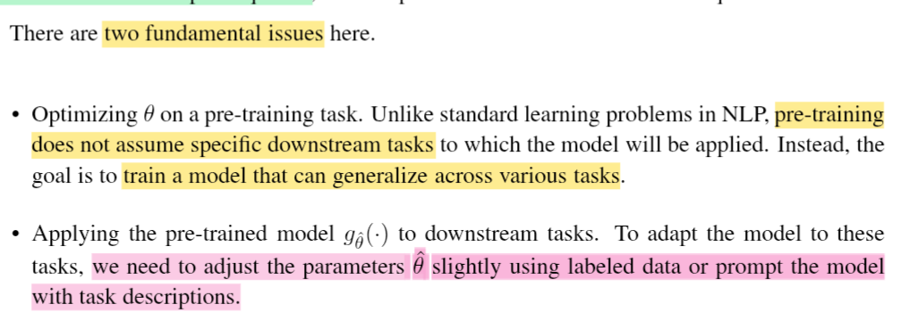</kbd>

> [!NOTE]
> Đại khái là có hai vấn đề chính:
>
> Một là, pretraining ko dùng cùng một tiêu chí mục tiêu cụ thể  nào của nlp, mà nó chỉ muốn đạt được yêu cầu mang tính chất chung chung, giúp ích cho nhiều bài toán cụ thể sau này
>
> Hai là, ta sẽ phải có cách để áp dụng cho bài toán cụ thể ở downstream ví dụ như finetuning hoặc prompting

> [!TIP]
> **🤖 AI Feedback** — ✅ Score: **98/100**
>
> Ghi chú của bạn rất chính xác và đầy đủ, thể hiện sự hiểu biết sâu sắc về hai vấn đề cơ bản được đề cập trong tài liệu.

 

- **Tổng quan huấn luyện trước**

<kbd>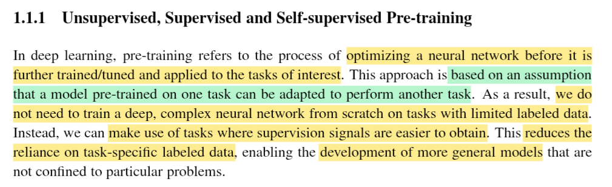</kbd>

> [!NOTE]
> Cái này đại khái là nói về cái định nghĩa của khái niệm mà huấn luyện trước hoặc là tiền huấn luyện mà cái từ tiếng Anh là pre-training, pre-training. Thì về cơ bản nó là cái một cái nói chung nó là việc huấn luyện một cái mô hình AI nó đều về cơ bản đều là giải một cái bài toán tối ưu, đều thực hiện một cái quá trình tối ưu hóa, optimization. Và dĩ nhiên đang nói về deep learning thì nó về cơ bản là một một cái một cái kiến trúc neural network. Có điều khi mình nói về quá trình pre-training á, quá trình tiền huấn luyện đó thì cái ý của nó chính là việc mình mình mình training nó trong một cái giai đoạn mà mình chưa có focus, mình chưa có tập trung vào việc giải một cái một cái bài toán cụ thể nào hết. Mà mình giống như là mình chỉ đang dạy cho nó những cái kiến thức chung chung, những cái kiến thức phổ thông chứ chưa phải là tập trung vào một cái nhiệm vụ cụ thể nào. Thì ở trong đây người ta mới nói rằng là cái cái sở dĩ mình có thể làm theo hướng này là bởi vì mình dựa trên một cái giả định. Cái giả định đó là cái giả định đó là gì? Cái giả định đó là bằng cách mình mình tiền huấn luyện, mình dạy cho nó những cái kiến thức chung chung thì khi mà mình làm việc đó xong, mình dạy nó thêm, mình tinh chỉnh nó thêm ở một cái nhiệm vụ cụ thể đó thì nó sẽ có thể làm tốt. Thay vì là mình xây dựng một cái mô hình và tập trung nó cho cái nhiệm vụ cụ thể đó thì ở đây giống như mình chi nó chi làm hai bước. Mà bước đầu tiên là mình dạy nó những cái kiến thức chung chung, những kiến thức phổ thông, mình dạy cho nó hiểu về cái cái ngôn ngữ rồi sau đó mình mới lấy cái mô hình này để mình mình tinh chỉnh nó thêm cho một cái nhiệm vụ cụ thể. Đó. Thì thì ở đây nó dựa trên một cái giả định và tất nhiên là người ta đã kiểm chứng được rằng thấy rằng cái giả định này là đúng, có nghĩa là mình có thể à có thể đạt được hiệu quả cho một cái bài toán sau theo cái cách mà mình mình làm kiểu này. Thì cái này nó nó có một cái lợi lợi điểm ở chỗ này. Đó là khi mà mình nhắm vào một cái bài toán cụ thể sau này đó thì thật ra những cái bài toán cụ thể đó có thể là một cái trường hợp, một cái bài toán mà mình không có nhiều dữ liệu gán nhãn để mà huấn luyện. Nhưng mà cái bài toán mà dạy nó ở cái chung chung á, kiến thức chung đó thì mình lại có dễ dàng có thể kiếm được nhiều dữ liệu có gán nhãn. Do đó, cái cách làm này nó nó nó có một cái hiệu quả, một cái lợi ích đó là mình có thể dùng rất nhiều cái dữ liệu có gán nhãn mà mình có thể dễ dàng kiếm được để mà huấn luyện nó, dạy cho nó những kiến thức chung chung để mình có được một cái mô hình base, một cái foundation model. Sau đó mình tinh chỉnh nó với cái dữ liệu có gán nhãn trong cái bài toán cụ thể mà mình ít dữ liệu. Đó thì mình lại đạt được hiệu quả quả cao thì như vậy là sẽ rất là tốt. Tại vì có rất là nhiều bài toán mà mình không thể nào có nhiều dữ liệu để để để huấn luyện. Nếu mà mình chỉ dùng dữ liệu đó là mình sẽ không đạt được hiệu quả. Thì cái cách này nó mở ra một cái một cái phương pháp để mình có thể à có được cái hiệu quả cao, hiệu suất cao với những cái bài toán mà mình có ít dữ liệu. Ở nên ở đây mình có thể thấy là người ta nói về cái việc là là mình không cần phải train một cái mô hình phức tạp đối với cái dữ liệu đối với cái dữ liệu ít ỏi mà mình muốn hoặc là mình có đối với cái bài toán mà mình muốn mà mình chỉ việc train một cái cái base model dựa trên cái dữ liệu mà mình có nhiều. Sau đó là mình mới mới mới tinh chỉnh, mình tinh chỉnh đối với cái dữ liệu mà mình mình dữ liệu mà chuyên biệt của cái bài toán chuyên biệt mà mình có. Đó nó là như vậy.
>
> ### Study Notes: Pre-training (Tiền huấn luyện)
>
> **1. Định nghĩa:**
> *   **Pre-training (Tiền huấn luyện)** là quá trình huấn luyện một mô hình AI trên một tập dữ liệu lớn và tổng quát trước khi tinh chỉnh nó cho một nhiệm vụ cụ thể. Đây là việc dạy mô hình những kiến thức chung chung, phổ thông, không tập trung vào bất kỳ bài toán cụ thể nào ban đầu.
> *   Trong ngữ cảnh của Deep Learning, đây thường là quá trình tối ưu hóa (optimization) một kiến trúc mạng nơ-ron (neural network).
>
> **2. Lợi ích của Pre-training:**
> *   **Giải quyết vấn đề thiếu dữ liệu:** Cho phép đạt được hiệu suất cao trên các bài toán cụ thể mà có ít dữ liệu (ít dữ liệu gán nhãn).
>     *   Các bài toán cụ thể thường có dữ liệu hạn chế, nhưng việc huấn luyện kiến thức chung chung có thể sử dụng các tập dữ liệu lớn, dễ kiếm và có nhiều nhãn.
> *   **Hiệu quả cao hơn:** Mô hình có thể đạt được hiệu suất cao hơn trên các nhiệm vụ cụ thể sau này.
>     *   Thay vì xây dựng và tập trung huấn luyện một mô hình từ đầu chỉ với dữ liệu ít ỏi của nhiệm vụ cụ thể, phương pháp này chia làm hai bước:
>         1.  **Bước 1 (Pre-training):** Huấn luyện mô hình cơ sở (base model / foundation model) với nhiều dữ liệu chung chung, dạy cho nó hiểu về ngôn ngữ hoặc các đặc trưng tổng quát. Điều này tạo ra một mô hình nền tảng vững chắc.
>         2.  **Bước 2 (Fine-tuning):** Tinh chỉnh (fine-tune) mô hình nền tảng đó với dữ liệu ít ỏi của nhiệm vụ cụ thể. Mô hình đã có kiến thức chung, việc tinh chỉnh sẽ giúp nó thích nghi nhanh hơn và hiệu quả hơn với nhiệm vụ chuyên biệt.
> *   **Tiết kiệm tài nguyên và thời gian:** Tránh việc phải huấn luyện một mô hình phức tạp từ đầu cho từng bài toán cụ thể với dữ liệu hạn chế.
>
> **3. Giả định cơ bản:**
> *   Phương pháp pre-training dựa trên giả định rằng việc học các kiến thức tổng quát từ dữ liệu lớn, sau đó tinh chỉnh cho nhiệm vụ cụ thể, sẽ mang lại hiệu quả tốt hơn so với việc chỉ huấn luyện trực tiếp trên dữ liệu hạn chế của nhiệm vụ cụ thể. Giả định này đã được kiểm chứng là đúng trong nhiều trường hợp.

> [!TIP]
> **🤖 AI Feedback** — ✅ Score: **98/100**
>
> Bạn đã nắm vững định nghĩa, lợi ích cốt lõi và giả định cơ bản của pre-training một cách rất chính xác và chi tiết, đặc biệt là cách giải quyết vấn đề dữ liệu gán nhãn hạn chế.

 

- **Học không giám sát để tiền huấn luyện**

<kbd>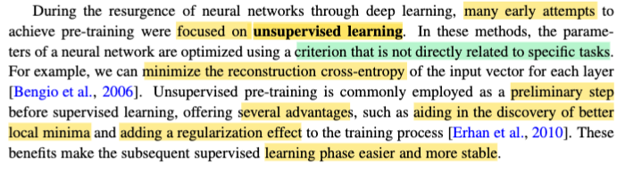</kbd>

> [!NOTE]
> Pre-training trong Deep Learning:1. Định nghĩa: Một hình thức tiền huấn luyện (pre-training) xuất hiện cùng với sự phát triển của Deep Learning.2. Đặc trưng chính: Sử dụng phương pháp học tập không giám sát (unsupervised learning). Lưu ý: Khác với self-supervised learning (sẽ được đề cập sau).3. Mục tiêu (Objective/Criterion):Trong pre-training, mục tiêu (objective function) không nhất thiết phải trùng với mục tiêu của bài toán cụ thể sẽ giải quyết sau này.Ví dụ:Mục tiêu cuối cùng là A (ví dụ, phân loại hình ảnh).Mục tiêu của pre-training có thể là B (ví dụ, tối thiểu hóa reconstruction loss).4. Lợi ích:Là tiền đề giúp bước huấn luyện tiếp theo với mục tiêu chính (ví dụ A) trở nên dễ dàng và ổn định hơn.Khám phá ra các điểm cực tiểu cục bộ (local minima) tốt hơn.Mang lại hiệu quả regularization (chống overfitting).Nói chung, có nhiều tác dụng và lợi ích cho việc huấn luyện mô hình thực hiện một tác vụ cụ thể.5. Ví dụ về Objective trong Pre-training (Unsupervised):Tối thiểu hóa (minimize) reconstruction loss hoặc reconstruction cross-entropy loss. Đây là các khái niệm trong tối ưu hóa, thuộc nhóm hàm mất mát (loss function).

> [!TIP]
> **🤖 AI Feedback** — ✅ Score: **98/100**
>
> Ghi chú đã tóm tắt thông tin từ văn bản rất chính xác và đầy đủ, bao gồm định nghĩa, đặc trưng, mục tiêu và lợi ích của pre-training. Việc giải thích các ví dụ và thêm chi tiết về objective function giúp tăng cường sự hiểu biết.

**🔗 See also:** [Mô hình ngôn ngữ hoán vị Transformer](./tin_hun_luyn_t_gim_st.md#node-51loao8)

 

- **Tiếp cận thứ hai: Học có giám sát**

<kbd>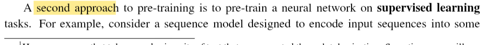</kbd>

<kbd>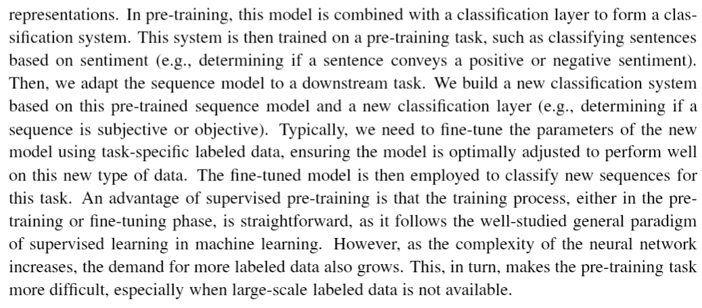</kbd>

> [!NOTE]
> Rồi, cái phần này á nói về cái cách tiếp cận thứ hai. Đúng không? The second approach, cách tiếp cận thứ hai. Cách tiếp cận thứ hai đối với cái pre-training, tiền huấn luyện. Đó là cách tiếp cận gọi là supervised learning. Cách tiếp cận thứ nhất hồi nãy là unsupervised learning, học tập không giám sát. Thì cách tiếp cận thứ hai là supervised learning. Vậy thì người ta mới lấy một cái ví dụ. Đó là mình mình mình mình mình xét một cái mô hình được được thiết kế để mà làm cái nhiệm vụ encode, encode một cái sequence. Mình tạm hiểu là tạm hiểu là nén một cái chuỗi. Nén ở đây là nén thông tin, nắm bắt cái thông tin của một cái chuỗi. Ví dụ chuỗi ở đây có thể là một cái câu trong ngôn ngữ. Đó để trở thành một cái vector các con số gọi là encoding vector. Làm sao những con số thật đó nó phản ánh được cái ngữ nghĩa của cái chuỗi đó, của cái câu đó. Thì nó mới gọi là cái nhiệm vụ gọi là tạo ra sequence representation là vậy. Thì cái quá trình pre-training á nó có thể là như vậy. Nó sẽ, nó sẽ mình sẽ train một cái mô hình classification, một cái mô hình phân loại điển hình. Và dựa trên cái dữ liệu có gắn nhãn. Nhưng mà cái dữ liệu có gắn nhãn này á là nó nó thuộc về một cái bài toán ví dụ như là phân loại xem cái cái sequence đưa vô đó nó nó nó có cái sentiment là gì. Ví dụ như sentiment ở đây là tích cực hay tiêu cực. Đó. Thì thì nó là một cái bài toán classification gọi là bài toán phân loại nhị phân thôi, binary classification. Và sau khi mà đã training xong đó thì người ta sẽ kiểu như lấy cái layer của cái mô hình này đã được training xong. Người ta lắp thêm một cái layer khác. Để rồi người ta sẽ thực hiện một việc training một cái bài toán khác. Ví dụ như là training một cái bài toán cũng classification nhưng mà phân loại xem là cái chuỗi nó, cái từ đó hoặc là cái chuỗi đó nó là chủ ngữ hay vị ngữ. Dựa trên cái lớp trước đó đã được training. Lớp ở đây chính là một cái neural network layer đó. Đã được training trên cái bài toán gọi là sentiment classification. Thì cái bước training cho trên cái bài toán gọi là phân loại xem chủ ngữ vị ngữ này á mình sẽ coi như là cái bước fine-tuning. Nó sẽ tinh chỉnh cái mô hình. Và sau khi sau xong đó rồi thì mình sẽ lấy cái đó để mà dùng cho cái nhiệm vụ là phân loại cái chủ ngữ vị ngữ. Vậy thì cái quá trình pre-training nó đã thực hiện theo cái lối supervised learning.### Study Notes:This audio describes the second approach to pre-training, which is **Supervised Learning**. It contrasts with the first approach, Unsupervised Learning. A practical example illustrates this pre-training method.#### 1. Supervised Learning for Pre-training:Supervised learning involves training models using **labeled data**. This method of pre-training leverages existing labeled datasets for an initial training phase, then adapts the model for specific downstream tasks.#### 2. Example: Sequence Encoding and Representation- **Objective**: To encode a sequence (e.g., a sentence) into a numerical vector, known as an **encoding vector**.- **Process**: A model is designed to compress a sequence of words or characters into a fixed-size vector. The goal is for this vector to effectively capture the semantic meaning or

> [!TIP]
> **🤖 AI Feedback** — ⚠️ Score: **85/100**
>
> The notes accurately capture the core concepts of supervised pre-training and the objective of the example. To improve, complete the "Process" section of the example by detailing the sentiment classification pre-training and subsequent fine-tuning as described in the audio.

 

- **Học tự giám sát và tự huấn luyện**

<kbd>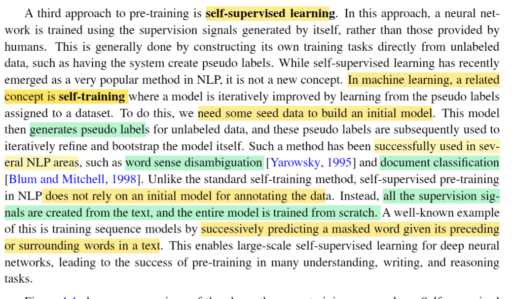</kbd>

> [!NOTE]
> - Cách tiếp cận thứ ba tập trung vào khái niệm "**tự giám sát**".
> - Phương pháp này không phải mới mẻ, mà đã tồn tại trong các mô hình học máy trước đây, được gọi là "**self-training**" (tự huấn luyện).
> - Trong "**self-training**", các mô hình tự động tạo ra các nhãn giả và học dựa trên chúng. Các mô hình Xử lý Ngôn ngữ Tự nhiên (NLP) cũng đã áp dụng thành công cách tiếp cận này.
> - Mặc dù được biết đến rộng rãi hơn nhờ sự thành công của "**mô hình ngôn ngữ lớn**", nhưng khái niệm này không phải là mới.
> - Hiện tại, việc huấn luyện các mô hình nền tảng đang sử dụng "**self-supervised learning**" (học tự giám sát).
> - Cụ thể, mô hình tự động che một từ và dự đoán từ đó dựa trên các từ xung quanh. Quá trình này lặp lại với các từ khác.
> - Điều này có nghĩa là mô hình hoàn toàn tự tạo ra dữ liệu có nhãn, loại bỏ sự cần thiết của các bộ dữ liệu được gán nhãn thủ công bởi con người.

> [!TIP]
> **🤖 AI Feedback** — ✅ Score: **95/100**
>
> Ghi chú rất chính xác và có chiều sâu, diễn giải rõ ràng về self-supervised learning và mối liên hệ với self-training. Để sâu sắc hơn, bạn có thể nhấn mạnh sự khác biệt chính giữa self-supervised pre-training và self-training về việc cần dữ liệu khởi tạo ban đầu.

 

- **Các phương pháp huấn luyện trước**

<kbd>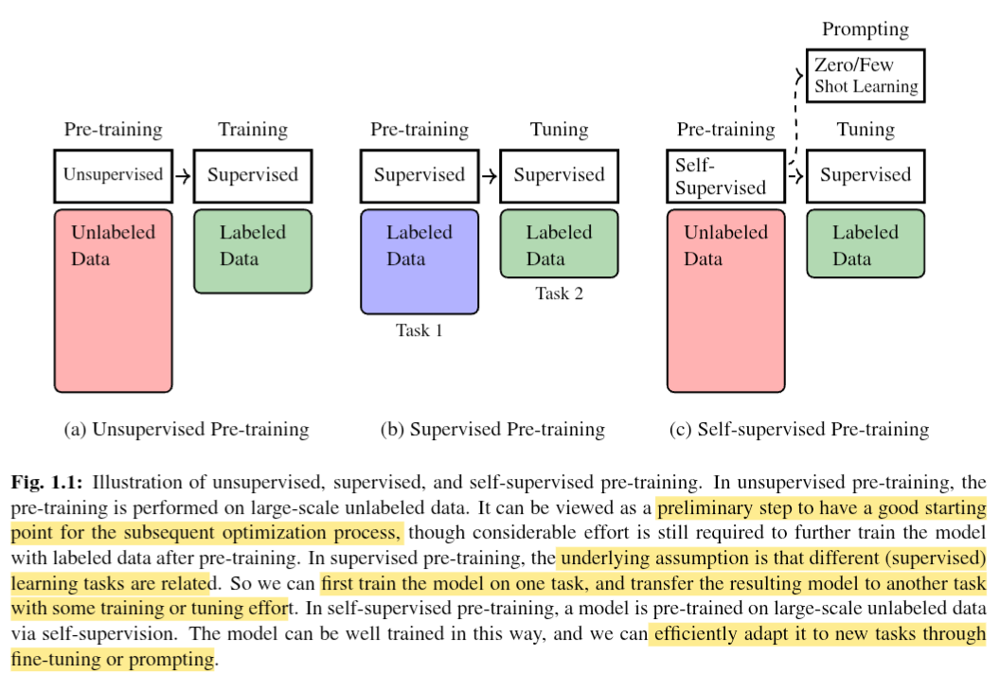</kbd>

> [!NOTE]
> Đại khái là hình ảnh minh họa 3 dạng pretraining. Với unsupervised pretraining, ta hiểu ý chính là nó đóng vai trò bước của weight initialization, giúp đưa ta về trạng thái tốt hơn cho quá trình training/finetuning vo supervised learning sau đó.
>
> Còn với supervised learning pretraining, 
> 1. Tiền huấn luyện có giám sát (Supervised Pre-training):
>    - Giả định: Các tác vụ (tasks) tương tự hoặc có liên quan có thể hỗ trợ lẫn nhau.
>    - Quy trình: Đầu tiên, mô hình được huấn luyện trên một nhiệm vụ cụ thể. Sau đó, mô hình kết quả sẽ được chuyển giao (transfer) sang bài toán tiếp theo. Việc này có thể bao gồm huấn luyện hoặc tinh chỉnh (tuning) tiếp tục với một bộ dữ liệu mới.
>    - Mục tiêu: Giúp cho tác vụ kế tiếp đạt hiệu suất tốt hơn.
>
> 2. Tiền huấn luyện tự giám sát (Self-Supervised Pre-training):
>    - Quy trình: Mô hình được huấn luyện (training) với một bộ dữ liệu không dán nhãn quy mô lớn. Sau đó, mô hình này sẽ được điều chỉnh để thực hiện các nhiệm vụ cuối cùng cụ thể.
>    - Các phương pháp áp dụng cho nhiệm vụ cuối cùng:
>      - Kỹ thuật gợi ý (prompting): Ví dụ như Zero-shot learning hoặc Few-shot learning.
>      - Hoặc tinh chỉnh (fine-tuning) với dữ liệu có dán nhãn (labeled data).

> [!TIP]
> **🤖 AI Feedback** — ✅ Score: **98/100**
>
> Tóm tắt rất chính xác và đầy đủ các nội dung chính của hình ảnh và phần chú thích đi kèm. Các thuật ngữ và quy trình được giải thích rõ ràng.

 

- **Adapting Pre-trained Models**

<kbd>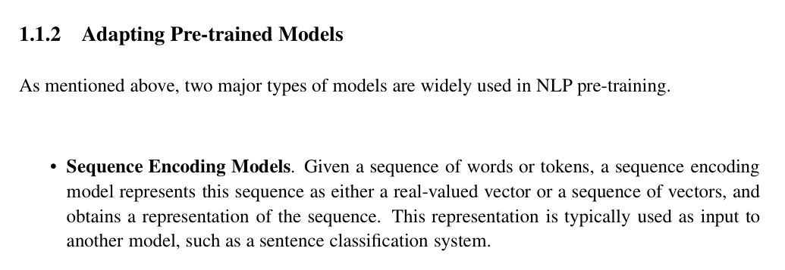</kbd>

<kbd>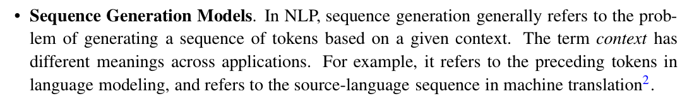</kbd>

> [!NOTE]
> Cái thứ nhất là mô hình sẽ cố gắng nắm bắt cái ý nghĩa của một cái chuỗi từ hoặc là token đưa vào và phản ánh nó vào trong giá trị của một cái vector các số thực hoặc là một chuỗi các cái vector. Và cái giá trị này cái cái cái output này sẽ được sử dụng ở trong một cái bài toán khác, một bài toán chuyên biệt khác. Ví dụ như một cái mô hình phân loại câu.
>
> Và cái dạng thứ hai đó là một cái mô hình sinh, tức là mô hình tạo ra cái ngôn ngữ, tạo ra cái token, dựa trên một cái context (một cái bối cảnh, một cái ngữ cảnh). Loại thứ nhất là nắm bắt ý nghĩa của chuỗi token đưa vào, phản ánh nó dưới dạng một cái vector các số thực. Còn dạng thứ hai này sẽ tạo ra những token tiếp theo, dựa trên cái bối cảnh (là những token trước đó). Nó có tên là 'sequence generation model'. Bối cảnh có thể có nhiều ý nghĩa khác nhau ở những ứng dụng khác nhau. Một cách điển hình, bối cảnh chính là những chuỗi đứng trước. Trong bài toán machine translation, bối cảnh là từ/câu đưa vào trong cái ngôn ngữ gốc cần dịch.

> [!TIP]
> **🤖 AI Feedback** — ✅ Score: **95/100**
>
> Ghi chú đã mô tả rất chính xác mô hình mã hóa chuỗi (Sequence Encoding Model) như trong hình ảnh. Đồng thời, ghi chú cũng bổ sung thông tin về mô hình sinh (Sequence Generation Model), làm tăng độ sâu và tính toàn diện cho phần giải thích về hai loại mô hình chính được nhắc đến.

 

- **Tinh chỉnh mô hình tiền huấn luyện**

<kbd>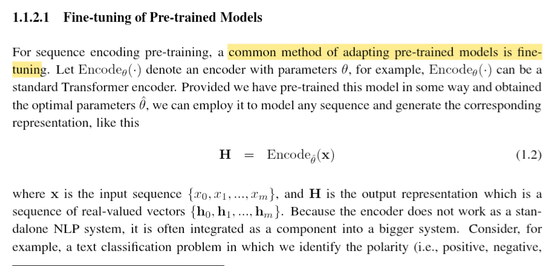</kbd>

<kbd>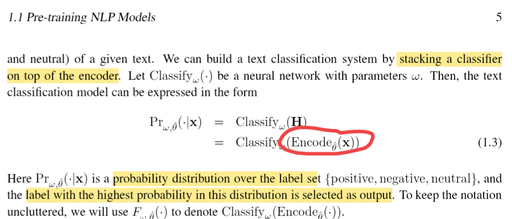</kbd>

> [!NOTE]
> Phần này đề cập đến việc tinh chỉnh một mô hình đã được tiền huấn luyện. Cụ thể, nó nói về trường hợp của "sequence encoding pre-training". Việc tiền huấn luyện này có mục đích tạo ra một mô hình đóng vai trò mã hóa (encode) một chuỗi đầu vào. "Mã hóa" ở đây có nghĩa là nắm bắt ý nghĩa ngữ nghĩa của chuỗi đầu vào và chuyển đổi nó thành một vector (hoặc một chuỗi các vector/số thực). Các vector này phải phản ánh được giá trị và ý nghĩa ngữ nghĩa của câu đầu vào dưới dạng số. Mục đích cuối cùng là sử dụng các vector này để phục vụ cho một bài toán tiếp theo.

> [!TIP]
> **🤖 AI Feedback** — ✅ Score: **98/100**
>
> Ghi chú này rất chính xác và sâu sắc, nắm bắt tốt các khái niệm chính về tinh chỉnh và tiền huấn luyện mã hóa chuỗi. Bạn đã giải thích rõ ràng mục đích của việc mã hóa và cách các vector được sử dụng trong các bài toán tiếp theo.

 

- **Tinh chỉnh bộ phân loại văn bản**

<kbd>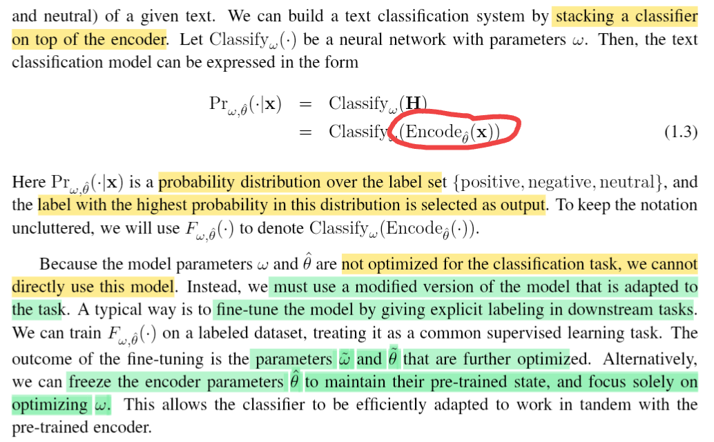</kbd>

> [!NOTE]
> Hình ảnh này giải thích cách sử dụng các mô hình đã được huấn luyện trước (pre-trained models). Cụ thể, mô hình 'sequence encoder' đã học cách nắm bắt ý nghĩa của một chuỗi từ (ví dụ: một câu) và biểu diễn nó thành các vector số thực thông qua quá trình tiền huấn luyện. Output có thể là một vector hoặc một chuỗi các vector. Mục tiêu là mã hóa hoặc nén ý nghĩa của câu thành một dạng tinh gọn gồm các con số. Sau đó, kết quả này được dùng cho bước tiếp theo. Quá trình này có thể hình dung như việc 'xếp chồng' các mô hình: Mô hình thứ nhất (Toa tàu 1) là mô hình đã được tiền huấn luyện (ví dụ: sequence encoder). Mô hình thứ hai (Toa tàu 2) nhận output từ mô hình thứ nhất làm input. Mô hình này có các tham số riêng và thực hiện nhiệm vụ cuối cùng, ví dụ như dự đoán sắc thái (sentiment) của câu (tích cực, tiêu cực, trung tính). Output của mô hình thứ hai là một phân phối xác suất trên tất cả các nhãn có thể (label set). Phân phối này được biểu diễn bằng một vector các con số không âm có tổng bằng 1, cho biết xác suất cao nhất mà câu thuộc về một loại cụ thể (positive, negative, hoặc neutral). Để đạt được điều này, chúng ta cần 'fine-tune' mô hình. Fine-tune là quá trình huấn luyện với dữ liệu có gắn nhãn (supervised learning). Có hai cách: Đóng băng (freeze) mô hình thứ nhất và chỉ huấn luyện các tham số của mô hình thứ hai; hoặc huấn luyện (train) cả các tham số của mô hình thứ nhất và mô hình thứ hai. Về cơ bản, mục tiêu chính là huấn luyện bài toán cuối cùng sử dụng dữ liệu có gắn nhãn thông qua phương pháp học có giám sát (supervised learning).

> [!TIP]
> **🤖 AI Feedback** — ✅ Score: **98/100**
>
> Ghi chú giải thích chính xác và đầy đủ các khái niệm về việc 'xếp chồng' bộ phân loại lên bộ mã hóa đã được huấn luyện trước và quy trình tinh chỉnh, bao gồm cả hai chiến lược tối ưu hóa. Phần giải thích về vai trò của bộ mã hóa và đầu ra phân phối xác suất rất chi tiết và rõ ràng.

 

- **Quy trình Fine-tuning Mô hình**

<kbd>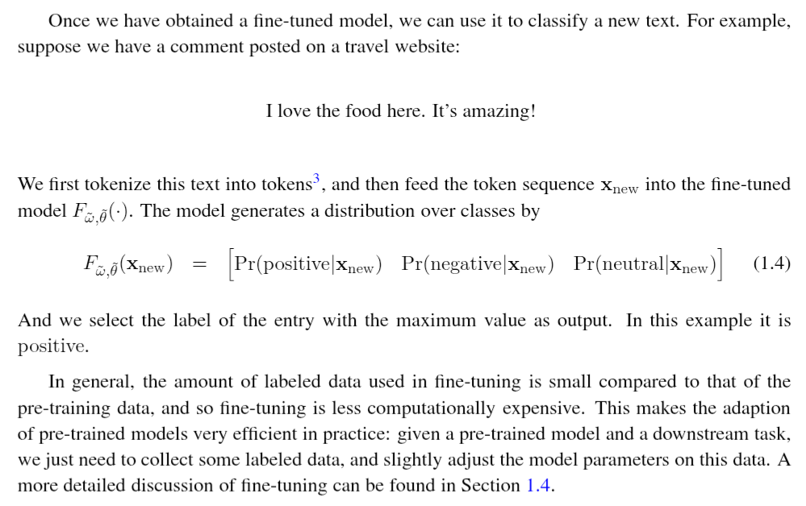</kbd>

> [!NOTE]
> Quá trình fine-tuning mô hình bao gồm: Đầu tiên, sau khi có một mô hình đã pre-train (gọi là toa 1), ta gắn thêm một lớp mới (gọi là toa 2) vào. Bước fine-tuning này chính là một quá trình supervised learning (tinh chỉnh). Có hai phương pháp chính để tinh chỉnh: một là đóng băng các tham số của toa 1 và chỉ huấn luyện toa 2; hai là huấn luyện cả các tham số của toa 1 và toa 2. Quá trình này đòi hỏi dữ liệu phải có gắn nhãn. Ví dụ ứng dụng được đề cập là bài toán phân loại sentiment (tâm lý) của một chuỗi đầu vào thành tích cực, tiêu cực hoặc trung lập. Sau khi quá trình fine-tuning hoàn tất, mô hình đã được huấn luyện (gồm toa 1 và toa 2) sẽ sẵn sàng để sử dụng. Khi muốn dự đoán với một chuỗi mới: Chuỗi đó sẽ trải qua bước tokenize (tách thành các token/từ). Input đã được tokenize này sau đó sẽ đi qua toa 1 rồi đến toa 2 của mô hình. Kết quả đầu ra là một vector (ví dụ gồm ba con số, không âm và tổng bằng một) đại diện cho phân phối xác suất trên các class. Để có kết quả dự đoán, ta sẽ chọn class có giá trị xác suất cao nhất. Một lợi ích đáng chú ý của phương pháp này là lượng dữ liệu có gắn nhãn cần thiết cho việc tinh chỉnh thường ít hơn so với việc huấn luyện mô hình từ đầu. Điều này mang lại sự thuận tiện khi muốn áp dụng mô hình cho một bài toán tương tự khác, chỉ cần tái sử dụng toa 1 đã pre-train và tinh chỉnh với một lượng nhỏ dữ liệu của bài toán mới, vẫn có thể đạt được hiệu quả tốt.

> [!TIP]
> **🤖 AI Feedback** — ✅ Score: **98/100**
>
> Bản phân tích rất chính xác và có độ sâu vượt trội so với văn bản gốc, cung cấp thêm chi tiết về cơ chế và các phương pháp tinh chỉnh mô hình. Các giải thích về cấu trúc mô hình (toa 1, toa 2) và phương pháp huấn luyện rất rõ ràng.

 

- **Tinh chỉnh mô hình generation tiền huấn luyện**

<kbd>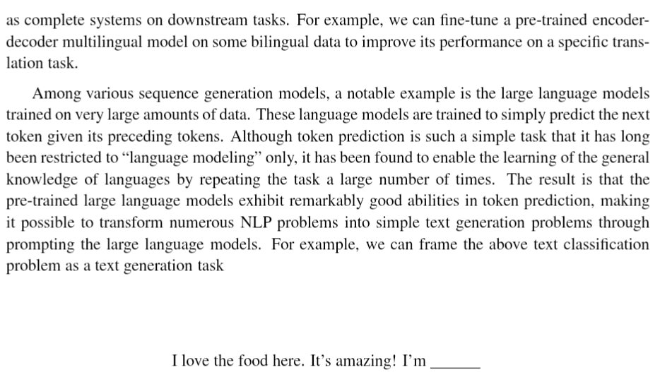</kbd>

<kbd>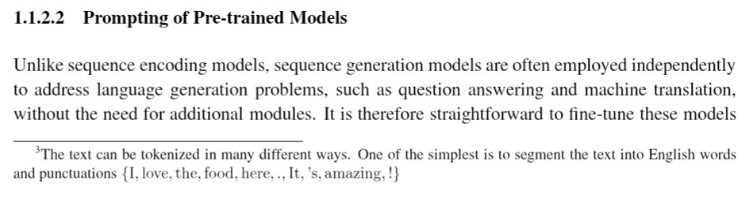</kbd>

> [!NOTE]
> Cái này nói về cái việc mà mình sử dụng cái mô hình pre-train, cái mô hình đã được tiền huấn luyện nhưng thuộc cái loại là generation, tức là sequence generation thay vì sequence encoding. Thì như mình còn nhớ, sequence generation có nghĩa là nó sẽ mục đích á là nó nhận vào một cái chuỗi thì nó cũng tạo ra một một cái chuỗi khác nhưng mà thật ra nó tạo ra một cái một cái chuỗi khác hoặc là một cái từ khác hoặc là một cái chuỗi khác, chứ không phải là tạo ra cái cái cái vector số thực mà encode cái chuỗi đưa vô. Thì với cái mô hình kiểu này đó, đại khái người ta nói là mình thường không cần phải gắn nó vô một cái cái cái phần sâu nào để rồi mình lại fine-tune nữa hết. Mà mình có thể lấy nó ra rồi rồi trực tiếp trực tiếp fine-tune nó với một cái bộ dữ liệu có gắn nhãn luôn. Và fine-tune nó xong á thì lấy ra xài luôn. Đó. Cho nên một ví dụ ví dụ ở đây là mình mình lấy một cái mô hình encoder decoder mà mình dùng trong cái bài toán translation đó. Mình đã pre-train rồi. Mình đã pre-train rồi thì bây giờ mình sẽ lấy đó ra mình tiếp tục mình fine-tune nó với một cái bộ dữ liệu có gắn nhãn. Thì cái quá trình pre-train á có thể là mình pre-train theo kiểu là supervised learning. Với một cái bộ dữ liệu dịch thuật của một cái ngôn ngữ nào đó. Thì sau đó mình lại lấy ra mình fine-tune fine-tune nó, tinh chỉnh nó với một cái bộ dữ liệu dịch thuật của một ngôn ngữ khác. Thì thì mình mình sẽ có thể có được một cái mô hình dịch thuật của cái ngôn ngữ sau đó nó nó nó tốt. Và với cái cách làm này đó thì người ta sẽ chỉ cần prompt thôi. Chỉ cần prompt thôi, nhưng mà mình sẽ nói tiếp sau sau đây.

> [!TIP]
> **🤖 AI Feedback** — ✅ Score: **93/100**
>
> Phần giải thích đã làm rõ sự khác biệt giữa mô hình tạo chuỗi và mã hóa, đồng thời mô tả chính xác cách tinh chỉnh trực tiếp các mô hình tạo sinh đã được huấn luyện trước cho các tác vụ như dịch thuật. Nội dung này hoàn toàn phù hợp với văn bản đã cho.

 

- **Kỹ thuật nhắc lời trong NLP**

<kbd>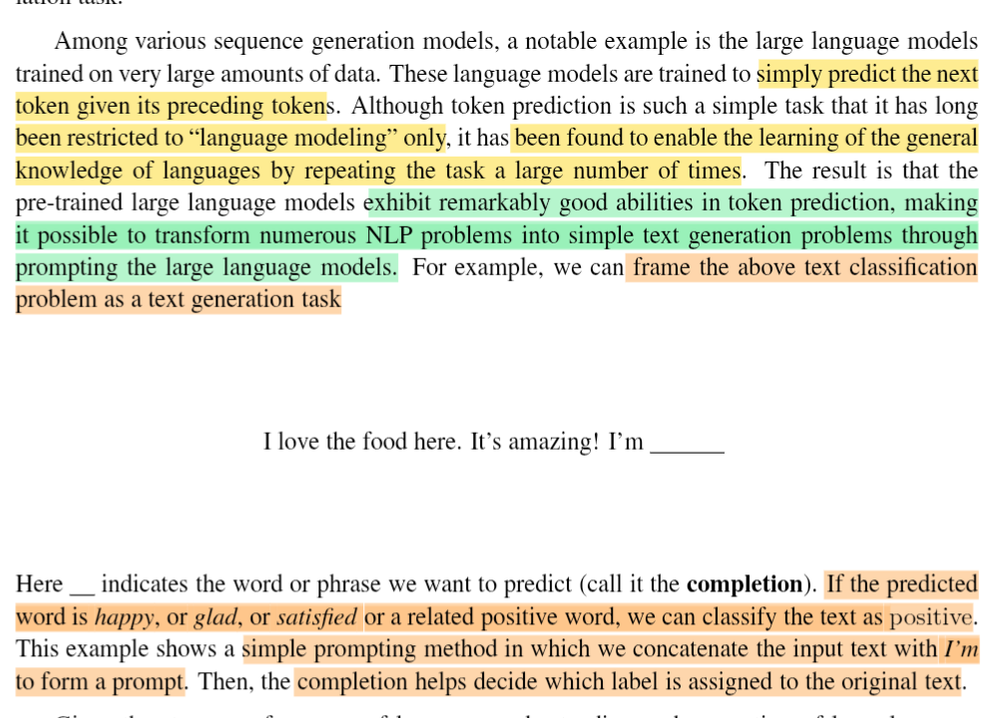</kbd>

> [!NOTE]
> Đại khái là, một vi dụ nổi bật của dạng này (trong đó ta pre train momột sequence generation model) đó là ta train một Large Language Model với nhiệm vụ dự đoán next token dựa trên context là các token trước đó.
>
> Thế thì, một điều mình học được ở đây, hay điều đáng suy nghĩ là, đại khái là cái nhiệm vụ dự đoán token tiếp theo dựa trên các token trước đó cơ bản được gọi là một mô hình ngôn ngữ (language model) mà nhờ NLP Spec mình đã hiểu cái này. Thế thì, điểm người ta nhấn mạnh ở đây là, mô hình ngôn ngữ, như tên gọi, mục đích chỉ là hi vọng có thể học được các pattern / cấu trúc của ngôn ngữ. Tuy nhiên kết quả cho thấy, việc huấn luyện mô hình ngôn ngữ kiểu đơn giản như này trên bộ dữ liệu lớn nó lại học được cả kiến thức tổng quát của nhân loại nữa (chứ không chỉ là cấu trúc của ngôn ngữ) Mà ta biết điều này là vì việc dùng các base model đã được pretrain theo cách thức trông có vẻ đơn giản này lại tỏ ra rất mạnh mẽ trong các nhiệm vụ đòi hỏi cao (ý là những bài toán mà ko ngờ là nó làm được ví dụ như bài toán classifications). Mà một ví dụ là, chỉ bằng cách thêm prompt, ta có thể biến một mô hình ngôn ngữ (thứ mà nó được huấn luyện chỉ là học cách dự đoán token tiếp theo) trở thành một mô hình phân loại.

> [!TIP]
> **🤖 AI Feedback** — ✅ Score: **93/100**
>
> Bản tóm tắt rất chính xác và thể hiện sự hiểu biết sâu sắc về văn bản gốc, giải thích rõ ràng cách các Large Language Model (LLM), dù được huấn luyện với mục tiêu đơn giản, vẫn học được kiến thức rộng và có thể áp dụng cho nhiều nhiệm vụ NLP khác nhau thông qua prompt. Một điểm nhỏ có thể làm rõ hơn là "kiến thức tổng quát của nhân loại" trong bản ghi chú được văn bản gốc đề cập cụ thể hơn là "kiến thức tổng quát về ngôn ngữ".

 

- **Phân loại cảm xúc LLM**

<kbd>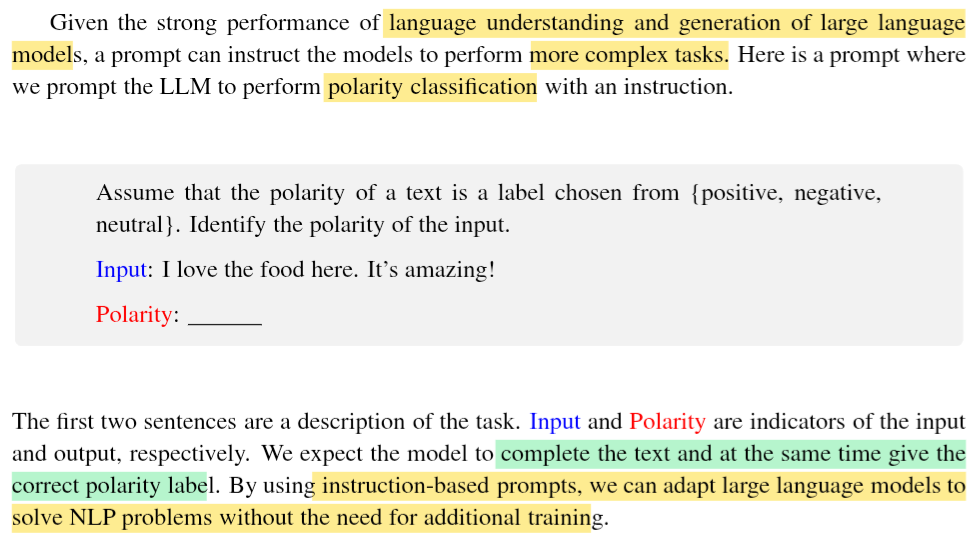</kbd>

> [!NOTE]
> Đây là một ví dụ nữa về việc chúng ta có thể dùng một mô hình ngôn ngữ lớn (large language model) đã được tiền huấn luyện (pre-trained) với phương pháp tự giám sát (self-supervised learning). Trong đó, mô hình chỉ đơn giản là dùng các token trước đó để dự đoán token tiếp theo. Mặc dù cách huấn luyện này có vẻ đơn giản, vì nó chỉ là một công việc cơ bản của mô hình ngôn ngữ, nhưng như đã đề cập trước đó, bằng cách huấn luyện mô hình trên một lượng dữ liệu lớn, nó không chỉ học được cấu trúc ngôn ngữ mà còn học được cả tri thức của con người. Do đó, chúng ta có thể thiết kế các bài toán NLP khác nhau chỉ bằng cách thiết kế prompt (lời nhắc) để mô hình điền từ vào hoặc dự đoán token tiếp theo. Tuy nhiên, nó hoàn toàn có thể hoạt động như một bài toán phân loại hoặc các bài toán NLP phức tạp khác. Nói cách khác, việc dự đoán token tiếp theo thực chất có thể biến đổi hoặc áp dụng để giải quyết các bài toán và nhiệm vụ khác. Dựa trên việc mô hình đã được huấn luyện với lượng dữ liệu lớn và có khả năng dự đoán token tiếp theo rất tốt dựa trên ngữ cảnh trước đó.

> [!TIP]
> **🤖 AI Feedback** — ✅ Score: **95/100**
>
> Bài phân tích rất chính xác và sâu sắc, giải thích được cơ chế hoạt động của LLM (dự đoán token tiếp theo) và cách chúng có thể được dùng cho các tác vụ NLP phức tạp như phân loại thông qua prompt. Điều này bổ sung thêm ngữ cảnh và độ sâu cho thông tin trong hình ảnh.

 

- **Học zero-shot và few-shot**

<kbd>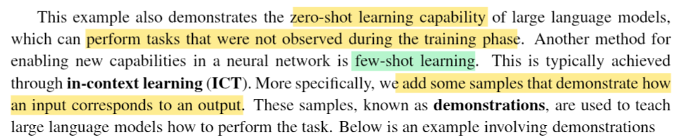</kbd>

<kbd>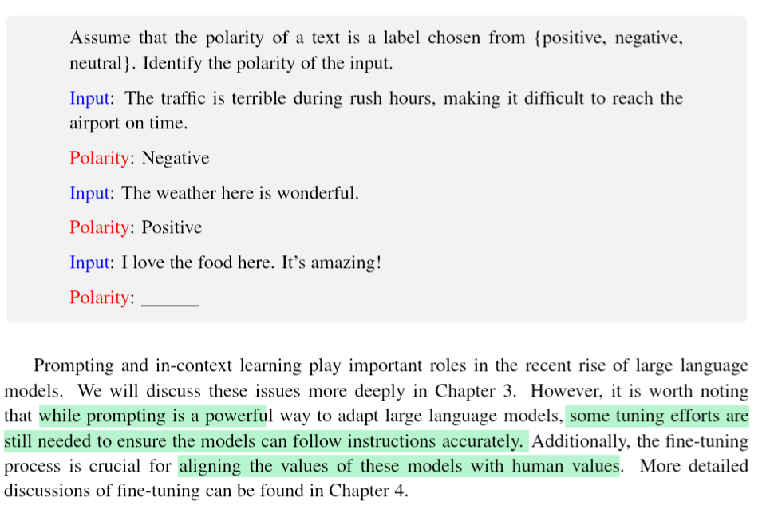</kbd>

> [!NOTE]
> Đại khái là muốn đưa ra thêm một cái ví dụ nữa về cái kỹ thuật prompting. Thì trong cái ví dụ này á người ta prompt theo cái kiểu là cái prompt nó sẽ có một cái ví dụ hoặc là vài ví dụ của cái kết quả mà người ta muốn cái mô hình nó đưa ra. Thì nó gọi là kỹ thuật few-shot learning. Với zero-shot learning á thì cái prompt nó được thiết kế theo kiểu là mình không có đưa ra cái ví dụ. Còn cái few-shot learning thì nó có một cái ví dụ nhưng mà tất cả đều là prompting cả. Và cái này nó còn gọi là in-context learning. Tuy nhiên trong cái chuyên shot cũng có nhắc đến là tuy rằng kỹ thuật prompt nó rất là hay. Nó giúp mình có thể dùng cái mô hình ngôn ngữ lớn vốn chỉ được huấn luyện dưới dạng với yêu cầu với nhiệm vụ là dự đoán cái token tiếp theo dựa trên những cái token trước đó. Thì mình vẫn có thể dùng kỹ thuật prompting để mà khiến cho nó làm những cái bài toán NLP phức tạp. Ví dụ như bài toán phân loại, hoặc là bài toán kể cả là bài toán generate, tức là bài toán tạo ra ngôn ngữ, tạo tạo ra text. Tuy nhiên, cái kỹ thuật chúng ta vẫn cần phải kể cả khi dùng prompting nhưng mình cần phải vẫn cần phải có cái bước fine-tuning, phải bước tinh chỉnh mà mục đích là mình có thể cần phải tinh chỉnh nó thêm để cho nó đưa ra những cái câu trả lời phù hợp với cái tiêu chí nào đó của con người.

> [!TIP]
> **🤖 AI Feedback** — ❌ Score: **65/100**
>
> Phần giải thích về zero-shot, few-shot learning và in-context learning khá chính xác theo nội dung hình ảnh. Tuy nhiên, một phần đáng kể của phân tích đi sâu vào các khía cạnh không có trong văn bản gốc, như nhiệm vụ huấn luyện LLM và sự cần thiết của fine-tuning.

 

