# Tiền huấn luyện tự giám sát

📊 **Progress:** `18` Notes | `35` Screenshots | `18` AI Reviews

---

## Tiền huấn luyện tự giám sát

<kbd>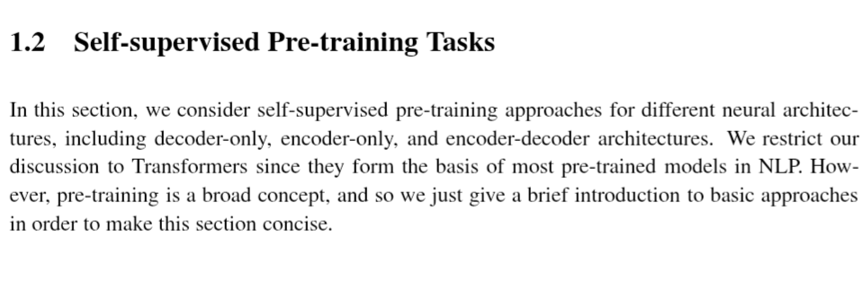</kbd>

> [!NOTE]
> Nói về một số loại cây cảnh nổi tiếng trên thế giới.

> [!TIP]
> **🤖 AI Feedback** — ❌ Score: **0/100**
>
> Ghi chú hoàn toàn không liên quan đến nội dung của hình ảnh. Hình ảnh thảo luận về các tác vụ tiền huấn luyện tự giám sát trong NLP, không phải về cây cảnh.

 

## Tiền huấn luyện kiến trúc Decoder-only

<kbd>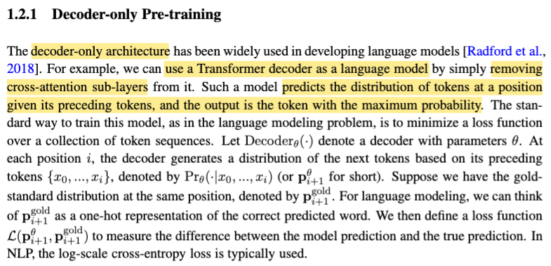</kbd>

> [!NOTE]
> Cái này đại khái là người ta nói rằng mình có thể dùng cấu trúc decoder-only để tiền huấn luyện. Nói đúng hơn là mình sẽ sử dụng các mô hình thuộc loại decoder-only. Ví dụ, trong mô hình Transformer, nó có encoder và decoder. Trong đó, encoder sẽ đóng vai trò nhận vào một chuỗi các token, sau đó mã hóa chúng để xuất ra một chuỗi hoặc một vector (hoặc chuỗi vector) các số thực nhằm nắm bắt ý nghĩa của chuỗi đầu vào. Sau đó, output này sẽ được đưa qua decoder. Decoder có nhiệm vụ dùng chuỗi đầu vào đó (những vector số thực đầu vào đó) để dự đoán ra token tiếp theo. Có thể nó cũng sẽ nhận vào một chuỗi token, nhưng nó có thể nhận thêm một chuỗi các vector số thực (encoding vector) để đóng vai trò là context, giúp nó dự đoán token tiếp theo. Vậy thì, ở đây người ta nói là nếu như mình có thể bỏ encoder đi và chỉ lấy decoder thôi, thì bản thân decoder hoàn toàn có thể đóng vai trò của một mô hình ngôn ngữ độc lập. Đây là ý đầu tiên được đề cập. Và dĩ nhiên, mô hình ngôn ngữ thì nó sẽ dự đoán ra một phân phối xác suất (một vector các số thực có giá trị không âm, tổng bằng một), đóng vai trò phân phối xác suất đối với tất cả các từ vựng. Và nó sẽ lấy từ tương ứng với xác suất cao nhất làm kết luận cho dự đoán của nó, tức là token tiếp theo.
>
> Thế thì đại khái là, cách làm việc của Decoder, mà như đã nói, nó là một language model, nhiệm vụ chính chỉ là nhận vào một chuỗi token, và dự đoán ra một vector các số thực ko âm tổng bằng 1 mang ý nghĩa là phân phối xác suất trên toàn bộ các từ trong một dictionary cho trước. Tất nhiên ve bản chất decoder như một function, tham số kí hiệu bởi theta, input là chuỗi token x0, x1..xn-1. Và dựa trên kết quả dự đoán nó sẽ chọn ra token ứng với lại giá trị xác suất cao nhất trong phân phối xác suất.
>
> Thế thì người ta nói về cách set up objective cho quá trình huấn luyện. Đại khái là tại vị trí n, decoder phải dự đoán đúng token thứ n. Dựa vào chuỗi x0...xn-1, thì ta giả sử đã có một phân phối tiêu chthể hiện từ thứ n phải là từ nào đó, và ta gọi là tiêu chuẩn vàng ý là,  ta biết / quả quyết từ thứ n phải là từ X, ko thể nào khác, nên ta thể hiện sự quả quyết này bởi môt onehot vector với số 1 ứng với vị trí của từ X. Từ đó ta đặt objective là cross
> entropy giữa hai phân phối xác suất, dự đoán và mong muốn. Và ta sẽ training (optimize) decoder với objective này

> [!TIP]
> **🤖 AI Feedback** — ✅ Score: **98/100**
>
> Bản tóm tắt rất chính xác và cực kỳ sâu sắc, giải thích rõ ràng cả các chi tiết kỹ thuật được đánh dấu và không được đánh dấu. Phần giải thích về kiến trúc Transformer tổng thể trước khi đi vào mô hình decoder-only giúp người đọc hiểu rõ hơn.

 

### Ước lượng khả năng cực đại

<kbd>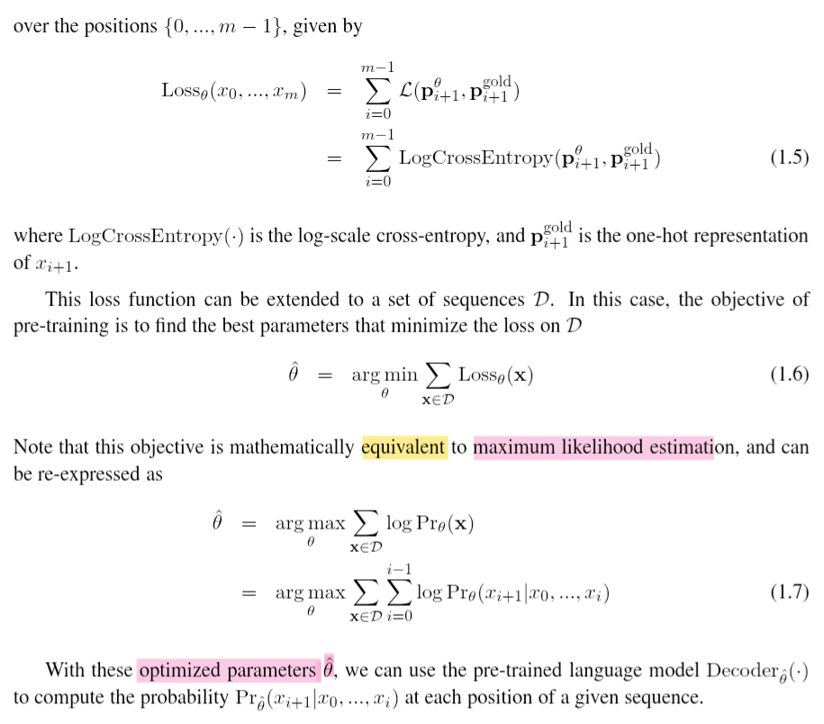</kbd>

<kbd>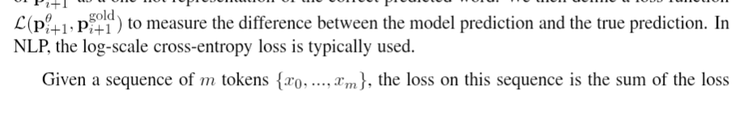</kbd>

> [!NOTE]
> Cái này đại khái là mình sẽ như ở trên hồi nãy đó, cái nót trên đó, đã nói về cái việc là người ta sẽ đặt cái objective function, cái hàm mục tiêu là cross entropy. Cross entropy là một khái niệm trong information theory. Đại khái là nó sẽ đo cái sự khác biệt giữa hai cái phân phối xác suất. Vậy thì như đã nói á, cái function cái model đó, cái decoder nó sẽ dự đoán cái token tiếp theo dựa trên những cái token trước đó. Và cái mà nó dự đoán ra là một cái vector các con số mang ý nghĩa là một cái phân phối xác suất trên tất cả các cái từ trong từ điển. Để rồi mình sẽ lựa ra cái cái từ nào, cái token nào ứng với cái xác suất cao nhất. Thế thì như đã nói ở nói trước, đó là mình sẽ có một cái một cái phân phối xác suất mà mình gọi là mục tiêu rồi, hoặc là một phân phối xác suất tiêu chuẩn trong đó nó cho tất cả xác suất vào trong cái cái cái cái cái vị trí ứng với cái từ đúng mà mình cần mô hình nó dự đoán ra. Đó thì mình sẽ set up cái hàm mục tiêu là cái sự khác biệt đo bằng cái khái niệm cross entropy giữa hai cái phân phối xác suất đó. Nhưng mà đó là mình tạm hiểu nó là cái loss, nó là cái cost, nó là cái loss tại cái vị trí cái từ đó thôi. Và mình sẽ làm như vậy với với với những cái vị trí khác nữa. Đó. Và mình sẽ lấy tổng là tổng loss. Và không phải là chỉ có một chuỗi, đúng không? Ví dụ như một cái câu đầu tiên nó có ba nó có ba từ. Thì tại mỗi vị trí á mô hình nó sẽ dự đoán. Như vậy mình sẽ có ba cái loss mình tổng lại. Nhưng mà mình có một chục cái câu như vậy ở trong một cái đoạn văn chẳng hạn. Thì mình cũng sẽ làm vậy và mình tổng lại hết, tổng lại hết loss trên toàn cái văn bản đó. Thì đó sẽ tạo thành ra cái cái cost function. Và có một điểm nữa đó là việc mà mình tối ưu cái tham số để mà giảm cái loss đó thì thật ra nó hoàn toàn tương ứng với việc là mình tối ưu cái tham số để mình tối đa hóa cái gọi là một cái likelihood function. Likelihood function á, đại khái mình hiểu đơn giản vậy nè. Xác suất á, ví dụ như dựa trên tham số theta thì cái xác suất mà nó ra được nó nó dự đoán cho cái token đó là bao nhiêu. Thì đó là xác suất. Nhưng mà nếu mình mình bỏ cái token á là là là cố định là fix, để rồi mình thay đổi cái cái cái theta đó thì nó gọi là likelihood. Do đó là là nói chung là hai cái này nó y chang nhau, nó vẫn mình có thể hiểu lại tối ưu cái tham số để giảm thiểu cái loss cũng có thể y hệt là tối ưu tối ưu cái tham số để mà maximize cái cái likelihood function. Thì nó là vậy thôi. Và khi mà mình giải bài toán tối ưu thì đương nhiên đây là bài toán tối ưu, mình giải xong mình sẽ ra được các cái giá trị của các cái parameter của cái cái decoder và lúc đó mình sẽ lấy nó ra để mà mình mình sử dụng, mình đưa cho nó một cái token, một cái chuỗi các token và nó sẽ dự đoán ra cái token tiếp theo.

> [!TIP]
> **🤖 AI Feedback** — ✅ Score: **98/100**
>
> Nội dung giải thích rất chính xác và chi tiết, đặc biệt là phần phân biệt xác suất và likelihood, cũng như việc tổng hợp loss trên cả chuỗi và tập dữ liệu. Cách diễn đạt rõ ràng giúp người đọc dễ hiểu.

 

#### Tiền huấn luyện chỉ Bộ mã hóa

<kbd>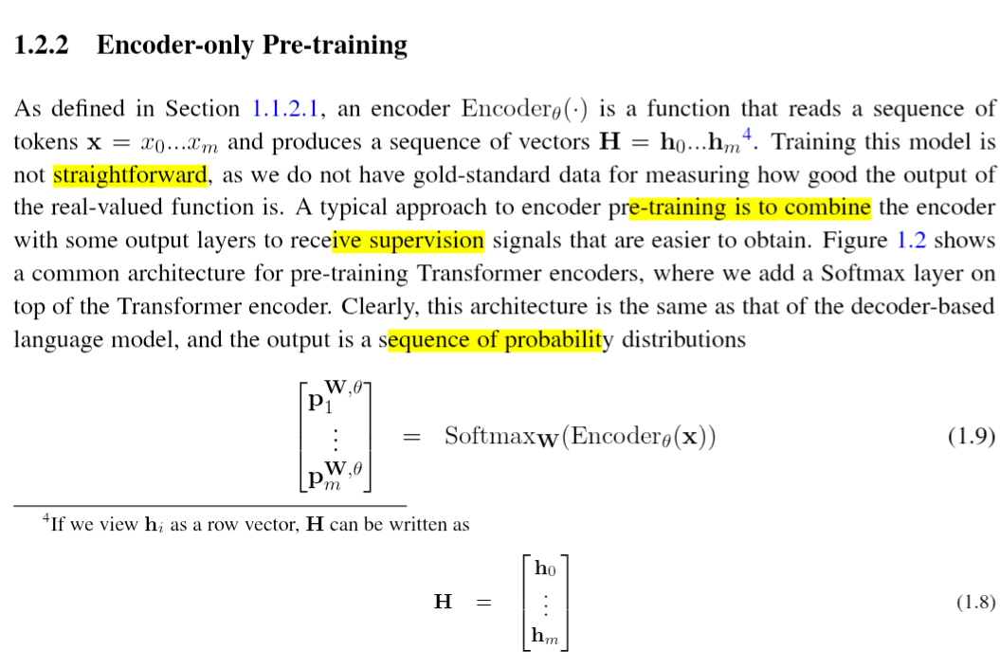</kbd>

> [!NOTE]
> thì cái này nói về việc mình sẽ tiền huấn luyện retraining. Mình sẽ pretrain một cái mô hình thuộc dạng là encoder-only. Cái encoder-only nó khác với decoder-only. Encoder-only á nó thuộc cái dạng của một cái mô hình thuộc gọi một thuộc cái loại là sequence encoding. Nó khác với với với decoder là một cái sequence generating. Có nghĩa là nó sẽ nhận vô với cái mình mình nói cái sequence generating ví dụ như decoder là nó nhận vô một cái chuỗi các input là các cái token, đúng không, một chuỗi các cái token. Và nhiệm vụ của nó là dự đoán cái token tiếp theo, tức là nó sẽ generate tức là nó sẽ tạo ra, nó sẽ chọn ra cái token thứ tiếp theo. Token mình cứ hiểu nôm na ví dụ như một cái từ vậy đó. Thì cái encoder nó lại làm nhiệm vụ là nó nhận vô một cái chuỗi các token nhưng mà nó cần phải phun ra là có thể là một cái vector các con số thực. Sao cho các con số trong cái vector đó nó nắm bắt cái ý nghĩa của cái chuỗi đưa vô. Nhưng cũng có thể nó phun ra một chuỗi các cái vector mà mỗi vector nó mang ý nghĩa của của cái từ đưa vô nhưng mà đồng thời có phản ánh cái ngữ cảnh nữa. Ví dụ như đưa vô một cái chuỗi gồm năm câu, "Tôi thích ăn táo Mỹ". Thì cái chuỗi nó đưa ra đó nó sẽ là một cái vector các con số thực ví dụ như 300 con số hay 500 con số phản ánh ý nghĩa của cả cái câu đó. Nhưng cũng có thể nói chuỗi nó đưa đưa đưa ra đó là năm cái vector mà mỗi vector là năm là 300 con số hoặc 500 con số mà mỗi vector nó phản ánh ý nghĩa của cái từ tương ứng nhưng mà đồng thời phải phản ánh cái ý nghĩa của từ tương ứng trong cái bối cảnh của của cái chuỗi đó nữa. Thì nói nói chung đó là cái nhiệm vụ của một cái cái sequence encoding model. Thì encoder-only thì nó thuộc cái loại này. Chính vì vậy mà người ta mới nói rằng với cái cái kiểu như thế này á mình không có biết gắn cái label như thế nào hết. Tức là ví dụ như decoder á mình còn có cái gold standard probability distribution, tức là ví dụ mình nôm na là mình cần nó dự đoán thì mình đại khái mình là con người mình có thể biết được là cái từ mà mình muốn nó đoán ra đúng nhất là phải là từ gì để mình đưa cho nó để mình hướng dẫn nó học theo kiểu là học tập có giám sát. Nhưng mà với cái encoder-only á thì cái việc nó đưa ra là lại là một chuỗi các con số thực. Mình làm sao mà tạo ra được cái label cho cái đó để mà dạy nó theo kiểu giám sát đây. Chính vì vậy mà mình sẽ phải gắn nó vào trong một cái lớp thuộc dạng classifier để rồi mình mới gắn cái label data mình vô mình huấn luyện nó với dạng là là là là supervised learning được. Bởi vì ngay cả self-supervised learning á cũng phải là có label data. Chẳng qua là self-supervised hay là supervised learning nó khác nhau ở chỗ là cái label data đó đó là mình tạo ra, con người tạo ra, con người chuẩn bị, hay là nó tự nó tạo ra. Đó. Thì cái phần đầu là nó nói về cái chuyện đó.### Ghi chú học tập:Pre-training mô hình Encoder-Only**1. Định nghĩa & Phân loại:***   **Pre-training (tiền huấn luyện)**: Quá trình huấn luyện mô hình trên một tập dữ liệu lớn ban đầu trước khi tinh chỉnh cho các tác vụ cụ thể.*   **Mô hình Encoder-Only**: Một loại kiến trúc trong học sâu, tập trung vào việc mã hóa (encoding) thông tin từ dữ liệu đầu vào.    *   **Khác biệt với Decoder-Only**:        *   **Encoder-Only**: Thuộc loại **Sequence Encoding** (mã hóa chuỗi).        *   **Decoder-Only**: Thuộc loại **Sequence Generating** (sinh chuỗi).**2. Nhiệm vụ của từng loại mô hình:***   **Sequence Generating (ví dụ: Decoder)**:    *   **Input**: Một chuỗi các token (ví dụ: từ trong câu).    *   **Output**: Dự đoán và tạo ra (generate) token tiếp theo trong chuỗi.    *   **Ví dụ**: Decoder nhận

> [!TIP]
> **🤖 AI Feedback** — ✅ Score: **98/100**
>
> Ghi chú giải thích rất chính xác những thách thức trong việc tiền huấn luyện mô hình encoder-only, đặc biệt là khó khăn trong việc gán nhãn và cách thêm lớp phân loại để nhận tín hiệu giám sát. Việc phân biệt giữa sequence encoding và sequence generating cũng rất hữu ích và mang lại chiều sâu.

 

##### Encoder-only và Huấn luyện Self-supervised

<kbd>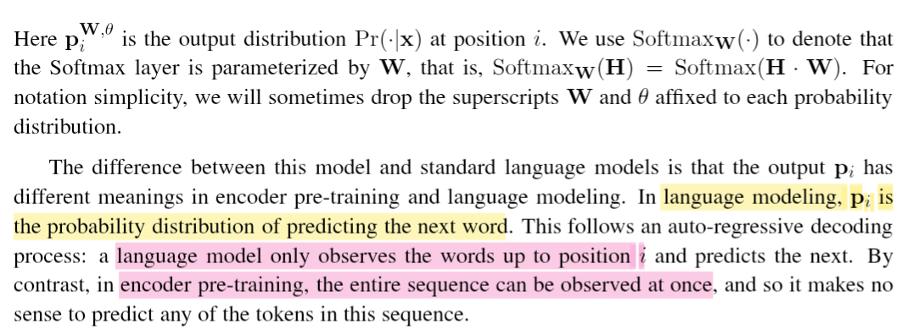</kbd>

> [!NOTE]
> Rồi, đoạn này thì nối tiếp đoạn trên, khi ta đang nói rằng encoder với bản chất là
> một sequence encoding model, nó có nhiệm vụ chính là nhận vào một chuỗi các token và phun ra một chuỗi các encoding vector - là các vector chứa các con số thực với mục tiêu là làm sao phản ánh được ý nghĩa của các token vào các vector số này. 
>
> Thế thì như đã nói, nếu để mình ên encoder-only model thì ta sẽ ko thể train nó theo supervised learning hay self supvervise leanring gì hết ráo, vì ta ko có label (vì làm sao mà ta biết được chuỗi các output vector phải mang giá trị bao nhiêu mới là tốt nhất được). Do đó, giải pháp là gắn vào môt classifier layer (mà trong đó nó dùng hàm softmax, để output ra với mỗi vị trí là một phân phối xác suất mang ý nghĩa là dự đoán cho cái từ tại vị trí đó.
>
> Ta hiểu thế này: Với classficer layer gắn vào, thì ta có thể train nguyên cái khối [encoder-classfier], mà cách kí hiệu theo kiểu xem mỗi thằng là một hàm số sẽ là Softmax_W(Encoder_theta(x), theo supervised learning, đúng hơn là self-supervised learning, khi kiểu như ta cho nó che đi từ tại một vị trí và cố mà dự đoán ra lại từ đó là gì.
>
> Thế thì cách làm này khiến tuy cũng là output ra phân phối xác suất (tại mỗi vị  nhưng nó khác với language model thông thường. Vì language model thông thường thường chỉ giới hạn trong viêc dự đoán token kế tiếp dựa trên các token
> trước đó.nó ko thấy các token phía  sau). Còn ở đây, nó thấy toàn bộ context. Do đó có thể nó với cái tên khác là MASKED LANGUAGE MODEL 
>
> Kết quả  khi training xong, ta sẽ tháo cái classifier ra, khi đó encoder sẽ có khả năng rất giỏi trong việc nắm bắt ý nghĩa của một từ (token) trong một ngữ cảnh (dĩ nhiên là phản ánh vào trong các con số của vector output bởi encoder)

> [!TIP]
> **🤖 AI Feedback** — ✅ Score: **98/100**
>
> Bản phân tích rất chính xác và sâu sắc, giải thích rõ ràng sự khác biệt giữa Language Model truyền thống và mô hình tiền huấn luyện encoder, bao gồm cả lý do và cách thức huấn luyện. Nội dung đã vượt xa những gì hình ảnh cung cấp, mang lại cái nhìn toàn diện.

 

- **Tiền huấn luyện và Ứng dụng Encoder**

<kbd>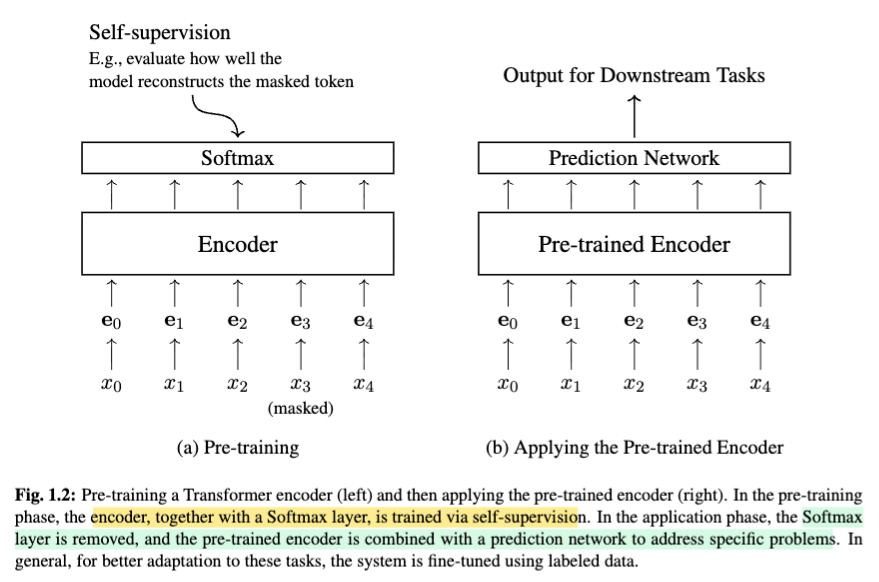</kbd>

> [!NOTE]
> Cái này hình minh họa. Mình thấy cái phần A này, tức là cái mà vừa mới nói, tức là cái quá trình pre-training, quá trình tiền huấn luyện. Thì kiểu như là một từ nó nhận vô một cái chuỗi các cái token. Như một từ che đi. Rồi nó cố gắng dự đoán lại cái từ đó gì? Dự đoán tìm hiểu cái đó. Đánh ra một cái phân bố xác suất là làm sao mà cái quá trình training, quá trình tối ưu cái tham số nó sẽ cố gắng cho cái cross entropy giữa hai cái phân bố xác suất nó gần lại. Thì cái đó là quá trình training. Rồi rồi. Thì sau khi train xong mình muốn dùng cái mô hình này thì ra mình sẽ gỡ cái lớp softmax đi, tức là mình gỡ cái lớp classifier đi. Mình chỉ dùng cái encoder mà lúc bây giờ cái tham số đã được huấn luyện rồi, đã được tối ưu rồi. Thì mình mới gắn một cái prediction network vô. Thì cái prediction network này á thì có thể nó cũng giống cái lớp softmax thôi. Nhưng mà nó nó sẽ có thể khác chút xíu nó là mình sẽ nhận cái output từ cái encoder và mà mà mà thực hiện cái dự đoán ở trong cái bài toán cuối. Thì cái phần toán cuối, cái bài toán cụ thể có thể nó là dự đoán sentiment hoặc là một cái cái một cái chuỗi hoặc là một cái nhiệm vụ nào đó khác. Và có hỏi thêm là để cái quá trình adapt đó nó nó được tốt hơn thì có thể cái pre-trained encoder nó tiếp tục fine-tune tiếp tục fine-tune cùng với cái cái prediction network trong cái bài toán cuối dùng cái dữ liệu có gắn nhãn của cái bài toán cụ thể. Ở đầu cuối. Rồi tinh chỉnh cái tham số của encoder thêm chút xíu nữa.

> [!TIP]
> **🤖 AI Feedback** — ✅ Score: **98/100**
>
> Phân tích xuất sắc, mô tả chính xác các giai đoạn tiền huấn luyện và ứng dụng, bao gồm cả chi tiết kỹ thuật như hàm lỗi cross-entropy và mục đích của fine-tuning. Giải thích rõ ràng việc loại bỏ lớp Softmax và thêm mạng dự đoán cho các tác vụ cụ thể là rất toàn diện.

 

- **Mô hình ngôn ngữ bị che**

<kbd>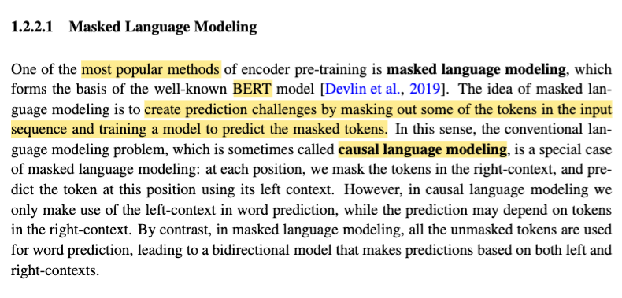</kbd>

> [!NOTE]
> Rồi, để ý là phần này nói về cái khái niệm của cái gọi là masked language model. Tức là dịch nôm na là một cái mô hình ngôn ngữ mà thuộc dạng là bị che hoặc là mặt nạ. Thì đại khái á ở đây người ta nhắc đến trong cái bối cảnh truyền thống mình tạm hiểu là như vậy. Bối cảnh truyền thống của một cái mô hình ngôn ngữ á thì nó được hiểu rằng cái mô hình ngôn ngữ nó sẽ dự đoán một cái từ, dự đoán một cái token dựa trên những cái token trước đó. Thì đó là cái cách hiểu truyền thống của một cái mô hình ngôn ngữ. Nhưng nhưng cái masked language model mà cái ví dụ nổi tiếng nhất khi mà người ta giới thiệu cái này á chính là cái BERT á thì nó lại làm cái chuyện khác tức là nó dự đoán một cái từ bị che dựa trên tất cả các cái từ khác ở trong bối cảnh, trong cái đoạn văn. Và với cái cách với cái cách định nghĩa thế này á thì cái mô hình language truyền thống đó nó có thể gọi là một một trường hợp đặc biệt của cái masked language model. Đó là nó chỉ nó nó che hết những cái từ bên phải, chỉ dự đoán dựa trên cái context là những từ bên trái. Và cái đó nó có cái tên gọi là causal language modeling là cái cách truyền thống. Tuy nhiên cái cái masked thì nó rộng hơn và nó mang cái khả năng là dự đoán cái token bị che với cái context là cả bên trái lẫn bên phải.

> [!TIP]
> **🤖 AI Feedback** — ✅ Score: **98/100**
>
> Phần phân tích rất chính xác và chi tiết, giải thích rõ ràng khái niệm về Masked Language Modeling và mối quan hệ với Causal Language Modeling. Bạn đã nắm bắt rất tốt các điểm chính và cung cấp một cái nhìn sâu sắc.

 

- **Che giấu Token và Tái tạo**

<kbd>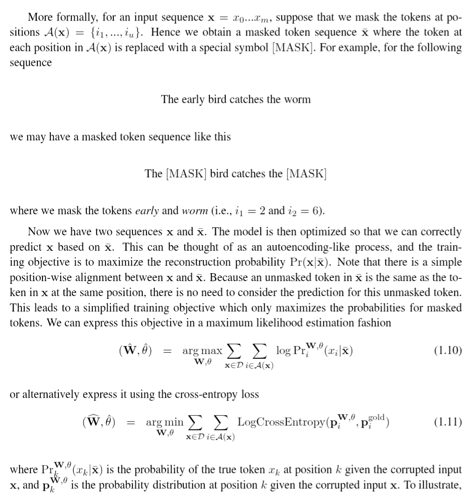</kbd>

> [!NOTE]
> Mục đích của ví dụ này là minh họa cách thực hiện việc che (masking) các token và cho mô hình dự đoán token bị che. Chuỗi input được hiểu là một chuỗi các token (ví dụ x0 đến xm), có thể hình dung như một trang sách, cuốn tạp chí hoặc bài viết trên Wikipedia. Để thực hiện che, chúng ta dùng một function hoặc cách thức để chọn ra các từ/token bị che. Các vị trí bị che này được ký hiệu bởi A(x), trong đó x là chuỗi token input, và A(x) cho biết các vị trí của token sẽ bị che. Ví dụ, với chuỗi input là 'Con chim dậy sớm thì bắt được sâu', function sẽ tìm và che hai vị trí. Câu sau khi bị che sẽ có dạng như 'Con chim [MASK] sớm thì bắt được [MASK]' (hoặc được minh họa là 'the mask bird catch the mask').
>
> Một mô hình xử lý chuỗi hoạt động như sau:1. Đầu vào (X-bar): Là chuỗi dữ liệu đã được che (masked), có thể xem là dữ liệu bị hư hại (corrupt).2. Nhiệm vụ mô hình: Nhận X-bar và dự đoán để khôi phục lại chuỗi gốc ban đầu (không bị che). Quá trình này được gọi là "reconstruction".3. Huấn luyện mô hình: Được thực hiện theo kiểu một "autoencoder" với mục tiêu giảm thiểu "Reconstruction Loss" (lỗi khi khôi phục dữ liệu).4. Ý nghĩa của Reconstruction Loss: Reconstruction Loss càng thấp, mô hình càng khôi phục chuỗi ban đầu chính xác và dự đoán đúng các phần bị che.
>
> Phần cuối cùng biểu diễn về mặt toán học của hàm lỗi (loss function), đây thực chất là một bài toán tối ưu. Để huấn luyện mô hình, chúng ta tối ưu các tham số (theta, W) nhằm tối đa hóa likelihood, cụ thể là tối đa hóa xác suất điều kiện. Xác suất điều kiện này dựa trên đầu vào đã bị che (X bar), mục tiêu là tối đa hóa xác suất của chuỗi gốc. Đây cũng chính là hình thức maximum likelihood. Một cách nhìn khác là tối thiểu hóa lỗi tái tạo (reconstruction loss), mà lỗi này chính là cross-entropy loss. Đối với một từ bị che (ví dụ 'early'), phân phối xác suất ban đầu sẽ tập trung vào từ 'early'. Mô hình cần dự đoán ra một phân phối xác suất gần nhất với phân phối gốc này. Việc giảm cross-entropy giữa hai phân phối xác suất giúp đạt được điều đó. Tổng chi phí (cost) bao gồm tổng tất cả các lỗi tại mọi vị trí bị che trong một chuỗi, và trên toàn bộ các chuỗi trong tập dữ liệu. Đây là cách thể hiện của bài toán tối ưu. Sau khi huấn luyện (train) mô hình và tìm được các tham số tối ưu theta^ và W^ coi như quá trình huấn luyện đã hoàn thành.

> [!TIP]
> **🤖 AI Feedback** — ✅ Score: **98/100**
>
> Giải thích rất chính xác và đầy đủ, cung cấp thêm ngữ cảnh và chiều sâu đáng kể cho các khái niệm được trình bày trong hình ảnh.

 

- **Nhược điểm Mask Language Model**

<kbd>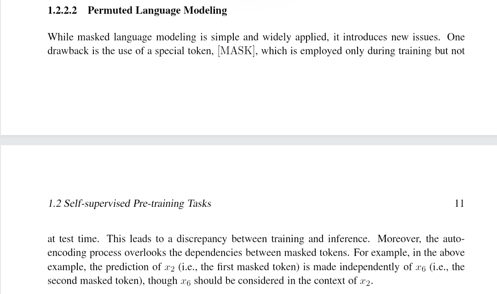</kbd>

> [!NOTE]
> Cái này đại khái là mở đầu á thì người ta nói rằng á là với sự phát triển rộng rãi của cái kỹ thuật Mask Language Model đó thì nó lại phát sinh một cái vấn đề. Mà cái vấn đề đầu tiên á, đó là trong quá trình training á thì mình hiểu nôm na thế này nè, trong quá trình huấn luyện á thì cái mô hình nó nó thấy trong cái dữ liệu huấn luyện á, nó thấy có cái cái token đặc biệt nó là cái token mask. Nhưng trong quá trình mà suy luận đó, tức là trong quá trình mà thực tế sử dụng đó thì nó lại không thấy cái token đó. Điều này nó gây ra có một cái sự khác biệt, discrepancy đó giữa cái dữ liệu huấn luyện và cái dữ liệu thực tế. Đây là một vấn đề.
>
> Một điểm nữa là quá trình tạo mask có thể khiến cho mô hình bỏ qua / không học được / bỏ sót quan hệ giữa các từ, ví dụ như khi training, cái từ bị che đóng vai trò quan trọng đối với nhau.

> [!TIP]
> **🤖 AI Feedback** — ✅ Score: **93/100**
>
> Học sinh đã nắm vững hai nhược điểm chính của Masked Language Modeling được đề cập, đặc biệt là sự khác biệt do token [MASK] và việc bỏ qua mối quan hệ giữa các token bị che. Bài làm thể hiện sự hiểu biết sâu sắc và chính xác.

 

- **Mô hình ngôn ngữ che dấu**

<kbd>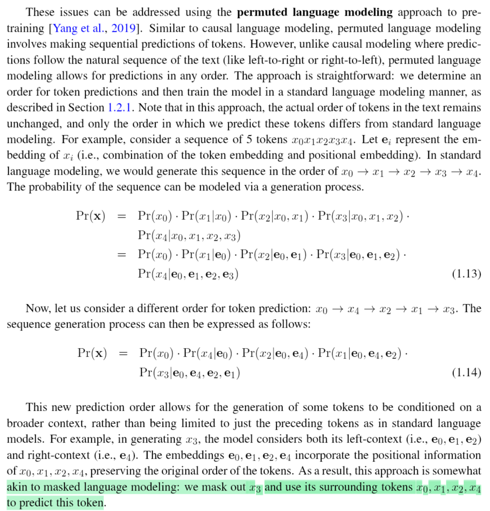</kbd>

> [!NOTE]
> Một cách khắc phục vấn đề rất đơn giản đó là Permuted Language Model. Nói ngắn gọn thế này, cứ train như language model thông thường, khỏi che gì hết. Nhưng ta sẽ xáo trộn thứ tự.  
>
> Khi đó, việc dự đoán các từ trong chuỗi sẽ ko còn bị vấn đề là dự nhìn vào các từ bên trái (thứ mà masked language model cố gắng giải quyết) vì khi huấn luyện có nó sẽ phải dự đoán từ ở vị trí i=3 dựa trên những từ ở i=1,2 và i=4

> [!TIP]
> **🤖 AI Feedback** — ❌ Score: **65/100**
>
> The student correctly grasps the concept of permuting prediction order for broader context but misunderstands the role of masking in this approach.

 

- **Mô hình ngôn ngữ hoán vị Transformer**

<kbd>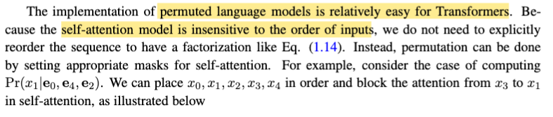</kbd>

<kbd>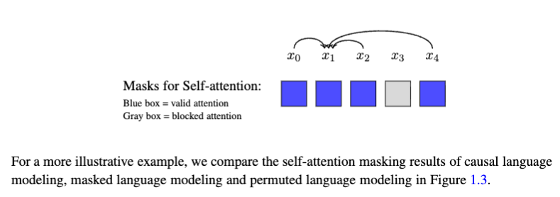</kbd>

> [!NOTE]
> Đại khái là 
>
> Cách làm không phải là tách câu thành các token, sau đó thay thế các token này bằng 'mask token', rồi mới đưa vào mô hình để dự đoán.

> [!TIP]
> **🤖 AI Feedback** — ⚠️ Score: **80/100**
>
> Học sinh hiểu đúng điểm khác biệt quan trọng giữa mô hình ngôn ngữ hoán vị và các phương pháp khác, đặc biệt là không sử dụng 'mask token' theo cách truyền thống. Tuy nhiên, cần bổ sung thêm về cách triển khai thực tế.

**🔗 See also:** [Học không giám sát để tiền huấn luyện](./gii_thiu_m_hnh_ngn_ng_ln.md#node-hsb1v0a)

 

- **Dự đoán câu tiếp theo**

<kbd>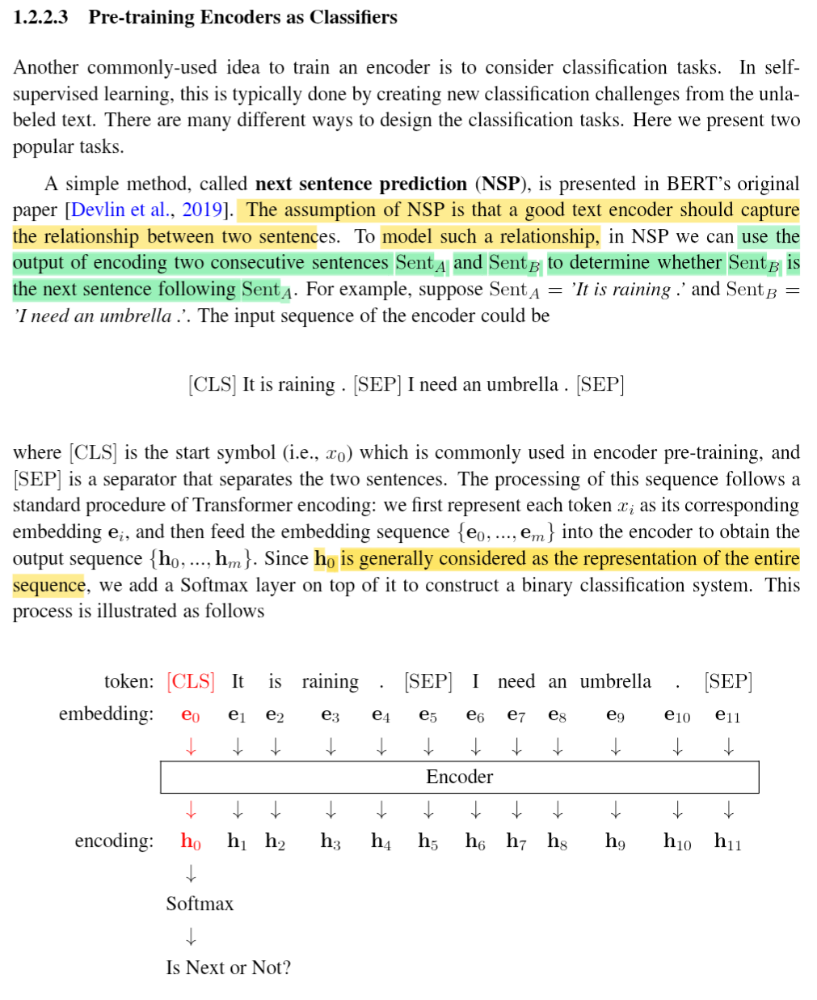</kbd>

<kbd>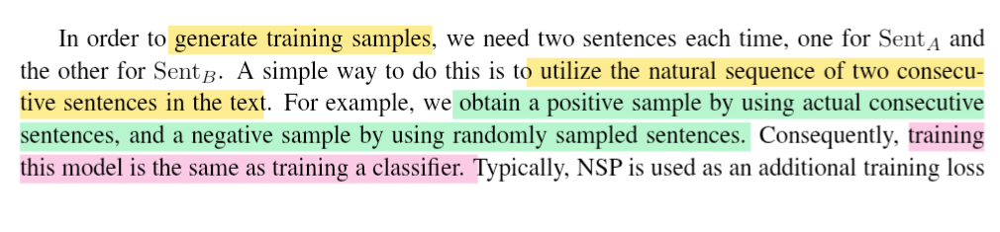</kbd>

> [!NOTE]
> Đại khái là mình hiểu đây là một thực hiện việc tiền huấn luyện theo cách huấn luyện một bài toán phân loại.  
>
> Mục đích của quá trình tiền huấn luyện là tạo ra các mô hình nền (base models) hoặc mô hình nền tảng. Những mô hình này có khả năng phát huy tác dụng tốt trong nhiều bài toán cụ thể sau này. Quan trọng là, trong quá trình tiền huấn luyện, không có một mục tiêu cụ thể nào cho một bài toán cụ thể được đặt ra.
>
> Thế thì, mục này nói về việc ta có thể thiết kế quá trình tiền huấn luyện theo kiểu huấn luyện một mô hình phân loại. Một mô hình phân loại cơ bản là mình muốn nó dự đoán dữ liệu đầu vào thuộc loại nào (ví dụ: nhiều loại, hai loại). Đối với hai loại, đó là mô hình phân loại nhị phân (binary classification). Vậy thì làm sao để thiết kế quá trình tiền huấn luyện theo kiểu bài toán phân loại? Câu trả lời là phải dựa trên một giả định (assumption). Giả định đó là: nếu một mô hình có thể nắm bắt tốt khả năng hiểu ngữ cảnh, bởi vì cái mình hướng tới là một mô hình nền để rồi nó có thể hữu ích cho những bài toán cụ thể sau này. Điều quan trọng nhất là dạy cho nó hoặc nó học được cách hiểu ngữ cảnh, hiểu được một nội dung ngữ cảnh. Vậy thì cái giả định vừa nói ở trên chính là nếu một mô hình hiểu ngữ cảnh tốt thì nó phải có khả năng xác định được đâu là hai câu kế tiếp nhau.
>
> Và cái giả định này cũng có thể dễ dàng hiểu được hoặc là chấp nhận được là là bởi vì nếu như mà một cái mô hình mà nó đã hiểu được ngữ cảnh tốt thì nó phải nắm bắt được, nó phải hiểu được cái chuyện là hai câu nó có quan hệ với nhau hay không, nó có nối tiếp nhau hay không để nó bổ nghĩa cho nhau. Vậy thì đương nhiên đã nói là giả định thì nó có thể không đúng. Nhưng nếu ta giả định cái giả định đó là đúng, thì mình sẽ làm cơ sở để xây dựng một cái mô hình phân loại. Đại khái, cái cách làm một cách nói một cách ngắn gọn là mình sẽ kiểu như mình lấy một cái đoạn văn bản ra. Rồi mình lấy hai câu kế tiếp nhau ra và mình sẽ gán cái label của hai câu kế tiếp nhau đó là 1. Tức là mình lấy hai câu kế tiếp nhau ra và mình tạo ra một cái chuỗi. Và cái chuỗi này sẽ là cái chuỗi input đưa vào model. Dĩ nhiên nó có thêm một số cái token đặc biệt như là token bắt đầu cũng như là token mà phân tách giữa hai câu. Nhưng mà đại khái đó chính là một cái chuỗi đưa vô một cái X. Gắn với nó là một cái label. Thì cái label trong trường hợp này là một cái positive label. Bởi vì đây là hai câu thật sự là nối đuôi nhau ở trong cái cái cái cái ngoài đời thật. Rồi đó là một là positive label, xin lỗi, một gọi là một positive sample.
>
> Negative Sample: Để tạo negative sample, chọn hai câu ngẫu nhiên. Mặc dù có khả năng hai câu ngẫu nhiên này kế tiếp nhau, nhưng trong tập văn bản lớn, xác suất chúng không kế tiếp nhau là rất cao. Hai câu không kế tiếp này sẽ được kết hợp để tạo thành một training sample. Label cho sample này sẽ là "false". Mô hình này là mô hình phân loại nhị phân (binary classification). Mô hình sẽ dự đoán liệu hai câu đầu vào có phải là "true" hay "false". Quá trình training sẽ huấn luyện mô hình phân loại nhị phân này.
>
>
>
> Ở trên nói chuyện là mình gắn hai cái câu, có thể kế tiếp hoặc không kế tiếp thì thành một cái chuỗi. Thì đương nhiên là mình phải thực hiện cái bước token, token hóa, là mình cũng sẽ phân tách nó thành ra những cái chuỗi của những cái token. Và mình mình mình đưa nó vào cái lớp transformer thì mình theo cái tiêu chuẩn chung của một cái mô hình transformer, tức là mỗi token sẽ được tức là mỗi một từ đưa vô, một cái từ trong cái chuỗi sẽ được biến thành token, chuyển thành token. Cũng không hẳn là một từ đưa vô bởi vì có nhiều cái cách để mà token hóa nhưng mà mình cứ hiểu nôm na là cái cách đơn giản nhất là mỗi một từ đưa vô thành một token. Rồi mỗi cái token nó sẽ được qua các cái lớp của cái mô hình transformer, nó sẽ trở thành một cái vector. Và qua các cái lớp mô hình transformer, các vector nó có cái sự tạm hiểu là cái sự liên hệ qua lại lẫn nhau để rồi nó trao đổi thông tin với nhau. Và mình sẽ lấy cái vector H0 làm cái vector đại diện cho cả cái cái chuỗi đó. Rồi mình sẽ đưa nó vào mô hình Softmax, tức là đưa vào cái lớp Softmax để mình mình chuyển ra thành một cái phân phối xác suất.
>
> Khi mình có dự đoán là một phân phối xác suất, mình dùng Binary Cross Entropy Loss để tính ra loss (mất mát) giữa phân phối xác suất thực (là một one-hot vector) và phân phối xác suất dự đoán. Quá trình training là mình sẽ giảm thiểu tổng cost function (loss) xuống. Đây chính là quá trình training một mô hình phân loại như đã nói ở trên. Quá trình này sẽ giúp train mô hình theo bài toán pre-training.

> [!TIP]
> **🤖 AI Feedback** — ✅ Score: **95/100**
>
> Học sinh thể hiện sự hiểu biết rất sâu sắc và chính xác về quá trình tiền huấn luyện mã hóa dựa trên bài toán phân loại, đặc biệt là Next Sentence Prediction (NSP), cùng với nhiều kiến thức mở rộng liên quan.

 

- **ELECTRA: Phát hiện từ thay đổi**

<kbd>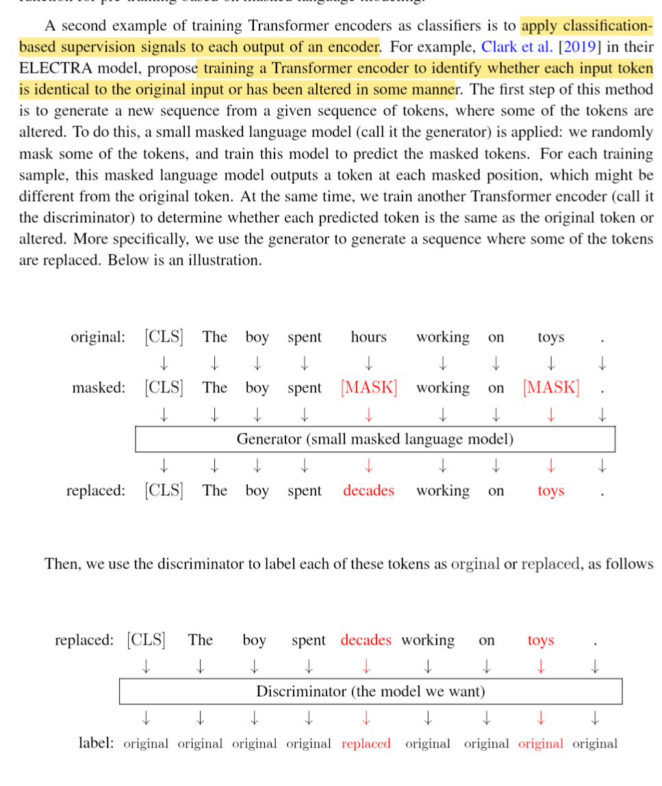</kbd>

<kbd>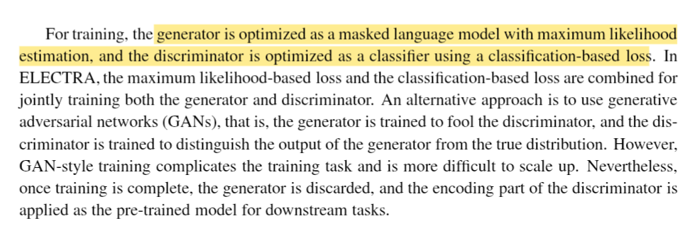</kbd>

> [!NOTE]
> Đây là nói về một cái cách thứ hai, thêm một cái cách khác. Mà trong đó người ta biến cái việc tiền huấn luyện một cái base model theo cái cách của việc huấn luyện một cái mô hình phân loại. Như đã biết, việc huấn luyện một cái mô hình base model, một cái mô hình nền thì không có một cái yêu cầu cụ thể nào đối với cái tác vụ cuối. Mà mục đích chỉ là huấn luyện được một cái mô hình nền sao cho nó có khả năng nắm bắt cái ngữ cảnh tốt để từ đó khi mà gắn nó vào những cái tác vụ cuối, tức là những nhiệm vụ cụ thể thì khi đó nó sẽ đều làm tốt. Vậy thì cái yêu cầu quan trọng nhất của việc huấn luyện, của tiền huấn luyện base model là nắm bắt ngữ cảnh. Vậy thì trong cái cách làm này người ta sẽ thiết kế một cái cách tiếp cận trong đó là mô hình sẽ cố gắng dự đoán những cái từ đã bị che. Nhưng mà nó không phải là nó như như một cái masked language model. Bởi vì ta biết cái masked language model là nó cũng sẽ dự đoán cái từ đã bị che, nhưng mà nó sẽ tìm cách generate ra cái từ đó. Tức là nó sẽ dự đoán một cái phân phối xác suất qua các cái từ trong từ trong từ điển để cố gắng đoán cái từ đó là từ gì. Còn ở đây thì nó không làm như vậy. Mà nó sẽ chỉ, như đã nói, nó chỉ chỉ dự đoán một cái mô hình phân loại thôi. Do đó người ta mới kiểu như là cũng che đi một số từ. Sau đó dùng một cái mô hình masked language model để generate ra những cái từ ở cho đã bị che. Và sau đó thì cái mô hình chính mới tìm cách dự đoán xem là cái từ bị che đó là cái từ gốc nó có đúng hoặc là nó có giống với cái từ mà masked language model generate ra hay không. Hay nói cách khác cái base language model đó, cái mô hình mà mình đang muốn tiền huấn luyện đó sẽ cố gắng dự đoán rằng là cái từ mà masked language model nó tạo ra và cái từ gốc trước khi bị che đó có phải là một hay không. Thì đây là một cái nhiệm vụ phân loại. Cụ thể thì nó chính là một nhiệm vụ phân loại nhị phân, một bài toán phân loại nhị phân.
>
> ### Ghi chú học tập:
>
> **1. Cách tiếp cận huấn luyện thứ hai:**
>
> *   Tập trung vào việc tiền huấn luyện (pre-training) một mô hình nền (base model).
> *   Mục tiêu: Mô hình nền phải có khả năng nắm bắt ngữ cảnh tốt.
>
> **2. So sánh với Masked Language Model (MLM):**
>
> *   **MLM:** Dự đoán từ bị che bằng cách *sinh ra* (generate) từ đó từ một phân phối xác suất dựa trên từ điển.
> *   **Cách tiếp cận này:** Không trực tiếp sinh từ.
>
> **3. Phương pháp thực hiện:**
>
> *   **Bước 1:** Che đi một số từ trong văn bản.
> *   **Bước 2:** Sử dụng một MLM để tạo ra các từ thay thế cho các vị trí bị che.
> *   **Bước 3:** Mô hình nền (mô hình chính đang được huấn luyện) sẽ cố gắng *dự đoán* xem liệu từ mà MLM sinh ra có *giống* với từ gốc ban đầu bị che hay không.
>
> **4. Bản chất của nhiệm vụ:**
>
> *   Đây là một nhiệm vụ phân loại (classification task).
> *   Cụ thể hơn, là một nhiệm vụ phân loại nhị phân (binary classification), tức là dự đoán 
>
> Như vậy thì với cách này, mình có thể thấy là có tới hai mô hình. Một mô hình là Mask Language Model làm nhiệm vụ dự đoán cái từ bị che. Tất nhiên từ bị che hoặc là vị trí nào bị che sẽ được generate, được tạo ra hoặc là được quyết định bởi một cái thuật toán nào đó. Nhưng mà Mask Language Model sẽ dự đoán những cái từ bị che. Và cái mô hình tiền huấn luyện sẽ, như đã nói, tìm cách dự đoán xem cái từ mà được dự đoán và cái từ gốc trước khi bị che có phải là một hay không. Như vậy thì có thể thấy thông qua cái nhiệm vụ phân loại nhưng mô hình base model trong quá trình tiền huấn luyện đó muốn làm tốt được cái nhiệm vụ này, nhiệm vụ phân loại này nó phải học cách hiểu được ngữ cảnh. Và đương nhiên là vì mình biết cái từ bị che là từ gì. Do đó là về cơ bản là mình cũng có thể mình cũng có thể cũng cũng đang gọi là self-supervised, tự giám sát. Và việc huấn luyện nó sẽ huấn luyện nó sẽ huấn luyện đồng thời cả hai mô hình. Mô hình Mask Language Model nó được gọi là Generator, bởi vì nhiệm vụ của nó là generate ra cái từ bị che. Nhưng cái nhiệm cái mô hình base model sẽ được gọi là Discriminator, bởi vì nhiệm vụ của nó là phân loại xem là cái từ bị che và cái từ được tạo ra bởi Mask Language Model có phải là một hay không. Như vậy việc huấn luyện đồng thời cả hai mô hình này à là một cái một cái cái cái cách làm khá là đặc biệt. Nhưng cũng không phải là mới vì đã từng thấy cái cơ chế này trong những cái mô hình như GAN. Tức là trong đó quá trình huấn luyện là một cái cuộc đua giữa Generator và Discriminator. Và trong bài viết cũng có nói đến một cách tiếp cận khi mà người ta ứng dụng cái GAN vào. Tức là huấn luyện cái Generator theo cái cách là để cho nó cố gắng đánh lừa được Discriminator. Thì trong thông qua cả hai thông qua quá trình đó thì cả hai nó sẽ đều giỏi lên. Tuy nhiên là người ta cũng nhắc đến cái việc là GAN nó có những cái yếu tố phức tạp khiến cho việc mà training ở cái quy mô lớn nó rất là phức tạp.
>
> ### Ghi chú học tập:
> *   **Hai mô hình chính trong quá trình huấn luyện:**
>     1.  **Masked Language Model (MLM) / Generator:**
>         *   **Nhiệm vụ:** Dự đoán các từ bị che (masked words) trong câu. Từ bị che có thể được tạo ra (generate) hoặc quyết định bởi một thuật toán.
>         *   **Vai trò:** Tương tự như Generator trong mô hình GAN, tạo ra dữ liệu (ở đây là các từ).
>     2.  **Mô hình tiền huấn luyện (Base Model) / Discriminator:**
>         *   **Nhiệm vụ:** Phân loại (dự đoán) xem từ được MLM tạo ra có trùng khớp với từ gốc ban đầu (trước khi bị che) hay không.
>         *   **Cơ chế:** Để thực hiện tốt nhiệm vụ phân loại, mô hình này phải học cách hiểu được ngữ cảnh của câu.
>         *   **Vai trò:** Tương tự như Discriminator trong mô hình GAN, phân biệt giữa dữ liệu

> [!TIP]
> **🤖 AI Feedback** — ✅ Score: **90/100**
>
> Ghi chú của bạn thể hiện sự hiểu biết rất tốt về cách tiếp cận huấn luyện ELECTRA, đặc biệt là việc nhận diện hai mô hình chính và mục tiêu của chúng. Bạn cũng đã có một nhận định sâu sắc khi liên hệ với GANs.

**🔗 See also:** [Nền tảng Mô hình ngôn ngữ lớn](#node-tzhbd32)

 

- **Tiền huấn luyện Encoder-Decoder**

<kbd>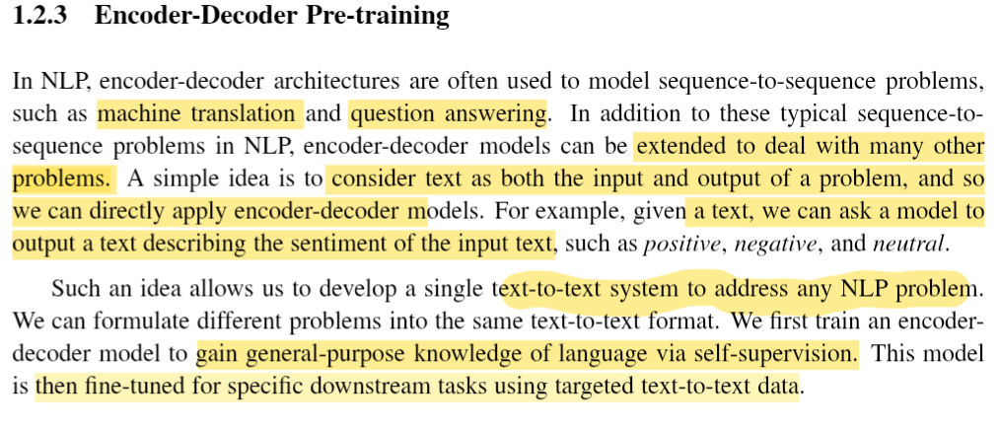</kbd>

> [!NOTE]
> Ờ cái này đại khái là nói đến một cái kiến trúc gọi là encoder decoder. Thì như cái tên nó cái encoder decoder nó là một cái kiến trúc có cái hai phần. Mà cái phần đầu nó mang nhiệm vụ là nó mã hóa cái chuỗi đầu vào. Còn decoder nó sẽ mang nhiệm vụ là nó giống như là nó tạo ra một cái chuỗi đầu ra. Thì đương nhiên nó giống như một cái mô hình ngôn ngữ thì nó vẫn là mô hình ngôn ngữ. Và nó dự đoán cái chuỗi đầu ra dựa theo trên là cái chuỗi đầu vào. Thì ở đây người ta muốn nói là có thể dùng cái kiến trúc kiểu này để mà phục vụ cho những cái gọi là những cái bài toán phục vụ cho những cái nhiệm vụ NLP khác riêng biệt. Chứ không chứ không phải là có nghĩa là tuy là cái nhiệm vụ của cái encoder decoder là nhận vào một chuỗi và ra một chuỗi, nhưng mà mình có thể tận dụng nó để để gọi là điều chỉnh lại nó để nó trở thành phục vụ cho những bài toán riêng biệt. Mà cái bài toán bình thường á thì có thể là nó phục vụ cho cái việc là dịch thuật, gọi là machine translation khi cái chuỗi đầu vào nó là một cái câu tiếng Đức, chuỗi đầu ra nó là một cái câu tiếng Anh. Hoặc là summarization khi chuỗi đầu vào là một cái đoạn text thì chuỗi đầu ra là một cái câu mà nó tóm gọn hoặc là một cái đoạn text ngắn hơn, tóm tóm gọn cái nội dung đưa vô. Nhưng mà hoàn toàn có thể biến nó hoặc dùng nó cho một cái bài toán khác, một bài toán NLP khác. Ví dụ như là sentiment analysis. Vốn là một cái bài toán phân loại. Khi mà mình mình đưa vào một cái một cái đoạn văn, một cái câu văn, một cái câu mình muốn nó ra là xem cái câu đó là cái positive hay là negative hay là neutral. Vậy thì thật ra mình vẫn có thể dùng cái này để làm cho cái bài toán đó bằng cách là mình cho cái decoder nó output ra là là là là một cái từ nào ở trong ba cái từ đó. Thì cái đây là cái mở đầu cho việc là nói về việc mình sử dụng cái kiến trúc encoder decoder cho cho cho những cái bài toán này. Thì họ có nói sơ về việc huấn luyện á là mình sẽ đầu tiên mình cũng huấn luyện nguyên cả cái đó. Nhưng mà theo cái kiểu là self supervise. Tức là tự giám sát. Mục đích là để cho nó học được cái kiến thức chung. Nó hiểu được cái cái việc mà cái ngữ cảnh đưa cái từ cái đoạn văn đưa vô nó có cái ý nghĩa sao. Nhưng mà sau đó mình sẽ fine tune nó, mình sẽ tinh chỉnh nó với một cái bộ dữ liệu có gán nhãn theo cái kiểu là supervise learning.

> [!TIP]
> **🤖 AI Feedback** — ✅ Score: **98/100**
>
> Phần phân tích rất chính xác và có chiều sâu, giải thích rõ ràng kiến trúc encoder-decoder và cách áp dụng nó cho nhiều bài toán NLP khác nhau, bao gồm cả ví dụ phân tích cảm xúc. Chi tiết về quá trình huấn luyện tự giám sát và tinh chỉnh cũng được trình bày đầy đủ.

 

- **T5: Tiếp cận Text-to-Text**

<kbd>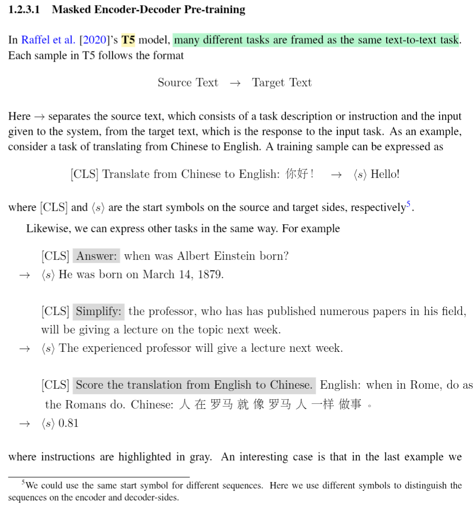</kbd>

> [!NOTE]
> Mô hình T5: Encoder-Decoder Pre-training cho các bài toán NLP. Mô hình T5 giải quyết nhiều bài toán NLP bằng cách biểu diễn chúng dưới dạng "text-to-text" (đầu vào là một chuỗi, đầu ra là một chuỗi). Ví dụ về dịch thuật (Machine Translation): Cấu trúc đầu vào: Bắt đầu bằng token đặc biệt (ví dụ: CLS), tiếp theo là yêu cầu/lệnh (ví dụ: "Translate from Chinese to English"), dấu hai chấm, và cuối cùng là câu cần dịch (ví dụ: "Xin chào" tiếng Trung). Ví dụ đầu vào: "CLS Translate from Chinese to English: Xin chào". Cấu trúc đầu ra: Bắt đầu bằng token đặc biệt (ví dụ: S), tiếp theo là câu đã dịch (ví dụ: "Hello"). Ví dụ đầu ra: "S Hello". Quá trình: 1. Huấn luyện: Mô hình được pre-train hoặc fine-tune để học cách chuyển đổi từ chuỗi đầu vào sang chuỗi đầu ra theo định dạng trên. 2. Sử dụng (sau huấn luyện): Khi đưa vào một chuỗi đầu vào theo cấu trúc đã định, mô hình sẽ tự động tạo ra chuỗi đầu ra là bản dịch tương ứng. Mô hình T5 sử dụng kiến trúc encoder-decoder để giải quyết bài toán dịch thuật bằng cách chuẩn hóa nó thành một tác vụ chuyển đổi chuỗi văn bản.
>
> Rồi một cái kiểu khác đó là khi cái cái cái cái mình prompt cho nó mình đưa cho nó là CLS, answer, When was Albert Einstein born? Thì nó output ra là he was born on March 14, 1879. Thì đây lại là một cái mô hình cũng dùng cái kiểu là encoder decoder nhưng mà nó phục vụ cho cái bài toán question answering. Tức là quá trình training cũng là cái kiến trúc đó nhưng mà cái dữ liệu, cái kiểu train nó cái dữ liệu nó được thay đổi bằng cách là mình thay đổi cái prompt cũng như là cái cái bộ câu hỏi và cái câu trả lời thì mình ra được một cái mô hình mà nó phục vụ cho cái nhiệm vụ NLP là question answering. Rồi một cái kiểu thứ ba là simplify. Đó cũng là cái chuỗi đưa vô là CLS simplify một cái cái một cái câu nào đó thì chuỗi đưa ra nó sẽ là là là giống như summary hoặc là viết một cái phiên bản đơn giản của chuỗi đưa vô. Tóm thì thì đây là có thể thấy đây là những cái ví dụ mà người ta minh họa cho việc là à một cùng một kiến trúc encoder decoder nhưng mà bằng một cách thay đổi chút xíu cái prompt và cái dữ liệu được huấn luyện thì mình sẽ sẽ kiểu như là mình mình mình chỉ cần pretrain một cái base model, sau đó mình tinh chỉnh lại mình lấy cái đó mình tinh chỉnh lại với cái bộ dữ liệu question answering thì mình sẽ có một cái mô hình là question answering NLP. Tinh chỉnh lại với cái bộ dữ liệu dịch thuật mình sẽ có được một cái mô hình dịch thuật. Thì ví dụ đại khái là như vậy.

> [!TIP]
> **🤖 AI Feedback** — ⚠️ Score: **75/100**
>
> Học sinh đã nắm vững khái niệm text-to-text và cách các tác vụ được định dạng trong T5. Tuy nhiên, cần làm rõ hơn về việc T5 sử dụng một mô hình duy nhất cho tất cả các tác vụ thay vì tinh chỉnh thành các mô hình chuyên biệt.

 

- **Mô hình Encoder-Decoder Zero-shot**

<kbd>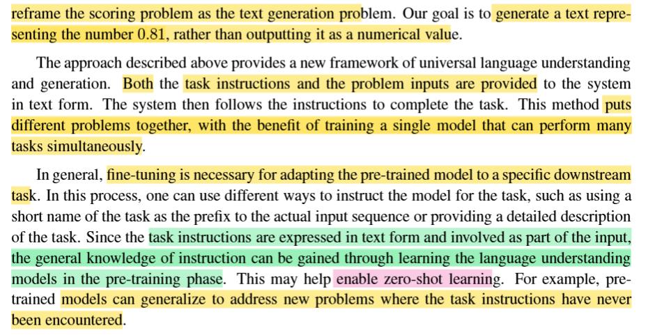</kbd>

> [!NOTE]
> Nội dung này đề cập đến ví dụ cuối cùng trong ảnh chụp màn hình trước đó, sử dụng mô hình encoder-decoder. Bài toán được giải quyết có đầu vào là một chuỗi (bao gồm instruction hoặc prompt) và đầu ra là một chuỗi, nhưng chuỗi đầu ra này lại thể hiện một con số, giống như việc đánh giá một chỉ số. Điểm thú vị là mặc dù mô hình nhận và xuất dữ liệu dưới dạng chuỗi, nhưng nó có thể được điều chỉnh để đầu ra mang giá trị số. Đây là một ứng dụng minh họa cách một mô hình ngôn ngữ có thể được huấn luyện để thực hiện các nhiệm vụ tính toán.
>
> Mô hình ngôn ngữ có thể thực hiện những tác vụ bất ngờ. Về cơ bản, một mô hình ngôn ngữ nhận đầu vào là một chuỗi và trả về đầu ra là một chuỗi. Tuy nhiên, bằng cách diễn giải chuỗi đầu ra (ví dụ: là một con số), mô hình có thể được ứng dụng vào nhiều nhiệm vụ khác nhau. Một điểm quan trọng là cách thiết lập quá trình huấn luyện mô hình encoder-decoder. Chuỗi đầu vào cho mô hình bao gồm hai phần: một là hướng dẫn hoặc yêu cầu cụ thể (prompt), và hai là chuỗi input ban đầu. Hai phần này được kết hợp để tạo thành một chuỗi đầu vào hoàn chỉnh. Nhờ cách thiết lập huấn luyện này, mô hình phát triển một khả năng đặc biệt: sau khi được huấn luyện và tinh chỉnh, nó có thể hiểu và xử lý những yêu cầu mà trước đó hoàn toàn không có trong bộ dữ liệu huấn luyện của nó. Khả năng này được gọi là Zero-shot learning.

> [!TIP]
> **🤖 AI Feedback** — ⚠️ Score: **88/100**
>
> Giải thích chi tiết và chính xác các khái niệm cốt lõi như chuyển đổi bài toán đánh giá thành sinh văn bản và học zero-shot. Tuy nhiên, việc đề cập đến mô hình encoder-decoder và "ví dụ cuối cùng" không có trong văn bản gốc.

 

- **Tự học Encoder-Decoder tiền tố**

<kbd>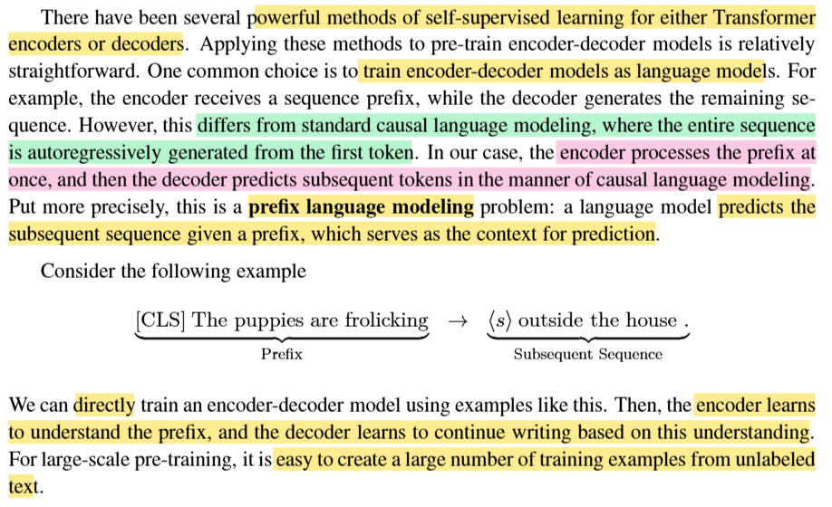</kbd>

> [!NOTE]
> Huấn luyện mô hình Encoder-Decoder: Mô hình được huấn luyện để chuyển đổi chuỗi đầu vào (input) thành chuỗi đầu ra (output). Chuỗi input bao gồm prompt (instruction) và chuỗi ngữ cảnh. Encoder nhận chuỗi input, Decoder dự đoán chuỗi output. So sánh với Mô hình Ngôn ngữ Truyền thống (Causal Language Model): Giống nhau: Cả hai đều dự đoán token output dựa trên token input. Khác biệt chính: Mô hình Ngôn ngữ Truyền thống: Xử lý thông tin tuần tự theo một chiều, dự đoán token tiếp theo dựa trên các token trước đó. Encoder (trong mô hình này): Xử lý đồng thời tất cả các token của chuỗi đầu vào, không tuần tự từng token một. Encoder nhìn thấy và xử lý toàn bộ input cùng một lúc. Đây là điểm khác biệt chính so với mô hình ngôn ngữ truyền thống.

> [!TIP]
> **🤖 AI Feedback** — ✅ Score: **95/100**
>
> Học sinh đã nắm vững cách huấn luyện mô hình encoder-decoder cho mô hình ngôn ngữ tiền tố và hiểu rõ sự khác biệt quan trọng trong cách bộ mã hóa xử lý đầu vào so với mô hình ngôn ngữ truyền thống.

 

- **Kiến trúc Encoder-Decoder trong NLP**

<kbd>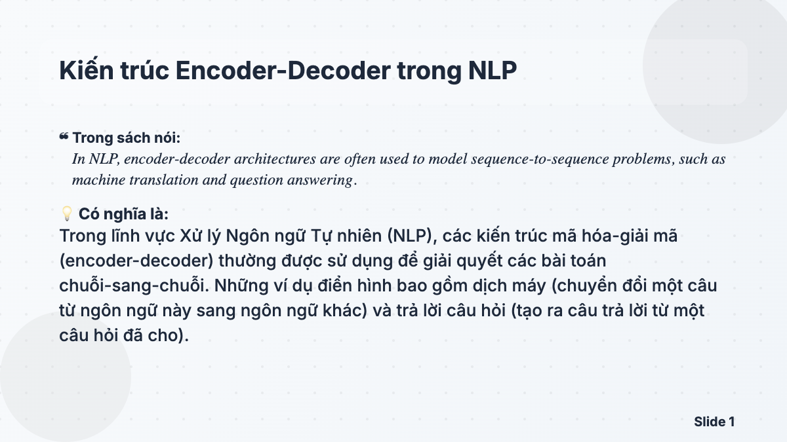</kbd>

 

- **Mở rộng ứng dụng mô hình Encoder-Decoder**

<kbd>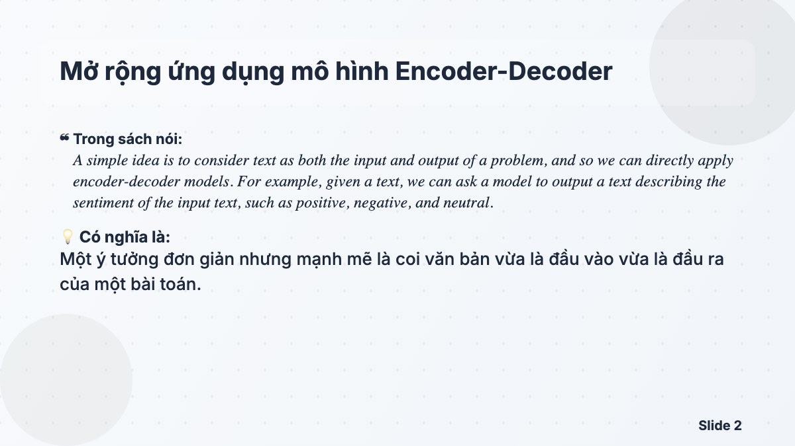</kbd>

<kbd>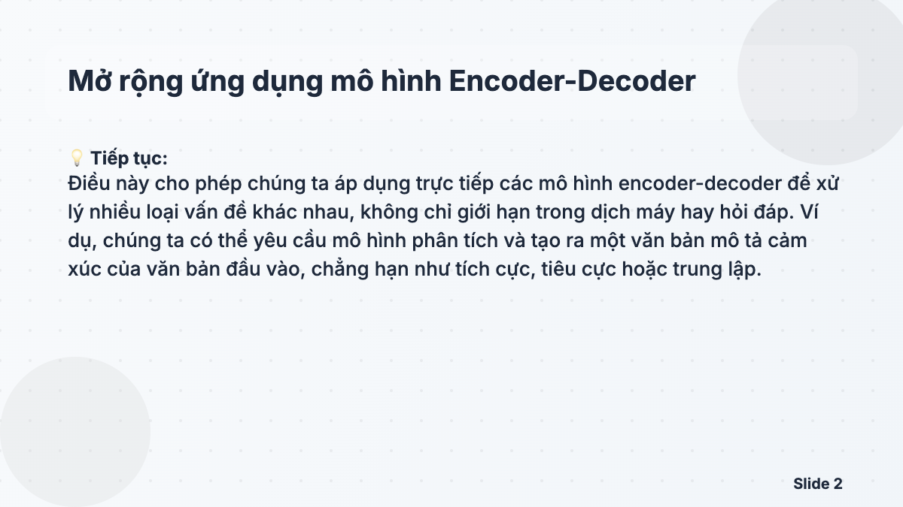</kbd>

 

- **Hệ thống văn bản-sang-văn bản đa năng**

<kbd>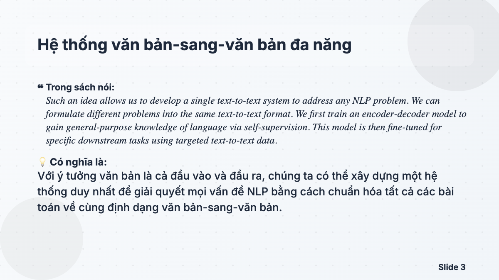</kbd>

<kbd>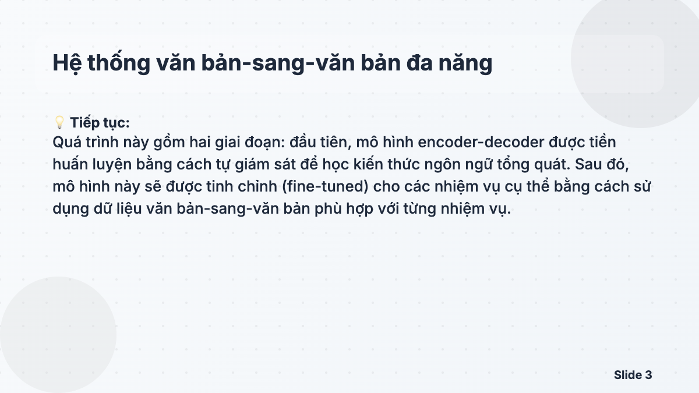</kbd>

 

- **Tiền huấn luyện Encoder-Decoder có Masking (T5)**

<kbd>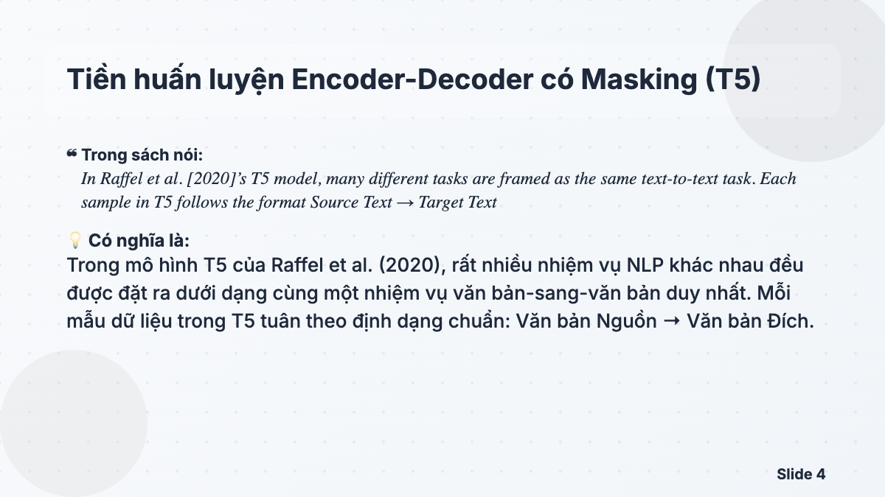</kbd>

<kbd>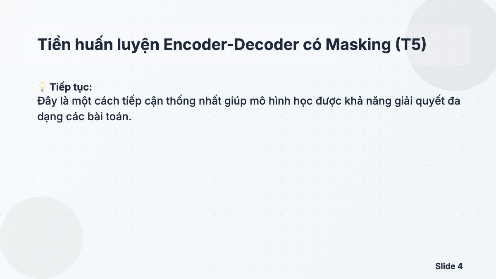</kbd>

<kbd>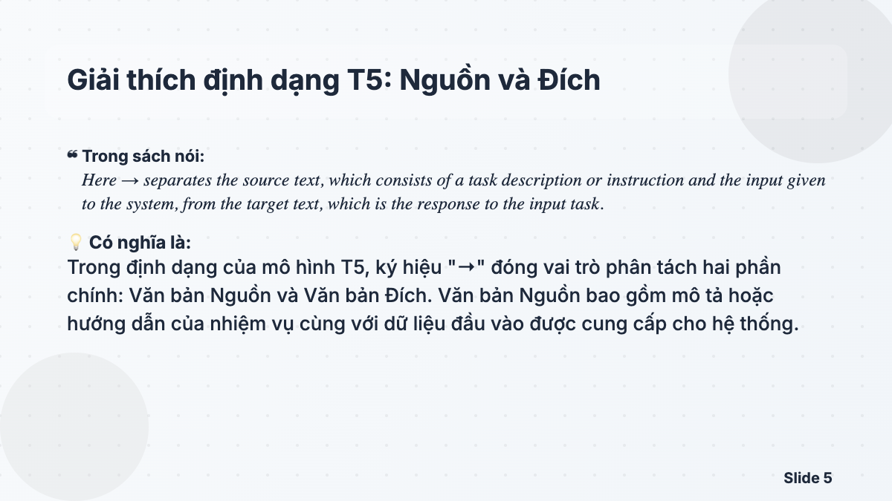</kbd>

<kbd>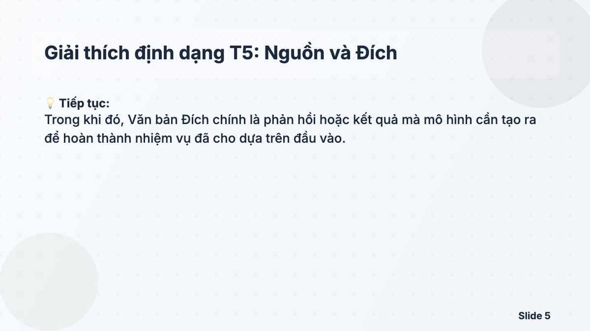</kbd>

<kbd>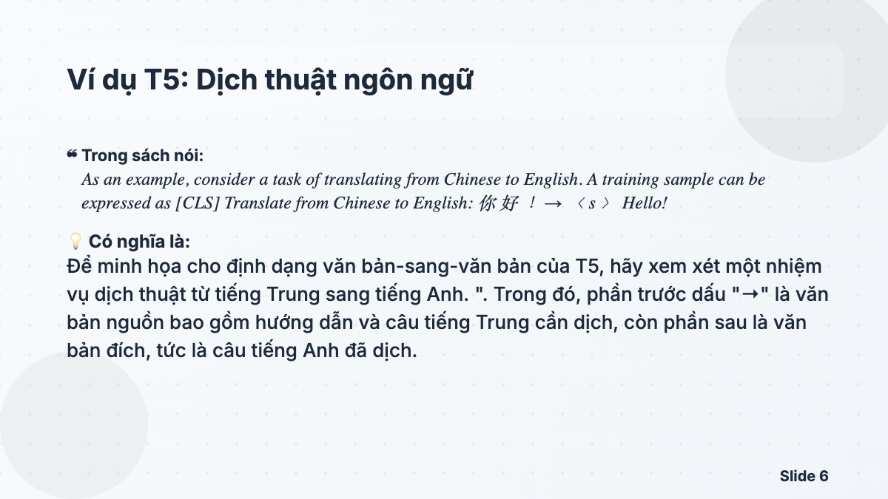</kbd>

<kbd>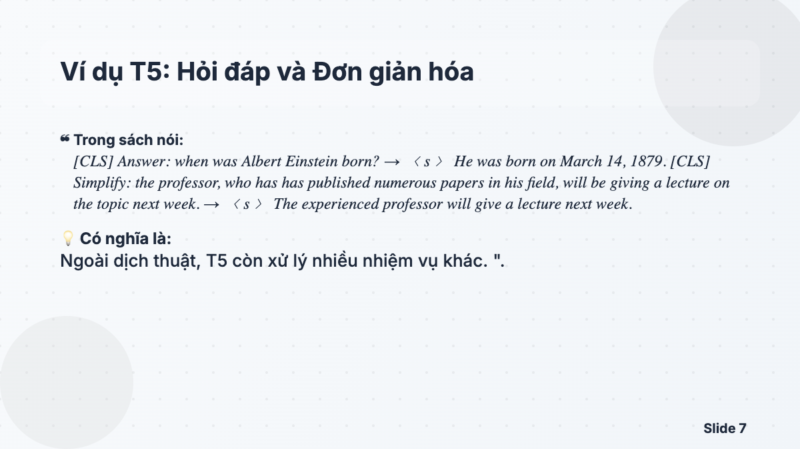</kbd>

<kbd>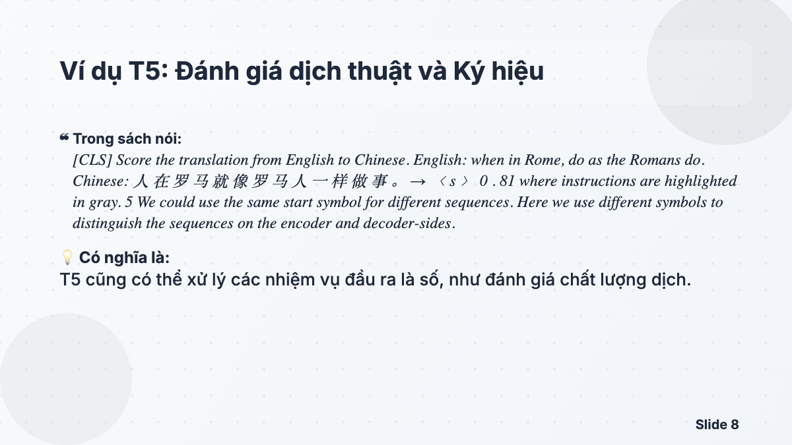</kbd>

<kbd>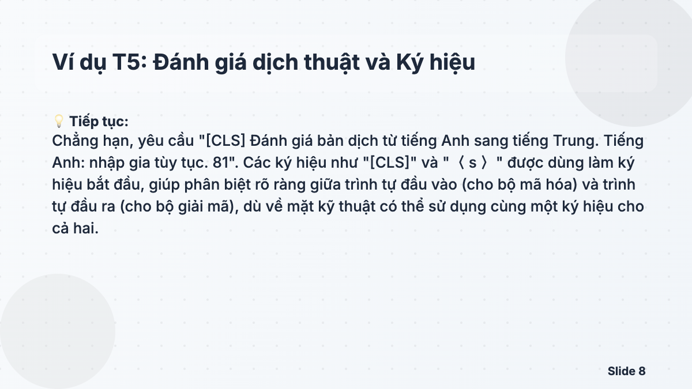</kbd>

 

- **Mô hình Encoder-Decoder đa ngôn ngữ**

<kbd>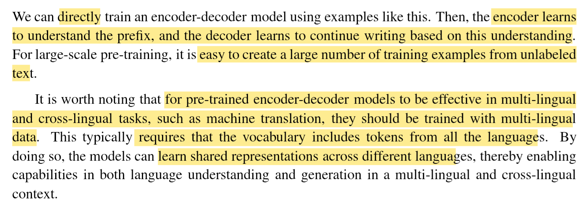</kbd>

> [!NOTE]
> Phần 1: Huấn luyện mô hình Encoder-Decoder. Mục tiêu: Huấn luyện mô hình Encoder-Decoder hiểu và tạo ra output dựa trên input. Cách huấn luyện: Sử dụng các ví dụ bao gồm một "prompt" (instruction/hướng dẫn), một chuỗi "input", một "token phân biệt", và một chuỗi "output". Lợi ích của phương pháp này: Encoder sẽ học cách hiểu "prefix" (tức là "prompt"). Khả năng Zero-shot learning: Mặc dù huấn luyện với một số lượng "prompt" (prefix/yêu cầu) nhất định, encoder vẫn có thể học cách hiểu được các "prefix" mới mà nó chưa từng gặp trong dữ liệu huấn luyện. Điều này giúp mô hình có khả năng "zero-shot learning". Ưu điểm khác: Setup này giúp dễ dàng tạo ra bộ dữ liệu huấn luyện lớn. Phần 2: Huấn luyện cho tác vụ đa ngôn ngữ (Multilingual Tasks). Khi nào cần: Khi muốn huấn luyện mô hình cho các tác vụ "multilingual" (đa ngôn ngữ), ví dụ như dịch thuật, nơi có nhiều ngôn ngữ liên quan. Cách làm: Nên huấn luyện mô hình với bộ dữ liệu "multilingual" (dữ liệu chứa nhiều ngôn ngữ).

> [!TIP]
> **🤖 AI Feedback** — ⚠️ Score: **88/100**
>
> Bạn đã nắm vững các ý chính về huấn luyện mô hình encoder-decoder và các yêu cầu cụ thể cho tác vụ đa ngôn ngữ. Các kiến thức bổ sung cho thấy sự hiểu biết sâu sắc.

 

