# Lecture 32: Quiz 3 Review

📊 **Progress:** `35` Notes | `38` Screenshots

---

 

<kbd>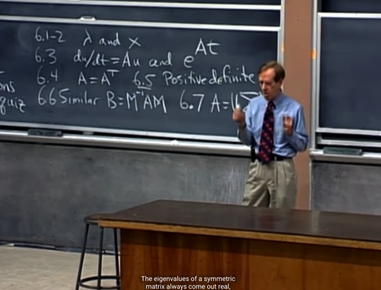</kbd>

> [!NOTE]
> gs nói qua một số thứ mà ta sẽ ôn lại trong bài này:
>
>
>
> i) với eigenvector và eigenvalues, gs nhắc lại rằng ta đã
> biết cách tìm chúng, thông qua việc solve characteristic
> equation A - λI = 0. Tuy nhiên cũng có khi ta dùng
> một số shortcut để tìm nhanh hơn. 
>
>
>
> ii) bài này ta cũng sẽ ôn lại việc áp dụng eigenvector
> và eigenvalue để giải phương trình vi phân
>
>
>
> iii) và ta sẽ làm việc với symmetric matrix, có tính chất
> là các eigenvalue đều real, và luôn có đủ các eigenvector
> độc lập, để rồi ta luôn có thể chọn các eigenvector orthogonal
> để rồi ta có S = Q, và A = SLambdaS⁻¹ = QLambdaQᵀ
>
>
>
> iv) Sau đó ta sẽ bàn về Positive definite (symmetric) matrix
>
>
>
> v) Và Similar matrices, ta có các similar matrices có cùng 
> eigenvalues
>
>
>
> vi) SVD

 

<kbd>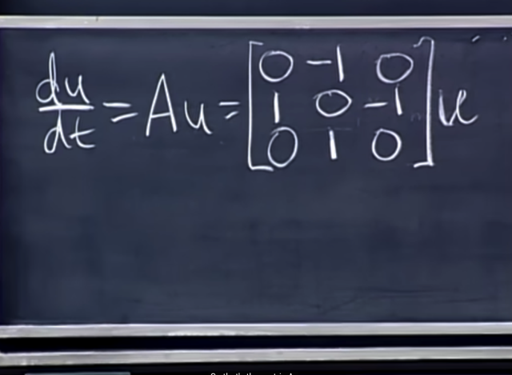</kbd>

> [!NOTE]
> đầu tiên ta sẽ giải differential
> equation này

 

<kbd>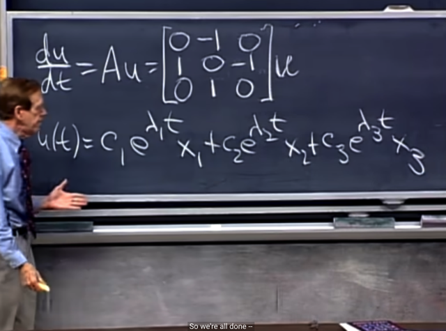</kbd>

> [!NOTE]
> thế thì gs đề nghị trước tiên hãy viết general solution của
> nó như này. Bài trước, gs đã cho thấy bước chứng minh tại
> sao đây là các special solution bằng cách thế nó, ví dụ
> special solution thứ nhất (e^λ1t)*x, vào equation,  và
> tính du/dt để cho ra kết quả là λ_1*x1 = Ax1, và điều
> này đúng vì x1 và λ_1 là eigenvector và eigenvalue
> tương ứng của A
>
>
>
> Như vậy thì ta cần tìm eigenvectors x1,..eigenvalues và dùng
> u(0) để tìm c1, c2...

 

<kbd>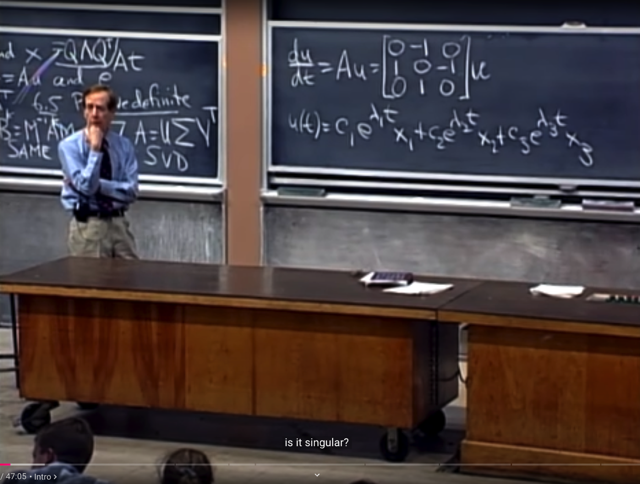</kbd>

<kbd>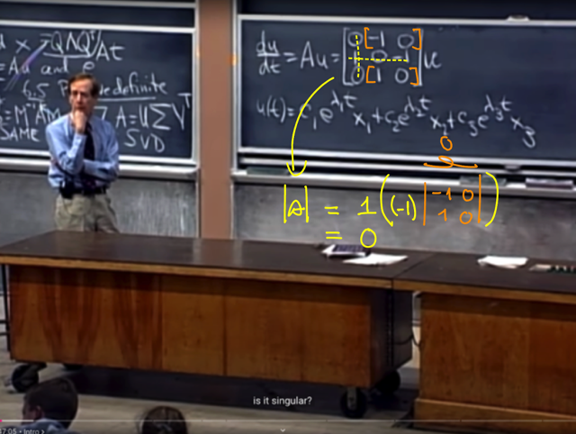</kbd>

> [!NOTE]
> gs: có thể thấy gì ở matrix này, nó có singular?
>
>
>
> me: có thể nhẩm thấy det của A theo cofactor
> formula là 0, nên A là SINGULAR matrix

 

<kbd>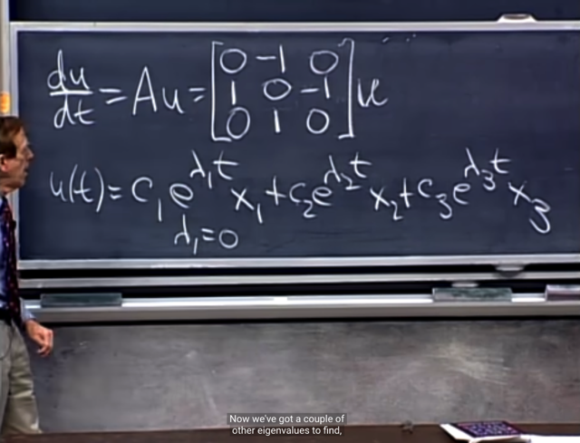</kbd>

> [!NOTE]
> gs: correct, ta có thể tính det hoặc nhìn thấy rằng row_3 =
> -1*row_1 để nhận định các rows và cả columns ko
> independent -> **Singular**
>
>
>
> Từ đó (ít nhất) một eigenvalue = 0. Đó là eigenvalue ứng
> với vector trong nullspace, vì sao matrix singular thì suy ra
> có eigenvalue = 0? Là bởi singular có nghĩa là tồn tại
> vector khác 0 BỊ MATRIX A hoặc Aᵀ BIẾN THÀNH 0: Ax =
> 0 hoặc Aᵀy = 0. và vì A square nên trong case này cả row
> lẫn column **ĐỀU KHÔNG INDEPENDENT**, nên tồn tại cả x
> trong Rn bị biến thành 0, đó là solution của Ax = 0 hay
> vector trong nullspace và tồn tại cả y trong Rn bị Aᵀ biến
> thành 0, nó là solution của Aᵀy = 0, hay vector trong left
> nullspace.
>
>
>
> Vậy các vector khác 0 trong nullspace đó chính là
> **eigenvector với eigenvalue = 0**
>
> Suy niệm một chút về vấn đề SINGULAR: Giả sử ta có matrix A 3x2, với 2
> INDEPENDENT COLUMNS.
>
>
>
> Ở đây thử suy niệm sâu hơn về việc **tại sao matrix này Singular**.
>
>
>
> Thế thì ta có **2 columns independent**, chúng là **hai vector trong R^3** (đơn giản vì
> matrix có 3 hàng), vậy thì chúng **span một 2D plane trong R^3**, và đây **chính là
> column space của matrix A**. Và nếu liên hệ định lý về **dimension của 4 foundational**
> subspace, thì ta nhớ **tổng dimension của columns space C(A) và the left nullspace,
> hay nullspace của Aᵀ sẽ bằng m, trong ví dụ này là 3**, tức là hai subspaceC(A) và
> N(Aᵀ) sẽ **hợp lại thành R^3**, và trong đó **C(A) orthogonal với N(Aᵀ)**
>
>
>
> Vậy **việc C(A) là một 2D plane**, cho ta chắc chắn rằng left nullspace không chỉ có
> zero, mà có một vector (độc lập), hay, nó **span một line trong R^3**, cụ thể hơn, nó
> c**hính là cái line vuông góc với C(A) plane tại zero**. Và zero là điểm duy nhất nằm
> trong cả C(A) và N(Aᵀ).
>
>
>
> Thế thì, **vector khác 0 trong left nullspace** là vector gì? Nó **chính là vector BỊ
> MATRIX Aᵀ SUY BIẾN THÀNH ZERO**: Nói cách khác, nó **chính là solution của Aᵀy =
> 0**. Và ta sẽ hiểu ra rằng, một vector trong R^3, là **không gian 3 chiều**, bị **suy biến
> thành một plane**
> \- là C(A), vì vì mọi vector trong N(Aᵀ) - thứ làm nên chiều không gian thứ 3 của R3 đã
> bị biến thành 0 qua Aᵀy = 0
>
>
>
> Nói qua các rows của matrix A, như đã nói, có 3 rows, 2 columns, nên **3 rows** là **3
> vectors trong R^2**. Thế mà **chỉ có 2 pivot** (**2 independent columns** nói trên) nên
> cũng sẽ chỉ **có 2 independent rows** (quá trình elimination sẽ chỉ ra rows nào là
> independent, và biến cái dependent rows thành zero). Thế thì, chính vì **có một row
> dependent**, đồng nghĩa với việc **có thể tìm ra một bộ coefficient để tạo linear
> combination giữa hai independent rows** cho ra cái dependent rows, và bằng việc
> chuyển vế, ta cũng **sẽ có một bộ 3 coefficients các rows để cho ra 0**. Và đây **chính
> là một vector trong R^3 bị matrix Aᵀ biến thành zero**, hay nói cách  khác, nó **chính là
> một vector khác 0 của the left nullspace nói trên**.
>
>
>
> Vậy thì, ở đây ta có liên hệ thứ nhất: **Chính cái row bị thừa** (dependent row) đã **tạo
> nên một linear combination giữa 3 rows cho ra 0**, từ đó **tạo nên một non-zero vector
> trong R^3 bị map thành 0**. Dẫn đến c**ác vector khác 0 trong left nullspace - subspace
> của R3 đều bị map thành 0**: Aᵀy = 0, **chỉ còn lại các vector trong column space là
> được map với vector khác 0 trong rowspace.**
>
>
>
> Như vậy, thông qua Aᵀ:
>
>
>
> Input y **trong R^3**, qua Aᵀ, output Aᵀy **chỉ còn trong 2D plane** (rowspace) là sự suy
> biến **mất đi một chiều không gian**
>
>
>
> Bàn thêm về rows, vì ta **có 2 independent rows**, là 2 vector trong R^2, nên chúng đã
> **đủ span toàn bộ R^2**, dẫn đến **KHÔNG CÓ CHIỀU KHÔNG GIAN NÀO CỦA R2 BỊ
> SUY BIẾN THÀNH 0 CẢ** ĐỂ RỒI **vector x nào trong R^2** cũng đều được matrix A
> **map nó với Ax khác 0 thuộc 2D plane column space**.
>
>
>
> Input x trong **R^2** qua A, output Ax **vẫn trong một 2D plane** của R3, không có sự suy biến
> chiều không gian.
>
>
>
> Sự suy biến đó là ý nghĩa của cái tên Singular

 

<kbd>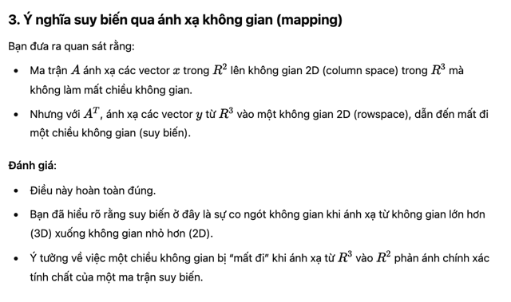</kbd>

 

<kbd>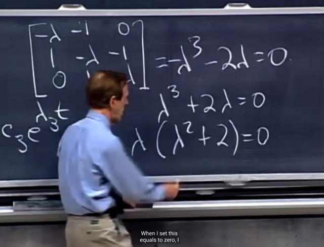</kbd>

> [!NOTE]
> gs giải characteristic cho thấy một eigenvalue bằng 0,
> và hai eigenvalue còn lại có giá trị complex là (+/-√2)*i

 

<kbd>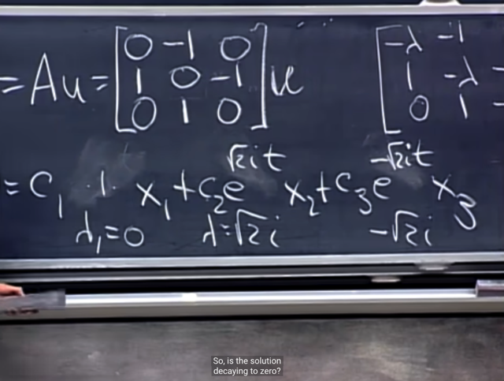</kbd>

> [!NOTE]
> Từ đó thế eigenvalues vào ta có general solution. Câu hỏi
> là ta đánh gía trường hợp này là thuộc case nào trong 3
> trạng thái:
>
>
>
> \- Stability (nhỏ dần về 0)
>
>
>
> \- Steady (tiến về giá trị ổn định)
>
>
>
> \- Blow-up (ngày càng lớn)
>
>
>
> Vậy thì rõ ràng vì ta có một eigenvalue bằng 0, nên một
> term trong general solution là c1*e^0t*x1 = c1x1, đương
> nhiên không đổi, vậy u(t) không thể nhỏ về 0 để có trạng
> thái Stability được.
>
>
>
> Ta có hai term kia là c2*e^√2it*x2 và c3*e^-√2it*x3.
>
>
>
> thì ko hiểu lắm nhưng đại khái là nó là e^[số ảo] nên gs
> nói rằng nó sẽ biến động theo chu kì thành hình vòng tròn
> hoặc xoắn ốc gì đó. Nói chung là hệ này sẽ không Stability
> hoặc Blow up

 

###### Normal Matrices and Orthogonal Eigenvectors

<kbd>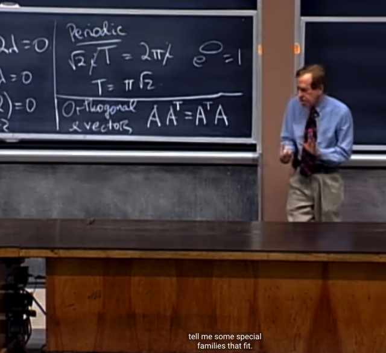</kbd>

> [!NOTE]
> Sau đó, câu hỏi là chu kì bao nhiêu thì nó quay về giá trị ban
> đầu. Thì ta có thể giải ra là pi√2 từ việc cho √2iT = 2pi*i
>
>
>
> Bởi vì e^2pi*i  = cos(2pi) + sin(2pi)*i = 1 + 0*i = 1 nên muốn
> quay về ban đầy thì chu kì T phải bằng giá trị sao cho √2iT
> bằng 2pi.
>
>
>
> Xong gs cho biết rằng nếu matrix A thỏa tính chất AAᵀ = AᵀA
> thì A là orthogonal eigenvectors.

 

<kbd>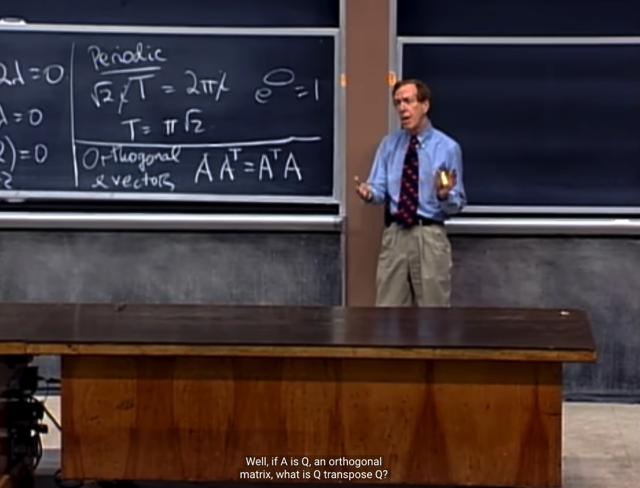</kbd>

> [!NOTE]
> và ta có thể check tại sao symmetric matrix có orthogonal
> eigenvectors. Là bởi nếu A = Aᵀ thì đương nhiên AAᵀ = A^2,
> và cũng bằng AᵀA
>
>
>
> Rồi gs đề nghị kiểm tra anti-symmetric matrix (là matrix mà
> Aᵀ = -A. Thì thấy nó cũng thỏa AAᵀ = AᵀA, nên với matrix
> này thì nó cũng có orthogonal eigenvectors.
>
>
>
> Cuối cùng là với orthogonal matrix Q. Ta nhớ nó có các cols
> perpendicular, và Q⁻¹ = Qᵀ. Và dễ thấy QᵀQ = I và cũng
> bằng QQᵀ. Thành ra orthogonal matrix cũng có eigenvector
> vuông góc

 

<kbd>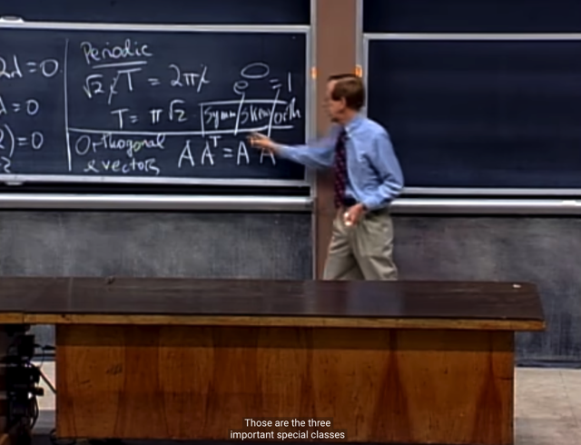</kbd>

> [!NOTE]
> và đó là 3 family of matrix đặc
> biệt thỏa tính chất này

 

<kbd>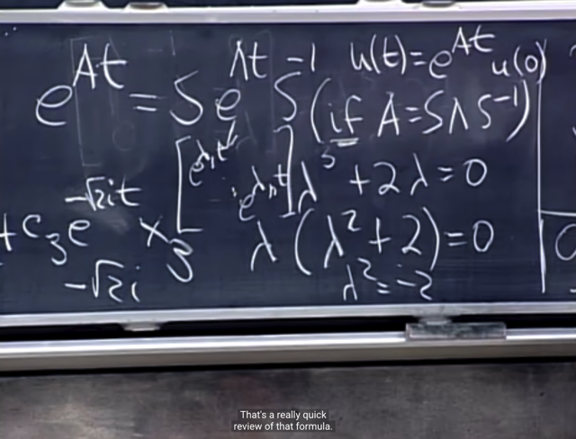</kbd>

<kbd></kbd>

> [!NOTE]
> tiếp, hỏi e^At là gì. Trong bài giảng bữa trước, ta đã biết rằng
> nếu A có đủ n eigenvectors độc lập, thì A có thể phân tách
> thành SΛS⁻¹, và từ đó e^At = S*e^Λt*S⁻¹
>
>
>
> Trong bài giảng đó, gs chứng minh nếu thể hiện ở dạng
> matrix, **e^At là solution của du/dt = Au**.
>
>
>
> Nói lại cho rõ thế này, đối diện với diff equation du/dt = Au thì
> ta có general solution tạo bởi các special solution là
>
>
>
> Tổng i c_i*(e^λ_i*t)*x_i
>
>
>
> Lí do u = c_i*e^λ_it*x_i là special solution là ta có thể
> thế vào để kiểm tra xem xem note sát bên. Và thể hiện ở dạng
> matrix thì solution của du/dt = Au là e^At. cái này đã chứng minh
> ở trong bài giảng (theo link để xem lại)
>
>
>
> Ta có thể ôn lại:
>
>
>
> Để chứng e^At là solution của du/dt = Au. Ta chỉ cần chứng minh
> d[e^At]/dt = Au. Thế thì để làm việc này, ta sẽ triển khai f = e^At
> theo Taylor series:
>
>
>
> f(x) = f(a)/0!(x-a)^0 + f'(a)*(x-a)^1/1! + f''(a)*(x-a)^2/2! + ...
>
>
>
> tổng qúat là: Tổng n: [gía trị đạo hàm cấp n của f tại a]*[(x-a)^n]/[n!]
>
>
>
> Với a = 0, thì ta có: Tổng n: [gía trị đạo hàm cấp n của f tại 0]*[x^n]/[n!] 
>
>
>
> Thế thì nếu f(x) là e^x: thì đạo hàm cấp 1 (đv x) là e^x, đạo hàm cấp
> 2 cũng là e^x,....
>
>
>
> Ta có Tổng n: [giá trị e^x tại 0]*[x^n]/[n!] = [1]*[x^n]/[n!] = [x^n]/[n!]Vậy **e^x = Tổng n [x^n]/[n!]**
>
>
>
> Rồi, ta sẽ áp dụng khi u = e^At: e^At = **Tổng n: [(At)^n]/n!**
>
>
>
> Để rồi du/dt = **d[e^At]/dt** = d{Tổng n: [(At)^n]/n!}/dt = Tổng n: d{[(At)^n]/n!}/dt
>
>
>
> = (1/n!) * Tổng n: d[(At)^n]/dt. 
>
>
>
> Xét riêng d[(At)^n]/dt:
>
>
>
> = d[(At)^n]/d(At) * d(At)/dt = n*(At)^(n-1) * A
>
>
>
> Lắp vào: du/dt = d[e^At]/dt = (1/n!) * Tổng n: n*(At)^(n-1) * A
>
>
>
> Chuyển A ra ngoài dấu tổng vì là constant không dính gì n
>
>
>
> = A * /[ (1/n!) Tổng n: n*(At)^(n-1) ]/ và phần in nghiên chính là u
>
>
>
> Như vậy với u = e^At tính du/dt cho ra Au chứng tỏ nó chính là solution
> của du/dt = Au
>
> Và ta có thể tiếp tục: vì A = SΛS⁻¹, nên: 
>
>
>
> thay vào A trong e^At = Tổng n: [(At)^n]/n!
>
>
>
> ta có:
>
>
>
> Tổng n: [(SΛS⁻¹*t)^n]/n!. 
>
>
>
> Trong đó **(SΛS⁻¹*t)^n = S*(Λ^n)*S⁻¹*(t^n)**
>
>
>
> Ví dụ (SΛS⁻¹*t)^2 = SΛ/S⁻¹*tS/ΛS⁻¹*t = S(Λ^2)S⁻¹(t^2)
>
>
>
> Vậy e^At = **Tổng n: [S*(Λ^n)*S⁻¹*(t^n)]/n!**
>
>
>
> **Bỏ S ra khỏi tổng:**
>
>
>
> S * { Tổng n: [(Λ^n)*S⁻¹*(t^n)]/n! }
>
>
>
> **Bỏ S⁻¹ ra khỏi tổng:**
>
>
>
> S * {  Tổng n: [(Λ^n)*(t^n)]/n! } * S⁻¹ =
>
>
>
> S * {  Tổng n: (Λt)^n)/n! } * S⁻¹
>
>
>
> Thì ở giữa chính là e^Λt. Do đó **e^At = S*(e^Λt)S⁻¹
>
>
>
> Và đây chính là dạng thể hiện matrix của general
> solution hồi nãy: Tổng i c_i*(e^λ_i*t)*x_i
>
>
>
> với c_i xác định bởi u_0: u_0 = Sc**

 

<kbd>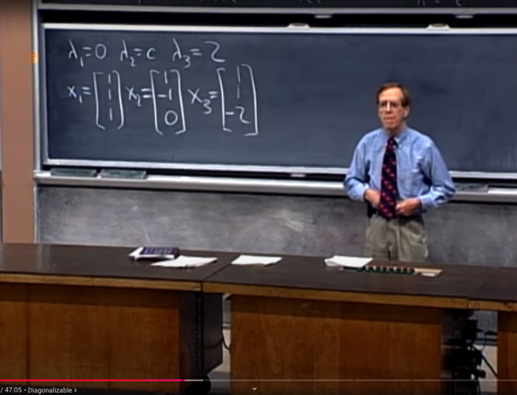</kbd>

> [!NOTE]
> Qua câu hỏi tiếp theo: Cho matrix, với 3 eigenvalues
> và eigenvectors như thế này.
>
>
>
> Câu hỏi là: Matrix có diagonalizable không?
>
>
>
> Me: Ta đã biết matrix sẽ diagonalizable nếu nó có đủ n
> (ở đây là 3) independent eigenvectors. Và ta sẽ kết luận
> ngay điều kiện này thỏa nếu 3 eigenvalues khác nhau.
> Còn nếu có repeat eigenvalues thì phải kiểm tra cụ thể
> eigenvectors.
>
>
>
> Thế thì vì ở đây cho sẵn 3 eigenvectors, thì ta chỉ việc 
> xem chúng có INDEPENDENT không, điều này đồng 
> nghĩa ta xem matrix S (các columns là các x1, x2, x3) có
> non-singular / full rank hay không. Vậy để làm điều này
> i) ta có thể elimination và xem nó có 3 pivots columns
> không, hoặc ii) ta có thể tính determinant xem có ra bằng
> khác hay không.

 

<kbd>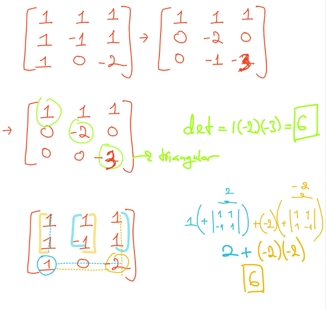</kbd>

> [!NOTE]
> dùng elimination cho thấy S full rank, với 3 pivot. Ta cũng có
> thể tính det của S theo cofactor, cho ra 6 (cũng bằng với det
> của U, vốn là triangular matrix nên det là tích các eigenvalue
> nằm trên đường chéo))
>
>
>
> Vậy matrix có thể diagonalizable.

 

<kbd>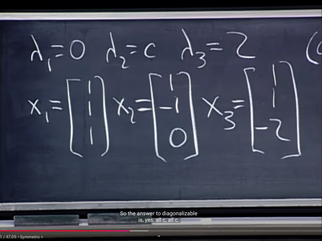</kbd>

> [!NOTE]
> gs: đúng vậy, chỉ cần xem ba eigenvectors có independent
> không. Và có thể để ý thấy chúng orthogonal LẪN NHAU
> do đó đ**ương nhiên chúng independent -> matrix có thể
> diagonalizable , ko phụ thuộc c**

 

<kbd>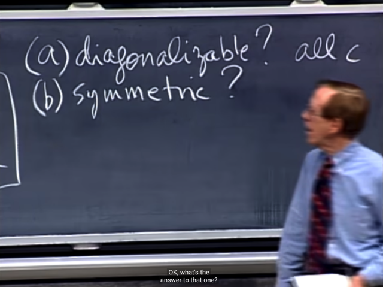</kbd>

> [!NOTE]
> tiếp, c như thế nào thì matrix symmetric. 
>
>
>
> me: Ta đã biết, với symmetric matrix, thì eigenvalue
> đều là số thực (cụ thể hơn là với matrix mang giá trị
> thực và symmetric, thì nó sẽ có các eigenvector vuông
> góc và các eigenvalue mang giá trị thực).
>
>
>
> Vậy thử trả lời: c mang giá trị thực thì A symmetric

 

<kbd>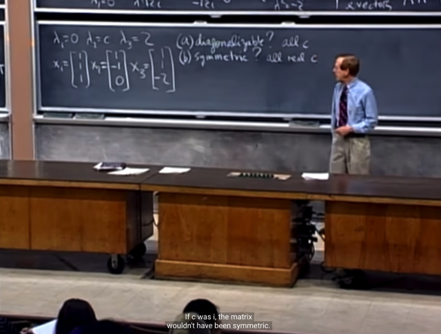</kbd>

> [!NOTE]
> gs: correct. Nếu mọi eigenvalues real, và các
> eigenvectors perpendicular thì matrix symmetric

 

<kbd>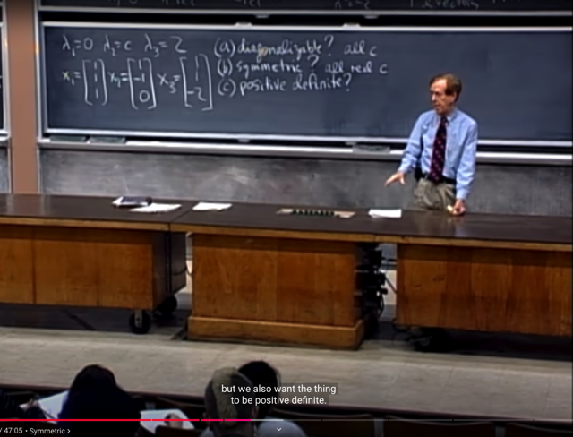</kbd>

> [!NOTE]
> Tiếp, với symmetric thì khi nào nó positive definite?
>
>
>
> me: ta đã biết yêu cầu để matrix positive definite đó là 1)
> mọi eigenvalue đều dương 2) mọi pivot đều dương 3) mọi
> subdet đều dương và 4 quadratic form không âm và chỉ
> bằng 0 khi x = 0.
>
>
>
> Vậy ta sẽ yêu cầu c dương. Tuy nhiên vì λ1 đã
> bằng 0 rồi, nên matrix không thể POSITIVE DEFINITE,
> mà chỉ có thể SEMI POSITIVE DEFINITE **khi c không âm
> thôi**

 

<kbd>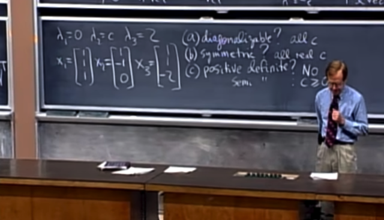</kbd>

> [!NOTE]
> gs: correct

 

<kbd>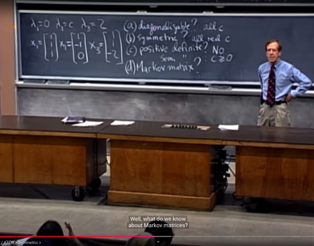</kbd>

> [!NOTE]
> Câu d: c như thế nào thì A là Markov matrix.
>
>
>
> me: Ta đã biết Markov matrix là matrix có tổng row
> hoặc column bằng 1, và mọi giá trị đều không âm, và
> bé hơn 1. Thế thì giả sử các rows có tổng bằng 1 tức
> là row1 + row2 + .. = [1 1 ..]
>
>
>
> Thì điều này cũng có nghĩa là Aᵀ[1 1 ..] = [1 1 ...] và
> như vậy [1 1 ...] là eigenvector của Aᵀ với eigenvalue =
> 1.
>
>
>
> Thế thì vì A và Aᵀ share chung eigenvalue nên như vậy
> 1 cũng phải là eigenvalue của A, nên c phải bằng 1.
> Nhưng khi c = 1 thì eigenvector tương ứng của nó phải
> là [1 1 ....] nên điều này mâu thuẫn với giá trị hiện tại
> là x2 = [1 -1 0].
>
>
>
> Kết luận A không thể là  Markov matrix

 

<kbd>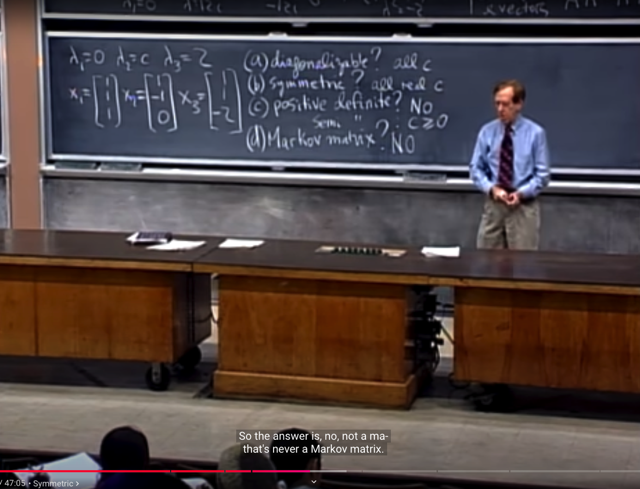</kbd>

> [!NOTE]
> gs gần đúng, vì để là Markov matrix, cần phải có một
> eigenvalue = 1, và các eigenvalue khác nhỏ hơn 1.
> mà điều này dĩ nhiên ko thỏa

 

###### Matrix Properties from Eigenvalues

<kbd>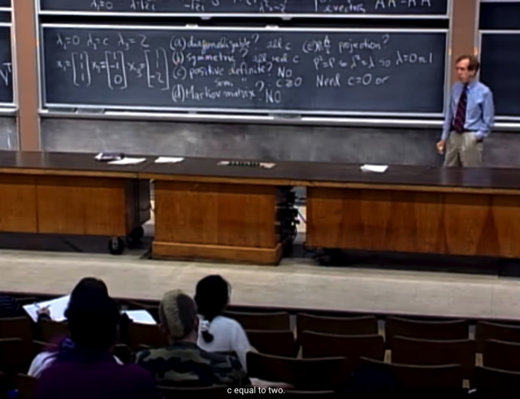</kbd>

> [!NOTE]
> Câu hỏi tiếp theo là khi nào thì A/2 là projection matrix.
>
>
>
> Lập luận thế này nếu P là projection matrix thì P^2 = P.
> Mà theo tính chất của eigenvalue thì nếu λ là eigenvalue
> của P thì ta có Px = λx ⇔ PPx  = P*λx = λPx
> = λλx = λ^2*x
>
>
>
> Vậy P^2 = P ⇔ λ^2*x = λx
>
>
>
> ⇔λ^2 = λ
>
>
>
> Vậy suy ra eigenvalue của P chỉ có thể là 1 hoặc 0 (vì giá trị).
>
>
>
> Vậy matrix A/2 phải có eigenvalue là 1 hoặc 0. Rồi mà matrix A/2 sẽ
> có eigenvalue là 1/2 * eigenvalue của A (dễ hiểu điều này vì nếu Ax
> = λx thì tương đương Ax/2 = λ/2*x -> hai matrix cùng
> eigenvector nhưng eigenvalue bằng 1 nửa của nhau)
>
>
>
> Vậy c phải bằng 0 hoặc 2 để A/2 có eigenvalue = 0 hoặc 1

 

###### Singular Value Decomposition Definition

<kbd>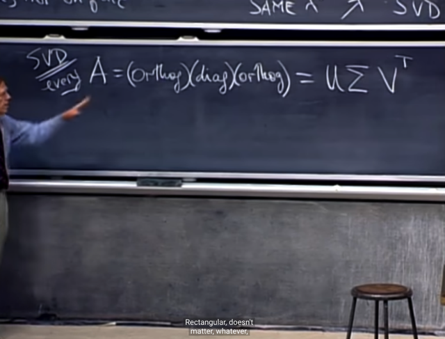</kbd>

> [!NOTE]
> gs nhắc lại, về SVD, **mọi** matrix đều có thể factorized thành tích
> của: 
>
>
>
> [orthogonal matrix U]*[diagonal matrix SIGMA]*[diagonal matrix Vᵀ]
>
>
>
> (V⁻¹, nhưng orthogonal matrix thì nó chính là tranpose)

 

<kbd>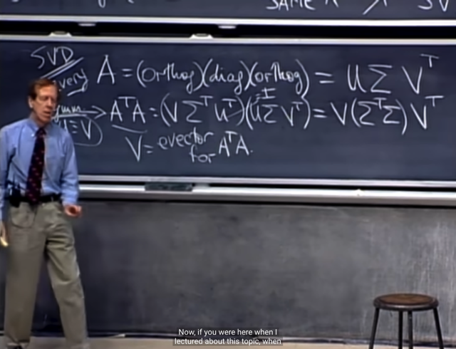</kbd>

> [!NOTE]
> Xong như trong lecture bữa trước ta đã thấy, ta sẽ cần tìm lần lượt
> U và V. Thành ra ta sẽ tính AᵀA, để cho thấy V của SVD đối với A,
> ĐÓNG VAI TRÒ CHÍNH LÀ CẢ U VÀ V TRONG PHÉP SVD ĐỐI
> VỚI AᵀA.
>
>
>
> Bởi lẽ ta đã biết ĐỐI VỚI **SYMMETRIC MATRIX**,
> **DIAGONALIZATION** CHÍNH LÀ **SVD**
>
>
>
> **Nên khi ta có AᵀA = V(ΣTΣ)Vᵀ** thì nó cũng **VỪA LÀ SVD CỦA
> AᵀA CŨNG VỪA LÀ DIAGONALIZATION CỦA AᵀA**:
>
>
>
> Ta biết khi diagonalization AᵀA = QΛQᵀ THÌ **Q** là
> **ORTHOGONAL EIGENVECTORS Q CỦA AᵀA** (với Q⁻¹ = Qᵀ)
> và **Λ là DIAGONAL EIGENVALUES MATRIX CỦA AᵀA**
>
>
>
> Vậy nên V CHÍNH LÀ Q, ΣTΣ CHÍNH LÀ Λ
>
>
>
> Tại sao V lại đóng vai trò của cả left singular matrix (U) và right
> singular matrix (V) trong phép SVD đối với AᵀA?
>
>
>
> Vì ta nhớ với SVD matrix A shape (m, n): A = UΣVᵀ:
>
>
>
> thì **U chính là orthogonal basis của Rm** (bao gồm columns
> space và left nullspace của A) và V chính là orthogonal basis của
> Rn (gồm rowspace và nullspace của A).
>
>
>
> Thế thì nếu A là symmetric, ta biết A = Aᵀ thì đương nhiên
> **columns space chính là rowspace**. Nên **U chính là V**.
>
>
>
> Điều này biện minh cho việc tại sao V đóng vai trò của cả V và U
> khi SVD matrix AᵀA.

 

<kbd>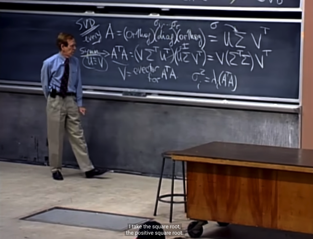</kbd>

> [!NOTE]
> và ta có thể có Σ bằng cách tìm square root của
> eigenvalues của AᵀA

 

<kbd>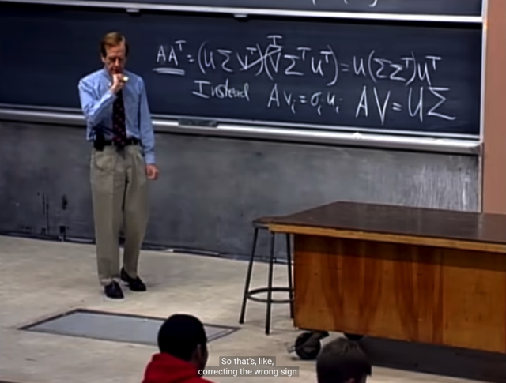</kbd>

> [!NOTE]
> tới đây là khúc đã xem qua, khi gs giải thích lại rằng nếu
> ta tìm U bằng cách tiếp cận tương tự đó là thông qua
> dùng eigenvectors của AAᵀ thì ta có thể không đúng về
> dấu. Có nghĩa là ta phải tìm U từ AV = USIGMA, để có
> dấu phù hợp. Chứ nếu tìm U riêng thì ta vẫn tìm ra đúng
> vector U nhưng sai dấu. Bởi lẽ một eigenvector chỉ nói
> về phương, còn chiều nào cũng là eigenvector thôi,

**🔗 See also:** [linked note](./lecture_29_singular_value_decomposition.md#node-zxzonui)

 

<kbd>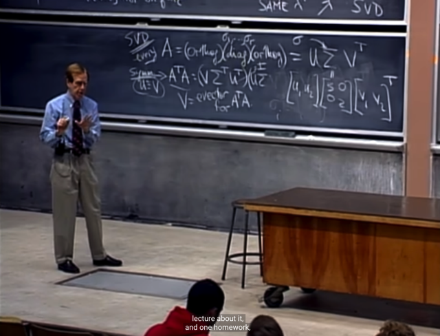</kbd>

> [!NOTE]
> gs cho ví dụ, câu hỏi là giả sử có matrix A được factorized
> thành UΣVᵀ với U có 2 columns u1, u2. Vᵀ (như đã biết,
> cũng là V⁻¹) có hai column v1, v2 và Σ là diagonal matrix
> với đường chéo là 3, 2
>
>
>
> Gs nói rằng ta có thể nhìn vào hai SINGULAR VALUE
> (matrix Sigma) để thấy rằng matrix A NON-SINGULAR.
>
>
>
> Thử giải thích vì sao:
>
>
>
> Ta biết gốc rể của SVD: A = UΣV⁻¹ chính là từ AV = UΣ:
> Và equation này thể hiện ý nghĩa của phép SVD đó là tìm ra
> hai bộ ORTHOGONAL BASIS: của input space Rn (V) và
> output space Rm (U) để map chúng thông qua A. Hay nói
> cách khác, ta muốn tìm hai bộ orthogonal basis sao cho Av1
> = σ1u1, Av2 = σ2u2...
>
>
>
> Thế thì, từ sự thật là gs cho biết các singular value khác 0.
> cho thấy các basis vector của Rn, vốn sẽ bao gồm basis
> vector của rowspace và nullspace đều được map với basis
> của Rn mà đều khác 0:
>
>
>
> tức là 3*u1 và 2u2
>
>
>
> Vậy suy ra nullspace của A = {0} -> A non-singular

 

<kbd>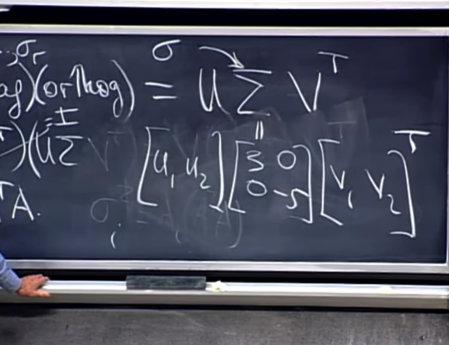</kbd>

> [!NOTE]
> gs nói nếu mà là -5 thì sẽ là sai,
> vì Singular Value Decomposition
> không thể value âm

 

<kbd>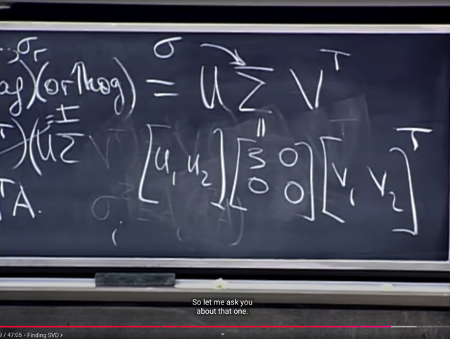</kbd>

> [!NOTE]
> Nếu là 0 thì sao?
>
>
>
> Thì khi đó ta có một vector basis của Rn bị biến thành 0,
> vector đó chính là basis của nullspace. Và matrix A rank
> 1, singular
>
>
>
> Rank? -> 1
>
>
>
> dim N(A)? -> 1
>
>
>
> vector trong N(A)? -> v2, vì v2 bị map thành 0

 

<kbd>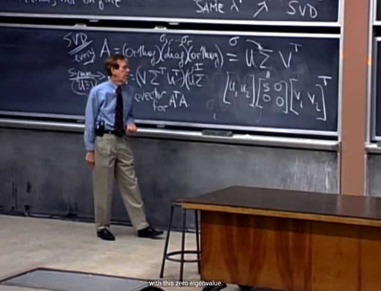</kbd>

> [!NOTE]
> gs: correct, chính là v2, vì Av1 = 3u1 và Av2 = 0*v2, v2
> chính là trong nullspace

 

###### Eigenvalues of Symmetric Orthogonal Matrices

<kbd>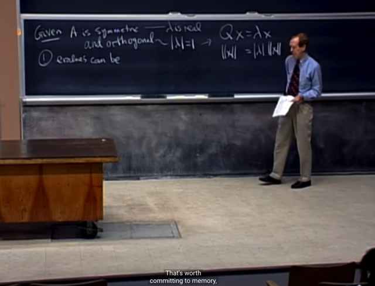</kbd>

> [!NOTE]
> ở đây ta biết thêm nếu A orthogonal thì
> eigevenvalue sẽ có magnitude = 1 (trị tuyệt đối)
>
>
>
> Chứng minh: Gọi Q là orthogonal matrix, và x
> là eigenvector ứng với eigenvalue λ:
>
>
>
> Qx = λx
>
>
>
> Thế thì ta có thể tính length của hai vector, ý là
> từ equation này, suy ra length của Qx (đương
> nhiên cũng là vector trong C(Q) cũng bằng length
> của λx
>
>
>
> Vế trái: length của Qx là (Qx)ᵀ(Qx) = xᵀQᵀQx. Và
> vì Q orthogonal nên QᵀQ = I. Vậy ta có xᵀx = length x
>
>
>
> Vế phải đương nhiên là λlength x
>
>
>
> Vậy để có equation, λ phải bằng 1
>
>
>
> Vậy nếu A là SYMMETRIC ORTHOGONAL MATRIX
> THÌ eigenvalue của A là số thực có trị tuyệt đối bằng 1
> vậy thì nó chỉ có thể là 1 hoặc -1

 

<kbd></kbd>

> [!NOTE]
> True or False? A là positive definite matrix?
>
>
>
> -> Rõ ràng là không vì eigenvalue của nó có thể là -1 < 0 mà
> muốn là Positive definite thì mọi eigenvalue phải dương
>
>
>
> Gs: A có diagonalizable không?
>
>
>
> -> Có, gs nói rằng mọi orthogonal matrices và mọi symmetric
> matrix đều diagonalizable và thậm chí như gs đã nói hồi nãy
> ở đầu lecture, matrix nào có tính chất AAᵀ = AᵀA thì đều có
> các eigenvector orthogonal, tức là không những ta có thể
> diagonalize dưới dạng SΛS⁻¹ mà S còn là
> orthogonal matrix để ta có A = QΛQᵀ
>
>
>
> Có thể sẽ xem gs chứng minh trong sách.

 

<kbd></kbd>

> [!NOTE]
> Tiế.p, nó có non-singular không?
>
>
>
> Thử trả lời: Vì λ khác 0, nên không có vector khác 0
> trong nullspace (vì nếu có thì phải có eigenvalues bằng 0)
> Đương nhiên matrix vuông (symmetric mà, dù sao khi nói
> eigenvector thì dĩ nhiên phải xét square matrix), có nullspace
> chỉ có {0} thì nó nonsingular.
>
>
>
> Gs: correct

 

<kbd>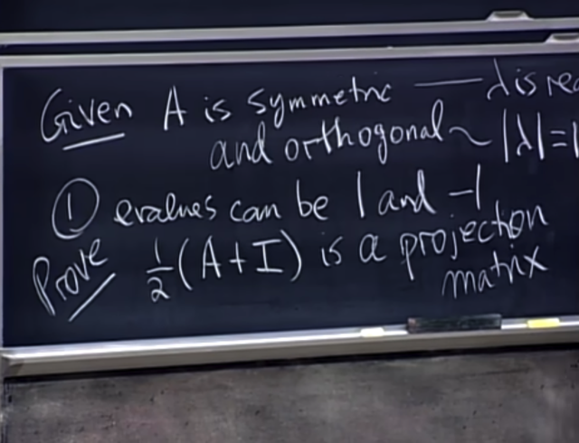</kbd>

> [!NOTE]
> câu tiếp theo là chưng minh 0.
> 5(A+I) là projection matrix.

 

###### Constructing a Projection Matrix

<kbd>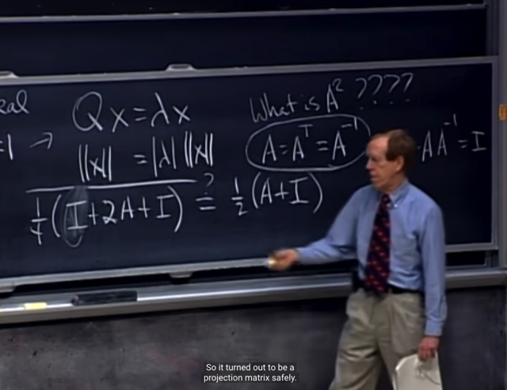</kbd>

> [!NOTE]
> Thì gs cho rằng có thể dùng 2 cách tiếp cận:
>
>
>
> Một cách là ta dùng properties của Projection matrix**. P^2 =
> P** và **P là symmetric P = Pᵀ**
>
>
>
> Vậy ta chứng minh P^2 = 1/4(A^2 + 2A + I) = 1/2(A+I)
>
>
>
> Và dễ thấy vì A symmetric và orthogonal nên A = Aᵀ = A⁻¹
> Nên A^2 = AA=AA⁻¹ = I. Thế vô chứng minh được P^2 = P
>
>
>
> Còn viêc P symmetric quá rõ do A symmetric
>
>
>
> =====
>
>
>
> Thử chứng minh ý 2: **Projection matrix là symmetric,** là thứ
> mà gs chưa từng nói:
>
>
>
> Giả sử P là projection matrix lên subspace S là column
> space của A
>
>
>
> Ta có b = p + e = Pb + e ⇒ e = b = Pb
>
>
>
> residual vuông góc với S nên đương nhiên vuông góc với
> p:
>
>
>
> eᵀp = 0 ⇔ (b - Pb)ᵀ(Pb) = 0 ⇔ [bᵀ - (Pb)ᵀ](Pb) = 0
>
>
>
> ⇔ bᵀPb - bᵀPᵀPb = 0 ⇔ bᵀPb = bᵀPᵀPb
>
>
>
> ⇔ P = PᵀP
>
>
>
> Và vì projection matrix có P^2 = P nên P^2 = PᵀP ⇔ PP =
> PᵀP suy ra P = Pᵀ

**🔗 See also:** [First-Order Feasible Step Derivation *(Numerical Optimization_J.Nocedal)*](../numerical_optimization_jnocedal/121_examples.md#node-98w7rek)

 

###### Symmetric Orthogonal Matrices and Projections

<kbd>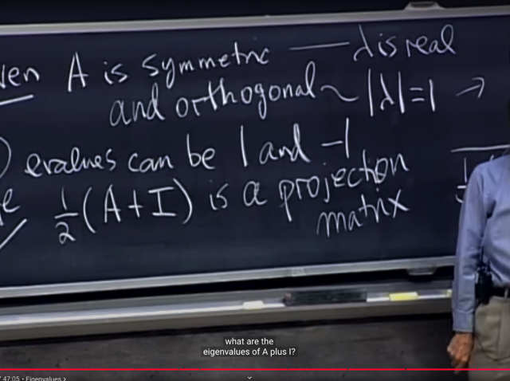</kbd>

> [!NOTE]
> Gs gợi ý cách thứ 2 là: eigenvalue của nó là gì?
>
>
>
> -> nếu λ là eigenvalue của A ta có Ax = λx
>
>
>
> ⇔ Ax + Ix = λx + x
>
>
>
> ⇔ (A+I)x = (λ + 1)x
>
>
>
> ⇔ 0.5(A+I)x = 0.5(λ + 1)x
>
>
>
> Từ đây cho thấy eigenvalue của 0.5(A+I) là :
>
>
>
> 0.5(1+1) = 1 hoặc 0.5(-1+1) = 0
>
>
>
> Và **matrix có eigenvalue là 1 hoặc 0 thì chính là Projection
> matrix.**

 

