# Lecture 4: Factorization Into A = Lu

📊 **Progress:** `23` Notes | `25` Screenshots

---

 

<kbd>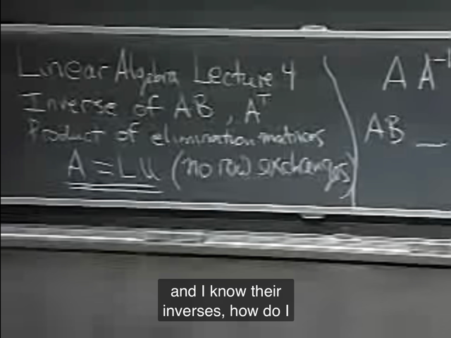</kbd>

 

### Nghịch đảo tích ma trận

<kbd>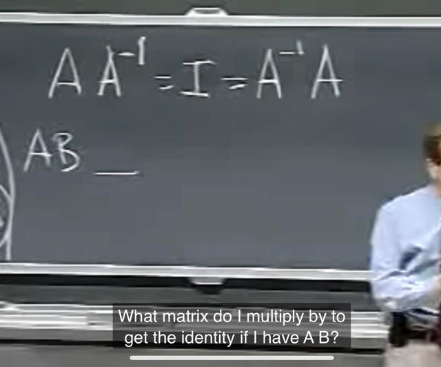</kbd>

> [!NOTE]
> Từ bài trước mình đã biết về **inverse của một single
> matrix A**, câu hỏi bây giờ là **inverse của một product
> AB**

 

#### Nghịch đảo tích ma trận

<kbd>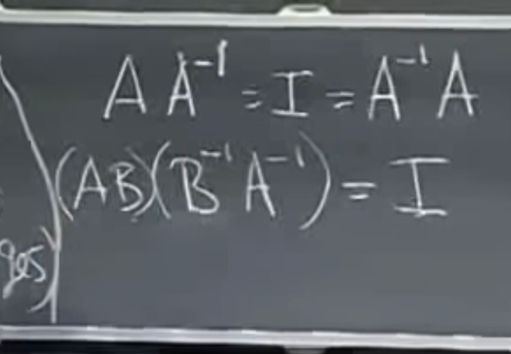</kbd>

> [!NOTE]
> Đáp án chính là **tích của A⁻¹ và B⁻¹, theo thứ tự
> ngược lại = B⁻¹×A⁻¹**
>
>
>
> Chứng minh: rất dễ là hiểu là khi nhân AB và B⁻¹A⁻¹,
> theo bài trước đã biết ta hoàn toàn có thể di chuyển
> các dấu ngoặc để rồi ta sẽ tính BB⁻¹ trước ra bằng I.
> Sau đó AIA⁻¹ sẽ ra AA⁻¹ ra I
>
> (AB)⁻¹ = B⁻¹A⁻¹

 

##### Nghịch đảo tích ma trận

<kbd>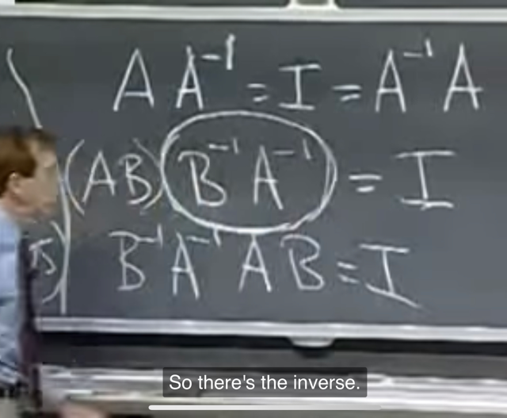</kbd>

> [!NOTE]
> Vậy B⁻¹A⁻¹ là
> inverse của AB

 

###### Transpose of an Inverse Matrix

<kbd>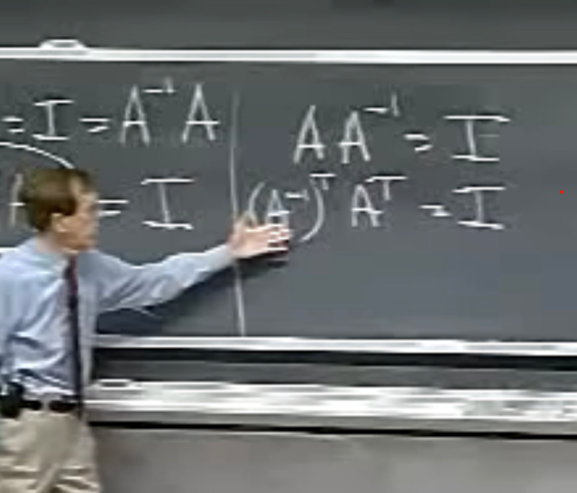</kbd>

> [!NOTE]
> Câu hỏi tiếp theo là inverse của A transpose là gì
>
>
>
> Gs bắt đầu với AA⁻¹ = I, transpose hai vế thì (I)ᵀ vẫn là I, còn (AA⁻¹)ᵀ = (A⁻¹)ᵀ Aᵀ

 

###### Inverse of Transpose Matrix

<kbd>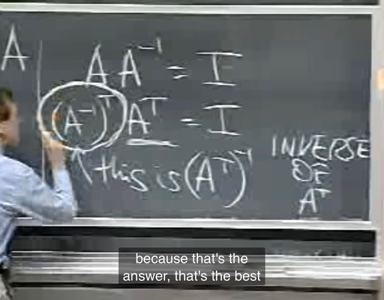</kbd>

> [!NOTE]
> Vậy từ (A⁻¹)ᵀ (Aᵀ) = I cho thấy inverse của Aᵀ chính
> là (A⁻¹)ᵀ:
>
>
>
> (Aᵀ)⁻¹ = (A⁻¹)ᵀ
>
> (Aᵀ)⁻¹ = (A⁻¹)ᵀ

 

<kbd>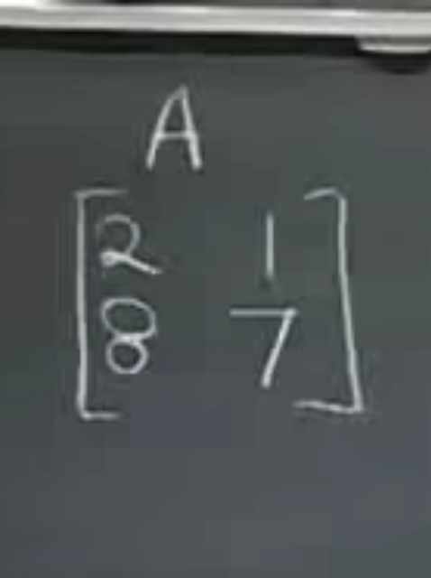</kbd>

 

###### Ma trận khử E21

<kbd>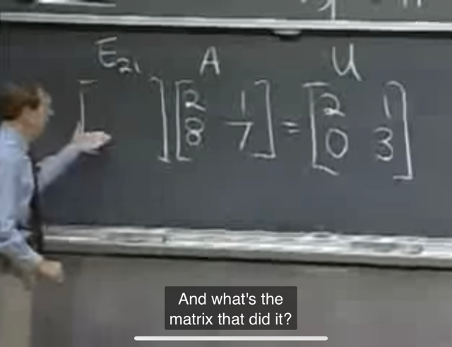</kbd>

> [!NOTE]
> Tiếp theo, gs muốn tìm hiểu **liên hệ giữa A và U** (là matrix
> kết quả sau khi elimination), nên đặt ra ví dụ này. Câu hỏi là
> **elimination matrix E21 là gì?** (E21 như đã học, ý là matrix
> giúp nhân A để khử a21)
>
>
>
> Đã học ở bài trước: Dùng cách tiếp cận theo hàng, hàng 1
> của E21 sẽ là coeffs của linear combination giữa các hàng
> của A để ra hàng 1 của U, vậy dễ thấy: 
>
>
>
> hàng 1 của E21 sẽ là 1 **[1 0]** (để nhân với A thì giữ nguyên 
> hàng 1: **1*** A's row 1 + **0***A's row 2)**.** 
>
>
>
> hàng 2 của E21 sẽ là **[-4 1]** (để nhân với A thì sẽ "lấy hàng
> 2 trừ đi 4 lần hàng 1: **-4***A's row 1 + **1***A's row 2)
>
>
>
> Vậy E21 sẽ là **[1, 0; -4, 1]**

 

###### Nghịch đảo ma trận khử

<kbd>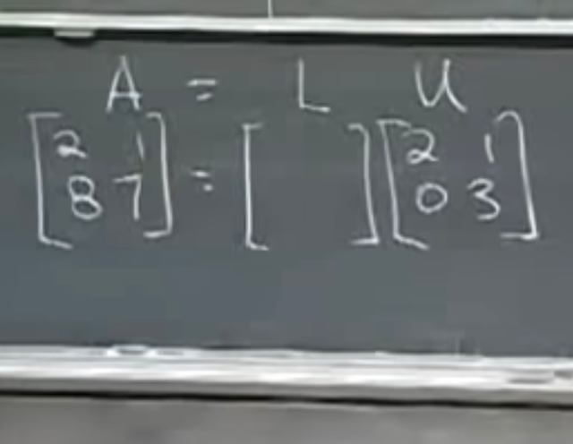</kbd>

> [!NOTE]
> Câu hỏi tiếp theo là **L là gì để nhân U ra lại A**: A = LU
>
>
>
> Theo như bài trước đã biết, **L sẽ đóng vai trò đảo ngược
> lại việc từ A biến thành U. Thế mà biến A thành U là do E:
> EA = U**. 
>
>
>
> **Nên bây giờ L đảo ngược chuyện đó nên L chính là E⁻¹** 
>
>
>
> Ta có thể hiểu như vầy: EA = U và LU = A ⇔ L(EA) = A
> ⇔ (LE)A = A ⇔ LE = I từ đó suy ra **L = E⁻¹**
>
>
>
> Nhẩm tính theo row method để ra L là **[1 0; 4 1]**
>
>
>
> Gs cho biết **inverse của Elimination rất dễ, chỉ việc đổi
> dấu của cái coeff ở vị trí 21 lại** (để từ hàng 2 của E21 là
> [-4 1] thành [4 1] là ta sẽ có hàng 2 của E21⁻¹, hàng 1
> thì giữ nguyên)
>
>
>
> Có thể hiểu lí do là vì E21 sẽ khử a21 bằng cách "lấy hàng
> 2 (của A) trừ cho 4 * hàng 1 (của A) để thành hàng 2 của U". 
>
>
>
> Vậy thì để đảo ngược lại hành động này, dĩ nhiên là ta sẽ 
> "lấy hàng 2 (của U) cộng lại cho 4 * hàng 1 (của A, và cũng
> là của U vì hàng 1 giữ nguyên) thì sẽ ra lại hàng 2 của A"
>
>
>
> Quả thật nó chính là kết quả trên: 
>
>
>
> **[1, 0; -4, 1]** --(đổi dấu ở vị trí 21)-→ **[1 0; 4 1]**

 

###### Ma trận tam giác LU

<kbd>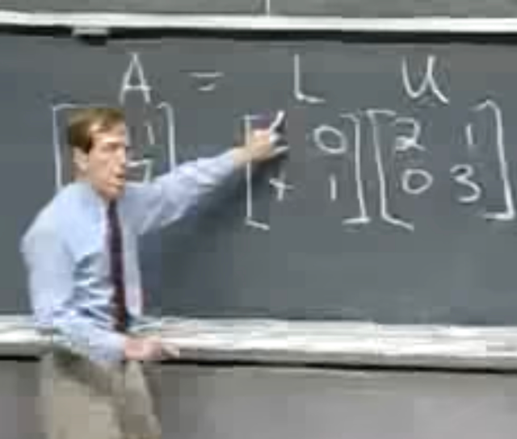</kbd>

> [!NOTE]
> **U** là gs viết tắt của **Upper Triangular**, tức là matrix mà
> **bên dưới đường chéo là 0 hết**, **L** là **Lower Triangular**
> (đường chéo là 1 hết, bên trên đường chéo là 0 hết)

**🔗 See also:** [linked note](./lecture_7_solving_ax_0_pivot_variables_special_solutions.md#node-xhtpxlk)

 

###### Phân tích ma trận LDU

<kbd>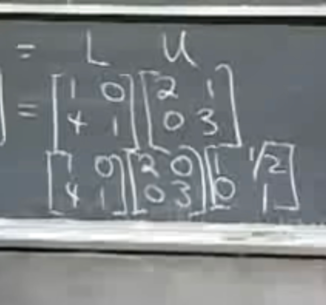</kbd>

> [!NOTE]
> gs còn cho biết thêm **với L, đường chéo sẽ là 1**, **với U,
> đương nhiên đường chéo là các pivot**. 
>
>
>
> Và có thể **tách thêm ra** thành dạng như ở dưới trong đó
> **matrix giữa chỉ có đường chéo là các pivot.**
>
>
>
> Nhận xét, nhìn **có vẻ giống phép decomposition (eigen
> hoặc singular)**

 

###### Phép khử ma trận 3x3

<kbd>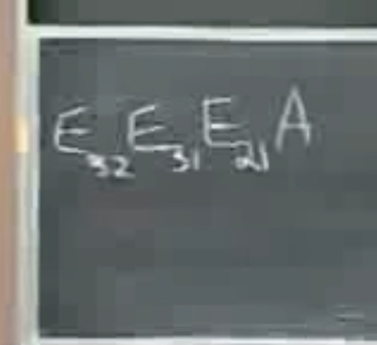</kbd>

> [!NOTE]
> Gs mới nói qua ví dụ dùng **matrix 3x3**. Vậy chưa cần
> biết cụ thể các matrix sẽ ntn nhưng ta biết quá trình để
> **elimination biến** A thành dạng pivot (U), ta sẽ dùng E21
> để loại coeff ở vị trí 21, sau đó là 31 và 32

 

###### Ma trận L cỡ 3x3

<kbd>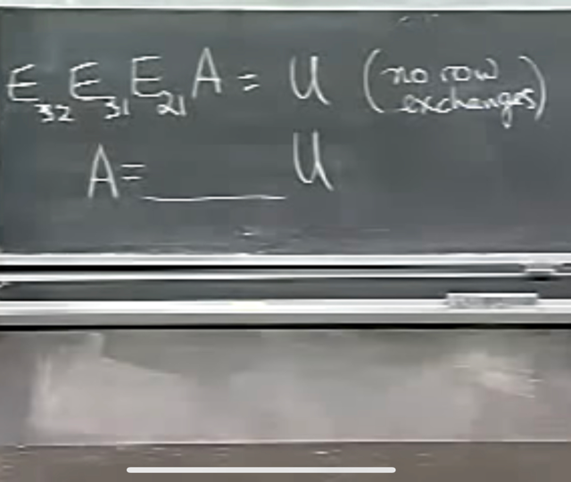</kbd>

> [!NOTE]
> Thế thì với matrix A 3x3 câu hỏi tương tự là matrix nào
> (khi nhân với U) sẽ **đảo ngược quá trình biến đổi từ A
> sang U**, để có lại A từ U. Hay L trong trường hợp này là gì

 

###### Xây dựng ma trận L

<kbd>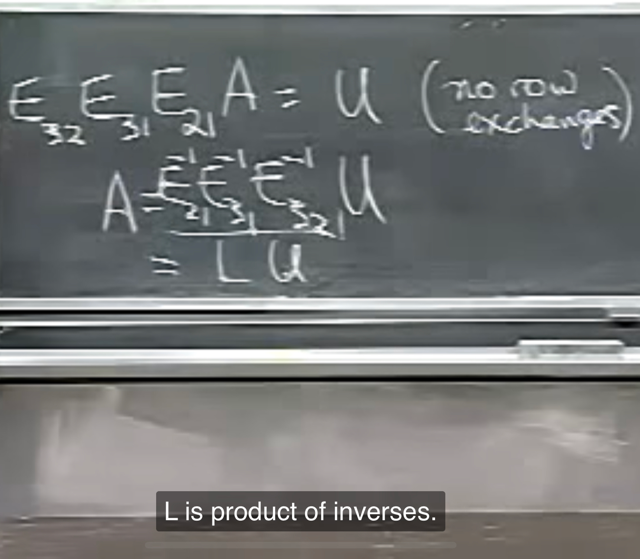</kbd>

> [!NOTE]
> Lập luận thế này, E32 biến đổi E31E21A thành U, vậy E32⁻¹
> sẽ biến đổi U về lại E31E21A:
>
>
>
> E32E31E21A = U 
>
>
>
> ⇒ E32⁻¹(E32E31E21A) = (E32⁻¹E32)E31E21A = E31E21A
>
>
>
> Tiếp tục, E31⁻¹ sẽ biến đổi E31E21A về lại E21A:
>
>
>
> E31⁻¹(E31E21A) = (E31⁻¹E31)E21A = E21A
>
>
>
> Và E21⁻¹ sẽ biến đổi E21A về lại A
>
>
>
> E21⁻¹(E21A) = A
>
>
>
> Nên L = **E32⁻¹E31⁻¹E21⁻¹** là matrix sẽ đảo ngược quá
> trình từ A thành U

 

###### Nghịch đảo ma trận E

<kbd>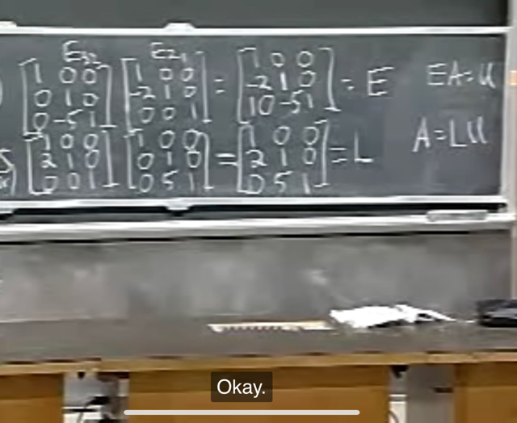</kbd>

> [!NOTE]
> Gs cho ví dụ giá trị cụ thể của các E, trong đó E31 cho
> bằng I cho gọn bớt. Thế thì ta có E = E32E21 là matrix
> khiến biến A thành U: EA=U
>
>
>
> Và L bằng E21⁻¹E32⁻¹ là matrix đảo ngược lại LU = A
>
>
>
> Để ý đã **biết cách tính E21⁻¹** ở trên, cơ bản E21 chỉ là
> matrix mà **nếu với nhân A nó sẽ thực hiện việc lấy
> hàng 2 của A  trừ đi 2 * hàng 1 của A để thành**,
> hàng 2 của E21A
>
>
>
> (E21A) row 2 = A row 2 **- 2 * A row 1**  (1)
>
>
>
> thì E21⁻¹ sẽ đảo ngược bằng cách: **Lấy hàng 2 của E21A 
> cộng 2 * hàng 1 của E21A (cũng bằng hàng 1 của A vì E21
> không thay đổi hàng 1 so với A)** để có hàng 2 của A.
>
>
>
> (E21A) row 2 **+ 2 * (E21A) row 1** = A row 2 (2)
>
>
>
> Với (1) và (2) thì khi để ý [A row 1] và [E21A row 1] là giống
> nhau thì ta sẽ thấy rõ ràng (1) và (2) là nghịch đảo của nhau
>
>
>
> Tương tự với E32 và E32⁻¹

 

###### Chi phí phép khử Gauss

<kbd>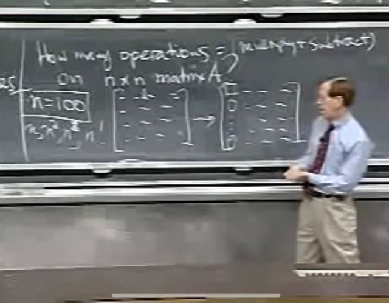</kbd>

> [!NOTE]
> Kế tới gs đặt ra câu hỏi **how expensive**, ý là **tốn bao nhiêu operations
> tính toán** khi tăng n (matrix A kích thước [n,n]). Ví dụ n = 100.
>
>
>
> Cũng là bài toán chuyển matrix về từ A thành U như bữa giờ làm
>
>
>
> Gs **coi như một operation là một lần nhân và một lần trừ**: ví dụ [**trừ**
> hàng 2 cho [2 **nhân** hàng 1]] để khử số 0 ở đầu hàng 2

 

###### Số phép tính khử cột

<kbd>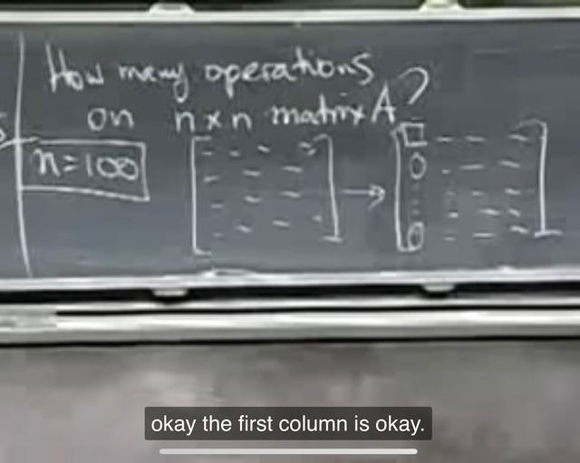</kbd>

> [!NOTE]
> Vậy bước đầu tiên là **chuyển cái cột đầu tiên thành số
> 0 hết trừ vị trí đầu tiên của hàng 1.**
>
>
>
> Câu hỏi là bước này cần bao nhiêu operations

 

###### Operation Count in Gaussian Elimination

<kbd>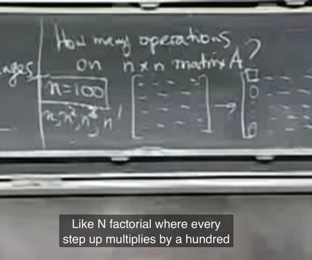</kbd>

> [!NOTE]
> Gs đặt câu hỏi liệu số operations có proportional với n theo n², hay n³ **.**..

 

###### Gaussian Elimination Operation Count

<kbd>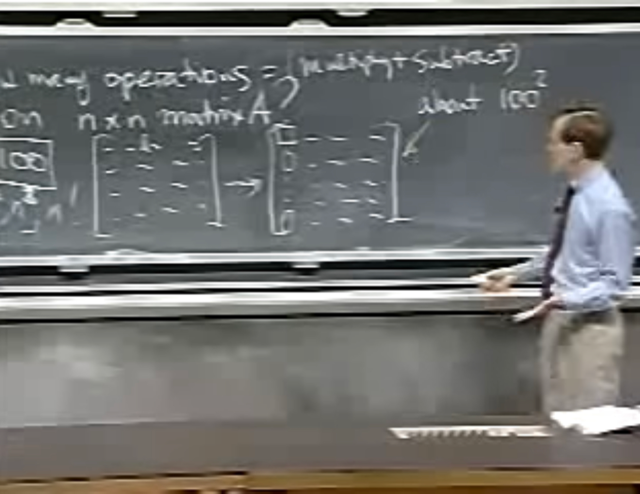</kbd>

> [!NOTE]
> Vậy ở bước đầu tiên này gs **cho rằng ta sẽ tốn 100²** operations\*\*
>
>
>
> Chưa hiểu lắm tại sao, đại khái là gs cho rằng ta phải thay đổi 100x100 con số (coi như thay đổi luôn hàng đầu tiên)
>
>
>
> Có thể hiểu là ở bước đầu tiên, ta sẽ muốn khử mọi phần tử không phải pivot của cột 1: a21, a31....Mà để khử a21 ta sẽ **trừ** row 2 cho (một con số nào đó **nhân** row 1). Như đã nói ta sẽ tính một phép nhân và một phép trừ là một operation.
>
>
>
> Thế thì việc lấy row 2 **trừ** \[(something) **nhân** (row 1)\] sẽ bao gồm 100 operation vì ta có 100 item mỗi hàng.
>
>
>
> Số operation cần thiết cũng tương tự khi khử a31, a41... và ta có khoảng 99 cái. Do đó số operation là **100 × 99** và **gs cho nó khoảng 100 × 100 luôn, là 100²**

 

###### Operation Count in Gaussian Elimination

<kbd>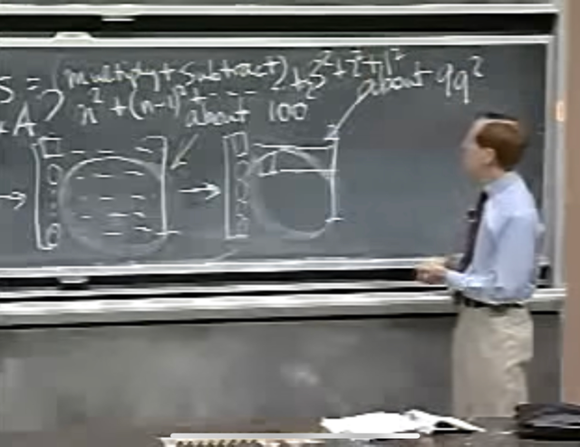</kbd>

> [!NOTE]
> Đại ý là bước thứ hai, vấn đề cũng tương tự nhưng nhỏ
> hơn vì ta chỉ có 99 item mỗi hàng và có 98 hàng, nên số
> operation tính **gần đúng coi như có 99² operations**
>
>
>
> Thế thì cứ tiếp tục như vậy.
>
>
>
> Vậy ta cho rằng sẽ tốn
>
>
>
> **n² + (n-1)² +....2²+1²**
>
>
>
> operations

 

###### Ước lượng tổng bình phương

<kbd>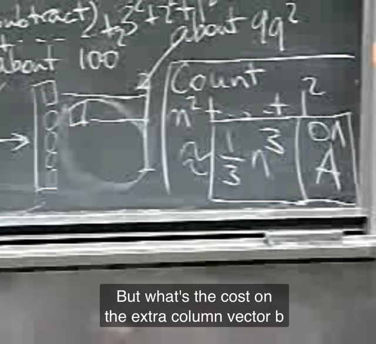</kbd>

> [!NOTE]
> Gs lập luận là đây là **tổng** của **n term**, mà **bự nhất là n²**, nên **nó ko thể to hơn n × n² = n³** được.
>
>
>
> Gs cho biết nó **sẽ cỡ n³**/3\*\*
>
>
>
> Cái này là \*\*tích phân từ 1 tới n của hàm x²\*\*.
>
>
>
> Cái này thật ra sẽ cần kiến thức của 18.01 nên mình có thể sẽ quay lại sau nhưng hiểu đại khái là vầy
>
>
>
> Để tính tổng 1² + 2² + ...(n-1)^2 + n² ta sẽ lấy tích phân từ 1 đến n của số hạng tổng quát. Và số hạng tổng quát là x². Do đó ta có:
>
>
>
> tích phân từ 0 đến n của x²dx. và theo Fundamental Theorem of Calculus Part 2, tích phân này sẽ bằng \[nguyên hàm của f\] n:0 = x³/3 | n:0 = n³/3
>
>
>
> Vậy đây là số operations on A, tức là dành để tính cho A
>
> Sẽ quay lại sau khi 18.01

 

###### Elimination Operation Count

<kbd>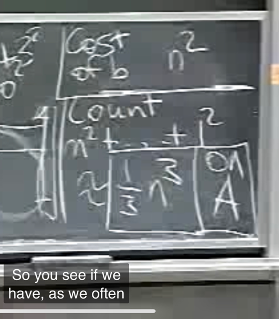</kbd>

> [!NOTE]
> Còn với vector b (việc biến đổi còn có vector b bên phải
> equation Ax=b nữa nhớ ko). Sẽ **tốn n² operations** (gs
> không giải thích tại sao)

 

###### Ma trận hoán vị hàng

<kbd>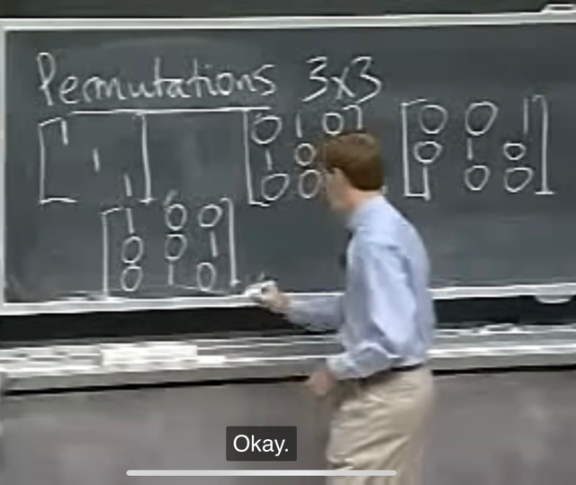</kbd>

> [!NOTE]
> Rồi, h gs nói qua việc nếu ta có tính tới row exchange
>
>
>
> Nhớ lại là khi trong quá trình row elimination ta gặp pivot = 0 thì ta phải row exchange.
>
>
>
> Thì việc đó thực hiện bằng p**ermutation matrix**, ví dụ **p12 là chỉ permutation matrix giúp exchange row 1 và row 2.**
>
>
>
> Thế thì, gs đặt câu hỏi là **nếu ta có matrix 3x3, thì có mấy permutation matrix**. Là các matrix giúp exchange row ví dụ 1-2, 1-3, 2-3.
>
>
>
> P12 sẽ có hàng 1 là \[0 1 0\] vì khi nhân với A nó sẽ ra matrix P12A có hàng 1 là 0 × a1+1 × a2+0\*a3=a2,
>
>
>
> và P12 có hàng 2 là \[1 0 0\] để P12A có hàng 2 sẽ là 1 × a1+0 × a2+0\*a3=a1, tức là đã **switch hàng 1 và hàng 2 của A rồi**
>
>
>
> (\*a1,a2,a3 là ám chỉ row 1,2,3 của A)
>
>
>
> Ở trên cần nhớ lại khi **nhân row vector hàng cho matrix** là ta **linear combination các row của matrix**với c**oeff là các component của row vector**

 

###### 3x3 Permutation Matrices

<kbd>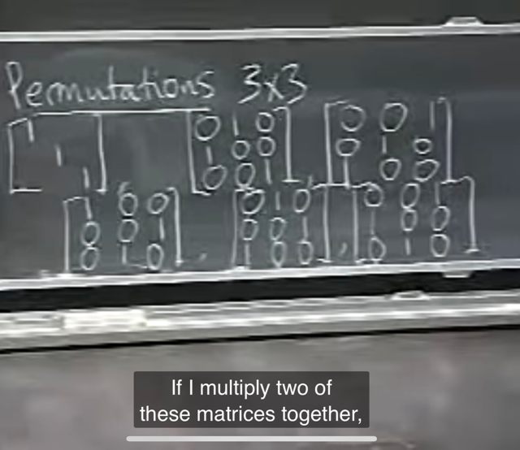</kbd>

> [!NOTE]
> Ngoài ra còn có các matrix này. Và đáng chú ý là **với 6
> matrix này**, **inverse hay transpose của chúng cũng
> thuộc 6 matrix này**. Ví dụ p12 (permutation matrix giúp
> exchange row 1 và 2) thì **cũng chính là nó khiến đảo
> ngược chuyện đó**, nên **P12 inv cũng chính là P12.
>
>
>
> P12 = P12⁻¹**

 

###### Ma trận hoán vị

<kbd>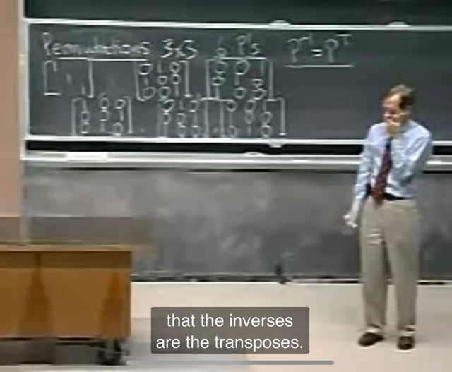</kbd>

> [!NOTE]
> Và gs cho biết **permutation matrix** có **tính chất đặc biệt** đó
> là **inverse cũng chính là transpose**: **P⁻¹ = Pᵀ**

 

