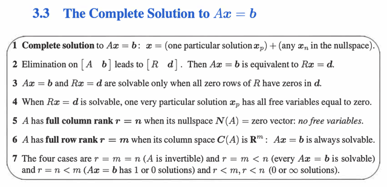
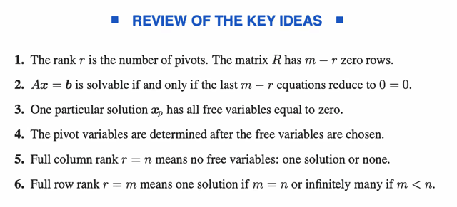
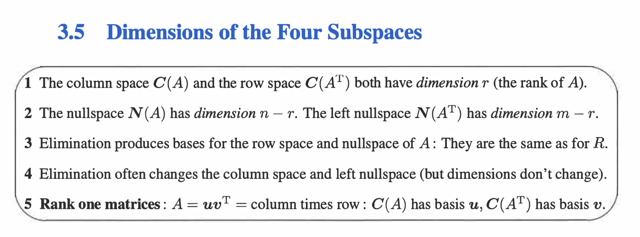
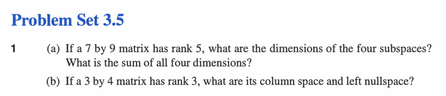
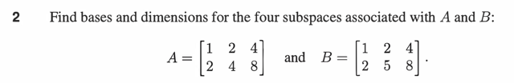
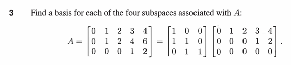

# 3. Vector Spaces
and Subspaces

📊 **Progress:** `2` Notes | `6` Screenshots

---

## 3. Vector Spaces
and Subspaces

 

## 3.3 THE COMPLETE SOLUTION TO Ax=b

 

<kbd></kbd>

> [!NOTE]
> Tại sao 1: Là vì x_n thuộc nullspace tức Ax_n = 0.
>
>
>
> Thế thì nếu Ax_p = b thì tương đương Ax_p + Ax_n = b + 0 = b tức A(x_p + x_n) =
> b. Từ đó có nghĩa là x_p + x_n CŨNG là solution  của Ax = b
>
>
>
> Ở đây chú ý rằng x_p + x_n CŨNG LÀ SOLUTION CHỨ KHÔNG PHẢI x_n LÀ
> SOLUTION nhé. Do đó nếu có tồn tại x_p, thì cộng nó với x_n nào cũng sẽ là
> solution của  Ax = b, còn nếu không tồn tại x_p thì  dù có x_n thì Ax = b cũng vẫn vô
> nghiệm
>
>
>
> ====
>
>
>
> Tại sao 2: Là bởi vì quá trình elimination biến A thành R, và có thể diễn tả
> elimination bằng matrix E. Ta có EA = R.
>
>
>
> Thế thì Ax = b <=> EAx = Eb (nhân hai vế cho E)
>
>
>
> <=> Rx = d (d = Eb). Vậy x là solution của Ax = b sẽ cũng là solution của Rx = d
> (Thế thôi)
>
>
>
> ====
>
>
>
> Tại sao 3: Đơn giản là vì khi elimination biến A thành R, nó đã chỉ giữ lại các
> independent row, xắp nó nằm trên, những dependent row trở thành zero và được
> xắp nằm dưới. Hơn nữa, các independent row cũng hình thành nên một Identity
> matrix ở trên (R là Reduced Echelon Form, mọi pivot thành 1, và mọi non-pivot
> thành 0 hết)
>
>
>
> Do đó, muốn Ax=b có solution thì vì ý 2, Rx=d phải có solution. Muốn vậy các
> component tương ứng (m-r component  ở cuối) cũng phải bằng không, chứ nếu
> chúng bằng 0 đương nhiên hệ phương trình sẽ vô nghiệm
>
>
>
> ====
>
>
>
> Tại sao 4: Vì khi đã elimination Ax = b thành Rx = d, thật ta có thể gán giá trị  bao
> nhiêu cũng được cho các free variable, backsub vào để tìm pivot var. Nhưng để đơn
> giản nhất thì ta cho mọi free variable bằng 0, thì giá trị của pivot var sẽ TỰ NHIÊN
> ĐƯỢC PHÁT LỘ Ở d , BỞI VÌ CÁC PIVOT COLS LÀ CỘT ZERO VỚI 1 TẠI PIVOT
> CẢ RỒI. Nên PIVOT VARIABLE ỨNG VỚI PIVOT Ở HÀNG NÀO SẼ CÓ GIÁ TRỊ
> BẰNG PHẦN TỬ TƯƠNG ỨNG Ở HÀNG ĐÓ TRÊN d
>
> Tại sao 5: Đơn giản vì full column rank tức mọi cols đều là pivot cols, thì đương
> nhiên không có free cols nào. Mà mỗi free cols ứng với một special solution,  nên
> không có free cols nào tức không có special solution nào. Điều này có nghĩa không
> có vector nào trong basis của nullspace. Vậy nullspace chỉ chứ zero.
>
>
>
> NHƯNG GIẢI THÍCH NHƯ VẬY MANG CÓ THỂ KHÔNG THUYẾT PHỤC BẰNG:
> Vì mọi cols đều là pivot cols, nên CHÚNG INDEPENDENT NHAU, vì về bản chất
> các vị trí pivot đã thể hiện điều đó, đối ứng với pivot của cols này, là 0 của cols kia,
> nên không thể scale hay combine các cols đó để tạo cols này được. Mà như vậy
> **bộ hệ số duy nhất khiến combination của chúng bằng 0 (x của nullspace)** **chỉ
> có thể là 0 (*)**. -> đó chính là kết luận nullspace chỉ có zero.
>
>
>
> (*) Ta có thể dễ dàng chứng minh ý này bằng **PHẢN CHỨNG** : Giả sử có một bộ
> coeff (đều khác 0) khiến linear  combination các cols (independent nhau) mà vẫn
> cho ra 0 thì ta sẽ suy ra ngay bằng cách **chuyển vế đổi dấu** để cho ra kết quả là
> **một cols nào đó sẽ là linear  combination của các cols còn lại**, mà điều này
> **ngược với điều kiện ban đầu**
>
>
>
> ====
>
>
>
> Tại sao 6: Vì khi mọi row là pivot, đương nhiên cũng cùng số đó cols là pivot cols.
> Mà cols space là subspace của R^m, trong khi lại có đủ m pivot cols, vậy pivots 
> cols span cả không gian R^m. Rồi, đương nhiên b cũng là R^m vector, thành ra nó
> bằng bao nhiêu, hay nó nằm đâu trong không gian R^m thì cũng là nằm trong cols
> space. Do đó luôn luôn có solution.
>
>
>
> Nói thêm, còn lại số lượng thì phải xét nullspace. Nếu nullspace khác zero thì
> sẽ là vô số solution, còn ngược lại thì sẽ là chỉ có một solution duy nhất.
>
>
>
> ====
>
>
>
> Giải thích 7: 
>
>
>
> Case thứ nhất: invertible matrix A, thì Ax = b luôn có 1 solution duy nhất. Dễ hiểu đó
> chính là x = A.inb, đây chính là solution phát lộ khi Elimination biến A thành I (R trong
> case này chính là I)
>
>
>
> Case thứ hai: r = m < n thì đây là full row rank nói trên, ta có các pivot cols, span
> toàn bộ R^m nên b bằng bao nhiêu thì cũng nằm trong cols space. Bên cạnh đó,
> m < n nên tồn tại free cols, dẫn tới luôn có thể tìm ra bộ coeffs khác 0 khiến giúp 
> linear combination các cols để thành 0 => tức là Ax = 0 có solution khác 0. Mà điều
> này cũng đồng nghĩa là có vô số solution của Ax = 0, vì bất cứ khi nào ta scale
> solution lên ta cũng có một solution khác của Ax = 0.
>
>
>
> Hoặc có thể giải thích kiểu khác đó là vì có free cols nên sẽ có special solution của 
> Ax = 0, tức nullspace khác zero, hay có nhiều solution của Ax = 0.
>
>
>
> Từ đó dẫn tới, khi kết hợp x_particular và vô số x_null thì ta có vô số solution của 
> Ax = b.

 

<kbd></kbd>

 

## 3.5 Dimensions Of 4 Subspaces

 

<kbd></kbd>

 

#### Đại khái là phần này gs dẫn dắt đi tìm 4 subspace của R - Reduced Row Echelon Form của matrix A. với
một ví dụ R như sau:

[\\*1\\* 3 5 \\*0\\* 7

\\*0\\* 0 0 \\*1\\* 2

0 0 0 0 0]

Matrix này có 2 pivot -> rank = 2

i) \\*Row Space C(R.T)\\*: Basis sẽ chính là 2 pivot row tuy nhiên đáng chú ý là phải hiểu rộng hơn vì sao
chúng lại tạo thành basis của row space: Đó là vì, việc chứa hai pivot, khiến \\*HÌNH THÀNH NÊN MỘT
IDENTITY MATRIX\\* - và từ đó row 2 sẽ \\*không thể nào  depend row 1\\* vì \\_\\*SỐ 0 TẠI R14 KHÔNG
THỂ NHÂN VỚI CÁI GÌ ĐỂ CHO RA SỐ 1 TẠI R24\\*\\_ được. Và ngược lại row 1 không thể depend row
2 vì số 0 tại R21 không thể nhân với cái gì để cho ra R11 được. Do đó, nguyên nhân sâu xa của việc tại
sao các pivot row  lại tạo nên basis của row space là bởi chúng \\*TẠO NÊN MỘT SET CÁC
INDEPENDENT ROW\\*.

Và \\*RIÊNG ĐỐI VỚI R\\*, thì chúng là các vector khác 0, (vì ở trạng thái R, ngoài pivot row ra, các row
khác \\*BẰNG 0 CẢ RỒI\\*) NÊN CÁC PIVOT ROW NÀY \\*SPAN ROW SPACE  CỦA R\\*. Vậy theo định
nghĩa, một set các independent vector mà span một space thì chúng  chính là basis.

ii) \\*Column Space của R C(R)\\*: Basis chính là 2 pivot cols. Và cũng tương tự như trên, CẦN HIỂU
NGUYÊN NHÂN GỐC RỄ là bởi vì CÁC PIVOTS COLS SẼ \\*TẠO NÊN CÁC IDENTITY MATRIX NÊN
CHÚNG INDEPENDENT. \\*Thế thì với cols space, thì các free cols không bằng 0, \\*NHƯNG CHÚNG
DEPEND CÁC PIVOT COLS, \\*thành ra các pivots cols sẽ là các independent vectors trong các
columns\\* \\*->  Nó chính là basis của cols space.

iii) \\*Null Space of R N(R)\\*: Như trong bài đã học rằng, nếu đã xác định các free cols / variables thì ta sẽ
set 1 lần lượt cho mỗi free variable (trong mỗi lần như vậy, set 0 cho những free variable còn lại) rồi thế
vào giải tìm ra các pivot variables, thì ta sẽ có các SPECIAL SOLUTIONS VÀ CHÚNG SẼ TẠO NÊN
MỘT BASIS CỦA NULLSPACE. Thế thì PHẢI HIỂU \\*TẠI SAO CÁC SPECIAL SOLUTION LẠI LÀM
THÀNH MỘT BASIS CỦA NULLSPACE?

\\*Đó là bởi vì, bằng cách set 1 cho free variable và 0 cho những thằng còn lại để tạo một special solution
\\*TA ĐÃ AGAIN TẠO RA TRẠNG THÁI CÁC IDENTITY MATRIX NHƯ NÓI Ở TRÊN KHIẾN CHO TA CÓ
CÁC SPECIAL SOLUTION SẼ INDEPENDENT NHAU.

\\*iv) \\*Null Space of R.T hay Left Null Space\\*: Cái này DÙ CÓ THỂ LẬP LUẬN GIỐNG VỚI
NULL-SPACE  CỦA R. NHƯNG ĐẶC BIỆT HƠN khi xét R.Ty = 0, thì cơ bản ta CÓ TRẠNG THÁI LÀ
CÁC FREE  COLS  ĐỀU BẰNG 0 HẾT RỒI.

Do đó, đương nhiên cũng có bao nhiêu free cols thì có bấy nhiêu special solution (và cũng bấy nhiêu
vector  trong basis), tuy nhiên ĐẶC BIỆT Ở CHỖ, VÌ CÁC PIVOT COLS INDEPENDENT NHAU MÀ CÁC
FREE COLS  BẰNG 0, NÊN \\*CÁC PIVOT VARIABLE PHẢI BẰNG 0 HẾT\\*

> [!NOTE]
> THE 4 SUBSPACE OF R:

 

## Ps 3.5

 

### 1. a) matrix 7x9 có rank = 5 

i) Dimensions of 4 subspace? 

ii) Tổng của các dimensions?
   
*Lập luận: 

i) Vì matrix có rank = 5: Việc có \\*rank = 5 suy ra matrix có 5 pivot cols cũng như
5 pivot rows\\* (cũng là số hàng hay cột độc lập trong rowspace và cols space)
hay, cũng chính là số vector trong basis của cols space và rows space. Và đương
nhiên ta sẽ có \\*dimension của cols space và rowspace đều bằng 5\\*.

ii) Ta sẽ xét\\* nullspace of matrix\\*, thế thì matrix có \\*9 cols\\*, trong đó có \\*5 independent
cols\\* như đã nói, \\*suy ra có 4 dependent cols\\*. Xét equation Ax=0 thì \\*4 dependent
cols này ứng với 4 free variable\\*. Và như đã biết với 4 free variable, \\*lần lượt ta cho 
mỗi cái bằng 1, và những thằng còn lại bằng 0\\*, sau đó thế vào (\\*backsubstitution\\*)
để giải các pivot variable thì ta sẽ được các \\*SPECIAL SOLUTION\\*. Và CHÚNG
SẼ TẠO NÊN \\*MỘT BASIS CỦA NULLSPACE\\*. Vậy nên số free cols/variable sẽ là số
vector trong basis của nullspace, hay là dimension của nullspace. Vậy dim N(A) = 
9-5 = 4.

iii) Xét nullspace của A.T hay còn gọi là\\* left nullspace\\*. Thì tương tự, số independent
cols của A.T chính là số independent row của A (mà ta đã xác định là 5), nên A.T sẽ
có 7-5=2 dependent cols. Và đây cũng sẽ ứng với \\*2 free cols/variable của A.Ty=0\\*
Vậy ta cũng sẽ có 2 vector trong basis của nullspace of A.T -> dim N(A.T) = \\*2\\*.

iv) Tổng dimension của cả 4 matrix là: r + r + m-r +n-r =\\* m+n\\* = \\*16\\*

<kbd></kbd>

 

#### 1b) matrix 3x4, rank 3. Cols space và left nullspace là gì?

*Lập luận như sau:

i) cols space: matrix có rank = 3, nên nó có 3 pivot. Thế thì matrix có 4 cols, mà có 3
pivot cols ->cũng là 3 vector trong basis của cols space -> Dimension của cols space
là 3.

ii) left nullspace: dim của left nullspace: A có 3 pivot tức có 3 pivot row, cũng là 3
independent row. Nên A.T sẽ có 3 independent cols trong 3 cols. Vậy A.T không có
free cols nào. Điều này dẫn đến không có vector nào trong basis của nullspace of A.T
thành ra nullspace của A.T CHỈ CHỨ ZERO, dim của left nullspace là 0.

 

##### 2. Tìm bases và dim của 4 subspace của A, B:

*Xét A, dễ thấy cols 2,3 đều dependent col 1, suy ra chỉ có 1 pivot.
Và cho phép kết luận chỉ có 1 vector trong basis của cols space và rows space
nên dimension của cols space và rows space đều bằng 1.

Xét N(A), trong 3 cols chỉ có 1 linear dependent, nên 2 dependent cols của A sẽ
ứng với 2 free cols / variable. Do đó có 2 special solutions -> 2 vector trong basis
của nullspace of A -> dim N(A) = 2.

và tương tự, trong 2 row của A thì có 1 row là dependent - nó cũng sẽ ứng với 
dependent cols của A.T vậy basis của N(A.T) có 1 vector -> dim N(A.T) = 1. 

*Xét B: Dễ thấy hai row của B đều independent. Vậy có 2 pivot -> 2 pivot cols cũng
như 2 pivot row. Vậy cả cols space và row space đều có dim = 2.

Thế thì xét N(B), vì B có 2 independent cols trong 3 cols nên có 1 dependent cols
ứng với 1 free cols/variable. Vậy Bx=0 sẽ có 1 special solution -> basis của N(B)
có 1 vector -> dim N(B) = 1.

Còn xét N(B.T), trong 2 row của B thì independent cả hai nên cả hai cols của B.T 
đều independent -> không có free cols / variable -> B.Ty =0 không có special solutions
-> basis của N(B.T) không có vector nào -> dim N(B.T) = 0

<kbd></kbd>

 

- ***Lập luận:

Xét matrix A = BC như đề bài, thì ta xem xét B trước: Thế thì ta có thể xem xét B.T:
và thấy ngay nó có dạng Row Echelon, với 3 pivot. Vậy thì matrix B.T là \\*square\\* matrix
\\*3x3\\* và có \\*3\\* pivot nên nó là matrix \\*full rank.

\\*Và vì B.T fullrank nên có thể \\*suy ra B cũng full rank\\* (vì cols space của B.T là row
space của B, row space của B.T là cols space của B).

Và một\\* full rank\\* matrix thì sẽ có tính chất \\*invertible \\*(điều này là bởi, dạng Reduced
Row Echelon của nó sẽ là Identity matrix, nên ta có thể biểu diễn kết qủa của việc
thực hiện elimination là nhân E matrix cho B cho ra I: EB = I, suy ra E chính là B.inv)

Thế thì, ta có thể xét nullspace của A trước, xét equation Ax = 0, cũng là BCx = 0.
Nhân hai vế cho B_inv ta sẽ có Cx = 0.

Từ đây suy ra: x khiến Ax=0 cũng chính là x khiến Cx=0, nên NULLSPACE CỦA C
CŨNG CHÍNH LÀ NULLSPACE CỦA A, ta sẽ đi tìm N(C) trước:

Dễ thấy với C, col 2, col 4 là pivot cols - ứng với pivot variables, col 1,3,5 là free 
cols - ứng với free variables. Ta sẽ lần lượt set 1 cho các free variable (2 thằng còn lại
bằng 0) và back-subtitute để tìm pivot variables. Làm vậy ta sẽ có 3 special solution
như sau:

{ (0 -2 1 0 0) (0 2 0 -2 1) (1 0 0 0 0) } và đây là basis của N(C) cũng là basis của N(A)**

<kbd></kbd>

 

