# Lec 1 Part 1 Intro And Motivation

📊 **Progress:** `19` Notes | `17` Screenshots

---

## Lec 1 Part 1 Intro And Motivation

 

## Vai trò của Matrix Calculus Matrix Calculus Matrix Calculus

<kbd>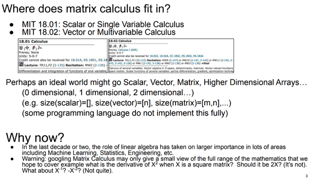</kbd>

> [!NOTE]
> đại ý là gs nói rằng bạn đã học các lớp cơ bản như MIT18.01, 18.
> 02 Về Calculus Scalar và Calculus Vector, rồi bỗng nhiên dừng lại
> ở đó và cho rằng Calculus matrix chỉ là mở rộng ra thêm. Điều này
> không hoàn toàn đúng.
>
>
>
> Với sự phát triển của Machine Learning, Statistic, Linear Algebra
> trở nên quan trọng. Và cùng với nó, Matrix Calculus có thể giúp
> ích nhiều

 

### Giải tích ma trận

<kbd></kbd>

> [!NOTE]
> Matrix calculus sẽ giúp ích cho mọi thứ liên quan đến Machine
> Learning và Deep Learning

 

#### Tối ưu thiết kế bằng AI

<kbd>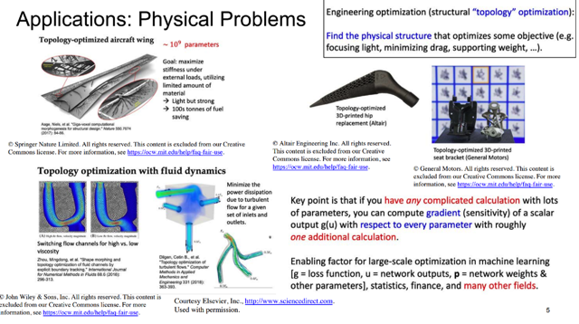</kbd>

> [!NOTE]
> Gs cho biết trước đại ý là trước đây khi người ta nghiên cứu khí
> động học của một thiết kế, họ sẽ chọn thiết kế trước, và phân tích
> khí động học của nó. Tuy nhiên với machine learning, người ta có
> thể **đặt việc tạo thiết kế trong một vòng lặp và giải bài toán tối ưu**
> để tạo ra thiết kế tối ưu về khí động học. (có thể hiểu giáo sư nói
> về machine learning và deep learning tạo nên bước đột phá trong
> rất nhiều lĩnh vực)

 

##### Đạo hàm tự động

<kbd>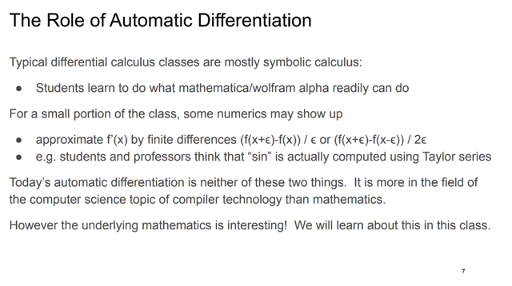</kbd>

> [!NOTE]
> Nói qua về **Automatic Differentiation**, đại khái là nó không như
> cách ta nghĩ - dùng **approximation** hay **Taylor series** (cái này
> mình sẽ biết khi bổ sung kiến thức với 18.01,18.02)
>
>
>
> Và đại ý là tuy rằng ta sẽ không tự làm (tính derivative) nhưng
> việc hiểu nó work như thế nào luôn có ích.

 

- **Phương pháp tuyến tính hóa**

<kbd>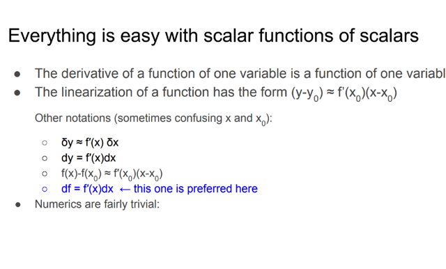</kbd>

> [!NOTE]
> **Linearization**: Đại ý là việc ta cho rằng **một function phức tạp sẽ là tuyến
> tính khi xét ở phạm vi địa phương**. Biểu hiện trong không gian low dimension
> 2D thì đường cong f(x), x**ét tại phạm vi local quanh x**, thì có thể coi như **xấp
> xỉ tuyến tính (đường tiếp tuyến tại đó**)
>
>
>
> Và ở không gian cao chiều hơn thì cũng vậy, chỉ cần hiểu là **linearization** là
> việc ta cho rằng **một mặt cong phức tạp nào đó cũng sẽ như một mặt phẳng
> khi xét ở phạm vi địa phương**. Điều này thể hiện bằng:
>
>
>
> **y - y0 ~= f'(x0)*(x - x0)** với (điều kiện) x ~= x0
>
>
>
> Sau đó là một số notation:
>
>
>
> Như **df = f'(x)dx** cách **thể hiện theo vi phân** hàm f, thể hiện **đóng góp của
> x** **vào khoảng thay đổi nhỏ của f**.
>
>
>
> Còn thể hiện theo định nghĩa của đạo hàm thì sẽ là **f'(x) = lim x->0 Δf/Δx**
>
>
>
> **δf ~= f'(x)δx**: Đây đương nhiên là công thức linear approximation, với ý nghĩa
> rằng **nếu δx ~- 0** thì có thể **xấp sỉ δf bởi f'(x)δx**, hay nói cách khác, khi
> thay d bằng δ thì ta ta đã  làm **động tác bỏ lim** và **dùng dấu xấp xỉ** thay
> cho dấu bằng.
>
>
>
> thì gs cho rằng ta đã đều biết các kí hiệu này nghĩa là gì.
>
>
>
> Nhưng ta nên ưu tiên dùng cách thể hiện vi phân **df = f'(x)*dx**, thay vì cách
> thể hiện theo định nghĩa (f'(x) = lim x->0 Δf/Δx, hay f'(x) = df/dx). Để rồi khi coi
> ∆x~0 thì ta có linear approximation  formula **∆y ~= f'(x)∆x**
>
>
>
> Mang ý nghĩa:
>
>
>
> Dù function f(x) có là đường cong, phức tạp thì tại **phạm vi local quanh x0
> (∆x)**, ta **coi nó / xấp xỉ nó (~=) như hàm tuyến tính**, đường thẳng tiếp tuyến
> tại x0 có phương trình y-y0 = f'(x0)*∆x  <=> **y-y0 = f'(x0)(x-x0)** 
>
>
>
> Và sở dĩ ta sẽ không nên ghi là **df/dx = f'(x) mà nên dùng cách ghi df = f'
> (x)dx** là bởi khi x trở thành vector, cách biểu thị này sẽ không chính xác. Nên
> trong course này ta sẽ dùng df = f'(x)dx
>
>
>
> (Có nghĩa là, df/dx = f'(x) là cách thể hiện theo định nghĩa đạo hàm mang ý
> nghĩa rằng, rate of change giữa f và x khi x thay đổi một khoảnh vô cùng nhỏ,
> hay có thể hiểu nó là cách ghi kết qủa của việc tính đạo hàm theo định nghĩa:
> **lim ∆x->0 ∆f/∆x**
>
>
>
> Còn df = f'(x)dx là cách thể hiện của vi phân, mang ý nghĩa là khoảng thay đổi
> vô cùng nhỏ của f sẽ bằng rate of change giữa f và x nhân với khoảng thay đổi
> nhỏ của x. Cách thể hiện này sẽ giúp khi mở rộng  qua bài toán đa biến, ví dụ f
> thành hàm f(x,y) thì ta sẽ mở rộng công thức trên thành công thức **vi phân
> toàn phần** (total differential):
>
>
>
> **df = f_x*dx + f_y*dy hay (∂/∂x)f*dx + (∂/∂y)f*dy**

**🔗 See also:** [Gradient và đạo hàm vector](#node-vfjqhrc)

 

- **Minh họa xấp xỉ tuyến tính**

<kbd>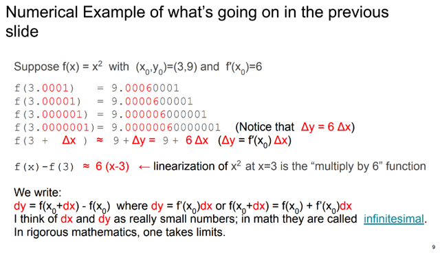</kbd>

> [!NOTE]
> Cụ thể ta thử lấy ví dụ hàm f(x) = x^2. Với (x0,y0) = (3,9)
>
>
>
> Thế thì để minh họa cho linearization ta sẽ thử xem có phải là với
> x~=x0, tức Δx~=0 thì rate of change của f bởi x sẽ giống như một
> hàm tuyến tính hay không.
>
>
>
> Thế thì, đường tuyến tính tiếp tuyến với f tại x0 là f(x) = f(x0) + f'
> (x0)(x-x0) <=> f(x) = y0 + (2x0)(x-x0) <=> f(x) = 9 + 6(x - 3) <=>
> **f(x) = 6x - 9
>
>
>
> Mà thật ra ta chỉ quan tâm độ dốc của nó, chính là f'(x0), là bằng
> 6. Để rồi nếu chỉ ra rằng trong đoạn quanh x0, f(x) = x^2 cũng có
> độ dốc bằng 6.**
>
>
>
> f(3.0001) = 9.00060001 => [f(3.0001) - f(3)] / (3.0001 - 3) =  (9.
> **0006**0001 - 9) / 0.**000**1 = 6.**000**1999999
>
>
>
> f(3.0000001) = 9.00000060000001 =>Δf/Δx = (9.
> **000000**60000001 - 9) / (0.**000000**1) = 6.**000000**10564
>
>
>
> Hiện tượng quan sát ở trên đó là khi xét một điểm rất gần x0 x =
> 3.0001, các x0 chỉ có 0.0001 thì f(x) tính ra = **9.00060001** để
> rate of change Δf/Δx ~= 6, điều này cho thấy, nó giống như ta tính
> f(x) bằng hàm f(x) = 6x-9 vậy, thật vậy thế x=3.0001 vào ta có 6*3.
> 0001 - 9 = **9.0006, con số này sai khác rất nhỏ so với 9.
> 00060001 với mức sai khác là 9.00060001 - 9.0006 = 0.
> 00000001
>
>
>
> Hay nói cách khác khi đi từ x0,y0 đến x,y thì đi theo con đường
> thẳng của f(x) = 6x-9 và f(x) = x^2 là gần như trùng nhau
> với mức tăng của f / quãng đường x đều là ~= 6
>
>
>
> Và khi xét đi x gần x0 hơn nữa, thì sai số còn nhỏ hơn nữa.**

 

- **Đạo hàm ma trận**

<kbd>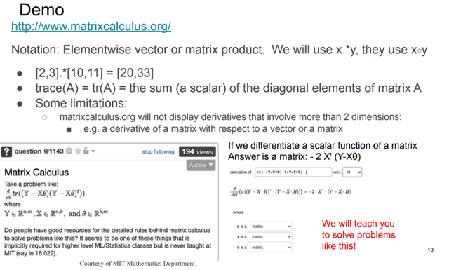</kbd>

> [!NOTE]
> đại ý là giới thiệu về một trang web giúp tính đạo hàm có thể xem
> qua, nhưng gs nói rằng nó không làm tốt khi kết quả ở không gian
> đa chiều hơn 2
>
>
>
> Cũng như trong lớp này, ta sẽ học cách **làm việc với matrix theo
> lối toàn diện (holistically)** thay vì chỉ coi matrix và vector như một
> table các con số riêng lẻ.
>
>
>
> Ví dụ để tính đạo hàm theo θ của một function tr[(Y-Xθ)(Y-Xθ)T]
> thì làm thế nào.

 

- **Đạo hàm theo biến scalar**

<kbd>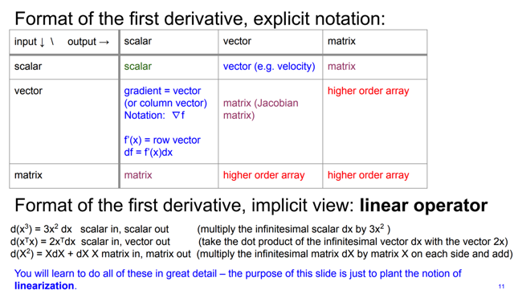</kbd>

> [!NOTE]
> Đại khái là nói về **derivative** của các function với input lần lượt là
> **scalar**, **vector**, **matrix** và output cũng vậy.
>
>
>
> Vậy với input là **scalar**: Hàng trên thứ 2:
>
>
>
>  **output là gì** thì  **derivative format là cái đó**:
>
>
>
> Đạo hàm của vector đối với scalar  thì là vector (mà mỗi phần tử là
> đạo hàm của phần tử tương ứng của vector đối với scalar), tương
> tự với derivative của matrix đối với scalar là matrix.

 

<kbd>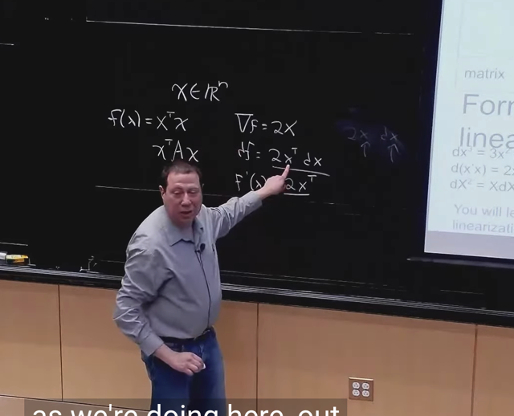</kbd>

 

- **Gradient và đạo hàm vector**

> [!NOTE]
> rồi với hàng thứ 2: case đầu tiên khi input là vector và output là scalar: Khi đó
> \\*gradient sẽ là vector\\* (gs cho rằng \\*khi nói vector\\* đương nhiên nên \\*ngầm
> hiểu nó là column vector\\*, bởi đó là quy ước), kí hiệu là \\*∇f\\* (kí tự tam giác
> ngược)
>
> Còn \\*derivative\\* thì sẽ là \\*ROW VECTOR\\*.
>
> Gs lấy ví dụ hàm \\*f = xTx\\* (tức f là phép dot product của hai vector x, cho ra
> \\*scalar\\* cái này biết rồi), thì:
>
> Gradient, như trên đã nói, sẽ là \\*2x\\*: là (column) vector.
>
> Nhưng \\*derivative sẽ là 2xT\\*, nguyên nhân có sự khác nhau này là bởi vì: khi
> thể hiện derivative của f w.r.t x: df = 2xTdx (*) là bởi:
>
> Vì \\*f là scalar\\* và \\*x là vector\\* (đang xét case input=scalar, output=vector),
> nên: Cách thể hiện trên sẽ hợp lí vì mang ý nghĩa thay đổi x một chút xíu - dx, thì
> đương nhiên dx cũng là (column) vector, khi đó thể hiện derivative là 2xT dx sẽ là
> hợp lí hơn về shape, khi dot product của hai vector nó sẽ ra  scalar
>
> Chứ nếu biểu thị là df = 2x dx thì không "thỏa mãn" về mặt toán học.
>
> CHỖ NÀY CHÍNH LÀ CHỖ MÀ TRONG CS224N, HAY ĐÃ TỪNG GẶP TRONG
> CÁC BÀI GIẢNG VỀ MACHINE LEARNING NÓI VỀ VIỆC TRONG MACHINE
> LEARNING TA KIỂU NHƯ QUY ƯỚC, HAY NGẦM HIỂU RẰNG\\* DERIVATIVE
> LÀ VECTOR (CỘT)\\*, CHỨ NẾU CHẶT CHẼ THEO TOÁN HỌC THÌ NÓ PHẢI
> LÀ ROW VECTOR.
>
> NHƯNG \\*ĐÂY ĐANG LÀ MỘT CLASS DẠY TOÁN\\*, ĐƯƠNG NHIÊN TA PHẢI
> TUÂN THỦ QUY TẮC TOÁN HỌC.
>
> (*) Chú ý, nhắc lại, gs đã nói ở phía trên là sẽ thể hiện "\\*derivative of f w.r. t x\\* ở
> dạng vi phân: \\*df = (...) dx\\* chứ không thể hiện ở dạng phép chia: df/dx = ... như
> hồi xưa học,  vì lí do đã nói ở trên)

**🔗 See also:** [Phương pháp tuyến tính hóa](#node-qho2d35)

 

- **Hình dạng của đạo hàm**

> [!NOTE]
> tiếp gs lưu ý, trong bảng trên, màu thể hiện dạng của derivative. Xanh
> lá là scalar, blue là vector: ta có hai case là khi derivative của vector w.
> r.t scalar, và derivative của scalar w.r.t vector. Màu hồng là matrix, đỏ
> là higher order array ,,,
>
> Vậy để ý, cũng như cái hàng 1 \\*(scalar -> scalar / vector / matrix, thì
> derivative cùng dạng với output)\\* thì,,
>
> thì cột 1 thể hiện: \\*scalar / vector / matrix -> scalar thì derivative cùng 
> dạng với  input. \\*Đây là case mà ta hay gặp trong machine learning khi
> Khi ta cần tính derivative của loss function (scalar) wrt params là vector,
> hay matrix

 

> [!NOTE]
> Tiếp, khi input là vector (ví dụ n-D vector) và output cũng vậy (ví dụ m-D
> vector) thì derivative sẽ là Jacobian matrix m,n
>
> Còn các case vector-> matrix, matrix-> vector và matrix-> matrix thì
> derivative sẽ là higher order array

 

<kbd>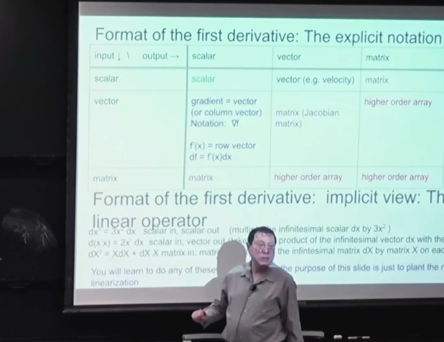</kbd>

 

> [!NOTE]
> đại khái là đoạn này giáo sư nói về một số kết quả đạo hàm (mà ta sẽ học để biết cách
> tính ra các công thức này sau).
>
> đầu tiên là dx^3 = 3x^2 dx: Một lần nữa, cần nhấn mạnh rằng, trong class này, ta sẽ
> biểu diễn \\*đạo hàm của f(x) đối với x\\* theo dạng vi phân: \\*df(x) =f'(x)dx\\*, thay vì
> \\*df(x)/dx = f'(x)\\*
>
> Thế thì ở đây ta có, hay đọc là derivative của x^3 w.r.t x là 3x^2. Vậy, gs kêu gọi ta nên
> hiểu điều này theo bản chất đó là:\\* ta thay đổi x một khoảng VÔ CÙNG NHỎ dx\\*
> (infinitesimal small) thì sẽ\\* khiến f(x) = x^3 thay đổi một khoảng bằng 3x^2 nhân với
> khoảng nhỏ đó: 3x^2 * dx
>
> \\*Để rồi ví dụ như mình đang ở x = 3, và ta\\* thay đổi x một khoảng NHỎ 0.0001\\*, thì
> công thức trên sẽ trở thành \\*linear\\* \\*approximation\\*: ∆f ~= f'(3)*∆x, cho mình biết\\*
> hàm f sẽ thay đổi xấp xỉ \\*một khoảng là \\*3*3^2 * 0.0001 (=0.0027)
>
> \\*Thử tính xem đúng không: f(3+0.0001) - f(3) = 3.0001^3 - 3^3 = \\*0.0027\\*0009
>
> =====
>
> Cái thứ hai là \\*d(xTx) = 2xTdx\\*
>
> Thế thì again, ta sẽ \\*hiểu nó theo bản chất\\*: ta thay đổi x, một khoảng vô cùng nhỏ,
> và vì ở \\*trường hợp này x là vector\\*, nên sự thay đổi vô cùng nhỏ của x, tức \\*dx
> đương nhiên cũng là vector\\*, mà mỗi phần tử là "sự thay đổi nhỏ" của phần tử tương
> ứng của x. Khi đó, hàm f sẽ thay đổi một khoảng bằng kết quả của \\*2*(dot product
> của vector x và vector dx)\\* và kết qủa cho ra một scalar là hoàn toàn đúng (vì f là
> scalar)
>
> =====
>
> Trường hợp thứ ba là khi ta có \\*f(X) = X^2 (X là matrix)\\*, (chú ý ở đây ghi X để chỉ
> input là matrix, không liên quan gì tới việc trong xác suất ta notate X là random
> variable) thì công thức đúng của derivative của f w.r.t X là (\\*XdX + dXX\\*). Gs nói rằng
> matrix \\*không có tính chất commutative\\* (ý là tính chất AB không bằng BA), nên
> không có lí do gì để  ưu tiên kết quả 2XdX hơn 2dXX nên câu trả lời đúng sẽ là XdX +
> dXX. Again, này chỉ là nói sơ, ta sẽ học cách tính các kết quả trên trong các bài sau.

 

<kbd>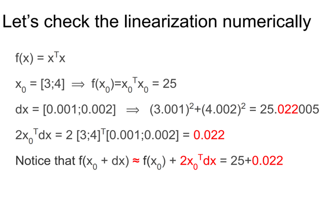</kbd>

> [!NOTE]
> Ví dụ này sẽ như ta có function f take input là một **2D vector x**, và
> tính ra scalar result thông qua phép **xTx**. Thế thì ta có thể kiểm
> chứng bằng **numerical gradient** rằng khi thay đổi **x một khoảng
> nhỏ** (việc này giống như thay đổi x một chút xíu trong không gian)
> để từ **x = [x1, x2]** thành **[x+dx1, x+dx2]**, hay, vector dx = [dx1,
> dx2] thì khi đó **quả thật khiến f thay đổi xấp xỉ bằng 2xTdx**

 

<kbd>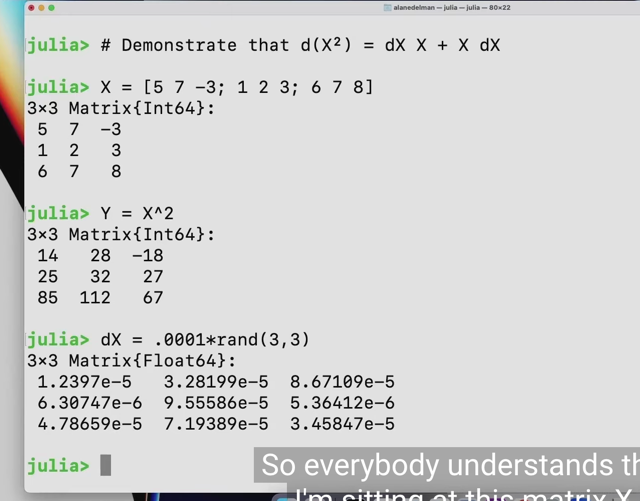</kbd>

> [!NOTE]
> gs sẽ minh họa, chứng minh d(X^2) = dX X + X dX, cho matrix
> X là matrix 3x3 như này, thì Y = f(X) sẽ là vầy

 

<kbd>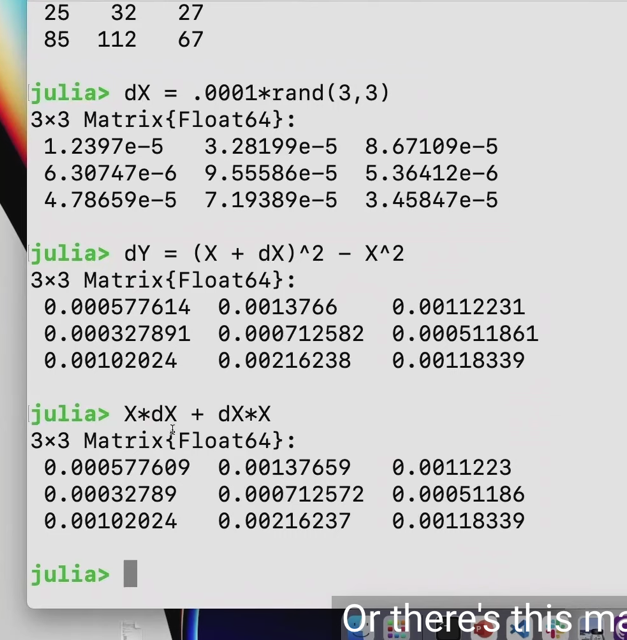</kbd>

> [!NOTE]
> thế thì kết quả dY (hay df(X)) sẽ là vầy, và khi tính X dX + dX X nó
> đúng cho thấy  kết quả xấp xỉ của dY. Còn khi tính 2XdX hay
> 2dXX đều ra sai. Vậy thôi, gs chỉ là minh họa cho thấy công thức
> đúng sẽ là dX^2  = (X dX + dX X) dX

 

<kbd>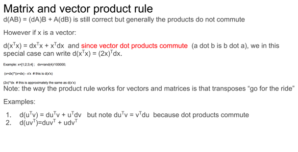</kbd>

> [!NOTE]
> đại khái là nói về việc công thức PRODUCT RULE **d(uv) = (du)v +
> u(dv)** hoặc **(uv)' = u'v + uv'** đã học hồi high school hoặc 1801,1801 đã
> được học, thì nó đúng với vector và **cũng đúng với matrix**:
>
>
>
> **d(AB) = (dA)B + A(dB)**
>
>
>
> Nhưng gs lưu ý là với **matrix** thì không có tính **commute**: **AB khác BA**.
>
>
>
> Tuy nhiên **nếu là dot product của hai vector**, thì vì **phép dot product
> có tính chất giao hoán**: **xTy = yTx** đều ra scalar. 
>
>
>
> Nên mới có trường hợp đặc biệt đó là **d(xTx) = (dxT)x + xT(dx) = 
> (dx)Tx + xTdx** 
>
>
>
> Tới đây, vì dx và x đều là vector (đương nhiên nói khơi khơi vector
> thì hiểu là column vector) nên dot product của chúng là scalar, thành ra
> **(dx)Tx cũng bằng xTdx
>
>
>
> Nên (dx)Tx + xTdx = 2(xTdx) = 2xTdx**

 

<kbd>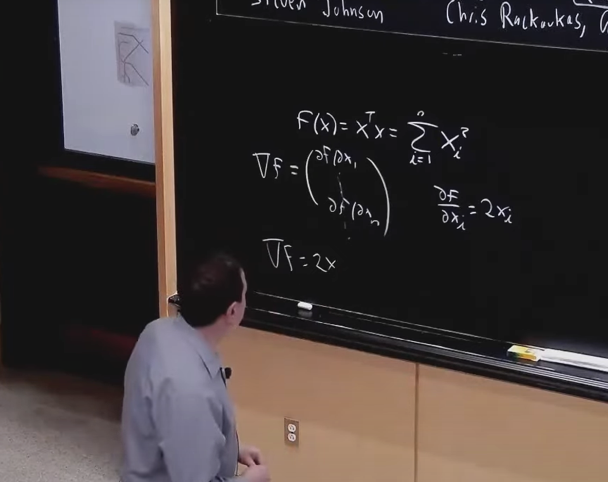</kbd>

> [!NOTE]
> đại khái là gs rằng dù ta có thể **diễn giải derivative của (xTx)** wrt x
> theo lối "**LÀM THEO TỪNG PHẦN TỬ**":
>
>
>
> vì **x** là **vector**, **f** là scalar, nên **derivative của f đối với x là
> vector (gọi là gradient vector)** mà các **components** của nó là các 
> **partial derivative của ∂f/∂x1, ∂f/∂x2**...
>
>
>
> ∇f = [∂f/∂x1, ∂f/∂x2...]
>
>
>
> Và từ f = xTx có kết qủa là **tổng i các x_i^2** nên partial derivative
> sẽ bằng **∂f/∂x_i = 2x_i**
>
>
>
> Từ đó suy ra derivative của f wrt x, tức ∇f = **2x**, hay **df = (2x)T dx.**
>
>
>
> ===
>
>
>
> Đại ý là tuy làm vậy không sai, nhưng với việc học **18s096**, ta có
> thể **tiếp cận bài tóan này một cách HOLISTICALLY**:
>
>
>
> d(xTx) = theo công thức **coi đây là d(uv) với u = xT, v = x**, ta sẽ dùng
> **PRODUCT RULE**: d(uv) = du*v + udv 
>
>
>
> **d(xTx) = d(xT)x + (xT)dx**
>
>
>
> mà d(xT) sẽ bằng (dx)T 
>
>
>
> Vì **d(xT)** mang ý nghĩa là **khoảng thay đổi nhỏ của vector xT**, mà 
> **xT là row**, nên **d(xT) cũng là row** vector. Thế thì nó cũng chính là 
> **lấy vector dx** - là column vector chứa các khoảng thay đổi nhỏ của x, 
> **đem transpose** -> (dx)T. Vậy nên d(xT) = (dx)T
>
>
>
> Do đó tiếp nối trên ta có = (dx)Tx + (xT)dx.
>
>
>
> Tiếp, cả (dx)Tx và (xT)dx đều là dot product của vector dx và x
> thành ra chúng là một. Nên ta có 2(xT)dx
>
>
>
> Và ta có thể đưa scalar vào dấu transpose để thành **(2x)T dx**
>
> Đang ôn tập nên mình ghi luôn cách làm mà gs Crish sẽ nói ở
> bài sau
>
>
>
> f(x+dx) - f(x) = (x+dx)T(x+dx) - xTx = (xT + dxT)(x + dx) - xTx 
>
>
>
> = xTx + xTdx + dxTx + dxTdx - xTx
>
>
>
> = **2xT**dx => df = 2xTdx thì những gì gắn với dx chính là rate
> of change giữa f và x, Do đó 2xT chính là derivative của f với x
> và gradient chính là transpose của cái đó
>
>
>
> => ∇f = 2x

 

<kbd></kbd>

> [!NOTE]
> Câu hỏi là nếu mình có **n inputs** và **m outputs** thì để thể hiện
> derivatives của mọi outputs w.r.t mọi input thì ta sẽ cần bao nhiêu:
> con số? -> **m*n**

 

<kbd>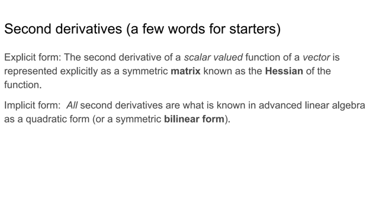</kbd>

> [!NOTE]
> đại khái gs nói là nếu ta có vector input và vector output, thì
> derivative là **Jacobian** **matrix** như đã biết.
>
>
>
> Nhưng nếu input là vector và output là scalar, thì 1st order
> derivative sẽ là vector nhưng second order derivative cũng
> là matrix, gọi là **Hessian**.
>
>
>
> Thế thì gs nói rằng mọi **second derivative** được biết đến trong
> **đại số tuyến tính cao cấp** dưới tên gọi **quadratic form**

 

