# Lec 2 Part 1: Derivatives In Higher Dimensions: Jacobians And Matrix Functions

📊 **Progress:** `20` Notes | `20` Screenshots

---

## Lec 2 Part 1: Derivatives In Higher Dimensions: Jacobians And Matrix Functions

> [!NOTE]
> LEC 2 PART 1: DERIVATIVES IN HIGHER DIMENSIONS:
> JACOBIANS AND MATRIX FUNCTIONS

 

<kbd>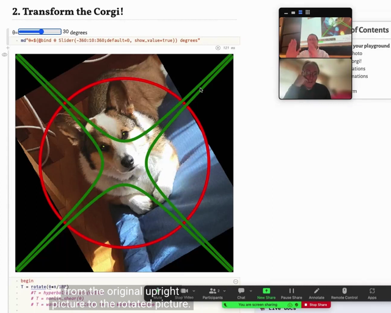</kbd>

> [!NOTE]
> gs đặt câu hỏi là khi thực hiện phép biến đổi
> từ Rn -> Rm thì n, m là cái gì?

 

<kbd>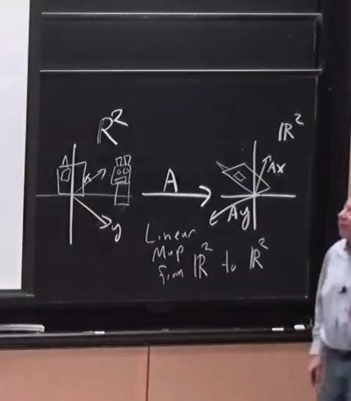</kbd>

> [!NOTE]
> có thể tóm tắt những phút đầu như sau: gs nhắc lại
> một thứ (sẽ học trong 18.06) đó là matrix A có thể
> được hiểu như một phép biến đổi không gian.
> Thông qua A, x được biến đổi sang không gian hệ
> trục khác.
>
>
>
> Nên hình ảnh trong cuốn sách của thầy Strang
> trong những version trước đó là những ngôi nhà
> ngả nghiêng có thể là minh họa của phép biến đổi
> tuyến tính

 

<kbd></kbd>

 

<kbd>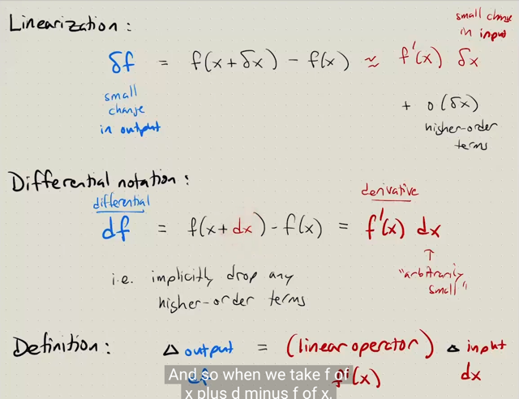</kbd>

> [!NOTE]
> Tiếp đại khái là gs ôn lại lần nữa về khái niệm của derivative. Đó là: ta
> có một hàm số bất kì f(x). Và khi ta thay đổi x một khoảng nhỏ kí hiệu
> bởi **δx**, thì khoảng thay đổi của hàm số δf **CÓ THỂ ĐƯỢC
> XẤP XỈ** bởi một biểu thức trong đó bao gồm
>
>
>
> i) một **hàm tuyến tính tính đối với δx**, gọi là **linear operator** và
> linear operator này là: NHÂN δx VỚI MỘT SCALAR HOẶC MATRIX  f'
> (x)
>
>
>
> ii) một **phần dư** là **hàm bậc cao của δx**, có tính chất o (δx) tức là
> giá trị của chúng sẽ giảm về 0 còn nhanh hơn khi δx giảm về 0
>
>
>
> Thế thì khi **thay khoảng thay đổi nhỏ δx bằng khoảng thay đổi vô
> cùng nhỏ dx**, thì ta sẽ có thể **bỏ đi phần dư** này để ra có công
> thức vi phân **df = f'(x)dx**
>
>
>
> Và do đó ta có định nghĩa **derivative**: là **linear operator tác dụng
> lên khoảng thay đổi nhỏ của x**

 

<kbd>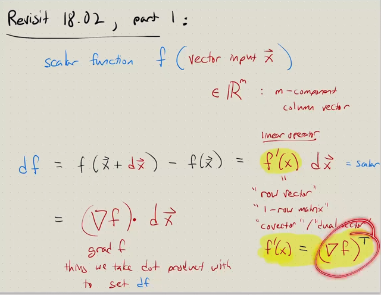</kbd>

> [!NOTE]
> và nhắc lại một điểm quan trọng, **nếu f là scalar function** của vector x 
> thì l**inear operator, act on dx** (là một vector), vì cũng **phải cho ra một 
> scalar df** nên linear operator này phải là: **dot product của dx với một
> row vector**. Do do **f'(x) là một row vector**.
>
>
>
> Và ta sẽ gọi cái vector có được khi dựng dọc cái row vector f'(x) là
> là ∇f, đọc là **grad f**

 

<kbd>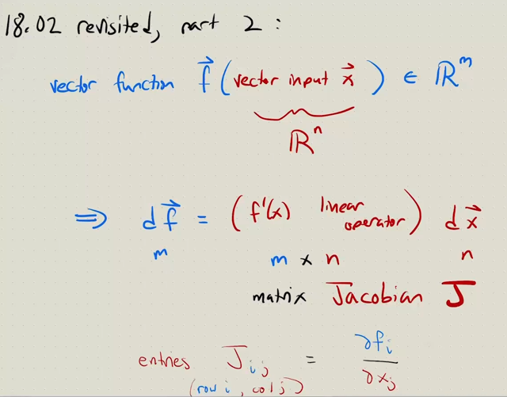</kbd>

> [!NOTE]
> tiếp nối bài trước, gs ôn lại một **định nghĩa derivative** khi **hàm f
> output ra vector Rm** và **input x cũng là vector Rn**
>
>
>
> Thế thì, khi đó, như đã biết vector x thay đổi một chút, thể hiện bởi Rn
> vector dx, sẽ dẫn đến sự thay đổi nhỏ của các phần tử f, tức df cũng
> là vector Rm.
>
>
>
> Vậy thì, như định nghĩa, df sẽ là một **linear operator áp dụng lên
> dx**. Thì để từ Rn vector cho ra Rm vector thì **LINEAR OPERATOR
> ĐÓ PHẢI LÀ NHÂN VỚI MATRIX (m, n)**
>
>
>
> Vì như vậy THÌ MỚI MAP TỪ INPUT LÀ Rn VECTOR VỚI OUTPUT
> LÀ Rm VECTOR ĐƯỢC
>
>
>
> Và matrix đó được gọi là **Jacobian J**, **f'(x) trong case này là J**
>
>
>
> ===
>
>
>
> Gs cũng cho rằng ta có thể **gặp cách diễn đạt theo entries** của
> Jacobian matrix J: **J_ij = ∂f_i / x_j**

 

<kbd>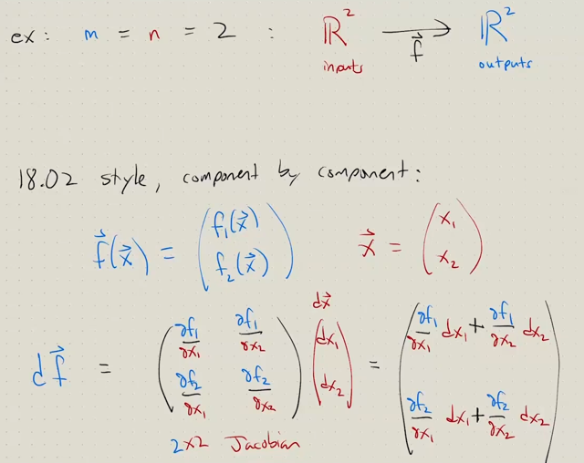</kbd>

> [!NOTE]
> tiếp, đại khái là gs sẽ cho ta thấy **cách làm COMPONENT BY
> COMPONENT** khi thể hiện derivative của một hàm f có output là
> vector, input là vector vừa nói. Mục đích là cho thấy cách tiếp cận này
> trong 18.02 **tuy đúng**, nhưng chốc nữa ta sẽ thấy **cách tiếp cận Holistic
> của 18.096 sẽ tốt hơn**
>
>
>
> Thế thì hàm f là hàm apply một function (có thể ko tuyến tính) lên
> vector input x, để có vector output f.
>
>
>
> Thì theo phong cách component by component, ta sẽ **thể hiện f là
> vector có mỗi phần tử là một hàm của x:** **[f1(x), f2(x)]** 
>
>
>
> và df sẽ bằng Jacobian matrix nhân với vector dx.
>
>
>
> **Hàng thứ nhất** của J là **vector partial derivative của f1 đối với x**:
>
>
>
> [∂f1/∂x1, ∂f1/∂x2 ....]
>
>
>
> **Hàng thứ hai** của J là **vector partial derivative của f2 đối với x.**
>
>
>
> [∂f2/∂x1, ∂f2/∂x2 ....]
>
>
>
> Và df là kết quả phép nhân J với dx, dx = [dx1, dx2, ....]
>
>
>
> để rồi component thứ 1, tức df1 sẽ là hàng 1 của J dot product dx:
>
>
>
> df1 = <∂f1/∂x1, ∂f1/∂x2 ....>.<dx1, dx2, ....> = ∂f1/∂x1 dx1 + ∂f1/∂x2 dx2 ....
>
>
>
> <=> **df1 = ∂f1/∂x1 dx1 + ∂f1/∂x2 dx2 ....** Đây chính là VI PHÂN TOÀN
> PHÂN (TOTAL DIFFERENTIAL) CỦA f1, thể hiện mọi đóng góp của
> dx1, dx2...dxn vào sự thay đổi của f1, tức df1
>
>
>
> Tương tự df2 = <∂f2/∂x1, ∂f2/∂x2 ....>.<dx1, dx2, ....>
>
>
>
> <=> **df2 = ∂f2/∂x1 dx1 + ∂f2/∂x2 dx2 ....**
>
>
>
> Vậy thì nhận xét, là, thực ra ta không lạ gì, vì đây chính là cách "diễn
> đạt" quen thuộc trước giờ của mình khi nói về derivative của một
> vector w.r.t vector Và những lớp như cs224n, cũng dùng cách diễn đạt
> này.
>
>
>
> Tuy nhiên gs **cho rằng ta rất sớm** sẽ thấy **cách làm này dù đúng trở
> nên kì cục và phức tạp**

 

<kbd>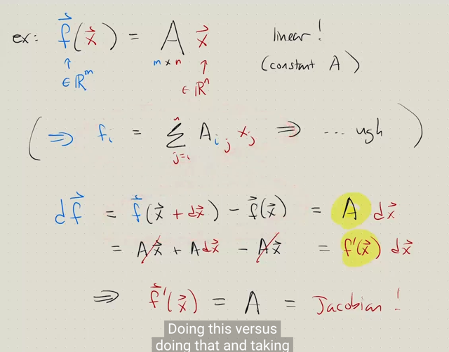</kbd>

> [!NOTE]
> rồi, một ví dụ nữa, **f(x) (Rm)** là hàm tuyến tính đối với x (Rn) cụ thể
> là **f(x) = Ax**. Và qua ví dụ này **ta sẽ thấy ví dụ như tính derivative của
> hidden vector z = Wx rất dễ (=W)**
>
>
>
> Đầu tiên gs đề nghị ta **để ý đây là hàm tuyến tính** - biến đối vector x
> qua matrix A, là một **linear transformation** (kiến thức này thầy Strang
> nói đến trong 18.06)
>
>
>
> Thế thì, gs cho biết, nếu là cách tiếp cận "component by
> component" như 18.02, thì đầu tiên ta sẽ lại **thể hiện vector f theo lối
> đó là từng phần tử của nó là gì** 
>
>
>
> ví dụ f_i sẽ là **Σ j A_ij*x_j**,...
>
>
>
> để rồi từ đó define df_i/dx sẽ là vector mà mỗi phần tử là đạo hàm của f_i
> đối với từng phần tử của x: df_i/dx_j và chính là bằng A_ij
>
>
>
> Và từ đó sẽ **cho thấy rằng kết quả là một matrix** mà **phần tử df/dx_ij
> chính là A_ij**. Hay, đi đến kết quả **JACOBIAN MATRIX CHÍNH** **LÀ A**
>
>
>
> ====
>
>
>
> Nói chung là rất rườm rà, dù ko sai. Trong khi cách tiếp cận của 18.096 
> mang tính toàn diện hơn nhièu:
>
>
>
> Đó là define vi phân **df = f(x+dx) - f(x) = A(x+dx) - Ax = Adx**
>
>
>
> từ đó **A CHÍNH LÀ f'(x) VÀ LÀ JACOBIAN MATRIX**

 

<kbd>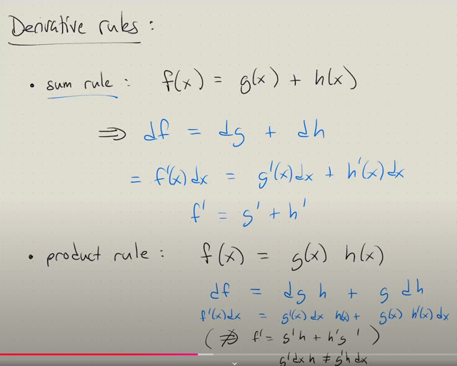</kbd>

> [!NOTE]
> tiếp theo gs trình bày về derivative rules: 
>
>
>
> Với sum rule: **f(x)  = g(x) + h(x)**  thì **df = dg + dh.**
>
>
>
> Gs cho rằng cái này **không cần chứng minh** vì chắc ko ai thắc mắc,
> nhưng ta cứ thử làm theo cách làm học được đến giờ xem:
>
>
>
> Thế thì df = f(x+dx) - f(x) = [g(x+dx) + h(x+dx)] - [g(x) + h(x)]
> = g(x+dx) + h(x+dx) - g(x) - h(x)
>
>
>
> Và g(x+dx)-g(x) theo định nghĩa derivative dg = g(x+dx)-g(x) = g'(x)dx
> nên **g(x+dx)-g(x) = g'(x)dx**. 
>
>
>
> Tương tự **h(x+dx)-h(x) = h'(x)dx**
>
>
>
> Vậy viết tiếp ở trên: 
>
>
>
> df = g'(x)dx + h'(x)dx  = [g'(x) + h'(x)]dx
>
>
>
> Và như đã nói df liên hệ với dx qua [g'(x) + h'(x)] thì đó chính là rate
> of change, là derivative của f đối với x. Vậy f'(x) chính là **g'(x) + h'(x)**

 

<kbd>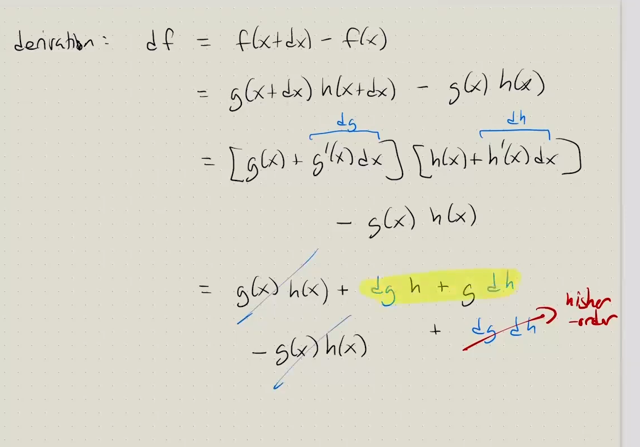</kbd>

> [!NOTE]
> Với product rule: f(x) = **g(x)h(x)**
>
>
>
> df = f(x+dx) - f(x) = g(x+dx)h(x+dx) - g(x)h(x)
>
>
>
> và g(x+dx)-g(x)=g'(x)dx nên g(x+dx)=g(x)+g'(x)dx
> tương tự h(x+dx)=h(x)+h'(x)dx
>
>
>
> từ đó ta có df = [g(x)+g'(x)dx][h(x)+h'(x)dx] - g(x)h(x)
>
>
>
> Ta có thể ghi g'(x)dx gọn là dg, h'(x)dx là dh
>
>
>
> = g(x)h(x) + dg*h(x) + g(x)*dh + dg*dh - g(x)h(x)
>
>
>
> = dg*h(x)+g(x)*dh - dgdh
>
>
>
> và dgdh là higher order term nên như đã biết ta có thể bỏ
>
>
>
> vậy kết quả là **df = dg*h + g*dh**
>
>
>
> và **PHÉP NHÂN Ở ĐÂY CÓ THỂ LÀ ELEMEN-WISE 
> HOẶC MATRIX MULTIPLICATION**
>
>
>
> Và gs chú ý rằng, ta **không thể chia hai vế cho dx** kiểu này:
>
>
>
> df = dg*h - g*dh <=> f'(x) dx = g'(x) dx h(x) + g(x) h'(x) dx
>
>
>
> <=> f'(x) dx = g'(x) h(x) dx + g(x) h'(x) dx
>
>
>
> <=> f'(x) dx = [g'(x) h(x) + g(x) h'(x)] dx
>
>
>
> <=> **f'(x) = g'(x)h(x) + g(x)h'(x)
>
>
>
> Điều này là sai, vì g'(x)dxh(x) không bằng g'(x)h(x)dx**

 

<kbd>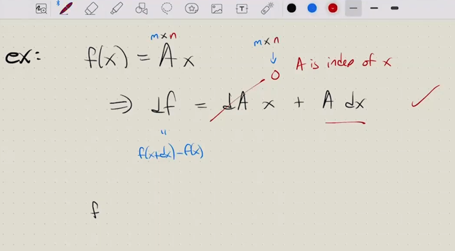</kbd>

> [!NOTE]
> và công thức product rule có thể **dùng để tính lại df của f = Ax**, đó là:
>
>
>
> d**f = dA x + A dx**. Mà **dA bằng 0**, vì A là constant, không phụ thuộc x nên
> kết quả ta có **df = A dx**
>
>
>
> Thầy Alan hỏi rằng trong case này shape của 0 (ý là dA) là gì:
>
>
>
> Me: vì trong trường hợp này, ta coi f là tích của g(x), h(x) với **g(x) = A**
> (tức là hàm này là hàm hằng, không phụ thuộc x, luôn luôn bằng A), và
> h(x) = x
>
>
>
> Nên **dA** là đang "ý nói" **dg**, tức đạo hàm của g đối với x. Vậy thì
> shape của **dA là shape của g**, hay A = là **matrix (m, n**) và ta có matrix
> **m,n toàn zero**

 

<kbd>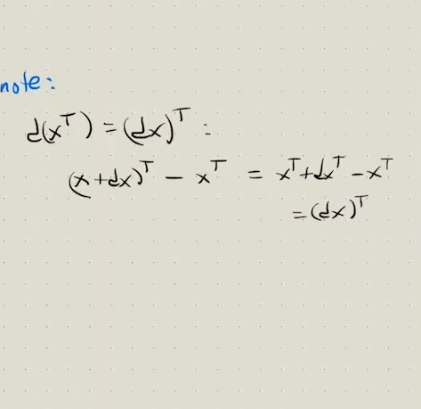</kbd>

> [!NOTE]
> chỗ này khá thú vị khi gs cho rằng nhiều người sẽ cứ
> bối rối chỗ tại sao **d(xT) = (dx)T**
>
>
>
> Thế thì theo thầy Alan đơn giản chỉ cần hiểu là ta có
> **vector x đang là column**, ta mới **lật ngang lại (xT)**,
> và **perturb mỗi component** của nó một  chút, thì ta
> **sẽ có một vector d(xT)** **nằm ngang**
>
>
>
> mà kết quả cũng chỉ là **ta perturb vector x trước**
> thành **dx** rồi l**ật nó lại (dx)T**.
>
>
>
> Nên **d(xT) = (dx)T**
>
>
>
> Còn thầy Steve thì ta có thể triển khai như đã biết ra,
> coi hàm f(x) = xT
>
>
>
> thì df = **d(xT)** = (x+dx)T - xT = xT + (dx)T - xT =
> **(dx)T**
>
> d(xT) = (dx)T

 

<kbd>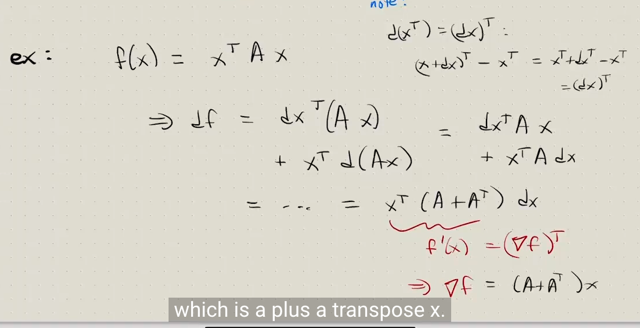</kbd>

> [!NOTE]
> và ta lại **revisit f(x) = xTAx** để tính df nhưng lần này ta **dùng product
> rule** để xem nó có ra **df = xT(A+AT)dx** như làm bữa trước không
>
>
>
> Thế thì thầy nói để dùng product rule với case này có **3 component**
> thì **chỉ việc làm từng cặp**. tức là coi **f(x) = xT(Ax)**
>
>
>
> vậy ta nhớ f**(x) = g(x)h(x)** thì **df =** **dg*h + g*dh**
>
>
>
> => df = d(xT) (Ax) + xT d(Ax). Mà **d(xT) = (dx)T** như vừa nói xong.
>
>
>
> => df = (dx)T Ax + xT d(Ax) Và **d(Ax) = Adx** như nãy mới làm
>
>
>
> => **df = (dx)TAx+xTAdx**
>
>
>
> Tới đây lại dùng cái trick hồi bữa đó là vì **dxTAx là scalar** (shape sẽ
> là (1,n)(n,n)(n,1) = 1) thành ra có thể **tùy ý transpose nó**
>
>
>
> df = (dxTAx)T + xTAdx = xTATdxTT + xTAdx = xTATdx+xTAdx = ..
>
>
>
> = **xT(AT+A)dx**
>
>
>
> Nếu có khó hiểu thì chỉ là dùng công thức **(AB)T = BTAT**: 
>
>
>
> (dxTAx)T = {[dxTA]x}T = xT[dxTA]T = xT[ATdxTT] = xTATdxTT
>
> tính df của f = xTAx nhưng lần
> này ta dùng product rule

**🔗 See also:** [linked note](./lec_1_part_2_derivatives_as_linear_operator.md#node-7chmfet)

 

<kbd>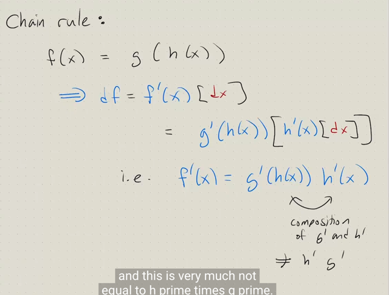</kbd>

> [!NOTE]
> tiếp theo là chain rule: **f(x) = g(h(x))**
>
>
>
> lập luận thế này:
>
>
>
> Như đã nói **df = f'(x)dx** (0)
>
>
>
> Thế thì f'(x) là gì thì tạm để đó đã.
>
>
>
> Ta sẽ bắt đầu với equation **f(x) = g(h(x))** (1)
>
>
>
> => **df(x) = dg(h(x))** (4)
>
>
>
> Và theo định nghĩa **dg(h)** **= g'(h)dh** (2)
>
>
>
> rồi, tiếp theo ta tìm **dh**: Theo định nghiã **dh(x) = h'(x)dx** (3)
>
>
>
> Vậy thế (2) (3) vào (4): **df(x)** **= dg(h(x))** **= g'(h)dh =  g'(h) h'(x)
> dx**
>
>
>
> Và từ (0) ta có **df** = f'(x)dx = **g'(h(x)) h'(x) dx**
>
>
>
> "Chia hai vế" **cho dx** ta còn: **f'(x) = g'(h(x)) h'(x)**
>
>
>
> (Sở dĩ để chia hai vế trong dấu "", là bởi ta nên lập luận là vì df =
> something dx => something đó chính là derivative của f wrt x)Và gs nhấn mạnh phép nhân ở đây là thực chất là **COMBINE HAI
> LINEAR OPERATOR**, giống như L1 (L2 v) thì tức là ta apply linear
> operator L1 v trên kết quả của L2 v. Do đó **không được thay đổi thứ
> tự thành h'(x) g'(h(x))**
>
> Thật ra ta có thể **triển khai theo định nghĩa của derivative** để có 
> thể thấy rõ **công thức chain rule** này (Gs không làm nhưng ta có 
> thể tự làm để hiểu)
>
>
>
> df = f(x+dx) - f(x) = g(**h(x+dx)**) - g(h(x)) 
>
>
>
> Thế thì dh = h'(x)dx = h(x+dx) - h(x)  
>
>
>
> nên **h(x+dx) = dh(x) + h(x)**
>
>
>
>  => df= g(**h(x) + dh(x)**) - g(h(x)) =
>
>
>
> Tiếp ta có g(h + dh) - g(h) = dg(h) => **g(h +dh) = g(h) + dg(h)**
>
>
>
> => df = g(h) + dg(h) - g(h) = **dg(h)** 
>
>
>
> dg(h) = g'(h)dh, và dh = h'(x)dx
>
>
>
> df = g'(h) dh = **g'(h) h'(x) dx**
>
> Lập luận về Chain-Rule
>
> Derive công thức Chain-Rule
> theo 18s096

 

<kbd></kbd>

> [!NOTE]
> tới đây gs dừng lại tí để hỏi rằng khi tính **derivative của f(x) = sin(x^2)** ta
> có thể tính theo 2 cách
>
>
>
> Thế thì mục đích là gs nói về việc một thứ mà có liên hệ tới kiến thức ta
> vừa học được trong chapter 6 của **Deep Learning** **Yoshua Bengio**
> trong đó gs có nói đến việc "đôi khi người ta dùng **Forward mode**
> trong **Automatic Differentiation**" trong những bài toán mà số output
> nhiều hơn số input.
>
>
>
> Thì ở đây gs cho biết đó chính là khi bạn có thể **tính h'(x) trước** hay
> là **tính g'(h(x)) trước** trong f'(x) = g'(h(x)) . h'(x) nó nôm na cho
> **Reverse** mode và **Forward** mode Automatic differentiation mà gs
> Bengio nói đến

 

<kbd>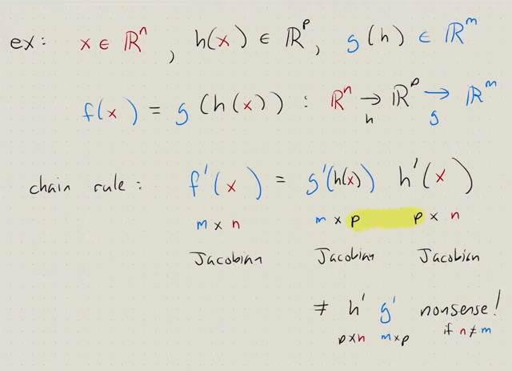</kbd>

> [!NOTE]
> gs lấy ví dụ này khi **các g(h), h(x) đều là vector function**, để cho thấy
> **ta sẽ phải đặt g' h' theo thứ tự** vì nếu không matrix shape sẽ không
> **compatible** vì yêu cầu phải là mxp pxn = mxn, chứ pxn mxp ko
> compatible
>
>
>
> Mà ngay cả khi nhân được trong trường hợp m = n thì kết quả nó cũng
> là sai

 

<kbd>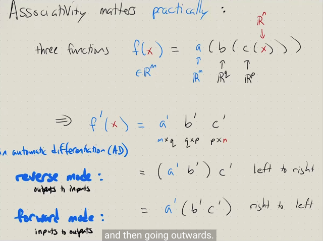</kbd>

> [!NOTE]
> và ví dụ này khi ta có **a(b), b(c), c(x)** để minh họa cho **Reverse
> mode** và **Forward mode** trong **Automatic Differentiation**
>
>
>
> Đây chính là cái nói trong **chapter 6 của Deep Learning Yoshua
> Bengio**.
>
>
>
> Và kiến thức toán học ở đây, đó là **tuy ta không thể thay đổi thứ tự**
> của a' b' c' **NHƯNG** T**A CÓ THỂ THAY ĐỔI VỊ TRÍ DẤU ( )
> PARENTHESIS**
>
>
>
> - **ĐỂ TÍNH a' b' TRƯỚC** rồi nhân (a' b') c': Đây là **REVERSE**
> **MODE** là bởi khi tính toán f, ta phải tính c trước, rồi đến b, rồi đến a,
> nên việc nhân a' b' rồi mới nhân kết quả với c' chính là reverse. Đây
> cũng chính là **back-propagation**.
>
>
>
> -  **HOẶC TÍNH (b' c') trước** rồi mới nhân a' (b' c'): Đây là
> **FORWARD MODE**

 

<kbd>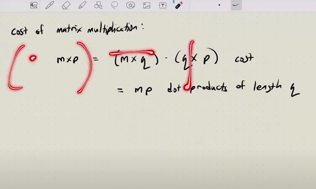</kbd>

> [!NOTE]
> Khi nhân matrix **(m, q) (q, p)** thì ta sẽ **tính tổng cộng mp phép tính
> dot product**, mà mỗi phép tính là giữa hai vector **có length q**
>
>
>
> Ở đây ta có thể nhớ lại từ 1806 ta có 4 cách nghĩ về việc nhân 2 matrix
> AB
>
>
>
> 2) A nhân với các cột của B: Trong góc nhìn này, mỗi cột b_j của B khi
> nhân với A (A*b_j) sẽ là linear combination của các A's columns với
> coefficient là vector b_j. Và với p cột của B thì ta có p linear
> combination như vậy để ra p coumns của matrix AB
>
>
>
> 3) Các hàng của A nhân với B: Trong góc nhìn này, mỗi hàng a_i của A
> khi nhân với B (a_i*B) sẽ là linear combination của các B's rows với
> coefficients là vector a_i, đương nhiên kết quả cho ra một row. Và m
> row của A sẽ tạo m linear combination như vậy, để tạo ra m rows của
> matrix AB
>
>
>
> 1) Hàng của A, dot product với cột của B. Cách này là cách mà thầy
> Strang cho là ở level thấp nhất.
>
>
>
> 4) Cách thứ tư là outer product giữa cột của A và hàng của B, để AB
> hóa ra là tổng của các rank 1 matrix
>
>
>
> Đó là xét từng phần tử của matrix AB sẽ là phép dot product của mỗi
> hàng của A với mỗi cột của B. Và đó là **phép dot product giữa hai
> vector có q components. Và trong bài này thì gs Steve đang nói
> về cách nghĩ thứ 3 này khi nhân A B**

 

<kbd>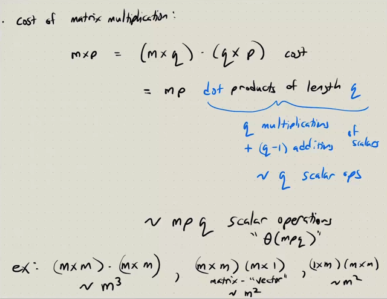</kbd>

> [!NOTE]
> thế thì mỗi phép dot product giữa hai vector có q component, dễ hiểu
> là sẽ "xảy ra" **q phép nhân** hai scalar, và **q-1 phép cộng hai
> scalar**
>
>
>
> Thành ra có thể **xấp xỉ nó là q "scalar" operation** trong computer.
>
>
>
> Vậy thì sẽ có **xấp xỉ m*p*q scalar operation trong phép nhân hai
> matrix (m,q) (q,p)**. Và trong computer science như đã học ở cs50, ta có
> gọi số operation cần thiết sẽ **tăng theo O(mpq)**
>
>
>
> Thế thì:
>
>
>
> Nếu là (**m,m)(m,m) thì sẽ tốn m^3 operation**, nhưng **nếu một
> matrix là vector thì chỉ tốn m^2**

 

<kbd>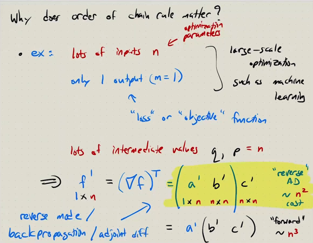</kbd>

> [!NOTE]
> Gs Alan giải thích lại chính xác những gì gs Josua đã nói trong DL book,
> khi trong **machine learning** ta thường điển hình là **làm việc với một loss
> function (scalar function)** tính toán từ **hàng tỉ parameters** (của nn, để
> output ra prediction, và cùng với label để tính ra loss) Và nn có kiến trúc là
> các intermediate layer, khiến model cũng **như một "composite" function f
> = a(b(c(x))**
>
>
>
> Thế thì ta **cần tính gradient của f wrt x (x ở đây là parameters)**
>
>
>
> Thì như vừa mới hiểu về **cost** của matrix multiplication giúp ta thấy rõ
> rằng **trong trường hợp này việc tính theo "reverse mode" sẽ chỉ tốn
> compute cost tỉ lệ theo bình phương của số tham số n^2**, trong khi nếu tính
> theo **forward mode thì cần chi phí tỉ lệ theo n^3**.
>
>
>
> Và **reverse mode**, như nãy đã nói, chính là có tên khác là **back-propagation**.
>
>
>
> Thế thì gs nhấn mạnh khi hiểu vậy rồi, ta sẽ thấy **back-propagation chỉ là
> việc ta NHÂN CÁC JACOBIAN MATRIX THEO CHIỀU TỪ TRÁI SANG
> PHẢI CỦA CÔNG THỨC f' = a'(b) b'(x) c'(x)**

 

