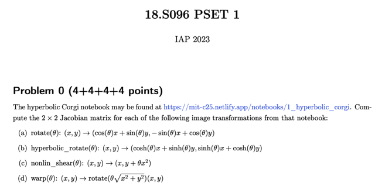
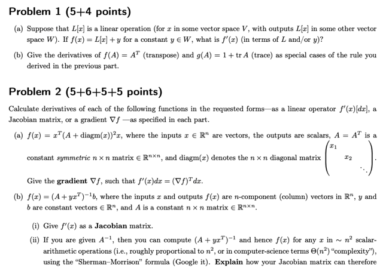
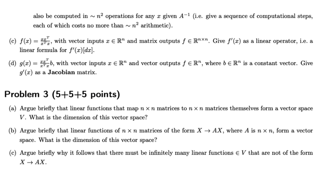

# Problem Sets 1

📊 **Progress:** `0` Notes | `3` Screenshots

---

 

## Ma trận Jacobian phép biến đổi

<kbd></kbd>

**🔗 See also:** [Đạo hàm của Matrix(x)x](./lec_3_part_1_kronecker_products_and_jacobians.md#node-9pbsyga)

 

### Đạo hàm ma trận

<kbd></kbd>

 

#### Ánh xạ tuyến tính ma trận

<kbd></kbd>

 

##### Solutions Link

 

