# 10.1 Least-square problem

📊 **Progress:** `11` Notes | `13` Screenshots | `9` AI Reviews

---

> [!NOTE]
> 10.1 Least-square problem

 

## Bài toán Least-Squares

<kbd>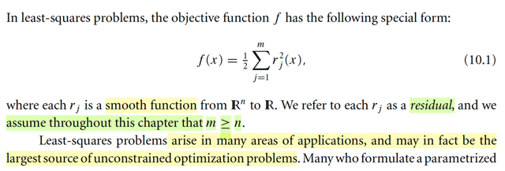</kbd>

<kbd>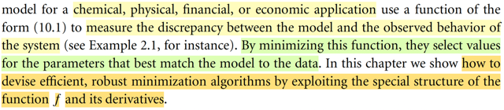</kbd>

> [!NOTE]
> Đầu tiên, gs giới thiệu bài toán least-square là bài toán tối ưu mà objective function của nó có dạng f(x) = (1/2) Σj rj(x)^2 với rj là smooth R^n → R function, được gọi là residual (phần dư).
>
>
>
> Đây là bài toán rất phổ biến xuất hiện ở rất nhiều lĩnh vực.
>
>
>
> Và chương này mình sẽ học các thuật toán mạnh mẽ để giải bài toán này

**🔗 See also:** [The Gauss-Newton Method](./103_algorithms_for_nonlinear_least_squares_problem.md#node-76os6gb)

 

### Đạo hàm bình phương tối thiểu

<kbd>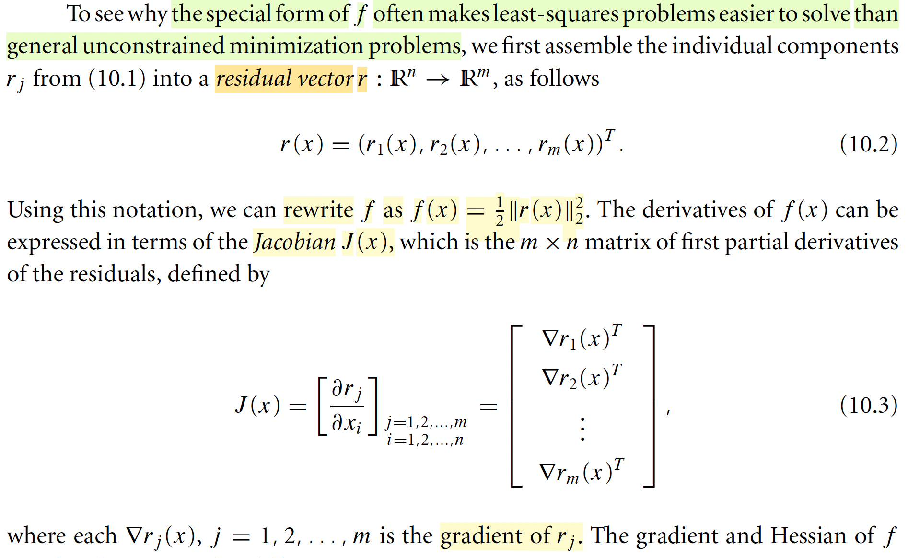</kbd>

> [!NOTE]
> Đại khái là gs nói rằng ta sẽ thấy tại sao dạng đặc biệt của f thường sẽ khiến
>
> cho bài toán least-squares dễ giải hơn là bài toán unconstrained minimization
>
> problem chung chung.
>
>
>
> Thế thì, nhớ là trong bài toán này, objective là (1/2) Σi \[ri(x)\]^2, tức là tổng của
>
> bình phương residual ri(x). Bằng cách gom chúng lại thành vector r(x) = \[r1(x),
>
> r2(x),....\]T, thì Σi \[ri(x)\]^2 có thể thể hiện bởi (1/2) ||r(x)||^2, cũng là f(x) = (1/2)
>
> r(x)T r(x)
>
>
>
> Vậy thì, một điểm mình cần hiểu, f(x) là vector → scalar function. Nên
>
> derivative của f(x) đối với x là gradient vector có các phần tử là partial
>
> derivative ∇f(x) = (∂f/∂x1,...,∂f/∂xn)
>
>
>
> Nhưng ở đây gs nhắc đến Jacobian, thì đang nói về đạo hàm của hàm R^n
>
> vector → R^m vector r(x), là matrix mà hàng i của nó là vector các partial
>
> derivative (∂ri(x)/∂x1, ∂ri(x)/∂x2,....∂ri(x)/∂xn), dĩ nhiên, cũng chính là gradient
>
> vector ∇ri(x)

> [!TIP]
> **🤖 AI Feedback** — ⚠️ Score: **75/100**
>
> Bài làm thể hiện sự hiểu biết sâu sắc về mối quan hệ giữa hàm mục tiêu least-squares, vector dư và ma trận Jacobian. Tuy nhiên, cần chú ý hơn đến tính chính xác trong ký hiệu, đặc biệt là khi định nghĩa các hàng của Jacobian liên quan đến chuyển vị của vector gradient.

**🔗 See also:** [Optimal x* Solution](./102_linear_least_square_problem.md#node-4qw5hsw)

 

#### Gradient và Hessian của f(x)

<kbd>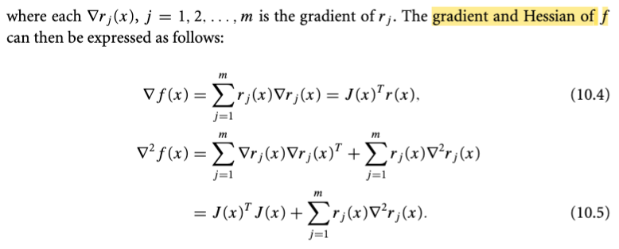</kbd>

> [!NOTE]
> Thế thì ta có f(x) = (1/2) r(x)Tr(x) và J(x) là d/dx r(x).
>
>
>
> d/dx f(x) = (1/2) d/dx \[r(x)Tr(x)\]
>
>
>
> = (1/2) { d/dr(x) \[r(x)Tr(x)\] } . d/dx r(x) (Chain-rule)
>
>
>
> Tạm dừng chút xíu, xét hàm g(x) = xTx. Tính đạo hàm nhanh theo cách làm của MIT 18s096: dg(x) = (x+dx)T(x+dx)-xTx = (xT+dxT)(x+dx)-xTx = xTx+dxTx+xTdx+dxTdx-xTx = 2xTdx+dxTdx = 2xTdx (bỏ term bậc cao) ⇨ ∇g(x) = 2x.
>
>
>
> Quay lại đây, dùng kết quả vừa rồi ta có:
>
>
>
> ... = (1/2) 2r(x) . J(x) = r(x) . J(x) (dấu . là kí hiệu hàm hợp)
>
>
>
> Tiếp, vì f(x), như đã nói là vector → scalar function, nên ∇f(x) dĩ nhiên là vector R^n, nên kết quả sẽ là J(x)Tr(x) (có shape \[m,n\]T\[m,1\] = \[n,m\]\[m,1\] = \[n,1\].
>
>
>
> Nên ∇f(x) = J(x)Tr(x) là công thức 10.4 trong sách là vậy.
>
>
>
> ---
>
>
>
> Còn Hessian của f(x), thì cũng là d/dx ∇f(x)
>
>
>
> = d/dx \[J(x)Tr(x)\]
>
>
>
> Xét d/dx \[J(x)Tr(x)\] = d/dx \[Σi \[cột i của J(x)T\] ri(x)\]
>
>
>
> = Σi d/dx {\[cột i của J(x)T\] ri(x)}
>
>
>
> Xét hàm gi(x) = \[cột i của J(x)T\] ri(x), cũng chính là \[hàng i của J(x)\]T ri(x) = ∇ri(x) ri(x), là vector có các phần tử \[∂ri(x)/∂x1 ri(x), ∂ri(x)/∂x2 ri(x), ...∂ri(x)/xn ri(x)\]
>
>
>
> ⇨ d/dx gi(x) = d/dx \[∇ri(x) ri(x)\]
>
>
>
> = \[d/dx ∇ri(x)\] . ri(x) + ∇ri(x) . d/dx ri(x)
>
>
>
> = \[∇^2ri(x)\] . ri(x) + ∇ri(x) . ∇ri(x)
>
>
>
> Phân tích: gi(x) là R^n vector → R^n vector function, nên d/dx gi(x) là Jacobian matrix có shape \[n,n\].
>
>
>
> ri(x) là R^n vector → scalar function → ∇^2 ri(x) là Hessian matrix có shape nxn.
>
>
>
> cũng như ∇ri(x) là gradient vector, ⇨ ∇ri(x) . ∇ri(x) phải là outer product để có nxn matrix: ∇ri(x) ∇ri(x)T
>
>
>
> Vậy d/dx gi(x) = ∇^2ri(x) ri(x) + ∇ri(x) ∇ri(x)T
>
>
>
> Vậy d/dx \[J(x)Tr(x)\] = Σi d/dx {\[cột i của J(x)T\] ri(x)} = Σi d/dx gi(x)
>
>
>
> = Σi {∇^2ri(x) ri(x) + ∇ri(x) ∇ri(x)T}
>
>
>
> = Σi {∇^2ri(x) ri(x)} + Σi {∇ri(x) ∇ri(x)T}
>
>
>
> Term thứ 2, Σi {∇ri(x) ∇ri(x)T}, chính là tổng các rank 1 matrix, theo góc nhìn thứ 4 nhân hai matrix, ta có thể thấy đây là tích của hai matrix: \[matrix có các cột là ∇ri(x)\] \[matrix có các hàng là ∇ri(x)\] = J(x)T J(x)
>
>
>
> Vậy kết quả là Σi {∇^2ri(x) ri(x)} + J(x)TJ(x), chính là 10.5

> [!TIP]
> **🤖 AI Feedback** — ✅ Score: **92/100**
>
> Bài làm của bạn rất chi tiết và thể hiện sự hiểu biết sâu sắc về các khái niệm giải tích vector và ma trận. Bạn đã thành công trong việc giải thích cả hai công thức gradient và Hessian với độ chính xác cao.

**🔗 See also:** [Optimal x* Solution](./102_linear_least_square_problem.md#node-4qw5hsw)

 

##### Hessian miễn phí Least-square

<kbd>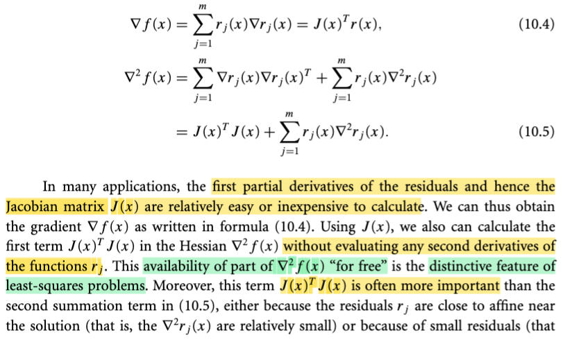</kbd>

> [!NOTE]
> Thế thì đại khái là vầy: Ta đã thấy rằng trong bài toán least-square, trong đó hàm objective là f(x) = Σi ri(x)^2 = r(x)Tr(x) với r(x) là vector → vector function, có Jacobian J(x) thì đạo hàm cấp 1 ∇f(x) và Hessian ∇^2f(x) có thể được tính bởi hai công thức 10.4 và 10.5. Và gs nói rằng, trong rất nhiều ứng dụng thì việc tính toán J(x) rất ít tốn kém. Từ đó, dẫn tới việc tính ra gradient và Hessian cũng đều không tốn kém gì mấy. Và đây là một đặc điểm mà ông cho rằng khiến bài toán least-square trở nên dễ chịu, và ông gọi nó đại khái là ta có được Hessian miễn phí.
>
>
>
> Mình hiểu thế này, trong các thuật toán tối ưu mà ta học ở đầu tới giờ, cũng như đã học ở Convex Optimization, giúp mình hiểu rằng: Trong các thuật toán tối ưu, xét về tốc độ hội tụ, thì Newton method là ngon nhất, và các thuật toán tối ưu đều cố gắng dùng thông tin độ cong có trong Hessian matrix. Có điều, vấn đề là nhiều khi tính toán Hessian rất tốn kém, thành ra trong các chương trước ta mới thấy các thuật toán quasi-Newton trong đó người ta cố gắng ước lượng Hessian để có được thông tin độ cong nhưng không quá tốn kém. Còn ở đây, ta có được Hessian chính xác mà không tốn mấy thì dĩ nhiên là quá tốt.
>
>
>
> Phải hiểu thêm là, trong đoạn này còn  một ý, nói đại khái là việc tính J(x) rẻ, chỉ giúp tính phần J(x)TJ(x) của Hessian là rẻ thôi, còn cái term thứ hai thì vẫn liên quan đến Hessian của rj(x), vẫn tốn. Tuy nhiên, đại ý là vì vài lí do thì phần đầu mới đóng vai trò quan trọng, thành ra nói chung ta vẫn được lợi ích.

> [!TIP]
> **🤖 AI Feedback** — ✅ Score: **95/100**
>
> Bạn đã nắm bắt rất tốt điểm mấu chốt về việc tính toán phần Hessian "miễn phí" trong bài toán least-squares và ý nghĩa của nó trong các thuật toán tối ưu. Phần giải thích mối liên hệ với phương pháp Newton và quasi-Newton rất sâu sắc và chính xác.

**🔗 See also:** [The Gauss-Newton Method](./103_algorithms_for_nonlinear_least_squares_problem.md#node-76os6gb) · [Gauss-Newton Method Approximation](./103_algorithms_for_nonlinear_least_squares_problem.md#node-2yk17h9)

 

###### Các thuật toán Least-Square

<kbd>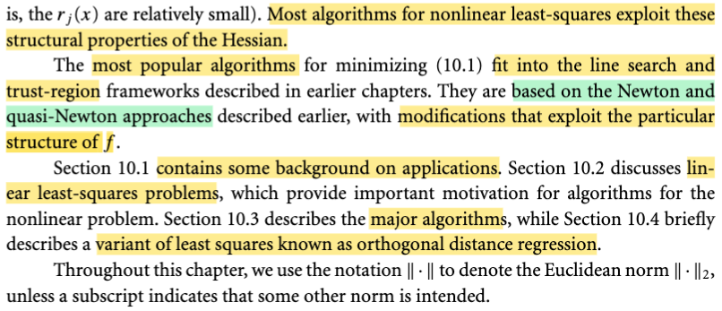</kbd>

> [!NOTE]
> Thế thì chương này ta sẽ bàn về các thuật toán giải bài toán least-square và trong đó ta sẽ thấy chúng đều cố gắng khai thác tính chất vừa nói trên.
>
>
>
> Và ta sẽ thấy những thuật toán đó đều thuộc vào hai cách tiếp cận lớn mà ta đã học Line Search và Trust Region. Cũng như là với mỗi cách, cũng chia ra là tiếp cận theo Newton và quasi-Newton method.

> [!TIP]
> **🤖 AI Feedback** — ⚠️ Score: **80/100**
>
> Bản tóm tắt đã nắm bắt tốt các phương pháp thuật toán chính (Line Search, Trust Region, Newton, quasi-Newton) và mục tiêu khai thác các tính chất cấu trúc. Để tăng cường độ chính xác và độ sâu, bạn có thể bổ sung chi tiết về tính chất của Hessian và cấu trúc cụ thể của các phần trong chương (ví dụ, các mục 10.1-10.4).

 

###### Tối ưu tham số mô hình thuốc

<kbd>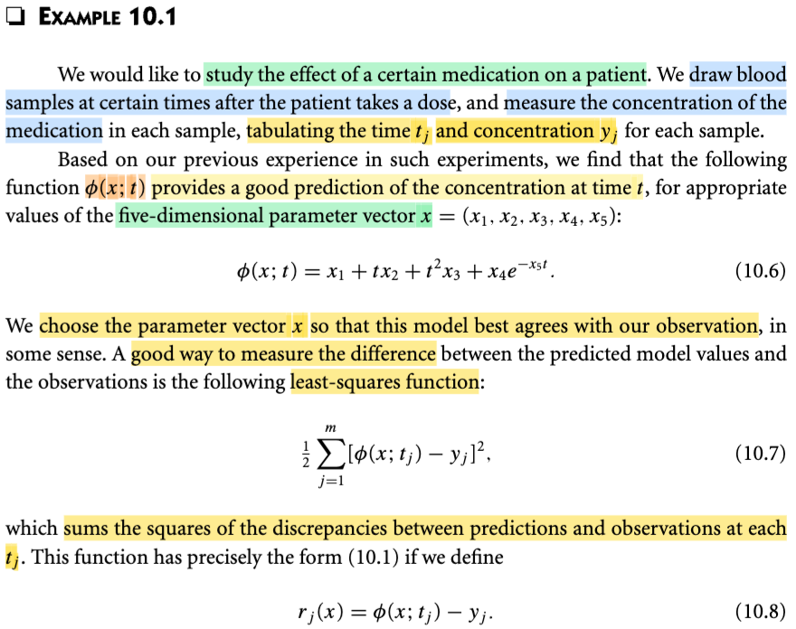</kbd>

> [!NOTE]
> Thế thì ta xét ví dụ này, đại khái là người ta muốn nghiên cứu hiệu quả của một loại thuốc tác động lên bệnh nhân. Họ sẽ lấy mẫu (draw sample) máu của bệnh nhân tại các thời điểm t khác nhau sau khi bệnh nhân uống thuốc, và đo mức độ tập trung của thuộc trong từng mẫu. Tạo thành một cái bảng các mốc thời gian tj, ứng với các chỉ số yj. Nói chung data sẽ là các cặp (tj, yj).
>
>
>
> Thế rồi, dựa vào kinh nghiệm, người ta tìm thấy một function φ(x, t) = x1 + x2 t + x3 t^2 + x4 e^(-x5t) là một funcntion hữu ích giúp dự đoán chỉ số y với t cho trước. Và bài toán đặt ra là ta tìm vector x = (x1,x2,..x5), là paramter vector, sao cho hàm Φ fit được tốt nhất với các data thu thập được.
>
>
>
> Dừng lại xíu, có thể nhận ra đây chính là bài toán curve fitting mà chap 1 trong sách Bishop đã nói. Và cũng cần nhận thấy, đây không phải là bài toán linear regression, vì sao? Vì đây không phải hàm tuyến tính theo tham số **x**, vì ta thấy x5 tham gia trong e^-x5t, nếu chỉ có ví dụ như x4 e^t, thì đây vẫn là hàm tuyến tính theo tham số **x**.
>
>
>
> Và cũng chú ý, đây cũng ko phải là bài toán polynomial fitting, vì hàm số này ko phải là hàm đa thức của x, vì cái term x4 e^-x5t.
>
>
>
> Thế thì, trong bài toán này, người ta nhận ra rằng, hoặc thường dùng hàm (1/2) Σi \[φ(x, tj) - yj\]^2, là tổng bình phương sai lệch giữa dự đoán Φ(x, tj) và yj. Ý nói, cái bài toán thực tế này chính là ví dụ điển hình của bài toán least - squared khái φ(x, ti) - yjquát mà ta nói đầu đến giờ. Trong đó hàm residual rj(x) ở đây chính là rj(x) = φ(x, tj) - yj.

> [!TIP]
> **🤖 AI Feedback** — ✅ Score: **96/100**
>
> Ghi chú của bạn rất chính xác và có chiều sâu, đặc biệt trong việc phân biệt bài toán này với hồi quy tuyến tính và khớp đa thức dựa trên các tham số. Để hoàn thiện hơn, bạn có thể bổ sung thêm về hàm bình phương tối thiểu (least-squares function) được sử dụng để đo lường sự khác biệt giữa dự đoán và quan sát.

 

###### Bài toán bình phương nhỏ nhất

<kbd>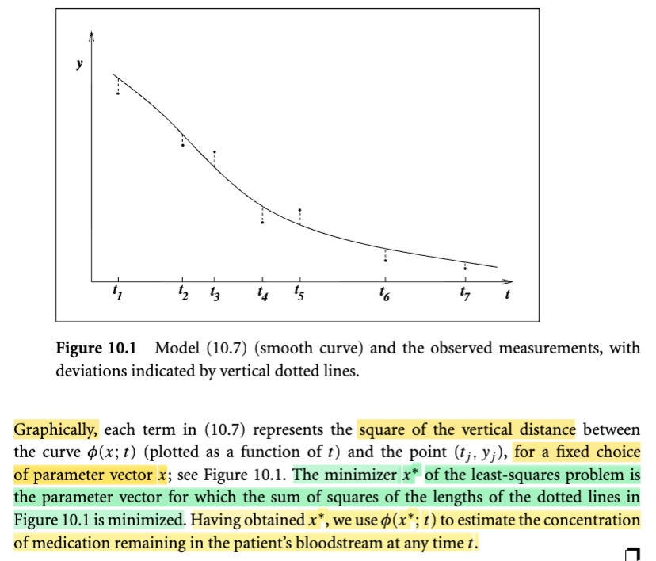</kbd>

> [!NOTE]
> Hình 10.1 thể hiện các mốc thời gian t khác nhau cùng với các giá trị quan sát y tương ứng. Ta có các điểm (t1, y1), (t2, y2), v.v. Đường cong chính là đồ thị của hàm φ(x, t).
>
>
>
> Hàm φ(x, t) nên được hiểu là đường cong tương ứng với một bộ tham số (vector) x nào đó. Nhiệm vụ của chúng ta là tìm bộ tham số x sao cho hàm này khớp tốt nhất với các cặp điểm (t, y) đã cho.
>
>
>
> Trên hình, các đường chấm chấm thể hiện khoảng cách hoặc sai lệch giữa giá trị dự đoán của hàm φ(x, ti) và giá trị yi quan sát được (observed value). 
>
>
>
> Như vậy, bài toán đặt ra là **tìm x sao cho tổng bình phương độ dài của các đoạn chấm chấm này là nhỏ nhất**.
>
>
>
> Giá trị x tối thiểu hóa này được gọi là x\*. Sau khi tìm được x\*, ta sẽ sử dụng nó để dự đoán cho các mốc thời gian t khác.

> [!TIP]
> **🤖 AI Feedback** — ✅ Score: **95/100**
>
> Ghi chú giải thích rất rõ ràng về mô hình, các thành phần hình vẽ và bài toán bình phương tối thiểu, đặc biệt là mục tiêu tìm x* chính xác. Để hoàn thiện hơn, bạn có thể bổ sung ngữ cảnh ứng dụng cụ thể của mô hình (ví dụ: nồng độ thuốc trong máu) như trong văn bản gốc.

 

###### Mô hình hồi quy cố định và chuẩn

<kbd>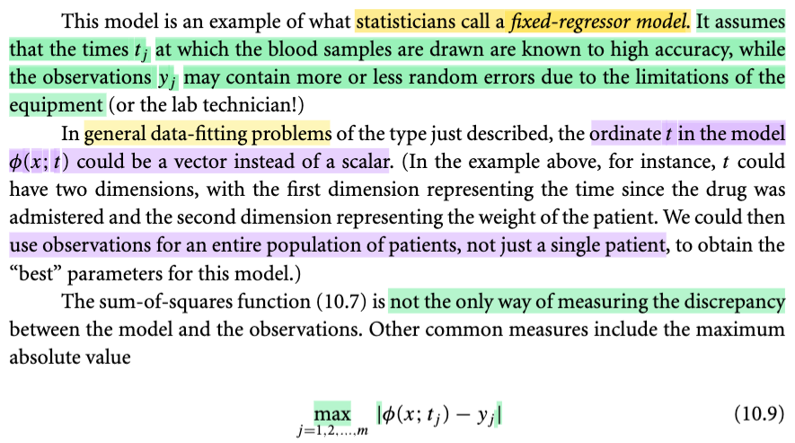</kbd>

<kbd>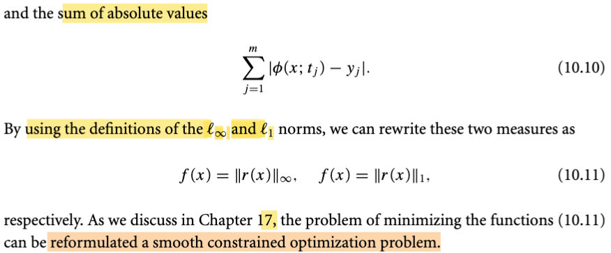</kbd>

> [!NOTE]
> Giáo sư gọi mô hình này là **fixed regressor model** trong thống kê học. Tạm dịch là mô hình hồi quy cố định, tuy nhiên, chúng ta sẽ giữ nguyên thuật ngữ fixed regressor model. 
>
>
>
> Loại mô hình này **GIẢ ĐỊNH rằng các thời điểm t** (thời điểm lấy mẫu máu) **được thực hiện rất chính xác**. **Sự không chính xác phát sinh từ việc đo lường mẫu máu** hoặc chỉ số trong mẫu máu. Do đó, giá trị quan sát được của y (y1, y2, ...) sẽ **chứa nhiễu và sai số**. Các sai số này mang tính ngẫu nhiên, **mức độ nhiều hay ít tùy thuộc vào chất lượng thiết bị** đo đạc. 
>
>
>
> Trong bài toán thực tế đã đề cập, **t chỉ là các giá trị số, phản ánh thời điểm lấy mẫu máu trên một bệnh nhân**. Tuy nhiên, trong bài toán khớp dữ liệu (data fitting) tổng quát, **t không nhất thiết là một con số mà có thể là một vector**. Cụ thể, t có thể là một **vector bao gồm thời điểm lấy mẫu máu và cân nặng của bệnh nhân**. Điều này đồng nghĩa với việc mở rộng khả năng lấy mẫu không chỉ trên một bệnh nhân mà trên nhiều bệnh nhân. 
>
>
>
> Một điểm khác là về hàm đo lường độ chính xác của mô hình. Trước đó, chúng ta đã đề cập đến việc sử dụng hàm tổng bình phương các sai lệch. Tuy nhiên, cũng **có thể sử dụng các hàm khác như tổng các giá trị tuyệt đối của sai lệch, hoặc giá trị tuyệt đối của sai lệch lớn nhất**. 
>
>
>
> Chúng ta có thể sử dụng khái niệm **norm** để diễn tả các hàm này. Theo định nghĩa, norm có các dạng khác nhau: **L2 norm của một vector là căn bậc hai của tổng bình phương các phần tử**; **L1 norm của một vector là tổng giá trị tuyệt đối của tất cả các phần tử**; và **L-infinity norm của một vector là giá trị tuyệt đối của phần tử lớn nhất** trong vector đó. 
>
>
>
> Với cách thể hiện bằng norm vector, chúng ta có thể thay thế các hàm mục tiêu (objective functions) như sau: 
>
>
>
> Hàm tổng bình phương các discrepancy (sai lệch) chính là **bình phương của L2 norm** **của vector r(x)** = \[r(x,t1), r(x,t2)...\]. 
>
>
>
> Tổng giá trị tuyệt đối của các r (vector residual) chính là **L1 norm của vector r(x)**. 
>
>
>
> Và hàm thứ ba (giá trị tuyệt đối của sai lệch lớn nhất) chính là **L-infinity norm của vector** **r(x)**.

> [!TIP]
> **🤖 AI Feedback** — ✅ Score: **95/100**
>
> Nội dung tóm tắt rất chính xác và chi tiết về các khái niệm như mô hình hồi quy cố định, vai trò của biến t, các phương pháp đo lường sai lệch và cách biểu diễn chúng bằng các norm. Việc giải thích các định nghĩa norm còn giúp làm rõ thêm các khái niệm trong bài, mặc dù mối liên hệ giữa tổng bình phương sai lệch và bình phương của L2 norm không được nêu tường minh trong đoạn văn gốc như các norm L1 và L-infinity.

 

###### Cơ sở thống kê Bình phương nhỏ nhất

<kbd>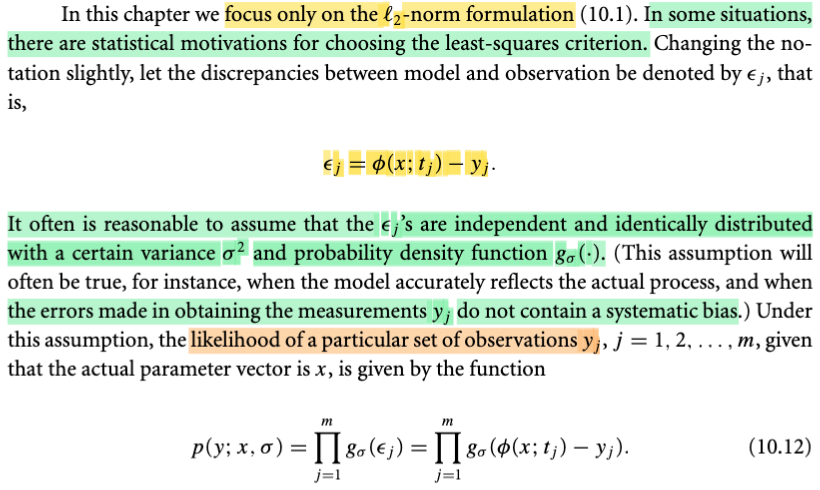</kbd>

> [!NOTE]
> Rồi, tiếp, thế thì gs nói đại khái là ta chapter này, như đã nói, sẽ chủ yếu là tập trung vào việc bài toán mà hàm mục tiêu là sum squared error, hay cũng là thể hiện thông qua L2 norm của residual.
>
>
>
> Ở đây gs sẽ thay kí hiệu chút xíu, dùng εj để chỉ error j: εj = Φ(x, tj) - yj.
>
>
>
> Có thể nhắc lại chút xíu, Φ(x, t) là một function nào đó dùng để tính toán với input t để cho ra giá trị dự đoán y, dựa trên giá trị của bộ tham số x. Và theo đó Φ(x, tj) thể hiện dự đoán của mô hình với tj và εj thể hiện sai lệch giữa observed value yj và dự đoán này. Để rồi mục tiêu là tìm x sao cho minimize tổng bình phương εj.
>
>
>
> ---
>
>
>
> Thế thì, gs nói tiếp, thường là ta sẽ có lí do để giả định rằng εj's (tức các ε1, ε2,....) là independent và identically distributed, với varance σ^2 và pdf g\_σ(.).
>
>
>
> Dừng lại chỗ này chút xíu, chỗ này quan trọng đây:
>
>
>
>  Ta hiểu khi nói rằng ta giả định εj's iid, thì tức là đầu tiên mình đang bước sang lĩnh vực xác suất thống kê, trong đó, ε1, ε2,...là các random variables. Và iid có nghĩa là, chúng mutually independent, và có chung population distribution g\_σ(ε), và variance của distribution này, tức Var(ε) = σ.
>
>
>
> Dĩ nhiên là nhờ học Stat110 và Casella, mình không còn lạ gì cái này nữa. Nhưng ở đây còn một ý quan trọng, mà ta có thể liên hệ với những gì được học trong Chapter 1 của sách Bishop: Giả định distribution của ε là Normal(0, σ^2). Tức là: trong sách Bishop, chapter 1, ta cũng được học về một ví dụ mà gs Bishop dùng bài toán polynomial fitting để dẫn dắt các khái niệm nền tảng của một bài toán học máy. Và một điểm trong đó, đó là, gs nói ta sẽ giả định phân phối của t dựa trên x là iid Normal(y(x,w), σ^2) (đúng hơn thì trong đó gs nói ta sẽ giả định T \~ normal(y(**x**, w), 1/β), với β là pricision, là nghịch đảo của variance)
>
>
>
> Thế thì, lúc đó mình cũng đã nhận ra rằng, với T \~ Normal(y(x,w), σ^2), thì dùng location scale family theorem, ta sẽ nhận thấy giả định này cũng chính là đồng nghĩa với việc giả định T - y(x,w) (mà cái này chính là error) sẽ là random variable thuộc phân phối Normal(0, σ^2).
>
>
>
> Còn ở đây, gs Nocedal nói về giả định của error, nhưng lưu ý là ông chưa nói rằng ε có phân phối normal nhé, mà chỉ là phân phối có variance σ^2, với pdf là g\_σ(.) thôi.
>
>
>
> ---
>
>
>
> Rồi, tiếp, nhờ đã cày Stat110 và Casella, mà ta dễ dàng hiểu công thức 10.12, là vầy:
>
>
>
> Nhờ Casella, với bối cảnh ta học về bài toán inference, cụ thể là point estimation: Với sample **X** = X1,...Xn iid \~ f(**x**|θ), bài toán là tìm một function của random sample W(**X**), (còn gọi là một statistic) sao cho estimate được tốt nhất giá trị của population param θ. Thế thì, hàm likelihood, được định nghĩa là, là hàm của θ, L(θ|**x**), mang ý nghĩa là độ hợp lí của θ khi giá trị quan sát được của sample **X** là **x**, và được định nghĩa là L(θ|**x**) = f(**x**|θ). Để rồi sau đó, ta có một cách tiếp cận phổ biến để tìm ra point estimator tốt của θ, đó là maximum likelihood estimator, được định nghĩa là W_mle(**X**) = argmax\_θ ∈ Θ L(θ|**x**).
>
>
>
> Vậy thì quay lại đây, ta có các observation (t1,y1), (t2,y2)....(tj,yj) với εj được assume là các random variable iid có phân phối g\_σ(ε). Thì lần này ta sẽ làm ngược lại với gs Bishop:
>
>
>
> Đúng ra, trong bài toán này, nói đến likelihood, thì nó phải là hàm của tham số x: L(x|y,t) và thì theo định nghĩa trên, thì giá trị của nó được define bởi joint pdf f(y|t,x) với y là vector y1,y2,...t là vector t1,..t2, và x là vector tham số.
>
>
>
> Khi đó L(x|y,t) = f(y|t,x) và nhờ tính iid ta mới tách thành tích các marginal pdf.
>
>
>
> Câu hỏi là, vì sao trong công thức 10.12, gs lại dùng marginal pdf của error εj thay vì đáng lí phải dùng pdf f(yj | tj,x). Chẳng lẽ nó là một?
>
>
>
> Nếu vậy thì đang giả định điều gì cho phép điều đó xảy ra, vì rõ ràng, nếu làm như gs Bishop, giả định ε là iid Normal (0, σ^2) thì cũng chỉ đồng nghĩa là đang giả định y|t là normal(Φ(x,t), σ^2) thôi, và dù cùng là normal nhưng chúng khác mean cơ mà.
>
>
>
>  Câu trả lời thật ra đơn giản: Đúng là chúng bằng nhau. Và cái mà thật ra gs Nocedal đang làm chính là: đổi biến, thể hiện f(yj | tj,x) bởi f(εj | tj,x)
>
>
>
> Ta có εj có phân phối g\_σ(ε)j. Và εj = Φ Φ(x, tj) - yj ⇔ yj = Φ(x, tj) - εj.
>
>
>
> Tới đây, tình hình là ta cần pdf của y|t nhưng cái ta có là pdf của ε|t. Nên ta sẽ dùng change of variable theorem, ôn nhanh: Trong Stat110 và Casella đã học, khi ta có X \~ fX(x) và Y = g(X), với g là hàm mapping 1-1 giữa support set của X và support set của Y, tức là với mỗi x belong support set của X thì chỉ ứng với một y thuộc support set của Y và ngược lại: y = g(x) ⇔ x = ginv(y). Khi đó có thể xây dựng pdf của Y như sau: fY(y) = fX(x) |dx/dy| = fX(ginv(y)) |d/dy ginv(y)|
>
>
>
> Áp dụng vào đây với yj = g(εj) = -εj + Φ(x, tj) ⇨ εj = ginv(yj) = -yj + Φ(x, tj). Và |d/dyj εj| = |d/dyj \[-yj + Φ(x, tj)\]| = |-1| = 1.
>
>
>
> Nên áp dụng theorem này, pdf của yj sẽ là:
>
> f(yj|tj,x) = f(εj | tj, x) với cần lưu ý, phải hiểu f(εj) là pdf của ε, tức hàm g\_σ(εj |tj, x).
>
>
>
>  Như vậy, likelihood function sẽ là:
>
>
>
> L(x|y,t) = f(y|t,x) = Πj f(yj|tj,x) = Πj g\_σ(εj|tj,x) = Πj g\_σ(φ(x, tj) - yj), giúp giải thích công thức 10.12 ở đâu ra.

> [!TIP]
> **🤖 AI Feedback** — ✅ Score: **100/100**
>
> Bài phân tích rất chính xác và cực kỳ sâu sắc. Bạn không chỉ tóm tắt nội dung mà còn mở rộng kiến thức liên quan từ các nguồn khác (Bishop, Casella) và đặc biệt là đưa ra giải thích toán học chi tiết (đổi biến) cho công thức likelihood, làm rõ những điểm mà văn bản gốc có thể chưa làm rõ. Khả năng liên hệ và giải thích các khái niệm thống kê phức tạp là xuất sắc.

 

###### MLE và Bình phương tối thiểu

<kbd>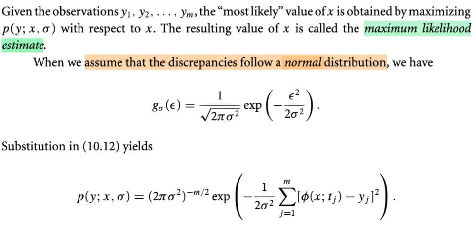</kbd>

<kbd>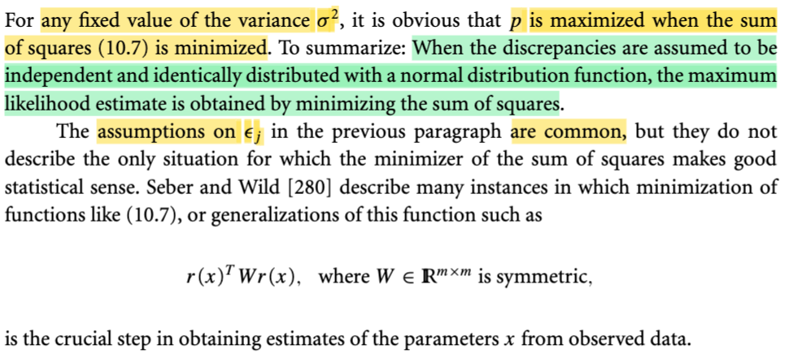</kbd>

> [!NOTE]
> Và như đã hiểu, việc đi tìm x khiến maximize hàm likelihood, chính là sẽ cho ra maximum likelihood estimate.
>
>
>
> Kế tiếp, như dự đoán, gs nói rằng nếu ta giả định ε \~normal(0, σ^2), khi đó, g\_σ(ε) = \[1/√(2πσ^2)\] exp\[-ε^2/2σ^2\]
>
>
>
> Thay vào hàm likelihood:
>
>
>
>  L(x|y,t) = Πj g\_σ(φ(x, tj) - yj) = Πj \[1/√(2πσ^2)\] exp\[-(φ(x, tj) - yj)^2/2σ^2\]
>
>
>
> = Πj \[1/√(2πσ^2)\] exp\[(-1/2σ^2) (φ(x, tj) - yj)^2\]
>
>
>
> = \[1/√(2πσ^2)\]^m Πj { exp\[(-1/2σ^2) (φ(x, tj) - yj)^2\] }
>
>
>
> = \[1/√(2πσ^2)\]^m exp\[(-1/2σ^2) Σj (φ(x, tj) - yj)^2\]
>
>
>
> Vậy, ta có bài toán tối ưu cần giải: maximize over x {\[1/√(2πσ^2)\]^m exp\[(-1/2σ^2) Σj (φ(x, tj) - yj)^2\]}
>
>
>
> Tới đây, nhờ ee364A cũng như từ đầu đến giờ của sách này, mình biết có thể chuyển bài toán tối ưu thành bài toán tương đương bằng cách thay hàm mục tiêu khi áp một hàm monotone lên nó. Và hàm log (base e, hay base nào cũng được) là hàm monotone increasing. Thành ra ta sẽ chuyển thành bài toán tương đương, và tiếp tục chuyển tương đương bằng cách bỏ đi các constant:
>
>
>
> maximize_x { log {\[1/√(2πσ^2)\]^m exp\[(-1/2σ^2) Σj (φ(x, tj) - yj)^2\]}
>
>
>
> Tách log(term 1 x term 2) = log (term 1) + log (term 2):
>
>
>
> ⇔ maximize_x { log {\[1/√(2πσ^2)\]^m} + log { exp\[(-1/2σ^2) Σj (φ(x, tj) - yj)^2\]}
>
>
>
> Chuyển tương đương bằng cách bỏ hằng số:
>
>
>
> ⇔ maximize_x { log { exp\[(-1/2σ^2) Σj (φ(x, tj) - yj)^2\] }
>
>
>
> Dùng log exp (a) = a:
>
>
>
> ⇔ maximize_x { (-1/2σ^2) Σj (φ(x, tj) - yj)^2 }
>
>
>
> Tới đây, chuyển tương đương bằng cách: maximize f ⇔ minimize -f
>
>
>
> ⇔ minimize_x { Σj (φ(x, tj) - yj)^2 }
>
>
>
> Như vậy, tới đây có thể thấy rằng bài toán tìm maximum likelihood estimator của tham số x, DƯỚI GIẢ ĐỊNH ERROR LÀ RANDOM VARIABLE NORMAL(0, σ^2) thì cũng chính là bài toán tìm x sao cho least equare: minimize tổng bình phương của error. Đây cũng là cái mà gs Bishop đã nói trong Chap 1 của sách Bishop (Pattern Recognition & Machine Learning)
>
>
>
>  Đoạn cuối là một ý nói rằng: Dù giả định ε như trên là phổ biến nhưng nó không phải cách duy nhất cho ra kết quả cho thấy bài toán tối ưu nó phù hợp với các lí thuyết thống kê. Còn có những cách khác. Tham khảo thêm.

> [!TIP]
> **🤖 AI Feedback** — ✅ Score: **99/100**
>
> Ghi chú của bạn cực kỳ chính xác và đi sâu vào chi tiết toán học khi chứng minh mối liên hệ giữa ước lượng hợp lý cực đại và tối thiểu tổng bình phương, cho thấy sự hiểu biết vững chắc về tài liệu. Không có điểm yếu đáng kể, tuy nhiên bạn có thể cân nhắc sử dụng cùng ký hiệu cho hàm likelihood (p(y; x, σ)) như trong văn bản gốc để duy trì tính nhất quán khi tham chiếu.

 

