# 10.3 Algorithms for nonlinear least-squares problem

📊 **Progress:** `9` Notes | `16` Screenshots | `4` AI Reviews

---

## 10.3 Algorithms for nonlinear least-squares problem

 

## The Gauss-Newton Method

<kbd>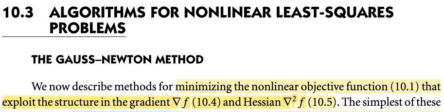</kbd>

> [!NOTE]
> Đầu tiên vẫn là nói về việc giải bài toán least-square: minimize f(x) = Σi ri(x)^2 (10.1)
>
>
>
> Còn nhớ trong 10.2, khi nói rằng hàm Φ(x, ti) là hàm tuyến tính theo x, dẫn đến ri(x) = Φ(x, ti) - yi cũng là linear (đúng hơn là affine) function theo x, thì khi đó hàm vector x → vector r(x) = \[r1(x), r2(x),..\] có thể được thể hiện bởi: r(x) = Jx, để rồi Σi ri(x)^2 có thể được thể hiện bởi ||Jx - y||^2. Lúc này bài toán được gọi là linear least-square.
>
>
>
> Thế thì mình cần hiểu, **không phải là vì hàm objective là hàm tuyến tính theo x**. Không hề, vì **ngay cả khi r(x) là linear thì objective vốn là r(x)Tr(x), vẫn là hàm non-linear theo x**. Ta chỉ gọi là **linear least square bởi vì r(x) là linear function của x mà thôi**, và khi không có điều này, thì dĩ nhiên bài toán là non-linear least square.
>
>
>
> Rồi, thế thì, ở phần trước (10.2) với việc hàm r(x) tuyến tính, dẫn đến bài toán được đơn giản hóa, khiến việc giải ra nghiệm chỉ là giải normal equation, nói cách khác, ta có closed form solution từ ta có thể giải theo cách direct (dùng Cholesky factorization, QR factor based method, hoặc SVD based method) method - mà cơ bản chỉ là dùng đại số tuyến tính để giải, (trừ bài toán lớn thì dùng Conjugate gradient - mới là thuật toán tối ưu)
>
>
>
> Qua phần này, ta phải quay lại thực tế, là bài toán không đơn giản như 10.2, tuy nhiên, ở phần mở màn của chapter này, gs Nocedal đã nói rằng, bài toán least square mang vài đặc điểm thuận lợi hơn các bài toán khác, mà ta có thể khai thác. Cụ thể, là **gradient và Hessian cuả nó trong nhiều trường hợp là dễ tính** (ít tốn kém), thì đây chính là lúc ta nói về chuyện này. (có nghĩa cần hiểu bức tranh là, ở 10.2, ta chưa cần khai thác đặc điểm này, đơn giản là vì với bài toán linear least square, mọi chuyện được đơn giản hóa hơn nhiều, để rồi bây giờ mới nói về việc khai thác đặc điểm "**free Hessian**" của bài toán least-square.

> [!TIP]
> **🤖 AI Feedback** — ✅ Score: **95/100**
>
> Ghi chú giải thích rất sâu sắc về sự khác biệt giữa các bài toán least-square tuyến tính và phi tuyến, đồng thời làm rõ tầm quan trọng của việc khai thác cấu trúc gradient và Hessian. Việc liên hệ với phần 10.2 giúp người đọc dễ dàng nắm bắt bối cảnh và lý do tại sao phương pháp này được giới thiệu.

**🔗 See also:** [Bài toán Least-Squares](./101_least_square_problem.md#node-ot9v1dc) · [Hessian miễn phí Least-square](./101_least_square_problem.md#node-4tij0lf)

 

### Gauss-Newton Method Approximation

<kbd>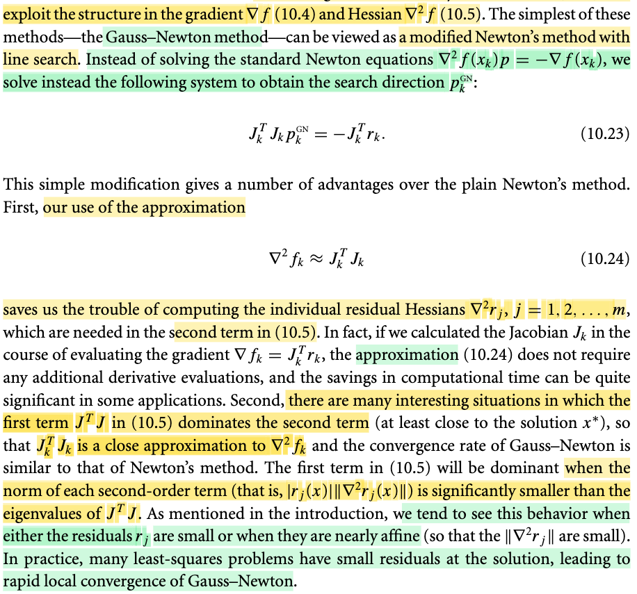</kbd>

> [!NOTE]
> Rồi, thế thì trước tiên nên nhắc lại công thức của gradient và Hessian của objective mà trong 10.1 mình đã tự derive:
>
>
>
> ∇f(x) = J(x)Tr(x) (10.4)
>
>
>
> ∇^2f(x) = J(x)TJ(x) + Σi {∇^2ri(x) ri(x)} (10.5)
>
>
>
> Thế thì đại khái lập luận là như sau: Như đã nói nhiều lần trong các chapter trước, cũng như trong Convex Optimization S.Boyd, ta đã thấy rằng, với các cách tiếp cận iterative để giải bài toán tối ưu, thì cơ bản đều có cùng một bản chất: Ta bắt đầu từ điểm nào đó, và tìm cách di chuyển dần đến minimizer của hàm mục tiêu. Và việc đánh giá một thuật toán tối ưu hiệu quả nhiều hay ít chỉ xoay quanh một vấn đề: Chi phí. Chi phí ở đây, có thể hiểu bao gồm tính khả thi đạt được sự hội tụ về minimizer cũng như chi phí tính toán và thời gian để đạt được. Thuật toán hiệu qủa sẽ thể hiện ở chỗ hội tụ nhanh cũng như chi phí tính toán các bước thấp.
>
> \
> Và Newton method được chứng minh là có tốc độ hội tụ nhanh, như đã học bên Conv Opt, khi bước vào Newton phase (đủ gần minimizer) thì tốc độ hội tụ sẽ là quadratic (gọi là quadratic convergence)
>
>
>
> Vấn đề là, để có Newton direction, ta sẽ phải có Hessian. Ôn lại nhanh Newton direction:
>
>
>
> Ý tưởng rất đơn giản: tại điểm đang đứng, ví dụ gọi là x0, ta sẽ coi như hàm số là hàm bậc hai: f(x) ≈ f(x0) + ∇f(x0)(x - x0) + (1/2)(x-x0)T ∇^2f(x0)(x-x0). Đặt đây là hàm g(p) = f(x0) + ∇f(x0)p + (1/2)pT∇^2f(x0)p (p = x - x0). Câu chuyện tiếp theo sẽ là, tìm minimizer của hàm quadratic g(p), bằng closed-form solution:
>
>
>
> ∇g(p) = 0 ⇔ ∇^2f(x0)p + ∇f(x0) = 0 (đây là cái mà gs gọi là standard Newton equation ∇^2f(xk)p = - ∇f(xk))
>
>
>
> ⇔ p = - \[∇^2f(x0)\]inv ∇f(x0)
>
>
>
> Đây chính là Newton direction (Newton step), có nghĩa là từ x0 chỉ cần phóng theo p ta sẽ tới x0 - \[∇^2f(x0)\]inv ∇f(x0) chính là điểm sẽ minimize hàm g(p).
>
>
>
> Như vậy, có thể thấy để có được Newton Step, ta sẽ cần gradient và Hessian tại xk.
>
>
>
> Và việc tính Hessian quá tốn kém chính là trở ngại của việc dùng Newton method.
>
>
>
> Thế thì, trong bài toán Least Square, gs nói có 2 đặc điểm:
>
>
>
> i) Đầu tiên, dễ thấy là Hessian có hai term, thì một term là J(x)TJ(x), thì term trong nhiều trường hợp, sẽ lấn át (dominant) term thứ hai, khiến cho việc bỏ đi term thứ hai không gây ra sai lệch nhiều, hay nói cách khác, chỉ dùng term thứ nhất cũng có thể xấp xỉ tốt Hessian, dẫn đến thuật toán này (gọi là Gauss-Newton) sẽ vẫn đạt tốt độ hội tụ nhanh như Newton thứ thiệt.
>
>
>
> ii) Và ý thứ hai đó là, việc tính gradient J(x)Tr(x) rồi thì tính thêm cái cục J(x)TJ(x) sẽ không tốn thêm mấy (là vì đã tính ra J(x) phục vụ cho việc tính gradient rồi thì tính J(x)TJ(x) chỉ là nhân matrix matrix, không tốn thêm gì nhiều)
>
>
>
> Tóm lại, vì hai đặc điểm này, nên ta dùng J(x)TJ(x) thay cho ∇^2f(x), để rồi Newton equation (giúp giải tìm Newton step) sẽ là:
>
>
>
> J(xk)TJ(xk)p = - J(xk)Trk
>
>
>
> hay viết gọn là JkTJk p = - JkTrk
>
>
>
> Một ý cuối đó là, cái vụ term J(x)TJ(x) dominate term thứ hai thường xuất hiện trong các bài toán mà residual nhỏ, hoặc chúng là hàm gần tuyến tính, và đây là những yếu tố xuất hiện nhiều trong cái bài toán thực tế, giúp cho việc dùng Gauss Newton sẽ có tác dụng.

> [!TIP]
> **🤖 AI Feedback** — ✅ Score: **97/100**
>
> Bài viết giải thích rất chi tiết và chính xác về lý do và cách thức phương pháp Gauss-Newton sửa đổi so với phương pháp Newton tiêu chuẩn, bao gồm cả hai đặc điểm chính đã được nêu bật trong văn bản. Độ sâu của phân tích rất tốt, tuy nhiên, phần mở đầu có thể ngắn gọn hơn một chút để đi thẳng vào vấn đề chính sớm hơn.

**🔗 See also:** [Hessian miễn phí Least-square](./101_least_square_problem.md#node-4tij0lf)

 

#### Gauss-Newton Descent Direction

<kbd>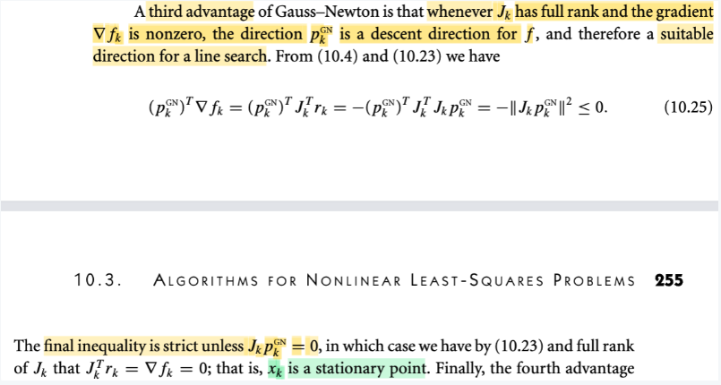</kbd>

> [!NOTE]
> Tiếp theo, đại khái là nói về một ưu điểm nữa của Gauss-Newton. Có lẽ nên ôn nhanh, Gauss-Newton là gì:
>
> Bối cảnh là ta muốn quay lại đối mặt với bài toán least-square trong trường hợp residual là non-linear function, mà trước đó, trong 10.2, khi ta xét case residual r(x) là linear function, để rồi có dạng Jx - y, khiến việc giải bài toán minimize ||r(x)||^2 trở thành bài toán giải hệ phương trình tuyến tính (normal equation, JTJx = JTb) và từ đó có thể dùng các thuật toán đại số tuyến tính đơn thuần như Cholesky factorization giải normal equation, QR factorization based method và SVD based method. Trừ trường hợp bài toán có quy mô lớn thì ta sẽ dùng Conjugate Gradient method - là thuật toán chuyên trị việc giải tìm nghiệm của hệ Ax = b.
>
> Thì nay, không còn sự tiện lợi đó, ta mới lại xét một đặc điểm của bài toán least square mà gs đề cập ở phần đầu chương 10, cũng như vừa nhắc lại ở note trước, đó là, bài toán này có gradient của hàm objective ∇f(x) = J(x)Tr(x) và Hessian = J(x)TJ(x) + một term thứ hai.
>
>  Thế thì, đặc điểm tốt của bài toán least square đó là, gs nói đại ý là đa số trường hợp thực tế cái term thứ hai của Hessian chính xác rất không đáng kể so với term thứ nhất J(x)TJ(x), khiến việc ta dùng J(x)TJ(x) để xấp xỉ cho Hessian là chấp nhận được. Và như vậy, dự trên sự thật là đằng nào thì ta cũng sẽ có J(x), nên ta sẽ có luôn Hessian xấp xỉ J(x)TJ(x), và vì nó tốt (phần lớn là xấp xỉ tốt cho Hessian thật) nên mới nói là ta có Hessian miễn phí, từ đó có thể dùng thuật toán Newton để giải bài toán này. Nhưng vì không hẵn là Newton thật (vì chỉ khi dùng Hessian thật, thì mới là Newton step thật), nên mới gọi là Gauss Newton. Dĩ nhiên, dùng J(x)TJ(x) thay cho Hessian ∇^2f(x) thì ta không gọi là Newton step pk_N (= -\[∇^2f(x)\]inv ∇f(x)) nữa mà gọi là Gauss-Newton step pk_GN = -(JkTJk)inv JkTr.
>
> (và được biết thì Gauss cũng chính với Gaussen distribution của xác suất, hay khử Gauss của đại số tuyến tính)
>
> Vậy thì quay lại đây, tiếp nối hai ưu điểm ở trên (free Hessian, và J(x)TJ(x) xấp xỉ tốt Hessian) thì ở đây nói về ưu điểm thứ ba: Là khi Jk full rank thì ∇fk = JkTrk khác 0 và pk_GN (Gauss-Newton step) trở thành descent direction.
>
> Ôn lại thế nào gọi là descent direction: Đơn giản là hướng đi giúp ta đi xuống, thể hiện bởi directional derivative ≤ 0: ∇f(x)Tp ≤ 0. Giúp cho khi đi ra khỏi x một đoạn nhỏ, theo theo hướng p này, xét hàm g(t) = f(x) giới hạn theo phương p: g(t) = f(x + tp). g'(t) = ∇f(x+tp)Tp, và g'(t)|t=0 = ∇f(x)Tp, với việc p là descent direction thì g'(t)|t=0 ≤ 0. Nên nếu đi ra khỏi x một đoạn nhỏ theo hướng p, thì theo linear approx g(t) ≈ g(0) + g'(0)t sẽ &lt; g(0) ⇨ giá trị hàm giảm xuống, nên mới gọi là descent direction (chú ý, và steepest descent - độ dốc lớn nhất,  chính là -∇f(x))
>
> Vậy quay lại đây, xét directional derivative wrt hướng Gauss-Newton: ∇fkTpkGN
>
>
>
> Dùng pkGN = -(JkTJk)inv ∇fk ⇨ ∇fk = -JkTJk pkGN
>
> ⇨ ∇fkTpkGN = (-JkTJk pkGN)TpkGN
>
> = (-(JkTJk)pkGN)TpkGN
>
> = -(pkGN)T(JkTJk)TpkGN
>
> = -(pkGN)TJkTJkpkGN
>
> = -(JkpkGN)T(JkpkGN)
>
> = - ||JkpkGN||^2 và đây là negative square norm, nên đương nhiên ≤ 0 cho thấy pkGN là descent direction.
>
>
>
> ---
>
> Thêm nữa dấu bằng xảy ra khi Jk pkGN = 0
>
>
>
> Mà đã nói Jk full column rank, thì như nhờ MIT 180, ta biết khi đó các cột của J độc lập, nullspace chỉ có vector zero. Vậy Jk pkGN = 0 ⇔ pkGN = 0, cho thấy lúc này ta sẽ không đi đâu nữa
>
> Đồng thời, thế pkGN = 0 vào (JkTJk)pkGN = ∇fk, thì cũng cho thấy ∇fk = 0, tức là tại điểm mà Jk pkGN = 0 thì cũng chính là stationary point

 

##### Gauss-Newton and Least-Squares

<kbd>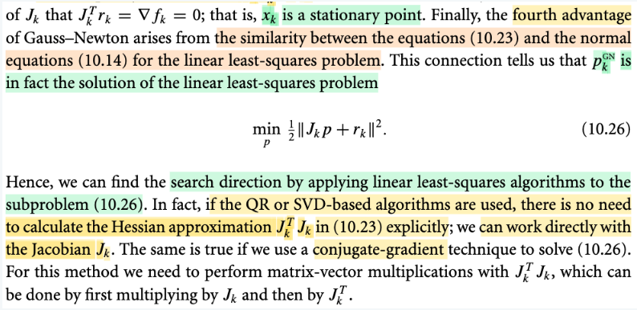</kbd>

> [!NOTE]
> Ôn lại chút xíu, nói một cách ngắn gọn thì Gauss Newton method là khi ta dùng JkTJk (vốn chỉ là phần thứ nhất trong công thức của Hessian = ∇^2fk = JkTJk + term thứ 2) để xấp xỉ Hessian, và đây là một ưu điểm của bài toán least square vì thực tế thường cho phép xấp xỉ này, và cũng như là nhờ vậy, việc có Hessian trở nên không tốn kém mấy. Và như vậy, công thức Newton step trở thành công thức Gauss Newton: pkGN = -(JkTJk)inv JkTr, là solution của (JkTJk) pkGN = -JkTr → Công thức này chính là 10.23,
>
> Vậy thì ở đây ta sẽ nhớ lại bài toán linear least square: Nói một cách ngắn gọn, là khi residual r(x) là tuyến tính (tí quay lại chỗ này), để rồi có dạng r(x) = Jx - y. Khi đó objective là (1/2)||r(x)||^2 = (1/2)(Jx - y)T(Jx - y) = (1/2)(xTJT - yT)(Jx - y) = (1/2)xTJTJx - (1/2)yTJx - (1/2)xTJTy + (1/2)yTy = (1/2)xTJTJx - yTJx + (1/2)yTy. Và gradient lúc này là JTJx-JTy và Hessian là JTJ.
>
> Lúc này bài toán minimize hàm ||r(x)||^2, là bài toán tối ưu hàm quadratic, có closed form solution: là nghiệm của phương trình normal equation: JTJx - JTy = 0 ⇔ JTJx = JTy → đây là 10.14.
>
> Vậy thì so sánh 10.23 (JkTJk) pkGN = JkTr, giúp giải ra Gauss Newton step, với 10.14, JTJx = JTy giúp giải ra solution của bài toán linear least square, ta thấy có sự tương đồng. Nên dễ thấy việc tìm pkGN chính là giải một bài toán linear least square khác.
>
> Do đó nếu JTJx = JTy normal equation của bài toán minimize (1/2)||Jx - y||^2 thì (JkTJk) pkGN = -JkTrk chính là normal equation của bài toán minimize (1/2)||Jk p - (-rk)||^2 = (1/2)||Jkp + rk||^2 → Đây là 10.26
>
> Nói thêm chút về điểm (1) ở trên: Trong bối cảnh Nocedal, người ta chỉ tập trung vào vấn đề tối ưu hóa, nên chỉ đặt ra vấn đề là ta muốn minimize hàm f(x) = Σi ri(x)^2 = ||r(x)||^2 với r(x) = \[r1(x), ...rn(x)\] và ri(x) là residual function theo x, x là biến tối ưu. Và khi hàm ri(x) là hàm tuyến tính theo x, kéo theo r(x) cũng vậy, để lúc này r(x) có thể thể hiện bởi Jx - y, ta có bài toán linear least square.
>
> Thì trong Bishop, mình hiểu rõ hơn. Đó là khi ta muốn xây dựng prediction function y(w,x) với x là input vector và w là vector adjustable parameter, để rồi error, hay residual r = t - y(w, x). Và ta chỉ quan tâm đến nó như hàm của w, nên ta ghi r(w). Và với các cặp xi, ti khác nhau, ta có các ri(w). Đây chính là tương ứng với ri(x) ở trên. Và với bài toán machine learning, ta muốn tìm w để minimize sum square error: Σ ri(w)^2 = Σi \[y(w, xi) - ti\]^2.
>
> Rồi, lại nói tiếp, y(w,x), thì ta cũng biết, người ta sẽ có thể dùng hàm basis để tạo các non-linearity của input, y(w,x) = wTφ(x) với w = (w0, w1,...wM-1), Φ(x) = \[1, Φ1(x), Φ2(x),...\]. Lúc này y(w,x) tuy là hàm phi tuyến đối với x, nhưng vẫn tuyến tính đối với w. Và như vậy ri(w) = wTΦi(x) - ti. Và nếu đặt matrix Φ (gọi là design matrix) có các hàng là Φ(x1), thì vector r(w) = ΦTw - t, để rồi, ||r(w)||^2 = ||ΦTw - t||^2. Đây chính là tương ứng với ||Jx - y||^2 trong Nocedal.
>
> Nói chung viết ra như vậy để thấy sự liên hệ giữa Bishop và Nocedal.
>
> Vậy thì quay lại đây, khi đã nhận định rằng Gauss Newton step pkGN là nghiệm của bài toán linear least square có objective (1/2)||Jkp + rk|| rồi, thì ta có thể dùng các phương phải giải của linear least square để tính pkGN...

 

- **Gauss-Newton steps accumulation**

<kbd>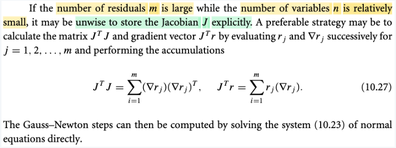</kbd>

> [!NOTE]
> Đoạn này có thể hiểu như vầy, đại ý là khi ta có m &gt;&gt; n nhiều, thì khi đó, việc tính và lưu trữ J (kích thước m × n) là không không ngoan, bởi vì dù gì việc tính Gauss Newton step chỉ cần JTJ và JTr thôi, và JTJ có shape (n × m) (m × n) = (n × n) và JTr chỉ là (n × m) (m × 1) = (n × 1), tức là sẽ có kích thước nhỏ hơn nhiều.
>
> Vậy thì ta hiểu 10.27 thế này:
>
> Theo góc nhìn thứ 4 trong việc nhân hai matrix của thầy Strang MIT 18.06, thì JTJ chính là tổng các rank 1 matrix tạo bởi các outer product của \[cột j của JT\] và \[hàng j của J\] với j = 1,2,...m. Mà cột j của JT chính là hàng j của J, và là chính là vector chứa các partial derivative của ri đối vối x: ∇rj. Vậy nên JTJ = Σj=1:m ∇rj(∇rj)T.
>
> Từ đó mới mở ra cách tính JTJ theo lối iterative: cho chạy vòng lặp từ 1 tới m, và tính và cộng dồn ∇rj(∇rj)T.
>
> Tương tự, JTr, theo góc nhìn thứ hai của việc nhân matrix với vector, là linear combination các cột của JT, cũng là các hàng của J, là ∇rj với hệ số là các phần tử của r: JTr = Σj=1:m rj(∇rj). Từ đó cho phép ta tính cái này theo kiểu cộng dồn tương tự.
>
> Nói chung là, chỉ là đừng có dại mà tính J làm gì khi chỉ cần JTJ và JTr.

 

- **Gauss-Newton Search Direction Motivation**

<kbd>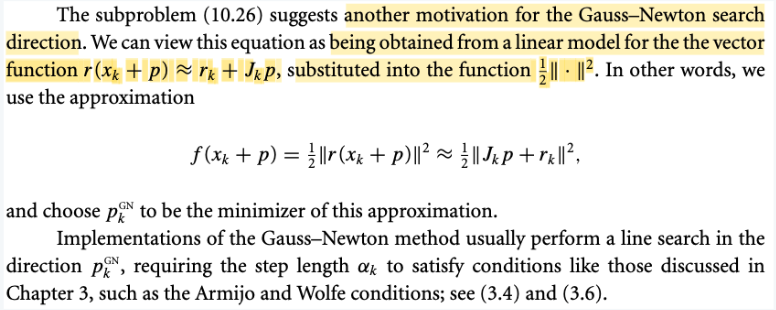</kbd>

> [!NOTE]
> Đoạn này đại khái là:
>
>  Còn nhớ, bài toán least square là bài toán tối ưu trong đó ta minimize f(x) =(1/2) Σj rj(x)^2 = ||r(x)||^2 = r(x)Tr(x).
>
> Và với cái này, ta đã chứng minh ∇f(x) = J(x)Tr(x) và Hessian ∇^2f(x) là J(x)TJ(x) + Σj=1:m rj(x) ∇^2rj(x)
>
> Và sau đó, ta mới lập luận rằng, trong bài toán least square thực tế, nhiều khi residual nhỏ, khiến có cái term thứ hai của Hessian không đáng kể so với JTJ, cũng như là khi đến gần solution thì term này cũng nhỏ. Do đó, ta có thể lấy JTJ làm xấp xỉ tốt, cho Hessian. Mà dù gì thì ta cũng sẽ tính gradient J để tính JTr, nên chỉ việc tính JTJ cũng không khó, và ta gọi đây là free Hessian. Từ đó, việc dùng JTJ thay cho Hessian chính xác trong việc tính Newton step giúp ta có Gauss Newton method. Mà việc giải tìm pkNG là tìm nghiệm của hệ (JkTJk)pkGN = - JkTrk thì chính là giải điều kiện tối ưu cần bậc nhất của bài toán optimization: minimize (1/2) ||Jkp + rk||^2
>
> Thế thì ở đây ta nhìn thêm góc nhìn khác: là ta xét hàm r(x), và thay nó bằng xấp xỉ tuyến tính của nó:
>
> r(xk + p) ≈ r(xk) + \[d/dx r(xk)\] p = r(xk) + Jkp
>
> Để rồi, thay vì dùng objective là squared norm của r(xk + p), ta dùng hàm xấp xỉ: r(xk) + Jkp
>
> = f(xk + p) = (1/2) ||r(xk + p)||^2 ≈ (1/2) ||r(xk) + Jkp||^2
>
> = (1/2) ||Jkp + rk||^2
>
> Ý nghĩa là: r(x) phi tuyến → f(x) phi tuyến bậc cao
>
> nhưng thay r(x) bằng hàm tuyến tính xấp xỉ nó, thì f(x) trở thành hàm bậc hai. Và hàm bậc hai thì có closed form minimizer. Và như vậy cho phép ta có bước nhảy tới đó, đó chính là Gauss Newton step.
>
> Và cái này thì thật ra cũng chỉ là: dùng hàm g xấp xỉ bậc hai của hàm f và đi giải bài toán minimize hàm g, là bài toán minimize hàm bậc hai, có closed form minimizer. Vốn dĩ cũng là cách ta giải các bài toán tối ưu đầu giờ thôi.
>
> Có nghĩa là, nó cũng y như việc ta giải bài toán minimize hàm f(x) = r(x)Tr(x) bằng Newton method: Ta cũng sẽ tại mỗi iteration, đặt ra subproblem: minimize hàm g(p) = xấp xỉ bậc hai của hàm f tại điểm đang đứng, và giải tìm Newton step p để nhảy đến minimizer của g. Thì trong bài toán này, newton step của g chính là Gauss Newton step pkGN.
>
>  Cuối cùng, gs cho biết, tuy là là tính Newton step (Gauss Newton step), mà theo lý mà nói ta có thể xài unit step factor (tức là nhảy ngay đến điểm tiếp theo bởi hướng và độ dài của Newton step). Tuy nhiên các thuật toán áp dùng Gauss Newton sẽ thường cũng chỉ dùng pkGN làm search direction, và sẽ đi tìm step size phù hợp, có thể là Armijo hay Wolfe condition đã bàn ở chap 3.

 

- **Convergence of the Gauss–Newton Method**

<kbd>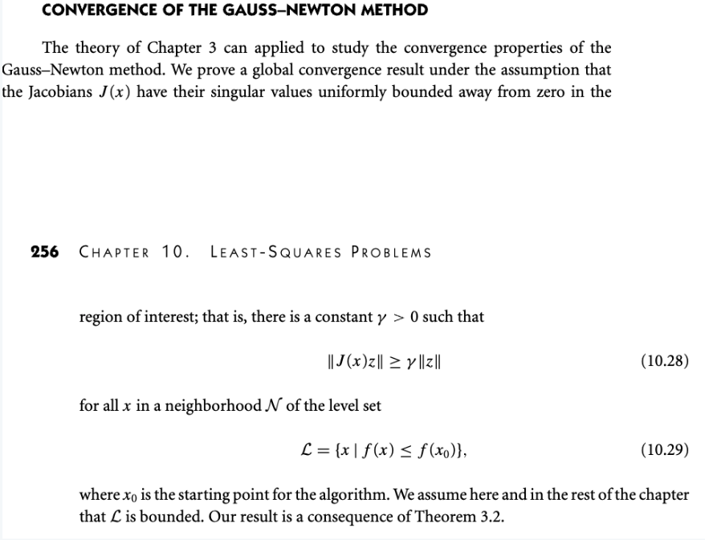</kbd>

 

- **Theorem 10.1**

<kbd>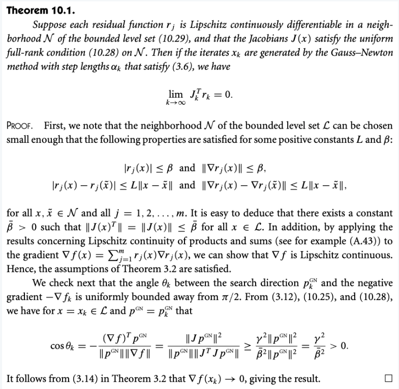</kbd>

 

- **Algorithms for Nonlinear Least-Squares**

<kbd>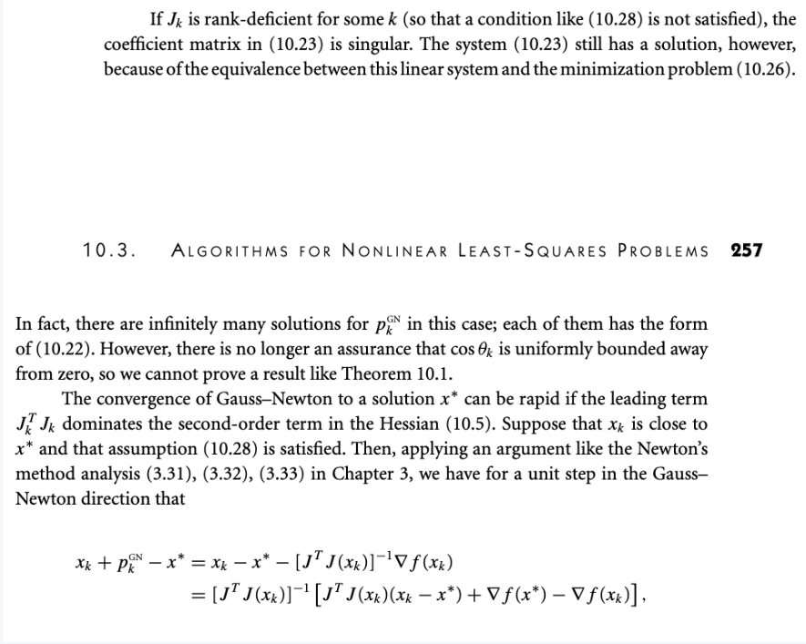</kbd>

<kbd>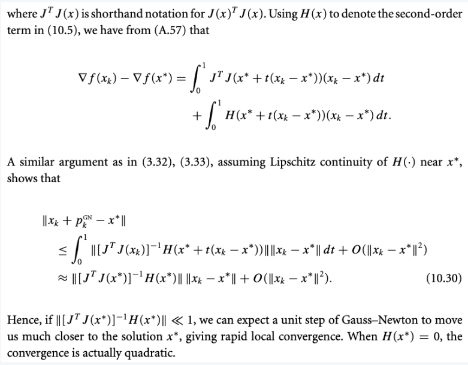</kbd>

<kbd>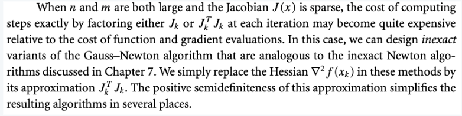</kbd>

 

- **The Levenberg-marquardt Method**

<kbd>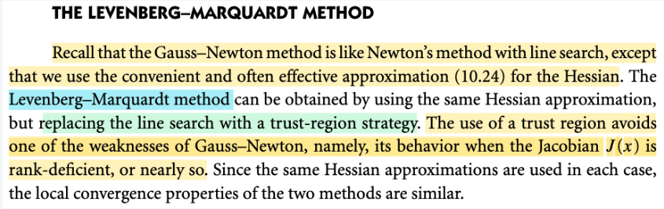</kbd>

<kbd>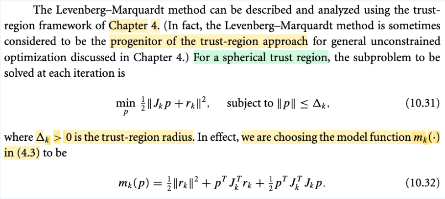</kbd>

> [!NOTE]
> Đoạn này đại ý là nói rằng Gauss Newton có nhược điểm là sẽ bị vấn đề khi J bị (hoạc gần bị) rank-deficient. Hiểu ý này là sao:
>
> Rank deficient là khi matrix không full rank (cả full column rank), đồng nghĩa là các cột không độc lập, tồn tại non-zero nullspace vector.
>
> Thế thì như đã nói, phương pháp Gauss Newton sẽ chỉ giống Newton method nhưng thay vì dùng Hessian ∇^2f(x) thì ta dùng JkTJk để xấp xỉ cho nó. Và Gauss Newton step là nghiệm của (JkTJk) pkGN = JkTrk (tức ∇fk).
>
> Và để hệ có nghiệm để giải ra được pkGN, thì JkTJk phải full rank, invertible. Mà nhờ MIT 1806 mình đã biết rồi, matrix ATA và A có chung nullspace. Nên muốn ATA full rank thì A phải full column rank. Do đó, nếu Jk rank deficient thì JkTJk sẽ không full rank, non invertible → không tồn tại pkGN (tức là thuật toán giải hệ trên sẽ fail)
>
> Nhưng nếu Jk gần rank deficient, tức các cột gần phụ thuộc chứ chưa hẳn là phụ thuộc, thì lúc này JkTJk vẫn invertible, nhưng nó sẽ có eigenvalue rất nhỏ, khiến eigenvalue của JkTJk sẽ rất lớn và dẫn đến nếu vô tình JkTrk gần trùng với hướng của eiegenvector thì (JkTJk)inv JkTrk tức pkGN sẽ có độ dài khổng lồ → thuật toán bị phân kì và line search cũng không thể khắc phục được.
>
> ---
>
>  Vậy thì để hiểu cái Levenberg-Marquardt mình phải nhớ lại sự khác nhau giữa hai trường phái lớn của tối ưu: Line search và Trust Region.
>
> Với line search, cơ bản là ta tìm direction, sau đó tìm step size. Direction có thể là steepest descent direction hoặc Newton step direction, hoặc một descent direction nào đó. Và tìm step size thì có thể giải bài toán tìm optimal step size (gọi là exact line search) hoặc là dùng các thuật toán backtracking để tìm step size đủ tốt (ví dụ như các điều kiện Armijo, Wolfe)
>
> Còn trust region thì đi theo cách tiếp cận ngược lại: quy định step size trước (tức trust region) sau đó mới giải bài toán tìm direction trong phạm vi cho phép - sẽ là bài toán tối ưu có ràng buộc.
>
> Vậy thì, phải hiểu thế này: Mục tiêu cuối cùng là giảm hàm objective f(x) = ||r(x)||^2.
>
> Và để đạt được mục tiêu đó, với bài toán linear least square thì ta có closed form solution, và để tính ra solution, thì ta có thể dùng các thuật toán thuần túy là đại số tuyến tính (cholesky, QR, SVD factored based method) hoặc CG.
>
> Còn với non-linear least square, ta phải theo lối iterative: Iteratively giải các bài toán subproblem
>
> Và với bài toán subproblem, thì ta có thể đi theo hai cách line search hoặc trust region.
>
> Và nếu đi theo line search approach, thì đáng lẽ ta sẽ theo các các tiếp cận đã biết như steepest direction hay Newton direciton, rồi tính step size. Nhưng vì tính chất của bài toán least square có nhiều thuận lợi nên ta có thể dùng JTJ để xấp xỉ tốt cho Hessian, và như vậy, ta sẽ đi tính Gauss Newton direction, thay vì Newton direction. Rồi cũng tính step size và nhảy đến điểm tiếp theo, và cứ thế lặp lại.
>
> Và note trước đã cho mình góc nhìn để thấy sự khác và giống nhau của Gauss Newton và Newton:
>
> Ta đều muốn tìm p để minimize f(xk + p), và p này nếu tìm được sẽ cho ta xk + p là solution của bài táon. Nhưng điều này quá khó. Thành ra ta phải làm theo cách thức sau:
>
> Nếu ta thay f(xk + p) = ||r(xk + p)||^2 bởi xấp xỉ bậc nai của nó tại xk: g(p) và đi tìm p để minimize cái này → p này chính là Newton direction.
>
> Nếu ta thây f(xk + p), vốn là ||r(xk + p)||^2, bởi h(p) = ||r(xk) + ∇r(x)Tp||^2 = ||Jkp + rk||^2, tức thay r(xk + p) bởi hàm xấp xỉ tuyến tính của r tại xk. Và đi minimize h(p), thì p này chính là Gauss Newton direction.
>
> Thế thì nay, là nói về đi theo trust region approach:
>
> Thế thì với trust region, ta sẽ đặt ra bán kính tin cậy, và giải bài toán tìm p minimize hàm một hàm số xấp xỉ của f trong bán kính tinh cậy đó.
>
> Và hồi đầu đến giờ ta đều dùng hàm xấp xỉ bậc hai của f, tức à g nói trên, để có bài toán:
>
> minimize g(p) s.t ||p|| ≤ Δk, và đây là trust region Newton quen thuộc
>
> Nhưng với bài toán least square, tương tự, như ở line search, khi ta minimize h(p) thay vì g(p), và gọi nó là Gauss Newton direction, thì ở đây ta cũng có thể không dùng g, mà dùng h:
>
> minimize h(p) = ||Jkp + rk||^2 s.t ||p|| ≤ Δ, và đây chính là Levenberg - Marquardt
>
> và cái hàm này ||Jkp + rk||^2 thì trong note trước mình đã thấy nó là (1/2)pTJkTJkp + rkTJkp + (1/2)rkTrk → chính là 10.32
>
> mà đem so với g(p) = (1/2)pTJkTJkp + rkTJkp + (1/2)pT(term 2)p + rkTrk
>
> thì đúng là chỉ khác ở chỗ: Hessian của người ta có 2 term, ta bỏ đi term 2, chỉ dùng term 2: JkTJk.

 

- **Lemma 10.2: Trust-Region Solution**

<kbd>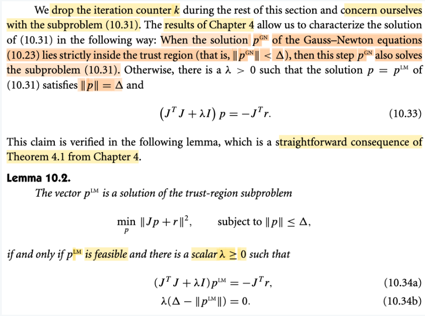</kbd>

> [!NOTE]
> Đây là dịp để ôn lại về theorem 4.1 của Trust Region method mà cũng là dịp để ôn lại kiến thức về KKT conditions đã học trong S.Boyd.
>
>
>
> Bài toán tổng quát là bài toán tối ưu có ràng buộc bất đẳng thức và ràng buộc đẳng thức:
>
>
>
> minimize f0(x) s.t fi(x) ≤ 0 i=1,2,... hj(x) = 0, j=1,2,...
>
>
>
> Nghiệm của bài toán này sẽ là x thỏa: thuộc domain của f0, f1, f2,...h1, h2,...(cái này gọi là ràng buộc ẩn (implicit constraint), thuộc feasible set (thỏa các constraint) và giúp hàm f0(x) có giá trị nhỏ nhất.
>
>
>
> Mình hiểu Lagrangian function là cách ta tích hợp constraint vào hàm objective L(x, λ, v) = f0(x) + Σi λifi(x) + Σj νjhj(x) và giới thiệu thêm constraint: λi ≥ 0, gọi là dual constraint.
>
>
>
> Thế thì lập luận tiếp theo như sau:
>
>
>
> Bằng cách minimize (over x) L(x, λ, ν), ta sẽ có function không phụ thuộc x, đặt là g(λ, ν), gọi là dual function:
>
>
>
> g(λ, ν) = inf_x L(x, λ, ν)
>
>
>
> Thế thì, vì định nghĩa của g, nên dĩ nhiên g(λ, ν) ≤ L(x, λ, ν) ∀x, và do đó, dĩ nhiên phải đúng với x \*\*(solution của bài toán đang tìm, là điểm thỏa constraint và minimize hàm f0(x)):
>
>
>
> g(λ, ν) ≤ L(x\*, λ, ν), và L(x\*, λ, ν) = f0(x\*) + Σi λifi(x\*) + Σj νjhj(x\*)
>
>
>
> Và hơn nữa, vì x phải thỏa constraint nên fi(x) ≤ 0, với λi ≥ 0 ∀i thì Σi λi fi(x\*) ≤ 0, hj(x\*) = 0 ∀j ⇨ Σj νj hj(x) = 0
>
>
>
> Do đó:
>
>
>
> g(λ, ν) ≤ L(x\*, λ, ν) = f0(x\*) + Σi λifi(x\*) + Σj νjhj(x\*) ≤ f0(x\*\*), và cái này người ta đặt là p\*: primal optimal
>
>
>
> Tiếp theo, ta mới xét bài toán gọi λ và ν là nghiệm của bài toán maximize λ, ν g(λ, ν), khi đó ta có:
>
>
>
> g(λ, ν) ≤ g(λ\*, ν\*) ∀λ, ν, và 'cái này người ta gọi là d\*, dual optimal
>
>
>
> Thế thì, vì g(λ, ν) ≤ L(x\*, λ, ν) ∀λ, ν nên dĩ nhiên ta cũng có:
>
> g(λ\*, ν\*) ≤ L(x\*, λ\*, ν\*)
>
>
>
> Như vậy ta có quan hệ:
>
>
>
> g(λ, ν) ≤ g(λ\*, ν\*) = d\* ≤ L(x\*, λ\*, ν\*) = f0(x\*) + Σi λifi(x) + Σj νjhj(x) ≤ f0(x\*) = p\*
>
>
>
> Và p - d gọi là duality gap, trong bài toán lồi, nếu thỏa các điều kiện gọi là (quên tên rồi?) ví dụ Slater condition, thì ta sẽ d = p
>
> Và lúc này sẽ dẫn đến:
>
> g(λ, ν) ≤ g(λ\*, ν\*) = d = L(x, λ\*, ν\*) = f0(x\*) + Σi λifi(x) + Σj νjhj(x) = f0(x\*) = p \*
>
>
>
> Tức là, ta có hai dấu bằng xảy ra:
>
>
>
> Dấu bằng thứ nhất: f0(x\*) + Σi λifi(x) + Σj νjhj(x) = f0(x\*\*)
>
> Vốn dĩ Σj νjhj(x) đã bằng 0
>
>
>
> nên thực ra ta có f0(x\*) + Σi λifi(x) = f0(x\*\*), và điều này suy ra: Σi λifi(x) = 0. Đây gọi là complementary slackness condition:
>
>
>
> vì λi ≥ 0, nên điều kiện này đồng nghĩa: nếu fi(x) &lt; 0, thì λi = 0. nếu λi &gt; 0 thì fi(x\*) = 0.
>
>
>
> Dấu bằng thứ hai: g(λ\*, ν\*) = d = L(x, λ\*, ν\*) = f0(x\*) + Σi λifi(x) + Σj νjhj(x): Để dễ hiểu hơn, ta nhớ lại rằng định nghĩa của dual function g là:
>
>
>
> g(λ, ν) = inf_x L(x, λ, ν). Và do định nghĩa này nên g(λ, v) ≤ L(x, λ, ν) ∀x, λ, ν. Và thay λ\*, ν \*\*vào (vì như đã nói, nó đúng với mọi λ, ν mà) ta có:
>
>
>
> g(λ\*, ν\*) ≤ L(x, λ\*, ν\*) ∀x
>
>
>
> Vậy mà với x\* và có dấu bằng xảy ra, g(λ\*, ν\*) = L(x\*, λ\*, ν\*) thì có nghĩa là: L(x\*, λ\*, ν\*) = inf_x L(x\*, λ\*, ν\*), và như vậy có nghĩa là:
>
>
>
> x\* chính là minimizer của L(x, λ\*, ν\*).
>
>
>
> Và vì vậy, gradient d/dx L(x, λ\*, ν\*)|x=x\*phải = 0, đây là stationary condition:
>
>
>
> ∇\_x L(x, λ\*, ν\*) = 0.
>
>
>
> Cuối cùng, ta kể thêm các điều kiện như:
>
>
>
> i) dual constraint λi\* ≥ 0
>
>
>
> ii) primal constraint fi(x) ≤ 0 i=1,2.., hj(x) = 0 j=1,2,...
>
>
>
> Tổng hợp lại chính là KKT conditions:
>
>
>
> Stationary condition: ∇\_x L(x, λ\*, ν\*) = 0.
>
>
>
> Complementary slackness condition: Σi λi fi(x) = 0
>
>
>
> Dual constraint: λi\* ≥ 0, i=1,2...
>
>
>
> Primal constraint: fi(x) ≤ 0 i=1,2.., hj(x) = 0 j=1,2,...
>
>
>
> Với bài toán lồi, KKT condition là điều kiện đủ để kết luận optimal, còn với bài toàn bình thường thì nó là điều kiện cần.
>
>
>
> ---
>
>
>
>  Với việc đã ôn lại KKT conditions, ta sẽ hiểu cái Lemma 10.2:
>
>
>
> Bài toán tối ưu đặt ra là minimize over p {||Jp + r||^2} s.t ||p|| ≤ Δ, và lemma nói rằng pLM là solution nếu như nó thỏa: là feasible point (tức thỏa constraint), và tồn tại scalar λ không âm sao cho (JTJ + λI) pLM = -JTr và λ(Δ - ||pLM||) = 0.
>
>
>
> Thử liên hệ nó với KKT conditions:
>
>
>
> Đầu tiên bài toán minimize over p {||Jp + r||^2} s.t ||p|| ≤ Δ equivalent với
>
>
>
> minimize over p {||Jp + r||^2} s.t (1/2)||p||^2 ≤ (1/2)Δ^2. Lí do là vì constraint ||p|| ≤ Δ (a) tương đương (1/2)||p||^2 ≤ (1/2) Δ^2 (b), vì Δ không âm. Do đó việc p thỏa thì cũng thỏa (a).
>
>
>
> Stationary condition của KKT ta ôn ở trên nói rằng: ∇\_x L(x, λ\*, ν\*) = 0.
>
>
>
> Vậy ở đây, hàm cần tối ưu là f0(p) = ||Jp + r||^2 (biến tối ưu là p). Và bài toán toán này có một inequality condition f1(p) = (1/2)(||p||^2 - Δ^2) ≤ 0. Nên Lagrangian function là:
>
>
>
> L(p, λ) = f0(p) + λf1(p) = ||Jp + r||^2 + (λ/2)(||p||^2 - Δ^2)
>
>
>
> Khi đó gradient của L đối với p là:
>
>
>
> ∇\_p L(p, λ) = d/dp \[||Jp + r||^2 + (λ/2)(||p||^2 - Δ^2)\]
>
>
>
> = d/dp \[||Jp + r||^2\] + d/dp \[(λ/2)(||p||^2 - Δ^2)\]
>
>
>
> = d/dp \[||Jp + r||^2\] + (λ/2) d/dp (||p||^2) 
>
>
>
> ||Jp + r||^2 = (Jp + r)T(Jp + r) = (pTJT + rT)(Jp + r) = pTJTJp + rTJp + pTJTr + rTr
>
>
>
> = pTJTJp + 2rTJp + rTr
>
>
>
> và ta biết gradient của hàm f(x) = (1/2)xTPx + qTx + r sẽ là PTx + q.
>
>
>
> Nên ở đây, ∇\_p \[pTJTJp + 2rTJp + rTr\] = 2 ∇\_p \[(1/2)pTJTJp + rTJp + (1/2)rTr\] = 2 (JTJ p + JTr)
>
>
>
> Còn d/dp (||p||^2)  = d/dp pTp là gì?
>
>
>
> Làm theo lối MIT 18s096 đã học: tìm cách đửa d(||p||^2) về dạng linear operator act on dp
>
>
>
> d(||p||^2) = d(pTp) = (p+dp)T(p+dp) - pTp = (pT+dpT)(p+dp) - pTp = pTp+dpTp+pTdp+dpTdp - pTp
>
>
>
> = 2pTdp + dpTdp
>
>
>
> = 2pTdp (bỏ đi term bậc cao dpTdp)
>
>
>
> Như vậy, tại đây ta có dot product của 2p và dp, chính là linear operator act on dp, nên ⇒ ∇(pTp) = 2p
>
>
>
> Vậy: ∇\_p L(p, λ) = 2 (JTJ p + JTr) + (λ/2)2p
>
>
>
> Và stationary condition: ∇\_p L(p, λ) = 0 ⇔ 2 (JTJ p + JTr) + λp = 0
>
>
>
> ⇔ JTJ p + JTr + λp = 0
>
>
>
> ⇔ JTJ p + (λ/2)p = -JTr
>
>
>
> ⇔ JTJ p + (λ/2)p = -JTr
>
>
>
> ⇔ (JTJ + (λ/2)I)p = -JTr 
>
>
>
> vì λ chỉ là constant (Lagrange multiplier) nên có thể đặt λ mới  = λ/2, để có 
>
>
>
> (JTJ + (λI)p = -JTr 
>
>
>
> → đây chính là 10.34a
>
>
>
> Còn complementary slackness sẽ cho ra 10.34b:
>
>
>
> Công thức của complementary slackness condition: Σi λ\*i fi(x\*) = 0, áp dụng vào đây, chính là:
>
>
>
> λ\*(||p\*||^2 - Δ^2) = 0
>
>
>
> ⇔ λ\*(||p\*|| - Δ)(||p\*|| + Δ) = 0
>
>
>
> ⇔ λ\*(||p\*|| - Δ) = 0 → đây chính là 10.34b, ở đây tự hiểu p\* chính là pLM, và λ chính là λ\*, là dual variable.
>
>
>
> Như vậy việc mình biết KKT condition, giúp thấy rõ hai cái điều kiện 10.34a và 10.34b chỉ là KKT conditions thôi.

> [!TIP]
> **🤖 AI Feedback** — ✅ Score: **98/100**
>
> Tuyệt vời. Bạn đã trình bày một cách chi tiết và chính xác mối liên hệ giữa điều kiện KKT và Lemma 10.2, với các bước suy luận toán học rõ ràng và dễ hiểu, thể hiện sự nắm vững kiến thức vững chắc.

**🔗 See also:** [Theorem 4.1](./40_trust_region_methods_outline_of_the_trust_region_approach.md#node-6p1mgzb)

 

- **Solving Least-Squares Subproblem**

<kbd>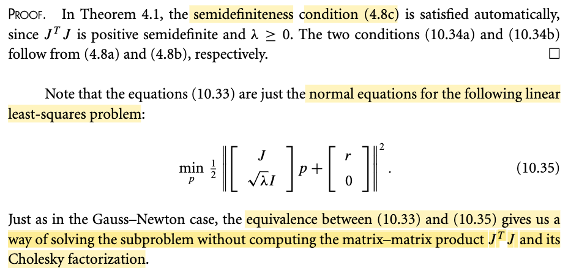</kbd>

> [!NOTE]
> Phần chứng minh đơn giản chỉ là chỉ ra rằng ở đầy đều thỏa các điều kiện của theorem 4.1. Vậy thôi.
>
>
>
> Một điểm cần là rõ, là vì sao gs nói 10.33 ((JTJ + (λI)p = -JTr) lại chỉ là normal equation của bài toán linear least-square 10.35: minimize over p {(1/2) square norm của Up + q với U = \[J; I√λ\] và q = \[r; 0\].
>
>
>
> Normal equation của bài toán least square minimize f(x) = (1/2) ||Ax - b||^2 thật ra chỉ chính là cái first order optimality condition ∇f(x) = 0 thôi có khỉ gì đâu.
>
>
>
> ∇f = (1/2) d/dx (Ax - b)T(Ax - b) =  (1/2) d/dx (xTAT - bT)(Ax - b)
>
>
>
> = (1/2) d/dx (xTATAx - bTAx - xTATb + bTb)
>
>
>
> = d/dx \[(1/2)xTATAx - bTAx - xTATb + (1/2)bTb)
>
>
>
> = d/dx \[(1/2)xTATAx - bTAx + (1/2)bTb)
>
>
>
> = ATAx - ATb
>
>
>
> Và first order optimality condition: ATAx - ATb ⇔ ATAx = ATb, đây chính là normal equation.
>
>
>
> Nên ở đây nếu ta thay A = \[J; I√λ\] và b = -\[r;0\] và x = p thì ta có:
>
>
>
> \[J; I√λ\]T\[J; I√λ\]p = -\[J; I√λ\]T\[r;0\]
>
>
>
> ⇔ \[JTJ  + √λ (ITI) √λ\]p = -\[JTr + √λ IT0\]
>
>
>
> ⇔ (JTJ  + λI)p = -JTr → chính là 10.33

> [!TIP]
> **🤖 AI Feedback** — ✅ Score: **98/100**
>
> Bài phân tích của bạn rất sâu sắc, đặc biệt là phần chứng minh chi tiết việc phương trình (10.33) là phương trình chuẩn (normal equation) của bài toán bình phương tối thiểu (10.35). Cách bạn diễn giải và dẫn ra công thức là rất chính xác, thể hiện sự hiểu biết vững chắc về lý thuyết, mặc dù có thể làm rõ hơn một chút các bước trung gian khi lấy đạo hàm của biểu thức ||Ax - b||^2 để đạt độ chặt chẽ tuyệt đối.

**🔗 See also:** [Theorem 4.1](./40_trust_region_methods_outline_of_the_trust_region_approach.md#node-6p1mgzb)

 

- **Triển khai Levenberg-Marquardt**

<kbd>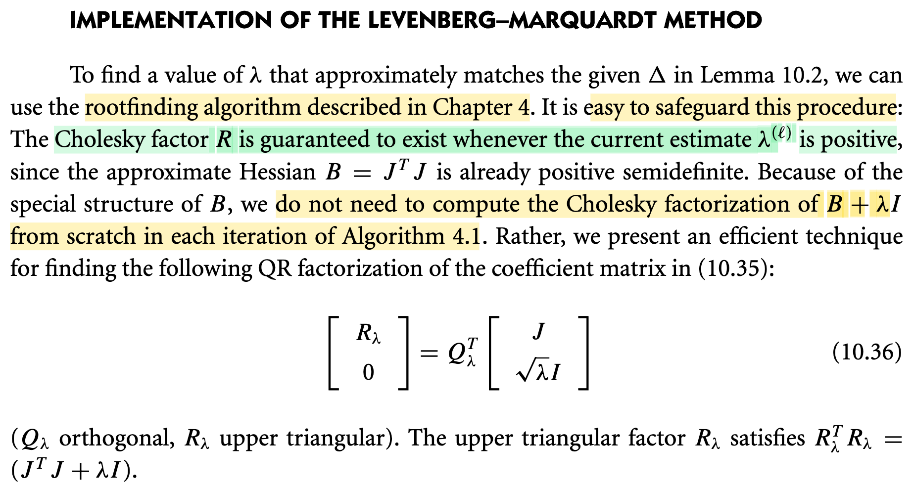</kbd>

**🔗 See also:** [Algorithm 4.1 (Trust Region)](./40_trust_region_methods_outline_of_the_trust_region_approach.md#node-c4gu30d)

 

