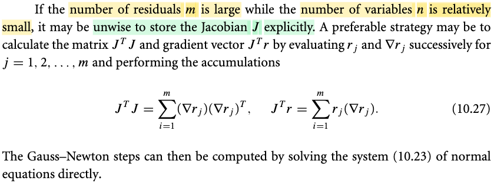

# 10.3 Algorithms for nonlinear least-squares problem

📊 **Progress:** `6` Notes | `6` Screenshots | `6` AI Reviews

---

## 10.3 Algorithms for nonlinear least-squares problem

 

## The Gauss-Newton Method

<kbd></kbd>

> [!NOTE]
> Đầu tiên vẫn là nói về việc giải bài toán least-square: minimize f(x) = Σi ri(x)^2 (10.1)
>
>
>
> Còn nhớ trong 10.2, khi nói rằng hàm Φ(x, ti) là hàm tuyến tính theo x, dẫn đến ri(x) = Φ(x, ti) - yi cũng là linear (đúng hơn là affine) function theo x, thì khi đó hàm vector x → vector r(x) = \[r1(x), r2(x),..\] có thể được thể hiện bởi: r(x) = Jx, để rồi Σi ri(x)^2 có thể được thể hiện bởi ||Jx - y||^2. Lúc này bài toán được gọi là linear least-square.
>
>
>
> Thế thì mình cần hiểu, **không phải là vì hàm objective là hàm tuyến tính theo x**. Không hề, vì **ngay cả khi r(x) là linear thì objective vốn là r(x)Tr(x), vẫn là hàm non-linear theo x**. Ta chỉ gọi là **linear least square bởi vì r(x) là linear function của x mà thôi**, và khi không có điều này, thì dĩ nhiên bài toán là non-linear least square.
>
>
>
> Rồi, thế thì, ở phần trước (10.2) với việc hàm r(x) tuyến tính, dẫn đến bài toán được đơn giản hóa, khiến việc giải ra nghiệm chỉ là giải normal equation, nói cách khác, ta có closed form solution từ ta có thể giải theo cách direct (dùng Cholesky factorization, QR factor based method, hoặc SVD based method) method - mà cơ bản chỉ là dùng đại số tuyến tính để giải, (trừ bài toán lớn thì dùng Conjugate gradient - mới là thuật toán tối ưu)
>
>
>
> Qua phần này, ta phải quay lại thực tế, là bài toán không đơn giản như 10.2, tuy nhiên, ở phần mở màn của chapter này, gs Nocedal đã nói rằng, bài toán least square mang vài đặc điểm thuận lợi hơn các bài toán khác, mà ta có thể khai thác. Cụ thể, là **gradient và Hessian cuả nó trong nhiều trường hợp là dễ tính** (ít tốn kém), thì đây chính là lúc ta nói về chuyện này. (có nghĩa cần hiểu bức tranh là, ở 10.2, ta chưa cần khai thác đặc điểm này, đơn giản là vì với bài toán linear least square, mọi chuyện được đơn giản hóa hơn nhiều, để rồi bây giờ mới nói về việc khai thác đặc điểm "**free Hessian**" của bài toán least-square.

> [!TIP]
> **🤖 AI Feedback** — ✅ Score: **95/100**
>
> Ghi chú giải thích rất sâu sắc về sự khác biệt giữa các bài toán least-square tuyến tính và phi tuyến, đồng thời làm rõ tầm quan trọng của việc khai thác cấu trúc gradient và Hessian. Việc liên hệ với phần 10.2 giúp người đọc dễ dàng nắm bắt bối cảnh và lý do tại sao phương pháp này được giới thiệu.

 

### Gauss-Newton Method Approximation

<kbd></kbd>

> [!NOTE]
> Rồi, thế thì trước tiên nên nhắc lại công thức của gradient và Hessian của objective mà trong 10.1 mình đã tự derive:
>
>
>
> ∇f(x) = J(x)Tr(x) (10.4)
>
>
>
> ∇^2f(x) = J(x)TJ(x) + Σi {∇^2ri(x) ri(x)} (10.5)
>
>
>
> Thế thì đại khái lập luận là như sau: Như đã nói nhiều lần trong các chapter trước, cũng như trong Convex Optimization S.Boyd, ta đã thấy rằng, với các cách tiếp cận iterative để giải bài toán tối ưu, thì cơ bản đều có cùng một bản chất: Ta bắt đầu từ điểm nào đó, và tìm cách di chuyển dần đến minimizer của hàm mục tiêu. Và việc đánh giá một thuật toán tối ưu hiệu quả nhiều hay ít chỉ xoay quanh một vấn đề: Chi phí. Chi phí ở đây, có thể hiểu bao gồm tính khả thi đạt được sự hội tụ về minimizer cũng như chi phí tính toán và thời gian để đạt được. Thuật toán hiệu qủa sẽ thể hiện ở chỗ hội tụ nhanh cũng như chi phí tính toán các bước thấp.
>
> \
> Và Newton method được chứng minh là có tốc độ hội tụ nhanh, như đã học bên Conv Opt, khi bước vào Newton phase (đủ gần minimizer) thì tốc độ hội tụ sẽ là quadratic (gọi là quadratic convergence)
>
>
>
> Vấn đề là, để có Newton direction, ta sẽ phải có Hessian. Ôn lại nhanh Newton direction:
>
>
>
> Ý tưởng rất đơn giản: tại điểm đang đứng, ví dụ gọi là x0, ta sẽ coi như hàm số là hàm bậc hai: f(x) ≈ f(x0) + ∇f(x0)(x - x0) + (1/2)(x-x0)T ∇^2f(x0)(x-x0). Đặt đây là hàm g(p) = f(x0) + ∇f(x0)p + (1/2)pT∇^2f(x0)p (p = x - x0). Câu chuyện tiếp theo sẽ là, tìm minimizer của hàm quadratic g(p), bằng closed-form solution:
>
>
>
> ∇g(p) = 0 ⇔ ∇^2f(x0)p + ∇f(x0) = 0 (đây là cái mà gs gọi là standard Newton equation ∇^2f(xk)p = - ∇f(xk))
>
>
>
> ⇔ p = - \[∇^2f(x0)\]inv ∇f(x0)
>
>
>
> Đây chính là Newton direction (Newton step), có nghĩa là từ x0 chỉ cần phóng theo p ta sẽ tới x0 - \[∇^2f(x0)\]inv ∇f(x0) chính là điểm sẽ minimize hàm g(p).
>
>
>
> Như vậy, có thể thấy để có được Newton Step, ta sẽ cần gradient và Hessian tại xk.
>
>
>
> Và việc tính Hessian quá tốn kém chính là trở ngại của việc dùng Newton method.
>
>
>
> Thế thì, trong bài toán Least Square, gs nói có 2 đặc điểm:
>
>
>
> i) Đầu tiên, dễ thấy là Hessian có hai term, thì một term là J(x)TJ(x), thì term trong nhiều trường hợp, sẽ lấn át (dominant) term thứ hai, khiến cho việc bỏ đi term thứ hai không gây ra sai lệch nhiều, hay nói cách khác, chỉ dùng term thứ nhất cũng có thể xấp xỉ tốt Hessian, dẫn đến thuật toán này (gọi là Gauss-Newton) sẽ vẫn đạt tốt độ hội tụ nhanh như Newton thứ thiệt.
>
>
>
> ii) Và ý thứ hai đó là, việc tính gradient J(x)Tr(x) rồi thì tính thêm cái cục J(x)TJ(x) sẽ không tốn thêm mấy (là vì đã tính ra J(x) phục vụ cho việc tính gradient rồi thì tính J(x)TJ(x) chỉ là nhân matrix matrix, không tốn thêm gì nhiều)
>
>
>
> Tóm lại, vì hai đặc điểm này, nên ta dùng J(x)TJ(x) thay cho ∇^2f(x), để rồi Newton equation (giúp giải tìm Newton step) sẽ là:
>
>
>
> J(xk)TJ(xk)p = - J(xk)Trk
>
>
>
> hay viết gọn là JkTJk p = - JkTrk
>
>
>
> Một ý cuối đó là, cái vụ term J(x)TJ(x) dominate term thứ hai thường xuất hiện trong các bài toán mà residual nhỏ, hoặc chúng là hàm gần tuyến tính, và đây là những yếu tố xuất hiện nhiều trong cái bài toán thực tế, giúp cho việc dùng Gauss Newton sẽ có tác dụng.

> [!TIP]
> **🤖 AI Feedback** — ✅ Score: **97/100**
>
> Bài viết giải thích rất chi tiết và chính xác về lý do và cách thức phương pháp Gauss-Newton sửa đổi so với phương pháp Newton tiêu chuẩn, bao gồm cả hai đặc điểm chính đã được nêu bật trong văn bản. Độ sâu của phân tích rất tốt, tuy nhiên, phần mở đầu có thể ngắn gọn hơn một chút để đi thẳng vào vấn đề chính sớm hơn.

 

#### Gauss-Newton Descent Direction

<kbd></kbd>

> [!NOTE]
> Tiếp theo, đại khái là nói về một ưu điểm nữa của Gauss-Newton. Có lẽ nên ôn nhanh, Gauss-Newton là gì:
>
>
>
> Bối cảnh là ta muốn quay lại đối mặt với bài toán least-square trong trường hợp residual là non-linear function, mà trước đó, trong 10.2, khi ta xét case residual r(x) là linear function, để rồi có dạng Jx - y, khiến việc giải bài toán minimize ||r(x)||^2 trở thành bài toán giải hệ phương trình tuyến tính (normal equation, JTJx = JTb) và từ đó có thể dùng các thuật toán đại số tuyến tính đơn thuần như Cholesky factorization giải normal equation, QR factorization based method và SVD based method. Trừ trường hợp bài toán có quy mô lớn thì ta sẽ dùng Conjugate Gradient method - là thuật toán chuyên trị việc giải tìm nghiệm của hệ Ax = b.
>
>
>
> Thì nay, không còn sự tiện lợi đó, ta mới lại xét một đặc điểm của bài toán least square mà gs đề cập ở phần đầu chương 10, cũng như vừa nhắc lại ở note trước, đó là, bài toán này có gradient của hàm objective ∇f(x) = J(x)Tr(x) và Hessian = J(x)TJ(x) + một term thứ hai.
>
>
>
>  Thế thì, đặc điểm tốt của bài toán least square đó là, gs nói đại ý là đa số trường hợp thực tế cái term thứ hai của Hessian chính xác rất không đáng kể so với term thứ nhất J(x)TJ(x), khiến việc ta dùng J(x)TJ(x) để xấp xỉ cho Hessian là chấp nhận được. Và như vậy, dự trên sự thật là đằng nào thì ta cũng sẽ có J(x), nên ta sẽ có luôn Hessian xấp xỉ J(x)TJ(x), và vì nó tốt (phần lớn là xấp xỉ tốt cho Hessian thật) nên mới nói là ta có Hessian miễn phí, từ đó có thể dùng thuật toán Newton để giải bài toán này. Nhưng vì không hẵn là Newton thật (vì chỉ khi dùng Hessian thật, thì mới là Newton step thật), nên mới gọi là Gauss Newton. Dĩ nhiên, dùng J(x)TJ(x) thay cho Hessian ∇^2f(x) thì ta không gọi là Newton step pk_N (= -\[∇^2f(x)\]inv ∇f(x)) nữa mà gọi là Gauss-Newton step pk_GN = -(JkTJk)inv JkTr.
>
>
>
> (và được biết thì Gauss cũng chính với Gaussen distribution của xác suất, hay khử Gauss của đại số tuyến tính)
>
>
>
> Vậy thì quay lại đây, tiếp nối hai ưu điểm ở trên (free Hessian, và J(x)TJ(x) xấp xỉ tốt Hessian) thì ở đây nói về ưu điểm thứ ba: Là khi Jk full rank thì ∇fk = JkTrk khác 0 và pk_GN (Gauss-Newton step) trở thành descent direction.
>
>
>
> Ôn lại thế nào gọi là descent direction: Đơn giản là hướng đi giúp ta đi xuống, thể hiện bởi directional derivative ≤ 0: ∇f(x)Tp ≤ 0. Giúp cho khi đi ra khỏi x một đoạn nhỏ, theo theo hướng p này, xét hàm g(t) = f(x) giới hạn theo phương p: g(t) = f(x + tp). g'(t) = ∇f(x+tp)Tp, và g'(t)|t=0 = ∇f(x)Tp, với việc p là descent direction thì g'(t)|t=0 ≤ 0. Nên nếu đi ra khỏi x một đoạn nhỏ theo hướng p, thì theo linear approx g(t) ≈ g(0) + g'(0)t sẽ < g(0) ⇨ giá trị hàm giảm xuống, nên mới gọi là descent direction (chú ý, và steepest descent - độ dốc lớn nhất,  chính là -∇f(x))
>
>
>
> Vậy quay lại đây, xét directional derivative wrt hướng Gauss-Newton: ∇fkTpkGN
>
>
>
> Dùng pkGN = -(JkTJk)inv ∇fk ⇨ ∇fk = -JkTJk pkGN
>
>
>
> ⇨ ∇fkTpkGN = (-JkTJk pkGN)TpkGN
>
>
>
> = (-(JkTJk)pkGN)TpkGN
>
>
>
> = -(pkGN)T(JkTJk)TpkGN
>
>
>
> = -(pkGN)TJkTJkpkGN
>
>
>
> = -(JkpkGN)T(JkpkGN)
>
>
>
> = - ||JkpkGN||^2 và đây là negative square norm, nên đương nhiên ≤ 0 cho thấy pkGN là descent direction.
>
>
>
> ---
>
>
>
> Thêm nữa dấu bằng xảy ra khi Jk pkGN = 0
>
>
>
> Mà đã nói Jk full column rank, thì như nhờ MIT 180, ta biết khi đó các cột của J độc lập, nullspace chỉ có vector zero. Vậy Jk pkGN = 0 ⇔ pkGN = 0, cho thấy lúc này ta sẽ không đi đâu nữa
>
>
>
> Đồng thời, thế pkGN = 0 vào  (JkTJk)pkGN = ∇fk, thì cũng cho thấy ∇fk = 0, tức là tại điểm mà Jk pkGN = 0 thì cũng chính là stationary point

> [!TIP]
> **🤖 AI Feedback** — ✅ Score: **98/100**
>
> Ghi chú rất chính xác và cực kỳ sâu sắc, không chỉ mô tả ưu điểm mà còn cung cấp bối cảnh chi tiết và chứng minh toán học đầy đủ. Khả năng giải thích cặn kẽ từng bước là một điểm mạnh lớn.

 

##### Gauss-Newton Linear Least-Squares

<kbd></kbd>

> [!NOTE]
> Ôn lại chút xíu, nói một cách ngắn gọn thì Gauss Newton method là khi ta dùng JkTJk (vốn chỉ là phần thứ nhất trong công thức của Hessian = ∇^2fk = JkTJk + term thứ 2) để xấp xỉ Hessian, và đây là một ưu điểm của bài toán least square vì thực tế thường cho phép xấp xỉ này, và cũng như là nhờ vậy, việc có Hessian trở nên không tốn kém mấy. Và như vậy, công thức Newton step trở thành công thức Gauss Newton: pkGN = -(JkTJk)inv JkTr, là solution của (JkTJk) pkGN = -JkTr → Công thức này chính là 10.23,
>
>
>
> Vậy thì ở đây ta sẽ nhớ lại bài toán linear least square: Nói một cách ngắn gọn, là khi residual r(x) là tuyến tính (tí quay lại chỗ này), để rồi có dạng r(x) = Jx - y. Khi đó objective là (1/2)||r(x)||^2 = (1/2)(Jx - y)T(Jx - y) = (1/2)(xTJT - yT)(Jx - y) = (1/2)xTJTJx - (1/2)yTJx - (1/2)xTJTy + (1/2)yTy = (1/2)xTJTJx - yTJx + (1/2)yTy. Và gradient lúc này là JTJx-JTy và Hessian là JTJ.
>
>
>
> Lúc này bài toán minimize hàm ||r(x)||^2, là bài toán tối ưu hàm quadratic, có closed form solution: là nghiệm của phương trình normal equation: JTJx - JTy = 0 ⇔ JTJx = JTy → đây là 10.14.
>
>
>
> Vậy thì so sánh 10.23 (JkTJk) pkGN = JkTr, giúp giải ra Gauss Newton step, với 10.14, JTJx = JTy giúp giải ra solution của bài toán linear least square, ta thấy có sự tương đồng. Nên dễ thấy việc tìm pkGN chính là giải một bài toán linear least square khác.
>
>
>
> Do đó nếu JTJx = JTy normal equation của bài toán minimize (1/2)||Jx - y||^2 thì (JkTJk) pkGN = -JkTrk chính là normal equation của bài toán minimize (1/2)||Jk p - (-rk)||^2 = (1/2)||Jkp + rk||^2 → Đây là 10.26
>
>
>
> Nói thêm chút về điểm (1) ở trên: Trong bối cảnh Nocedal, người ta chỉ tập trung vào vấn đề tối ưu hóa, nên chỉ đặt ra vấn đề là ta muốn minimize hàm f(x) = Σi ri(x)^2 = ||r(x)||^2 với r(x) = \[r1(x), ...rn(x)\] và ri(x) là residual function theo x, x là biến tối ưu. Và khi hàm ri(x) là hàm tuyến tính theo x, kéo theo r(x) cũng vậy, để lúc này r(x) có thể thể hiện bởi Jx - y, ta có bài toán linear least square.
>
>
>
> Thì trong Bishop, mình hiểu rõ hơn. Đó là khi ta muốn xây dựng prediction function y(w,x) với x là input vector và w là vector adjustable parameter, để rồi error, hay residual r = t - y(w, x). Và ta chỉ quan tâm đến nó như hàm của w, nên ta ghi r(w). Và với các cặp xi, ti khác nhau, ta có các ri(w). Đây chính là tương ứng với ri(x) ở trên. Và với bài toán machine learning, ta muốn tìm w để minimize sum square error: Σ ri(w)^2 = Σi \[y(w, xi) - ti\]^2.
>
>
>
> Rồi, lại nói tiếp, y(w,x), thì ta cũng biết, người ta sẽ có thể dùng hàm basis để tạo các non-linearity của input, y(w,x) = wTφ(x) với w = (w0, w1,...wM-1), Φ(x) = \[1, Φ1(x), Φ2(x),...\]. Lúc này y(w,x) tuy là hàm phi tuyến đối với x, nhưng vẫn tuyến tính đối với w. Và như vậy ri(w) = wTΦi(x) - ti. Và nếu đặt matrix Φ (gọi là design matrix) có các hàng là Φ(x1), thì vector r(w) = ΦTw - t, để rồi, ||r(w)||^2 = ||ΦTw - t||^2. Đây chính là tương ứng với ||Jx - y||^2 trong Nocedal.
>
>
>
> Nói chung viết ra như vậy để thấy sự liên hệ giữa Bishop và Nocedal.
>
>
>
> Vậy thì quay lại đây, khi đã nhận định rằng Gauss Newton step pkGN là nghiệm của bài toán linear least square có objective (1/2)||Jkp + rk|| rồi, thì ta có thể dùng các phương phải giải của linear least square để tính pkGN...

> [!TIP]
> **🤖 AI Feedback** — ✅ Score: **96/100**
>
> Bài viết này rất sâu sắc và chính xác, giải thích cặn kẽ mối liên hệ giữa phương pháp Gauss-Newton và bài toán bình phương tối thiểu tuyến tính, bao gồm cả việc dẫn xuất và so sánh các phương trình chuẩn. Để hoàn thiện hơn, bạn có thể cân nhắc bổ sung thêm về lợi ích của việc sử dụng các thuật toán như QR, SVD hay conjugate gradient để tránh tính toán trực tiếp xấp xỉ Hessian J_k^T J_k.

 

- **Least-Squares Search Direction**

<kbd></kbd>

> [!NOTE]
> Đoạn này có thể hiểu như vầy, đại ý là khi ta có m >> n nhiều, thì khi đó, việc tính và lưu trữ J (kích thước m × n) là không không ngoan, bởi vì dù gì việc tính Gauss Newton step chỉ cần JTJ và JTr thôi, và JTJ có shape (n × m) (m × n) = (n × n) và JTr chỉ là (n × m) (m × 1) = (n × 1), tức là sẽ có kích thước nhỏ hơn nhiều.
>
>
>
> Vậy thì ta hiểu 10.27 thế này:
>
>
>
> Theo góc nhìn thứ 4 trong việc nhân hai matrix của thầy Strang MIT 18.06, thì JTJ chính là tổng các rank 1 matrix tạo bởi các outer product của \[cột j của JT\] và \[hàng j của J\] với j = 1,2,...m. Mà cột j của JT chính là hàng j của J, và là chính là vector chứa các partial derivative của ri đối vối x: ∇rj. Vậy nên JTJ = Σj=1:m ∇rj(∇rj)T.
>
>
>
> Từ đó mới mở ra cách tính JTJ theo lối iterative: cho chạy vòng lặp từ 1 tới m, và tính và cộng dồn ∇rj(∇rj)T.
>
>
>
> Tương tự, JTr, theo góc nhìn thứ hai của việc nhân matrix với vector, là linear combination các cột của JT, cũng là các hàng của J, là ∇rj với hệ số là các phần tử của r: JTr = Σj=1:m rj(∇rj). Từ đó cho phép ta tính cái này theo kiểu cộng dồn tương tự.
>
>
>
> Nói chung là, chỉ là đừng có dại mà tính J làm gì khi chỉ cần JTJ và JTr.

> [!TIP]
> **🤖 AI Feedback** — ✅ Score: **98/100**
>
> Phần giải thích rất rõ ràng và sâu sắc, đặc biệt là việc phân tích các công thức (10.27) dựa trên các khái niệm đại số tuyến tính như tích ngoài và tổ hợp tuyến tính. Việc phân tích kích thước ma trận cũng rất chính xác và hữu ích. Bạn đã nắm bắt rất tốt ý chính và cung cấp thêm góc nhìn chuyên sâu.

 

- **Gauss-Newton Search Direction Motivation**

<kbd></kbd>

> [!NOTE]
> Đoạn này đại khái là:
>
>
>
>  Còn nhớ, bài toán least square là bài toán tối ưu trong đó ta minimize f(x) =(1/2) Σj rj(x)^2 = ||r(x)||^2 = r(x)Tr(x).
>
>
>
> Và với cái này, ta đã chứng minh ∇f(x) = J(x)Tr(x) và Hessian ∇^2f(x) là J(x)TJ(x) + Σj=1:m rj(x) ∇^2rj(x)
>
>
>
> Và sau đó, ta mới lập luận rằng, trong bài toán least square thực tế, nhiều khi residual nhỏ, khiến có cái term thứ hai của Hessian không đáng kể so với JTJ, cũng như là khi đến gần solution thì term này cũng nhỏ. Do đó, ta có thể lấy JTJ làm xấp xỉ tốt, cho Hessian. Mà dù gì thì ta cũng sẽ tính gradient J để tính JTr, nên chỉ việc tính JTJ cũng không khó, và ta gọi đây là free Hessian. Từ đó, việc dùng JTJ thay cho Hessian chính xác trong việc tính Newton step giúp ta có Gauss Newton method. Mà việc giải tìm pkNG là tìm nghiệm của hệ (JkTJk)pkGN = - JkTrk thì chính là giải điều kiện tối ưu cần bậc nhất của bài toán optimization: minimize (1/2) ||Jkp + rk||^2
>
>
>
> Thế thì ở đây ta nhìn thêm góc nhìn khác: là ta xét hàm r(x), và thay nó bằng xấp xỉ tuyến tính của nó:
>
>
>
> r(xk + p) ≈ r(xk) + \[d/dx r(xk)\] p = r(xk) + Jkp
>
>
>
> Để rồi, thay vì dùng objective là squared norm của r(xk + p), ta dùng hàm xấp xỉ: r(xk) + Jkp
>
>
>
> = f(xk + p) = (1/2) ||r(xk + p)||^2 ≈ (1/2) ||r(xk) + Jkp||^2
>
>
>
> = (1/2) ||Jkp + rk||^2
>
>
>
> Ý nghĩa là: r(x) phi tuyến → f(x) phi tuyến bậc cao
>
>
>
> nhưng thay r(x) bằng hàm tuyến tính xấp xỉ nó, thì f(x) trở thành hàm bậc hai. Và hàm bậc hai thì có closed form minimizer. Và như vậy cho phép ta có bước nhảy tới đó, đó chính là Gauss Newton step.
>
>
>
> Và cái này thì thật ra cũng chỉ là: dùng hàm g xấp xỉ bậc hai của hàm f và đi giải bài toán minimize hàm g, là bài toán minimize hàm bậc hai, có closed form minimizer. Vốn dĩ cũng là cách ta giải các bài toán tối ưu đầu giờ thôi.
>
>
>
> Có nghĩa là, nó cũng y như việc ta giải bài toán minimize hàm f(x) = r(x)Tr(x) bằng Newton method: Ta cũng sẽ tại mỗi iteration, đặt ra subproblem: minimize hàm g(p) = xấp xỉ bậc hai của hàm f tại điểm đang đứng, và giải tìm Newton step p để nhảy đến minimizer của g. Thì trong bài toán này, newton step của g chính là Gauss Newton step pkGN.
>
>
>
>  Cuối cùng, gs cho biết, tuy là là tính Newton step (Gauss Newton step), mà theo lý mà nói ta có thể xài unit step factor (tức là nhảy ngay đến điểm tiếp theo bởi hướng và độ dài của Newton step). Tuy nhiên các thuật toán áp dùng Gauss Newton sẽ thường cũng chỉ dùng pkGN làm search direction, và sẽ đi tìm step size phù hợp, có thể là Armijo hay Wolfe condition đã bàn ở chap 3.

> [!TIP]
> **🤖 AI Feedback** — ✅ Score: **98/100**
>
> Ghi chú giải thích rất chính xác và đầy đủ, không chỉ tóm tắt nội dung trong hình mà còn cung cấp thêm kiến thức nền tảng và chiều sâu về cách phương pháp Gauss-Newton được hình thành và áp dụng. Một điểm nhỏ có thể cải thiện là đảm bảo tính nhất quán trong hệ số 1/2 khi định nghĩa hàm f(x) ban đầu.

 

