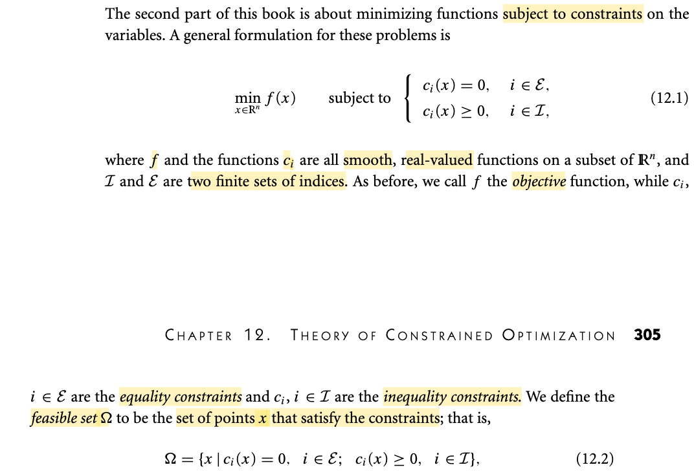
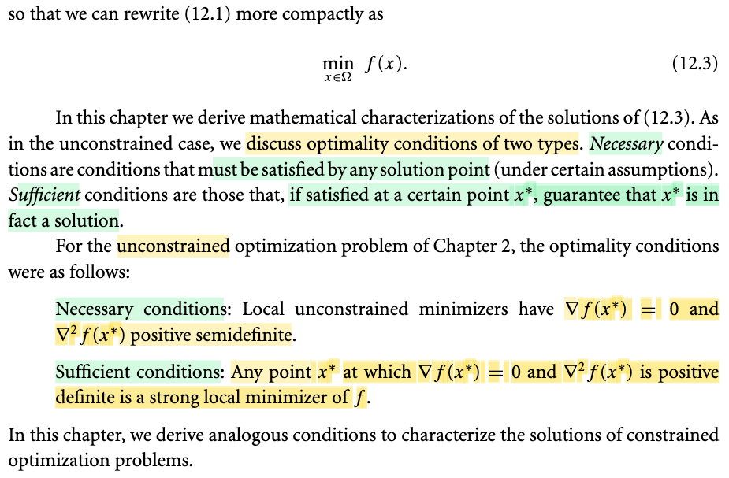
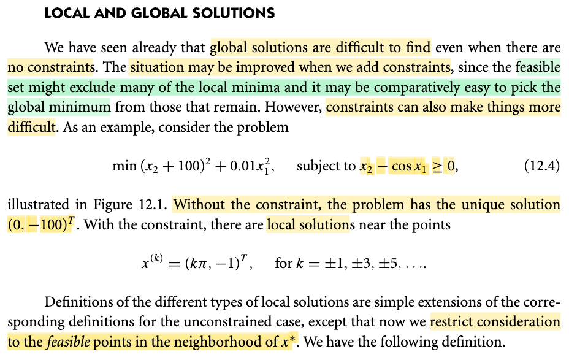
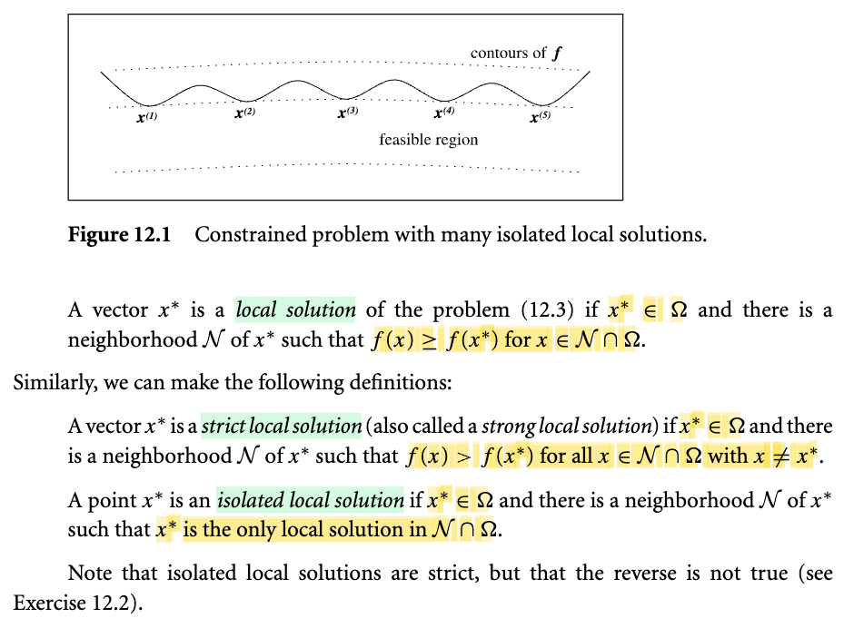
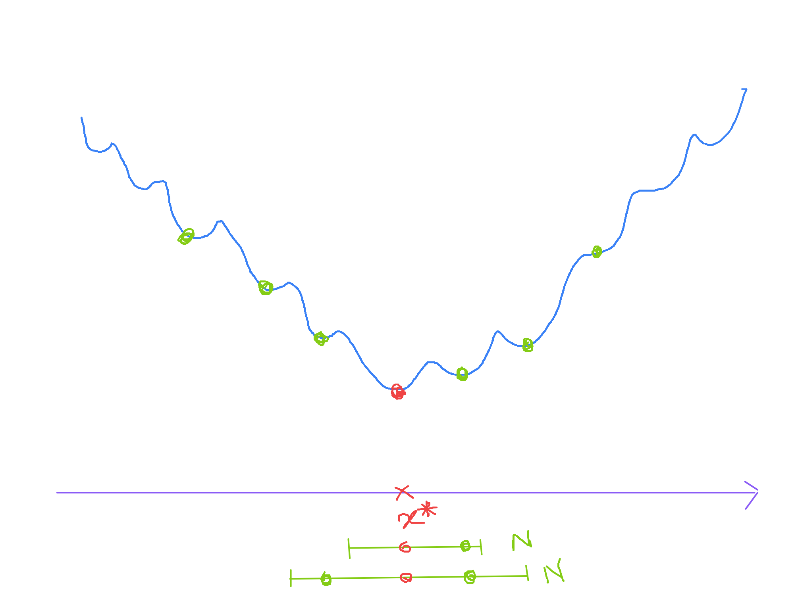
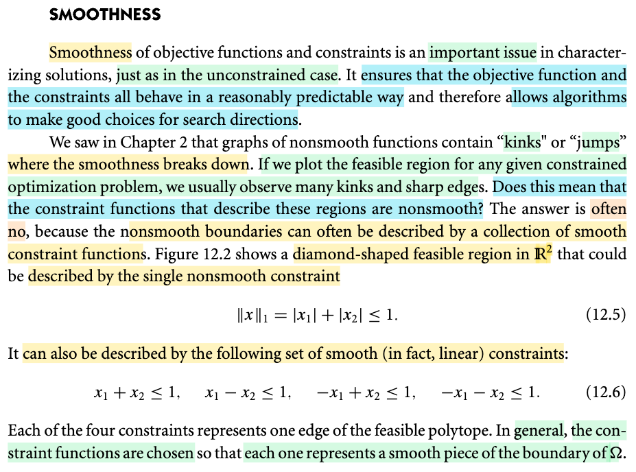
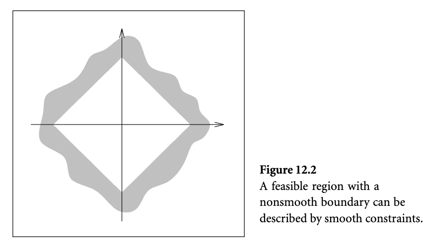
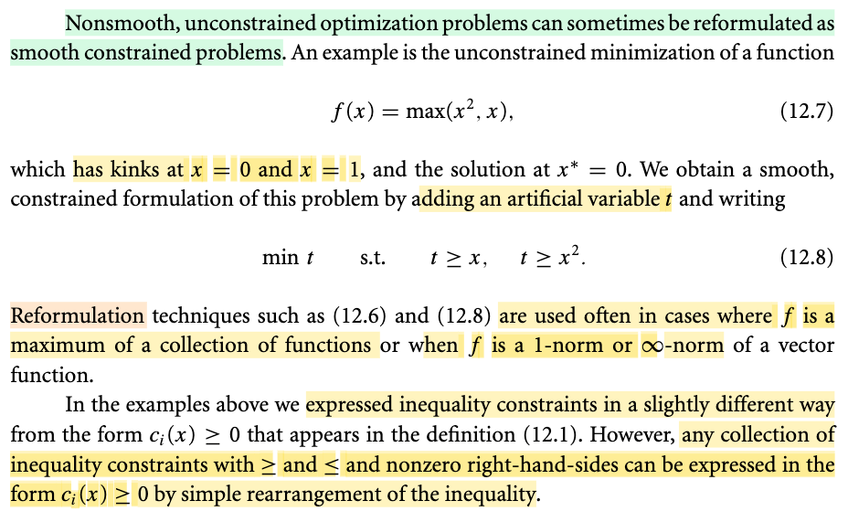

# 12.0 Theory of Constrained Optimization

📊 **Progress:** `5` Notes | `8` Screenshots | `4` AI Reviews

---

 

## Tối ưu có ràng buộc

<kbd></kbd>

<kbd></kbd>

> [!NOTE]
> Đại ý: Bước sang bài toán tối ưu có ràng buộc, có dạng khái quát:
>
>
>
> minimize f(x) s.t ci(x) = 0 với i ∈ ℐ, ci(x) ≥ 0 với i ∈ ℰ
>
>
>
> với f, ci là hàm trơn, giá trị thực.
>
>
>
> Bằng cách đặt tập Ω là tập chứa x thỏa ràng buộc, ta gọi nó là feasible set (đã gặp bên Convex Boyd rồi)
>
>
>
> Thế thì, mục đích của chapter này, là thiết lập điều kiện cần và đủ để xác định minimizer.
>
>
>
> Gs ôn lại, đối với unconstraint problem:
>
>
>
> Điều kiện cần (tức là nếu x\* là minimizer thì nóa phải thỏa): gradient tại x\* vanish, và Hessian tại x\* bán xác định dương.
>
>
>
> Điều kiện đủ (tức nếu có cái này thì suy ra x\* là minimizer): gradient tại x\* vanish, và Hessian tại x\* xác định dương.

 

### Local and Global Solutions

<kbd></kbd>

> [!NOTE]
> Trong phần 1 khi thảo luận về bài toán không ràng buộc, chúng ta đã thấy rằng việc tìm kiếm nghiệm tối ưu toàn cục (global solution) là tương đối khó khăn. Tuy nhiên, khi chuyển sang bài toán có ràng buộc, theo giáo sư, các điều kiện ràng buộc này có đặc điểm là thu hẹp phạm vi tìm kiếm vào một vùng gọi là tập khả thi (feasible set) chứa các điểm thỏa mãn ràng buộc. Nhờ sự thu hẹp này, các nghiệm tối ưu cục bộ (local solution) cơ bản sẽ bị loại bỏ bớt. Do đó, dưới góc nhìn này, việc tìm kiếm nghiệm tối ưu toàn cục của bài toán có ràng buộc sẽ dễ dàng hơn so với bài toán không ràng buộc.
>
>
>
> Ngược lại, ý thứ hai mà tác giả muốn nhấn mạnh là việc thêm ràng buộc lại khiến bài toán trở nên phức tạp và khó khăn hơn. Ông đưa ra ví dụ về bài toán cực tiểu hóa hàm số x2 + 100 bình phương cộng 0.01 x1 bình phương với điều kiện ràng buộc là x2 - cos x1 phải không âm. Đặc điểm của bài toán này là nếu không có ràng buộc, nó chỉ có duy nhất một nghiệm tối ưu (minimizer). Nhưng khi bổ sung ràng buộc, bài toán lại sinh ra một loạt các nghiệm tối ưu cục bộ (local minimizer). Đây là minh chứng rõ nét cho thấy ràng buộc làm bài toán trở nên khó hơn, dù về mặt lý thuyết, việc không gian tìm kiếm được thu hẹp sẽ giúp dễ dàng tìm ra nghiệm tối ưu toàn cục hơn.

> [!TIP]
> **🤖 AI Feedback** — ✅ Score: **98/100**
>
> Bản tóm tắt rất chính xác, mạch lạc và nắm bắt trọn vẹn cả hai khía cạnh tương phản của ràng buộc được đề cập trong bài viết. Để hoàn thiện hơn, bạn có thể bổ sung công thức nghiệm cụ thể của các điểm cực tiểu cục bộ để tăng tính trực quan cho ví dụ toán học.

 

#### Local Solutions in Constrained Optimization

<kbd></kbd>

<kbd></kbd>

> [!NOTE]
> Ở đây là vài định nghĩa:
>
>
>
> Local solution: hiểu nôm na là, nếu trong vùng lân cận R của x\* giao với feasible region Ω, thì những điểm khác luôn cao hơn hoặc bằng nó.
>
>
>
> Strict local solution: Nếu trong vùng này, mọi thằng khác luôn cao hơn nó.
>
>
>
> Isolate local solution: Nếu trong vùng này, nó là cái đáy duy nhất.
>
>
>
> Thế thì Isolate thì chắc chắn Strict nhưng ngược lại chưa chắc. Hình dung như sau:
>
>
>
> Ta có cái hố có đáy là x\*, trong phạm vi hố (coi như đều feasible) thì đáy hố tại x\* là thấp nhất → x\* là strict local solution
>
>
>
> Nhưng, trên cái thành hố, xuất hiện nhiều hố cục bộ khác, ví dụ x1, x2,....và chúng xuất hiện rất chi chít kéo dài sát đến tận nách của x\*. Thì trong phạm vi cái hố nhỏ của x1 thì x1 lại là local solution, nhưng phạm vi này vẫn thuộc phạm vi hố lớn, dẫn đến khi xét phạm vi hố lớn, thì tuy x\* là strict (vì nó thấp nhất) nhưng nó không phải là cái đáy duy nhất, vì vẫn còn những cái đáy cục bộ khác như x1, x2...Và dù ta có thu nhỏ bán kính hố lớn lại (tức là cố xét vùng 𝒩 nhỏ hơn, thì vẫn luôn dính một cái hố cục bộ xn nào đó khiến cho trong 𝒩 thì x\* vẫn ko phải là local solution duy nhất)
>
>
>
> (xem hình minh họa, dù có xét 𝒩 nhỏ cỡ nào thì vẫn dính một thằng xanh lá, khiến trong vùng 𝒩 x\* (đỏ) không phải là duy nhất.)
>
>
>
> Nhưng dĩ nhiên nếu trong phạm vi toàn hố, x\* là cái local solution duy nhất, thì dĩ nhiên nó cũng là strict, vì nếu tồn tại thằng x^ nằm sát bên có độ cao bằng x\*, thì x^ cũng là local solution, trong khi ta đang nói x\* là cái duy nhất cơ mà. Vậy suy ra không thể có x^ nào quanh đó ngang nó, mà đều phải cao hơn nó, vậy x\* là strict solution.

> [!TIP]
> **🤖 AI Feedback** — ✅ Score: **98/100**
>
> Ghi chú xuất sắc, giải thích trực quan và rất chính xác bản chất toán học của các khái niệm bằng ví dụ thực tế sáng tạo. Bạn chỉ cần lưu ý viết đúng thuật ngữ tiếng Anh là 'isolated local solution' thay vì 'isolate'.

 

##### Smoothness in Constrained Optimization

<kbd></kbd>

<kbd></kbd>

> [!NOTE]
> Tiếp theo, giáo sư thảo luận về một tính chất quan trọng trong bài toán tối ưu, đó là tính trơn của hàm số. Yêu cầu đặt ra là cả hàm mục tiêu f lẫn các hàm ràng buộc đều phải là các hàm trơn. Việc **yêu cầu hàm số thỏa mãn tính chất này nhằm giúp hành vi của hàm số trở nên dễ dự đoán hơn**, từ đó **tạo điều kiện cho các thuật toán tối ưu hoạt động một cách hiệu quả**.
>
>
>
> Giáo sư đã nhắc lại một kiến thức từ chương hai: khi một hàm số không trơn, trên **đồ thị của nó sẽ xuất hiện những điểm gãy** hoặc bước nhảy (gọi là 'kink'). Tại những điểm đó, tính trơn của hàm số bị phá vỡ và đạo hàm sẽ có sự thay đổi đột ngột. Từ đó, ông đặt ra câu hỏi: **nếu miền chấp nhận được (feasible region) có hình dạng không trơn với nhiều điểm gấp khúc và góc cạnh, thì điều đó có chứng tỏ các hàm ràng buộc là hàm không trơn hay không?**
>
>
>
> Thực tế, **câu trả lời thường là không**. Ông đã đưa ra ví dụ về một tập chấp nhận được (feasible set) có hình kim cương với nhiều đoạn gấp khúc. Mặc dù **nếu biểu diễn tập hợp này bằng một ràng buộc duy nhất thì đó sẽ là một hàm không trơn**, nhưng **chúng ta hoàn toàn có thể biểu diễn chính tập hợp đó bằng nhiều hàm ràng buộc trơn**.
>
>
>
> Ý chính ở đây là **một tập chấp nhận được có hình dạng không trơn với các đoạn gãy khúc chưa chắc đã bắt nguồn từ các hàm ràng buộc không trơn trong bài toán tối ưu**. Tập hợp đó vẫn có thể được thiết lập từ một hệ gồm nhiều hàm ràng buộc trơn.
>
>
>
> Và ôn nói, nói chung, **thường người ta sẽ define feasible set bằng một hệ các ràng buộc bởi các hàm trơn, (thay vì gom lại thành 1 hàm không trơn)**

> [!TIP]
> **🤖 AI Feedback** — ✅ Score: **100/100**
>
> Bản ghi chú rất xuất sắc, phản ánh chính xác và đầy đủ các nội dung từ văn bản gốc, bao gồm cả ví dụ minh họa về miền chấp nhận được hình kim cương. Cách diễn đạt mạch lạc, chuẩn xác cả về mặt thuật ngữ toán học chuyên ngành lẫn ngữ nghĩa.

 

###### Nonsmooth to Smooth Constrained Reformulation

<kbd></kbd>

> [!NOTE]
> Nội dung tiếp theo tương đối dễ hiểu. Tác giả giả định chúng ta **có một bài toán không trơn và không có ràng buộc**, nghĩa là hàm mục tiêu không phải là hàm trơn và bài toán cũng không có ràng buộc nào. Trong trường hợp này, tác giả chỉ ra rằng **thông thường chúng ta vẫn có thể tái cấu trúc bài toán để chuyển nó thành một bài toán có ràng buộc và có hàm trơn**. 
>
>
>
> Ví dụ, xét một bài toán không ràng buộc là tìm giá trị cực tiểu (minimize) của hàm số max(x^2, x). Dễ thấy rằng hàm mục tiêu này không phải là hàm trơn. Tuy nhiên, bằng cách tái cấu trúc để đưa về một bài toán tương đương là cực tiểu hóa t với các ràng buộc t ≥ x và t ≥ x^2, bài toán sẽ trở thành bài toán có ràng buộc, và cả hàm mục tiêu lẫn các hàm ràng buộc đều là hàm trơn. 
>
>
>
> Cụ thể, xét theo biến t, hàm mục tiêu bây giờ là t, còn các hàm ràng buộc là t - x hoặc t - x^2. Chúng đều là những hàm tuyến tính theo t và hiển nhiên là các hàm trơn. Phương pháp tái cấu trúc này thường xuất hiện khi hàm mục tiêu f là cực đại (maximum) của một tập hợp các hàm số, hoặc khi f là chuẩn L1 (L1 norm) hay chuẩn L-vô-hạn (L infinity norm) của một hàm vectơ. 
>
>
>
> Cuối cùng, một lưu ý nhỏ khác là việc đặt các ràng buộc t ≥ x hay t ≥ x^2 trông có vẻ hơi khác so với cách thể hiện khái quát là có hàm c ≥ 0. Thực chất, chúng ta chỉ cần chuyển x sang vế trái là sẽ thu được dạng đó. Nói chung, sau khi sắp xếp lại, ta sẽ có được dạng của bài toán khái quát.

> [!TIP]
> **🤖 AI Feedback** — ✅ Score: **95/100**
>
> Ghi chú rất chi tiết, dịch và giải thích chính xác các khái niệm toán học từ đoạn văn bản, bao gồm cả ví dụ minh họa và phần biến đổi ràng buộc. Điểm cần lưu ý duy nhất là cụm từ "sometimes" nên được dịch chính xác là "đôi khi" thay vì "thông thường" để phản ánh đúng tần suất áp dụng của phương pháp.

 

