# 12.1 Examples

📊 **Progress:** `9` Notes | `17` Screenshots | `6` AI Reviews

---

## 12.1 Examples

 

## Definition 12.1: The Active Set

<kbd>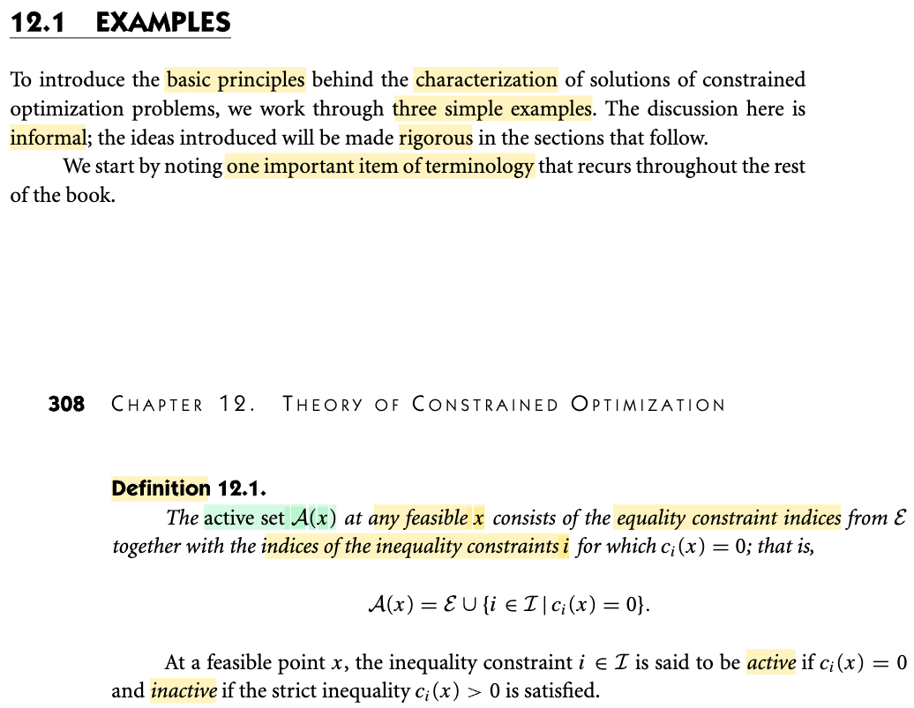</kbd>

> [!NOTE]
> Trướới tiên, giáo sư dẫn dắt chúng ta qua một loạt định nghĩa về các khái niệm cốt lõi sẽ xuất hiện xuyên suốt chương này. Đầu tiên là định nghĩa về tập hoạt động (active set), ký hiệu là 𝒜(x).
>
>
>
> Dù định nghĩa này có vẻ phức tạp, chúng ta có thể làm rõ thông qua một số ý chính sau:
>
>
>
> Thứ nhất, active set là một **tập hợp phụ thuộc vào một điểm khả thi** (feasible point) x. Với mỗi điểm x khác nhau, chúng ta sẽ có các tập active set khác nhau.
>
>
>
> Thứ hai, active set là **tập hợp chứa các chỉ số (index numbers)**, chứ không chứa bản thân điểm x hay các vectơ x.
>
>
>
> Thứ ba, các chỉ số này **bao gồm toàn bộ chỉ số thuộc tập ℰ** (đại diện cho các ràng buộc đẳng thức - equality constraints) ..
>
>
>
> ..**hợp với** ...
>
>
>
> ..**các chỉ số thuộc tập I** (đại diện cho các ràng buộc bất đẳng thức - inequality constraints) nhưng chỉ lấy những chỉ số mà tại đó ràng buộc đạt giá trị bằng 0.
>
>
>
> Sở dĩ định nghĩa này dễ gây bối rối là do cách tiếp cận khái quát hóa bài toán tối ưu có ràng buộc. Thông thường, chúng ta không cần gọi tên cụ thể từng hàm ràng buộc là f1, f2, f3, f4. Chẳng hạn, trong cuốn sách "Convex Optimization" của Stephen Boyd, tác giả định nghĩa hàm mục tiêu (objective function) là f0, các ràng buộc bất đẳng thức là f1, f2, f3 &lt;= 0, và các ràng buộc đẳng thức là h1 = 0, h2 = 0.
>
>
>
> Trong khi đó, tác giả cuốn sách này sử dụng một hệ thống ký hiệu khác nhưng có cùng bản chất: hàm mục tiêu là f, và các hàm ràng buộc là ci với i là chỉ số.
>
>
>
> Giả sử chúng ta có 10 hàm ràng buộc từ c1, c2 đến c10. Trong đó, các ràng buộc đẳng thức có dạng c1(x) = 0, c3(x) = 0, c10(x) = 0.
>
>
>
> Các hàm còn lại là ràng buộc bất đẳng thức, tức là C2(x) &gt;= 0, C4(x) &gt;= 0, C6(x) &gt;= 0, ..
>
>
>
> Để phân chia thành hai nhóm, người ta gom các chỉ số của ràng buộc đẳng thức vào tập ℰ (viết tắt của equality constraints), ví dụ như {1, 3, 10}, và các chỉ số còn lại thuộc tập ℐ (inequality constraints).
>
>
>
> Nên với cách này, người ta chỉ cần nói minimize f(x) với constraint ci(x) = 0 với i ∈ ℰ = {1,3, 10} và ci(x) ≥ 0 với i ∈ ℐ = {2, 4,..}
>
>
>
> ---
>
>
>
> Quay trở lại định nghĩa, **tập 𝒜(x) luôn bằng tập ℰ hợp với một tập con của ℐ.**
>
>
>
> Do đó, bước đầu tiên là lấy **toàn bộ chỉ số của ℰ các ràng buộc đẳng thức** (như 1, 3, 10 trong ví dụ trên).
>
>
>
> Sau đó, chúng ta **xét tiếp các chỉ số thuộc tập ràng buộc bất đẳng thức tại điểm x cụ thể xem cái nào là = 0**. Tức là, cới điểm khả thi x, **tất cả các hàm ràng buộc bất đẳng thức như c2, c4, c5 đều đã phải ≥ 0**. Tuy nhiên, chúng ta c**hỉ lọc ra những chỉ số mà tại đó hàm ràng buộc bằng đúng 0**. Ví dụ, nếu c2(x) = 0 và c5(x) = 0 trong khi c4(x) &gt; 0, ta sẽ lấy các chỉ số {2, 5} để hợp với tập ℰ, từ đó tạo thành tập hoạt động (active set) 𝒜(x) cho điểm x.
>
>
>
> Cuối cùng nói thêm một ý nữa:
>
>
>
> Đối với các ràng buộc bất đẳng thức trong tập ℐ, tại điểm khả thi x, giá trị của chúng luôn không âm: ci(x) ≥ 0 ∀ i ∈ ℐ. **Nếu tại x, hàm ràng buộc bằng đúng 0**, ta gọi ràng buộc đó là r**àng buộc hoạt động (active constraint)**. Ví dụ trong ví dụ ta nói ở trên, vì C2(x) = 0 nên ràng buộc c2 đang hoạt động (active). Ngược lại, vì c4(x) &gt; 0 nên ràng buộc C4 &gt;= 0 không hoạt động (inactive).

> [!TIP]
> **🤖 AI Feedback** — ✅ Score: **98/100**
>
> Ghi chú rất xuất sắc, giải thích chính xác và trực quan định nghĩa về tập hoạt động (active set) kèm ví dụ minh họa rõ ràng và so sánh hệ thống ký hiệu với sách của Stephen Boyd. Bạn chỉ cần lưu ý chỉnh sửa một vài lỗi chính tả nhỏ để bài viết thêm phần hoàn thiện.

**🔗 See also:** [First-Order Optimality Conditions](./123_first_order_optimality_condition.md#node-hvhhcds)

 

### Equality Constrained Optimization Example

<kbd>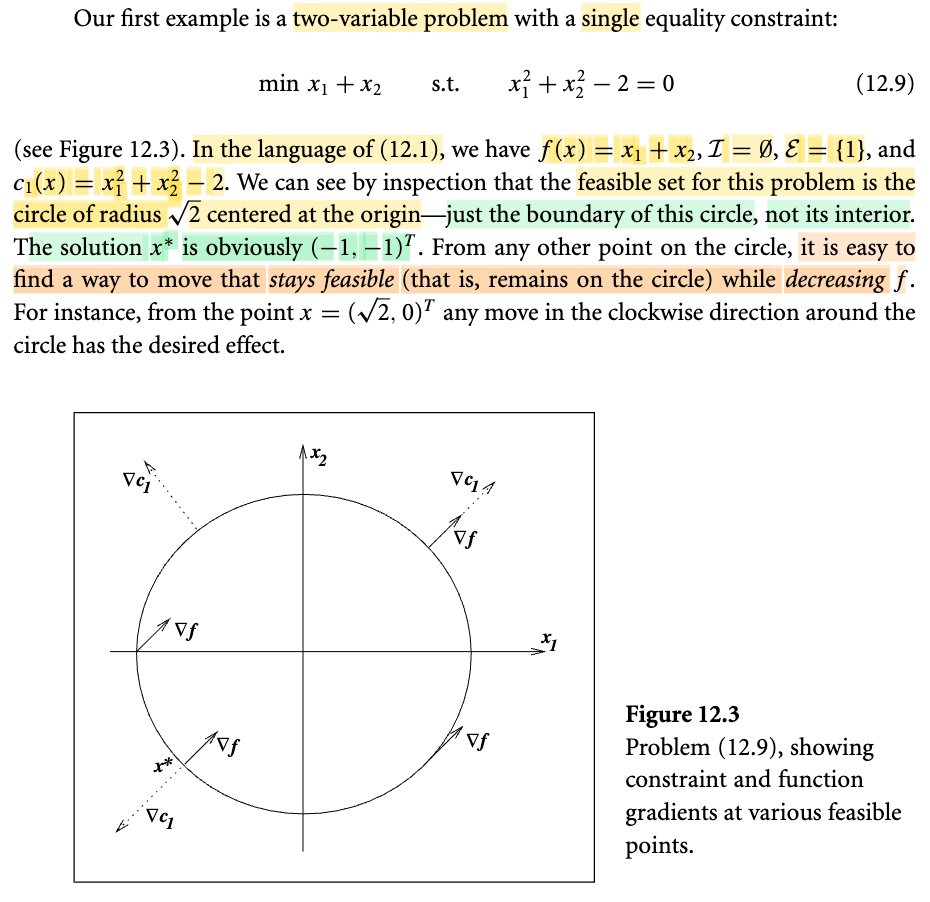</kbd>

> [!NOTE]
> Tiếp theo, giáo sư đưa ra một ví dụ về việc tối thiểu hóa hàm số x1 + x2. Đây là bài toán tối ưu hóa hai biến với một ràng buộc đẳng thức là x1^2 + x2^2 - 2 = 0. 
>
>
>
> Chiếu theo ngôn ngữ định nghĩa tổng quát của bài toán tối ưu có ràng buộc, hàm mục tiêu (objective function) f chính là x1 + x2. Do chỉ có một ràng buộc đẳng thức, tập chỉ số ℐ chứa các ràng buộc bất đẳng thức dĩ nhiên là tập rỗng. Trong khi đó, tập chỉ số ký hiệu bởi chữ E viết hoa, ℰ chứa các ràng buộc đẳng thức chỉ có một phần tử duy nhất là {1}. Hàm ràng buộc này chính là c1(x) = x1^2 + x2^2 - 2, với ràng buộc đẳng thức tương ứng là c1(x) = 0.
>
>
>
> Với bài toán này, chúng ta **có thể vẽ được tập khả thi (feasible set)**. Theo định nghĩa, tập khả thi là tập hợp các điểm thỏa mãn ràng buộc. Trong trường hợp này, đó là tập hợp các điểm x thỏa mãn phương trình x1^2 + x2^2 = 2. Khi biểu diễn trực quan, tập hợp này **chính là đường tròn có tâm tại gốc tọa độ và bán kính bằng căn 2**. Giáo sư đặc biệt nhấn mạnh rằng **tập khả thi ở đây chỉ là đường tròn chứ không phải hình tròn**.
>
>
>
> Như vậy, bản chất của bài toán này là **tìm các điểm nằm trên đường tròn sao cho tổng hai tọa độ của chúng là nhỏ nhất**. Nghiệm của bài toán rất dễ nhận thấy chính là điểm có tọa độ (-1, -1). Chúng ta có thể suy nghĩ thêm lý do tại sao giáo sư lại khẳng định điều này là rõ ràng để nhận thấy.
>
>
>
> Để hình dung trực quan, khi di chuyển trên đường tròn này, nếu đang ở góc phần tư phía trên bên phải, cả hai tọa độ đều mang giá trị dương. Để giảm tổng tọa độ, chúng ta phải di chuyển về phía góc phần tư phía trên bên trái hoặc góc phần tư phía dưới bên phải, khi đó sẽ có một tọa độ âm. Và dĩ nhiên, khi xuống góc phần tư phía dưới bên trái, cả hai tọa độ đều âm, giúp tổng hai tọa độ giảm xuống nhiều hơn nữa. Từ đó, có thể xây dựng một lập luận để giải thích vì sao điểm (-1, -1) lại cho tổng nhỏ nhất.
>
>
>
> Một ý nữa được giáo sư đề cập là **khi đứng ở một điểm bất kỳ trên đường tròn này, ta cũng dễ dàng tìm thấy một hướng đi để vừa đảm bảo tính khả thi** (nghĩa là vẫn di chuyển trên đường tròn) **vừa làm giảm giá trị của hàm f**. Ví dụ, nếu đang đứng ở điểm chấm màu xanh có tọa độ (0, căn 2), bằng cách di chuyển xuống góc phần tư phía dưới bên phải để tọa độ x2 bắt đầu âm và tọa độ x1 cũng giảm xuống, tổng x1 + x2 rõ ràng sẽ giảm. Nhìn chung, giáo sư muốn sử dụng ví dụ này để mang lại một hình ảnh trực quan về tập khả thi và bài toán tối ưu có ràng buộc.

> [!TIP]
> **🤖 AI Feedback** — ✅ Score: **92/100**
>
> Bản ghi chép rất chi tiết, chính xác và thể hiện sự hiểu bài sâu sắc về khái niệm tập khả thi cũng như cách xác định nghiệm tối ưu bằng trực quan. Tuy nhiên, bạn đã nhầm lẫn điểm ví dụ từ tọa độ $(\sqrt{2}, 0)^T$ trong sách thành $(0, \sqrt{2})$, dẫn đến lập luận hướng di chuyển giảm hàm mục tiêu chưa hoàn toàn chính xác.

 

#### First-Order Optimality Condition

<kbd>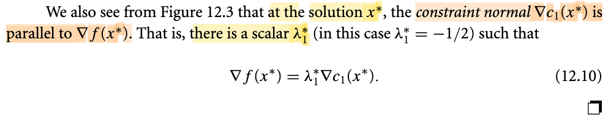</kbd>

> [!NOTE]
> Trong phần tiếp theo, tác giả chỉ ra rằng khi quan sát Hình 12.3, tại điểm tối ưu (solution), vector pháp tuyến (normal vector) của hàm ràng buộc C1 sẽ song song (parallel) với vector gradient của hàm mục tiêu f. Về mặt toán học, điều này được biểu diễn bằng việc tồn tại một hệ số lambda sao cho gradient của f tại điểm tối ưu sẽ bằng lambda nhân với gradient của C1 tại điểm tối ưu đó. Đây là kiến thức về nhân tử Lagrange (Lagrange multiplier) đã được học trong khóa Giải tích đa biến MIT 18.02. Trước khi bước sang phần sau để đọc lời giải thích của Giáo sư Nocedal, mình sẽ thử áp dụng phương pháp chủ động gợi nhớ (active recall) để tự giải thích lại hiện tượng này.
>
>
>
> Trong bài giảng đó, gs người Pháp Denis Auroux đặt ra bài toán đại ý là tìm cực trị của hàm số f(x) với constraint g(x) = 0. Với g(x) = 0 biểu diễn một phương trình đường hyperbol.
>
>
>
> Và thật ra ở bài giảng đó, với tư cách là lớp giải tích đại cương, gs không đi vào chứng minh mà chỉ kiểu như đưa ra một lập luận trực giác đó là: điểm cực trị (có thể là cực tiểu hoặc cực đại) của f thỏa ràng buộc này, **SẼ LÀ ĐIỂM TIẾP XÚC GIỮA LEVEL CURVE CỦA f và LEVEL CURVE CỦA g** (g(x) = 0, chính là 0-level set của g(x)). Và điều này dễ hiểu về trực giác như sau: Nếu x\* không phải là điểm tiếp xúc của f(x\*)-level curve của f(x) và 0-level curve của g(x) thì nhưng vậy có thễ đi theo level curve của g theo hướng nào đó để mà xuống level curve nhỏ hơn (tức là có thể còn giảm f hơn nữa). Chỉ khi thỏa điều kiện trên, thì khi đó, đi trên 0-level curve của g ra khỏi x\* theo hướng nào thì cũng đều là đi "ra" level curve cao hơn của f, khiến hàm f tăng, khi đó x\* mới là cực trị.
>
>
>
> Và dựa vào lập luận mang tính trực giác này, ta sẽ rút ra các kết quả:
>
>
>
> Vì gradient sẽ luôn vuông góc với level curve. Nên ∇f vuông góc với tiếp tuyến u của f(x\*)-level curve tại x\*, và ∇g vuông góc với tiếp tuyến v của 0-level curve của g(x). Mà x\* là tiếp điểm của hai level curve này, nên hai cái tiếp tuyến trên là một. Từ đó suy ra: ∇f(x\*) vuông góc u, ∇g(x\*) cũng vuông góc u. Nên ∇f(x\*) trùng hướng với ∇g(x\*). Và thể hiện toán học là tồn tại số scalar λ\* nào đó để:
>
>
>
> ∇f(x\*) = λ\*∇g(x\*)

> [!TIP]
> **🤖 AI Feedback** — ✅ Score: **100/100**
>
> Ghi chú của bạn rất xuất sắc, không chỉ tóm tắt chính xác nội dung từ sách mà còn giải thích rất trực quan và chuẩn xác bản chất hình học của nhân tử Lagrange thông qua các đường mức (level curves) và gradient. Sự liên hệ với kiến thức từ khóa học MIT 18.02 giúp củng cố tư duy chủ động và đào sâu hiểu biết rất tốt.

 

##### First-Order Feasible Step Derivation

<kbd>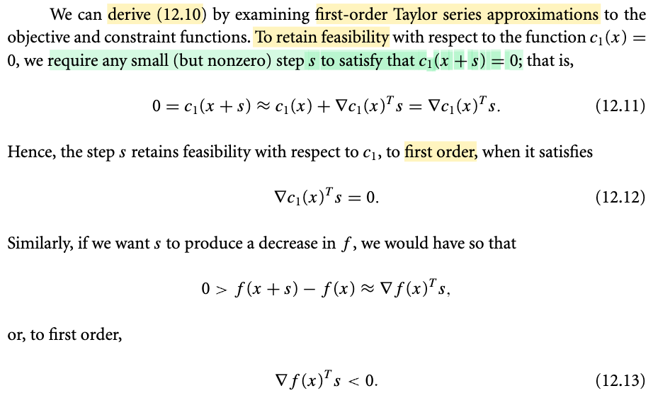</kbd>

<kbd>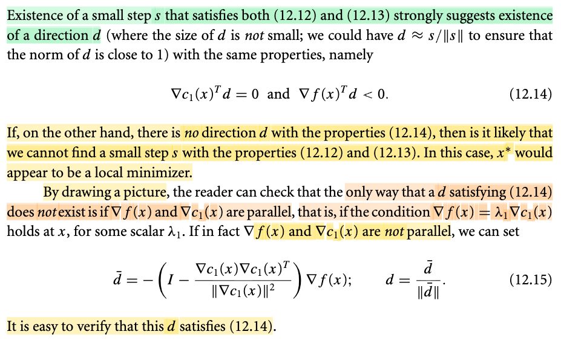</kbd>

<kbd>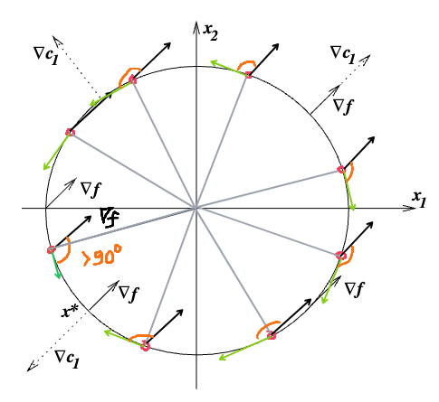</kbd>

> [!NOTE]
> Rồi, phần giải thích của gs Nocedal cũng chỉ là hiểu trực gíac, chưa phải chứng minh.
>
>
>
> Đại ý là đầu tiên ông lập luận rằng để từ một điểm feasible ta di chuyển đến một điểm feasible khác (ví dụ từ x trên đường tròn, ta move tới điểm khác trên đường tròn), thì từ linear approx hàm c1(x + s) ≈ c1(x) + ∇c1(x)Ts, và cộng với ta có c1(x + s) = c1(x) = 0 (do x + s cũng feasible, nên c1(x + s) phải = 0) dẫn đến ∇c1(x)Ts = 0 → gradient của c1 tại x sẽ vuông góc với s. Điều này hàm nghĩa là: **tại x bất kì trên đường tròn, chỉ cần di chuyển theo hướng s (với step nhỏ) có hướng vuông góc với gradient của c tại đó, thì ta sẽ vẫn đến được một điểm feasible mới**.
>
>
>
> Tiếp, nếu muốn giảm thêm hàm f, thì lập luận tương tự:
>
>
>
> đi từ x đến x + s với xải bước rất nhỏ, thì linear approx hàm f cho ta: f(x+s) ≈ f(x) + ∇f(x)Ts ⇔ ∇f(x)Ts ≈ f(x+s) - f(x). Từ đó để f(x+s) &lt; f(x) ⇔ f(x+s) - f(x) &lt; 0 ⇔ ∇f(x)Ts phải âm. Và điều này ý nghĩa là, **để giảm thêm hàm f từ một điểm x đang feasible, ta sẽ cần đi theo hướng s sao cho nó hợp với gradient ∇f(x) một góc tù**
>
>
>
> Và kết hợp hai ý lại, ta sẽ có lập luận là: Vậy **giả sử từ điểm x đang xét, theo hướng s vuông góc với ∇c1(x) và hợp với gradient ∇f(x) góc tù**, thì khi đó sẽ còn có thể "xuống" hơn nữa (mà vẫn feasible).
>
>
>
> Và để chứng minh ta sẽ chỉ ra rằng Giả sử điểm đang đứng chưa thỏa ∇f(x) và ∇c1(x) song song, thì ta sẽ luôn có vector s thỏa hai điều trên: ∇f(x)Ts &lt; 0 và ∇c1(x)Ts &lt; 0
>
> Đó là lấy vector s như sau: Là **hình chiếu của ∇f(x) lên cái subspace sau đây**: **orthogonal complement của span{∇c1(x)}**:
>
>
>
> Nhớ lại, đã học trong MIT 18.06, span{∇c1(x)} là subspace span bởi ∇c1(x) (trong ví dụ cụ thể đang xét thì nó là vector \[∂c1(x)/∂x1, ∂c1(x)/∂x2\] = \[2x1, 2x2\] = 2x), dĩ nhiên, đây chỉ là 1D subspace của R^2, ví dụ cho tọa độ x = (α, β), thì span{∇c1(x)} = span{2x} sẽ là đường thẳng đi tâm và qua điểm (2α, 2β) vậy thôi.
>
>
>
> Giờ ta sẽ tìm phép chiếu lên orthogonal complement của cái subspace này:
>
>
>
> Để chiếu vector u lên cái subspace này, ta sẽ chiếu u lên span{∇c1(x)}, ví dụ được u' rồi lấy phần dư, u - u', thì khi đó u - u' chính là hình chiếu của u lên orthogonal complement của span{∇c1(x)} (vì tính chất orthogonal complement)
>
>
>
> Chiếu u lên span{∇c1(x)}, ví dụ được u' → u' = ∇c1(x)∇c1(x)Tu/||∇c1(x)||^2
>
>
>
> phần dư u - u' = u - ∇c1(x)∇c1(x)Tu / ||∇c1(x)||^2
>
>
>
> = \[I - ∇c1(x)∇c1(x)T/||∇c1(x)||^2\]u
>
>
>
> Do đó matrix chiếu lên orthogonal complement của span{∇c1(x)} chính là P = \[I - ∇c1(x)∇c1(x)T/||∇c1(x)||^2\].
>
>
>
> Và khi chiếu -∇f(x) lên subspace này ta sẽ có:
>
>
>
> \[I - ∇c1(x)∇c1(x)T/||∇c1(x)||^2\] (-∇f(x))
>
> = - \[I - ∇c1(x)∇c1(x)T/||∇c1(x)||^2\] ∇f(x)
>
>
>
> Đặt vector này là d^, ta có:
>
>
>
> ∇c1(x)Td^ = \[-∇c1(x)T\[I - ∇c1(x)∇c1(x)T/||∇c1(x)||^2\] ∇f(x)
>
>
>
> = \[-∇c1(x)T + ∇c1(x)T∇c1(x)∇c1(x)T/||∇c1(x)||^2\] ∇f(x)
>
>
>
> = \[-∇c1(x)T + ∇c1(x)T\] ∇f(x)
>
>
>
> = \[0\] ∇f(x)
>
>
>
> =0 → thỏa ∇c1(x)Td^ = 0
>
>
>
> Và ∇f(x)Td^ = -∇f(x)T\[I - ∇c1(x)∇c1(x)T/||∇c1(x)||^2\] ∇f(x)
>
>
>
> = - ∇f(x)TP∇f(x), là - quadratic form của matrix P
>
>
>
> Mà P là gì, như đã thấy nó là matrix chiếu, mà với projection matrix, trong MIT 18.06 đã học: nó có tính chất: P^2 = P (vì chiếu 1 điểm đã nằm trong subspace thì sẽ ra chính nó).
>
>
>
> Và tính chất đối xứng PT = P  (ví dụ như dễ thấy ở đây I - ∇c1(x)∇c1(x)T/||∇c1(x)||^2 là đối xứng)
>
>
>
> Do đó quadratic form của nó: xTPx = xTPPx = xTPTPx = (Px)T(Px) = ||Px||^2 ≥ 0 ∀x
>
>
>
> Vậy P luôn bán xác định dương.
>
>
>
> Nên quay lại đây ta có - ∇f(x)TP∇f(x) ≤ 0.
>
>
>
> Và nó chỉ bằng 0 khi P∇f(x) = 0, đồng nghĩa ∇f(x) hoàn toàn nằm trong span{∇c1(x)}, và đồng nghĩa ∇f(x) có thể thể hiện bởi ε ∇c1(x) for some ε, và như vậy thì chứng tỏ hai vector này paralell. Trong khi ta đang gỉa định là chúng không paralell. Như vậy nhất định đây là dấu âm. Nên d^ thỏa điều kiện
>
>
>
> ⇒ d^ thỏa ∇f(x)Td^ &lt; 0.
>
>
>
> Như vậy, đã chứng minh xong nếu tại x mà ∇f(x) chưa paralell ∇c1(x) thì luôn có thể tìm ra hướng di chuyển d^ để giảm thêm f(x) mà vẫn feasible.
>
>
>
> ---
>
>
>
>
>
> Vậy thì ở đây: ∇f(x) là gì? chính là \[∂f(x)/∂x1; ∂f(x)/∂x2\] = \[1,1\] ∀x. Có nghĩa là ở đâu, thì gradient ∇f(x) đều là vector (1,1).
>
>
>
> ∇c1(x) = \[∂c1(x)/∂x1, ∂c1(x)/∂x2\] = \[2x1, 2x2\] = 2x
>
>
>
> Như vậy có thể thấy ∇c1(x) luôn vuông góc với đường tròn (vì sao?)
>
>
>
> Do đó, hình ảnh sẽ là tại một điểm bất kì trên đường tròn, miễn là ta có thể men theo đường tròn theo hướng ngược (tạo góc tù với vector (1,1)) thì ta sẽ còn giảm thêm f nữa.
>
>
>
> Và điểm duy nhất khiến ta không còn làm được vậy nữa chính là x\* = (-1,-1), vì lúc này đi men theo đường tròn ở bất kì hướng nào thì cũng đều là hợp với ∇f(x) góc ≥ 0.
>
>
>
> Và tại x\*, thì ∇f(x) trùng phương (song song) với ∇c1(x), thể hiện bởi ∇f(x) = λ ∇c1(x)

> [!TIP]
> **🤖 AI Feedback** — ✅ Score: **95/100**
>
> Bài viết xuất sắc, tự chứng minh rất chi tiết bằng phép chiếu và kiểm tra tính bán xác định dương của ma trận P cực kỳ chặt chẽ. Bạn chỉ lưu ý một lỗi nhỏ ở ví dụ cuối: điểm tối ưu trên đường tròn đơn vị phải là (-1/√2, -1/√2) chứ không phải là (-1, -1).

**🔗 See also:** [linked note *(Mit 18.06)*](../mit1806_gstrang/lecture_32_quiz_3_review.md#node-p3i6h08)

 

- **Lagrangian Function and Lagrange Multipliers**

<kbd>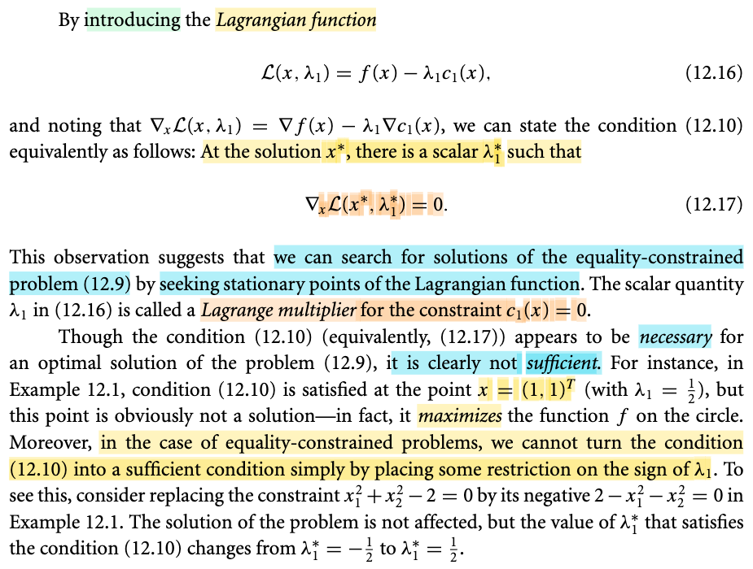</kbd>

> [!NOTE]
> Thế thì đại ý là, từ việc lập luận mang tính trực giác rằng nếu x\* chưa thỏa ∇f(x\*) = λ\*∇c1(x) thì sẽ luôn có thể từ đó mà đi đến đến feasible có f nhỏ hơn, ta sẽ dùng điều kiện này làm điều kiện cần trong việc xác định solution của bài toán ràng buộc.
>
>
>
> Và bằng cách đưa vào (introducing) một hàm có tên là Lagrangian L(x, λ) = f(x) + λc1(x) thì cái điều kiện này chính là ∇\_x L(x\*, λ\*) = 0 (tức là đạo hàm theo x của L = 0)
>
>
>
> Và λ1 được gọi là Lagrange multiplier.
>
>
>
> Một ý cuối đó là, điều kiện này chỉ là cần, chứ chưa đủ ý là, nếu thỏa thì chưa chắc x\* đã là minimizer. Vì dễ thấy trong ví dụ trước, điểm (1,1) cũng có tính chất ∇f(x) song song ∇c1(x). Nhưng rõ ràng nó là maximizer chứ không phải minimizer

 

- **Single Inequality Constraint Optimization**

<kbd>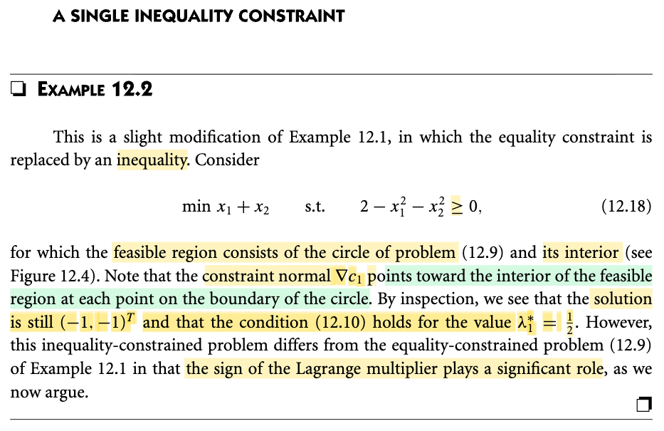</kbd>

<kbd>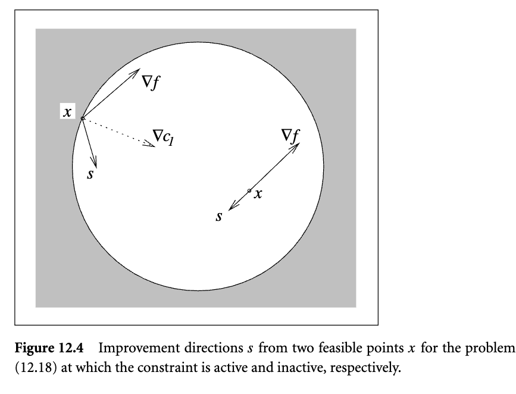</kbd>

> [!NOTE]
> Rồi, qua ví dụ này thì đại khái là người ta thay cái ràng buộc thay vì dùng ràng buộc đẳng thức thì người ta dùng ràng buộc bất đẳng thức. Tức là thay vì x1 bình phương cộng x2 bình phương bằng 2 thì bây giờ nó sẽ trở thành là 2 trừ x1 bình phương trừ x2 bình phương lớn hơn hoặc bằng 0. Thì cái feasible set, tức cái tập khả thi lúc này á, nó không còn là chỉ là tập hợp những điểm ở trên đường tròn nữa, mà lúc bấy giờ nó trở thành những điểm trên đường tròn và mọi điểm ở trong đường tròn đó. Hay nói khác nó là cái hình tròn. Và giáo sư cũng đề nghị ta để ý là cái vectơ gradient á, tức là nabla c1 á, bây giờ nó không còn là vectơ vuông góc với đường tròn và hướng ra ngoài nữa, mà nó bây giờ là vectơ vuông góc với đường tròn và hướng vào trong. Và khi mà mình quan sát kỹ hơn á, thì mình sẽ thấy cái điểm -1 -1 vẫn là nghiệm của cái bài toán này. Tuy nhiên, cái giá trị lamda 1 sao lúc này á nó là 1/2. Nói chung á là ý chính cần chú ý ở đây đó là với cái ràng buộc bất đẳng thức đó thì cái dấu của cái Lagrange multiplier nó trở nên quan trọng. Và mình sẽ cùng tìm hiểu chuyện này.

 

- **First-Order Feasible Step Conditions**

<kbd>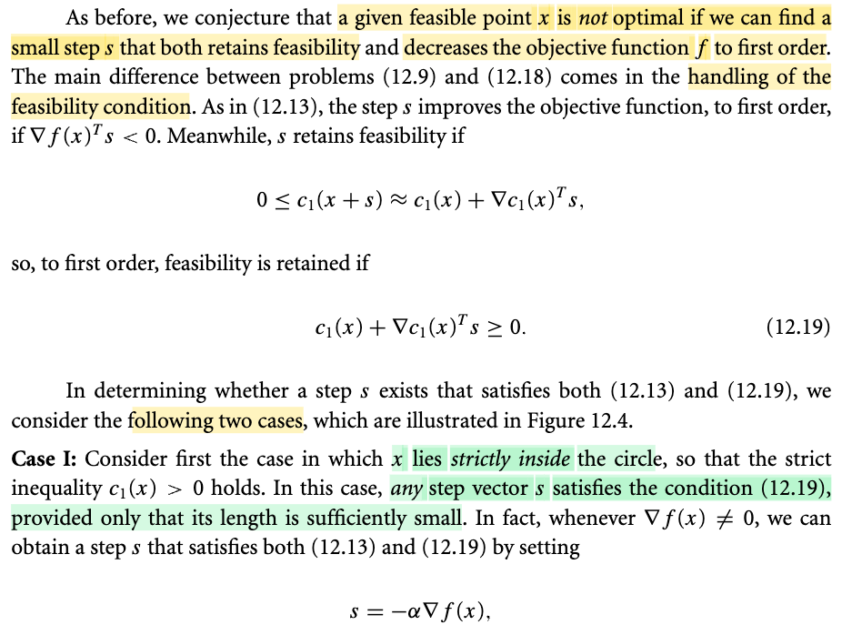</kbd>

<kbd>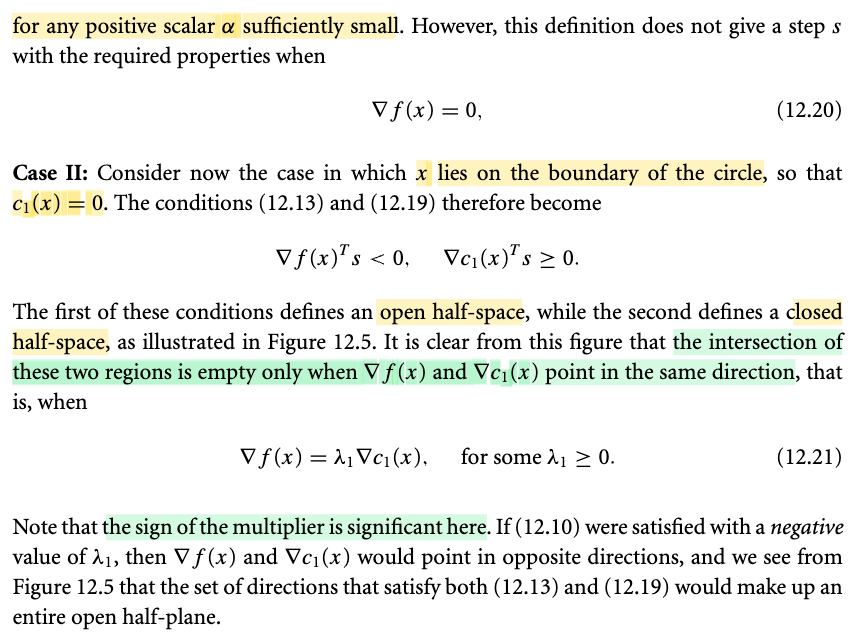</kbd>

<kbd>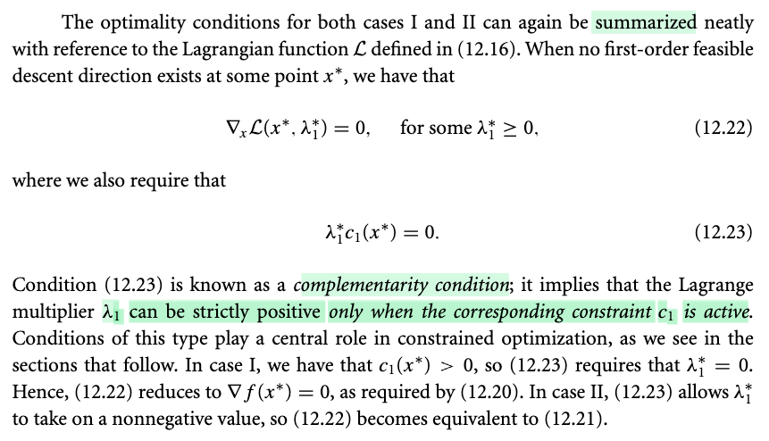</kbd>

> [!NOTE]
> Phần này gs Nocedal sẽ nói về lập luận mang tính trực giác để dẫn tới điều kiện giúp tìm nghiệm của bài toán tối ưu có ràng buộc bất đẳng thức: minimize f(x) s.t c1(x) ≥ 0. 
>
>
>
> Thế thì đại khái là ta sẽ cũng theo cái lối lập luận trước đây, khi làm cho ràng buộc đẳng thức: Đó là ta sẽ nói rằng, giả sử tại một điểm x feasible, nếu còn có thể tìm được vector s khiến x+s vẫn feasible và f(x+s) &lt; f(x) thì x khi đó chưa phải là minimizer của bài toán. Và ngược lại, nếu tại điểm nào đó mà không thể tìm được vector s như vậy, thì đó chính là minimizer. Từ đó ta sẽ thiết lập được điều kiện cần cho bài toán tối ưu này.
>
>
>
> Rồi, với s nhỏ, để x+s nằm trong lân cận x, ta có thể xấp xỉ hàm c1(x+s) bởi hàm tuyến tính: c1(x+s) ≈ c1(x) + ∇c1(x)Ts. Và để đến được x+s vẫn feasible, thì s phải thỏa c1(x+s) ≥ 0. Kết hợp với c1(x+s) ≈ c1(x) + ∇c1(x)Ts ta có thể nói rằng s phải thỏa: c1(x) + ∇c1(x)Ts ≥ 0
>
>
>
> Tiếp, lập luận tương tự, với s nhỏ, để x+s ≈ x, ta có thể xấp xỉ hàm f(x+s) bởi hàm tuyến tính:
>
>
>
> f(x+s) ≈ f(x) + ∇f(x)Ts
>
>
>
> và để đi xuống hơn nữa (giảm f hơn nữa) thì s phải thoả ∇f(x)Ts ≈ f(x+s) - f(x) &lt; 0 ⇔ ∇f(x)Ts &lt; 0.
>
>
>
> Như vậy muốn từ x, tiếp tục giảm f mà vẫn feasible thì phải tìm được s sao cho: ∇f(x)Ts &lt; 0 → s hợp với ∇f(x) góc tù. Và c1(x) + ∇c1(x)Ts ≥ 0
>
>
>
> Đến đây ta sẽ chia hai trường hợp:
>
>
>
> i) Nếu x đang đứng là điểm nằm trong interior của feasible set: tức c1(x) &gt; 0
>
>
>
> Khi đó ta thấy điều kiện c1(x) + ∇c1(x)Ts ≥ 0 sẽ chỉ là: Miễn là s đừng có khiến ∇c1(x)Ts âm quá lớn, để có giá trị dương của c1(x) vẫn đủ để gánh, thì khi đó điều kiện này sẽ vẫn thỏa. Và như vậy thì có nghĩa là, s có thể là hướng tùy ý, miễn là độ lớn phải đảm bảo không được làm cho ∇c1(x)Ts quá âm khiến c1(x) không gánh nổi. 
>
>
>
> Và vì s có thể chọn hướng tùy ý (miễn là giới hạn độ dài), nên đương nhiên là có thể chọn s để thỏa điều kiện ∇f(x)Ts &lt; 0, tức hợp với ∇f(x) góc tù để giảm thêm f nữa. Tuy nhiên phải đặt điều kiện là ∇f(x) khác 0 (vì nếu nó đã bằng 0, thì s, dù chọn hướng bất kì cũng không thể có tích vô hướng với ∇f(x) âm được.
>
>
>
> Như vậy: khi điểm đang đứng nằm trong interior của feasible set, thì trừ khi ∇f(x) đã bằng 0 rồi, thì khi đó không thể có s khiến x+s feasible và giảm thêm f. Ngược lại, nếu ∇f(x) khác 0, thì luôn tồn tại s khiến có thể giảm thêm. Và đương nhiên, lúc này hướng giảm nhanh nhất chính là - ∇f(x). Và như đã nhắc lại nhiều lần, rằng s hướng tuỳ ý nhưng phải khống chế độ dài, nên ta có:
>
>
>
> s = -α ∇f(x) với α đủ nhỏ.
>
>
>
> ii) Trường hợp x đang đứng là nằm ngay trên boundary của feasible set, tức c1(x) = 0.
>
>
>
> Khi đó, điều kiện tìm s để x+s vẫn feasible: c1(x) + ∇c1(x)Ts ≥ 0 trở thành ∇c1(x)Ts ≥ 0, mang ý nghĩa là s hợp ∇c1(x) góc vuông hoặc tù.
>
>
>
> Như vậy, trong trường hợp này, nếu tại x vẫn tìm được s sao cho s hợp với ∇f(x) góc tù, và với ∇c1(x) góc vuông hoặc tù, thì x chưa phải là minimizer. Còn ngược lại, nếu không thể tìm được s thỏa điều trên thì x chính là minimizer. 
>
>
>
> Vậy câu hỏi là, khi nào thì không thể tìm được s.
>
>
>
> Dễ thấy, đó là khi ∇f(x) và ∇c1(x) trùng nhau, vì s không thể nào hợp góc vuông hoặc nhọn và tù với cùng 1 vector được. Như vậy, ta có thể thiết lập điều kiện tìm minimizer:
>
>
>
> ∇f(x) và ∇c1(x) trùng nhau, thể hiện toán học bởi ∇f(x) = λ1 ∇c1(x) với λ phải không âm. 
>
>
>
> Vì sao λ1 phải không âm, vì điều kiện ta đang nói là chúng trùng nhau, tức trùng hướng (same direction), chứ ko phải chỉ là paralell (trùng phương, song song), vì nếu chúng trùng phương nhưng ngược hướng thì đương nhiên có vô số s hợp với ∇f(x) góc tù và hợp với ∇c1(x) góc nhọn
>
>
>
> (trong sách có cách giải thích hơi khác, đó là điều kiện ∇f(x)Ts &lt; 0 và ∇c1(x)Ts ≥ 0 chính là phương trình của hai halfspace (nhờ học Convex Optim S.Boyd nên trong mấy chapter đầu đã học về halfspace rồi) và s sẽ giúp define ra hai cái halfspace này. Thế thì nếu tồn tại s mà thỏa cùng lúc hai cái này tức là tồn tại s khiến cho điểm đang đứng x nằm trong intersection của hai cái halfspace này. Từ đó ta suy luận rằng để mà không tồn tại s, thì chỉ có thể là ∇f(x) trùng hướng ∇c1(x), vì khi đó hai half space sẽ chia đôi không gian, và một cái là tập đóng (ý là chứa biên) một cái là tập mở. Nên không thể nào chúng có điểm chung)
>
>
>
> ---
>
>
>
> Như vậy tổng kết hai case:
>
>
>
> Khi x trong interior của feasible: c1(x) &gt; 0 thì điều kiện dừng (không thể tìm được s để giảm thêm f mà vẫn feasible) là: ∇f(x) = 0
>
>
>
> Khi x trên boundary của feasible set: c1(x) = 0, thì điều kiện dừng là: ∇f(x) = λ ∇c1(x) với λ ≥ 0
>
>
>
> Vậy, ta sẽ kết hợp hai cái lại, thể hiện bởi: 
>
>
>
> ∇f(x\*) = λ\* ∇c1(x\*) (i) 
>
>
>
> λ\* × c1(x\*) = 0 (ii) 
>
>
>
> λ\* ≥ 0 (iii)
>
>
>
> Điều kiện λ\* c1(x\*) = 0 sẽ thể hiện rằng, nếu c1(x\*) &gt; 0, thì λ\* phải bằng 0, và (1) sẽ trở thành ∇f(x\*) = 0. Đây chính là case 1.
>
>
>
> Và nếu c1(x\*) = 0, thì λ\* chỉ cần thỏa (iii): tức λ\* ≥ 0, và cùng với (i), nó chính là miêu ta case 2.
>
>
>
> Và (i) thì cũng chính là ∇\_x ℒ(x\*, λ\*) = 0 với ℒ(x, λ) = f(x) - λ1c1(x).
>
>
>
> (ii) chính là complementary slackness đã học bên Convex Optim
>
>
>
> (iii) chính là dual feasible condition.
>
>
>
> Và mấy cái này tạo thành KKT condition.
>
>
>
> Như vậy, mình đã được thấy cách lập luận để xây dựng KKT condition tương đối khác với trong sách Boyd.

> [!TIP]
> **🤖 AI Feedback** — ✅ Score: **95/100**
>
> Bài viết thể hiện sự hiểu biết trực quan rất sâu sắc và mạch lạc về cách thiết lập điều kiện KKT. Tuy nhiên, có một nhầm lẫn nhỏ ở Case II khi viết điều kiện $\nabla c_1(x)^T s \ge 0$ tương ứng với góc 'vuông hoặc tù' (thực tế phải là góc 'nhọn hoặc vuông').

 

- **Example 12.3 Two Inequality Constraints**

<kbd>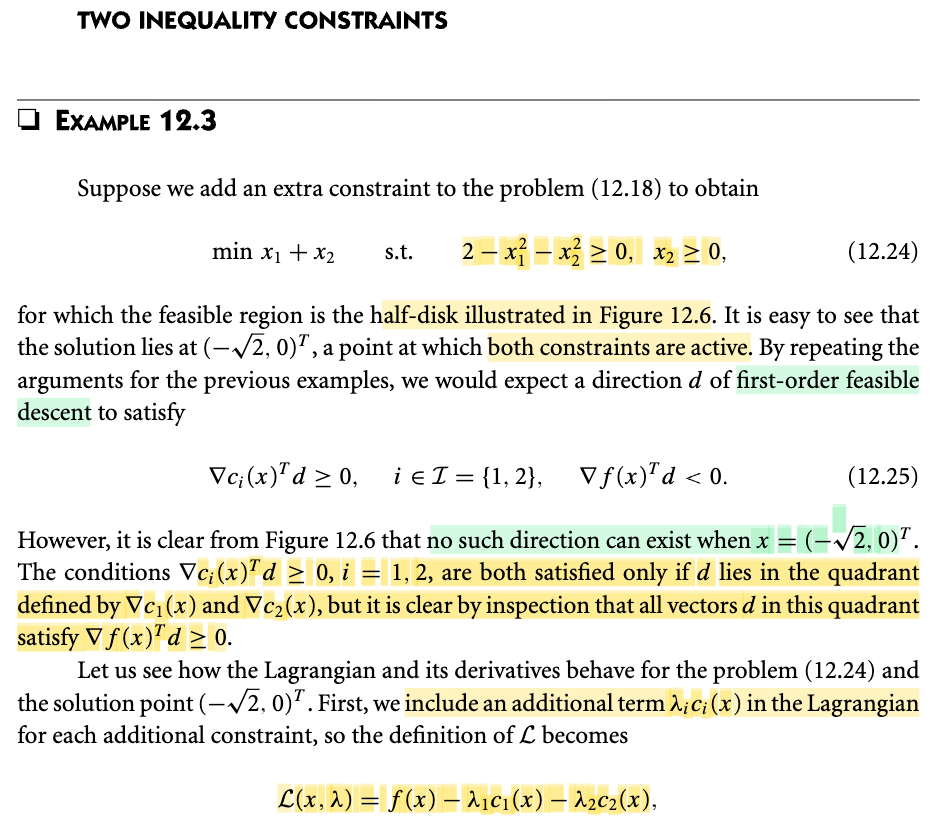</kbd>

<kbd>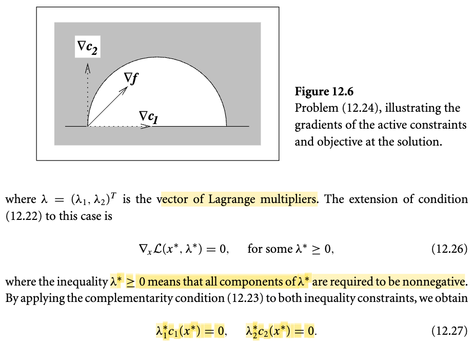</kbd>

<kbd>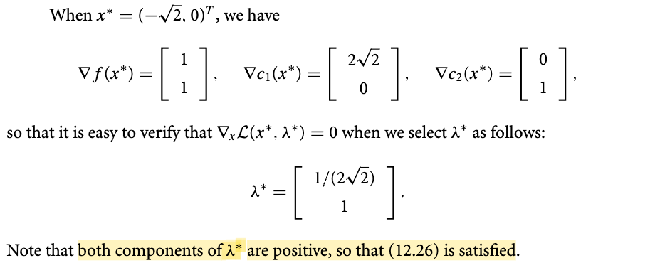</kbd>

> [!NOTE]
> Đoạn này không có gì khó hiểu, chỉ là mở rộng thêm 1 ràng buộc bất đẳng thức nữa. Lagrangian có thêm 1 term -λ2c2(x). Và điều kiện tìm solution vẫn là ∇\_x L(x\*, λ\*) = 0, λ\* ≥ 0, λ1\* c1(x\*) = 0 λ2\* c2(x\*) = 0.

 

- **Lagrangian Properties at Feasible Points**

<kbd>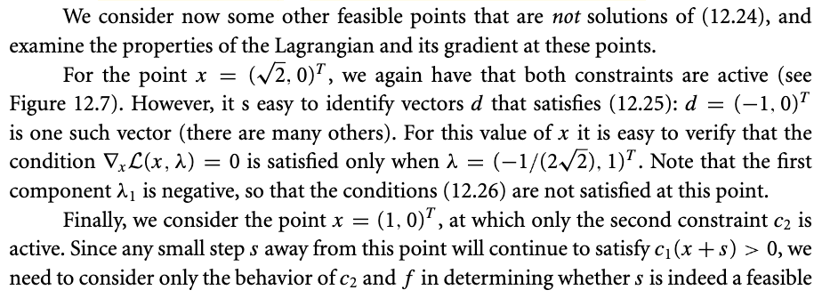</kbd>

<kbd>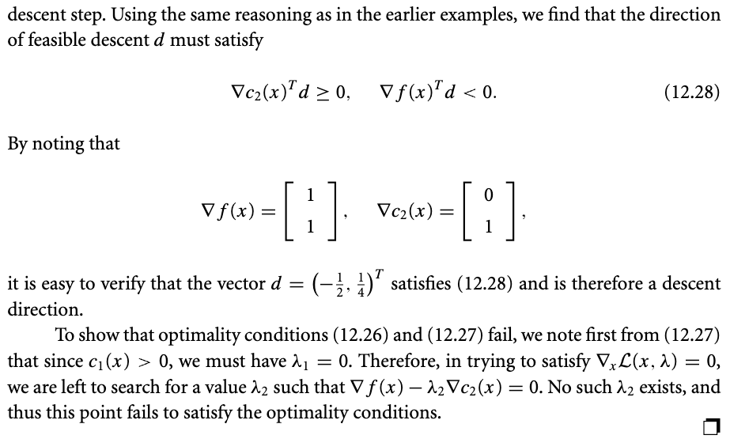</kbd>

> [!NOTE]
> Khúc này cũng không có gì quan trọng. Nói chung chỉ là gs Nocedal muốn minh họa để thuyết phục ta rằng cái điều kiện stationary và complementary slackness thật sự chỉ thỏa khi đó là solution, nếu không thì nó sẽ không thỏa.
>
>
>
> Nhưng mình sẽ active recall lại lần nữa cái lập luận mang tính trực giác giúp dẫn đến các điều kiện KKT, mình sẽ bỏ qua 12.3 (quay lại sau) nơi nói về Tangent cone, vốn dĩ chỉ là nhằm mục đích chứng minh cái theorem này.
>
>
>
> Ok, lập luận nhanh: bài toán là, minimize f(x) với constraint c1(x) ≥ 0.
>
>
>
> Lập luận như sau: Giả sử đang đứng tại x feasible. Nếu tìm được vector s có độ dài rất nhỏ, để x + s vẫn feasible và f(x + s) &lt; f(x) thì x không phải là solution của bài toán. Ngược lại, nếu không thể tìm được s như vậy thì x chính là solution.
>
>
>
> Thế thì với s rất ngắn, x+s sẽ rất gần x (≈x), cho phép hàm f(x+s) hành xử xấp xỉ như hàm tuyến tính: f(x+s) ≈ f(x) + ∇f(x)Ts. Như vậy, để giảm f, thì f(x+s) &lt; f(s), đồng nghĩa ∇f(s)Ts ≈ f(x+s) - f(x) phải &lt; 0. Như vậy, s phải hợp góc tù với ∇f(x) (i)
>
>
>
> Tương tự, với x+s rất gần x, hàm c1(x) cũng hành xử như hàm tuyến tính: c1(x+s) ≈ c1(x) + ∇c1Ts. Thế thì để x+s vẫn feasible, tức c1(x+s) ≥ 0 nên tương đương c1(x) + ∇c1Ts ≥ 0 (ii)
>
>
>
> Tới đây ta chia hai trường hợp:
>
>
>
> Case 1: Khi x đang ở interior của feasible set, tức c1(x) &gt; 0. Khi đó, để tìm một s thỏa (ii), thì miễn là s rất ngắn để cho dù ∇c1Ts có âm thì cái hạng tử dương c1(x) vẫn đủ để gánh, khiến thỏa (ii). Mà nói vậy thì đương nhiên đồng nghĩa luôn tồn tại vector s (còn việc khống chế cho length nó nhỏ thì luôn làm được) thỏa (ii), và không những là luôn tồn tại, mà là bất kì s với hướng nào cũng được, miễn là khống chế length của nó. Và trong số s bất kì đó, chắc chắn phải có s hợp với ∇f(x) một góc tù, trừ khi ∇f(x) đã bằng 0. Vậy, trong trường hợp này, khi x trong interior của feasible set, thì dù nó thế nào, thì cũng luôn tồn tại s khiến thỏa (ii) và (i), nên x luôn không phải là solution. Trừ một trường hợp: ∇f(x) = 0, khi đó dù với s bất kì đều thỏa (ii) nhưng không thể nào có s thỏa (i), vì làm sao hợp với zero vector một góc tù được. Vậy điều kiện để tìm solution ở case này là: ∇f(x\*) = 0
>
>
>
> Case 2: Khi x đang ở boundary của feasible set, tức c1(x) = 0. Khi đó, điều kiện (ii) trở thành ∇c1Ts ≥ 0, đồng nghĩa s phải hợp với ∇c1 một góc nhọn hoặc vuông. Câu hỏi lúc này là, tại x ở đâu thì không thể tìm được s thỏa: hợp góc nhọn hoặc vuông với ∇c1(x) và hợp với góc tù với ∇f(x). Câu trả lời chính là: khi ∇f(x) trùng với ∇c1(x), vì khi đó s không thể nào hợp một góc vừa nhọn vuông vừa tù được. Và như vậy, điều kiện tìm solution là:
>
>
>
> ∇f(x\*) = λ\*1 ∇c1(x\*) với λ\*1 ≥ 0
>
>
>
> Như vậy, tổng hợp lại 2 case, điều kiện sẽ là:
>
>
>
> ∇f(x\*) - λ\*1 ∇c1(x\*) = 0
>
>
>
> và λ\*1 c1(x\*) = 0
>
>
>
> và λ\*1 ≥ 0. 
>
>
>
> với 3 điều kiện này, nó sẽ cover 2 case trên:
>
>
>
> Khi c1(x\*) &gt; 0, thì λ\*(x) phải = 0, và (1) trở thành điều kiện tìm nghiệm của case 1: ∇f(x\*) = 0
>
>
>
> Khi c1(x\*) = , thì λ\*(x) chỉ cần ≥ 0, và (1) trở thành điều kiện tìm nghiệm của case 2: ∇f(x\*) = λ\*1 ∇c1(x\*) với λ\*1 ≥ 0

> [!TIP]
> **🤖 AI Feedback** — ✅ Score: **95/100**
>
> Bạn có tư duy trực quan xuất sắc khi tự lập luận và tái hiện lại các điều kiện KKT qua hai trường hợp biên và trong của tập khả thi. Hãy lưu ý sửa một lỗi gõ nhỏ ở cuối đoạn ('c1(x*) = ') và nhớ bổ sung vai trò của điều kiện ràng buộc (Constraint Qualifications) khi bạn tìm hiểu sâu hơn ở phần Tangent cone nhé.

 

