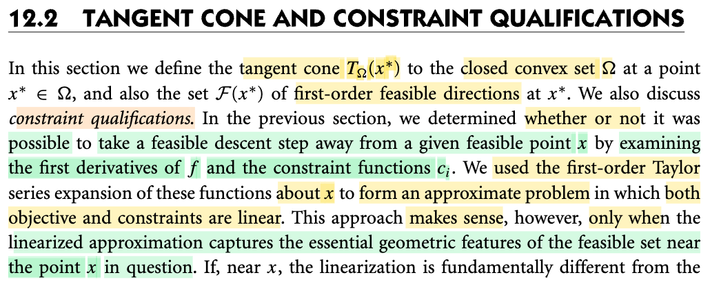
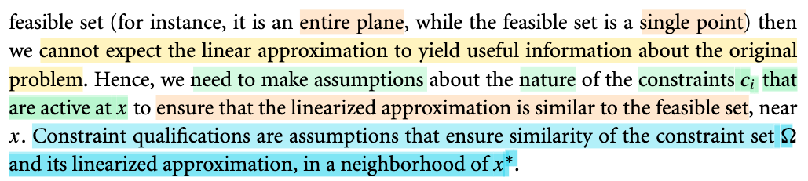
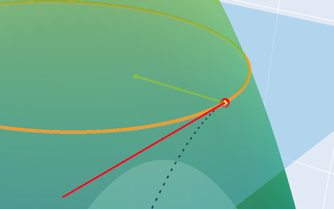
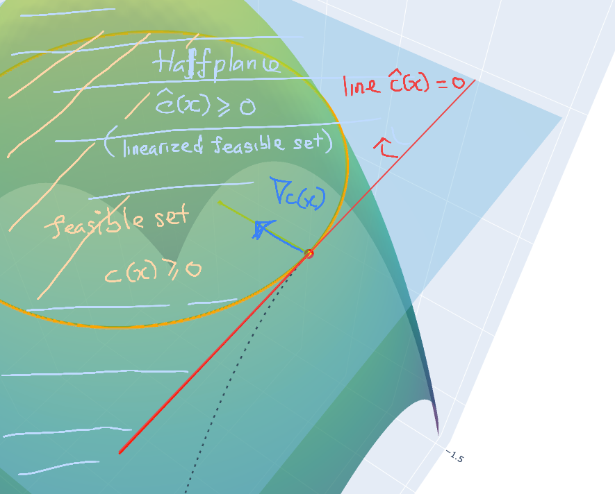
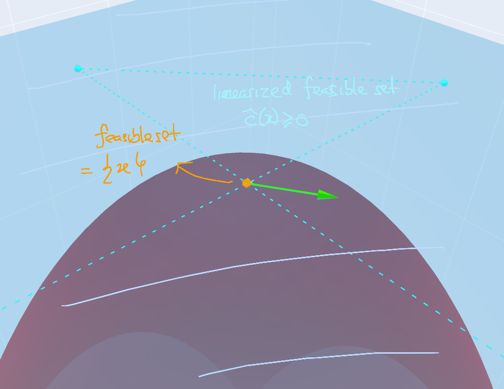

# 12.2 Tangent Cone & Constraint Qualification

📊 **Progress:** `1` Notes | `5` Screenshots | `1` AI Reviews

---

 

## Tangent Cone and Constraint Qualifications

<kbd></kbd>

<kbd></kbd>

<kbd></kbd>

<kbd></kbd>

<kbd></kbd>

> [!NOTE]
> Đoạn này đại khái là như sau:
>
>
>
> Đại ý là mục đích chính là đánh giá xem liệu từ một điểm feasible (thỏa constraint) có thể đi đến một điểm feasible khác và giảm f hay không?
>
>
>
> Và để làm việc này, thì một cách đó là làm như sau: Tuyến tính hóa cả hàm constraint cũng như hàm f tại điểm x đang đứng (tức là thay vì dùng hàm f, và ci, ta dùng xấp xỉ tuyến tính của f và ci tại x).(1) Mục đích là để làm gì? Chính là để đơn giản hóa vấn đề. Vì dù sao làm việc với hàm tuyến tính sẽ dễ hơn.
>
>
>
> Và định lý Taylor nói rằng trong phạm vi lân cận x (đủ gần x) hàm f và ci đều có thể xấp xỉ bởi một hàm tuyến tính.
>
>
>
> Do đó ý tưởng là nếu ta xem xét điểm lân cận của x, và thấy có thể có điểm nào đó thỏa linearized constraint, thì có thể nó cũng sẽ thỏa constraint (đã bảo trong khoảng lân cận hàm ci hành xử như hàm linearized ci mà)
>
>
>
> Tuy nhiên, có một vấn đề đó là có khi cách làm này không thể chấp nhận được
>
>
>
> Để dễ hiểu, hình 1 là một ví dụ mà cách làm này chấp nhận được và hình 2 thì không:
>
>
>
> Hình 1: hình dung ta có quả đồi quadratic và constraint c(x) ≥ 0 sẽ làm thành một hình tròn màu cam: ràng buộc ta khi di chuyển trong mặt phẳng thì phải trong phạm vi hình tròn này (để "chiều cao" c(x) của ta luôn ≥ 0).
>
>
>
> Vậy thì tại x nằm ngay trên đường tròn (c(x) = 0), nếu tuyến tính hóa hàm c(x), ta có ĉ(x') = c(x) + ∇c(x)ᵀ(x'-x), và dùng hàm này thay cho c(x) để áp vào constraint c(x) ≥ 0 thì ta có cái gọi là linearialize feasible set:
>
>
>
> ĉ(x') = c(x) + ∇c(x)ᵀ(x'-x) ≥ 0, đây là phương trình của một halfplane (khái quát hơn gọi là halfspace)
>
>
>
> và đây là trường hợp ta có thể coi như nó về cơ bản không quá khác feasible set gốc: c(x) ≥ 0 (ví dụ trong hình là một hình tròn) giúp cho cách làm đang nói ở trên (1) là chấp nhận được 
>
>
>
> c(x) + ∇c(x)ᵀ(x'-x) = 0 sẽ định ra một hyperplane, trong hình như ở đây là đường thẳng chứa vector màu đỏ
>
>
>
> Và linearized constraint ĉ(x') ≥ 0 ⇔ c(x) + ∇c(x)ᵀ(x'-x) ≥ 0 sẽ là nửa mặt phẳng (màu xanh nhạt) phía bên có mũi tên, cũng là chứa đường tròn.
>
>
>
> ---
>
>
>
> Hình 2:
>
>
>
> Xét trường hợp đặc biệt chỉ có mỗi mình x thỏa c(x) ≥ 0, đồng nghĩa feasible set là một tập **chỉ chứa đúng một điểm x duy nhất**. Thì khi đó đương nhiên ∇c(x) = 0. Khi đó linearized feasible set sẽ là: ĉ(x') ≥ 0 ⇔ c(x) + ∇c(x)ᵀ(x'-x) ≥ 0 ⇔ c(x) + 𝟎ᵀ(x'-x) ≥ 0 và điều này có nghĩa là tập này sẽ là toàn bộ mặt phẳng (vì x' nào cũng sẽ thỏa c(x) + 𝟎ᵀ(x'-x) ≥ 0).
>
>
>
> Do đó trong trường hợp này linearized feasible set mở rộng thành một plane (trong hình là toàn bộ mặt phẳng màu xanh nhạt, nhưng feasible set thì chỉ là 1 điểm (chấm màu cam)
>
>
>
>  Và đây là lúc mà tương ứng với trong sách nói: linearized feasible set và feasible set khác nhau về bản chất (fundamentally different) và cách làm (1) sẽ không chấp nhận được.
>
>
>
> Chính vì vậy, người ta mới bàn đến cái gọi là **constraint qualification**: là giả định đảm bảo có sự giống nhau giữa linearized feasible set và feasible set.

> [!TIP]
> 🤖 **AI Check** — 🟢 Pass — ✅ **98/100** · ✓ Move on
>
> Ghi chú nắm bắt xuất sắc bản chất hình học của việc tuyến tính hóa ràng buộc và lý do cần đến điều kiện ràng buộc (constraint qualification). Các hình vẽ minh họa và diễn giải toán học rất trực quan và bám sát giáo trình.
>
> **✓ Strengths**
> - Hiểu rất đúng mục đích của việc tuyến tính hóa hàm mục tiêu và các hàm ràng buộc theo chuỗi Taylor bậc nhất.
> - Trực quan hóa thành công ví dụ trong sách: khi ràng buộc đạt cực đại cục bộ tại duy nhất một điểm (gradient bằng 0), miền chấp nhận được tuyến tính hóa biến thành toàn bộ mặt phẳng trong khi tập gốc chỉ là một điểm.
> - Nêu bật được định nghĩa cốt lõi của constraint qualification như một điều kiện đảm bảo sự tương thích hình học giữa tập ràng buộc gốc và tập tuyến tính hóa quanh điểm đang xét.
>
> **💡 Deeper notes**
> - Khẳng định 'feasible set chỉ có 1 điểm duy nhất suy ra gradient bằng 0' là chính xác cho trường hợp 1 bất đẳng thức trơn c(x) >= 0 (vì khi đó x là điểm cực đại tự do của c). Với hệ nhiều ràng buộc cùng giao nhau tại 1 điểm, gradient của từng c_i không nhất thiết phải bằng 0 mà có thể vi phạm điều kiện độc lập tuyến tính (LICQ).

 

