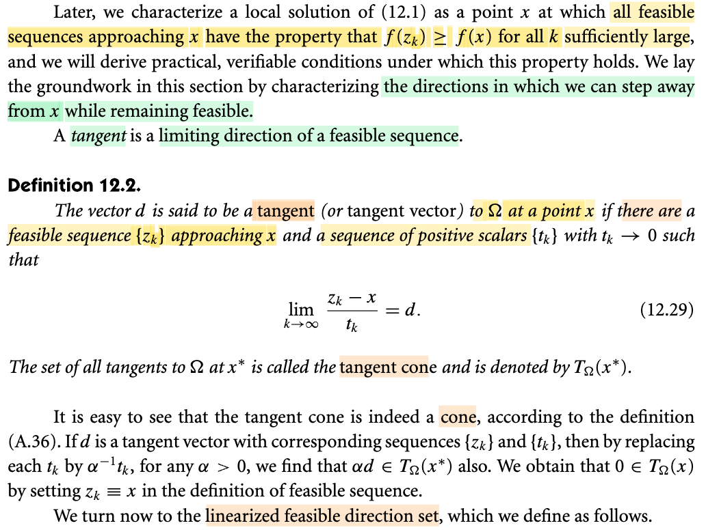
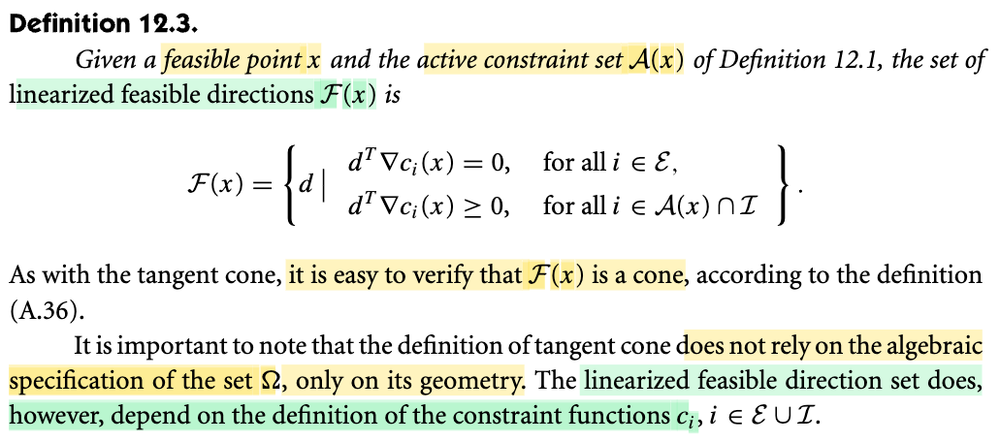
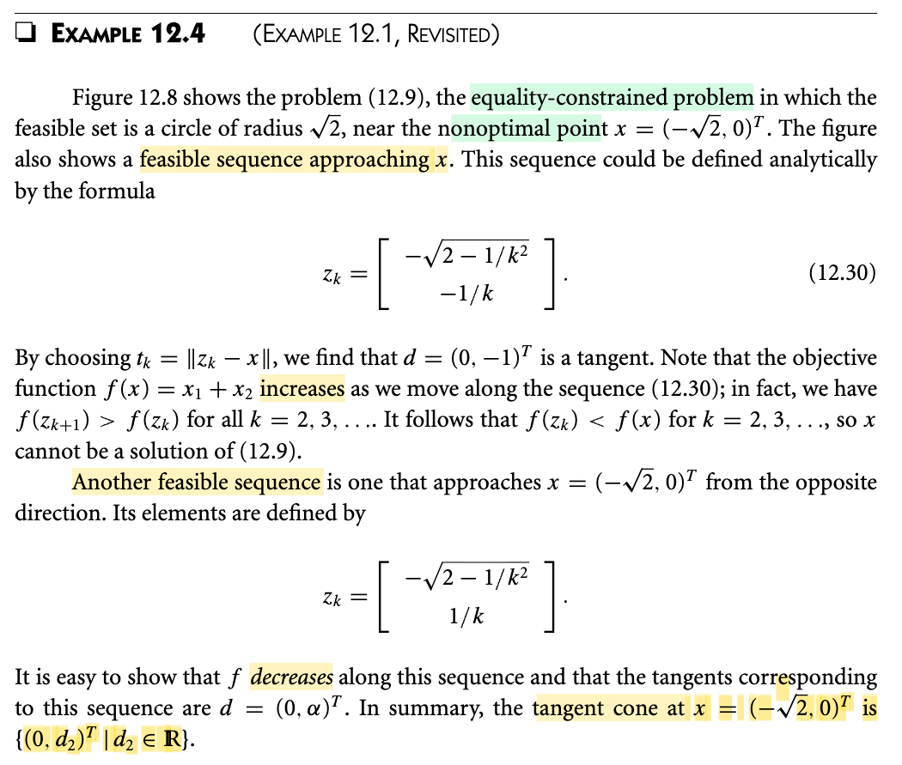
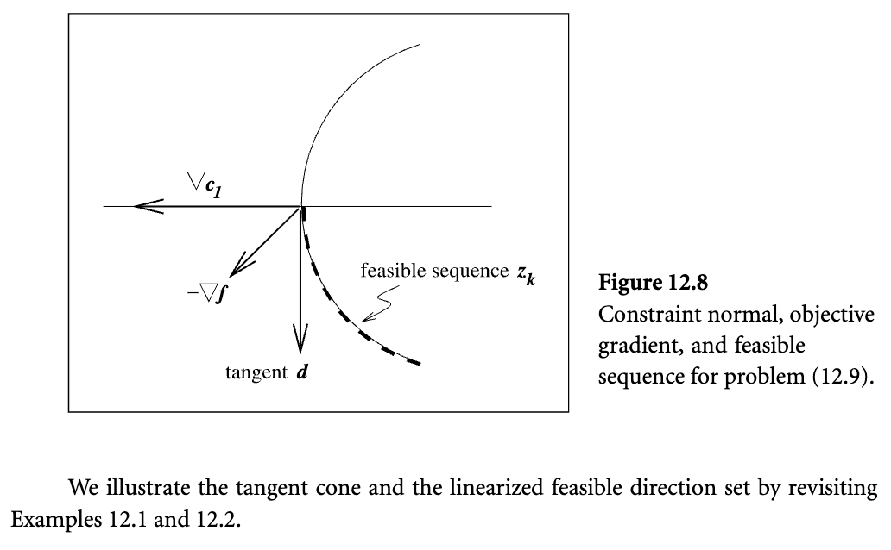
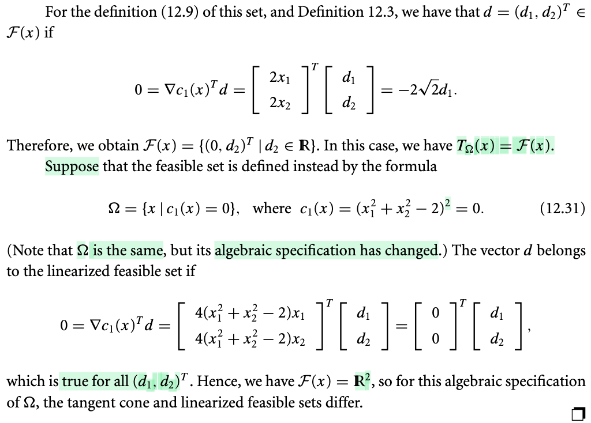
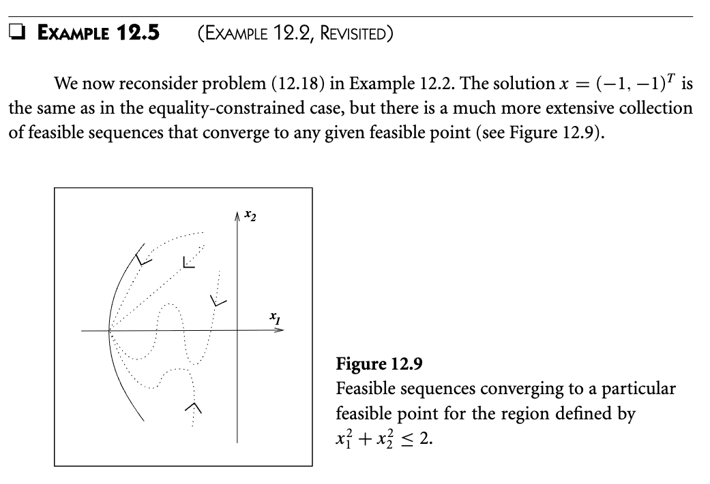
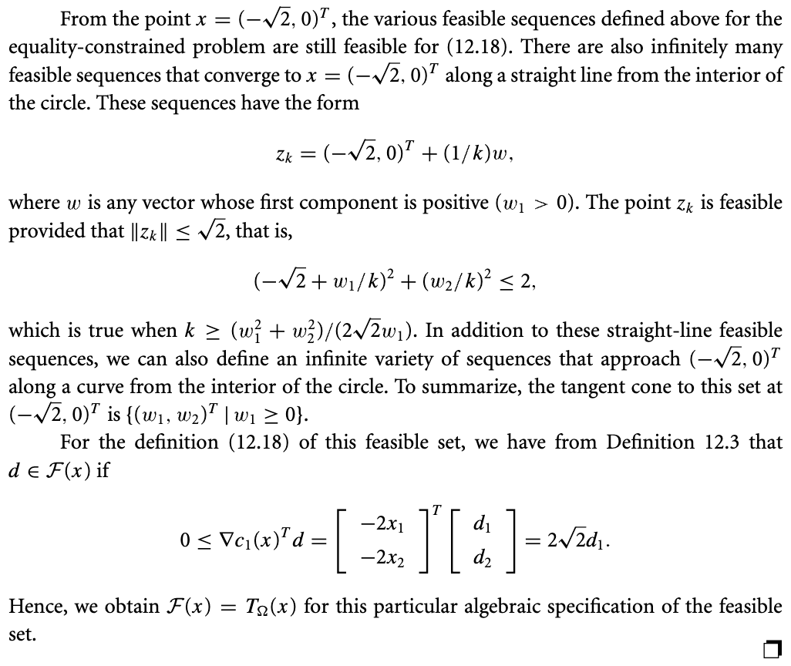
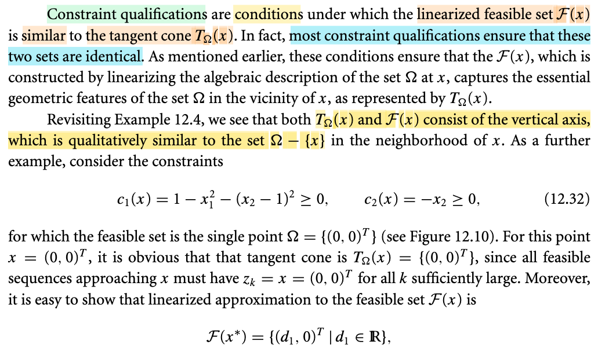
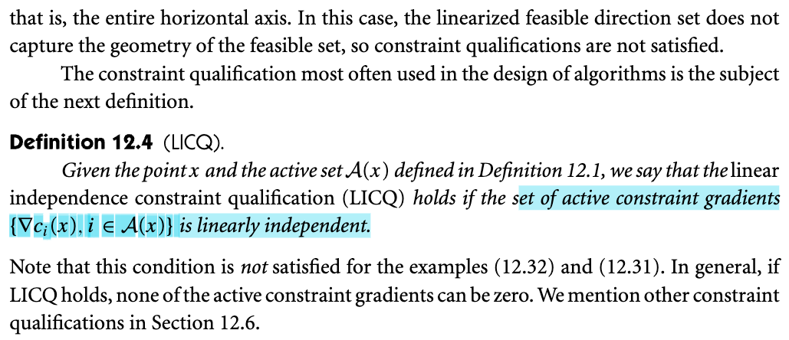

# 12.2 Tangent Cone & Constraint Qualification

📊 **Progress:** `6` Notes | `14` Screenshots | `6` AI Reviews

---

 

## Tangent Cone and Constraint Qualifications

<kbd></kbd>

<kbd></kbd>

<kbd></kbd>

<kbd></kbd>

<kbd></kbd>

> [!NOTE]
> Đoạn này đại khái là như sau:
>
>
>
> Đại ý là mục đích chính là đánh giá xem liệu từ một điểm feasible (thỏa constraint) có thể đi đến một điểm feasible khác và giảm f hay không?
>
>
>
> Và để làm việc này, thì một cách đó là làm như sau: Tuyến tính hóa cả hàm constraint cũng như hàm f tại điểm x đang đứng (tức là thay vì dùng hàm f, và ci, ta dùng xấp xỉ tuyến tính của f và ci tại x).(1) Mục đích là để làm gì? Chính là để đơn giản hóa vấn đề. Vì dù sao làm việc với hàm tuyến tính sẽ dễ hơn.
>
>
>
> Và định lý Taylor nói rằng trong phạm vi lân cận x (đủ gần x) hàm f và ci đều có thể xấp xỉ bởi một hàm tuyến tính.
>
>
>
> Do đó ý tưởng là nếu ta xem xét điểm lân cận của x, và thấy có thể có điểm nào đó thỏa linearized constraint, thì có thể nó cũng sẽ thỏa constraint (đã bảo trong khoảng lân cận hàm ci hành xử như hàm linearized ci mà)
>
>
>
> Tuy nhiên, có một vấn đề đó là có khi cách làm này không thể chấp nhận được
>
>
>
> Để dễ hiểu, hình 1 là một ví dụ mà cách làm này chấp nhận được và hình 2 thì không:
>
>
>
> Hình 1: hình dung ta có quả đồi quadratic và constraint c(x) ≥ 0 sẽ làm thành một hình tròn màu cam: ràng buộc ta khi di chuyển trong mặt phẳng thì phải trong phạm vi hình tròn này (để "chiều cao" c(x) của ta luôn ≥ 0).
>
>
>
> Vậy thì tại x nằm ngay trên đường tròn (c(x) = 0), nếu tuyến tính hóa hàm c(x), ta có ĉ(x') = c(x) + ∇c(x)ᵀ(x'-x), và dùng hàm này thay cho c(x) để áp vào constraint c(x) ≥ 0 thì ta có cái gọi là linearialize feasible set:
>
>
>
> ĉ(x') = c(x) + ∇c(x)ᵀ(x'-x) ≥ 0, đây là phương trình của một halfplane (khái quát hơn gọi là halfspace)
>
>
>
> và đây là trường hợp ta có thể coi như nó về cơ bản không quá khác feasible set gốc: c(x) ≥ 0 (ví dụ trong hình là một hình tròn) giúp cho cách làm đang nói ở trên (1) là chấp nhận được 
>
>
>
> c(x) + ∇c(x)ᵀ(x'-x) = 0 sẽ định ra một hyperplane, trong hình như ở đây là đường thẳng chứa vector màu đỏ
>
>
>
> Và linearized constraint ĉ(x') ≥ 0 ⇔ c(x) + ∇c(x)ᵀ(x'-x) ≥ 0 sẽ là nửa mặt phẳng (màu xanh nhạt) phía bên có mũi tên, cũng là chứa đường tròn.
>
>
>
> ---
>
>
>
> Hình 2:
>
>
>
> Xét trường hợp đặc biệt chỉ có mỗi mình x thỏa c(x) ≥ 0, đồng nghĩa feasible set là một tập **chỉ chứa đúng một điểm x duy nhất**. Thì khi đó đương nhiên ∇c(x) = 0. Khi đó linearized feasible set sẽ là: ĉ(x') ≥ 0 ⇔ c(x) + ∇c(x)ᵀ(x'-x) ≥ 0 ⇔ c(x) + 𝟎ᵀ(x'-x) ≥ 0 và điều này có nghĩa là tập này sẽ là toàn bộ mặt phẳng (vì x' nào cũng sẽ thỏa c(x) + 𝟎ᵀ(x'-x) ≥ 0).
>
>
>
> Do đó trong trường hợp này linearized feasible set mở rộng thành một plane (trong hình là toàn bộ mặt phẳng màu xanh nhạt, nhưng feasible set thì chỉ là 1 điểm (chấm màu cam)
>
>
>
>  Và đây là lúc mà tương ứng với trong sách nói: linearized feasible set và feasible set khác nhau về bản chất (fundamentally different) và cách làm (1) sẽ không chấp nhận được.
>
>
>
> Chính vì vậy, người ta mới bàn đến cái gọi là **constraint qualification**: là giả định đảm bảo có sự giống nhau giữa linearized feasible set và feasible set.

> [!TIP]
> 🤖 **AI Check** — 🟢 Pass — ✅ **98/100** · ✓ Move on
>
> Ghi chú nắm bắt xuất sắc bản chất hình học của việc tuyến tính hóa ràng buộc và lý do cần đến điều kiện ràng buộc (constraint qualification). Các hình vẽ minh họa và diễn giải toán học rất trực quan và bám sát giáo trình.
>
> **✓ Strengths**
> - Hiểu rất đúng mục đích của việc tuyến tính hóa hàm mục tiêu và các hàm ràng buộc theo chuỗi Taylor bậc nhất.
> - Trực quan hóa thành công ví dụ trong sách: khi ràng buộc đạt cực đại cục bộ tại duy nhất một điểm (gradient bằng 0), miền chấp nhận được tuyến tính hóa biến thành toàn bộ mặt phẳng trong khi tập gốc chỉ là một điểm.
> - Nêu bật được định nghĩa cốt lõi của constraint qualification như một điều kiện đảm bảo sự tương thích hình học giữa tập ràng buộc gốc và tập tuyến tính hóa quanh điểm đang xét.
>
> **💡 Deeper notes**
> - Khẳng định 'feasible set chỉ có 1 điểm duy nhất suy ra gradient bằng 0' là chính xác cho trường hợp 1 bất đẳng thức trơn c(x) >= 0 (vì khi đó x là điểm cực đại tự do của c). Với hệ nhiều ràng buộc cùng giao nhau tại 1 điểm, gradient của từng c_i không nhất thiết phải bằng 0 mà có thể vi phạm điều kiện độc lập tuyến tính (LICQ).

 

### Definition 12.2 Tangent Cone

<kbd></kbd>

> [!NOTE]
> Hiểu đại khái về tangent cone như sau.
>
>
>
> HÌnh dung thế này, mình có cái bàn tròn, và đang đứng tại 𝐱\* sát mép bàn mà chỉ cần đi tới tí xíu là rớt xuống (y như đang đứng trên đường tròn, nhích tí xíu là ra khỏi hình tròn).
>
>
>
> Thế rồi yêu cầu đặt ra là định nghĩa ra một tập các vector, các hướng đi sao cho từ 𝐱\* ta có thể đi một bước vô cùng nhỏ để giúp vẫn còn nằm trên bàn, chưa bị rớt ra ngoài. Thì định nghĩa thế nào?
>
>
>
> Các nhà toán học chơi kiểu này: Ổng xét **mọi** con đường chạy lòng vòng trên bàn rồi kết thúc ở 𝐱\*, và với mỗi một cái như vậy, hình dung có một điểm 𝐱 chạy trên con đường đó, thì vector 𝐱\* → 𝐱 sẽ quét qua quét lại và cuối cùng ổn định khi 𝐱 đến gần và trùng với 𝐱\*, gọi vector ổn định đó là d thì tập hợp mọi cái như vậy được định nghĩa là tangent cone (mỗi cái là một tangent). Vì sao nó gọi là cone thì cũng không quan trọng lắm, chỉ là nói về hình dạng của cái tập này, và có thể chứng minh được.
>
>
>
> Nhưng cái quan trọng là, ý nghĩa của nó là gì, định nghĩa ra tangent cone để làm gì?
>
>
>
> Đây là khái quát bức tranh toàn cảnh
>
>
>
>
>
> Mình nghĩ: Đơn giản là **để ta có thể nói** về một tập các vector mà đi theo hướng đó từ 𝐱\*, với một sải chân nhỏ một cách phù hợp nào đó, thì ta vẫn feasible (thỏa constraint, vẫn ở trên bàn).  Và khi đã có thể nói về, mô tả về một tập như vậy, ta mới nói tiếp câu chuyện là khi đó, giả sử đi theo hướng nào của tangent cone theo cách trên (giữa trạng thái feasible) đều khiến ta "cao hơn" thì khi đó có thể kết luận 𝐱\* là là minimizer của bài toán tối ưu ràng buộc.  
>
>
>
> Tuy vậy ta sẽ không thể làm liền kiểu đó, mà sẽ mượn thêm một idea nữa: linearized feasible direction ℱ(𝐱\*)
>
>
>
> Nó sẽ là tập các hướng mà theo đó thì các constraint đã tuyến tính hóa vẫn thỏa (cụ thể là các constraint đẳng thức và bất đẳng thức đang active, nói cách khác, là xét các "cạnh bàn" + "tường rào" mà ta đang đứng, thì đi theo hướng nào khiến phiên bản tuyến tính hóa của các constraint đó vẫn thỏa.
>
>
>
> Và sau đó là tác giả sẽ cho ta thấy các trường hợp mà hai tập này là trùng nhau và khác nhau.
>
>
>
> Từ đó sẽ đẻ ra cái gọi là constraint qualification: điều kiện rằng hai tập này trùng nhau.
>
>
>
> Và mục đích là để, khi đó, ta chỉ việc xét trong các hướng của linearized feasible direction trong các lập luận xây dựng điều kiện để tìm nghiệm của bài toán tối ưu ràng buộc này. Vì mô tả một hướng linearized feasible direction thì sẽ dễ hơn mô tả hướng trong tangent cone.

> [!TIP]
> 🤖 **AI Check** — 🟡 Minor issues — ✅ **92/100** · ✓ Move on
>
> Ghi chú thể hiện khả năng nắm bắt bức tranh toàn cảnh (big picture) xuất sắc, hiểu đúng vai trò của tangent cone, linearized feasible directions và vì sao cần constraint qualification.
>
> **🟡 Minor issues**
>
> **1.** *"tập các vector mà đi theo hướng đó từ 𝐱*, với một sải chân nhỏ một cách phù hợp nào đó, thì ta vẫn feasible (thỏa constraint, vẫn ở trên bàn)"*
>
> Về mặt hình học chặt chẽ, nếu biên bị cong (như hình tròn bạn lấy ví dụ), việc bước thẳng theo một vector tiếp tuyến d (tức là 𝐱* + αd) thường sẽ văng ra ngoài tập khả thi với mọi α > 0. Định nghĩa tangent đòi hỏi tồn tại dãy khả thi {z_k} tiệm cận về 𝐱* theo hướng d (tức là bám theo một đường cong nằm trong tập), chứ không nhất thiết bước thẳng theo d là feasible.
>
>
> **✓ Strengths**
> - Nắm rất rõ và trực giác tốt về lý do tại sao định nghĩa tangent cone thông qua giới hạn của dãy khả thi (z_k - x*)/t_k.
> - Bao quát chính xác bức tranh tối ưu ràng buộc: từ tangent cone (hình học) dẫn tới linearized feasible directions (đại số/dễ tính toán) và vai trò của Constraint Qualification (CQ).
>
> **💡 Deeper notes**
> - Về thuật ngữ 'cone' (nón): Trong giải tích lồi và tối ưu, 'cone' là một khái niệm toán học chính xác (tập đóng với phép nhân vô hướng dương: nếu d thuộc tập thì αd cũng thuộc tập với mọi α > 0), chứ không chỉ nói về hình dạng nón thông thường. Đoạn cuối trang sách đã chứng minh điều này bằng việc thay t_k bởi α^(-1) t_k.
> - Vectơ 0 luôn thuộc tangent cone (chứng minh bằng cách chọn dãy hằng z_k = x*).

 

#### Linearized Feasible Directions

<kbd></kbd>

> [!NOTE]
> Nói ngắn gọn, đây ℱ(x) là tập các hướng đi mà khi từ x theo các hướng này thì constraint tuyến tính hóa của constraint sẽ vẫn thỏa.
>
>
>
> Constrain tuyến tính hóa là sao: Là vầy, ta có các constraint đẳng thức và bất đẳng thức: ci(x) = 0 với i ∈ ℰ và ci(x) ≥ 0 với i ∈ ℐ. Ta xấp xỉ tuyến tính các hàm này (tại x), tức là xét hàm số ĉi(x') = ci(x) + ∇ci(x)ᵀ(x'-x), hay đổi biến thành d = x'- x: ĉi(d) = ci(x) + ∇ci(x)ᵀd. Thì lúc này ta có linearied constraint, ĉi(d) = 0 với i ∈ ℰ và ĉi(d) ≥ 0 với i ∈ ℐ.
>
>
>
> Khi đó nếu xét tất cả các hướng d thỏa ∈ ℱ(x) ta sẽ có: 
>
>
>
> ĉi(d) = ci(x) + 0 = ci(x) với i ∈ ℰ 
>
>
>
> và 
>
>
>
> ĉi(d) = ci(x) + ∇ci(x)ᵀd, ∇ci(x)ᵀd ≥ 0, i ∈ 𝒜(x) ∩ ℐ (tức là chỉ xét các ràng buộc bất đẳng thức đang active tại x: ci(x) = 0, i ∈ ℐ)
>
>
>
> Khi đó giả sử x là feasible point thì với i ∈ ℰ,  ci(x) = 0, với i ∈ 𝒜(x) ∩ℐ, ci(x) = 0. 
>
>
>
> Lúc này với i ∈ ℰ ĉi(d) = ci(x) + 0 = 0 
>
>
>
> và 
>
>
>
> với i ∈ i ∈ 𝒜(x) ∩ ℐ, ĉi(d) = 0 + ∇ci(x)ᵀd ≥ 0 (do ∇ci(x)ᵀd ≥ 0.
>
>
>
> Nên ý nghĩa của linearized feasible set ℱ(x) sẽ là tập mà, từ **feasible point x, khi ta đi theo hướng đó, các constraint tuyến tính hóa sẽ vẫn thỏa**.
>
>
>
> Và vì giải tích cho phép ta nói khi xét trong phạm vi lân cận x, hàm số có thể coi như hành xử tuyến tính. Do đó, nếu ta xét trong phạm vi lân cận x, và tồn tại hướng d ∈ ℱ(x) khiến hàm mục tiêu giảm thêm thì đồng nghĩa ta có thể kết luận: có thể có x' lân cận x mà vẫn feasible + giảm thêm hàm mục tiêu nên suy ra x không phải là minimizer. Đây chính là ý tưởng của điều kiện cần bậc nhất KKT, đóng vai trò là vòng loại đầu tiên, để những điểm thỏa KKT sẽ là ứng cử viên cho minimizer của bài toán (sau đó ta xét điều kiện cần bậc hai để loại tiếp và chốt bằng điều kiện đủ bậc 2). Đại ý là vậy, còn để chặt chẽ sẽ còn cần đến điều kiện constraint qualification.

> [!TIP]
> 🤖 **AI Check** — 🟡 Minor issues — ✅ **92/100** · ✓ Move on
>
> Ghi chú nắm rất chắc bản chất giải tích của tập hướng khả thi tuyến tính hóa và liên hệ chuẩn xác tới vai trò của nó trong điều kiện tối ưu KKT cùng Constraint Qualification.
>
> **🟡 Minor issues**
>
> **1.** *"tức là chỉ xét các ràng buộc bất đẳng thức đang active tại x: ci(x) = 0, i ∈ ℐ"*
>
> Ghi chú chưa làm rõ lý do tại sao các ràng buộc không active (inactive: ci(x) > 0) lại không xuất hiện trong định nghĩa F(x). Về mặt giải tích, do ci liên tục và ci(x) > 0 nên trong một lân cận đủ nhỏ của x, bất đẳng thức ci(x + αd) > 0 luôn tự động được thỏa mãn với mọi hướng d.
>
>
> **✓ Strengths**
> - Hiểu rất rõ cách thiết lập xấp xỉ tuyến tính cấp 1 quanh feasible point x để dẫn ra hệ điều kiện trong định nghĩa F(x).
> - Kết nối trực giác xuất sắc từ việc giảm hàm mục tiêu theo hướng khả thi đến tư tưởng vòng loại của điều kiện KKT và điều kiện bậc hai.
> - Nhận thức đúng đắn về sự cần thiết của điều kiện chuẩn tắc ràng buộc (Constraint Qualification) để đảm bảo tính chặt chẽ.
>
> **💡 Deeper notes**
> - Khác biệt bản chất giữa Tangent Cone T_Ω(x) và Linearized Cone F(x): Tangent Cone chỉ phụ thuộc vào hình học của tập chấp nhận được Ω, trong khi F(x) phụ thuộc trực tiếp vào dạng đại số của các hàm ràng buộc ci. Điều kiện chuẩn tắc ràng buộc (CQ) chính là cầu nối để F(x) trùng với T_Ω(x).

 

##### Example 12.4 Tangent Cone Feasible Sequence

<kbd></kbd>

<kbd></kbd>

<kbd></kbd>

> [!NOTE]
> Giải thích ngắn gọn ví dụ này: Cho ta thấy tangent cone TΩ(x), linearized feasible direction set ℱ(x) là gì, và có khi chúng trùng nhau có khi chúng khác nhau.
>
>
>
> Bài toán này chỉ có một constraint đẳng thức: c1(x) = x1² + x2² - 2 = 0, chính là ràng buộc x **phải nằm trên đường tròn** (tâm 0, bán kính √2) trong hình vẽ. Đường gạch chấm chấm chính là một chuỗi "feasible sequence" tiếp cận x (còn môt chuỗi khác tiếp cận x từ hướng trên). Thì đại ý là, theo cách ta hiểu **về mặt trực giác hình học** của tangent, thì tangent d của feasible set chính là vector vuông góc với ∇c1 tại x: khi điểm trong chuỗi tiếp cận x, thì hướng nối x với điểm đó sẽ dần ổn định về vector d.
>
>
>
> Và đại ý là, về mặt trực giác hình học cũng như theo định nghĩa tangent cone, thì tập hợp mọi vector vuông góc với ∇c1(x) chính là tangent cone: {(0, d2)ᵀ, d2 ∈ R} (với các d2 khác nhau, ta có các vector dài ngắn và hướng khác nhau, nhưng đều là trong **đường thẳng vuông góc với ∇c1(x) tại x**, đó chính là TΩ(x)
>
>
>
> Còn ℱ(x), ta dùng định nghĩa, tính đạo hàm của c1 và tìm d thỏa ∇c1(x)ᵀd = 0 
>
>
>
> ⇔ \[2x1, 2x2\]ᵀd|x=(-√2, 0) = 0
>
>
>
> ⇔ \[2 × (-√2), 2 × 0\]ᵀd = 0
>
>
>
> ⇔ -2√2d1 + 0 × d2 = 0
>
>
>
> ⇔ d1 = 0, d2 tùy ý.
>
>
>
> ⇒ d = {(0, d2)ᵀ, d2 ∈ R}. 
>
>
>
> Và đây con đường trực giác hình học và con đường đại số cho thấy giống nhau: **Tangent cone TΩ(x) trùng với linearized feasible direction set ℱ(x)** đều là đường thẳng vuông góc với đường tròn tại x.
>
>
>
> ---
>
>
>
> Tuy nhiên, khi thay đổi hàm c1 thành bình phương c1 cũ: (x1² + x2² - 2)² = 0,
>
>
>
> Thì feasible set vẫn không đổi vì (x1² + x2² - 2)² = 0 ⇔ (x1² + x2² - 2) = 0 nên tangent cone không đổi
>
>
>
> Nhưng ℱ(x\*) tính ra lúc này lại thay đổi:
>
>
>
> ∇c1(x)ᵀd = 0 ⇔ \[2x1(x1² + x2² - 2), 2x2(x1² + x2² - 2)\]ᵀd|x=(-√2, 0) = 0
>
>
>
> ⇔ \[2x1(x1² + x2² - 2), 2x2(x1² + x2² - 2)\]ᵀd|x=(-√2, 0) = 0
>
>
>
> ⇔ \[0, 0\]ᵀd= 0
>
>
>
> và d là vector bất kì đều thỏa, khiến ℱ(x) trở thành toàn mặt phẳng thay vì chỉ là đường thẳng vuông góc với ∇c1(x) tại x.
>
>
>
> khi đó, linearized feasible set khác với tangent cone. 
>
>
>
> Đây là case minh họa cho việc sẽ cần phải có các constraint qualification.

> [!TIP]
> 🤖 **AI Check** — 🟡 Minor issues — ✅ **92/100** · ✓ Move on
>
> Ghi chú nắm rất tốt trực giác hình học của dãy khả thi (feasible sequence), tiếp tuyến và lý do vì sao điểm x không phải là cực tiểu cục bộ. Chỉ cần lưu ý thêm về phép chuẩn hóa độ dài khi định nghĩa vector tiếp tuyến và tập nón tiếp tuyến ở đây tạo thành một đường thẳng.
>
> **🟡 Minor issues**
>
> **1.** *"mình xét một cái vector hoặc là một cái tia, một cái đường thẳng nối x tới một cái điểm ở trên cái chuỗi. Thì khi mà cái điểm trên cái chuỗi nó di chuyển tiếp cận x thì cái vector đó nó sẽ hội tụ dần về cái hướng cuối cùng là hướng tangent"*
>
> Về mặt giải tích, vector chênh lệch $(z_k - x)$ sẽ tiến về vector $0$ khi $z_k 	o x$. Do đó, để xác định hướng tiếp tuyến $d$, ta bắt buộc phải chia cho một dãy vô cùng bé dương $t_k 	o 0$ (cụ thể là $t_k = \|z_k - x\|$) để chuẩn hóa độ dài, chứ bản thân vector nối đơn thuần sẽ co về $0$.
>
>
> **✓ Strengths**
> - Hiểu chính xác bản chất của ràng buộc đẳng thức là giam không gian khả thi vào một level set (đường cong contour).
> - Phân tích góc giữa hướng di chuyển dọc theo dãy feasible và vector $-\nabla f$ rất trực quan và đúng đắn.
> - Rút ra kết luận chính xác rằng $x$ không thể là nghiệm tối ưu vì tồn tại các điểm khả thi lân cận có giá trị hàm mục tiêu nhỏ hơn $f(x)$.
>
> **💡 Deeper notes**
> - Do ràng buộc là đẳng thức trơn (circle), nón tiếp tuyến (tangent cone) tại $x$ không chỉ gồm các tia một phía mà là toàn bộ đường thẳng $T(x) = \{(0, d_2)^T \mid d_2 \in \mathbb{R}\}$, hợp bởi hai hướng tiếp cận từ trên và từ dưới.

 

###### Example 12.5 Feasible Sequences

<kbd></kbd>

<kbd></kbd>

> [!NOTE]
> Quay lại sau

> [!TIP]
> 🤖 **AI Check** — 🔴 Critical issues — ❌ **0/100** · ✗ Fix first
>
> Ghi chú hiện tại chưa có bất kỳ nội dung nào để đánh giá kiến thức ngoài dòng chữ để lại tạm thời 'Quay lại sau'. Bạn hãy ghi chép lại các ý chính của Ví dụ 12.5 trước khi tiếp tục.
>
> **🔴 Critical issues**
>
> **1.** *"Quay lại sau"*
>
> Chưa có nội dung ghi chú hay bất kỳ bước suy luận nào được thực hiện.
>

 

###### Constraint Qualifications and Tangent Cone

<kbd></kbd>

<kbd></kbd>

> [!NOTE]
> Khi đã hiểu lí do cần phải có constraint qualification mà nói một cách ngắn gọn: Là để ta có thể sử dùng linearized feasible direction ℱ(x\*) thay vì tangent direction (vốn khó mô tả) trong các lập luận để xây dựng điều kiện cần và đủ để tìm nghiệm của bài toán. 
>
>
>
> Nên ở đây chỉ cần hiểu điều kiện Constraint Qualification đầu tiên: Là các active constraint gradient vector độc lập tuyến tính nhau, gọi là linearly independent constraint qualification.
>
>
>
> Tức là, ví dụ bài toán có 3 constraint, c1(x) = 0, c2(x) ≥ 0, c3(x) ≥ 0. Trong đó tại x\*, c2 active. Khi đó điều kiện LICQ là ∇c1(x\*) và ∇c2(x\*) độc lập tuyến tính. Hết.

> [!TIP]
> 🤖 **AI Check** — 🟡 Minor issues — ✅ **92/100** · ✓ Move on
>
> Ghi chú nắm rất chính xác bản chất hình học của Constraint Qualification (dùng nón xấp xỉ tuyến tính thay cho nón tiếp tuyến) và định nghĩa LICQ thông qua ví dụ trực quan. Cần lưu ý thêm rằng KKT chủ yếu là điều kiện cần (necessary condition), chỉ trở thành điều kiện đủ khi có thêm giả thiết lồi.
>
> **🟡 Minor issues**
>
> **1.** *"xây dựng điều kiện cần và đủ để tìm nghiệm của bài toán"*
>
> Trong bài toán tối ưu phi tuyến tổng quát, Constraint Qualification (như LICQ) được dùng để đảm bảo điều kiện KKT là điều kiện cần bậc một (First-Order Necessary Conditions - FONC). Để KKT trở thành điều kiện đủ, bài toán cần có thêm tính chất lồi (convexity).
>
>
> **✓ Strengths**
> - Hiểu đúng mục đích cốt lõi của Constraint Qualification là đảm bảo nón hướng khả thi tuyến tính hóa F(x) trùng với nón tiếp tuyến T_Omega(x).
> - Áp dụng chính xác định nghĩa LICQ vào ví dụ: nhận diện đúng ràng buộc đẳng thức luôn active cùng với ràng buộc bất đẳng thức active để kiểm tra độc lập tuyến tính của các gradient.
>
> **💡 Deeper notes**
> - Theo hệ quả trực tiếp của LICQ, không có gradient của ràng buộc active nào được phép triệt tiêu (bằng 0) tại x*.
> - Bên cạnh LICQ, còn có các điều kiện ràng buộc khác yếu hơn (như MFCQ, Mangasarian-Fromovitz) cũng đảm bảo được tính đồng nhất giữa F(x) và T_Omega(x).

 

