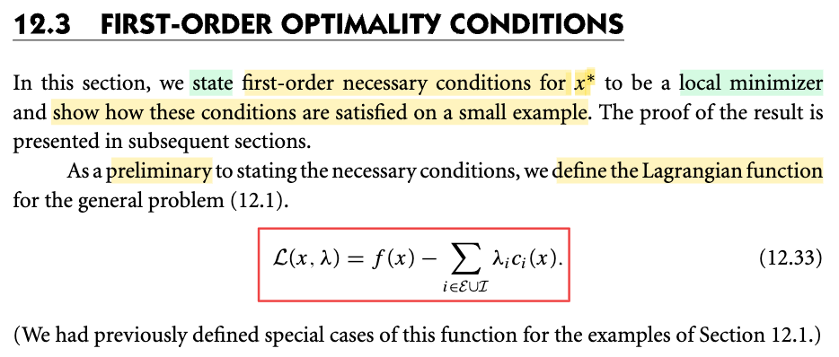
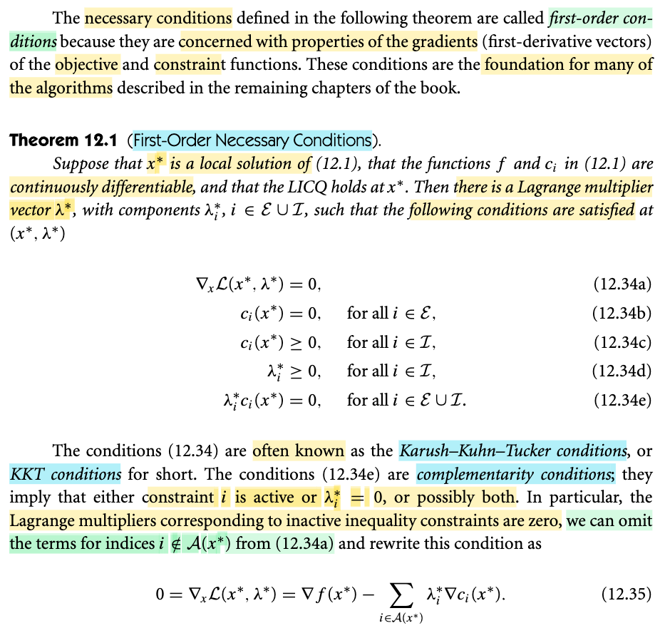
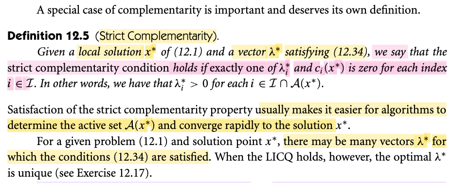
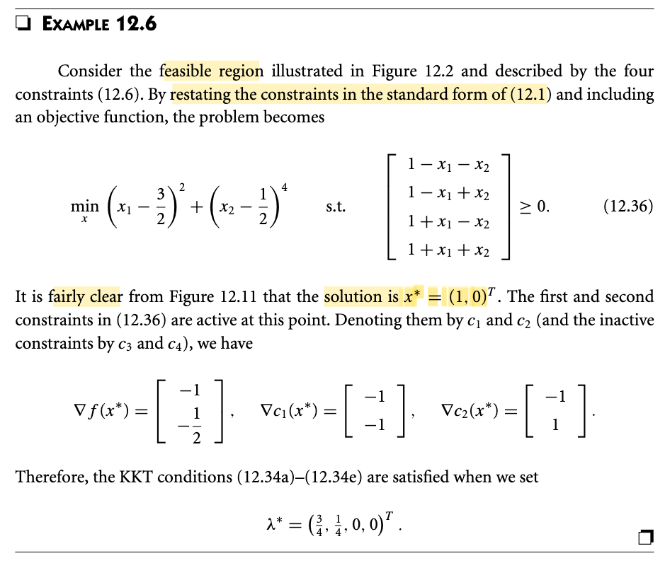
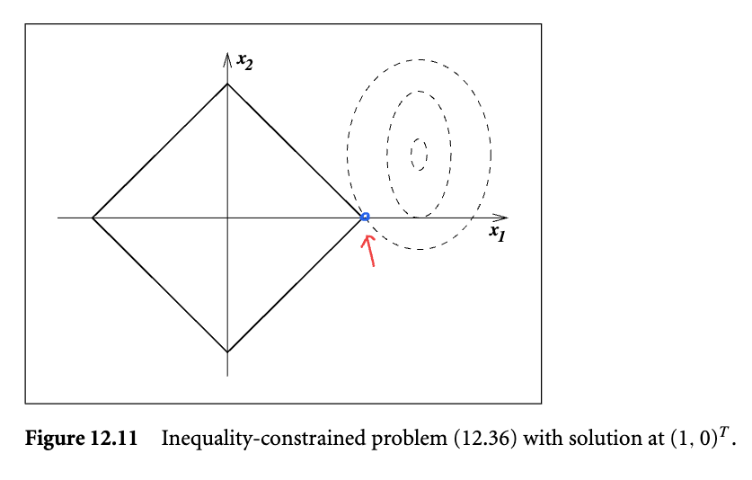

# 12.3 First Order Optimality Condition

📊 **Progress:** `3` Notes | `5` Screenshots | `2` AI Reviews

---

## 12.3 First Order Optimality Condition

 

## First-Order Optimality Conditions

<kbd></kbd>

<kbd></kbd>

> [!NOTE]
> Đoạn này thực ra không có gì, chỉ là gs Nocedal nêu ra định lý điều kiện cần bậc nhất của (việc tìm nghiệm) bài toán tối ưu có ràng buộc. Và dù ta sẽ chứng minh nó sau, nhưng lập luận mang tính trực giác của 12.2 đã cơ bản là đủ để hiểu hiểu về các điều kiện này.
>
>
>
> Bài toán tối ưu tổng quát là minimize hàm f(x) với các ràng buộc ci(x) ≥ 0 với i ∈ ℐ và ci(x) = 0 với i ∈ ℰ.
>
>
>
> Thì điều đầu tiên (preliminary) cần làm là define hàm Lagrangian: L(x, λ) = f(x) - Σi∈ℐ∪ℰ λi ci(x). (Cái này trong sách thầy Boyd chính là f0(x) + Σi λifi(x) + Σj νjhj(x), i = 1,2..., j = 1,2..., xem link)
>
>
>
> Thì các điều kiện cần bậc nhất là:
>
>
>
> ∇\_x L(x\*, λ\*) = 0
>
>
>
> λ\*i ≥ 0 ∀i ∈ ℐ
>
>
>
> λ\*i ci(x\*) = 0 ∀i ∈ ℐ
>
>
>
> (3 cái này chính là stationary condition, complementary condition, và dual feasible mà trong lập luận trực giác bữa trước đã hiểu)
>
>
>
> ci(x\*) = 0 ∀i ∈ ℰ
>
>
>
> ci(x\*) ≥ 0 ∀i ∈ ℐ
>
>
>
> (hai cái này đơn giản chỉ là điều kiện feasible của x thôi, trong Convex Optim thầy Boyd gọi là primal feasible)
>
>
>
> Và 4 cái trên được người ta gọi là các điều kiện KKT
>
>
>
> Thế thì, còn nhớ, trong Convex Optim Boyd, với bài toán lồi, KKT condition là điều kiện đủ, thỏa nó là kết luận luôn global minimizer.
>
>
>
> Còn ở đây, nó chỉ là điều kiện cần.
>
>
>
> ---
>
>
>
> Một ý cuối, là, với việc λ\*i ci(x\*) = 0 ∀i ∈ ℐ, thì cái điều kiện này sẽ khiến nếu như i ci(x\*) &gt; 0, thì λ\*i phải bằng 0.
>
>
>
> Mà bữa trước, ta đã thấy gs define 𝒜(x) là tập indice chứa các index i của ℰ và các i từ ℐ mà có ci(x) = 0, gọi là active set. Nói kĩ hơn tí, có nghĩa là, ví dụ như ta có điểm x, thì trong số các hàm inequality constraint: ci(x) i ∈ ℐ, thì cái hàm nào có ci(x) = 0, thì ta gom mấy cái index i đó, hợp với đám i trong ℰ thành tập 𝒜(x). 
>
>
>
> Vậy thì ở đây, điều kiện ∇\_x L(x\*, λ\*) = 0 tương đương ∇f(x\*) - Σi∈ℐ∪ℰ ci(x\*). Nhưng ta cũng có thể thể hiện theo kiểu khác: 
>
>
>
> ∇f(x\*) - Σi∈𝒜(x\*)∪𝒜(x\*)\_c ci(x\*) = 0
>
>
>
> với 𝒜(x\*)\_c là complement của 𝒜(x\*), tức tập các index mà ci(x\*) &gt; 0, gọi inactive set
>
>
>
> để rồi tương đương: ∇f(x\*) - Σi∈𝒜(x\*) λ\*i ∇ci(x\*) - 𝒜(x\*)\_c λ\*i ∇ci(x\*) = 0
>
>
>
> và với i ∈ 𝒜(x\*)\_c thì ci(x\*) &gt; 0 nên λ\*i = 0. Từ đó điều kiện trên chỉ còn:
>
>
>
> ∇f(x\*) - Σi∈𝒜(x\*) λ\*i ∇ci(x\*) - 𝒜(x\*)\_c 0 × ∇ci(x\*) = 0
>
>
>
> ⇔ ∇f(x\*) - Σi∈𝒜(x\*) λ\*i ∇ci(x\*) = 0, chính là 12.35

> [!TIP]
> **🤖 AI Feedback** — ✅ Score: **95/100**
>
> Ghi chú rất chính xác và có chiều sâu khi liên hệ tốt với kiến thức từ sách Convex Optimization của Boyd để phân biệt điều kiện cần/đủ. Bạn chỉ cần lưu ý một vài lỗi gõ ký hiệu nhỏ ở phần biến đổi cuối (như viết thiếu dấu tổng hoặc nhầm $c_i$ với $\lambda_i^* \nabla c_i$), dù lập luận logic vẫn hoàn hảo.

**🔗 See also:** [linked note *(EE364a, Convex Optim_S.Boyd)*](../ee364a_convex_optim_sboyd/lec_7.md#node-7gcnhz7) · [Definition 12.1: The Active Set](./121_examples.md#node-ukukd7b)

 

### Strict Complementarity Definition

<kbd></kbd>

> [!NOTE]
> Tiếp theo là một định nghĩa quan trọng: Gọi là Strict complementary. Đại khái là ta sẽ nói một solution x\* và vector λ\* cuả bài toán tối ưu ràng buộc được gọi là thỏa điều kiện bù chặt (strict complementary) nếu như:
>
>
>
> (nói ngắn gọn là): trong mấy cái term của ràng buộc bất đẳng thức, tức λ\*i ci(x\*) với i ∈ ℐ thì "trong hai cái: λ\*i và ci(x\*), chỉ có một cái bằng 0 (chứ không được hai cái cùng bằng 0"
>
>
>
> Và vì note trước mình cũng đã hiểu 𝒜(x) sẽ là i ∈ ℰ hợp với i ∈ ℐ với ci(x) = 0. Nên nếu chỉ lấy các i ∈ ℐ với ci(x) = 0 thì chính là A(x\*) ∩ ℐ. Và xét các i trong tập này thì λ\*i đều dương hết (vì ci(x\*) đã bằng 0 rồi).
>
>
>
> Và gs nói rằng việc thỏa cái strict complementary sẽ khiến define active set dễ hơn và thuật toán hội tụ nhanh hơn (vài bữa sẽ hiểu, giờ biết vậy thôi)

> [!TIP]
> **🤖 AI Feedback** — ✅ Score: **95/100**
>
> Bạn đã hiểu rất chính xác và sâu sắc về điều kiện bù chặt (strict complementarity), đặc biệt là việc liên hệ logic rất tốt với tập ràng buộc hoạt động từ bài trước. Để ghi chép hoàn thiện hơn, bạn có thể bổ sung thêm ý phụ ở cuối trang: khi điều kiện LICQ thỏa mãn thì vector hệ số Lagrange tối ưu sẽ là duy nhất.

 

#### Example 12.6 KKT Conditions

<kbd></kbd>

<kbd></kbd>

> [!NOTE]
> Gs cho một ví dụ minh họa, không có gì đáng nói.

 

