# 12.5  Second-Order Conditions

📊 **Progress:** `9` Notes | `15` Screenshots | `9` AI Reviews

---

 

## Tập linearized feasible direction

<kbd></kbd>

> [!NOTE]
> Cần biết một định nghĩa quan trọng: tập linearized feasible direction.
>
>
>
> Định nghĩa nói rằng, cho một feasible point x và active constraint set 𝒜(x), thì tập này define như sau:
>
>
>
> ℱ(x)= {d: dT∇ci(x) = 0 ∀ i ∈ ℰ và dT∇ci(x) ≥ 0  ∀ i ∈ 𝒜(x) ∩ ℐ}
>
>
>
> Hiểu tập này thế nào? Vì sao lại gọi là linearized feasible direction set.
>
>
>
> Đầu tiên, 𝒜(x\*) là gì, là active set, chứa các index i từ ℰ của các ràng buộc đẳng thức và i từ ℐ của các ràng buộc bất đẳng thức mà với các ràng buộc này thì chúng tại x đang active, tức ci(x\*) = 0 (mấy cái i khác mà ci(x\*) &gt; 0) thì khỏi tính vào. Thành ra 𝒜(x\*) = ℰ ∪ {i ∈ ℐ: ci(x\*) = 0}.
>
>
>
> Thế thì, như vậy 𝒜(x\*) ∩ ℐ thì lại chính là {i ∈ ℐ: ci(x\*) = 0}.
>
>
>
> Quay lại tập ℱ. Đầu tiên, có thể thấy nó chứa d sao cho ∇ci(x)Td = 0 với i ∈ ℰ. 
>
>
>
> Hiểu thế này và ta sẽ thấy vì sao nó có tên gọi là linearized feasible direction set: Nói ngắn gọn là vì, nếu ta coi hàm số constraint như hàm tuyến tính, thì d trong tập ℱ(x) sẽ khiến x + d vẫn feasible.
>
>
>
> Cụ thể, gỉa sử ta có constraint c1(x) = 0, là với i = 1 ∈ ℰ. Thì vốn dĩ c1(x) có thể là hàm phi tuyến nào đó. Và xét x\* thỏa c1(x\*) = 0 và ta có vector s, thì c1(x\*+s) chưa chắc đã = 0, đồng nghĩa x\*+s không còn thỏa constraint này. 
>
>
>
> Tuy nhiên, ta tuyến tính hóa c1(x), thay constraint c1(x) = 0 bởi c^1(x) = 0, với c^1(x) = c1(x\*) + ∇c1(x\*)T(x-x\*). Khi đó, với x\* vẫn thỏa c1(x\*) = 0, và d ∈ ℱ(x\*) nên theo định nghĩa của ℱ, d sẽ thỏa ∇c1(x\*)Td = 0. Ta sẽ có c^1(x+s) = c1(x\*) + ∇c1(x\*)T(x\*+s-x\*) = c1(x\*) + ∇c1(x\*)Td = c1(x\*) + 0 = c1(x\*) và từ đó vẫn = 0.
>
>
>
> Như vậy, tuy d không phải là exact feasible direction (vì c1(x+s) không thỏa = 0) nhưng với c1 đã tuyến tính hóa, thì x+s vẫn thỏa cái constraint đã tuyến tính hóa.
>
>
>
> Tương tự, xét loại thứ hai: d: dT ∇c1(x) ≥ 0 với i ∈ 𝒜(x) ∩ ℐ, mà ở trên ta đã nói, đây chính là  {i ∈ ℐ: ci(x\*) = 0}, tập các index của ℐ mà  tại đó constraint đang active.
>
>
>
> Với d thuộc loại này, thì ví dụ ta có c2(x) ≥ 0 là một inequality constraint mà tại x\* đang active, tức c2(x\*) = 0. Tương tự, tuyến tính hóa c2(x). để thay vì dùng c2(x), ta dùng hàm c2^(x) có công thức c2(x\*) + ∇c2(x\*)(x-x\*). 
>
>
>
> Khi đó, với x\* thỏa c2(x) ≥ 0, nên c2(x\*) ≥ 0, thì d thỏa dT∇c1(x) ≥ 0 với mọi i ∈ 𝒜(x) ∩ I, sẽ chưa chắc khiến c2(x\* + d) cũng ≥ 0. Nhưng nếu ta tuyến tính hóa  c2, để thay c2 bởi c^2(x) = c2(x\*) + ∇c2(x\*)T(x-x\*). Thì ta sẽ có sự thật rằng, c^2(x\*) ≥ 0 thì d trên sẽ khién c^2(x\*+d)  = c2(x\*) + ∇c2(x\*)Td cũng chắc chắn ≥ 0 do d đã thỏa ∇c2(x\*)Td ≥ 0.
>
>
>
> Như vậy, tóm lại, tập ℱ(x\*) nói ngắn gọn là: Nó không phải là tập chứa các feasible direction. Mà là chứa các direction mà khi ta coi các hàm constraint của 𝒜(x) là tuyến tính, thì direction d trong ℱ(x\*) sẽ khiến x\* + d vẫn feasible.

> [!TIP]
> **🤖 AI Feedback** — ✅ Score: **95/100**
>
> Ghi chú xuất sắc, giải thích rất rõ ràng và chính xác bản chất của việc tuyến tính hóa ràng buộc bằng khai triển Taylor bậc nhất. Bạn chỉ cần lưu ý một vài lỗi chính tả nhỏ ở phần công thức (như ghi thiếu dấu * ở x-x* và viết nhầm chỉ số c1, c2) để ghi chú hoàn hảo hơn.

**🔗 See also:** [Definition of the Critical Cone](#node-jebihq1)

 

### Điều kiện tối ưu bậc hai

<kbd>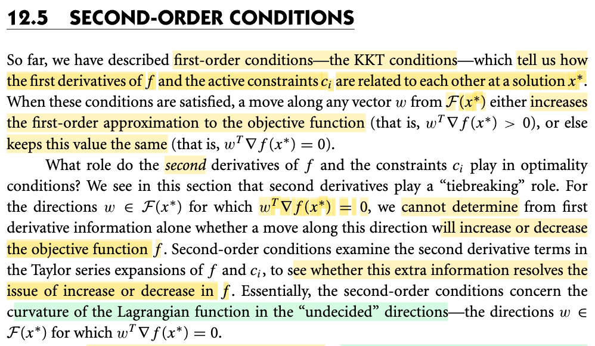</kbd>

> [!NOTE]
> Đầu tiên, tác giả nói khi một điểm x\* thỏa KKT, thì **đi từ x\* theo w nào với w lấy từ ℱ(x\*) cũng đều giúp tăng** hoặc (ít nhất là giữa nguyên) hàm first order approximation của objective. Thử gỉai thích vì sao lại nói như vậy:
>
>
>
> Để trả lời đầu tiên là cần ôn lại lập luận trực giác giúp ta xây dựng điều kiện KKT: Nói ngắn gọn, lập trực giác đó chính là: Để tìm ra ứng cử viên cho cho minimizer của bài toán ràng buộc, ta sẽ loại bỏ những điểm mà chắc chắn không thể là minimizer. Đó là những điểm mà khi đứng ở đó, ta vẫn có thể đi tiếp theo hướng d nào đó (với step size nhỏ) làm giảm thêm xấp xỉ bậc 1 của objective. (mà khi step size đủ nhỏ, việc giảm xạp xỉ bậc 1 của f đồng nghĩa sẽ giảm hàm f)
>
>
>
> Và chính lập luận này đã giúp xây dựng KKT:
>
>
>
> Ôn nhanh: Xét bài toán minimize f(x), có ràng buộc c1(x) ≥ 0.
>
>
>
> Xấp xỉ bậc 1 của f(x) tại điểm đang đứng: f(x + s) ≈ f(x) + ∇f(x)Ts (đặt là hàm f^(s))
>
>
>
> Nếu tại x tồn tại s khiến ∇f(x)Ts &lt; 0, dễ thấy chính là sẽ giúp giảm thêm xấp xỉ bậc 1 của f khi đi từ x theo hướng s. Về mặt hình học, s hợp với ∇f(x) góc tù.
>
>
>
> Ta sẽ thay ràng buộc gốc bằng bản tuyến tính hóa, vì giúp đơn giản hơn cũng như là dựa trên sự thật rằng, nếu tồn tại s khiến x+s thỏa ràng buộc tuyến tính hóa, thì có nghĩa là, chỉ cần khống chế độ dài của s để hủy vai trò của term bậc cao thì x+s cũng sẽ thỏa ràng buộc gốc.
>
>
>
> Xấp xỉ bậc 1 của c1(x): c1(x + s) ≈ c1(x) + ∇c1(x)Ts (đặt là c1^(s))
>
>
>
> Ràng buộc là c1(x) ≥ 0. Nếu ta thay nó bằng c1^(s), ràng buộc trở thành c1^(s) ≥ ⇔ c1(x) + ∇c1(x)Ts ≥ 0. Từ đó, nếu xét s là linearized feasible direction ℱ(x\*) theo định nghĩa là: Hướng mà nếu c1(x\*) = 0 thì s thỏa ∇c1(x\*) ≥ 0) thì khi đó, dù cho c1(x\*) = 0 hay c1(x\*) &gt; 0, thì c1^(s) = c1(x\*) + ∇c1(x\*)Ts sẽ đều ≥ 0 (dù chưa chắc c1(x+s) đã thỏa ≥) tức là luôn thỏa phiên bản đã linearized của ràng buộc c1(x).
>
>
>
> Như vậy nhiệm vụ để tìm các ứng cử viên là loại bỏ các điểm mà: Tại đó vẫn tồn tại s khiến x+s vẫn thỏa linearized constraint (vì như vậy bằng cách khống chế step size, x+s sẽ vẫn thỏa constraint) và giúp giảm linearized objective (và như vậy với việc khống chế step size, chắc chắn cũng giảm objective)
>
>
>
> Thế thì ta muốn xem thử khi nào thì không thể tồn tại s khiến x+s vẫn linearized feasible đồng thời khiến giảm xấp xỉ bậc của f.
>
>
>
> Xét case 1: Tại điểm đang đứng x, ràng buộc inactive: c1(x) &gt; 0. Khi đó để s + x vẫn (linearized) feasible, ta cần c^1(x + s) &gt; 0 ⇔ c^1(s) = c1(x) + ∇c1(x)Ts, với việc c1(x) đã &gt; 0 thì ∇c1(x)Ts có thể dương âm tùy ý, miễn là nếu âm thì đừng quá lớn để cục c1(x) dương còn đủ gánh cho nó. Như vậy s có thể có hướng bất kì. Và để tìm một điểm x không thể có s tạo với ∇f(x) góc tù thì chỉ có thể là tại x, ∇f(x) = 0.
>
>
>
> Xét case 2: Tại điểm đang đứng x, ràng buộc active: c1(x) = 0. Khi đó c1^(s) = c1(x) + ∇c1(x)Ts = ∇c1(x)Ts, và để thỏa linearized constraint (c1^(s) ≥ 0) thì ∇c1(x)Ts phải ≥ 0, điều này theo hn2h học, là s tạo góc nhọn hoặc vuông với ∇c1. Như vậy, để tìm một điểm x mà ko thể có s tạo góc nhọn hoặc vuông với ∇c1(x) đồng thời tạo góc tù với ∇f(x). Và dễ thấy điểm thỏa điều này chính là x mà tại đó ∇f(x) trùng hướng với ∇c1(x), và diễn đạt theo toán học, là x mà tại đó tồn tại λ khiến ∇f(x) = λ ∇c1(x).
>
>
>
> Tổng hợp hai case lại, thì ta có điều kiện để x trở thành ứng cử viên (ko bị loại bỏ, chứ chưa chắc là winner) là khi ràng buộc tại x active thì tại x tồn tại λ khiến ∇f(x) = λ ∇c1(x), còn khi ràng buộc tại x không active, thì ∇f(x) phải bằng 0. Và bằng cách thành lập hàm Lagrangian = f(x) - λ1c1(x), người ta thể hiện hai case này bởi hai điều kiện gọi là stationary và complement slackness:
>
>
>
> ∇\_x L(x\*, λ\*) = 0
>
>
>
> λ1\* c1(x\*) = 0
>
>
>
> Khi ràng buộc inactive, tức c1(x\*) &gt; 0 thì (2) khiến λ\* = 0, và (1) trở thành ∇f(x\*) = 0.
>
>
>
> Khi ràng buộc active, tức c1(x\*) = 0, thì (1) trở thành tồn tại λ1\* không âm khiến ∇f(x) = λ ∇c1(x\*).
>
>
>
> ---
>
>
>
> Và nhờ vậy ta sẽ hiểu vì sao cái đoạn đầu ở đây tác giả Nocedal lại nói rằng: Nếu tại x\* điều kiện KKT thỏa, thì khi đi theo hướng w từ ℱ(x\*) sẽ không làm giảm hàm xấp xỉ bậc một của hàm f(x): Thì bởi, theo điều kiện KKT mà ta vừa xây dựng lại ở trên, việc x\* thỏa KKT thì có nghĩa là tại x\* không thể tồn tại hướng mà vẫn thỏa linearized constraint và giảm linearized f. Và như vậy thì cũng đồng nghĩa là, nếu xét các hướng w thỏa linearized constraint (∈ ℱ(x\*)) thì x\* + w chỉ có thể làm tăng hoặc giữ nguyên linearized f chứ gì nữa.
>
>
>
> Nói chung là khúc này hơi khó hiểu, việc derive lại KKT cũng như phân tích giúp hiểu rõ cái ℱ là gì mới giúp hiểu đoạn này.
>
>
>
> ---
>
>
>
> Và như vậy, nếu x\* thỏa KKT, và di chuyển theo hướng w ∈ ℱ(x\*) khiến xấp xỉ bậc 1 của f tăng hoặc giữ nguyên thì x\* là ứng cử viên cho minimizer.
>
>
>
> Mình có thể thắc mắc: Tôi hiểu nếu x không thỏa KKT, tức là có thể đi tiếp để giảm xấp xỉ bậc 1, và như vậy chắc chắn là sẽ giảm f khi khống chế step size (để phòng trường hợp giống như trước mặt là dốc xuống nhưng xa hơn thì con đường dốc ngược lên lại) và cũng thỏa linearized constraint (again, điều này đồng nghĩa nếu khống chế step size thì nó sẽ thỏa constraint thật) thì như vậy rõ ràng x không thể là mininizer được.
>
>
>
> Nhưng liệu ta có bỏ xót điều gì, ví dụ như x nào đó không thỏa KKT, những vẫn có thể là minimizer không. Câu trả lời là có, nhưng rất hiếm, và chính cái điều kiện gọi là LICQ đã đảm bảo ràng với KKT, ta không bỏ xót ứng cử viên nào. Rõ ràng là với LICQ, thông qua cái lập luận trên, nếu x ko thỏa KKT thì chắc chắn nó không phải là minimizer, vì chỉ cần đi theo cái hướng s trong ℱ(x\*) một step size rất nhỏ, là sẽ giảm thêm f và vẫn feasible.
>
>
>
> Vậy, quay lại đây, ta đặt vấn đề: Thế thì trong các ứng cử viên đó, cần loại bỏ thêm, để có danh sách rút gọn (ví dụ vậy), thì loại bỏ theo tiêu chí gì.
>
>
>
> Câu trả lời là ta sẽ chia mấy thằng ứng cử viên x\* ra hai phe: Một là phe mà khi đi theo mọi hướng linearized feasible w bất kì nào đó, hàm linearized f luôn tăng. Và hai là phe mà tồn tại hướng linearized feasible w khiến hàm linearized f không tăng.
>
>
>
> Và ta sẽ tập trung vào phe thứ hai, vì trong đám này, rất có thể xảy ra tình trạng: Đi theo w không làm tăng linearized f, nhưng **sự thật lại đang giảm f**. Điều này khác với phe 1, vì phe 1 là theo mọi hướng linearized feasible direction w thì linearized f luôn tăng, mà như vậy thì chỉ cần khống chế step size thì nhất định f thật cũng tăng.
>
>
>
> Và do đó, người ta mới quan tâm về tập các linearized feasible direction (∈ ℱ(x\*)) khiến linearized f không tăng, mà điều này (linearized f không tăng) thể hiện bởi: ∇f(x\*)Tw = 0.
>
>
>
> Câu trong sách: "For the directions w ∈ F(x∗) for which wT∇f(x ∗) = 0, we cannot determine from first derivative information alone whether a move along this direction will increase or decrease the objective function f . Second-order conditions examine the second derivative terms in"
>
>
>
> chính là nói "với w linearized feasible direction, có tính chất khi linearized f không tăng thì TA KHÔNG BIẾT NÓ CÓ THẬT SỰ LÀM GIÚP f KHÔNG TĂNG HAY LÀ ĐANG LÀM GIẢM HÀM f.
>
>
>
> Và để check var cái đám candidate của phe 2, ta sẽ dùng đạo hàm cấp hai của Lagrangian. Vì nó sẽ cho ta biết, đi theo linearized feasible w khiến **linearized f** không tăng, nhưng **true f** thì giảm hay tăng. Và những hướng này (linearized feasible w khiến **linearized f** không tăng) người ta gọi là **undecided direction.**

> [!TIP]
> **🤖 AI Feedback** — ✅ Score: **98/100**
>
> Ghi chú cực kỳ chi tiết, chính xác và thể hiện sự hiểu biết sâu sắc về mặt bản chất hình học lẫn đại số của điều kiện KKT và lý do cần đến điều kiện bậc hai. Bạn chỉ cần rà soát lại vài lỗi chính tả nhỏ (như 'hn2h học', 'gỉai thích') để bài viết hoàn hảo hơn.

 

#### Definition of the Critical Cone

<kbd>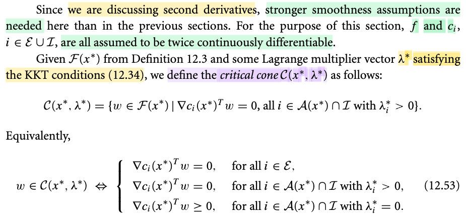</kbd>

> [!NOTE]
> Tiếp theo, gs định nghĩa ra cái gọi là Critical Cone C(x\*, λ\*):
>
>
>
> Cùng phân tích để hiểu cái tập này vì khi không hiểu rõ các định nghĩa thì sẽ dễ dẫn tới confuse sau này.
>
>
>
> Thật ra chỉ cần hiểu 𝒞(x\*, λ\*) là tập con của ℱ(\*). Mà ℱ(x\*) đã phân tích chán chê để hiểu ngắn gọn, nó chứa các linearized feasible direction, tức các hướng mà x\* + w sẽ thỏa các linearized constraint. Để hiểu 𝒞, ta thử lướt lại quy trình xây dựng ℱ.
>
>
>
> Ví dụ có 3 ràng buộc c1(x) = 0, c2(x) ≥ 0, c3(x) ≥ 0
>
>
>
> Ta đi xây dựng ℱ(x\*), theo định nghĩa, nó chứa d đến từ 2 nhóm:
>
>
>
> Nhóm 1: d khiến ∇ci(x\*)Td = 0 với i ∈ ℰ
>
>
>
> Dịch nghĩa: Tại x\*, xét các ràng buộc đẳng thức mà nó đang thỏa, ở đây vì x\* feasible nên dĩ nhiên c1(x\*) = 0. Ta đặt câu hỏi: Đi hướng d nào khiến c1^(d) = c1(x\*) + ∇c1(x\*)Td vẫn bằng 0, lấy mấy cái d đó bỏ vào ℱ(x\*)
>
>
>
> Hình ảnh: Với dạng ràng buộc này, cơ bản là ta có 1 cái tường và phải đi trên các thành tường, không được quẹo đi đâu (vì c1(x) = 0, giống như tập x ∈ R^2 thỏa x1 + x2 = 0 trở thành 1 đường thẳng, x phải đi trên đó)
>
>
>
> Nhóm 2: d thỏa ∇ci(x\*)Td ≥ 0 với i ∈ 𝒜(x\*) ∩ ℐ
>
>
>
> Dịch nghĩa: Tại x\*, trong c2 c3, cái nào đang active? Ví dụ c2 active c3 không active.
>
>
>
> Hình ảnh: Với dạng ràng buộc này, thì chúng quy định chỉ được đi lòng vòng trong phạm vi 1 một bên của một bức tường 
>
>
>
> Vậy thì ta sẽ xét c2 thôi, và đặt câu hỏi: với c2(x\*) = 0, thì đi hướng nào khiến c2^(d) = c2(x\*) + ∇c2(x\*)Td vẫn lớn hơn hoặc 0.
>
>
>
> Và giả sử câu trả lời là d1, d2, d3 (trong đó giả sử d1,d2 kiến ∇c2(x\*)Td &gt; 0, và d3 khiến ∇c2(x\*)Td3 = 0) ta bỏ đám d1,d2,d3 này vào ℱ(x\*)
>
>
>
> HÌnh ảnh: Ta chỉ xét các ràng buộc nào mà tại điểm x\*, ta đang ở trạng thái đụng vách. Và xét các hướng men theo tường hoặc đi vào trong (còn mấy cái ràng buộc mà chưa đụng vách, thì dĩ nhiên có thể đi tùy ý nên không xét làm gì)
>
>
>
> ---
>
>
>
> Vậy thì, trong các d thuộc ℱ(x\*), ta chọn ra những thằng nào để có 𝒞(x\*, λ\*)?
>
>
>
> Nhóm 1 lấy hết.
>
>
>
> Nhóm 2: → Chính là nhìn vào case thứ 2: Nơi ta lấy cả d1,d2,d3. Thì với 𝒞 TA CHỈ LẤY CÁI d3.
>
>
>
> Tuy nhiên, 𝒞 làm thêm một bước nữa: Là nó xét λ. Nếu tại x\*, ràng buộc active = c2(x\*) = 0 = tức "đã chạm tường c2". Thì xem λ có dương không. Nếu dương, ta loại d1,d2. Chỉ lấy d3. Còn nếu λ = 0 thì lấy hết d1,d2,d3.
>
>
>
> Ý nghĩa của sự khác nhau:
>
>
>
> ℱ. Ràng buộc tại c2 active: c2(x\*) = 0: chọn hướng w tạo với ∇c2(x\*) góc nhọn hoặc vuông. Hình ảnh, với bức tường c2, tại x\* đã đụng vách, thì ta chỉ xét các hướng đi ngang men theo vách (tạo góc vuông với ∇c2) hoặc đi vô lại (tạo góc nhọn với ∇c2)
>
>
>
> 𝒞: Ràng buộc tại c2 active. HÌnh ảnh: với bức tường c2, tại x\* đã đụng vách. Thì xem λ, đại diện cho lực ép, nếu lực cản đang dương, thì ta chỉ xét hướng đi ngang men theo vách (tạo góc vuông với ∇c2). Còn lực cản đang = 0 thì cứ cho đi vô lại bên trong hay đi men theo vách đều được.
>
>
>
> Trong lập luận trên ta cần nhớ rằng, ví dụ nói constraint c2(x) ≥ 0, thì ∇c2 sẽ vuông góc với boudary c2(x) = 0 và HƯỚNG VÔ TRONG, vì sao? Vì đi theo ∇c2 sẽ tăng c2. Tại vách, c2(x) = 0. nếu đi ngược vô trong theo ∇c2 thì c2(x) mới tăng lên để c2(x) trở thành &gt; 0.
>
>
>
> Như vậy trong 𝒞(x\*, λ\*) sẽ khác ℱ ở chỗ:
>
>
>
> ℱ tìm trong c2,c3, cái nào active. Thì lấy hết d1,d2,d3 khiến ∇c2Td ≥ 0 sẽ có:
>
>
>
> 𝒞 thì tìm trong c2,c3, cái nào active (là c2), → check λ2. Nếu = 0 thì lấy hết d1,d2,d3 khiến ∇c2Td ≥ 0. Nhưng nếu dương thì chỉ lấy d3, là cái khiến ∇c2Td = 0
>
>
>
> Hình ảnh:
>
>
>
> ℱ: Hỏi (trong các constraint) cái nào đụng tường (bao gồm equality constraint, và active inequality constrain). Sau đó, lấy các hướng đi men tường với equality constraint, và đi ngang hoặc quay vô với active inequality constraint.
>
>
>
> 𝒞: Hỏi: (trong các constraint), cái nào đụng tường (bao gồm equality constraint, và active inequality constrain). Sau đó, lấy các hướng đi men tường với equality constraint. Còn với inequality constraint thì xem thử có đang bị dí ép mạnh vào tường ko. Nếu có thì chỉ được đi men tường. Còn không thì có thể đi ngang hoặc quay vô.
>
>
>
> Do đó trong 12.53:
>
>
>
> Dòng 1: Chính là xem các trường hợp đụng tường thuộc diện equality constraint, lấy hết hướng đi men tường (∇ci(x\*)Tw = 0)
>
>
>
> Dòng 2: Chính là xem các trường hợp đụng tường thuộc diện inequality constrain, và đang bị dí mạnh vào tường (λi\* &gt; 0). Với case này, ta chỉ được đi men theo tường (∇ci(x\*)Tw = 0)
>
>
>
> Dòng 3: Chính là xem các ca đụng tường thuộc diện inequality constraint nhưng không có lực ép, nên có thể đi men theo tường hoặc quay vô trong đều được.

> [!TIP]
> **🤖 AI Feedback** — ✅ Score: **98/100**
>
> Ghi chú giải thích rất chính xác và trực quan về Critical Cone thông qua ví dụ cụ thể, đặc biệt là phần minh họa hình học và ý nghĩa vật lý của nhân tử Lagrange $\lambda^*$. Bài viết xuất sắc, không có điểm yếu nào đáng kể về mặt lý thuyết toán học tối ưu.

**🔗 See also:** [Tập linearized feasible direction](#node-169mbi2)

 

##### Điều kiện bậc hai (bản sao) (bản sao)

<kbd>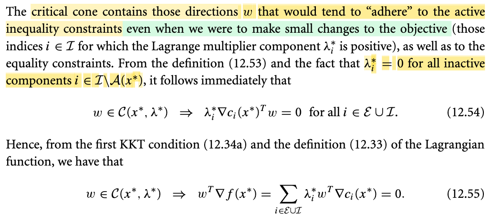</kbd>

> [!NOTE]
> Đoạn này đại ý là như sau:
>
>
>
> Tác giả nói với định nghĩa của 𝒞(x\*, λ\*) thì nếu w ∈ 𝒞(x\*, λ\*) thì λ\*i ∇ci(x\*)Tw = 0 ∀ i ∈ ℰ ∪ ℐ. Vì sao?
>
>
>
> (vì định nghĩa của 𝒞(x\*, λ\*) chứa: Hướng w khiến: 
>
>
>
> với equality constraint, thì ∇ci(x\*)Tw = 0
>
>
>
> với inequality constraint "đang bị ép dính tường λ\*i &gt; 0" thì ∇ci(x\*)Tw = 0
>
>
>
> với inequality constraint "chưa dính tường λ\*i = 0" thì ∇ci(x\*)Tw ≥ 0
>
>
>
> Vậy với mỗi constraint nói trên, ta đều có λ\*i × ∇ci(x\*)Tw có tính chất là ít nhất một thừa số = 0, nên λ\*i × ∇ci(x\*)Tw = 0 ∀ i ∈ ℰ ∪ ℐ.  (1)
>
>
>
> ---
>
>
>
> Và đoạn tiếp theo cũng dễ hiểu, đó là ta xét lại cái điều kiện stationary condition của KKT
>
>
>
> ∇\_x L(x\*, λ\*) = 0
>
>
>
> ⇔ ∇f(x\*) - Σi λ\*i ∇ci(x) = 0
>
>
>
> ⇔ ∇f(x\*) = Σi λ\*i ∇ci(x) 
>
>
>
> Nhân hai vế cho w ∈ 𝒞(x\*, λ\*)
>
>
>
> ⇔ wT∇f(x\*) = wT Σi λ\*i ∇ci(x\*) 
>
>
>
> ⇔ wT∇f(x\*) = Σi λ\*i wT∇ci(x\*) 
>
>
>
> Và với kết quả (1) thì điều kiện stationary trở thành wT∇f(x\*) = 0

> [!TIP]
> **🤖 AI Feedback** — ✅ Score: **98/100**
>
> Ghi chú của bạn cực kỳ xuất sắc, giải thích trực quan và chính xác bản chất của định nghĩa hình nón tới hạn (critical cone). Các bước biến đổi từ điều kiện tối ưu KKT (stationary) sang hệ thức cuối cùng được trình bày rất rõ ràng, chi tiết và dễ hiểu.

 

###### The Critical Cone in Constrained Optimization

<kbd>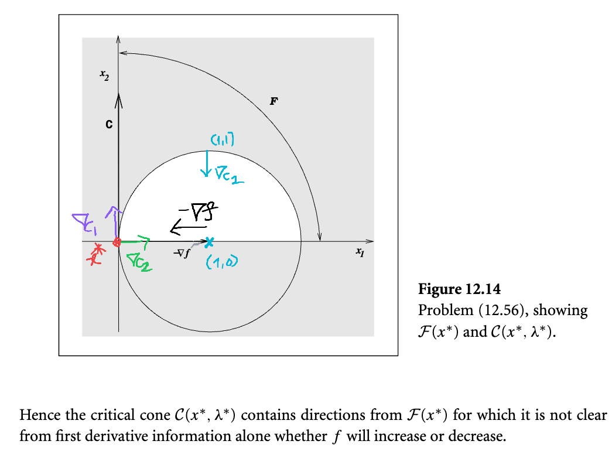</kbd>

<kbd>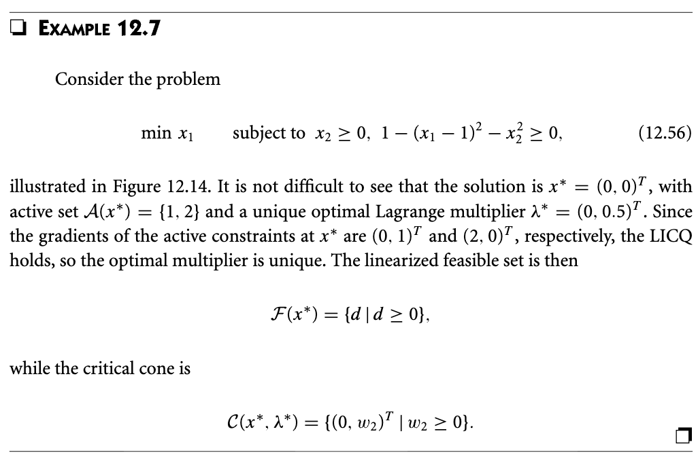</kbd>

> [!NOTE]
> Cùng phân tích cái hình này để hiểu thêm lần nữa ℱ(x\*) - linearized feasible direction set khác 𝒞(x\*, λ\*) - critical cone thế nào:
>
>
>
> Đầu tiên, objective là f(x) = x1, ∇f(x) = (1,0)T.
>
>
>
> hình vẽ cho thấy -∇f hướng từ trái sang phải, mình cho là đang vẽ sai, đây là hướng của ∇f, nên -∇f phải ngược lại, đi từ phải sang trái.
>
>
>
> Ràng buộc inequality x2 ≥ 0, hình ảnh chính là x chỉ được nằm trong cái nửa mặt phẳng phía trên
>
>
>
> Ràng buộc c2(x) ≥ 0 ⇔ 1 - (x1 - 1)^2 - x2^2 ≥ 0, hình ảnh chính là x chỉ được nằm trong phạm vi hình tròn. Tính thử ∇c2: \[-2(x1-1), -2x2\]T ⇒ ∇c2(\[1,1\]) = (0,-2) chỉ vào trong (vector xanh dương)
>
>
>
> x\* là điểm nào: Theo lập luận trực giác của KKT, nó là điểm mà ko thể đi theo hướng nào tạo góc tù với ∇f(x\*) và tạo góc vuông hoặc nhọn với ∇ci(x\*)
>
>
>
> Hay tưởng tượng có lực đẩy của gió thổi từ phải sang trái, và ta bị ràng buộc đi trong phạm vi nửa bán cầu phía trên, thì ta sẽ bị đẩy đi đâu? Dễ thấy chính là điểm (0,0)
>
>
>
> Vậy ℱ(x\*) là gì:
>
>
>
> Theo định nghĩa, ta sẽ hỏi:
>
>
>
> Tại x\*, ràng buộc inequality nào đụng vách: Cả c1, và c2 đều đụng vách (nên 𝒜(x\*) = {1,2}, cả hai inequality constraint đều active tại x\*)
>
>
>
> Vậy thì đi hướng d nào sẽ có ∇c1(x\*)Td và ∇c2(x\*)Td ≥ 0:
>
>
>
> ∇c1(x\*) = (0,1)T (trên hình là vector tím)
>
>
>
> ∇c2(x\*) = \[-2(0-1), 0\]T = (2,0)T, mình vẽ vector xanh lục hướng vào tâm đường tròn)
>
>
>
> Vậy, d hợp với hai vector này góc nhọn hoặc vuông chính là mọi hướng trong góc phần tư ở trên bên phải
>
>
>
> Còn 𝒞(x\*, λ\*)?
>
>
>
> Ta phải xem tại x\*, dù đều bị dính vách, nhưng cái nào đang bị ép với lực dương?
>
>
>
> Dựa vào ∇\_x L(x\*, λ\*) = 0, ta giải tìm λ\*1, λ\*2:
>
>
>
> ∇f(x\*) - λ\*1 ∇c1(x\*) - λ\*2 ∇c2(x\*) = 0
>
>
>
> (1,0)T - λ\*1 (0,1)T - λ\*2 (2,0)T = 0
>
>
>
> ⇔ 1 - 2λ\*2 = 0 & 0 - λ\*1 = 0
>
>
>
> ⇒ λ\*2 = 1/2, λ\*1 = 0, tức λ\* = (0, 1/2)
>
>
>
> Như vậy, trong hai constraint dính tường, thì cái c2 là bị ép với lực dương. Do đó chỉ được đi men theo vách. Còn c1 thì dù dính tường nhưng chưa bị ép, thành ra đi vào trong cũng được.
>
>
>
> Do đó tại x\* = (0,0), theo constraint c2 ta chỉ có thể đi men vách tường tại x\* (theo hướng lên hoặc xuống). Nhưng theo constraint c1, thì trong hai hướng này ta chỉ có thể đi lên trên. Thành ra critical cone chính là cái vector c trong hình

> [!TIP]
> **🤖 AI Feedback** — ⚠️ Score: **85/100**
>
> Ghi chú có trực giác vật lý rất tốt và tính toán toán học hoàn toàn chính xác về các tập hợp và nhân tử Lagrange. Tuy nhiên, bạn đã nhìn nhầm hướng mũi tên $-\nabla f$ trong sách (thực tế nó hướng sang trái là đúng) và vẽ nhầm vector $\nabla c_1(x^*)$ thành hướng nằm ngang thay vì thẳng đứng lên trên.

 

###### Second-Order Necessary Conditions

<kbd>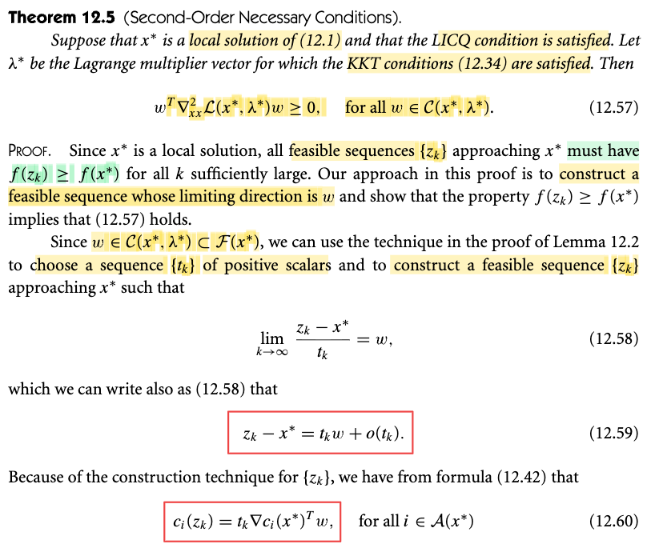</kbd>

<kbd>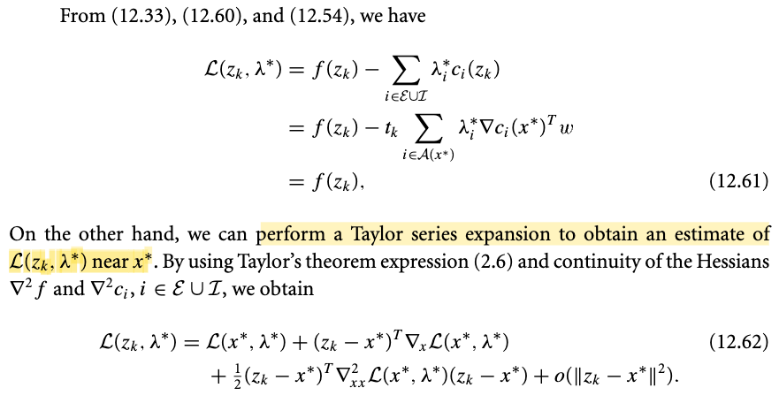</kbd>

<kbd>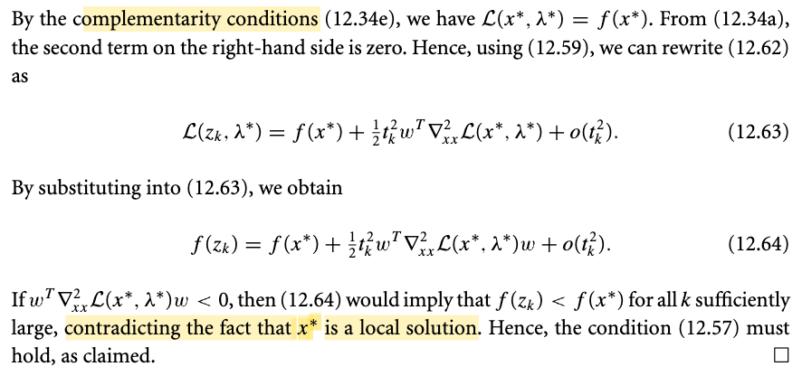</kbd>

<kbd>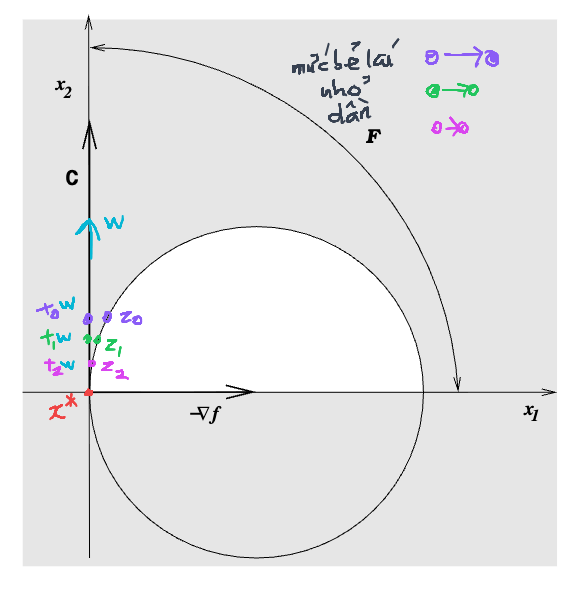</kbd>

> [!NOTE]
> Cùng tìm hiểu về định lý điều kiện cần bậc hai của bài toán tối ưu có ràng buộc.
>
>
>
> Đầu tiên, định lý này về đại ý nói rằng: Giả sử ta có x\* là điểm đã thỏa KKT (điều kiện cần bậc nhất), và điều kiện LICQ (tức constraint qualification) thỏa thì nếu xét hướng w thuộc critical cone, thì quadratic form của Hessian của Lagrangian tại x\*, tức wT \[∇^2_xx ℒ(x\*, λ\*)\] w phải không âm.
>
>
>
> Vậy đầu tiên, mình có thể hiểu về mặt trực giác định lý này nói rằng: Xét các hướng của critical cone, là những hướng feasible mà xấp xỉ tuyến tính hàm f không tăng thì theo hướng đó, hàm Lagrangian tại x\* phải là **cong lên** (hay đúng hơn là **không được cong xuống**) nếu như x\* là minimizer.
>
>
>
> Để hiểu ý nghĩa của theorem này có lẽ nên ôn nhanh định nghĩa của critical cone 𝒞(x\*, λ\*) mà trong note trước mình đã có kết quả là w thuộc tập này sẽ thỏa wT∇f(x\*) = 0.
>
>
>
> Nói ngắn gọn thì critical cone 𝒞(x\*, λ\*) sẽ chứa các vector w thỏa hết các tiêu chí sau:
>
>
>
> Với các ràng buộc đẳng thức ci(x) = 0 i ∈ ℰ thì wT∇ci(x\*) = 0
>
>
>
> Với ràng buộc đẳng thức đang active tại x\*, tức ci(x\*) = 0, i ∈ ℐ thì xem có đang bị ép dính tường với lực dương hay khong (λ\*i &gt; 0), nếu có thì w sẽ thỏa wT∇ci(x\*) = 0. Còn nếu λ\*i = 0 thì thôi, w chỉ cần wT∇ci(x\*) ≥ 0.
>
>
>
> Để rồi với định nghĩa như vậy, xét một w ∈ 𝒞(x\*, λ\*), thì:
>
>
>
> với mọi ràng buộc đẳng thức i ∈ ℰ, wT∇ci(x\*) = 0, nên đương nhiên λi\* × wT∇ci(x\*) = 0
>
>
>
> và với mọi ràng buộc bất đẳng thức i ∈ ℐ thì λi\* × wT∇ci(x\*) = 0 do nếu active thì thừa số thứ hai bằng 0, mà không active thì λ\*i = 0
>
>
>
> Nên cộng vế theo vế ta sẽ có:, Σi∈ℰ∪ℐ \[λi\* × wT∇ci(x\*)\] = 0 ⇔ wT Σi (λi\* × ∇ci(x\*)) = 0
>
>
>
> Và điều kiện stationary mà x\* đang thỏa trở thành wT\[∇f(x\*) - Σi (λi\* × ∇ci(x\*))\] = 0 ⇔ wT∇f(x\*) - wT \[Σi (λi\* × ∇ci(x\*))\] = 0 ⇔ wT∇f(x\*) = 0
>
>
>
> và **Ý NGHĨA QUAN TRỌNG CỦA ĐIỀU NÀY** **LÀ NẾU TA ĐI THEO HƯỚNG** w, **TỪ** x\* **ĐỂ ĐẾN** x\*+w, **TA SẼ THẤY XẤP XỈ BẬC NHẤT CỦA F KHÔNG TĂNG**
>
>
>
> f(x\* + w) ≈ f(x\*) + ∇f(x\*)Tw = f(x\*) + 0 = f(x\*)
>
>
>
> **KHIẾN TA KHÔNG BIẾT RẰNG VỚI CÁC LIEARIZED FEASIBLE DIRECTION NÀY** (vì w thuộc 𝒞(x\*, λ\*) là tập con của linearized feasible direction ℱ(x\*)), **THÌ LIỆU RẰNG CÓ THỂ GIẢM HAY TĂNG HÀM F**.
>
>
>
> Chú ý là kết quả này cũng làm rõ khác nhau giữa linearized feasible direciton set ℱ(x\*) và critical cone 𝒞(x\*, λ\*):
>
>
>
> Bốc w từ ℱ(x\*), đi từ x\* theo hướng w thì sẽ dẫn đến hai trường hợp: một là xấp xỉ tuyến tính của f sẽ tăng và hai là xấp xỉ tuyến tính của f giữ nguyên.
>
>
>
> Trong khi đó, critical cone chỉ lấy w khiến xấp tuyến tính của f giữ nguyên, và vì xấp tuyến tính của f giữ nguyên thì ta không biết liệu là trong thực tế hàm f thật liệu có đang giảm hay đang tăng. Do đó mới lôi các hướng w này ra để mà xét riêng. Và critical cone 𝒞(x\*) là tập con của linearized feasible direction ℱ(x\*)
>
>
>
> Và đối với các hướng này, **cần đến đạo hàm bậc hai** để xét tới độ cong của Hessian hàm f (và ta sẽ thấy nó cũng là Hessian hàm Lagrangian) để xác định xem là hàm f sẽ tăng hay giảm, từ đó kết luận x\* có phải là minimizer không.
>
>
>
> ---
>
>
>
> Cùng tìm hiểu phần chứng minh:
>
>
>
> Ý tưởng của cách chứng minh là: Ta giả sử x\* là minimizer của bài toán. Sau đó xét việc ta đi từ x\* theo hướng w ∈ 𝒞(x\*, λ\*) sao cho đến được z vẫn feasible. Thì vì tính chất của critical cone nên sẽ khiến ta có kết quả là ℒ(zk, λ\*) = f(zk) - Σi λ\*i ci(zk) = f(zk)
>
>
>
> Và dùng xấp xỉ bậc hai của Lagrangian ta sẽ có kết quả là vì x\* là mininizer nên bắt buộc quadratic form của Hessian Lagrangian phải không âm.
>
>
>
> Đoạn khó nhất là hiểu được khúc gs nói về việc dùng kĩ thuật mà ông đã từng làm trong phần chứng minh bổ đề 12.2, với đại ý là ta CHỌN một chuỗi các giá trị tk dương và từ đó tạo nên chuỗi các điểm zk tiến dần về x, thể hiện bởi lim k → ∞ (zk - x\*) / tk = w hay zk - x\* = tk w + o(tk)
>
>
>
> Hiểu đại khái là: ta biết rằng w, chỉ là chỉ một hướng đi. Nếu từ x\*, đi theo hướng w, ta sẽ đến 1 điểm mới, nằm trên hướng w, nhưng cụ thể là tới đâu thì còn tùy vào step size, là scalar t: x\* + t × w. Vậy thì, tuy w là linearized feasible direction (thuộc critical cone cũng là thuộc ℱ) nhưng không có nghĩa là cứ đi theo hướng này là sẽ mãi feasible. Do đó, hiểu đại ý là, khi đi theo hướng w, step size t để đến x\* + tw, ta sẽ cần phải điều chỉnh, bẻ lái (đi thêm) để giữ trạng thái feasible và thể hiện cái điều đó bằng việc cộng thêm o(t): x\* + t w + \[điều chỉnh\] = z.
>
>
>
> Và ta hình dung trong ví dụ bữa trước nơi mà w ∈ 𝒞 là tia vuông góc với đường tròn tại x\* = (0,0). Thì hình dung rằng bắt đầu với t0, x\* + t0 w sẽ đưa ta ra khỏi đường tròn một khoảng tương đối lớn, điều này vi phạm yêu cầu feasible, và như vừa nói, ta sẽ cần bẻ lái (một mức kha khá) để có z0 vẫn feasible. Như vậy z0 - x\* = t0 w + \[bẻ lái\]\_0. Tiếp xét t1 nhỏ hơn, thì dễ thấy mức bẻ lái sẽ ít hơn, để có z1 gần x\* hơn. Tiếp tục vậy, với tk đủ nhỏ, thì mức bẻ lái rất nhỏ, và zk tiếp cận x\*.
>
>
>
> Quá trình này chính là hình ảnh của zk - x\* = tk w + \[mức bẻ lái = o(tk)\]: khi k càng lớn, mức bẻ lái ngày càng nhỏ, và zk ngày càng gần x\*.
>
>
>
> Xét ci(zk), khai triển Taylor = ci(x\*) + ∇ci(x\*)T(zk - x\*) + term bậc cao
>
>
>
> = ci(x\*) + ∇ci(x\*)T(tj w + o(tk)) + term bậc cao
>
>
>
> = ci(x\*) + ∇ci(x\*)T(tj w) + ∇ci(x\*)T o(tk) + term bậc cao
>
>
>
> = ci(x\*) + tj ∇ci(x\*)Tw + ∇ci(x\*)T o(tk) + term bậc cao
>
>
>
> Và nếu như ta có xem phần chứng minh bổ đề 12.2, ta sẽ thấy cách chọn chuỗi tk có đặc điểm là khi k càng lớn, zk càng gần x\* và mức bẻ lái càng nhỏ thì ∇ci(x\*)T o(tk) + term bậc cao → 0
>
>
>
> Giúp ta có: ci(zk) = ci(x\*) + tj ∇ci(x\*)Tw
>
>
>
> ⇔ ci(zk) = 0 + tj ∇ci(x\*)Tw (do constraint ci đang active tại x\*)
>
>
>
> Vậy ci(zk) = tj ∇ci(x\*)Tw
>
>
>
>
>
> ---
>
>
>
> Ta mới làm tiếp bằng cách xấp xỉ bậc 2 hàm Lagrangian quanh x\* (trong sách dùng khai triển Taylor nhưng mình thấy dùng xấp xỉ sẽ gọn hơn vì dù gì thì khi zk → x\* thì term bậc cao cũng sẽ có thể bỏ đi)
>
>
>
> ℒ(zk, λ\*) ≈ ℒ(x\*, λ\*) + ∇\_x ℒ(x\*, λ\*)(zk - x\*) + (1/2) (zk - x\*)T \[Hessian của ℒ tại x\*\] (zk - x\*)
>
>
>
> vì x\* đang giả định là minimizer dĩ nhiên nó phải thỏa KKT, nên ∇\_x ℒ(x\*, λ\*) = 0:
>
>
>
> ℒ(zk, λ\*) ≈ ℒ(x\*, λ\*) + (1/2) (zk - x\*)T \[Hessian của ℒ tại x\*\] (zk - x\*)
>
>
>
> Xét ℒ(zk, λ\*), nó sẽ bằng f(zk) - Σi λ\*i ci(zk) = f(zk) - Σi λ\*i tj ∇ci(x\*)Tw
>
>
>
> Và với tính chất của critical cone direction mình đã ôn lại lúc đầu thì Σi λ\*i tj ∇ci(x\*)Tw = 0 dẫn đến ℒ(zk, λ\*) = f(zk)
>
>
>
> Còn ℒ(x\*, λ\*) thì = f(x\*) - Σi λ\*i ci(x\*) mà với việc x\* thỏa KKT thì complementary condition của KKT đã buộc Σi λ\*i ci(x\*) = 0 rồi. Nên ta có ℒ(x\*, λ\*) thì = f(x\*)
>
>
>
> Vây ℒ(zk, λ\*) ≈ ℒ(x\*, λ\*) + (1/2) (zk - x\*)T \[Hessian của ℒ tại x\*\] (zk - x\*)
>
>
>
> trở thành
>
>
>
> f(zk) ≈ f(x\*) + (1/2) (zk - x\*)T \[Hessian của ℒ tại x\*\] (zk - x\*)
>
>
>
> Và với zk tiến tới rất gần x\*, ta có thể thay xấp xỉ bằng dấu bằng luôn (vì trong khai triển taylor, các term bậc 3 trở lên sẽ → 0)
>
>
>
> f(zk) = f(x\*) + (1/2) (zk - x\*)T \[Hessian của ℒ tại x\*\] (zk - x\*)
>
>
>
> Như vậy, tới đây, với việc từ ban đầu ta đã giả định x\* là minimizer của bài toán, thì f(x\*) phải ≤ f(zk), suy ra
>
>
>
> (1/2) (zk - x\*)T \[Hessian của ℒ tại x\*\] (zk - x\*) ≥ 0
>
>
>
> ⇔ (1/2) (tk w)T \[Hessian của ℒ tại x\*\] (tk w) ≥ 0
>
>
>
> ⇔ (1/2) (tk)^2 wT \[Hessian của ℒ tại x\*\] w ≥ 0
>
>
>
> ⇔ wT \[Hessian của ℒ tại x\*\] w ≥ 0. Tới đây ta đã chứng minh xong.

> [!TIP]
> **🤖 AI Feedback** — ✅ Score: **92/100**
>
> Bài viết thể hiện trực giác hình học xuất sắc, đặc biệt là cách giải thích dễ hiểu về việc điều chỉnh hướng đi ('bẻ lái') của chuỗi $z_k$. Tuy nhiên, có một chi tiết chưa chính xác khi khẳng định $c_i(z_k) = 0$, vì thực tế $c_i(z_k) = t_k 
> abla c_i(x^*)^T w$ và nó chỉ triệt tiêu khi nhân với $\lambda_i^*$ trong biểu thức Lagrangian.

 

###### Second-Order Sufficient Conditions

<kbd>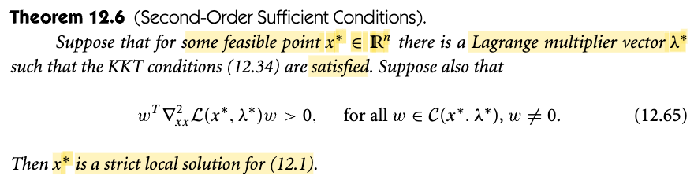</kbd>

> [!NOTE]
> Tìm hiểu định lý điều kiện đủ bậc hai của bài toán tối ưu có ràng buộc.
>
>
>
> Đầu tiên, định lý này đại ý nói rằng, nếu ta có điểm x\* thỏa KKT (đã thỏa điểu kiện cần, là ứng cử viên cho solution) thì nếu như xét hướng w của critical cone, mà có đặc điểm là quadratic form của Hessian Lagragian tại x\* đều dương, thì x\* đích thị là strict minimizer (tức là solution của bài toán tối ưu).
>
>
>
> ---
>
>
>
> Trước khi cùng tìm hiểu phần chứng minh, ôn lại tí xíu về crtitical cone, cũng như active recall để có trực giác về toàn bộ quá trình liên kết giữa KKT, điều kiện cần bậc nhất và bậc hai, từ để có thể hình dung ý nghĩa của đặc điểm trên:
>
>
>
> Trước tiên nên nói về linearized feasible direction ℱ(x\*), là tập hợp các hướng đi (vector d) sao cho khi đi từ x\* đến x\* + d một step size nhỏ thì xấp xỉ tuyến tính của hàm constraint bằng không đối với constraint đẳng thức và không giảm đối với constraint bất đẳng thức để từ đó (với step size nhỏ thì) x\* + d vẫn feasible.
>
>
>
> Và việc x\* thỏa KKT thì theo lập luận trực giác bữa trước, tại x\*, không thể đi theo hướng linearized feasible nào để giảm f được. Mà về mặt toán học điều này cũng dễ thấy:
>
>
>
> x\* thỏa KKT, nên thỏa stationary conditon: ∇f(x\*) - Σi λi ∇ci(x\*) = 0 ⇔ ∇f(x\*) = Σi λi ∇ci(x\*)
>
>
>
> linearized f tại x\*+d = f(x\*) + ∇f(x\*)Td = f(x\*) + \[Σi λi ∇ci(x\*)\]Td
>
>
>
> = f(x\*) + Σi λi \[∇ci(x\*)Td\]. 
>
>
>
> Và với việc d là linearized feasible như trên đã nói, đi từ x\* đến x\* + d không làm giảm hàm constraint, tức ∇ci(x\*)Td ≥ 0 ∀i ∈ ℰ ∪ ℐ, và cùng với constraint λi ≥ 0, ta có 
>
>
>
> Vậy linearized f tại x\*+d = f(x\*) + Σi λi \[∇ci(x\*)Td\] ≥ f(x\*).
>
>
>
> Như vậy nếu đi từ x\* một step size nhỏ theo hướng d ∈ ℱ(x\*), ta sẽ vẫn feasible, và chia ra hai trường hợp: i) là nếu linearized f tăng thì hàm f cũng sẽ tăng, điều này cho kết luận theo hướng này chắc chắn sẽ luôn đi lên cao hơn so với x\*. ii) nếu linearized f giữ nguyên, thì ta không kết luận được gì rằng f liệu có cũng giữ nguyên hay không. Vì vẫn có thể xảy ra rằng tuy linearized f giữ nguyên nhưng f thật ra đang giảm.
>
>
>
> Chính vì vậy, ta sẽ xét các hướng d ∈ ℱ mà theo hướng đó, linearized f không tăng: Tức f(x\*) + ∇f(x\*)Td = f(x\*) ⇔ ∇f(x\*)Td = 0. Đây chính là critical cone.
>
>
>
> Vậy thì điều kiện cần bậc hai hôm trước đã nhận định rằng, nếu như xét các hướng này mà độ cong âm, tức quadratic form của Hessian của Lagrangian tại x\* âm, thì ứng cử viên x\* (đã thỏa KKT) sẽ bị loại. Vì lúc này đạo hàm bậc hai cho thấy khi đi theo hướng critical cone w, hàm f xấp xỉ bậc hai giảm thêm f(x\*) + ∇f(x\*)Td + (1/2) dT ∇²ℒ(x\*, λ) d &lt; f(x\*).
>
>
>
> Tóm gọn lại là các điều kiện bậc nhất bậc hai này giống như quá trình ta sàng lọc ứng cử viên để tìm nghiệm của bài toán vậy:
>
>
>
> Vòng một là tìm điểm thỏa KKT: là xét điểm bất kì x, và đi theo hướng linearized feasible, nếu có thể để giảm linearized f đồng nghĩa có thể vẫn feasible và giảm f được → nó chắc chắn không phải solution, loại nó ra khỏi danh sách.
>
>
>
> Vòng hai, trong danh sách các ứng cử viên x\* đã thỏa KKT, thì đi hướng critical cone, lúc này thì xấp xỉ bậc nhất của f giữ nguyên nên không cho biết là f thật sẽ giảm hay tăng, nên ta phải dùng độ cong, thể hiện qua quadratic form (1/2) dT ∇²ℒ(x\*, λ) d. âm. Nếu nó âm, tức là hàm f giảm → tiếp tục loại nó ra khỏi danh sách
>
>
>
> Vòng ba, danh sách các điểm thỏa KKT, thỏa điều kiện cần bậc hai, thì nếu dT ∇²ℒ(x\*, λ) d dương, theorem này cho phép kết luận luôn solution.
>
>
>
> ---
>
>
>
> Note sau mình sẽ tìm hiểu phần chứng minh

> [!TIP]
> **🤖 AI Feedback** — ✅ Score: **98/100**
>
> Ghi chú rất xuất sắc, thể hiện sự hiểu biết sâu sắc và trực giác tốt về điều kiện tối ưu (KKT, nón tới hạn và điều kiện đủ bậc hai). Bạn nên lưu ý thêm ký hiệu chính xác của các ràng buộc đẳng thức và bất đẳng thức khi viết biểu thức Lagrangian để hoàn thiện hơn.

 

###### Second-Order Sufficient Condition Proof

<kbd>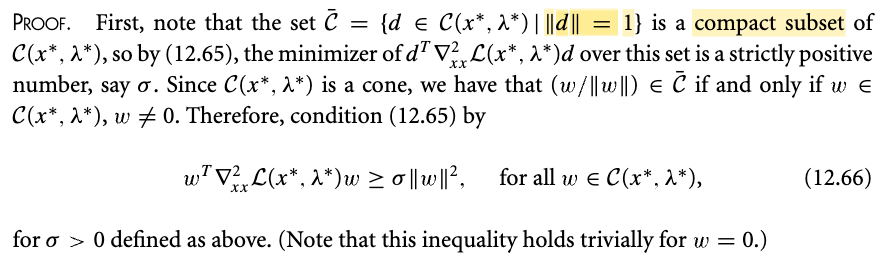</kbd>

> [!NOTE]
> Đoạn đầu tiên hiểu đại ý thế này: Vì định lý này nói rằng nếu x\* thỏa mãn với mọi critical cone direction d ≠ 0, thì dT ∇²\_xx ℒ(x\*, λ\*) d đều dương thì x\* chính là strict local solution. Nói cách khác, chỉ cần d khác 0, dù nhỏ (norm nhỏ) mấy thì quadratic form này cũng đều dương.
>
>
>
> Thế thì giả sử ta đi tìm cái quadratic form dương nhỏ nhất có thể, thì nó sẽ là bao nhiêu?
>
>
>
> Câu trả lời là không thể tìm được.
>
>
>
> Vì như đã nói trên, chỉ cần critical cone d có norm khác 0, là quadratic form sẽ dương. mà khác 0 thì có thể là bất cứ giá trị cực kì nhỏ, nhỏ ơi là nhỏ tiến dần về 0 (miễn chưa = 0). 
>
>
>
> Do đó, người ta mới không xét với toàn bộ critical cone nữa. mà giới hạn lại, tìm trong các vector có norm = 1 thôi.
>
>
>
> Và như vậy, vector trong 𝒞^ (trong sách là 𝒞 gạch trên đầu) đều có norm bằng 1, nên cơ bản là ta chỉ tìm trong các vector d có hướng khác nhau (norm bằng nhau) xem cái nào khiến quadratic form nhỏ nhất. Và nhất định là sẽ ra con số dương hữu hạn (hình dung giống như ta xoay 1 cái vector độ dài 1 cho đến khi quadratic form nhỏ nhất thì sẽ có lúc tìm được, chứ nếu vừa xoay vừa thu nhỏ lại thì trên lí thuyết là cứ thu nhỏ mãi mãi vẫn sẽ không dừng được (giống như trong nghịch lý Zenon: có vô số điểm giữa ta tới bức tường, nên trên lí thuyết có vô số vector khác 0 dù nhỏ cỡ nào)
>
>
>
> Và con số này chính là σ. Nên σ = giá trị quadratic form dT ∇²\_xx ℒ(x\*, λ\*) d với d ∈ 𝒞^.
>
>
>
> Vậy dĩ nhiên ta có: Với mọi d ∈ 𝒞^, dT ∇²\_xx ℒ(x\*, λ\*) d ≥ σ
>
>
>
> thì vì 𝒞^ chỉ là thay vì lấy hết từ 𝒞, ta chỉ lấy những cái có norm = 1 thôi. Nên đương nhiên nếu ta bốc w từ 𝒞, đem chia cho ||w||, để có w' = w / ||w||, thì w' cũng thuộc 𝒞 (vì nó trùng hướng với w), nhưng cũng là thành viên của 𝒞^ (vì norm của c' = || (w/||w||) || = ||w|| / ||w|| = 1)
>
>
>
> Vậy với mọi w ∈ 𝒞, w' = w/||w|| ∈ 𝒞^, nên w'T ∇²\_xx ℒ(x\*, λ\*) w' ≥ σ
>
>
>
> tương đương: (w/||w||)T ∇²\_xx ℒ(x\*, λ\*) (w/||w||) ≥ σ
>
>
>
> Tới đây, (w/||w||) là gì, nó là vector w chia number (scalar) ||w||, nên = vector w nhân (1/||w||)
>
>
>
> nên (w/||w||)T  = (w (1/||w||))T = (1/||w||)T wT = = (1/||w||) wT (scalar mà chuyển vị thì bằng chính nó)
>
>
>
> nên cái ở trên tương đương tiếp:  (1/||w||) wT ∇²\_xx ℒ(x\*, λ\*) (w) (1/||w||) ≥ σ 
>
>
>
> và cái scalar  (1/||w||) ở đuôi muốn chuyển đi đâu tùy ý
>
>
>
> ⇔ (1/||w||^2) (w)T ∇²\_xx ℒ(x\*, λ\*) (w) ≥ σ 
>
>
>
> ⇔ (w)T ∇²\_xx ℒ(x\*, λ\*) (w) ≥ σ ||w||^2 → Ta có 12.66

> [!TIP]
> **🤖 AI Feedback** — ✅ Score: **98/100**
>
> Bài viết giải thích cực kỳ trực quan, chính xác từ bản chất hình học (lý do chuẩn hóa norm bằng 1 để tránh giá trị tiến về 0) cho đến các bước biến đổi đại số chi tiết. Điểm cộng lớn là cách liên hệ thực tế và giải thích phân rã vector rất dễ hiểu cho người tự học.

 

###### Quadratic Growth Proof by Contradiction

<kbd>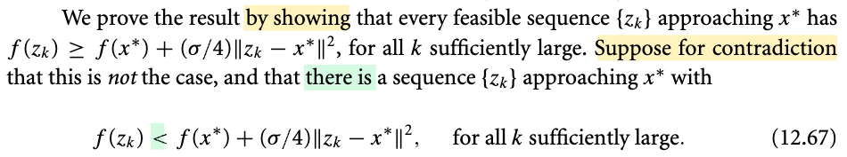</kbd>

<kbd>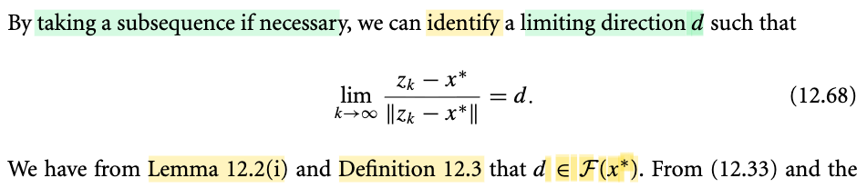</kbd>

<kbd>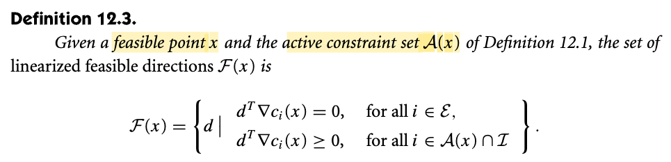</kbd>

> [!NOTE]
> Rồi, đại khái là gs cho rằng ta sẽ chứng minh điều sau đây: là với mọi feasible sequence {zk} approaching x\* thì luôn có đặc điểm: f(zk) ≥ f(x\*) + (σ/4)||zk - x\*||^2 (1)
>
>
>
> Là sao? Chuỗi điểm di chuyển sao cho luôn feasible và tiếp cận dần điểm x\* thì có thể hình dung đây là các con đường đi trong feasible set và hướng đến x\*. Và mình muốn kết luận rằng (1) vì như vậy cho thấy f(zk) luôn lớn hơn f(x\*), giúp kết luận x\* là strict local minimizer.
>
>
>
> Và để chứng minh cái này, sẽ dễ hơn nếu chứng minh phủ định của nó không thể xảy ra: Ta giả sử tồn tại một chuỗi {zk} thỏa f(zk) &lt; f(x\*) + (σ/4)||zk - x\*||^2 và chứng minh điều này dẫn đến mâu thuẫn.
>
>
>
> ---
>
>
>
> TIếp theo, đại khái là chưa có lập gì, chỉ là ông Nocedal làm động tác chuẩn bị: Đặt ra cái gọi là limiting direction d theo 12.68. Hiểu đại khái là: Như đã nói, ta có chuỗi điểm / quỹ đạo đi lòng vòng trong feasible set và hướng về x\*, thì dĩ nhiên zk sẽ tiến ngày càng sát x\*, thì ta sẽ hình dung như sau: Bắn tia laser từ x\* đến zk trên quỹ đạo này, thì khi zk chạy trên quỹ đạo, tia laser này kiểu như quay lòng vòng, nhưng khi zk tiến đến x\*, tia này sẽ ổn định dần và "converge" về một tia nằm cố định, và ta sẽ đặt cái vector d có độ dài unit là cái vector có hướng bởi tia laser cố định này. Có nghĩa là, ta chỉ đang định nghĩa, đặt tên cho một cái hướng nối x\* tới zk mà nó là kết quả của việc cái tia laser sẽ dần dần trở nên cố định khi zk tiến về x\*.
>
>
>
> Và theo bổ đề 12.2 cũng như định nghĩa của feasible direction ℱ(x\*) thì d là ∉ ℱ(x\*): ý này có thể hiểu là, về mặt trực giác, với d định nghĩa d sẽ là feasible direction tức là hướng mà khi đi từ x\*, sẽ giúp linearized ci (các constraint equality hoặc constraint inequality mà đang active tại x\*) không giảm.
>
>
>
> Cái này lập luận như sau: Đầu tiên nhớ lại định nghĩa của linearized feasible direction ℱ(x\*), là tập các hướng w sao cho: nếu đi theo hướng đó thì linearized equality constraint (linearized của ci(x) với i ∈ ℰ) và linearized inequality constraint mà đang active tại x\* (linearized của ci(x) với i ∈ ℐ, và ci(x\*) = 0) sẽ không đổi, và điều này thể hiện bởi với các i này thì ∇ci(x\*)Tw = 0 với i ∈ ℰ và ∇ci(x\*)Tw ≥ 0 với i ∈ 𝒜(x\*) ∩ ℐ. Nên để chứng minh d ở trên ∈ ℱ(x\*) ta cần chứng minh ∇ci(x\*)Td = 0 với i ∈ ℰ và ∇ci(x\*)Td ≥ 0 với i ∈ 𝒜(x\*) ∩ ℐ. (2)
>
>
>
> Thế thì ta đang gọi zk là feasible point, mà như vậy thì đương nhiên nó sẽ thỏa constraint, với equality constraint i ∈ ℰ thì ci(zk) = 0 và inequality constraint i ∈ ℐ thì ci(zk) ≥ 0. 
>
>
>
> Khai triển Taylor các hàm ci với i ∈ ℰ hoặc i ∈ 𝒜(x\*) ∩ ℐ, và evaluate tại zk:
>
>
>
> ci(zk) = ci(x\*) + ∇ci(x\*)T(zk-x\*) + o(||zk-x\*||) (o(||zk-x\*||) là tất cả các term bậc 2 trở lên)
>
>
>
> chia hai vế cho ||z-x\*||
>
>
>
> ci(z)/||z-x\*|| = ci(x\*)/||z-x\*|| + ∇ci(x\*)T(z-x\*)/||z-x\*|| + o(||z-x\*||)/||z-x\*||
>
>
>
> Nhận xét: 
>
>
>
> i) Hạng tử đầu tiên của vế phải, phải bằng 0, vì ta đang xét các hàm ci với i ∈ ℰ hoặc i ∈ 𝒜(x\*) ∩ ℐ, nên ci(x\*) = 0
>
>
>
> ii) Khi cho zk → x\* thì ||z-x\*|| → 0, nhưng o(||z-x\*||), chứa các term bậc cao của ||z-x\*|| sẽ còn tiến về 0 nhanh hơn, nên o(||z-x\*||)/||z-x\*|| → 0
>
>
>
> iii) Khi cho zk → x\*, thì ∇ci(x\*)T(z-x\*)/||z-x\*|| chính là trở thành ∇ci(x\*)Td theo định nghĩa của d ở trên
>
>
>
> Vậy khi zk → x\*, vế phải trở thành ∇ci(x\*)Td
>
>
>
> iv) Vì zk feasible nên với i ∈ ℰ, ci(zk) = 0 và với i ∈ 𝒜(x\*) ∩ ℐ thì ci(zk) ≥ 0, nên lim zk → x\* \[ci(z)/||z-x\*||\] cũng vậy
>
>
>
> Vậy ta có khi zk → x\* thì ∇ci(x\*)Td = 0 và ∇ci(x\*)Td ≥ 0 với mọi i ∈ 𝒜(x\*) ∩ ℐ.
>
>
>
> Và theo (2) thì ta kết luận d chính là ∈ ℱ(x\*)

> [!TIP]
> **🤖 AI Feedback** — ✅ Score: **95/100**
>
> Bài viết thể hiện tư duy trực giác hình học xuất sắc (hình ảnh tia laser) và trình bày chứng minh toán học rất chặt chẽ, chính xác. Tuy nhiên, có một lỗi gõ máy nhỏ ở phần giữa khi ghi nhầm thành 'd là ∉ ℱ(x*)', mặc dù các bước chứng minh chi tiết bên dưới của bạn vẫn đi đúng hướng và kết luận đúng là 'd ∈ ℱ(x*)'.

 

