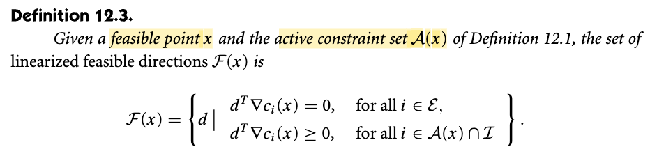
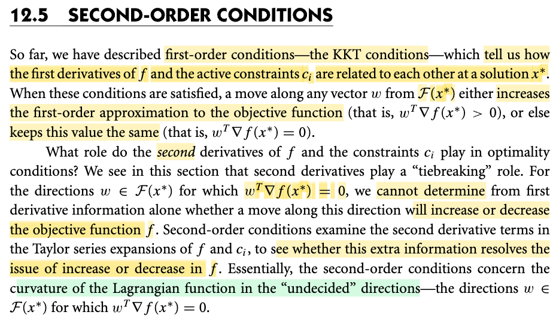

# 12.5  Second-Order Conditions

📊 **Progress:** `1` Notes | `2` Screenshots | `1` AI Reviews

---

 

## Điều kiện bậc hai

<kbd></kbd>

<kbd></kbd>

> [!NOTE]
> Qua 12.5 ta sẽ bàn đến điều kiện bậc hai, dùng đạo hàm bậc hai.
>
>
>
> Từ phần trước ta đã biết KKT condition (là điều kiện cần bậc 1 của bài toán tối ưu ràng buộc) sẽ giúp ta tìm ra điểm x\* có đặc điểm sau: Khi từ x\* đi theo hướng vector s nào trong ℱ(x\*)
>
>
>
> (định nghĩa đơn giản là tập các vector s khiến đi từ x\* đến x\*+s thì x\*+s vẫn feasible)
>
>
>
> Trong lập luận đó, ta đã lập luận rằng, nếu tại x mà tôi không tìm thấy hướng đi (vector s) có độ dài rất nhỏ nào, khiến cho khi đi theo hướng đó s hợp ∇f góc tù, và với ∇c1 góc vuông hoặc nhọn, thì x\* chính là ứng cử viên của solution.
>
>
>
> Nhưng nó chỉ là điều kiện cần là vì:
>
>
>
> Nếu tại x có thể tìm ra hướng feasible s (tức x+s vẫn feasible) có ∇f(x)Ts &lt; 0, giảm thêm xấp xỉ bậc 1 của f thì x chắc chắn không phải là solution. Do nếu có thể giảm thêm xấp xỉ bậc 1 thì chắc chắn giảm thêm f.
>
>
>
> Nhưng ngược lại, nếu tại x, không thể đi theo feasible s nào giúp giảm thêm xấp xỉ bậc 1 của f tại x, thì cũng chưa chắc là sẽ không thể tìm ra s giúp giảm f.
>
>
>
> Biểu thị toán học như sau:
>
>
>
> Cho x không thỏa KKT, tức tồn tại s khiến ∇f(x)Ts &lt; 0, thì chắc chắn f^(x+s) (=f(x) + ∇f(x)Ts) sẽ &lt; f(x), mà cũng đồng nghĩa f(x+s) (theo Taylor expansion, = f(x) + ∇f(x)Ts + term bậc cao..) sẽ &lt; f(x).
>
>
>
> Nhưng nếu x thỏa KKT, tức ∇f(x)Ts ≥ 0 với mọi s feasible direction (s ∈ ℱ(x\*)) thì:
>
>
>
> Chỉ khẳng định f^(x+s) sẽ không giảm
>
>
>
> CHỨ KHÔNG KHẲNG ĐỊNH f(x+s) SẼ KHÔNG GIẢM.
>
>
>
> VÌ, KHI ∇f(x)Ts = 0, f(x+s) (= f(x) + term bậc cao) VẪN CÓ THỂ &lt; f(x)
>
>
>
> Do đó ta cần dùng đạo hàm bậc hai.

> [!TIP]
> **🤖 AI Feedback** — ✅ Score: **95/100**
>
> Ghi chú rất xuất sắc, thể hiện sự hiểu biết sâu sắc về bản chất hình học và toán học của điều kiện KKT cũng như vai trò của đạo hàm bậc hai. Điểm duy nhất cần lưu ý là nên phân biệt rõ hơn giữa tập hướng khả thi thực tế và tập hướng khả thi tuyến tính hóa F(x).

 

