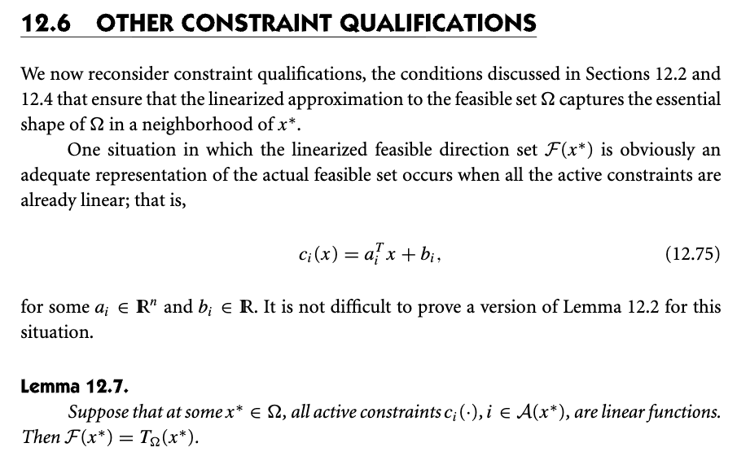
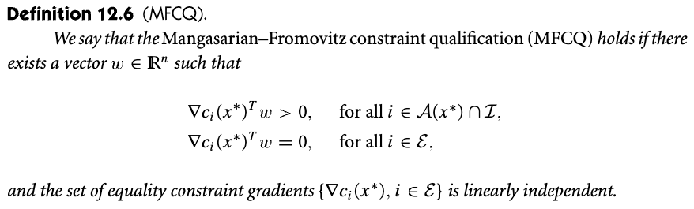

# 12.6 Other constraint qualification

📊 **Progress:** `2` Notes | `2` Screenshots | `1` AI Reviews

---

 

## Section 12.6 Other Constraint Qualifications

<kbd></kbd>

> [!NOTE]
> Chỉ cần hiểu: Bữa trước ta đã học một cái constraint qualification đầu tiên, là LICQ - các active constraint gradient vector độc lập tuyến tính) Thì nay, thêm cái nữa: là các constraint đều là hàm tuyến tính, xong.

> [!TIP]
> 🤖 **AI Check** — 🟡 Minor issues — ✅ **90/100** · ✓ Move on
>
> Ghi chú nắm đúng bản chất đây là một điều kiện chuẩn hóa ràng buộc (CQ) khác bên cạnh LICQ, chỉ có một điểm thiếu sót nhỏ là bổ đề chỉ yêu cầu các ràng buộc tác động (active constraints) là tuyến tính chứ không nhất thiết phải là toàn bộ ràng buộc.
>
> **🟡 Minor issues**
>
> **1.** *"các constraint đều là hàm tuyến tính"*
>
> Theo Bổ đề 12.7, điều kiện tại điểm $x^*$ chỉ đòi hỏi tất cả các ràng buộc đang tác động ($c_i(x)$ với $i \in \mathcal{A}(x^*)$) là hàm tuyến tính, không nhất thiết tất cả các ràng buộc trong bài toán đều phải là hàm tuyến tính.
>
>
> **✓ Strengths**
> - Nhận diện chính xác tính chất tuyến tính của các ràng buộc là một dạng Constraint Qualification thay thế cho LICQ để đảm bảo nón hướng chấp nhận được xấp xỉ đúng nón tiếp tuyến.
>
> **💡 Deeper notes**
> - Khi các ràng buộc tác động là tuyến tính (Linear CQ), ta không cần điều kiện các vector gradient phải độc lập tuyến tính như ở LICQ; do đó KKT vẫn áp dụng được ngay cả khi các ràng buộc tuyến tính bị phụ thuộc tuyến tính.

 

### Definition 12.6 MFCQ

<kbd></kbd>

> [!NOTE]
> Một loại CQ nữa, chỉ cần biết sơ về nó là đủ.

 

