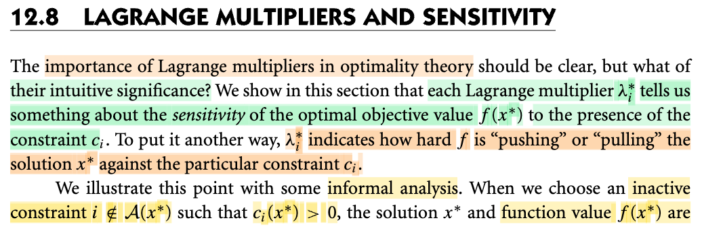
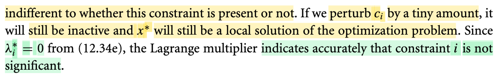
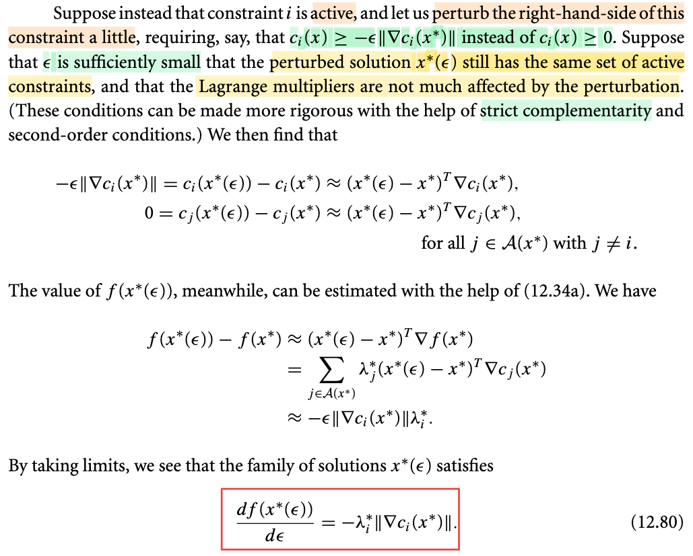

# 12.8 Lagrange Multipliers and Sensitivity

📊 **Progress:** `3` Notes | `3` Screenshots | `2` AI Reviews

---

> [!NOTE]
> Trong bài này ta sẽ nói về ý nghĩa của Lagrange Multiplier

 

## Lagrange Multipliers and Sensitivity

<kbd></kbd>

<kbd></kbd>

> [!NOTE]
> Đại ý là, phần này ta sẽ tìm hiểu về ý nghĩa trực giác của Lagrange multiplier. Đó là nó sẽ cho ta biết về độ nhạy cảm (sensitivity) của optimal objective value f(x\*) đối với sự hiện diện của constraint ci. Cụ thể nó cho ta biết rằng f đang kéo hoặc đẩy solution x\* chống lại constraint ci như thế nào.
>
>
>
> Đầu tiên xét case mà tại x\*, ci(x\*) không **active** tức ci(x\*) &gt; 0. Mà như vậy thì có nghĩa là gì: hình dung ví dụ ci(x\*) ≥ 0 thể hiện ràng buộc x phải nằm bên trong (miền ci(x) &gt; 0) hoặc tại chân hàng rào ci(x) = 0. Như vậy, với ràng buộc ci, thì x\* đang nằm trong hàng rào và do đó, nếu như ta thay đổi ci chút xíu để thành ci\~(x) ≥ 0 thì điều này tương đương ta nhích cái hàng rào chút xíu (có thể là vào trong). Khi đó dĩ nhiên có thể hình dung là điều này chẳng ảnh hưởng gì đến x\* (vì nó đang nằm trong hàng rào rồi, mà chỉ nhích hàng rào tí xíu). Trực giác là vậy, còn về toán học, ta thấy vì x\* thỏa KKT nên λ\*i ci(x\*) = 0, và vì ci(x\*) &gt; 0 nên λ\*i = 0. Như vậy, giá trị λ\*i = 0 chính là phản ánh rằng, vai trò của ci đang hoàn toàn không ảnh hưởng gì đến x\* cả, hay: có ràng buộc ci hay không cũng chả sao.
>
>
>
> Mình có thể hình dung viên bi muốn lăn xuống chỗ trũng nhất với yêu cầu không được ra khỏi hàng rào, và trong tình huống này chỗ trũng nhất nằm trong hàng rào nên có hàng rào hay không chả quan trọng gì.

📹 [Xem video trên YouTube](https://www.youtube.com/watch?v=wy_PaBOEbnY)

> [!TIP]
> 🤖 **AI Check** — 🟢 Pass — ✅ **100/100** · ✓ Move on
>
> Ghi chú nắm rất chắc và diễn giải trực quan xuất sắc ý nghĩa của nhân tử Lagrange đối với ràng buộc không kích hoạt (inactive constraint).
>
> **✓ Strengths**
> - Diễn giải trực giác hình học (hàng rào, viên bi lăn vào chỗ trũng) rất sinh động, chính xác và bám sát bản chất bài toán tối ưu có ràng buộc.
> - Kết nối chính xác giữa trực giác vật lý với điều kiện bù KKT (complementarity condition) để suy ra λ*i = 0.
>
> **💡 Deeper notes**
> - Tính chất vô hiệu của ràng buộc inactive chỉ áp dụng với nhiễu đủ nhỏ (local perturbation); nếu dời 'hàng rào' một lượng lớn hơn giá trị ci(x*), ràng buộc có thể trở nên active hoặc vi phạm tính khả thi của x*.

 

### Constraint Perturbation and Lagrange Multipliers

<kbd></kbd>

> [!NOTE]
> Rồi, xét case thứ hai, cho rằng tại x\*, ci(x\*) đang active, tức ci(x\*) = 0 (cũng là i ∈ 𝒜(x\*)).
>
>
>
> Ta mới perturb, nôm na là thay đổi một khoảng rất nhỏ ràng buộc ci(x) ≥ 0. Để đang là ci(x) ≥ 0, trở thành ci(x) ≥ -ε||∇ci(x\*)|| (⇔ c̃i(x) = ci(x) + ε||∇ci(x\*)|| ≥ 0).
>
>
>
> Cái này mang ý nghĩa giống như ta dời hàng rào đi chút xíu. Giả sử ε dương, thì hiểu thế này, ràng buộc ban đầu là ci(x) ≥ 0, nhưng sau đó trở thành ci(x) ≥ một số âm, nên có thể thấy điều này mang ý nghĩa là nới lỏng hàng rào ra, để cho tập ràng buộc ci(x) trở nên rộng hơn so với trước. Còn nếu ε âm, ý nghĩa sẽ là co hẹp vùng ràng buộc lại, bằng cách nhích cái hàng rào vào trong.
>
>
>
> Với sự thay đổi này, optimal x\* thay đổi thành x\*(ε) (do bài toán thay đổi).
>
>
>
> Bên cạnh đó tác gỉa cũng cho rằng, ta giả sử sự thay đổi là rất nhỏ, nên active set của x\*(ε) vẫn như cũ, tức là những ràng buộc nào đang active tại x\* thì vẫn tiếp tục active tại x\*(ε) và những ràng buộc nào đang inactive tại x\* thì cũng tiếp tục inactive tại x\*(ε). Do đó, ta có :
>
>
>
> c̃ i(x\*(ε)) = 0
>
>
>
> ⇔ ci(x\*(ε) + ε||∇ci(x\*)|| = 0
>
> \
> ⇔ ci(x\*(ε) = -ε||∇ci(x\*)||
>
>
>
> Như vậy ci(x\*) = 0, và ci(x\*(ε)) + ε||∇ci(x\*)|| = 0 ⇔ ci(x\*(ε)) = - ε||∇ci(x\*)|| 
>
>
>
> ⇒ ci(x\*(ε)) - ci(x\*) = -ε||∇ci(x\*)||
>
>
>
> Tiếp, nếu x\*(ε) ≈ x\*, ci(x\*(ε)) ≈ ci(x\*) + ∇ci(x\*)ᵀ(x\*(ε)-x\*)
>
>
>
> ⇔ ci(x\*(ε)) - ci(x\*) ≈ ∇ci(x\*)ᵀ(x\*(ε)-x\*)
>
>
>
> Kết hợp với (1) ta có:
>
>
>
> \-ε||∇ci(x\*)|| ≈ ∇ci(x\*)ᵀ(x\*(ε)-x\*)
>
>
>
> ---
>
>
>
> Với các ràng buộc đang active khác (cj, j ∈ 𝒜(x\*), j ≠ i) thì vẫn như cũ nên cj(x\*) = 0, cj(x\*(ε) = 0
>
>
>
> ⇒ cj(x\*(ε)) - cj(x\*) = 0
>
>
>
> và tương tự, linear approx với các cj:
>
>
>
> cj(x\*(ε)) ≈ cj(x\*) + ∇cj(x\*)ᵀ(x\*(ε)-x\*)
>
>
>
> ⇔ cj(x\*(ε)) - cj(x\*) ≈ ∇cj(x\*)ᵀ(x\*(ε)-x\*)
>
>
>
> ⇔ 0 ≈ ∇cj(x\*)ᵀ(x\*(ε)-x\*)
>
>
>
> ---
>
>
>
> Vậy từ
>
>
>
> \-ε||∇ci(x\*)|| ≈ ∇ci(x\*)ᵀ(x\*(ε)-x\*)
>
>
>
> ⇔ -ε||∇ci(x\*)|| λ\*i ≈ λ\*i ∇ci(x\*)ᵀ(x\*(ε)-x\*)
>
>
>
>
>
> và 0 ≈ ∇cj(x\*)ᵀ(x\*(ε)-x\*) với j ∈ 𝒜(x\*), j ≠ i
>
>
>
> ⇔ 0 ≈ λ\*j ∇cj(x\*)ᵀ(x\*(ε)-x\*) với j ∈ 𝒜(x\*), j ≠ i
>
>
>
> Cộng vế theo vế
>
>
>
> ⇒ -ε||∇ci(x\*)|| λ\*i ≈ Σj∈𝒜(x\*) λ\*j ∇cj(x\*)ᵀ(x\*(ε)-x\*) (2)
>
>
>
> ---
>
>
>
> Tiếp, xấp xỉ tuyến tính hàm f tại x\*:
>
>
>
> f(x\*(ε)) ≈ f(x\*) + ∇f(x\*)ᵀ(x\*(ε)-x\*)
>
>
>
> ⇔ f(x\*(ε)) - f(x\*) ≈ ∇f(x\*)ᵀ(x\*(ε)-x\*)
>
>
>
> Mà theo điều kiện stationary của KKT (và x\* là nghiệm nên phải thỏa):
>
>
>
> ∇\_x ℒ(x\*, λ\*) = 0
>
>
>
> ⇔ ∇f(x\*) - Σi λ\*i ∇ci(x\*) = 0 với i∈𝒥∪ℰ (3)
>
>
>
> c1(x) = 0 ℰ = {1}
>
>
>
> c2(x) ≥ 0, c3(x) ≥ 0, c4(x) ≥ 0, ℐ = {2,3,4}
>
>
>
> c2(x\*) = 0, c3(x\*) = 0, c4(x\*) &gt; 0
>
>
>
> 𝒜(x\*) = {1, 2, 3}
>
>
>
> λ\*1 c1(x\*) + λ\*2 c2(x\*) + λ\*3 c3(x\*) + λ\*4 c4(x\*) = 0
>
>
>
> λ\*1 c1(x\*) + λ\*2 c2(x\*) + λ\*3 c3(x\*) = 0
>
>
>
> ---
>
>
>
> Bên cạnh đó, điều kiện complementary của KKT yêu cầu Σi∈𝒥∪ℰ \[λ\*i ci(x\*)\] = 0, sẽ khiến các ci đang inactive tại x\* sẽ có λi\* tương ứng bằng 0. Do đó (3) trở thành:
>
>
>
> ∇f(x\*) - Σi λ\*i ∇ci(x\*) = 0 với i∈𝒜(x\*)
>
>
>
> ⇔ ∇f(x\*) - Σi∈𝒜(x\*) \[λ\*i ∇ci(x\*)\] = 0
>
>
>
> ⇔ ∇f(x\*) = Σi∈𝒜(x\*) \[λ\*i ∇ci(x\*)\]
>
>
>
> Vậy:
>
>
>
> f(x\*(ε)) - f(x\*) ≈ ∇f(x\*)ᵀ(x\*(ε)-x\*)
>
>
>
> ≈ {Σi∈𝒜(x\*) \[λ\*i ∇ci(x\*)\] }ᵀ(x\*(ε)-x\*)
>
>
>
> (u + v)ᵀz = uᵀz + vᵀz)
>
>
>
> ≈ Σi∈𝒜(x\*) λ\*i ∇ci(x\*)ᵀ(x\*(ε)-x\*)
>
>
>
> Và theo (2) -ε||∇ci(x\*)|| λ\*i ≈ Σj∈𝒜(x\*) λ\*j ∇ci(x\*)ᵀ(x\*(ε)-x\*)
>
>
>
> thì đây chính là -ε||∇ci(x\*)|| λ\*i
>
>
>
> Vậy ta có: f(x\*(ε)) - f(x\*) ≈ -ε||∇ci(x\*)|| λ\*i
>
>
>
> ⇔ \[f(x\*(ε)) - f(x\*)\] / ε ≈ -||∇ci(x\*)|| λ\*i
>
>
>
> lấy lim ε → 0 thì vế trái chính là định nghĩa của d/dε f(x\*(ε))
>
>
>
> Vậy ta có d/dε f(x\*(ε)) = -||∇ci(x\*)|| λ\*i 
>
>
>
> Kết quả này cho thấy rằng: Giá trị của optimal objective với tư cách là hàm theo ε sẽ có độ dốc là -||∇ci(x\*)|| λ\*i. Và có nghĩa là nếu λ\*i lớn, thì -||∇ci(x\*)|| λ\*i lớn, sẽ khiến ε thay đổi nhỏ cũng dẫn đến optimal objective thay đổi lớn mang ý nghĩa: giá trị optimal objective rất nhạy cảm với sự thay đổi của constraint ci.
>
>
>
> Và kết quả này cũng phản ánh case trước: kh λ\*i = 0, thì hàm optimal objective hoàn toàn không bị ảnh hưởng gì bởi sự thay đổi của ci.

📹 [Xem video trên YouTube](https://youtu.be/6g2qIzX9yO0)

> [!TIP]
> 🤖 **AI Check** — 🟡 Minor issues — ✅ **95/100** · ✓ Move on
>
> Ghi chú rất xuất sắc, hiểu đúng bản chất hình học của việc dời biên ràng buộc và tự triển khai chi tiết từng bước đại số từ điều kiện KKT đến vi phân độ nhạy.
>
> **🟡 Minor issues**
>
> **1.** *"Bên cạnh đó, điều kiện complementary của KKT yêu cầu Σi∈𝒥∪ℰ [λ*i ci(x*)] = 0"*
>
> Về mặt định nghĩa chuẩn, điều kiện bù (complementary slackness) chỉ áp dụng cho các ràng buộc bất đẳng thức i ∈ 𝒥 (từng thành phần λ*i ci(x*) = 0 với λ*i ≥ 0). Các ràng buộc đẳng thức i ∈ ℰ luôn thỏa ci(x*) = 0 do tính chấp nhận được (feasibility) và mặc nhiên luôn thuộc active set A(x*).
>
> **2.** *"Và có nghĩa là nếu λ*i lớn, thì -||∇ci(x*)|| λ*i lớn"*
>
> Nên dùng từ 'độ lớn' hoặc 'trị tuyệt đối lớn' để chặt chẽ hơn, vì bản thân giá trị đạo hàm này mang dấu âm (khi λ*i > 0 thì -||∇ci(x*)|| λ*i là một số âm rất sâu, tức hàm mục tiêu giảm rất mạnh khi nới lỏng ε > 0).
>
>
> **✓ Strengths**
> - Giải thích trực quan hình học rất chuẩn xác về ý nghĩa dời hàng rào (nới lỏng khi ε > 0 và siết chặt khi ε < 0).
> - Tự triển khai đầy đủ các bước xấp xỉ tuyến tính và biến đổi đại số mà sách chỉ viết vắn tắt.
> - Kết nối chính xác các điều kiện KKT (stationarity và complementary slackness) để rút ra công thức đạo hàm cuối cùng.
>
> **💡 Deeper notes**
> - Để nghiệm x*(ε) tồn tại, khả vi trơn theo ε và giữ nguyên active set khi ε đủ nhỏ, bài toán cần thỏa mãn thêm điều kiện bù ngặt (strict complementarity: λ*i > 0 với mọi i active) cùng điều kiện đủ cấp hai (second-order sufficiency conditions - SOSC).

 

