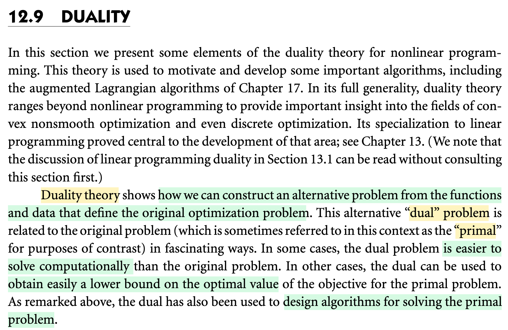
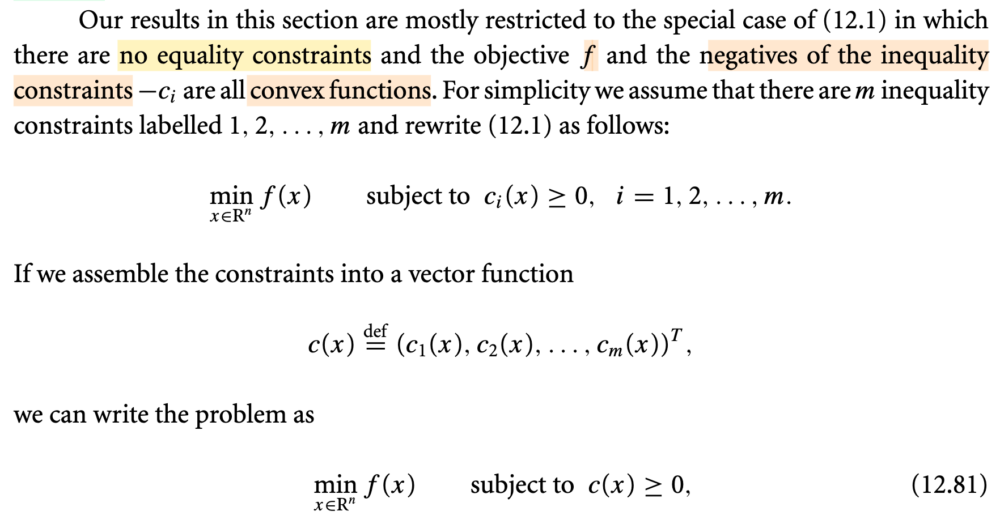
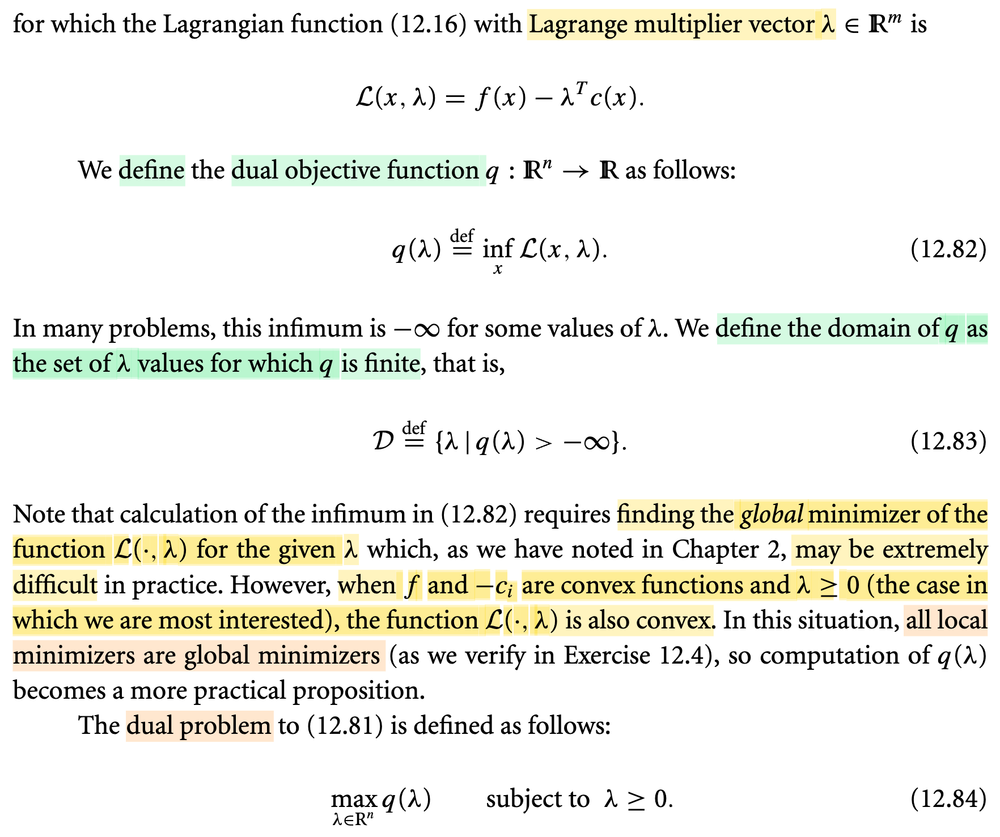
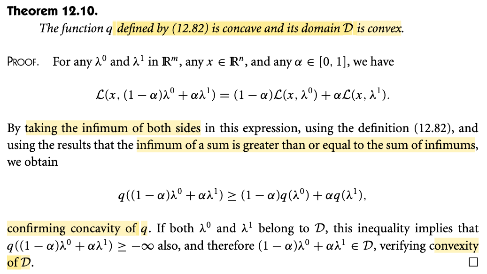
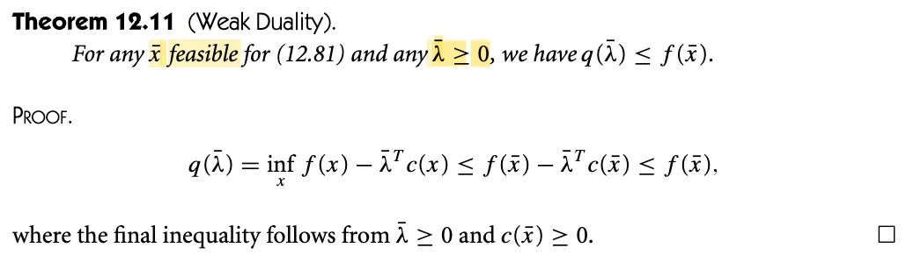
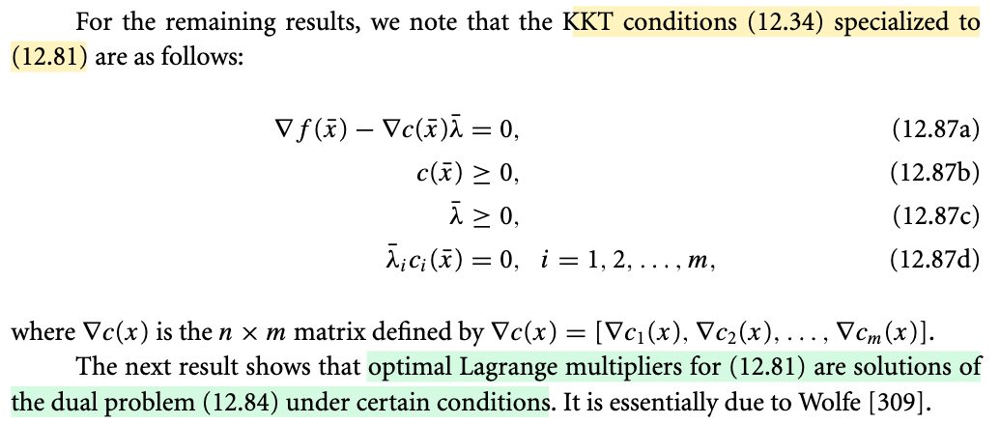
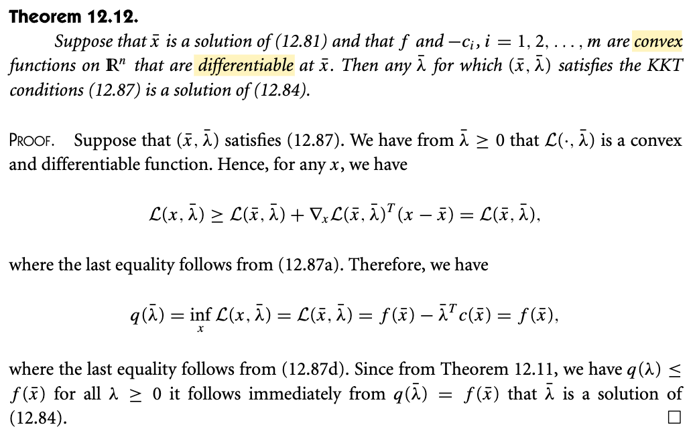

# 12.9 Duality

📊 **Progress:** `5` Notes | `7` Screenshots | `5` AI Reviews

---

<kbd></kbd>

> [!NOTE]
> Đoạn này đại khái là nói về ý tưởng duality: Tạo ra bài toán đối ngẫu với bài toán gốc.
>
>
>
> Vài tác dụng của nó, ví dụ đôi khi giải bài toán dual dễ hơn
>
>
>
> Đôi khi dùng bài toán dual để có chặn dưới của optimal value của bài toán gốc (primal)

> [!TIP]
> 🤖 **AI Check** — 🟢 Pass — ✅ **95/100** · ✓ Move on
>
> Ghi chú tóm tắt rất tốt và chính xác nội dung cốt lõi của đoạn văn về khái niệm tính đối ngẫu (duality) cùng các lợi ích chính của nó.
>
> **✓ Strengths**
> - Nắm bắt chính xác bản chất của duality là xây dựng một bài toán đối ngẫu (dual) từ dữ liệu của bài toán gốc (primal).
> - Nêu đúng hai lợi ích quan trọng được đề cập: bài toán dual đôi khi dễ giải hơn và có thể cung cấp chặn dưới cho giá trị tối ưu của bài toán primal.
>
> **💡 Deeper notes**
> - Đoạn văn còn nhắc đến một ứng dụng quan trọng khác là dùng lý thuyết đối ngẫu để thiết kế các thuật toán giải bài toán gốc (ví dụ như Augmented Lagrangian).
> - Lưu ý rằng tính chất 'cung cấp chặn dưới' (lower bound) thường ngầm định bài toán gốc là bài toán cực tiểu hóa (minimization).

 

## Convex Programming with Inequality Constraints

<kbd></kbd>

<kbd></kbd>

> [!NOTE]
> Okay thì cái phần này đại ý là đưa ra một số cái định nghĩa mà cái này mình đã học ở bên cái cuốn sách hoặc là bên cái khóa học EE364 Tối ưu lồi của giáo sư Stephen Boyd rồi, cho nên là cũng khá quen thuộc. Thì đại khái đầu tiên á là ở đây chỉ xét những cái bài toán không có ràng buộc đẳng thức và hàm mục tiêu cũng như là hàm ràng buộc bất đẳng thức á đều là hàm lồi, convex function. Và để cho đơn giản thì coi như là có m hàm ràng buộc, có m cái ràng buộc bất đẳng thức. Rồi, và người ta mới đặt ra một cái hàm vector gom mấy thằng c1, c2, ....cm lại thành vector, không có gì khó hết. Thì với cái cách làm đó á thì cái hàm Lagrangian sẽ có cái dạng là f(x) trừ cho λ chuyển vị c(x), trong đó λ là một cái vector nhiều cái multiplier, mỗi một cái multiplier λ i là nó gắn với một cái ràng buộc ci. 
>
>
>
> Khi đó mình mới đặt ra một cái định nghĩa đầu tiên là định nghĩa về cái hàm mục tiêu của bài toán đối ngẫu, của bài toán dual problem. Đó là nó gọi là hàm q của λ được định nghĩa bằng cách là mình lấy infimum của cái hàm Lagrangian, infimum đối với x. Thì về cơ bản mình hiểu rồi là mình sẽ giải cái bài toán là mình minimize cái hàm Lagrangian theo x thì mình sẽ có được một cái hàm theo λ. Bởi vì cái hàm Lagrangian á là cái hàm theo cả x và cả λ, cho nên khi minimize cái hàm Lagrangian theo x á thì mình sẽ có một cái hàm không còn phụ thuộc x nữa và nó là hàm chỉ còn phụ thuộc λ, mình đặt nó là hàm q(λ). 
>
>
>
> Bài toán dual problem á sẽ là cái bài toán sau: đó là mình sẽ maximize cái hàm q(λ) này theo λ. Thế thì trước đó, vì có một số giá trị λ sẽ khiến cho cái chuyện là khi mà minimize cái hàm Lagrangian á thì nó sẽ ra âm vô cùng. Do đó mình mới đặt ra cái domain của cái hàm q sẽ là những cái λ mà khiến cho q nó xác định.
>
> Và dẫn đến là mình sẽ có một cái bài toán, có một cái định nghĩa của cái bài toán dual problem. Đó là mình sẽ maximize over λ, tìm λ để mà maximize cái hàm q(λ) với cái ràng buộc là λ phải luôn luôn không âm.

> [!TIP]
> 🤖 **AI Check** — 🟡 Minor issues — ⚠️ **88/100** · ✓ Move on
>
> Ghi chú nắm rất tốt bản chất của hàm Lagrangian, hàm mục tiêu đối ngẫu và bài toán đối ngẫu. Chỉ có một điểm không chuẩn xác nhỏ do nhầm lẫn quy ước dấu của hàm ràng buộc giữa sách của Boyd và Nocedal & Wright.
>
> **🟡 Minor issues**
>
> **1.** *"hàm mục tiêu cũng như là hàm ràng buộc bất đẳng thức á đều là hàm lồi, convex function."*
>
> Trong tài liệu đang xét (Nocedal & Wright), bài toán viết dưới dạng $c_i(x) \ge 0$, do đó điều kiện để bài toán là tối ưu lồi là $-c_i$ phải là hàm lồi (tức $c_i$ là hàm lõm). Có thể bạn nhớ theo chuẩn của Boyd ($f_i(x) \le 0$ với $f_i$ lồi), nhưng nếu giữ dạng $c_i(x) \ge 0$ mà $c_i$ lồi thì miền ràng buộc chưa chắc đã là tập lồi.
>
>
> **✓ Strengths**
> - Hiểu chính xác cách hình thành hàm đối ngẫu $q(\lambda)$ bằng cách triệt tiêu biến $x$ qua phép lấy infimum của Lagrangian.
> - Nhận diện đúng vai trò và số chiều của vector nhân tử Lagrange $\lambda$ gắn với $m$ ràng buộc $c_i$.
> - Nắm rõ khái niệm miền xác định (domain) của $q(\lambda)$ khi loại bỏ các giá trị làm infimum đạt $-\infty$.
>
> **💡 Deeper notes**
> - Lưu ý lỗi in ấn (typo) trong ảnh gốc ở công thức (12.82) và (12.84): sách viết nhầm $q: \mathbb{R}^n \to \mathbb{R}$ và $\max_{\lambda \in \mathbb{R}^n}$, trong khi đúng bản chất phải là $\lambda \in \mathbb{R}^m$ như bạn đã nhận định.
> - Khi $-c_i$ lồi và $\lambda \ge 0$, hàm $-\lambda_i c_i(x)$ là hàm lồi, dẫn đến Lagrangian $\mathcal{L}(\cdot, \lambda)$ lồi theo $x$, giúp mọi điểm cực tiểu địa phương đều là cực tiểu toàn cục.

 

### Tính lõm hàm đối ngẫu

<kbd></kbd>

> [!NOTE]
> Theorem này nói đại ý rằng hàm dual objective q(λ) = inf_x L(x, λ) là hàm concave và domain 𝒟 là tập convex.
>
>
>
> Minh nghĩ phần chứng minh hiểu như sau:
>
>
>
> Đầu tiên, xét λ0, λ1 ∈ R^m bất kì. Và bất kì α ∈ \[0,1\] ta có:
>
>
>
> \- linear combination x, y: αx + βy
>
>
>
> \- affine combination x, y: αx + βy, α + β = 1
>
>
>
> \- convex combination x, y: αx + βy, α + β = 1, α, β ≥ 0
>
>
>
> θx + (1-θ)y, θ ∈ \[0,1\]
>
>
>
> ---
>
>
>
>
>
> ℒ(x, λ) = f(x) + λᵀc(x)
>
>
>
> ⇒ ℒ(x, (1-α)λ0 + αλ1) = f(x) + \[(1-α)λ0 + αλ1\]ᵀc(x)
>
>
>
> = f(x) + (1-α)λ0ᵀc(x) + αλ1ᵀc(x) (nhân phân phối vào)
>
>
>
> = (1-α+α)f(x) + (1-α)λ0ᵀc(x) + αλ1ᵀc(x)
>
>
>
> = (1-α)f(x) + αf(x) + (1-α)λ0ᵀc(x) + αλ1ᵀc(x)
>
>
>
> = (1-α)f(x) + (1-α)λ0ᵀc(x) + αf(x) + αλ1ᵀc(x)
>
>
>
> = (1-α)\[f(x) + λ0ᵀc(x)\] + α\[f(x) + λ1ᵀc(x)\]
>
>
>
> = (1-α)ℒ(x,λ0) + αℒ(x,λ1)
>
>
>
> Viết lại: ℒ(x, (1-α)λ0 + αλ1) = (1-α)ℒ(x,λ0) + αℒ(x,λ1)
>
>
>
> ---
>
>
>
> Tới đây, dùng tính chất: Nếu có hàm g(x) và h(x) thì inf_x g(x) + inf_x h(x) ≤ inf_x \[g(x) + h(x)\]. Chứng minh rất dễ:
>
>
>
> Gọi inf_x g(x) = c1, inf_x h(x) = c2. Ta có c1 ≤ g(x) ∀x và c2 ≤ h(x) ∀x.
>
>
>
> ⇒ c1 + c2 ≤ g(x) + h(x) ∀x
>
>
>
> ⇒ c1 + c2 ≤ inf_x \[g(x) + h(x)\]
>
>
>
> Vậy inf_x g(x) + inf_x h(x) ≤ inf_x \[g(x) + h(x)\]
>
>
>
> ---
>
>
>
> Nên áp dụng cái này, ta có:
>
>
>
> inf_x \[(1-α)ℒ(x,λ0)\] + inf_x \[αℒ(x,λ1)\] ≤ inf_x \[ℒ(x, (1-α)λ0 + αλ1)\]
>
>
>
> ⇔ (1-α) inf_x ℒ(x,λ0) + α inf_x ℒ(x,λ1) ≤ inf_x \[ℒ(x, (1-α)λ0 + αλ1)\]
>
>
>
> ⇔ (1-α) q(λ0) + α q(λ1) ≤ q((1-α)λ0 + αλ1) (1)
>
>
>
> Và ta nhớ, theo định nghĩa của hàm convex là hàm
>
>
>
> mà với mọi x, y: (1-α)f(x) + αf(y) ≥ f((1-α)x+αy)
>
>
>
> (nôm na là convex combination của f luôn ≥ f của convex combination)
>
>
>
> Vậy thì ở đây (1) sẽ tương đương: (1-α) \[-q(λ0)\] + α \[-q(λ1)\] ≥ -q((1-α)λ0 + αλ1)
>
>
>
> nên -q là hàm convex, và do đó q là hàm concave
>
>
>
> ---
>
>
>
> Và lập luận sau đó đại khái là nếu λ0, λ1 thuộc domain 𝒟 của q, mà theo định nghĩa 𝒟, nó phải là điểm khiến q xác định (&gt; -∞). Thì khi đó ta sẽ dựa vào kết quả (1),
>
>
>
> (1-α) q(λ0) + α q(λ1) ≤ q((1-α)λ0 + αλ1)
>
>
>
> để lập luận rằng: À, λ0 khiến -∞ &lt; q(λ0) , và λ1 khiến -∞ &lt; q(λ1) vậy:
>
>
>
> \-∞ &lt; (1-α) q(λ0) + α q(λ1)
>
>
>
> ⇒ -∞ &lt; q((1-α)λ0 + αλ1)
>
>
>
> À, như vậy có nghĩa là (1-α)λ0 + αλ1 cũng là điểm khiến q xác định, nên nó cũng thuộc domain 𝒟.
>
>
>
> Và điều này có nghĩa là, với λ0, λ1 thuộc 𝒟, thì convex combination của chúng cũng thuộc 𝒟, nên theo định nghĩa của convex set, thì 𝒟 chính là convex set.

📹 [Xem video trên YouTube](https://www.youtube.com/watch?v=UGddFxbogXU)

> [!TIP]
> 🤖 **AI Check** — 🟢 Pass — ✅ **100/100** · ✓ Move on
>
> Ghi chú rất xuất sắc, giải thích chi tiết và tự chứng minh lại đầy đủ các bước mà tài liệu gốc chỉ tóm tắt (tính tuyến tính của hàm Lagrange theo lambda, bất đẳng thức infimum, tính lõm và tính lồi của miền xác định).
>
> **✓ Strengths**
> - Khai triển đại số chi tiết chứng minh tính affine/tuyến tính của hàm Lagrange theo tham số nhân tử Lagrange.
> - Chứng minh tường minh bổ đề về infimum của tổng lớn hơn hoặc bằng tổng các infimum.
> - Lập luận chặt chẽ và chuẩn xác về việc miền xác định D là tập lồi dựa trên điều kiện giá trị hàm lớn hơn âm vô cùng.
>
> **💡 Deeper notes**
> - Khi đưa nhân tử ra ngoài infimum như inf[α*h(x)] = α*inf[h(x)], điều kiện cần là α ≥ 0 (ở đây α ∈ [0, 1] nên luôn thỏa mãn).
> - Bản chất hàm dual q(λ) là infimum của một họ các hàm affine theo λ; vì infimum từng điểm (pointwise infimum) của một họ các hàm concave/affine luôn là một hàm concave, nên q(λ) luôn concave ngay cả khi bài toán gốc không lồi.

**🔗 See also:** [Convex function *(EE364a, Convex Optim_S.Boyd)*](../ee364a_convex_optim_sboyd/lec_3.md#node-zktzuo5) · [linked note *(EE364a, Convex Optim_S.Boyd)*](../ee364a_convex_optim_sboyd/lec_2.md#node-65mxxf3)

 

#### Theorem 12.11 Weak Duality

<kbd></kbd>

> [!NOTE]
> Định lý Weak Duality, đã học trong sách Boyd:
>
>
>
> Đại ý là với mọi x̄ feasible và λ̃ ≥ 0, ta sẽ có q(λ̃) ≤ f(x̄).
>
>
>
> Chứng minh cũng đơn giản:
>
>
>
> ℒ(x, λ) = f(x) - λᵀc(x)
>
>
>
> Theo định nghĩa, q(λ) = inf_x ℒ(x, λ) nên đương nhiên q(λ) ≤ ℒ(x̄, λ) ∀x̄
>
>
>
> ⇔ q(λ) ≤ f(x̄) - λᵀc(x̄), và cái này cũng đúng với mọi λ, nên:
>
>
>
> q(λ̃) ≤ f(x̄) - λ̃ ᵀc(x̄)
>
>
>
> Tiếp, vì λ̃ ≥ 0 và x̄ feasible nên c(x̄) ≥ 0 ⇒ - λ̃ ᵀc(x̄) ≤ 0
>
>
>
> ⇒ f(x̄) - λ̃ ᵀc(x̄) ≤ f(x̄).
>
>
>
> Vậy q(λ̃ ) ≤ f(x̄)

📹 [Xem video trên YouTube](https://www.youtube.com/watch?v=GtOATZjDGQs)

> [!TIP]
> 🤖 **AI Check** — 🟢 Pass — ✅ **100/100** · ✓ Move on
>
> Ghi chép rất tốt, diễn giải các bước chứng minh định lý Đối ngẫu yếu (Weak Duality) một cách tường minh và chính xác.
>
> **✓ Strengths**
> - Hiểu bản chất và diễn giải chi tiết chuỗi bất đẳng thức từ định nghĩa hàm đối ngẫu (infimum của Lagrangian) đến việc áp dụng tính khả thi và điều kiện dấu của biến đối ngẫu.
>
> **💡 Deeper notes**
> - Ký hiệu trong sách gốc là lambda gạch ngang (\bar{\lambda}) thay vì lambda ngã (\tilde{\lambda}), và bước thay công thức Lagrangian nên dùng dấu suy ra hoặc dấu bằng thay vì dấu tương đương (\Leftrightarrow).

 

##### KKT Conditions and Dual Problem

<kbd></kbd>

<kbd></kbd>

> [!NOTE]
> Vài điểm mấu chốt của chứng minh:
>
>
>
> i) vì f(x), -ci(x) i=1,2...m đều là convex nên với mọi θ ∈ \[0,1\]
>
>
>
> f(θx+(1-θ)y) ≤ θf(x) + (1-θ)f(y)
>
>
>
> \-ci(θx+(1-θ)y) ≤ -θci(x) - (1-θ)ci(y) ∀i=1,2...m
>
>
>
> Với λ̃ ≥ 0 (λ̃ i ≥ 0 ∀i) thì ta có
>
>
>
> ⇔ -λ̃ i ci(θx+(1-θ)y) ≤ -θλ̃ ici(x) - (1-θ)λ̃ ici(y) ∀i=1,2...m
>
>
>
> ⇒ -Σi λ̃ i ci(θx+(1-θ)y) ≤ Σi \[-θλ̃ ici(x) - (1-θ)λ̃ ici(y)\] (cộng vế theo vế)
>
>
>
> ⇒ -Σi λ̃ i ci(θx+(1-θ)y) ≤ -θ Σi λ̃ ici(x) - (1-θ) Σi λ̃ ici(y)
>
>
>
> ⇒ f(θx+(1-θ)y) -Σi λ̃ i ci(θx+(1-θ)y) ≤ θf(x) + (1-θ)f(y) -θ Σi λ̃ ici(x) - (1-θ) Σi λ̃ ici(y)
>
>
>
> ⇔ f(θx+(1-θ)y) -Σi λ̃ i ci(θx+(1-θ)y) ≤ θf(x) -θ Σi λ̃ ici(x) + (1-θ)f(y) - (1-θ) Σi λ̃ ici(y)
>
>
>
> ⇔ f(θx+(1-θ)y) -Σi λ̃ i ci(θx+(1-θ)y) ≤ θ\[f(x) - Σi λ̃ ici(x)\] + (1-θ)\[f(y) - Σi λ̃ ici(y)\]
>
>
>
> ℒ(θx+(1-θ)y), λ̃) ≤ θ ℒ(x, λ̃) + (1-θ)ℒ(y, λ̃)
>
>
>
> Vậy ℒ(x, λ̃) convex
>
>
>
> ---
>
>
>
> Dùng định lý Taylor:
>
>
>
> f(x0 + p) = f(x0) + ∇f(x0)ᵀp + (1/2)pᵀ∇²f(x0 + αp)p for some α ∈ (0,1)
>
>
>
> Nếu f convex thì Hessian luôn xác định bán dương khiến hạng tử thứ 3 luôn không âm dẫn đến f(x0 + p) ≥ f(x0) + ∇f(x0)ᵀp
>
>
>
> Áp dụng cái này có ℒ ta có:
>
>
>
> ℒ(x, λ̃) ≥ ℒ(x̄, λ̃) + ∇\_xℒ(x̄, λ̃ )ᵀ(x-x̄)
>
>
>
> ---
>
>
>
> Tuy nhiên lập luận trên cần giả định hàm f khả vi kép, nên ta có thể làm kiểu khác:
>
>
>
> Dựa vào định nghĩa hàm lồi: θf(x) + (1-θ)f(y) ≥ f(θx+(1-θ)y)
>
>
>
> ⇔ θf(x) + f(y) - θf(y) ≥ f(θx+(1-θ)y)
>
>
>
> ⇔ θf(x) - θf(y) + f(y) ≥ f(θx-θy+y)
>
>
>
> ⇔ θ\[f(x) - f(y)\] ≥ f(θ(x-y)+y) - f(y)
>
>
>
> ⇔ f(x) - f(y) ≥ \[f(θ(x-y)+y) - f(y)\]/θ
>
>
>
> Lấy lim θ → 0 hai vế ta có:
>
>
>
> Vế phải lim θ→0 \[f(θ(x-y)+y) - f(y)\]/θ chính là gì?
>
>
>
> \[f(y + θp) - f(y)\]/θ
>
>
>
> Nó chính là định nghĩa của directional hàm f theo hướng d = x-y, và như vậy cũng chính là ∇f(y)ᵀ(x-y)
>
>
>
> Do đó f(x) - f(y) ≥ ∇f(y)ᵀ(x-y)
>
>
>
> Áp dụng cho convex function ℒ(x, λ̃ ):
>
>
>
> ℒ(x, λ̃ ) ≥ ℒ(x̄, λ̃ ) + ∇\_x ℒ(x̄, λ̃ )ᵀ(x - x̄ )
>
>
>
>
>
> ---
>
>
>
> Và vì x̄ là điểm thỏa KKT nên theo stationary condition, ta có: ∇\_xℒ(x̄, λ̃ ) = 0, suy ra:
>
>
>
> ℒ(x, λ̃ ) ≥ ℒ(x̄, λ̃ ) ∀x
>
>
>
> ---
>
>
>
> Tiếp, theo định nghĩa hàm q: q(λ̃ ) = inf_x ℒ(x, λ̃ )
>
>
>
> Mà ở trên ta có ℒ(x, λ̃) ≥ ℒ(x̄, λ̃) ∀x nên ℒ(x̄, λ̃ ) chính là inf_x ℒ(x, λ̃ )
>
>
>
> Vậy q(λ̃ ) = ℒ(x̄, λ̃ )
>
>
>
> ⇔ q(λ̃ ) = f(x̄) - λ̃ ᵀc(x̄ )
>
>
>
> Và đề bài cho λ̃ (và x̄ ) thỏa KKT nên theo complementary condition của KKT, ta có: λ̃ ᵀc(x̄ ) = 0
>
>
>
> Vậy q(λ̃ ) = f(x̄)
>
>
>
> ---
>
>
>
> Cuối cùng, vì theorem 12.11 vừa rồi thì với mọi λ ≥ 0 thì q(λ) ≤ f(x̄ )
>
>
>
> ⇒ q(λ) ≤ q(λ̃ ) với mọi λ ≥ 0
>
>
>
> Tới đây giúp kết luận λ̃ chính là solution của bài toán maximize\_λ q(λ) s.t λ ≥ 0

> [!TIP]
> 🤖 **AI Check** — 🟢 Pass — ✅ **98/100** · ✓ Move on
>
> Ghi chú xuất sắc! Bạn đã tự chứng minh chi tiết các bước cốt lõi của định lý 12.12 một cách rất chặt chẽ, đặc biệt là việc tự dẫn xuất điều kiện bậc nhất của hàm lồi mà không cần giả định khả vi bậc hai.
>
> **🟡 Minor issues**
>
> **1.** *"Lấy lim θ → 0 hai vế ta có: Vế phải lim θ→0 [f(θ(x-y)+y) - f(y)]/θ chính là gì?"*
>
> Về mặt giải tích, giới hạn này cần xác định là giới hạn một phía từ bên phải (θ → 0⁺) vì bất đẳng thức chỉ giữ nguyên chiều khi θ > 0 (với θ ∈ (0, 1]).
>
>
> **✓ Strengths**
> - Chứng minh chi tiết và chặt chẽ tính lồi của hàm Lagrange từ định nghĩa tổ hợp lồi có trọng số không âm.
> - Rất nhạy bén khi nhận ra định lý Taylor đòi hỏi tính khả vi cấp 2 và đã thay thế bằng dẫn xuất chặt chẽ qua đạo hàm theo hướng (directional derivative).
> - Kết nối mạch lạc từ điều kiện KKT (stationarity, complementary slackness) tới tính đối ngẫu yếu để chứng minh nghiệm tối ưu của bài toán đối ngẫu.
>
> **💡 Deeper notes**
> - Để đạo hàm theo hướng dọc theo d = x - y bằng chính xác ∇f(y)ᵀ(x - y), hàm f cần khả vi Fréchet/Gâteaux tại y. Giả thiết của định lý đã đảm bảo tính khả vi tại x̄ nên lập luận hoàn toàn hợp lệ.

**🔗 See also:** [Theorem 2.1 Taylor's theorem, Taylor theorem](./21_funds_of_unconstrained_optim_whats_solution.md#node-zekxi9u) · [Convex function *(EE364a, Convex Optim_S.Boyd)*](../ee364a_convex_optim_sboyd/lec_3.md#node-zktzuo5)

 

