# 15.3 Elimination Of Variables

📊 **Progress:** `5` Notes | `11` Screenshots | `5` AI Reviews

---

 

## Section 15.3 Elimination of Variables

<kbd>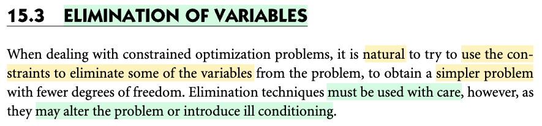</kbd>

<kbd>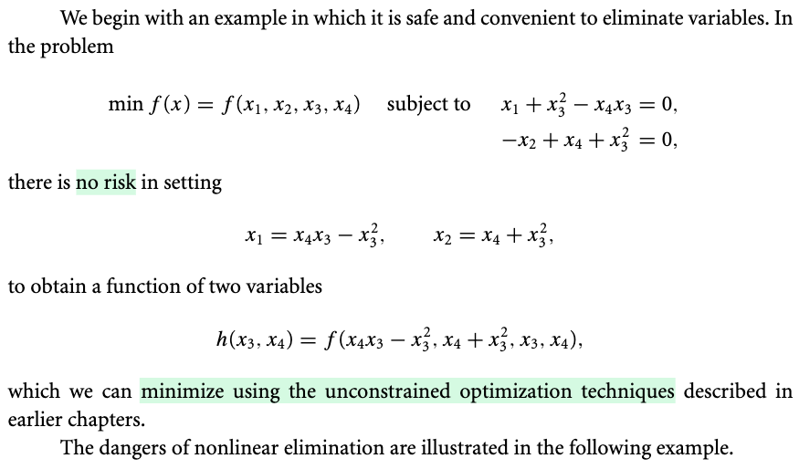</kbd>

> [!NOTE]
> Đại ý là, với tới ưu ràng buộc, lẽ tự nhiên ta có thể muốn dùng constraint giảm bớt số biến tối ưu. Nhưng phải cẩn thận vì có thể sẽ làm dẫn tới ill conditioning.
>
>
>
> Ví dụ đầu tiên minh họa chuyện này, rút x1,x2 từ ràng buộc ra, đắp vào objective, khiến ta có bài toán không ràng buộc. ở case này thì ko sao

> [!TIP]
> 🤖 **AI Check** — 🟢 Pass — ✅ **95/100** · ✓ Move on
>
> Ghi chú tóm tắt rất tốt và nắm bắt chính xác ý chính của phần mở đầu: khử biến giúp giảm số bậc tự do nhưng tiềm ẩn rủi ro, và ví dụ đầu tiên là trường hợp khử biến an toàn.
>
> **✓ Strengths**
> - Nắm bắt chính xác động lực của kỹ thuật khử biến là tận dụng ràng buộc để giảm số biến và chuyển về bài toán tối ưu không ràng buộc.
> - Hiểu đúng bản chất của ví dụ minh họa đầu tiên: có thể biểu diễn tường minh x1, x2 theo các biến còn lại mà không gặp rủi ro.
>
> **💡 Deeper notes**
> - Ngoài rủi ro về điều kiện số (ill-conditioning), việc khử biến (đặc biệt là phi tuyến) còn có nguy cơ làm thay đổi bản chất bài toán (alter the problem), ví dụ như vô tình thu hẹp/mở rộng miền khả thi hoặc làm mất tính khả vi/tính lồi ban đầu.

 

### Danger of Nonlinear Elimination

<kbd>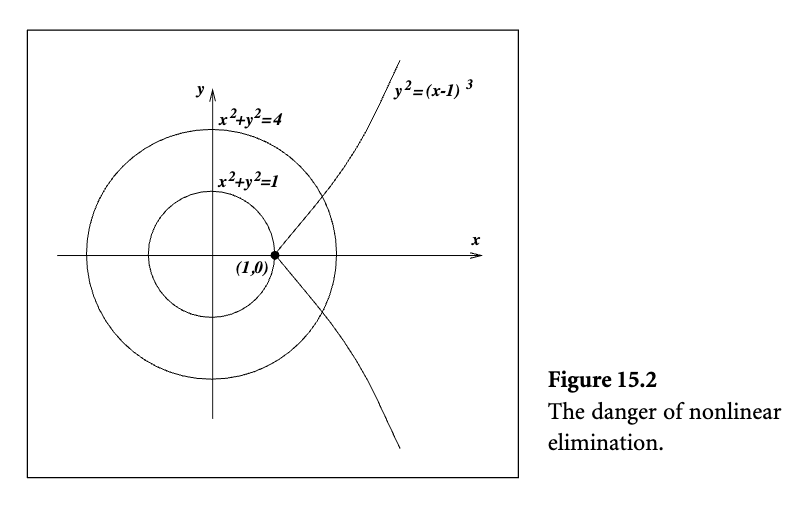</kbd>

<kbd>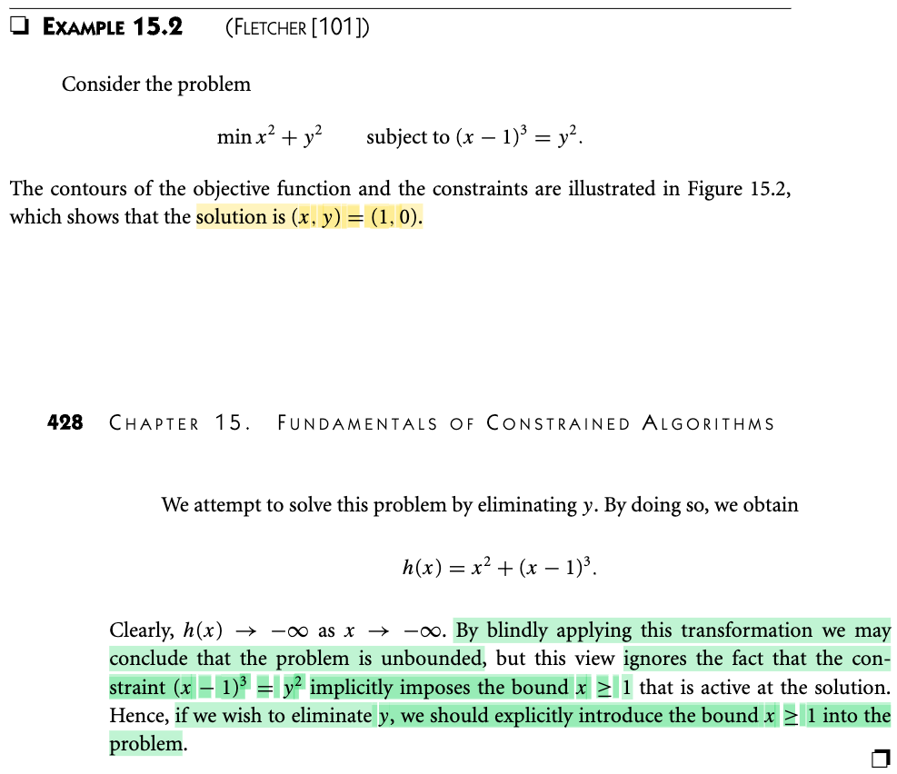</kbd>

<kbd>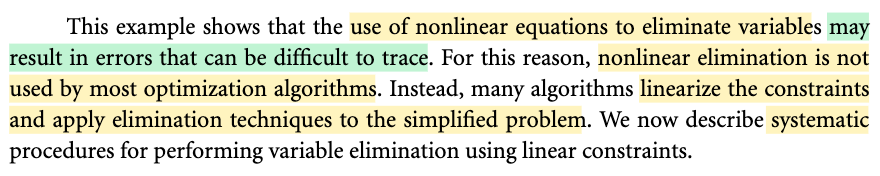</kbd>

> [!NOTE]
> Ví dụ này thì sẽ nguy hiểm nếu ko chú ý. Minimize x² + y², ràng buộc y² = (x-1)³, nhìn hình 15.2, dễ thấy nhiệm vụ là tìm điểm trên đường y² = (x-1)³ gần với gốc nhất (giảm thiểu x² + y²). Đó chính là (1,0).
>
>
>
> Nếu cắm cắm y² = (x-1)³ vào f(x), bài toán tối ưu mới ko ràng buộc sẽ là minimize x² + (x-1)³, lúc này, hàm objective sẽ unbounded below và do đó bài toán vô nghiệm. Bản chất là ta đã bỏ qua ràng buộc ngầm trong ràng buộc gốc: là x-1 ≥ 0. Nên nếu chuyển thành bài toán mới, phải đưa thêm ràng buộc này
>
>
>
> Cho nên trong thực tế người ta tránh dùng phương trình phi tuyến để bỏ bớt variable

> [!TIP]
> 🤖 **AI Check** — 🟢 Pass — ✅ **98/100** · ✓ Move on
>
> Ghi chú rất chuẩn xác, nắm bắt trọn vẹn bản chất hình học, lý do dẫn tới sai lầm khi khử biến phi tuyến (bỏ qua điều kiện ẩn y² ≥ 0) và kết luận thực tế.
>
> **✓ Strengths**
> - Hiểu chính xác ý nghĩa hình học của bài toán là tìm điểm trên đường cong gần gốc tọa độ nhất.
> - Chỉ ra đúng sai lầm cốt lõi khi khử biến phi tuyến: vô tình bỏ qua điều kiện ẩn x ≥ 1 xuất phát từ y² ≥ 0.
> - Rút ra kết luận thực tế chính xác về việc các thuật toán tối ưu tránh khử trực tiếp bằng phương trình phi tuyến.
>
> **💡 Deeper notes**
> - Trong thực tế, thay vì khử phi tuyến trực tiếp, các thuật toán tối ưu thường xấp xỉ tuyến tính hóa ràng buộc tại từng bước lặp rồi mới áp dụng kỹ thuật khử trên hệ tuyến tính đó.

 

#### Simple Elimination Using Linear Constraints

<kbd>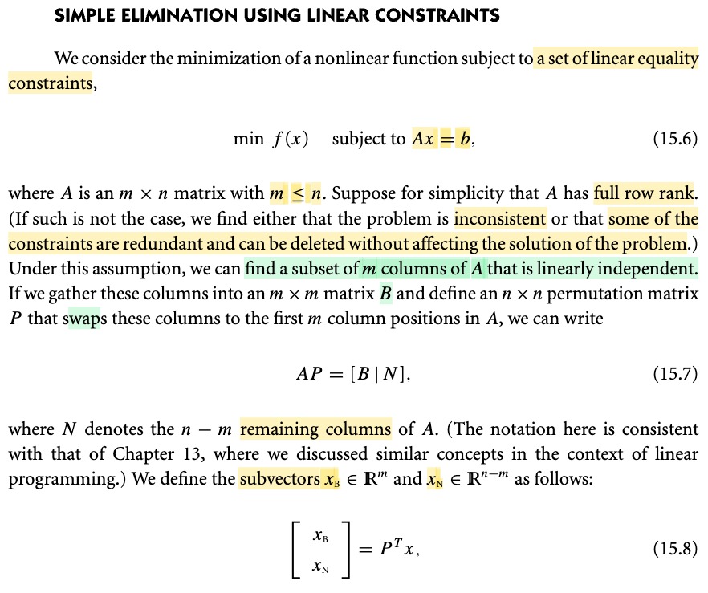</kbd>

<kbd>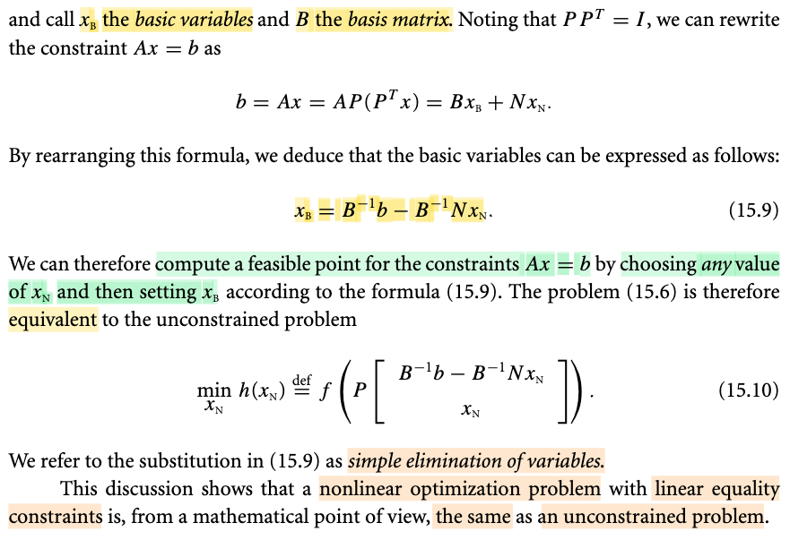</kbd>

> [!NOTE]
> Ở đây bắt đầu nói về cách giảm bớt biến thông qua dùng ràng buộc tuyến tính một cách có hệ thống, và đầu tiên là cách làm đơn giản.
>
>
>
> Bài toán là minimize f(x) với các ràng buộc tuyến tính: Ax = b, có thể hiểu là tập các ràng buộc: ci(x) = aiᵀx - bi = 0. i = 1,2,3...m
>
>
>
> Cho rằng A là matrix m × n. full row rank - tức các hàng độc lập tuyến tính, MIT 18.06 dạy mình: rank = m, và cũng sẽ có m cột độc lập.
>
>
>
> Tác giả nói thêm, nếu A không full row rank, thì tức là có hàng phụ thuộc thì khi đó có hai trường hợp có thể xảy ra:
>
>
>
> a) Hệ consistent: Khi b đã ∈ C(A), lúc này bỏ đi các hàng thừa để đưa về full row rank, thì nghiệm vẫn không đổi
>
>
>
> b) Hệ inconsistent: b ∉ C(A) bài toán infeasible (bỏ đi hàng thừa để đưa về full row rank sẽ giúp hệ có nghiệm nhưng bài toán đã thay đổi thành bài toán khác)
>
>
>
> Nên tóm lại, nếu A không full row rank thì một là hệ ràng buộc đã vô nghiệm, bài toán infeasible ngay từ đầu, hai là bài toán feasible, ta có thể bỏ đi hàng thừa để đưa về full row rank mà không làm thay đổi bài toán. Thành ra ta cứ giả định A full row rank.
>
>
>
> ---
>
>
>
> Tiếp, có n cột, có m cột độc lập, bằng cách dùng matrix hoán vị, ta chuyển lên đầu để đưa A thành \[B|N\]: AP = \[B|N\] (vì sao AP? → góc nhìn thứ 3 nhân hai matrix), N là matrix có các cột là các cột còn lại của A (n-m cột)
>
>
>
> Tiếp, vector biến x, trong Ax = b đóng vai trò vector các biến số của hệ phương trình, ta sẽ dùng P đổi thứ tự của chúng luôn: Pᵀx (vì sao Pᵀ, vì P dùng để hoán vị các cột của A, thì để hoán vị các "hàng" của x ta phải dùng Pᵀ, ví dụ p1 (cột 1 của P) đưa cột 3 của A lên trước thì p1ᵀ đưa x3 lên đầu.
>
>
>
> Và ta tách x mới này thành hai subvector x_B và x_N
>
>
>
> ---
>
>
>
> Ta mới viết thế này b = Ax = A 𝐈 x = APPᵀx 
>
>
>
> (do P là matrix hoán vị, cũng là orthogonal matrix, nên P⁻¹ = Pᵀ)
>
>
>
> ⇔ b = \[B|N\] \[x_B;x_N\]
>
>
>
> ⇔ b = Bx_B + Nx_N
>
>
>
> ⇔ b - Nx_N = Bx_B
>
>
>
> Do B full rank (matrix m × m, các cột độc lập) → invertible
>
>
>
> ⇔ B⁻¹(b - Nx_N) = x_B
>
>
>
> ⇔ B⁻¹b - B⁻¹Nx_N = x_B
>
>
>
> ⇔ x_B = B⁻¹b - B⁻¹Nx_N
>
>
>
> ---
>
>
>
> Ý nghĩa: x_B = B⁻¹b - B⁻¹Nx_N chính là phản ánh ràng buộc Ax = b,
>
>
>
> nên vector x = tạo bởi (concatenate) subvector xB=B⁻¹b - B⁻¹Nx_N và x_N, tức \[xB; xN\] với x_N bất kì, (sau đó chuyển lại thứ tự ban đầu bằng P) sẽ là vector x thỏa ràng buộc (feasible)
>
>
>
> nên bài toán minimize f(x) s.t Ax = b mang ý nghĩa đi kiếm vector x thỏa Ax=b sao cho minimize f(x) được chuyển thành bài toán không ràng buộc:
>
>
>
> minimize_xN f(P\[xB; xN\]) với xB = B⁻¹b - B⁻¹Nx_N
>
>
>
> ý nghĩa; tìm vector xN sao cho vector x minimize f(x).
>
>
>
> Đây gọi là cách giảm bớt biến tối ưu đơn giản

📹 [Xem video trên YouTube](https://www.youtube.com/watch?v=Gl4aCDchTAs)

> [!TIP]
> 🤖 **AI Check** — 🟢 Pass — ✅ **100/100** · ✓ Move on
>
> Ghi chú rất xuất sắc, hiểu sâu sắc bản chất đại số tuyến tính của phương pháp khử biến đơn giản và giải thích cặn kẽ từng bước biến đổi từ hoán vị đến chuyển bài toán có ràng buộc thành không ràng buộc.
>
> **✓ Strengths**
> - Hiểu rất rõ và giải thích cặn kẽ vai trò của ma trận hoán vị P và Pᵀ khi tác động lên cột của A và các phần tử của vector x.
> - Phân tích chính xác hai trường hợp khi ma trận A không có full row rank (hệ vô nghiệm vs hệ có ràng buộc dư thừa).
> - Từng bước đại số từ biểu diễn Ax = b đến rút x_B theo x_N và thế ngược vào hàm mục tiêu f(x) đều rất chuẩn xác và rõ ràng.
>
> **💡 Deeper notes**
> - Trong tính toán số thực tế, việc chọn m cột để tạo thành ma trận cơ sở B không chỉ cần độc lập tuyến tính thuần túy mà còn cần chọn sao cho B có điều kiện số tốt (well-conditioned) để tránh sai số số học lớn khi giải hệ hoặc nghịch đảo.

 

##### Example 15.3 Basis Matrix Partitioning

<kbd>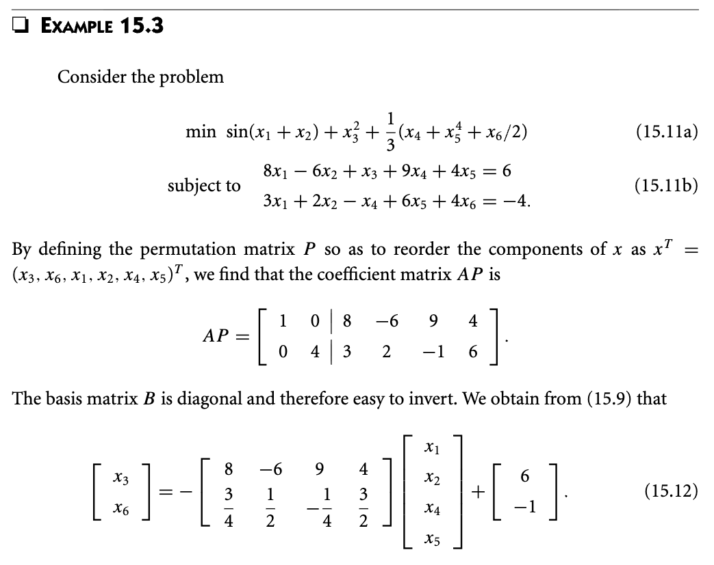</kbd>

<kbd>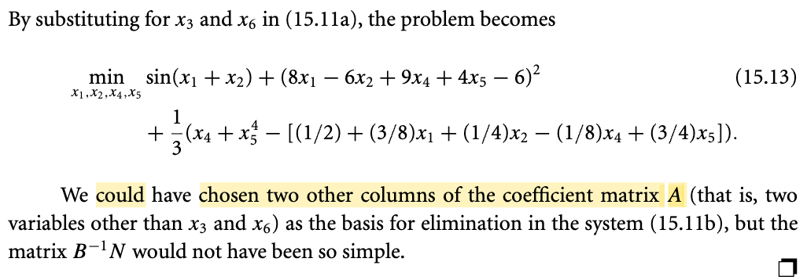</kbd>

<kbd>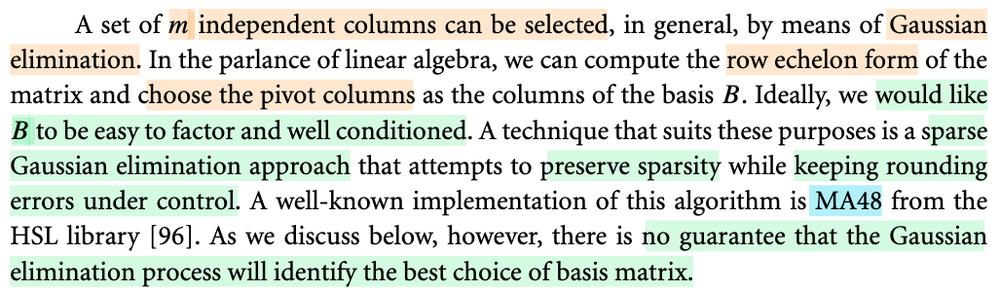</kbd>

> [!NOTE]
> Ví dụ minh cụ thể, cũng dễ hiểu, để ý là matrix A có 6 cột (vì x1,...x6).
>
>
>
> Họ chọn hai cột độc lập là cột 3 (1,0) và cột 6 (0,4) để cho tạo matrix B dễ tìm inverse, B⁻¹ chính là diagonal có đường chéo là 1 và 1/4. Chứ không có nghĩa là bắt buộc chọn hai cột này (không có nghĩa là chỉ có hai cột này mới làm thành 1 bộ độc lập)
>
>
>
> Đoạn dưới tác giả nói đại ý là để xác định các cột độc lập, thì một cách làm đó là khử Gauss. Cái này nhờ 1806 đã hiểu rồi, quá trình đưa A về row echelon form dùng các matrix E, khi đó ta có matrix U. Thì các bộ pivot column chính là bộ các cột độc lập.
>
>
>
> Tuy nhiên ông nói thêm, nếu lí tưởng, ta phải chọn sao cho B ko những dễ factor (ý nói để tìm nghịch đảo), và còn well conditioned nữa. Nên thuật toán khử Gauss mang tên MA48 có thể có được cái này, tuy vậy ko có gì đảm bảo khử Gauss sẽ cho ra một bộ basis tối ưu.

📹 Video 1: [Example 15.3 Basis Matrix Partitioning — Numerical Optimization_J.Nocedal](https://www.youtube.com/watch?v=s8-ZNFrCxvk)

📹 Video 2: [Tại sao chọn cột 3 và 6 để tìm B⁻¹ dễ nhất?](https://www.youtube.com/watch?v=63NedgBej6I)

> [!TIP]
> 🤖 **AI Check** — 🟢 Pass — ✅ **95/100** · ✓ Move on
>
> Ghi chú nắm rất chắc và chính xác nội dung của ví dụ cũng như phần lý thuyết mở rộng về việc chọn ma trận cơ sở $B$ bằng khử Gauss.
>
> **✓ Strengths**
> - Hiểu chính xác lý do chọn cột 3 và cột 6 để ma trận cơ sở $B$ có dạng đường chéo, giúp việc nghịch đảo trở nên đơn giản.
> - Liên hệ tốt với kiến thức đại số tuyến tính cơ bản (khử Gauss, dạng bậc thang dòng, pivot columns) để hiểu cách tìm tập cột độc lập tuyến tính tổng quát.
> - Nắm bắt đúng bản chất thực tế: cần cân bằng giữa tính thưa (dễ phân tích/dễ nghịch đảo) và số điều kiện tốt (well-conditioned), cũng như hiểu rằng khử Gauss không đảm bảo tìm ra nghiệm cơ sở tối ưu toàn cục.
>
> **💡 Deeper notes**
> - Về mặt thuật ngữ: MA48 thực chất là tên một gói phần mềm / thư viện triển khai (implementation) thuộc HSL, thuật toán cốt lõi là 'sparse Gaussian elimination' (khử Gauss thưa bảo toàn độ thưa và kiểm soát sai số làm tròn).

 

###### Null Space Basis Representation

<kbd>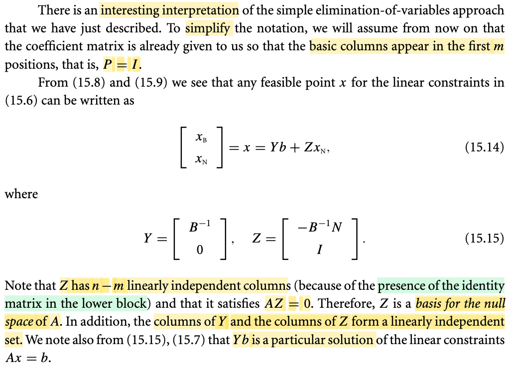</kbd>

> [!NOTE]
> Làm rõ vài điểm trong đây, đây là lúc 1806 phát huy tác dụng:
>
>
>
> Để cho đơn giản họ cho A có dạng \[B|N\] sẵn (các cột độc lập đã ở đầu, nên khỏi dùng P, hay cũng là P = I, tức là: "chẳng làm gì" cũng đã có dạng \[B|N\])
>
>
>
> ---
>
>
>
> Đặt Y = \[B⁻¹; 0\]; Z = \[-B⁻¹N; I\] thì \[xB;xN\] = x = Yb + ZxN. Là sao?
>
>
>
> Hiểu như sau: Khi ghi matrix U theo block \[U1;U2\] thì Ux = \[U1x;U2x\] thôi.
>
>
>
> Yb = \[B⁻¹; 0\]b = \[B⁻¹b; 0b\] = \[B⁻¹b; 0\] 
>
>
>
> ZxN = \[-B⁻¹N; I\]xN = \[-B⁻¹NxN; xN\]
>
>
>
> Yb + ZxN = \[B⁻¹b; 0\] + \[-B⁻¹NxN; xN\] = \[B⁻¹b-B⁻¹NxN; xN\] = \[xB; xN\] = x
>
>
>
> ---
>
>
>
> Tiếp, Z có n-m cột độc lập vì nó chứa I ở block dưới. Là sao? À thì vì có dạng đó, nên chắc chắc không thể nào dùng một vài cột này mà tạo ra cột kia được, do kiểu gì cũng dính số 0, nhân với bất kì số nào cũng thành 0, cái này giải thích trong video sẽ dễ thấy, nhưng cơ bản là nhờ học 1806 nên hiểu rồi, ví dụ \[1,0\]ᵀ không thể nhân với gì ra \[0,1\]ᵀ được và ngược lại, nên hai (vector) cột này độc lập.
>
>
>
> ---
>
>
>
> Và nó thỏa AZ = 0, vì sao? Vì AZ = A \[-B⁻¹N; I\] = \[B | N\] \[-B⁻¹N; I\]
>
>
>
> cứ làm như tích vô hướng hai vector = B (-B⁻¹N) + N I = - BB⁻¹N + N = - N + N = 0
>
>
>
> Và như vậy, A nhân với mọi vector cột của Z cũng bằng 0 (theo góc nhìn thứ 3 nhân hai matrix AB: cột j của (AB) là linear combination các cột của A với hệ số là phần tử cột j của B), nên các vector cột của Z chính là nullspace vector: N(A). Mà chúng lại độc lập. 
>
>
>
> Chú ý, nếu chỉ có nhiêu đó chưa đủ để kết luận basis của nullspace cần phải có thêm: đủ số lượng. À thì đủ vì Z có số cột bằng N, mà N tạo bởi các cột còn lại của A sau khi đã bứng một bộ cột độc lập đưa lên trước, nên có thể nói N tạo bởi các cột tự do. Thành ra số lượng của chúng chính là số chiều của nullspace. Vậy Z có đủ bộ vector độc lập của nullspace, nên tạo thành basis của nullspace.
>
>
>
> Hoặc có thể giải thích cách khác: A shape m × n, rank = m (full row rank), nên dim C(A) = dim C(Aᵀ) = r. Mà dim N(A) + dim C(Aᵀ) = n ⇒ dim N(A) = n - r = n - m. Nên để có basis của nullspace, cần n - m vector độc lập. Và quả thật, số cột của Z = số cột của N = n - m, và chúng độc lập, nên đây là basis của nullspace.
>
>
>
> ---
>
>
>
> Rồi vì sao các vector cột của Y và các vector cột của Z tạo một bộ độc lập tuyến tính?
>
>
>
> Gom Y với Z lại (thành 1 matrix) ta có \[Y|Z\], theo định nghĩa độc lập tuyến tính, nếu cách duy nhất tổ hợp tuyến tính các cột của matrix thành 0 là dùng bộ hệ số toàn 0, thì chúng là các vector độc lập tuyến tính:
>
>
>
> \[Y|Z\] x = \[Y|Z\] \[xY; xZ\] = \[\[B⁻¹; 0\] | \[-B⁻¹N; I\]\] \[xY; xZ\]
>
>
>
> Viết lại \[\[B⁻¹; 0\] | \[-B⁻¹N; I\]\] = \[\[B⁻¹|- B⁻¹N; \[0|I\]\]
>
>
>
> Xét phương trình \[Y|Z\] x
>
>
>
> ⇔ \[\[B⁻¹|- B⁻¹N; \[0|I\]\] \[xY; xZ\] = 0 
>
>
>
> ⇔ B⁻¹ xY - B⁻¹N xZ = 0 (a) và 0 xY + I xZ = 0 (b)
>
>
>
> Từ b suy ra xZ = 0, nên (a) ⇔ B⁻¹ xY = 0 ⇒ xY = 0 (do B,B⁻¹ đều full rank)
>
>
>
> Vậy các duy nhất để linearly combine các cột của \[Y|Z\] thành 0 là dùng bộ hệ số tổ hợp toàn 0, nên chúng độc lập.
>
>
>
> ---
>
>
>
> Cuối cùng, vì sao Yb là particular solution.
>
>
>
> Đơn giản là vì x = Yb sẽ thỏa Ax = b: AYb = A\[B⁻¹;0\]b = \[B|N\] \[B⁻¹;0\]b = \[BB⁻¹ + N0\] b = I b = b. Vậy nó thỏa Ax = b. Mà trong đstt đã học, cứ một nghiệm nào của Ax = b cũng gọi là particular solution, khi kết hợp với nullspace vector sẽ thành complete solution: x_complete = x_particular + z với z là nullspace vector.

📹 [Xem video trên YouTube](https://www.youtube.com/watch?v=-9nfMosuj58)

> [!TIP]
> 🤖 **AI Check** — 🟢 Pass — ✅ **100/100** · ✓ Move on
>
> Ghi chú xuất sắc! Bạn đã giải thích và chứng minh cặn kẽ từng khẳng định trong sách bằng các phép nhân ma trận khối và kiến thức đại số tuyến tính rất vững chắc.
>
> **✓ Strengths**
> - Khai triển chính xác phép nhân khối để chứng minh x = Yb + Zx_N và liên hệ đúng với biểu thức x_B = B⁻¹(b - Nx_N).
> - Chứng minh chặt chẽ tính độc lập tuyến tính của các cột trong ma trận ghép [Y | Z] bằng định nghĩa nghiệm duy nhất của hệ thuần nhất.
> - Giải thích chuẩn xác lý do Z là cơ sở của nullspace thông qua tích AZ = 0 kết hợp với định lý về số chiều (Rank-Nullity Theorem).
>
> **💡 Deeper notes**
> - Toàn bộ suy luận ngầm giả định ma trận ràng buộc A có rank đầy đủ theo hàng (rank = m), đảm bảo tồn tại khối B khả nghịch kích thước m x m.

 

