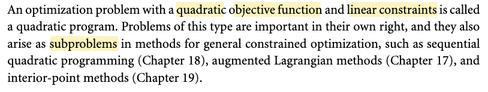
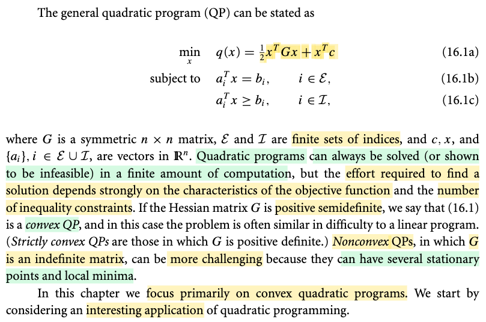
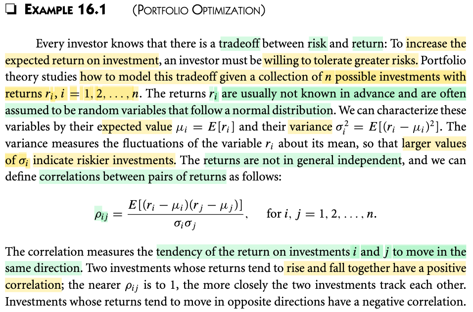
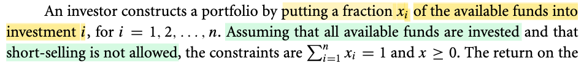
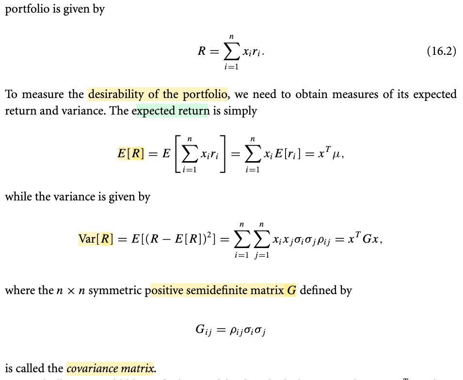
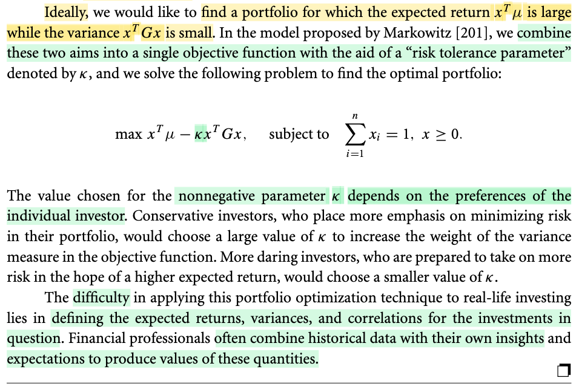

# 16.0 Quadratic Programming

📊 **Progress:** `3` Notes | `6` Screenshots | `3` AI Reviews

---

 

## Quadratic Programming Definition

<kbd></kbd>

<kbd></kbd>

> [!NOTE]
> Rồi, chương 16 là nói về quadratic programming. Thì đại ý, bài toán này là một cái bài toán tối ưu mà cái hàm objective, tức là hàm mục tiêu, nó là hàm bậc hai. Còn những cái ràng buộc là hàm tuyến tính, kể cả là ràng buộc bất đẳng thức hay là ràng buộc đẳng thức. Và đây là một cái bài toán khá là quan trọng, rất là quan trọng. Tác giả cho biết là nó quan trọng với tư cách là một bài toán riêng lẻ hoặc là nó đóng vai trò là một cái bài toán phụ trong những cái thuật toán khác, những thuật toán mà tối ưu ràng buộc khác. Ví dụ như là sequential quadratic programming, hay là augmented Lagrangian method, hay là interior-point method. 
>
>
>
> Tác giả mới cho mình xem cái dạng của một cái bài toán quadratic programming là như thế nào. 
>
>
>
> Thì mình thấy ở cái 16.1a đó, thì hàm mục tiêu của nó là một cái hàm bậc hai, đúng không? Với cái ma trận Hessian là ma trận G, và các cái ràng buộc nó đều là những hàm tuyến tính
>
>
>
> Thế thì tác giả cũng cho biết đó là cái quadratic program, tạm hiểu là có thể được giải với một cái số lượng hữu hạn các phép tính. Tuy nhiên, cái chuyện mà chi phí để mà giải bài toán này nó nhiều hay ít nó còn phụ thuộc vào cái đặc điểm của cái hàm mục tiêu cũng như là số lượng những cái bất đẳng thức, những cái ràng buộc bất đẳng thức. Nói thêm là nếu như mà cái ma trận Hessian, ma trận G mà nó có tính chất là bán xác định dương đó, thì khi này mình sẽ có được một cái gọi là convex quadratic programming. Và cái chi phí tính toán của bài toán này, cái độ khó đó, nó sẽ tương đương như một cái bài toán linear program.
>
>
>
> Còn nếu không, nếu như mà ma trận Hessian nó là ma trận không xác định, indefinite á, thì cái bài toán nó trở nên khó hơn. Thì trong chương này là mình phần lớn sẽ tập trung chủ yếu vào cái bài toán convex quadratic program.

> [!TIP]
> 🤖 **AI Check** — 🟢 Pass — ✅ **100/100** · ✓ Move on
>
> Ghi chú tóm tắt rất chính xác, mạch lạc và đầy đủ toàn bộ các ý cốt lõi trong đoạn văn bản gốc.
>
> **✓ Strengths**
> - Nắm vững định nghĩa Quadratic Program với hàm mục tiêu bậc hai và ràng buộc tuyến tính (cả đẳng thức lẫn bất đẳng thức).
> - Hiểu rõ vai trò của QP vừa là bài toán độc lập vừa là bài toán con trong SQP, Augmented Lagrangian và Interior-point methods.
> - Phân biệt chính xác giữa Convex QP (khi ma trận Hessian G là bán xác định dương, độ khó tương đương LP) và Nonconvex QP (khi G là ma trận không xác định - indefinite).
>
> **💡 Deeper notes**
> - Ở trường hợp Nonconvex QP (G là ma trận không xác định), lý do cốt lõi khiến bài toán trở nên khó khăn hơn là vì có thể tồn tại nhiều điểm dừng (stationary points) và cực tiểu địa phương (local minima). Ngoài ra, tài liệu gốc cũng nhấn mạnh QP luôn có thể giải được hoặc chỉ ra vô nghiệm (infeasible) trong hữu hạn bước tính toán.

 

### Example 16.1 Portfolio Optimization

<kbd></kbd>

> [!NOTE]
> Một ví dụ về bài toán đầu tư.
>
>
>
> Trong đầu tư thì luôn có trade off giữa ROI (tỉ suất lợi nhuận) và rủi ro.
>
>
>
> Gọi r1,r2,...rn là các tỉ suất lợi nhuận của các loại đầu tư khác nhau, thì chúng vốn dĩ là hàm chứa yếu tố uncertainty, nên ta mô hình chúng bởi các random variable có mean (expected value) E\[ri\] = μi và variance Var(ri) = σi². Và variance càng lớn thì chính là risk càng lớn.
>
>
>
> Ngoài ra các loại hình đầu tư có thể có tương quan nhau tức ri không độc lập, và ta dùng correlation ρij = E\[(ri-μi)(rj-μj)\]/σiσj để đo sự tương quan này. Như đã biết, khái niệm correlation, sẽ luôn nằm trong khoảng -1,1 (Stat110 đã học chứng minh vì sao) và nếu → 1 thì tương quan càng lớn, = 1 tức hai ri, rj y xì nhau, còn =-1 thì ri, rj trái ngược nhau.

> [!TIP]
> 🤖 **AI Check** — 🟡 Minor issues — ✅ **90/100** · ✓ Move on
>
> Ghi chú nắm rất tốt bản chất mô hình hóa bài toán đầu tư và các đại lượng thống kê (kỳ vọng, phương sai, tương quan). Cần lưu ý một chút về mặt toán học khi diễn giải ý nghĩa của hệ số tương quan bằng 1.
>
> **🟡 Minor issues**
>
> **1.** *"= 1 tức hai ri, rj y xì nhau"*
>
> Về mặt toán học, ρ = 1 chỉ mang nghĩa tồn tại quan hệ tuyến tính hoàn hảo cùng chiều (rj = a·ri + b với a > 0), tức chúng biến động đồng điệu hoàn hảo chứ không nhất thiết hai biến ngẫu nhiên phải giống hệt nhau về giá trị (ri = rj).
>
>
> **✓ Strengths**
> - Hiểu rõ trade-off cơ bản giữa lợi nhuận kỳ vọng và rủi ro trong danh mục đầu tư.
> - Mô hình hóa chính xác các biến ngẫu nhiên, công thức kỳ vọng, phương sai và hệ số tương quan theo tài liệu.
>
> **💡 Deeper notes**
> - Tài liệu gốc có lưu ý thêm giả định lợi nhuận r_i thường được xem là các biến ngẫu nhiên tuân theo phân phối chuẩn (normal distribution).
> - Khi ρ_ij = 0, hai biến không tương quan tuyến tính; tuy nhiên chỉ khi có giả định phân phối chuẩn nhiều chiều thì không tương quan mới tương đương với độc lập.

 

#### Portfolio Investment Constraints

<kbd></kbd>

<kbd></kbd>

<kbd></kbd>

> [!NOTE]
> Tiếp, một nhà đầu tư đặt tiền đầu tư vào các kênh r1,..rn với tỉ lệ x1,x2,...xn. Khi đó R = Σi xi ri sẽ là tỉ suất sinh lời tính trên mọi kênh đầu tư và sau khi đã bố trí tỉ lệ vốn đầu tư.
>
>
>
> Dĩ nhiên nó vẫn là rv. Nên E\[R\] là kì vọng của rate of return, dùng tính linearity, = Σi xi E\[ri\]
>
>
>
> Phương sai, Var(R) sẽ đo độ biến động của R:
>
>
>
> Var(R) = Var\[Σi xiri\]
>
>
>
> ---
>
>
>
> Dùng tính chất Var(X1+X2+..Xn) = Σi Var(Xi) + Σi≠j Cov(Xi,Xj)
>
>
>
> Và dùng tính chất Cov(cX, Y) = cCov(X,Y) ⇒ Cov(cX, dY) = cCov(X,dY) = cdCov(X,Y)
>
>
>
> Var(cX) = c² Var(X)
>
>
>
> ---
>
>
>
> Var(R) = Var\[Σi xiri\] = Σi Var(xiri) + Σij,i≠j Cov(xiri, xjrj)
>
>
>
> = Σi xi² Var(ri) + Σij,i≠j Cov(xiri, xjrj)
>
>
>
> = Σi xi² Var(ri) + Σij,i≠j xixjCov(ri, rj)
>
>
>
> Dùng tiếp định nghĩa Corr(X,Y) = Cov(X,Y)/\[STD(X)STD(Y)\] (xem link) nên Corr(ri, rj) = Cov(ri, rj) / \[STD(ri)STD(rj)\] ⇒ Cov(ri, rj)= Corr(ri, rj) \[STD(ri)STD(rj)\] = ρij σiσj
>
>
>
> = Σi xi² σi² + Σij,i≠j xixj ρij σiσj
>
>
>
> = Σij,i=j xixj × 1 × σiσj + Σij,i≠j xixj × ρij × σiσj
>
>
>
> = Σi Σj,i=j xixj × 1 × σiσj + Σi Σj,i≠j xixj × ρij × σiσj
>
>
>
> = Σi \[Σj,i=j xixj × 1 × σiσj + Σj,i≠j xixj × ρij × σiσj\]
>
>
>
> = Σi \[Σj xixj × ρij × σiσj\]
>
>
>
> = Σi Σj xixj σiσj ρij
>
>
>
> Giờ xem thử vì sao cái này lại là xᵀGx.
>
>
>
> = Σi xi (Σj xj σiσj ρij)
>
>
>
> = xᵀ u với u = \[Σj xj σ1σj ρ1j, Σj xj σ2σj ρ2j,...\]ᵀ
>
>
>
> Xét u = \[Σj xj σ1σj ρ1j, Σj xj σ2σj ρ2j,...\]ᵀ
>
>
>
> Σj xj σ1σj ρ1j = dot product của x với \[σ1σ1 ρ11, σ1σ2 ρ12,...\]ᵀ
>
>
>
> Σj xj σ2σj ρ2j = dot product của x với \[σ2σ1 ρ21, σ2σ2 ρ22,...\]ᵀ
>
>
>
> ...
>
>
>
> Đặt G là matrix có các hàng là \[σ1σ1 ρ11, σ1σ2 ρ12,...\], \[σ2σ1 ρ21, σ2σ2 ρ22,...\],...
>
>
>
> thì u = G x
>
>
>
> nên kết quả trên chính là xᵀGx
>
>
>
> Với Gij = σiσj ρij = Cov(ri,rj)
>
>
>
> Do đó đây chính là Covariance matrix
>
>
>
> ---
>
>
>
> Và bài toán tối ưu đặt ra là maximize over x objective là tích hợp hai mục tiêu: maximize return + minimize risk:
>
>
>
> maximize_x Σi xiE\[ri\] - κ xᵀGx = xᵀμ- κ xᵀGx s.t Σi xi = 1, x ≥ 0 (do xi là tỉ lệ phân bổ vốn)
>
>
>
> (μ là vector các E\[ri\])
>
>
>
> trong đó κ là tham số để thay đổi tương quan giữa maximize return và minimize risk

📹 [Xem video trên YouTube](https://www.youtube.com/watch?v=t6pKTKzIX_o)

> [!TIP]
> 🤖 **AI Check** — 🟢 Pass — ✅ **100/100** · ✓ Move on
>
> Ghi chú rất xuất sắc, bạn đã tự mình chứng minh chi tiết từng bước công thức phương sai danh mục từ dạng tổng đại số sang dạng toàn phương ma trận xᵀGx một cách mạch lạc và chính xác.
>
> **✓ Strengths**
> - Khai triển và biến đổi chi tiết từ tính chất của hiệp phương sai, hệ số tương quan để đưa phương sai danh mục về dạng tổng kép sum_i sum_j x_i x_j sigma_i sigma_j rho_ij rất chuẩn xác.
> - Chuyển đổi thành công và trực quan từ dạng tổng vô hướng sang dạng đại số tuyến tính xᵀGx bằng cách nhóm thành vector u = Gx.
> - Nắm vững mô hình tối ưu hóa Markowitz cùng các ràng buộc về tổng tỉ trọng vốn và cấm bán khống (short-selling).
>
> **💡 Deeper notes**
> - Ma trận hiệp phương sai G là ma trận đối xứng bán xác định dương (positive semidefinite), điều này đảm bảo xᵀGx >= 0 với mọi x và làm cho bài toán tối ưu trở thành bài toán quy hoạch lồi (convex optimization / concave maximization) có cực trị toàn cục.
> - Tham số kappa >= 0 thường được gọi là hệ số ngại rủi ro (risk aversion parameter); kappa càng lớn tương ứng với nhà đầu tư càng thận trọng (phạt nặng phần phương sai rủi ro).

**🔗 See also:** [linked note *(STAT110_Havard)*](../stat110_havard/lec_21_covariance_correlation.md#node-v6hjfkl) · [linked note *(STAT110_Havard)*](../stat110_havard/lec_21_covariance_correlation.md#node-9v77cx4) · [linked note *(STAT110_Havard)*](../stat110_havard/lec_21_covariance_correlation.md#node-pzissvb)

 

