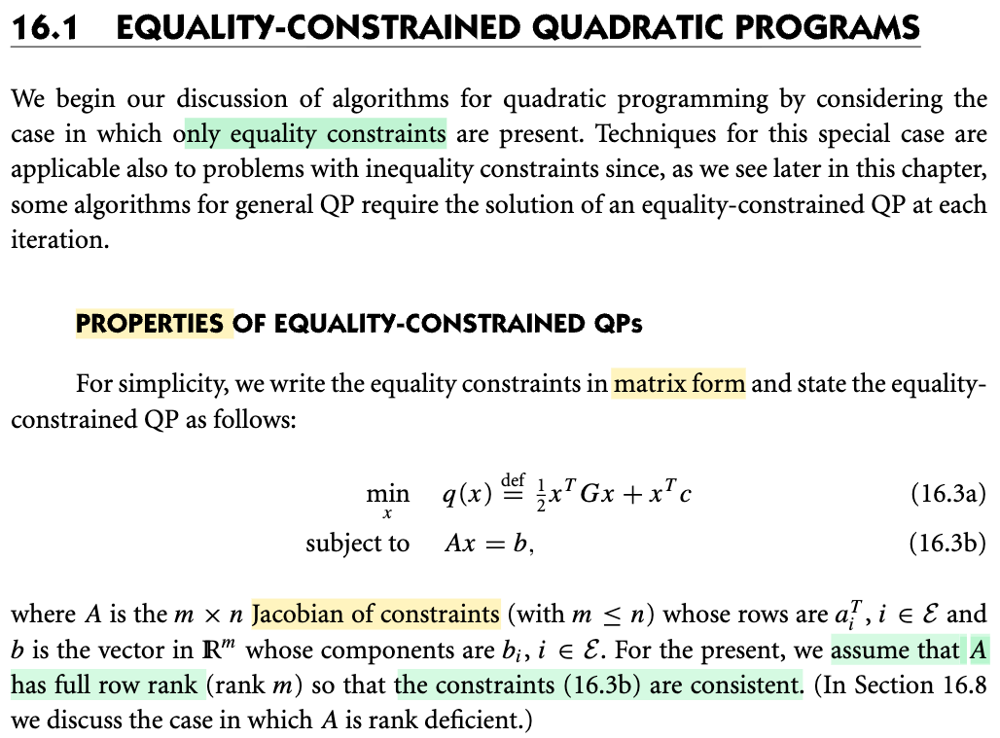
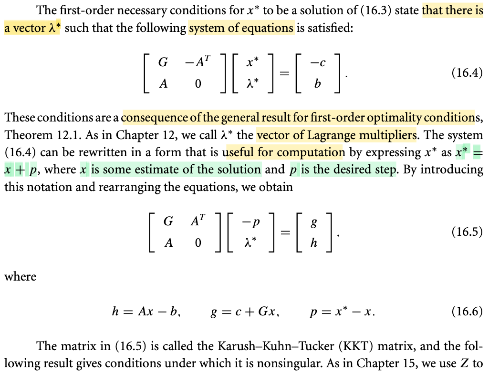

# 16.1 Equality-constrained Quadratic Programs

📊 **Progress:** `2` Notes | `2` Screenshots | `2` AI Reviews

---

 

## Equality-Constrained Quadratic Programs

<kbd></kbd>

> [!NOTE]
> Đầu tiên, ta sẽ chỉ xét bài toán QP có ràng buộc đẳng thức, vì kĩ thuật để giải bài toán dạng này sẽ áp dụng cho cả bài toán QP có tổng quát.
>
>
>
> Bài toán là: minimize q(x) = (1/2)xᵀGx + xᵀc s.t Ax = b.
>
>
>
> Vài điểm có thể làm rõ:
>
>
>
> Vì sao gọi là A là Jacobian: Hiểu như vầy: vế trái là hàm vector - vector g(x) = Ax, nên và dễ thấy d/dx g(x) chính là A, nên A là Jacobian, tức matrix đạo hàm cấp 1 là đúng rồi.
>
>
>
> dg = g(x+dx) - g(x) = A(x+dx) - Ax = Ax + Adx - Ax = Adx, là một linear operator act on dx, nên A chính là Jacobian matrix.
>
>
>
> Vì sao giả định matrix A full row rank thì Ax=b có nghiệm (consistent)?
>
>
>
> Dùng kiến thức đại số tuyến tính đã học từ 18.06:
>
>
>
> Để hệ có nghiệm thì cần b ∈ column space C(A). Nếu A full row rank, tức là mọi row vector đều độc lập, và như vậy cũng sẽ có m cột độc lập, rank sẽ = m ≤ n. Mà A có với m ≤ n, như vậy xét các vector cột, là các R^m vector, thì trong n cột, sẽ có m cột độc lập, đủ tạo một basis của R^m, nên b luôn ∈ C(A) giúp kết luận Ax=b luôn có ít nhất một nghiệm.

📹 [Xem video trên YouTube](https://www.youtube.com/watch?v=SyvGCGAjrtQ)

> [!TIP]
> 🤖 **AI Check** — 🟢 Pass — ✅ **100/100** · ✓ Move on
>
> Ghi chú rất tốt, giải thích chính xác và trực quan tại sao A là ma trận Jacobian và tại sao điều kiện full row rank đảm bảo hệ Ax = b luôn có nghiệm (consistent).
>
> **✓ Strengths**
> - Giải thích chính xác bản chất Jacobian của hàm ràng buộc tuyến tính g(x) = Ax.
> - Lập luận chặt chẽ bằng đại số tuyến tính: rank(A) = m nghĩa là không gian cột C(A) phủ toàn bộ không gian R^m, do đó luôn chứa b với mọi b thuộc R^m.
>
> **💡 Deeper notes**
> - Trong bài toán QP tiêu chuẩn, ma trận G thường được giả định là đối xứng (vì nếu không đối xứng ta luôn có thể thay bằng (G + Gᵀ)/2 mà không đổi giá trị hàm mục tiêu).

 

### Karush-Kuhn-Tucker Matrix Formulation

<kbd></kbd>

> [!NOTE]
> Với bài toán QP:
>
>
>
> Lagrangian: ℒ(x, λ) = f(x) + λᵀc(x)
>
>
>
> = xᵀGx + xᵀc + λᵀ(Ax-b)
>
>
>
> = xᵀGx + xᵀc + λᵀAx - λᵀb
>
>
>
> = xᵀGx + (c + Aᵀλ)ᵀx - λᵀb
>
>
>
> ∇\_x ℒ(x, λ) = Gᵀx + c + Aᵀλ
>
>
>
> Stationary condition ∇\_x ℒ(x\*, λ\*) = 0
>
>
>
> ⇔ Gᵀx\* + c + Aᵀλ\* = 0 ⇔ Gᵀx\* + Aᵀλ\* = -c
>
>
>
> Cùng với Ax\* = b, ta thể hiện ở dạng matrix 16.4

> [!TIP]
> 🤖 **AI Check** — 🟢 Pass — ⚠️ **75/100** · ✓ Move on
>
> Ghi chú nhận diện chính xác hàng đầu tiên của hệ phương trình KKT chính là điều kiện dừng (stationarity condition) của hàm Lagrangian, nhưng chưa đề cập đến điều kiện chấp nhận được nguyên thủy (primal feasibility).
>
> **✓ Strengths**
> - Nhận diện đúng bản chất của hàng phương trình đầu tiên trong hệ KKT chính là điều kiện dừng của hàm Lagrangian theo biến x.
>
> **💡 Deeper notes**
> - Hệ phương trình (16.4) gồm hai phần: hàng trên là điều kiện dừng $\nabla_x \mathcal{L}(x^*, \lambda^*) = Gx^* + c - A^T\lambda^* = 0$, và hàng dưới là điều kiện ràng buộc nguyên thủy $Ax^* = b$.

 

