# 2.2 Funds of Unconstrained Optim - Overview of Algorithms

📊 **Progress:** `24` Notes | `35` Screenshots | `20` AI Reviews

---

> [!NOTE]
> Overview of Algorithms

 

## Tổng quan thuật toán tối ưu

<kbd>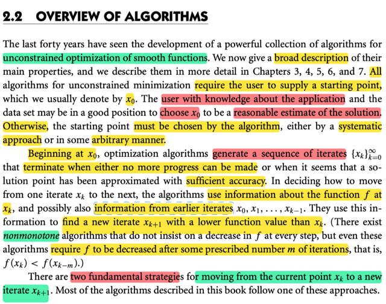</kbd>

> [!NOTE]
> gs nói về cái nhìn tổng quan của thuật toán tối ưu ko ràng buộc. Ta sẽ phải có điểm ban đầu x0, và thuật toán sẽ generate chuỗi điểm x(1),x(2)...cho đến khi dừng là khi ta ko tiến triển thêm nữa (hàm f ko giảm nữa) hoặc khi solution đã xấp xỉ gần đúng được optimal với mức độ chính xác chấp nhận được.
>
> x0 thì có thể được chọn bởi kinh nghiệm trong ngành. 
>
> Hoặc cũng có thể do thuật toán tạo ra một cách tùy tiện hoặc có phương pháp đàng hoàng.
>
> tại mỗi điểm x(k), thuật toán sẽ dùng thông tin tại đó để mà generate điểm kế tiếp, sao cho hàm f giảm. Nhưng cũng có dạng nonmonotone, khi có thể sau mỗi bước không giảm f liên tục nhưng đều phải giảm f sau một số bước nào đó.
>
> nói chung mấy cái này đều biết cả rồi.

> [!TIP]
> 🤖 **AI Check** — 🟢 Pass — ⚠️ **88/100** · ✓ Move on
>
> Bài ghi rất chính xác và bao quát được nhiều ý chính quan trọng về thuật toán tối ưu. Để hoàn thiện hơn, bạn có thể bổ sung thêm việc thuật toán dùng thông tin từ các điểm lặp trước đó để tìm điểm tiếp theo và hai chiến lược cơ bản để chuyển từ điểm hiện tại sang điểm mới.

 

### Chiến lược Line Search

<kbd>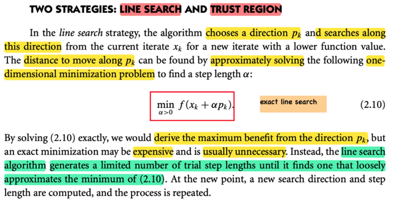</kbd>

> [!NOTE]
> Thế thì giáo sư cho biết có hai chiến lược chính để di chuyển: Line search và Trust region
>
> Với line search thì đã biết rồi, thuật toán sẽ chọn một hướng p_k, (có thể ý nói là descent direction), và tìm theo hướng này giúp đến một điểmthấp hơn
>
> Và bước đi dài bao nhiêu có thể được giải một cách chính xác bằng cách giải bài toán tối ưu hàm đơn biến: minimize α > 0: f(x_k + α p_k) (đây chính là exact line search trong Convex Optimization)
>
> Thì dĩ nhiên nếu giải bài toán này thì ta có bước đi tối ưu theo hướng p_k, nhưng thường là ko cần thiết vì việc giải bài toán này tăng chi phí.
>
> Thay vào đó thuật toán có thể dùng cách khác, tạo các step length cho đến khi tìm được một cái có thể gần gần với cái minimum của bài toán tối ưu
>
> (có thể gs đang nói về backtracking line search)
>
> Rồi sau đó, lại lặp lại, tìm p_(k+1) và search theo hướng đó để tìm x_(k+2)

> [!TIP]
> 🤖 **AI Check** — 🟡 Minor issues — ⚠️ **75/100** · ✓ Move on
>
> Bài làm của bạn đã nắm bắt được hầu hết các điểm chính và có chiều sâu tốt, đặc biệt là việc liên hệ với các thuật toán cụ thể. Tuy nhiên, cần lưu ý rằng trong chiến lược line search, bước tìm độ dài alpha thường được giải quyết một cách gần đúng để tối ưu hóa hiệu quả, chứ không phải luôn chính xác như đã nêu ban đầu.

 

#### Chiến lược Trust Region

<kbd>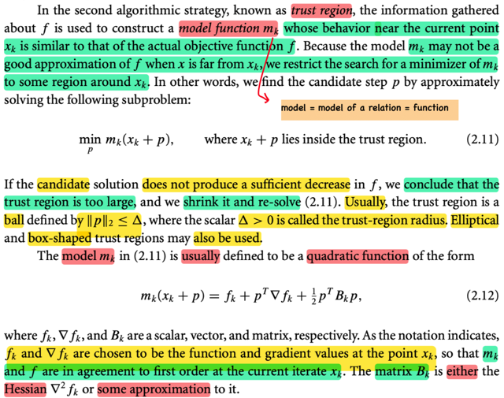</kbd>

> [!NOTE]
> Chiến lược thứ hai là TRUST REGION. 
>
> Đại khái là ta sẽ dùng thông tins  về hàm f mà ta có được tại x_k (f, hay gradient, hay Hessian tại x_k) để xây dựng một mô hình m_k sao cho nó hành xử giống hàm f nếu giới hạn trong phạm vi lân cận x_k 
>
> (Mô hình, chữ này có nghĩa là ta mô hình, mô phỏng một quan hệ thực tế define bởi hàm f, nên nói ta xây dựng mô hình m_k thì ý là **xây dựng hàm m_k sao cho m_k(x) hành xử giống hàm f(x)**)
>
> Và vì **nó chỉ hành xử giống f tại vùng lân cận x_k, nên ta mới giới hạn nó trong một trust region**
>
> Khi đó ta sẽ giải bài toán **minimize p m_k(x_k + p) với ràng buộc x_k + p nằm trong trust region, để tìm p**.
>
> (rất dễ hiểu, bằng cách xây dựng mô phỏng của f khiến nó có thể bắt chước được f nếu xét quanh vùng gần x_k, thì ta có thể dùng nó để tìm p giúp đi từ x_k đến x_(k+1)  = 𝐱_k + p.Vì sao phải dùng m_k, thì vì m_k thường sẽ đơn giản hơn là f)
>
> Thế thì nếu như giải bài toán này *tìm thấy p khiến f ko giảm bao nhiêu, thì ta kết luận là trust region quá lớn** mà nguyên nhân là do khi đó *vì t.r quá lớn nên m_k ko còn hành xử giống f nữa**, nên ko dùng m_k để thay f được) 
>
> Khi đó ta sẽ *thu nhỏ trust region lại, và giải lại, và đến lúc nào đó với trust region nhỏ đủ thì m_k nhất định sẽ hành xử giống f, khi đó giải ra p sẽ giúp có thể thực hiện bước đi giảm f*
>
> Mình nghĩ: có cái gì đó rất đẹp ở đây: m_k giống như kẻ đóng thế của f, có thể làm tốt khi bảo nó làm những việc nhỏ thôi, khi đó, nếu ta chia nhỏ công việc ra thì hoàn toàn có thể m_k mô phỏng được f.
>
> Trust region thường là ball / hình như vòng tròn trong bivariate case, define bởi : 
>
> ||p|| ≤ Δ với Δ là bán kính 
>
> Và mô hình m_k thường được chọn là quadratic function (nhớ nhé, mô hình, là mô hình để mô phỏng lại f, nên là function)
>
> m_k(x_k + p) = f_k + pT ∇f_k + (1/2) pT B_k p
>
> f_k, ∇f_k thì là hàm f và gradient tại x_k rồi,
>
> còn B_k có thể dùng Hessian ∇^2 f(x_k) hoặc dùng một xấp xỉ của nó

> [!TIP]
> 🤖 **AI Check** — 🟢 Pass — ✅ **98/100** · ✓ Move on
>
> Bài ghi chép này cực kỳ chính xác và chi tiết, giải thích sâu sắc về phương pháp trust region, từ việc xây dựng mô hình m_k đến cách điều chỉnh vùng tin cậy. Cách diễn giải bằng ví dụ "m_k như kẻ đóng thế của f" cùng với việc giải thích lý do ẩn sau các bước cho thấy sự nắm bắt vấn đề vượt trội.

**🔗 See also:** [Steepest Descent trong Trust Region](#node-fzsjy59)

 

##### Vùng tin cậy: Bước và hướng

<kbd>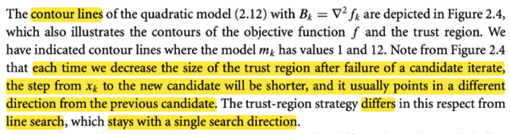</kbd>

<kbd>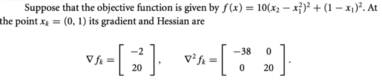</kbd>

<kbd>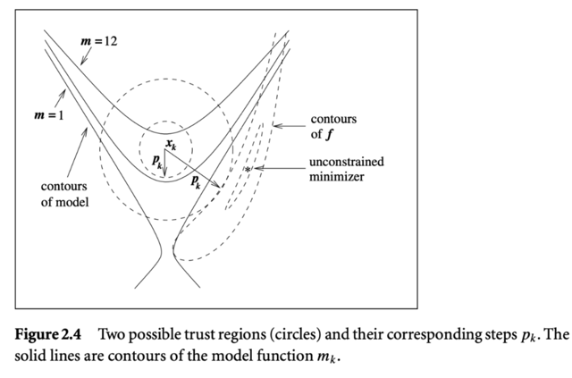</kbd>

<kbd>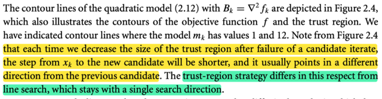</kbd>

> [!NOTE]
> Một minh họa
>
> QUAY LẠI XEM KĨ SAU

> [!TIP]
> 🤖 **AI Check** — 🔴 Critical issues — ❌ **25/100** · ✗ Fix first
>
> Bạn đã nhận diện đúng đây là một minh họa và có ý thức quay lại xem kỹ hơn, điều này rất tốt cho việc học. Để ghi chú hiệu quả hơn, hãy cố gắng trích xuất các ý chính như ý nghĩa của đường đồng mức, vùng tin cậy hoặc sự khác biệt với tìm kiếm đường thẳng.

 

###### Line Search và Trust Region

<kbd>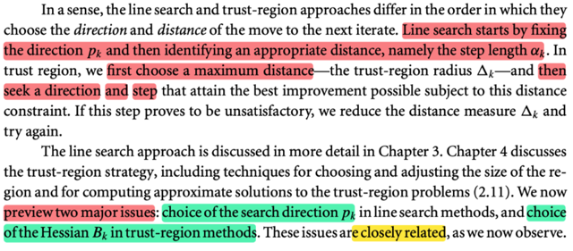</kbd>

> [!NOTE]
> Đại ý là, line search và trust region khác nhau cơ bản ở:
>
> Line search **chọn một hướng p_k**, và **tìm bước đi** phù hợp theo hướng đó.
>
> Trust region **chọn một bán kính**, sau đó **tìm p_k và step**. Nếu không giảm đủ thì thu nhỏ bán kính và làm lại.
>
> Vậy thì chap 3,4 sẽ bàn sâu về hai cái này,  nhưng trước hết ta sẽ tìm hiểu hai bước quan trọng trong hai cái này:
>
> **Chọn search direction p_k trong line search** và **chọn Hessian B_k của mô hình m_k trong trust region method**

> [!TIP]
> 🤖 **AI Check** — 🟢 Pass — ✅ **97/100** · ✓ Move on
>
> Ghi chú tóm tắt rất hiệu quả sự khác biệt cốt lõi giữa hai phương pháp và xác định chính xác các vấn đề chính sẽ được thảo luận. Để sâu sắc hơn, bạn có thể bổ sung chi tiết rằng hai vấn đề chính (lựa chọn hướng tìm kiếm và Hessian) có "liên quan chặt chẽ" với nhau.

 

###### Hướng dốc nhất và Taylor

<kbd>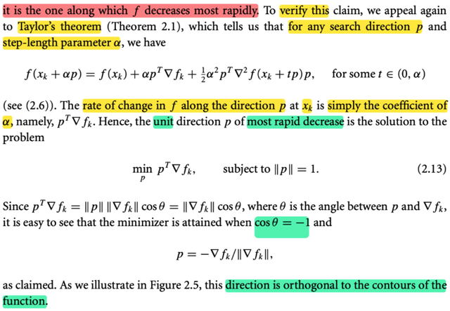</kbd>

<kbd>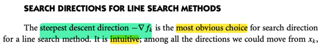</kbd>

<kbd>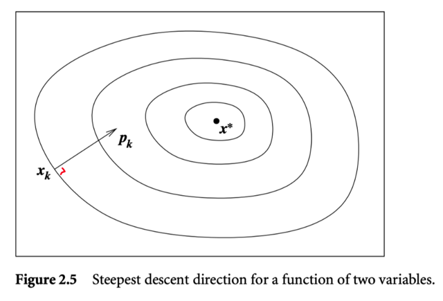</kbd>

> [!NOTE]
> Bàn về chọn p_k của line search, gs cho rằng cách dể hiểu nhất, hợp lí nhất là chọn hướng dốc nhất, chính là - ∇f_k (tức gradient -∇f(x)|x = x_k)
>
> Và dùng Taylor theorem ta có thể chứng minh điều này (cũng không hiểu sao phải viện dẫn Taylor theorem, vì ta đã biết directional derivative theo hướng p evaluate tại x_k sẽ là ∇f_k Tp, và nó cũng chính là độ dốc của hàm xét theo hướng p, nếu muốn xét p nào có độ dốc lớn nhất, ta sẽ so các p có length bằng 1, tức giải bài toán: 
>
> minimize p ∇f_k Tp subject to ||p|| = 1 thì lập luận tiếp như sách để có p = -∇f_k / ||∇f_k||
>
> Có thể gs viện Taylor theorem để chỉ ra rằng ∇f_k Tp chính là độ dốc của hàm f theo hướng p tại x_k (là thứ mà mình nói "ta đã biết" ở trên).
>
> Ôn lại Taylor theorem: Nói rằng:
>
> Khi đi từ a → b, thì f(b) = f(a) + ∇f(a)T(b-a) + (1/2) (b-a)T ∇^2 f(c) (b-a) với some c in (a, b) 
>
> Cũng là áp dụng ở đây:
>
> f(x_k + αp) = f(x_k) + ∇f_k T(αp) + (1/2) (αp)T ∇f(c) αp với some c in (x_k, x_k + αp)
>
> tương đương: 
>
> f(x_k + αp) = f(x_k) + ∇f_k T(αp) + (1/2) (αp)T ∇f(x_k + tαp) αp với some t in (0,1)
>
> tương đương
>
> f(x_k + αp) = f(x_k) + ∇f_k T(αp) + (1/2) (αp)T ∇f(x_k + tp) αp với some t in (0, α)
>
> viết lại chút:
>
> f(x_k + αp) = f(x_k) + α ∇f_k Tp + (1/2) (α)^2 pT ∇f(x_k + tp) p với some t in (0, α)
>
> Và như vậy, tương đương tiếp:
>
> [f(x_k + αp) - f(x_k)] / α = ∇f_k Tp + (1/2) α pT ∇f(x_k + tp) p
>
> Lấy lim α → 0:
>
> thì vế trái là lim α → 0 [f(x_k + αp) - f(x_k)] / α, nó chính là đạo hàm theo hướng p, directional derivative, cũng là rate of change theo hướng p của hàm f tại x_k
>
> Còn vế phải sẽ là lim α → 0 ∇f_k Tp + (1/2) α pT ∇f(xk + tp) p = ∇f_k Tp
>
> Nói chung, có thể coi như giáo sư đã liên hệ định nghĩa directional derivative với Taylor theorem
>
> Và p_k như vầy sẽ luôn vuông góc với contour (level set): Đã học trong mit 1802, nhưng ở đây Taylor theorem cho ta thấy luôn:
>
> xét d là hướng tiếp tuyến với level curve của f tại x_k
>
> khi đó lim α → 0 [f(x_k + αd) - f(x_k)] / α là độ dốc của hàm theo hướng tiếp tuyến với level curve, mà đi theo level curve thì f ko đổi, nên độ dốc này bằng 0.
>
> nên ta có vế trái = 0,
>
> còn vế phải là ∇f_k Td như trên. Vậy ∇f_k vuông góc d và dĩ nhiên cũng - ∇fk cũng vậy 
>
> ⇨  steepest direction pk = - ∇f_k sẽ vuông góc với level curve

> [!TIP]
> 🤖 **AI Check** — 🟢 Pass — ✅ **98/100** · ✓ Move on
>
> Bản phân tích rất sâu sắc và chính xác, giải thích chi tiết việc sử dụng Định lý Taylor để chứng minh tốc độ thay đổi và lý do hướng dốc nhất vuông góc với đường đồng mức, làm rõ những điểm mà hình ảnh chỉ đề cập vắn tắt.

**🔗 See also:** [Hướng Newton qua xấp xỉ Taylor](#node-wqcshqx)

 

###### Steepest descent và bước nhảy

<kbd>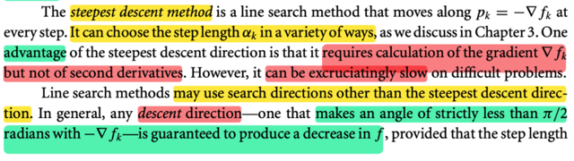</kbd>

<kbd>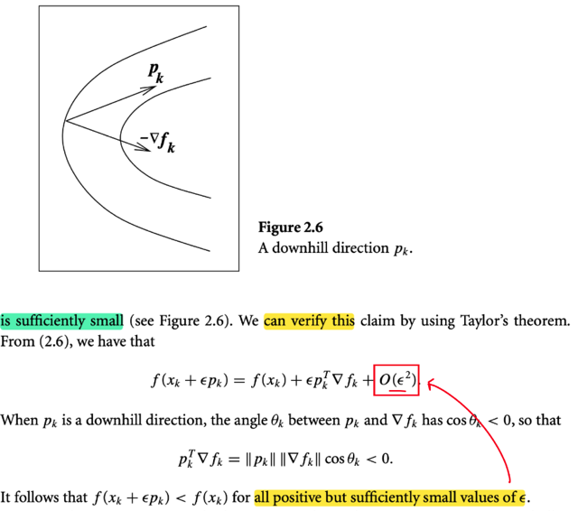</kbd>

> [!NOTE]
> Đại khái là, trong line search, dùng steepest descent có một ưu điểm là **chỉ phải tính gradient mà không cần Hessian**
>
> Tuy nhiên nó có thể **rất chậm nếu gặp bài toán khó**.
>
> Và line search cũng có thể dùng search direction khác ko nhất thiết -∇f.
>
> Đó là bất kì hướng nào có góc tù với gradient, và miễn sao là giữ cho step size nhỏ đủ thì đều có thể chắc giảm được f khi đi theo hướng đó.
>
> Mình nghĩ: Tại sao lúc này lại nói về việc phải giữ step size đủ nhỏ, bộ khi dùng steepest descent thì không cần hay sao?
>
> Không phải vậy, mà là đây sẽ là lập luận chứng minh chỉ cần đi theo hướng có góc tù với gradient và sải bước đủ nhỏ thì hướng nào cũng sẽ giảm f. Trong đó có steepest direction, chứ không phải là nếu đi theo hướng khác steepest thì mới phải giữ sải bước đủ nhỏ.
>
> Và chứng minh như sau:
>
> Dùng Taylor theorem, với p là hướng góc tù với gradient nói trên, bắt đầu tại x_k
>
> f(x_k + αp) = f(x_k) + ∇f(x_k)T(αp) + (1/2) (αp)T ∇^2 f(x_k + tαp) (αp) for some t in (0, 1)
>
> ≡ f(x_k + αp) = f(x_k) + ∇f(x_k)T(αp) + (1/2) (α)^2 pT ∇^2 f(x_k + tp) p for some t in (0, α)
>
> Và ta gọi (1/2) (α)^2 pT ∇^2 f(x_k + tp) p là O((α)^2) chỉ term sẽ tăng theo lũy thừa 2 của α.
>
> Viết lại f(x_k + αp) = f(x_k) + ∇f(x_k)Tαp + O((α)^2)
>
> ⇔ f(x_k + αp) = f(x_k) + α||∇f(x_k)||.||p||.cos(θ) + O((α)^2), θ là góc giữa p và ∇f(x_k)
>
> Khi đó, ý là vầy, với góc θ tù thì α||∇f(x_k)||||p||cos(θ) < 0
>
> Kh đó f(x_k) - f(x_k + αp) = - α||∇f(x_k)||||p||cos(θ) - O((α)^2)
>
> Thế thì - α||∇f(x_k)||||p||cos(θ) sẽ là một số dương và mà O((α)^2) (cũng là số dương), nên đây là hiệu của hai số dương, nếu O((α)^2) là số dương nhỏ thì cái hiệu này sẽ dương.
>
> Và vế trái chính là độ giảm của f khi từ x_k → x_k + αp
>
> Vậy, lập luận là, nếu giữ α đủ nhỏ, để O((α)^2) rất nhỏ coi như bỏ qua, = 0 
>
>  thì khi đó vế phải sẽ dương. Bất kể p có là hướng nào (miễn θ tù)
>
> Đó là lí do phải nói về step size đủ nhỏ, vì lớn quá có thể O((α)^2) sẽ dương lớn hơn cái kia, thành ra vế phải âm, hàm tăng

> [!TIP]
> 🤖 **AI Check** — 🟢 Pass — ⚠️ **88/100** · ✓ Move on
>
> Bạn đã nắm vững các ưu và nhược điểm của phương pháp steepest descent và hiểu đúng về khái niệm hướng giảm tổng quát. Đặc biệt, cách bạn tự đặt câu hỏi và giải thích bằng chuỗi Taylor cho thấy tư duy phản biện và khả năng đào sâu vấn đề rất tốt.
> ### Phân tích chi tiết:
>
> **Điểm mạnh:**
>
> *   **Hiểu biết vững chắc về Steepest Descent:** Bạn đã nắm bắt chính xác ưu điểm (chỉ cần tính gradient, không cần Hessian) và nhược điểm (có thể rất chậm) của phương pháp steepest descent như mô tả trong tài liệu.
> *   **Khái niệm hướng giảm (Descent Direction):** Bạn định nghĩa đúng một hướng giảm là bất kỳ hướng nào tạo góc tù với gradient (hay góc nhọn với `-∇f_k`), và hiểu rằng điều kiện "bước nhảy đủ nhỏ" là cần thiết để đảm bảo sự giảm của hàm.
> *   **Tư duy phản biện xuất sắc:** Việc bạn đặt câu hỏi "tại sao lúc này lại nói về việc phải giữ step size đủ nhỏ, bộ khi dùng steepest descent thì ko cần hay sao?" và tự giải thích rõ ràng rằng điều kiện này áp dụng cho *mọi* hướng giảm, bao gồm cả steepest descent, cho thấy một sự hiểu biết sâu sắc và không thụ động.
> *   **Vận dụng kiến thức mở rộng (chuỗi Taylor):** Bạn đã áp dụng định lý Taylor một cách chính xác để giải thích cơ chế giảm của hàm mục tiêu khi di chuyển theo một hướng giảm với bước nhảy nhỏ. Các bước biến đổi và giải thích về `∇f(xk)Tαp` là số âm khi góc `θ` tù là hoàn toàn đúng.
>
> **Các điểm cần cải thiện:**
>
> *   **Hiểu biết về thuật ngữ O(α^2) trong chuỗi Taylor:**
>     *   Bạn đã đúng khi sử dụng `O(α^2)` để đại diện cho các số hạng bậc cao hơn, nhưng cách giải thích "O(α^2) (cũng là số dương)" và "để O(α^2) rất nhỏ coi như bỏ qua, = 0" chưa hoàn toàn chính xác.
>     *   `O(α^2)` đại diện cho phần dư, có thể là số dương hoặc số âm, tùy thuộc vào độ cong của hàm (dấu của đạo hàm bậc hai). Điều quan trọng không phải là `O(α^2)` bằng 0, mà là khi `α` đủ nhỏ, *số hạng tuyến tính* `α * ∇f(xk)^T p` (là số âm đáng kể) sẽ **chi phối** phần dư `O(α^2)`. Tức là, độ lớn của `α * ∇f(xk)^T p` lớn hơn nhiều so với độ lớn của `O(α^2)`, đảm bảo tổng là âm.
>     *   Khi `α` đủ nhỏ, `f(xk + αp) - f(xk) ≈ α * ∇f(xk)^T p`. Vì `∇f(xk)^T p < 0`, nên `f(xk + αp) - f(xk)` sẽ âm, tức là hàm giảm.
> *   **Lý do step size phải nhỏ:** Lý do `α` phải đủ nhỏ là để đảm bảo số hạng tuyến tính âm chiếm ưu thế so với các số hạng bậc cao hơn. Nếu `α` quá lớn, phần `O(α^2)` (mà dấu của nó có thể bất kỳ) có thể trở nên quá lớn và thậm chí làm cho `f(xk + αp) - f(xk)` thành dương, dẫn đến việc hàm tăng thay vì giảm.
>
> **Gợi ý để nâng cao hiểu biết:**
>
> *   Xem lại định nghĩa và tính chất của ký hiệu Big-O (`O`) trong toán học, đặc biệt là cách nó được dùng để mô tả hành vi của các hàm khi biến số tiến về 0.
> *   Tập trung vào khái niệm "chi phối" (domination) giữa các số hạng trong chuỗi Taylor. Hiểu rằng đối với `α` nhỏ, số hạng bậc thấp nhất (ở đây là tuyến tính) sẽ quyết định dấu và hành vi của tổng.
> *   Thực hành các bài toán tương tự hoặc đọc thêm về các chứng minh hội tụ cho các thuật toán tối ưu để củng cố cách sử dụng định lý Taylor trong bối cảnh này.
>
> **⭐ Bonus points**
> - Ứng dụng định lý Taylor để chứng minh điều kiện giảm của hàm.
> - Sử dụng ký hiệu Big-O để biểu diễn phần dư của chuỗi Taylor.
> - Phân tích sâu sắc về sự cần thiết của bước nhảy đủ nhỏ cho mọi hướng giảm, bao gồm cả steepest descent.

> [!IMPORTANT]
> **🎤 Review Session 1** — Score: **55/100**
>
> Em đã nắm được khái niệm cơ bản về Steepest Descent và vị trí của nó trong Line Search. Tuy nhiên, em cần bổ sung thêm các điểm quan trọng khác như ưu điểm (chỉ cần tính gradient), nhược điểm (có thể rất chậm), và điều kiện về hướng giảm chung cũng như tầm quan trọng của việc chọn bước nhảy đủ nhỏ. Hãy thử đào sâu vào lý do tại sao bước nhảy phải nhỏ đủ để đảm bảo hàm giảm nhé.

 

###### Hướng Newton qua xấp xỉ Taylor

<kbd>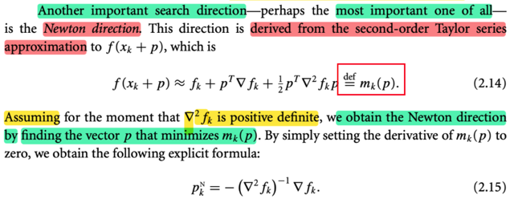</kbd>

> [!NOTE]
> Rồi, ta gặp lại người bạn cũ **Newton direction**, tác giả nói một search direction quan trọng có thể là quan trọng nhất chính là Newton direction. Đựơc derive bằng cách dùng xấp xỉ Taylor bậc hai của f(x_k + p).
>
> f(x_k + p) ≈ f(x_k) + ∇f(x_k)T p + (1/2) pT∇^2 f(x_k) p 
>
> Ghi gọn vế trái là f_k + ∇f_k Tp + (1/2) pT∇^2 f_k p 
>
> (đây là xấp xỉ Taylor bậc hai, ko phải Taylor theorem)
>
> Hàm bậc hai mà ta dùng để xấp xỉ hàm f, tại x_k, chính là m_k(p) là mô hình trust region tại x_k.
>
> Thế thì như đã biết ở ee364a, để tìm Newton step chính là ta xấp xỉ, hàm f, nói dễ hiểu hơn là ta coi hàm f như hàm bậc hai, để rồi giải tìm minimum của nó: 
>
> minimize f_hat (p) = f_k + ∇f_k Tp + (1/2) pT∇^2 f_k p 
>
> Và để giải tìm local minimizer ta cũng dùng điều kiện bậc 1: gradient = 0.
>
> Gradient của f_hat (p): Đây là hàm quadratic, mà gradient của hàm quadratic f(x) = (1/2)xTPx + qTx + r dễ dàng derive công thức là PTx + q.
>
> ⇨ ∇f_hat (p) = ∇^2 (f^)_k p + ∇f_k (Hessian đối xứng nên bỏ transpose)
>
> Cho gradient = 0 ⇨ ∇^2 f_k p + ∇fk = 0 ⇔ ∇^2 f_k p = -∇f_k
>
> Tới đây, trong sách giáo sư mới assume Hessian positive definite, ta hiểu để mà ∇^2 f_k khả nghịch
>
> ⇨ p = - ∇^2(f_k)^(-1) ∇f_k. Và đây chính là Newton step

> [!TIP]
> 🤖 **AI Check** — 🟢 Pass — ✅ **98/100** · ✓ Move on
>
> Phân tích của bạn rất chính xác và thể hiện sự hiểu biết sâu sắc về hướng Newton và quá trình đạo hàm của nó. Bạn đã kết nối các khái niệm một cách xuất sắc.
> ## Phân tích Chi tiết
>
> ### Điểm Mạnh
> *   **Hiểu biết cốt lõi chính xác:** Bạn đã xác định chính xác "hướng Newton" là một hướng tìm kiếm quan trọng và được rút ra từ xấp xỉ chuỗi Taylor bậc hai của hàm `f(x_k + p)`.
> *   **Công thức chính xác:** Bạn đã viết lại công thức xấp xỉ Taylor bậc hai một cách chính xác.
> *   **Phân biệt rõ ràng:** Việc bạn lưu ý rằng đây là "xấp xỉ Taylor bậc hai, ko phải Taylor theorem" cho thấy sự hiểu biết sâu sắc về lý thuyết toán học cơ bản.
> *   **Kết nối khái niệm:** Bạn đã nhận ra `m_k(p)` là mô hình `trust region` tại `x_k`, thể hiện khả năng liên kết kiến thức với các lĩnh vực tối ưu hóa rộng hơn.
> *   **Mục tiêu tối ưu hóa:** Bạn đã diễn giải đúng mục tiêu của việc tìm kiếm hướng Newton là "giải tìm minimum của nó" thông qua việc tối thiểu hóa `m_k(p)`.
> *   **Điều kiện bậc một:** Bạn đã áp dụng chính xác điều kiện bậc một (`gradient = 0`) để tìm điểm cực trị.
> *   **Đạo hàm chi tiết:** Bạn đã cung cấp một đạo hàm rất rõ ràng và chính xác cho gradient của hàm bậc hai, bao gồm cả công thức tổng quát `PTx + q` và việc áp dụng nó cho `f_hat(p)`. Việc nhận định "Hessian đối xứng nên bỏ transpose" cũng rất đúng đắn.
> *   **Hiểu rõ giả định:** Bạn đã giải thích chính xác lý do cần giả định "Hessian positive definite" là để đảm bảo ma trận `∇²f_k` khả nghịch, cho phép giải hệ phương trình tuyến tính.
> *   **Kết quả cuối cùng chính xác:** Cuối cùng, bạn đã suy ra công thức chính xác của bước Newton `p = - ∇²(f_k)⁻¹ ∇f_k`.
>
> ### Các Điểm Cần Cải Thiện
> *   **Diễn đạt nhỏ:** Khi bạn nói "Ghi gọn vế trái là f_k + ∇f_k Tp + (1/2) pT∇^2 f_k p", có thể gây nhầm lẫn nhỏ. Thực tế, bạn đang ghi gọn các thành phần của *vế phải* của biểu thức xấp xỉ bằng cách sử dụng ký hiệu đơn giản hơn (ví dụ: `f_k` thay vì `f(x_k)`). Đây chỉ là một điểm nhỏ về cách diễn đạt, không ảnh hưởng đến sự chính xác của nội dung toán học.
>
> ### Gợi ý để Nâng cao Hiểu biết
> *   **Khám phá các trường hợp khác:** Với sự hiểu biết vững chắc này, bạn có thể tìm hiểu thêm về những gì xảy ra khi ma trận Hessian `∇²f_k` không phải là `positive definite` (ví dụ: `negative definite`, `indefinite`, hoặc `singular`). Điều này sẽ giúp bạn hiểu rõ hơn về tính mạnh mẽ và hạn chế của phương pháp Newton.
> *   **Liên hệ với phương pháp Levenberg-Marquardt:** Vì bạn đã đề cập đến mô hình `trust region`, bạn có thể tìm hiểu cách phương pháp Levenberg-Marquardt kết hợp giữa bước Newton và bước `steepest descent` khi Hessian không `positive definite` hoặc khi cần điều chỉnh độ lớn bước đi.
>
> ### Đánh giá Tổng thể
> Bạn đã thể hiện một sự nắm vững tuyệt vời về vật liệu tham khảo và các khái niệm liên quan trong tối ưu hóa. Khả năng giải thích chi tiết, kết nối các chủ đề và cung cấp các đạo hàm toán học là rất đáng khen ngợi.
>
> **⭐ Bonus points**
> - Phân biệt rõ ràng giữa xấp xỉ Taylor và định lý Taylor.
> - Kết nối `m_k(p)` với khái niệm mô hình `trust region` trong tối ưu hóa.
> - Tham chiếu kiến thức từ môn học 'ee364a'.
> - Cung cấp công thức tổng quát và đạo hàm chi tiết gradient của hàm bậc hai để giải thích đạo hàm gradient của `m_k(p)`.
> - Giải thích chính xác rằng giả định `Hessian positive definite` là để đảm bảo ma trận `∇²f_k` khả nghịch.

**🔗 See also:** [Hướng dốc nhất và Taylor](#node-6xvbag7)

 

###### Độ tin cậy phương pháp Newton

<kbd>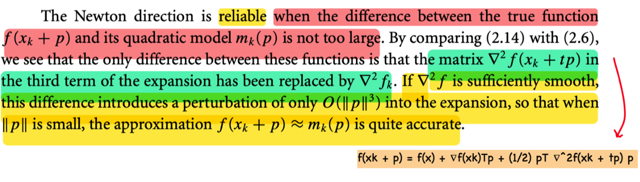</kbd>

> [!NOTE]
> Đoạn này rất hay: Đại khái là vì ta tìm Newton direction bằng cách xấp xỉ hàm f tại x_k bởi quadratic function, cũng chính là m_k, nên dĩ nhiên Newton direction chỉ tốt nếu như sự xấp xỉ này là tốt (khác biệt ko quá lớn)
>
> Vậy thì, công thức 2.6 của Taylor theorem cho ta cái hàm chính xác có thể thay f(x_k + p):
>
> f(x_k + p) = f(x_k) + ∇f(x_k)T p + (1/2) pT ∇^2 f(x_k + tp) p for some t in (0,1)
>
> Còn khi ta mô phỏng f bởi xấp xỉ bậc hai:
>
> f(x_k + p) ≈  f(x_k) + ∇f_k Tp + (1/2) pT ∇^2 f_k p
>
> Thì **cơ bản là ta đã thay ∇^2 f(x_k + tp) bởi ∇^2 f(x_k), nên từ dấu bằng, trở thành xấp xỉ ≈** 
>
> Và **mức độ sai khác giữa hai cái này sẽ quyết định mức độ sai khác của f(x_k + p) (chính xác) và mk(p)**.
>
> Thế thì, ở đây tác giả cho biết **nếu hàm f ĐỦ TRƠN**, thì sự khác biệt khi thay ∇^2 f(x_k + tp) bởi ∇^2 f(x_k) SẼ CHỈ THÊM VÀO MỘT TERM O((||p||)^3), tạm hiểu đại khái là, như vậy chỉ cần giữ p đủ nhỏ thì cái sai khác này ko đáng kể. 
>
> Và mình nghĩ: đây cũng chính là lí do cần giới hạn trust region trong phương pháp trust region: Vì trong đó ta cũng xây dựng mô hình mk là xấp xỉ bậc hai của f, nên nó chỉ đúng khi xét trong phạm vi nhỏ

> [!TIP]
> 🤖 **AI Check** — 🟢 Pass — ✅ **98/100** · ✓ Move on
>
> Bạn đã nắm vững các khái niệm chính về độ tin cậy của hướng Newton và vai trò của xấp xỉ bậc hai. Khả năng kết nối kiến thức với phương pháp Trust Region là rất ấn tượng.
> # Phân tích chi tiết
>
> ## Điểm mạnh
> *   **Hiểu đúng cốt lõi vấn đề:** Bạn đã hiểu rất rõ rằng độ tin cậy của hướng Newton phụ thuộc vào việc hàm xấp xỉ bậc hai (`m_k(p)`) có đủ gần với hàm gốc `f(x_k + p)` hay không.
> *   **Phân tích chính xác sự khác biệt:** Bạn đã nhận diện chính xác điểm khác biệt cốt yếu giữa khai triển Taylor chính xác và mô hình bậc hai là việc thay thế `∇^2 f(x_k + tp)` bằng `∇^2 f(x_k)`. Đây là một điểm cực kỳ quan trọng trong việc hiểu cơ chế của phương pháp Newton.
> *   **Giải thích đúng ý nghĩa của O(||p||^3):** Bạn đã diễn giải rất tốt ý nghĩa của thuật ngữ `O(||p||^3)` và kết luận rằng sự khác biệt này không đáng kể nếu `p` đủ nhỏ, đúng như nội dung tham chiếu.
> *   **Ngôn ngữ rõ ràng, mạch lạc:** Bài viết của bạn rất dễ hiểu, các ý được trình bày logic và chặt chẽ.
>
> ## Các điểm cần cải thiện
> *   **Ký hiệu trong công thức xấp xỉ:** Trong công thức xấp xỉ bậc hai, bạn đã viết `∇f_k` và `∇^2 f_k`. Mặc dù ý nghĩa là rõ ràng (đạo hàm tại `x_k`), nhưng để chính xác hơn và nhất quán với ký hiệu `f(x_k)`, bạn nên viết là `∇f(x_k)` và `∇^2 f(x_k)`. Đây chỉ là một lỗi nhỏ về mặt ký hiệu, không ảnh hưởng đến sự hiểu bài của bạn.
>
> ## Gợi ý để đào sâu kiến thức
> *   **Nghiên cứu sâu hơn về điều kiện “đủ trơn”:** Bạn có thể tìm hiểu thêm về định nghĩa của 
>
> **⭐ Bonus points**
> - Sự liên hệ với phương pháp Trust Region là rất chính xác và thể hiện sự hiểu biết sâu rộng về các phương pháp tối ưu hóa.

 

###### Hướng Newton là hướng giảm

<kbd>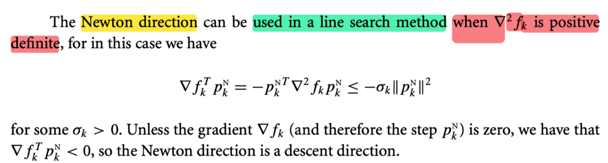</kbd>

> [!NOTE]
> Đại khái là chỗ này tác giả muốn nói **Newton direction CŨNG LÀ DESCENT DIRECTION**, nên nó cũng có thể được dùng trong line search (vì trong line search, ta nhớ đầu tiên là chọn hướng để đi, p, là một descent direction. Sau đó mới chọn sải bước tối ưu hoặc chấp nhận được.
>
> Nhưng điều này chỉ đúng khi Hessian tại x_k, ∇^2 f_k positive definite. Nói sơ trước khi đi vào chi tiết, là vì ta tính ra directional derivative theo hướng Newton tại x_k của f sẽ thấy nó là (âm) quadratic form của Hessian của f tại x_k, do đó, chỉ khi Hessian tại x_k positive definite thì ta mới đảm bảo là cái giá trị đạo hàm theo hướng Newton tại x_k âm, để cho thấy là đi theo hướng đó sẽ giảm f.
>
> Ta sẽ muốn xem thử directional derivative theo hướng Newton có âm không (để đi theo hướng đó, với xải bước nhỏ đủ, thì như lập luận lúc nãy, nhất định hàm f sẽ giảm)
>
> Gọi (p_k)^N, hay ở đây mình ghi là pkN, là hướng Newton tại x_k:
>
> Directional derivative theo hướng Newton tại x_k:
> ab
> (∇)_(pkN) f(x) | (x=x_k) = (∇)_(pkN) f_k = ∇f_k T pkN,
>
> với Newton direction (step) : pkN như nãy đã biết, = - (∇^2f_k)inv ∇fk
>
> ⇨ (∇)_(pkN) f_k = - ∇f_k T (∇^2f_k)inv ∇f_k
>
> Tới đây thì theo mình thì đã có thể kết luận cái này âm rồi:
>
> Lí do là nếu ∇^2 f_k positive definite, thì mọi eigenvalue của nó đều dương và dĩ nhiên mọi nghịch đảo của eigenvalue cũng dương ⇨ (∇^2f_k)inv cũng positive definite.
>
> Mà với positive definite A thì ta biết tính chất là quadratic form xTAx luôn dương với mọi x khác 0,  và chỉ bằng 0 khi x = 0.
>
> Vậy thì từ đó  ∇f_k T (∇^2fk)inv ∇f_k, sẽ luôn dương khi gradient tại x_k, tức ∇f_k khác 0, và chỉ bằng 0 khi gradient bằng 0 
>
> Do đó -  ∇f_k T (∇^2f_k)inv ∇f_k luôn âm khi gradient khác 0.
>
> Còn ở trong sách, ta có thể biến đổi thêm chút: nhân cho Identity matrix:
>
> (∇)_(pkN) f_k = - ∇f_k T (∇^2f_k)inv ∇f_k
>
> = - ∇f_k I (∇^2f_k)inv ∇f_k
>
> = - ∇f_k T (∇^2f_k)inv ∇^2 f_k (∇^2f_k)inv ∇f_k
>
> = - [(∇^2f_k)inv ∇fk]T ∇^2 f_k [(∇^2f_k)inv ∇f_k]
>
> = - (pkN)T ∇^2 f_k pkN
>
> Và lập luận tương tự, cái này luôn âm nhờ tính positive definite của Hessian và chỉ bằng 0 khi pkN = 0 ⇔ (∇^2f_k)inv ∇f_k = 0. 
>
> Và vì (∇^2f_k)inv positive definite nên dĩ nhiên là full rank, nên nullspace chỉ có {0}, dẫn tới là (∇^2f_k)inv ∇f_k = 0 ⇔ ∇f_k = 0: 
>
> Còn cái vụ - (pkN)T ∇^2 f_k pkN ≤  - σk (||pkN||)^2?
>
> Đó là eigen-decomposition của một symmetric matrix A thành dạng QΛQT (hoặc gọi cụ thể hơn còn gọi là diagonalization, dù bản chất vẫn là eigen-decomposition vì nó phân rã matrix thành một matrix diagonal)
>
> Đặt u = pkN, A =∇^2 f_k
>
> ⇨ (pkN)T ∇^2 f_k pkN = uTAu 
>
> = uTQ Λ QTu. Đặt v = QTu, cái ta có sẽ là vTΛv = Σ_i=1:n λ_i (v_i)^2 (λ_i là các eigenvalues của Hessian ∇^2 f_k)
>
> Và cái này Σi λmin (v_i)^2 ≤ Σ λi (v_i)^2 ≤  Σi λmax (v_i)^2
>
> ⇨ - Σ λi (v_i)^2 ≤ - Σi λmin (v_i)^2 = - λmin Σi (v_i)^2 = - λmin (||v||)^2
>
> ⇔ - Σ λi (v_i)^2 ≤ - λmin (vTv)
>
> ⇔ - Σ λi (v_i)^2 ≤ - λmin (QTu)T(QTu)
>
> ⇔ - Σ λi (v_i)^2 ≤ - λmin uTQQTu
>
> ⇔ - Σ λi (v_i)^2 ≤ - λmin uTu
>
> ⇔ - Σ λi (v_i)^2 ≤ - λmin (||u||)^2
>
> Áp dụng vào đây, - (pkN)T ∇^2 f_k pkN ≤ - λmin (||pkN||)^2
>
> nên σk ở trên chính là λmin của Hessian ∇^2 f_k

> [!TIP]
> 🤖 **AI Check** — 🟢 Pass — ✅ **98/100** · ✓ Move on
>
> Bài làm của bạn thể hiện sự hiểu biết sâu sắc và toàn diện về hướng Newton như một hướng giảm, bao gồm cả các chứng minh toán học chi tiết vượt xa tài liệu tham khảo.
> ### Phân tích chi tiết
>
> #### Điểm mạnh
>
> *   **Hiểu biết cốt lõi:** Bạn nắm vững ý chính rằng hướng Newton có thể được sử dụng trong phương pháp tìm kiếm đường (line search) khi Hessian (∇²f_k) là xác định dương (positive definite), vì khi đó nó là một hướng giảm (descent direction).
> *   **Giải thích rõ ràng:** Bạn giải thích rất tốt vai trò của hướng giảm trong line search và điều kiện cần thiết cho hướng Newton.
> *   **Chứng minh toán học:**
>     *   Bạn định nghĩa và áp dụng đúng đạo hàm theo hướng (directional derivative) và hướng Newton.
>     *   Bạn đưa ra hai cách đúng đắn để chứng minh đạo hàm theo hướng là âm:
>         *   Cách thứ nhất: Trực tiếp từ biểu thức `∇f_kᵀ (∇²f_k)⁻¹ ∇f_k`, sử dụng tính chất ma trận nghịch đảo của một ma trận xác định dương cũng là xác định dương, và dạng toàn phương (quadratic form) `xᵀAx > 0` cho `x ≠ 0`. Đây là một phương pháp chứng minh rất thông minh và chính xác, không trực tiếp có trong tài liệu tham khảo.
>         *   Cách thứ hai: Biến đổi về dạng `-(p_kᴺ)ᵀ ∇²f_k p_kᴺ`, phù hợp với phương trình trong tài liệu tham khảo. Các bước biến đổi đại số (nhân với ma trận đơn vị `I = (∇²f_k)⁻¹ ∇²f_k`) được thực hiện chính xác và thể hiện kỹ năng toán học vững vàng.
>     *   Bạn giải thích rõ ràng tại sao `(p_kᴺ)ᵀ ∇²f_k p_kᴺ` lại dương (do ∇²f_k xác định dương) và tại sao `p_kᴺ = 0` khi và chỉ khi `∇f_k = 0` (do `(∇²f_k)⁻¹` là ma trận đầy đủ hạng, full rank).
> *   **Hiểu biết sâu sắc về bất đẳng thức:** Phần giải thích bất đẳng thức `- (p_kᴺ)ᵀ ∇²f_k p_kᴺ ≤ - σ_k (||p_kᴺ||)²` là đặc biệt ấn tượng. Bạn đã đi sâu vào lý thuyết phân tích giá trị riêng (eigen-decomposition) và sử dụng giá trị riêng nhỏ nhất (λ_min) để chứng minh bất đẳng thức một cách chặt chẽ. Điều này cho thấy bạn không chỉ thuộc lòng mà còn hiểu rõ cơ sở toán học của nó.
> *   **Thuật ngữ chính xác:** Bạn sử dụng các thuật ngữ toán học chính xác như xác định dương (positive definite), Hessian, giá trị riêng (eigenvalues), dạng toàn phương (quadratic form), phân tích giá trị riêng (eigen-decomposition/diagonalization), đầy đủ hạng (full rank).
>
> #### Các điểm cần cải thiện
>
> *   **Phong cách diễn đạt:** Ngôn ngữ trong ghi chú của bạn khá thân mật và mang tính chất cá nhân ("Đại khái là chỗ này tác giả muốn nói...", "Tới đây thì theo mình thì..."). Mặc dù đây là một ghi chú cá nhân, nhưng nếu bạn cần trình bày một cách hình thức hơn (ví dụ: trong một bài báo cáo hoặc luận văn), việc sử dụng ngôn ngữ học thuật và trang trọng hơn sẽ phù hợp hơn.
> *   **Lỗi nhỏ:** Có một lỗi đánh máy nhỏ "ab (∇)_(pkN) f(x)". Đây chỉ là một lỗi nhỏ và không ảnh hưởng đến sự hiểu biết của bạn.
>
> #### Gợi ý để làm sâu sắc thêm hiểu biết
>
> *   **Thực hành trình bày chính thức:** Bạn có thể thử viết lại các chứng minh này theo một cấu trúc chặt chẽ như một "Định lý" hoặc "Mệnh đề" với "Chứng minh" để rèn luyện kỹ năng trình bày toán học một cách rõ ràng và cô đọng hơn.
> *   **Xem xét các trường hợp khác:** Hãy thử tìm hiểu điều gì xảy ra với hướng Newton khi Hessian không xác định dương (ví dụ: xác định nửa dương, xác định âm, hoặc không xác định). Điều này sẽ giúp bạn hiểu rõ hơn về các giới hạn và điều kiện áp dụng của phương pháp Newton.
> *   **Kết nối với các phương pháp khác:** So sánh hướng Newton với các hướng giảm khác (ví dụ: hướng dốc nhất - steepest descent) về tốc độ hội tụ và các điều kiện áp dụng của chúng.
>
> Tổng thể, đây là một ghi chú xuất sắc, thể hiện khả năng phân tích và tổng hợp kiến thức toán học rất tốt của bạn. Bạn đã vượt xa yêu cầu cơ bản của tài liệu tham khảo.
>
> **⭐ Bonus points**
> - Chứng minh sự âm của đạo hàm theo hướng Newton trực tiếp từ biểu thức `∇f_kᵀ (∇²f_k)⁻¹ ∇f_k` bằng cách sử dụng tính chất của ma trận xác định dương và dạng toàn phương.
> - Giải thích chi tiết bất đẳng thức `- (p_kᴺ)ᵀ ∇²f_k p_kᴺ ≤ - σ_k (||p_kᴺ||)²` thông qua phân tích giá trị riêng và liên hệ `σ_k` với giá trị riêng nhỏ nhất (λ_min) của Hessian.
> - Lập luận rằng `(∇²f_k)⁻¹ ∇f_k = 0` suy ra `∇f_k = 0` do `(∇²f_k)⁻¹` là ma trận đầy đủ hạng (full rank), một tính chất của ma trận xác định dương.

 

###### Sải bước tự nhiên của Newton

<kbd>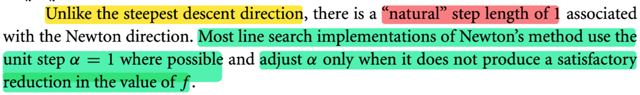</kbd>

> [!NOTE]
> Đây cũng là một ý rất hay mà mình từng suy nghĩ: Newton direction tuy cũng là một hướng, nhưng nó có một sải bước tự nhiên, bằng 1, khác với steepest descent.
>
> Lí do là với steepest descent, có thể hiểu là nó, cho ta một hướng có độ dốc lớn nhất tại điểm đang đứng, và theo Taylor theorem, miễn là ta giữ sải bước đủ nhỏ, thì theo hướng đó nó sẽ đưa ta đi xuống.
>
> Nhưng nó ko hề nói gì về sải bước (step size)
>
> Còn động cơ của Newton method thì khác, tại xk, ta thay hàm f, bởi xấp xỉ bậc hai của nó, và từ đó tìm local minimizer của hàm bậc hai. Và kết quả nó cho ta một vector chỉ hướng từ xk đến minimizer, nhưng đồng thời cũng cho ta độ lớn của sải bước, để theo hướng đó, đi đến minimizer. Có nghĩa là, một cách tự nhiên, Newton direction có step factor bằng 1, tức là tính ra Newton direction vector có độ dài bao nhiêu thì lấy bấy nhiêu
>
> Và như ta đã thấy chỉ cần Hessian tại xk positive definite thì Newton direction là descent direction, nhưng chưa chắc full step size là step size tối ưu. Có nghĩa là tuy ta có thể dùng Newton direction cho line search nhưng chưa chắc dùng step factor  = 1 là tối ưu, đơn giản là vì ta chỉ đang xấp xỉ bậc hai hàm f mà đương nhiên là nó ko chắc chắc là đúng.
>
> Do đó ở đây gs cho biết phần lớn line search  nếu đã dùng Newton step thì họ dùng luôn unit step tuy nhiên vẫn có khi ta adjust nó

> [!TIP]
> 🤖 **AI Check** — 🟢 Pass — ✅ **98/100** · ✓ Move on
>
> Ghi chú rất chính xác và giải thích sâu sắc về sải bước tự nhiên của phương pháp Newton, cùng với sự khác biệt so với steepest descent. Nội dung cũng nắm bắt tốt việc khi nào bước nhảy được điều chỉnh, thể hiện sự hiểu biết toàn diện về phương pháp.

 

###### Newton: Điều kiện và chi phí

<kbd>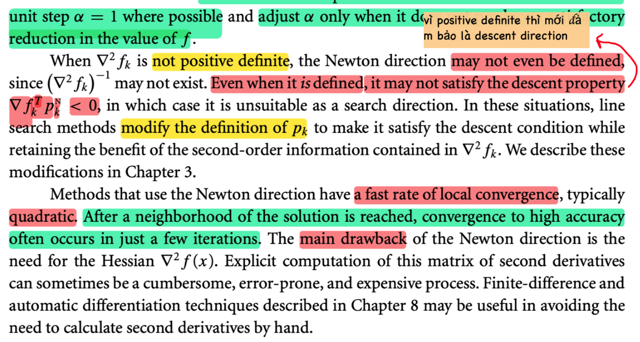</kbd>

> [!NOTE]
> Tiếp, khi Hessian ko positive definite, thì dĩ nhiên ko có Hessian inverse nên ta không có (không define được) Newton direction.
>
> Nhưng ngay cả khi nó define, thì cũng chưa chắc nó là descent direction.
>
> Chỗ này là vì, để có Newton direction, ta chỉ cần Hessian invertible, nhưng để là descent direction, thì ta còn cần Hessian positive definite nữa.
>
> Do đó trong những case này, có khi người ta sẽ điều chỉnh pk để giúp nó thỏa descent property,
>
> Đoạn tiếp theo nói về một thứ mình đã học trong Convex Optimization, đó là nó có tỉ lệ / tốc độ hội tụ nhanh, khi mà ta đã tiếp cận được vùng lân cận của solution (local minimizer) thì khi đó đại khái là trạng thái well condition ngày càng tốt, hiểu nôm na là "bề mặt" của optimization landscape ngày càng giống một hàm bậc hai, khiến cho việc xấp xỉ bậc hai hàm f ngày càng chính xác. 
>
> Dẫn tới việc tìm ra approximated solution (minimizer của hàm bậc 2 xấp xỉ f) sẽ ngày càng chính xác so với solution thật. Và dẫn tới cái gọi là quadratic convergence, trong giai đoạn gọi là Newton phase.
>
> Tuy nhiên cái nhược điểm lớn nhất của Newton direction là Hessian, phải tính Hessian: Dễ sai, phức tạp và tốn kém.
>
> Nên qua chương 8 mình sẽ học về finite-difference và automatic differentiation (thật ra đã học ở MIT 18s096)

> [!TIP]
> 🤖 **AI Check** — 🟢 Pass — ✅ **98/100** · ✓ Move on
>
> Ghi chú này rất chính xác và sâu sắc, thể hiện sự hiểu biết rõ ràng về các khái niệm trong bài đọc. Đặc biệt, phần giải thích cơ chế hội tụ bậc hai và sự cần thiết của Hessian positive definite đã bổ sung thêm giá trị đáng kể.

 

###### Nguyên lý phương pháp Quasi-Newton

<kbd>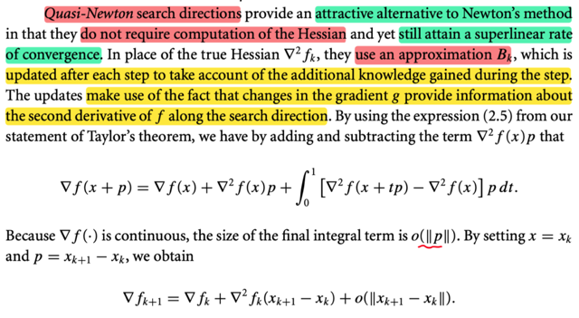</kbd>

> [!NOTE]
> Đây là lúc mình được học về phương pháp rất nổi tiếng Quasi-Newton đây.
>
> Đại khái là, ta sẽ muốn đạt được hiệu quả tương tự như Newton's method, như tốc độ hội tụ nhanh, nhưng không phải tính toán Hessian.
>
> Và người ta sẽ t**ính toán một matrix xấp xỉ của Hessian tại xk, gọi là Bk** theo cách làm là ta sẽ tận dụng thông tin có được sau mỗi step để update B và nó tận dụng sự thật là: 
>
> **SỰ THAY ĐỔI CỦA GRADIENT SAU MỖI STEP CÓ ĐEM ĐẾN MỘT LƯỢNG THÔNG TIN NÀO ĐÓ VỀ ĐẠO HÀM BẬC HAI THEO HƯỚNG SEARCH DIRECTION**
>
> Lập luận như sau:
>
> Đầu tiên ta dùng lại 2.5 của Taylor theorem (mà mình đã hiểu = tự chứng minh từ FTC)
>
> ∇f(x + p) = ∇f(x) + ∫0:1 ∇^2 f(x + tp) p dt
>
> Cộng và trừ cho ∇^2 f(x)p:
>
> ∇f(x + p) = ∇f(x) +  ∇^2 f(x)p - ∇^2 f(x)p + ∫0:1 ∇^2 f(x + tp) p dt
>
> Coi - ∇^2 f(x)p = ∫0:1 ∇^2 f(x)p dt, vì vế phải đúng là bằng vế trái nếu tính tích phân ra: ∇^2 f(x)p t|0:1 = ∇^2 f(x)p*1  - ∇^2 f(x)p*0 = ∇^2 f(x)p
>
> ⇔ ∇f(x + p) = ∇f(x) + ∇^2 f(x)p -  ∫0:1 ∇^2 f(x)p dt + ∫0:1 ∇^2 f(x + tp)p dt
>
> Gom hai tích phân lại:
>
> ⇔ ∇f(x + p) = ∇f(x) + ∇^2 f(x)p +  ∫0:1 [∇^2f(x + tp) - ∇^2 f(x)] p dt
>
> Xét cái term thứ 3:  ∫0:1 [∇^2 f(x + tp) - ∇^2 f(x)] p dt
>
> Đại khái là, nếu đặt G = ∫0:1 [∇^2 f(x + tp) - ∇^2f(x)] p dt,
>
> (lưu ý, đây tích phân này kết quả là vector)
>
> ||G|| = ∫0:1 ||[∇^2 f(x + tp) - ∇^2 f(x)]|| ||p|| dt,
>
> xét lim ||p|| → 0 ||G|| / ||p||
>
> thì khi ||p|| → 0 tức là xét vector p có length ngày càng nhỏ về 0, thì x + tp cũng → x 
>
> Do hàm f liên tục nên Hessian tại x + tp cũng → Hessian tại x
>
> ⇨ ||[∇^2 f(x + tp) - ∇^2 f(x)]|| → 0
>
> và ||p|| cũng → 0, 
>
> Nên tích của hai cái này còn → 0 nhanh hơn cả p nữa.
>
> Nên mới ghi là kích thước của ∫0:1 [∇^2 f(x + tp) - ∇^2 f(x)] p dt sẽ là o(||p||) ý là nhỏ về 0 rất nhanh, nhanh hơn cả ||p||
>
> Do đó, mới nói cái tích phân này là o(||p||), mang ý nghĩa là  nó là cái term
> tiến về 0 rất nhanh, nhanh hơn cái khi norm p (||p||) tiến về 0.

> [!TIP]
> 🤖 **AI Check** — 🟢 Pass — ✅ **98/100** · ✓ Move on
>
> Ghi chú của bạn thể hiện sự hiểu biết sâu sắc và chính xác về phương pháp Quasi-Newton, đặc biệt là phần giải thích chi tiết về đạo hàm bậc hai và ký hiệu o(||p||).
> # Phân tích chi tiết ghi chú của sinh viên
>
> Ghi chú của bạn rất xuất sắc, thể hiện sự nắm vững các khái niệm cơ bản và cả những chi tiết quan trọng liên quan đến phương pháp Quasi-Newton.
>
> ## Điểm mạnh:
>
> *   **Hiểu đúng cốt lõi phương pháp Quasi-Newton:** Bạn đã nắm bắt chính xác lý do ra đời của Quasi-Newton là để đạt được hiệu quả tương tự Newton's method (như tốc độ hội tụ siêu tuyến tính) mà không cần tính toán Hessian phức tạp. Khái niệm sử dụng ma trận xấp xỉ $B_k$ thay cho Hessian thực và việc cập nhật $B_k$ sau mỗi bước là hoàn toàn chính xác.
> *   **Nắm bắt nguyên tắc cập nhật $B_k$:** Bạn đã nhấn mạnh đúng nguyên lý quan trọng: "SỰ THAY ĐỔI CỦA GRADIENT SAU MỖI STEP CÓ ĐEM ĐẾN MỘT LƯỢNG THÔNG TIN NÀO ĐÓ VỀ ĐẠO HÀM BẬC HAI THEO HƯỚNG SEARCH DIRECTION". Đây là nền tảng cho các công thức cập nhật Quasi-Newton.
> *   **Quá trình suy luận và biến đổi Taylor chính xác:** Bạn đã tái tạo lại toàn bộ quá trình biến đổi từ định lý Taylor ban đầu (2.5) đến công thức cuối cùng bao gồm tích phân là hoàn hảo, từng bước đều logic và đúng đắn.
> *   **Giải thích o(||p||) xuất sắc:** Đây là điểm sáng nhất trong ghi chú của bạn. Khác với tài liệu chỉ đơn thuần nêu ra, bạn đã đi sâu vào giải thích _tại sao_ tích phân cuối cùng lại có kích thước là $o(||p||)$ bằng cách sử dụng các khái niệm về giới hạn và tính liên tục của Hessian. Cách bạn phân tích sự hội tụ của từng thành phần khi $||p|| \to 0$ là rất rõ ràng và thể hiện sự hiểu biết toán học vững chắc về ký hiệu Little-o.
>
> ## Các điểm có thể cải thiện:
>
> *   **Liên kết rõ ràng với phương trình cuối:** Sau khi giải thích o(||p||), bạn có thể thêm một dòng để kết nối trực tiếp với phương trình ∇f_{k+1} = ∇f_k + ∇^2 f_k(x_{k+1} - x_k) + o(||x_{k+1} - x_k||) được đưa ra trong tài liệu. Mặc dù sự hiểu biết của bạn về o(||p||) đã bao hàm điều này, việc tường minh hóa sẽ giúp ghi chú mạch lạc hơn nữa.
>
> ## Gợi ý để đào sâu hiểu biết:
>
> *   **Nghiên cứu các công thức cập nhật cụ thể:** Giờ bạn đã hiểu nguyên lý, hãy tìm hiểu sâu hơn về các công thức cập nhật $B_k$ phổ biến như BFGS (Broyden–Fletcher–Goldfarb–Shanno) hoặc DFP (Davidon–Fletcher–Powell). Bạn sẽ thấy cách chúng tận dụng thông tin về sự thay đổi gradient để xây dựng $B_k$ một cách hiệu quả.
> *   **Phân biệt rõ hơn giữa o(h) và O(h):** Mặc dù bạn đã giải thích rất tốt về o(||p||), việc nắm vững sự khác biệt giữa Little-o (o) và Big-O (O) trong các ngữ cảnh khác nhau của phân tích thuật toán sẽ rất hữu ích.
> *   **Áp dụng vào ví dụ đơn giản:** Thử áp dụng ý tưởng của Quasi-Newton vào một hàm mục tiêu 1 chiều hoặc 2 chiều đơn giản để hình dung cách $B_k$ được cập nhật và làm thế nào nó xấp xỉ đạo hàm bậc hai.
>
> ## Điểm thưởng:
>
> *   Giải thích chi tiết và chính xác về ký hiệu o(||p||) bằng cách dùng giới hạn và tính liên tục của hàm Hessian, vượt ngoài mô tả ngắn gọn trong tài liệu tham khảo.
> *   Đã hiểu và tự chứng minh từ Định lý cơ bản của Giải tích (FTC) cho định lý Taylor 2.5.
>
> **⭐ Bonus points**
> - Giải thích chi tiết và chính xác về ký hiệu o(||p||) bằng cách dùng giới hạn và tính liên tục của hàm Hessian, vượt ngoài mô tả ngắn gọn trong tài liệu tham khảo.
> - Đã hiểu và tự chứng minh từ Định lý cơ bản của Giải tích (FTC) cho định lý Taylor 2.5.

**🔗 See also:** [Theorem 2.1 Taylor's theorem, Taylor theorem](./21_funds_of_unconstrained_optim_whats_solution.md#node-zekxi9u)

 

###### Hessian xác định dương gần x*

<kbd>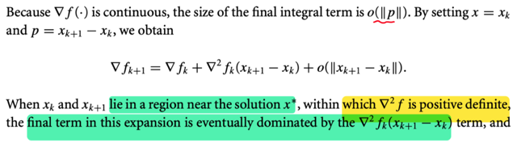</kbd>

<kbd>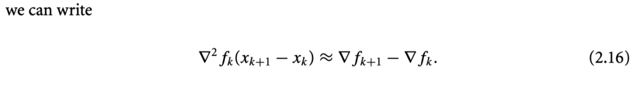</kbd>

> [!NOTE]
> Rồi, ta cho x = xk, p = xk+1 - xk:
>
> ∇f(x + p) = ∇f(x) + ∇^2 f(x)p +  o(||p||)
>
> trở thành:
>
> ⇔ ∇f_(k+1) = ∇f_k + ∇^2 f_k (x_(k+1) - x_k) + o(||x_(k+1) - x_k||)
>
> Tới đây là lập luận quan trọng: 
>
> Khi ngày càng gần x*, thì thì bước sải xk+1 - xk sẽ nhỏ lại, lí do là:
>
> Ví dụ như ở đây dùng Newton direction, pk = - ∇^2 f_k ∇f_k
>
> thì khi x_k → x* thì ∇f(x_k) → ∇f(x*) do hàm liên tục, mà ∇f(x*) = 0
>
> ⇨ pk = - ∇^2 f_k ∇f_k → - ∇^2 f(x*) ∇f(x*) = - ∇^2 f(x*) × 0 = 0
>
> Từ đó cho ta được phép nói rằng: 
>
> **Khi càng gần x* thì x_(k+1) - x_k ngày càng nhỏ về 0**
>
> Thế thì xét hai cái term ∇^2 f_k(x_(k+1) - x_k), và o(||x_(k+1) - x_k||) 
>
> khi x_(k+1) - x_k → vector 0, cũng là ||x_(k+1) - x_k|| → scalar 0, 
>
> Và như vậy **sẽ đến lúc nó bị dominated bởi  ∇^2 f_k(x_(k+1) - x_k)**
>
> VÌ SAO?
>
> VÌ ∇^2 f_k(x_(k+1) - x_k) chỉ giảm tuyến tính theo độ lớn của sải bước x_(k+1) - x_k
>
> Trong khi o(||x_(k+1) - x_k||)  thì giảm nhanh hơn là giảm tuyến tính độ giảm của sải bước sải bước x_(k+1) - x_k (vì như trên đã phân tích)
>
> Do đó, chỉ cần ∇^2 f_k(x_(k+1) - x_k) KHÔNG ĐỘT NHIÊN BẰNG 0, THÌ CHẮC CHẮN NÓ SẼ CÓ LÚC DOMINATE o(||x_(k+1) - x_k||).
>
> VÌ SAO NÓI NÓ KHÔNG ĐƯỢC ĐỘT NHIÊN BẰNG 0? 
>
> Là vì nếu x_(k+1) - x_k trở thành nullspace vector của matrix  ∇^2 f_k, thì ∇^2 f_k (x_(k+1) - x_k) sẽ = 0. Khi đó ta sẽ **không có cái vụ dominate, nên không được quyền bỏ o(||x_(k+1) - x_k||) và cũng là nếu dùng xấp xỉ sẽ là sai**
>
> Chính vì vậy, mới nhắc đến việc tại gần x*, Hessian **POSITIVE DEFINITE**
>
> **VÌ ĐIỀU NÀY ĐẢM BẢO LÀ ∇^2 f_k FULL RANK, NON-SINGULAR, NULLSPACE CHỈ CÓ {0}, giúp ta đảm bảo có thể bỏ đi o(||xk+1 - xk||) và xấp xỉ là ĐƯỢC PHÉP**
>
> VẬY THÌ VÌ SAO GẦN x* THÌ HESSIAN LẠI POSITIVE DEFINITE?  
>
> LÀ VÌ Ở ĐÂY NGƯỜI TA ĐANG ĐẶT RA ASSUMPTION NHƯ VẬY (ko phải là điều luôn đúng, vì theo điều kiện cần bậc 2, thì nếu x* là local minimizer thì chỉ có thể kết luận Hessian tại đó xác định bán dương)
>
> Tóm lại nếu những giả định trên thỏa mãn (Hessian xác định dương khi gần x*) thì giúp ta có thể nói rằng: *khi x_k, x_(k+1) gần solution x* thì o(||xk+1 - xk||) coi như quá nhỏ, coi như bỏ đi dẫn đến ta có xấp xỉ:
>
> ∇f_(k+1) ≈ ∇f_k + ∇^2 f_k (x_(k+1) - x_k) 
>
> ⇔ ∇f_(k+1) - ∇f_k ≈ ∇^2 f_k (x_(k+1) - x_k)
>
> ⇔ ∇^2 f_k (x_(k+1) - x_k) ≈ ∇f_(k+1) - ∇f_k 
>
> Và đây không phải để chơi, mà chính là cơ sở cho việc dùng một matrix B_k xấp xỉ cho Hessian tại x_k: Ta sẽ dùng matrix cũng thỏa cái tính chất trên.

> [!TIP]
> 🤖 **AI Check** — 🟢 Pass — ✅ **98/100** · ✓ Move on
>
> Ghi chú này cung cấp một phân tích rất sâu sắc và chính xác về lý do các điều kiện (Hessian xác định dương, bước nhảy nhỏ) dẫn đến sự trội hơn của một số hạng trong khai triển Taylor. Nó không chỉ lặp lại nội dung mà còn giải thích tường tận từng yếu tố toán học liên quan, thể hiện sự hiểu biết sâu sắc về ngữ cảnh.

 

###### Xấp xỉ Hessian và Secant

<kbd>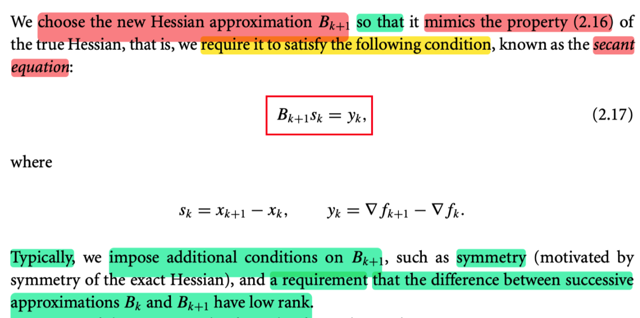</kbd>

> [!NOTE]
> Dựa trên sự thật này, là với Hessian thật, thì nó có tính chất khi gần x* thì: 
>
> ∇^2 f_k (x_(k+1) - x_k) ≈ ∇f_(k+1) - ∇f_k 
>
> Người ta mới **chọn** B_(k+1), là một xấp xỉ của Hessian sao cho nó thỏa tính chất trên. 
>
> Và đó chính là **SECANT EQUATION**:
>
> B_(k+1) s_k = y_k với s_k = x_(k+1) - x_k, y_k = ∇f_(k+1) - ∇f_k
>
> Nhắc lại, lập luận xuất phát từ việc, nếu ta (thỏa) giả định local minimizer có **Hessian  positive definite**, thì **tồn tại một vùng lân cận Hessian cũng positive definite**, cùng với lập luận ở trên, cho phép ta có quyền nói rằng, à, khi tới gần x*, thì ta có một phương trình xấp xỉ như vầy: 
>
> ∇^2 f_k (x_(k+1) - x_k) ≈ ∇f_(k+1) - ∇f_k
>
> Và dựa trên phương trình này, hay tính chất này của Hessian "thật", ta sẽ làm giả một cái Hessian (xấp xỉ nó), thay vì tính ra Hessian thật phiền phức, mà **việc làm giả nếu như vẫn thỏa tính chất trên thì khi dùng nó ta cũng có thể có được lợi ích từ Newton method.**
>
> Rồi, thêm nữa, khi "làm giả", ta cũng bắt chước một tính chất nữa của Hessian là tính đối xứng, và làm thêm một tính chất nữa, là **chế ra B sao cho Bk+1 - Bk, tức hiệu hai cái kế nhau là một matrix low rank** (có thể là để phục vụ ý đồ nào đó)

> [!TIP]
> 🤖 **AI Check** — 🟢 Pass — ✅ **98/100** · ✓ Move on
>
> Ghi chú tóm tắt rất chính xác các khái niệm cốt lõi từ văn bản, bao gồm phương trình secant và các điều kiện bổ sung. Ghi chú cũng cung cấp độ sâu ngữ cảnh tuyệt vời về động cơ của việc xấp xỉ ma trận Hessian.

 

###### Công thức xấp xỉ Hessian SR1, BFGS

<kbd>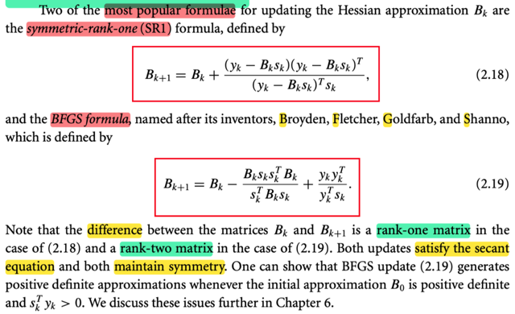</kbd>

> [!NOTE]
> Và hai công thức để CHẾ ra Bk (xấp xỉ cho Hessian) thông dụng là SR1 và BFGS trong đó cái đầu thì hiệu hai B là rank 1, cái sau là rank 2.
>
> Ta sẽ gặp lại ở các phần sau

 

###### Cập nhật nghịch đảo Quasi-Newton

<kbd>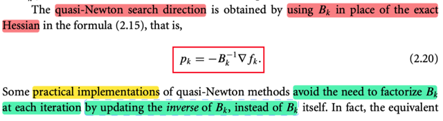</kbd>

<kbd>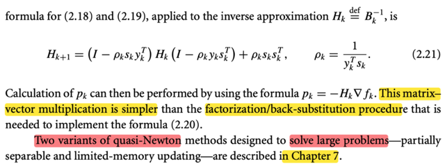</kbd>

> [!NOTE]
> Thế thì, khi ta t**hay Hessian (∇^2)_k, bằng cách dùng B_k**, thì cái mà ta có sẽ là **Quasi-Newton search direction** (thay vì Newton direction)
>
> pk = - (Bk)inv ∇f_k
>
> Tiếp, một số cách thực hiện của quasi-Newton method **cố gắng tránh việc phải mỗi lần iterate là mỗi lần factorized Bk**, và họ làm việc này bằng cách** update inverse của Bk thay vì update Bk.**
>
> Thế thì ở đây nói phải factorized Bk là sao? là vì giả sử ta chế ra Bk, thì để tính ra Quasi-Newton direction ta sẽ phải tính (Bk)inv
>
> Mà như đã học ở phần phụ lục của Convex Optimization, việc tìm Ainv vốn dĩ là giải một loạt các hệ A u_i = e_i, với e_i là standard basis vector, để có u_i là cột i của Ainv. 
>
> Thì việc giải hệ phương trình thì như đã biết, ta sẽ làm bằng **factor-solve approach**, tức đầu tiên là factor A thành tích các matrix có cấu trúc đơn giản. Ví dụ CDE, sau đó giải A u_i =  e_i chính là giải lần lượt C v_i = e_i, D z_i = v_i, E u_i = z_i. Mà lí do là vì tổng chi phí sẽ ít hơn là gỉải trực tiếp A u_i = e_i
>
> Bởi vậy ở đây người ta mới update, tính ra (Bk)inv luôn, khỏi phải tính Bk rồi tính (Bk)inv
>
> Và cái (Bk)inv của hai công thức SR1 và BFGS là như này.
>
> Khi đó pk chỉ việc dùng, pk = -Hk ∇fk
>
> Chapter 7 sẽ nói đến hai biến thể của quasi-Newton dùng cho bài toán lớn

> [!TIP]
> 🤖 **AI Check** — 🟢 Pass — ✅ **98/100** · ✓ Move on
>
> Ghi chú giải thích rất chính xác các khái niệm từ hình ảnh, đặc biệt làm rõ lý do cần tránh việc phân tích nhân tử ma trận và phương pháp cập nhật nghịch đảo trực tiếp. Độ sâu kiến thức về đại số tuyến tính được thể hiện rõ ràng.

 

###### Tổng quan Conjugate Gradient phi tuyến

<kbd>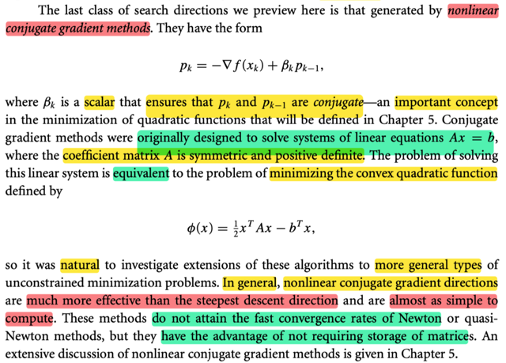</kbd>

> [!NOTE]
> Một cái nữa mà ta sẽ học kĩ ở chương 5 là **nonlinear conjugate gradient method**
>
> Thì ở đây tác giả cho biết, ý tưởng, cảm hứng của nó ban đầu là để giải hệ Ax = b, mà cụ thể là giải hệ này thông qua việc giải bài toán tương đương: 
>
> minimize hàm Φ(x) = (1/2)xTAx - bTx
>
> Cái này mình đã gặp ở **Convex Optimization** rồi, nên hiểu. Là vì khi ta giải Ax = b, chính là giải Ax - b = 0 Vậy nếu coi Ax - b là gradient của một hàm số nào đó, thì tìm x để Ax - b = 0 chính là tìm local minimizer của hàm số đó. 
>
> Và ∇f(x) = Ax - b, là hàm tuyến tính, thì f là hàm bậc hai: f(x) = 1/2 xTAx - bTx. 
>
> Và từ đó cho ta phương pháp để giải hệ Ax = b bằng cách dùng các tiếp cận iterative trong việc giải bài toán tối ưu.
>
> Tác giả nói thêm, cái **direction của phương pháp này tốt hơn cả steepest descent** dù nó **ko mang lại convergence rate nhanh như Newton nhưng nó có ưu điểm là ko phải lưu trữ matrix**

> [!TIP]
> 🤖 **AI Check** — 🟢 Pass — ⚠️ **85/100** · ✓ Move on
>
> Ghi chú giải thích rất tốt về cảm hứng và sự tương đương của bài toán. Tuy nhiên, cần bổ sung điều kiện rằng ma trận A phải đối xứng và xác định dương, cũng như đặc tính "conjugate" của các hướng tìm kiếm pk và pk-1 để ghi chú hoàn chỉnh hơn.

 

###### Steepest Descent trong Trust Region

<kbd>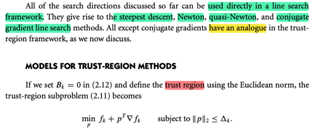</kbd>

<kbd>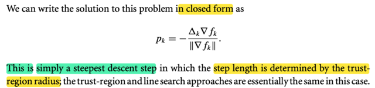</kbd>

> [!NOTE]
> Đại khái là, những **search direction** thảo luận ở trên **đều có thể dùng trực tiếp trong line search để tạo thành steepest descent, Newton, quasi-Newton, conjugate gradient line search** 
>
> Và trừ cái conjugate gradient thì những cái đó **đều có phiên bản tương đương của trust region**
>
> Thế thì tác giả nói, nếu ta cho Bk = 0 trong 2.12 (Chiến lược Trust Region)
>
> m_k(x_k + p) = f_k + pT ∇f_k + (1/2) pT B_k p
>
> sẽ trở thành m_k(x_k + p) = f_k + pT ∇f_k
>
> ====
>
> Ôn lại một chút về trust region: Ý tưởng sẽ là, ta dùng một sự thật là, **khi xét trong một phạm vi đủ nhỏ nào đó (quanh x_k), thì hàm số sẽ hành xử giống như hàm bậc hai**. Cụ thể là như sau: Dựa vào Taylor theorem, nói rằng khi đi từ x đến x + p thì ta có:
>
> f(x + p) = f(x) + ∇f(x_k)Tp + (1/2) pT ∇^2 f(z) p với z là điểm nào đó ∈ (x, x+p)
>
> ≡ f(x + p) = f(x) + ∇f(x_k)Tp + (1/2) pT ∇^2 f(x + tp) p với t là giá trị nào đó ∈ (0, 1)
>
> Và nếu xét trong phạm vi nhỏ nào đó khiến ∇^2 f(x + tp) ≈ ∇^2 f(x) thì ta sẽ có:
>
> f(x + p) ≈ f(x) + ∇f(x_k)Tp + (1/2) pT ∇^2 f(x ) p đây là chính là nói nếu xét trong phạm vi đủ nhỏ quanh x thì có thể coi hàm số hành xử như quadratic function: 
>
> g(p) = f_hat (x + p) = (1/2) pT ∇^2 f(x) p + ∇f(x_k)Tp +  f(x) 
>
> Từ đó, ta sẽ **mô phỏng hàm f bởi một hàm bậc hai, nhưng đảm bảo là chỉ trong một trust region nhất định.**
>
> Để rồi, để tìm pk, ta giải bài toán **minimize quadratic function có constraint**:
>
> minimize m_k (x_k + p) = f_k + pT∇f_k + (1/2)pT B_k p 
>
> constrained ||p|| < trust region radius Δk
>
> Giải ra nếu kiểm tra thấy mức giảm hàm f thực tế ko đạt, thì có nghĩa là trust region đang quá rộng, khiến việc dùng hàm quadratic để mô phỏng hàm f bị sai, ta sẽ thu nhỏ radius lại và làm lại.
>
> Bk trong mk có thể dùng Hessian hoặc dùng một xấp xỉ của Hessian
>
> ====
>
> Quay lại đây, khi Bk = 0, thì ta có bài toán minimize f_k + pT∇f_k subject to ||p|| ≤ Δk
>
> Thế thì, solution có nó có thể có dạng đóng là pk = - Δk ∇f_k / ||∇f_k||
>
> Là sao ta?
>
> Hàm m_k(x_k + p) = f_k + pT∇f_k lúc này là hàm tuyến tính
>
> Và f_k fixed rồi, nên đơn giản là ta minimize pT∇f_k = ||p|| ||∇fk|| cos(θ) subject to ||p|| ≤ Δk
>
> Mà -1 ≤ cos(θ) ≤ 1 ⇨ - ||p|| ||∇f_k|| ≤ ||p|| ||∇f_k|| cos(θ) ≤ ||p|| ||∇f_k|| nên nó sẽ đạt giá trị nhỏ nhất khi:
>
> 1) cos(θ) = -1, tức p = - ∇f_k và
>
> 2) ||p|| = Δk (vì p = max khả năng thì -||p|| mới âm nhỏ nhất)
>
> Do đó solution p là vector:  -(∇f_k / ||∇f_k||) Δk
>
> Và lúc này, đây chính là **steepest descent direction** với step length giới hạn = trust region radius.
>
> Ý tác giả là, à, khi **dùng quadratic function để làm m_k** (mô phỏng hàm f trong phạm vi nhỏ) và **chọn B_k = 0, thì cái descent direction giải ra hóa ra chính là steepest descent direction**

> [!TIP]
> 🤖 **AI Check** — 🟢 Pass — ✅ **100/100** · ✓ Move on
>
> Bài làm của bạn rất xuất sắc! Bạn không chỉ nắm vững thông tin từ tài liệu mà còn mở rộng và giải thích sâu sắc về phương pháp Trust Region, cùng với việc tự suy luận chính xác về trường hợp đặc biệt.
> ## Phân tích chi tiết
>
> ### Điểm mạnh
> *   **Hiểu rõ mối quan hệ Line Search và Trust Region:** Bạn đã dịch và hiểu chính xác về các hướng tìm kiếm (steepest descent, Newton, quasi-Newton, conjugate gradient) trong framework line search và việc các phương pháp này (trừ conjugate gradient) đều có phiên bản tương đương trong framework trust-region.
> *   **Giải thích chính xác về Trust Region:** Phần ôn tập về Trust Region rất chi tiết và mạch lạc. Bạn đã nắm vững ý tưởng cốt lõi là việc xấp xỉ hàm mục tiêu bằng hàm bậc hai trong một vùng đủ nhỏ (trust region) dựa trên định lý Taylor.
> *   **Nắm vững mô hình bậc hai:** Bạn đã nêu ra công thức tổng quát của mô hình bậc hai `m_k(x_k + p) = f_k + p^T ∇f_k + (1/2) p^T B_k p` và hiểu vai trò của `B_k` (có thể là Hessian hoặc xấp xỉ Hessian).
> *   **Xác định đúng bài toán con:** Bạn đã trình bày đúng bài toán tối ưu có ràng buộc của Trust Region: `minimize m_k (x_k + p) = f_k + p^T∇f_k + (1/2)p^T B_k p constrained ||p|| < trust region radius Δk`.
> *   **Suy luận xuất sắc trường hợp B_k = 0:** Bạn đã thực hiện một suy luận tuyệt vời để tìm ra lời giải dạng đóng cho bài toán con khi `B_k = 0`, chứng minh rằng nó chính là hướng steepest descent với độ dài bước bằng bán kính vùng tin cậy `Δ_k`. Đây là một điểm rất mạnh, cho thấy khả năng phân tích và tổng hợp kiến thức.
> *   **Hiểu cơ chế cập nhật vùng tin cậy:** Việc bạn đề cập đến việc điều chỉnh bán kính `Δ_k` dựa trên mức giảm thực tế và mức giảm dự đoán cũng là một điểm cộng lớn, cho thấy bạn hiểu được động lực học của thuật toán Trust Region.
>
> ### Các điểm cần cải thiện
> *   Không có điểm cần cải thiện đáng kể nào về mặt kiến thức. Cách trình bày của bạn đã rất rõ ràng và đầy đủ.
>
> ### Gợi ý để đào sâu hiểu biết
> *   **Khám phá các lựa chọn cho B_k:** Hãy tiếp tục tìm hiểu sâu hơn về các lựa chọn khác nhau cho ma trận `B_k` (ví dụ: Hessian chính xác trong phương pháp Newton, hoặc các ma trận xấp xỉ Hessian như trong quasi-Newton) và cách chúng ảnh hưởng đến tính chất của hướng tìm kiếm `p_k` cũng như hiệu suất của thuật toán.
> *   **Nghiên cứu các phương pháp giải bài toán con Trust Region:** Khi `B_k` không phải là ma trận không, việc giải bài toán con Trust Region trở nên phức tạp hơn. Bạn có thể tìm hiểu các thuật toán như Dogleg method, Steihaug-Toint method để hiểu cách tìm `p_k` trong các trường hợp đó.
> *   **Phân tích sự hội tụ:** Nghiên cứu các điều kiện hội tụ của thuật toán Trust Region và so sánh chúng với các phương pháp Line Search để thấy được ưu nhược điểm của từng phương pháp.
>
>
> **⭐ Bonus points**
> - Giải thích chi tiết nguyên lý hoạt động của phương pháp Trust Region dựa trên định lý Taylor và việc xấp xỉ hàm mục tiêu bằng hàm bậc hai trong một vùng tin cậy.
> - Nêu chính xác công thức tổng quát của mô hình bậc hai (quadratic model) được sử dụng trong Trust Region.
> - Trình bày chi tiết cơ chế cập nhật bán kính vùng tin cậy Δk dựa trên tỷ lệ giữa mức giảm thực tế và mức giảm dự đoán.
> - Suy luận và chứng minh chính xác dạng đóng của lời giải cho bài toán con Trust Region khi ma trận xấp xỉ Hessian B_k bằng 0, chỉ ra rằng đó chính là hướng steepest descent.

**🔗 See also:** [Chiến lược Trust Region](#node-5xc69wg)

 

###### Thuật toán vùng tin cậy Hessian

<kbd>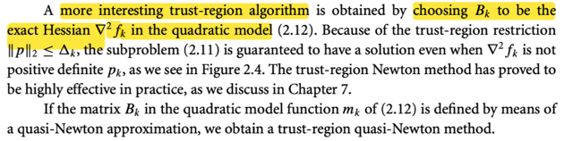</kbd>

> [!NOTE]
> QUAY LẠI SAU

 

###### Vấn đề Scaling trong tối ưu

<kbd>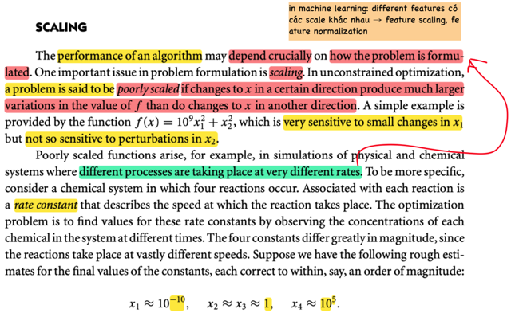</kbd>

<kbd>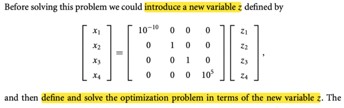</kbd>

<kbd>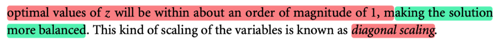</kbd>

> [!NOTE]
> Đại khái là, hiệu quả của thuật toán tối ưu sẽ **PHỤ THUỘC CỰC LỚN VÀO CÁCH MÀ VẤN ĐỀ ĐƯỢC FORMULATED.**
>
> Và một vấn đề quan trọng của cái này là **SCALING**.
>
> Trong bài toán tối ưu ko ràng buộc, một problem được gọi là **POORLY SCALED nếu thay đổi x theo một hướng này  khiến hàm số tăng hay giảm nhanh hơn là hướng khác** (nhạy cảm hơn)
>
> Và ông nói đại khái là vấn đề này xuất hiện trong các ví dụ như trong **các hệ thống mà có nhiều process diễn ra với tốc độ khác nhau**.
>
> Và đại khái như có 4 feature x1, x2,...x4 thì **x1 có các value scale** khác nhau. ví dụ như x1 thì cỡ 10^(-10), x2, x3 thì cỡ 1 (ý là 1-10) còn x4 cỡ 10^5
>
> Đại khái là bằng cách **tạo một feature vector khác z**, **liên hệ với x bởi matrix này**, thì **z sẽ có range xem xem** với nhau hơn. 
>
> Đây gọi là diagonal scaling (mình nghĩ: đây chính là một dạng feature scaling)

> [!TIP]
> 🤖 **AI Check** — 🟢 Pass — ⚠️ **82/100** · ✓ Move on
>
> Bản ghi chú tóm tắt rất chính xác và đầy đủ các thông tin có trong hình ảnh. Tuy nhiên, phần cuối về "feature vector z" và "diagonal scaling" không xuất hiện trong hình ảnh được cung cấp, do đó ghi chú không hoàn toàn dựa trên nguồn ảnh này.

 

###### Scaling, Steepest Descent, Newton

<kbd>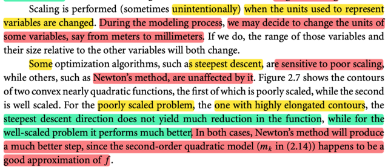</kbd>

<kbd>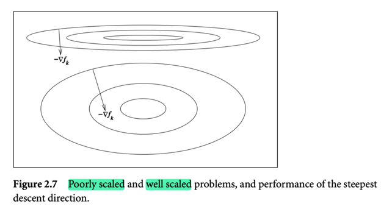</kbd>

> [!NOTE]
> Như ở đây, chính là nói cái mà ta gặp trong machine learning, **khi các feature có các đơn vị đo khác nhau dẫn đến range của chúng khác nhau ⇨ tạo ra vấn đề poorly scaled**.
>
> Do đó trong quá trình modeling (phát triển mô hình) ta** cần thay đổi units của các variable sao cho chúng có range xem xem nhau** (đây chính là feature scaling, hay standardization)
>
> Cuối cùng **một số thuật toán như steepest descent rất bị ảnh hưởng bởi poor scaling**, như mình đến giờ này thì đã hiểu, và sẽ còn gặp lại phân tích này ở chương sau nữa, **đó là vì nó chọn hướng dốc nhất nên gặp poorly scaled, nó sẽ nhảy qua nhảy lại giữa hai sườn dốc** → chậm hội tụ
>
> Còn **Newton method THÌ LẠI ÍT BỊ  ẢNH HƯỞNG**, do nó dùng quadratic approx, nên về cơ bản **kể cả là poorly scale, thì miễn là hàm số có thể được approx tốt ở dạng quadratic** (mà trong hình thì chính là vậy, dù hình trên hay hình dưới) thì newton direction & step sẽ đều chính xác - chỉ ngay đến minimum

> [!TIP]
> 🤖 **AI Check** — 🟢 Pass — ✅ **98/100** · ✓ Move on
>
> Phân tích của bạn rất chính xác và chi tiết, thể hiện sự hiểu biết sâu sắc về khái niệm scaling và ảnh hưởng của nó đến các thuật toán tối ưu hóa khác nhau.
> ### Phân tích chi tiết
>
> #### Điểm mạnh:
> *   **Hiểu đúng nguyên nhân Poorly Scaled:** Bạn đã nhận diện chính xác nguyên nhân của vấn đề 'poorly scaled' là do các 'feature' (biến) có đơn vị đo khác nhau dẫn đến 'range' khác nhau, một liên hệ rất tốt với Machine Learning.
> *   **Nhận diện chính xác giải pháp:** Việc bạn liên hệ 'thay đổi units' để có 'range xem xem nhau' với 'feature scaling, hay standardization' là hoàn toàn đúng và thể hiện kiến thức thực tế.
> *   **Phân biệt rõ ràng độ nhạy cảm của thuật toán:** Bạn đã phân biệt chính xác Steepest Descent là thuật toán rất nhạy cảm với poor scaling, trong khi Newton's Method thì ít bị ảnh hưởng.
> *   **Giải thích sâu sắc về Steepest Descent:** Cách bạn mô tả Steepest Descent 'nhảy qua nhảy lại giữa hai sườn dốc' dẫn đến 'chậm hội tụ' khi gặp poorly scaled (các đường đồng mức bị kéo dài) là một giải thích tuyệt vời và trực quan, đúng với bản chất của thuật toán.
> *   **Giải thích chính xác về Newton's Method:** Bạn đã nắm vững lý do Newton's Method ít bị ảnh hưởng là nhờ sử dụng 'quadratic approximation' và khả năng hàm số được xấp xỉ tốt ở dạng bậc hai, giúp xác định hướng đi và bước nhảy chính xác hơn nhiều.
>
> #### Các điểm cần cải thiện:
> *   Không có điểm nào cần cải thiện đáng kể. Bài phân tích của bạn đã rất toàn diện và chính xác theo tài liệu tham khảo.
>
> #### Gợi ý để đào sâu hiểu biết:
> *   Bạn có thể tìm hiểu thêm về các phương pháp 'feature scaling' cụ thể như Min-Max Scaling, Standardization (Z-score normalization) và khi nào nên sử dụng từng phương pháp.
> *   Nghiên cứu sâu hơn về hình học của các bề mặt hàm số (contours) và cách các thuật toán di chuyển trên các bề mặt đó để củng cố thêm hiểu biết về hiệu suất của chúng.
>
> **⭐ Bonus points**
> - Kết nối vấn đề poorly scaled với bối cảnh Machine Learning (khi các feature có đơn vị đo khác nhau).
> - Giải thích mục đích của feature scaling/standardization là để làm cho các biến có range tương tự nhau.
> - Cung cấp giải thích chi tiết về lý do steepest descent chậm hội tụ trên các mặt lồi bị kéo dài (elongated contours) bằng cách 'nhảy qua nhảy lại giữa hai sườn dốc'.

 

###### Thiết kế thuật toán bất biến tỉ lệ

<kbd>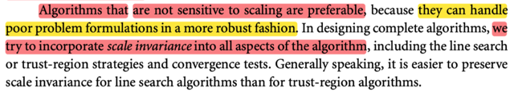</kbd>

> [!NOTE]
> Cuối cùng, việc thiết kế một thuật toán tối ưu mà ít nhạy cảm với scaling thì tốt hơn.
>
> Và người ta sẽ cố gắng thiết kế tính chất này vào mọi khía cạnh của thuật toán tối ưu như line search, trust region và convergence test
>
> Đó gọi là tính chất **SCALE INVARIANCE**

 

