# 3.1 Line Search Method: Step Length

📊 **Progress:** `13` Notes | `20` Screenshots | `10` AI Reviews

---

> [!NOTE]
> Line Search Method: Step Length

 

## Hướng tìm kiếm và sải bước

<kbd>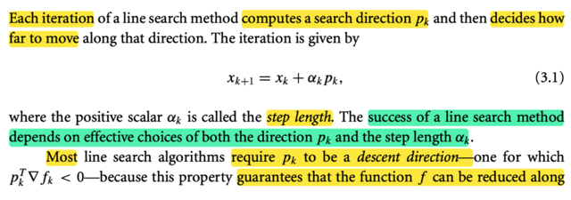</kbd>

<kbd>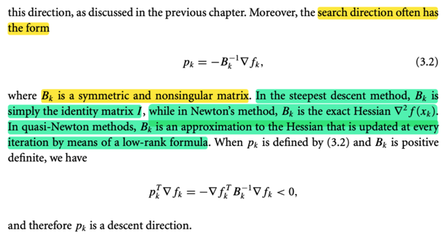</kbd>

<kbd>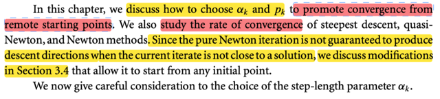</kbd>

> [!NOTE]
> Rồi, như đã biết ở phần trước, trong line search, ở mỗi iteration, ta sẽ 1) **xác định hướng pk**, và 2) **xác định sải bước**. Để thực hiện bước đi:
>
> x_(k+1) = x_k + αk p_k
>
> Và **hai bước này tốt thế nào sẽ quyết định chất lượng của thuật toán**.
>
> Tác giả cho biết **phần lớn line search algo đều yêu cầu p_k là descent direction**, tức p_k . ∇f_k (directional derivative wrt p_k không âm)** nhằm đảm bảo là ta sẽ giảm hàm f** khi đi theo hướng đó (tất nhiên phải có step size phù hợp nữa)
>
> Thế thì như **search direction có dạng chung chung là pk = -(Bk)inv ∇f_k**
>
> Để khi Bk là I thì pk = - ∇f_k, chính là steepest descent direction
>
> Còn Bk là Hessian ∇^2 f_k thì nó chính là - (∇^2f_k)inv ∇f_k, là Newton direction
>
> Còn khi Bk được chọn là một xấp xỉ gần đúng của Hessian như trong công thức ở phần trước thì ta có quasi-Newton direction
>
> Và khi **miễn là đảm bảo Bk positive definite** thì ta **chắc chắn pk = -(Bk)inv ∇fk sẽ là
> descent direction**: Đơn giản là vì khi đó directional derivative wrt pk:
>
> = p_k . ∇f_k = - ∇fkT (Bk)inv ∇fk là (negative) quadratic form của (Bk)inv cũng là positive definite ⇨ luôn âm miễn là gradient ∇fk ko vanish.
>
> ====
>
> Chapter này mình sẽ **bàn về việc chọn step size và pk**, cũng như **phân tích tốc độ hội tụ** của các phương pháp

 

### Đánh đổi trong độ dài bước

<kbd>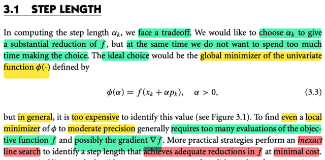</kbd>

<kbd>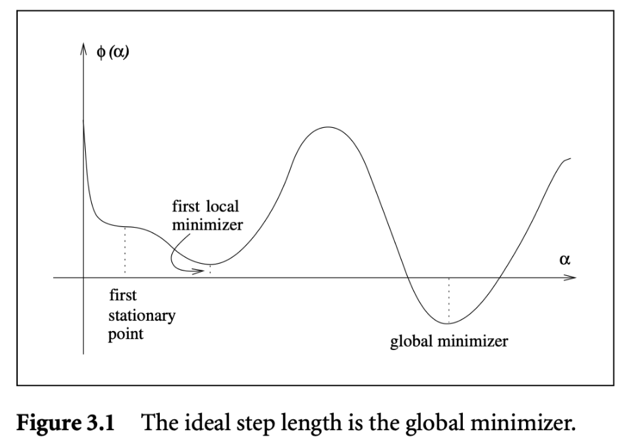</kbd>

> [!NOTE]
> Đại khái là khi tìm step length αk, ta phải gặp một đánh đổi: Muốn** tìm được αk tối ưu thì phải hi sinh chi phí tính toán** nhiều. Vì lựa chọn lí tưởng là giải bài toán univariate: 
>
> minimize Φ(α)  = f(x_k + α p_k), α > 0.
>
> Nhưng để giải bài toán này thì **đại khái là ta phải inference hàm f và có thể là cả gradient ∇f rất nhiều lần** → tăng chi phí.
>
> Do đó thường người ta sẽ dùng **cách tiếp cận INEXACT, tìm αk giúp giảm f đủ tốt nhưng với chi phí tính toán tối thiểu**.
>
> (cái này mình đã học trong Convex Optimization ở đây chỉ nhắc lại thôi)

 

#### Line Search: Điều kiện Giảm Đủ

<kbd>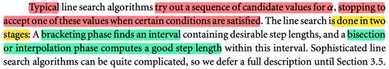</kbd>

<kbd>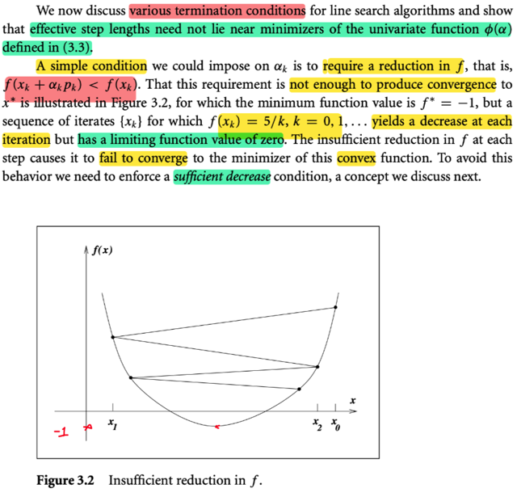</kbd>

> [!NOTE]
> Đại khái là **một thuật toán line search điển hình** sẽ làm việc sau:** Thử nhiều giá trị của α cho đến khi chọn được cái phù hợp** (thỏa một condition nào đó)
>
> Và nó làm theo hai phase: 
>
> 1) là **bracketing một khoảng mà sẽ chứa α tốt**, 
>
> 2) là **dùng bisection hay interpolation để tìm ra α đó** nhờ mấy bài của AlgoForOpt mà mình cũng đã biết qua vụ này.
>
> Thế thì, đầu tiên là nói về **điều kiện khi nào thì dừng tìm kiếm** (termination condition) step length, tức là khi nào thì ok.
>
> Đại khái một cách đơn giản đầu tiên, là **cứ chọn αk sao cho f(xk + αkpk) nhỏ hơn f(xk) là được**. 
>
> Và giáo sư minh họa ở đây ví dụ như cứ làm sao cho f(xk) = 5/k, thì **dù là cách làm này vẫn giúp giảm f sau mỗi iteration, nhưng nó SẼ KO BAO GIỜ CONVERGE về local minimizer**, nơi mà f* = -1, vì cách làm này sẽ chỉ đưa f về 0 là hết cỡ.
>
> Có nghĩa là giáo sư đưa ra ví dụ này đề minh họa rằng, c**ách chọn αk theo tiêu chí cứ để f sau thấp hơn f trước là KHÔNG ĐỦ** (mọi chuyện ko đơn giản như vậy)
>
> Do đó, ta sẽ phải thiết lập một cái gọi là **SUFFICIENT DECREASE** condition, hiểu nôm na là điều kiện này **quy định mức giảm phải đủ lớn**

> [!TIP]
> **🤖 AI Feedback** — ✅ Score: **95/100**
>
> Ghi chú đã tóm tắt chính xác định nghĩa và hai giai đoạn của thuật toán line search từ hình ảnh. Ngoài ra, ghi chú còn cung cấp thêm ngữ cảnh và độ sâu rất tốt về các điều kiện để chọn độ dài bước, giúp nâng cao đáng kể sự hiểu biết về chủ đề.

 

##### Điều kiện giảm đủ Armijo

<kbd>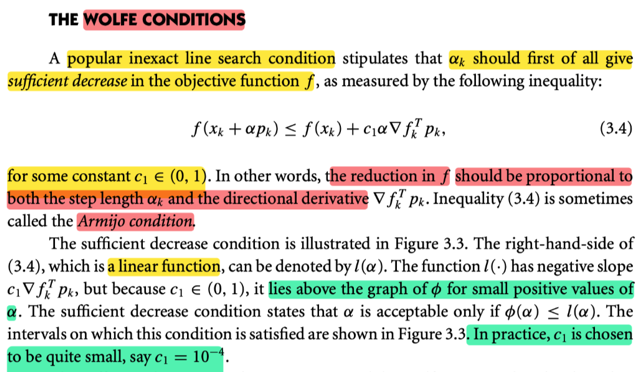</kbd>

<kbd>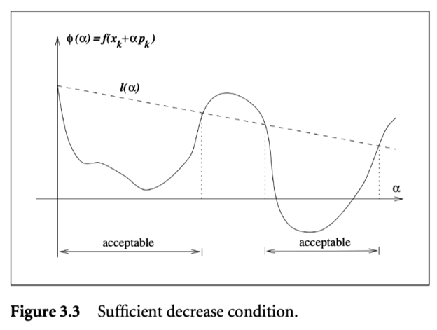</kbd>

> [!NOTE]
> Đại khái là, đây một loại condition cho inexact line search phổ biến, qui định rằng yêu cầu đầu tiên cho αk đó là nó phải khiến **tạo ra một mức giảm đủ lớn** (sufficient decrease) đối với function f, thể hiện bởi:
>
> f(xk + αpk) ≤ f(xk) + c1 α (∇fk)T pk với c1 có giá trị nào đó trong (0,1)
>
> Và ý nghĩa của cái này là, mức giảm tối thiểu của f phải tỉ lệ thuận với step length αk và directional derivative (∇fk)T pk. Là sao? 
>
> ⇨ Thì cái trên ⇔ f(xk) - f(xk + αpk) ≥ - c1 α (∇fk)T pk
>
> ⇔ mức giảm của f ≥ - c1 α (∇fk)T pk, và đây đương nhiên là hàm tuyến tính của pk và α. Tức là nếu giữ pk, thì nó tuyến tính theo α và ngược lại. 
>
> Điều kiện này còn có tên là **Armijo condition**.
>
> HÌnh 3.3 minh họa điều này.
>
> Đường thẳng l(α) chính là l(α) = f(xk) + c1 α ∇fkTpk, nó có độ dốc âm (vì c1∇fkTpk âm: pk là hướng descent direction của f, nên ∇fkTpk âm, nhân với c1 dương nữa, nên vẫn âm).
>
> Nhưng vì **có c1, nên nó sẽ nằm trên Φ(α) = f(xk + αpk) nếu α nhỏ**. Là sao?
>
> ⇨ Là vì hàm **Φ(α), là hàm f, giới hạn trên một direction là pk, trở thành hàm đơn biến theo α,** trong đó, **đạo hàm của nó tại α = 0, như đã biết, là directional derivative của f đối với hướng pk**, = ∇fkTpk, mang giá trị âm.
>
> Thế thì, **độ dốc của hàm Φ tại điểm ban đầu lớn hơn độ dốc của l(α) tại đó,
> do với l(α) đã được điều chỉnh bởi c1.**
>
> Do đó khi **xuất phát từ xk thì tạm thời l(α) sẽ cao hơn Φ(α)**. Nhưng **đi xa hơn thì ko chắc vì hàm Φ phi tuyến, có thể nó sẽ vọt lên**
>
> Vậy thì theo hình, **những giá trị α khiến mức giảm của hàm f (theo hương pk, tức là Φ(α)) ít nhất là bằng mức giảm của hàm l(α) sẽ tạo nên một khoảng các giá trị α acceptable, tức thỏa Amijo condition.**
>
> Thực tế thì người ta thường chọn c1 = 10^-4

> [!TIP]
> **🤖 AI Feedback** — ✅ Score: **98/100**
>
> Bản ghi chú rất chính xác và có chiều sâu, đặc biệt trong việc giải thích mối quan hệ giữa l(α) và Φ(α) khi α nhỏ. Các giải thích chi tiết giúp người đọc hiểu rõ hơn về điều kiện Armijo.

**🔗 See also:** [Chứng minh theorem 3.2](./32_line_search_method_convergence_of_line_search_methods.md#node-hyrj1r6) · [Interpolation](./35_line_search_method_step_length_selection_algorithms.md#node-0wgi08b)

 

###### Điều kiện cong và ý nghĩa

<kbd>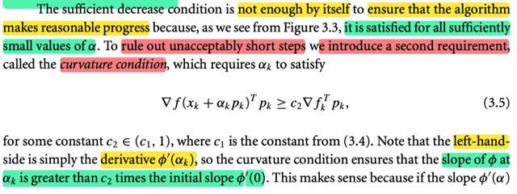</kbd>

<kbd>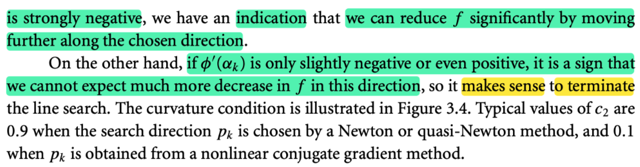</kbd>

> [!NOTE]
> Đại khái là **điều kiện "giảm đủ" (sufficient decrease) không đủ để đảm bảo thuật toán sẽ có  được một tiến triển tốt**, vì rất dễ hiểu là chỉ cần α rất nhỏ là đảm bảo sẽ thỏa được Armijo condition. Mà α nhỏ quá thì ko được vì sẽ rất chậm.
>
> Do đó người ta mới thêm một điều kiện nữa: **Curvature condition**.
>
> ∇f(xk + αkpk)Tpk ≥ c2 ∇fkTpk
>
> Vế trái, tương tự như ∇fkTpk, là directional derivative của f wrt pk tại xk, thì.. 
>
> **∇f(xk + αkpk)Tpk là directional derivative wrt pk tại xk + αkpk**
>
> Và vì đã hiểu **directional derivative của hàm f wrt pk thì cũng là đạo hàm hàm Φ(α) = f(xk + αpk)** nên: 
>
> (∇)_(pk) f(x)|x=xk = Φ'(α)|α=0, mang ý nghĩa là độ dốc theo hướng pk tại điểm đầu: xk
>
> Và (∇)_(pk) f(x)|(x=xk + αkpk) = Φ'(α)|α=αk, mang ý nghĩa là độ dốc theo hướng pk tại điểm "bước tới": xk + αkpk
>
> Do đó, điều kiện này chính là:
>
> Φ'(α)|α=αk ≥ c2 Φ'(α)|α=0
>
> Và ý nghĩa là **αk phải làm sao để khi bước tới đó (xk + αkpk) thì độ dốc (theo hướng pk) tại đó (Φ'(α)|α=αk) phải bớt dốc hơn** (≥) (nói đúng theo toán học là tăng, để từ rất âm thành bớt âm, chính là bớt dốc xuốc hơn), **so với độ dốc tại điểm đầu được điều chỉnh bởi c2**, là một con số ∈ (c1, 1)
>
> Và ý nghĩa của cái điều kiện thứ 2 là, **nếu như tại xk mà độ dốc chưa thỏa curvature condition**, tức là độ dốc tại đó, chưa bớt dốc xuống hơn so với điểm đầu, **đồng nghĩa là nó còn đang rất dốc, thì đó là dấu hiệu rằng ta nên đi tiếp vì hàm f còn giảm nhiều thêm nữa**. 
>
> Ngược lại, **nếu nó đã thỏa, tức là độc dốc đã bớt âm đi nhiều, thì đó là dấu hiệu việc đi tiếp ko còn giúp giảm thêm f đáng kể nữa thì nên dừng**
>
> ====
>
> Sách cũng cho biết giá trị thường dùng của c2

> [!TIP]
> **🤖 AI Feedback** — ✅ Score: **100/100**
>
> Giải thích rất chính xác và chi tiết, đặc biệt là phần diễn giải ý nghĩa của điều kiện độ cong trong việc xác định độ dốc và hành động tiếp theo trong thuật toán tối ưu. Nội dung phân tích khớp hoàn toàn với hình ảnh và cung cấp thêm chiều sâu đáng kể.

 

###### Minh họa điều kiện đường cong

<kbd>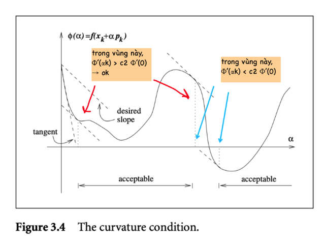</kbd>

> [!NOTE]
> Minh họa điều kiện curvature condition, đường dash line tangent là có độ dốc là đạo hàm Φ'(0), tức ∇fkTpk, ta muốn adjust chút xíu bởi c2, để có độ dốc mong muốn c2∇fkTpk tức, ta muốn độ dốc tại xk + αkpk phải lớn hơn giá trị này, và kết quả là những vùng  mà tại đó đường cong hàm Φ bắt đầu có độ dốc lớn hơn c2∇fkTpk sẽ là vùng acceptable.
>
> Có thể cần giải thích thêm nếu chưa rõ:
>
> Cái điểm α tại vị trí mũi tên đỏ thứ nhất, chính là giá trị mà độ dốc của hàm Φ bắt đầu lớn hơn độ dốc ban đầu có adjust bởi c2 (c2 Φ'(0)) và hãy để ý trong khoảng từ đó đến đầu mũi tên đỏ thứ hai thì độ dốc hàm Φ luôn luôn lớn lớn hơn c2 Φ'(0) 
>
> Nhưng sau đó thì nó bắn đầu nhỏ hơn (đường cong hàm cắm đầu đi xuống tại điểm mũi tên xanh thứ nhất), và duy trì như vậy cho đến mũi tên xanh thứ hai), tạo nên đoạn không thỏa Curvature condition.
>
> Và từ mũi tên xanh thứ hai thì độ dốc lại tăng (hàm quay đầu đi lên) nên nó cũng là vùng mà Curvature condition bắt đầu thỏa.

> [!TIP]
> **🤖 AI Feedback** — ✅ Score: **90/100**
>
> Bài giải thích rất chi tiết và đúng đắn về điều kiện độ cong (curvature condition) và cách nó được minh họa trên đồ thị. Tuy nhiên, có một điểm chưa rõ ràng trong câu cuối cùng khi mô tả "độ dốc lại giảm" trong khi hàm "quay đầu đi lên", vì khi hàm quay đầu đi lên thì độ dốc đang tăng.

 

###### Điều kiện Wolfe và Wolfe mạnh

<kbd>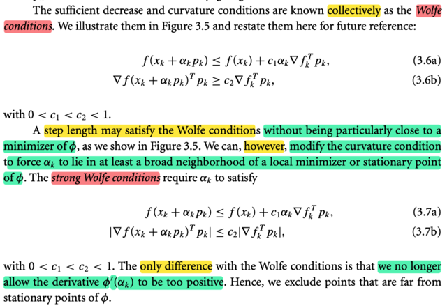</kbd>

> [!NOTE]
> Hai cái điều kiện này cùng nhau tạo thành **Wolfe condition**.
>
> Tuy nhiên, còn một vấn đề là: **Thỏa cái này, cũng chưa chắc đảm bảo ta có một α nằm gần local minimizer.**
>
> Do đó **người ta điều chỉnh cái curvature condition chút xíu**, để **ép αk phải
> nằm trong một vùng lân cận rộng (broad neighborhood) của local minimizer** 
>
> Từ đó ta có **Strong Wolfe condition**:
>
> f(xk + αkpk) ≤ f(xk) + c1 αk ∇fkTpk (**Armijo**)
>
> |∇f(xk + αkpk)Tpk| ≤ c2|∇fkTpk| (**Strong Curvature condition**)
>
> Và ý nghĩa của nó là, tại xk + αkpk, **độ dốc phải vừa bớt âm nhưng cũng ko được qúa dương**

> [!TIP]
> **🤖 AI Feedback** — ✅ Score: **98/100**
>
> Nội dung tóm tắt rất chính xác và đầy đủ, truyền tải đúng ý nghĩa của các điều kiện Wolfe và Strong Wolfe từ văn bản gốc. Việc bổ sung tên riêng cho từng điều kiện (Armijo, Strong Curvature condition) cũng giúp tăng thêm độ sâu cho phần giải thích.

**🔗 See also:** [Interpolation](./35_line_search_method_step_length_selection_algorithms.md#node-0wgi08b) · [A line search algorithm for Wolfe condition](./35_line_search_method_step_length_selection_algorithms.md#node-umkxucl)

 

###### Điều kiện Wolfe

<kbd>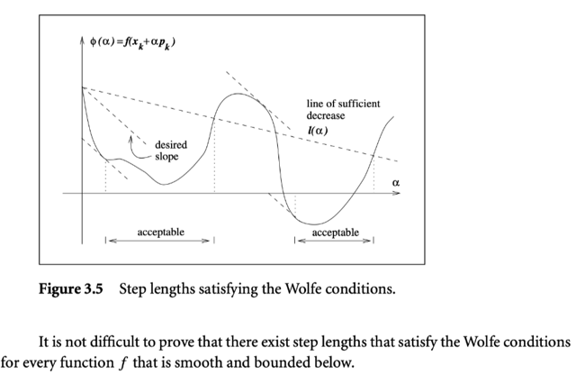</kbd>

> [!NOTE]
> kết hợp Armijo và Curvature condition.

> [!TIP]
> **🤖 AI Feedback** — ⚠️ Score: **85/100**
>
> Ghi chú này rất chính xác khi nêu bật sự kết hợp của điều kiện Armijo và Curvature tạo nên các điều kiện Wolfe, điều này hoàn toàn phù hợp với hình minh họa. Để tăng thêm chiều sâu, bạn có thể bổ sung giải thích ngắn gọn về ý nghĩa hoặc vai trò của từng điều kiện.

 

###### Chứng minh tồn tại độ dài bước Wolfe

<kbd>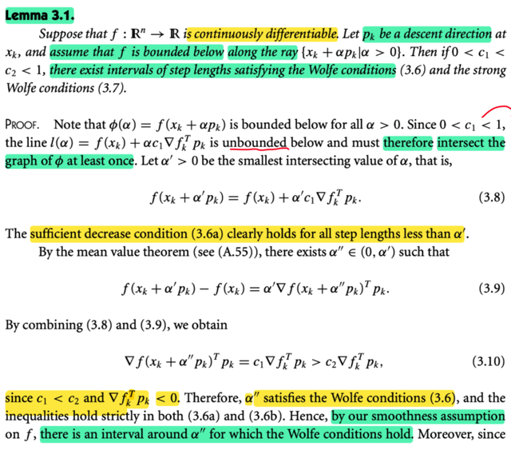</kbd>

<kbd>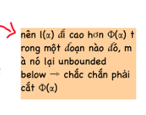</kbd>

<kbd>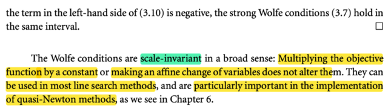</kbd>

> [!NOTE]
> Đại khái là bổ đề này nói rằng, cho hàm f continuously differentiable, p_k là descent direction tại x_k và giả sử f bounded below theo tia x_k + α p_k | α > 0 thì: 
>
> **Nếu 0 < c1 < c2 < 1, thì, chắc chắn tồn tại step length thỏa Wolfe condition, và Strong condition **
>
> (Nói chung cái bổ đề này nhằm chứng minh, khi đặt ra cái condition kiểu đó thì nhất định sẽ có điểm thỏa, chứ ko phải là vô lí)
>
> Đại ý là chứng minh như sau:
>
> Vì đã giả định là hàm f bị chặn dưới theo tia x_k + α p_k | α > 0, tức là sao? 
>
> Tức là **hàm Φ(α) = f(x_k + α p_k) sẽ (nôm na là) không đi xuống hoài đến -∞** được.
>
> Trong khi đó, xét hàm tuyến tính:
>
> l(α) = f(x_k) + α c1 ∇f_k T p_k
>
> Nó sẽ unbounded below, vì nó có thể kéo xuống - inf. Bên cạnh đó, độ dốc của l(α) tại điểm bắt đầu (α = 0) lại bớt âm hơn độ dốc của hàm Φ tại đó, như đã nói ở trên (do độ dốc của nó được điều chỉnh bởi c1 khiến nó bớt dốc xuống hơn so với độ dốc của f theo phương p_k tại x_k: c1 ∇f_k T p_k sẽ bớt âm hơn ∇f_k T p_k). 
> Điều này đồng nghĩa trong một giai đoạn nào đó, hàm l sẽ đi cao hơn hàm Φ nhưng sau đó
> Φ sẽ đi lên, còn I tiếp tục đi xuống. 
>
> Mà như vậy thì có nghĩa là phải có lúc nào đó (α' nào đó) l sẽ cắt Φ. Và ta gọi tại đó là α'.
>
> Như vậy ta có: Φ(α') = l(α') (cắt nhau, nên giá trị hàm Φ và I bằng nhau)
>
> Hay, f(x_k + α' p_k) = f(x_k) + α' c1 ∇f_k T p_k
>
> ⇔ f(x_k + α' p_k) - f(x_k) = α' c1 ∇f_k T p_k (1)
>
> Tiếp, xét đoạn từ 0 đến α' (làm việc với hàm Φ):
>
> Thì theo mean value theorem, mà bản chất cũng là Taylor theorem:
>
> Nhắc lại Taylor theorem: Đi từ a → b, thì sẽ có: 
>
> f(b) = f(a) + f'(c)(b-a) với c nằm đâu đó trên khoảng (a,b) 
>
> Do đó, Φ(α') = Φ(0) + Φ'(ξ)α' với some ξ nằm trong (0, α')
>
> ⇨ α' Φ'(ξ) = Φ(α') - Φ(0) = f(x_k + α' p_k) - f(x_k) 
>
> ⇨ f(x_k + α' p_k) - f(x_k) = α' Φ'(ξ) (1)
>
> Mà Φ(α) = f(x_k + α p_k), thì Φ'(α) =  d/dα Φ(α)
>
> = d/dα f(x_k + α p_k) 
>
> = d/d(x_k + α p_k) f(x_k + α p_k) ∘ d/dα (x_k + α p_k)
>
> = ∇f(x_k + α p_k) ∘ p_k
>
> (Có thể chứng minh d/dα (x_k + α p_k) = p_k theo cách của MIT 18s096 như sau:
>
> Xét g(α) = x_k + α p_k, dg = g(α + dα) - g(α) = (x_k + α p_k + dα p_k) - (x_k + α p_k)
>
> = dα p_k. Như vậy dg = p_k dα. Mà hàm g là scalar - vector function, nên dg/dα sẽ là 
> vector. Mà ta đang có dg = p_k dα, là linear operator act on dα nên p_k chính là g')
>
> Và dĩ nhiên Φ(α) là scalar - scalar, nên 
>
> ∇f(x_k + ξ p_k)T p_k. Nên kết quả trên.. ∇f(x_k + α p_k) ∘ p_k phải là dot product của hai vector
>
> => (1) = α' ∇f(x_k + ξ p_k)T p_k (2)
>
> Từ (1) và (2) ⇨  α' c1 ∇f_k T p_k = α' ∇f(x_k + ξ p_k)T p_k
>
> ⇔ c1 ∇f_k T p_k = ∇f(x_k + ξ p_k)T p_k
>
> ⇔ ∇f(x_k + ξ p_k)Tpk = c1 ∇f_k T p_k
>
> Mà assumption c1 < c2, đồng thời ta có ∇f_k T p_k âm
>
> → ∇f(x_k + ξ p_k)T p_k = c1 ∇f_k T p_k < c2 ∇f_k T p_k
>
> Như vậy, tại ξ, thì ta đã thỏa curvature condition (vì mean value theorem, nói nhất định phải tồn tại ξ)
>
> Và thêm vài ý râu ria nữa giúp kết luận có thể chứng minh tồn tại  điểm thỏa
>
> Cuối cùng gs cho biết cái Wolfe condition có tính chất scale-invariant. Nhân hàm với constant hay thực hiện một affine change ko làm thay đổi.

> [!TIP]
> **🤖 AI Feedback** — ✅ Score: **98/100**
>
> Tuyệt vời! Bạn đã nắm bắt rất chính xác và chi tiết nội dung của bổ đề cũng như các bước chứng minh. Khả năng giải thích sâu sắc về định lý giá trị trung bình và đạo hàm của Φ(α) thực sự ấn tượng, cho thấy sự hiểu biết rất vững chắc về kiến thức nền tảng.

 

###### Các điều kiện Goldstein

<kbd>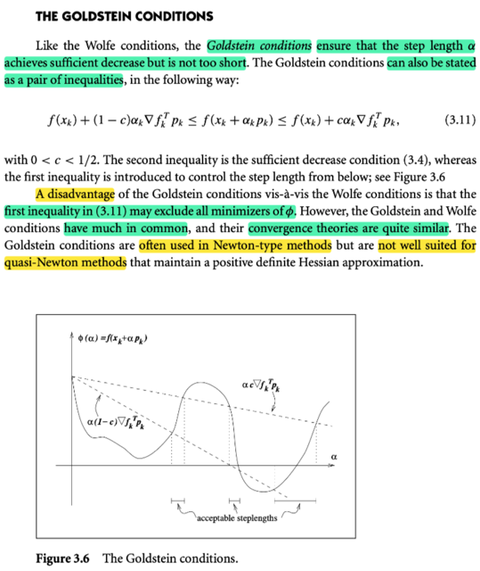</kbd>

> [!NOTE]
> Nói về GoldStein conditions, đại khái là nó cũng khá giống Wolfe condition, khi nó yêu cầu:
>
> f(x_k + α_k p_k) ≤ f(x_k) + c α_k ∇f_k T p_k (chính là Amijo conds)
>
> Còn điều kiện kia là f(x_k) + (1 - c) α_k ∇f_k T p_k ≤ f(x_k + α_k p_k)
>
> QUAY LẠI SAU

> [!TIP]
> **🤖 AI Feedback** — ❌ Score: **55/100**
>
> Em đã nhận diện đúng các điều kiện Goldstein và trình bày được hai bất đẳng thức cấu thành. Tuy nhiên, điều kiện đầu tiên không phải là điều kiện Armijo, và em có thể bổ sung thêm về ý nghĩa từng điều kiện cũng như ưu nhược điểm của chúng.

 

###### Sufficient Decrease And Bactracking

<kbd>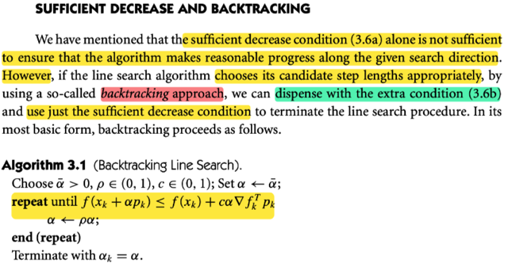</kbd>

> [!NOTE]
> Đại khái là, như phần trước có nói, **nếu chỉ dựa vào sufficient decrease condition** (Armijo) thì sẽ **ko đủ** để đảm bảo chọn được α khiến thuật toán tiến triển tốt vì **chỉ cần α nhỏ là nó sẽ thỏa**.
>
> Do đó mới có thêm cái **curvature condition**.
>
> Nhưng **có một cách làm khác, ko cần dùng đến curvature condition**.
>
> Đó là thông qua backtracking approach:
>
> Đại khái ta **bắt đầu với αbar nào đó**, ví dụ = 1 khi dùng line search với Newton direction (tức pk là Newton direction).
>
> Sau đó thuật toán sẽ **giảm dần α (ban đầu gán bởi αbar) bởi một factor ρ**. Cho đến khi nó thỏa Armijo condition thì dừng việc tìm α

> [!TIP]
> **🤖 AI Feedback** — ✅ Score: **98/100**
>
> Giải thích rất rõ ràng và nắm bắt được bản chất của cách tiếp cận backtracking giúp loại bỏ điều kiện độ cong riêng biệt, chỉ sử dụng điều kiện giảm đủ. Các bước của thuật toán backtracking cũng được mô tả chính xác và có thêm ví dụ thực tế về cách chọn αbar.

 

###### Backtracking: Chiều dài bước nhảy

<kbd>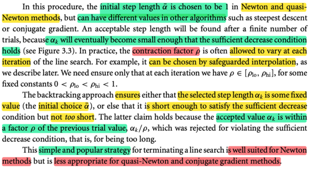</kbd>

> [!NOTE]
> Đại khái là, như vừa nói, ta sẽ **scale dần α xuống bởi ρ**, là con số nằm trong (0,1). 
>
> Thì **cái factor rho này có thể được phép thay đổi tại mỗi iteration của line search** nữa (cái này sẽ nói rõ hơn ở các phần sau)
>
> Ý cuối, là backtracking đảm bảo là giá trị αk được chọn sẽ: 
> 1) Là giá trị **fixed** (ví dụ như **αbar đã thỏa armijo ngay**), thì lần nào cũng sẽ  dùng α = αbar 
>
> (mình hiểu vụ này từ ee364a, khi trong Newton method **đã qua Newton phase thì nó (line search algorithm) sẽ luôn chọn step factor = 1**)
>
> 2) Là **một giá trị nhỏ đủ để thỏa Armijo** (vì nếu α_bar ko thỏa thì scale nó vài lần nó sẽ nhỏ đủ để thỏa)
>
> 3) **Không quá nhỏ**. Ý này đơn giản thôi. Ta biết rằng thuật toán sẽ lặp lại quá trình: 
>
> check → scale xuống, check → scale xuống cho đến khi thỏa.
>
> Vậy gọi α* là giá trị thỏa, thì cái mức trước đó ko thỏa sẽ phải là α' = (α*/ρ) vì nó ko thỏa nên nó mới bị scale xuống bởi rho: ρ * α' để có α* thỏa.
>
> Vậy n**ếu giả sử α' quá dài, nên ko thỏa, thì ko thể nào chỉ scale nó xuống bởi ρ mà nó trở thành quá ngắn được**, đại khái là vậy
>
> Cuối cùng gs cho biết **backtracking phù hợp với Newton method** nhưng** ít phù hợp với quasi-Newton hay conjugate gradient**
>
> (Có lẽ vì với tối ưu lồi hầu như Newton method đóng vai trò quan trọng nên trong Convex Optimization, mình nhớ initial α (trong sách đó là t hay sao á) = 1

> [!TIP]
> **🤖 AI Feedback** — ✅ Score: **98/100**
>
> Ghi chú của học sinh thể hiện sự hiểu biết rất tốt về quy trình tìm kiếm đường lùi (backtracking line search), giải thích chính xác tất cả các khía cạnh chính và thể hiện độ sâu đáng nể.

 

