# 3.3 Line Search Method: Rate of Convergence

📊 **Progress:** `19` Notes | `23` Screenshots | `7` AI Reviews

---

## 3.3 Line Search Method: Rate of Convergence

> [!NOTE]
> Line Search Method: Rate of Convergence

 

## 3.3 Rate of convergence

<kbd>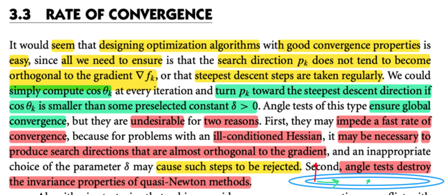</kbd>

> [!NOTE]
> Đại khái là mở đầu tác gỉa cho rằng ta có thể nghĩ rằng việc thiết kế thuật toán tối ưu để có tính hội tụ tốt cũng dễ mà: Chỉ việc** đảm bảo sao cho search direction đừng có vuông góc với gradient** là được hay là cứ việc **thường xuyên chọn pk là steepest descent**.
>
> Ví dụ như ta sẽ **tính cosine θk tại mỗi iteration,** và **nếu thấy góc này nhỏ hơn một δ nào đó, tức là pk bắt đầu gần gần hợp với gradient ∇fk một góc vuông) thì ta sẽ CHỈNH LẠI**, bằng cách cho pk là steepest descent (-∇f)
>
> Tuy nhiên tác giả cho biết, việc dùng **"angle test"** (tức check cosine θk và làm như trên) tuy là **có thể đảm bảo global convergence nhưng nó có hai nhược điểm**:
>
> 1) Nó **làm chậm quá trình hội tụ**. Lí do là khi ta có bài toán mà có tính chất **ILL-CONDITIONED** HESSIAN, đại khái là từ ee364a mình hiểu nó là kiểu mà sub-optimal set có dạng ellipse dẹt thì khi đó thật ra **có khi đi theo hướng vuông góc với gradient lại là hướng tốt nhất, hội tụ nhanh nhất.**
>
> Thế thì việc **chọn δ không hợp lí trong cách làm trên sẽ reject cái hướng như vậy**, (mình có vẽ hình minh họa, ví dụ như tại điểm này thì hướng xanh lá là hướng tốt, dù nó gần như vuông góc với gradient)
>
> 2) Cách làm này phá hủy tính invariance của quasi Newton method

> [!TIP]
> **🤖 AI Feedback** — ✅ Score: **95/100**
>
> Bài phân tích của bạn rất chi tiết và chính xác, thể hiện sự nắm vững các khái niệm chính và khả năng kết nối với kiến thức nền tảng vững chắc.

 

### Xung đột Hội tụ nhanh và Toàn cục

<kbd>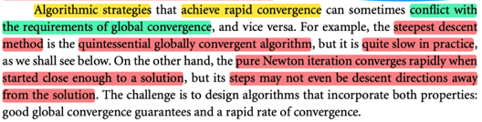</kbd>

> [!NOTE]
> Đại ý là, những thuật toán có khả năng hội tụ nhanh đôi khi
> lại conflict với yêu cầu global convergence.
>
> Ví dụ như steepest descent tuy là điển hình, tinh tuý của phương
> pháp đảm bảo global convergence nhưng lại rất chậm trong thực
> tế.
>
> Còn ngược lại ví dụ như Newton method, (pure) có thể hội tụ 
> rất nhanh, khi bắt đầu gần solution, ngay cả khi Newton step ko
> hề là descent direction.
>
> Mình nghĩ: Có thể hiểu cái này nhờ đã học Convex Optimization
> của S.Boyd: Là vì, ý trên, với steepest descent, có khi đi theo
> hướng steepest sẽ khiến con đường đi rất zig zac → rất dài
> (cái này đã thấy phân tích lại trong mấy bài đầu của AlgForOpt
>
> Trong khi đó, sở dĩ nói Newton method giúp hội tụ rất nhanh
> khi ở gần optimal, là vì khi ở gần optimal, thì đại khái là hàm số
> objective có thể được approx tốt bởi quadratic function, nên nó
> solution của nó sẽ cũng xấp xỉ rất sát solution thực tế.
>
> QUay lại đây, cho nên thách thức là phải xây dựng thuật toán
> vừa hội tụ nhanh vừa đảm bảo hội tụ global

> [!TIP]
> **🤖 AI Feedback** — ✅ Score: **98/100**
>
> Phân tích của bạn rất chính xác và đầy đủ, nắm bắt được tất cả các ý chính từ tài liệu tham khảo và còn bổ sung thêm kiến thức chuyên sâu để giải thích.

 

#### Tốc độ hội tụ Steepest Descent

<kbd>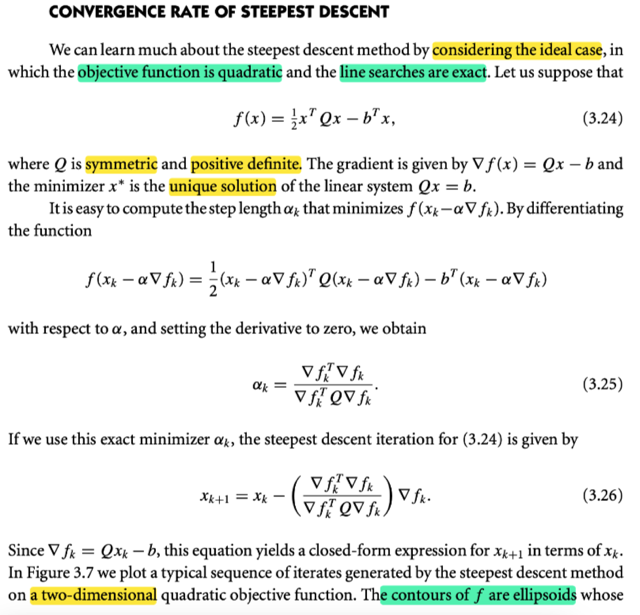</kbd>

<kbd>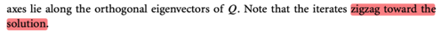</kbd>

> [!NOTE]
> Đại khái là để phân tính tốc độ hội tụ của  steepest descent thì tác giả đề nghị
> ta dùng case lí tưởng: objective là quadratic function và ta sẽ dùng exact line
> search.
>
> Hàm f có dạng (1/2)xTQx - bTx với Q symmetric positive definite
>
> Gradient lúc này ∇f(x) = Qx - b thì đối với mình giờ dễ hiểu rồi (nếu cần dùng
> cách làm holistically của mit 18s096 là ra ngay).
>
> Khi đó, dĩ nhiên là solution của bài toán này là nghiệm của hệ ∇f(x) = 0 ⇔ Qx
> = b.  (Và vì đây hàm hàm convex nên nó là global minimizer) Và vì Q ≻ 0 nên
> Q invertible ⇨ hệ có nghiệm duy nhất x = Qinv b
>
> Đại khái đó là solution theo closed form.
>
> Còn dùng steepest gradient descent, ta sẽ lặp đi lặp lại việc: tính pk và giải
> bài toán exact line search tìm αk.
>
> Vậy thì ở đây là steepest g.d nên dĩ nhiên pk là -∇fk.
>
> Bài toán exact line search là minimize f(xk + αkpk) = f(xk - αk∇fk)
>
> ta sẽ tìm derivative (đây là hàm đơn biến theo αk) và cho nó bằng 0:
>
> g(αk) = f(xk - αk∇fk).
>
> g'(αk) = d/dαk f(xk - αk∇fk)
>
> = d/d(xk - αk∇fk) f(xk - αk∇fk) . d/dαk (xk - αk∇fk)
>
> = ∇f(xk - αk∇fk)T(-∇fk)
>
> Vì sao d/d(xk - αk∇fk) f(xk - αk∇fk) = ∇f(xk - αk∇fk)
>
> Là vì f là vector → scalar function, nhận input là xk - αk∇fk tính ra scalar f(xk -
> αk∇fk). Nên tính đạo hàm của f wrt vector (xk - αk∇fk) vì nó sẽ là gradient
> vector tại (xk - αk∇fk)
>
> Còn vì sao d/dαk (xk - αk∇fk) = -∇fk
>
> Để ý h(αk) = xk - αk∇fk là scalar → vector function.
>
> Nhận vào scalar αk, tính ra vector xk - αk∇fk
>
> Ta thử tìm d/d αk h(αk): dh = xk - (αk + dαk)∇fk - [xk - αk∇fk]
>
> = - dαk ∇fk = - ∇fkdαk
>
> ⇨ dh = - ∇fkdαk ⇨ d/dαk h(αk) = - ∇fk
>
> = - ∇f(xk - αk∇fk)T(∇fk)
>
> Mà ∇f(xk) = Qx - b
>
> ⇨ - ∇f(xk - αk∇fk)T(∇fk) = - ∇f(xk - αk∇fk)T(∇fk)
>
> = - [Q(xk - αk∇fk) - b]T∇fk
>
> = - [Qxk - Qαk∇fk - b]T∇fk
>
> = - [Qxk - b - Qαk∇fk]T∇fk
>
> = - [∇fk - Qαk∇fk]T∇fk
>
> = - ∇fkT∇fk + [Qαk∇fk]T∇fk
>
> ⇨ g' = 0 ⇔ - ∇fkT∇fk + [Qαk∇fk]T∇fk = 0
>
> ⇔ [Qαk∇fk]T∇fk = ∇fkT∇fk
>
> ⇔ αk∇fkTQ∇fk = ∇fkT∇fk
>
> ⇔ αk = ∇fkT∇fk / ∇fkTQ∇fk
>
> ====
>
> Và như vậy xk+1 = xk - (∇fkT∇fk / ∇fkTQ∇fk) ∇fk
>
> Và vì ∇fk = Qxk - b ⇨ Nên ta có công thức xk+1 theo xk

> [!TIP]
> **🤖 AI Feedback** — ✅ Score: **95/100**
>
> Phân tích rất chi tiết và chính xác, không chỉ tóm tắt mà còn tự mình tái chứng minh các công thức quan trọng một cách tỉ mỉ. Cách giải thích từng bước logic và sâu sắc, thể hiện sự nắm vững kiến thức. Có một dòng lặp lại trong quá trình chứng minh không cần thiết, nhưng không ảnh hưởng đến độ chính xác.

 

##### Đường đi ziz zac giảm dốc

<kbd>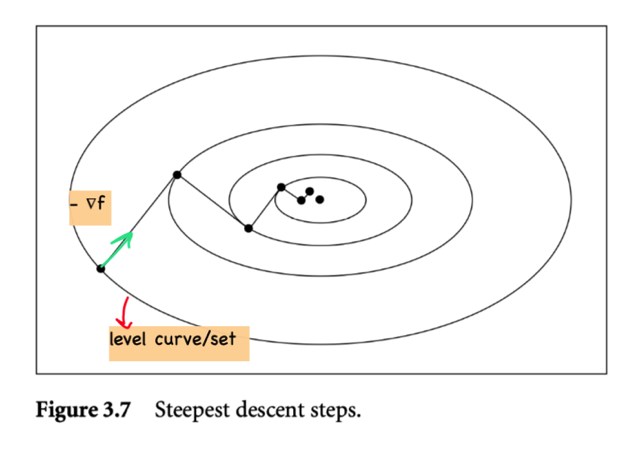</kbd>

> [!NOTE]
> Và đường đi nó sẽ ziz zac như này. 
>
> Thế thì tại sao tác giả nói "the contour of f là các ellipsoids có trục trùng (lie along) các orthogonal eigenvectors của Q?
>
> Giải thích đại khái như sau: f, như đã nói, là quadratic function f(x) = (1/2)xTQx - bTx
>
> Và contour plot thì như đã biết, là level set, là tập các điểm mà hàm số đồng giá trị:
>
> c-level set = {x: f(x) = c}  = {x: (1/2)xTQx - bTx = c}
>
> Thế thì nếu ta đặt y = x - x* ⇨ x = y + x*:
>
> Khi đó, (1/2)xTQx + bTx = c 
>
> ⇔ (1/2) (y + x*)TQ(y + x*) - bT(y + x*) = c
>
> ⇔ (1/2)(yTQ + x*TQ)(y + x*) - bTy + bTx* = c
>
> ⇔ (1/2)(yTQy + x*TQy + yTQx* + x*TQx*) - bTy - bTx* = c
>
> ⇔ (1/2)yTQy + (1/2)x*TQy + (1/2)yTQx* + (1/2)x*TQx* - bTy - bTx* = c
>
> ⇔ (1/2)yTQy + x*TQy - bTy + (1/2)x*TQx* - bTx* = c
>
> Tới đây, QTx* - b = 0 do đây là gradient tại minimum và (1/2)x*TQx* - bTx* chỉ là constant, ta chuyển luôn sang vế phải, chuyển luôn 1/2 sang luôn, để rồi phương trình này trở thành:
>
> **yTQy = c**
>
> Động tác đặt y = x - x* chỉ là dời trục tọa độ tịnh tiến mà thôi, để rồi level set bây giờ có dạng của một paraboloid tâm tại gốc tọa độ.
>
> Thế thì: xem xét yTQy = c, vì Q p.d nên phân tách nó thành VΛVT với S là orthogonal matrix các eigenvectors của Q, Λ là diagonal matrix các eigenvalues của Q
>
> Nên ta có yT V Λ VT y = c
>
> Xét VTy, nhớ lại kiến thức của phần nói về change of basis trong MIT 18.06:
>
> Khi xây dựng một matrix đại diện cho một phép biến đổi tuyến tính T(v), thì ta sẽ làm như sau, nói một cách ngắn gọn là: Thực hiện phép biến đổi đối với các basis v's của input T(v) và thể hiện nó dưới dạng linear combination của các output basis w's. Khi đó các hệ số sẽ là các cột của matrix biến đổi. Ví dụ biến đổi v1, để có T(v1), thể hiện nó bởi w's: α1w1 + α2w2 + .. Thì cột 1 của A sẽ là (α1, α2,...).
>
> Thế thì, để bàn về change of basis matrix, ta sẽ nói về phép biến đổi identity. Dĩ nhiên với phép biến đổi này thì T(v1) vẫn là v1, và ta sẽ chỉ việc thể hiện nó bởi basis w's là có cột 1 của A.
> Vậy v1 = W(A1's column 1), v2 = W(A's column 2)... 
>
> hay V = WA 
>
> ⇔ A = VWinv Đây chính là change of basis matrix giúp đổi tạo độ đang theo basis v's thành tọa độ theo basis w's.
>
> Và như vậy nếu như v's là standard basis, thì matrix A = VWinv = IWinv = Winv chính là matrix đổi tọa độ từ standard basis e's sang basis w's
>
> Thế thì, quay lại đây, xét VTy, cũng là Vinv y (V là orthogonal matrix nên VT = Vinv)
>
> thì VTy, thì nó chính chuyển tọa độ của y từ standard basis sang basis v's, tức các eigen basis của Q. Và về khía cạnh hình học, nó chỉ là việc ta xoay trục tọa độ thẳng góc lại với các eigenvector của Q mà thôi. Và gọi z = VTy, thì z chỉ là tọa độ của cùng vector y nhưng mà là khi trục tọa độ thẳng góc với eigenvectors của Q.
>
> Thế thì khi đó yTQy = c là phương trình của level set trong hệ trục standard thì zTΛz = c là phương trình của level set trong hệ trục eigenbasis của Q, và ta sẽ thấy zTΛz = c ⇔ z1^2 λ1 + z2^2 λ2 + .. = c. Đây chính là phương trình của một ellipsoids.
>
> Như vậy, từ đó ta hiểu vì sao nói level set (contour plot) lại là các ellipsoid có trục thẳng trục với các eigenvector của Q.

> [!TIP]
> **🤖 AI Feedback** — ✅ Score: **95/100**
>
> Bài giải thích rất chi tiết và sâu sắc về bản chất hình học của các level set trong hàm bậc hai, và mối liên hệ với phương pháp Steepest Descent.

 

- **Định lượng tốc độ hội tụ**

<kbd>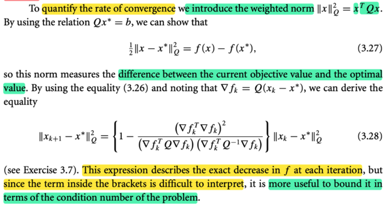</kbd>

> [!NOTE]
> Tiếp theo đại khái là, tác giả cho rằng ta sẽ dùng một công cụ: weighted norm, có công thức là: ||x||_Q = xTQx. Khi đó, dùng thêm quan hệ Qx* = b (đây là ∇f(x*) = 0) ta sẽ có:
>
> (1/2)||x-x*||_Q = f(x) - f(x*).
>
> Là sao ta? 
>
> → Theo định nghĩa của weighted norm ở trên: ||x - x*||^2_Q = (x - x*)TQ(x - x*)
>
> = (xT - x*T)Q(x - x*) = (xTQ - x*QT)(x - x*) = xTQx - x*QTx - xTQx* - x*QTx*
>
> = xTQx - xTQx* - x*QTx  - x*QTx*
>
> = xTQx - xTb - x*QTx  - bTx*  (dùng Qx* = QTx* = b)
>
> = xTQx - bTx - x*QTx  - bTx*
>
> = f(x) - f(x*) (vì f(x) = xTQx - bTx)
>
> Rồi, ở trên ta đã kết quả (công thức 3.26):
>
> xk+1 = xk - (∇fkT∇fk / ∇fkTQ∇fk) ∇fk
>
> Và ∇fk = Q(xk - x*) (là do ∇fk = Qxk - b, mà b = Qx* ⇨ ∇fk = Qxk - Qx* = Q(xk - x*))
>
> Thì từ đó ta có thể derive công thức:
>
> ||xk+1 - x*||^2_Q = {1 - (∇fkT∇fk)^2 / (∇fkTQ∇fk)(∇fkTQinv∇fk)}||xk - x*||^2_Q
>
> Đây là bài tập 3.7. QUAY LẠI SAU
>
> Đại ý là tuy công thức này co thể cho ta biết chính xác mức giảm của f tại mỗi iteration, nhưng vì cái term ở trong {} rất khó hiểu nên sẽ hữu ích hơn nếu ta sử dụng công cụ chặn (bound)

**🔗 See also:** [Liên hệ với Wolfe conditions](./61_the_bfgs_method.md#node-zk38kse)

 

- **Theorem 3.3 Tốc độ hội tụ của Steepest Descent**

<kbd>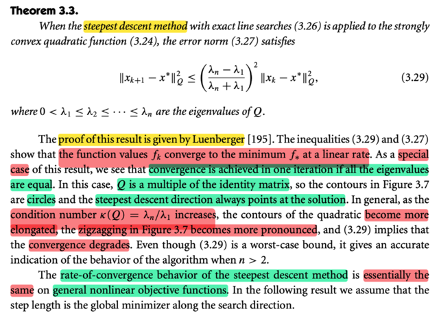</kbd>

> [!NOTE]
> Theorem này đại khái nói là, với **steepest descent** method, dùng** exact line search** và áp dụng vào **hàm objective có tính strongly convex**. 
>
> Khi đó **error norm** (độ lớn của sai số) sẽ thỏa inequality này:
>
> ||xk+1 - x*||^2_Q ≤ ((λn - λ1)/(λn + λ1)]^2 ||xk - x*||^2_Q
>
> với 0 < λ1 < ...λn là eigenvalues của Q
>
> Ở đây không chứng minh theorem này. Nhưng đại khái nó chính là:
>
> [error tại step k+1] ≤ [error tại step k] * α với α = ((λn - λ1)/(λn + λ1)]^2 và error đo bằng weighted norm.
>
> Và đại khái nó nói rằng **sự hội tụ sẽ diễn ra tuyến tính**, cũng là error sẽ giảm dần một cách tuyến tính.
>
> Và khi rơi vào một trường hợp đặc biệt, là **Q là có dạng một scalar nhân với Identity matrix**, thì khi đó **sự hội tụ sẽ diễn ra trong vòng chỉ một iteration.**
>
> Để thấy cái này chỉ cần cho λn = λ1 ta có:
>
> ||xk+1 - x*||^2_Q ≤ ((λn - λ1)/(λn + λ1)]^2 ||xk - x*||^2_Q
>
> ⇒ ||xk+1 - x*||^2_Q ≤ 0, tức là [error tại step k+1] ≤ 0 với ý nghĩa: đang ở step 1, thì qua step 2 thì error đã về 0, tức đã tới được x* rồi.
>
> Khi đó, contour plot sẽ là hình tròn và steepest descent (-∇f) luôn chỉ về solution x*
>
> Và nói chung là, khi condition number của matrix Q (được tính bằng tỉ lệ giữa max eigenvalue và min eigenvalue k(Q) = λmax(Q)/λmin(Q), cũng chính là **tỉ số giữa stretch factor theo phương lớn nhất và nhỏ nhất bởi matrix**) càng lớn, thì các đường contour hình ellipse càng trở nên dẹp, xu hướng ziz zag sẽ càng rõ, và sự hội tụ sẽ chậm dần.
>
> Trong note trước mình đã hiểu vì sao contour plot của f lại là các ellipsoids có trục thẳng hướng với các eigenvector của Q, mà ví dụ như trong 2D, tỉ lệ giữa bề rộng lớn nhất và bề rộng nhỏ nhất của cái hình ellipse này chính là tỉ lệ giữa eigenvalue lớn nhất và nhỏ nhất. Đây cũng chính là định nghĩa condition number của matrix Q: k(Q). Nên nếu tỉ lệ này lớn, thì cái ellipse sẽ rất dẹt, hay trong case n-chiều thì ellipsoid rất dẹt và càng dẹt thì tốc độ hội tụ càng chậm. 
>
> Điều này thể hiện bởi công thức 3.29 là vì nếu λn >> λ1 thì  α = ((λn - λ1)/(λn + λ1)]^2 sẽ là một tỉ lệ rất gần 1 (giống như [(1000-1)/(1000+1)]^2 = (999/1001)^2 ≈ 1. Có nghĩa là:
>
> [error tại step k+1] ≈ [error tại step k], tức error chả giảm đi bao nhiêu sau một step cả. 
>
> Cuối cùng, **tốc độ hội tụ của steepest descent method** về cơ bản là **cũng giống với các non-linear objective function** khác

> [!TIP]
> **🤖 AI Feedback** — ✅ Score: **99/100**
>
> Học sinh thể hiện sự hiểu biết xuất sắc và toàn diện về tính chất hội tụ của phương pháp steepest descent, bao gồm các giải thích chi tiết và kết nối sâu sắc với các khái niệm toán học nền tảng.

 

- **Theorem 3.4 Tốc độ hội tụ Steepest Descent**

<kbd>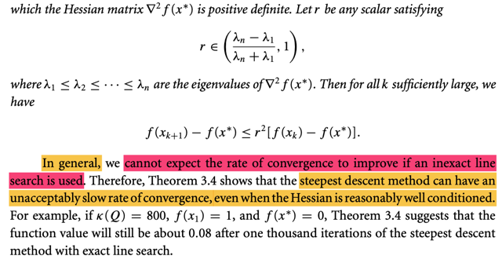</kbd>

<kbd>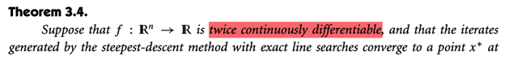</kbd>

<kbd>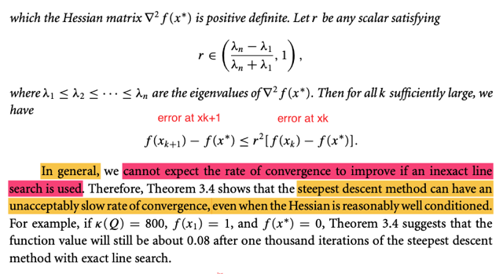</kbd>

> [!NOTE]
> Đại khái là cái  theorem này nói rằng 
>
> **[error tại xk+1] / [error tại xk] sẽ không thể lớn hơn r^2.**
>
> Với r là con số nằm trong khoảng ((λn - λ1) / (λn + λ1), 1). 
>
> Như vậy đại khái là, **nếu con số này nhỏ**
>
> thì tỉ lệ giữa hai error là nhỏ, thì có nghĩa là, sau một iteration, thì cái **sai số tại xk+1 chỉ còn bằng một phần nhỏ của sai số tại xk**, chính là **mang ý nghĩa là sai số giảm rất nhanh**.
>
> Ngược lại **nếu con số này lớn** (gần 1) 
>
> tức là **sau một iteration mà sai số vẫn còn như y nguyên** → sai số giảm rất chậm
>
> Thế thì. Con số này nhỏ tức là λmax (λn) gần bằng λmin, thì như vậy cái **condition number = λmax / λmin sẽ ≈ 1**
>
> Và tương ứng case này thì các **contour sẽ gần với hình tròn**
>
> Ngược lại nếu **con số này lớn**, cũng chính là **λmax chênh lệch nhiều so với λmin** → **contour có dạng ellips rất dẹt**
>
> Vậy thì ý của theorem này nói rằng, **ngay cả khi ta xét case lí tưởng**, với hàm mục tiêu là **quadratic**, và **dùng exact line search** rồi mà cái** độ giảm của error vẫn bị ràng buộc bởi r^2**. 
>
> Để rồi với bài toán mà có well-conditioned thì sai số sẽ vẫn giảm rất chậm. Vậy thì chứng tỏ steepest descent method ko ổn.
>
> Ông lấy ví dụ là k(Q) = 800. Thật ra nó là con số nhỏ, tức là, Q cơ bản là well-condition, sự chênh lệch giữa eigenvalue lớn nhất và nhỏ nhất là không quá lớn.
>
> Nhưng vì như đã nói theorem này, cho thấy **[error tại xk+1] / [error tại xk] sẽ không thể lớn hơn r^2.** 
>
> dẫn tới với 800, khi bình phương nó vẫn là con số rất lớn ⇨ Ngay cả matrix Q well-condition mà phương pháp steepest descent vẫn rất chậm.
>
> Làm kĩ ra cho hiểu: κ(Q) = 800 tức λmax(Q) / λmin(Q) = 800 ⇔ λmax(Q) = 800 λmin(Q)
>
> ⇨ r ∈ ((800 λmin(Q) - λmin(Q)) / (800 λmin(Q) + λmin(Q)), 1)
>
> = (799/801, 1). Tức là một con số rất ≈ 1. Ví dụ như 0.99.
>
> Khi đó theo theorem này [error tại k+1]/[error tại] ≤ 0.99^2 cũng là con số rất gần 1
>
> ⇨ error sau một step giảm cực kì ít

 

- **Qua phân tích Hội tụ phương pháp Newton**

<kbd>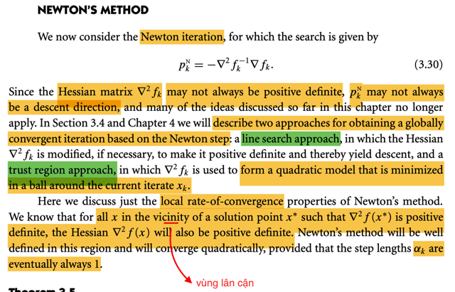</kbd>

> [!NOTE]
> Ta sẽ phân tích qua convergence rate của Newton method 
>
> Như đã biết, Newton direction sẽ có công thức là pk_N = - (∇^2f_k)inv ∇f_k
>
> (Tại sao lại có công thức này thì đến nay mình đã dễ hiểu rồi, không cần nói lại, có thể ôn nhanh: đó là vì với pp này ta sẽ (đứng tại xk), approx hàm f bởi quadratic approximation (khai triển Taylor bậc hai của f). Khi đó, có thể tìm minimum của hàm approx này bằng cách cho gradient  = 0, và nó sẽ cho ta hệ tuyến tính ∇^2 f_k pk_N = - ∇f_k
>
> Khi đó nếu Hessian tại k positive definite 0, thì ta có thể nhân hai vế cho inverse của
> Hessian để có kết quả trên.)
>
> Vậy thì ở đây họ nói** nếu Hessian không positive definite**, (vẫn invertible) thì **pk_N không phải là descent direction**. 
>
> Đơn giản thôi:
>
> Directional derivative theo hướng pk_N:
>
> = ∇f_k T pk_N = ∇f_k T (- (∇^2f_k)inv ∇f_k) = - ∇f_k T (∇^2f_k)inv ∇f_k
>
> Khi Hessian không positive definite ⇨ mọi eigenvalue chưa chắc đã dương thì ⇨ mọi eigenvalue của Hessian inverse cũng vậy ⇨ Hessian inverse cũng sẽ không positive defite
>
> ⇨ quadratic form ∇f_k T (∇^2f_k)inv ∇f_k sẽ không chắc luôn dương
>
> ⇨ - ∇f_k T (∇^2f_k)inv ∇f_k sẽ không chắc luôn âm
>
> ⇨ chưa chắc đi theo hướng pk_N đã giảm f 
>
> ====
>
> Thế thì ta sẽ còn bàn thêm **hai cách tiếp cận giúp đạt được globally convergence** dựa trên Newton step trong các phần sau. 
>
> Còn ở đây, ta sẽ thảo luận về  **local rate of convergence** (tạm hiểu là **tính chất của Newton method** mà trong đó, **khi ta tới gần optimal thì việc converge sẽ diễn ra rất
> nhanh** - quadratic convergence) và** step size luôn bằng 1** (cái này đã học trong Convex Optimimzation)

> [!TIP]
> **🤖 AI Feedback** — ✅ Score: **95/100**
>
> Học sinh thể hiện sự hiểu biết sâu sắc về phương pháp Newton, bao gồm cả việc dẫn xuất công thức và phân tích chi tiết về điều kiện hướng đi xuống. Có một điểm cần làm rõ thêm về vai trò của kích thước bước (step size) trong hội tụ bậc hai.

 

- **Theorem 3.5 Hội tụ Newton**

<kbd>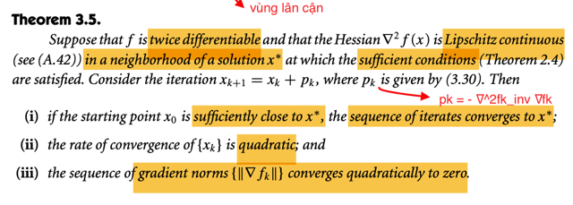</kbd>

> [!NOTE]
> Theorem này nói rằng, cho hàm f khả vi kép (tức tồn tại Hessian tại mọi điểm) và Hessian có tính **Lipschitz continuous** trong vùng lân cận của x*.
>
> Khi đó với chuỗi xk+1 = xk + pk với **pk là Newton direction** thì:
>
> i) **Nếu x0 đủ gần x* thì chuỗi xk sẽ hội tụ về x***
>
> ii) Tốc độ hội tụ là **quadratic**
>
> iii) Chuỗi gradient norm ||∇f_k|| sẽ hội tụ quadratically về 0
>
>
> Ôn lại nhanh theo định nghĩa, ||A||_p = max x ||Ax||_p / ||x||_p
>
> Nên ||A|| = max x ||Ax|| / ||x|| (tức là dùng l2 norm)
>
> Từ đó bài toán đặt ra là maximize ||Ax|| / ||x|| mà cái này ko âm,
> nên nó tương đương bài toán maximize ||Ax||^2 / ||x||^2, tức 
>
> (Ax)T(Ax) / xTx = xTATAx / xTx 
>
> = xTQ Λ QTx / xTx = Σi (QTx)i^2 λ(ATA)i
>
> Và cái này ≤ Σi (QTx)i^2 λ(ATA)max = λ(ATA)max Σi (QTx)i^2 
>
> = λ(ATA)max ||QTx||^2 = λ(ATA)max ||x||^2 = λ(ATA)max xTx
>
> Vậy (Ax)T(Ax) / xTx ≤ λ(ATA)max xTx / xTx = λ(ATA)max
>
> ⇔ ||Ax||^2 / ||x||^2 ≤ λ(ATA)max
>
> ⇨ ||A|| / ||x|| ≤ √λ(ATA)max
>
> Và vì định nghĩa ||A|| = max x ||Ax|| / ||x|| nên ||A||  ≥ ||Ax|| / ||x|| ∀x
>
> ⇔ ||A||||x|| ≥ ||Ax||. Chính là một inequality quan trọng.
>
> Vậy áp dụng ở đây ||Au|| ≤ ||A|| ||u|| = λ(ATA)max ||u||

 

- **Chứng minh Theorem 3.5**

<kbd>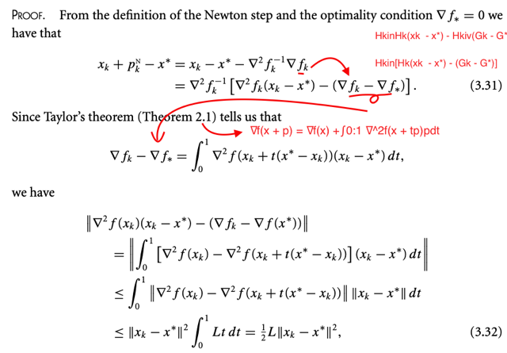</kbd>

> [!NOTE]
> Chứng minh:
>
> Đầu tiên: xk + pkN - x* = xk - x* + pkN
>
> Với pkN = - (∇^2fk)inv ∇fk
>
> ∴ = xk - x* - (∇^2fk)inv ∇fk
>
> ∴ = I (xk - x*) - (∇^2f_k)inv ∇fk
>
> = ∇^2fk (∇^2fk)inv (xk - x*) - (∇^2fk)inv ∇fk 
>
> = ∇^2fk (∇^2fk)inv (xk - x*) - (∇^2fk)inv ∇fk + (∇^2fk)inv 0
>
> = ∇^2fk (∇^2fk)inv (xk - x*) - (∇^2fk)inv ∇fk + (∇^2fk)inv ∇f(x*)
>
> (Do gradient tại x* = 0, ∇f(x*) = 0)
>
> = ∇^2fk (∇^2fk)inv (xk - x*) - (∇^2fk)inv (∇fk - ∇f*)
>
> =  (∇^2fk)inv ∇^2fk (xk - x*) - (∇^2fk)inv (∇fk - ∇f*)
>
> = (∇^2fk)inv [∇^2fk (xk - x*) - (∇fk - ∇f*)] → đây là 3.31
>
> ----
>
> Tiếp, dùng Taylor theorem, nói rằng:
>
> ∇f(x + p) = ∇f(x) + ∫0:1 ∇^2f(x + tp)pdt
>
> Áp dụng vào đây ta có ∇f(xk) = ∇f(x*) + ∫0:1 ∇^2f(xk + t(x* - xk))(x* - xk)dt
>
> ⇔ ∇f(xk) - ∇f(x*) = ∫0:1 ∇^2f(xk + t(x* - xk))(x* - xk)dt (1)
>
> Tiếp, xét ||∇^2fk(xk - x*) - (∇fk - ∇f(x*))|| (tức là norm của cái term thứ 2 trong 3.31)
>
> Thay ∇f(xk) - ∇f(x*) = ∫0:1 ∇^2f(xk + t(x* - xk)) có ở trên vào:
>
> = || ∇^2f(xk)(xk - x*) - ∫0:1 ∇^2f(xk + t(x* - xk)) . (xk - x*) dt ||
>
> Tới đây. ∇^2f(xk)(xk - x*) = ∇^2f(xk)(xk - x*) ∫0:1 dt (vì ∫0:1 dt = 1) = ∫0:1 ∇^2f(xk)(xk - x*) dt
>
> ∴ = || ∫0:1 ∇^2f(xk)(xk - x*)dt  - ∫0:1 ∇^2f(xk + t(x* - xk)) . (xk - x*) dt ||
>
> Gộp hai tích phân lại
>
> ∴= || ∫0:1 [ ∇^2f(xk)(xk - x*) - ∇^2f(xk + t(x* - xk)) . (xk - x*) ] dt ||
>
> Đặt thừa số chung (xk - x*) ra ngoài, và đưa ra ngoài tích phân luôn.
>
> ∴ = || ∫0:1 [∇^2f(xk) - ∇^2f(xk + t(x* - xk))] . (xk - x*) dt ||
>
> = || ∫0:1 [∇^2f(xk) - ∇^2f(xk + t(x* - xk))] dt (xk - x*)||
>
> Tới đây, cái ta đang có là ||Au||, với 
>
> A = ∫0:1 [∇^2f(xk) - ∇^2f(xk + t(x* - xk))] dt
>
> u = xk - x*
>
> ⇨ Áp dụng bất đẳng thức ||Au|| ≤ ||A|| ||u|| (vì định nghĩa của norm ||A|| là max_u ||Au|| / ||u|| ⇨ ||Au|| / ||u|| ≤ ||A|| và cái này ⇔ ||Au|| ≤ ||A|| ||u||)
>
> Ta có  || ∫0:1 [∇^2f(xk) - ∇^2f(xk + t(x* - xk))] dt (xk - x*)||
>
> ≤ ||∫0:1 [∇^2f(xk) - ∇^2f(xk + t(x* - xk))] dt|| ||xk -  x*||
>
> Tới đây, dùng một bất đẳng thức khác: norm của tổng (tích phân) luôn ≤ tổng của norm:
> ||A + B|| ≤ ||A|| + ||B||, cái này đại khái là khái quát lên từ bất đẳng thức tam giác đối với vector. 
>
> Mà ở đây chính là ta đưa norm vào trong tích phân.
>
> ∴ ≤ ∫0:1 ||∇^2f(xk) - ∇^2f(xk + t(x* - xk))|| dt ||xk -  x*||
>
> đưa constant ||xk -  x*|| vô lại
>
> ∴ = ∫0:1 ||∇^2f(xk) - ∇^2f(xk + t(x* - xk))|| ||xk -  x*|| dt
>
> Áp dụng giả định gradient ∇f là Lipschitz continuous trên N, tức là tồn tại hằng số L > 0 sao cho: 
> ||∇f(x) - ∇f(x~)|| ≤ L||x - x~||. Với mọi x, x~ ∈ N
>
> ⇨ ||∇^2f(xk) - ∇^2f(xk + t(x* - xk))|| ≤ L||xk - [xk + t(x* - xk)]||
>
> = L||-t(x* - xk)|| = L||t(xk - x*)|| = Lt||(xk - x*)]||
>
> Từ đó ta có:
>
> ∫0:1 ||∇^2f(xk) - ∇^2f(xk + t(x* - xk))|| ||xk - x*|| dt
>
> ≤ ∫0:1 Lt ||(xk - x*)]|| ||xk -  x*|| dt = ∫0:1 Lt ||xk - x*||^2 dt
>
> = ||xk - x*||^2 ∫0:1 Lt dt
>
> = ||xk - x*||^2 (L/2)
>
> Vậy là cuối cùng ta có 
>
> ||∇^2f(xk)(xk - x*) - (∇fk - ∇f(x*))|| ≤ (L/2) ||xk -  x*||^2
>
> → Đây chính là kết quả 3.32

 

- **Giải thích hội tụ bậc hai**

<kbd>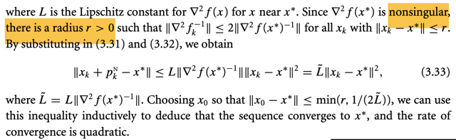</kbd>

> [!NOTE]
> Tiếp, ta có ∇^2f(x*) nonsingular là vì theorem này có giả thiết là **solution x* thỏa sufficient condition** và cái này thì nói rằng Hessian tại x* sẽ PD.
>
> Vậy thì đại khái là vì Hessian tại x* PD nên dĩ nhiên cũng khả nghịch.
>
> Thế thì vì tính liên tục của Hessian nên Hessian inverse cũng liên tục.
>
> Và có nghĩa là khi x tới gần x* thì Hinv tại x cũng → Hinv tại x*.
>
> Dẫn tới norm của Hinv tại x cũng → norm của Hinv tại x*
>
> Do đó **phải tồn tại một khoảng cách giữa x và x* sao cho chênh lệch giữa Hinv(x) và Hinv(x*) ko quá lớn**. Và độ lớn của chênh lệch ở đây đo bằng norm tức ||Hinv(x) - Hinv(x*)||
>
> Vậy phát biểu lại, đó là:
>
> "Phải tồn tại một bán kính r để khi x đủ gần x* (trong bán kính này thì) ||Hinv(x) - Hinv(x*)|| không quá lớn"
>
> Và để cụ thể hóa cái chữ "không quá lớn", ta chọn nó như sau:
>
> Không quá lớn = ||Hinv(x) - Hinv(x*)|| ≤ ||Hinv(x)|| (2)
>
> Thế thì ta xét
>
> Hinv(x) = Hinv(x) - Hinv(x*) + Hinv(x*)
>
> ⇨ ||Hinv(x)|| = ||Hinv(x) - Hinv(x*) + Hinv(x*)||
>
> ≤ ||Hinv(x) - Hinv(x*)||  + ||Hinv(x*)|| (áp dụng inequality tam giác)
>
> và áp dụng tiếp cái (2):  ||Hinv(x) - Hinv(x*)|| ≤ ||Hinv(x)||
>
> ta có Hinv(x) ≤ ||Hinv(x*)|| + ||Hinv(x*)|| = 2||Hinv(x*)||
>
> Như vậy ta hiểu chỗ này tại sao sách nói rằng **vì Hessian tại x* khả nghịch, nên tồn tại bán kính r dương sao cho khi xk đủ gần x* trong bán kính đó (tức là ||xk - x*|| ≤ r) thì ta sẽ có Hinv(x) ≤ 2||Hinv(x*)||**
>
> ====
>
> Vậy xét ||xk + pkN - x*|| = ||xk - x* - ∇^2fk_inv ∇fk||
>
> Nhờ 3.31 ta đã có xk + pkN - x* = (∇^2fk)inv[∇^2fk (xk - x*) - (∇fk - ∇f*)
>
> ⇨ ||xk + pkN - x*|| = || (∇^2fk)inv[∇^2fk (xk - x*) - (∇fk - ∇f*)] ||
>
> và áp dùng ||Au|| ≤ ||A|| ||u||
>
> Thì vế phải ≤  || (∇^2fk)inv|| ||[∇^2fk (xk - x*) - (∇fk - ∇f*)] || (
>
> Nhờ tiếp 3.32: ||[∇^2fk (xk - x*) - (∇fk - ∇f*)] || ≤ (1/2)L ||xk - x*||^2
>
> Nên vế phải ở trên tiếp tục ≤ ||(∇^2fk)inv|| (1/2)L ||xk - x*||^2
>
> Nhờ tiếp kết quả trên Hinv(x) ≤ 2||Hinv(x*)||, cũng là ||(∇^2fk)inv|| ≤ 2 ||(∇^2f(x*))inv||
>
> ⇨ vế phải tiếp tục ≤ 2 ||(∇^2f(x*))inv|| (1/2)L ||xk - x*||^2
>
> = L ||(∇^2f(x*))inv|| ||xk - x*||^2
>
> Đặt L~ = L ||(∇^2f(x*))inv||
>
> ∴ = L~ ||xk - x*||^2
>
> Vậy cuối cùng ta có: 
>
> ||xk - x* - (∇^2fk)inv ∇fk|| ≤ L~ ||xk - x*||^2
>
> cũng chính là: ||xk + pkN - x*|| ≤ L~ ||xk - x*||^2
>
> Hay: **||xk+1 - x*|| ≤ L~ ||xk - x*||^2**
>
> Gọi ||xk - x*|| là giá trị scalar error tại step k: ek thì kết quả trên chính là:
>
> ek+1 ≤ L~ ek^2
>
> CUỐI CÙNG:
>
> Chọn x0 sao cho ||x0 - x*|| ≤ min(r, 1/(2L~)) ta có có thể  quy nạp rằng chuỗi hội tụ về x* là quadratic rate:
>
> ek+1 ≤ L~ ek ek = (L~ ek) ek
>
> ⇔ **ek+1 ≤ (L~ ek) ek**
>
> Có nghĩa là chỉ cần chọn x0 sao cho L' e0 < 1, thì:
>
> e1 sẽ ≤ L~ e0 e0 < e0 
>
> e2 sẽ ≤ L~ e1 e1  < e1
>
> ..
>
> để rồi **chuỗi error e0 (tức ||x0 - x*||), e1, e2 .. sẽ dần về 0** 
>
> **cũng chính là x0 ,x1... sẽ dần về x***
>
> Không như vậy, nếu chọn x0 sao cho Le0 < 1/2 thì e1 sẽ < e0 / 2, e2 < e1 / 2...tức là error sẽ giảm 1 nửa mỗi iteration.
>
> Tất nhiên ta phải đảm bảo là x0 đủ gần x* như lập luận trên, nên e0 cũng phải < r
>
> Do đó mới nói nếu ta cho x0, hay e0 = ||x0 - x*|| sao cho e0 ≤ min (r, 1/2L') thì ta sẽ có **sự hội tụ về x* với tốc độ quadratic**

 

- **Chứng minh Hội tụ gradient bậc hai**

<kbd>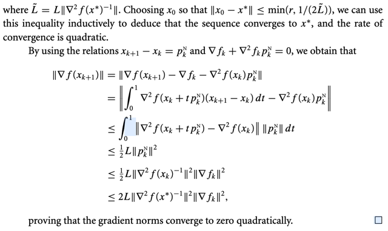</kbd>

> [!NOTE]
> Phần này thì chứng minh ý còn lại của theorem rằng **norm của gradient cũng sẽ dần về 0 với tốc độ quadratically**
>
> Norm of gradient tại xk+1: ||∇f(xk+1)||
>
> Vì xk+1 = xk + pkN và theo pkN là solution của equation ∇^2fk pkN = - ∇fk
>
> ⇨ ∇^2fk pkN + ∇fk = 0
>
> ||∇f(xk+1)|| = ||∇f(xk+1) - 0|| 
>
> = ||∇f(xk+1) - (∇^2fk pkN + ∇fk)|| (dùng ∇^2fk pkN + ∇fk = 0)
>
> = ||∇f(xk+1) - ∇^2fk pkN - ∇fk|| (phá dấu ngoặc ra)
>
> = ||∇f(xk+1) - ∇fk - ∇^2fk pkN|| (đổi vị trí)
>
> Áp dụng Taylor theorem: f(x + p) = f(x) + ∫0:1 ∇f(x + pt)pdt ⇔ f(x + p) - f(x) = ∫0:1 ∇f(x + pt)pdt
>
> ⇨ ∇f(xk+1) - ∇fk = ∫0:1 ∇^2f(xk + tpkN)(xk+1 - xk) dt
>
> ⇨ .. = || ∫0:1 ∇^2f(xk + tpkN)(xk+1 - xk) dt - ∇^2fk pkN ||
>
> Biến - ∇^2fk pkN = - ∇^2fk pkN ∫0:1 dt = - ∫0:1 ∇^2fk pkN dt và gộp hai tích phân lại.
>
> = || ∫0:1 [ ∇^2f(xk + tpkN)(xk+1 - xk) - ∇^2fk pkN ] dt ||
>
> Áp dụng bất đặng thức tam giác cho tích phân, đại  khái là norm của tổng (tích phân 
> thì ≤ tổng tích phân của norm)
>
> .. ≤ ∫0:1 || ∇^2f(xk + tpkN)(xk+1 - xk) - ∇^2fk pkN || dt
>
> = ∫0:1 || ∇^2f(xk + tpkN) pkN - ∇^2fk pkN || dt
>
> = ∫0:1 || [∇^2f(xk + tpkN) - ∇^2fk ] pkN || dt
>
> Dùng tiếp inequality ||Au|| ≤ ||A|| ||u||
>
> .. ≤ ∫0:1 || [∇^2f(xk + tpkN) - ∇^2fk ] || || pkN || dt
>
> Tới đây dùng Lipschit: ||∇^f(a) - ∇^2f(b)|| ≤ L||a - b||
>
> ⇨ ≤ ∫0:1 L || (xk + tpkN) - xk || || pkN || dt
>
> = ∫0:1 L || tpkN)|| || pkN || dt
>
> = ∫0:1 L |t| || pkN ||^2 dt = = ∫0:1 |t| dt . L || pkN ||^2
>
> = L || pkN ||^2 / 2 
>
> = L || - ∇^2fk_inv ∇fk ||^2 / 2 
>
> = L || ∇^2fk_inv ∇fk ||^2 / 2 
>
> ≤ L || ∇^2fk_inv ||^2 || ∇fk ||^2 / 2  (Dùng ||Au|| ≤ ||A|| ||u||)
>
> Áp dụng tiếp cái này H_inv(x) ≤ 2||H_inv(x*)|| (xem note liền trước)
>
> ⇨ L || ∇^2fk_inv ||^2 || ∇fk ||^2 / 2 ≤ L 2^2 || ∇^2f(x*)_inv ||^2 || ∇fk ||^2 / 2
>
> = || ∇^2f(x*)_inv || || ∇fk ||^2
>
> Tóm lại ta có: **||∇f(xk+1)|| ≤ 2L || ∇^2f(x*)_inv || || ∇fk ||^2**
>
> CHO THẤY GRADIENT → 0 RẤT NHANH (QUADRATICALLY)
>
> Nếu chưa hiểu thì vì đại khái là vầy:
>
> ví dụ cho 2L || ∇^2f(x*)_inv || là constant = 10, 
>
> ||∇f0|| = 0.01 thì ||∇f1|| ≤ 10 × 0.01^2 = 0.001 
>
> ||∇f2|| ≤ 10 × ||∇f1||||^2 ≤ 10 × (0.001)^2 = 0.00001 
>
> ||∇f3|| ≤ 10 × ||∇f2||^2 ≤ 10 × (0.0001)^2 = 0.0000001
>
> Hiểu đại khái là** norm của gradient giảm rất nhanh**

 

- **Bước Newton đầy đủ gần nghiệm**

<kbd>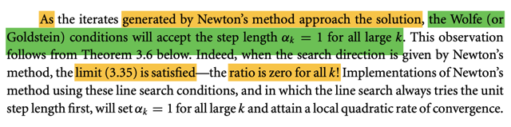</kbd>

> [!NOTE]
> Đại khái là khi dùng Newton method, và đến gần solution, thì các điều kiện dừng như Wolfe và Goldstein condition của các thuật toán line search sẽ đều chọn αk = 1 (gọi là full Newton step).
>
> Phần dưới Theorem 3.6 sẽ cho thấy điều này.

 

- **Phương pháp Quasi-Newton**

<kbd>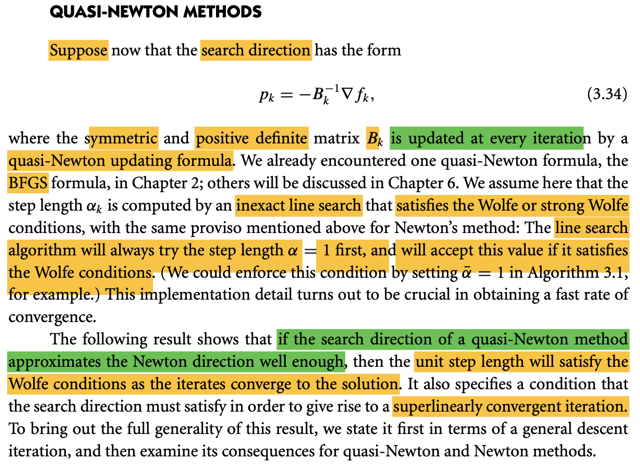</kbd>

> [!NOTE]
> Chuyển qua  phân tích cho phương pháp quasi-Newton. Như đã biết, search direction sẽ có dạng: pk = - (Bk)inv ∇fk
>
> Trong đó Bk sẽ là matrix symmetric, positive definite matrix, được update tại mỗi iteration.
> Nhớ lại chút xíu về ý tưởng chủ đạo của Quasi-Newton method: Nó sẽ tính toán một matrix Bk với mục đích là xấp xỉ matrix Hessian, và từ đó tính search direction. Mục đích là, **giảm chi phí tính toán khi thay vì phải tính Hessian, ta có cách khác để dùng một bản ước lượng của Hessian**. Mục đích dĩ nhiên là để **hưởng lợi được những tính chất tốt đẹp của Newton method như tốc độ hội tụ nhanh**.
>
> Và một trong những công thức để tính Bk đã gặp ở chương 2 là BFGS, và các công thức khác sẽ nói đến ở chương 6.
>
> Rồi, vậy thì đại khái là người ta giả định, hoặc **chỉ định** rằng: Trong cái bước chọn step length của Quasi-Newton method thì sẽ phải tính step length theo inexact line search và điều kiện dừng Wolfe. Và **cách làm sẽ phải là thử với αk =1 và giảm dần. Và nếu như α = 1 thỏa thì dùng ngay step length này**.
>
> Thế thì **nếu mà đảm bảo thuật toán làm đúng như vậy** thì theorem sau sẽ chứng minh rằng **chỉ cần search direction sấp xỉ tốt được Newton direction thì thuật toán sẽ hội tụ siêu tuyến tính**.

> [!TIP]
> **🤖 AI Feedback** — ✅ Score: **90/100**
>
> Bản tóm tắt rất chính xác và thể hiện sự hiểu biết sâu sắc về các phương pháp Quasi-Newton. Để hoàn thiện hơn, hãy làm rõ mối liên hệ giữa việc hướng tìm kiếm xấp xỉ hướng Newton và điều kiện bước nhảy đơn vị thỏa mãn điều kiện Wolfe, từ đó dẫn đến hội tụ siêu tuyến tính.

 

- **Định lý 3.6: Hội tụ siêu tuyến tính**

<kbd>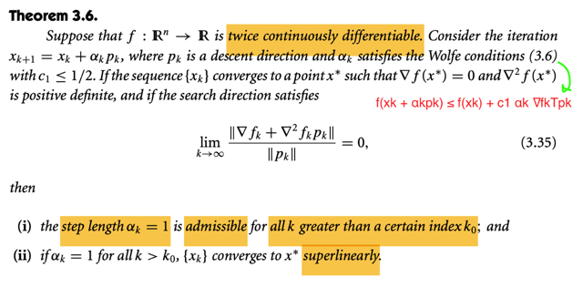</kbd>

> [!NOTE]
> Đại khái là theorem này nói rằng, nếu như ta có iteration xk+1 = xk + αkpk với pk là descent direction, αk thỏa Wolfe condition với c1 ≤ 1.2 Và nếu chuỗi xk converge về x* có gradient vanish, và Hessian PD và nếu search direction pk thỏa lim k→0 ||∇fk + ∇^2fkpk|| / ||pk|| = 0
>
> Thì khi đó **thuật toán sẽ chọn αk = 1 với mọi k lớn hơn k0 nào đó** 
>
> (nôm na là khi qua một thời điểm nào đó (iteraton nào đó) thì step size sẽ luôn = 1
>
> Và khi đó sự hội tụ sẽ **cực nhanh (siêu tuyến tính)**

 

- **Phân tích Armijo với c1**

<kbd>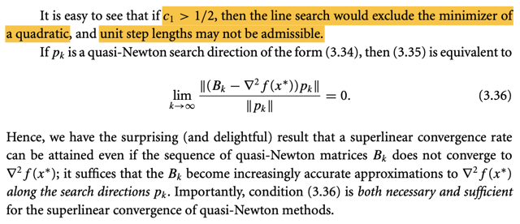</kbd>

> [!NOTE]
> Ở đây tác giả nói dễ thấy rằng **nếu c1 > 1/2** thì line search sẽ bỏ / **loại trừ minimizer của quadratic và unit step sẽ ko được chấp nhận**. Là sao?
>
>
> Thì có nghĩa là, nếu **c1 > 1/2 thì αk = 1 SẼ KHÔNG THỎA ARMIJO**, nên nó sẽ không được chọn / chấp nhận, mà thuật toán sẽ scale nó xuống.
>
> Ngược lại nếu c1 < 1/2 thì αk = 1 SẼ THỎA.
>
> Vậy thì mình chỉ cần kiểm tra xem có phải vậy ko.
>
> Nhớ lại Armijo condition: nôm na là **mức giảm hàm f (khi đi từ xk → xk + αkpk)
> phải ít nhất là bằng mức giảm của hàm tuýến tính độ dốc tại xk, với độ
> dốc điều chỉnh bởi c1**:
>
> Độ giảm của hàm f (mang dấu dương): f(xk) - f(xk+1) 
>
> phải ≥  
>
> Độ giảm hàm f bởi hàm tuyến tính: - c1 f'(xk) αk pk 
>
> ⇨ ta có điều kiện: f(xk) - f(xk+1) ≥ - c1 f'(xk) αk pk
>
> ⇔ f(xk+1) - f(xk) ≤ c1 f'(xk) αk pk
>
> ⇔ f(xk+1) ≤ f(xk) + c1 f'(xk) αk pk
>
> Thế thì, cái chính người ta nói ở đây đó là: 
>
> **khi tới gần x* thì hàm f hành xử rất giống hàm quadratic**, nên **nếu c1 > 1/2 thì αk = 1 sẽ không thỏa inequality trên**
>
> Mình cần chứng minh cho thấy điều này:
>
> Vậy thì, nếu đã nói hàm f hành xử giống hàm bậc hai, thì ta có:
>
> f(xk+1) ≈ f(xk) + f'(xk)(xk+1 - xk) + (1/2)f''(xk)(xk+1 - xk)^2
>
> = f(xk) + f'(xk)αkpk + (1/2)f''(xk)(αkpk)^2 = g(αk)  (Thay xk+1 - xk = pk)
>
> ⇨ f(xk+1) ≈ f(xk) + f'(xk)αkpk + (1/2)f''(xk)(αkpk)^2 (1)
>
> Và với αk = 1, thì αkpk sẽ dẫn ta tới minimizer:
>
> Tức là g'(1) = 0  ⇔ f'(xk)pk + f''(xk)(pk)^2αk |αk=1 = 0
>
> ⇔ f'(xk)pk + f''(xk)(pk)^2 = 0 
>
> ⇔ pk = -f'(xk)/f''(xk)
>
> Thay vào: αk = 1, pk = -f'(xk)/f''(xk)
>
> Điều kiện Armijo: f(xk+1) ≤ f(xk) + c1 f'(xk) αk pk
>
> Thay  f(xk+1) ≈ f(xk) + f'(xk)αkpk + (1/2)f''(xk)(αkpk)^2 ở (1) vào, ta có:
>
> f(xk) + f'(xk)αkpk + (1/2)f''(xk)(αkpk)^2 ≤ f(xk) + c1 f'(xk) αk pk
>
> ⇔ f'(xk)αkpk + (1/2)f''(xk)(αkpk)^2 ≤ c1 f'(xk) αk pk
>
> ⇔ (1/2)f''(xk)(αkpk)^2 ≤ (c1-1)f'(xk) αk pk
>
> ⇔ (1/2)f''(xk)(pk) ≤ (c1-1)f'(xk)
>
> ⇔ (1/2)f''(xk)(-f'(xk)/f''(xk)) ≤ (c1-1)f'(xk)
>
> ⇔ (1/2)(-f'(xk)/) ≤ (c1-1)f'(xk)
>
> ⇔ (-1/2)f'(xk) ≤ (c1-1)f'(xk)
>
> Chia hai vế cho f'(xk) là số âm nên đổi dấu:
>
> ⇔ (1/2)(-1) ≥ (c1-1)
>
> ⇔ (-1/2) ≥ c1-1
>
> ⇔ 1/2 ≥ c1
>
> Như vậy là ta đã **bắt đầu với Armijo condition**, và **thay αk = 1 vào** và cũng như là **cái mà ta có khi sử dụng the fact là hàm f hành xử như hàm bậc 2** thì thấy rằng để inequality Armijo thỏa thì ta phải có ta phải có c1 ≤ 1/2

 

- **Điều kiện hội tụ siêu tuyến tính Quasi-Newton**

<kbd>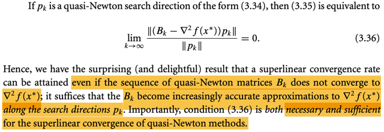</kbd>

> [!NOTE]
> Chỉ nói là nếu pk là Quasi-Newton search direction thì cái limit của theorem
> này sẽ có dạng như vầy.
>
> Và nói rằng, **theorem này cho rằng ta sẽ đạt superlinear convergence ngay cả khi Bk ko converge về Hessian ∇^2 f(x*)**, 
>
> mà **chỉ cần nó ngày càng approx tốt Hessian tại x* là đủ**

 

- **Hội tụ siêu tuyến tính Quasi Newton**

<kbd>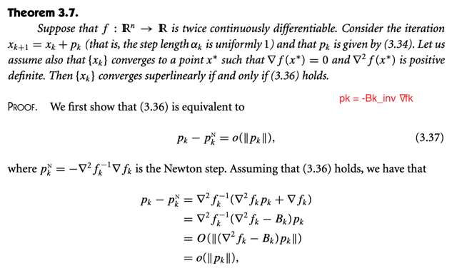</kbd>

<kbd>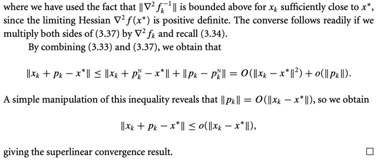</kbd>

<kbd>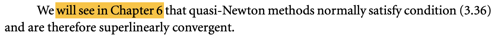</kbd>

> [!NOTE]
> Theorem này nói: với xk+1 = xk + pk, và pk = -(Bk)inv ∇fk của quasi Newton method, và xk hội tụ về x* có gradient = 0 và Hessian PD.
>
> Thì **xk sẽ hội tụ siêu tuyến tính khi và chỉ khi ta có cái limit 3.36**
>
> PHẦN CHỨNG MINH QUAY LẠI NGHIÊN CỨU SAU
>
> Ý nghĩa của cái này là chứng minh rằng **quasi Newton cũng hội tụ rất nhanh dù ko bằng Newton thật**
>
> ta sẽ còn nghiên cứu quasi Newton trong chap 6

 

