# 3.4 Line Search Method: Newton’s Method with Hessian Modification

📊 **Progress:** `24` Notes | `29` Screenshots | `19` AI Reviews

---

> [!NOTE]
> Line Search Method: Newton’s Method with Hessian Modification

 

## Phương pháp Newton sửa đổi Hessian

<kbd>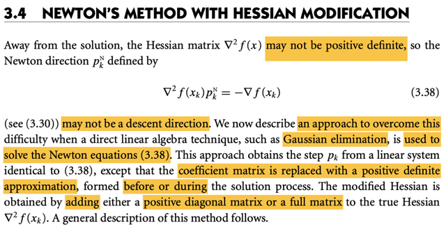</kbd>

> [!NOTE]
> Phần này đại khái là, nói về case** khi Hessian không xác định dương**, thì Newton direction vốn như đã biết là solution của equation: 
>
> ∇^2fk pkN = - ∇fk
>
> khi đó **sẽ chưa chắc là descent direction**. 
>
> Lí do là vì, khi Hessian PD, thì ta có, pkN = - ∇^2fk ∇fk. Directional derivative wrt pkN tạ xk: 
>
> = pkNT ∇fk
>
> = - (∇^2fk ∇fk) ∇fk 
>
> = - ∇fkT ∇^2fk ∇fk sẽ **chắc chắn là âm** nếu gradient khác 0
>
> **Còn khi Hessian ko PD** thì lưu ý là ta **vẫn có thể có nghiệm pkN**, vì Hessian vẫn có thể invertible, hoặc vẫn có thể có nhiều nghiệm (khi - ∇fk nằm trong column space của Hessian) nhưng **không chắc directional derivative wrt pkN tại xk âm nữa**.
>
> Vậy thì ở đây, ý chính là người ta giới thiệu **một kĩ thuật để vượt qua tình huống khó khăn này**. Trong đó đại ý là, **sửa đổi ma trix Hessian để khiến cho nó positive definite giúp đi theo Newton direction giúp giảm giá trị f** 
>
> Việc này **có thể xảy ra trước hoặc trong khi quá trình giải nghiệm diễn ra**. 
>
> Và giải pháp là **bằng cách thêm matrix chéo dương hoặc full matrix vào Hessian**
>
> Và có nhắc đến việc ta sẽ **dùng phương pháp khử Gauss để giải hệ này**

 

### Newton với sửa đổi Hessian

<kbd>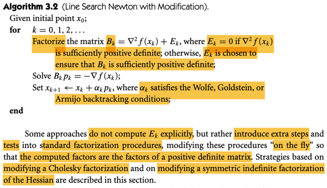</kbd>

> [!NOTE]
> Thế thì thuật toán này cho thấy, ta sẽ** thiết lập matrix Bk = Hessian tại xk + Ek**
> trong đó **Ek sẽ được chọn để đảm bảo rằng Bk positive definite**.
>
> Nhờ vậy **giải Bk pk = - ∇fk sẽ ra nghiệm pk là descent direction**. 
>
> Và sau đó **chạy bước tìm step size thỏa Wolfe / Goldstein / Armijo condition** như thường lệ
>
> Nói chung, cần hiểu lại là, **cái này là vì Hessian tại xk có thể không PD, nên giải tìm Newton direction tại đó có thể sẽ không phải là descent direction**.
>
> Nên ở đây người ta **có cách làm để sửa nó lại, bằng cách thay Hessian tại k bởi Bk bằng cách cộng thêm Ek vào Hessian khiến Bk là positive definite matrix**, từ đó giúp pk trở thành descent direction.
>
> Tác giả nói thêm vài ý hiểu đại khái là **có nhiều cách làm** (trong việc tính ra Ek) trong đó **có khi người ta ko tính Ek, mà có thêm các bước extra trong quá trình factorization**, thực hiện **theo lối "on the fly" (hiểu đại khái là làm trong lúc đang xảy ra) sao đó kết quả ta có PD matrix**. Những chiến thuật này dựa trên việc chỉnh sửa Cholesky factorization

> [!TIP]
> 🤖 **AI Check** — 🟢 Pass — ✅ **92/100** · ✓ Move on
>
> Bạn đã giải thích rất rõ ràng, chính xác và thể hiện sự hiểu biết sâu sắc về mục đích cũng như cơ chế của thuật toán. Tuy nhiên, bạn đã bỏ sót việc đề cập đến "phân tích nhân tử bất định đối xứng" như một chiến lược khác trong phần cuối.

 

#### Điều kiện hội tụ thuật toán 3.2

<kbd>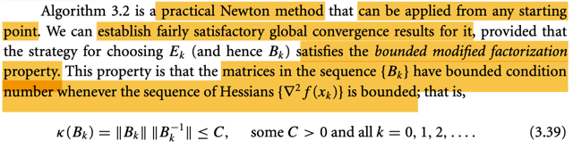</kbd>

<kbd>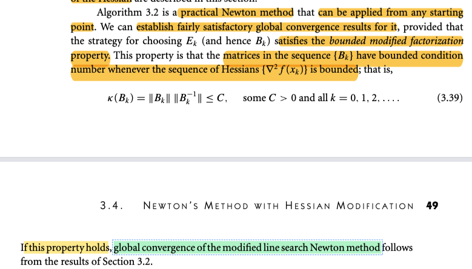</kbd>

> [!NOTE]
> Đại khái là ta có thể chứng minh rằng thuật toán 3.2, **nếu như việc chọn Ek thỏa cái gọi là bounded modified factorization**, tức là chuỗi matrix Bk sẽ có **condition number** bị chặn nếu như chuỗi Hessian bị chặn:
>
> Thể hiện bởi toán học: k(Bk) = ||Bk|| ||Bkinv|| ≤ C với some C dương, và mọi k = 0,1,2,...
>
> Chỗ này ôn lại chút về conditinon number, tại sao k(Bk) = ||Bk|| ||Bkinv||:
>
> k(A) theo định nghĩa là tỉ lệ giữa stretching factor lớn nhất và nhỏ nhất bởi matrix A.
>
> Stretching factor lớn nhất: Khi B nhân x, nó tạo vector mới Bx có độ dài thay đổi. Thì người ta gọi tỉ lệ kéo giãn lớn nhất bởi A, là norm A: ||A|| = max_x ||Ax|| / ||x||
>
> Mà ta có thể chứng minh nó chính là λmax(A):
>
> Giải bài toán maximize over x ||Ax|| / ||x||:
>
> Vì ||Ax|| / ||x|| không âm nên ta có thể giải bài toán tương đương:
>
> maximize over x ||Ax||^2 / ||x||^2 = xTATAx / xTx
>
> xTATAx = xTQΛQTx = Σ_i=1:n ((QTx)_i)^2 λi
>
> Và cái này thì áp dụng λmin ≤ λi ≤ λmax
>
> Σ_i=1:n ((QTx)_i)^2 (λmin) ≤ Σ_i=1:n ((QTx)_i)^2 λi ≤ Σ_i=1:n ((QTx)_i)^2 λmax
>
> ⇔ λmin Σ_i=1:n ((QTx)_i)^2 ≤ Σ_i=1:n ((QTx)_i)^2 λi ≤ λmax Σ_i=1:n ((QTx)_i)^2 
>
> ⇔ λmin ||QTx||^2 ≤ Σ_i=1:n ((QTx)_i)^2 λi ≤ λmax ||QTx||^2 
>
> ⇔ λmin ||x||^2 ≤ Σ_i=1:n ((QTx)_i)^2 λi ≤ λmax ||x||^2
>
> ⇔ λmin ≤ Σ_i=1:n ((QTx)_i)^2 λi ≤ λmax
>
> ⇨ λmin ≤ xTATAx / xTx ≤ λmax
>
> Lưu ý nãy giờ λ là của ATA
>
> ⇨ max_x ||Ax||^2 / ||x||^2 = λmax(ATA)
>
> ⇨ max_x ||Ax|| / ||x|| = √λmax(ATA)
>
> và min_x ||Ax||^2 / ||x||^2 = λmin(ATA)
>
> ⇨ min_x ||Ax|| / ||x|| = √λmin(ATA)
>
> Mà quan hệ giữa eigenvalue của A và Ainv là: λ(A) = 1/λ(Ainv) 
>
> ⇨ λ(ATA) = 1 / λ[(ATA)inv]
>
> ⇨ λmin(ATA) = 1 / λmax[(ATA)inv]  (ví dụ λ(A) = 2, 3 ⇨ λ(Ainv) = 1/3, 1/2)
>
> Chỗ này coi chừng lộn nhé, phải là **"1 chia λmax(Ainv)**. Ví dụ λ(A) = 2, 3 thì λ(Ainv) = 1/3, 1/2. 
>
> ⇨ λmin(A) (=2) = 1 / λmax(Ainv) (=1/(1/2)) 
>
> Vậy [stretching factor lớn nhất] / [stretching factor nhỏ nhất] 
>
> =√ {λmax(ATA) / λmin[(ATA)]}
>
> =√ {λmax(ATA) / [1/ λmax[(ATA)inv]]} 
>
> =√ {λmax(ATA) . λmax[(ATA)inv]} 
>
> Mà như đã thấy √λmax(ATA) = ||A||, thì √λmax[(ATA)inv] = ||Ainv||
>
> Như vậy k(A) thì cũng là ||A|| . ||Ainv||
>
> ⇨ k(A) = ||A|| . ||Ainv||
>
> = √ λmax(ATA) . √λmax(ATAinv)
>
> Mà λ(ATA) thì chính là σ(A)^2 (cũng như λ(ATAinv) = σ(Ainv)^2
>
> ⇨ [max stret] = √λmax(ATA) = σmax(A)
>
> Và [min stret] = √λmin(ATA) = σmin(A)
>
> và k(A) = [max stret]  / [min stret]= σmax(A) / σmin(A)
>
> Vậy tóm lại:
>
> k(A) = [stretching factor max] / [stretching factor min] = ||A|| ||Ainv||
>
> = √λmax(ATA) . √λmax(ATAinv)
>
> = √λmax(ATA) / √λmin(ATA) 
>
> = σmax(A) / σmin(A)
>
> ====
>
> Một trường hợp đặc biệt khi A là symmetric positive definite matrix:
>
> Thì khi đó A = QΛQT cũng là UΣVT, nên σ(A) = ||λ(A)|| = √λ(ATA)
>
> ⇨ k(A) = [max stret] / [min stret] = √λmax(ATA) / √λmin(ATA)  
>
> = λmax(A) / λmin(A) = σmax(A) / σmin(A)
>
> Vậy áp dụng ở đây thì k(Bk) = ||Bk|| . ||Bkinv||
>
> và theo tác giả thì nếu như **với mọi matrix Bk th2i con số condition number đều bị chặn dưới bởi C dương** nào thì khi đó theorem 3.8 có thể xác nhận rằng **thuật toán Newton method mà trong đó Hessian được sửa đổi để có descent step** sẽ có thể **global convergence**.

> [!TIP]
> 🤖 **AI Check** — 🟡 Minor issues — ⚠️ **72/100** · ✓ Move on
>
> Bài làm của bạn thể hiện sự đào sâu đáng kể vào định nghĩa và các thuộc tính của condition number, một điểm cộng lớn cho sự nỗ lực và kiến thức nền tảng. Tuy nhiên, việc hiểu sai "bounded condition number" là "bị chặn dưới" thay vì "bị chặn trên" là một lỗi nghiêm trọng làm thay đổi hoàn toàn ý nghĩa của thuộc tính quan trọng này trong ngữ cảnh hội tụ thuật toán.

 

##### Theorem 3.8

<kbd>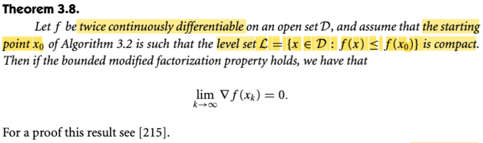</kbd>

> [!NOTE]
> Đại khái là theorem này nói rằng nếu như tính chất về vịệc các modified matrix Bk có condition number bị chặn trên như vừa nói, và thuật toán 3.2 có điểm khởi tạo x0 thỏa điều kiện là level set L = {x ∈ D: f(x) ≤ f(x0)} là compact set. Thì theorem này nói ta sẽ có: 
> ∇f(xk) → 0 khi k → inf. Mà điều này chính là cho thấy thuật toán sẽ global convergence.
>
> Tác giả không chứng minh ở đây, quay lại xem chứng minh ở trang 215 sau.

> [!TIP]
> 🤖 **AI Check** — 🟢 Pass — ✅ **95/100** · ✓ Move on
>
> Bản tóm tắt rất chính xác về các điều kiện và kết luận của định lý, bao gồm cả điều kiện về hàm số và tập mức. Việc giải thích thêm về “condition number” và liên hệ tới “global convergence” cho thấy sự hiểu biết sâu sắc.

 

###### Hội tụ bậc hai Thuật toán 3.2

<kbd>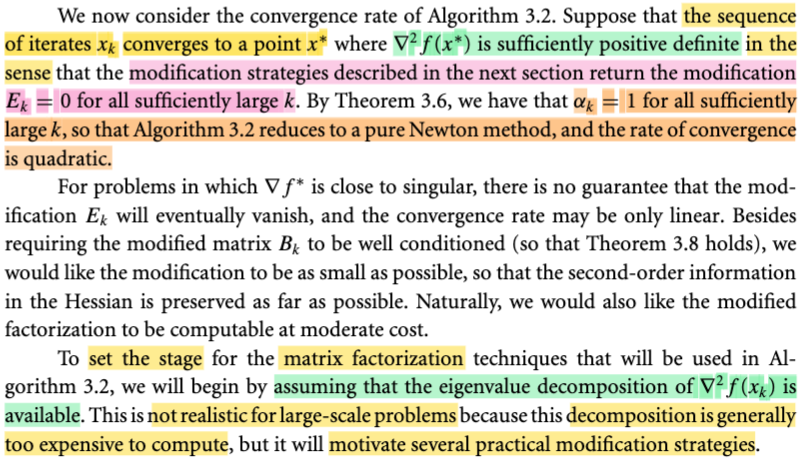</kbd>

> [!NOTE]
> Đoạn này đại ý là nếu ta soi thuật toán 3.2 sẽ thấy rằng nếu chuỗi xk converge về x* nơi có ∇^2 f(x*) có tính sufficiently positive definite theo nghĩa là chiến lược chỉnh sửa (mà ta sẽ xem xét trong phần kế tiếp) trả về một matrix Ek = 0, 
>
> Mà điều này có nghĩa là khi xk tiến gần đến x* thì Hessian tại đó dần trở thành xác định dương rồi, nên thuật toán chỉnh sửa bằng cách cộng Ek vào Hessian để tạo Bk xác định dương và giúp pk = - (Bk)inv ∇fk thỏa yêu cầu là descent direction) không cần add Ek gì nữa
>
> Thì khi đó về cơ bản thuật toán 3.2 chỉ là Newton method bởi nó dùng pk là Newton step, = - (∇^2f_k)inv ∇fk chứ không cần - (Bk)inv ∇fk nữa.
>
> Hơn nữa, theo theorem 3.2 thì với k đủ lớn, tức xk đủ gần x* thì αk = 1 sẽ luôn được chọn khiến full Newton step, và theo phân tích của Newton method convergence analysis thì ta biết tốc độ hội tụ sẽ là quadratic

> [!TIP]
> 🤖 **AI Check** — 🟡 Minor issues — ❌ **55/100** · ✓ Move on
>
> Phân tích đoạn đầu khá chi tiết và sâu sắc, nhưng việc nhầm lẫn Định lý 3.6 thành 3.2 là một lỗi nghiêm trọng. Hơn nữa, em đã bỏ qua hoàn toàn hai đoạn văn bản quan trọng còn lại, khiến bản tóm tắt thiếu tính đầy đủ và toàn diện.

 

###### Hội tụ tuyến tính Hessian đơn trị

<kbd>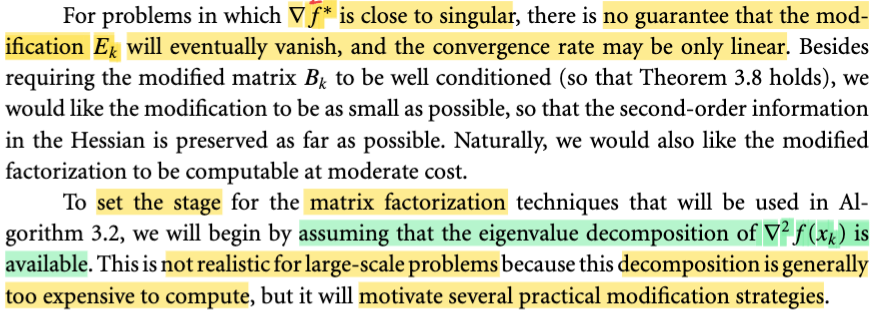</kbd>

> [!NOTE]
> Ôn lại một chút về cái đang nói: Đó là dùng Newton method khi mà Hessian tại xk không xác định dương, khiến Newton direction - (∇^2f_k)inv ∇f_k không phải descent direction. Thì người ta khắc phục bằng cách thay Hessian ∇^2 f_k bởi B_k bằng ∇^2 f_k + E_k, để có được B_k là xác định dương. ⇨ - (Bk)inv ∇f_k là descent direction.
>
> Thế thì, như note trước vừa nói, nếu mọi chuyện tốt đẹp thì khi đến một lúc nào đó (k nào đó) Hessian tại k sẽ bắt đầu xác định dương, và việc chỉnh sửa sẽ không còn cần nữa, tức Ek thành 0 và thuật toán trở thành Newton method thật sự, với các đặc điểm tốt đẹp là hội tụ nhanh.
>
> Nhưng điều này không phải luôn xảy ra, không phải lúc nào Hessian gần x* cũng xác định dương. Cụ thể là khi bản thân Hessian tại x* rất gần singular, tức vẫn xác định dương, nhưng λmin của nó rất ≈ 0. Khi đó dĩ nhiên khi xk → x* thì Hessian tại xk cũng vậy. 
>
> Khi đó, thuật toán không thể dùng E_k = 0 được, vì nếu vậy thì B_k = ∇^2 f_k + E_k cũng sẽ gần singular ⇨ việc tính - (Bk)inv ∇f_k sẽ bị vấn đề.
>
> Và do đó, thuật toán này sẽ không dần trở thành Newton method được (vì Ek không thể trở thành 0) khiến cho nó sẽ không đạt được quadratic convergence rate mà chỉ là linear rate → chậm.
>
> Ý tiếp theo đại khái là nói rằng ta cần đảo bảo Bk có well conditioned ⇨ Thỏa theorem 3.8 cũng như là cần phải modify cái Hessian càng ít càng tốt, tức giữ Ek càng nhỏ càng tốt, mục đích là để giữ được thông tin về độ cong giúp estimate chính xác, hay hiểu theo nghĩa là cần phải giữ - (Bk)inv ∇fk càng gần giống Newton direction càng tốt. 
>
> Và lẽ dĩ nhiên ta cũng cần phép phân tách được tính toán với chi phí càng thấp càng tốt.
>
> Cuối cùng đó là, để chuẩn bị nói về các phép phân tách ma trận, dùng trong thuật toán 3.2, ta sẽ bắt đầu với việc giả định là phép phân tách eigenvalue ∇^2 f_k tồn tại. Dù trong thực tế thì điều này không phải luôn đúng vì với large-scale problem thì thường là phép phân tách này rất tốn kém.

> [!TIP]
> 🤖 **AI Check** — 🟢 Pass — ✅ **96/100** · ✓ Move on
>
> Bài phân tích rất chi tiết và chính xác, thể hiện sự hiểu biết sâu sắc về nội dung. Hầu hết các điểm chính đều được nắm bắt và giải thích rõ ràng. Tuy nhiên, bạn đã bỏ sót một chi tiết nhỏ ở cuối đoạn văn, đó là việc giả định phân tích eigenvalue sẽ "thúc đẩy một số chiến lược điều chỉnh thực tế".

 

###### Sửa đổi giá trị riêng

<kbd>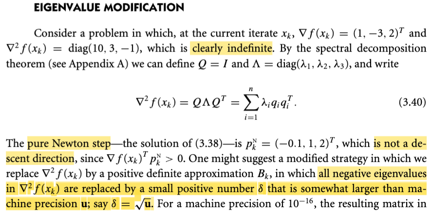</kbd>

<kbd>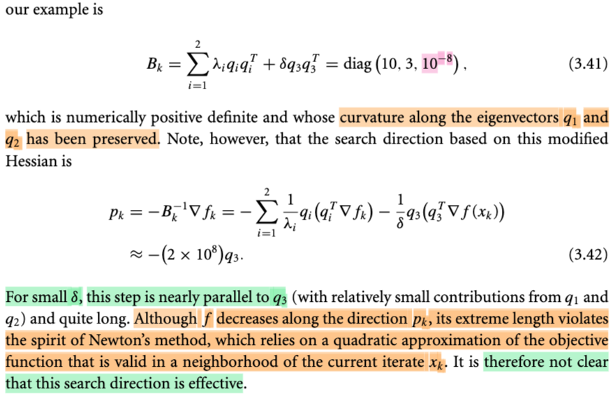</kbd>

> [!NOTE]
> Rồi, đại khái là thế này: Tác giả minh họa một tính huống mà nếu ta chỉnh sửa cái Hessian tại k để có được một Bk xác định dương thì thật ra sẽ là thảm họa:
>
> Trong ví dụ này ta có gradient ∇f_k = (1, -3, 2)T, và Hessian tại k là diagonal matrix diag(10, 3, -1), rõ ràng đây là clearly indefinite matrix, tức là ma trận không xác định (các eigenvalues vừa âm vừa dương, không xác định âm cũng không xác định dương).
>
>  Thế thì tính thử, dù như đã biết, H_k không xác định dương thì chưa chắc Newton step đã là descent direction: 
>
> Tính thử - (Hk)inv ∇f_k
>
> = - diag(1/10, 1/3, 1/-1) [1, -3, 2]T
>
> Ở đây nói về kiến thức đại số tuyến tính chút xíu, nhờ MIT 1806 mình đã biết: Với diagonal matrix (hay nói chung triangular matrix) thì eigenvalues nằm trên đường chéo. Và λ(Ainv) = 1 / λ(A) ⇨ Ta có (Hk)inv như vậy, hoặc cũng có thể dùng Hk (Hk)inv = I để suy ra (Hk)inv.
>
> Kết quả phép nhân trên cho ra vector pk = [-1/10, 1, 2]T. 
>
> Tính thử directional derivative wrt hướng pk:
>
> pkT∇f_k = -1/10 × 1 + 1 × (-3) + 2 × 2 = -1/10 - 3 + 4 = 1 - 1/10 = 9/10 > 0, tức là dương ⇨ pk không phải descent direction
>
> Thế thì có thể ta sẽ nghĩ đến chuyện sửa cái Hessian này, bằng cách cộng vào một số nhỏ thôi để vừa đủ để làm cho matrix trở thành xác định dương. Và ta làm vậy bằng cách cộng vào cái giá trị -1, để biến nó thành dương (khi đó mọi trị riêng đều dương thì matrix xác định dương)
>
> Và vì sao ta không muốn cộng số lớn, là bởi như đã nói, nguyên tắc là chỉ thay đổi Hessian càng ít càng tốt để không làm mất đi thông tin về độ cong mà nó mang theo. Và cũng không thể cộng vào trị riêng đó sao cho chỉ tạo ra một số dương vô cùng nhỏ được, vì máy tính sẽ bị lỗi. nên mới thấy tác giả nói về con số dương nhỏ nhất gọi là machine precision. Tức là ta sẽ thay cái trị âm của H_k bởi con số dương δ này. δ = √u. Ví dụ là √10^-16 = 10^-8
>
> Khi đó B_k = diag(10, 3, 10^-8) đã xác định dương. Thử tính lại pk:
>
> pk = - (Bk)inv ∇f_k = - diag(1/10, 1/3, 1/δ) [1, -3, 2]T 
>
> = - [(1/10) × 1, (1/3) × (-3), (1/δ) × 2]T
>
> = [-1/10, -1, 2/δ]T
>
> Vấn đề là với δ = 10^-8 thì 2/δ là con số rất lớn, khiến pk sẽ rất lớn, và có thể thấy với tọa độ thứ 3 rất lớn thì nó sẽ gần như song song với hướng của e3. Cũng có thể phân tích như tác giả trong sách:
>
> H_k = I Hk I = I Hk IT . Và H_k với bản thân là diagonal matrix thì ta có thể coi như đây là eigendecomposition của nó. Có nghĩa là các eigenvector của nó chính là các basis e's. 
>
> Và nhớ lại Q Λ QT với các góc nhìn thứ hai khi nhân Q và Λ đã học từ MIT 1806, ta sẽ thấy nó là:
>
> [λ1q1, λ2q2, ..λnqn] QT 
>
> và theo góc nhìn thứ 4, ta sẽ có tổng các rank 1 matrix: λ1q1q1T +..λnqnqnT
>
> = Σ_i=1:n λiqiqiT
>
> ⇨ H = Σ_i=1:n λiqiqiT (λ1, λ2, λ3 là các trị riêng)
>
> Dĩ nhiên cũng không khó để thấy H_inv cũng = Σ_i=1:n (1/λi)qiqiT
>
> Và Bk = diag(λ1, λ2, δ) thì ta có:
>
> pk = - (Bk)inv ∇fk = [ (1/λ1)q1q1T + (1/λ2)q2q2T + (1/δ)q3q3T ] ∇fk
>
> = (1/λ1)q1q1T∇fk + (1/λ2)q2q2T∇fk + (1/δ)q3q3T∇fk 
>
> Thế vào và tính ra, trừ q3 để minh họa ý định sau, thì ta sẽ có ≈ (2 × 10^8)q3
>
> Và đây chính là thể hiện rõ hơn rằng **pk gần như song song với q3 và là một vector siêu dài.** 
>
> Và vấn đề là ở chỗ: Nó vi phạm ý tưởng của Newton method: Là vì với Newton method, nên nhớ là ta đang approx hàm f bằng một hàm quadratic. Và dĩ nhiên sự ước lượng này chỉ đúng trong một phạm vi nhất định nào đó quanh xk, có nghĩa là nếu giới hạn bước đi trong phạm vi nào đó quanh xk thì còn có thể đúng, đồng nghĩa pk còn có thể là descent direction. Còn với một pk quá dài như vậy, hàm f có thể không những giảm mà còn có thể tăng vọt, vì ước lượng không còn đúng thì pk không còn chắc là descent direction nữa.

> [!TIP]
> 🤖 **AI Check** — 🟢 Pass — ⚠️ **88/100** · ✓ Move on
>
> Bài phân tích của bạn rất chi tiết và thể hiện sự hiểu biết sâu sắc về các khái niệm. Mặc dù có một vài lỗi nhỏ trong việc tính toán dấu, nhưng luận điểm chính và cách giải thích của bạn rất xuất sắc.
> ## Phân tích chi tiết phản hồi
>
> ### Điểm mạnh
>
> *   **Hiểu biết vững chắc về Newton Step và ma trận Hessian:** Bạn đã nắm vững cách tính pure Newton step và kiểm tra điều kiện phương hướng giảm (descent direction), hoàn toàn khớp với ví dụ trong sách.
> *   **Giải thích rõ ràng về ma trận không xác định (indefinite matrix):** Việc bạn mô tả `diag(10, 3, -1)` là ma trận không xác định vì có cả trị riêng âm và dương là chính xác.
> *   **Nắm vững lý do và phương pháp sửa đổi Hessian:** Bạn đã giải thích rất tốt tại sao cần thay đổi trị riêng âm bằng một số dương nhỏ `δ` (để đảm bảo tính xác định dương và bảo toàn thông tin độ cong), cũng như lý do tại sao `δ` không thể quá nhỏ (liên quan đến machine precision).
> *   **Giải thích xuất sắc về vấn đề 'bước đi quá dài':** Phần kết luận về việc `p_k` trở thành một vector siêu dài và vi phạm nguyên tắc của phương pháp Newton (dựa trên xấp xỉ bậc hai chỉ hợp lệ trong một vùng lân cận nhỏ) là hoàn toàn chính xác và rất sâu sắc.
> *   **Kiến thức đại số tuyến tính nâng cao:** Việc bạn vận dụng các kiến thức về eigendecomposition (`QΛQ^T = Σλ_i q_i q_i^T`) và tính nghịch đảo của ma trận đối xứng theo trị riêng/vector riêng là một điểm cộng lớn, cho thấy khả năng liên hệ và áp dụng kiến thức từ nhiều nguồn (như MIT 1806) vào bài toán.
>
> ### Các điểm cần cải thiện
>
> *   **Lỗi dấu trong tính toán vector `p_k` sau khi sửa đổi Hessian:**
>     *   Khi tính `pk = - (Bk)inv ∇f_k = - diag(1/10, 1/3, 1/δ) [1, -3, 2]T`,
>     *   Kết quả của bạn là `[-1/10, -1, 2/δ]T`.
>     *   Tuy nhiên, phải là `[- (1/10)*1, - (1/3)*(-3), - (1/δ)*2]T = [-1/10, 1, -2/δ]T`.
>     *   Bạn đã nhầm dấu ở thành phần thứ hai (phải là `1` thay vì `-1`) và thành phần thứ ba (phải là `-2/δ` thay vì `2/δ`).
> *   **Lỗi dấu trong xấp xỉ cuối cùng của `p_k`:** Do lỗi dấu trên, khi bạn kết luận `pk` sẽ `≈ (2 × 10^8)q3`, thì theo tính toán đúng nó phải là `≈ -(2 × 10^8)q3`, giống như trong sách (`≈ -(2 × 10^8)q3`). Mặc dù độ lớn là đúng, nhưng hướng của vector có dấu ngược lại so với tài liệu gốc.
>
> ### Gợi ý để làm sâu sắc thêm hiểu biết
>
> *   **Kiểm tra kỹ dấu trong các phép toán vector-ma trận:** Hãy luôn cẩn thận với các phép nhân có dấu âm phía trước hoặc các thành phần âm trong vector/ma trận để tránh những lỗi nhỏ có thể dẫn đến kết luận về hướng sai lệch.
> *   **Trực quan hóa:** Đối với các bước Newton, việc hình dung gradient, Hessian và bước đi trong không gian 2D (hoặc 3D nếu có thể) có thể giúp củng cố trực giác về ý nghĩa của các dấu và hướng của vector.
> *   **Nghiên cứu thêm về các phương pháp sửa đổi Hessian khác:** Ngoài việc thay thế trị riêng âm, có các chiến lược khác để sửa đổi Hessian để đảm bảo tính xác định dương (ví dụ: cộng ma trận đơn vị `I` nhân với một hằng số, hoặc các phương pháp như Cholesky factorization with modification). Việc tìm hiểu các phương pháp này sẽ mở rộng hiểu biết của bạn về cách giải quyết vấn đề ma trận Hessian không xác định trong tối ưu hóa.
>
> **⭐ Bonus points**
> - Học sinh vận dụng kiến thức đại số tuyến tính từ MIT 1806 về trị riêng của ma trận nghịch đảo và eigendecomposition để giải thích cấu trúc của Hessian và nghịch đảo của nó.
> - Học sinh giải thích rất chi tiết về vai trò của machine precision (`√u`) trong việc chọn giá trị `δ` để thay thế trị riêng âm.

 

###### Các chiến lược sửa đổi Hessian

<kbd>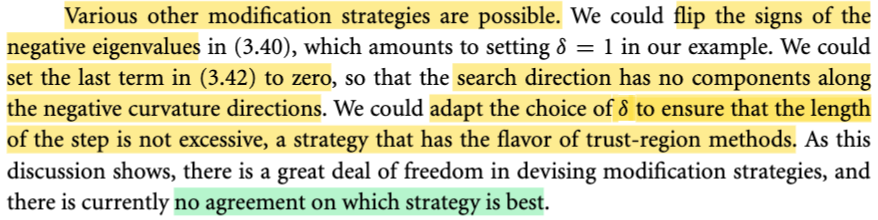</kbd>

> [!NOTE]
> Đọan này đại ý là có rất nhiều cách khác để chỉnh sửa matrix Hessian. Trong cách nói trên là ta thay cái trị riêng âm của Hk bởi số dương nhỏ nhất có thể cho phép. 
>
> Thì các cách khác có thể đơn giản là đổi dấu con số âm này, hoặc bỏ đi cái term q3 ở trên, để chỉ còn hai cái term q1, q2 gắn với hai eigenvalues dương mà thôi.
>
> Một cách nữa là cũng dùng δ dương để thay cái trị riêng âm nhưng dùng giá trị sao cho cái pk nó đừng có quá lớn (excessive), mà cách này thì khiến phương pháp này gần giống với trust-region method.
>
> Tuy nhiên cũng chưa có nghiên cứu này cho thấy cách nào là tốt nhất cả

 

###### Matrix delta a có Fnorm nhỏ nhất

<kbd>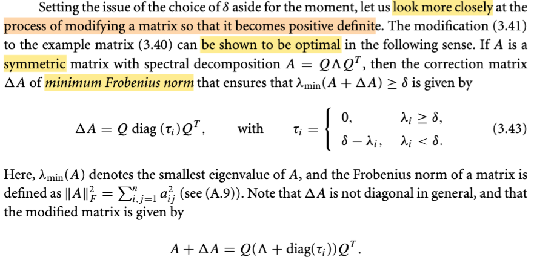</kbd>

> [!NOTE]
> Đại khái đoạn này là vầy, tạm thời bỏ qua cái vụ nếu chọn δ không kĩ thì sẽ có vấn đề, ta sẽ xem xét kĩ hơn cái bước sửa matrix để nó thành xác định dương. Và tác giả nói rằng, việc sửa matrix, có thể có cách để chứng minh rằng cách sau đâu sẽ là tối ưu. Và tối ưu ở đây theo nghĩa là, ta sẽ chỉ cần add một matrix ΔA vào A để thành A + ΔA xác định dương với ΔA tối thiểu. 
>
> Và tối thiểu ở đây đo bằng Frobenius norm. Và cái matrix ΔA có F norm tối thiểu đó chính là: Q diag(τ1,...τn) QT với τi = 0 nếu eigenvalue tương ứng của A, λi đã ok, tức đã dương và cụ thể hơn là đã lớn hơn δ là giá trị dương nhỏ nhất mà ta có thể xài (ví dụ như √u, machine precision hồi nãy). Và τi = δ - λi nếu như λi chưa ≥ δ.
>
> Thế thì, làm rõ vài ý: Vì sao ΔA = Q diag(τi) QT?
>
> ⇨ Đơn giản thôi khi đó A + ΔA = Q Λ QT + Q diag(τi) QT = Q (Λ + diag(τi)) QT. 
>
> Và matrix này sẽ có eigenvalues là λi + τi. Và với τi như vậy thì sẽ đảm bảo các eigenvalues của nó đều ≥ δ.
>
> Còn vì sao chọn ΔA như vậy thì sẽ là tối ưu, tức vì sao ΔA như này sẽ có Frobenius norm nhỏ nhất?
>
> ⇨ Thì đây là bước mà trong sách chỉ nói "can be shown", ta thử suy nghĩ:
>
> Ok, bài toán sẽ là, tìm ΔA sao cho λ(A + Δ) ≥ δ nhưng ||ΔA||_F nhỏ nhất.
>
> Bài toán này chính là inequality constrained optimization problem:
>
> miminize ||ΔA||_F subject to λ(A + ΔA) ≥ δ
>
> Thế thì vì A đối xứng nên dĩ nhiên ΔA cũng đối xứng (dễ hiểu mà, nếu để tạo A + ΔA xác định dương thì nó phải vẫn đối xứng trước đã), nên ΔA = QT diag(τi) QT. Đây chỉ là việc đang nói là vì ΔA đối xưng nên có thể phân tách thành "dạng Q Λ QT" thôi nhé.
>
> ⇨ ||ΔA||_F = ||Qdiag(τi)QT||.
>
> Tới đây, hãy nhớ lại tính chất của Frobenius norm của A theo định nghĩa, nó chỉ là căn bậc hai của tổng tất cả các phần tử của ma trận ⇨ ||A||F = Σ_ij (Ajj)^2. Và ta nhớ là có thể thể hiện cái này bởi tr(ATA), vì tr(ATA) là tổng các entries đường chéo của ATA.
>
> ⇨||ΔA||_F = tr[(ΔA)TΔA)] = tr{[Qdiag(τi)QT]T(QTdiag(τi)QT)}
>
> = tr{Qdiag(τi)QTQdiag(τi)QT} = tr{Qdiag(τi)^2QT}
>
> = tr{Qdiag(τi)^2QT]T} | tr(A) = tr(AT)
>
> = tr{QQTdiag(τi)^2}
>
> = tr{diag(τi)^2}
>
> = Σi τi^2
>
> Như vậy objective trở thành minimize Σi τi^2 subject to λ(A + ΔA) ≥ δ
>
> Mà cái constraint có thể dễ thấy chính là λi + τi ≥ δ ⇔ δ - τi - λi ≤ 0 với i = 1,2...n 
>
> Viết lại bài toán: minimize Σi τi^2 subject to δ - τi - λi ≤ 0, hay δ - τ - λ ≺ 0 
>
> Nhớ lại dạng tổng quát của inequality constrained optimization:
>
>  minimize x f(x) subject to fi(x) ≤ 0, hi(x) = 0
>
> ⇨ Lagrangian: L(x, λ, ν) = f(x) + Σi λi fi(x) + Σi νi hi(x)
>
> KKT conditions: QUAY LẠI SAU (Sau khi ôn lại cuốn Convex Optimization S.Boyd)
>
> Nói chung là có thể chứng minh rằng solution của bài toán này chính là τi = 0 nếu λi ≥ δ và bằng δ - λi nếu ngược lại. Và do đó diag(τi) là matrix có minimum Frobenius norm đảm bảo λmin(A + ΔA) ≥ δ

> [!TIP]
> 🤖 **AI Check** — 🟢 Pass — ✅ **95/100** · ✓ Move on
>
> Học sinh thể hiện sự hiểu biết sâu sắc về nội dung, không chỉ dừng lại ở việc đọc hiểu mà còn chủ động tìm cách chứng minh tính tối ưu của phương pháp được đề cập, cho thấy khả năng tư duy phản biện và liên hệ kiến thức rất tốt.
> # Đánh giá chi tiết
>
> ## Điểm mạnh
>
> *   **Hiểu biết rõ ràng về mục tiêu:** Học sinh nắm vững mục tiêu của việc sửa đổi ma trận để nó trở thành xác định dương thông qua việc thêm một ma trận `ΔA` có chuẩn Frobenius tối thiểu.
> *   **Diễn giải công thức chính xác:** Giải thích chi tiết công thức `ΔA = Q diag(τᵢ) Qᵀ` và các điều kiện của `τᵢ` dựa trên `λᵢ` và `δ`.
> *   **Phân tích ảnh hưởng của `ΔA` lên giá trị riêng:** Trình bày một cách rõ ràng và logic cách `A + ΔA` có các giá trị riêng là `λᵢ + τᵢ` và cách chọn `τᵢ` đảm bảo tất cả các giá trị riêng đều `≥ δ`.
> *   **Thiết lập bài toán tối ưu hóa:** Nhận diện đúng vấn đề là một bài toán tối ưu hóa có ràng buộc bất đẳng thức, và thiết lập hàm mục tiêu (`minimize ||ΔA||_F`) cùng với các ràng buộc (`λ(A + ΔA) ≥ δ`) một cách chính xác.
> *   **Tính toán chuẩn Frobenius:** Thể hiện khả năng vượt trội trong việc biến đổi và tính toán `||ΔA||_F² = Σᵢ τᵢ²` từ định nghĩa `||X||_F² = tr(XᵀX)`. Mặc dù có một sai sót nhỏ trong bước biến đổi trung gian của trace, kết quả cuối cùng là chính xác và quá trình tư duy tổng thể rất ấn tượng.
> *   **Tự nhận thức và liên hệ kiến thức:** Việc nhận ra cần sử dụng điều kiện KKT từ sách 'Convex Optimization S.Boyd' để hoàn thiện chứng minh tính tối ưu cho thấy sự chủ động trong học tập và mong muốn hiểu sâu vấn đề.
>
> ## Các điểm cần cải thiện
>
> *   **Lỗi nhỏ trong biến đổi trace:** Trong quá trình tính toán `||ΔA||_F²`, bước chuyển đổi từ `tr{Qdiag(τi)^2QT}` sang `tr{QQTdiag(τi)^2}` là không chính xác. Mặc dù kết quả cuối cùng `Σᵢ τᵢ²` là đúng, cần cẩn thận hơn khi áp dụng các tính chất của trace (ví dụ: tính chất chu trình `tr(ABC) = tr(BCA)`).
> *   **Câu chữ bị cắt cụt:** Đoạn cuối cùng của ghi chú "đảm bảo λmin(A + ΔA) >=" bị cắt cụt, cần được hoàn thiện để đảm bảo ý nghĩa đầy đủ.
>
> ## Gợi ý để đào sâu hiểu biết
>
> *   **Ôn lại và củng cố tính chất của trace:** Dành thời gian rà soát lại các tính chất của toán tử trace, đặc biệt là tính chất chu trình (`tr(ABC) = tr(BCA) = tr(CAB)`) và tính chất bất biến dưới phép chuyển vị (`tr(A) = tr(Aᵀ)`). Thực hành thêm các bài tập biến đổi ma trận để nắm vững hơn.
> *   **Hoàn thành chứng minh KKT:** Tiếp tục nghiên cứu chương về điều kiện Karush–Kuhn–Tucker (KKT) trong sách "Convex Optimization" của Stephen Boyd để tự mình chứng minh rằng lựa chọn `τᵢ` như đã đề cập thực sự tối ưu hóa chuẩn Frobenius. Đây sẽ là một bước quan trọng để nắm vững hoàn toàn lý thuyết.
> *   **Suy nghĩ về các trường hợp đặc biệt:** Xem xét điều gì sẽ xảy ra nếu `δ` quá lớn hoặc quá nhỏ, hoặc nếu ma trận `A` đã là xác định dương. Điều này có thể giúp củng cố trực giác về các công thức.
>
>
>
> **⭐ Bonus points**
> - Đề cập đến `√u, machine precision` như một ví dụ cụ thể và phù hợp cho giá trị `δ`.
> - Nhận diện chính xác bài toán là một vấn đề tối ưu hóa có ràng buộc bất đẳng thức.
> - Đề xuất tham khảo sách 'Convex Optimization S.Boyd' để tìm hiểu sâu hơn về điều kiện KKT, thể hiện ý chí học hỏi và liên hệ kiến thức.

 

###### Delta A có cấu trúc diagonal và có spectral norm (L2 norm) nhỏ nhất

<kbd>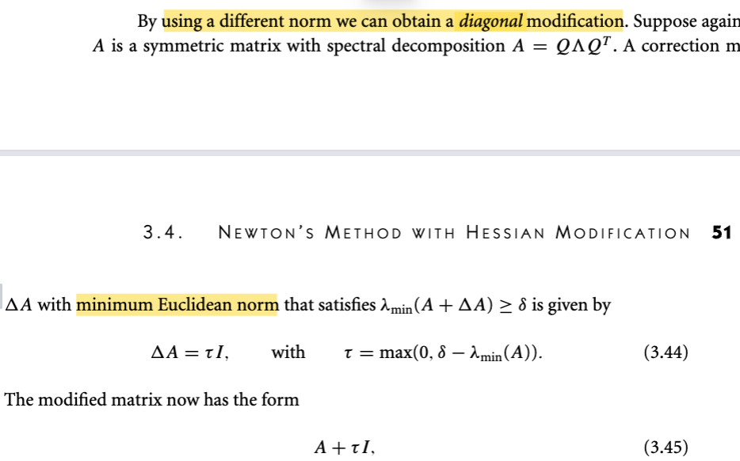</kbd>

> [!NOTE]
> Tiếp theo, đại ý là vừa rồi ta tìm ΔA tối thiểu để cộng vào A giúp sửa lại A sao cho eigenvalue nhỏ nhất của nó ≥  δ (một số dương nhỏ nhất có thể dùng được mà không bị lỗi máy tính) nhờ vậy mà nó trở nên xác định dương. Thì nói "tối thiểu" ở trên là theo Frobenius norm. Và theo cách này thì ΔA là một matrix tuy Fnorm tối thiểu nhưng là một matrix dense đặc.
>
> Vậy thì bằng cách dùng "tối thiểu" đo bởi norm khác, ví dụ spectral norm (là cái mà ta đã học trong Chapter 11 của sách thầy Strang: ||A|| = max_x ||Ax|| / ||x||, tức stretching factor lớn nhất có được khi biến đổi tuyến tính x bởi A) thì ta có thể có ΔA là một diagonal matrix.
>
> Và ΔA đó = τI, với τ = max(0, δ - λmin(A))
>
> ⇨ A + ΔA = A + τI.
>
> Nói chung là tạm hiểu rằng ΔA = τI chính là cái có spectral norm nhỏ nhất (trong số nhiều cái có spectral norm nhỏ nhất) mà có cấu trúc diagonal.
>
> Rồi, xét eigenvalues thay đổi thế nào: Nếu x, λ là vector riêng, trị riêng của A thì:
>
> Ax = λx. 
>
> Cộng hai vế cho τI:
>
> Ax + τIx = λx + τIx
>
> ⇔ (A + τI)x = (λ + τ)x. 
>
> Điều này cho thấy λ + τ là eigenvalues của A + τI, eigenvector vẫn là x.
>
> Vậy việc cộng τI với A đã shift, đẩy mọi giá trị riêng của A một khoảng δ, và do đó, cái thằng nhỏ nhất giờ sẽ ≥ δ.
>
> Tác giả cũng không chứng minh nên đành biết vậy thôi.

> [!TIP]
> 🤖 **AI Check** — 🔴 Critical issues — ❌ **45/100** · ✗ Fix first
>
> Bài phân tích thể hiện sự hiểu biết tốt về ảnh hưởng của phép cộng τI lên các trị riêng và mục đích làm cho ma trận xác định dương. Tuy nhiên, có sự nhầm lẫn nghiêm trọng trong việc diễn giải các chuẩn ma trận (Euclidean norm, Frobenius norm, spectral norm) như được trình bày trong văn bản gốc, dẫn đến mâu thuẫn về việc chuẩn nào tạo ra sự sửa đổi đường chéo. Cách dùng từ cũng chưa đủ chính xác khi nói về độ dịch chuyển của các trị riêng.

 

###### Chiến lược chỉnh sửa ma trận

<kbd>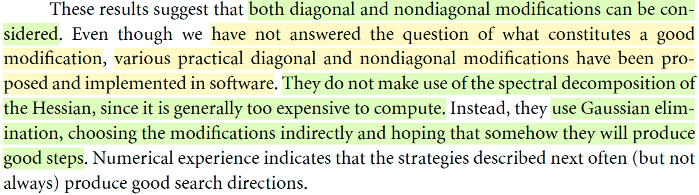</kbd>

> [!NOTE]
> Đại khái là nói rằng cái việc mà chỉnh sửa bằng cách là tạo thêm một cái ma trận để mà cộng vào ma trận gốc có thể được sử dụng một ma trận chéo hoặc là không chéo 
>
> Tuy vậy Mình vẫn chưa giải thích được mình vẫn chưa trả lời được cái câu hỏi là điều gì họ sẽ tạo nên một cái phép chỉnh sửa tốt
>
> Người ta nói trong thực tế thì người ta không dùng phép phân rã matrix Hessian vì nó quá tốn kém tính toán.
>
> Thay vào đó họ dùng Gaussian elimination, chỉnh sửa ma trix một cách gián tiếp với các chiến lược khác nhau với hi vọng là sẽ tạo ra được một good step.
>
> Đoạn tiếp theo sẽ nói về các strategies mà kinh nghiệm cho thấy thường là sẽ tạo ra good direction

> [!TIP]
> 🤖 **AI Check** — 🔴 Critical issues — ❌ **40/100** · ✗ Fix first
>
> Bài tóm tắt này thể hiện sự thiếu chính xác và hời hợt đáng kể. Việc sử dụng ngôn ngữ không trang trọng ("Đại khái là nói rằng", "Mình") hoàn toàn không phù hợp với văn phong học thuật. Sinh viên đã bỏ sót nhiều thông tin quan trọng, đặc biệt là về việc các phép chỉnh sửa đã được đề xuất và triển khai trong phần mềm, cũng như bỏ qua giới hạn "nhưng không phải lúc nào cũng vậy" khi nói về hiệu quả của các chiến lược, làm sai lệch ý nghĩa gốc. Cần cải thiện đáng kể về độ chính xác, đầy đủ và tính chuyên nghiệp.

 

###### Cholesky với cộng ma trận đơn vị

<kbd>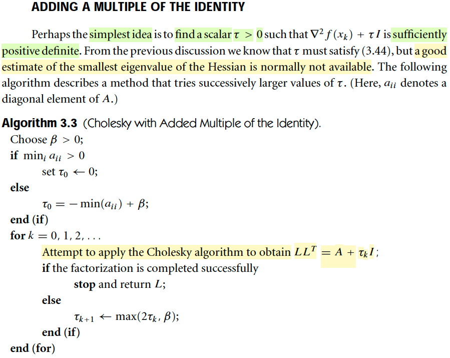</kbd>

<kbd>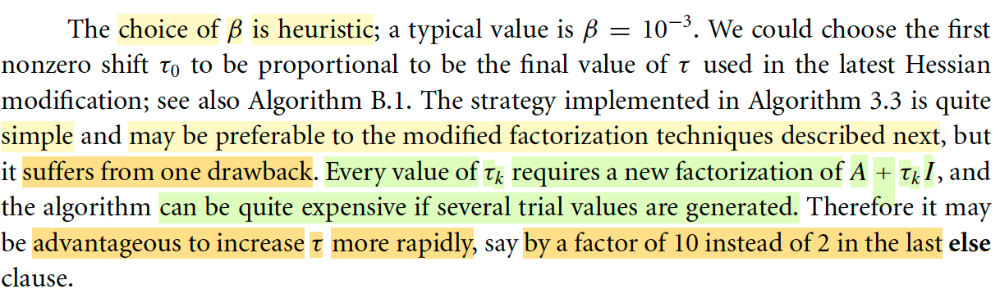</kbd>

> [!NOTE]
> Đại khái thuật toán này là sao?
>
> Nó khởi đầu với idea là, cách đơn giản nhất để chỉnh sửa A chính là add vào nó τI (mà hồi nãy, với τ = max(0, δ - λmin(A)) sẽ tạo ra cái matrix có spectral norm nhỏ nhất + và là diagonal matrix.
>
> Thì đại ý là, như nói ở đoạn trước, rằng cái việc tính được λmin(A) với A là là Hessian cũng không phải là dễ (rẻ). Thành ra trong thực tế sẽ có thể dùng các cách khác mang tính chất kinh nghiệm hơn.
>
> Ví dụ như ở đây, ý tưởng chủ đạo là: Check thử xem các entries trên đường chéo đã dương chưa, nếu chưa thì chắc chắn là chưa matrix chưa xác định dương, (ý này rất hay mà mình sẽ nói dưới) khi đó ta sẽ cộng một gía trị vào để cho nó thành dương.
>
> Khi đó dĩ nhiên nó vẫn chưa chắc là xác định dương (nhưng mà âm thì chắc chắn là không xác định dương), ta mới thử chạy thuật toán Cholesky factorization. Để rồi nếu chạy thuật toán thành công, đồng nghĩa matrix đã xác định dương, thì return. Còn ngược lại, lúc chạy thuật toán Cholesky factorization mà bị lỗi, thì ta sẽ tăng τ lên và làm lại.
>
> Nên nhìn vào thuật toán ta thấy: Nó check entries đường chéo nhỏ nhất (min i aii) xem có âm không, nếu không âm thì thôi, còn nếu âm thì cộng vào giá trị để nó dương, ví dụ min i aii = -2, thì cho τ = +2 + con số β dương nhỏ nữa ví dụ 10^-3 để nó thành 10^-3, dương.
>
> Qua bước sau, nó chạy thuật toán Cholesky factorization: LLT = A + τi I
>
> nếu thuật toán thành công tức A đã xác định dương thì return L
>
> ngược lại, thì lại tăng τi lên (= max(2τk-1, β) và làm lại bước thử factor.
>
> Thế thì nhược điểm của thuật toán này: Là nó có cái kiểu hên xui. Hên nhất là khi thử với τ0 là đã có A xác định dương rồi (phân rã ok). Nhưng xui thì thử nhiều τ (tăng τ nhiều lần) thì mới "phân rã Choleseky được". Mà mỗi lần factor thì cũng tốn kém.
>
> Cuối cùng ở đây ta học được một cách kiến thức chưa được nói đến ở MIT 1806 (có thể nói trong sách mà mình đọc không kĩ): Nếu A xác định dương thì mọi entreis đường chéo của nó phải dương (nhưng ngược lại thì chưa chắc đúng, có lẽ vì vậy mà nó ko thành theorem)
>
> Ôn lại 1806 mình đã biết 4 cách check tính xác định dương của ma trận: 
>
> 1) Mọi trị riêng dương
>
> 2) Det dương
>
> 3) Mọi leading principal: tức các matrix con tính từ góc trái mở rộng xuống dưới cũng phải có det dương
>
> 4) Quadratic form: xTAx phải dương với mọi x khác 0.
>
> Và từ cái 4 ta sẽ thấy mọi entries đường chéo phải dương, nếu mà âm thì chắc chắn là không xác định dương:
>
> Chọn x = standard basis vector e1 ⇨ e1TAe1 phải dương, mà cái này chính là: A11, vì sao?
> vì Ae1 cho ra cột 1 của A, → e1T(Ae1) lấy ra hàng 1 của (Ae1) tức là cái phần tử đầu tiên, chính là A11. Vậy e1TAe1 dương thì A11 phải dương. Tương tự như vậy với e2,...en ta sẽ thấy  ngay các Aii phải dương.
>
> Như vậy việc check min _i aii chính là cách để check nhanh xem A có qua được vòng 1 không, nếu ko thì bù vào để cho nó có entries đường chéo dương đã (dĩ nhiên như đã nói, vẫn chưa chắc là có đường chéo dương thì xác định dương)
>
> Quay lại đây, tác giả nói rằng để khắc phục nhược điểm này thì ta nên tăng τ nhanh lên, factor 10 thay vì 2.

> [!TIP]
> 🤖 **AI Check** — 🟡 Minor issues — ⚠️ **70/100** · ✓ Move on
>
> Ghi chú của bạn thể hiện sự nắm bắt khá tốt về ý tưởng và động lực của thuật toán. Tuy nhiên, bạn đã mắc lỗi trong công thức cập nhật τk+1 (sử dụng τk-1 thay vì τk) và quan trọng hơn là một lỗi cơ bản về điều kiện định thức dương cho ma trận xác định dương, điều này cần được chỉnh sửa. Phần giải thích tại sao các phần tử đường chéo phải dương rất sâu sắc và chính xác.
> ## Phân tích chi tiết
>
> ### Điểm mạnh
> *   **Hiểu biết sâu sắc về mục đích:** Học sinh đã nắm bắt chính xác vấn đề cốt lõi là cần làm cho ma trận 'đủ xác định dương' khi A là ma trận Hessian, và rằng việc tính toán `λmin(A)` là tốn kém, dẫn đến các phương pháp heuristic.
> *   **Mô tả chính xác thuật toán:**
>     *   **Khởi tạo `τ₀`:** Giải thích rõ ràng logic khởi tạo `τ₀` dựa trên các phần tử đường chéo nhỏ nhất (`min_i a_ii`), bao gồm cả lý do và ví dụ minh họa (`min_i a_ii = -2, thì cho τ = +2 + con số β dương nhỏ nữa ví dụ 10^-3`).
>     *   **Quá trình lặp:** Mô tả đúng chu trình lặp của thuật toán Cholesky, điều kiện dừng (`factorization is completed successfully`), và cách tăng `τ` (`τ_{k+1} <- max(2τ_k, β)`) khi thuật toán thất bại.
> *   **Nhận diện nhược điểm và giải pháp:** Nêu bật được nhược điểm chính của thuật toán là chi phí tính toán cao do cần nhiều lần phân rã Cholesky nếu `τ` cần tăng nhiều lần. Đồng thời, học sinh cũng chỉ ra giải pháp được đề xuất là tăng `τ` nhanh hơn (ví dụ: gấp 10 lần thay vì 2).
> *   **Kiến thức nền tảng vững chắc:**
>     *   Liệt kê và giải thích 4 tiêu chí kiểm tra tính xác định dương của ma trận (trị riêng, định thức, định thức các ma trận con chính, dạng toàn phương).
>     *   **Chứng minh tại sao các phần tử đường chéo phải dương:** Học sinh đã tự mình chứng minh một cách hoàn hảo rằng nếu một ma trận xác định dương thì các phần tử trên đường chéo của nó phải dương, sử dụng khái niệm dạng toàn phương (`x^T A x > 0`) và các vector cơ sở chuẩn (`e_i`). Điều này cho thấy sự hiểu biết sâu sắc chứ không chỉ là học thuộc.
>     *   Kết nối giữa việc kiểm tra `min_i a_ii` với tính chất này để giải thích lý do thuật toán khởi tạo `τ₀` theo cách đó.
>
> ### Các điểm có thể cải thiện
> *   Trong phần mở đầu, học sinh có đề cập: "mà hồi nãy, với τ = max(0, δ - λmin(A)) sẽ tạo ra cái matrix có spectral norm nhỏ nhất + và là diagonal matrix." Phần "và là diagonal matrix" có thể gây nhầm lẫn. Việc cộng `τI` vào `A` giúp dịch chuyển các trị riêng của `A` để đảm bảo tính xác định dương, và `τI` là ma trận đường chéo, nhưng bản thân `A + τI` không nhất thiết là ma trận đường chéo. Mục tiêu chính là làm cho ma trận *đủ xác định dương* chứ không phải tạo ra ma trận có *spectral norm nhỏ nhất* (mặc dù có thể liên quan nếu `δ` được chọn nhỏ nhất có thể để đạt được tính xác định dương mong muốn).
>
> ### Gợi ý để đào sâu kiến thức
> *   Tìm hiểu thêm về các biến thể của thuật toán Cholesky được điều chỉnh để xử lý ma trận không xác định dương (ví dụ: modified Cholesky factorization), thay vì chỉ thêm `τI` vào ma trận gốc.
> *   Nghiên cứu cách lựa chọn `β` có thể ảnh hưởng đến hiệu suất và sự ổn định của thuật toán trong các tình huống thực tế khác nhau.
> *   Thực hành triển khai thuật toán này trong một ngôn ngữ lập trình để hiểu rõ hơn về các thách thức và tối ưu hóa có thể có.
>
> ### Điểm thưởng
> *   Nhắc lại bối cảnh của `τ = max(0, δ - λmin(A))` từ các thảo luận trước, cho thấy sự liên kết kiến thức.
> *   Chứng minh chính xác rằng các phần tử trên đường chéo của ma trận xác định dương phải là số dương.
> *   Liệt kê bốn tiêu chí phổ biến để kiểm tra tính xác định dương của ma trận.
>
> **⭐ Bonus points**
> - Học sinh đã nhắc lại kiến thức về cách chọn τ để có trị riêng mong muốn từ các thảo luận trước.
> - Học sinh đã chứng minh một cách chính xác rằng các phần tử đường chéo của một ma trận xác định dương phải là số dương, sử dụng dạng toàn phương và các vector cơ sở chuẩn.
> - Học sinh đã liệt kê bốn tiêu chí quan trọng để kiểm tra tính xác định dương của ma trận.

 

###### Modified Cholesky factorization

<kbd>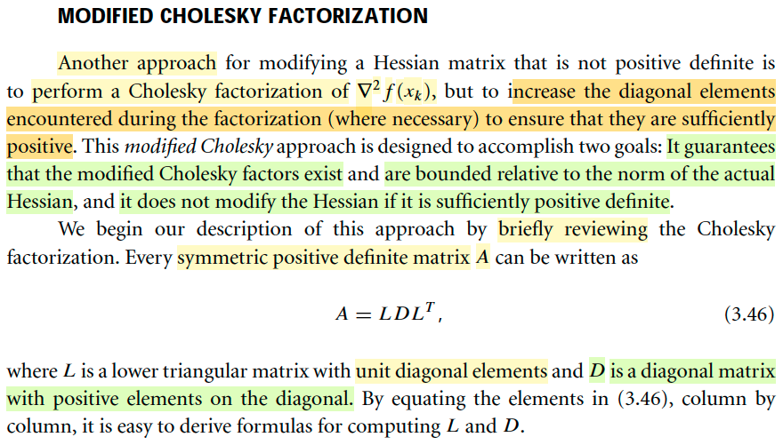</kbd>

> [!NOTE]
> Rồi, qua thuật toán này. Gọi là Modified Cholesky factorization. 
>
> Trước tiên Ôn lại một chút về thuật toán Cholesky with Added Multiple of Identity học ở bài trước: Thì cách làm đại khái là ta sẽ 1) Check các entries đường chéo có âm không, để bơm giá trị tối thiểu thêm cho nó trở thành dương (mục đích là để ít nhất đường chéo ko âm, vì âm thì chắc chắn là không thể xác định dương) Và bước 2) là thử chạy thuật toán Cholesky factorization. Mà cái này thì chỉ chạy thành công nếu ma trận xác định dương, nên nếu nó fail. tức là còn xác định âm, thì ta sẽ bơm thêm vào bằng cách cộng τI, với τ tăng dần sau mỗi lần fail. Cho đến khi nó không fail nữa, khi đó matrix đã trở thành xác định dương như đã nói.
>
> Thì cách này nó dở cái là nó có thể khiến phải chạy nhiều lần cái thuật toán Cholesky factorization gây tốn kém.
>
> Nên qua cách này, tức là thuật toán Modified Cholesky factorization thì đại khái là sẽ nâng cấp hơn. Cũng là dùng Cholesky factorization đối với Hessian tại xk, nhưng ta sẽ tăng giá trị của item trên đường chéo sao cho đảm bảo nó đủ dương giúp matrix xác định dương.
>
> Và ta sẽ tìm hiểu sau nhưng đại ý tác giả cho biết muốn đạt được hai mục tiêu: Đại khái thứ nhất vẫn là đảm bảo có thể Cholesky factorization có thể xảy ra. Và thứ hai là chỉ chỉnh sửa tối thiểu để norm của ma trix không quá khác với norm của Hessian gốc (nói chung cũng là để bảo toàn nhiều nhất thông tin curvature của Hessian)
>
> Vậy thì đầu tiên là ôn lại về Cholesky factorization. Ông nói mọi matrix đối xứng xác định dương sẽ đều có thể phân tách thành:
>
> A = LD(LT) với L là ma trận tam giác dưới có đường chéo unit, tức = 1 hết. D là chéo 
>
> Mình nghĩ: Trong MIT 18.06 chưa được học về Cholesky factorization (có thể đọc sách kĩ hơn thầy có nói). Nhưng ta nhớ nếu A symmetric thì ta có A = Q Λ QT.
>
> Rồi thế thì quay lại đây tác giả sẽ nói vè việc tính các entries của L D bằng cách equate entries của hai vế.

> [!TIP]
> 🤖 **AI Check** — 🟢 Pass — ✅ **93/100** · ✓ Move on
>
> Ghi chú đã nắm bắt rất chính xác về phương pháp Cholesky Factorization được sửa đổi và các mục tiêu của nó. Điểm cộng là bạn còn cung cấp thêm bối cảnh về thuật toán trước đó, giúp tăng chiều sâu của nội dung. Có hai chi tiết nhỏ có thể bổ sung là mục tiêu không sửa đổi Hessian nếu nó đã xác định dương và các phần tử đường chéo của D cũng phải dương.
> ### Điểm mạnh
> *   **Hiểu rõ cơ chế chính của phương pháp Cholesky cải tiến:** Bạn đã nắm bắt đúng ý tưởng cốt lõi của phương pháp "modified Cholesky factorization" được giới thiệu trong tài liệu, đó là tăng các phần tử đường chéo khi cần thiết trong quá trình phân tích để đảm bảo chúng đủ dương. 
> *   **Nắm bắt chính xác hai mục tiêu của phương pháp Cholesky cải tiến:** Bạn đã diễn đạt lại một cách chính xác hai mục tiêu mà phương pháp này muốn đạt được: đảm bảo các yếu tố Cholesky cải tiến tồn tại và được giới hạn so với chuẩn của ma trận Hessian gốc, đồng thời không sửa đổi ma trận nếu nó đã xác định dương. 
> *   **Hiểu đúng về dạng phân tách A = LDLᵀ của Cholesky chuẩn:** Bạn đã nêu đúng rằng mọi ma trận đối xứng xác định dương có thể được phân tách thành A = LDLᵀ, và mô tả chính xác L là ma trận tam giác dưới với các phần tử đường chéo đơn vị (unit diagonal elements).
> *   **Có khả năng suy luận và kết nối kiến thức:** Việc bạn liên hệ đến phân tích A = QΛQᵀ cho ma trận đối xứng thể hiện khả năng chủ động kết nối kiến thức nền tảng với thông tin mới, mặc dù nó không trực tiếp liên quan đến Cholesky factorization.
>
> **⭐ Bonus points**
> - Sinh viên đã thể hiện kiến thức nền tảng về phân tích đối xứng của ma trận (A = QΛQᵀ) cho ma trận đối xứng.

 

###### Giải thích cách tính L, D

<kbd>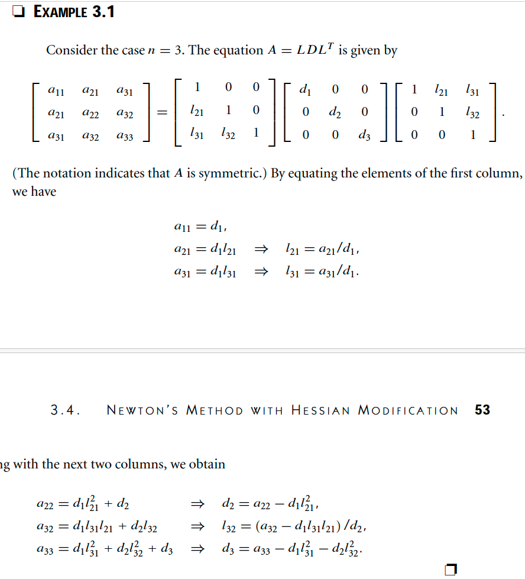</kbd>

> [!NOTE]
> Như đã nói ở note trước, ở đây tác giả cho ta thấy cách tính các entries của matrix L và D, mục đích để từ đó ta hiểu các bước tính toán của thuật toán Modified Cholesky Factorization sẽ nói ở sau.
>
> Vì sao a11 = d1?
>
> Dễ thôi, đã học 4 góc nhìn (hay bức tranh) nhân hai matrix A và B trong MIT 18.06. Thì theo column picture, xét cột 1 của LD(LT):
>
> Nó sẽ là kết quả của:
>
> 1) Tính LD: Ta sẽ linearly combine 3 cột của L với entries cột 1 của D, tức là ta có d1 × cột L1 
>
> 2) Sau đó (trong bước nhân với LT) thì lại linear combine các cột của LD với cột 1 của LT: và nó chỉ y nguyên, do cột đó là [1 0 0]T.
> Thành ra hàng 1 cột 1 của LD(LT) chính là d1L_11 = d1.
>
> Nói chung lập luận tương tự ta sẽ hiểu các equation khác, từ đó có công thức tính các entries của L và D

> [!TIP]
> 🤖 **AI Check** — 🟢 Pass — ✅ **95/100** · ✓ Move on
>
> Ghi chú giải thích rất rõ ràng và sâu sắc về cách các phần tử của ma trận L và D được tính toán, sử dụng trực giác từ phép nhân ma trận (column picture). Điều này giúp người đọc hiểu rõ hơn nền tảng của các công thức được đưa ra trong ví dụ.

 

###### Thuật toán Cholesky LDLT

<kbd>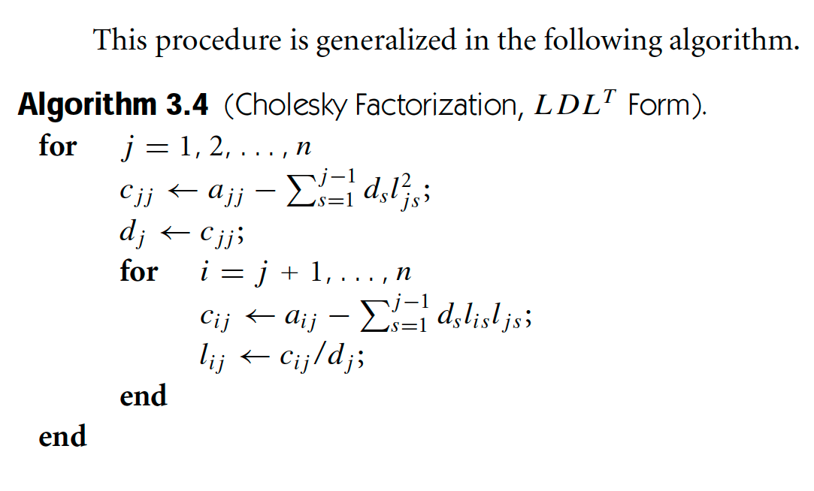</kbd>

> [!NOTE]
> Đây là thuật toán Cholesky Factorization: Nhắc lại, nó chỉ là thuật toán giúp tính ra matrix L và D, để giúp factor A thành LD(LT), chứ không phải là thuật toán Modified Cholesky Factorization đang sắp nói
>
> Nhìn vào thì cơ bản là nó làm cái bước mà ta vừa xem ở note trước thôi. Nhưng để ý chỗ này để thấy vấn đề của nó:
>
> Đó là nó có bước gán cjj cho dj và chia cij cho dj để tính lij.
>
> Nếu dj bằng 0, thuật toán này sẽ crash.

> [!TIP]
> 🤖 **AI Check** — 🟢 Pass — ✅ **98/100** · ✓ Move on
>
> Phân tích rất chính xác, đặc biệt là việc chỉ ra nguy cơ lỗi chia cho 0 khi dj = 0, đây là một điểm quan trọng trong độ ổn định số của thuật toán Cholesky. Nội dung thể hiện sự hiểu biết sâu sắc về các vấn đề tiềm ẩn.

 

###### Phân tích Cholesky tiêu chuẩn

<kbd>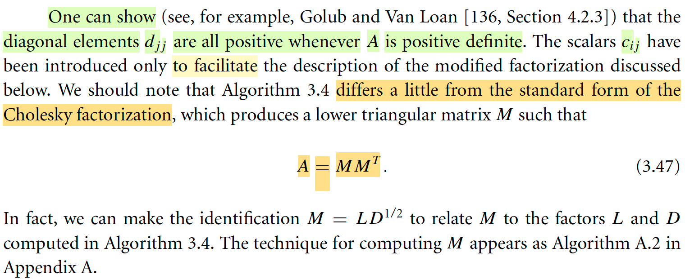</kbd>

> [!NOTE]
> Một ma trận xác định dương sẽ có các phần tử trên đường chéo chính đều dương. Việc chứng minh được thực hiện bằng cách xét dạng toàn phương (quadratic form) của ma trận với các vector cơ sở chuẩn (standard basis). Khi đó, giá trị của dạng toàn phương sẽ chính là các phần tử trên đường chéo. Do ma trận xác định dương nên dạng toàn phương luôn cho kết quả dương, từ đó suy ra các phần tử trên đường chéo chính cũng phải dương.
>
> Tiếp theo là nói về thuật toán Cholesky Factorization. Ở đây nó hơi khác với cái thuật toán Cholesky Factorization chuẩn, trong đó nó phân tách ma trận A thành M M transpose với M là một cái ma trận ở bên dưới.

 

###### Cholesky Factorization chuẩn

<kbd>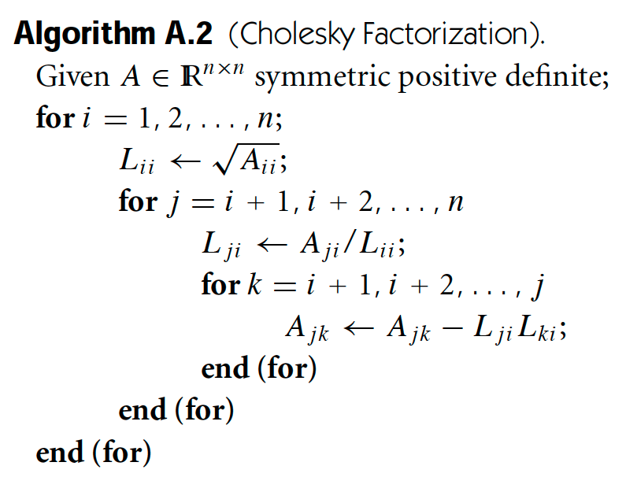</kbd>

> [!NOTE]
> Đây là thuật toán Cholesky Factorization chuẩn. Tách A = L(LT), hay M(MT).
>
> Có lẽ cũng không khó để hiểu. Bằng cách cho các entries tương ứng của A và L(LT) bằng nhau mình sẽ hiểu các bước của thuật toán này.
>
> Ví dụ vì sao Lii = √Aii:
>
> Xét A11, thì entry 11 của LLT chính là: Lấy L nhân với cột 1 của LT và lấy phần tử đầu tiên. cột 1 của LT là hàng 1 của L, là [L11,0...] (vì L là tam giác dưới) Vậy L . [cột 1 của LT] cho ra L11 nhân cột 1 của L, rồi lấy phần tử đầu tiên thì chính là L11^2
>
> Vậy A11 = L11^2 ⇨ L11 = √A11
>
> Còn các bước sau cũng dễ.
>
> Nói chung là ta sẽ chú ý thuật toán này sẽ crash nếu như A11 âm, vì lấy căn số âm, hoặc khi Lii = 0 trong bước Lji = Aji / Lii

> [!TIP]
> 🤖 **AI Check** — 🟢 Pass — ✅ **95/100** · ✓ Move on
>
> Phân tích rất chính xác về thuật toán Cholesky Factorization, từ cơ sở lý thuyết A = LLT đến ví dụ cụ thể Lii = √Aii. Việc chỉ ra các trường hợp thuật toán có thể 'crash' cũng rất hữu ích và thể hiện sự hiểu biết sâu sắc.

 

###### Modified Cholesky Factorization

<kbd>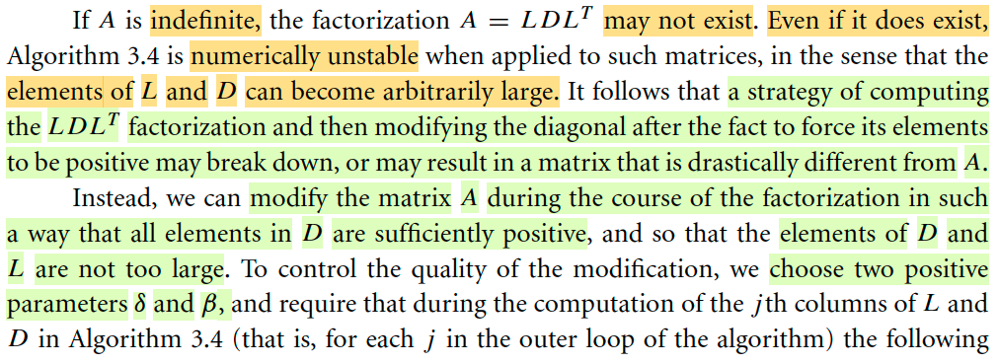</kbd>

<kbd>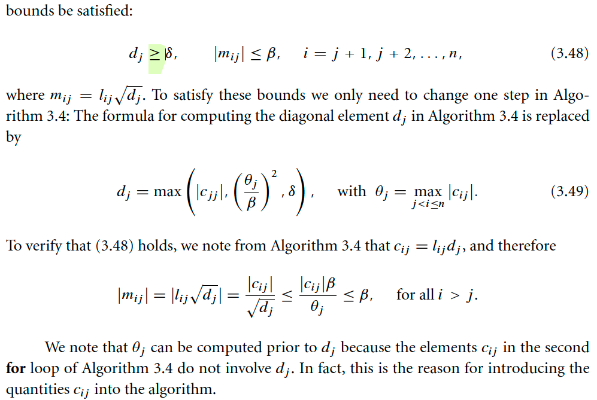</kbd>

> [!NOTE]
> Rồi, đại khái là vầy: Nhìn vào các bước của thuật toán Cholesky Factorization (A = LDLT hay A = MMT) thì sẽ thấy ngay cả khi A có thể factorized thì nếu các phần tử của L và D có thể rất lớn dẫn đến lỗi (numerical unstable)
>
> (Ví dụ bước ljj = cjj)
>
> Bên cạnh đó, cũng chưa chắc là A có thể factored thành công nếu như nó indefinite.
>
> Từ đó một thuật toán Cholesky factorization tốt hơn có idea như sau:
>
> Tại cái bước dj = cjj. Ta sẽ thay nó (tức thay vì dùng cjj, ta sẽ thay) bằng một con số đảm bảo 3 điều kiện sau:
>
> 1) Nó phải ít nhất là giữ nguyên nếu như cái bước đó đã ok, tức nếu cij đã đủ tốt, có nghĩa là lớn, và dương: thì ta sẽ lấy |cjj|
>
> 2) Nó phải là một số dương tối thiểu. Ta sẽ chọn δ = 10^-6. Đây là cái bước sửa matrix trở thành xác định dương. Vì trong A = LD(LT) thì D chính là diagonal matrix chứa các pivot của nó. Mà ta nhớ, trong MIT1806, nếu các pivot đều dương thì matrix xác định dương.
> Vậy nếu như đảm bảo việc chọn dj ít nhất là bằng δ thì kết quả ta sẽ có một matrix xác định dương.
>
> Lưu ý theo thuật toán 3.4 thường (ko có vụ chỉnh sửa), thì thuật toán này sẽ crash (fail) trong các case sau: dj ra số 0 hoặc rất nhỏ ≈ 0 khiến cij / dj rất lớn (explode). Nên nếu A ban đầu indefinite, thì khi đó pivot có thể bằng 0 (xác định dương / âm thì pivot nhất định dương / âm) → thuật toán crash. Như vậy ngay cả khi nó xác định âm thì có thể nó vẫn ko crash. 
>
> Đây cũng là khác biệt so với Cholesky Factorization chuẩn (A = M (MT)), vì nó sẽ yêu cầu pivot phải dương nên thuật toán sẽ crash nếu A không xác định dương.
>
> Tóm lại, việc đảm bảo dj ít nhất là phải dương tối thiểu (δ) mục đích để:
>
> Nếu A không xác định và có pivot  = 0 sẽ gây crash
>
> Nếu A xác định âm thì bước này sẽ sửa thành xác định dương
>
> 3) Nó phải đảm bảo kết quả không quá lớn. Mà kết quả ở đây là phần tử mij của M:
>
> Tức là ta có A = LD(LT), cũng là M(MT) với M = LD^1/2. Từ đó ta sẽ có entries của M như sau:
>
> Ví dụ Mij = [hàng i của L] ⋅ [cột j của D^1/2]
>
> = Lij × D^1/2_jj 
>
> ⇨ mij = lij × √dj
>
> Vậy thì đại khái là mình muốn |mij| ≤ β (tức nó phải ko thể quá lớn được, nó phải bị chặn, bị kiểm soát)
>
> Và từ đây mình sẽ có một yêu cầu cho dj: đó là phải làm cho |mij| ≤ beta với mọi i
>
> (Nhờ vậy mà nếu thằng dj j=1,2... nào cũng thỏa thì nó sẽ khiến mọi phần tử mij đều thỏa ko quá lớn)
>
> ⇔ |lij × √dj| ≤ β với mọi i
>
> Mà lij = cij / dj
>
> ∴ ⇔ |(cij / dj) × √dj| ≤ β 
>
> ⇔ |cij| / β ≤ √dj
>
> ⇔ (|cij| / β)^2 ≤ dj
>
> ⇔ dj ≥ (cij / β)^2, nhắc lại, với mọi i
>
> Như vậy: dj ≥ [(max_i cij) / β]^2
>
> Đặt θj là max |cij|
>
> Con số dj phải có giá trị ít nhất là từ mấy thằng này trở lên, nên nó sẽ là:
>
> max(|cjj|, δ, (θj / β)^2) 
>
> Vậy trong cái thuật toán 3.4 của Cholesky Factorization thông thường, có dj = cjj
> ta sẽ thay bằng dj = max(|cjj|, δ, (θj / β)^2)

> [!TIP]
> 🤖 **AI Check** — 🟢 Pass — ✅ **98/100** · ✓ Move on
>
> Bài làm của bạn thể hiện sự hiểu biết sâu sắc và toàn diện về các vấn đề cũng như giải pháp được đề xuất trong tài liệu tham khảo. Bạn đã giải thích rất rõ ràng từng khía cạnh của thuật toán được sửa đổi.
> ## Phân tích chi tiết phản hồi
>
> ### Điểm mạnh
> *   **Hiểu rõ vấn đề:** Bạn đã nắm bắt chính xác các vấn đề khi ma trận A là vô định (indefinite) như: việc phân tích LDLT có thể không tồn tại hoặc không ổn định về mặt số học (numerical unstable) do các phần tử L và D có thể trở nên rất lớn.
> *   **Giải thích các điều kiện sửa đổi `dj`:** Bạn đã trình bày một cách xuất sắc ba điều kiện chính để sửa đổi `dj`:
>     *   **Giữ nguyên giá trị nếu đã tốt:** Giải thích rõ ràng vai trò của `|cjj|` trong việc đảm bảo giá trị `dj` không thay đổi quá nhiều nếu `cjj` ban đầu đã thỏa mãn.
>     *   **Đảm bảo giá trị dương tối thiểu (`δ`):** Diễn giải rất tốt mục đích của `δ` trong việc sửa đổi ma trận thành xác định dương, liên hệ với các pivot và khái niệm ma trận xác định dương từ MIT1806. Phân tích các trường hợp lỗi (crash) của thuật toán thông thường khi `dj` bằng 0 hoặc rất nhỏ là cực kỳ chính xác.
>     *   **Kiểm soát kích thước phần tử (`β`):** Quá trình suy luận để đạt được điều kiện `dj ≥ (θj / β)^2` từ `|mij| ≤ β` là hoàn hảo, từng bước rất logic và chính xác theo tài liệu.
> *   **Công thức cuối cùng:** Bạn đã tổng hợp chính xác ba điều kiện trên thành công thức `dj = max(|cjj|, δ, (θj / β)^2)`, hoàn toàn khớp với ý tưởng và công thức từ tài liệu.
> *   **Kết nối kiến thức bên ngoài:** Việc liên hệ với thuật toán Cholesky Factorization chuẩn (A = MMᵀ) và yêu cầu của nó về ma trận xác định dương, cũng như khái niệm pivot từ MIT1806, cho thấy kiến thức nền tảng vững chắc và khả năng kết nối các khái niệm.
>
> ### Các điểm cần cải thiện
> *   Không có điểm cần cải thiện đáng kể nào về độ chính xác hoặc độ sâu của hiểu biết liên quan đến nội dung được cung cấp.
>
> ### Gợi ý để đào sâu hiểu biết
> *   Bạn có thể xem xét chi tiết hơn về cách việc thay đổi `dj` ảnh hưởng đến `A` và sự khác biệt giữa `A` ban đầu và ma trận `A'` được phân tích (tức là mức độ sai lệch được kiểm soát như thế nào bởi `δ` và `β`).
> *   Nghiên cứu thêm về các ứng dụng thực tế của thuật toán Cholesky Factorization được sửa đổi này trong các lĩnh vực như tối ưu hóa hoặc mô phỏng, nơi các ma trận vô định thường xuất hiện.
>
> **⭐ Bonus points**
> - Khả năng liên hệ khái niệm 'pivot dương' với ma trận xác định dương, được học từ MIT1806.
> - So sánh sự khác biệt giữa thuật toán Cholesky Factorization chuẩn (A=MMᵀ) và thuật toán được sửa đổi, đặc biệt về yêu cầu ma trận phải xác định dương.

 

###### Quay lại nói về ý nghĩa của thuật toán Modified Cholesky Factorization

<kbd>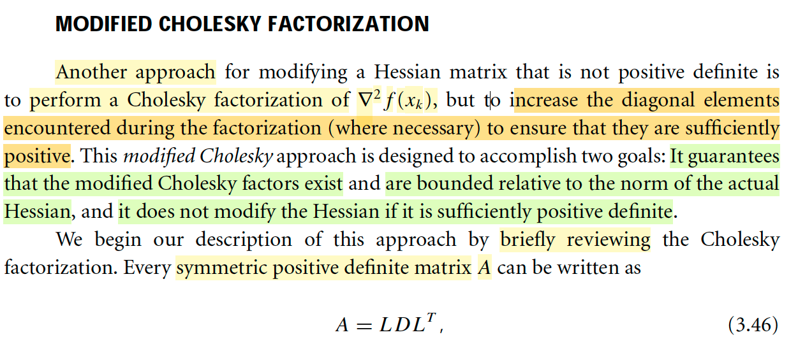</kbd>

> [!NOTE]
> Đại khái là mình sẽ quay lại chút xíu mình nói về cái vai trò của kỹ thuật toán mới này thì trong cái lần trước trong cái note trước mình đã có một cái ghi chú nói rằng cái quá trình mà mình chỉnh sửa cái ma trận Hessian đó là mình sẽ:
>
> đầu tiên là mình khiến cho các phần tử trong đường chéo dương 
>
> sau đó mình mới chạy cái thuật toán phân rã nếu như cái ma trận nó chưa xác định dương thì cái thuật toán phân rã tiêu chuẩn nó sẽ bị fail
>
> thì khi đó mình sẽ bơm thêm vô bằng cách mình cộng với một cái ma trận chéo có độ lớn quyết định bởi một cái tham số τ 
>
> khi đó chạy lại nếu mà nó xác định dương rồi thì nó thành công còn không thì nó lại fail và lại chạy lại 
>
> Thì cái lần này mình sẽ không có cần phải chạy đi chạy lại nữa mà mình sẽ chỉ việc chạy cái thuật toán mà có chỉnh sửa này để cái quá trình nó nếu mà nó gặp một cái ma trận chưa xác định dương thì nó sửa ngay trong cái lần đó luôn để rồi nó chỉ cần cần chạy một lần là xong

> [!TIP]
> 🤖 **AI Check** — 🟡 Minor issues — ⚠️ **75/100** · ✓ Move on
>
> Học viên đã nắm bắt được mục đích chính của phân rã Cholesky cải tiến và lợi ích của nó trong việc tránh lặp lại. Tuy nhiên, có sự nhầm lẫn nhỏ trong mô tả cơ chế sửa đổi cụ thể.
> # Phân tích chi tiết
>
> ## Điểm mạnh:
>
> *   **Nhận diện vấn đề:** Học viên đã nhận diện chính xác vấn đề khi ma trận Hessian không xác định dương, dẫn đến thất bại của thuật toán phân rã Cholesky tiêu chuẩn.
> *   **Mục tiêu của sửa đổi:** Học viên hiểu rõ mục tiêu cốt lõi là cần phải làm cho các phần tử đường chéo trở nên dương để quá trình phân rã thành công.
> *   **Lợi ích chính của Cholesky cải tiến:** Điểm mạnh nổi bật là học viên đã nhấn mạnh được lợi ích quan trọng nhất của phương pháp Cholesky cải tiến theo tài liệu: nó giúp **tránh việc phải chạy đi chạy lại** thuật toán. Thay vào đó, nó sửa đổi ma trận ngay trong quá trình phân rã, chỉ cần một lần thực hiện để đạt được kết quả mong muốn. Đây là một điểm hiểu biết rất chính xác và sâu sắc.
>
> ## Các điểm cần cải thiện:
>
> *   **Cơ chế sửa đổi cụ thể:** Có sự nhầm lẫn trong việc mô tả cơ chế sửa đổi của phương pháp Cholesky cải tiến. Tài liệu tham khảo chỉ rõ rằng việc sửa đổi diễn ra bằng cách "*tăng các phần tử đường chéo gặp phải trong quá trình phân rã*" (increase the diagonal elements *encountered during the factorization*). Học viên đã mô tả một phương pháp khác: "bơm thêm vô bằng cách mình cộng với một cái ma trận chéo có độ lớn quyết định bởi một cái tham số τ" và sau đó "chạy lại" nếu cần. Phương pháp cộng thêm một ma trận chéo là một kỹ thuật điều chỉnh Hessian phổ biến khác, nhưng nó không phải là cơ chế của thuật toán Cholesky cải tiến được đề cập trong tài liệu, vốn tích hợp việc sửa đổi vào chính quá trình phân rã mà không cần các bước lặp lại.
>
> ## Đề xuất để đào sâu hiểu biết:
>
> *   **Phân biệt cơ chế:** Hãy xem xét kỹ hơn câu "increase the diagonal elements encountered during the factorization (where necessary)". Điều này ngụ ý rằng việc điều chỉnh các phần tử đường chéo xảy ra *ngay tại thời điểm chúng được tính toán* trong thuật toán phân rã, không phải là một bước tiền xử lý riêng biệt hay một quá trình lặp lại toàn bộ.
> *   **So sánh các phương pháp:** Tìm hiểu và phân biệt rõ ràng giữa "Modified Cholesky Factorization" (sửa đổi trong quá trình tính toán) và các kỹ thuật khác như "adding a multiple of the identity matrix" (thêm ma trận τI vào Hessian), vốn là những cách tiếp cận khác nhau để giải quyết vấn đề ma trận không xác định dương trong tối ưu hóa.
>
>
>
> **⭐ Bonus points**
> - Học viên đã mô tả một kỹ thuật điều chỉnh ma trận Hessian phổ biến khác trong tối ưu hóa, đó là cộng thêm một ma trận đường chéo (thường là một bội số của ma trận đơn vị) được xác định bởi một tham số τ để đảm bảo tính xác định dương.

 

###### Thuật toán Cholesky sửa đổi

<kbd>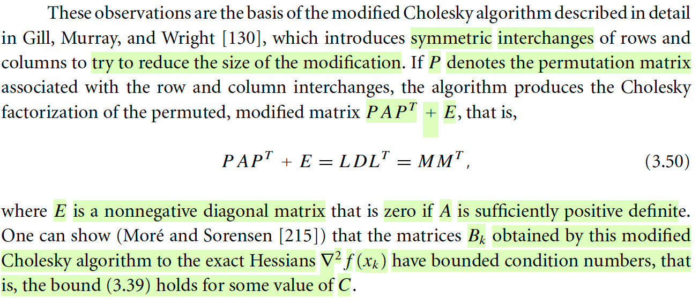</kbd>

> [!NOTE]
> Đại khái là cái vụ modified Cholesky factorization có thể thể hiện dưới dạng toán học là thế này:
>
> P A PT + E = L D LT  = M MT
>
> Trong đó P là matrix hoán vị.
>
> E là diagonal matrix với phần tử đường chéo sẽ bằng 0 nếu ban đầu A đã đủ xác định dương rồi. 
>
> Ta nên hiểu thế này: Quá trình của modified Cholesky factorization mà ta vừa bàn ở note trước. Đó là can thiệp vào bước gán giá trị cho dj.
>
> Thì về bản chất, nó chính là ta chỉnh sửa cái đường chéo của A bằng cách bơm giá trị vào.
>
> Do đó mới nói kết quả sẽ giống như ta cộng vào một matrix diagonal không âm E.

> [!TIP]
> 🤖 **AI Check** — 🟡 Minor issues — ⚠️ **70/100** · ✓ Move on
>
> Ghi chú đã trình bày chính xác công thức và định nghĩa các ma trận P, E. Tuy nhiên, em đã bỏ sót mục đích chính của việc sử dụng hoán vị đối xứng (P) là để giảm kích thước sửa đổi, và quan trọng hơn là lợi ích của thuật toán Cholesky cải tiến này trong việc đảm bảo các ma trận B_k có số điều kiện bị chặn.

 

###### Phân tích đối xứng bất định sửa đổi

<kbd>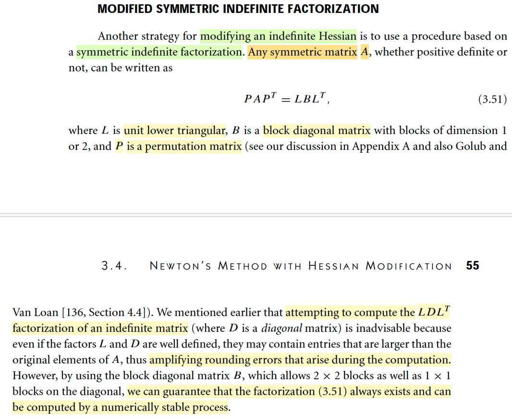</kbd>

> [!NOTE]
> Đại khái là, ở đây nói về việc modify một Hessian mà indefinite.
>
> Tác giả nói ta có thể dùng một chiến thuật khác để chỉnh sửa indefinite Hessian đó là dùng symmetric indefinite factorization. 
>
> Nhớ lại, trong note liền trước, mình đã hiểu, A dù là indefinite vẫn có thể được phân tách thành L D LT, (có nghĩa là thuật toán nó vẫn không crash, nếu hên, khi indefinite matrix A có pivot khác không) 
>
> Tuy nhiên, vấn đề có thể xảy ra, cũng là ý giáo sư nói không được khuyên (nên tránh) việc này, là vì, dù pivot khác 0, khiến thuật toán không crash, nhưng nó quá nhỏ thì sẽ vẫn gây vấn đề.
>
> Cụ thể, ta hiểu đại khái là vầy: Liên hệ với Gauss elimination cổ điển Ta nhớ, cái vụ đưa A thành U, sau đó backsubtitute để giải ra nghiệm. Thế thì trong khi khử Gauss: Một cách đơn giản nhất, ví dụ trừ hàng 2 cho 2 hàng 1, thực chất chính là lấy hàng 1 nhân cho a22 / a11 cũng là a22 / pivot 1. Mà giả sử pivot 1 nó tuy khác 0 nhưng rất nhỏ, thì kết quả sẽ ra con số rất lớn. Để rồi con số rất lớn này khi tham gia tính toán sẽ gây họa. Cụ thể là nó gây ra cái loại  lỗi tạm gọi là nuốt chửng độ chính xác, mà mình từng học trong MIT 18s096.
> Đây chính là cái ý giáo sư nói "khuếch đại rounding error")
>
>
> Vậy thì đại ý là ở đây tác giả nói rằng, dựa trên một kiến thức toán học nói rằng bất kể matrix đối xứng A nào cũng có thể được viết ở dạng:
>
> PA(PT) = LB(LT) với B là một block diagonal matrix (matrix chéo dạng block, sẽ hiểu kĩ hơn sau khi đọc Appendix)
>
> Và ta sẽ dựa trên cái này, để mà xây dựng một thuật toán chỉnh sửa Hessian bị indefinite mà có tính chất là ổn định về mặt tính toán nhờ tính chất tốt đẹp của việc dùng diagonal block matrix. Cụ thể thì hiểu nôm nà là vầy:
>
> Thì cái này nó có cái hay là vầy: Giống như khi ta khử Gausse theo cách thông thường, tức là các pivot là các con số. Thì ta có thể bị cái vụ nói trên nếu pivot quá nhỏ. Nhưng cũng có thể khử Gause theo cách khác gọi là theo block. Thì khi đó, pivot là một block matrix. Và cái vụ tính multipler bằng a22 / pivot 1 sẽ tương ứng với lấy [block 22] nhân [pivot block 1]_inv.
>
> Và cái hay là, có thể nếu xét single number pivot thì nó nhỏ gây lỗi, nhưng khi làm bởi block pivot thì dạng invert của nó vẫn ổn định.
>
> Nói chung hiểu đại ý là vậy.

> [!TIP]
> 🤖 **AI Check** — 🟢 Pass — ✅ **90/100** · ✓ Move on
>
> Phân tích của bạn rất sâu sắc, đặc biệt là phần giải thích chi tiết về nguyên nhân khuếch đại lỗi làm tròn liên hệ với phép khử Gauss và pivot nhỏ. Tuy nhiên, cần nhấn mạnh rõ hơn ngay từ đầu rằng phân tích LDL^T cho ma trận bất định là không nên làm, dù về mặt lý thuyết nó vẫn có thể thực hiện được trong một số trường hợp.

 

###### Ví dụ của P A PT = L B LT

<kbd>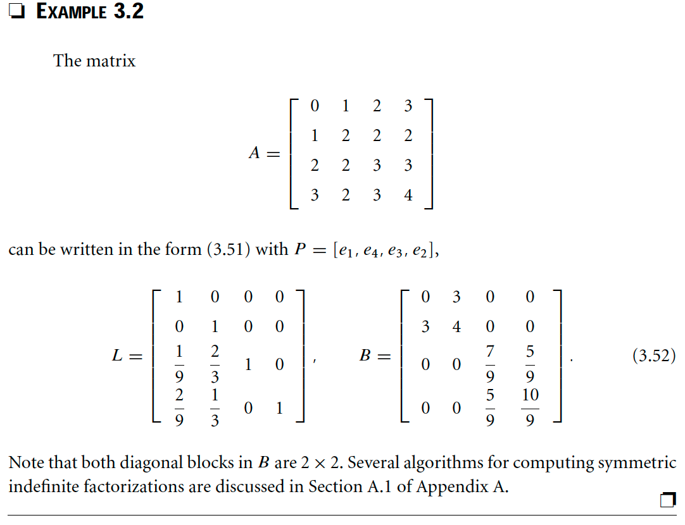</kbd>

> [!NOTE]
> Đại khái là ông cho xem một ví dụ trong đó cái matrix A, để ý nhé, pivot 1 = 0. Nếu khử Gausse như cách cổ điển, nó sẽ crash ở bước tính multipler.
>
> Nhưng ta vẫn có thể phân tách nó thành dạng P A PT = L B LT với B và L như vầy.
>
> Nói chung là Appendix A có nói về các thuật toán giúp factor A thành L và B như này.

 

###### Modified indefinite symmetric factorization

<kbd>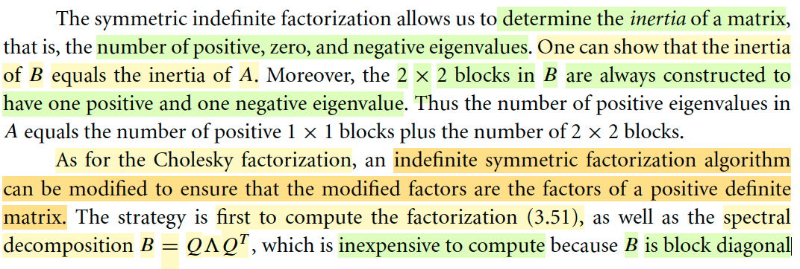</kbd>

<kbd>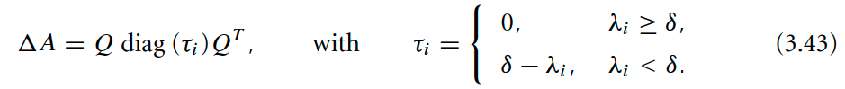</kbd>

<kbd>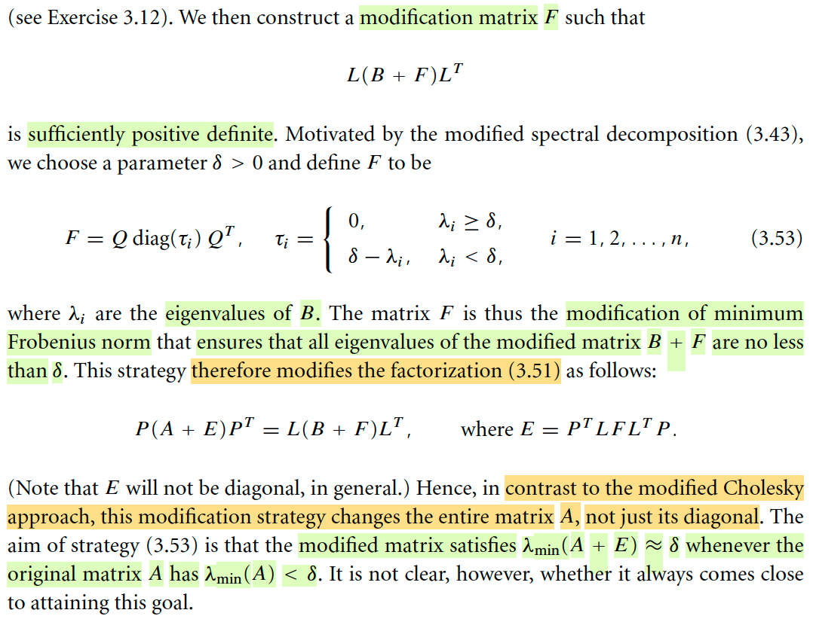</kbd>

> [!NOTE]
> Đầu tiên, tác giả cho rằng, ta nên biết có một định lý nói rằng, trong quan hệ phân rã nói trên (của matrix đối xứng A bất kì, xác định dương, xác định âm hay không xác định): P A PT = L B LT thì thằng B là matrix có cùng inertia với A. Tức là số lượng trị riêng dương, âm, bằng 0 của chúng giống nhau. 
>
> Tác giả nói đến cái này là muốn lót đường cho việc chỉnh sửa: Nếu ta chỉnh sửa B để giúp mọi trị riêng của nó đều dương thì tự động trị riêng của A cũng sẽ dương, khiến A trở nên xác định dương. (Làm rõ khỏi bắt bẻ: Ta nói là ta sửa B để A thành xác định dương thì phải hiểu là ta sửa B bằng cách cộng vào cho nó một matrix ΔB khiến có được B + ΔB xác định dương, khi đó ta sẽ có kết quả phân rã của một matrix A + ΔA xác định dương. Chứ bản chất A xác định âm thì bố nó cũng không biến nó thành xác định dương được)
>
> Một điểm lót đường nữa, là ông nói về đặc địểm của B như đã nói, có dạng block diagonal, khiến cho việc tính trị riêng rất dễ. Cụ thể là với cái block 1x1 thì trị riêng chính là nó (y như với diagonal matrix thì trị riêng cũng là entries đường chéo, hãy hiểu diagonal matrix là cái dạng block diagonal matrix 1x1). Còn với block 2x2 thì tính trị riêng cũng dễ chứ không khó gì, dĩ nhiên ta sẽ tính ra được hai trị riêng, tức là trị riêng của cái block 2x2 đó chính là 2 cái trị riêng của B.
>
> Dừng lại tí suy nghĩ xem tính làm sao mà nói dễ? Ta biết để tìm eigenvalue, thì mình sẽ giải cái tìm nghiệm của characteristic equation: det (A - λI) = 0. Thế thì nếu A chỉ là matrix 2 × 2 thì det của A - λI chỉ là một cái đa thức bậc 2, và giải equation này chỉ là giải cái phương trình bậc hai chứ ko có gì khó.
>
> Rồi. Thế thì ta sẽ làm giống như trong Cholesky factorization mà trong đó, đại ý là ngay trong lúc chạy thuật toán Cholesky factorization, ta sẽ làm cái bước chỉnh sửa, để mà ngay cả khi ta bắt đầu với một matrix không xác định hoặc xác định âm hoặc xác định dương nhưng chưa đạt (ví dụ như pivot dj quá nhỏ, khiến có thể gây vấn đề) thì ta vẫn sẽ kết thúc với một matrix xác định dương tốt.
>
> Thì đây cũng vậy, ta sẽ chỉnh sửa Indefinite symmetric factorization này. Nhưng không phải sửa on-the-fly như cái kia, mà cụ thể là ta sẽ factor trước, rồi mới sửa B. 
>
> Để xong là ta có một matrix xác định dương (nên hiểu ý một chút: Nói chính xác từng chữ thì sẽ là: Để khi xong ta có một kết quả phân rã giống như của một cái matrix A ban đầu đã xác định dương tốt rồi vậy. Có nghĩa là, giống như trong Cholesky modified factorization, thì mục đích là ta sẽ có kết quả phân rã của một cái matrix đã chỉnh sửa sao cho nó giống như đã xác định dương ngay từ đầu vậy. Và ta sẽ xài cái bộ matrix phân rã này né chứ không phải nhân vô lại để có cái A xác định dương, vì việc tính toán với dạng phân rã của A sẽ khiến quá trình tính toán nhanh hơn - nhớ factor solve method không?)
>
> Rồi, vậy thì cách sửa thế nào? 
>
> Đó là ta sẽ dùng cái cách giống như trong 3.43: Trong đó mình dùng ΔA = Q diag(τi) QT với τi = 0 nếu trị riêng tương ứng λi đã ok rồi (đã dương rồi, và cụ thể là đã > δ, một con số dương tối thiểu rồi) còn nếu chưa thì τi = δ - λi để mà nâng nó lên, bơm nó lên.
>
> Trong phần đó mình cũng nhớ tác giả nói rằng, đây là cái ΔA có Frobenius norm nhỏ nhất giúp sửa lại cho A (thành A +ΔA) trở thành xác định dương.
>
> Thì ở đây cũng vậy ta sẽ sửa cái B: bằng cách cộng với F = Q diag(τi) QT, với τi = 0 nếu λ(B)i đã ≥ δ và τi = δ - λ(B)i nếu chưa,
>
> Và again, F cũng là cái có F norm nhỏ nhất giúp sửa B thành ra (B + F) xác định dương, để rồi cũng chính là giúp ta có kết quả phân rã của một matrix A đã chỉnh sửa (thành A + E nào đó) mà A + E xác định dương.
>
> Cuối cùng là một điểm đáng lưu ý đó là: Giáo sư nhấn mạnh với modified Cholesky factorization thì về cơ bản là ta chỉ sửa các phần tử đường chéo của A mà thôi (cái bước gán dj bởi max (|cjj|, δ, (θj/β)^2). Để rồi thể hiện matrix chỉnh sửa A bởi: P A PT + E = L D LT 
> thì E là diagonal matrix.
>
> Còn ở đây, ta ko chỉ sửa đường chéo của A, mà thay đổi hoàn toàn cấu trúc của A, tức là  thể hiện ở dạng P(A + E)PT = L(B + F)LT thì E ko phải là diagonal matrix

> [!TIP]
> 🤖 **AI Check** — 🟢 Pass — ✅ **98/100** · ✓ Move on
>
> Bài viết thể hiện sự hiểu biết sâu sắc và toàn diện về phương pháp chỉnh sửa phân rã đối xứng không xác định. Các giải thích chi tiết, đặc biệt là sự so sánh với phân rã Cholesky sửa đổi và phân tích về mục đích thực sự của việc chỉnh sửa, cho thấy khả năng nắm bắt vấn đề vượt trội.
> ## Phân tích chi tiết
>
> ### Điểm mạnh
>
> *   **Hiểu đúng về quán tính (inertia):** Học sinh đã nắm vững định lý về việc ma trận `B` có cùng quán tính với ma trận `A` trong phân rã `P A P^T = L B L^T`, tức là số lượng trị riêng dương, âm và bằng 0 của chúng là như nhau.
> *   **Mục đích của việc chỉnh sửa:** Nắm bắt tốt mục đích tổng thể của việc chỉnh sửa thuật toán để đảm bảo các nhân tử được tạo ra tương ứng với một ma trận xác định dương.
> *   **Đặc điểm ma trận B:** Hiểu rõ ma trận `B` có dạng block diagonal và việc tính trị riêng cho các khối 1x1 và 2x2 là không phức tạp. Học sinh còn đưa ra giải thích hợp lý về việc tính trị riêng cho khối 2x2 bằng cách giải phương trình bậc hai.
> *   **Liên hệ với Cholesky:** Học sinh đã tạo được mối liên hệ chặt chẽ giữa chiến lược chỉnh sửa này với phương pháp Cholesky sửa đổi, cho thấy sự tổng hợp kiến thức.
> *   **Cơ chế chỉnh sửa F:** Mô tả chính xác cấu trúc của ma trận `F = Q diag(τi) Q^T` và cách xác định các giá trị `τi` dựa trên `δ` và các trị riêng của `B`.
> *   **Tính chất chuẩn Frobenius nhỏ nhất:** Nhận ra đúng `F` là sự chỉnh sửa có chuẩn Frobenius nhỏ nhất để đảm bảo các trị riêng của `B+F` không nhỏ hơn `δ`.
> *   **Hiểu biết sâu sắc về ứng dụng:** Học sinh thể hiện sự thấu hiểu về việc *sử dụng* các nhân tử đã sửa đổi trong thực tế (không cần nhân lại để có `A+E`), và liên hệ điều này với 'factor solve method', đây là một điểm cộng rất đáng giá.
>
> ### Các lĩnh vực cần cải thiện
>
> *   **Tính chính xác của mục tiêu sửa đổi:** Học sinh nên làm rõ rằng việc chỉnh sửa `B` thành `B+F` sẽ khiến ma trận *`A+E`* trở thành xác định dương, chứ không phải `A` tự động trở nên xác định dương. Mặc dù ý nghĩa cuối cùng là tương tự, nhưng sự chính xác về ký hiệu và đối tượng được sửa đổi là quan trọng.
> *   **Chi tiết về khối 2x2 của B:** Mặc dù đã giải thích việc tính trị riêng của khối 2x2 là dễ, học sinh đã bỏ qua một chi tiết quan trọng được đề cập trong tài liệu: các khối 2x2 trong `B` *luôn được xây dựng để có một trị riêng dương và một trị riêng âm*. Điều này rất quan trọng để hiểu rõ hơn về quán tính của `B`.
> *   **Kết luận về sự khác biệt:** Đoạn kết thúc bài ghi chú bị cắt cụt. Giáo sư nhấn mạnh sự khác biệt chính giữa chiến lược sửa đổi này và phương pháp Cholesky sửa đổi là `E` *sẽ không phải là ma trận đường chéo*, nghĩa là chiến lược này thay đổi *toàn bộ ma trận A*, chứ không chỉ các phần tử trên đường chéo của nó. Việc không hoàn thành điểm này làm mất đi một phần quan trọng của sự phân tích.
>
> ### Gợi ý để đào sâu kiến thức
>
> *   **Đọc kỹ và đối chiếu:** Nên rà soát lại các câu từ trong tài liệu tham khảo để đảm bảo mọi phát biểu đều chính xác tuyệt đối, đặc biệt khi nói về kết quả của một phép biến đổi (ví dụ: `A+E` thay vì `A`).
> *   **Chú ý đến chi tiết cụ thể:** Những thông tin như 'một trị riêng dương và một trị riêng âm' cho các khối 2x2 không phải là ngẫu nhiên mà thường có ý nghĩa toán học sâu sắc, giúp củng cố sự hiểu biết về bản chất của các ma trận.
> *   **Hoàn thành các điểm so sánh:** Khi một điểm so sánh được đưa ra, hãy đảm bảo rằng cả hai vế của sự so sánh đều được trình bày đầy đủ để làm nổi bật sự khác biệt một cách rõ ràng và thuyết phục.
>
> ## Tổng kết
>
> Học sinh đã thể hiện một nền tảng kiến thức vững chắc và khả năng phân tích khá tốt. Với việc khắc phục những điểm nhỏ còn thiếu sót và không chính xác, bài làm sẽ trở nên hoàn hảo.
>
> **⭐ Bonus points**
> - Diễn giải chi tiết cách tính trị riêng cho khối 2x2 bằng cách giải phương trình bậc hai.
> - Hiểu rõ mục đích của việc sửa đổi là để có một bộ nhân tử phân rã dùng được cho một ma trận xác định dương, chứ không chỉ là biến đổi trực tiếp ma trận gốc.
> - Liên hệ việc sửa đổi với phương pháp giải hệ số nhân tử (factor solve method).

 

