# 3.5 Line Search Method: Step-Length Selection Algorithms

📊 **Progress:** `12` Notes | `15` Screenshots | `10` AI Reviews

---

## 3.5 Line Search Method: Step-Length Selection Algorithms

> [!NOTE]
> Line Search Method: Step-Length Selection Algorithms

 

## Thuật toán chọn độ dài bước

<kbd>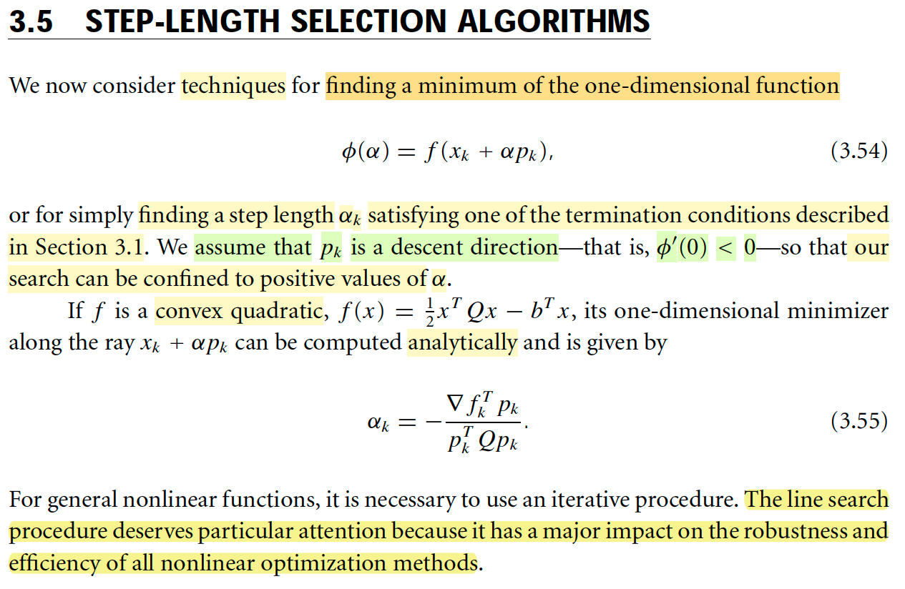</kbd>

> [!NOTE]
> Qua phần này ta sẽ nói về các techniques trong cái bước quyết định chiều dài sải bước. (Nhớ lại nhé, chương 3 đang bàn về Line-search, thì ta phải cần tìm pk, hướng đi, mà phần lớn trường hợp là ta cần tìm hướng khiến giảm hàm mục tiêu, dĩ nhiên phải có thêm sải bước phù hợp nữa) Thì ở đây chính là nói về các phương pháp để chọn step length
>
> Thế thì vì đã có direction pk, nên để có step length thì ta sẽ giải bài toán exact line search: minimize hàm đơn biến φ(α) = f(xk + αpk) hoặc đơn giản là tìm step length cho nó thỏa các điều kiện dừng nhờ thuật toán backtracking thôi.
>
> Thêm nữa, nếu giả sử pk đã là descent direction thì việc tất nhiên đạo hàm theo hướng pk tại xk, cũng chính là đạo hàm của Φ(α) tại 0 sẽ mang dấu âm, nên khi tác giả nói giá trị tìm kiếm của α sẽ được confined bởi giá trị dương của α thì ý là ta sẽ yên tâm đi tới mà thôi.
>
> Ôn lại chỗ này: d/dα Φ(α) = d/dα f(xk + α pk) = d/d(xk + α pk) f(xk + α pk) ⋅ d/dα (xk + α pk) = ∇f(xk + αpk) ⋅ pk
>
> hay ghi vầy cho dễ hiểu: [∇f(x)|x=xk + αpk] ⋅ pk
>
> Cũng chính là directional derivative của f wrt pk evaluate tại xk + αk. 
>
> ⇨ directional derivative của f wrt pk tại xk sẽ là
>
> [∇f(x)|x=xk] ⋅ pk = ∇f(xk) ⋅ pk, chính là Φ'(α)|α=0
>
> ====
>
> Thế thì nếu f là hàm quadratic, có dạng f(x) = (1/2)xTQx - bTx thì có thể tính ra minimizer
> của nó dọc theo tia xk + αpk một cách analytically. Là vầy:
>
> Nhờ MIT 18s096: Không khó để derive ∇f(x) = Qx - b
>
> ⇨ Directional derivative của f wrt pk tại xk, cũng là Φ'(α) sẽ là:
>
> ∇f(xk + αpk)Tpk = [Q(xk + αpk) - b]Tpk
>
> Để tìm α khiến Φ(α) nhỏ nhất. Ta cho đạo hàm bằng 0:
>
> [Q(xk + αpk) - b]Tpk = 0
>
> ⇔ Q(xk + αpk)Tpk - bTpk = 0
>
> ⇔ Q(xk + αpk)Tpk = bTpk 
>
> ⇔ Q(xkTpk + αpkTpk) = bTpk 
>
> ⇔ QxkTpk + QαpkTpk = bTpk 
>
> ⇔ QαpkTpk = - QxkTpk + bTpk 
>
> ⇔ αQpkTpk = - [QxkTpk - bTpk]
>
> ⇔ αQpkTpk = - [Qxk - b]Tpk
>
> ⇔ αQpkTpk = - [∇fk]Tpk  (Thay ∇f(xk) = Qxk - b)
>
> ⇔ α = - [∇fk]Tpk / QpkTpk
>
> Đây chính là 3.55 trong sách

> [!TIP]
> **🤖 AI Feedback** — ✅ Score: **95/100**
>
> Bài viết thể hiện sự hiểu biết sâu sắc về các thuật toán lựa chọn bước nhảy, đặc biệt là phần giải thích và chứng minh công thức (3.55) một cách chi tiết. Cách trình bày mạch lạc và bổ sung kiến thức nền tảng giúp người đọc dễ dàng nắm bắt.

 

### Thuật toán lặp đạo hàm cấp 1

<kbd>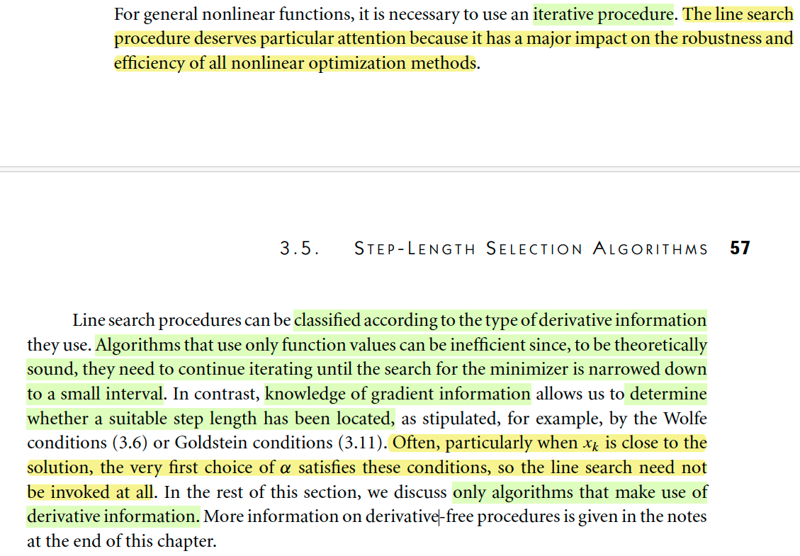</kbd>

> [!NOTE]
> Đại ý của đoạn này là muốn nói rằng trong phần lớn những trường hợp đó thì mình phải sử dụng một cách tiếp cận mang tính chất lặp đi lặp lại (iterative approach) khác với ví dụ trên khi mình có thể giải ra nghiệm của bài toán một cách toán học, dùng công thức (analytic). 
>
> Phần này sẽ bàn về những thuật toán giúp làm điều đó, mà thuật toán đó như đã nói sẽ thực hiện cách tiếp cận lặp đi lặp lại dần dần từ từ mình có thể tạm hiểu là dần dần từ từ để tìm ra nghiệm của bài toán, thay vì tìm ra ngay một phát bằng công thức. 
>
> Hiệu quả của những thuật toán như vậy sẽ ảnh hưởng và quyết định đến hiệu quả của thuật toán nói chung. Những quy trình hoặc thuật toán được nói đến hoặc làm việc này có thể phân chia theo loại thông tin đạo hàm mà chúng dùng. Nếu một thuật toán chỉ dùng đạo hàm cấp không (tức là chỉ dùng giá trị của hàm số) thì có thể nó sẽ không hiệu quả, bởi vì về lý thuyết nó sẽ phải lặp lại việc tìm kiếm cho đến khi việc tìm kiếm thu hẹp lại trong một khoảng rất nhỏ. 
>
> Loại thứ hai là nó sử dụng thông tin đạo hàm cấp 1 của hàm số, sẽ cho phép mình xác định được khi nào chiều dài bước phù hợp đã được tính toán để mình có thể dừng hoặc khi điểm mình đang đứng đã rất gần với điểm tối ưu. Thông tin đạo hàm cấp 1 có thể giúp mình quyết định rằng không cần tìm kiếm thêm nữa mà chỉ việc lấy luôn giá trị bước đó. 
>
> Do đó, phần này tác giả nói là mình chỉ bàn đến loại thuật toán sử dụng thông tin đạo hàm cấp 1 mà thôi, không dùng thuật toán không dùng thông tin đạo hàm (tức là thuật toán như loại 1 vừa nói, chỉ dùng giá trị hàm số) bởi vì nó không hiệu quả lắm.

> [!TIP]
> **🤖 AI Feedback** — ⚠️ Score: **75/100**
>
> Bài phân tích đã nắm bắt được các ý chính và có độ sâu tương đối. Tuy nhiên, bạn chưa làm nổi bật đủ tầm quan trọng cụ thể của "line search procedure" ở đoạn mở đầu. Thêm vào đó, việc đưa ra so sánh với "cách giải analytic" không có trong văn bản gốc và cần tránh khi tóm tắt. Lời văn cần chính xác hơn khi diễn giải chi tiết "line search need not be invoked at all" để phản ánh đúng mức độ hoàn toàn tránh khỏi việc thực hiện quy trình tìm kiếm đường thẳng.

 

#### Quy trình tìm kiếm đường thẳng

<kbd>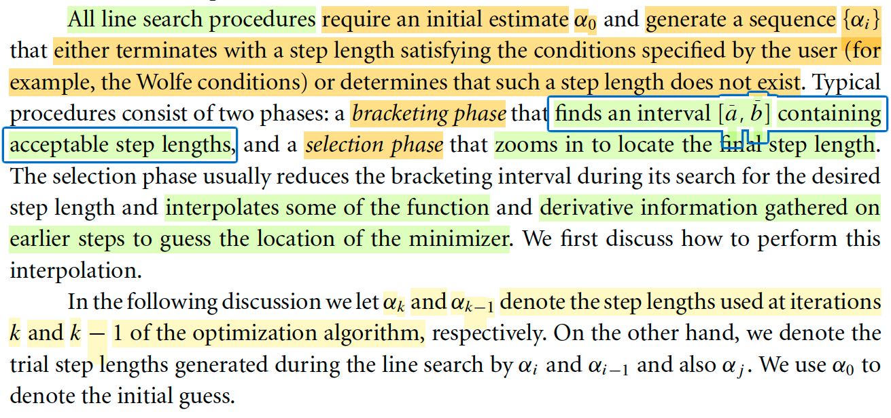</kbd>

> [!NOTE]
> Rồi, cái phần này đại khái nói rằng là mọi cái thuật toán line search á, cái từ tiếng Anh là line search procedure đó. Nó đều yêu cầu phải có một cái điểm bắt đầu. Một cái estimate, một cái initial estimate tức là một cái giá trị ước đoán, một cái giá trị ước đoán ban đầu nào đó α0. Và từ đó như đã nói đây là cái iterative approach, cho nên nó sẽ cái thuật toán nó sẽ lập đi lặp lại cái việc tính toán để nó tìm ra một chuỗi những cái giá trị αj. Sao cho là nó sẽ đạt yêu cầu khi mà nó thỏa một cái condition nào đó, một cái điều kiện nào đó. Thì cái điều kiện này có thể được chỉ định bởi bởi người người dùng. Ví dụ như là Wolf condition hoặc là nó cũng sẽ có thể dừng khi mà nó xác định được là cái step plan không có tồn tại. Thì một cái thuật toán điển hình nó sẽ bao gồm có hai giai đoạn. Giai đoạn thứ nhất nó có tên tiếng Anh gọi là bracketing phase. Mình tạm dịch tiếng Việt gọi là một cái giai đoạn mang tính chất là đóng khung. Nhiệm vụ là mình sẽ tìm ra một cái khoảng AB mà mình tin rằng ở trong đó nó sẽ chứa cái giá trị alpha mà mà có thể chấp nhận được. Nó giống như mình khoanh vùng vậy đó. Và cái giai đoạn thứ hai là giai đoạn tên tiếng Anh là selection phase là giai đoạn lúc đó mình mới bắt đầu mới mới mới zoom vào ở trong cái cái cái cái vùng mà mình đã khoanh đó để tìm ra cái giá trị cuối cùng. 
>
> Và cái cách làm của cái giai đoạn selection phase thường sẽ là nó giảm, nó sẽ liên tục nó giảm cái bracketing interval tức là giảm cái khoanh vùng lại. Và bằng cách đó nó sẽ tìm kiếm ra cái step length, cái chiều dài sải bước phù hợp. Nói chung còn nhắc đến một số bước ví dụ như interpolate một số cái function và thông tin về đạo hàm của có được nhờ các cái bước trước đó để mà dự đoán cái vị trí của minimizer thì mình tạm hiểu là cái bước selection phase này nó sẽ làm cái chuyện đó. Thông thường một cách điển hình thì nó sẽ thu hẹp cái interval bracket lại và nó sử dụng cái thông tin đạo hàm ở những cái bước trước đó để nó dự đoán ra cái vị trí của minimizer. Cụ thể thế nào thì phần sau người ta sẽ nói, rồi cái đoạn cuối cùng thì người ta nói về một số cách ký hiệu, ví dụ alpha K và alpha K-1 là nó chỉ cái sải bước ở cái bước iteration thứ K và thứ K-1.

> [!TIP]
> **🤖 AI Feedback** — ⚠️ Score: **75/100**
>
> Phần giải thích các khái niệm cốt lõi về quy trình tìm kiếm đường và hai giai đoạn của nó rất rõ ràng và chính xác. Tuy nhiên, phần trình bày về các ký hiệu ở cuối bài còn chưa đầy đủ, bỏ sót việc mô tả các bước thử nghiệm và tầm quan trọng của ước đoán ban đầu trong ngữ cảnh ký hiệu. Ngoài ra, việc dùng "step plan" thay cho "step length" và đồng nhất chuỗi $\alpha_i$ với các giá trị $\alpha_j$ là chưa chuẩn xác.

 

##### Interpolation

<kbd>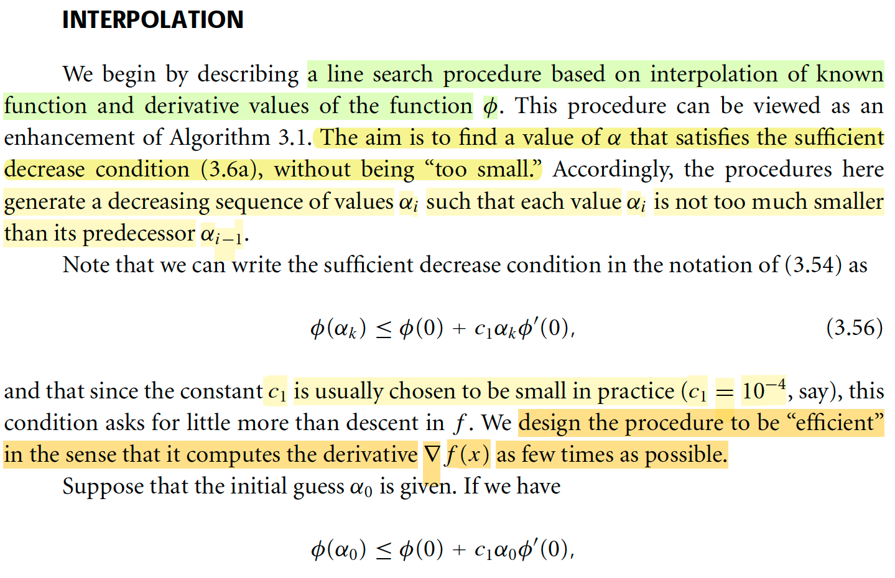</kbd>

<kbd>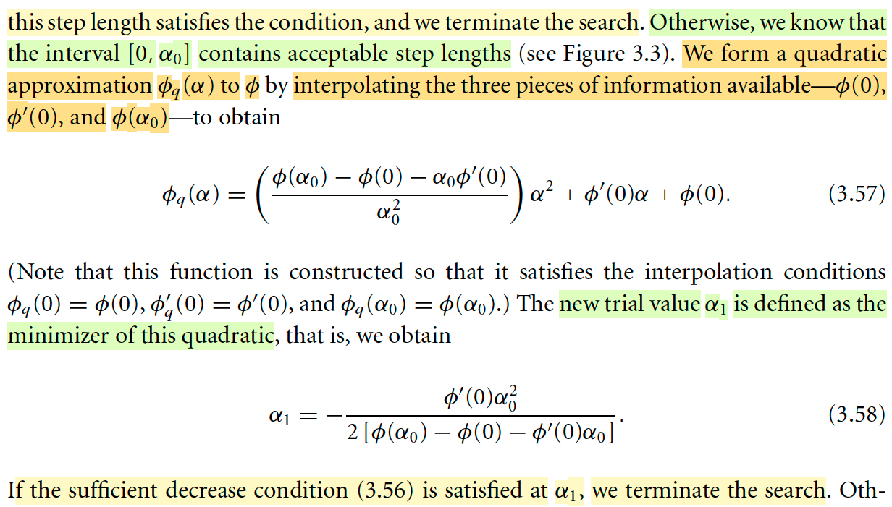</kbd>

> [!NOTE]
> Đầu tiên sẽ nói về một thuật toán line search (nhắc lại nhé, phần này là nói về cái "khúc" chọn step-length, sau khi đã có direction pk) mà dựa vào nội suy (interpolation) từ giá trị function đã biết cũng như giá trị của đạo hàm.
>
> Mục tiêu của nó là tìm ra α thỏa sufficient decrease condition (điều kiện giảm đủ, còn gọi là Armijo) và đồng thời không được quá nhỏ. Do đó, quy trình này sẽ tạo ra các step size αi nhỏ dần sao cho cái sau không quá nhỏ so với cái trước.
>
> Thế thì, ôn lại về điều kiện Armijo: Story của nó là: Từ xk, nơi mà ta đang có độ dốc (dĩ nhiên theo hướng pk) là ∇fkTpk, cũng là Φ'(0). Ta sẽ giảm bớt độ dốc bằng constant c1, để rồi có hàm tuyến tính g(α) = g(0) + αc1∇fkTpk, hay độ giảm theo α của hàm tuyến tính này sẽ là Δg = g(0) - g(α) = αc1∇fkTpk.
>
> Và ta muốn độ giảm của hàm f khi đi theo hướng pk ít nhất cũng phải được như vậy:
>
> Độ hàm f khi bị giới hạn theo hướng pk: Φ(α) = f(xk + α pk)
>
> ⇨ độ giảm hàm f theo hướng pk, tính theo α: f(xk) - f(xk + α pk)
>
> Từ đó ta có: f(xk) - f(xk + α pk) ≥ - αc1∇fkTpk. Đây chính là Sufficient decrease condition.
>
> Thế thì quay lại đây, như tác giả nói rằng ta có thể thể hiện theo Φ:
>
> f(xk) = Φ(0), f(xk + α pk) = Φ(α),
>
> và ∇fkTpk thì chính là Φ'(0) như trên đã nói, nên ta có:
>
> Φ(0) - Φ(α) ≥ - αc1 Φ'(0)
>
> ⇔ Φ(0) + αc1 Φ'(0) ≥ Φ(α)
>
> Hay với α là αk: Φ(0) + αkc1 Φ'(0) ≥ Φ(αk)
>
> ====
>
> Rồi, thế thì thuật toán (hay quy trình, procedure) sẽ làm như sau: Đầu tiên, nếu mà ngay tại giá trị khởi đầu α0 mà nó đã thỏa sufficient decrease condition, tức là:
>
> Φ(0) + α0c1 Φ'(0) ≥ Φ(α0) 
>
> thì đương nhiên ta sẽ dừng ngay, chọn α0 làm step size.
>
> Nhưng nếu như không thỏa, thì sao, thì có thể dễ thấy rằng, cái đoạn [0, α0] nhất định chứa một α thỏa điều kiện dừng. Lí do là vì: Trong phần nói về cái này, thì ta có một hình minh họa mà trong đó mình đã phân tích và hiểu được điều này: Xét theo phương pk, thì  hàm f là một đường cong và độ dốc tại xk nó dốc xuống lớn hơn độ dốc của hàm tuyến tính do hàm tuyến tính đã được điều chỉnh độ dốc bởi c1. Mà hàm tuyến tính thì sẽ kéo dài mãi mãi xuống -inf, còn hàm f thì có điều kiện bị chặn dưới nên nó không thể kéo mãi xuống -inf. Nôm na là phải có điểm nào đó mà hàm f đi lên, và dẫn đến phải cắt hàm tuyến tính và đó chính là điểm mà độ giảm của hàm f bằng độ giảm của hàm tuyến tính. Gọi là α'
>
> Thế thì, cái điểm đó sẽ tạo ra một khoảng từ điểm bắt đầu đến đó, mà trong đó hàm f đi xuống nhiều hơn hàm tuyến tính. Thế thì, nếu như α0 mà không thỏa, chứng tỏ nó không nằm trong khoảng này, mà nó xa hơn điểm giao đó. Do đó α' nhất định phải nằm trước đó, và đồng nghĩa những giá trị α thỏa điều kiện dừng phải nằm trước α0 hay nằm cũng chính là trong [0, α0].
>
> Rồi, vậy thì tiếp theo ý tưởng sẽ là: Dùng các thông tin đã biết: Φ(0), tức giá trị f tại xk, Φ(α0) (vì đã tính thì mới check được ở bước trên) và Φ'(0). Để làm như sau, dựa trên ý tưởng là vầy: Ta dựng một parabol, một hàm bậc hai sao cho nó đi qua A: tại α = 0, mang giá trị Φ(0), và B: là tại α0, mang giá trị Φ(α0) và độ dốc tại A tức α = 0 là Φ'(0), thì ta sẽ tìm xem cái minimum của nó ở đâu, và lấy α đó.
>
> Thế thì phương trình hàm quadratic có dạng khái quát là Φq(α) = aα^2 + bα + c
>
> Để nó thỏa Φq(0) = Φ(0). Φq(α) = Φ(α0), và Φ'q(α)|α=0 = Φ'(0) ta có:
>
> Φq(0) =  a × 0^2 + b × 0 + c = c = Φ(0) ⇔ c = Φ(0)
>
> Φq(α) = Φ(α0) ⇔ a × α^2 + b × α + Φ(0) = Φ(α0)
>
> Φ'q(α)|α=0 = Φ'(0) ⇔ 2aα + b = Φ'(0)
>
> Nói chung là giải ra ta sẽ có a = [Φ(α0) - Φ(0) - α0 Φ'(0)] / (α0)^2
>
> b = Φ'(0), c = c = Φ(0)
>
> ⇨ Φq(α) như công thức 3.57
>
> Và từ đó, giải tìm α khiến minimize Φq(α) (không khó khăn gì, cho Φ'q(α) = 0 là ra)
>
> → ta sẽ gán nó cho α1.
>
> Có nghĩa là: Cách làm này nôm na là: Ta đứng ở vạch (xk, α = 0). Chọn sải bước α0. Thấy chưa đạt, cụ thể là chưa xuống đủ nhiều. Thì ta biết hàm f trong quãng trước đó nó đã cong xuống và cong lên. Nên ta phải dự đoán một điểm nào đó ở trước đó. Thế thì cách làm đang bàn ở đây là ta coi như là nó là hàm bậc hai, để tìm cái điểm mà hàm bậc hai nó xuống thấp nhất làm dự đoán. 
>
> Rồi, nếu tại α1 mà nó thỏa điều kiện giảm đủ thì dừng.

> [!TIP]
> **🤖 AI Feedback** — ✅ Score: **95/100**
>
> Bài viết của bạn thể hiện sự hiểu biết vượt trội, với các giải thích sâu sắc và đạo hàm chi tiết, thể hiện rõ ràng sự nắm vững kiến thức. Tuy nhiên, bạn đã bỏ sót một điểm quan trọng mà tác giả nhấn mạnh là mục tiêu "hiệu quả" của thuật toán trong việc giảm thiểu tính toán đạo hàm.

**🔗 See also:** [Điều kiện giảm đủ Armijo](./31_line_search_method_step_length.md#node-c14ii57) · [Điều kiện Wolfe và Wolfe mạnh](./31_line_search_method_step_length.md#node-7kgcs2p)

 

- **Phương pháp nội suy tìm α**

<kbd>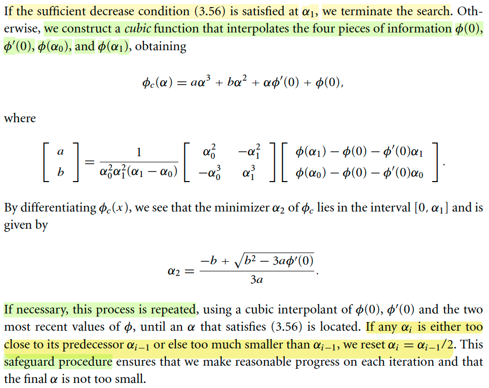</kbd>

> [!NOTE]
> Rồi thì đại khái cái đoạn này nói rằng nếu như mà tại α1 mà nó vẫn không thỏa điều kiện giảm đủ thì lập luận lại tương tự. Ta kết luận rằng là cái giá trị α khiến thỏa điều kiện dừng nó nằm ở phía trước đó. 
>
> Như vậy là mình phải đoán một cái điểm hoặc là một cái giá trị α nhỏ hơn ở trước đó, ở trước α1. Và cách đoán bây giờ tương tự như hồi nãy. Khi mà mình có giá trị hàm số tại điểm bắt đầu Φ(0) nè, mình có giá trị đạo hàm hàm số tại điểm Φ(α0) nè và độ dốc của cái hàm số tại tại điểm bắt đầu Φ'(0) thì mình mới dựng một cái parabol, dựng một cái hàm bậc hai. 
>
> Thì bây giờ mình có giá trị hàm số tại thêm một tại một điểm nữa đó là giá trị hàm số tại α1. Do đó là mình sẽ dựng một cái hàm bậc 3. 
>
> Giống như mình có ba điểm mình dựng một cái hàm parabol, một cái hàm bậc hai thì nó sẽ ít chính xác hơn là mình có bốn điểm để mình dựng một cái hàm bậc 3. 
>
> Do đó là mình sẽ dựng một hàm bậc ba và mình** cũng sẽ giải tìm cái cái cái cái minimize tìm cái điểm cực tiểu** và mình sẽ** lại kiểm tra cái giá trị cái cái điều kiện dừng tại cái điểm alpha đó**. Tức là mình có được cái alpha 2. 
>
> Và có một điểm chú ý là nếu như mà mình có thể nếu mà nó không thỏa thì mình lại lặp lại chuyện đó tiếp. Nhưng không phải là dựng hàm bậc 4, mà vẫn là hàm bậc 3, chỉ là lấy hai điểm gần nhất ví dụ như để tìm α5 thì ta sẽ dùng thông tin Φ(0), Φ(α3), Φ(α4), Φ'(0) để dựng cubic function
>
> Một cái điểm chú ý đó là nếu như mà cái **giá trị alpha tính toán ra đó nó quá nhỏ**, hoặc là nó **quá sát với cái giá trị alpha trước đó** thì mình sẽ **gán cứng nó bằng alpha trước đó chia 2**. Mục đích là mình mình mình có một cái cơ chế bảo vệ là khiến cho cái alpha cuối cùng nó không quá nhỏ.

> [!TIP]
> **🤖 AI Feedback** — ⚠️ Score: **70/100**
>
> Bài làm cho thấy sự hiểu biết tốt về quy trình lặp lại và cơ chế bảo vệ, nhưng mắc lỗi cơ bản trong việc xác định loại hàm nội suy và các thông tin đầu vào ban đầu.

 

- **Cubic interpolation**

<kbd>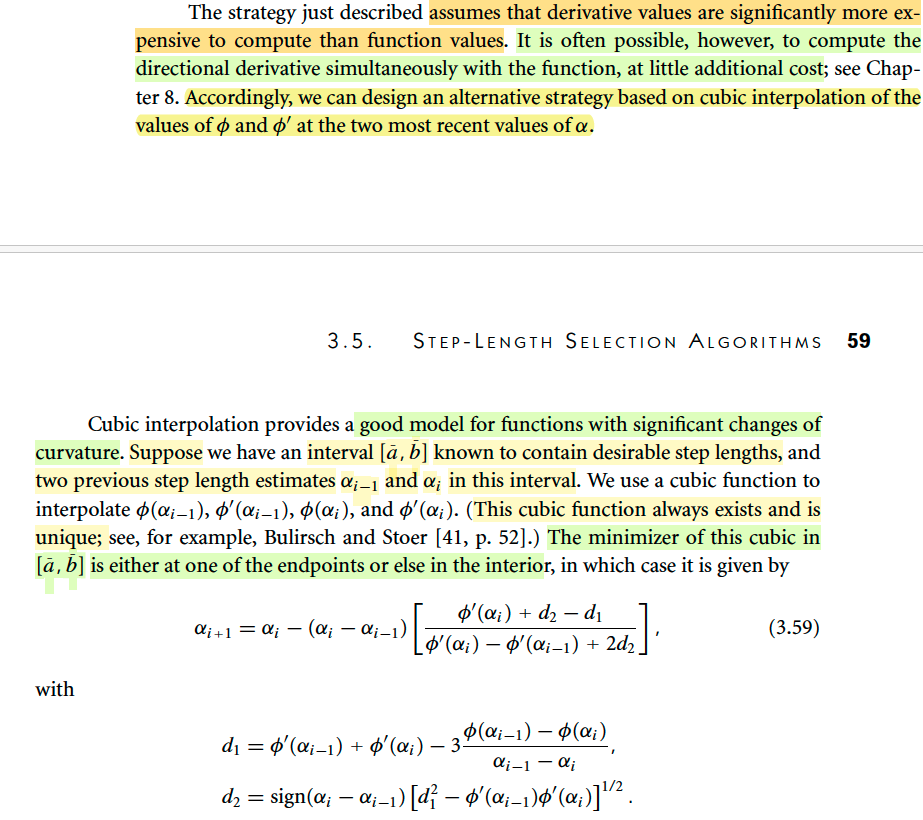</kbd>

<kbd>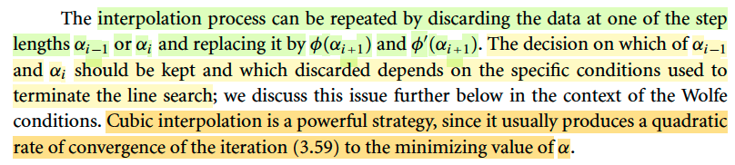</kbd>

> [!NOTE]
> Rồi, đại ý đoạn này là thế này: Đó là nói cái phương pháp trên, nơi mà ta chỉ interpolate bằng quadratic hay cubic function với thông tin đạo hàm tại 0, tức Φ'(0), giá trị hàm f tại 0, αk-1, và (có thể là k-2). Thì thật ra ta đang giả sử là việct tính đạo hàm hàm Φ tại các điểm như αk-1, αk nó tốn kém quá so với tính giá trị hàm số. 
>
> Nhưng một số trường hợp thì không như vậy, trong đó tính đạo hàm theo hướng tại của f không quá tốn kém (tức là tính Φ'(αk) ko quá tốn kém). Thì khi đó ta có thể dùng thêm thông tin độ dốc hàm Φ tại αk-1, αk để mà dựng (interpolate) hàm cubic có độ chính xác tốt hơn là cách hồi nãy.
>
> Và cũng y như cách trước, ta cũng tìm minimizer. Và với hàm cubic thì nó có thể là nằm ở trong (interior) hoặc nằm ở biên.
>
> Nói chung cách làm vẫn là dựng hàm cubic, tìm minimizer, check điều kiện dừng.
>
> Cách làm này mô phỏng tốt hơn các hàm số mà có sự thay đổi đáng kể về độ cong.
>
> Có nói sơ về cách làm chi tiết nhưng ta có thể nghiên cứu kĩ hơn sau.
>
> Một ý đáng chú ý là, cubic interpolation là một chiến thuật khá mạnh mẽ, có thể tạo ra tốc độ hội tụ bậc hai.

> [!TIP]
> **🤖 AI Feedback** — ❌ Score: **68/100**
>
> Phần mở đầu đã nhầm lẫn về bối cảnh của "phương pháp vừa mô tả", gán nhầm đặc điểm của một chiến lược trước đó cho phương pháp nội suy cubic này. Sinh viên cũng bỏ sót chi tiết cốt lõi về việc nội suy cubic cần thông tin giá trị hàm và đạo hàm tại hai điểm để xác định duy nhất.

 

- **Initial Step Length**

<kbd>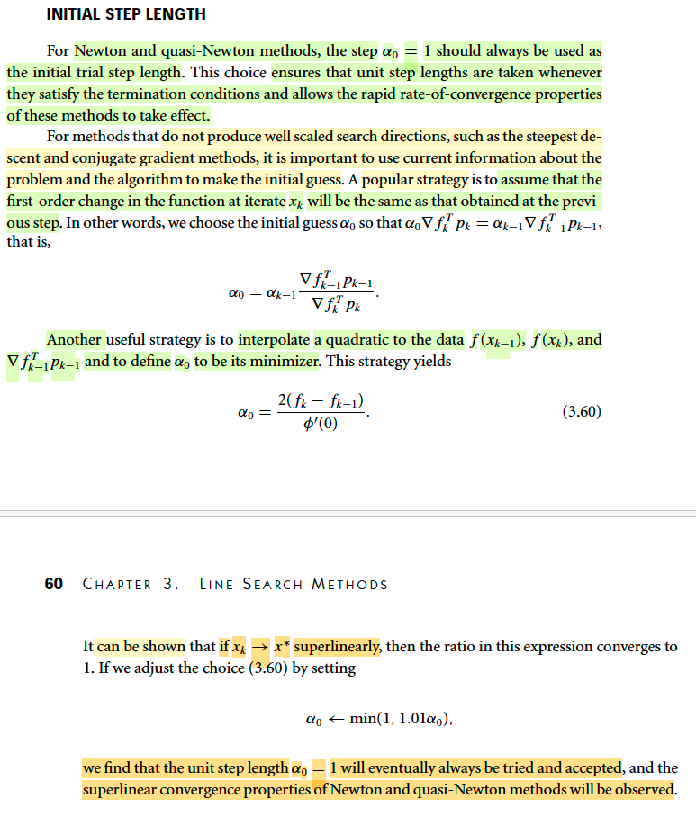</kbd>

> [!NOTE]
> Qua phần này, ta bàn về cách chọn giá trị khởi đầu của step length: α0
>
> Cần nhớ lại một chút, câu chuyện sẽ là: Thuật toán sẽ lặp lại nhiều iteration. Để đi từ x0 → x1 → x2 ...→ xk-1 → xk. Thì trong mỗi iteration, ta phải làm hai việc: Xác định direction, và step-length. Xét iteration k (từ xk, đang tìm cách đến xk+1), giả sử ta đã có direction pk, và ta bắt đầu giải bài toán tìm step-length phù hợp (theo tiêu chí nào đó ví dụ như sufficient decrease condition)
>
> Trong bước này, ta lại giải một bài toán tối ưu nhỏ, tức là cũng từ α0 (nếu thích thì có thể ghi αk_0, ý nói đây là đang tìm step-length của iteration thứ k, và αk_0 là initial value. Và ở đây đang bàn đến việc chọn αk_0 thế nào cho hợp lý.
>
> Thế thì, đầu tiên, tác giả cho rằng nếu mà ta đang dùng Newton hoặc quasi-Newton method thì cứ chọn αk_0 bằng 1. Vì sao? Vì để phòng ngừa trường hợp quá trình tối ưu đã rơi vào giai đoạn Newton phase (trong tối ưu lồi mình đã học, khi tiến tới đủ gần optimal thì Newton method sẽ converge rất nhanh với tốc độ bậc hai - quadratic convergence) khi đó thuật toán sẽ lấy / chấp nhận full Newton step, tức vector Newton step tính ra bao nhiêu là lấy bấy nhiêu. Nếu mà ta không chọn bắt đầu với 1 thì có thể làm lãng phí ưu điểm này của Newton / quasi Newton method.
>
> Rồi, nếu phương pháp là steepest gradient descent hay conjugate method thì tác giả cho rằng cần phải sử dụng current information: HIểu đại ý là ví dụ như mình đang đứng tại B (xk) và tìm cách đi đến C (xk+1), thì tại A mình đang có thông tin tại đó, có thể là giá trị đạo hàm hoặc hàm số tại đó, và ta sẽ tận dụng thông tin này để tính toán.
>
> Và một cách làm phổ biến là người ta giả định rằng mức thay đổi bậc một của hàm số tại xk cũng sẽ bằng với tại xk-1: Ý này hiểu nôm na là: 
>
> Ta đã biết 1st order approximation (linear approximation) của f: Đi từ x0 → x nếu x ≈ x0 ta sẽ có:
>
> f(x) ≈ f(x0) + ∇f(x0)T(x-x0)
>
> (sẵn ôn lại, cái này chỉ là từ Taylor theorem nói rằng:
>
> f(x) = f(x0) + ∇f(ξ)T(x-x0) for some ξ in [x0, x]
>
> cũng là f(x) = f(x0) + ∇f(x0 + t(x - x0))(x - x0) for some t in [0,1]
>
> Với x gần x0 thì ta có thể xấp xỉ ∇f(x0 + t(x - x0)) ≈ ∇f(x0) để có linear approximation: f(x) ≈ f(x0) + ∇f(x0)T(x-x0))
>
> Áp dụng vào 
>
> f(xk) ≈ f(xk-1) + ∇f(xk-1)T(xk-xk-1)
>
> Độ giảm tại step k: Δf_k =  ∇f(xk-1)T(xk - xk-1) = ∇f(xk-1)Tpk-1αk-1
>
> f(xk+1) ≈ f(xk) + ∇f(xk)T(xk+1 - xk)
>
> Độ giảm tại step k+1: Δf_k+1 ≈ ∇f(xk)Tpkαk
>
> Assum độ giảm bậc 1 bằng nhau: 
>
> ∇f(xk-1)Tpk-1αk-1 = ∇f(xk)Tpkαk
>
> ⇨∇f(xk-1)Tpk-1αk-1 / ∇f(xk)Tpk = αk
>
> Và với assumption này thì người ta cho giá trị ban đầu của αk, tức αk_0 là bằng như vậy. Do đó ta có công thức 
>
> α0 (hiểu là αk_0) = ∇f(xk-1)Tpk-1αk-1 / ∇f(xk)Tpk
>
> ====
>
> Một chiến thuật khác là là dùng interpolation to quadratic: Với việc đã biết f(xk-1), f(xk) và ∇f(xk-1)T(pk-1) (tức là directional derivative wrt pk-1 tại xk-1). Nếu như gọi xk-1 là B, xk là A, pk-1 là xk - xk-1 là vector từ A → B, thì ∇f(xk-1)T(pk-1) chính là độ dốc theo hướng A→B của hàm f. Hình dung ta có hàm f bị giới hạn theo hướng AB sẽ như hàm đơn biến, nó đi điểm A, B và biết độ dốc tại A. Ta sẽ xấp xỉ / coi nó là hàm bậc hai. Và đi tìm điểm cực tiểu. (Xem hình minh họa) và đó chính là αk_0, giá trị khởi điểm cho αk
>
> Cách dựng hàm bậc hai thì cũng như đã biết ở phần trước, là ta đặt hàm g(α) = aα^2 + bα + c
>
> Cho nó đi qua xk-1, xk:
>
> Đi qua xk-1: tức là ứng với α = 0 ta có g(0) = f(xk-1) ⇔ c = f(xk-1)
>
> Đi qua xk: tức là ứng với α = αk-1, pk-1, g(αk-1) = f(xk) ⇔ aαk-1^2 + bαk-1 + c = f(xk)
>
> Độ dốc tại xk-1: g'(0) = ∇f(xk-1)Tpk-1 = 2a × 0 + b = b ⇨ b = ∇f(xk-1)Tpk-1. viết là Φ'(0) cho gọn
>
> Thay 1, 3 vào 2:
>
> aαk-1^2 + bαk-1 + c = f(xk)
>
> ⇔ aαk-1^2 + Φ'(0)αk-1 + f(xk-1) = f(xk)
>
> ⇔ aαk-1^2 = f(xk) - f(xk-1) - Φ'(0)αk-1
>
> ⇔ a = [f(xk) - f(xk-1) - Φ'(0)αk-1] / αk-1^2
>
> minimizer của hàm g là solution của g'(α) = 0: 2aα + b = 0 ⇔ α = -b/2a
>
> Thế a, b vào:
>
> ⇔ α = -b/2a 
>
> = - Φ'(0) / 2 {[f(xk) - f(xk-1) - Φ'(0)αk-1] / αk-1^2}
>
> = [- Φ'(0) αk-1^2] / 2 [f(xk) - f(xk-1) - Φ'(0)αk-1]
>
> Đây là công thức đúng, nhưng trong sách đang nói về một công thức khác một chú:
>
> Đại khái là ta sẽ dựng parabol đi qua A (xk-1, f(xk-1)), có độ dốc Φ'(0) nhưng có đáy cùng với độ cao của f(xk). Và giải tìm α minimizer đó để dùng cho αk_0. Nhìn hình là hiểu ngay thôi.
>
> Có nghĩa là cách 1 ở trên là ta dựng parabol Đi qua (xk-1, f(xk-1)), (xk, f(xk), và có độ dốc Φ'(0) và tìm minimize. Còn cách 2 là dựng parabol đi qua (xk-1, f(xk-1)), có giá trị cực tiểu = f(xk), có độ dốc Φ'(0), và đi tìm minimizer. Việc cho ra công thức như sách cũng đơn giản. Ta sẽ quay lại sau.
>
> Đại khái khúc cuối nói rằng: 
>
> Nếu như sự hội tụ về x* diễn ra với tốc độ siêu tuyến tính. Thì cái tỉ số trên, tức 2(fk - fk-1)/Φ'(0) hội tụ về 1. Thì sau khi tham khảo thằng Gemini, mình hiểu rằng cái này sẽ kiểu như là điều này có thể khiến α dần dần rất gần 1 nhưng chưa phải là 1. Trong khi đó, nếu mà là 1 thì mới tốt. Thì một mẹo đó là gán α0 = min(1, 1.01 × α0). Hiệu quả tạo ra là nếu α chưa gần 1 thì nó vẫn dùng giá trị như đã tính. Nhưng nếu nó đã gần 1 thì nó sẽ thành 1 luôn (thay vì cứ tiến dần tới 1)
>
> Gemini nó nói là, như vậy thì ta có thể dùng cả cách làm này cho Newton method: Tức là nếu thích thì cứ cho α0 = 1, thì ưu điểm là nếu đã vào giải đoạn Newton phase thì ta có full Newton step, nhưng cái dở là nếu chưa thì α0 = 1 sẽ luôn bị điều kiện dừng reject và ta phải thử lại. Cách hai là ta dùng công thức này, nó dùng thông tin current position nên khả năng tìm ra α tốt sẽ nhanh hơn. Và với cái mẹo vừa nói thì khi qua Newton phase thì ta vẫn có full step.

> [!TIP]
> **🤖 AI Feedback** — ⚠️ Score: **85/100**
>
> Phần dẫn xuất công thức α₀ từ giả định thay đổi bậc một có sự nhầm lẫn khái niệm giữa α₀ (giá trị khởi tạo) và αk (chiều dài bước thực tế), cần làm rõ hơn. Tuy nhiên, khả năng phân tích sâu sắc, nhận diện sự khác biệt giữa các công thức và đề xuất giải thích hợp lý cho công thức sách ở phần nội suy bậc hai là cực kỳ xuất sắc và đáng khen ngợi.

 

- **A line search algorithm for Wolfe condition**

<kbd>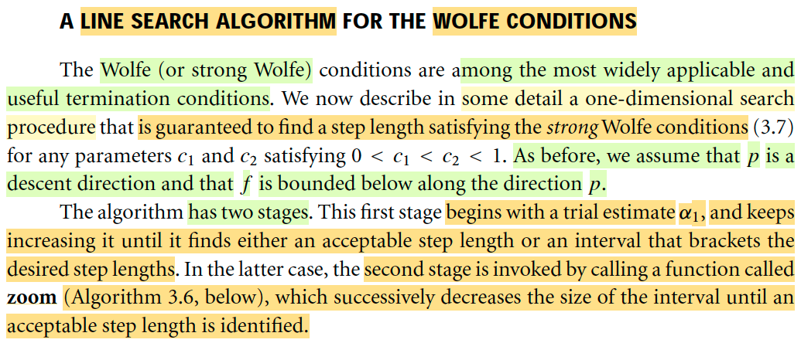</kbd>

> [!NOTE]
> Phần này sẽ nói về thuật toán tìm αk đây (phần vừa rồi là nói về cách chọn giá trị khởi điểm của αk, tức αk_0, và nếu đều hiểu là đây là bước tìm step size của iteration k'th thì ta chỉ cần gọi α0 được rồi, vì ta cũng sẽ iterate để tìm ra α thỏa)
>
> Từ phần trước (xem link) ta đã biết Wolfe condion và strong Wolfe condition, ôn lại một xíu:
> Wolfe condition bao gồm điều kiện giảm đủ (sufficient decrease, còn gọi là Amijo condition) mà ý tưởng là yêu cầu hàm f khi đi theo hướng pk với sải bước αpk phải giúp có một độ giảm ít nhất là bằng độ giảm của một hàm tuyến tính với độ dốc bằng độ dốc của hàm f tại điểm đầu nhưng điều chỉnh bớt bởi hằng số c1
>
> f(xk + αkpk) ≤ f(xk) + c1 αk ∇fkTpk (**Armijo**)
>
> Còn điều kiện thứ hai của Wolfe condition là "curvature condition": Ý tưởng là muốn khi bước tới điểm mới với step size đó (step size đang muốn check) thì hàm số phải có bớt dốc hơn so với độ dốc tại ban đầu đã điều chỉnh. Nói rõ hơn chút: Giả sử độ dốc ban đầu (Φ'(0) là -10, thể hiện trạng thái "rất dốc", ta sẽ điều chỉnh bằng hệ số 0.5 thành -5 (ví dụ thôi nhé) thì khi đó, giả sử dùng step size α để đến được điểm mới, mà tại đó độ dốc là -7. Thì con số này nó chưa lớn hơn -5. Và điều này mang ý nghĩa báo hiệu rằng hàm số vẫn còn đang rất dốc, và có thể còn giảm hơn nữa, do đó ta có thể chọn α lớn hơn, để đi xa hơn. 
>
> Thế rồi gỉa sử với một giá trị α khác, giúp đến được điểm mà tại đó độ dốc là -4, lúc này đã lớn  hơn -5, **báo hiệu tại đây hàm số đã bớt dốc rồi, nếu đi xa hơn nữa có thể không giảm được thêm bao nhiêu mà còn có nguy cơ vượt lố qua cực tiểu α***, nên dừng được rồi.
>
> ∇f(xk + αkpk)Tpk ≥ c2 ∇fkTpk
>
> Và để phòng tránh trường hợp α thỏa điều kiện trên nhưng có thể bao gồm cả giá trị dương thể hiện hàm số đã bắt đầu dốc lên, đồng nghĩa đã đi quá lố α*, thì người ta** đưa thêm điều kiện để không chế không độ dốc trở nên lớn**. Đây là **strong curvature condition**.
>
> |∇f(xk + αkpk)Tpk| ≤ c2|∇fkTpk| 
>
> Thì Armijo + Curvature condition = Wolfe
>
> Armijo + strong Curvature condition = strong Wolfe.
>
> Vậy thì ở đây, ta sẽ bàn về một thuật toán nhằm đảm bảo là ta sẽ có được α thỏa strong Wolfe condition.
>
> Nó có hai bước: 
>
> Bước 1 là bắt đầu với việc **estimate α1, và tăng dần lên cho đến khi nó có được step length chấp nhận được** hoặc là **có được một khoảng / khoanh vùng** (bracket)
>
> Bước hai sẽ là **giai đoạn "zoom", tức là dựa trên vùng tìm kiếm ở bước 1, ta sẽ đi tìm giá trị α**

> [!TIP]
> **🤖 AI Feedback** — ⚠️ Score: **85/100**
>
> Ghi chú của bạn giải thích rất chi tiết và chính xác về các điều kiện Wolfe, cung cấp nền tảng vững chắc cho thuật toán. Tuy nhiên, mô tả về giai đoạn "zoom" thứ hai còn thiếu một chi tiết quan trọng: thuật toán giảm dần kích thước của khoảng tìm kiếm để xác định độ dài bước chấp nhận được.

**🔗 See also:** [Điều kiện Wolfe và Wolfe mạnh](./31_line_search_method_step_length.md#node-7kgcs2p)

 

- **Thuật toán tìm alpha giúp thỏa strong Wolfe conditions**

<kbd>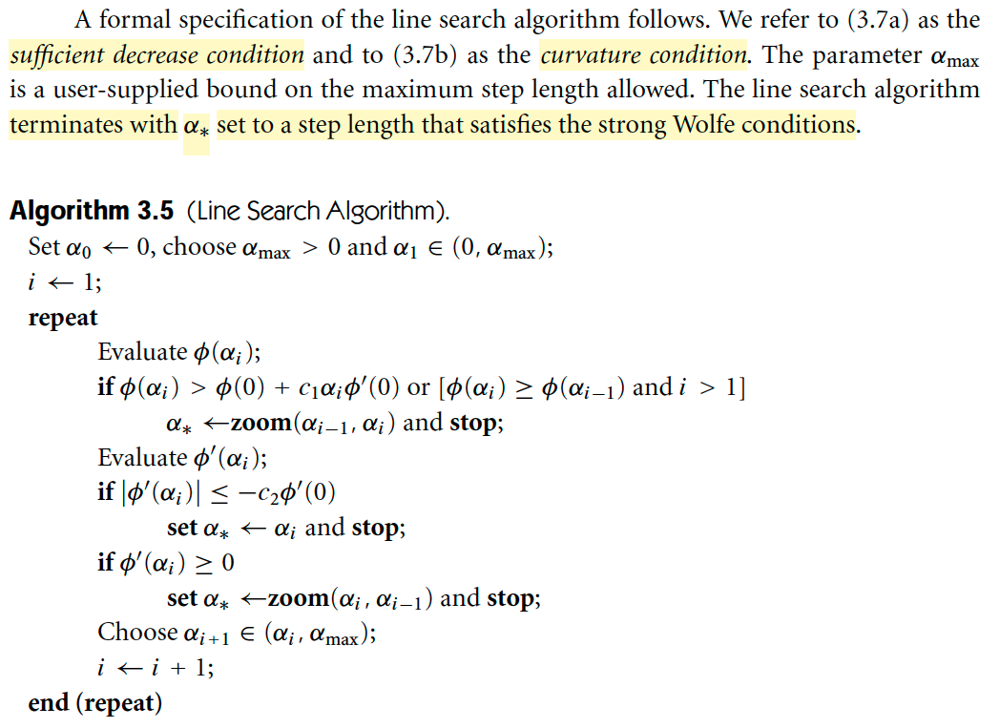</kbd>

<kbd>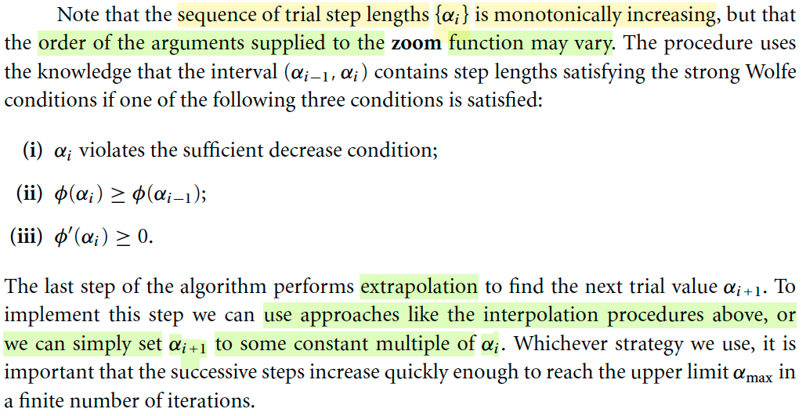</kbd>

> [!NOTE]
> Cùng phân tích để hiểu thuật toán này:
>
> Đầu tiên có thể thấy ta sẽ gán α0 = 0. Và chọn αmax, cũng như là α1. Bước chọn này có thể là do kinh nghiệm hoặc một thủ thuật nào đó.
>
> Gán i = 1
>
> Chạy vòng lặp, trong đó ta sẽ:
>
> Tính Φ(αi)
>
> Check điều kiện để chạy giai đoạn zoom và thoát. Có nghĩa là, nếu điều kiện này thỏa, ta sẽ đem hai giá trị αi-1 và αi đem qua thuật toán zoom để nó tính ra / tìm ra α*. Còn không thỏa thì tiếp tục. Vậy thì điều kiện là gì: 
>
> Ta thấy nó check một trong hai case sau có thỏa không:
>
> 1) Φ(αi) > Φ(0) + c1 αi Φ'(0): À, đây là điều kiện giảm đủ, nếu cái này đúng thì tức là tại αi thì hàm số đã cao hơn hàm tuyến tính, nên nó đã vi phạm điều kiện giảm đủ, do đó, nhất định giá trị α phù hợp phải nằm đâu đó trước đó, ta sẽ đem hai cái điểm αi-1 và αi đi soi kĩ (zoom). Ví dụ điều này xảy ra ngay tại α1 thì ta sẽ đem α0 = 0 và α1 đi soi, tức là tìm trong [0, α1].
>
> 2) Φ(αi) ≥ Φ(αi-1) và i > 1: Đây chính là hiện tượng hàm f đang tăng lên, thay vì giảm xuống, rõ ràng cũng cho thấy ta đã đi lố qua α*. Phải dừng, và đem đi soi.
>
> Và bước soi (zoom) sẽ nói sau, giúp tìm ra α tốt nhất. Mình hiểu α* ở đây chỉ là α thỏa điều kiện strong Wolfe, như mục đích của thuật toán này chứ không phải là α khiến minimize hàm Φ(α).
>
> Rồi, thế thì nếu bước check trên không thỏa, ta sẽ tính giá trị đạo hàm tại αi.
>
> Và check |Φ'(αi)| ≤ -c2 Φ'(0), nếu thỏa thì chọn ngay α* là αi và dừng: Bước này là sao? Có thể thấy nếu thỏa ở đây chính là thỏa strong curvature condition. Cùng với việc nó thoát được cái cửa trên, tức thỏa Amijo. Có nghĩa là αi này đã thỏa strong Wolfe → Đúng yêu cầu, chốt và thoát.
>
> Nếu cái trên chưa thóat, tức là chưa thỏa strong Wolfe, ta sẽ check xem Φ'(αi) có ≥ 0 không.
> Nếu thỏa, cái này rõ ràng chứng tỏ cũng đã đi lố vì hàm số đã đang đi lên, ta sẽ cầm αi và αi-1 đi soi.
>
> Nếu vòng trên vẫn pass, ta sẽ chọn αi mới nằm trong khoảng từ αi tới αmax và lặp lại.
>
> Và cách chọn thì tác giả nói ta sẽ dùng phương pháp interpolation như phần trước đã học (ví dụ như dựa vào các thông tin Φ(0), Φ'(0), Φ'(αi),Φ(αi-1) để dựng cubic function và tìm minimizer) hoặc cũng có thể đơn giản hơn là nhân αi bởi một constant nào đó. Và tác giả lưu ý là dùng cách nào thì cũng phải đảm bảo là αi tiến tới αmax đủ nhanh (ý "in a finite number of iteration")
>
> Ngoài ra, tác giả còn cho biết, thuật toán này sẽ có 3 case mà ta đem cặp αi. αi-1 đi soi (zoom) để tìm α*. Nhưng chú ý là thứ tự argument có thể khác nhau (và ta sẽ hiểu khi qua xem chi tiết thuật toán zoom)
>
> Nói chung trong thuật toán trên, trừ một case là ta pass vòng đầu và thỏa cái if thứ hai, tức là khi đó ta đã có αi thỏa strong Wolfe condition thì chốt hạ và stop luôn. Thì còn lại ta sẽ cầm αi-1, αi đi soi khi: 1) Hàm số bắt đàu tăng, thể hiện việc giá trị Φ sau lớn hơn Φ trước hoặc đạo hàm không âm 2) αi đã quá điều kiện giảm đủ.

> [!TIP]
> **🤖 AI Feedback** — ✅ Score: **90/100**
>
> Bài phân tích rất chi tiết và chính xác, thể hiện sự hiểu biết sâu sắc về thuật toán tìm kiếm đường và các điều kiện Wolfe. Bạn đã giải thích rõ ràng ý nghĩa của từng bước và các điều kiện thoát. Để đạt điểm tuyệt đối, hãy chú ý nêu bật sự thay đổi thứ tự đối số của hàm zoom ngay tại bước mà nó xảy ra trong thuật toán.

 

- **Zoom algorithm**

<kbd>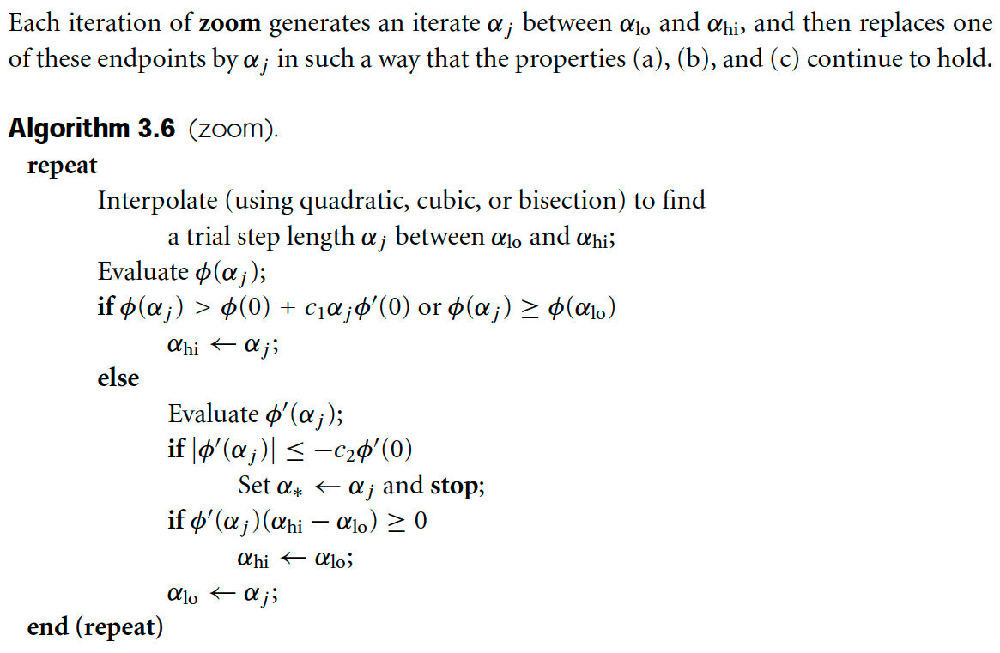</kbd>

> [!NOTE]
> Đầu tiên của các bước trong vòng lặp j là từ αlow và αhight, dùng iterpolation để tính ra αj. Chắc chắn nó phải ở giữa αlow, αhigh, để ta có các mốc như sau: (0, αlow, αj, αhigh)
>
> Nếu Φ(αj) > Φ(0) + c1 αj(Φ'(0) hoặc Φ(αj) ≥ Φ(αlow) thì αhigh := αj
>
> Nếu cái đầu thỏa, tức là tại αj đã vi phạm điều kiện giảm đủ Armijo, nên có nghĩa là αj quá lớn. 
>
> Nếu cái sau thỏa, thì tức là hàm Φ tại đó đã đi cao hơn hàm Φ tại αlow, cũng có nghĩa là step size quá lớn, giá trị phù hợp phải ở trước đó. Các mốc sẽ phải là (0, αlow, α*, αj, αhigh)
>
> Do đó ta sẽ gán lại nó cho αhigh, để đem cặp αlow, αhigh qua vòng sau tìm giá trị khác trước đó (nhỏ hơn). 
>
> Nếu hai cái trên không thỏa tức là tại αj đã thỏa điều kiện giảm đủ và không vi phạm Φ(αlow) < Φ(αj) Thì kiểm tra tiếp giá trị đạo hàm tại αj:
>
> Nếu |Φ'(αj)| ≤ -c2Φ'(0), thì đây rõ ràng là thỏa điều kiện strong curvature: độc dốc cái αj đã bớt dốc xuống. Ví dụ như độ dốc tại 0 (điểm ban đầu) là -10, với c2 = 0.2 thì độ dốc giờ đây đã chỉ còn cỡ -2, hoặc -1.9,.. thôi, biểu hiện ta sắp đạt tối ưu rồi, và nếu nó là dương, thì ví dụ 1.9, hay 2.0, thì nó cũng không đi quá xa so với điểm thấp nhất) Do đó, dừng được rồi: ta cho α* := αj và stop.
>
> Nếu Φ'(αj)(αhi - αlo) ≥ 0, thì có nghĩa là:
>
> Đầu tiên nhắc lại, nếu đến được đây thì tức là nó thỏa cái if thứ nhất, và như vậy nó đã thỏa điều kiện giảm đủ, và có Φ(αj) < Φ(αlow). 
>
> Nhưng vì nó không thỏa điều kiện strong curvature nên mới chưa stop được. Vậy thì:
>
> Đầu tiên nhớ α low, hay high là đặt dựa trên giá trị hàm số chứ ko phải do độ lớn α
>
> Case 1: αlow < αhigh: hình ảnh sẽ là: hàm đang đi xuống tại αlow (nằm thấp hơn αhigh), tới α*, và đi lên, tới αj (vẫn thấp hơn tại αlow), tới αhigh (và tại đây nó cao hơn αlow) → Cho thấy điểm α* nằm trước đó. (0, αlow, α*, αj, αhigh)
>
> Ta sẽ cần tìm trong đoạn [αlow, αj], nhưng vì Φαj < φ(αlow) nên ta gán lại αlow thành αhigh, và αj thành αlow và tìm tiếp ở vòng sau.
>
> Case 2: alow > αhigh (nên αhi - αlo < 0): hình ảnh sẽ là, từ αhigh, nằm cao hơn αlow), hàm đang đi xuống, xuống tới α, xuống tiếp α*, bắt đầu đi lên, lên tới alo (nằm thấp hơn αhigh): Như vậy các mốc sẽ là (0, αhigh, αj, α*, αlow). Ta sẽ cần tìm trong đoạn αj, αlow, nhưng tương tự, vì Φαj < Φ(αlow) nên ta gán lại αlow thành αj, và αhigh thành αlow.
>
> Nếu điều trên không xảy ra tức không rơi vào cái if cuối, thì có nghĩa là rơi vào 2 case sau:
>
> Case 1: αlow < αhigh, tức αhi - αlo > 0, thì Φαj < 0 → bức tranh tại đây sẽ là: từ αlow → đi xuống αj → đi xuống α*, đi lên αhigh. Nên các mốc sẽ là (αlow, αj, α*, αhigh)
>
> Case 2: αhigh < αlow ⇔ αhi - αlo < 0, thì Φαj > 0 và bức tranh sẽ là từ αhigh → đi xuống tới α*, đi lên αj, đi lên tới αlow (ko cao bằng αhigh). Nên các mốc là (0, αhigh, α*, αj, αlow)
>
> Trong cả hai case có thể thấy ta sẽ cần tìm trong ở giữa αj, αhigh. Nên ta sẽ gán αj cho αlow và tìm ở vòng sau.

> [!TIP]
> **🤖 AI Feedback** — ⚠️ Score: **75/100**
>
> Bài phân tích của bạn khá chi tiết và thể hiện sự hiểu biết tốt về các điều kiện Armijo và Strong Curvature, đặc biệt là phần giải thích về độ dốc. Tuy nhiên, việc mô tả vị trí của α* (điểm tối ưu) trong các "mốc" khi nó chưa được biết là không chính xác, và cần rõ ràng hơn về cách các cận αlo, αhi được cập nhật để duy trì tính chất của khoảng tìm kiếm, đặc biệt khi chúng bị đảo ngược về mặt giá trị.

 

- **Một Số Ghi Chú Về Line Search, Quay Lại Sau**

<kbd>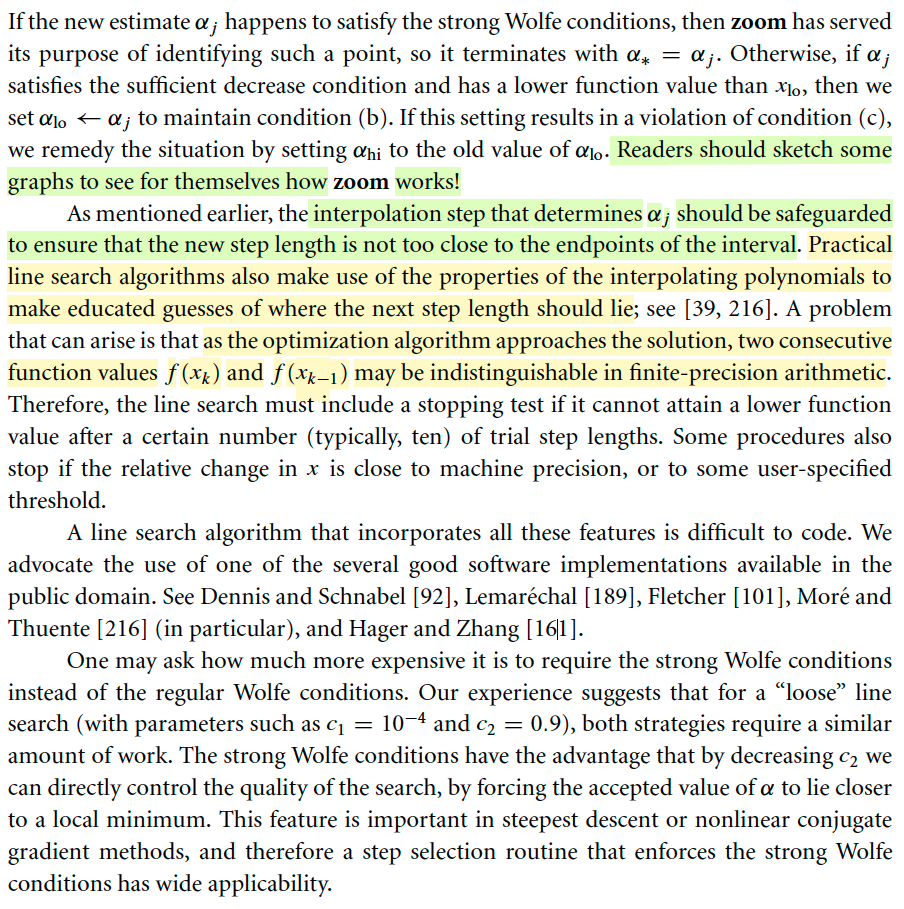</kbd>

> [!NOTE]
> MỘT SỐ GHI CHÚ VỀ LINE SEARCH, QUAY LẠI SAU

 

<kbd>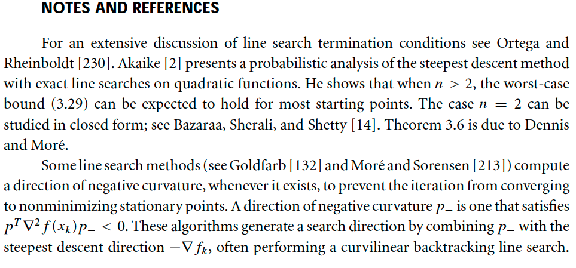</kbd>

 

