# 4.0 Trust-Region Methods: Outline of the Trust-Region Approach

📊 **Progress:** `12` Notes | `11` Screenshots | `8` AI Reviews

---

## 4.0 Trust-Region Methods: Outline of the Trust-Region Approach

> [!NOTE]
> Trust-Region Methods: Outline of the Trust-Region Approach

 

## Line search vs Trust Region

<kbd>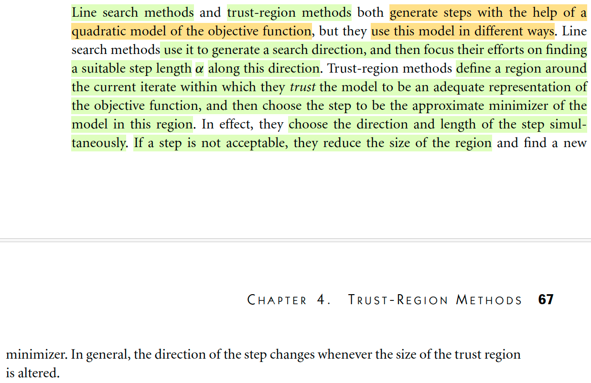</kbd>

> [!NOTE]
> Đầu tiên tác giả cho biết line search methods và trust region method đều có điểm chung là dựa vào việc ước lượng xấp xỉ hàm objective bởi một hàm bậc hai và từ đó tính toán ra hướng + độ lớn hướng di chuyển.
>
> Nhưng nó khác nhau ở cách làm. Cụ thể là line search sẽ tính ra direction trước, và tìm step size theo hướng đó sau. Còn trust-region method thì tìm toán một bán kính mà trong phạm vi đó có thể xem như hàm số hoạt động như hàm bậc hai, để từ đó tìm bước đi giúp minimize hàm bậc hai, và dùng nó để thực hiện bước nhảy. Nếu step tính ra không đạt nó sẽ thu hẹp lại trusted region và làm lại.
>
> Nhớ lại một chút về line search, mình đã biết có nhiều cách làm trong bước chọn direction có thể dùng các steepest gradient descent, hoặc Newton direction. Sở dĩ nói đây cũng là dựa trên việc xấp xỉ hàm số bởi hàm bậc hai là vì: Với Newton method thì rõ rồi, vì việc tính toán ra Newton step chính là dựa vào việc xấp xỉ hàm số bởi hàm bậc hai. Còn steepest gradient descent? 
>
> Đại khái là thế này: Quadratic approx của hàm f tại xk:
>
> f(xk + p) ≈ f(xk) + ∇f(xk)Tp + (1/2)pT∇^2f(xk)p
>
> Đặt vế phải là hàm mk(p) 
>
> Vậy thì đại khái là nếu trong phạm vi p hợp lý thì có thể xấp xỉ hàm f bởi hàm bậc hai.
>
> Và dựa vào đó ta xác định p là vector khiến minimize hàm bậc hai này.
>
> Viết lại mk(p) = fk + ∇fkTp + (1/2)pTHkp
>
> ∇mk(p) = Hkp + ∇fk
>
> First order condition: ∇mk(p) = 0 ⇔ Hkp + ∇fk = 0 ⇔ p = - ∇fk(Hk)inv. Đây chính là Newton step
>
> Nếu dùng Bk thay Hk, tức là một matrix xấp xỉ Hessian, thì ta sẽ có p = - ∇fk(Bk)inv, là quasi-newton step
>
> Còn nếu dùng (1/α) I thay cho Hk, tức là một hằng số nhân với Identity. Ta sẽ có:
>
> p = -∇fk (1/α I)inv  = -∇fk α = -α∇fk Thì đây chính là steepest gradient descent.
>
> Do đó thật ra đều là xấp xỉ hàm objective bởi quadratic, chẳng qua là khác nhau cách chọn dùng matrix Hessian. Nếu chọn cách tính chính xác Hessian, thì ta có Newton step, với việc có được thông tin về curvature dẫn đường thì dĩ nhiên là rất tốt. Còn nếu thay bởi xấp xỉ của Hessian cho giảm nhẹ tính toán thì ta có quasi Newton method, vẫn nhanh tuy không bằng Newton method xịn. Cuối cùng là coi như không dùng thông tin curvature thì ta có steepest gradient descent.

> [!TIP]
> **🤖 AI Feedback** — ✅ Score: **95/100**
>
> Bài phân tích rất chính xác các điểm chung và riêng giữa line search và trust-region methods như mô tả trong văn bản. Ngoài ra, bạn đã thể hiện sự hiểu biết sâu sắc về nền tảng toán học của việc xấp xỉ hàm bậc hai trong các phương pháp tối ưu, điều này vượt xa nội dung được cung cấp và là một điểm cộng lớn.

 

### Điều chỉnh phạm vi tin cậy

<kbd>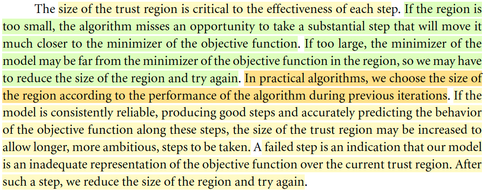</kbd>

> [!NOTE]
> Thế thì vì ý tưởng của trust region là vậy - tìm một phạm vi mà trong đó hàm số có thể coi như giống một hàm bậc hai, để từ đó tìm ra bước đi. Do đó dĩ nhiên là bước này rất quan trọng.
>
> Nếu phạm vi này quá lớn, thì trong phạm vi đó hàm số không hoạt động đúng với hàm bậc hai, nên hướng đi sẽ trật, thể hiện bởi bước hậu kiểm sẽ fail, và phải thu nhỏ trust region lại để làm lại.
>
> Nếu phạm vi này quá nhỏ, thì lãng phí, vì giống như ta sẽ quá cẩn trọng, trong khi đáng lẽ có thể thực hiện những bước đi dài hơn giúp hội tụ nhanh hơn.
>
> Ta sẽ tính toán trust region dựa vào kết quả của bước iteration trước đó. Kiểu như là nếu trước đó cho thấy là tốt: cụ thể là bước hậu kiểm cho thấy chọn trust region là ok, giúp trong phạm vi đó hàm số hành xử giống hàm bậc hai, thì trong lần iterate kế tiếp có thể tăng trust region lên. Ngược lại thì thu hẹp lại.
>
> Vậy mới thấy rõ là trust region sẽ cơ bản là tìm step size trước (khi nào tìm được rồi, chính là , rồi mới chọn hướng đi.

> [!TIP]
> **🤖 AI Feedback** — ⚠️ Score: **88/100**
>
> Bài phân tích cho thấy sự hiểu biết sâu sắc về vai trò và cách điều chỉnh kích thước vùng tin cậy, đặc biệt là các trường hợp quá lớn hoặc quá nhỏ, phản ánh tốt nội dung tài liệu. Tuy nhiên, việc bổ sung thông tin về thứ tự tìm kiếm bước đi không có trong văn bản gốc, cần tập trung hơn vào việc phân tích trực tiếp từ nguồn đã cho.

 

#### Vấn đề hướng Line Search

<kbd>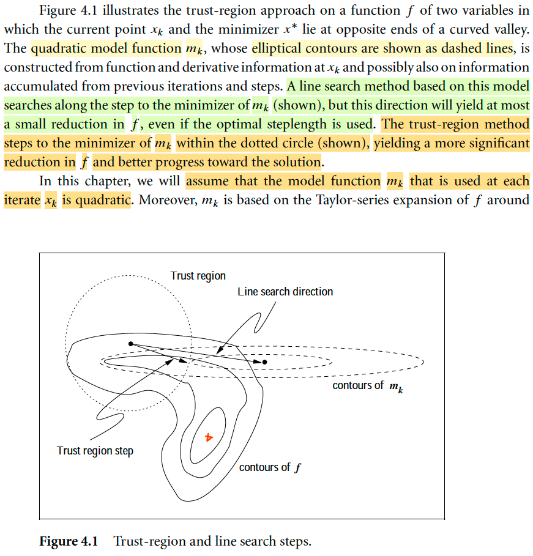</kbd>

> [!NOTE]
> Đoạn này đại ý tác giả muốn minh họa một hoàn cảnh mà có thể thấy Line search direction tệ hơn trust region direction.
>
> Cái contour plot của hàm objective là những đường méo mó, với điểm màu đỏ là x*. Và chấm đen đầu hai mũi tên là xk.
>
> Thế thì nếu là dùng line search method, như đã biết, ta sẽ coi như hàm f tại xk hành xử như hàm bậc hai. Để rồi đi theo Newton step sẽ dẫn ta xuống đáy cái parabol (các contour hình ellips gạch gạch) thì có thể thấy nó khiến hàm f tăng lên (điểm đen tâm của ellipse nằm ngoài đường đồng đẳng của của hàm f so với xk) Mà đó là ta dùng Newton step, tức là có dùng thông tin curvature cung cấp bởi Hessian tại xk rồi mà còn vậy, thì nếu dùng steepest gradient descent hay quasi Newton thì có thể còn tệ hơn.
>
> Trong khi đó, trust region, bằng cách tìm được một bán kính trust region mà trong đó hàm f xấp xỉ tốt bởi hàm bậc hai, nên bước đi của nó (mũi tên ở dưới, giúp hướng về optimizer x* tốt hơn so với line search).
>
> Mình có nhận xét thế này: Tới đây có thể thấy, khi ta xấp xỉ hàm số bởi hàm bậc hai, nhưng dĩ nhiên là phải có một phạm vi nào đó mà sự xấp xỉ này là tốt, bởi bản chất hàm f không phải lúc nào cũng là hàm bậc hai, và định lý Taylor đã cho ta biết khi nào thì được phép dùng dấu xấp xỉ để thay dấu bằng. Vậy thì rõ ràng phương pháp line search sau khi tính ra direction thì phải hết sức cẩn trọng trong việc chọn step size. Nhưng kể cả như vậy thì vấn đề là, cái direction nó có thể đã tệ ngay từ đầu rồi, nên chọn step size chỉ là vớt vát lại ít nhiều thôi.
>
> Trong khi đó, ưu tiên của trust region là chọn vùng an toàn, nơi mà có thể xấp xỉ tốt hàm bởi hàm bậc hai, từ đó mới tính direction, do đó direction của nó tốt hơn.

> [!TIP]
> **🤖 AI Feedback** — ⚠️ Score: **70/100**
>
> Phân tích về nguyên lý của phương pháp trust region và ưu điểm của nó so với line search rất sâu sắc và chính xác, thể hiện sự hiểu biết tốt về khái niệm cốt lõi. Tuy nhiên, nhận định về việc hàm f tăng lên khi sử dụng line search là sai lệch so với thông tin được cung cấp ('at most a small reduction'), và bài viết bị đứt đoạn ở cuối.

 

##### Ảnh hưởng bán kính vùng tin cậy

<kbd>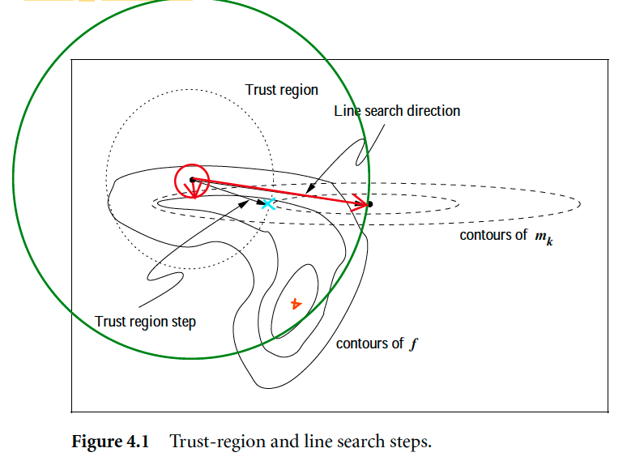</kbd>

> [!NOTE]
> Hiểu thế này, trust region khi đã tìm ra được vùng tin cậy, thì ta tìm trong những điểm trên hoặc trong tròn đó, điểm nào có hàm mk(p) nhỏ nhất.
>
> Nếu bán kính là lớn thì hướng này sẽ trùng với Newton step.
>
> Nếu bán kính nhỏ thì nó sẽ trùng với steepest gradient.
>
> (Những phần sau sẽ nói rõ)

 

- **#4.1, 4.2, 4.3**

<kbd>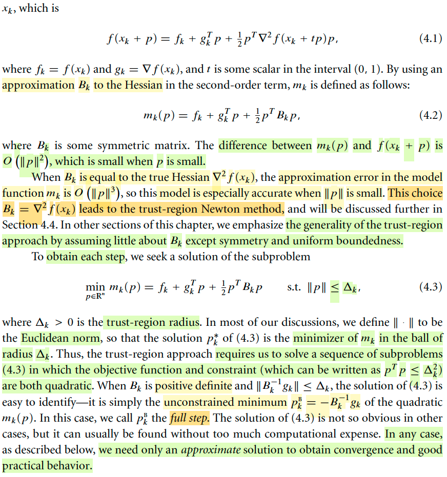</kbd>

> [!NOTE]
> Cùng đọc đoạn này. Tác giả nói trong phần này ta sẽ assume rằng tại mỗi iteration ta đều approx hàm f bởi quadratic function.
>
> Và cái này thì như đã biết từ các chương trước, xuất phát từ Taylor theorem:
>
> Nói rằng khi đi từ xk → xk + p, ta có:
>
> f(xk + p) = f(xk) + ∇f(xk)Tp + (1/2)pT ∇^2f(xk + tp)p for some t in (0,1) (4.1)
>
> Rồi, từ cái này mình sẽ lập luận rằng, nếu t nhỏ trong phạm vi nào đó thì Hessian tại xk + tp có thể coi như bằng Hessian tại xk. Từ đó ta có quadratic approximation:
>
> f(xk + p) ≈ f(xk) + ∇f(xk)Tp + (1/2)pT ∇^2f(xk)p
>
> Còn trong sách, tác giả nói nếu ta thay Hessian tại xk + tp bởi ma trận xấp xỉ Bk symmetric nào đó (mà nếu Bk là Hessian tại k thì ta có kết quả trên) thì ta sẽ có:
>
> f(xk + p) ≈ f(xk) + ∇f(xk)Tp + (1/2)pT Bk p 
>
> Và vế phải là hàm sẽ dùng để approx hàm f
>
> mk(p) =  f(xk) + ∇f(xk)Tp + (1/2)pT Bk p (4.2)
>
> Vậy thì sai khác giữa mk(p) và f(xk+p) sẽ là O(||p||^2) là vì sao?
>
> ⇨ Là vì f(xk + p) - mk(p) sẽ là (1/2)pT (Bk - H(xk+pt)) p. Và đây là O(||p||^2)
> vì nó có dạng Σ αi pi^2
>
> Thì là vì f(xk + p) - mk(p) = (1/2)pT(Bk - ∇^2f(xk+tp)) p
>
> Rồi tại sao khi Bk chính xác là Hessian thì ta sẽ có sai khác O(||p^3||)???
>
> (Quay lại sau)
>
> ====
>
> Tiếp, tác gỉa nói để đảm bảo tính khái quát của trust region method thì ta sẽ chỉ giả định rất ít về Bk, ngoại trừ việc nó đối xứng và "uniform boundedness"???
>
> Rồi, thế thì tại mỗi step, ta sẽ giải bài toán tối ưu:
>
> minimize mk(p) subject to ||p|| ≤ Δk (4.3)
>
> Và vì ||.|| ở đây là L2 norm, nên về cơ bản là ta giải bài toán minimize quadratic function với constraint cũng quadratic vì ||p|| ≤ Δk thì tương đương pTp ≤ Δk^2)
>
> Rồi nếu Bk xác định dương và ||Bkinv gk|| ≤ Δk thì ta có solution là pk_B = - (Bk)inv gk Và trong trường hợp này pk_B gọi là full step.
>
> ?? Vì sao?  Dễ thôi, vì minimizer của mk(p) dễ thấy sẽ là -(Bk)inv gk (y như công thức quasi Newton step đó). Và nếu như  ||(Bk)inv gk|| ≤ Δk (feasible) thì dĩ nhiên chính là thỏa constraint ⇨ là solution của bài toán. 
>
> Và vì nó là solution, nên dùng nó để đi ngay từ xk đến đấy luôn, tức là vector dài nhiêu thì đi theo đó bấy nhiêu nên gọi là full step. 
>
> Còn vì sao phải xác định dương thì là bởi đây là điều kiện đủ bậc hai mình đã biết ở chương 2 
>
> Còn trong trường hợp khác (ko thỏa Bk xác định dương và ||Bkinv gk|| ≤ Δk) thì ta sẽ tìm cách giải bằng các ước lượng.
>
> #4.1, 4.2, 4.3

> [!TIP]
> **🤖 AI Feedback** — ⚠️ Score: **88/100**
>
> Phân tích của bạn rất sâu sắc và chi tiết, đặc biệt là phần giải thích về 'full step' và điều kiện xác định dương của Bk, cho thấy sự hiểu biết vững chắc về lý thuyết. Tuy nhiên, khi tính sai khác f(xk + p) - mk(p), hãy cẩn trọng hơn về dấu của các thành phần trong biểu thức; và lần tới cần hoàn thiện các phần "Quay lại sau" để đạt điểm tối đa.

**🔗 See also:** [4.3 Iterative Solution Of The Subproblem](./43_trust_region_methods_iterative_solution_of_the_subproblem.md#node-gal0ace)

 

- **Outline of the trust-region method**

<kbd>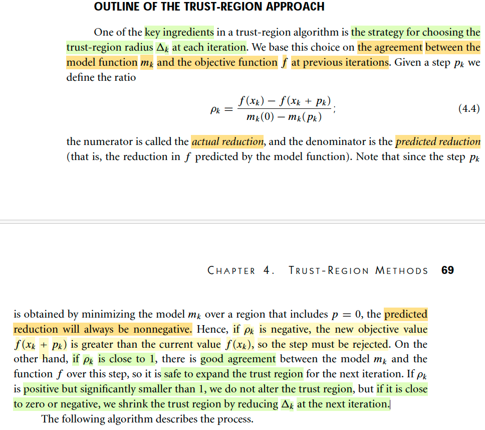</kbd>

> [!NOTE]
> Đại ý là phần này sẽ nói về cách tiếp cận đối với trust-region, vì bước xác định trust region là bước quan trọng đầu tiên cần làm.
>
> Ôn lại một chút về **phương pháp trust region**: So sánh với line search method, thì cả hai có **điểm chung** là (tại một bước update / một iteration để đang đứng ở xk, thực hiện bước đi đếm xk+1) thì về bản chất **đều là xem / coi như hàm objective là hàm bậc hai**, hay nói cách khác, ta dùng một hàm bậc hai để approximate hàm objective. 
>
> Để rồi dựa vào đó, **line search sẽ xác định direction, và step size**. Còn **trust region thì làm ngược thứ tự lại, xác định step size trước** (chính xác hơn thì xác định phạm vi của step size trước, tức trust region), sau đó, mới giải bài toán tối ưu - minimize hàm quadratic với constraint là trong phạm vi trust region để **tìm direction**.
>
> Thế thì, nếu đánh giá về line search, ta sẽ thấy rằng, vấn đề của nó là, nó **dựa vào việc estimate hàm objective bởi quadratic (mk(p) = fk + gkTp + (1/2)pTAp**, để rồi với việc dùng **A = I hay Hessian tại k hay matrix xấp xỉ Hessian tại k, Bk, mà ta có steepest gradient descent, quasi-newton hay Newton method)**, để từ đó giải bài toán minimize hàm mk(p) để xác định direction
>
> Thì điểm không ổn là theo Taylor theorem nói rằng, **trừ khi hàm f là hàm quadratic, còn không thì việc xấp xỉ này chỉ đúng trong một phạm vi nhỏ mà thôi**. Do đó, ngay cả khi dùng Newton method, thì nó chỉ tỏ ra hiệu quả khi xk đã tới gần x*, khiến cho việc ước lượng tại đó, và giải tìm minimizer của hàm mk nó diễn ra trong một phạm vi nhỏ, dẫn đến bảo đảm việc xấp xỉ là chấp nhận được, nên phương pháp phát huy hiệu quả, và dẫn đến tốc độ hội tụ bậc hai.
>
> Ngược lại, **khi xk còn xa x*, thì solution của bài toán minimizing mk method sẽ tạo ra direction có thể rất tệ**, vì nó vi phạm điều kiện của xấp xỉ bậc hai nói trên, rằng chỉ có thể xấp xỉ tốt trong phạm vi nào đó mà thôi.
>
> Ý muốn chỉ ra rằng, **nhược điểm của line search**, hiểu nôm na là **quá tự tin trong việc xác định direction**, và dù rằng bước tìm kiếm step length theo sau có thể cũng đảm bảo cho việc update có tiến triển nào đó, nhưng direction có thể đã tệ thì bước tìm step length cũng không gỡ gạc lại được.
>
> Từ đó ta mới nghĩ về trust region method, nó muốn **khắc phục bằng cách quyết định một trust region trước**, và cơ chế của nó nhằm mục đích, **nếu lần iterate trước có vẻ không ổn, thì sẽ thu hẹp trust region lại, và ngược lại thì sẽ mở rộng ra thêm**. 
>
> **Điều này giống như một người đi đường cẩn trọng, khi họ quyết định sẽ bước ngắn hơn nếu lần trước cảm thấy bị hụt chân v(vì nó cho thấy họ đang đoán sai về địa hình phía trước). Nhưng sẽ bước dài hơn nếu họ không thấy bị hụt chân hay chông chênh, chứng tỏ họ đang đoán đúng địa hình.**
>
> Tất nhiên, trust region **cũng xác định hướng đi bằng cách minimize hàm mk, nhưng ràng buộc bởi bán kính, khiến nó (pk) nó sẽ khác với hướng pk giải ra bởi bài toán minimize mk không ràng buộc.**
>
> Và đoạn này nói về việc **check tỉ số ρk chính là xem thử độ hụt**, hay cảm giác bị hụt chân / hay khựng (tưởng tượng bạn bước xuống cầu thang, khi bạn đoán nó thấp hơn thực tế bạng sẽ bị khựng, ngược lại, bạn sẽ bị cảm giác hụt chân) chính là **tỉ lệ giữa độ giảm của hàm f (từ xk → xk + pk) và độ giảm của hàm mk (mk tại 0. tức xk và tại pk, tức xk + pk).**
>
> **Nếu tỉ lệ này gần bằng 1**: Đây chính là **cảm giác chắc chắn**. cho thấy dự đoán đúng thực tế, ta tự tin sải bước dài hơn (tăng Δk, tức lần sau cho Δk+1 lớn hơn)
>
> Ngược lại, **nếu nó gần 0 hoặc âm**, có nghĩa là rất tệ, mà ở đây nói, nếu nó âm thì có nghĩa là hàm mục tiêu thậm chí còn đang đi lên → không thể chấp nhận được.  Khi đó ta sẽ giảm Δk.
>
> Còn **nếu nó vẫn dương nhưng không gần 1, thì cứ giữ Δ** vì cũng ko quá tốt cũng không quá tệ.
>
> Tóm lại, nếu **ví von hai phương pháp như cách ngừơi mù đi xuống thung lũng**. Thì, với line search: Ổng **sờ định hình dưới chân để đoán hướng đi**, rồi **dò dẫm để chọn sải bước**. 
>
> Còn với trust region, thì **ổng dựa vào cảm giác hụt chân hay bị khựng ở bước trước đó để quyết định sải bước**, sau đó **tìm hướng đi giúp xuống thấp nhất trong phạm vi sải bước đó**.
>
> #Công thức 4.4 ρk = f(xk) - f(xk + pk)] / [mk(0) - mk(pk)]

> [!TIP]
> **🤖 AI Feedback** — ✅ Score: **95/100**
>
> Bản phân tích của bạn cực kỳ kỹ lưỡng và sâu sắc, vượt xa việc tóm tắt nội dung trực tiếp từ văn bản, thể hiện sự hiểu biết vững chắc về các phương pháp tối ưu. Tuy nhiên, bạn có thể đề cập rõ hơn đến tính chất luôn không âm của predicted reduction để đảm bảo độ chính xác tuyệt đối.

**🔗 See also:** [Chứng minh theorem 4.5](./42_trust_region_methods_global_convergence.md#node-oli585n)

 

- **Algorithm 4.1 (Trust Region)**

<kbd>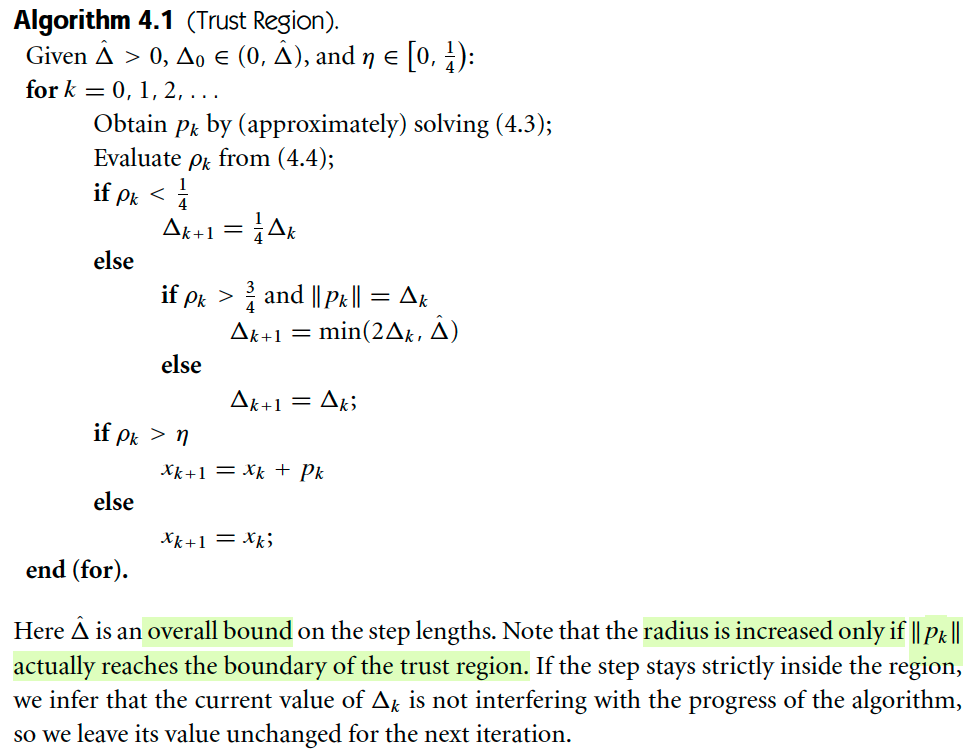</kbd>

> [!NOTE]
> Algorithm 4.1 (Trust Region)
>
> Iteratively lặp lại các bước k'th
>
> Tính pk là solution của bài toán minimizing over pk {mk(pk) = f(xk) + gkTpk + (1/2)pkBkpk s.t ||pk|| ≤ Δ
>
> Tính ρk = [f(xk) - f(xk + pk)] / [mk(0) - mk(pk)]
>
> Nếu ρk < 1/4 thì có nghĩa là hụt chân, vì mức giảm quá lớn so với thực tế → giảm trust region lại
>
> Nếu ρk > 3/4 và ||pk|| = Δ → chắc chân → tăng trust region
>
> còn ca ở giữa thì cứ giữ nguyên.
>
> Cuối cùng, nếu pk thỏa điều kiện > η (là giá trị chọn trước ∈ [0, 1/4]) thì mới thực hiện bước update xk+1 = xk + pk còn ngược lại thì giữ nguyên xk+1 = xk
>
> Chỉ có để ý là, nó chỉ tăng trust region lên nếu như ở bước trước đó, ||pk|| = Δk, có nghĩa nôm na là việc tìm kiếm ra điểm thấp nhất trong phạm vi cho phép cho ra điểm ngay trên biên. Điều này cùng với việc tỉ số ϱk "đạt" thì ta mới mở rộng trust region.

**🔗 See also:** [Hội tụ toàn cục điểm Cauchy](./42_trust_region_methods_global_convergence.md#node-edr7lqw) · [Convergence to Stationary Points](./42_trust_region_methods_global_convergence.md#node-k0era47) · [Thuật toán SR1 Vùng tin cậy](./62_the_sr1_method.md#node-fsif7wv) · [Phương pháp Trust-Region Newton CG](./71_inexact_newton_methods.md#node-8tkd9oh)

 

- **Bài toán (4.5) sẽ là minimize mk(p) = fk + gkTp + (1/2)pTBkp subject to ||pk|| ≤ Δk**

<kbd>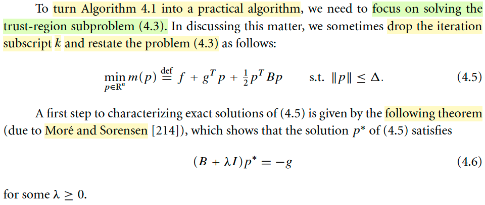</kbd>

> [!NOTE]
> Thế thì trong thuật toán vừa rồi, thì bước đầu tiên là giải bài toán tìm pk, (sau khi đã có trust region radius Δk
>
> Như đã biết, tại iteration k, đứng ở xk, ta tìm cách đến xk+1.
>
> Thì bài toán (4.5) sẽ là minimize mk(p) = fk + gkTp + (1/2)pTBkp subject to ||pk|| ≤ Δk 
>
> (gk là gradient tại k, ∇f(xk), Bk thì có khi là I, có thể là xấp xỉ của Hessian ∇^f(xk) hoặc có thể là ∇^f(xk))
>
> Cho gọn thì ta tạm bỏ đi subscript:
>
> minimize f + gTp + (1/2)pTBp subject to ||p|| ≤ Δ (
>
> Thì đại ý là, để giải bài toán này, ta sẽ dùng một theorem mà ta sẽ chứng minh sau, theorem này nói rằng: nếu p* là solution của bài toán 4.5 thì nó sẽ thõa:
>
> (B  + λI)p* = -g (4.6)
>
>
> #4.5, 4.6

**🔗 See also:** [4.3 Iterative Solution Of The Subproblem](./43_trust_region_methods_iterative_solution_of_the_subproblem.md#node-gal0ace) · [Proof of theorem 4.1: Lemma 4.7](./43_trust_region_methods_iterative_solution_of_the_subproblem.md#node-k08q2ml) · [Convergence of algorithms based on nearly exact solution](./43_trust_region_methods_iterative_solution_of_the_subproblem.md#node-tr8868m)

 

- **Theorem 4.1**

<kbd>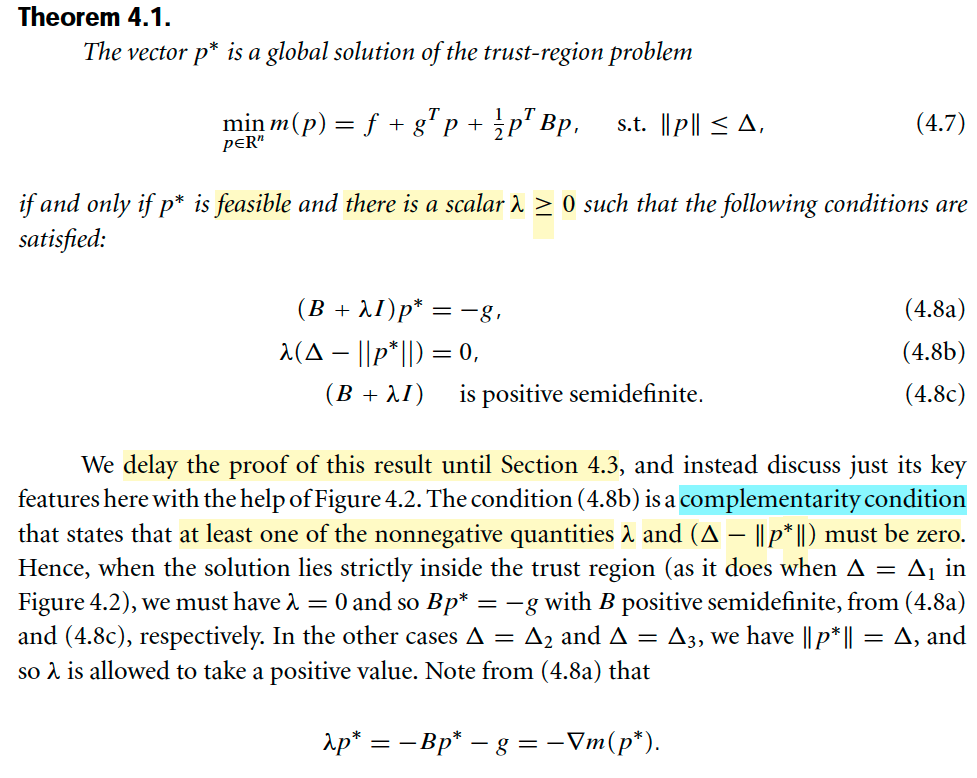</kbd>

<kbd>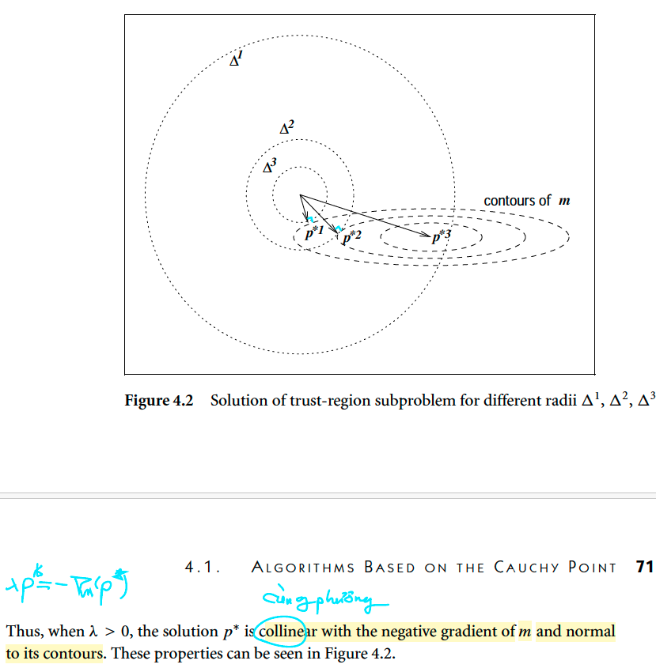</kbd>

> [!NOTE]
> Theorem 4.1
>
> Rồi, theorem vừa nhắc đến, nó rằng p* là global solution của bài toán minimize m(p) = f + gTp + (1/2)pTBp s.t ||p|| ≤ Δ KHI VÀ CHỈ KHI p* feasible và tồn tại λ ≥ 0 thỏa:
>
> (B + λI)p* = -g (4.8a)
>
> λ(Δ - ||p*||) = 0 (4.8b)
>
> (B + λI) xác định bán dương. (4.8c)
>
> Như đã nói, tác giả sẽ chưa chứng minh theorem này. Mà ta sẽ phân tích vài hệ quả trước. (sau đó, trước khi đọc tiếp, mình sẽ ôn lại KKT condition học ở Convex Optimization S.Boyd để chỉ ra thực ra mấy cái trên chính là KKT conditions)
>
> Vài nhận định cũng dễ hiểu thôi:  
>
> Thứ nhất: 
>
> vì thỏa 4.8b, λ(Δ - ||p*||) = 0 nên nếu Δ - ||p*|| > 0 thì λ phải = 0, và nếu λ > 0 thì (Δ - ||p*||) phải = 0 (cái này rõ ràng chính là complementary slackness)
>
> Thì ý nghĩa của nó, là, khi solution p* nằm TRONG trust region, tức ||p*|| < Δ ⇔ Δ - ||p*|| > 0 thì λ phải = 0, dẫn đến cùng với 4.8a và c ta phải có:
>
> Bp* = - g và B xác định bán dương.
>
> Còn ngược lại nếu minimizer xảy ra tại biên, ||p*|| = Δ thì λ phải dương. Khi đó 4.8a ⇔ Bp* + λp* = -g ⇔ λp* = - Bp* - g ⇔ λp* = - (Bp* + g)
>
> và đây chính là gradient của mk tại p* (không có gì khó hiểu sau khi đã học MIT 18s096)
>
> Vậy λp* = - ∇m(p*)
>
> Và phương trình này cho thấy p* CÙNG PHƯƠNG với nagative gradient, và mình thì đã biết gradient sẽ vuông góc với contour plot, nên ta kết luận p* sẽ vuông góc với contour plot.
>
> Có chỗ dễ gây lú: 
>
> Ta đứng tại xk, và giải bài toán minimize mk(p) = fk + gkTp + (1/2)pTBkp s.t ||p|| ≤ Δ, để có mk(p*) là điểm thấp nhất trong phạm vi cho phép.
>
> Thì thật ra bản chất ý nghĩa của việc xấp xỉ f(xk + p) ≈ f(xk) + gkTp + (1/2)pT Hk p nói rằng khi đi từ xk → ra khỏi xk thì trong phạm vi nào đó thì ta có thể xem nó hành xử như hàm quadratic.
>
> và nếu mình tìm ra p* là cái giảm thiểu cái này, thì cũng chính là p* dẫn ta từ xk đi đến xk + p* là điểm thấp nhất
>
> Nếu có thêm constraint thì có nghĩa là p* là hướng di chuyển (và sải bước) giúp ta đi từ xk đến xk + p* thấp nhất có thể trong phạm vi hình tròn (xk, Δk).
>
> Nên p* là hướng, là vector, vậy thì  ∇mk(p*) có nghĩa là sao? Đây là chỗ có thể gây bối rối.
>
> Câu trả lời đơn gỉan là: Thì nó có nghĩa là gradient của hàm mk tại p* chứ sao. Nhưng ở trên hình thì nó chính là xk + p*.
>
> Nói rõ hơn: mình phải nhận thức rõ, hàm mk(p), vì là hàm của p, mà bản chất là gì, là x - xk, vì mk(p) vốn xuất thân từ xấp xỉ bậc 2, cũng là Taylor expansion của f xung quanh xk:
>
> f(x) ≈ f(xk) + ∇f(xk)T(x-xk) + (1/2)(x-xk)T ∇^2f(xk) (x-xk) 
>
> Rồi ta mới lấy vế phải, đặt p = x - xk, và đăt hàm mk(p) = f(xk) + ∇f(xk)Tp + (1/2)p ∇^2f(xk) p
>
> Thì theo đó, sự tương ứng sẽ là: **Trong hệ quy chiếu x, ta đi từ xk → xk + p*, thì tương ứng với trong hệ quy chiếu p, thì ta đi từ p = 0, đến p = p***
>
> Nên nói về gradient của mk(.) tại p*, thì nó sẽ tương ứng với điểm xk + p* trong hệ quy chiếu x.
>
> Nói chung hiểu rõ như vậy thì ta sẽ không còn thắc mắc kiểu như ủa p* là hướng, ko phải là điểm (như xk, hay xk + p*) mà lại có ∇mk(p). Mà có thể hiểu p*, chính là tương ứng với xk + p* trong hệ trục tuyệt đối.
>
> Nên nếu ∇f(x)|x=xk + p* là vector gradient của hàm f thì ∇mk(p*) là vector gradient của hàm mk.

> [!TIP]
> **🤖 AI Feedback** — ✅ Score: **95/100**
>
> Ghi chú của bạn rất chính xác và thể hiện sự nắm vững xuất sắc các điều kiện của bài toán con vùng tin cậy, bao gồm cả hiểu biết sâu sắc về các phép biến đổi tọa độ cơ bản và sắc thái của việc diễn giải gradient.

**🔗 See also:** [4.3 Iterative Solution Of The Subproblem](./43_trust_region_methods_iterative_solution_of_the_subproblem.md#node-gal0ace) · [The Hard Case: Khi q1Tg = 0](./43_trust_region_methods_iterative_solution_of_the_subproblem.md#node-ty435bj) · [Proof of theorem 4.1: Lemma 4.7](./43_trust_region_methods_iterative_solution_of_the_subproblem.md#node-k08q2ml) · [Proof of theorem 4.1](./43_trust_region_methods_iterative_solution_of_the_subproblem.md#node-csqy8ix) · [Convergence of algorithms based on nearly exact solution](./43_trust_region_methods_iterative_solution_of_the_subproblem.md#node-tr8868m) · [Lemma 10.2: Trust-Region Solution](./103_algorithms_for_nonlinear_least_squares_problem.md#node-za3zjv6)

 

- **Lập luận lại KKT conditions.**

> [!NOTE]
> Lập luận lại cái KKT nhé:
>
> Đầu tiên, nhớ ý quan trọng này, **đối diện với bài toán inequality + equality constraint opt problem** có dạng: 
>
> minimize x {f0(x)} s.t fi(x) ≤ 0, hi(x) = 0, i = 1,2...
>
> Thì solution của bài toán này sẽ là một điểm x* feasible (thoả các constraint) và khiến f0(x) nhỏ nhất.
>
> Thì cái **lí luận của việc xây dựng Lagrangian function** đó là vì** ta muốn "tích hợp" cái constraint vào, để đưa về bài toán unconstraint**. Và ta làm bằng cách, gắn trọng số vào các inequality:
>
> Generalized Lagrangian function: L(x, λ, v) = f0(x) + Σi λi fi(x) + Σi vihi(x)
>
> Thế thì tuy tích hợp vào để thành bài toán unconstraint, nhưng **phải làm sao đó để phản ánh được constraint**, đó là ta muốn **fi(x) ≤ 0** và hi(x) = 0. 
>
> Vậy làm sao để khi minimize L theo x thì nó khiến fi(x) âm. Câu trả lời là phải **ràng buộc λi ≥0 **. Vì nếu không, quá trình tối ưu khi muốn minimize L sẽ đẩy fi(x) càng dương càng tốt vì điều này dẫn đến λifi(x) càng âm.→ Và fi(x) dương sẽ khiến vi phạm constraint.
>
> Do đó ta có một trong KKT conditions: λi ≥ 0, hay viết là λ ≽ 0 (vector λ)
>
> Thế thì, để minimize L over x, dĩ nhiên sẽ dẫn ta đến gradient của L wrt x = 0, vì đây là điều kiện cần bậc 1. Nên ta mới có ∇L(x*, λ, v) = ∇f0(x*) + Σi λi ∇fi(x*) + Σi vi ∇hi(x*) = 0. Đó chính là điều kiện KKT tiếp theo.
>
> Tiếp, khi mà ta đã minimize over x hàm Lagrangian, **thì Lagrangian tại đó, (tức tại x là solution của bài toán minimize over x hàm Lagrangian) sẽ không còn phụ thuộc vào x nữa**, nó là hàm theo λ và v. Đây là định nghĩa của **dual function**: g(λ, v) = inf x L(x, λ, v)
>
> và ta sẽ có một inequality:
>
> g(λ, v) ≤ L(x, λ, v) **với mọi x** do định nghĩa của dual function.
>
> Rồi. Tới đây nhận định thế này, nếu gọi **x* là solution của primal problem**, tức là **feasible point + minimize f0(x)** thì ta có: 
>
> g(λ, v) ≤ L(x*, λ, v) = f0(x*) + Σi λi fi(x*) + Σi νi hi(x*) (1)
>
> điều này là **đương nhiên, vì inequality này thỏa với mọi x** cơ mà. 
>
> Và vì x* thỏa constraint (x* trước hết phải là feasible point), nên: 
>
> λi × fi(x*) ≤ 0, (a) và 
>
> vi × hi(x*) = 0. (b)
>
> Giúp ta có: 
>
> g(λ, v) ≤ L(x*, λ, v) = f0(x*) + Σi λi fi(x*) + Σi νi hi(x*)
>
> = f0(x*) + Σi λi fi(x*) + 0 (do (b))
>
> ≤ f0(x*) (do (a))
>
>
> Vậy g(λ, v) ≤ f0(x*) 
>
> Mang ý nghĩa **dual function là lower bound của optimal value p* = f0(x*)**
>
> Vậy thì câu chuyện tiếp theo sẽ là, nếu đã nhận định g(λ, v) là lower bound của p*, tức f0(x*), thì ta **muốn tìm cái lower bound tốt nhất (tức cao nhất). **Bằng cách maximize over λ, v đối với g(λ,v), bài toán này gọi là **dual problem**.
>
> gọi d* là sup λ ≽ 0, v {g(λ, v)}. gọi là **dual optimal value**. Thì ta sẽ lại có inequality: 
>
> d* ≤ p*
>
> Điều này chỉ là hệ quả của g(λ, v) ≤ p* ⇨ max của nó vẫn sẽ ≤ p*
>
> Và p* - d* gọi là **duality gap**
>
> Tới đây, **có một theorem nói rằng** nếu như **trong bối cảnh convex problem** và **thỏa một số điều kiện gọi là qualification constraint**, thì ta sẽ có **strong duality**: d* = p*, hay zero duality gap (p* - d* = 0)
>
> d* = p*
>
> cũng là g(λ*, v*) = f0(x*)
>
> tức f0(x*) + Σi λ*ifi(x*) + Σi v*ihi(x*) = f0(x*)
>
> mà dĩ nhiên là hi(x*) = 0 vì x* là primal optimal nên dĩ nhiên feasible
>
> nên cái trên chỉ còn **Σi λ*ifi(x*) = 0** 
>
> và với fi(x*) ≤ 0, thì cái này cho thấy nếu fi(x*) âm thì λi phải bằng 0 và ngược lại nếu λi > 0 thì fi(x*) phải = 0.
>
> Và đây chính là một điều kiện KKT nữa, có tên là **complementary slackness**.
>
> Do đó KKT conditions bao gồm:
>
> Gradient của Lagrangian đối với x tại x* = 0 . Đây gọi là **stationary condition**
>
> **Complementary slackess**: Σi λ*ifi(x*) = 0 với mọi i
>
> λi* ≥ 0, đây gọi là **dual constraint**, tức constraint của dual problem
>
> fi(x*) ≤ 0, hi(x*) = 0. gọi là **primal constraint**, constraint của primal problem.
>
> Và một điểm lưu ý quan trọng: 
>
> Nếu như **bài toán lồi và thỏa constraint qualification**, ví dụ điển hình là Slater's condition. **Giải KKT giúp kết luận x* là global optimal** (tức là coi như điều kiện cần + đủ)
>
> Còn theo Gemini mới dạy mình, là v**ới bài toán khác, vẫn có thể dùng KKT condition**, nhưng **chỉ được dùng như điều kiện cần** (chứ chưa đủ)

> [!TIP]
> **🤖 AI Feedback** — ⚠️ Score: **80/100**
>
> Bài phân tích KKT của bạn thể hiện sự hiểu biết sâu sắc và mạch lạc về hầu hết các khía cạnh lý thuyết. Tuy nhiên, cần chỉnh sửa lại một số lập luận cốt lõi để đạt được sự chính xác tuyệt đối.

 

- **Nói sơ về nội dung sắp tới**

<kbd>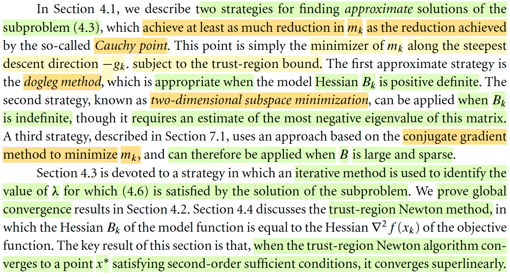</kbd>

> [!NOTE]
> Đại ý phần này nói sơ về nội dung sắp tới. 
>
> Section 4.1 sẽ bàn về cách giải solution của bài toán 4.3 - tức là bài toán minimize over p mk(p) constraint ||p|| ≤ Δ (mà ý nghĩa là từ xk đi tới đâu trong phạm vi vòng tròn chop phép đề xuống được thấp nhất nếu coi như đang đi trên cái bát quadratic mk). Thì có vài cách để giải bài toán này, tùy theo là Bk có tính chất gì.
>
> (nhớ lại: mk(p) = fk + ∇fkTp + (1/2)pT Bk p. Và Bk có thể chọn là ma trận xấp xỉ Hessian tại k hoặc cũng có thể là Hessian tại k, và mỗi cách chọn nó sẽ cho ra phương pháp khác)
>
> Thì nếu Bk xác định dương thì ta sẽ dùng phương pháp "dogleg"
>
> Nếu Bk không xác định thì dùng phương pháp "2D subspace minimization" 
>
> Và còn phương pháp thứ 3 nữa qua chương 7 mới nói, liên quan đến conjugate gradient.
>
> Qua phần 4.2 sẽ bàn về tốc độ hội tụ của mấy cái này.
>
> 4.3 thì bàn về một chiến thuật để dùng cách tiếp cận iterative để tính ra λ thỏa 4.6 (tức là (B + λI)p* = -g)
>
> 4.3 thì bàn về trust-region Newton method, chính là khi mà dùng Hessian tại k cho Bk nói ở trên. Và ta sẽ nói về đặc điểm của cái này là khi thuật toán này converge về một điểm x* có tính chất là thỏa điều kiện đủ bậc hai (tức là Hessian tại đó xác định dương đó) thì tốc độ hội tụ sẽ là siêu tuyến tính.

> [!TIP]
> **🤖 AI Feedback** — ❌ Score: **65/100**
>
> Bài làm cho thấy sự hiểu biết khá tốt về các phương pháp giải quyết bài toán phụ, nhưng mắc lỗi nghiêm trọng trong việc phân biệt nội dung giữa các phần, đặc biệt là Phần 4.3 và 4.4.

**🔗 See also:** [Trust Region Newton CG](./71_inexact_newton_methods.md#node-4fbrszp) · [Phương pháp Trust-Region Newton CG](./71_inexact_newton_methods.md#node-8tkd9oh)

 

