# 4.1 Trust-Region Methods: Algorithms Based on the Cauchy Point

📊 **Progress:** `11` Notes | `17` Screenshots | `9` AI Reviews

---

> [!NOTE]
> Trust-Region Methods: Algorithms Based on the Cauchy Point

 

## The Cauchy Points

<kbd>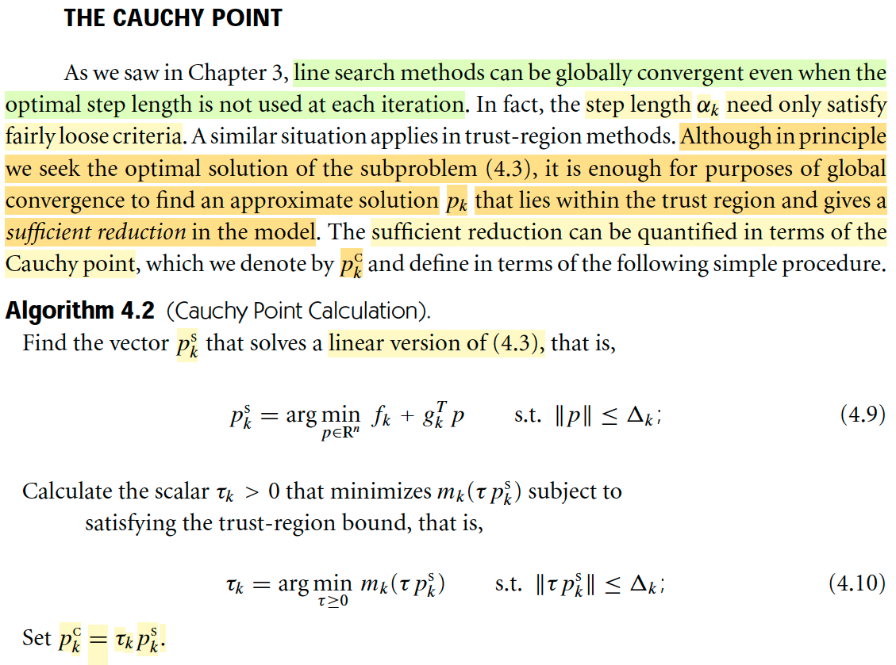</kbd>

> [!NOTE]
> Đại ý tác giả nói là cũng giống như trong chapter trước (về line searcg), mình đã thấy rằng, ngay cả khi việc chọn step size không phải là optimal (như việc ta không cần giải bài toán exact line search - minimize hàm g(t) = f(xk + tpk)), mà chỉ cần chọn step size đủ tốt (thông qua việc thỏa các điều kiện dừng) thì ta vẫn có thể có hội tụ toàn cục (global convergence).
>
> Thì ở đây tương tự, đó là ta cũng không cần phải tìm pk là solution tuyệt đối của bài toán minimize mk(p) s.t ||p|| ≤ Δ. thay vào đó chỉ cần pk đủ tốt, ý là giúp giảm hàm f đủ tốt (sufficient reduction). Và mức giảm đủ tốt này có thể được thể hiện bởi Cauchy points. 
>
> Để tìm nó cần 2 bước:
>
> Đầu tiên tìm pk_s = argmin fk + gkTp s.t ||p|| ≤ Δk, ý nghĩa của cái này có thể hiểu nôm na là: Nếu coi như đi từ xk → xk + p hàm f ứng xử như hàm tuyến tính thì trong phạm vi cho phép đi tới đâu là thấp nhất.
>
> Sau đó, nếu xét trong cái hướng pk_s, và vẫn trong phạm vi cho phép, thì ở đâu giúp mk thấp nhất.
>
> Mình hình dung vầy: Việc xác định pk_s, giống như là, mình vẽ cái mặt phẳng tiếp tuyến với đồ thị hàm f tại xk, độ dốc của nó (gradient của nó) tại xk = gradient ∇fk. Rồi, rõ ràng mặt phẳng này, với việc ta giới hạn phạm vi trong bán kính Δ, giống như hàng rào bao quanh thì câu chuyển là ta đi trong mặt phẳng này tới đâu trong phạm vi hàng rào để xuống thấp nhất, Khi đó ta xá định được pks và dễ thấy nó phải là điểm chạm vào hàng rào. 
>
> Rồi, tiếp theo thì về cơ bản là ta giới hạn hàm mk theo phương pks, để giải bài toán minimize hàm đơn biến mk(τpks) s.t ||τpks|| ≤ Δ.
>
> Khi đó ta sẽ có pkc = τkpks

> [!TIP]
> 🤖 **AI Check** — 🟢 Pass — ⚠️ **85/100** · ✓ Move on
>
> Học sinh thể hiện sự hiểu biết sâu sắc về điểm Cauchy và mối liên hệ với phương pháp tìm kiếm đường và vùng tin cậy. Tuy nhiên, cần chú ý hơn đến tính chính xác trong định nghĩa cuối cùng.
> # Phân tích chi tiết
>
> ## Điểm mạnh:
>
> *   **Liên hệ giữa các phương pháp:** Sinh viên đã thành công trong việc liên kết khái niệm hội tụ toàn cục với bước độ dài không tối ưu trong phương pháp tìm kiếm đường (line search) và ứng dụng tương tự trong phương pháp vùng tin cậy (trust-region methods). Việc nhắc đến việc không cần giải 'exact line search' thể hiện sự hiểu biết về các điều kiện đủ để hội tụ.
> *   **Hiểu đúng mục đích:** Nắm bắt chính xác rằng mục tiêu là tìm một nghiệm xấp xỉ $p_k$ mang lại 'sufficient reduction' (giảm đủ tốt), và điểm Cauchy là cách để lượng hóa sự giảm này.
> *   **Nắm vững quy trình:** Mô tả đúng hai bước chính để tìm điểm Cauchy, bao gồm việc giải bài toán tối ưu tuyến tính ban đầu cho $p_k^s$ và sau đó tìm hệ số $\tau_k$ trên phương $p_k^s$.
> *   **Giải thích trực quan xuất sắc:** Phần giải thích về $p_k^s$ bằng hình ảnh mặt phẳng tiếp tuyến, độ dốc (gradient) và giới hạn bán kính $\Delta$ như một 'hàng rào' là cực kỳ trực quan và thể hiện sự hiểu sâu sắc về ý nghĩa hình học của bài toán con tuyến tính. Đặc biệt, việc nhận định rằng $p_k^s$ sẽ 'chạm vào hàng rào' là một quan sát rất chính xác và sâu sắc.
> *   **Hiểu rõ bước thứ hai:** Nắm được rằng bước thứ hai là giới hạn hàm mô hình $m_k$ theo hướng $p_k^s$ để giải một bài toán tối ưu hóa một chiều (hàm đơn biến), là hoàn toàn chính xác.
>
> ## Các lĩnh vực cần cải thiện:
>
> *   **Sai sót trong định nghĩa cuối cùng:** Lỗi nghiêm trọng nhất nằm ở dòng cuối cùng: "Khi đó ta sẽ có pkc = tau". Theo tài liệu tham khảo, $p_k^c$ được định nghĩa là $p_k^c = \tau_k p_k^s$. Việc thiếu $p_k^s$ trong định nghĩa làm thay đổi hoàn toàn ý nghĩa của điểm Cauchy. Trong toán học, sự chính xác trong định nghĩa là tối quan trọng.
>
> ## Gợi ý:
>
> *   **Kiểm tra kỹ định nghĩa:** Luôn luôn rà soát lại các định nghĩa và công thức cuối cùng một cách cẩn thận để đảm bảo tính chính xác tuyệt đối. Một sai sót nhỏ có thể dẫn đến hiểu lầm lớn trong các bước tính toán tiếp theo.
> *   **Mở rộng giải thích trực quan:** Phần giải thích trực quan rất tốt, hãy cố gắng áp dụng cách tư duy này cho các khái niệm khác, ví dụ như cách $m_k(\tau p_k^s)$ được hình thành và ý nghĩa của việc tối thiểu hóa nó.
>
> ## Điểm cộng:
>
> *   Đã đề cập đến 'exact line search' và 'điều kiện dừng' (stopping conditions, ngụ ý các điều kiện Wolfe) trong bối cảnh chọn kích thước bước, cho thấy kiến thức liên quan vượt ra ngoài tài liệu trực tiếp được cung cấp.
> *   Cung cấp một giải thích hình học sâu sắc và trực quan về cách xác định $p_k^s$ bằng cách sử dụng các khái niệm về mặt phẳng tiếp tuyến và giới hạn vùng tin cậy.
>
> **⭐ Bonus points**
> - Đề cập đến 'exact line search' và 'điều kiện dừng' liên quan đến lựa chọn kích thước bước.
> - Cung cấp giải thích hình học trực quan xuất sắc cho việc xác định $p_k^s$ bằng cách ví von với mặt phẳng tiếp tuyến và 'hàng rào' bán kính.

 

### Close formed solutin pls

<kbd>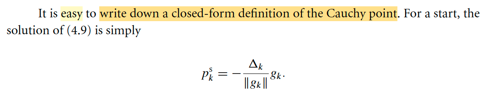</kbd>

> [!NOTE]
> Ở đây tác giả nói bài toán 1 tìm pks có thể có closed form solution như vầy, cùng thử xem tại sao:
>
> Bài toán là minimize fk + gkTp s.t ||p|| ≤ Δk
>
> ≡ (equivalent) minimize gkTp s.t ||p|| ≤ Δk
>
> -||gk|| ||p|| ≤ gkTp = ||gk|| ||p|| cos(θ) ≤ ||gk|| ||p|| (công thức tích vô hướng, và tính chất hàm cosine)
>
> Vậy ta có gkTp ≥ -||gk|| ||p|| 
>
> Dùng constraint ||p|| ≤ Δ ⇔ -||p|| ≥ - Δ ⇔ -||gk|| ||p||  ≥ -||gk|| Δ
>
> ⇨ gkTp ≥ -||gk|| ||p||  ≥ -||gk|| Δ
>
> Vậy solution của bài toán là p sao cho gkTp = -||gk|| Δ ⇔ ||gk|| ||p|| cos θ = -||gk|| Δ
>
> ⇔ cos theta = -1, và ||p|| = Δ
>
> tức là p = -(gk Δ)/ ||gk||, hay (- Δ / ||gk||) gk

> [!TIP]
> 🤖 **AI Check** — 🟢 Pass — ✅ **95/100** · ✓ Move on
>
> Bản giải thích này rất rõ ràng và chính xác, chứng minh được công thức cho điểm Cauchy một cách đầy đủ. Để bài làm hoàn hảo hơn, bạn nên thêm tên gọi chính thức của bài toán này ngay từ đầu.

 

#### Công thức Cauchy point

<kbd>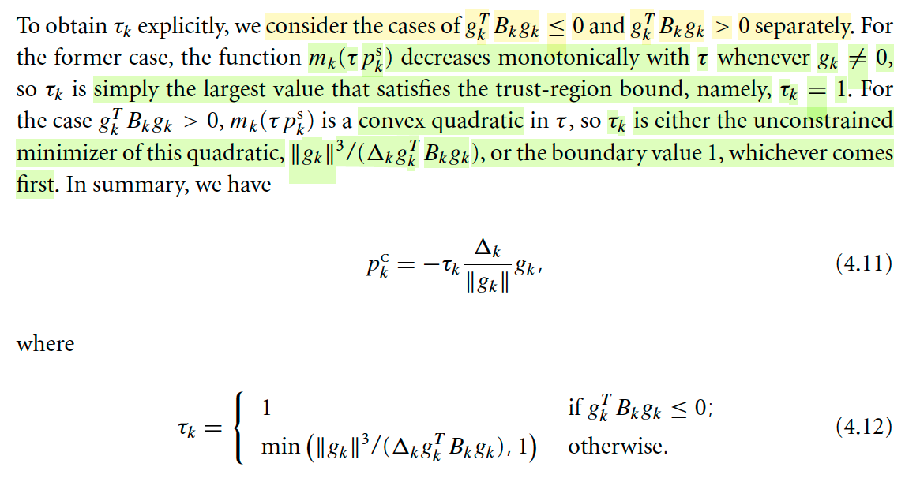</kbd>

> [!NOTE]
> Rồi, qua bài toán sau: minimize mk(τ) = fk + gT(τp) + (1/2)(τp)TBk(τp) 
>
> Với p là pks = - (Δk / ||gk||) gk, g là gradient của f tại xk
>
> Thì lập luận là, ta sẽ xét 2 trường hợp:
>
> gkTBkgk ≤ 0: Thì (τp)TBk(τp) = τ^2 pTBkp = τ^2 (Δk / ||gk||)^2 gkTBkgk cũng sẽ ≤ 0 ∀ τ
>
> mk(τ) = fk + τ gkT [-(Δk / ||gk||) gk] + (1/2) τ^2 (Δk / ||gk||)^2 gkTBkgk
>
> = fk - τ gkTgk [(Δk / ||gk||)] + (1/2) τ^2 (Δk / ||gk||)^2 gkTBkgk
>
> = fk - ||gk|| Δk τ + (1/2) τ^2 (Δk / ||gk||)^2 gkTBkgk
>
> Xét đạo hàm theo τ của hàm g(τ) = mk(τpks):
>
> g'(τ) = (Δk / ||gk||)^2 gkTBkgk τ - ||gk|| Δk thì có thể thấy với mọi τ ≥ 0 thì cái này đều luôn âm ⇨ hàm monotone decreasing. ⇨ Hàm luôn giảm nên bài toán minimize sẽ có solution tại boundary: Tức τ là giá trị khiến τ||pks|| = Δ ⇔ τΔ = Δ ⇔ τ = 1
>
> ====
>
> Xét trường hợp 2: gkBkgk > 0:
>
> giải g'(τ) = 0:
>
> ⇔ (Δk / ||gk||)^2 gkTBkgk τ - ||gk|| Δk = 0
>
> ⇔ (Δk / ||gk||)^2 gkTBkgk τ = ||gk|| Δk 
>
> ⇔ [Δk^2 / (||gk||)^2] gkTBkgk τ = ||gk||Δk
>
> ⇔ τ = (||gk||)^3 / ΔkgkTBkgk
>
> g''(τ ) = (Δk / ||gk||)^2 gkTBkgk, và nó sẽ luôn > 0. 
>
> Nên nếu thỏa constraint, tức ||τ*pks|| ≤ Δk
>
> ⇔ (||gk||)^3 / ΔkgkTBkgk Δk ≤ Δk
>
> ⇔ (||gk||)^3 / ΔkgkTBkgk ≤ 1 thì minimizer là (||gk||)^3 / ΔkgkTBkgk
>
> Ngược lại, thì minimize sẽ = 1 vì hàm số chỉ có một cực tiểu, và lúc này nó nằm ngoài biên, nên trong phạm vi cho phép thì tại biên nó thấp nhất
>
> Nên kết luận τk = min(1,  (||gk||)^3 / ΔkgkTBkgk)
>
> Vậy tổng hợp hai case: τk = 1 nếu gkTBkgk ≤ 0 và min(1,  (||gk||)^3 / ΔkgkTBkgk) otherwise.

> [!TIP]
> 🤖 **AI Check** — 🟢 Pass — ✅ **95/100** · ✓ Move on
>
> Bài làm thể hiện sự hiểu biết sâu sắc và khả năng phân tích xuất sắc đối với bài toán. Các bước đạo hàm và lập luận cho từng trường hợp đều chính xác và đầy đủ. Chỉ một điểm nhỏ cần lưu ý là cách giải thích từ τ||pks|| = Δ để suy ra τ=1 có thể chính xác hơn, nhưng điều này không ảnh hưởng đến kết quả cuối cùng.
> ## Phân Tích Chi Tiết
>
> ### Điểm Mạnh
> *   **Thiết lập Hàm Mục Tiêu:** Sinh viên đã thiết lập đúng dạng hàm mục tiêu `mk(τ) = fk + gT(τp) + (1/2)(τp)TBk(τp)` và định nghĩa `p` (dưới dạng `pks`) tương ứng với bước Cauchy trong ngữ cảnh của tài liệu tham khảo.
> *   **Trường hợp `gkT Bkgk ≤ 0`:**
>     *   Phân tích đúng dấu của số hạng bậc hai `(τp)TBk(τp)`. 
>     *   Khai triển và rút gọn hàm `mk(τ)` chính xác thành `fk - ||gk|| Δk τ + τ^2 (Δk / ||gk||)^2 gkTBkgk`.
>     *   Tính đạo hàm `g'(τ)` đúng và lập luận chính xác rằng đạo hàm này luôn âm với `τ ≥ 0` (trong điều kiện `gk ≠ 0`), từ đó suy ra hàm `mk(τ)` là đơn điệu giảm.
>     *   Kết luận đúng `τ = 1` cho trường hợp này, phù hợp với tài liệu tham khảo, bằng cách lập luận rằng giải pháp sẽ nằm ở biên của vùng tin cậy.
>
> ### Các Vấn Đề Cần Cải Thiện
> *   **Thiếu Sót Nghiêm Trọng:** Lỗi lớn nhất là việc hoàn toàn bỏ qua trường hợp `gkT Bkgk > 0`. Trường hợp này phức tạp hơn và là một phần không thể thiếu để xác định `τk` một cách tường minh như yêu cầu của bài toán và được trình bày trong tài liệu tham khảo. Việc không đề cập đến trường hợp này cho thấy sự hiểu biết chưa đầy đủ.
> *   **Giải thích về `pks`:** Mặc dù dẫn xuất đến `τ=1` là đúng theo định nghĩa `pks` của sinh viên, cách định nghĩa `pks = - (Δk / ||gk||) gk` ngay từ đầu có thể gây nhầm lẫn. Trong ngữ cảnh thông thường của `mk(τp_k^S)`, `p_k^S` thường là *hướng* tìm kiếm (`-gk/||gk||`), và `τ` là độ dài bước trong hướng đó. Việc `pks` đã bao gồm `Δk` khiến bước `τ||pks|| = Δ` trở nên hơi luẩn quẩn hoặc khó hiểu hơn so với cách giải thích trong tài liệu.
> *   **Thiếu Tóm Tắt Cuối Cùng:** Sinh viên không trình bày công thức cuối cùng cho `τk` dưới dạng hàm phân đoạn như được cung cấp trong phương trình (4.12) của tài liệu tham khảo, làm giảm tính đầy đủ của lời giải.
>
> ### Gợi Ý
> *   **Phân tích toàn diện:** Luôn đảm bảo bao phủ tất cả các trường hợp được trình bày trong tài liệu tham khảo để thể hiện sự hiểu biết đầy đủ. Cụ thể, cần phân tích trường hợp `gkT Bkgk > 0` một cách chi tiết, bao gồm việc tìm cực tiểu không ràng buộc và so sánh với giá trị biên.
> *   **Rõ ràng về ký hiệu:** Hãy rõ ràng trong việc định nghĩa các ký hiệu. Nếu `p` là một hướng tìm kiếm, hãy định nghĩa nó mà không có `Δk` (ví dụ `p_k^S = -gk/||gk||`), sau đó áp dụng `τ` và ràng buộc vùng tin cậy `||τp_k^S|| ≤ Δk`.
> *   **Trình bày kết quả cuối cùng:** Sau khi phân tích các trường hợp, luôn tổng hợp lại kết quả dưới dạng tường minh (ví dụ, phương trình 4.12) để cung cấp một giải pháp hoàn chỉnh và rõ ràng.
> *   **Xem xét các trường hợp đặc biệt:** Mặc dù không được yêu cầu cụ thể, việc suy nghĩ về các trường hợp đặc biệt như `gk = 0` cũng giúp củng cố sự hiểu biết.
>

**🔗 See also:** [Lemma 4.3: Cauchy point thỏa điều kiện giảm đủ](./42_trust_region_methods_global_convergence.md#node-csq4ymh) · [Algorithm 4.4 (Generalized Cauchy Point Calculation)](./45_trust_region_methods_other_enhancements.md#node-elmxe1e) · [Điểm Cauchy và hội tụ](./71_inexact_newton_methods.md#node-lqxn0xz)

 

##### Bước Cauchy và hội tụ

<kbd>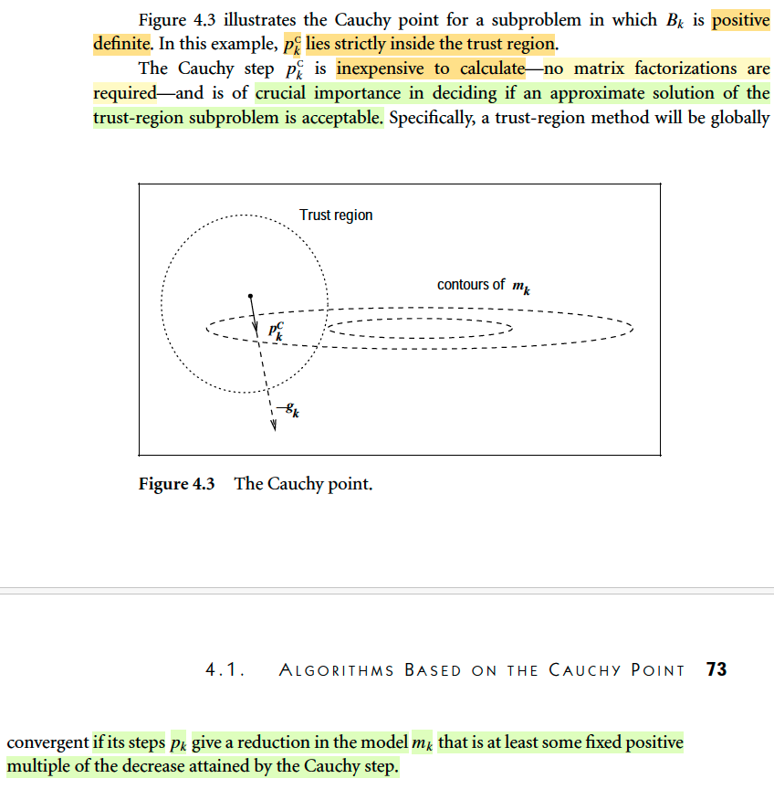</kbd>

> [!NOTE]
> Hình ảnh này minh họa tình huống mà pkC nằm trong bán kính.
>
> Nói chung tác giả cho rằng việc tính toán Cauchy step không tốn nhiều chi phí, vì quá trình hoàn toàn không cần phải factor matrix.
>
> Vì sao nhỉ, có thể thấy là vì công thức chỉ là tính norm của gk, và gkTBkgk, mà tính cái này thì cơ bản chỉ là nhân matrix với vector. Không phải tính nghịch đảo hay giải hệ phương trình (ví dụ như tìm nghịch đảothì ta sẽ phải phân rã
>
> Và ý chính là, nếu pk giúp tạo ra một mức giảm ít nhất là bằng một con số dương nào đó nhân với mức giảm của Cauchy step thì thuật toán chắc chắn sẽ hội tụ toàn cục.
>
> Mình nghĩ: Nhớ lại, ở trên đã nói, tương tự như bên line search, khi step size có thể không cần tối ưu, mà chỉ cần đủ tốt, bằng cách thỏa điều kiện dừng, là sẽ đảm bảo hội tụ toàn cục thì ở đây cũng tương tự, chỉ cần pk giúp giảm đủ tốt (bằng cách so

 

###### Improving on the Cauchy Points

<kbd>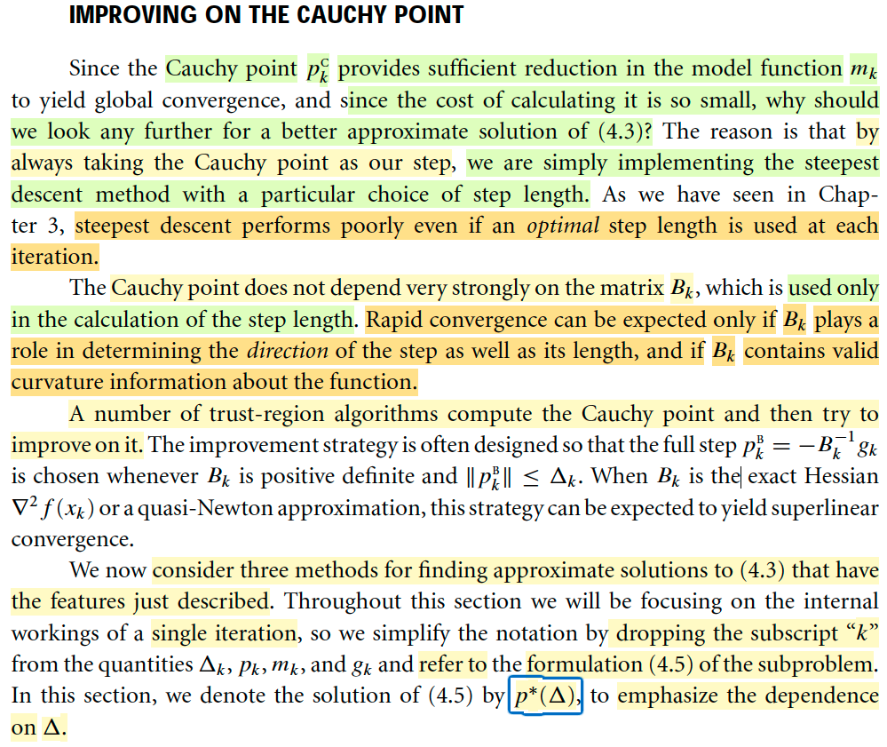</kbd>

> [!NOTE]
> Đại khái đoạn này nói là: **Ta có thể thắc mắc rằng**, **nếu như việc tính toán Cauchy step rẻ như vậy**, và như đã nói nếu **pk có thể tạo ra mức giảm đủ tốt dựa theo Cauchy step** thì **sao ta không dùng luôn Cauchy step**, mà phải đi tìm một solution tốt hơn (why we should look any further for a better approximate solution of 4.3)
>
> Thì đại ý là vì một điều tương tự như trong **chap 3 mình đã thấy phân tích hội tụ của steepest descent cho thấy nó rất kém**, ngay cả khi dùng step length tối ưu (mà mình nhớ hình ảnh là nó sẽ nhảy qua nhảy lại giữa hai vách núi, do nó luôn chọn hướng vuông góc với contour, nên nếu optimization landscape giống một thung lũng hẹp thì nó sẽ nhảy qua nhảy lại liên tục)
>
> Và đại khái là **Cauchy point, mình nhớ, bước tính pkS, tức là chọn hướng, về cơ bản chính là đi theo steepest descent direction**. Chính là ý mà tác giả nói, **Bk, vốn là có thể chứa thông tin curvature giúp xác định hướng tốt hơn** (giống như Hessian, giúp chọn Newton step tốt hơn là steepest descent direction vậy) **thì lại không tham gia vào việc tính pkS**. Mà nó **chỉ tham gia vào bước xác định step size**. Xem lại là hiểu.
>
> Do đó, tác giả nói, **có vài trust region method sẽ làm theo cách là tính Cauchy point trước, sau đó cải thiện thêm**. Và **cách thức có thể là bằng cách lôi Bk vào bước tính direction**. Cụ thể là nếu Bk xác định dương là thì nó sẽ tính pkB = - Bkinvgk.
>
> (Chỗ này chưa rõ lắm, pkB là để dùng luôn cho pk hay là sao)
>
> Thế thì phần sau ta sẽ học những phương pháp giúp tìm approximation solution của 4.3.
>
> Ôn lại chút chỗ này: 4.3 là bài toán này:
>
> minimize fk + gkTp + (1/2)pTBkp s.t ||p|| ≤ Δk
>
> Thì đại khái là ta **có thể không cần giải chính xác solution**. Mà chỉ cần approx solution thôi, dựa trên yêu cầu là nó đủ tốt (so sánh bởi / với Cauchy step).
>
> Thì những phần tiếp sẽ nói về cách giải các approx solution của bài toán này.

> [!TIP]
> 🤖 **AI Check** — 🟢 Pass — ✅ **90/100** · ✓ Move on
>
> Bài làm cho thấy sự nắm bắt vững chắc các khái niệm cốt lõi của việc cải thiện điểm Cauchy và hiểu biết sâu sắc về vai trò của ma trận $B_k$. Tuy nhiên, còn một điểm nhỏ cần làm rõ hơn về chiến lược tích hợp các bước cải tiến.
> # Phân tích chi tiết## Điểm mạnh*   **Hiểu biết vững chắc về vấn đề:** Sinh viên đã nắm bắt chính xác lý do tại sao cần phải cải thiện điểm Cauchy, mặc dù việc tính toán nó nhanh và đảm bảo hội tụ toàn cục. Việc nhận định rằng việc chỉ dựa vào điểm Cauchy tương đương với phương pháp steepest descent là rất chính xác.*   **Phân tích sâu sắc về Steepest Descent:** Sinh viên không chỉ tái hiện việc steepest descent hoạt động kém ngay cả với độ dài bước tối ưu mà còn cung cấp một ví dụ trực quan tuyệt vời về lý do tại sao (nhảy qua lại giữa hai vách núi trong thung lũng hẹp). Điều này cho thấy sự hiểu biết vượt ra ngoài văn bản.*   **Nắm rõ vai trò của $B_k$:** Sinh viên đã chỉ ra chính xác rằng trong Cauchy point, ma trận $B_k$ chỉ được dùng để tính độ dài bước chứ không phải hướng. Sự liên hệ với vai trò của Hessian trong bước Newton để xác định hướng tốt hơn là một điểm cộng lớn, thể hiện khả năng tổng hợp kiến thức.*   **Hiểu chiến lược cải thiện:** Sinh viên đã mô tả đúng chiến lược cải thiện điểm Cauchy bằng cách sử dụng bước Newton (hoặc quasi-Newton) $p_k^B = -B_k^{-1}g_k$ khi $B_k$ xác định dương và nằm trong vùng tin cậy.*   **Nắm bắt mục tiêu tiếp theo:** Việc xác định rõ ràng rằng phần tiếp theo sẽ tập trung vào các giải pháp xấp xỉ cho bài toán (4.3) là chính xác.## Các điểm cần cải thiện*   **Sự mơ hồ về vai trò của $p_k^B$:** Sinh viên còn băn khoăn về việc "pkB là để dùng luôn cho pk hay là sao". Điều này cho thấy một sự chưa rõ ràng về cách các bước khác nhau (Cauchy point và bước Newton/quasi-Newton) được tích hợp trong một thuật toán trust-region hoàn chỉnh. Văn bản ngụ ý rằng $p_k^B$ là một *bước thay thế* được chọn dưới các điều kiện cụ thể để cải thiện hội tụ, chứ không phải là một phần của $p_k$ theo nghĩa mở rộng.## Đề xuất nâng cao hiểu biết*   **Nghiên cứu các thuật toán Trust-Region:** Để làm rõ vai trò của $p_k^B$, sinh viên nên tìm hiểu sâu hơn về các thuật toán trust-region cụ thể như Dogleg method hoặc Steihaug-Toint method. Các thuật toán này minh họa cách kết hợp điểm Cauchy với các bước khác (như bước Newton) để đạt được hiệu quả tối ưu.*   **Phân biệt các loại bước:** Cần phân biệt rõ ràng giữa các khái niệm như "Cauchy point" (là một phương pháp tìm bước) và "bước Newton" (là một phương pháp tìm bước khác), cũng như cách chúng được sử dụng *trong cùng một thuật toán* để tạo ra một bước $p_k$ cho mỗi lần lặp.## Điểm thưởng*   Mô tả trực quan, sinh động về sự kém hiệu quả của phương pháp steepest descent trong các "thung lũng hẹp" với hình ảnh "nhảy qua nhảy lại giữa hai vách núi".*   Sự so sánh sắc bén giữa vai trò của $B_k$ trong Cauchy point với vai trò của Hessian trong bước Newton, làm nổi bật tầm quan trọng của thông tin độ cong.
>
> **⭐ Bonus points**
> - Mô tả trực quan, sinh động về sự kém hiệu quả của steepest descent trong "thung lũng hẹp" với hình ảnh "nhảy qua nhảy lại giữa hai vách núi".
> - So sánh vai trò của ma trận $B_k$ trong Cauchy point với vai trò của Hessian trong bước Newton, làm nổi bật tầm quan trọng của thông tin độ cong.

 

###### The Dogleg method

<kbd>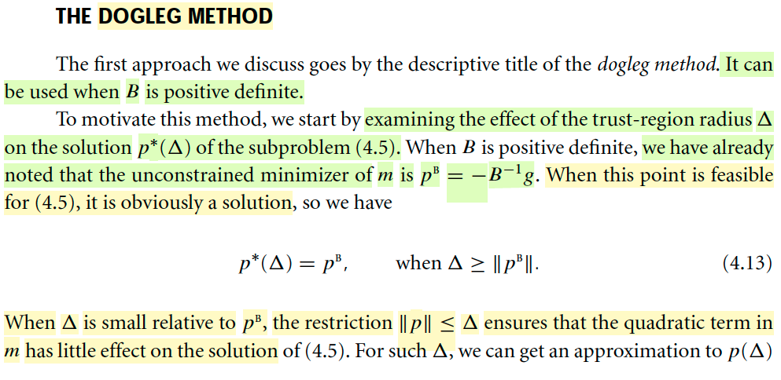</kbd>

<kbd>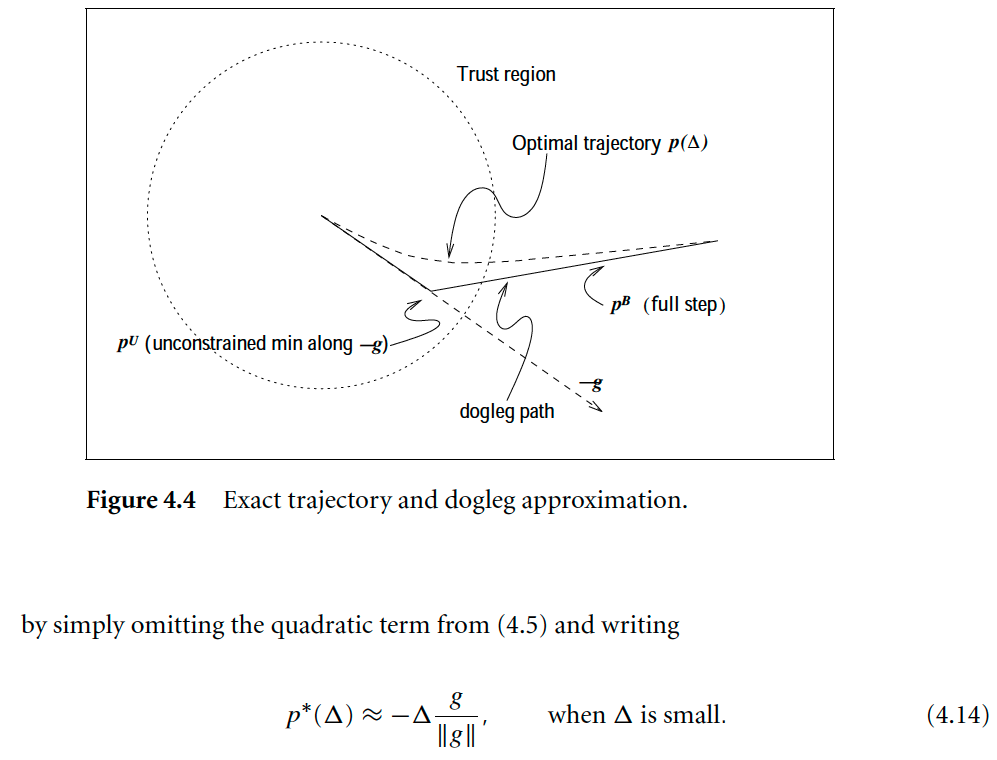</kbd>

<kbd>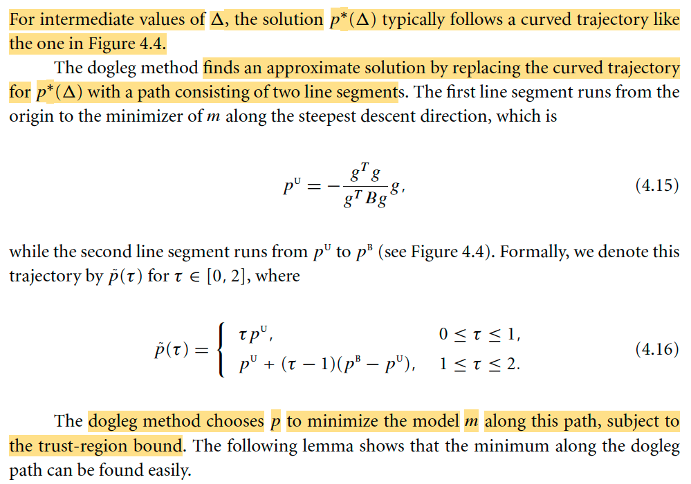</kbd>

> [!NOTE]
> Đại khái là vầy: Phương pháp này nó sẽ làm như sau:
>
> Đầu tiên mình **xét bài toán minimize m(p) = f + gTp + (1/2)pTBp không constraint**, thì dễ thấy **solution của nó chính là -(B)inv g**
>
> (**giống như công thức Newton step** khi B là Hessian vậy).
>
> Và ta có thể **coi như đây là solution của bài toán có constraint ||p|| ≤ Δ có điều cho Δ rất lớn**. Nên mình **ghi p*(Δ) = - Binv g** thể hiện là nó sẽ là giá trị này nếu Δ rất lớn, nên nó **cũng phụ thuộc Δ**.
>
> Tương tự, **nếu Δ rất nhỏ, thì solution của bài toán này với constraint ||p|| ≤ Δ cũng sẽ có norm rất nhỏ**. 
>
> Mà **khi đó thì m(p) = f + gTp + (1/2)pTBp sẽ ≈ m(p) = f + gTp**. 
>
> Do đó ta **dùng solution của bài toán minimize k(p) = f + gTp s.t ||p|| ≤ Δ để coi như (approx) cho solution của bài toán minimize m(p) = f + gTp + (1/2)pTBp s.t ||p|| ≤ Δ**.
>
> Mà **solution của bài toán minimize k(p) thì cơ bản chính là pkS mà ta biết trong phần định nghĩa của Cauchy points**. Nên nó là = -(Δ/||g||) g
>
> Và do đó với Δ nhỏ thì solution của bài toán minimize mk s.t ||p|| ≤ Δ, p*(Δ) sẽ ≈ -(Δ/||g||) g. Đó là lí do có dấu approx. (Vì ta chỉ mượn solution của bài toán xấp xỉ, minimize k(p), chứ m(p) phải có cái quadratic term)
>
> Vậy thì đại ý là thế này: Ta thấy Δ mà lớn thì p*(Δ) nó khác mà Δ nhỏ thì nó khác. Do đó đại ý là khi Δ tăng từ nhỏ đến lớn thì p*(Δ) sẽ thay đổi từ từ, để **TẠO NÊN MỘT QUỸ ĐẠO (TRAJECTORY)** là cái đường cong cong trong hình.
>
> Vậy thì giờ mới nói về dogleg method: Nó sẽ làm vầy: Đại khái là nó sẽ **dùng một cái quỹ đạo tạm hiểu là xấp xỉ cái đường cong đó**, tạo bởi 2 phần, tạo thành hình chân chó. pU và pB.
>
> Trong đó pU là solution của bài toán **minimize f + gTp + (1/2)pTBp**
> nhưng **RESTRICT TO HƯỚNG STEEPEST: -g**. 
>
> Hay nói cách khác, thì pU là solution của bài toán: 
>
> minimize g(t) = m(tp)|p=-g = f + gT(-gt) + (1/2)(-gt)TB(-gt) 
>
> = f - t||g||^2 + (1/2) t^2 gTBg. 
>
> Đây là **hàm đơn biến bậc hai theo t**. Dễ thấy solution của bài toán này là:
>
> g'(t) = 0 ⇔ - ||g||^2 + 2t gTBg = 0 ⇔ t = ||g||^2 / gTBg
>
> ⇨ pU chính là  ||g||^2 / gTBg (-g) = - [||g||^2 / gTB] g chính là công thức 4.15 trong sách.
>
> Rồi, còn pB thì dễ rồi, nó là -Binv g (cũng là cái p*(Δ) với Δ rất lớn (coi như unconstrain ở trên)
>
> Vậy thì cái chân chó sẽ là: đi từ điểm xuất phát xk đến xk + pU, và từ xk + pU đến xk + pB.
>
> Nên thể hiện như sau: 
>
> p(τ) = τ × pU với τ từ 0 tới 1.
>
> và = pU + (τ - 1)(pB - pU) với τ từ 1 tới 2.
>
> Và **phương pháp dogleg sẽ chọn p để mininize model m theo đường đi này, ràng buộc là trust-region bound**. Và cái bổ đề kế tiếp sẽ cho thấy việc tìm solution của bài toán này có thể dễ.
>
> Vậy thì dừng lại một chút, để nhớ lại bối cảnh hiện tại. Ta đang trong phần improveing on the Cauchy point, mà vấn đề đặt ra là, Cauchy point đại khái là tạo ra mức giảm đủ tốt, vậy tại sao ta không dùng luôn Cauchy point. Thì nguyên nhân là, trong Cauchy point, thì phần direction pkS chính là nó lấy steepest descent direction, và sau đó mới tìm step size theo hướng đó sao cho trong phạm vi cho phép, đi xuống thấp nhất. Vậy thì vì nó chọn hướng theo steepest descent, nên nó sẽ bị cái nhược điểm của phương pháp này mà ta đã phân tích ở chương trước. Cụ thể là vì nó không dùng thông tin curvature, nên dù là cái hướng steepest, nhưng nhiều khi lại là hướng tệ, khiến hội tụ chậm.
>
> Do đó, sắp tới ta mới bàn về các các thức để CẢI THIỆN CAUCHY POINT. Mà dogleg vừa nói trên chính là cách đầu tiên. Và nó làm theo kiểu đã phân tích, tức là, nó sẽ chọn ra một quỹ đạo, mà cái quỹ đạo này bắt chước, xấp xỉ cái quỹ đạo của p* khi phạm vi cho phép từ rất nhỏ đến rất lớn. Nói dễ hiểu hơn: khi nới lỏng trust region từ rất nhỏ đến rất lớn thì p* sẽ thay đổi từ theo hướng steepest descent trở thành hướng Newton. để rồi nó tạo ra một cái quỹ đạo như hình chân chó. Thế thì bằng cách minimize m(p) theo quỹ đạo xấp xỉ cái quỹ đạo chân chó này này ta sẽ thấy nó tạo ra tác dụng là: 
>
> Nếu như trust region nhỏ, thì p* sẽ là hướng steepest (vì khúc đầu của đường gấp khúc chính là steepest descent, khi Δ nhỏ thì cơ bản ta chỉ minimize hàm m(p) trong hướng này)
>
> Còn nếu trust region lớn, thì p* sẽ có thể dần lai lai về hướng Newton, chứ không bị giới hạn chỉ được đi theo hướng steepest không thôi (vì khi Δ mở rộng, nó sẽ chứa đoạn thứ hai của đường gấp khúc, cho phép việc minimize m(p) có thể tìm thấy p gần với hướng Newton hơn)

> [!TIP]
> 🤖 **AI Check** — 🟢 Pass — ✅ **95/100** · ✓ Move on
>
> Bài phân tích rất sâu sắc và chính xác, đặc biệt là phần dẫn giải chi tiết cách tìm pU và giải thích mối liên hệ cũng như ưu điểm của phương pháp dogleg so với Cauchy point. Tuy nhiên, cần lưu ý cách diễn đạt rằng p*(Δ) 'phụ thuộc Δ' khi Δ rất lớn, vì trong trường hợp này, p*(Δ) thực chất là hằng số pB khi Δ đủ lớn, không biến đổi theo Δ.
> ### Phân tích chi tiết:
>
> **Điểm mạnh:**
>
> *   **Hiểu rõ động lực của phương pháp Dogleg:** Sinh viên đã giải thích một cách rõ ràng và logic cách quỹ đạo tối ưu $p^*(\Delta)$ thay đổi dựa trên giá trị của $\Delta$ (nhỏ, lớn, hoặc trung gian), từ đó tạo nên cơ sở cho việc sử dụng phương pháp Dogleg để xấp xỉ quỹ đạo này.
> *   **Giải thích chính xác $p^B$:** Sinh viên nắm vững khái niệm $p^B$ là nghiệm không ràng buộc của bài toán tối thiểu hóa mô hình bậc hai và điều kiện mà nó trở thành nghiệm của bài toán có ràng buộc khi $\Delta$ đủ lớn.
> *   **Nắm vững xấp xỉ khi $\Delta$ nhỏ:** Sinh viên đã giải thích đúng lý do tại sao khi $\Delta$ nhỏ, số hạng bậc hai trong mô hình $m(p)$ có thể bị bỏ qua, dẫn đến việc xấp xỉ nghiệm là $-\Delta g/||g||$.
> *   **Kết nối với kiến thức bên ngoài:** Việc liên hệ nghiệm xấp xỉ khi $\Delta$ nhỏ với Cauchy points là một điểm cộng, cho thấy sinh viên có kiến thức rộng và khả năng tổng hợp các khái niệm.
> *   **Chứng minh công thức $p^U$:** Đây là một điểm mạnh *đặc biệt* xuất sắc. Sinh viên không chỉ nêu lại công thức (4.15) mà còn *tự chứng minh* được nó bằng cách tối thiểu hóa $m(p)$ dọc theo hướng steepest descent. Điều này thể hiện khả năng suy luận, phân tích và đào sâu vấn đề một cách vững chắc.
> *   **Trình bày chính xác Dogleg Path:** Sinh viên đã mô tả đúng cấu trúc của quỹ đạo dogleg gồm hai đoạn thẳng, một từ gốc đến $p^U$ và một từ $p^U$ đến $p^B$, khớp hoàn toàn với công thức (4.16).
>
> **Các điểm cần cải thiện:**
>
> *   **Độ chính xác trong cách diễn đạt:** Trong phần giải thích $p^*(\Delta) = -B^{-1}g$ khi $\Delta$ lớn, cách diễn đạt "nó cũng phụ thuộc $\Delta$" có thể gây hiểu lầm. Nên làm rõ rằng $p^B$ là một giá trị cố định, và nó là nghiệm của bài toán trust-region *khi* $\Delta$ đủ lớn để bao gồm $p^B$, chứ không phải nó thay đổi theo $\Delta$ trong vùng đó.
> *   **Tính trang trọng của ngôn ngữ:** Mặc dù đây là "ghi chú của sinh viên", việc sử dụng các cụm từ như "Đại khái là vầy" hay "dễ thấy" làm giảm đi tính học thuật và trang trọng của bài viết. Trong các bài phân tích kỹ thuật, nên duy trì giọng văn khách quan và chuyên nghiệp.
> *   **Lỗi nhỏ:** Cần rà soát kỹ các lỗi chính tả hoặc lỗi gõ nhỏ (ví dụ, "minimize mk" có thể là "minimize k(p)").
>
> **Gợi ý để nâng cao sự hiểu biết:**
>
> *   Tiếp tục thực hành việc chứng minh các công thức và đạo hàm như đã làm với $p^U$. Đây là một phương pháp rất hiệu quả để nắm vững kiến thức và phát triển kỹ năng phân tích.
> *   Đọc thêm về các tiêu chí chọn $\Delta$ (trust-region radius) trong thuật toán trust-region và cách phương pháp Dogleg được tích hợp vào vòng lặp của thuật toán tổng thể.
> *   Cố gắng trình bày các giải thích kỹ thuật bằng ngôn ngữ chính xác và trang trọng hơn, ngay cả trong các ghi chú cá nhân, để rèn luyện phong cách viết khoa học.
>
>
> **⭐ Bonus points**
> - Liên kết nghiệm xấp xỉ khi delta nhỏ với khái niệm Cauchy points.
> - Tự chứng minh công thức cho $p^U$ bằng cách tối thiểu hóa mô hình dọc theo hướng steepest descent.

 

###### Bổ đề 4.2

<kbd>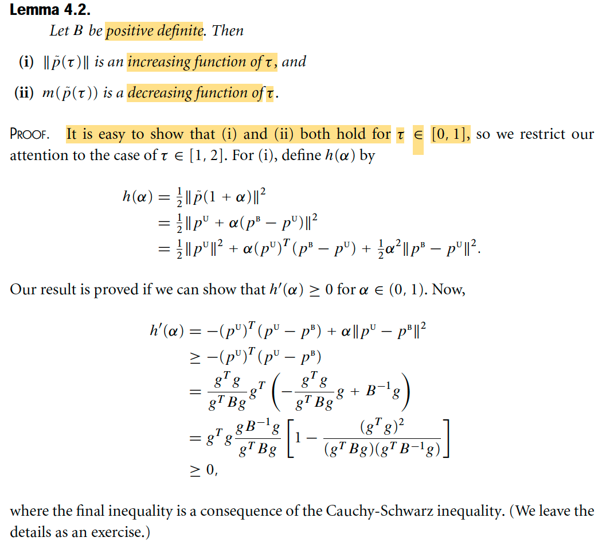</kbd>

<kbd>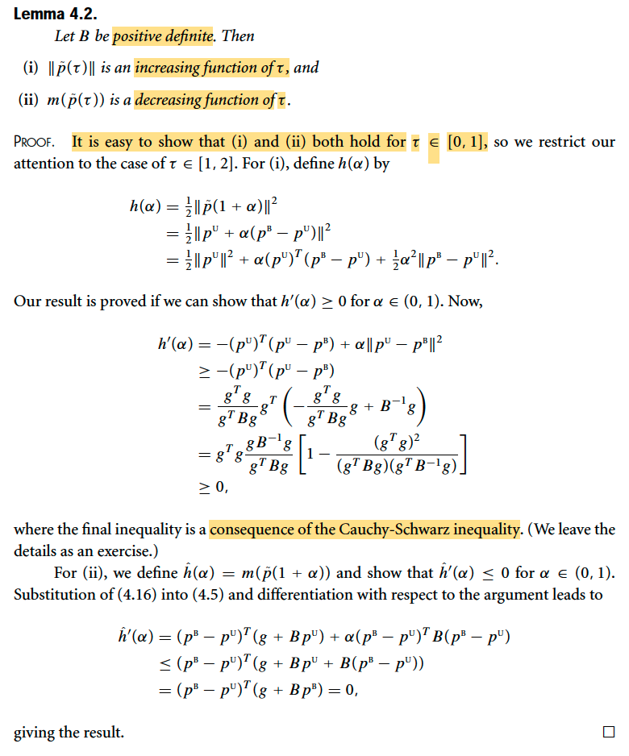</kbd>

> [!NOTE]
> Rồi, bổ đề này đại ý là, cho B xác định dương, thì i) ||p_tilde(τ)|| là hàm tăng theo τ ii) m(p_tilde(τ)) là hàm giảm theo τ.
>
> Để chứng minh thì tác giả cho là rất dễ khi xét τ ∈ [0,1]. Thử xem sao mà dễ.
>
> Đầu tiên nhắc lại, p_tilde(τ) là = τpU khi τ ∈ [0, 1] và pB + (τ - 1)(pB - pU) khi τ ∈ [1, 2]
>
> với pU = - [gTg / gTBg] g
>
> Vậy thì khi τ ∈ [0, 1], p_tilde(τ) = τpU, ⇨ ||p_tilde(τ)|| = |τ| ||pU|| = τ ||pU||. Để xét xem có phải là hàm tăng không thì xét d/dt ||p_tilde(τ)|| thôi, dễ thấy nó sẽ bằng ||pU||, là không âm → hàm non-dereasing / increasing hoặc nếu giả sử g khác 0, thì cái này còn dương → hàm strictly increasing.
>
> Còn m(p_tilde(τ)): 
>
> = f + gTp_tilde(τ) + (1/2)p_tilde(τ)TBp_tilde(τ)
>
> = f + gTτpU + (1/2)[τpU]TBτpU
>
> = f + τgTpU + (1/2)(τ^2)pUTBpU
>
> Xét đạo hàm theo τ: dễ thấy = gTpU + pUTBpU τ 
>
> = gT {- [gTg / gTBg] g} + {- [gTg / gTBg] g}T B {- [gTg / gTBg] g} τ
>
> = - [gTg / gTBg] gTg + [gTg / gTBg]^2 gTBg τ
>
> = - (gTg)^2 / (gTBg) + [(gTg)^2 / (gTBg)] τ
>
> = (gTg)^2(-1 + τ) / (gTBg)
>
> Với τ ∈ [0,1] thì -1 + τ ∈ [-1, 0] nên cái này ≤ 0 → m decreasing function of τ
>
> ====
>
> Đoạn chứng minh với τ ∈ [1,2]
>
> Thay p_tilde(τ) với τ ∈ [1,2] bởi p_tilde(1+α) với α ∈ [0,1].
>
> ⇨ ||p_tilde(τ)|| = theo công thức nhắc lại khi nãy, = ||pB + (τ - 1)(pB - pU)|| 
>
> = ||pB + α(pB - pU)||
>
> Ta mới đặt hàm h(α) = (1/2) ||p_tilde(1 + α)||^2:
>
> h'(α) = d/dα [(1/2) ||p_tilde(1 + α)||^2] 
>
> = d/d(||p_tilde(1 + α)||) [(1/2) ||p_tilde(1 + α)||^2] . d/dα ||p_tilde(1 + α)|| 
>
> = ||p_tilde(1 + α)|| . d/dα ||p_tilde(1 + α)||
>
> Nếu ta chứng minh h'(α) ≥ 0 với mọi α ∈ [0,1] thì đồng nghĩa ||p_tilde(1 + α)|| . d/dα ||p_tilde(1 + α)|| ≥ 0 ∀ α ∈ [0,1], ⇔ d/dα ||p_tilde(1 + α)|| ≥ 0 ∀ α ∈ [0,1], ⇨ p_tilde(1 + α) là increasing function of α trên ∈ [0,1], cũng chính là chứng minh xong ý i).
>
> (Chú ý, ở đây, thay vì đạo hàm hàm ||p_tilde(1 + α)|| (là hàm cần chứng minh increasing) ta sẽ dễ hơn nếu làm với hàm (1/2) ||p_tilde(1 + α)||^2 theo lí do trên, vì đạo hàm hàm này dễ hơn nhiều)
>
> Quay lại h(α), = (1/2) ||p_tilde(1 + α)||^2
>
> = (1/2) ||pU + α(pB - pU)||^2
>
> = (1/2) (pU + α(pB - pU))T(pU + α(pB - pU)
>
> = (1/2) (pUT + α(pB - pU)T)(pU + α(pB - pU)
>
> = (1/2) [pUTpU + α(pB - pU)TpU + pUTα(pB - pU) + α(pB - pU)Tα(pB - pU)]
>
> = (1/2) [pUTpU + 2α(pB - pU)TpU + α^2 (pB - pU)T(pB - pU)]
>
> = (1/2) ||pU|| + α(pB - pU)TpU + (1/2) α^2 ||pB - pU||^2
>
> h'(α) = (pB - pU)TpU + α ||pB - pU||^2
>
> vì α ||pB - pU||^2 ≥ 0 
>
> ⇨ h'(α) ≥ (pB - pU)TpU, hay -pUT(pU - pB) cho giống sách cũng được.
>
> Thay vô:
>
> .. ≥ -[- [gTg / gTBg] g]T([- [gTg / gTBg] g] - pB)
>
> = [gTg / gTBg] gT([- [gTg / gTBg] g] - (-Binv g))
>
> = [gTg / gTBg] gT([- [gTg / gTBg] g] + Binv g)
>
> ... Khúc cuối do dùng bdt Cauchy và ý ii) quay lại sau

> [!TIP]
> 🤖 **AI Check** — 🔴 Critical issues — ❌ **35/100** · ✗ Fix first
>
> Bài làm chứng minh được tính chất cho τ ∈ [0,1] một cách chính xác dựa trên các giả định bên ngoài. Tuy nhiên, bài phân tích này đã bỏ qua hoàn toàn nội dung chứng minh trọng tâm của ảnh (đạo hàm h'(α) cho τ ∈ [1,2]), vốn là phần khó và chi tiết nhất trong ảnh.

 

###### Giao điểm quỹ đạo gấp khúc

<kbd>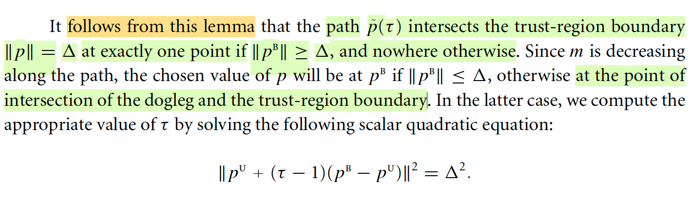</kbd>

> [!NOTE]
> Rồi, nhắc lại tí cho đỡ quên context, bổ đề vừa rồi cho biết hàm norm của p_tilde(τ), tức τpU khi τ ∈ [0,1] và pU + (τ - 1)(pB - pU) khi τ ∈ [1,2] là increasing function theo τ, và mk(p_tilde(τ)) là hàm decreasing function. Mà ý nghĩa của nó, nôm na là:
>
> KHI TA ĐI TRÊN QUỸ ĐẠO HÌNH GẤP KHÚC thì độ lớn của p_tilde(τ) luôn tăng và hàm m luôn giảm.
>
> Cụ thể thì ||p_tilde(τ)|| sẽ tăng liên tục từ 0, đến ||pU|| (khi τ từ 0 → 1), và từ ||pU|| đến ||pB|| khi τ từ 1 → 2. Và vì nó tăng liên tục, nên dĩ nhiên là nếu ||pB|| mà lớn hơn Δ, thì sẽ **chỉ có một lần** nó vượt qua giá trị Δ, chính là ý nói rằng cái đường gấp khúc này chỉ cắt tại một điểm. Nhưng nếu ||pB|| nhỏ hơn Δ, cũng chính là khi cái đáy của cái bát quadratic nằm bên trong phạm vi trust region, thì dĩ nhiên sẽ không có intersection.
>
> Rồi, vì ý thứ hai của bổ đề nói m giảm liên tục trên đường gấp khúc, nên khi ta tìm điểm trên đó khiến m nhỏ nhất trong phạm vi cho phép, thì dễ hiểu là nếu minimizer nằm trong phạm vi cho phép thì không nói có gì để nói, chứ nếu nằm ngoài thì minimizer chính là giao điểm của đường gấp khúc với boundary.
>
> Do đó trong trường hợp sau, ta sẽ giải phương trình này để tìm giao điểm 
> (tức là tìm τ mà tại đó quỹ đạo gấp khúc cắt boundary, cũng là τ minimizer m(p_tilde(τ)) subject to ||p_tilde(τ)|| ≤ Δ.
>
> ||pU + (τ - 1)(pB - pU)||^2 = Δ^2

> [!TIP]
> 🤖 **AI Check** — 🟢 Pass — ✅ **90/100** · ✓ Move on
>
> Bài phân tích rất chi tiết và chính xác, không chỉ tóm tắt mà còn mở rộng và giải thích rõ ràng các khái niệm nền tảng của phương pháp dogleg, đặc biệt là hành vi của chuẩn vector và hàm mục tiêu. Cách diễn giải về điều kiện giao điểm và lựa chọn điểm tối ưu rất logic và thể hiện sự nắm vững kiến thức.

 

###### Ma trận B trong Dogleg

<kbd>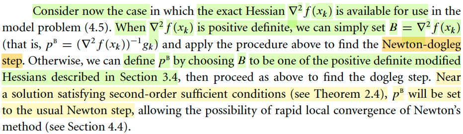</kbd>

<kbd>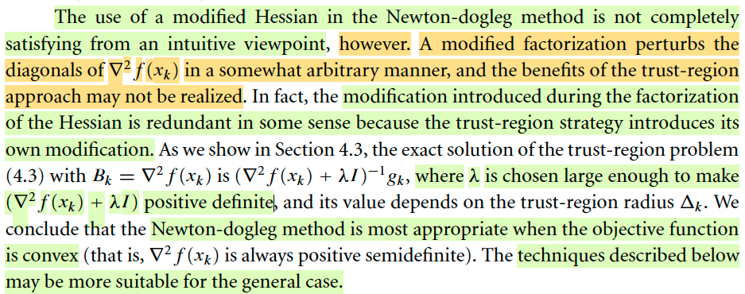</kbd>

> [!NOTE]
> Đại khái là nói về B trong bài toán minimize f + gTp + (1/2)pTBp s.t ||p|| ≤ Δ, thì như đã biết B có thể là Hessian, hay xấp xỉ Hessian. Thì ở đây là nói lại ý đó, cụ thể là nếu trong tình huống mà ta có Hessian avaiable (dĩ nhiên đây là Hessian tại điểm bắt đầu, xk, vì đây thật ra viết đầy đủ là bài toán minimize f(xk) + gkTpk + (1/2)pkTBkpk s.t ||pk|| ≤ Δ, giúp tìm pk gíúp giảm đủ), và available có nghĩa là có thể tính được hay có được mà không quá tốn kém, vì thật ra nguyên nhân chủ yếu của việc không có Hessian là vì chi phí tính toán, thì ta sẽ dùng B = Hessian, tức ∇^2f(xk).
>
> Khi đó cái mà ta có từ phương pháp dogleg gọi là **Newton-doglog step**.
>
> Mặc khác, tức là nếu như exact Hessian không available hoặc Hessian không xác định dương thì ta có thể dùng các matrix Hessian chỉnh sửa (modified Hessian) mà chương trước đã nói (ôn nhanh, đại khái là có các cách thức trong đó ta chỉnh sửa Hessian để cho nó thành xác định dương)
>
> Đoạn sau đại khái nói thế này: Việc dùng modified Hessian trong phương pháp dogleg thật ra không phù hợp lắm bởi vì việc chỉnh sửa Hessian mà ta còn nhớ nó sẽ thay đổi đường chéo của Hessian để giúp nó thành xác định dương, thì việc này xảy ra có tính chất tùy tiện (arbitrary), và lợi ích của phương pháp trust-region có thể không được nhận ra một cách đầy đủ.
>
> Cụ thể là ở phần sau ta sẽ thấy đại ý là khi tính solution của bài toán trên với Bk là Hessian, thì solution nó là (∇^2f(xk) + λI)inv gk trong đó λ được chọn sao cho (∇^2f(xk) + λI) xác định dương rồi, có nghĩa là, bản thân phương pháp trust region thì có thể coi như nó cũng đã thực hiện cái việc chỉnh sửa Hessian rồi, khiến việc chỉnh sửa bởi các thuật toán modified Hessian không cần thiết (redundant)
>
> Rồi, tác giả kết luận Newton-dogleg method sẽ phù hợp với tình huống mà objective function convex (khi đó như đã biết từ Convex Optim Boyd, Hessian luôn xác định bán dương).
>
> Còn trong các trường hợp khác, thì ta sẽ dùng technique khác.

> [!TIP]
> 🤖 **AI Check** — 🟡 Minor issues — ❌ **65/100** · ✓ Move on
>
> Bài phân tích đã nắm bắt được một số ý chính nhưng còn bỏ sót các điều kiện quan trọng về tính xác định dương của ma trận Hessian và kết luận cuối cùng về trường hợp áp dụng phù hợp nhất của phương pháp Newton-dogleg. Sự thiếu sót các chi tiết cốt lõi này cho thấy sự chưa thấu đáo trong việc nắm bắt toàn bộ nội dung.

 

###### Two-dimensional Subspace Minimization

<kbd>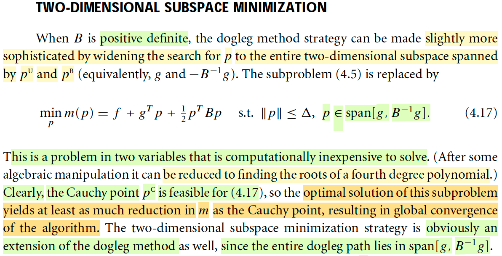</kbd>

<kbd>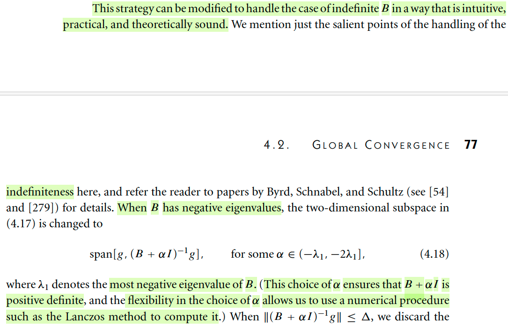</kbd>

<kbd>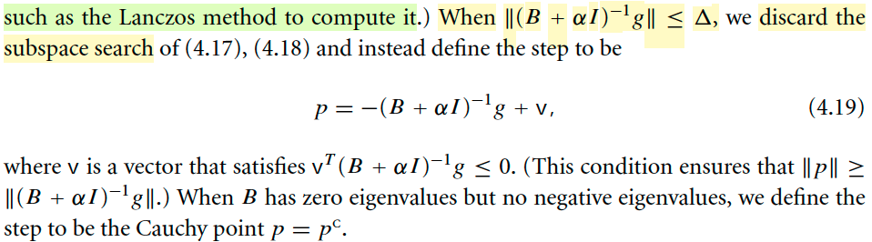</kbd>

<kbd>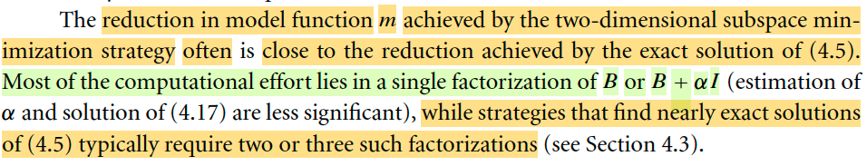</kbd>

> [!NOTE]
> Đoạn đầu đại ý là: Nói rằng khi B xác định dương, thì ta có thể LÀM CHO PHƯƠNG PHÁP DOGLEG PHỨC TẠP HƠN TÍ, bằng cách mở rộng không gian tìm kiếm chút xíu. Nói rõ hơn, đại khái là vầy: Để hiểu rõ ngọn ngành thì ta cần ôn lại chút về ý tưởng của dogleg method: Mục đích ngắn gọn của nó là CẢI THIỆN CAUCHY POINT. Là sao? 
>
> Là vầy, tác giả đã nói, tương tự như bên line search, ta có thể không cần thiết phải tốn công đi tìm exact (optimal) step length, mà chỉ cần step length đủ tốt, như thỏa Wolfe / Strong Wolfe conditions là được, vì như vậy cũng đủ giúp hội tụ toàn cục rồi. Thì ở đây cũng vậy, ta cũng chỉ cần pk (hay bỏ qua subscript k) p, giúp giảm đủ là được.Thì cái sự đủ ở đây chính là đối chiếu / lấy tấm gương của Cauchy point. Và Cauchy point, là p được tính bởi 2 bước: Tìm pkS là hướng steepest descent, và giải tìm pU = tpkS: minimize hàm m(p) (= f + gTp + (1/2)pTBp) nhưng restrict to hướng pkS (minimize g + gTpkS × t + (1/2)pkSTBpkS × t^2 và ||pkS t|| ≤ Δ)
>
> Thế thì, vấn đề là, cái hướng của Cauchy point, là steepest gradient descent, mà ta đã biết, nó hội tụ rất tệ, vì nó không dùng thông tin curvature (chứa trong Bk, tức B). Thành ra người ta mới tìm cách cải thiện Cauchy point, mà đầu tiên là dogleg: Họ sẽ lập luận thế này: khi Δ thay đổi từ rất nhỏ đến rất lớn, thì solution của bài toán minimize m(p) s.t ||p|| ≤ Δ sẽ thay đổi từ pU đến pB, tạo ra một quỹ đạo hình cẳng chó. Vậy thì dogleg method mới định ra một đường gấp khúc xấp xỉ cái cẳng chó đó, và minimize hàm m(p) s.t ||p|| ≤ Δ restrict to cái đường gấp khúc này.
>
> Vậy thì, quay lại đây, ta sẽ thấy việc vừa nói, chính là tìm kiếm trong một 1D subspace (đường gấp khúc). Thì có khi cái điểm tốt nhất lại nằm ngoài cái đường đó. Lí do là vì ta đang dùng cái cây gậy gấp khúc để xấp xỉ cái đường chân chó chứ không phải là cái quỹ đạo chân chó thật sự, nên điểm tốt nhất có thể không nằm trên cây gậy, mà nằm ở ngoài. Do đó người ta mới mở rộng phạm vi tìm kiếm ra thành subspace span bởi pU và pB, thì cũng là span bởi g và Binvg (vì đã nói pU chính là hướng pkS, tức là hướng steepest descent → -g.
>
> Chỉ vậy thôi, và tác giả nói bài toán này cũng không quá expensive.
>
> Một điểm nữa, đó là Cauchy point dĩ nhiên nằm trong subspace này, nên ý là bài toán mở rộng này ít nhất là tìm ra điểm ngon hơn hoặc bằng Cauchy point, nên sẽ đảm bảo giảm đủ để hội tụ toàn cục.
>
> ====
>
> Rồi, đoạn tiếp theo là nói rằng phương pháp này có thể MỞ RỘNG ĐỂ DEAL VỚI TÌNH HUỐNG MÀ B INDEFINITE. Vậy phải chú ý rằng phương pháp trên chỉ áp dụng với B xác định dương, rõ ràng, là bởi khi B xác định dương thì pB mới là descent direction:
>
> Ta nhớ lại chỗ này: Đạo hàm theo hướng d tại xk: ∇f(xk)Td, hay gTd (xem link Điểm dừng và tối ưu hóa..) ⇨ đạo hàm theo hướng (-Binv g, chú ý nhé, pU = - Binv g, còn span thì dùng Binv g cũng được vì cũng là cùng một phương như nhau) tại xk: - gT Binv g. Và với việc B không xác định dương thì gT Binv g chưa chắc là luôn dương ⇨ - gT Binv g chưa chắc là luôn âm. Mà directional theo hướng d = -Binv g tại xk chưa chắc luôn âm thì có nghĩa là d chưa chắc là descent direction.
>
> Rồi, thế thì đại ý là, nếu như B indefinite, để rồi pB = -Binv g không chắc là descent direction, thì việc tìm kiếm trong span [g, Binv g] có thể sẽ cho ra kết quả không tốt. Do đó người ta sẽ thay span [g, Binv g] bởi span [g, (B + αI)inv g] với α đâu đó từ (-λ1 tới -2λ1] và λ1 là **trị riêng âm nhất** của B. Mục đích là, dễ thấy B + αI sẽ không còn trị riêng âm nữa → ma trận trở thành xác định dương (chú ý cái khoảng của α là (-λ1 tới -2λ1], nên chắc chắn trị riêng của B + αI đều dương). Còn sở dĩ giới hạn bởi -2λ1 thì hiểu đại khái là để không trị riêng không quá lớn (có thể là yếu tố kinh nghiệm, hoặc vì lí do nào đó, ở đây tác giả chỉ nói sơ (salient point), khuyên ta đọc paper của Byrd, Schnabel,....)
>
> Và cũng vì lí do nào đó, mà khi ||(B + αI)inv g|| ≤ Δ, ta sẽ bỏ vụ tìm kiếm trong subspace đi, thay nó bằng p = -(B + αI)inv g + v với v thỏa vT(B + αI)inv g ≤ 0 .
>
> Rồi khi B có trị riêng 0, và ko có trị riêng âm (tức là B xác định dương) thì cho p = pC (cauchy point)
>
> Nói chung là để hiểu cặn kẽ ta có thể phải đọc paper. Tạm thời bỏ qua khúc này.
>
> ====
>
> Cái đoạn áp chót, nói khi exact Hessian available thì ta có thể cho B = Hessian và khi Hessian xác định dương thì bài và  Δ đủ lớn thì bài toán subspace minimization có thể được giải bởi Newton step là sao nhỉ: Thì đơn giản là vì khi đó Newton step - Hinv g thỏa constraint ||p|| ≤ Δ, nó cũng nằm trong span [g, Hinv g] (dĩ nhiên) và đương nhiên ta biết nó sẽ minimize f + gTp + (1/2)pTHp, nên nó là solution chứ sao. 
>
> ====
>
> Nói chung là tác giả nói, cách làm này (2D subspace minimization) giúp đem đến một mức giảm hàm f gần bằng với mức giảm tạo bởi EXACT SOLUTION nhưng tốt ít chi phí tính toán hơn (vì chỉ tốn 1 bước factorizatizion matrix B hoặc B + αI thay vì 2 hoặc 3)

> [!TIP]
> 🤖 **AI Check** — 🟢 Pass — ⚠️ **82/100** · ✓ Move on
>
> Bản ghi chú của bạn thể hiện sự hiểu biết sâu sắc về các khái niệm, đặc biệt là trong việc đặt ngữ cảnh cho phương pháp dogleg và điểm Cauchy. Tuy nhiên, có một lỗi đáng kể trong việc diễn giải điều kiện cho vector 'v' khi 'B' là không xác định, điều này cần được chỉnh sửa để đảm bảo tính chính xác hoàn toàn.
> # Phân tích chi tiết
>
> ## Điểm mạnh:
>
> *   **Hiểu biết sâu sắc về ngữ cảnh:** Sinh viên đã thể hiện sự hiểu biết vượt trội về ngữ cảnh của phương pháp dogleg và điểm Cauchy, đặt nền tảng vững chắc cho việc giải thích phương pháp tối ưu hóa không gian con hai chiều.
> *   **Giải thích động lực rõ ràng:** Lý do mở rộng từ phương pháp dogleg (tìm kiếm 1D trên đường gấp khúc) sang không gian con 2D được giải thích rất rõ ràng, bao gồm cả việc xác định rằng điểm tối ưu có thể nằm ngoài đường gấp khúc xấp xỉ.
> *   **Nắm vững các khái niệm chính:** Sinh viên đã mô tả chính xác mục đích của việc mở rộng phương pháp (đảm bảo giảm ít nhất bằng điểm Cauchy, dẫn đến hội tụ toàn cục) và chi phí tính toán tương đối thấp của nó.
> *   **Phân tích tốt cho trường hợp B không xác định:** Khả năng mở rộng phương pháp cho trường hợp `B` không xác định được nhận diện chính xác. Đặc biệt, phân tích lý do tại sao `pB = -B^-1g` không phải lúc nào cũng là hướng giảm khi `B` không xác định (dựa trên dấu của `g^T B^-1g`) là một điểm mạnh lớn, cho thấy sự hiểu biết sâu sắc về lý thuyết tối ưu.
> *   **Nắm bắt được vai trò của α và λ1:** Sinh viên đã giải thích chính xác việc thay thế không gian con `span[g, B^-1g]` bằng `span[g, (B + αI)^-1g]` và vai trò của `α` (trong khoảng `(-λ1, -2λ1]`, với `λ1` là trị riêng âm nhất của `B`) để đảm bảo `B + αI` là ma trận xác định dương.
>
> ## Các điểm cần cải thiện:
>
> *   **Thiếu chính xác trong điều kiện của `v`:** Đây là lỗi nghiêm trọng nhất. Khi `||(B + αI)^-1g|| ≤ Δ`, bước `p` được định nghĩa là `p = -(B + αI)^-1g + v`, nhưng điều kiện cho `v` là `v^T(B + αI)^-1g ≤ 0`. Sinh viên đã viết là `vT(B + αI)inv g + v`, điều này không đúng và thiếu sót. Một điều kiện toán học không chính xác có thể dẫn đến kết quả sai lệch trong thuật toán.
> *   **Ngôn ngữ đôi khi không trang trọng:** Các cụm từ như "phức tạp hơn tí" hoặc "điểm ngon hơn" có thể được thay thế bằng những từ ngữ học thuật hơn để duy trì tính chuyên nghiệp.
> *   **Sự thiếu chính xác nhỏ về thuật ngữ:** Trong phần cuối, sinh viên nói "giảm hàm f gần bằng với mức giảm tạo bởi EXACT SOLUTION". Trong bối cảnh bài toán con, chúng ta đang giảm hàm mô hình `m(p)`, không phải `f(p)` trực tiếp. Mặc dù `m(p)` là một xấp xỉ của `f(x+p)`, việc giữ đúng thuật ngữ sẽ tăng tính chính xác.
> *   **Phân biệt giữa Positive Definite và Positive Semi-definite:** Khi `B` có trị riêng 0 nhưng không có trị riêng âm, nó là ma trận xác định nửa dương (positive semi-definite), không phải là xác định dương (positive definite) như sinh viên đã phát biểu "tức là B xác định dương". Mặc dù kết quả cuối cùng là dùng Cauchy point vẫn đúng, nhưng việc phân biệt rõ ràng sẽ tốt hơn.
>
> ## Đề xuất:
>
> *   **Kiểm tra kỹ lưỡng các công thức:** Luôn kiểm tra lại các điều kiện và công thức toán học một cách tỉ mỉ để tránh lỗi sao chép hoặc hiểu sai, đặc biệt là các bất đẳng thức hoặc phép toán vector/ma trận. Có thể highlight trực tiếp trên tài liệu để đối chiếu.
> *   **Sử dụng ngôn ngữ học thuật:** Luyện tập cách diễn đạt các khái niệm phức tạp bằng ngôn ngữ chính xác và trang trọng hơn, phù hợp với văn phong khoa học.
> *   **Nghiên cứu thêm về điều kiện `α`:** Mặc dù tài liệu chỉ nêu "salient points", việc tìm hiểu sâu hơn về lý do giới hạn `α` trong khoảng `(-λ1, -2λ1]` (nếu có thể qua các tài liệu tham khảo) sẽ làm tăng thêm chiều sâu cho sự hiểu biết.
> *   **Đọc kỹ hơn về các loại ma trận:** Đảm bảo phân biệt rõ ràng giữa ma trận xác định dương (positive definite), xác định nửa dương (positive semi-definite), và không xác định (indefinite) vì chúng có những đặc tính và ứng dụng khác nhau trong tối ưu hóa.
>
> **⭐ Bonus points**
> - Sinh viên đã giải thích chi tiết về điểm Cauchy và mối liên hệ của nó với hướng dốc nhất (steepest descent).
> - Sinh viên đã mô tả chi tiết phương pháp dogleg như một tìm kiếm 1D (trên đường gấp khúc) và động lực để mở rộng phương pháp này.
> - Sinh viên đã phân tích lý do tại sao `-B^-1g` có thể không phải là hướng giảm khi `B` là ma trận không xác định, liên quan đến dấu của `g^T B^-1g`.
> - Sinh viên đã lập luận về việc lựa chọn `α` và tác động của nó đến trị riêng của `B + αI` để đảm bảo tính xác định dương của ma trận.

**🔗 See also:** [Điểm dừng và tối ưu toàn cục](./21_funds_of_unconstrained_optim_whats_solution.md#node-iqziy0r)

 

