# 4.2 Trust-Region Methods: Global Convergence

📊 **Progress:** `13` Notes | `16` Screenshots | `7` AI Reviews

---

> [!NOTE]
> Trust-Region Methods: Global Convergence

 

## Hội tụ toàn cục điểm Cauchy

<kbd>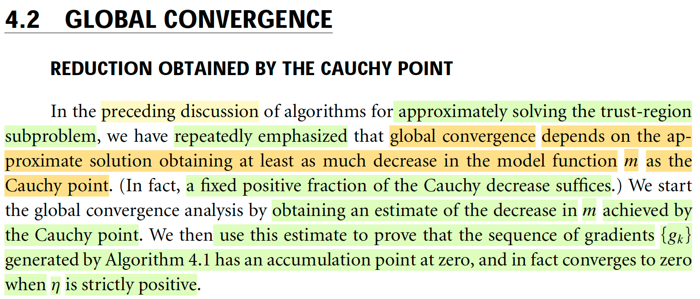</kbd>

> [!NOTE]
> Đầu tiên, đại ý là, trong những phần trước tác giả đã nhấn mạnh nhiều lần rằng để phương pháp trust region có thể có hội tụ toàn cục (global convergence) thì cái bài toán subproblem (tức là trong iteration xk, tìm xk+1, bằng cách giải bài toán minimize m(p) = fk + gkTp + (1/2)pTBkp s.t ||p|| ≤ Δ, thì p phải giúp giảm f đủ nhiều, và sự đủ ở đây sẽ so sánh với mức giảm bởi Cauchy point.
>
> Ôn lại chút, Cauchy point là gì: Đại khái là tính thế này: Chọn hướng steepest descent: pkS, rồi xem thử đi theo hướng đó, trong phạm vi cho phép thì mk đến đâu là xuống được thấp nhất
>
> Thì bước chọn pkS, tuy chính là steepest descent direction nhưng nói đầy đủ như trong sách thì nó là giải bài toán:
>
> minimize fk + gkTp s.t ||p|| ≤ Δ, và như đã biết dễ thấy giải bài toán này ta sẽ ra pkS chính là hướng -g, nhưng dĩ nhiên độ lớn thì  = Δ, nên cụ thể pkS = - (Δ / ||g||) g
>
> Còn bước sau, chính là bài toán: 
>
> minimize mk(t × pkS) = fk + gT τ pkS + (1/2)(τpkS)TBk(τpkS) s.t ||(t × pkS)|| ≤ Δ. Giải ra τ*, ta  có pkC, tức Cauchy point = τ* × pkS.
>
> Quay lại đây, thế thì, ta sẽ bắt đầu phân tích hội tụ bằng cách **tính mức giảm của m khi đi theo Cauchy point**. Và dùng kết quả này để mà chứng minh rằng chuỗi gradient {gk} tính bởi thuật toán 4.1 (link) sẽ có điểm tích lũy tại 0 (hiểu nôm na là gradient sẽ giảm về 0) và thật sự sẽ hội tụ về 0 khi η dương.

> [!TIP]
> **🤖 AI Feedback** — ✅ Score: **95/100**
>
> Bài phân tích rất chính xác và sâu sắc, không chỉ dịch đúng nội dung mà còn giải thích rõ ràng cách xây dựng Cauchy point, thể hiện sự hiểu biết vững chắc về chủ đề. Cần lưu ý thống nhất ký hiệu (ví dụ t và τ) để đảm bảo tính mạch lạc tối đa.

**🔗 See also:** [Algorithm 4.1 (Trust Region)](./40_trust_region_methods_outline_of_the_trust_region_approach.md#node-c4gu30d)

 

### Mức giảm Dogleg và Wolfe, (4.20)

<kbd>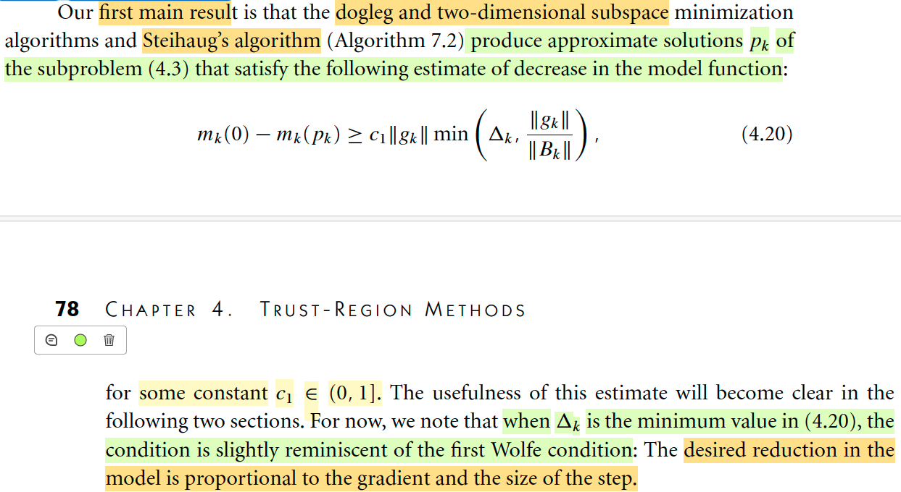</kbd>

> [!NOTE]
> Rồi, họ nói trước, ta sẽ chứng minh để dẫn đến kết quả rằng: phương pháp Dogleg và 2D subspace minimization, cũng như thuật toán Steihaug's (như bài trước đã biết, có 3 phương pháp thuộc dạng Improving Cauchy point mà 2 trong đó nói ở Chapter này, cái còn lại nói ở chapter 7) đều sẽ có tính chất sau (về mức giảm tại mỗi iteration):
>
> mk(0) - mk(pk) ≥ c1 ||gk|| min (Δk, ||gk|| / ||Bk||) for some constant c1 ∈ (0, 1] (4.20)
>
> Gỉai thích một chút, vế trái, là thay đổi của mk khi từ 0 đến pk. Cần hiểu k ở đây là để chỉ ta đang xét outer iteration thứ k, nơi ta đang đứng ở xk, và thực hiện bước đi để đến xk+1. Và để làm vậy, theo phương pháp trust region, ta sẽ giải bài toán: minimize over p của mk(p) = fk + gkTp + (1/2)pTBkp s.t ||p|| ≤ Δ. Với ý nghĩa / cách hiểu nôm na là: Ta giả bộ / coi như hàm mục tiêu hành xử như một hàm quadratic, thì trong một phạm vi nhất định quy định bởi ||p|| ≤ Δ thì điều này có thể chấp nhận được, khi đó ta sẽ tìm hướng đi, p sao cho được hàm quadratic này nhiều nhất có thể trong phạm vi cho phép. Như vậy mk(0), chính là f(xk), là "độ cao" ở điểm ban đầu, và mk(p) sẽ là độ cao (tính bởi hàm quadratic tại điểm xk + p, (hay xk + pk, nếu muốn gắn k vào p để chỉ rõ đây là tìm p ở iteration thứ k). Và **như vậy điều kiện 4.20 này quy định là: À, nếu muốn sự hội tụ tốt toàn cục thì tại mỗi iteration, bước đi p phải giúp giảm hàm mk một khoảng tối thiểu, chính là vế phải.**
>
> Tác giả cho rằng ta sẽ thấy cái này hữu ích trong những phần sau.
>
> Còn bây giờ điểm đáng chú ý là: Nếu Δk là min trong hai cái trong ngoặc của vế phải, thì 4.2 sẽ có dạng giống giống first Wolfe condition (tức sufficient decrease condition, hay Armijo) đó là mức giảm mong muốn sẽ tỉ lệ với gradient và kích thước step. Là sao nhỉ:
>
> Nhớ lại điều kiện giảm đủ, ta nhớ story của nó là muốn step size giúp mức giảm của hàm f phải ít nhất là bằng mức giảm của hàm tuyến tính với độ dốc tại xk được điều chỉnh bởi tham số nào đó. Vậy thì dễ hiểu mức giảm mong muốn này sẽ phụ thuộc độ dốc tại xk, và sải bước, vì hàm tuyến tính càng dốc, và sải bước càng lớn thì độ giảm sẽ càng lớn
> Vậy nhìn vào đây, nếu vế phải là c1 ||gk|| Δk thì ta sẽ một term cũng tỉ lệ với graidient gk và sải bước (Δk đóng vai sải bước)
>
> #4.20

> [!TIP]
> **🤖 AI Feedback** — ✅ Score: **92/100**
>
> Bản tóm tắt rất chính xác, đặc biệt là phần diễn giải về mối liên hệ với điều kiện Wolfe đầu tiên và sự tỉ lệ với gradient và kích thước bước, thể hiện sự hiểu biết sâu sắc. Tuy nhiên, việc đưa thêm thông tin không có trong đoạn văn được đánh dấu ("có 3 phương pháp thuộc dạng Improving Cauchy point...") cần được cân nhắc lại khi chỉ tóm tắt một đoạn văn cụ thể. Cụm từ "Là sao nhỉ" cũng quá thân mật cho một ghi chú học thuật.

**🔗 See also:** [Theorem 4.5](#node-fg12jtm) · [Convergence of algorithms based on nearly exact solution](./43_trust_region_methods_iterative_solution_of_the_subproblem.md#node-tr8868m) · [4.52a và 4.52b đại ý là điều kiện mà ta sẽ đặt ra cho bài toán subproblem giúp đảm bảo sự hội tụ toàn cục của cả bài toán trust region](./43_trust_region_methods_iterative_solution_of_the_subproblem.md#node-rnxo6wt)

 

#### Lemma 4.3: Cauchy point thỏa điều kiện giảm đủ

<kbd>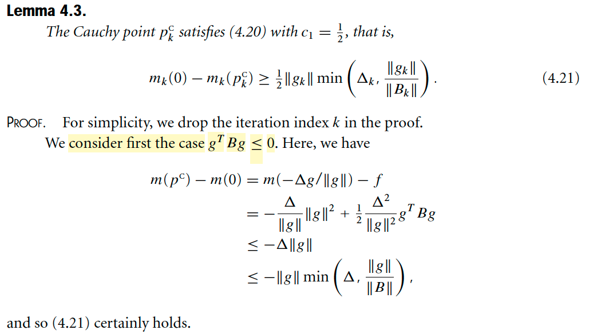</kbd>

<kbd>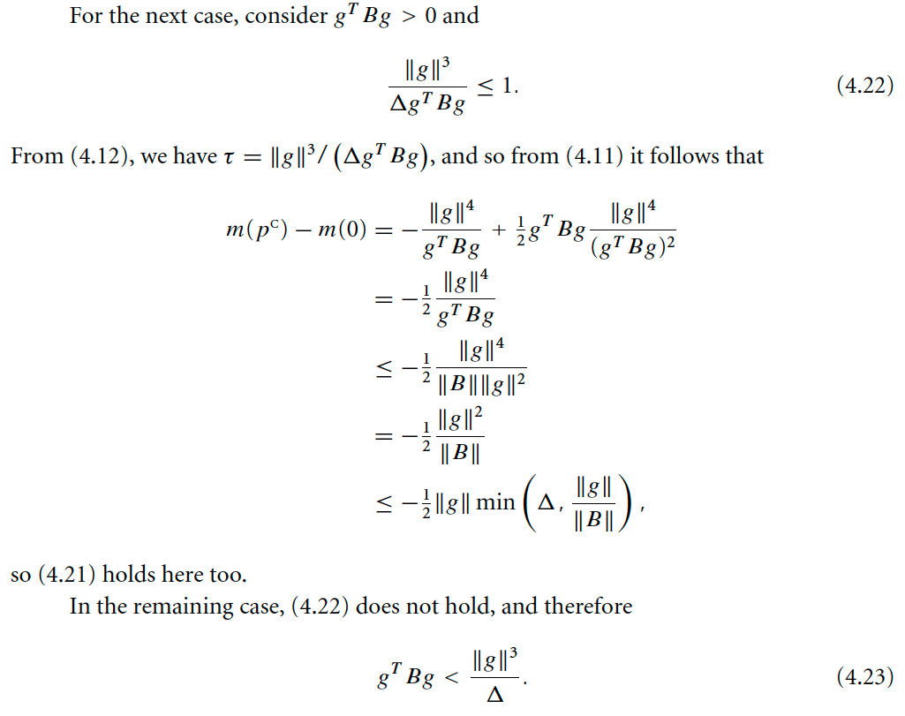</kbd>

<kbd>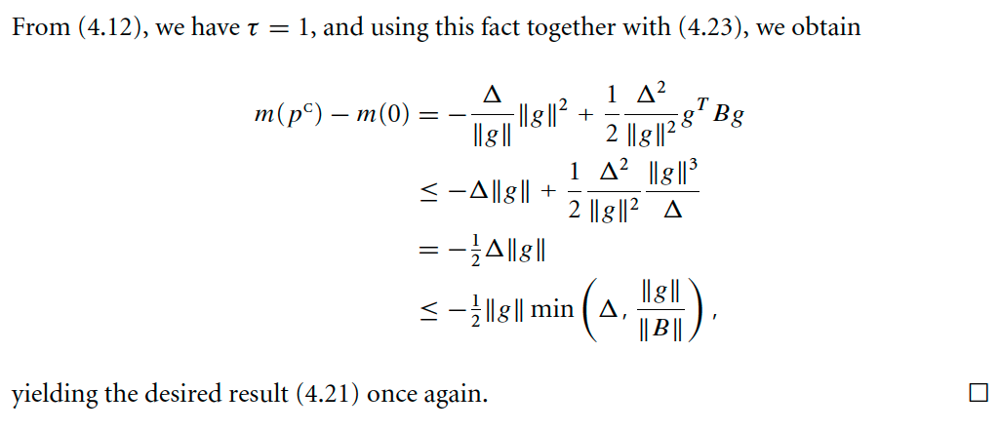</kbd>

> [!NOTE]
> Qua bổ đề 4.3, nó nói rằng Cauchy point có thể thỏa điều kiện 4.20. Nhắc lại, điều kiện 4.20 nói về điều kiện của mức giảm khi thực hiện bước đi, mà ta sẽ thấy vì sao nếu thỏa điều kiện này thì sẽ dẫn đến sự hội tụ toàn cục (tác giả nói ta sẽ thấy sự hữu ích của nó sau): 
>
> mk(0) - mk(pk) ≥ c1 ||gk|| min (Δk, ||gk|| / ||Bk||) for some constant c1 ∈ (0, 1]
>
> Gỉai thích một chút, vế trái, là thay đổi của mk khi từ 0 đến pk. Cần hiểu k ở đây là để chỉ ta đang xét outer iteration thứ k, nơi ta đang đứng ở xk, và thực hiện bước đi để đến xk+1. Và để làm vậy, theo phương pháp trust region, ta sẽ giải bài toán: minimize over p của mk(p) = fk + gkTp + (1/2)pTBkp s.t ||p|| ≤ Δ. Với ý nghĩa / cách hiểu nôm na là: Ta giả bộ / coi như hàm mục tiêu hành xử như một hàm quadratic, thì trong một phạm vi nhất định quy định bởi ||p|| ≤ Δ thì điều này có thể chấp nhận được, khi đó ta sẽ tìm hướng đi, p sao cho được hàm quadratic này nhiều nhất có thể trong phạm vi cho phép. Như vậy mk(0), chính là f(xk), là "độ cao" ở điểm ban đầu, và mk(p) sẽ là độ cao (tính bởi hàm quadratic tại điểm xk + p, (hay xk + pk, nếu muốn gắn k vào p để chỉ rõ đây là tìm p ở iteration thứ k). Và như vậy điều kiện 4.20 này quy định là: À, nếu muốn sự hội tụ tốt toàn cục thì tại mỗi iteration, bước đi p phải giúp giảm hàm mk một khoảng tối thiểu, chính là vế phải.
>
> Vậy thì bổ đề này nói rằng: pkC, Cauchy point thỏa được cái này, và cụ thể c1 = 1/2.
>
> Để chứng minh, ta sẽ tạm bỏ đi cái chữ k trong kí hiệu cho đơn giản: Tức là ta sẽ chứng minh:
>
> m(0) - m(pC) ≥ c1 ||g|| min (Δ, ||g|| / ||B||) for some constant c1 ∈ (0, 1] 
>
> Bắt đầu từ vế trái, m(0), như đã nói ở trên, chính là fk, hay bỏ k cho gọn, ta có f.
>
> Còn m(pC), với pC, là Cauchy point, ta còn nhớ nó có story là hướng dốc nhất, và đi theo hướng đó để mk đạt tối thiểu: Có nghĩa là 
>
> Bước 1, xác định pS: = - (Δ / ||g||) g (hướng -g và có độ dài Δ) 
>
> Bước 2, gỉai bài toán tối ưu hàm đơn biến: 
>
> minimize over τ hàm g(τ) = f + gT(τpS) + (1/2)(τpS)T B (τpS) s.t ||τpS|| ≤ Δ
>
> = f + τ gT(pS) + (1/2)(pS)TB(pS) τ^2  
>
> = f + τ gT(- (Δ / ||g||) g) + (1/2)(- (Δ / ||g||) g)TB(- (Δ / ||g||) g) τ^2
>
> = f - τ Δ ||g|| + (1/2)(Δ / ||g||)^2 gTBg τ^2
>
> Khi đó ta sẽ có hai trường hợp mà đã nói ở phần Cauchy point
>
> 1) Khi gTBg ≤ 0, đại khái là ta sẽ có thể chứng minh đạo hàm của g(τ) sẽ âm với mọi τ, từ đó hàm là monotone decreasing, thành ra solution sẽ là τ = 1 ⇨ pC = - (Δ / ||g||) g
>
> HÌnh ảnh rất dễ hiểu, độ cong của hàm m tại xk âm, và với việc m là quadratic function, nên giới hạn trong hướng pS thì nó g là hàm bậc hai đơn biến thì độ cong của nó là hằng số, có nghĩa là ở đâu thì nó cũng chỉ đang cong xuống, nên dĩ nhiên dễ hiểu là điểm thấp nhất sẽ đụng hàng rào
>
> ⇨ m(pC) = f + gTpC + (1/2) pCT B pC 
>
> = f + gT[- (Δ / ||g||) g] + (1/2) [- (Δ / ||g||) g]T B [- (Δ / ||g||) g]
>
> = f - (Δ / ||g||) gTg + (1/2) (Δ / ||g||)^2  gTBg
>
> = f - (Δ / ||g||) ||g||^2 + (1/2) (Δ / ||g||)^2  gTBg
>
> = f - Δ ||g|| + (1/2) (Δ / ||g||)^2  gTBg
>
> Từ đó m(0) - m(pC) = f - [f - Δ ||g|| + (1/2) (Δ / ||g||)^2  gTBg]
>
> = f - f + Δ ||g|| - (1/2) (Δ / ||g||)^2  gTBg
>
> = Δ ||g|| - (1/2) (Δ / ||g||)^2  gTBg
>
> Viết lại: m(0) - m(pC) = Δ ||g|| - (1/2) (Δ / ||g||)^2  gTBg
>
> Tới đây ta xét B thỏa: gTBg ≤ 0, điều này ⇔ - (1/2) (Δ / ||g||)^2  gTBg ≥ 0
>
> ⇨ Δ ||g|| - (1/2) (Δ / ||g||)^2  gTBg ≥ Δ ||g||
>
> Và Δ dĩ nhiên ≥ min(Δ, ||g|| / ||B||) 
>
> (vì nếu min(Δ, ||g|| / ||B||) = Δ thì ta có Δ ≥ Δ, còn nếu min(Δ, ||g|| / ||B||) = ||g|| / ||B|| thì ta có Δ ≥ ||g|| / ||B||)
>
> ⇨ Δ ||g|| ≥ ||g|| min(Δ, ||g|| / ||B||) 
>
> ≥ 1/2 ||g|| min(Δ, ||g|| / ||B||) (vì ||g|| min(Δ, ||g|| / ||B||) là số không âm, nên a ≥ (1/2) a)
>
> Vậy đã chứng minh được với gTBg ≤ 0 thì pC thỏa 4.21.
>
> ====
>
> 2) Còn khi gTBg > 0, thì hình ảnh lúc này là hàm bậc hai đơn biến g(τ) có độ cong dương tại điểm bắt đầu (và cũng sẽ không âm tại mọi điểm)
>
> Khi đó, đơn giản là dùng điều kiện cần bậc 1, và vì đây là hàm convex nên nó cũng đủ để kết luận minimum τ* = (||g||)^3 / ΔgTBg, pC* = [(||g||)^3 / ΔgTBg] [-g Δ / ||g||] và lúc này sẽ có hai trường hợp xảy ra: 
>
> a) là điểm thấp nhất này nằm ở trong khoảng từ xk đến xk + pkS, tức là: ||τ* pkS|| ≤ Δ cũng là τ* ≤ 1
>
> Khi đó ta kết luận τ* = (||g||)^3 / Δ gTBg.
>
> b) điểm thấp nhất nằm ngoài phạm vi cho phép, thì lúc này solution lại là đụng hàng rào: τ = 1
>
> Tổng hợp lại ⇨ τ = min(1,  (||g||)^3 / Δ gTBg)
>
> Vậy quay lại đây, xét case 2a: với τ = (||g||)^3 / Δ gTBg, để pC có thỏa điều kiện giảm đủ không:
>
> Khi đó pC = [(||g||)^3 / Δ gTBg] [-g Δ / ||g||] 
>
> = [(||g||)^2 / gTBg] [-g] 
>
> = - [(||g||)^2 / gTBg] g
>
> m(0) - m(pC) 
>
> = f - [f + gT{- [(||g||)^2 / gTBg] g} + (1/2) {- [(||g||)^2 / gTBg] g}TB{- [(||g||)^2 / gTBg] g}
>
> = gTg [(||g||)^2 / gTBg] - (1/2) [||g||^4 / (gTBg)^2] gTBg
>
> = [(||g||)^4 / gTBg] - (1/2) [||g||^4 / (gTBg)]
>
> = (1/2) ||g||^4 / (gTBg)
>
> Tới đây xét cái quaratic form ở mẫu: gTBg. Ta sẽ có gTBg ≤ ||B|| ||g||^2. Vì sao:
>
> Nhớ lại định nghĩa của norm of matrix B. Nói bằng lời, nó là stretch factor lớn nhất khi linear transform một vector bởi B: max_u ||Bu|| / ||u||. Nên ||B|| ≥ ||Bu|| / ||u|| Từ đó ta có inequality ||B|| ||u|| ≥ ||Bu||. ⇨ Áp dụng với g: ||B|| ||g|| ≥ ||Bg||
>
> Thế thì xét gTBg, nó chính là gT(Bg), theo công thức dot product, = ||g|| ||Bg|| cos θ(g, Bg). Và với tính chất cosine ≤ 1 ta có: gT(Bg) ≤ ||g|| ||Bg||
>
> Mà ở trên ta có ||B|| ||g|| ≥ ||Bg|| ⇨ gT(Bg) ≤ ||g|| ||B|| ||g||   
>
> Vậy gT(Bg) ≤ ||B|| ||g||^2 (*)
>
> ⇨ (1/2) ||g||^4 / (gTBg) ≥ (1/2) ||g||^4 / ||B|| ||g||^2  
>
> = (1/2) ||g||^2 / ||B|| = (1/2) (||g|| / ||B||) ||g|| 
>
> và cái này thì dĩ nhiên ≥ (1/2) ||g|| × min(Δ, ||g|| / ||B||)
>
> Vậy chứng minh xong với case này thì m(0) - m(pC) vẫn thỏa "điều kiện giảm đủ"
>
> ====
>
> Còn case thứ 2b, khi τ = 1: Xảy ra khi t* > 1, tức (||g||)^3 / ΔgTBg > 1
>
> ⇔ (||g||)^3 / Δ > gTBg. 
>
> Lúc này việc chứng minh cũng y như case 1, vì pC = -(Δ/||g||) g
>
> m(0) - m(pC)  = Δ ||g|| - (1/2) (Δ / ||g||)^2 gTBg
>
> Chỉ khác là gTBg > 0 ta phải lập luận khác: 
>
> Với (||g||)^3 / Δ > gTBg ⇔ - (||g||)^3 / Δ < - gTBg hay - gTBg > - (||g||)^3 / Δ 
>
> ⇨ -(1/2) (1/2) (Δ / ||g||)^2 gTBg > - (1/2) (Δ / ||g||)^2 (||g||)^3 / Δ 
>
> ⇨ m(0) - m(pC)  = Δ ||g|| - (1/2) (Δ / ||g||)^2 gTBg > - (1/2) (Δ / ||g||)^2 (||g||)^3 / Δ 
>
> = Δ ||g|| - (1/2) Δ ||g||
>
> = (1/2) Δ ||g||
>
> Và cái này thì dĩ nhiên ≥ (1/2) ||g|| min (Δ, ||g||/||B||). 
>
> Chứng minh xong.

> [!TIP]
> **🤖 AI Feedback** — ❌ Score: **65/100**
>
> Bài phân tích cho thấy sự hiểu biết tốt về bối cảnh và các trường hợp của bổ đề. Tuy nhiên, phần chứng minh cho trường hợp gTBg > 0 với τ ≤ 1 còn thiếu một bước suy luận quan trọng để thiết lập cận dưới min(Δ, ||g||/||B||), làm cho lập luận chưa hoàn chỉnh và không hoàn toàn chính xác.

**🔗 See also:** [Công thức Cauchy point](./41_trust_region_methods_algorithms_based_on_the_cauchy_point.md#node-06f2kv1)

 

##### Theorem 4.4 về điều kiện giảm đủ của pk khi tương quan với Cauchy point

<kbd>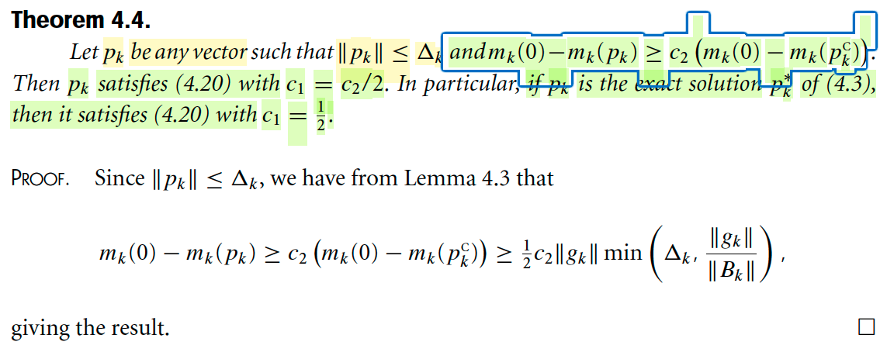</kbd>

> [!NOTE]
> Theorem 4.4 về điều kiện giảm đủ của pk khi tương quan với Cauchy point
>
> Rồi, đại ý là một khi đã chứng minh Cauchy point thỏa điều kiện giảm đủ thì cũng dễ dàng chứng minh được với pk bất kì miễn là thỏa ||pk|| ≤ Δ và mức giảm của nó đạt được trạng thái ít nhất bằng một tỉ lệ nào đó của mức giảm Cauchy point (ví dụ như luôn ít nhất = 1/3 mức giảm của Cauchy point) thì theorem này nói rằng khi đó pk đó cũng thỏa điều kiện giảm đủ.
>
> Việc chứng minh rất đơn giản: 
>
> với pk thỏa mk(0) - mk(pk) ≥ c2(mk(0) - mk(pkC))
>
> thì vì mk(0) - mk(pkC) ≥ 1/2||gk|| min(Δk, ||gk|| / ||Bk||) (do Cauchy point thỏa điều kiện với c1 = 1/2)
>
> ⇨ c2(mk(0) - mk(pkC)) ≥ c2/2||gk|| min(Δk, ||gk|| / ||Bk||)
>
> ⇔ mk(0) - mk(pk) ≥ c2/2||gk|| min(Δk, ||gk|| / ||Bk||)
>
> Chứng tỏ pk thỏa điều kiện giảm đủ ..
>
> mk(0) - mk(pk) ≥ c1 ||gk|| min (Δk, ||gk|| / ||Bk||) for some constant c1 ∈ (0, 1] 
>
> với c2/2 đóng vai trò c1

> [!TIP]
> **🤖 AI Feedback** — ❌ Score: **65/100**
>
> Bản phân tích của bạn có một lỗi đáng kể khi trích dẫn Bổ đề 4.3, bạn đã bỏ sót hệ số c2 có trong phần chứng minh gốc. Ngoài ra, việc sử dụng ký hiệu "⇔" không phù hợp trong các bước suy luận; tuy nhiên, bạn đã đưa ra kết luận cuối cùng chính xác theo định lý.

 

###### Đại ý là dogleg và 2D subspace method thỏa.

<kbd>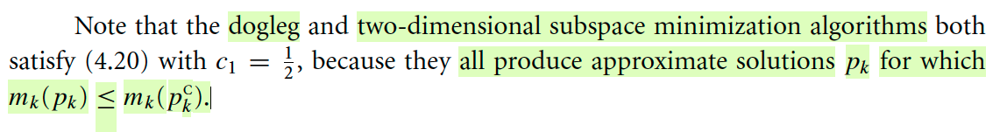</kbd>

> [!NOTE]
> Đại ý là dogleg và 2D subspace method thỏa.

 

###### Convergence to Stationary Points

<kbd>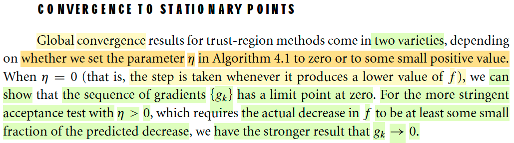</kbd>

> [!NOTE]
> #Convergence to Stationary Points
>
> Đại khái là nói rằng kết quả hội tụ toàn cục của phương pháp trust region đến từ hai biến thể (varieties), phụ thuộc ta chọn η bằng 0 hay số dương (trong (0,1/4)) trong thuật toán 4.1
>
> Theo link để biết thuật toán, nhưng đại khái có thể ôn lại nhanh thuật toán lặp đi lặp lại việc sau đây:
>
> a) Xác định pk, giải bài toán minimize fk + gkTpk + (1/2)pkBkpk s.t ||pk|| ≤ Δk
>
> b) Tính và check tỉ lệ sụt thật và độ sụt ước đoán: ρk = [fk - fk+1] / [mk - mk+1] để nếu quá nhỏ (<1/4) thì thu nhỏ trust region: Δk+1 = .. (nhỏ hơn Δk), nếu lớn (≈ 1) và ||pk|| = ||Δk|| thì tăng lên còn không thì giữ nguyên.
>
> c) Cũng xem độ sụt ρk có > η không thì update: xk+1 = xk + pk, ngược lại thì giữ nguyên (không di chuyển)
>
> Vậy ở đây nói nếu η được chọn 0, thì với bước c) ta có thể hiểu là mĩên là độ sụt dương, không care là có bị hụt chân hay không (sự giảm estiamate bởi mk có gần đúng sự giảm thực tế của f không), thì vẫn thực hiện bước update.
>
> Còn ngược lại, nếu phải thỏa ρk > η dương thì có nghĩa là, chỉ khi tỉ lệ mức độ hụt thực tế và ước lượng đủ lớn thì mới "bước đi"
>
> Thế thì, tác giả nói, ở case thứ nhất ta có thể chứng minh chuỗi gradient gj sẽ hội tụ về 0, và với case sau (nghiêm ngặt hơn) thì thậm chí ta còn có kết quả tốt hơn.

**🔗 See also:** [Algorithm 4.1 (Trust Region)](./40_trust_region_methods_outline_of_the_trust_region_approach.md#node-c4gu30d)

 

###### Một số giả định trước khi đi vào phân tích

<kbd>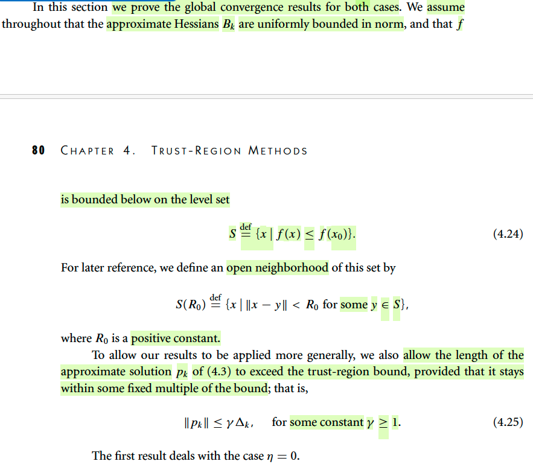</kbd>

> [!NOTE]
> Một số giả định trước khi đi vào phân tích
>
> Tác giả cho rằng ta sẽ giả định Bk (ma trận xấp xỉ Hessian) sẽ uniformly bounded in norm
>
> (Ý này chưa hiểu để làm gì nhưng ta đã từng gặp giả định này trong Line Search, sẽ đóng vai trò kết quả phân tích hội tụ)
>
> Và giả thiết nữa là f bị chặn dưới trong level set S, S = {x|f(x) ≤ f(x0)}: Có nghĩa là trong phạm tập S này thì f không thể đi xuống trừ vô cùng
>
> Và để dùng sau, ta định nghĩa một vùng lân cận mở (open neighborhood) của tập S này:
>
> S(R0) = {x: ||x - y|| < R0 với some y ∈ S} (4.24)
>
> Một điểm nữa cũng chưa rõ lắm nhưng đại ý là tác giả nói để kết quả phân tích có thể được áp dụng một cách khái quát hơn, ta sẽ cho phép chiều dài của pk có thể vượt quá trust region method, nhưng vẫn nằm trong phạm vi là nó bằng một scaled factor nào đó của trust region.
>
> ||pk|| ≤ γ Δk (4.25)
>
> #Công thức 4.24, 4.25

 

###### Theorem 4.5

<kbd>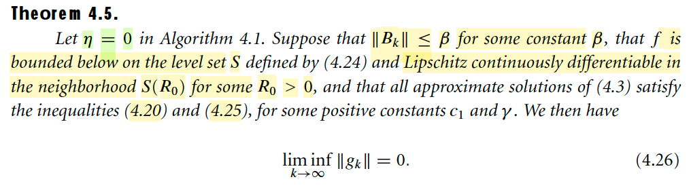</kbd>

> [!NOTE]
> #Theorem 4.5
>
> Theorem này nói rằng, với η = 0, thì giả sử 
>
> a) **||Bk|| ≤ β với constant β nào đó**
>
> b) **f bị chặn trong tập level set S**
>
> c) và có tính **Libschitz continously differentiable trong neighborhood S(R0)** với some R0 > 0. 
>
> d) mọi approximate solutions của bài toán 4.3 (bài toán dùng để tìm pk) đều **thỏa điều kiện giảm đủ** 
>
> mk(0) - mk(pk) ≥ c1 ||gk|| min (Δk, ||gk|| / ||Bk||) for some constant c1 ∈ (0, 1] (4.20)
>
> ||pk|| ≤ γ Δk (4.25)
>
> S(R0) = {x: ||x - y|| < R0 với some y ∈ S} (4.24)
>
> Thì khi đó lim inf k → inf ||gk|| = 0 (4.26)
>
> Chú ý đây là liminf tức là giới hạn dưới.

**🔗 See also:** [Mức giảm Dogleg và Wolfe, (4.20)](#node-flrtdwa) · [Convergence of algorithms based on nearly exact solution](./43_trust_region_methods_iterative_solution_of_the_subproblem.md#node-tr8868m)

 

###### Chứng minh theorem 4.5

<kbd>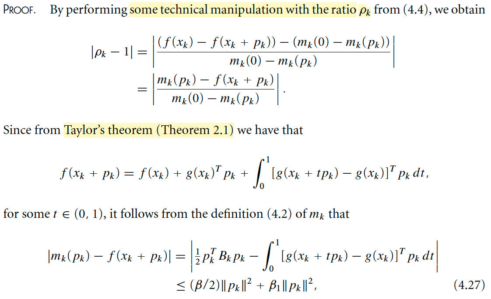</kbd>

> [!NOTE]
> #Chứng minh theorem 4.5 
>
> Cùng xem kĩ phần chứng minh:
>
> Đầu tiên biến đổi |pk - 1|:
>
> Công thức 4.4 ρk = [f(xk) - f(xk + pk)] / [mk(0) - mk(pk)]
>
> ρk - 1 = [f(xk) - f(xk + pk)] / [mk(0) - mk(pk)] - [mk(0) - mk(pk)] / [mk(0) - mk(pk)]
>
> = {[f(xk) - f(xk + pk)] - [mk(0) - mk(pk)]} / [mk(0) - mk(pk)]
>
> = [f(xk) - f(xk + pk) - mk(0) + mk(pk)] / [mk(0) - mk(pk)]
>
> = [mk(pk) - f(xk + pk)] / [mk(0) - mk(pk)]  | vì mk(0) chính là = f(xk)
>
> ⇨ |ρk - 1| = |[mk(pk) - f(xk + pk)] / [mk(0) - mk(pk)]|
>
> Tiếp theo là áp dụng định lý Taylor để có kết quả 
>
> f(xk + pk) = f(xk) + g(xk)Tpk + ∫0:1 [g(xk + tpk) - g(xk)]Tpkdt 
>
> Là sao?
>
> Xét hàm h(t) = f(x + tp):
>
> ⇨ d/dt h(t) (hay h'(t)) = d/dt f(x + tp) = d/d(x + tp) f(x + tp) . d/dt (x + tp)
>
> = ∇f(x + tp) . p = ∇f(x + tp)Tp
>
> Viết lại h'(t) = ∇f(x + tp)Tp
>
> Rồi, ta mới áp dụng FTC 1, trong đó nói rằng: Nếu G là nguyên hàm của f tức: G'(x) = f(x) thì ∫a:b f(x)dx = G(b) - G(a)
>
> Nên áp dụng cho g là nguyên hàm của h' (dĩ nhiên)
>
> ⇨ ∫0:1 h'(t)dt = h(1) - f(0)
>
> Thay h'(t) = ∇f(x + tp)Tp, 
>
> h(1) = f(x + 1 × p) = f(x + p), h(0) = f(x) thì ta có:
>
> **∫0:1 ∇f(x + tp)Tpdt = f(x + p) - f(x)**
>
> Tới đây chú ý, trong sách kí hiệu g(.) là hàm gradient, tức ∇f(x + tp) chính là g(x + tp), tức gradient tại x + tp.
>
> Viết lại ta có: f(x + p) - f(x) = ∫0:1 g(x + tp)Tpdt
>
> Cộng và trừ bớt cho g(x)Tp
>
> f(x + p) - f(x) = ∫0:1 [g(x + tp) - g(x) + g(x)]Tpdt 
>
> ⇔ f(x + p) - f(x) = ∫0:1 [g(x + tp) - g(x)]Tpdt  + ∫0:1 g(x)Tpdt 
>
> ⇔ f(x + p) - f(x) = ∫0:1 [g(x + tp) - g(x)]Tpdt  + g(x)Tp ∫0:1 dt 
>
> (đưa g(x)Tp ra ngoài tích phân vì không dính đến t)
>
> ⇔ f(x + p) = f(x) + g(x)Tp + ∫0:1 [g(x + tp) - g(x)]Tpdt   
>
> Đấy chính là công thức mà tác giả nói là từ Taylor's theorem, nhưng đáng lý tác giả nói từ FTC thì dễ hiểu hơn vì nếu soi từ 3 công thức Taylor theorem 2.4 → 2.6 thì hơi khó nhìn ra 
>
> Áp dụng vào đây ta có:
>
> f(xk + pk) = f(xk) + g(xk)Tpk + ∫0:1 [g(xk + tpk) - g(xk)]Tpkdt 
>
> **CHÚ Ý, TÁC GIẢ GHI SAI / THỪA "for some t ∈ (0,1)"**
>
> Với mk(pk) = f(xk) + gkTpk + (1/2)pkTBkpk và f(xk + pk) bằng ở trên ta sẽ tính:
>
> |mk(pk) - f(xk + pk)| 
>
> = |f(xk) + gkTpk + (1/2)pkTBkpk - [f(xk) + g(xk)Tpk + ∫0:1 [g(xk + tpk) - g(xk)]Tpkdt ]|
>
> = |f(xk) + gkTpk + (1/2)pTBkpk - f(xk) - g(xk)Tpk - ∫0:1 [g(xk + tpk) - g(xk)]Tpkdt ]|
>
> = |(1/2)pkTBkpk - ∫0:1 [g(xk + tpk) - g(xk)]Tpkdt ]|
>
> Tác giả ghi cái này ≤ {(β/2)||pk||^2 + β1||pk||^2 với β1 là Lipschitz constant cho g trong set S(R0)m và assume ||pk|| < R0
>
> Làm rõ chỗ này:
>
> Đầu tiên: Dùng bất đẳng thức tam giác: |A + B| ≤ |A| + |B|
>
> ⇨ |(1/2)pkTBkpk - ∫0:1 [g(xk + tpk) - g(xk)]Tpkdt ]| 
>
> ≤ |(1/2)pkTBkpk| + |-∫0:1 [g(xk + tpk) - g(xk)]Tpkdt ]|
>
> = |(1/2)pkTBkpk| + |∫0:1 [g(xk + tpk) - g(xk)]Tpkdt ]|
>
> Xét cái hạng tử đầu tiên: |(1/2)pkTBkpk|
>
> |pkTBkpk| = |pkT(Bkpk)| ≤ | ||pk|| . ||Bkpk|| | (vì aTb = ||a|| ||b|| cos θ(a,b) ≤ ||a|| ||b||)
>
> Dùng định nghĩa của norm ||A||:  max x ||Ax|| / ||x|| ⇨ ||Ax|| / ||x|| ≤ ||A||. Áp dụng vào đây: ||Bkpk|| / ||pk|| ≤ ||Bk||, hay ||Bkpk|| ≤ ||Bk|| . ||pk||
>
> ⇨ |pkTBkpk| = |pkT(Bkpk)| ≤ | ||pk|| . ||Bkpk|| | ≤ | ||pk|| ||Bk|| ||pk|| | = | ||Bk|| ||pk||^2 | = ||Bk|| ||pk||^2
>
> Dùng giả thiết của theorem tác giả đã nói ||Bk|| ≤ β for some constant β.
>
> ⇨ pkTBkpk = pkT(Bkpk) ≤ ||pk|| . ||Bkpk|| ≤ ||pk|| ||Bk|| ||pk|| = ||Bk|| ||pk||^2 ≤ β ||pk||^2
>
> Thêm 1/2 vào, viết lại: (1/2)pkTBkpk ≤ (1/2)β ||pk||^2 Đây là cái hạng tử đầu tiên của 4.27
>
> ====
>
> Xét hạng tử thứ 2: |∫0:1 [g(xk + tpk) - g(xk)]Tpkdt ]|
>
> Dùng tính chất Lipschitz continuous, ta nhớ cái này đại ý nôm na là vầy: Khi đi từ x đến y thì gradient không thay đổi qúa đột ngột. Và thể hiện bởi toán học là:
>
> ||h(x) - h(y)||/||x - y|| ≤ L với L là hằng số Lipschitz, mang ý nghĩa là độ dốc từ x đến y bị chặn trên bởi số hữu hạn.
>
> Áp dụng ở đây, giả thiết cho  "Lipschitz continously differentiable trong lân cận S(R0).." chính là nói hàm gradient ∇f(x), hay g(x) là có tính chất Lipschitz continous.
>
> Nên độ dốc giữa hai điểm xk và xk+tpk phải bị chặn trên bởi số hữu hạn:
>
> ||g(xk + tpk) - g(xk)||  / ||(xk + tpk) - xk|| ≤ L, và ở đây tác giả dùng β1 cho Lipschitz constant.
>
> Viết lại: ||g(xk + tpk) - g(xk)||  / ||(xk + tpk) - xk|| ≤ β1
>
> ⇔ ||g(xk + tpk) - g(xk)|| ≤ β1 ||(xk + tpk) - xk||
>
> ⇨ |∫0:1 [g(xk + tpk) - g(xk)]Tpkdt |
>
> Đưa dấu giá trị tuyệt đối vào trong tích phân: 
>
> = ∫0:1 |[g(xk + tpk) - g(xk)]Tpk| dt 
>
> ≤ ∫0:1 ||[g(xk + tpk) - g(xk)|| ||pk|| dt  (áp dụng aTb ≤ ||a|| ||b||)
>
> ≤ ∫0:1 β1 ||(xk + tpk) - xk|| ||pk|| dt
>
> = ∫0:1 β1 ||tpk|| ||pk|| dt
>
> = ∫0:1 β1 |t| ||pk|| ||pk|| dt 
>
> = ∫0:1 β1 |t| ||pk||^2 dt
>
> = β1 ||pk||^2 ∫0:1 t dt (do t ≥ 0)
>
> ≤  β1 ||pk||^2 ∫0:1 dt (do t ≤ 1)
>
> = β1 ||pk||^2 
>
> Đây là term thứ 2:
>
> Kết hợp lại ta có :
>
> |mk(pk) - f(xk + pk)| ≤ (1/2)β ||pk||^2 + β1 ||pk||^2  như tác giả viết (4.27)

> [!TIP]
> **🤖 AI Feedback** — ⚠️ Score: **85/100**
>
> Phần chứng minh của bạn rất chi tiết và thể hiện sự hiểu biết sâu sắc về các định lý cơ bản như Định lý cơ bản của Giải tích (FTC) và tính chất Lipschitz. Đặc biệt, việc bạn tự mình dẫn ra công thức Taylor dạng tích phân và chỉ ra sự thiếu chính xác trong cách đặt câu "for some t ∈ (0,1)" trong văn bản gốc là điểm rất ấn tượng. Tuy nhiên, trong bước đánh giá cận trên cho hạng tử thứ hai của bất đẳng thức (4.27), mặc dù kết quả cuối cùng khớp với văn bản gốc, việc chuyển từ ∫t dt = 1/2 sang ≤ ∫1 dt = 1 khiến cho việc suy luận thiếu chặt chẽ. Cụ thể, sau khi tính được ∫0:1 t dt = 1/2, hạng tử chính xác phải là (β1/2)||pk||^2. Việc dùng cận lỏng hơn (≤ β1||pk||^2) là đúng về mặt toán học, nhưng một bài chứng minh chặt chẽ sẽ hoặc giữ nguyên cận chặt nhất hoặc giải thích rõ ràng lý do sử dụng cận lỏng hơn. Hãy chú ý hơn đến sự chính xác và chặt chẽ trong từng bước toán học.

**🔗 See also:** [Outline of the trust-region method](./40_trust_region_methods_outline_of_the_trust_region_approach.md#node-464kbau) · [Theorem 2.1 Taylor's theorem, Taylor theorem](./21_funds_of_unconstrained_optim_whats_solution.md#node-zekxi9u)

 

###### Chứng minh theorem 4.5 (cont 1)

<kbd>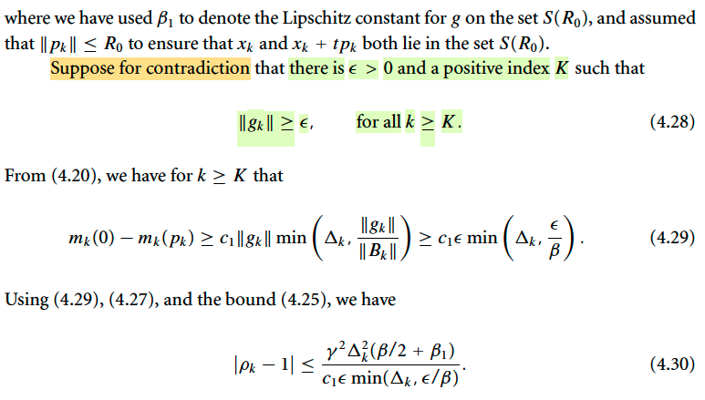</kbd>

> [!NOTE]
> #Chứng minh theorem 4.5 (cont 1)
>
> Tiếp, tác giả giả định tồn tại ε dương và một index number K nào đó mà ||gk|| ≥ ε ∀ K, điều này có nghĩa tác giả đang giả định điều mà theorem này nói không xảy ra, gradient gk luôn (có trị tuyệt đối) lớn hơn giá trị dương nào đó, đồng nghĩa nó không liminf k → ∞ ||gk|| = 0.
>
> Dùng 4.20, ý là giải thiết của thoerem rằng các pk đều thỏa điều kiện giảm đủ: 
>
> mk(0) - mk(pk) ≥ c1 ||gk|| min(Δk, ||gk|| / ||Bk||)
>
> Với ||gk|| ≥ ε nói trên, và ||Bk|| ≤ β của giả thiết: 
>
> c1 ||gk|| min(Δk, ||gk|| / ||Bk||) ≥ c1 ε min(Δk, ε / β)
>
> ⇨ mk(0) - mk(pk) ≥ c1 ε min(Δk, ε / β) (4.29)
>
> Dùng tiếp kết quả hồi nãy:
>
> |mk(pk) - f(xk + pk)| ≤ (1/2)β ||pk||^2 + β1 ||pk||^2 (4.27)
>
> ||pk|| ≤ γΔk for some constant γ (4.25) 
>
> và (4.29) ở trên ta có:
>
> |ρk - 1| = |[mk(pk) - f(xk + pk)] / [mk(0) - mk(pk)]|
>
> ≤ | [(1/2)β ||pk||^2 + β1 ||pk||^2 ] | / [c1 ε min(Δk, ε / β)] |  (dùng 4.27, 4.29)
>
> ≤ | [(1/2)β (γΔk)^2 + β1 (γΔk)^2 ] | / [c1 ε min(Δk, ε / β)] | (dùng (4.25))
>
> = | [(γΔk)^2[β/2  + β1] | / [c1 ε min(Δk, ε / β)] |
>
> = [(γΔk)^2[β/2  + β1] | / [c1 ε min(Δk, ε / β)]  (số không âm, bỏ trị tuyệt đối)

> [!TIP]
> **🤖 AI Feedback** — ✅ Score: **92/100**
>
> Phần giải thích về giả định phản chứng và các bước suy luận toán học đều rất chính xác và đầy đủ, thậm chí còn bổ sung nội dung các phương trình (4.25) và (4.27) không có trong hình ảnh gốc. Tuy nhiên, cách diễn đạt về phương trình (4.20) có thể rõ ràng hơn và cần lưu ý loại bỏ các dấu giá trị tuyệt đối không cần thiết khi các đại lượng đã dương.

 

###### Chứng minh theorem 4.5 (cont 2)

<kbd>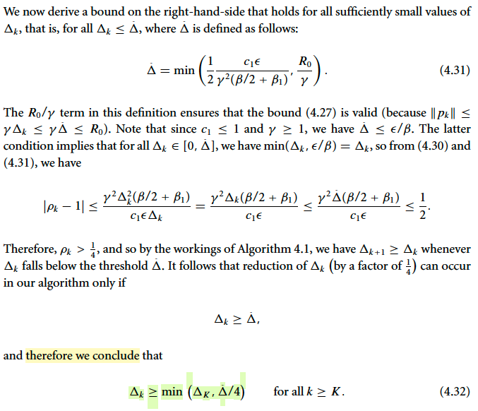</kbd>

<kbd>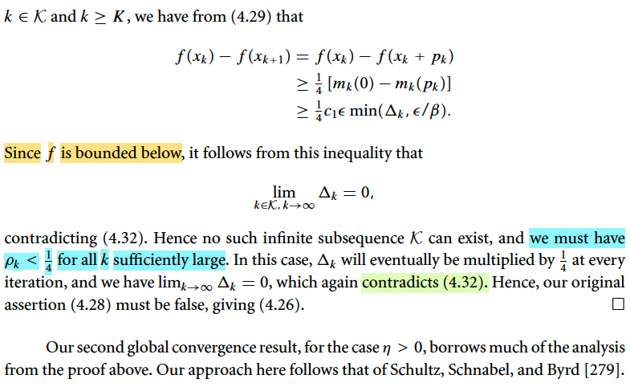</kbd>

> [!NOTE]
> # Chứng minh theorem 4.5 (cont 2)
>
> Tiếp theo là chiến thuật chứng minh phản chứng (Proof by Contradiction):
>
> 1) Đại ý là đầu tiên ta sẽ lập mâu thuẫn từ giả định: Dưới giả định phản chứng ||gk|| ≥ ε ∀ k ≥ K, ta sẽ chứng minh là Δk, trust region sẽ bị chặn dưới, tức không bao giờ bị bóp về 0
>
> 2) Sau đó, ta sẽ chia hai trường hợp: 
>
> a) Giả định là tồn tại một số lượng vô hạn (infinite) các iteration mà mỗi cái thỏa điều kiện giúp Δ không bị thu hẹp (chính là điều kiện mức giảm / độ sụt ρk ≥ 1/4). Khi đó ta sẽ chứng minh rằng điều này dẫn tới việc f(xk) - f(xk+1) ≥ (1/4)c1ε min(Δk, ε/β) và điều này khi cộng với giả thiết hàm f bị chặn dưới sẽ giúp suy ra Δk phải → 0, mâu thuẫn trực tiếp với ý (1)
>
> b) Gỉa định ngược với a), có nghĩa là phải chỉ có hữu hạn iteration nào mà mỗi cái đều thỏa điều kiện ρk ≥ 1/4. Và điều này cũng đồng nghĩa là với k đủ lớn thì những iteration khác còn lại sẽ không thỏa, khiến Δ bị bóp lại. Và sớ iteration như vậy cũng phải lớn đến vô hạn khi k lớn vô hạn. Mà như vậy thì đồng nghĩa là Δ sau mỗi bước sẽ liên tục bị bóp nhỏ lại, và số bước là vô hạn → Δ sẽ phải → 0, cũng lại mâu thuẫn với (1) nốt.
>
>  Cả 2 trường hợp thực tế đều ép Δk → 0, đâm thủng cái "mức sàn" ảo tưởng ở ý (1). Suy ra cái giả định ban đầu (||gk|| ≥ ε) là rác rưởi. Bài toán được chứng minh.
>
> ====
>
> Bây giờ ta thử đi vào các phần chi tiết của chiến lược trên:
>
> Làm khúc dễ trước: Giả sử ta đã chứng minh bước 1, là Δ không bao giờ bị bóp về 0, cụ thể là ta sẽ chứng minh Δk ≥ min(ΔK, Δ/4) ∀ k ≥ K. Và ta gỉa sử 2a) Tồn tại một số lượng vô hạn các iteration mà mỗi cái đều thỏa ρk ≥ 1/4 (trong sách ghi là tồn tại infinite subsequence K_curly, tức là 1 chuỗi con, ví dũ {1,2,4} là chuỗi con của {1,2,3,4} vậy. Nói chung là chỉ cần hiểu là giả sử ta có một số bước iteration k nào đó mà thoả điều kiện này, khiến Δ không bị bóp sau bước đó.
>
> thì f(xk) - f(xk+1) = f(xk) - f(xk + pk) (cái này ko có gì khó cả, chỉ là xk+1 = xk + pk mà thôi)
>
> thế thì vì ρk ≥ 1/4 ⇔ [f(xk) - f(xk+1)] / [m(0) - m(p)] ≥ 1/4 
>
> ⇔ [f(xk) - f(xk+1) ≥ (1/4)[m(0) - m(pk)]
>
> ⇔ f(xk) - f(xk + pk) ≥ (1/4)[m(0) - m(pk)]
>
> Dùng kết qủa (4.29): m(0) - m(pk) ≥ c1 ε min(Δk, ε / β) 
>
> ⇨ f(xk) - f(xk + pk) ≥ (1/4)c1 ε min(Δk, ε / β) 
>
> và bối cảnh là ta đang giả sử là có vô số vòng lặp (iteration) mà mỗi cái đều thỏa điều kiện khiến Δ không bị bóp lại. Thì cái kết quả trên mang ý nghĩa là sau mỗi vòng lặp hàm f đều giảm một mức dương nào đó. Thế thì nếu mỗi lần đều giảm một mức nào đó, và với vô số lần, thì hàm f sẽ PHẢI CẮM ĐẦU VỀ -∞. Mâu thuẫn với giải thiết f bị chặn dưới, nên để điều này xảy ra thì chỉ có thể là Δ phải nhỏ lại về 0. Thì cái này cũng lại mâu thuẫn với ý 1). Tóm lại case này không thể xảy ra.
>
> Và do đó ta phải xét case 2b) Là không có chuyện có vô hạn bước khiến Δ không bị bóp mà chỉ có hữu hạn bước như vậy mà thôi. Thì dễ hiểu là như vậy đồng nghĩa khi số bước đủ lớn thì sẽ có một số lượng rất lớn các bước mà Δ bị bóp lại sau mỗi lần, và dẫn đến Δk → 0. Lại gây mâu thuẫn với ý 1).
>
> Tới đây là chứng minh xong vì cả hai case 2a, 2b đều mâu thuẫn với ý 1) nên toàn bộ giả định 
> giả định tồn tại ε > 0 và index dương K khiến ||gk|| ≥ ε ∀ k ≥ K là không thể xảy ra, gíup chứng minh theorem này.
> ====
>
> Giờ quay lại bước 1) Chứng minh Δ không bao giờ bị bóp về 0:
>
> Chiến lược để chứng minh điều này là ta sẽ:
>
> a) Dựa vào 4.30, ta cho vế phải ≤ 1/2 và giải tìm xem Δk phải như thế nào. Ý định là, nếu ta tìm ra cái mốc của Δk khiến vế phải ≤ 1/2 thì cũng chính là khiến ρk > 1/2 và từ đó dĩ nhiên > 1/4, tức thỏa điều kiện khiến ko cần bóp Δ sau step đó.
>
> Và ta sẽ giải ra cái mốc cần tìm là Δk < (Δ)_bar với (Δ)_bar như trong 4.31.
>
> Và từ đó mình lập luận đơn giản thế này thôi: Với một chuỗi Δk bị bóp dần bóp dần thì luôn đến một lúc nào đó nó nhỏ hơn mốc trên, khi đó nó sẽ KHÔNG BỊ BÓP NỮA, THẾ THÔI. Và nhiêu đó cũng đủ chứng minh Δ sẽ không b5i bóp hoài để thành 0, mà sẽ luôn ≥ số nào đó
>
> Và giả sử tại bước k nó bắt đầu nhỏ hơn mốc trên rồi thì nó sẽ không nhỏ bị bóp hơn nữa. Còn nếu tại bước Δk nào đó nó bằng mức sàn, nhưng chưa thủng, thì nó sẽ bị bóp (vì điều kiện bị bóp là Δ ≥ Δ_bar mà) thì nó sẽ BỊ BÓP LẦN CUỐI, trở thành Δ_bar / 4 và không bao giờ bị bóp nữa.
>
> Thành ra Δk ≥ min (Δ, Δ_bar / 4) là vậy.

> [!TIP]
> **🤖 AI Feedback** — ⚠️ Score: **88/100**
>
> Bạn đã nắm rất vững cấu trúc chứng minh phản chứng và trình bày các trường hợp 2a, 2b một cách cực kỳ rõ ràng, logic, thể hiện sự hiểu biết sâu sắc về tài liệu. Tuy nhiên, phần giải thích chi tiết cho việc Δk bị chặn dưới (tức là Δk ≥ min(ΔK, Δ̂/4)) ở cuối có thể trình bày chặt chẽ và nhất quán hơn về mặt ký hiệu để đạt độ chính xác tuyệt đối.

 

###### Theorem 4.6 #QUAY LẠI SAU

<kbd>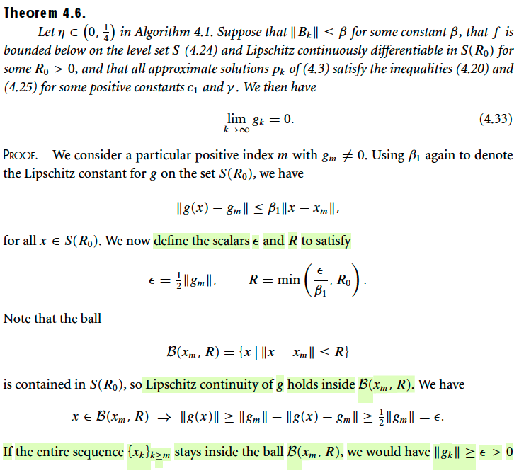</kbd>

<kbd>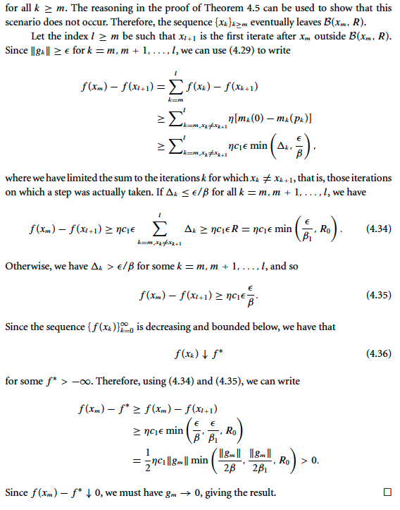</kbd>

> [!NOTE]
> Theorem 4.6 #QUAY LẠI SAU
>
> Ok, vô thẳng phần chứng minh, cùng nhau hiểu:
>
> Đầu tiên, tác giả xét một index dương cụ thể m có gm ≠ 0: Tức là tại một điểm nào đó, gradient khác 0. Và vẫn dùng β1 để kí hiệu cho Lipschitz constant. 
>
> Ôn lại Lipschizt constant: Đại ý Lipschizt coninuous là một điều kiện quy định rằng mức thay đổi của hàm số không được quá đột ngột, thể hiện bởi độ dốc của hàm số trong đoạn di chuyển phải bị chặn trên:
>
> Nên ở đây: ||g(x) - gm|| / ||x - xm|| ≤ β1 ⇔ ||g(x) - gm|| ≤ β1||x - xm||
>
> với mọi x ∈ S(R0) (vì giả thiết của định lý nói rõ f bị chặn dưới trong phạm vi level set S và Lipschitz continuosly differentiable trong S(R0), thì ý sau chính là nói cái này)
>
> Tiếp theo tác giả đặt một scalar ε = (1/2)||gm|| và R = min (ε/β1, R0) và define Euclidean ball: B(xm, R) = {x | ||x - xm|| ≤ R}, tập này nằm trong S(R0) (vì sao?) nên tính liên tục Lipschitz cũng thỏa trong đó.
>
>
> #QUAY LẠI SAU

**🔗 See also:** [Convergence of algorithms based on nearly exact solution](./43_trust_region_methods_iterative_solution_of_the_subproblem.md#node-tr8868m)

 

