# 7.1 Inexact Newton Methods

📊 **Progress:** `22` Notes | `28` Screenshots | `15` AI Reviews

---

## 7.1 Inexact Newton Methods

 

## Tối ưu không ràng buộc quy mô lớn

<kbd>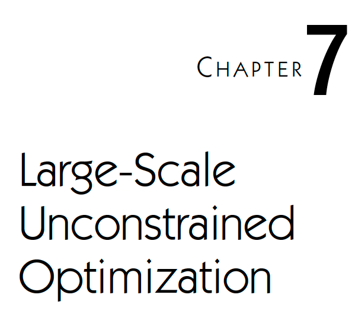</kbd>

 

### Thuật toán tối ưu quy mô lớn

<kbd>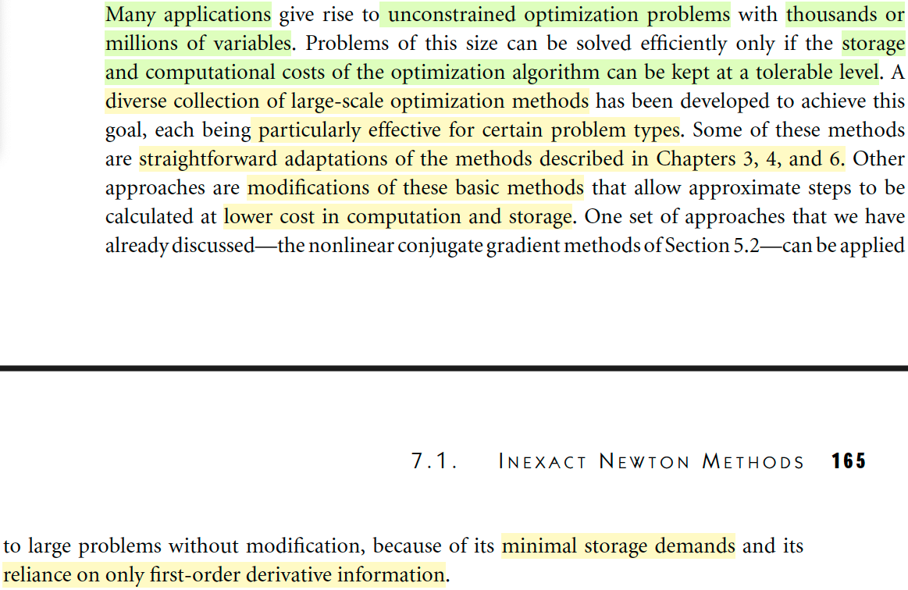</kbd>

> [!NOTE]
> Đại khái là gs nói trong thực tế có nhiều bài toán tối ưu rất lớn (hàng triệu  variable, mà ở thời kì AI ngày nay là hàng trăm tỉ variables) Do đó, yêu cầu đặt ra là cần các thuật toán tối ưu có thể giữ chi phí lưu trữ cũng như tính toán các biến số ở mức chấp nhận được. Từ đó ra đời các thuật toán tối ưu quy mô lớn này.
>
> Cách tiếp cận thì một số dùng trực tiếp các thuật toán cơ bản, một số thì chỉnh sửa sao cho giảm chi phí tính toán. Mà trong số đó non-linear conjugate method là một ví dụ (nhưng ta  bỏ qua method này trong 5.2 vì nhiều nhược điểm khiến ngày nay không ai xài nữa)

> [!TIP]
> **🤖 AI Feedback** — ⚠️ Score: **70/100**
>
> Bạn đã tóm tắt tốt về nhu cầu đối với các thuật toán tối ưu quy mô lớn và cách tiếp cận đa dạng. Tuy nhiên, thông tin về việc phương pháp gradient liên hợp phi tuyến (nonlinear conjugate gradient method) không còn được sử dụng do nhiều nhược điểm chưa hoàn toàn chính xác theo nội dung văn bản gốc, vì đoạn văn chỉ ra ưu điểm của nó cho các bài toán lớn.

 

#### Phân rã thưa trong Newton

<kbd>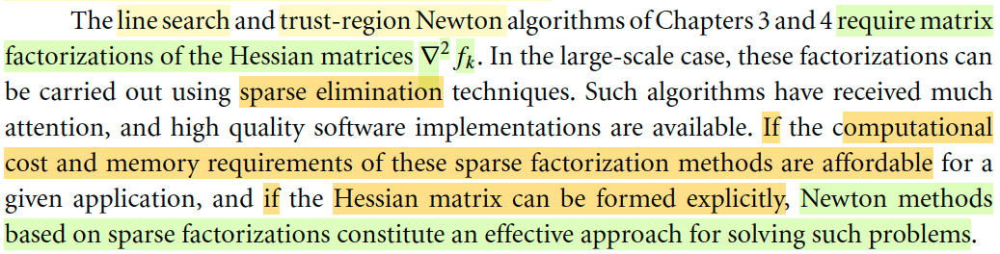</kbd>

> [!NOTE]
> Chỗ này đại khái là với line search Newton và trust region Newton thì mình cần factor Hessian bởi vì mình cần tính pk: = (∇^2fk)inv ∇fk
>
> Vì sao lại factor, là vì đang ám chỉ dùng factor-solve method để tìm inverse của Hessian, hoặc là nói cách khác, là để giải hệ [Hessian tại k] pk = - ∇fk
>
> Vì thực tế khi tìm pk, tuy là công thức nói ta sẽ pk = - (∇^2fk)inv ∇fk nhưng ta sẽ không tính inverse của Hessian, mà dùng factor-solve method để giải tìm pk.
>
> Ví dụ bước 1 ta factor ∇^2fk = LLT, thì giải ∇^2fk pk = - ∇fk tương đương giải LLT pk = - ∇fk. 
>
> bước 2: giải L y = - ∇fk. và sau đó là LT pk = y, đều là hệ tuyến tính với matrix hê số tam giác (L hay LT) ⇨ giải bằng back hay forward substitution chỉ tốn o(n^2)
>
> Do đó, ở đây gs Nocedal nói, nếu việc phân rã này không quá tốn kém và Hessian matrix có thể được hình thành một cách tường minh. Thì ta có thể xài phép phân rã spase (ví dụ = LLT chính là sparse factorization, vì nó tạo ra các matrix spare) để làm.

> [!TIP]
> **🤖 AI Feedback** — ✅ Score: **96/100**
>
> Bài giải thích rất chính xác về lý do cần phân rã ma trận Hessian và phương pháp giải hệ tuyến tính bằng factor-solve thay vì tính nghịch đảo. Độ sâu của phân tích, đặc biệt là việc giải thích các bước giải và độ phức tạp O(n^2), cho thấy sự hiểu biết sâu sắc về các phương pháp số.

 

##### In-exact Newton

<kbd>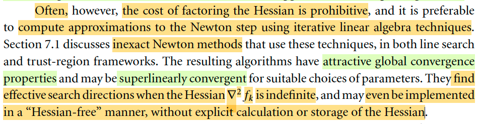</kbd>

> [!NOTE]
> Đại khái là, gs nói rằng trong thực tế thì thường là việc phân rã Hessian rất tốt kém, nên không thể dùng sparse factorization như note trước vừa nói được.  Khi đó một cách tiếp cận là GIẢI TÌM NEWTON STEP THEO LỐI ITERATIVELY, gọi là inexact Newton method. Cái này cũng có nhiều tính chất tốt, thậm chí có thể đạt hội tụ siêu tuyến tính. Và nó còn có thể tìm ra hướng đi hiệu quả ngay cả khi Hessian bị indefinite và thậm chí còn có thể có một tính chất tốt hơn nữa, đó là có thể được thực hiện theo lối "Hessian free" - tức hoàn toàn không cần tính hay lưu trữ Hessian.
>
> Nói thêm chút, cái này mình đã học bên Convex với gs Boyd. Ý tưởng giải Newton step theo lối iteratively đơn giản là: Bản chất giải tìm Newton step, chỉ là giải hệ ∇^2f p = - ∇f. Và ta đã biết có cách giải hệ này theo lối iteratively, đây chính là cách tiếp cận đang được nói đến.
>
> Vậy thì nên hiểu thế này: chương 7 ta sẽ học một cách tìm Hessian, nhằm tính Newton step pkNtrong thuật toán line search Newton hay trust region Newton, tuy nhiên không phải là ta sẽ dùng phân rã sparse để giải tìm pkN mà sẽ dùng các tiếp cận iterative, để rồi ngoài cái vòng lặp lớn (outer iteration), tại mỗi step, khi tìm pkN, ta cũng sẽ chạy một cái vòng lặp. Và đây chính là in-exac Newton method

> [!TIP]
> **🤖 AI Feedback** — ✅ Score: **98/100**
>
> Bạn đã thể hiện sự hiểu biết xuất sắc về tài liệu tham khảo, tóm tắt chính xác các điểm chính và làm phong phú thêm bài ghi chú của mình bằng kiến thức bên ngoài có liên quan.

 

- **L-BFGS và Hessian thưa**

<kbd>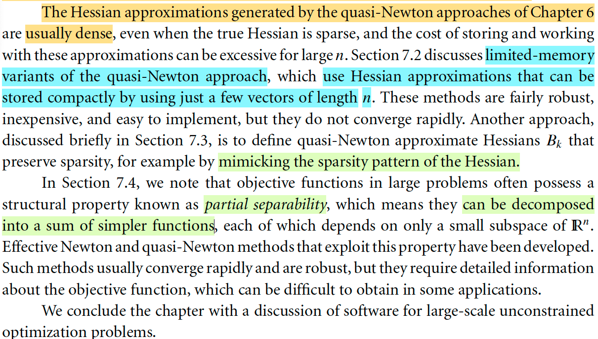</kbd>

> [!NOTE]
> Đoạn này đại khái nói rằng các matrix xấp xỉ Hessian có được nhờ quasi-Newton method trong chap 6 mình học thường là dense, kể cả khi Hessian thật sparse, do đó nó rất tốn kém. Thành ra 7.2 ta sẽ học về L-BFGS là thuật toán BFGS khắc phục được vấn đề này. Rất quan trọng trong machine learning.
>
> → Mình nên hiểu, đây là bước nâng cấp phương pháp quasi-Newton cho bài toán quy mô lớn. Cũng nên hiểu, quasi-Newton hoàn toàn khác inexact-Newton: quasi-Newton, ta dùng dùng một cách thức để có matrix Bk XẤP XỈ của Hessian thông qua việc cập nhật matrix Bk trong suốt outer iteration của thuật toán. 
>
> Và thật ra là ta sẽ cập nhật cái inverse của Bk, và dùng nó để tính pk.
>
> Còn inexact Newton là ta dùng cách chạy một iteration để giải phương trình [Hessian thật ] pk = - gradient thật theo lối iteratively (điều này cũng giống như ta dùng pk = -[Hessian thật] gradient thật, nhưng tìm pk này theo lối iteratively.
>
> Còn 7.3 thì ta thảo luận một dạng xấp xỉ Hessian khác nhưng giữ được tính sparse của Hessian nếu nó sparse.

> [!TIP]
> **🤖 AI Feedback** — ⚠️ Score: **85/100**
>
> Bạn đã nắm bắt rất tốt các điểm chính về xấp xỉ Hessian dày đặc, các biến thể bộ nhớ hạn chế và duy trì tính thưa thớt từ văn bản. Để tăng cường độ sâu theo văn bản gốc, bạn nên tập trung phân tích và chỉ rút ra thông tin có trong đoạn văn bản đã cho.

 

- **Phương pháp Newton không chính xác**

<kbd>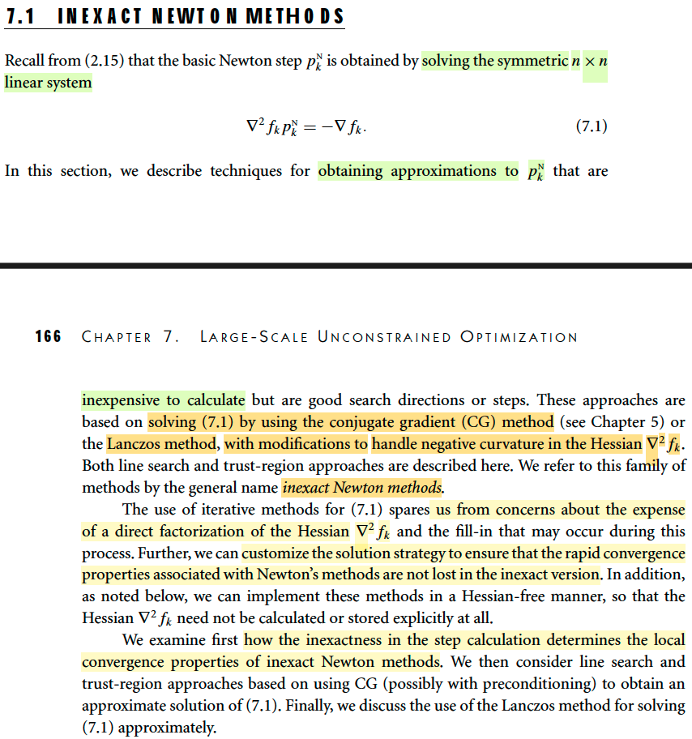</kbd>

> [!NOTE]
> Phần này đại khái là ta sẽ học những cách để tính gần đúng Newton step (như đã biết, là nghiệm của hệ tuyến tính ∇^2 fk pkN = - ∇fk) với các phương pháp như dùng Conjugate Gradient hoặc Lanczos method và có chỉnh sửa chút.
>
> Như lúc đầu đã nói sơ, tuy rằng ta có thể giải hệ này bằng phép phân rã matrix nhưng vấn đề là có khi matrix phân rã không sparse, ngay cả khi Hessian thực tế vẫn sparse. (gọi là Fill-in)
>
> Thêm nữa, tác giả nói ta cũng có thể tùy chỉnh thuật toán thêm để đảm bảo tốc độ hội tụ nhanh của Newton's method không bị mất đi khi ta dùng inexact Newton. Bên cạnh đó, ta cũng sẽ nói về cái vụ Hessian - free, tức là hoàn toàn không cần tính toán hay lưu trữ Hessian chút nào.
>
> Phần tiếp theo đại khái là gs Nocedal sẽ đưa ra tính toán để chứng minh rằng dù là inexact Newton nhưng thuật toán sẽ đảm bảo vẫn hội tụ.

> [!TIP]
> **🤖 AI Feedback** — ✅ Score: **97/100**
>
> Bản tóm tắt rất chính xác và bao quát đầy đủ các ý chính, đặc biệt là việc giải thích rõ ràng về "fill-in" và phương pháp "Hessian-free". Để hoàn thiện hơn, có thể điều chỉnh cách diễn đạt ở phần cuối về việc Nocedal "chứng minh" thành "phân tích" tính hội tụ để sát với ngữ cảnh gốc.

 

- **Local Convergence of Inexact Newtons**

<kbd>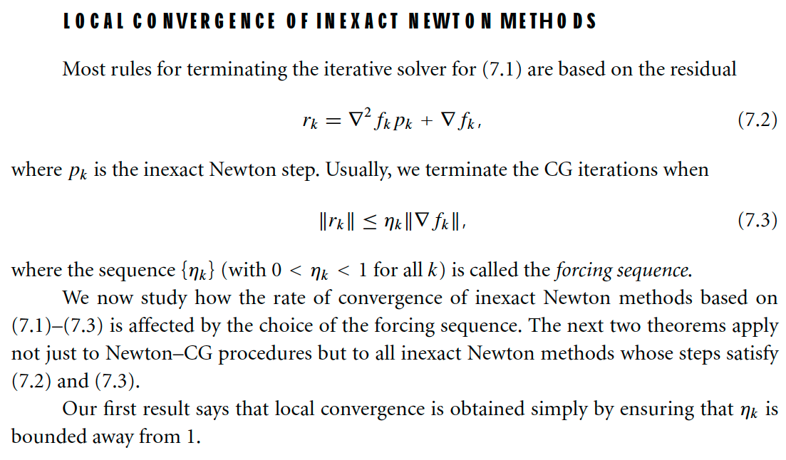</kbd>

> [!NOTE]
> Theo tư vấn thì nên skip, quay lại sau phần này, vì nó chỉ là phân tích tính hội tụ, nhưng mình có thể hiểu sơ sơ ý chính là vầy:
>
> Đầu tiên nên nhớ khác nhau giữa quasi-Newton và inexact Newton: 
>
> Inexact Newton, là nói về việc ta muốn tìm Newton-step, trong bối cảnh thuật toán line search Newton hoặc trust region Newton (tức muốn pk là Newton step), nhưng thay vì giải hệ ∇^2 fk pkN = - ∇fk theo những cách thông thường: ví dụ phân rã sparse Hessian, mà trong bối cảnh bài toán quy mô lớn sẽ tốn kém, thì ta sẽ dùng cách thức iteratively để giải hệ này để tìm pkN. Đây gọi là inexact Newton.
>
> Còn quasi-Newton hoàn toàn khác: cũng là ta muốn tính pk = -(∇^2 fk)inv ∇fk, thì ta tránh chi phí cao của việc này bằng cách: giả lập Hessian, thay nó bởi Bk, và xây dựng một phương pháp mà trong đó suốt quá trình của thuật toán ta sẽ liên tục cập nhật lại Bk (hay Bkinv dùng các thông tin mới), thì đây là quasi-Newton.
>
> Vậy thì quay lại đây, với inexact Newton, ta sẽ có một vòng lặp khác giúp giải ∇^2fk pkN = -∇fk TRONG MỖI vòng lặp của thuật toán. DO ĐÓ, DĨ NHIÊN PHẢI CÓ CÁCH ĐỂ BIẾT KHI NÀO THÌ DỪNG vòng lặp con này để có pkN mà xài, vậy thì ở đây chính là nói tới điều này: Ta sẽ dùng residual rk = ∇^2fk pk + ∇fk. Là sao, vì sao?
>
> → Thì bởi vì mục đích là giải hệ ∇^2fk pkN = -∇fk chính là tìm pkN sao cho ∇^2fk pkN = .. -∇fk, mà pkN trong quá trình giải theo lối iteratively sẽ là chuỗi pkN_i sao cho ∇^2fk pkN_i ngày càng gần với -∇fk, đồng nghĩa cái khoảng cách giữa ∇^2fk pkN_i với -∇fk sẽ ngày càng tiến đến 0, đó cũng chính là nói chuỗi residual rk_i = ∇^2fk pkN_i + ∇fk → 0.
>
> Và ta sẽ dừng khi rk_i đủ nhỏ (để pkN_i khi đó là xấp xỉ bằng Newton step thật: -(∇^2 fk)inv ∇fk. 
>
> Thế thì ta sẽ giải cái hệ này ∇^2fk pkN = -∇fk bằng cách nào: Đó chính là dùng Conjugate Gradient đã học ở chapter 5:
>
> Theo đó còn nhớ đại khái story hay idea của CG là vầy: Đối mặt với hệ phương trình tuyến tính Ax = b, CG có thể giúp ta đi từ initial x0 ở đâu đó, và chọn p0 là steepest direction tại x0, để đi đến nghiệm x* của Ax = b trong NHIỀU NHẤT là n bước, và nếu A có các tính chất nào đó thì thậm chỉ số bước còn ít hơn. Do đó, ở đây, chính là ta sẽ áp dụng CG để giải hệ ∇^2fk pkN = -∇fk (với một số chỉnh sửa nhất định vì trong CG gốc, matrix A được yêu cầu phải là xác định dương nhưng Hessian thực tế thì ko phải lúc nào cũng xác định dương)
>
> Vậy thì ở đây, ta hiểu là mình sẽ chạy thuật toán CG để giải ∇^2fk pkN = -∇fk tìm pkN nhưng kiểu như là ta sẽ không chạy cho đến khi "xong", mà thay vào đó, chỉ chạy cho đến khi "tạm được", tức là không cần rk_i = 0, mà chỉ cần rk_i thỏa điều kiện nào đó. Và do đó, ở đây gs nói về điều kiện mà ta sẽ dừng thuật toán CG:
>
> ||rk|| ≤ ηk ||∇fk||
>
> Và cái điệu kiện dừng này có thể hiểu thế nào?
>
> → Có thể hiểu là: 
>
> Ví dụ tại outer iteration k = 5, khi chạy inner iteration để tìm p5, thì ta sẽ có điều kiện dừng cho chuỗi tìm kiếm p5_i là ||r5_i|| ≤ η5 ||∇f(x5)||. 
>
> Và phần này người ta muốn chứng minh rằng: chỉ cần độ lớn của chuỗi ηk tránh ra số 1 thì thuật toán inexact-Newton chắc chắn sẽ hội tụ

**🔗 See also:** [5.1 The Linear Conjugate Gradient Method](./51_linear_conjugate_gradient.md#node-hpdy8sw)

 

- **Line-Search Newton-CG Method**

<kbd>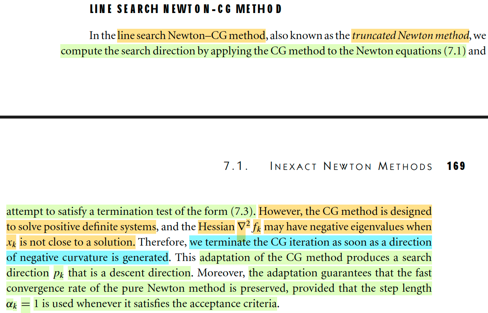</kbd>

> [!NOTE]
> Nói sơ nhanh về ý tưởng của method này: Ta muốn dùng Newton step (Newton direction) trong các thuật toán lớn nào đó, ví dụ Line Search, Trusted Region. Muốn vậy, ta phải giải hệ này: ∇^2fk pk = - ∇fk. Mà với bài toán quy mô lớn thì việc giải hệ này tìm pk (trong trường hợp này, gọi là pkN, "pk_Newton" sẽ rất tốn kém vì các lí do sau: Tất nhiên nói giải cái này theo công thức pk = -(∇^2fk)inv ∇fk thì cũng không có nghĩa là ta đi tìm Hessian inverse, rồi đem nhân với gradient, mà ta sẽ factor-solve: factor Hessian thành các tích các matrix có cấu trúc đơn giản, và giải lần lượt các hệ đơn giản này. Vấn đề là, sparse factor ko phải lúc nào cũng được: đôi khi Hessian thật thì sparse nhưng factor xong thì dense (= không có simple structure). Do đó, ta sẽ dùng một cách thức để giải hệ ∇^2fk pk = - ∇fk này một cách iteratively, và chapter 5 ta đã học một phương pháp cho việc giải hệ Ax = b theo lối iteratively như vậy: Đó chính là CG: Conjugate Gradient method, là thuật toán mà đã chứng minh rằng nếu matrix hệ số (A, ở đây là Hessian có quy mô n × n thì chỉ tốn nhiều nhất là n step để tìm ra được x* (hay pkN*), thậm chí còn nhanh hơn nếu như cấu trúc của A (ví dụ phân phối của trị riêng của nó) có tính chất đặc biệt nào đó (ví dụ như co cụm lại thành một số ít nhỏ hơn n nhiều lần các cụm). Như vậy, ở đây ta sẽ nói về Line-Search Newton - CG, tức là: dùng thuật toán line search, mà cơ bản là như đã biết, ta sẽ iteratively thực hiện các bước: 
>
> - tìm pk, và ở đây ta sẽ dùng Newton step. Và ta sẽ chạy thuật toán CG để tìm pk.
>
> - line search tìm step size: αk, lúc này có thể dùng exact line search (nhưng chắc chả mấy khi dùng), hoặc dùng backtracking line search để tìm αk thỏa Wolfe / strong Wolfe conditions.
>
> -----
>
> Thế thì vấn đề là trong chap 5 ta đã biết, CG method work với một assumption tiên quyết: matrix A xác định dương: tức là độ cong của hàm f luôn là cong lên ở mọi hướng. Nhưng áp dụng vào đây, dễ thấy Hessian đâu phải lúc nào cũng xác định dương, do đó, CẦN MỘT SỐ CHỈNH SỬA đối với CG: Và cụ thể sự chỉnh sửa chỉ đơn giản thôi: Ngay khi ngay khi CG (trong outer iteration k) tìm ra pk_i chỉ theo hướng mà độ cong âm (tức là hàm sẽ cong xuống theo hướng đó), ta sẽ dừng CG. Điều này tác giả nói sẽ giúp pk luôn là descent direction cũng như giữ được các tính chất hội tụ nhanh của Newton method.

> [!TIP]
> **🤖 AI Feedback** — ✅ Score: **98/100**
>
> Phân tích của bạn rất sâu sắc và chính xác, giải thích rõ ràng ý tưởng, lý do cần thiết cho phương pháp này và các điều chỉnh quan trọng của nó. Để hoàn thiện hơn, bạn có thể bổ sung tên gọi khác của phương pháp là "phương pháp Newton bị cắt cụt" (truncated Newton method) như được nhắc đến trong văn bản.

 

- **Vòng lặp trong CG Newton**

<kbd>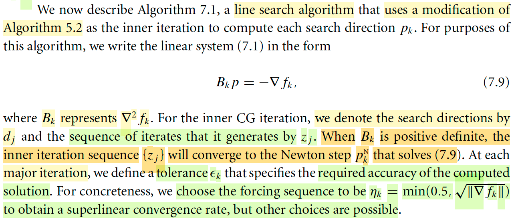</kbd>

> [!NOTE]
> Vài ghi chú về kí hiệu trước khi tác giả mô tả thuật toán Line Search Newton CG: 
>
> Lí do là vì để ta khỏi lẫn lộn giữa kí hiệu đã học của hai thuật toán line searcg, và CG: Phải hiểu rằng, ta sẽ có hai vòng lặp lồng vào nhau: vòng lặp lớn outer iteration sẽ đi từ x0 → x1 → ...→ xk → xk+1...và cho đến khi về được minimizer của f(x) (với điều kiện dừng là gradient vanish ||∇fk|| = 0 hay < ε nào đó), và trong mỗi iteration. ví dụ thứ k nó sẽ:
>
> Chạy inner iteration để tìm pk bằng cách dùng CG để giải hệ Bk p = -∇fk (Dùng Bk chỉ Hessian ∇^2fk). Mà trong mỗi inner iteration, thuật toán CG sẽ tính ra các direction dj, để sinh ra cái chuỗi zj (là chuỗi p_j này sẽ converge về nghiệm thật sự của Bk p = -∇fk, tức p* = -(Bk)inv ∇fk)
>
> Có lẽ phải nhớ lại thuật toán CG chút xíu: Mục tiêu là giải Ax = b theo cách iteratively: Idea sẽ là ta đang giải bài toán tối ưu minimize hàm F(x) là là nguyên hàm của Ax - b, để cho first order necessary condition của nó chính là ∇F(x) = 0 ⇔ Ax - b = 0. Vậy thì xuất phát từ x0, chọn p0 là steepest descent direction tại x0, ta sẽ có cách generate p1 sao cho nó conjugate wrt matrix A với p0, rồi cũng tính step-size α1, và đi đến x1, tiếp tụ, từ x1, tìm p2 là conjugate wrt matrix A với p1, và cũng là với p0, ròi α2, đến x2,....Để rồi cuối cùng ta sẽ hội tụ dần về x*, chính là solution của Ax = b.
>
> Vậy thì ở đây, ví dụ trong outer iteration k = 4, ta muốn tìm p4 là nghiệm của B4 p = -∇f4. Thì ban đầu ta cũng sẽ chọn p0 (initial point, vai trò như x0) nào đó, chọn d0 là steepest direction, rồi tìm d1 conjugate wrt B4 với d0, tính step size, và đến được p1. Lặp lại, tìm d2 conjugate wrt B4 với d1, d0, tính step size, đến được p2, cứ thế. Và ta sẽ tại ra chuỗi {pi}, nhưng theo sách ta sẽ dùng chữ z: {zi} converge về solution thật sự của B4 p = ∇f4. 
>
> Tất nhiên, như đã nói trước, ta sẽ không chạy hết n iteration đế có chuỗi z0, z1,....zn converge về solution của B4 p = ∇f4, mà sẽ có điều kiện dừng: ||ri|| = B4 zi + ∇f4 ≤ η4 ||∇f4||. với η4 được thiết kế sao cho đảm bảo hội tụ như phần trước đã nói. Cụ thể ta sẽ chọn η4 = min{0.5 √||∇f4||}
>
> Tại đây ta đã có p4, ta tiếp tục qua phần 2 của một outer iteration: tính step size α4, để rồi nhảy từ x4 → x5 = x4 + α4p4. Và tíếp tục outer iteration tiếp theo.

> [!TIP]
> **🤖 AI Feedback** — ✅ Score: **98/100**
>
> Ghi chú rất chính xác và có chiều sâu, giải thích rõ ràng cấu trúc lồng nhau của thuật toán và cung cấp nền tảng vững chắc về phương pháp Gradient Liên Hợp. Cần lưu ý một lỗi nhỏ trong công thức $\eta_k$ (thiếu dấu phẩy giữa 0.5 và căn bậc hai của gradient norm).

 

- **Thuật toán Newton-CG**

<kbd>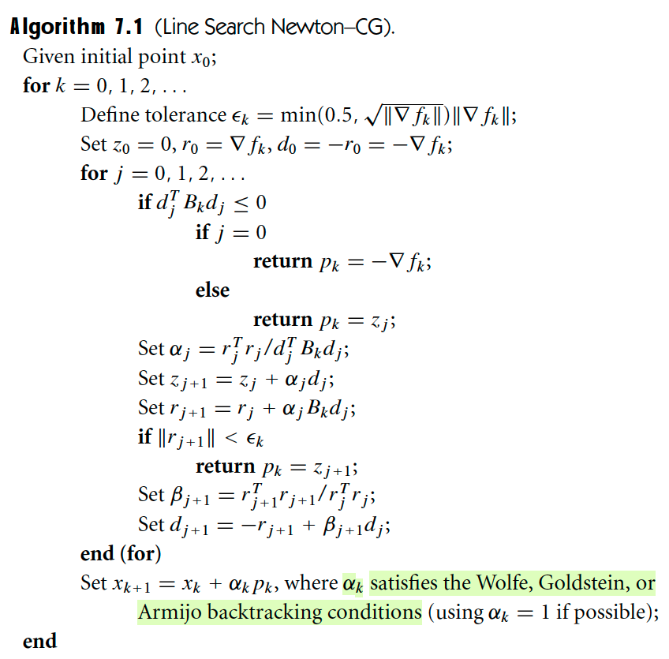</kbd>

<kbd>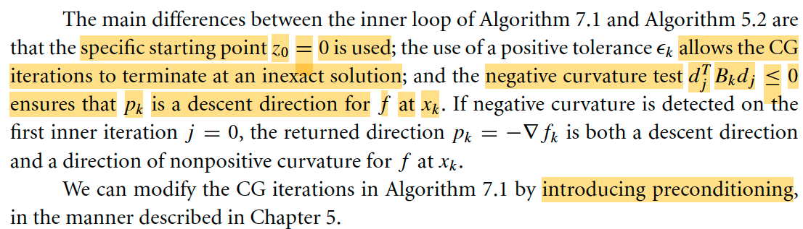</kbd>

> [!NOTE]
> nói sơ thuật toán này:
>
> Vòng lặp lớn, gọi là outer iteration ta sẽ làm các việc sau:
>
> 1) Định nghĩa εk, dùng để dừng vòng lặp tìm kiếm pk bởi CG
>
> 2) Khởi tạo z0 = 0. r0 = gradient ∇fk, d0 = -r0 = -∇fk
>
> Đây là điểm khác so với CG trong chap 5, trong đó ta sẽ bắt đầu tại initial point nào đó, chứ không phải 0, xem lại liên kết, trong đó nói ta có initial point x0 (chú ý, x0 chính là tương đương z0 ở đây, giải tìm x thỏa Ax = b chính là giải tìm p thỏa ∇^2fk p = - ∇fk.
>
> Còn r0 chọn bằng ∇fk là sao? → đó là initial residual = residual tại z0 = ∇^2fk × 0 -(-∇fk) = ∇fk (nhớ ko? residual là rk = Axk - b, ở đây thì là ∇^2fk zj + ∇fk)
>
> Còn d0 chọn bằng -∇fk là sao? → chính là theo CG, thì initial direction chọn bằng steepest descent direction tại initial point.
>
> 3) Chạy vòng lặp thuật toán CG: 
>
> Đầu tiên nó có chốt chặn: Kiểm tra djTBkdj (như đã ghi chú, trong phần này, gs kí hiệu nó cho Hessian tại k, ∇^2fk) xem âm hoặc bằng 0 không, nếu có thì dừng thuật toán CG, pk = zj (nếu ngay ở step đầu tiên mà djTBkdj đã ≤ 0 thì dùng ngay cái steepest descent direction -∇fk. 
>
> Chỗ này là sao? → Đây chính là đoạn chỉnh sửa so với CG, vì trong CG chuẩn, ta có giả định matrix hệ số A xác định dương, pkBkpk (tương ứng với djTBkdj ở đây) sẽ luôn dương. Nhưng ở đây, Hessian Bk không chắc luôn xác định dương, nên djTBkdj có thể âm hoặc bằng 0. Khi đó, CG sẽ bị lỗi ở bước tính αj = rjTrj / djTBjdj: Lỗi explode nếu djTBkdj = 0 hoặc αj sẽ âm nếu djTBkdj âm → dẫn tới thuật toán sẽ dẫn ta đi ngược lại hướng dj → tăng residual thay vì giảm. Do đó, LSNCG sẽ stop ngay khi thấy djTBkdj đã ≤ 0.
>
> Các bước tiếp theo trong vòng lặp là các bước của thuật toán CG điển hình, nhưng có thêm một chỉnh sửa nữa, thay vì chạy "cho đến hết" thì ta sẽ dừng / thoát, khi residual đủ nhỏ (so với εk)
>
> 4) Sau khi có pk, thực hiện cập nhật vị trí xk+1 = xk + αkpk (step size αk thỏa Wolfe, Goldstein hay Armijo condition)

> [!TIP]
> **🤖 AI Feedback** — ✅ Score: **92/100**
>
> Bài phân tích rất sâu sắc và chính xác, đặc biệt là các giải thích về lý do thay đổi so với thuật toán CG chuẩn. Tuy nhiên, công thức định nghĩa εk có một lỗi nhỏ, thiếu căn bậc hai của ||∇fk||.

**🔗 See also:** [A Practical Form Of The Conjugate Gradient Method.](./51_linear_conjugate_gradient.md#node-jdgssae)

 

- **Newton-CG Hessian gần suy biến**

<kbd>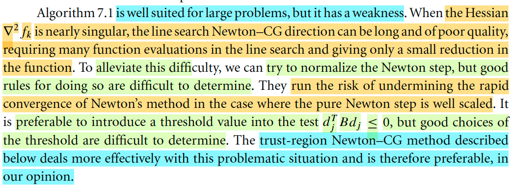</kbd>

> [!NOTE]
> Tiếp, thầy Nocedal cho biết thuật toán này tốt cho large problem nhưng nó có một điểm yếu: là khi Hessian gần singular, thì line search Newton - CG direction có thể dài và poor quality, dẫn đến cần nhiều bước function evaluation trong line search mà chỉ cho một mức giảm nhỏ của function. Ý này là sao?
>
> Giả sử Bk gần singular, tức là vẫn non-singular ⇨ invertible thì bản chất pk mà CG giúp giải chính là pk = - (Bk)inv gk (Bk, gk là Hessian, gradient).
>
> Bk là Hessian, là matrix đối xứng, nên Bkinv cũng vậy, luôn tồn tại phép phân tách trị riêng vector riêng: (Bk)inv = Q Λ QT, Q là orthogonal matrix bởi eigenvector của cả Bk và Bkinv (hai thằng này có chung eigenvector) và Λ là diagonal matrix trị riêng của Bkinv, cũng là nghịch đảo của trị riêng của Bk. Mà Bk gần singular → tồn trị riêng nhỏ gần bằng 0 → trị riêng tương ứng của (Bk)inv sẽ rất lớn.
>
> Thế thì ta thấy - (Bk)inv gk = - Q Λ QT gk có bản chất là gì ôn lại cho nhớ:
>
> QT gk sẽ chuyển đổi tọa độ của gk trong basis e's sang tọa độ basis q's (eigenvector của Bk) 
>
> (Ôn lại kiến thức linear transformation học với thầy Strang:
>
> Muốn xây dựng matrix A đại diện cho phép biến đổi tuyến tính T(v) thì làm một cách tổng qúat như sau:
>
> Chuẩn bị input basis v's và output basis w's.
>
> Biến đổi tuyến tính các input basis: T(v1), T(v2),...
>
> Thể hiện nó theo output basis: 
>
> T(v1) = α11 u1 + α21u2 + ... = [α11, α21,..]T W (vector cột × matrix U = [u1, u2,...]
>
> T(v2) = α12 u1 + α22u2 + ...= [α12, α22,..]T W (vector cột × matrix U = [u1, u2,...]
>
> Đặt [α11, α21,..]T, [α12, α22,..]T...thành các cột của  A
>
> → [T(v1), T(v2),...] = A W, thì A chính là matrix đại diện cho linear transformation T(v) từ input space basis v's → output space basis w's
>
> Áp dụng với identity transformation:
>
> T(v1) = v1 = [A col 1]W
>
> T(v2) = v2 = [A col 2]W
>
> ...
>
> → V = A W 
>
> ⇨ A = VWinv chính là change of basis matrix chuyển từ tọa độ basis v's sang tọa độ basis w's
>
> Nếu v's là standard basis thì V = I. → Winv chính là matrix chuyển tạo độ basis chuẩn sang basis w's.
>
> Quay lại đây, QT gk cũng chính là Qinv gk chính là chuyển tọa độ của gradient gk từ basis e's sang basis q's. Về mặt hình học, chính là xoay trục tọa độ trở nên sao cho các trục thẳng góc với các vector q's (cũng vuông góc nhau)
>
> Sau đó Λ QT gk chính là kéo giãn không gian theo các hướng q's bởi factor λ's. (cũng là scale các tọa độ của QT gk lên bởi λ's Và cuối cùng Q Λ QT gk sẽ chuyển lại tọa độ theo basis e's.
>
> Thế thì từ đó ta thấy, vì một λ nào đó rất lớn, nên sẽ tạo stretch factor rất lớn, khiến kéo dài vector rất lớn theo phương đó. Kết quả là ta sẽ có pk rất dài.
>
> Và rất dài thì sẽ gây vấn đề, lí do là vì, hướng pk, là Newton step, cơ bản chỉ hướng đi xuống (giảm hàm f) bằng cách coi / ước lượng hàm f bởi hàm bậc hai, và đương nhiên sự ước lượng này chỉ đúng trong phạm vi nhất định quanh xk, chứ xét ở phạm vi xa thì nó ko còn đúng nữa, nói cách khác, pk sẽ giúp đi xuống, nhưng nếu đi qua xa theo hướng đó, hàm chưa chắc đi xuống. 
>
> Thế thì ta nhớ, khi có pk (bởi CG) thì ta còn phải có αk, dùng backtracking để tìm αk thỏa Wolfe / Goldstein / Armijo condition. Mà ta nhớ, với Newton method, cách làm cơ bản là ta sẽ cho intial value = 1, và giảm dần xuống cho đến khi thỏa. Thế thì nếu pk quá dài, cơ bản là sẽ cần giảm rất nhiều lần, mà mỗi lần thì phải tính giá trị f, mà bước này với bài toán quy mô lớn thì cũng rất tốn kém.  
>
> ====
>
> Một cách để giải quyết đó là ta normalize Newton step pk nhưng điều này sẽ mà mất đi cái điểm mạnh của Newton step: Ý này rất dễ hiểu, nếu ta cứ normalize cho ||pk|| = 1, thì sẽ khắc phục được vụ pk rất dài, nhưng sẽ bị vụ khác: ví dụ như khi pk ban đầu ||pk|| = 0.25, thì thay vì dùng intial value của αk = 1 là xong thì ta lại phải tăng pk lên norm 1 và đi lùi xuống → lãng phí.
>
> Một cách nữa, là dùng cái threshold khi check djTBkdj (tức là thay vì dùng threshold = 0, thì dùng giá trị nào đó để check) tuy nhiên việc tìm ra threshold tốt cũng khó.
>
> Do đó gs nói rằng ông khuyến nghị rằng nên dùng thuật toán sau đây: Trust-region Newton CG

> [!TIP]
> **🤖 AI Feedback** — ✅ Score: **98/100**
>
> Bài ghi chép của bạn rất xuất sắc và sâu sắc, không chỉ tóm tắt chính xác mà còn giải thích chi tiết cơ chế toán học về vấn đề Hessian gần singular, thể hiện sự hiểu biết vững chắc. Để tối ưu hơn, bạn có thể cân nhắc cô đọng phần ôn tập kiến thức biến đổi tuyến tính để giữ trọng tâm vào vấn đề chính của thuật toán.

 

- **Phương pháp Newton không Hessian**

<kbd>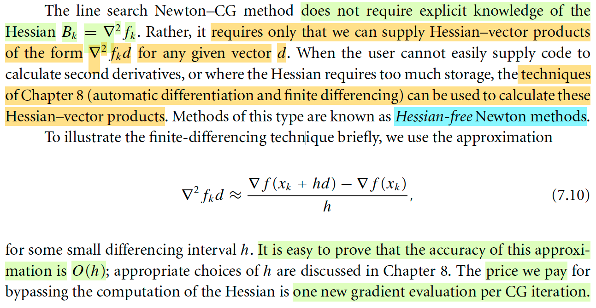</kbd>

> [!NOTE]
> Đoạn này hiểu đại ý là, trong thuật toán Line Search Newton CG, ta không trực tiếp tính Hessian Bk, nhìn lại sẽ thấy, trong các bước có dính đến Bk, thật ra cái ta cần là Bkdj, tức là kết quả nhân matrix Bk với direction vecto dj. Do đó, thật ra không cần phải tính ra Hessian, rồi đem nhân nó với dj, mà có cách cho ra luôn kết quả này.
>
> Và trong chap 8 sẽ nói nhiều hơn về cái này, nhưng đại ý là, ta sẽ dùng công thức finite differencing:
>
> ∇^2fk d ≈ [∇f(xk + hd) - ∇f(xk)] / h.
>
> Công thức này là sao?
>
> Đơn giản thôi, xét hàm g(α) = ∇(xk + αd).
>
> g'(α) = d/dα ∇(xk + αd) = d/d(xk + αd) ∇(xk + αd) . d/dα (xk + αd)
>
> = ∇^2f(xk + αd) d
>
> ⇨ ∇^2f(xk) d = g'(α)|α=0 tức là đạo hàm của hàm  g(α) = ∇(xk + αd) tại α = 0.
>
> Như vậy, dựa theo định nghĩa đạo hàm hàm f(x):
>
> f'(x) = lim δx→0 [f(x + δx) - f(x)] / δx
>
> Nếu δx nhỏ, ta có thể bỏ lim, thay bằng dấu ≈ để có cái gọi là linear approx:
>
> f'(x) ≈ [f(x + δx) - f(x)] / δx 
>
> Như vậy áp dụng cái này:
>
> g'(α) ≈ [g(α + δ) - g(α)] / δ
>
> → g'(α)|α=0 ≈ [g(δ) - g(0)] / δ 
>
> = [∇(xk + δd) - ∇(xk)] / δ
>
> (Thay δ bằng h thì ta có công thức trong sách)
>
> -----
>
> Thế thì nhờ cách này, ta sẽ ko cần phải LƯU TRỮ HESSIAN Bk, (để rồi cũng ko cần phải tính Bkd) mà chỉ cần tính hiệu của hai gradient tại xk và xk + hd, rồi chia h), khiến cho trong thuật toán CG sẽ tăng thêm một bước tính toán, nhưng không cần phải lưu trữ Hessian: Đây chính là "Hessian - free"

> [!TIP]
> **🤖 AI Feedback** — ✅ Score: **95/100**
>
> Phần giải thích và đặc biệt là cách bạn suy luận công thức xấp xỉ phân biệt hữu hạn (finite differencing) rất sâu sắc và chính xác. Để hoàn thiện hơn, bạn có thể bổ sung thông tin về bậc chính xác của phép xấp xỉ này.

 

- **Phương pháp Trust-Region Newton CG**

<kbd>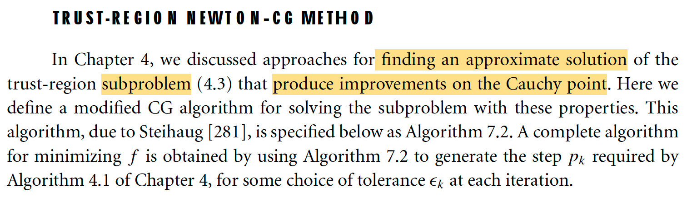</kbd>

> [!NOTE]
> Ok, qua Trust-Region Newton CG. Đầu tiên gs nhắc lại rằng hồi chapter 4 mình đã biết về một số cách tiếp cận giúp tìm approx solution của bài toán trust region subproblem 4.3 mà thực hiện những sự cải thiện đối với Cauchy point. Thử ôn lại tí:
>
> Đầu tiên ý tưởng chính của trust region method tóm gọn như sau: Tại mỗi iteration, xem hàm f như hàm bậc hai, để giải bài toán minimize hàm bậc hai mk(p) có ràng buộc ||pk|| ≤ Δk, với ràng buộc Δk xác định ở iteration trước. Giải ra pk, check thử xem độ uy tín của mô hình mk, bằng tỉ lệ giữa độ giảm bởi mk và độ giảm thực tế (nếu dùng pk để cập nhận vị trí), để nếu độ tỉ lệ này cao (hướng về 1) chứng tỏ mk mô phỏng đúng f, và ||pk|| = Δk, ta sẽ tăng trust region. Ngược lại nếu độ uy tín thấp, chứng tỏ mk mô phỏng sai hàm f, ta sẽ không dùng pk, giảm trust region. Còn uy tín vừa vừa thì vẫn update nhưng giữ nguyên trust region. Ý tưởng chính là vậy.
>
> Còn cụ thể hơn mk(p) là xấp xỉ bậc hai của f tại xk: mk(p) = fk + ∇fkTp + (1/2) pT Bk p. Nếu Bk được chọn là Hessian ∇^2fk, thì ta có trust region Newton, nếu Bk là I thì ta sẽ có trust region steepest descent, còn nếu Bk là ma trận xấp xỉ Hessian thì ta có trust region quasi Newton.
>
> Và bài toán minimize mk s.t ||pk|| ≤ Δk gọi là sub-problem.
>
> Thế thì Cauchy point là gì?
>
> Còn nhớ Cauchy-point là như sau: Xác định hướng dốc nhất tại xk (-∇fk) và đi theo hướng đó cho tới khi đụng hàng rào: Nên pkC là solution của bài toán:
>
> minimize m(-α ∇fk) s.t ||α ∇fk|| ≤ Δk
>
> Để rồi sau đó, ta có thể có những cách tiếp cận cải thiện Cauchy point như: Thuật toán dog-leg,  2D subspace minimization. Và trong chap 4 đã nhắc đến cách thứ 3, chính là dùng CG mà ở đây đang nói tới. (Xem link để quay lại phần "Nói sơ về nội dung sắp tới" có nhắc đến chỗ này)

> [!TIP]
> **🤖 AI Feedback** — ⚠️ Score: **85/100**
>
> Bài viết đã nắm bắt chính xác ý chính của đoạn văn, đặc biệt là phần giới thiệu về việc tìm kiếm giải pháp xấp xỉ và cải thiện điểm Cauchy. Tuy nhiên, nó bỏ qua một số chi tiết cụ thể như tên tác giả (Steihaug) và số hiệu thuật toán (7.2 và 4.1) được đề cập trong văn bản gốc.

**🔗 See also:** [Algorithm 4.1 (Trust Region)](./40_trust_region_methods_outline_of_the_trust_region_approach.md#node-c4gu30d) · [Nói sơ về nội dung sắp tới](./40_trust_region_methods_outline_of_the_trust_region_approach.md#node-4u120q2)

 

- **Trust Region Newton CG**

<kbd>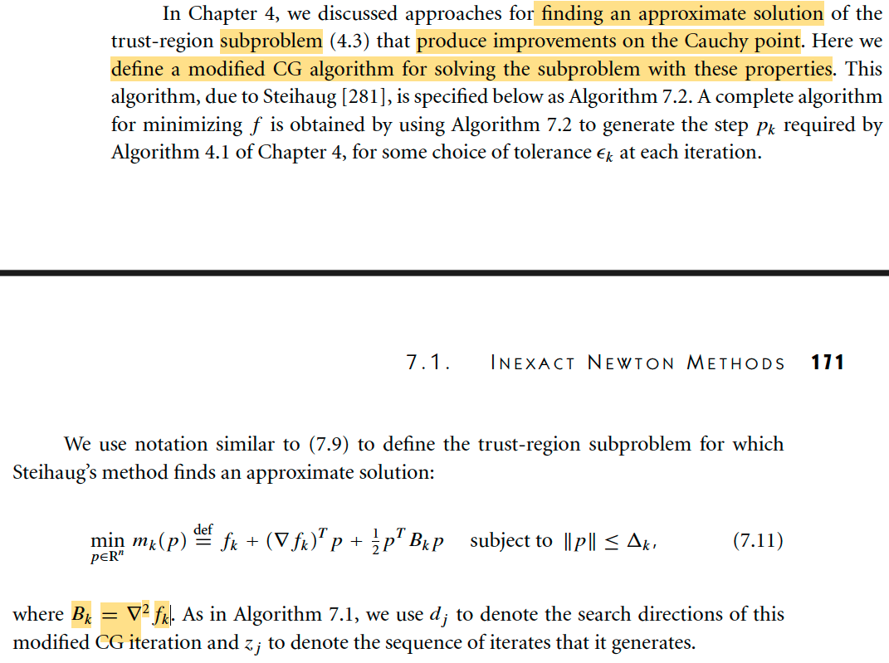</kbd>

<kbd>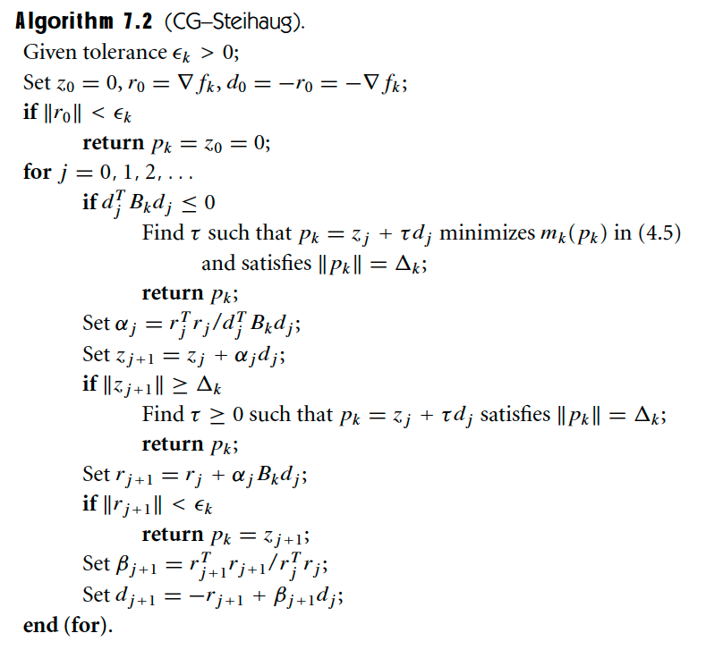</kbd>

> [!NOTE]
> Vậy thì đại ý là ở đây, ta sẽ bàn về cách tiếp cận, chỉnh sử CG để giải bài toán subproblem, nói cách khác, thuật toán Trust-Region Newton CG tức là ta ÁP DỤNG CG (có chỉnh sửa) ĐỂ GIẢI BÀI TOÁN SUBPROBLEM BÊN TRONG TRUST REGION NEWTON METHOD. (thay vì dùng Cauchy-point, hay các phương pháp cải thiện Cauchy-point như dogleg, 2D subspace) 
>
> Và dĩ nhiên cũng dễ hiểu thuật toán 7.2 (CG Steihaug) chỉ là CG chỉnh sửa để giải subproblem thôi, đặt nó trong vòng lặp lớn của thuật toán 4.1 (Trust Region), cụ thể là cái bước giải subproblem tìm pk thì ta mới có đầy đủ Trust Region Newton CG. 
>
> Có thể vẫn cần nói lại điều này cho khắc sâu hơn: Nên nhớ tác dụng của CG chủ yếu là giúp giải hệ Ax = b. Và khi đối diện với thuật toán nào mà pk của nó là dùng Newton step, thì chính là khi ta muốn giải hệ ∇^2 fk p = -∇fk để tìm pk. Và do đó, CG có thể giúp giải cái hệ này theo lối iteratively. Tuy nhiên vì CG gốc giải định A xác định dương, nên khi áp dụng vào bài toán này, Hessian có thể không xác định dương, thì ta phải chỉnh sửa CG. 
>
> Nếu so với Line Search Newton CG vừa học, thì tại mỗi outer iteration, ta có thêm inner iteration của CG để tìm Newton step.
>
> Thì trong bối cảnh của Trust region, tại mỗi outer iteration, ta cũng có thêm inner iteration dùng CG để giải bài toán sub problem. Có điều bài toán subproblem lại là giải hệ có constraint ||p|| ≤ Δk, nên ta sẽ chỉnh sửa CG thêm để adjust vụ này. Tóm lại, sẽ khác với CG gốc ở 2 điểm: deal với Hessian có thể không xác định dương (giống như CG trong Line Search Newton CG) và deal với vấn đề constraint.
>
> Cho nên, đọc thuật toán 7.2, thì khúc đầu là set up thông thường của CG mà ta đã biết: Cho initial z0 = 0 (trong CG gốc tương ứng với x0), chọn d0 (trong CG gốc là p0) là steepest descent -∇fk, tính initial residual r0 = -(-∇fk) (trong CG gốc là r0 = Ax0 - b).
>
> Trong vòng lặp for j = 1,2....:
>
> Ta sẽ quay lại nói về cái check djTBkdj ≤ 0 sau (1)
>
> Set αj = rjTrj / djTBkdj: Đây là bước tính stepsize của CG. (tương đương bước tính αk = αk = rkTrk / pkTApk 5.24a trong CG gốc Algorithm 5.2)
>
> zj+1 = zj + αjdj: Đây là bước cập nhật (tương đương xk+1 = xk + αkpk 5.24b trong 5.2)
>
> Tại đây có thêm một chỉnh sửa của CG gốc: vì có ràng buộc cho pk, nên ở đây họ sẽ check ||zj+1|| có lớn hơn Δk chưa. Quay lại sau. (2)
>
> rj+1 = rj + αjBkdj (Đây là bước cập nhật residual 5.24c trong Algorithm 5.2)
>
> Tại đây, check điều kiện dừng dựa trên residual norm, cũng là điểm khác so với CG gốc. Quay lại sau (3)
>
> βj+1 = rj+1Trj+1 / rjTrj (tương ứng 5.24d trong Algorithm 5.2)
>
> dj+1 = -rj+1 + βj+1dj (tương ứng 5.24e trong Algorithm 5.2)
>
> Quay lại bàn về (1),(2),(3):
>
> Với (1), ta dừng thuật toán CG khi djTBkdj ≤ 0, đây là deal với vụ Hessian không xác định dương tương tự như Line Search Newton CG. Vậy cái vụ tìm τ sao cho pk = zj + τdj minimize mk(pk) và thỏa ||pk|| = Δk là sao?
>
> Thì mình hiểu là vì cái ta tìm là pk, ứng với x* trong thuật toán CG giải Ax = b, và {zj} ứng với chuỗi {xi}, nên tại thời điểm dừng, ta có dj (ứng với pk trong CG gốc). 
>
> Nhưng trong CG gốc, để có xk+1 ta còn phải tính step size αk nữa (ví dụ cái bước set 5.24a αk = rkTrk / pkTApk) Mà trong CG gốc, vì A xác định dương, nên với hướng pk đã có, việc tìm step size chỉ là / hay công thức 5.24a có bản chất xuất phát từ việc giải bài toán minimize hàm bậc hai là nguyên hàm của Ax - b, restricted bởi hướng pk, và cái hàm đó chỉ là hàm bậc hai đơn biến. Tí nữa mình sẽ derive lại luôn cho nhớ. Nhưng khi Bk không xác định dương, để djBkdj âm và thuật toán rơi vài cái if check này, thì vì nếu giới hạn theo hướng dj này, thì hàm số có thể cắm đầu đi xuống rất xa, vượt qua giới hạn trust region. Thành ra ta sẽ phải tìm step size τ với bài toán minimize mk(pk) với pk = zj + τdj thỏa constraint ||pk|| = Δk là vậy.
>
> Nói đi thì phải nói lại, việc tính αj thật ra cũng phải chịu ràng buộc là step size ko đưa ra vượt quá trust region, và quả thật nó thể hiện ở việc check norm của zj+1 có lớn hơn Δk hay không, nếu chưa lớn thì thôi, đồng nghĩa là step size αj không đưa ta đi quá giới hạn trust region theo hướng dj. Nhưng nếu quá, thì cũng phải tìm lại step size phù hợp, đó cũng chính là (2)
>
> Còn điểm (3) mang ý nghĩa là ta sẽ ko chạy "xong" thuật toán CG. Mà chỉ cho đến khi residual đủ nhỏ là được.
>
> Nói chung nó rắc rối ở chỗ ta phải đặt bài toán CG trong bối cảnh bài toán Trust Region.
>
> Nên có thể đỡ lú hơn nếu mình cứ hiểu là ta đang dùng thuật toán CG gốc, giải Ax = b nhưng với constraint ||x|| ≤ Δ.
>
> Thì ban đầu, ta chọn x0 = 0, r0 = b, và p0 = -r0.
>
> Chạy vòng lặp, ví dụ thứ k:
>
> Tính αk theo 5.24a, cập nhật xk+1 theo 5.24b
>
> Thì vì có constraint nên phải check norm ||xk+1||, nếu vượt quá Δ thì phải tính lại step size: để minimize F(xk + τ pk) s.t ||xk + τ pk|| = Δ. 
>
> Một điểm nữa có lẽ nên nhớ lại thêm nữa: Như trên đã nói, bản chất của thuật toán CG, giúp giải Ax = b theo lối iteratively, thực chất cũng chỉ là coi nó như việc giải bài toán tối ưu (minimize) hàm F(x) = (1/2) xTAx - bTx với đặc điểm ∇F(x) = Ax - b, để rồi x* thỏa Ax - b cũng chính là x* thỏa điều kiện cần tối ưu bậc nhất ∇F(x) = 0.

> [!TIP]
> **🤖 AI Feedback** — ⚠️ Score: **88/100**
>
> Bài phân tích của bạn thể hiện sự hiểu biết sâu sắc và toàn diện về thuật toán Steihaug-CG và vai trò của nó trong phương pháp Trust-Region. Bạn đã nắm vững các điểm cốt lõi về việc điều chỉnh CG để đối phó với ma trận Hessian không xác định dương và ràng buộc vùng tin cậy, đồng thời kết nối tốt với các phương pháp tối ưu khác. Tuy nhiên, cần chú ý đến độ chính xác tuyệt đối trong các chi tiết: giải thích ban đầu về r0 là r0 = -(-∇fk là không cần thiết và có thể gây nhầm lẫn; chỉ cần nói r0 = ∇fk như trong thuật toán. Dù kết quả cuối cùng là đúng, cách diễn đạt cần phải trực tiếp và rõ ràng hơn.

**🔗 See also:** [Nói sơ về nội dung sắp tới](./40_trust_region_methods_outline_of_the_trust_region_approach.md#node-4u120q2)

 

- **Trust Region & Inexact Newton**

<kbd>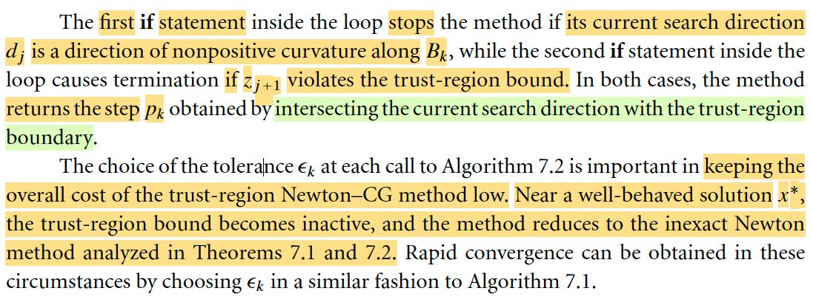</kbd>

> [!NOTE]
> Đoạn này nói về hai cái if giúp dừng thuật toán thì mình đã hiểu rồi, và mình cũng hiểu đúng là khi dừng, ta sẽ tính lại step size để nó ko vi phạm trust region, thì thật ra cái step size tính lại sẽ là điểm giao giữa direction dj và trust region boudary như gs nói ở đây.
>
> Đoạn sau nói về độ lớn của mức toleance εk trog điều kiện dừng khi check residual mà mình đã hiểu là mục đích ko cần phải chạy rốt ráo CG, mà chỉ cần dừng khi kết quả đủ tốt, như vậy cũng ko khó hiểu khi giáo sư nói để giữ chi phí của cả thuật toán lớn ko quá cao (vì dù sao CG cũng chỉ là giải subproblem, không cần tuyệt đối chính xác làm gì, giống như ta cũng ko cần giải chính xác αk trong line search vậy)
>
> Một ý nữa ông nói khi gần x*, thì trust region bound trở nên inactive và method trở thành inexact Newton, là sao? → À thì là vì khi tiến gần đến x*, thì mk sẽ ngày càng xấp xỉ rất tốt fk, dẫn đến kết quả tốt dần lên khi trust region sẽ dần dần mở rộng ra rất lớn. Khi đó ràng buộc trở nên không còn tác dụng nữa. Và bài toán subproblem ko có ràng buộc thì chỉ là bài toán tìm Newton step theo lối iteratively, như đã biết, gọi là inexact Newton

> [!TIP]
> **🤖 AI Feedback** — ✅ Score: **90/100**
>
> Bài phân tích cho thấy sự nắm vững các cơ chế dừng và tầm quan trọng của εk trong việc tối ưu chi phí. Giải thích về việc trust-region bound trở nên không còn tác dụng khi gần nghiệm tối ưu x* là thuyết phục và cho thấy sự hiểu biết sâu sắc về động thái của thuật toán.

 

- **Điểm Cauchy và hội tụ**

<kbd>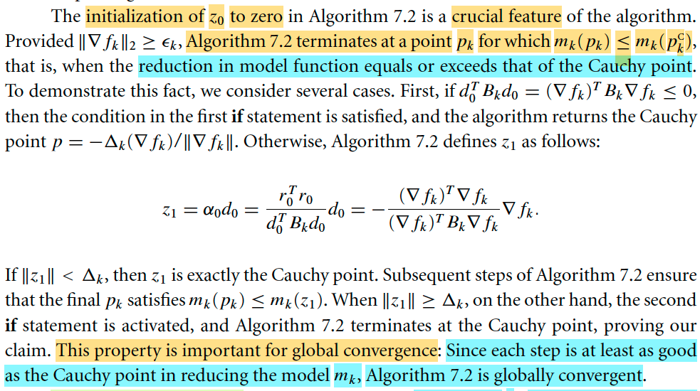</kbd>

> [!NOTE]
> Đoạn này là sao: Đại ý là đoạn này gs nói ta có thể chỉ ra rằng mức giảm hàm mk của thuật toán này sau mỗi step là không thua mức giảm mang lại bởi Cauchy point. Nên theo một theorem mà ta đã học ở chap 4 nói rằng chỉ cần mức giảm của thuật toán có thể tương ứng với một scaled version mức giảm bởi Cauchy point thì đảm bảo thuật toán sẽ hội tụ toàn cục.
>
> Lúc nãy mình đã ôn lại Cauchy point về mặt trực giác, nó là khi ta đi theo hướng steepest descent tại xk và muốn giảm tối đa mk(p) trong phạm vi ràng buộc. Tức là nó là solution của bài toán minimize g(α) = mk(α(-∇fk)) s.t ||α(-∇fk)|| ≤ Δk.
>
> Với mk(p) = fk + ∇fkTp + (1/2)p ∇^2fk p thì việc restrict bởi hướng ∇fk sẽ cho ta bài toán mininize hàm đơn biến bậc hai có ràng buộc. 
>
> Chỉ việc giải tìm critical point: g'(α) = 0, để xem điểm cực tiểu của hàm g(α) nằm bên trong hay ngoài phạm vi trust region. Nếu nằm trong thì không có gì để nói, còn nếu nằm ngoài thì vì giới hạn, ta sẽ lấy tại boudary.
>
> g'(α) = d/dα mk(α(-∇fk))
>
> = d/d[α(-∇fk)] mk(α(-∇fk)) . d/dα [α(-∇fk)]
>
> = ∇mk(α(-∇fk)) . (-∇fk)
>
> = [ (∇^2fk p + ∇fk)p=α(-∇fk) ] . (-∇fk)
>
> = [∇^2fk α(-∇fk) + ∇fk] . (-∇fk)
>
> = [-α ∇^2fk∇fk + ∇fk]T (-∇fk)
>
> = α ∇fkT ∇^2fk ∇fk - ∇fkT∇fk
>
> Fisrt order optimality necessary condition: g'(α) = 0 
>
> ⇔ α ∇fkT ∇^2fk ∇fk - ∇fkT∇fk = 0
>
> ⇔ α ∇fkT ∇^2fk ∇fk = ∇fkT∇fk
>
> ⇔ α = ∇fkT∇fk / ∇fkT ∇^2fk ∇fk
>
> ⇨ ||α(-∇fk)|| = (∇fkT∇fk / ∇fkT ∇^2fk ∇fk) ||∇fk||
>
> = ||∇fk||^3 / ∇fkT ∇^2fk ∇fk
>
> Tới đây tính g''(α) = d/dα g'(α) = d/dα [α ∇fkT ∇^2fk ∇fk - ∇fkT∇fk] = ∇fkT ∇^2fk ∇fk
>
> Chia hai case: 
>
> 1) ∇fkT ∇^2fk ∇fk < 0, thì cực trị là maximum của hàm g(α), nên để minimize g(α) trong phạm vi giới hạn, thì điểm cần tìm là nằm ngay trên boudary: → solution là (-∇fk / ||∇fk||) Δk
>
> 2) ∇fkT ∇^2fk ∇fk > 0, thì cực trị là minimum của hàm g(α) nên phải xét thêm việc điểm này nằm trong hay ngoài:
>
> a) ||∇fk||^3 / ∇fkT ∇^2fk ∇fk > Δk thì ta sẽ có solution là:
>
> (-∇fk / ||∇fk||) Δk
>
> b) Ngược lại, thì solution là (∇fkT∇fk / ∇fkT ∇^2fk ∇fk) (-∇fk)
>
> Viết gk, Bk cho gọn:
>
> Nếu gkTBkgk ≤ 0: -(Δk/ ||gk||) gk (A)
>
> Nếu gkTBkgk > 0: 
>
> + Nếu ||gk||^3 / gkTBkgk > Δk
>
> ⇔ ||gk||^3 / ΔkgkTBkgk > 1 thì solution là -(Δk/ ||gk||) gk (B)
>
> + Ngược lại, solution là (||gk||^2 / gkTBkgk) (-gk) (C)
>
> mà cái này = (||gk||^2 / gkTBkgk) (||gk||/Δk)(Δk/ ||gk||) (-gk)
>
> = [(||gk||^3 / ΔkgkTBkgk) [-(Δk/ ||gk||) gk] 
>
> Vậy viết lại lần nữa:
>
> gkTBkgk < 0, solution là 1 × [-(Δk/ ||gk||) gk]
>
> gkTBkgk > 0, solution là min[1, (||gk||^3 / ΔkgkTBkgk)] × [-(Δk/ ||gk||) gk] 
>
> Đây chính là 4.12 trong sách (Xem link Cauchy point)
>
> -----
>
> Tuy nhiên quay lại đây ta chỉ cần dùng công thức A, B, C thôi.
>
> Note vừa rồi là mình ôn lại thế nào là Cauchy point.
>
> Thì ý đầu tiên, tác gỉa nói nếu d0TBkd0 = (∇fk)TBk(∇fk) ≤ 0 thì theo thuật toán 7.2, nó sẽ return τ sao cho pk = z0 + τd0 mininimize mk(pk). Thì đây chính là gì? → Chính là rơi vào trường hợp (A), tức là pk trả ra chính là Cauchy point trong công thức (A), p = -(Δk / ||gk||) gk
>
> Còn không, thì thuật toán 7.2 tính z1 như sau: z1 = z0 + α0d0 = α0p0 (vì z0 = 0)
>
> Thay α0 = r0Tr0 / d0TBkd0 thì z1 = - [(∇fk)T / (∇fk)TBk∇fk] ∇fk.
>
> Để rồi nếu ||z1|| < Δk thì z1 chính là Cauchy point, công thức C.
>
> Còn nếu ||z1|| > Δk thì thuật toán cũng sẽ return τ ≥ 0 sao cho pk = z0 + τdj thỏa ||pk|| = Δk. Đây chính là case (B).
>
> Nói chung, ý tưởng chính là:
>
> Nếu với d0 (= - ∇fk), mà bị return ở chốt đầu tiên hay return ở chốt thứ 2, thì thuật toán đều đang trả ra Cauchy point (là điểm nằm trên hướng -∇fk và đi xuống thấp nhất có thể trong phạm vi hàng rào).
> Nếu qua được vòng này, ko bị dừng ở d0, thì chắc chắn d1,d2..dj sẽ phải tốt hơn d0. Vì sao? Vì ta còn nhớ trong CG, cách thức hoạt động của nó khi chạy thuật toán đó là: Chọn d0 là hướng dốc nhất tại điểm ban đầu, đi theo hướng đó xuống thấp nhất có thể trong phạm vi hàng rào, thì đụng hàng rào hay dừng ở điểm trong hàng rào, gọi là thì cái vector đó đều chính là Cauchy point. Giả sử iteration đầu tiên dừng ở điểm trong hàng rào, iteration tiếp theo sẽ tìm chọn d1 là hướng conjugate wrt matrix A với d0 và bắt đầu tìm kiếm điểm thấp nhất theo hướng đó. Thì điều này tương đương với việc, ngay từ đầu ta tìm kiếm trong subspace span {d0,d1} điểm nào minimize hàm mk trong phạm vi hàng rào. Do đó, điểm tìm thấy theo hướng d1 phải thấp hơn hoặc bằng điểm tìm thấy ở bước d0. Tiếp tục như vậy, để rồi mình hình kết quả cuối cùng, chắc chắn phải luôn tốt hơn, thấp hơn cái điểm Cauchy point.
> Như vậy, thuật toán luôn đảm bảo trả ra hướng tốt hơn hoặc ít nhất là bằng Cauchy point, đảm bảo hội tụ toàn cục theo một theorem đã học trong chap 5

> [!TIP]
> **🤖 AI Feedback** — ✅ Score: **95/100**
>
> Bài làm xuất sắc. Bạn đã phân tích chi tiết và chính xác mối liên hệ giữa các điều kiện của thuật toán 7.2 với khái niệm điểm Cauchy, đồng thời giải thích sâu sắc nguyên lý đảm bảo hội tụ toàn cục. Sự hiểu biết về đạo hàm điểm Cauchy cũng rất ấn tượng, mặc dù việc tham chiếu chương có thể chính xác hơn.

**🔗 See also:** [Công thức Cauchy point](./41_trust_region_methods_algorithms_based_on_the_cauchy_point.md#node-06f2kv1)

 

- **Trust Region Newton CG**

<kbd>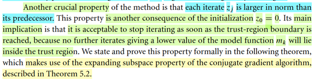</kbd>

<kbd>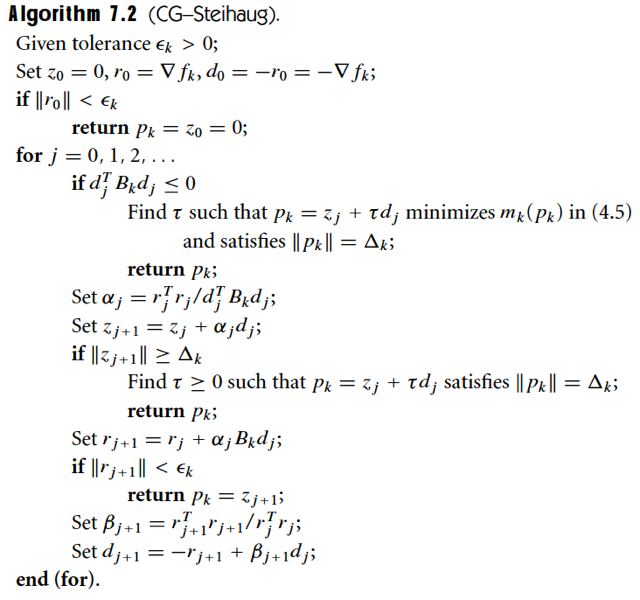</kbd>

> [!NOTE]
> Có lẽ nên ôn lại chút xíu về Trust Region Newton CG:
>
> Cơ bản chỉ là ta xét bài toán Trust Region Newton, và dùng CG để giải
> sub-problem:
>
> TRN là ám chỉ trong bài toán sub-problem, ta sẽ dùng Newton direction  cho
> pk.
>
> Và việc dùng CG để giải sub-problem chính là dùng thuật toán CG giúp tìm
> pkN bằng cách giải hệ ∇^2fk pkN = - ∇fk, theo cách iteratively: nói ngắn gọn
> như sau
>
> Ôn nhanh CG cũng như thuật toán 5.2:
>
> Mục đích giải: Ax = b, A xác định dương, ta sẽ coi đây là giải điều kiện cần
> bậc một của bài toán tối ưu hàm số nguyên hàm của Ax - b, tức là hàm f(x) =
> (1/2)xTAx -bTx. Thuật toán đại khái là như sau: Ban đầu ta có x0, và cần đi
> đến x* để thỏa Ax* - b = 0. Chọn p0 = - ∇f(x0) = -Ax0 + b. Thực hiện
> iteratively:
>
> Tính αk, với thuật toán CG, đại khái đây chỉ là giải bài toán minimize hàm
> bậc hai đơn biến, có closed form solution. Thực hiện update tới xk+1 = xk +
> αkpk. Tính pk+1: chính là conjugate wrt A của pk. Ideas chỉ là vậy thôi.
>
> Vậy thì ở đây, cái dễ lú lẫn là kí hiệu.
>
> Vì bài toán cần giải là subproblem: tìm Newton step cho bài toán subproblem
> của thuật toán trust region:
>
> Nói sơ về thuật toán Trust Region:
>
> Cũng là ta sẽ minimize hàm f(x) iteratively
>
> Tại mỗi iteration, thứ k'th ta sẽ giải bài toán subproblem:
>
> Coi hàm f(x) tại k hoạt động như hàm bậc hai: mk(p). Và cùng với trust
> region Δk đã xác định ở iteration trước, ta muốn giải bài toán:
>
> minimize mk(p) = fk + ∇fkTp + (1/2)pT Bk p subject to ||p|| ≤ Δk
>
> (vì đây là Trust Region Newton nên Bk chính là ∇^2fk)
>
> Thế thì, để giải bài toán subproblem, dĩ nhiên ta cũng giải theo lối iterative
> với hai phương pháp đã học trong chap 5: Dogleg và 2D subspace
> minimization. Đều mục đích là tìm ra pk là minimizer của mk(p) s.t ||p|| ≤ Δk.
> thì CG chính là cách thứ
> 3.
>
> Và áp dụng nó vào để giải bài toán subproblem, ta sẽ làm như sau:
>
> Vì thuật toán CG vốn dĩ là giải hệ Ax = b, hay Ax - b = 0. Bằng cách tạo
> chuỗi {xj} đi từ x0 → x1 → ...→ x* sao cho dần dần giảm ||x* - xj|| Nhưng ở
> đây, nó lại phải có constraint. Tức là ta cần giải hệ Bk p = - ∇fk nhưng với
> constraint ||p|| ≤ Δk,
>
> Vấn đề phải hiểu thế này. Việc giải bài toán subproblem là minimize mk(p) s.
> t ||p|| ≤ Δk, về cơ bản đây là bài toán minimize hàm quadratic có inequality
> constraint, ta sẽ thiết lập stationary condition: Gradient của hàm Lagrangian
> = 0, chứ đâu phải là gradient là mk = 0 đâu, có nghĩa là đâu phải là điều kiện
> cần là Ax = b đâu mà lôi CG ra.
>
> Tuy nhiên, cũng chính vì vậy mà mới gọi là modified CG, chỉ lấy cách làm
> của CG, nhưng ko hoàn toàn giống:
>
> Ta sẽ giả sử là không có ràng buộc, và giải hệ Bk p = - ∇fk,
>
> p* đóng vai x*, nên ta sẽ kí hiệu dj, zj đóng vai pk, xj của CG gốc:
>
> Cho z0 = 0, d0 = steepest descent: - (Bk * z0 - ∇fk) = ∇fk
>
> tính α1, cũng là giải bài toán minimize hàm quadratic đơn biến.
>
> tính z1 = z0 + α1d0,
>
> tính d1, là conjugate gradient với d0,
>
> ...
>
> lặp lại, tiếp tục.
>
> Trong quá trình này sẽ đi qua chốt chặn:
>
> zj+1 (= zj + αjdj) (nhớ!: zj ứng với xj của CG gốc, và là thứ sẽ gán cho p để
> trả ra) có khiến ||zj+1|| lớn hơn Δk chưa? → Nếu có thì dừng.
>
> Lúc này, ta mới cơ bản là VẪN LẤY HƯỚNG dj, nhưng khống chế độ dài
> của nó dj) sao cho ||zj+1||= ||zj + τdj|| KHÔNG QUÁ HÀNG RÀO. (gọi là giải
> bài toán minimize zj + τdj). Nó khác với việc ta cứ tính zj+1 = zj + dj rồi cắt
> cụt để norm zj+1 = Δk
>
> (sau đó trust region sẽ đo độ uy tín các kiểu để có quyết định nhảy tới
> không, có tăng / giảm / giữ nguyên trust region không. Chú ý, trust region ko
> có tìm step size gì đâu nhé line search mới tìm step size)
>
> Chốt chặn thứ hai, thật ra sẽ nằm trên chốt chặn thứ nhất: là xem Bk có bị
> xác định âm hay không xác định không, bằng cách check d0Bkd0 ≤ 0. Khi
> đó, đại khái là ta tìm theo hướng d0, như đã biết, chính là steepest descent
> của mk tại điểm ban đầu, sao cho chạm hàng rào. (Thì cái này, chính là
> Cauchy point)
>
> Nếu mọi thứ đều ổn, không bị thoát ở hai cái chốt trên. Và điều kiện dừng
> cuối cùng, tức là z cuối (z*) ko vi phạm ||z*|| ≤ Δk. Thì mình nên hiểu là đó
> cũng ko phải là Newton step. Vì ta sẽ chỉ có Newton step nếu chạy hết n
> iteration để có được p* là solution của Bk p* = - ∇fk. Nhưng người ta sẽ
> không làm vậy, nên dù cho không bị chặn ở hai cái chốt đầu, thì cái ta có
> cũng chỉ là inexact Newton step.
>
> Huống hồ, khả năng là ta sẽ bị chặn ở một trong hai chốt trên. Khi đó, nếu là
> ở chốt thứ nhất: zj+1, ví dụ j = 20, ta có z21, có norm dài hơn Δk, ta sẽ tìm τ
> sao cho ||z20 + τd20|| = Δk (khác với việc ta cắt cụt z21 để ||z21|| = Δk)
>
> Còn nếu nếu bị chặn ở chốt thứ hai: d0Bkd0 ≤ 0. Thì như đã nói trên, đây
> chính là Cauchy point
>
> Ôn nhanh Cauchy point là gì, trong CG gốc: Nó là vầy: Tại x0, lấy hướng
> steepest decent: chính là Ax0-b, và giải bài toán minimize hàm bậc hai đơn
> biến (hàm 1/2xTAx - bTx) nhưng restrict  theo hướng steepest descent và có
> constraint và giải tìm minimizer của nó. Khi đó ta sẽ có hai case, đụng hàng
> rào hoặc nằm trong.
>
> Vấn đề dễ lú là: Trong CG gốc, cái ta giải là Ax - b = 0. và coi như nó là giải
> bài toán minimizer hàm số F(x) = (1/2)xTAx - bTx, mà ∇F(x) = 0 ⇔ Ax - b = 0
> chính là điều kiện cần bậc 1. vài CG giúp giải cái này từ từ. Thành ra nói
> steepest descet tại x0, chính là -∇F(x0) = -Ax0 + b.
>
> Còn trong việc dùng CG giải subproblem. Thì thứ cần giải là Bk p = - ∇fk,
> hay Bk x = - ∇fk. Và cũng chẳng cần phải xem Bk p + ∇fk là gradient của
> hàm nào F nào. Vì F chính là mk(p), là hàm xấp xỉ bậc hai của objective
> function f(x) nguyên thủy. Do đó, chọn d0 là steepest descent direction, thì
> nó chính là -Bkz0 + (-∇fk) = -Bk z0 - ∇fk. Và do chọn z0 = 0, nên là -∇fk.
>
> Vậy thì quay lại đây, tác giả cho biết một tính chất quan trọng của phương
> pháp này là mỗi iterate norm zj LUÔN LỚN HƠN cái trước đó zj-1.
> (zj,  thứ sẽ converge về z* để gán cho pk (giải Bk pk = - ∇fk), tương ứng
> trong  thuật toán CG  gốc là xj converge về x* (giải Ax* = b).
>
> Vậy thì đoạn này đại khái nói là, tính chất này đảm bảo rằng, MỘT KHI
> MÀ TA ĐỤNG TRUST REGION, thì có thể dừng, vì có iterate thêm thì
> cũng không thể giảm thêm mk trong phạm vi trust region nữa.
>
> Là sao ta?
>
> Như vừa nói ở note trước, khi giải bài toán subproblem bằng CG, ta cơ
> bản là dùng CG để giải tìm Newton direction theo lối iteratively. Mà về
> bản  chất là ta tìm ra một hướng đi trong vùng tin cậy sao cho hướng
> đi đó đủ tốt (inexact Newton step). Khi thuật toán chạy cái giảm dần ở
> trong lúc chạy CG norm của error giữa p* với zj (và cũng là norm giữa
> mk tại p* và mk tại zj).
>
> (Trong thuật toán CG gốc, bản chất là ta minimize hàm quadratic nguyên
> hàm của F(x) = (1/2)xTAx - bTx, nguyên hàm của Ax - b, và mục tiêu là
> giảm  dần ||x* - xj|| cũng là chính là |F(x*) - F(x)| mà trong CG trong
> subproblem  thì zj chính là tương đương với xj)
>
> Thì cái việc norm zj liên tục lớn dần, cái sau lớn hơn cái trước  chính là
> ý là norm của xj cũng lớn dần trong thuật toán CG gốc, cái sau lớn hơn
> cái trước.
>
> Nhưng trong bối cảnh CG gốc thì ko có ý nghĩa gì đáng nói, nhưng ở đây
> khi  đặt trong bối cảnh có hàng rào bao quanh thì nó có ý nghĩa. Vì điều
> này có nghĩa là khi chuỗi zj được tạo ra thì mk(j) ngày càng giảm
> nhưng đồng thời ta cũng ĐI XA DẦN VỊ TRÍ BAN ĐẦU: z0 = 0 (tức là
> ngay tại xk). Và do đó, chứng tỏ, nếu đã đụng hàng rào, thì đó là điểm
> giúp đưa mk xuống thấp nhất có thể trong phạm vi cho phép rồi. HÌnh
> dung quỹ đạo là đường xoắn ốc giảm dần và rộng ra dần, thì khi đụng
> biên thì đó là thấp nhất trong phạm vi cho phép. Đây chính là ý gs
> Nocedal đang nói.

 

- **Định lý 7.3: Tính chất dãy**

<kbd>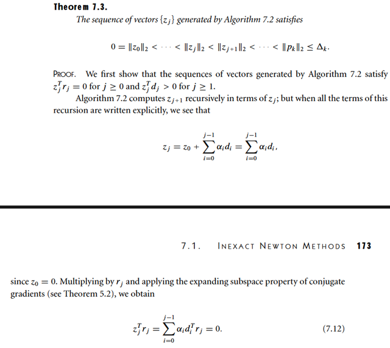</kbd>

 

- **Chứng minh norm zj tăng**

<kbd>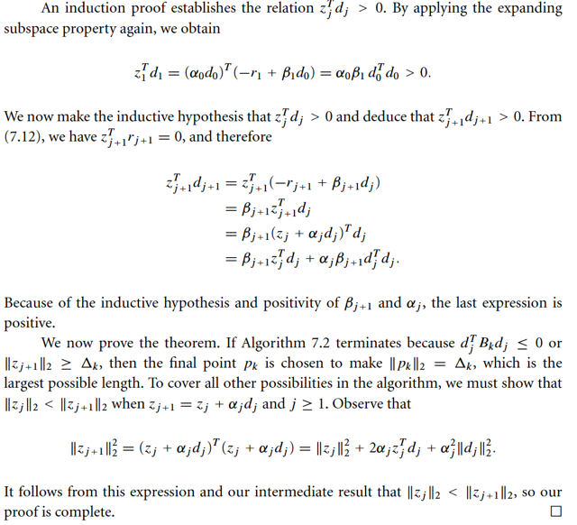</kbd>

> [!NOTE]
> Theorem 7.3 nói rằng chuỗi {zj}} được sinh ra bởi thuật toán 7.2 sẽ luôn thỏa cái sau lớn hơn cái trước về norm.
>
> Phần chứng minh đại ý là vầy:
>
> Đầu tiên trong 7.3, việc cập nhật {zj} theo công thức: zj+1 = zj + αjdj
>
> (Ôn nhanh: d0 là hướng steepest descent, d1, d2... sau đó hướng conjugate wrt matrix Bk với d trước đó. Có dj rồi thì giải bài toán minimize hàm bậc hai đơn biến, là hàm mk restrict theo hướng dj để tìm step size αj)
>
> Thế thì: ||zj+1|| = ||zj + αjdj||
>
> ⇨ ||zj+1||^2 = ||zj + αjdj||^2 = (zj + αjdj)T(zj + αjdj)
>
> = (zjT + αjdjT)(zj + αjdj)
>
> = zjTzj + αjdjTzj + zjTαjdj + αjdjTαjdj
>
> = ||zj||^2 + 2αjdjTzj + αj^2||dj||^2
>
> Đến đây, nếu ta chứng minh được djTzj > 0 thì sẽ chứng minh được ||zj+1|| > ||zj|| (1)
>
> Và ta sẽ chứng minh bằng quy nạp: Chứng minh nó đúng với k = 1, rồi giả sử đúng với k = j, và chứng ninh nó đúng luôn với k = j+1 thì sẽ có thể kết luận nó đúng với mọi k.
>
> Nhưng trước hết tác giả chứng minh một kết quả để lát sau sẽ dùng: đó là zjTrj = 0. Cái này dễ thôi:
>
> Theo công thức update {zj}:
>
> z1 = z0 + α0d0, z2 = z1 + α1d1,....zj = zj-1 + αj-1dj-1
>
> ⇨ thay vào liên tục, ta có: zj = z0 + Σi=0:j-1 αidi
>
> = Σi=0:j-1 αidi (vì theo thuật toán 7.2, z0 được initialized = 0. 
>
> Ta có zj = Σi=0:j-1 αidi, nhân hai vế với rjT:
>
> rjTzj = rjTΣi=0:j-1 αidi = Σi=0:j-1 αi rjTdi
>
> Tới đây, mới xem lại Theorem 5.2, nói nói đại khái là residual tại vòng sau, thì luôn vuông góc với mọi direction trước đó (trong thuật toán CG gốc, ta sẽ có rkTpi với i = 0,1,...k-1): Cho nên ở đây, ta sẽ có rj vuông góc với d0,d1,...dj-1. Nên cái bên phải = 0 ⇨ rjTzj = 0
>
> ------ 
> Quay lại đây, chứng minh quy nạp nói ở trên:
>
> Xét k = 1, d1Tz1 có > 0 không? (z0 = 0 rồi nên ta sẽ chứng minh từ k = 1)
>
> d1Tz1 = d1T(z0 + α1d1) = d1Tα1d1 = α1 ||d1||^2 cái này > 0, vì sao? vì α1 là step-size, luôn dương (vì sao luôn dương, vì α1 là stepsize tìm được bằng cách tối thiểu hóa hàm bậc hai đơn biến mk giới hạn bởi d1, mà d1. hay dj luôn là descent direction (nếu ko, tưc djTBkdj ≤ thì thuật toán đã return ở chốt đầu rồi, nên đã qua được chốt đó thì tức là djTBkdj > 0. Nên αj = rjTrj / djTBkdj sẽ dương do tử và mẫu dương.
>
> Tiếp, gỉa sử nó đúng với k = j: djTzj > 0
>
> Ta sẽ chứng minh nó đúng với k = j+1: dj+1Tzj+1 > 0
>
> dj+1Tzj+1 = (-rj+1 + βj+1dj)Tzj+1
>
> = -rj+1Tzj+1 + βj+1djTzj+1
>
> = 0 + βj+1djTzj+1 (do đã chứng minh rjTzj = 0, và nó cũng đúng với j+1)
>
> = βj+1 djT(zj + αjdj)
>
> = βj+1djTzj + βj+1djTαjdj
>
> = βj+1djTzj + βj+1αj ||dj||^2
>
> Mà ta đã giả sử djTzj > 0 ⇨ βj+1djTzj > 0 (vì βj+1 = rj+1Trj+1 / rjTrj > 0)
>
> và βj+1αj ||dj||^2 cũng dương nốt.
>
> Vậy chứng minh xong là djTzj > 0 với mọi j ⇨ theo (1), ta đã chứng minh xong.

 

- **So sánh Dogleg và 7.2**

<kbd>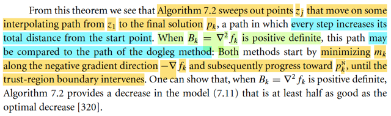</kbd>

> [!NOTE]
> Ok, nhớ lại về thuật toán Dogleg:
>
> Ideas của nó là như sau:
>
> Nó muốn cải thiện Cauchy points. Cauchy point's story: Đi từ điểm đầu tiên x0, theo hướng dốc nhất, ráng đưa mk(p) (giới hạn theo hướng đó) xuống thấp nhất trong phạm vi hàng rào. Nó có thể dừng ở trong, hoặc đụng hàng rào (Bk xác định âm: đi theo hướng đó sẽ giảm mk vô hạn → đụng hàng rào, Bk xác định dương: có thể dừng ở trong hoặc ngoài (đụng hàng rào))
>
> Và ta đã biết vụ Cauchy points là bước nhảy mang lại mức giảm đủ tốt, giúp đảm bảo hội tụ toàn cục, đóng vai trò tham chiếu cho các phương pháp khác phải  ít nhất là bằng cái này.
>
> Tiếp, mới xét câu chuyện nếu ta cho phạm vi giới hạn tăng từ rất nhỏ đến rất rộng. Thì: ở mức nhỏ → hướng Newton cơ bản là trùng hướng dốc nhất. Nhưng ở mức lớn, hướng Newton sẽ có thể khác hướng dốc nhất. Nên khi đó nếu chỉ một mực dùng hướng dốc nhất, có thể sẽ không lợi ích. Và khi mô phỏng việc tăng dần bán kính tin cậy Δ, thì nghiệm của bài toán minimize mk với mk dùng Hessian trong Bk, s.t ||p|| ≤ Δ sẽ cho ra / vẽ ra một đường cong hình cẳng chó. Và đó là cái quỹ đạo mà ta muốn MEN THEO ĐỂ tìm kiếm điểm thấp nhất của mk trong bán kính giới hạn.
>
> Nhưng dĩ nhiên ta ko biết chính xác cái quỹ đạo đó. (vì có cái quỹ đạo đó thì cũng đương nhiên là biết p nên bằng gì với Δ cho trước rồi).
>
> Do đó, người ta DỰNG NÊN MỘT XẤP XỈ CỦA QUỸ ĐẠO ĐÓ. Tạo bởi 2 vector:
>
> pU: là đi theo hướng dốc nhất và tối thiểu hàm mk restrict theo hướng đó (tức là pU là γ (-∇fk) với γ là solution của bài toán mininize mk(γ(-∇fk))
>
> pB là hướng Newton: -(Bk)inv ∇fk
>
> Tức là, cái quỹ đạo này sẽ fixed: đầu tiên đi từ 0 → pU. Và sau đó từ pU đi theo hướng pB.
>
> Nên phương trình mô tả cái quỹ đạo sẽ là: p~(τ) = pU + (τ - 1) (pB - pU) với τ từ 1 → 2.
>
> Từ đó ta sẽ giải bài toán: minimize hàm mk(p) restrict theo quỹ đạo này. Giống như ta minimize hàm mk restrict theo hướng steepest, thì nay sẽ là restricted theo quỹ đạo này.
>
> Nhưng thật ra ta ko cần giải bài toán này. vì đã có theorem chứng minh rằng ĐI THEO QUỸ ĐẠO NÀY THÌ HÀM mk SẼ GIẢM LIÊN TỤC. Do đó bài toán  CHỈ ĐƠN GIẢN LÀ TRỞ THÀNH TÌM ĐIỂM XA NHẤT TRÊN QUỸ ĐẠO NÀY TRONG PHẠM VI HÀNG RÀO.
>
> Do đó, nếu điểm cuối của hành trình (τ = 2) vẫn trong hàng rào, thì p~* = pU + (2-1)(pB - pU) = pB (tức là ta sẽ rất đẹp, lấy luôn Newton step)
>
> còn không thì giải tìm giao điểm của quỹ đạo với hàng rào.
>
> Đó chính là Dogleg algorithm.
>
> ------
>
> VẬY THÌ TẠI SAO CHỖ NÀY GS NÓI THUẬT TOÁN 7.2 CÓ THỂ COI NHƯ LÀ GIỐNG GIỐNG DOGLEG:
>
> À thì bởi vì, 7.2 nó cũng
>
> a) BẮT ĐẦU BỞI HƯỚNG DỐC NHẤT: d0 là hướng dốc nhất tại điểm xuất phát. Và ta sẽ đi theo hướng đó để giảm mk xuống thấp nhất trong phạm vi hàng rao. À, NHƯ VẬY, Y NHƯ pU Ở TRÊN VỪA ÔN LẠI.
>
> b) SAU ĐÓ, các chuỗi d1,d2,...sẽ NHẰM MỤC TIÊU LÀ TẠO z1,z2,.... converge về z*, hay p* = - Bkinv ∇fk À. NHƯ VẬY, khá tương đương việc Dogleg sẽ tiếp tục  đi từ pU theo hướng pB (Newton step), với 7.2 sẽ tạo một chuỗi các hướng mà tổng hợp lại cũng dẫn ta đến xấp xỉ pB.
>
> SO SÁNH:
>
> Dogleg: pU → pB (Newton step)
>
> 7.2: z1 cơ bản chính là pU → z1,z2,.. hội tụ về Newton step.

> [!TIP]
> **🤖 AI Feedback** — ⚠️ Score: **88/100**
>
> Bài phân tích của bạn thể hiện sự hiểu biết sâu sắc về thuật toán Dogleg và so sánh rất chi tiết, chính xác với mô tả của Thuật toán 7.2. Tuy nhiên, phần giải thích về điểm Cauchy khi B_k 'xác định âm' còn thiếu chính xác; việc m_k giảm vô hạn trên hướng dốc nhất phụ thuộc vào tích ∇f_k^T B_k ∇f_k, không chỉ đơn thuần là B_k xác định âm.

 

- **Đường Dogleg Newton**

<kbd>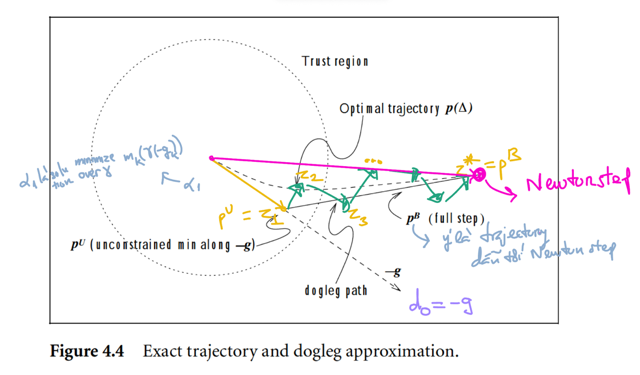</kbd>

 

- **Tiền xử lí Trust-Region Newton-CG**

<kbd>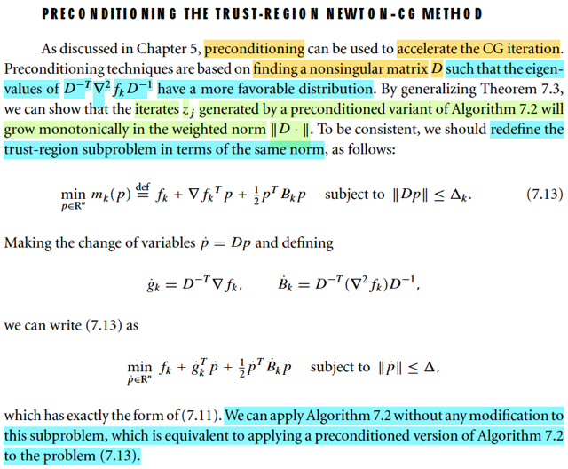</kbd>

> [!NOTE]
> Qua phần nói về Preconditioning đối với phương pháp Trust-Region Newton CG:
>
> Nhớ lại chút xíu về Preconditioning của CG: Đại ý ta còn nhớ, trong chương về CG, có
> nói, khi phân phối của trị riêng của matrix A có tính chất đặc biệt nào đó, ví dụ như: Tụ
> lại tại một vài cụm, thì khi đó, CG sẽ có thể giải ra  nhanh hơn nhiều (thay vì at most
> trong n step của CG gốc).
>
> Do đó, kĩ thuật Preconditioning là nhằm dùng một matrix D nào đó khiến biến đổi bài
> toán chuyển sang tọa độ với basis mới, thì trong đó matrix hệ số  sẽ có tính chất tốt
> hơn này, như vậy sẽ khiến thuật toán CG hội tụ nhanh hơn.
>
> Vậy thì ở đây cũng chính là nói về cái này. Có điều, vì ở đây, là ta đang dùng CG để
> giải bài toán subproblem của Trust Region Newton, nên khác với CG gốc - giải bài toán
> tối ưu hàm F(x) = (1/2)xTAx - bTx, không có ràng buộc, thì ở đây, ta giải bài toán tối ưu
> hàm mk(p) = (1/2)pTBkp + ∇fkTp + fk có ràng buộc ||p|| ≤ Δk
>
> Đây cũng là lúc nên ôn lại để giúp hiểu hơn:
>
> Ý tưởng như trên nói, là dùng matrix full rank C để đổi biến, chuyển sang bài toán tối
> ưu tương đương (equivalent problem) có matrix hệ số có phân phối trị riêng tốt hơn.
>
> Khi đặt x^ = Cx, suy ra x = Cinvx^
>
> thì thay x vào hàm mục tiêu của bài toán gốc, đang là: f(x) = (1/2)xTAx - bTx,  nó sẽ trở
> thành (1/2) (Cinvx^)TACinvx^ - bT(Cinvx^), đây là hàm theo x^, đặt là f~(x^).
>
> Sắp xếp lại, f~(x^) = (1/2)x^T CinvTACinv x^ - bTCinv x^
>
> = (1/2)x^T CinvTACinv x^ - (CinvTb)T x^
>
> Thế thì đến đây, mình nghĩ là cần phải nói rõ ta đang làm gì, và vì sao được phép đổi
> biến, cơ sở nào cho phép làm vậy.
>
> Cốt lõi vấn đề là ta đang muốn giải hệ Ax = b, chỉ là ta nhìn nhận nó như  việc giải Ax -
> b = 0, với Ax - b là đạo hàm của một hàm số f nào đó, từ đó thấy việc đang làm chính là giải điều
> kiện cần tối ưu bậc nhất: ∇f(x) = 0.
>
> Thay x = Cinv x^, Ax = b trở thành A Cinv x^ = b. Nhân hai vế cho CinvT, phương trình
> sẽ tương đương với CinvTACinv x^ = CinvTb, và từ đó nếu coi đây là phương trình
> điều kiện cần tối ưu bậc nhất thì cái hàm số theo x^ chính là (1/2)x^T CinvTACinv x^ -
> (CinvTb)T x^ có đạo hàm là CinvTACinv x^ - CinvTb.
>
> Do đó giải ra x^* thỏa CinvTACinv x^ = CinvTb, giúp minimize hàm f^(x^) thì Cinv x^*
> sẽ thõa Ax = b, giúp minimize hàm f(x).
>
> -----
>
> Thế thì, làm gì tiếp? Thì trước tiên cần nhớ lại thuật toán CG gốc làm gì:
>
> Bước đầu, ta đứng tại x0, có residual r0 = Ax0 - b. Ta sẽ chọn p0 là steepest descent
> direction: p0 = - ∇f(x0) = - (Ax0 - b) = - Ax0 + b.
>
> vòng lặp đầu tiên:
>
> Tìm step size α1 bằng cách giải bài toán tối ưu hàm bậc hai đơn biến: f(x) restricted to
> hướng p0: f(x0 + αp0).
>
> Đi đến x1: x1 = x0 + α0p0
>
> Tính residual tại x1: r1 = Ax1 - b
>
> Chuẩn bị p1: bắt đầu từ đây, p sau sẽ là hướng conjugate wrt matrix A với p trước:
> pk+1TApk = 0
>
> Và công thức để làm được việc này là:
>
> Công thức tính β1, và p1 = -r1 + β1p0
>
> Qua vòng lặp hai, lặp lại như vậy.
>
> -----
>
> Vậy thì, nếu áp dụng vào bài toán đã đổi biến, tức là ta phải làm gì:
>
> → Chỉ là thay x bằng x^, thay A bằng A^ = (Cinv)TACinv, thay b bằng CinvTb.
>
> Để rồi thuật toán sẽ là:
>
> Bắt đầu tại x^0 nào đó. Có residual r^0 = A^x^0 - b^. Chọn p^0 = -∇f^(x^0) = - A^x^0 + b^
>
> Vòng lặp thứ nhất:
>
> Giải bài toán minimize hàm bậc hai đơn biến f^(x^0 + α^p^0) tính α^0,
>
> Đi đến x^1, x^1 = x^0 + α^0p^0
>
> Tính residual tại đây: r^1 = A^x^1 - b^
>
> Chuẩn bị hướng p^1: là conjugate wrt matrix A^ của p^0: p^1TA^p^0 = 0
>
> Và sẽ làm bằng cách tính β^1 trước, rồi tính p^1 = - r^1 + β^1p^0.
>
> Qua vòng lập tiếp theo.
>
> -----
>
> Vài nhận xét, matrix hệ số A^ = CinvTACinv. Nó sẽ vẫn xác định dương. Và sẽ có phân
> phối trị riêng tốt nếu chọn C khéo léo, thì từ đó, thuật toán CG sẽ hội tụ nhanh hơn
> bình thường (vốn đã nhanh - O(n), vì như đã biết, lí thuyết nói nó chỉ tốn nhiều nhất n
> bước)
>
> Có thể hỏi, vì sao A^ xác định dương? → Xét quadratic form: zTCinvTACinvz, Thì dễ
> thấy vì C full rank, nên N(Cinv) = zero vector do đó với mọi z khác 0, Cinvz khác 0.
> Và vì A xác định dương nên (zTCinv)A(Cinvz) cũng sẽ dương với mọi Cinvz khác 0. Từ
> đó ta có zTA^z dương với mọi z khác 0 giúp kết luận nó xác định dương.
>
> -----
>
> Vấn đề là: Ta sẽ phải đi tính A^ = (Cinv)TACinv, b^ = CinvTb. Để là vậy ta sẽ phải tốn
> chi phí ở: Tìm Cinv, và nhân (Cinv)TACinv, đều là những phép tính tốn kém.
>
> Đây là cái mà gs Nocedal gọi là cách làm tường minh "explicitly", và không cần, không
> nên làm vậy vì chi phí của việc này sẽ làm lợi ích của precondition mất đi.
>
> Nên câu hỏi đặt ra là làm sao precondition nhưng ko cần tính Cinv.
>
> -----
>
> Thế thì để hiểu bản chất vì sao  ta phải tính A^, b^ đó là vì: Mình đang giải bài toán
> trong một hệ tọa độ khác: Là hệ tọa độ basis c's:
>
> Khi đặt x^ = Cx thì tọa độ của x trong basis e's, sẽ chuyển sang tọa độ trong basis cinv'
> s (các cột của Cinv): Vì sao?
>
> Để hiểu ý này, nhớ lại Change of basis matrix, đầu tiên xuất phát từ cách xây dựng
> matrix A đại diện cho phép biến đổi tuyến tính
>
> Biến đổi các basis của input space v's bởi phép biến đổi tuyến tính T(.):
>
> để có T(v1), T(v2),..
>
> Thể hiện nó bởi các output space basis w's:
>
> T(v1) = a11 w1 + a21 w2 + ... = W [a11, a21,..]T = W a1 (đặt a1 = a11, a21,..]T
>
> T(v2) = a12 w1 + a22 w2 + ... = W [a12, a22,..]T = W a2 (đặt a2 = a12, a22,..]T
>
> ...
>
> ⇨ [T(v1), T(v2),..] = W [a1, a2, ...]
>
> Thì matrix A chính là: Các cột của nó chính là các tọa độ của T(vi) trong basis w's: [a1,
> a2..]
>
> ⇨ [T(v1), T(v2),..] = W A
>
> ⇨ A = Winv [T(v1), T(v2),..]
>
> Và một vector u = (u1, u2,...) trong basis v's: Σi ui vi. Khi biến đổi bởi T(.) và thể hiện
> trong tọa độ u' s:
>
> Ta sẽ chỉ ra T(u) = Au trong tọa độ w's, tức = (Au)_1 w1 + (Au)_2 w2 + ..
>
> = W Au
>
> Thế thì T(u):
>
> = T(u1v1 + u2v2 + ..)
>
> = u1 T(v1) + u2 T(v2) + ..
>
> = u1 W a1 + u2 W a2 + ..
>
> = u1 (a11 w1 + a21 w2 + ..) + u2 (a12 w1 + a22 w2 + ...)
>
> = (u1 a11 + u2 a12 + ..) w1 + (u1 a21 + u2 a22 + ..) w2 + ...
>
> = (A's row 1)Tu w1 + (A's row 2)Tu w2 + ..
>
> = W [(A's row 1)Tu, (A's row 2)Tu]T
>
> = W Au → Chứng minh xong, cho thấy đúng là A chính là matrix đại diện cho T(v)
>
> -----
>
> Vậy thì bây giờ, nếu T(v) là phép biến đổi identity: T(v) = v, thì khi đó:
>
> [T(v1), T(v2),...] chỉ là [v1, v2,..], đặt là V ⇨ A = Winv V
>
> Và nếu như v's là e's tức input basis là standard basis, thì V chính là I, và ta sẽ có
> matrix giúp đổi tọa độ từ basis e's sang basis w's đơn giản là A = Winv.
>
> Do đó, khi đặt x^ = Cx = (Cinv)inv x thì ta đang đổi tọa độ từ basis e's sang tọa độ
> của basis cinv' s, tức là các cột của Cinv. (ko phải là của C nhé)
>
> -----
>
> Quay lại đây, ta đang nói bản chất vì sao ta phải tính A^, b^ đó là vì: Mình đang giải bài
> toán trong một hệ tọa độ khác: Là hệ tọa độ basis cinv's.
>
> Thế thì, trong gian hệ tọa độ đó, ta cũng sẽ đi theo một chuỗi điểm x^0 → x^1 → ...để
> đến x^* và điểm này sẽ tương ứng với x* trong tọa độ e's. Nói cách khác, khi có x*^, ta
> sẽ chuyển nó sang lại tọa độ e's bằng cách nhân với change of basis từ basis cinv's
> (chú ý, basis cinv's, ko phải c's) sang basis e's:
>
> (I)inv Cinv = Cinv, tức là x* = Cinv x^*.
>
> Nó giúp ta hiểu sâu hơn bản chất: CHUYỂN SANG HỆ TỌA ĐỘ BASIS cinv'a, TRONG
> ĐÓ BÀI TOÁN CÓ MATRIX HỆ SỐ TỐT HƠN → HỘI TỤ NHANH HƠN → KHI CÓ
> KẾT QỦA, x^*, CHUYỂN NÓ VỀ LẠI TỌA ĐỘ BASIS e's ĐỂ CÓ x*.
>
> Thế thì, từ việc hiểu bản chất này, ta sẽ hiểu ý tưởng của việc né cái vụ làm tường
> minh như sau: TÌM VÌ VẤN ĐỀ TÍNH Cinv CƠ BẢN CHỈ LÀ GIÚP CHUYỂN TỌA ĐỘ
> QUA LẠI GIỮA HAI CƠ SỞ e' s và cinv's nên ta sẽ tìm cách TẠO RA CHUỖI x^1,x^2...
> NHƯNG TRONG TỌA ĐỘ e's LUÔN.
>
> Để hình dung sự bất cập của việc làm Tường minh (Explicitly):
>
> Nếu làm tường minh, thuật toán sẽ chạy vòng vèo như một chuyến đi vô cùng cồng
> kềnh:
>
> Ta đang đứng ở nhà (trong hệ tọa độ basis e's).
>
> Ta tốn một đống chi phí "mua vé" (tính ma trận C) để bay sang không gian mới (hệ tọa
> độ basis cinv's).
>
> Ở không gian đó, ta bước từ x^0 → x^1 → ... → x^* (nhảy thuật toán CG rất nhanh vì
> ma trận hệ số bên đó có phân phối trị riêng tụ lại, đường siêu dễ đi).
>
> Xong việc, ta lại tốn thêm chi phí "mua vé khứ hồi" (tính Cinv) để dịch điểm đích x^* đó
> về lại nhà (trở thành x* trong tọa độ e's).
>
> → HỆ QUẢ: Việc phải trực tiếp đi tính toán các ma trận C, Cinv, A^, b^ chính là "chi phí
> vé khứ hồi" vô cùng đắt đỏ và lãng phí (phép tính tốn kém).
>
> -----
>
> Vậy cụ thể là làm thế nào? Hay thuật toán PCG là gì?
>
> Đại khái là vầy:
>
> Cách làm: Là ta cứ bám sát vào thuật toán "naive" PCG: Nhưng sẽ tìm cách để thể hiện
> các kết quả bằng basis e's, thay vì basis cinv's: 
>
> Theo naive CG, như đã biết:
>
> Ban đầu đứng ở x^0 = Cinv x0. Residual r^0 = A^x^0 - b^. Chọn p^0 = -∇f^(x^0) = - A^x^0 + b^
>
> Vòng lặp thứ k, thuật toán CG:
>
> i) α^k = r^kTr^k / p^kTA^p^k 
>
> ii) x^k+1 = x^k + α^kp^k
>
> iii) r^k+1 = r^k + α^kA^p^k 
>
> iv) β^k+1 = r^k+1Tr^k+1 / r^kTr^k
>
> v) p^k+1 = -r^k+1 + β^k+1p^k
>
> Làm như sau:
>
> x^ là tọa độ trong basis cinv's thì tọa độ trong basis e's của nó là x = Cinv x^ ⇨ x^ = Cx
> → Ta sẽ thay x^ = Cx
>
> r^ = A^x^ - b^ = CinvTACinvCx - CinvTb = CinvTAx - CinvTb = CinvT(Ax - b) = CinvTr
> → Ta sẽ thay r^k = CinvTrk
>
> p^ sẽ cũng = Cp. Nhưng ta nên lập luận từ α^k p^k = x^k+1 - x^k
>
> ⇨ Cxk+1 - Cxk = C(xk+1 - xk) = C αk pk ⇨ p^k = C pk (αk / α^k) = Cpk (xem ý sau) 
>
> → Ta sẽ thay p^k bằng Cp
>
> α^k = r^kTr^k / p^kTA^p^k, nhưng bản chất nó chỉ là scalar. Nên thể hiện con số vô hướng này
> trong basis nào thì nó cũng là chính nó, tức là α^k cũng là phiên bản thể hiện trong basis e's 
> của nó: αk ⇨ α^k = αk 
>
> Chú ý, nhắc lại rằng cơ bản những gì ta sẽ là chỉ là, thể hiện các kết quả của thuật toán
> PCG tường minh theo basis e's. Và như vậy có nghĩa là CHUỖI xj Ở ĐÂY CHỈ LÀ TỌA ĐỘ
> CỦA CÁC ĐIỂM TẠO BỞI THUẬT TOÁN PCG NHƯNG THỂ HIỆN THEO BASIS e's. NÓ HOÀN
> TOÀN KHÔNG PHẢI LÀ CÁC ĐIỂM xj  TẠO BỞI CG. (DÙ ĐIỂM CUỐI x* THÌ CÓ THỂ TRÙNG)
>
> TƯƠNG TỰ NHƯ VẬY, pk Ở ĐÂY, LÀ HƯỚNG KHÁC SO VỚI pk của CG, VÌ NÓ LÀ ĐƯỜNG
> ĐI CỦA PCG TƯỜNG MINH.
>
> Rồi, thế vào ta sẽ có: 
>
> i) α^k trở thành αk = (CinvTrk)TCinvTrk / (Cpk)TCinvTACinvCpk
>
> = rkTCinvCinvTrk / pkTCTCinvTACinvCpk
>
> = rkTCinvCinvTrk / pkT(CinvC)TACinvCpk 
>
> = rkTCinvCinvTrk / pkTApk 
>
> = rkTMinvrk / pkTApk (đặt Minv=CinvCinvT). 
>
> ii) x^k+1 = x^k + α^kp^k trở thành:
>
> Cxk+1 = Cxk + αkCpk ⇨ xk+1 = xk + αkpk
>
> iii) r^k+1 = r^k + α^kA^p^k trở thành:
>
> CinvTrk+1 = CinvTrk + αkCinvTACinvCpk 
>
> ⇔ CinvTrk+1 = CinvTrk + αkCinvTApk
>
> ⇔ rk+1 = rk + αkApk 
>
> iv) β^k+1 = r^k+1Tr^k+1 / r^kTr^k trở thành
>
> βk = (CinvTrk+1)TCinvTrk+1 / (CinvTrk)TCinvTrk
>
> ⇔ βk = rk+1TCinvCinvTrk+1 / rkTCinvCinvTrk
>
> = rk+1TMinv rk+1 / rkTMinv rk
>
> v) p^k+1 = -r^k+1 + β^k+1p^k trở thành
>
> Cpk = -CinvTrk+1 + βk+1 Cpk
>
> ⇔ pk = -CinvCinvTrk+1 + βk+1 CinvCpk
>
> ⇔ pk = -Minv rk+1 + βk+1 pk
>
> Tổng hợp lại các bước:
>
> i) αk = rkTMinvrk / pkTApk (đặt Minv=CinvCinvT). 
>
> ii) xk+1 = xk + αkpk
>
> iii) rk+1 = rk + αkApk 
>
> iv) βk rk+1TMinv rk+1 / rkTMinv rk
>
> v) pk = -Minv rk+1 + βk+1 pk
>
> Và từ đó thuật toán sẽ cần thêm việc tính Minv: = CinvCinvT
>
> Vấn đề là cái mà ta thấy dính với Minv chính là Minv r (Minv rk hay Minv rk+1)
>
> Nên nếu đặt y = Minv r ⇨ My = r. Khi đó, nếu ta giải ra y là nghiệm của hệ My = r, cũng là 
> (CinvCinvT)inv y = y cũng là CTC y = r. Và giải đủ nhanh, thì sau khi có y, thì ta có thể thay
> vào các vị trính cần Minv r, từ đó ta có THUẬT TOÁN PCG HOÀN CHỈNH:
>
> Giải M yk = rk để có yk (chính là Minv rk) Nhưng thực ra không cần, vì đây là yk có từ iteration
> trước.
>
> i) αk = rkTyk / pkTApk (chính là rkTMinvrk / pkTApk)
>
> ii) xk+1 = xk + αkpk
>
> iii) rk+1 = rk + αkApk 
>
> Giải M yk+1 = rk+1 để có yk+1 (chính là Minv rk+1)
>
> iv) βk = rk+1Tyk+1 / rkTyk (chính là rk+1TMinv rk+1 / rkTMinv rk
>
> v) pk = -yk+1 + βk+1 pk (chính là -Minv rk+1 + βk+1 pk)
>
> Thế thì vừa rồi là mình ôn lại về thuật toán PCG. Quay lại đây, đại ý là để CG có thể
> giải bài toán subproblem nhanh hơn, ta cũng có thể áp dụng PCG vào. Và mình hiểu
> điều đó đồng nghĩa là ta sẽ dùng matrix full rank C để đổi biến, chuyển tọa độ sang
> hệ basis cinv's khiến matrix hệ số có phân phối trị riêng tốt hơn.
>
> Thế thì, nhắc lại một chút, trong bài toán subproblem, ta muốn giải hệ Bk p = -∇fk
>
> Tương ứng với minimize hàm mk(p) = (1/2)pT Bk p + ∇fkTp (+ fk nhưng  constant nên
> ta ko care). Có điều, cần có thêm constraint ||p|| ≤ Δk
>
> Thế thì, nếu dùng matrix C, hay ở đây, ta dùng kí hiệu D, để đổi biến thì tương tự như
> khi dùng C để đổi biến x^ = C x, khiến ta sẽ chuyển từ việc deal với bài toán minimize
> f(x) = (1/2)xTAx - bTx để giải tìm x* thỏa Ax* = b sang bài toán minimize f^(x^) =
> (1/2)x^A^x^ - b^Tx^ với A^ = CinvTACinv và b^ = CinvTb.
>
> Thì ở đây khi dùng D để đổi biến p^ = D p, ta cũng sẽ chuyển từ việc deal với bài
> toán minimize mk(p) = (1/2)pTBkp + ∇fkTp  sang bài toán minimize mk^(p^) =
> (1/2)p^TBk^p^
> + ∇fk^Tp^
>
> Với Bk^p = DinvT Bk Dinv, ∇fk^ = DinvT ∇fk
>
> Và nếu như vừa ôn lại bản chất của PCG, thì đây chính là việc VỀ LÍ THUYẾT
> THUẬT TOÁN  TẠO CHUỖI z^1, z^2,... ĐỂ ĐI TỚI z^* NHANH HƠN (giống như trong
> note trước, ta tạo chuỗi x^k đi đến x^*).
>
> Và các direction sẽ là d^1, d^2,....(tương ứng với trong note trước là p^k)
>
> VÀ KHI CÓ z^* (tức là p^*) rồi,  THÌ DÙNG D ĐỂ DỊCH VỀ LẠI p*: p* = Dinv p^*.  VÀ
> VỀ THỰC HÀNH THÌ TA SẼ KHÔNG LÀM THEO LỐI TƯỜNG MINH MÀ SẼ TẠO
> CÁC ĐIỂM NÀY TRONG TỌA ĐỘ e'S LUÔN (CÁI NOTE DÀI VỪA RỒI CHÍNH LÀ
> NÓI CÁI VỤ NÀY)
>
> Tuy nhiên, VẤN ĐỂ LÀ Ở CHỖ: TA ĐANG DÙNG CG TRONG SUBPROBLEM CỦA
> TRUST REGION. nên nó có cái constraint ||p|| ≤ Δk
>
> Thế thì ĐIỀU QUAN TRỌNG CẦN HIỂU: CONSTRAINT NÀY LÀ CONSTRAINT ĐỐI
> VỚI VECTOR p* TRONG BASIS e's.
>
> Có nghĩa LÀ : Ta muốn tìm p* là minimizer của hàm mk(p), và norm của nó phải nhỏ
> hơn Δk. Thế thì khi ông "làm", thì để cho nhanh, ta có thể đổi biến, đặt p^ = Dp để đi
> giải bài toán minimize m^k(p^). Để rồi về cơ bản là nó tạo chuỗi z^j hội tụ về z^* (tức
> p^*) nhanh hơn là chuỗi zj hội tụ về z* (tức p*)
>
> Nhưng constraint là: vẫn phải đảm bảo khi tìm thấy  minimizer, là p^* có tọa độ trong
> basis gì đó, thì chuyển về basis e's, để có p* , thì norm của nó phải < Δk. CHỨ KO
> PHẢI LÀ TA CHUYỂN SANG BASIS GÌ ĐÓ, RỒI TA ÁP CONSTRAINT THÀNH ra
> ||p^*|| < Δ.
>
> Do đó, bài toán đổi biến sẽ là:
>
> minimize m^k(p^) = (1/2)p^TBk^p^ + ∇fk^Tp^ s.t VẪN LÀ ||p|| ≤ Δk, TƯƠNG ĐƯƠNG
> ||Dinv p^|| ≤ Δk
>
> (chứ ko phải là ||p^|| ≤ Δ)
>
> TUY NHIÊN, LÚC NÀY, CÁI CONSTRAINT TRONG KHÔNG GIAN BIẾN ĐỔI TRỞ
> THÀNH HÌNH ELLIPSE. VÀ THUẬT TOÁN 7.2 KO GIẢI ĐƯỢC, VÌ NÓ CHỈ GIẢI BÀI
> TOÁN MÀ TRUST REGION LÀ HÌNH TRÒN.
>
> DO ĐÓ, NGƯỜI TA SẼ ĐỔI CONSTRAINT CỦA BÀI TOÁN GỐC TRƯỚC: THAY ||p||
> ≤ Δk THÀNH ||D p|| ≤ Δ.
>
> Khi đó, constraint của bài toán đổi biến sẽ trở thành ||D Dinv p^|| ≤ Δk ⇔ ||p^|| ≤ Δk và
> trust region trong bài toán trong tọa độ basis dinv's LẠI TRỞ THÀNH HÌNH TRÒN
> TRỞ LẠI.
>
> Và như vậy, thì lại CÓ THỂ giải nó với thuật toán 7.2.
>
> VÀ TỪ ĐÓ MÌNH HIỂU SÂU HƠN THẾ NÀY:
>
> MÌNH ĐANG HIỂU THEO GÓC NHÌN KHÁC, GS NOCEDAL GÓC NHÌN KHÁC,
> NHƯNG CÙNG LÀ 1 VẤN ĐỀ.
>
> Mình: Đổi biến, để đưa về bài toán mà TRONG KHÔNG GIAN ĐÓ, MATRIX HỆ
> SỐ CÓ PHÂN PHỐI TRỊ RIÊNG TỐT, giúp CG chạy nhanh hơn. Cái này thì hiểu rồi,
> nhưng kẹt là trust region lúc này ko còn là hình tròn, ko giải được bởi 7.2 nữa. Phải
> CHỈNH LẠI CONSTRAINT, để hàng rào trong bài toán đổi biến trở lại thành tròn → gỉai được
> bởi 7.2
>
> Gs Nocedal: Bằng cách đổi constraint trong bài toán gốc thành hình elip thì bằng
> cách đổi biến để chuyển về không gian mà ở đó trust region là hình tròn, thì thật ra ta
> đang giải bài toán đổi biến.
>
> Dĩ nhiên hai cái đều cùng 1 vấn đề thôi.

 

- **Tiền điều kiện Cholesky không hoàn chỉnh**

<kbd>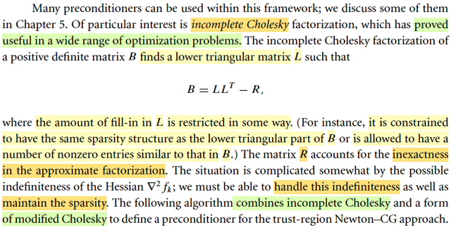</kbd>

> [!NOTE]
> Rồi, thế thì, đầu tiên cần nhớ lại, mục đích chính của cái vụ này là dùng
> matrix D để đổi biến, giúp đưa bài toán về bài toán equivalent, mà trong đó
> matrix hệ số trở thành DinvTADinv, và matrix D được chọn khiến cho
> DinvTADinv có phân phối trị riêng có đặc điểm tốt đẹp nào đó, khiến thuật
> toán CG hội tụ nhanh hơn nhiều so với bình thường. Và cụ thể là ta muốn
> DinvTADinv có các trị riêng co cụm lại thành r cluster với r << n. Hoặc chỉ có r
> giá trị khác nhau thôi. Và ở cấp độ cao nhất, thì tốt nhất đó là: mọi trị riêng
> đều bằng nhau: Đó là khi  DinvTADinv = I.
>
> Vậy thì ở đây ta muốn D sao cho DinvTBkDinv = I
>
> Thì dùng Cholesky factorization, Bk = LLT thì chọn D = LT thì ta sẽ có: 
>
> (LT)invT LLT (LT)inv = Linv L LT LinvT = (LinvL)(LinvL)T = sẽ đúng ra bằng I.
>
> Vấn đề là, nếu trong CG gốc, A luôn xác định dương, giúp đảm bảo tồn tại
> phép factor này.
>
> Nhưng ở bài toán subproblem thì Bk chưa chắc đã xác định dương. Do đó ta
> sẽ cần phải làm cái thủ thuật "modified Cholesky" Mà mình đã biết ở mấy
> chương trước, đại ý là trong quá trình chạy thuật toán, ta sẽ đặt "lệnh"
> Cholesky factoring ở trong try/catch. Và mỗi lần catch error, đồng nghĩa matrix
> không xác định dương khi đó, ta sẽ bơm giá trị vào (+ αk vào mỗi entries
> đường chéo, αk thế nào tí ta sẽ bàn khi phân tích thuật toán) để nâng nó lên
> (dĩ nhiên tổng đường chéo, trace, cũng là tổng trị riêng, thì khi bơm nhiều lần
> thì sẽ đến lúc nào đó trị riêng sẽ đều dương → matrix trở thành xác định
> dương)
>
> Một điểm nữa, là việc factor Cholesky nếu matrix Bk thưa thì quá trình tính
> toán của bước phân rã này có thể cũng sẽ rất tốn kém. Do đó người ta bày ra
> cái trò "incomplete Cholesky": Bk = LLT + R, nôm na là, dùng matrix R để
> khống chế  khiến L không trở thành dense: y như là, LLT chỉ cần xấp xỉ Bk
> thôi, không cần làm chính xác, khi đó, nó ko trở thành matrix dense.
>
> Tóm lại, thuật toán này chỉ là để có được L, để dùng làm matrix D khiến trong
> bài toán PCG thì matrix hệ số gần như là Identity → hội tụ siêu nhanh.

 

- **Cholesky sửa đổi không chính xác**

<kbd>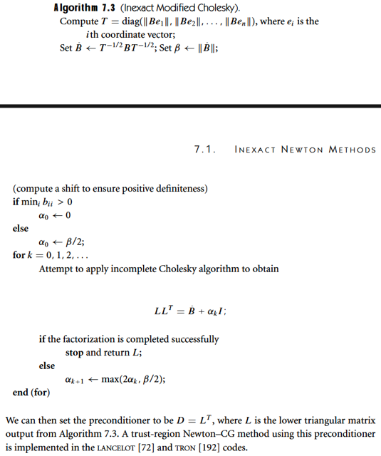</kbd>

> [!NOTE]
> Đầu tiên có thể hiểu T đang tạo diagonal matrix các entries đường
> chéo là ||Bej|| tức là sao? → Bej dĩ nhiên là lấy ra cột j của B. Sau
> đó lấy norm. Vậy các entries là các norm của các cột của B.
>
> Sau đó nó tính Bbar, hay B^ = T^(-1/2)BT^(-1/2) là sao?
>
> T^(-1/2) là diagonal matrix các entries là [Tii]^-1/2, tức 1/[Tii]^1/2
> tức 1/√Tii
>
> Vậy BT^(-1/2) sẽ có các cột là: [b1 * (1/√T11); b2 * (1/√T22); ...]
>
> Và T^(-1/2)BT^(-1/2) sẽ có các hàng là: hàng 1 của BT^(-1/2)
> đem nhân với (1/√T11), hàng 2 của BT^(-1/2) đem nhân (1/√T22)..
>
> Có nghĩa là, xét matrix B^ thì phần tử ij của nó sẽ là: Bij đem chia 
> cho √Tjj, tức căn bậc hai của norm cột j sau đó, chia tiếp cho √Tii
> tức là căn bậc hai của norm cột i:
>
> B^ij = Bij / √Tii√Tjj
>
> Và cái này theo thằng Gemini được biết là sẽ có vai trò là cân
> bằng matrix. Gọi là Matrix Equilibration.
>
> Sau đó lấy β là norm của matrix này. (dĩ nhiên, norm của nó là
> scaling factor lớn nhất)
>
> Tiếp, nó check xem phần tử đường chéo của B nhỏ nhất có âm
> hông. Nếu không thì cho α0 = 0, còn có thì cho = β/2
>
> Bắt đầu vòng lặp: 
>
> Cứ thử chạy thuật toán incomplete Cholesky factorizaion.
>
> (chính xác hơn là modifed (+ αk I) xong thì factor.
>
> LLT = B^ + αkI
>
> Nếu fail tức là B^ ko xác định dương, tăng αk lên và làm lại
> cho đến lúc việc chỉnh sửa đủ để khiến phép phân rã thành công.
>
> Ta sẽ có được L, đem gán cho D = LT và dùng nó cho trust region
> Newton PCG.

 

- **Phương pháp Newton-Lanczos Vùng Tin Cậy**

<kbd>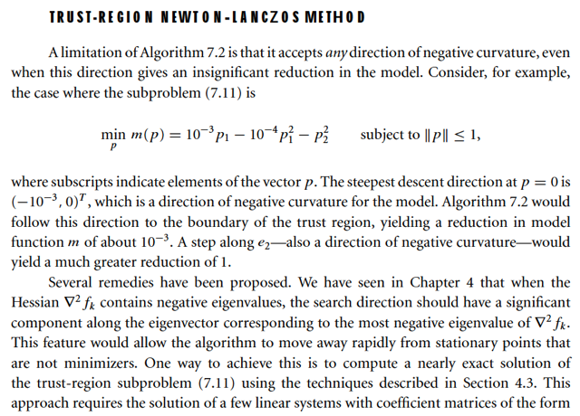</kbd>

> [!NOTE]
> QUAY LẠI SAU

 

