# 7.2 Limited-Memory Quasi-Newton Methods

📊 **Progress:** `19` Notes | `23` Screenshots | `1` AI Reviews

---

 

## Phương pháp Quasi-Newton Bộ nhớ Giới hạn

<kbd>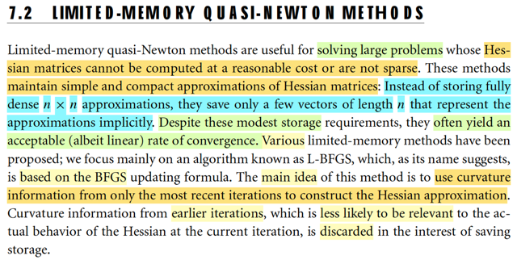</kbd>

> [!NOTE]
> Đại khái là nói về việc phần này sẽ xét những thuật toán hữu ích khi gặp
> những  bài toán tính Hessian quá tốn kém. Khi đó ý tưởng là, ta sẽ chỉ
> lưu trữ một phiên bản xấp xỉ của Hessian nhưng chỉ bằng cách lưu trữ vài
> vector thôi.
>
> Có nhiều biến thể, nhưng cái ta sẽ bàn là L-BFGS, là biến thể được dựa
> trên cách làm của BFGS. Mà ý tưởng là ta sẽ chỉ dùng các thông tin về
> độ cong của các iteration gần nhất, bỏ đi thông tin của các iteration xa hơn.
> Từ đó tiết kiệm chi phí lưu trữ.

 

### Phương pháp Quasi-Newton bộ nhớ hạn chế

<kbd>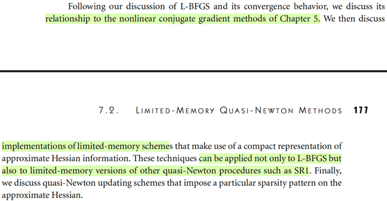</kbd>

 

#### Thuật toán BFGS

<kbd>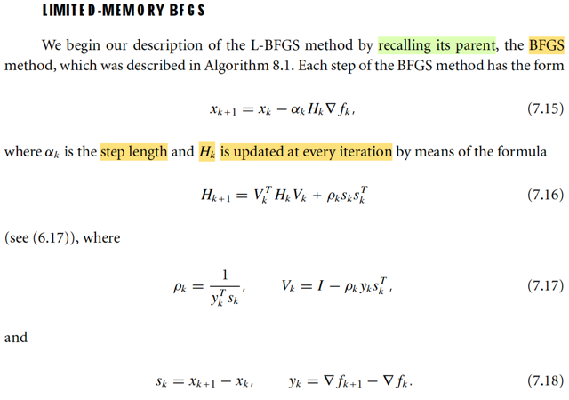</kbd>

> [!NOTE]
> Đầu tiên là ôn lại chút về BFGS.
>
> Thì mình còn nhớ đại ý là vầy:
>
> Ý tưởng chính, đó ta muốn dùng Newton step để làm hướng đi
>
> Ý là, trong quá trình tạo chuỗi điểm {xi} thì ta muốn dùng Newton step pkN để đi
> từ xk đến xk+1. Dĩ nhiên với Newton step, ta không cần phải tính step-size.
>
> xk+1 = xk + pkN
>
> Mà pkN thì biết rồi, = -(∇^2fk)inv ∇fk, công thức này xuất xứ từ việc: tại iteration
> k ta xấp xỉ hàm f bởi quadratic approximation của nó mk(p) = fk + ∇fkTp +
> (1/2)pT∇^2fkp và từ đó, giải bài toán minimize hàm mk(p), dùng điều kiện cần
> bậc nhất:
>
> ∇mk(p) = 0 ⇔ ∇^2fk p + ∇fk = 0
>
> ⇔ p = - (∇^2fk) ∇fk, chính là công thức Newton step.
>
> Nói chung cái mô tuýp này (dùng hàm mk(p) là xấp xỉ bậc hai của hàm f tại xk)
> để tìm hướng đi tại iteration k, là giống nhau ở cả Line Search, Trust Region, ...
>
> Ví dụ như với Line Search, thì tại mỗi iteration, ta cũng minimize mk(p), thì ta có
> thể dùng steepest descent direction, hoặc dùng luôn Newton step, nhưng kể cả
> khi dùng Newton step, ta lại line search để tìm step size chứ không dùng full
> step.
>
> Còn với Trust Region, thì cũng minimize mk(p), nhưng có điều có thêm
> constraint ||p|| ≤ Δk.
>
> BFGS, mình hiểu nó sẽ là thuật toán nhằm mục đích là làm giả
> Newton step để dùng, phục vụ cho bước di chuyển xk → xk+1. Hay mình hiểu
> đơn giản hơn, nó chính là Newton method nhưng làm giả Hessian step để tính
>  thay vì dùng Hessian thật. 
>
> Cái này khác với inexact Newton: Trong đó, ta cố tình tìm Newton step nhưng
> dùng thuật toán lặp (CG).
>
> Có nghĩa là tất cả các thuật toán đều cơ bản là đi từng bước nhưng khác nhau
> ở chỗ chọn step size thế nào (Line Search vs Trust Region) và nếu dùng Newton
> direction thì tính Newton step thế nào (quasi Newton và inexact Newton)
>
> Thế thì ôn lại cái BFGS, là một quasi-Newton, ý tưởng chính của nó là
> vầy:  Để tính pkN = -(∇^2fk)inv ∇fk, thì thay vì dùng Hessian thật ta sẽ
> dùng một  matrix Bk xấp xỉ của Hessian.
>
> Và ý tưởng cốt lõi để có Bk: Ta sẽ cập nhật nó từ từ, liên tục sau mỗi vòng
> lặp bởi thông tin curvature của vòng lặp trước đó.
>
> Và câu chuyện sẽ là như sau:
>
> Giả sử mình đã đi từ xk → xk+1. Thì mình sẽ dùng thông tin độ cong có
> được để cập nhật Bk, (nói cách khác là tính lại Bk+1). Dùng thế nào, hay
> cập nhật thế nào: Đó là ta sẽ đặt điều kiện cho Bk+1 sao cho mk+1(p)
> (xấp xỉ bậc hai của f tại xk+1: fk+1 + ∇fk+1Tp + (1/2)pT Bk+1 p) phải tính
> được  chính xác độ dốc hàm f tại xk. Thì hành động này, hay điều kiện
> này cũng chính là ép Bk+1 phải chứa thông tin curvature của hàm số khi
> đi từ xk đến xk+1. Và từ đó ta sẽ có cái gọi là secant equation.
>
> Rồi, sau đó, đại khái là từ đó nó sẽ đẻ ra thêm một ý là, để tồn tại nghiệm
> của secant equation, thì ta cần đảm bảo điều kiện skTyk > 0, gọi là
> curvature condition. Và có thể chứng minh với step-size thỏa Wolfe
> condition thì cái này sẽ thỏa, giúp đảm bảo secant equation sẽ có nghiệm.
>
> Tuy nhiên, ta cần áp thêm điều kiện nữa, vì secant equation có thể có vô
> số nghiệm Bk thỏa. Và điều kiện đó chính là, Bk nên giống với Bk-1 nhất.
> Và vì vài nguyên nhân, người ta dùng một loại weighted norm nào đó, để
> dùng trong tiêu chí "gần nhất" này.
>
> từ đó ta có điều kiện hoàn chỉnh của Bk:
>
> minimize_B ||B - Bk|| s.t B thỏa secant equation, và B đối xứng. với norm
> là  ||.||W với W đặc biệt nào đó được chọn để giúp mang lại tính scale
> invariance.
>
> Và giải bài toán này ta sẽ derive ra công thức cập nhật Bk+1 từ Bk.
>
> Nói chung đó cơ bản là ý tưởng chính của BFGS, nhưng sau đó có thêm
> vài bước cải tiến: Đó là thay vì tạo ra công thức để cập nhật Bk, ta sẽ
> dùng một công thức biến đổi, để tạo ra công thức giúp cập nhật (Bk)inv,
> gọi là Hk, vì chung quy lại mục đích chính là tính Newton step. Từ đó ta
> có thuật toán BFGS hoàn chỉnh.

 

##### L-BFGS: Giới hạn bộ nhớ

<kbd>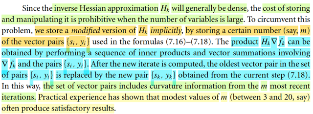</kbd>

> [!NOTE]
> Đại ý là đoạn này mô tả ý tưởng chính của L-BFGS, ta sẽ không thể lưu trữ
> Hk, khi quy mô bài toán quá lớn. Do đó, ý tưởng sẽ là, ta chỉ lưu trữ các cặp
> vector {yi, si}. Và dùng một cách thức để tính toán ra Hk ∇fk thông qua việc
> tính toán từ các cặp {yi, si} và ∇fk.
>
> Nói cách khác, thay vì tại mỗi vòng, thay vì dùng Hk đang lưu ở vòng trước
> để tính Hk mới (update lại nó) thì ta sẽ dùng bộ các cặp {yi, si} để tính.
>
> Và cách làm này còn hay ở chỗ, sau mỗi vòng, ta sẽ chủ động bỏ bớt một
> cặp {yi, si} "ở xa", để chỉ duy trì m cặp từ m vòng lặp gần nhất. Mang ý nghĩa
> là ta chỉ giữ và dùng curvature info gần nhất thôi.
>
> Nói thêm, vì sao lại là các cặp {yi, si}. Là vì như đã vừa nói ở note trước,
> chênh lệch vị trí (sk = xk+1 - xk) và độ dốc (yk = ∇fk+1 - ∇fk) sẽ mang trong
> mình thông tin curvature từ xk → xk+1, mà việc đặt điều kiện Bk+1 phải
> thỏa secant equation chính là để cho giá trị của nó phản ánh được, chứa
> đựng được thông tin curvature này

 

###### Thuật toán L-BFGS hai vòng

<kbd>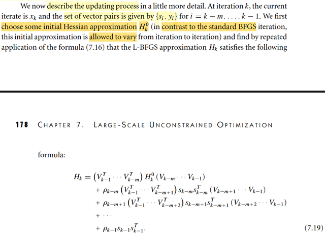</kbd>

> [!NOTE]
> Rồi, đại khái ý tưởng để là cái vụ tạo một quy trình để tính ra cái
> (Hk)∇fk từ set các cặp si, yi và ∇fk là vầy:
>
> Đầu tiên, hãy nhìn công thức update Hk mà nguồn cơn của nó từ
> đâu thì mình vừa ôn lại rồi.
>
> Hk+1 = VkTHkVk + ρkskskT, Vk = I - ρkykskT
>
> Để cho đỡ dài dòng minh cứ dùng k = 7 đi.
>
> H8 = V7TH7V7 + ρ7s7s7T
>
> Thay H7 = V6TH6V6 + ρ6s6s6T
>
> ⇨ H8 = V7T(V6TH6V6 + ρ6s6s6T)V7 + ρ7s7s7T
>
> = V7TV6TH6V6V7 + V7Tρ6s6s6TV7 + ρ7s7s7T
>
> lại thay H6 = V5TH5V5 + ρ5s5s5T
>
> ⇨ H8 = V7TV6T[V5TH5V5 + ρ5s5s5T]V6V7 + V7Tρ6s6s6TV7 +
> ρ7s7s7T
>
> = V7TV6TV5TH5V5V6V7 + V7TV6Tρ5s5s5TV6V7 + V7Tρ6s6s6TV7
> + ρ7s7s7T
>
> = V7TV6TV5TH5V5V6V7 + ρ5 V7TV6Ts5s5TV6V7 + ρ6 V7Ts6s6TV7
> + ρ7s7s7T
>
> Và đây chính là công thức 7.19 với k=8, m=3 (Vk-m = V5)
>
> Có nghĩa là, nếu ta giữ các bộ (s5, y5), (s6, y6), (s7, y7) và bắt đầu
> từ initial matrix là H5
>
> Thì bằng việc tính V5,V6,V7, rồi tính cái nùi trên, ta sẽ có H8.
>
> Tuy nhiên, cái ta cần tính là Hk ∇fk, ở đây sẽ là:
>
> H8 ∇f8
>
> = [V7TV6TV5TH5V5V6V7 + ρ5 V7TV6Ts5s5TV6V7 
>
> + ρ6 V7Ts6s6TV7 + ρ7s7s7T] ∇f8
>
> = V7TV6TV5TH5V5V6V7∇f8 
>
> + ρ5 V7TV6Ts5s5TV6V7∇f8
>
> + ρ6V7Ts6s6TV7∇f8 + ρ7s7s7T∇f8
>
>
> = V7TV6TV5TH5V5V6V7∇f8 
>
> +  V7TV6Ts5ρ5s5TV6V7∇f8
>
> + V7Ts6ρ6s6TV7∇f8 
>
> + s7ρ7s7T∇f8
>
> Nếu tính tay và để cho tiết kiệm phép tính, ta sẽ tính như sau
>
> Bước 1:
>
> i) Lấy ∇f8, gán cho q
>
> ii) Tính ρ7s7T∇f8 = ρ7s7Tq → ra scalar, đặt là α7: 
>
> iii) Tính V7∇f8 = (I - ρ7y7s7T)q = q - ρ7y7s7Tq = q - α7y7
>
> Lấy V7∇f8 = q - α7y7, gán cho q
>
> -----
>
> iv) Tính ρ6s6TV7∇f8 = ρ6s6Tq → ra scalar, đặt là α6
>
> v) Tính V6V7∇f8 = (I - ρ6y6s6T)q = q - ρ6y6s6Tq = q - α6y6
>
> Lấy V6V7∇f8 = q - α6y6, gán cho q.
>
> ----
>
> vi) Tính ρ5s5TV6V7∇f8 = ρ5s5Tq, đặt là α5
>
> vii) Tính V5V6V7∇f8 = (I - ρ5y5s5T)V6V7∇f8 = (I - ρ5y5s5T)q = q - ρ5y5s5Tq 
>
> Lấy V5V6V7∇f8, gán cho q
>
> -----
>
> (viii) Tới đây, tính H5V5V6V7∇f8, = H5q, gán cho r 
>
> ====
>
> Tại đây nhìn lại để thấy cách ta sẽ làm tiếp:
>
> = V7TV6TV5TH5V5V6V7∇f8 
>
> +  V7TV6Ts5ρ5s5TV6V7∇f8
>
> + V7Ts6ρ6s6TV7∇f8 
>
> + s7ρ7s7T∇f8
>
> Những chỗ in đậm là những cái đã có.
>
> = V7TV6TV5Tr
>
> +  V7TV6Ts5α5
>
> + V7Ts6α6
>
> + s7α7
>
> Gom lại để thấy cách tính:
>
> V7T[V6TV5Tr + V6Ts5α5 + s6α6] + s7α7
>
> = V7T[V6T[V5Tr + s5α5] + s6α6] + s7α7
>
> Như vậy các bước tiếp theo sẽ là
>
> ix) Tính V5Tr + s5α5
>
> = (I - ρ5y5s5T)Tr = (IT  - (ρ5y5s5T)T) r + s5α5
>
> = (r - (ρ5y5s5T)T) r + s5α5
>
> = r - (ρ5y5s5T)Tr + s5α5
>
> = r - ρ5s5y5Tr + s5α5
>
> Vậy thì đầu tiên tính ρ5y5Tr, gán cho β   
>
> Sau đó tính r - s5β + s5α5 = r + s5(α5 -β), gán cho r
>
> x) Tính V6T[V5Tr + s5α5] + s6α6
>
> = V6Tr + s6α6
>
> = r - ρ6s6y6Tr + s6α6
>
> = r + s6[α6 - ρ6y6Tr]
>
> Tính β = ρ6y6Tr
>
> Tính r + s6[α6 - β], gán cho r
>
> xi) V7T[V6T[V5Tr + s5α5] + s6α6] + s7α7
>
> Tính β = ρ7y7Tr 
>
> Tính r + s7[α7 - β]. 
>
> Đây là kết quả cuối cùng.
>
> ------
>
> TÓM TẮT LẠI
>
> I) 
>
> q = ∇f8 | từ (i)
>
> α7 = ρ7s7Tq (ii)
>
> q = q - α7y7 (iii)
>
> α6 = ρ6s6Tq (iv)
>
> q = q - α6y6 (v)
>
> α5 = ρ5s5Tq  (vi)
>
> q = q - α5y5 (vii)
>
> r = H5q (viii)
>
> II)
>
> β = ρ5y5Tr
>
> r = r + s5(α5 - β) (ix)
>
> β = ρ6y6Tr
>
> r = r + s6(α6 - β) (x)
>
> β = ρ7y7Tr 
>
> r = r + s7[α7 - β] (xi)
>
> =====
>
> Từ đó ta sẽ có thuật toán:
>
> Khởi tại q = ∇f8, chọn H0_k = H5
>
> Chạy vòng lặp i = 7,6,5
>
> αi = ρisiTq 
>
> q = q - αiyi 
>
> Kết thúc vòng lặp
>
> r = H0q
>
> II)
>
> Chạy vòng lặp i = 5,6,7
>
> β = ρiyiTr
>
> r = r + si(αi - β) 
>
> Kết thúc vòng lặp, trả ra r chính là H8 ∇f8 cần tính.
>
> Tới đây khái quát lên chút, thì nếu ta đang tính Hk ∇fk và "tính" 
> thông tin curvature của m vòng gần nhất (trong ví dụ trên là m = 3)
>
> thì vòng lặp thứ nhất sẽ là i từ k-1 (tương đương 7) → k-m (tương đương 5)
>
> và vòng lặp thứ hai sẽ là i từ k-m → k-1
>
> Và H0k sẽ chọn là Hk-m
>
> Và đó chính là thuật toán 7.4 L-BFGS two-loop recursion

 

###### L-BFGS Độ phức tạp tính toán

<kbd>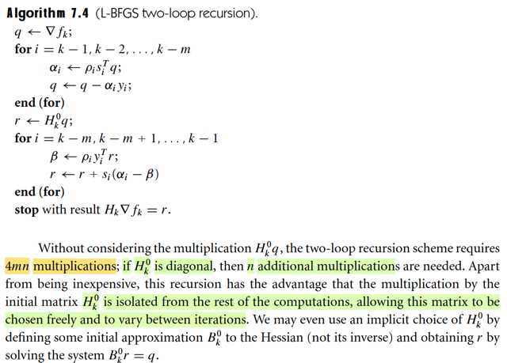</kbd>

> [!NOTE]
> Ta có thể tính thử chi phí tính toán:
>
> Còn nhớ đã học trong EE364a, một flop, viết tắt của floating points operation
> sẽ có thể coi như một phép nhân scalar-scalar + một phép cộng scalar-scalar
>
> Nên dot product của hai R^n vector sẽ tốn n phép nhân scalar và n-1 phép 
> cộng scalar → coi như tốn (2n-1)/2 = (n-1/2) flops
>
> Vậy thì ở đây trong vòng lặp thứ nhất,
>
> αi = ρisiTq ⇨ tốn n flops cho siTq và 1 flops cho ρisiTq
>
> q = q - αiyi ⇨ tốn n/2 flops cho - αiyi và n/2 flops cho q - αiyi
>
> ⇨ tổng cộng là n + 1 + n = 2n+1
>
> và vòng lặp này sẽ chạy m vòng ⇨ tốn 2mn + m
>
> Vòng lặp thứ hai:
>
> β = ρiyiTr ⇨ tốn n flops cho yiTr và 1 flops cho ρiyiTr
>
> r = r + si(αi - β) ⇨ tốn n/2 flops cho si(αi - β) và n/2 cho r + si(αi - β)
>
> ⇨ tổng cộng tốn 2n + 1
>
> Cũng chạy m lần ⇨ tốn 2mn + m
>
> TỘng cộng là 2mn + m + 2mn + m = 4mn + 2m coi như 4mn.
>
> Dù trong sách gs tính phép nhân, nhưng mình có thể tính luôn ra flops.
>
> -----
>
> Đoạn sau cũng dễ hiểu khi gs nói ta có thể thấy việc tính toán bước r := H0k q
> hoàn toàn tách khỏi hai vòng lặp, nên H0k hoàn toàn có thể được chọn khác
> nhau ở mỗi vòng lặp.
>
> Và ta thậm chí có thể thay bằng cách chọn B0k và giải B0k r = q để rồi mang
> tính chất là ta đang chọn H0k một cách ngầm định.

 

###### Tối ưu hóa khởi tạo H0 BFGS

<kbd>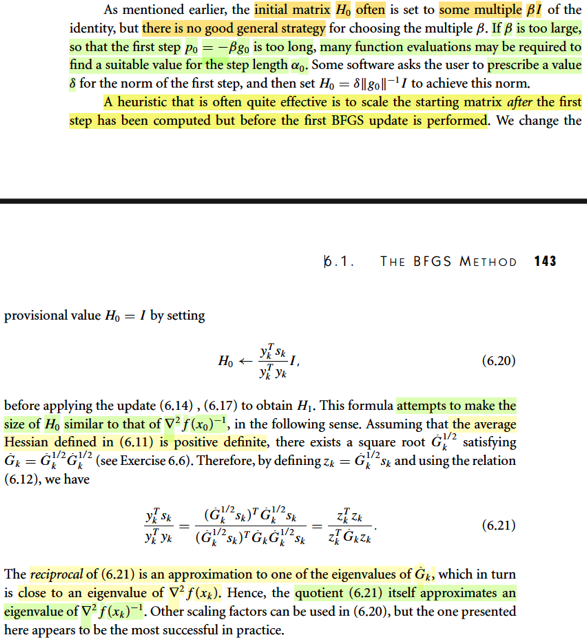</kbd>

> [!NOTE]
> Quay lại đoạn này trong chap 6 - nói về chiến lược khởi tạo H0 của thuật toán
> BFGS gốc. Trong những phần trước, đã nói đến việc thường thường người ta
> chọn H0 = βI. nhưng β chọn thế nào thì không có cách nào là best practice
>
> Nếu β quá lớn, thì bước đi đầu tiên p0 = - β g0 sẽ quá dài, dẫn đến backtracking
> line search sẽ phải chạy rất nhiều lần để chọn α0.
>
> Mình hiểu ý này như vầy: Bản chất trong quasi-Newton method thì cái chính là ta
> cập nhật matrix Hk qua từng vòng lặp, bằng cách cho nó thỏa secant
> equation để Hk ở vòng sau mang curvature information của hàm số khi đi từ
> xk-1 → xk.
>
> Thế thì tính chất của việc dùng Newton step, là ta sẽ lấy step-size factor bằng 1
> (tức lấy bằng chiều dài vector pk) và thu ngắn dần cho đến khi  thỏa (Wolfe
> condition). Với cái kiểu này, thì nếu như matrix chứa thông tin độ cong theo
> hướng pk một cách chính xác, thì chỉ cần αk = 1 thì đã thỏa rồi → ta sẽ phóng
> ngay tới điểm xk+1 = xk + pk. Và điều này là cái ta có được nếu dùng Hessian
> thật: pk = - ∇^2fk ∇fk.
>
> Tuy nhiên, với quasi-Newton, pk = - Hk ∇fk, mà Hk thì chưa có curvature
> information từ xk → xk+1. Do đó, rất có thể pk tính ra quá dài, và
> backtracking line search phải chạy nhiều lần để thu ngắn step size lại.
>
> Khi đi từ x0 → x1, dùng H0 = βI thông tin độ cong theo hướng x0 đến x1, chính xác
> là độ lớn của nó hoàn toàn bị quyết định bởi β. Và  do đó nếu β chọn lớn quá, thì
> p1 sẽ cực dài, khiến backtracking chạy  phờ râu. Và ở đây gs chính là nói đến ý
> này. Cũng chính vì vậy mà một số phần mềm tối ưu yêu cầu ta phải gán con số β
> này, mục đích là để mình tự đánh giá độ lớn của độ cong và chọn một con số ban
> đầu phù hợp.
>
> ------
>
> Và khi đã hiểu bản chất này, thì cũng dễ hiểu vì sao có cái kiểu làm theo  kinh
> nghiệm (heuristic) là vầy:
>
> Đại khái là đầu tiên ta cứ cho H0 = βI, và tính ra p0, backtracking line search để có
> α1, và đến được x1. Bước này có thể lâu nếu β chọn ko chuẩn.
>
> Sau đó, ta sẽ dùng thông tin độ cong từ x0 → x1 để làm như sau:
>
> Bình thường, ta sẽ dùng thông tin này để tính H1: secant equation sẽ buộc nó chứa
> thông tin độ cong theo hướng x0 → x1.
>
> Tuy nhiên, cái thủ thuật ở đây là: Thay H0 cũ (đang bằng βI), đang chứ thông tin độ
> cong dự đoán ở mọi hướng đều có độ lớn bởi β, ta sẽ thay nó bằng matrix khác:
> (y0Ts0/y0Ty0) I, để nó có độ cong dự đoán ở mọi hướng đều có độ lớn tầm tầm độ
> cong theo hướng x0 → x1.
>
> Việc tiếp theo, dùng nó để tính H1: Bằng cách ép nó chứa độ cong từ x0 → x1 thì
> giống như cũ.
>
> Điểm khác nhau là: Nếu chỉ tính H1 từ H0 = β*I, thì H1 sẽ phản ánh độ cong từ x0
> → x1 theo cách xem xem với Hessian thật, nhưng ở các hướng khác, nó vẫn là
> dự đoán ban đầu: β. Khi đó, khi tính p1, khả năng cao p1 cũng sẽ rất dài (y như
> khi tính p0 = - β ∇f0 vậy).
>
> Còn khi mình đã gán lại H0 = (y1Ts1/y1Ty1) I, và tính ra H1 thì chắc chắn tuy rằng
> H1 ở cách này cũng y như H1 của cách cũ trong độ cong từ x0 → x1 nhưng H1 ở
> cách mới sẽ mang thông tin độ cong ở các hướng khác xem xem với độ cong ở
> hướng x0 → x1 chứ ko phải phụ thuộc β nữa. Nên khả năng cao là khi tính p1, ko
> cần phải backtracking line search quá nhiều.
>
> Và đoạn dưới chính là giải thích vì sao lại như vậy.
>
> -----
>
> Hiểu như sau: Đầu tiên, nhớ lại công thức 6.11 define matrix Gbar_k, hay viết tắt là
> G^k là tích phân của Hessian từ xk → xk+1, nói chung là mang ý nghĩa là Hessian
> trung bình từ xk → xk+1. Mục đích là ta sẽ chứng minh rằng bằng cách initialize H0
> = (ykTsk/ykTyk) I thì trị riêng sẽ xem xem với độ lớn của Hessian thật.
>
> Theo gs thì nếu G^k xác định dương, thì có thể phân tách nó thành:
>
> G^k = (G^k)^(1/2) (G^k)^1/2.
>
> Để cho gọn mình dùng kí hiệu L để chi (G^k)^1/2
>
> G^k = LL. (Đây là nội dung bài tập 6.6)
>
> Ta có yk = G^ksk
>
> ⇨ ykTsk = (G^ksk)Tsk = skTG^ksk = skTLLsk = skTLT Lsk (L đối xứng)
>
> = (Lsk)T(Lsk)
>
> Đặt zk = Lsk, ta có zkTzk
>
> Mẫu số: ykTyk = (G^ksk)T(G^ksk) = skTG^kTG^ksk
>
> = skTLTLTLLsk = (Lsk)T LL Lsk = zkT G^k zk
>
> Như vậy ykTsk/ykTyk = zkTzk / zkT G^k zk
>
> và H0 = (ykTsk/ykTyk) I = (zkTzk / zkTG^kzk)I
>
> Giờ lập luận như sau:
>
> Xét zkTG^kzk. vì G^k là matrix xác định dương, nên có thể phân tách thành
>
> G^k = QT Λ Q
>
> Ta có zkT QT Λ Q zk = (QTzk)T Λ Qzk. Đặt y = QTzk. Ta có yTΛy
>
> = yT[λ1y1, ..λnyn] = λ1y1^2 + λ2y2^2 + ...= Σλi yi^2
>
> Ta có bất đẳng thức sau:
>
> λmin ≤ λi ≤ λmax
>
> ⇨ Σλmin yi^2 ≤ Σλi yi^2 ≤ Σλmax yi^2
>
> ⇔ λmin Σi yi^2 ≤ Σλi yi^2 ≤ λmax Σi yi^2
>
> ⇔ λmin yTy ≤ Σλi yi^2 ≤ λmax Σi yTy
>
> ⇔ λmin ≤ Σλi yi^2 / yTy ≤ λmax
>
> ⇔ λmin ≤ zkT QTΛQ zk / zkQTQTzk ≤ λmax
>
> ⇔ λmin ≤ zkTG^kzk / zkTzk ≤ λmax
>
> Điều này có nghĩa là, mọi phần tử của matrix (zkTG^kzk / zkTzk) I sẽ có độ lớn đều
> từ λmin(G^k) và λmax(G^k). Nên trị riêng của nó cũng sẽ sẽ nằm trong khoảng này.
>
> Cũng có thể hiểu là, giá trị (zkTG^kzk / zkTzk) sẽ gần với một trị riêng nào  đó của
> matrix G^k.
>
> Do đó nghịch đảo của nó, tức zkTzk / zkTG^kzk sẽ gần với một trị riêng nào đó của
> nghịch đảo của G^k.
>
> Mà G^k thì là Hessian trung bình, nên nó sẽ approximate (∇^2fk)inv giúp kết  luận
> zkTzk / zkTG^kzk sẽ gần với một trị riêng nào đó của (∇^2fk)inv.
>
> Từ đó bằng cách gán H0 = (zkTzk / zkTG^kzk)I sẽ giúp ta có matrix mà độ lớn của
> trị riêng sẽ gần với ít nhất một trị riêng nào đó của Hessian inverse thật giúp cho độ
> lớn của thông tin độ cong không quá khác xa thông tin độ cong của Hessian thật,
> giúp khắc phục vấn đề

 

###### Chọn H0k BFGS

<kbd>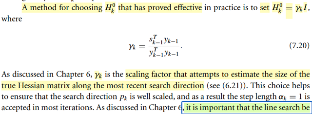</kbd>

> [!NOTE]
> Nhờ quay lại hiểu rõ cái thủ thuật chọn H0 của BFGS gốc, quay lại đây mình 
> có thể hiểu cách chọn H0_k ở đây: H0k = γk I với γk = sk-1Tyk-1/yk-1Tyk-1
>
> Làm vậy sẽ giúp cho thông tin độ cong trong n chiều không gian của H0k
> sẽ xem xem mức độ với thông tin độ cong từ xk-1 → xk.

 

###### Thuật toán L-BFGS

<kbd>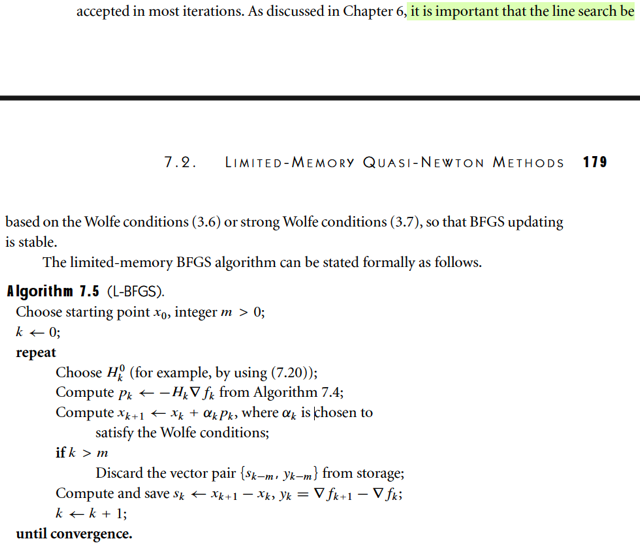</kbd>

> [!NOTE]
> Từ đó ta có thuật toán L_BFGS: Giải thích lại cũng là để ôn lại hết mọi thứ:
>
> Ideas / story chính của LBFGS là: Ta KHÔNG MANG VÁC Hk TỪ STEP ĐẦU ĐẾN
> GIỜ.
>
> Nói cho dễ hiểu, ví dụ k = 20. Thì H20 của BFGS sẽ là như sau: Ban đầu nó khởi tạo
> bởi β*I. Khi đi đến x1, nó sẽ dùng thông tin độ cong từ x0 → x1 để gán lại cho H0 giúp
> magnitude của nó xem xem với Hessian inverse.
>
> Tiếp như đã biết ta sẽ dùng thông tin độ cong này để thông qua secant equation ép H
> phải chứa thông tin độ cong từ x0 → x1 để tính H1, rồi p1, backtracking line search
> tìm α1, và đi đến x2.
>
> Lại lặp lại: Dùng thông tin độ cong từ x1 → x2 để tính H2, rồi p2, α2, đi đến x3. Tiếp
> tục vậy.
>
> Thì thì khi đó, H20 sẽ chứa thông tin độ cong của 20 step trước đó, nếu mỗi hướng
> p1, p2,...là một chiều ko gian thì H20 có thông tin độ cong ở 20 chiều khác nhau.
>
> Tuy nhiên các thông tin độ cong này là tại những điểm xa xôi trước đó, vốn dĩ có
> thể không còn ích lợi gì tại bước 20 này. Nên việc lưu trữ và tính toán trên matrix
> Hk với bài toán quy mô lớn sẽ tốn kém.
>
> L-BFGS làm như sau:
>
> Ta sẽ lưu trữ m cặp, ví dụ m = 5: lưu 5 cặp y16, s16, ...,y20, s20 và dùng nó để
> tính toán H20 thông qua một cơ chế (thuật toán 7.4) mà bản chất cũng chỉ là ép H20
> phải chứa  thông tin độ cong tại 5 bước gần nhất, bắt đầu bởi H20_0 là một matrix
> được khởi tạo bởi γ20 * I, giúp nó có magnitude xem xem với Hessian hiện tại. Và về
> bản chất, có thể coi như BFGS gốc tính ra H20 với cùng cơ chế này nhưng với 20
> cặp yi, si: y0,s0, ...y20, s20 (với matrix ban đầu được khởi tạo là γ0 * I) thay vì chỉ
> 5 cặp như L_BFGS, tất nhiên bản chất matrix thì vậy nhưng sự tính toán thì khác,
> tốn kém hơn.
>
> Còn L-BFGS thì chỉ làm với 5 cặp gần nhất, và cơ chế này giúp tính toán chỉ là
> những phép dot product rất nhẹ nhàng.
>
> Và cũng đồng nghĩa là khi qua một vòng lặp mới, nếu cái rổ chứa các cặp yi, si đã
> đầy thì ta bỏ bớt cái cặp xưa nhất, và thêm mới cặp gần nhất vào.
>
> Nên thuật toán 7.5 cơ bản là vậy:
>
> Khỏi tạo Hk_0.
>
> Dùng cơ chế (7.4) để tính Hk.
>
> Dùng nó để tính pk (quasi Newton step).
>
> Rồi line search để tìm αk (với ban đầu = 1 và scale nhỏ dần cho đến khi thỏa Wolfe
> condition)
>
> Vì sao vẫn phải line search? À là vì chưa chắc Hk đã chứa thông tin độ cong theo
> hướng pk một cách phù hợp được như Hessian chuẩn. Nếu là Hessian chuẩn thì
> khỏi line search, α = 1 là chắc chắn thỏa rồi. Nhưng Hk thì ko, nên có thể pk vẫn dài
> quá, và phải thu ngắn lại. Nhưng việc khởi tạo cái chính là khiến nó ko quá tệ, line
> search ko chạy hộc máu.
>
> Có αk rồi tính nhảy đến xk+1.
>
> Cập nhật lại cái rổ yi, si
>
> ====
>
> Vì sao lại phải line search the Wolfe hay Strong Wolfe condition: Là vì trong BFGS ta
> đã biết, nếu dùng điều kiện này, thì sẽ giúp cũng thỏa curvature condition, và giúp
> secant equation có nghiệm thì khi đó quá trình tính Hk mới ổn định (nên nhớ quá
> trình tính Hk về bản chất chỉ là giải secant equation: bắt nó chứa thông tin curvature
> của các hướng gần nhất)

 

###### Hiệu suất thuật toán L-BFGS

<kbd>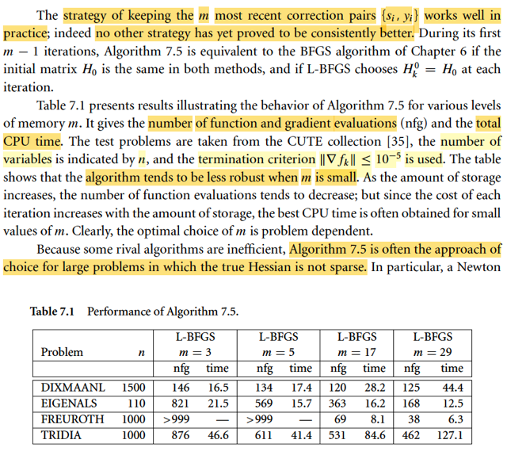</kbd>

> [!NOTE]
> Cũng dễ hiểu khi gs nói trong m-1 iteration đầu tiên thì thuật toán hoạt
> động y chang BFGS gốc (vì lúc này matrix Hk vẫn được update đầy đủ
> thông tin curvature của các step trước đó).
>
> Đoạn say là một cái bảng cho thấy hiệu suất của thuật toán L-BFGS
> với nhiều cấp độ bộ nhớ, thể hiển với hai chỉ số là CPT time và tổng
> số lần tính (evaluation) hàm f và gradient.
>
> Kết luận của tác giả là đây có thể coi như là thuật toán TỐT NHẤT
> cho các bài toán large scale mà Hessian thật không sparse.

 

###### L-BFGS: Ưu nhược điểm

<kbd>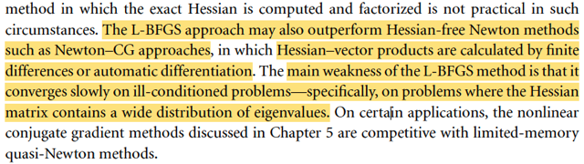</kbd>

> [!NOTE]
> Nó thậm chí còn vượt trội hơn các phương pháp In-exact Newton ví dụ như
> Newton-CG đã học ở chap 7.1.
>
> Tuy nhiên, nó vẫn có điểm yếu là work ko tốt khi bài toán ill-conditioned,
> nơi mà Hessian có trị riêng phân tán rộng. Trong những bài toán này thì
> đối thủ của L-BFGS chính là Non-Linear CG

 

###### BFGS không bộ nhớ & Gradient

<kbd>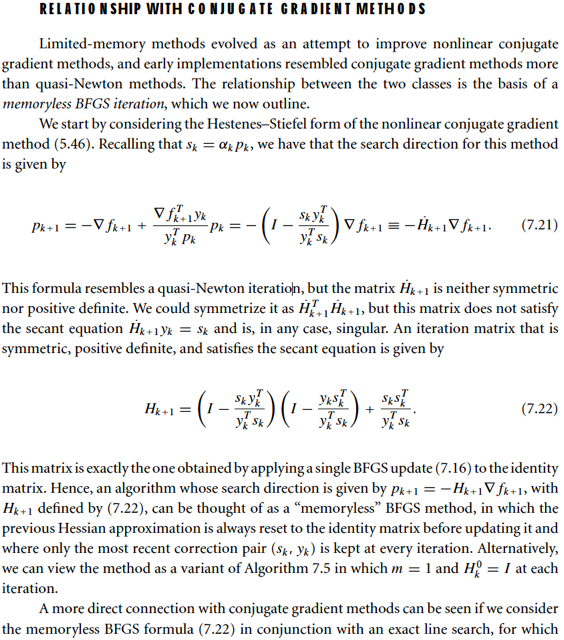</kbd>

<kbd>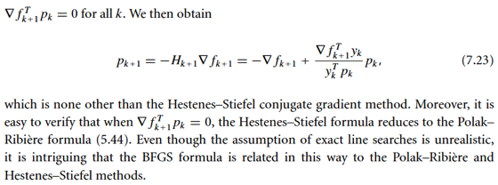</kbd>

> [!NOTE]
> BỎ QUA

 

###### L-BFGS Dạng Compact

<kbd>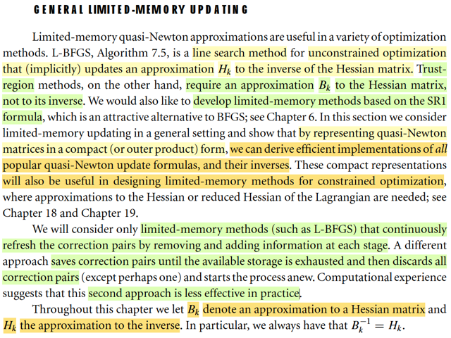</kbd>

> [!NOTE]
> Đoạn này đại ý là nói trước về những gì sắp làm: Hiểu nôm na là ta sẽ
> học cách nhìn nhận thuật toán L-BFGS theo góc nhìn khác, compact-
> form - nhân matrix khối, thay vì như đang hiểu là dùng 2 vòng lặp để 
> cập nhật matrix Hk
>
> Mục đích thì đại khái là để chuẩn bị cho việc sử dụng thuật toán này
> cho các bối cảnh khác, ví dụ như trong Trust Region (L-BFGS gốc là
> một Line Search method)
>
> Gs cũng nói trước là có hai cách làm đối với việc lưu trữ và cập nhật
> các cặp {si, yi}. Một là như đã biết: đầy rổ thì bỏ cũ nhất, thêm mới
> nhất vào. Còn cách hai là đầy rổ thì bỏ hết, start fresh, và cách này không
> tốt bằng. 
>
> Cuối cùng, nhắc lại là ta sẽ kí hiệu Bk là approx của Hessian, Hk là approx
> của Hessian inverse. Và Bkinv = Hk

 

###### Cập nhật BFGS dạng gọn

<kbd>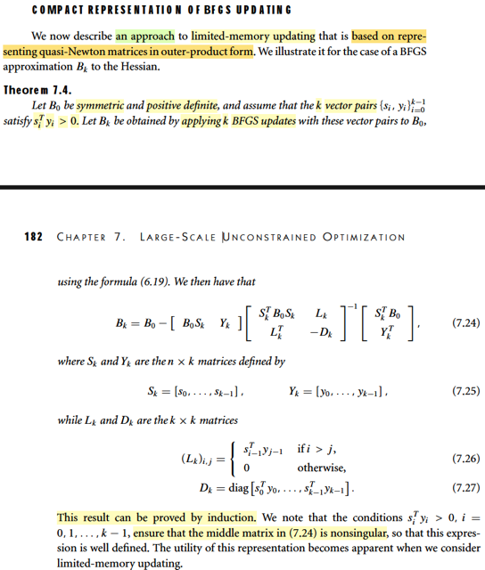</kbd>

<kbd>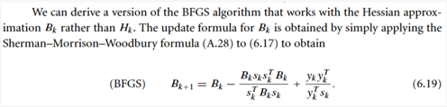</kbd>

> [!NOTE]
> Đầu tiên, đại khái là còn nhớ ở chap 6, trong BFGS gốc, sau khi
> mình có công thức cập nhật Hk, thì người ta lại nói rằng ta lại có
> thể dùng một công thức biến đổi để có công thức cập nhật Bk.
>
> Để hiểu rõ hơn thì tóm tắt nhanh câu chuyện là vầy: Ta cần
> Hessian nghịch đảo để tính Newton step. Ta mới tìm cách tạo ra
> Bk, xấp xỉ của Hessian thật. Bằng cách khởi tạo bởi β * I với β
> chọn một cách  phù hợp để nó có độ lớn cỡ cỡ trị riêng của
> Hessian thật, sau đó  buộc nó thỏa các secant equation, khiến
> nó chứa thông tin độ cong  của các hướng x0 → x1, x1 → x2,..
> Cũng như là Bk+1 phải gần nhất về norm với Bk. Từ đó ta có
> một công thức để cập nhật Bk sau mỗi vòng lặp. Đây là ideas
> gốc của quasi-Newton.
>
> Tuy nhiên, vì cuối cùng, mục đích là cần Bk inverse chứ ko phải
> Bk, từ đó, người ta dùng công thức chuyển đổi SMW để có
> được công thức cập nhật Hk. Đây là thuật toán quasi-Newton có
> tên là DFP
>
> Sau đó. để hiệu quả hơn nữa, BFGS mới áp cái câu chuyện
> trên vào chính quá trình xây dựng Hk, tức là thay vì dùng buộc
> Bk thỏa secant equation, ta buộc Hk thỏa một phiên bản inverse
> của secant equation, để rồi kết quả là ta có thuật toán update
> Hk tốt hơn, đây là BFGS gốc.
>
> Sau hết, người ta lại một lần nữa dùng công thức chuyển đổi
> SMW để có công thức update Bk. Đây chính là 6.19
>
> -----
>
> Vậy thì ở Theorem này đại khái chỉ là nói rằng, nếu ta dùng
> công thức update Bk 6.19 để tạo các B0 → B1 → ... → Bk như
> một  vòng lặp liên tục thì cơ bản là có thể thể hiện việc tạo
> Bk từ B0 một phát một thông qua công thức 7.24:
>
> Việc chứng minh có thể thực hiện bằng quy nạp, và thật sự
> cũng ko cần phải chứng minh làm gì. Chỉ cần biết đây là công
> thức compact, giúp tính ra Bk một phát một từ B0, thay vì chạy
> vòng lặp cập nhật B0 → B1 → ....→ Bk. Sử dụng các matrix:
>
> Sk: gom hết các vector s0,....sk-1 vào thành các cột của matrix Sk
>
> Yk: gom hết các vector y0,...yk-1 thành các cột của Yk
>
> Dk là diagonal matrix bởi s0Ty0, s1Ty1,....
>
> Và Lk là matrix nếu i > j thì entries là si-1Tyj-1, ngược lại thì = 0.
>
> -----
>
> Nên hiểu mục đích của cái này: Đại khái là để có thể có xấp xỉ
> của Hessian nhưng ko cần phải lưu trữ tốn kém: Y như mục đích
> của L-BFGS là có được xấp xỉ của Hessian inverse mà ko cần
> phải lưu trữ Hk từ đầu đến cuối, thay vào đó, chỉ cần lưu một
> rổ các vector yi, si và ở vòng nào thì tính lại Hk vòng đó.
>
> Thì đây cũng vậy, mục đích là có xấp xỉ Hessian Bk nhưng ko cần
> phải lưu trữ Bk từ đầu đến cuối (như cách dùng SMW để có công
> thức cập nhật Bk ở mỗi vòng), mà thay vào đó ta sẽ chỉ lưu một
> rổ các si, yi và dùng nó để tính lại Bk ở mỗi vòng theo công
> thức compact-form này. Và cách làm này cũng cho ta khả năng
> linh hoạt trong việc bỏ đi các thông tin (độ cong) quá cũ, đó là
> bằng cách chỉ xài m cặp si, yi gần nhất để tính Bk thôi, nếu là
> dùng công thức cập nhật Bk liên tục ta sẽ buộc Bk chứa thông
> tin curvature của mọi bước trước đó, trong đó có thể nhưng cái
> quá xa không còn hữu ích nữa.

> [!TIP]
> **🤖 AI Feedback** — ⚠️ Score: **78/100**
>
> Phần giải thích về công thức compact (7.24) và ứng dụng của nó trong các phương pháp giới hạn bộ nhớ rất chi tiết và chính xác. Tuy nhiên, phần tổng quan về lịch sử và mối quan hệ giữa các thuật toán BFGS, DFP còn một số nhầm lẫn về trình tự phát triển và cơ chế chuyển đổi giữa Bk và Hk.

 

###### L-BFGS Dạng Compact

<kbd>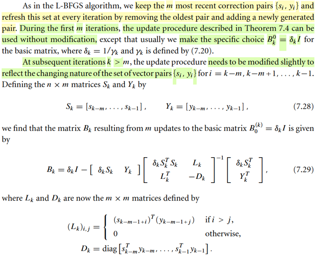</kbd>

> [!NOTE]
> Như vừa nói trong note trước, mục đích của cách làm này là thay vì
> mang vác lưu trữ và cập nhật matrix xấp xỉ Hessian Bk qua từng vòng
> lặp, mà trong bài toán large scale sẽ rất tốn kém. Thì nay ta có thể có một
> cách tính xấp xỉ Hessian Bk  với chi phí lưu trữ và tính toán thấp hơn: Tại
> mỗi vòng, dùng công thức compact form để "tạo ra Bk" chứa curvature
> information có được từ các bước trước đó bằng cách dùng rổ các cặp
> vector yi, si, đắp vào matrix B0.
>
> Nhưng ta nên nói về B0, như đã biết, H0 của BFGS gốc được initialized theo
> một vài kiểu mà cách có vẻ tốt nhất là: Ban đầu cho H0 = β * I với β ta
> chọn trước sao đó.
>
> (Ta ta có thể dùng thêm một mẹo như sau Sau đó thông qua các bước để
> tính ra p0, α0 và x1, để có y0, s0. Và khi đó ta mới dung độ cong từ x0 → x1
> để tính ra γ và  gán lại cho H0 = γ * I khiến cho  H0 lúc này sẽ có thông
> tin độ cong với độ lớn không quá khác biệt so với Hessian thật, và từ đó giúp
> đem lại nhiều lợi ích)
>
> Thế thì, nếu trong BFGS gốc, H0 được initialized kiểu đó, thì B0 dễ hiểu
> cũng sẽ được làm tương tự: = (1/β) * I.
>
> Rồi, còn nhớ, trong L-BFGS, khi tính Hk, ta sẽ đắp m cặp si, yi vào Hk_0.
> và Hk_0 được khởi tạo là γk * I với ideas là cho độ cong của Hk_0 có
> magnitude xem xem với Hessian tại xk.
>
> Vậy thì ở đây, ta cũng xây dựng Bk bằng cách khởi tạo  Bk_0 bởi 1/ γk * I
> (trong sách là δk I) và đắp vào m cặp si, yi bởi công thức compact form.
>
> Và vì khi iteration còn < m thì matrix S, và Y sẽ chứa đủ bộ các vector si,
> yi nên ta hiểu vì sao tác giả nói lúc này, việc tính toán là theo công thức
> compact form này, chỉ khác là ta đắp vào Bk_0 THAY VÌ B0:
>
> Chú ý nhé, Bk_0 là sao và B0 là sao?
>
> Nếu dùng compact form tính Bk từ B0 và các matrix S, Y,...thì B0 này là B0
> ban đầu ví dụ như được khởi tạo bởi (1/ β) I và như vậy có nghĩa là ở mỗi
> vòng, khi tính Bk ta đều đắp từ B0 này
>
> Nhưng nếu dùng Bk_0, thì có nghĩa là mỗi vòng, ta tạo một cái nền Bk_0
> khác nhau, dựa trên độ cong gần nhất (yk, sk → γk). Rồi mới đắp vào đó.
>
> ----
>
> Nhưng từ iteration m trở đi, thì nếu ta làm như L-BFGS, chỉ đắp m cặp
> si, yi gần  nhất vào Bk_0, thì không dùng công thức 7.29 nữa, mà phải
> chỉnh lại chút xíu, vì  7.24 là tính toán với S, và Y chứa đủ bộ si, yi.
>
> Và việc điều chỉnh chỉ là CHỈ GIỮ LẠI m CỘT CUỐI: Sk = [sk-m,...sk-1] và
> Yk chỉ chứa yk-m tới yk-1 (7.28).
>
> Và Dk, Lk cũng điều chỉnh chút xíu.
>
> Đây là công thức 7.29

 

###### Chi phí tính Bk v

<kbd>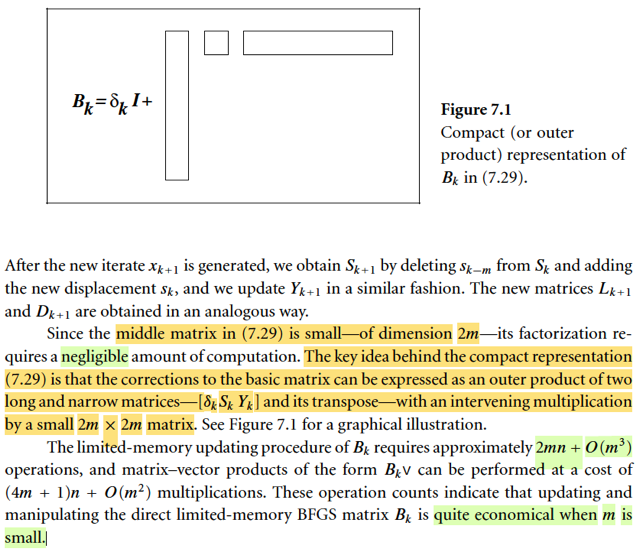</kbd>

> [!NOTE]
> Dừng lại chút bàn về kích thước của các matrix:
>
> Trong công thức 7.24, nơi Sk, Yk chứa hết các si, yi từ trước đến giờ, tức
> là chứa k cột s0,...sk-1 và Y chứa k cột y0,...yk-1 thì matrix block đầu tiên
>
> [B0Sk Yk] sẽ có 2k cột (Sk có k cột, thì B0Sk cũng có k cột)
>
> và dĩ nhiên cái block matrix ở giữa sẽ phải có 2k hàng. và nó là matrix
> vuông nên cũng sẽ có 2k cột, tức là nó có kích thước 2k x 2k.
>
> Bây giờ, với công thức 7.29, nới Sk, Yk chỉ chứa m si, yi gần nhất → Sk,
> Yk chỉ có m cột, nên cái block matrix đầu tiên của công thức 7.29 [δkSk
> Yk] chỉ  có 2m cột, nên cái square block matrix ở giữa cũng chỉ có shape
> 2m x 2m.
>
> Tất nhiên mỗi cột của S, Y có n phần tử, vì si, yi là gì nhớ ko: là difference
> giữa vị trí: xi+1 - xi, và difference giữa gradient: ∇fi - ∇fi-1, và x thì là R^n
> vector.
>
> Trên cơ sở đó ta hiểu vì sao gs Nocedal nói việc factored matrix vuông 2m
> ở giữa rất nhẹ nhàng: Đơn giản là vì m nhỏ, thì 2m nhỏ, factor một matrix
> nhỏ thì dĩ nhiên là nhẹ nhàng vì phép factor có cost O(n^3), nên nếu n nhỏ
> thì con số này ko bao nhiêu.
>
> Nhưng vì sao lại cần factor? À là vì nếu gọi B1 là block đầu, B2 lại block
> giữa thì Bk = δk*I - B1(B2)inv B1T
>
> Tuy nhiên, mục đích ko phải là tính Bk explicitly, mà là tính Bk v với vector
> v nào đó. Ta sẽ xem chi phí của cái này:
>
> Bk v = [δk*I - B1(B2)inv B1T] v
>
> = δk*I v - B1(B2)inv B1Tv
>
> Trong đây tốn nhất dĩ nhiên là B1(B2)inv B1Tv:
>
> Tính B1Tv: Đây là phép nhân matrix (2m, n) với vector R^n tốn: 2m phép
> dot product R^n vs R^n vector: tốn n+n-1 = 2n-1 flops. ⇨ tổng cộng:
> 2m(2n-1) = 4mn - 2m flops. Nhưng nếu chỉ tính multiplication thì tốn
> 2mn
>
> Tính (B2)inv B1Tv thì chính là giải B2 z = B1Tv tìm z
>
> Và như đã học ở phần Appendix của Convex Optimization S. Boyd, người
> ta sẽ  dùng Factor-Solve approach:
>
> i) Factor: Ta sẽ factor B2 trước, thành các matrix có cấu trúc đơn giản như
> tam giác,  diagonal. Ví dụ LU.
>
> ii) Solve:
>
> Lần lượt giải L u1 = B1Tv ra u1,
>
> Rồi giải tiếp Uz = u1 để có z.
>
> Với việc L, U có cấu trúc đơn giản thì hai hai bước này sẽ ít tốn (ví dụ khi
> L có dạng tam giác dưới thì giải L u1 = B1Tv chỉ là forward substitution, rất
> nhanh, với cost của việc giải hệ n phương trình n biến chỉ là O(n^2)
>
> ⇨ Ở đây, B2 chỉ có shape 2m x 2m, ⇨ hệ phương trình tuyến tính kích
> thước 2m, cost O(m^2)
>
> Do đó chi phí của bước solve sẽ là O(m^2)
>
> Tính B1(B2)inv B1Tv: Chính là nhân B1 với z: là matrix (n, 2m) nhân R^2m
> vector Tốn n phép dot product giữa hai R^2m vector, tốn 2m+2m-1 flops =
> 4m-1 flops. Tổng cộng tốn n(4m-1) = 4mn - n flops. Nếu chỉ tính phép
> nhân: n2m = 2mn
>
> Vậy tổng cộng tốn: 2mn + O(m^2) + 2mn = 4mn + O(m^2)
>
> Còn bước cuối: δk*I v Tốn n phép nhân
>
> Vậy tốn 4mn + n + O(m^2)
>
> = (4m + 1)n + O(m^2)
>
> Và nếu m nhỏ thì con số chi phí này chỉ gần như là tuyến tính theo n: O(n)

 

###### L-BFGS: Xấp xỉ Bk, Hk

<kbd>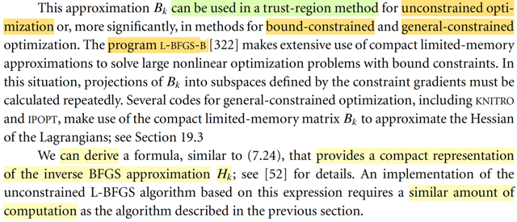</kbd>

> [!NOTE]
> Đại khái là nói rằng công thức approx Bk này có thể dùng trong cả thuật toán
> trust region Newton unconstraint và cả có constraint (các chapter 10 trở đi
> sẽ nói về bài toán constraint)
>
> Ngòai ra đại khái là ta cũng có thể derive công thức compact form cho Bk
> inverse (tức Hk), để rồi cũng có một thuật toán L-BFGS dựa trên cái này.
>
> Nói thêm chỗ này, đại ý ý gs là, quay lại L-BFGS ta có thể có tạo Hk theo kiểu
> đắp m cặp {yi, si} vào Hk_0 nhưng thay vì chạy 2 vòng lặp, thì ta có thể có
> một công thức tính một phát một như cách ta làm với Bk. Và chi phí tính toán
> cũng y chang (có nghĩa là thích làm kiểu nào thì làm)

 

###### SR1 Compact Form

<kbd>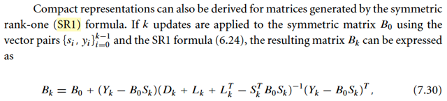</kbd>

<kbd>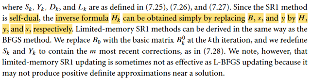</kbd>

> [!NOTE]
> Tiếp, đại ý đoạn này là ta cũng có thể có công thức compact cho thuật
> toán SR1.
>
> Ôn lại chút xíu, vì nhận thấy khá lộn xộn, thử nói ngắn gọn nhất "câu
> chuyện" của BFGS, SR1 rồi L-BFGS two-loops, rồi compact form tính Bk,
> rồi L-BFGS compact và nay là compact form tính SF1 và L-SF1 compact
> form.
>
> Nhu cầu: Cần Hessian inverse ∇^2fk để tính Newton step : pkN = -∇^2fk
> ∇fk
>
> Ideas: Tạo Bk xấp xỉ Hessian.
>
> Cách làm: Khởi đầu bằng I, tính p0, line search tính α0, đi đến x1: Dùng
> s0 = x1-x0, y0 = ∇f1 - ∇f0 để buộc Bk phải thỏa secant equation, giúp nó
> chứa thông tin độ cong từ x0 → x1. Lặp lại tương tự vậy.
>
> Sau đó cần Inverse của Bk, gọi là Hk, nên dùng công thức SMW chuyển
> thành  công thức cập nhật Hk.
>
> Đây là là thuật toán tìên BFGS: DFP
>
> BFGS là 4 ông, nghĩ ra cách: Áp thẳng secant equation inverse lên Hk,
> để có ngay công thức update Hk, thay vì làm kiểu trên: BFGS ra đời.
>
> Cách initialize H0: có nhiều cách, nhưng có vẻ ổn nhất: Start với β*I, tính
> p0, α0 (chấp nhận thương đau), tính x1 → s1, y1. Và dùng nó để tính γ*I,
> gán lại cho H0. Mang ý nghĩa dùng thông tin độ cong x0 → x1 để có ý
> niệm về độ lớn của Hessian để mà initialize H0
>
> Rồi, còn một cách update Bk khác, dùng rank 1 matrix: Chính là SR1.
> Cũng lại đẻ ra phiên bản update Hk tương tự, nhưng SR1 có nhược điểm
> của nó.
>
> Thời gian trôi đi, nhu cầu cho bài toán quy mô lớn.
>
> Ý tưởng: Thôi không mang vác Hk suốt hành trình nữa, mang vác bộ
> vector si, yi thôi. Để mỗi vòng, thay vì "cập nhật Hk", thì ta sẽ "xây lại Hk",
> dùng bộ vector si, yi chứa thông tin độ cong này, gọi nôm na là cách "đắp
> mặt nạ vào nền" (vs "mang vác", ám chỉ cách cập nhật liên tục mỗi vòng
> ở trên)
>
> Và thay vì dùng hết tất cả cặp {si, yi}, ta dùng m cặp gần nhất thôi. Đây
> chính là L-BFGS 2-loops: Tại mỗi iteration, dùng Hk_0 là γk * I (cũng cái
> kiểu dùng thông tin độ cong từ xk-1 → xk để cho một ước lượng độ lớn
> của độ cong, dùng nó làm  khởi đầu, để đắp m cặp vào).
>
> Tiếp, câu chuyện lại yêu cầu ta có công thức tính Bk theo cách "đắp mặt
> nạ" (thay vì vác theo") này vì một số thuật toán như trust region cần Bk
> chứ ko phải Hk.
>
> Thì thật ra tương tự như việc ta có thể chuyển "update Hk thành "đắp
> mặt nạ vào Hk_0 dùng bộ vector si, yi", thì với Bk, đáng lí ra ta cũng có
> thể xây dựng cách đắp mặt nạ vào Bk_0, gọi là Unrolling, nói sau phần
> này. Tuy nhiên cách làm đó thực ra lại tốn kém hơn, một cách làm
> compact form mà ta vừa học:
>
> Qúa trình đắp mặt nạ thực ra tương đương với việc dùng một công thức
> tính compact form: Bk từ Bk_0 và bộ si,yi dưới dạng các block matrix. Ta gọi
> là "đắp mặt nạ compact form" (vs đắp mặt nạ Unrolling)
>
> Và từ đó, bằng cách chỉ đưa m cột si, yi gần nhất vào S, Y, ta có công
> thức compact form tính Bk từ Bk_0 theo lối đắp mặt nạ nhưng dùng công
> thức compact form thay vì Unrolling
>
> Và lại nói chuyện, cũng có thể quay lại tính Hk đắp mặt nạ nhưng tính
> theo kiểu compact form thay vì 2 vòng lặp. Và thật sự thì hai cách này chi
> phí như nhau.
>
> Và với SR1, cũng có thể có làm theo lối đắp mặt nạ (thay vì "mang vác")
> và từ đó bằng cách chỉ dùng m cặp si, yi gần nhất, ta cũng có L-SR1 đắp
> mặt nạ compact form.
>
> Đó là "lịch sử" câu chuyện.

 

###### Unrolling công thức BFGS

<kbd>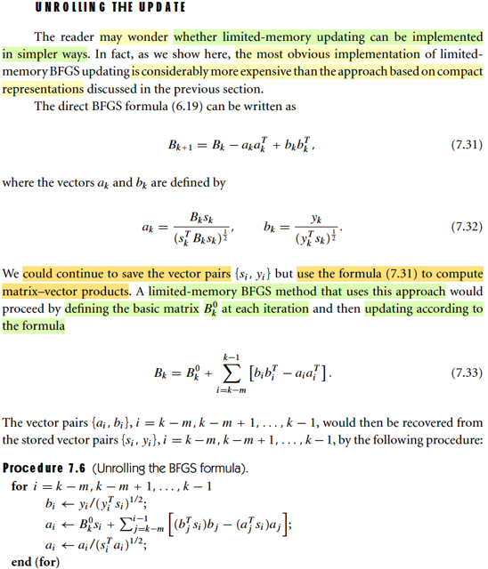</kbd>

> [!NOTE]
> Ôn lại chút xíu những bài trước, đại khái là phần trước, bối cảnh là ta bàn tới việc muốn có một cách tính Bk (xấp xỉ Hessian) nhưng làm theo kiểu đắp mặt nạ giống như L-BFGS làm với Hk ở mỗi vòng, vì một số thuật toán cần Bk thay vì Bk_inv (Hk).
>
> Thế rồi, ta mới biết đến một theorem cho thấy rằng công thức update Bk 6.19 (là công thức update Bk được tạo ra bằng cách dùng công thức chuyển đổi SWM, đối với công thức update Hk của BFGS) chính là có thể thể hiện bằng một dạng "đắp mặt nạ compact form",  để tính Bk từ B0 và bộ thông tin curvature yi, si (chứa trong matrix S, Y). Để rồi ta có thể cũng chỉ cần dùng m cặp yi, si gần nhất thôi. Nói chung có nghĩa là ta có thể có cách tính Bk theo kiểu "đắp mặt nạ nhưng compact form"
>
> Trước khi nói tiếp, có thể hiểu thế này: Cái việc đắp mặt nạ compact form vào Bk_0 dùng m lớp mặt nạ si, yi để có Bk ở mỗi vòng hoàn toàn có thể có phiên bản "đắp mặt nạ" như của L-BFGS, và nó chính là cách làm "Unrolling" sẽ nói ở dưới đây
>
> Có điều chi phí của cái này nó cao hơn của cách "đắp mặt nạ compact  form"
>
> Thế thì, phần này gs đặt vấn đề là, ta có thể thắc mắc là liệu có cách nào "đắp mặt nạ compact form" nhưng gọn hơn thay vì dùng cái lối block matrix trông có vẻ phức tạp này ko
>
> Và cụ thể là, nếu ta nhìn vào công thức update Bk 6.19 (nhắc lại, nó là sản phẩm của việc: derive công thức update Hk của BFGS, và dùng SMW để lật lại thành công thức update Bk để xài cho mục đích nào đó ko phải tính Newton step, vì tính Newton step thì xài Hk) ta sẽ thấy:
>
> (6.19) Bk+1 = Bk - BkskskTBk / skTBksk + ykykT/ykTsk
>
> Nếu đặt ak = Bksk/(skTBksk)^(1/2), bk = yk/(ykTsk)^1/2
>
> thì Bk+1 = Bk - akakT + bkbkT
>
> Thì ý là, nếu vậy ta có thể có một cách tính Bk+1 từ B0, và bộ m vector si, yi theo kiểu khác:
>
> Là chạy vòng lặp 7.6, gọi là Unrolling the BFGS formula,  để chuẩn bị m cặp ai, bi gần nhất.
>
> Sau đó đắp vào Bk_0: Bk = Bk_0 + Σi=k-m:k-1 [-aiaiT + bibiT]
>
> Ta tạm gọi cách làm này "(cũng là) đắp mặt nạ, unrolling"
>
> Nhưng nếu tính chi phí ra sẽ thấy nó tốn hơn cái cách đắp mặt nạ compact  form cũng như đắp mặt nạ 2 vòng lặp.
>
> Tóm lại:
>
> Với Hk: Ta có "đắp mặt nạ 2 vòng lặp" hoặc "đắp mặt nạ compact form", cùng chi phí, xài cái nào cũng được.
>
> Với Bk: Ta có "đắp mặt nạ compact form" và "đắp mặt nạ unrolling" với chi phí cái sau cao hơn nhiều cái trước nên ko ai xài

 

###### Chi phí cao hơn compact

<kbd>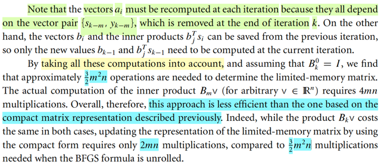</kbd>

> [!NOTE]
> Mình chỉ cần hiểu đại khái là làm kiểu này nó tốn kém hơn kiểu
> compact form được rồi. Chi tiết thì có thể nghiên cứu sau

 

