# 8.1 Finite-Difference Derivative Approx

📊 **Progress:** `20` Notes | `29` Screenshots

---

 

## Tính đạo hàm hàm phức tạp

<kbd></kbd>

> [!NOTE]
> Mở đầu tác giả nói về mục đích của chapter này là để giới thiệu các phương
> pháp tính đạo hàm của các hàm phức tạp. Vì việc tính đạo hàm là điều rất
> thường xuyên trong bài toán tối ưu hóa. Thế thì với các hàm đơn giản, ta có
> thể tính tay để ra công thức, và từ đó viết code tính đạo hàm. Nhưng với các
> hàm phức tạp thì việc viết ra công thức rất khó. Và chap này sẽ nói về các
> cách tiếp cận có thể giúp ta giải quyết vấn đề này

 

### Finite Differencing

<kbd></kbd>

<kbd>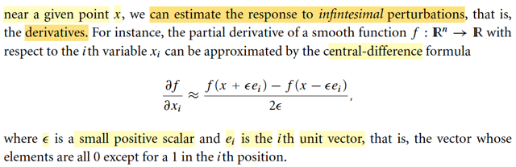</kbd>

> [!NOTE]
> Nói sơ về các cách tiếp cận quan trọng nhất, thì cách đầu tiên là Finite
> Differencing.
>
> Cái này thì mình đã gặp nhiều lần, ở các lớp của A.Ng, cs231n, cs224n, và
> đặc biệt là trong MIT 18s.096.
>
> Gốc rễ của nó, như gs Nocedal nói, là từ Taylor's theorem đã học trong chap 2:
>
> f(x + p) = f(x) + ∇f(x + tp)Tp for some t ∈ [0,1] 
>
> Tiếp, nếu f twice differentiable, thì:
>
> ∇f(x + p) = ∇f(x) + ∫0:1 ∇^2f(x + tp)pdt
>
> f(x + p) = f(x) + ∇f(x)Tp + (1/2)pT ∇^2f(x + tp) p for some t in [0,1]
>
> Và đại khái là cái này chính là cái cho ta finite differentiation:
>
> Áp dụng với p = ε*ei:
>
> f(x + εei) = f(x) + ∇f(x)T ε*ei + (1/2)(εei)T ∇f(x + tεei)εei
>
> ⇔ f(x + εei) = f(x) + ε∇f(x)Tei + (1/2)ε^2(ei)T ∇f(x + tεei)ei
>
> Tới đây có thể nói như sau: nếu ε rất nhỏ, thì t*ε càng nhỏ, và x + tεei là
> điểm rất gần x, nên Hessian tại đó coi như xấp xỉ Hessian tại x:
>
> ⇔ f(x + εei) ≈ f(x) + ε∇f(x)Tei + (1/2)ε^2(ei)T ∇f(x)ei
>
> Tương tự:
>
> f(x - εei) ≈ f(x) - ε∇f(x)Tei + (1/2)ε^2(ei)T ∇f(x)ei
>
> Trừ vế theo vế:
>
> f(x + εei) - f(x - εei) ≈ ε∇f(x)ei + ε ∇f(x)ei
>
> ⇔ f(x + εei) - f(x - εei) ≈ 2ε∇f(x)ei
>
> ∇f(x)Tei chính là lấy ra phần tử thứ i của ∇f(x): ∂/∂xi f(x), hay ∂f(x)/∂xi
>
> ..⇔ f(x + εei) - f(x - εei) ≈ 2ε∂f(x)/∂xi
>
> ⇔ ∂f(x)/∂xi ≈ [f(x + εei) - f(x - εei)]/2ε 
>
> Đây chính là công thức finite differencing: central difference
>
> Thử chứng minh lại định lý Taylor cho vui
>
> Cái đầu tiên:
>
> Với hàm đơn biến, f(x), ta còn nhớ Mean Value Theorem học ở MIT 1802:
>
> Nó nói rằng, đi từ a → b thì sẽ có một điểm c nào đó giữa a, b sẽ có độ dốc là
> bằng độ dốc trung bình của hàm số trên đoạn [a, b]:
>
> f'(c) = [f(b) - f(a)] / (b - a)
>
> Bây giờ xét hàm đa biến R^n → R: f(x)
>
> thì xét hàm đơn biến g(t) = f(x + tp) (hàm f(x) restrict to direction p):
>
> Áp dụng cái trên tại điểm a = 0, b = 1
>
> g'(t) = [g(1) - g(0)] / (1 - 0) for some t ∈ [0,1]
>
> ⇔ d/dt g(t) = f(x + p) - f(x)
>
> ⇔ d/d(x + tp) f(x + tt) . d/dt (x + tp) = f(x + p) - f(x)
>
> ⇔ ∇f(x + tp) . p = f(x + p) - f(x)
>
> ⇔ ∇f(x + tp)Tp = f(x + p) - f(x)
>
> ⇔ f(x + p) = f(x) + ∇f(x + tp)Tp for some t ∈ [0,1] 
>
> Đây chính là ý đầu tiên của Theorem 2.1
>
> -----
>
> Tiếp, nếu f twice differentiable, thì:
>
> ∇f(x + p) = ∇f(x) + ∫0:1 ∇^2f(x + tp)pdt
>
> Chứng minh:
>
> Xét hàm g(t) = ∇f(x + tp), (là R → R^n function)
>
> g'(t) = d/dt g(t) = d/dt ∇f(x + tp) = d/d(x + tp) ∇f(x + tp) . d/dt (x + tp)
>
> = ∇^2f(x + tp) p
>
> FTC 2 nói rằng: Nếu G là nguyên hàm của f thì ∫a:bf(t)dt = G(b) - G(a)
>
> Áp dụng vào: ∫0:1g'(t)dt = g(1) - g(0)
>
> ⇔ ∫0:1 ∇^2f(x + tp) p dt = ∇f(x + p) - ∇f(x)
>
> ⇔ ∇f(x + p) = ∇f(x) + ∫0:1 ∇^2f(x + tp) p dt. Chứng minh xong
>
> ------
>
> Và ý thứ ba: f(x + p) = f(x) + ∇f(x)Tp + (1/2)pT ∇^2f(x + tp) p for some t in [0,1]
>
> Chứng minh (xem lại) Chap 2

 

#### Đạo hàm: Phương pháp và ứng dụng

<kbd></kbd>

> [!NOTE]
> Nói sơ về khái niệm Automatic Differentiation, và Symbolic Differentiation
> cũng như là vai trò đạo hàm không chỉ trong thuật toán tối ưu mà còn
> trong nhiều lĩnh vực khác

 

##### Xấp xỉ đạo hàm vi phân hữu hạn

<kbd>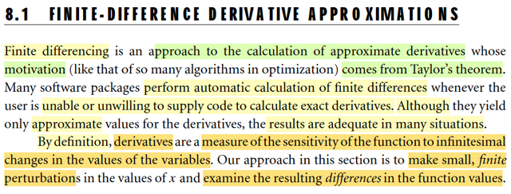</kbd>

> [!NOTE]
> Như đã hiểu công thức finite differencing, cơ bản là ta sẽ dùng nó để tính
> xấp xỉ  đạo hàm, (gọi là tính đạo hàm gần đúng).
>
> Như đã học trong mit 1801, bản chất của đạo hàm là "rate of change": tỉ số
> giữa [khoảng thay đổi của hàm f] / [khoảng thay đổi của biến số x]: Δf/Δx Tất
> nhiên ta xét tỉ lệ này ở limit: f'(x) lim Δx→0 f(x+δx) - f(x) / δx. Đây chính là
> định nghĩa của đạo hàm theo Newton.
>
> Còn định nghĩa của đạo hàm theo Leibniz: df = f'(x)dx mang ý nghĩa: khi x
> thay đổi một khoảng vô cùng nhỏ (vi phân) dx, khiến hàm f thay đổi một
> khoảng vi phân df, thì liên hệ giữa chúng, chính là đạo hàm f'(x). Dĩ nhiên hai
> ông mô tả cùng một bản chất, chẳng qua thể hiện hai kiểu khác nhau.
>
> Vậy thì, với định nghĩa của đạo hàm theo Newton, nếu ta dùng δx rất nhỏ
> thay vì vô cùng nhỏ, thì ta sẽ bỏ lim và thay bằng dấu xấp xỉ:
>
> f'(x) ≈ [f(x + δx) - f(x)] / δx. Thì cũng có thể hiểu về công thức finite
> differencing như vậy (dĩ nhiên cái này cũng là dựa trên cơ sở Taylor
> theorem mà mình vừa chứng minh hồi nãy)
>
> Nhưng viết ở đây để thấy một cách tiếp cận khác dễ nhớ hơn là phải derive
> từ Taylor theorem.
>
> Nói chung, kĩ thuật chỉ là: để tính f'(x), ta sẽ tính f(x), tính f(x + ε), tính f(x - ε)
> rồi tính [f(x + ε) - f(x - ε)] / 2ε, đây gọi là central-differencing.
>
> Cũng có thể tính đạo hàm xấp xỉ bằng forward-differencing hoặc backward
> differencing (dễ rồi ko nói làm gì)

 

###### Xấp xỉ Gradient

<kbd>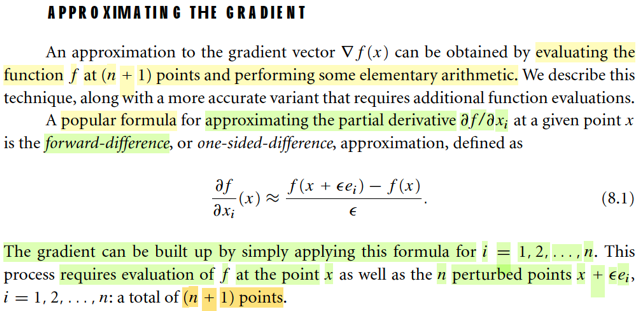</kbd>

> [!NOTE]
> Rồi, để tính xấp xỉ gradient, như vừa nói xong, ta có thể tính xấp xỉ các partial 
> derivative và tạo thành vector gradient. (ở đây gs dùnd forward difference,
> nhưng dĩ nhiên có thể dùng central / backward difference đều được)
>
> Cũng dễ hiểu khi phải tính hàm f n + 1 lần: 1 lần tính f(x), n lần tính f(x + εei)

 

###### Chứng minh sai phân tiến

<kbd></kbd>

> [!NOTE]
> Đoạn này chính là gs Nocedal chứng minh công thức finite differencing (forward). Bản chất vẫn là vậy, dùng Taylor theorem, và với ε nhỏ cho phép bỏ đi phần dư là term bậc cao của ε và chuyển thành dấu xấp xỉ. Nhưng phần chứng minh của gs chặt chẽ tuyệt đối, để giúp làm rõ về mặt toán học sao hồi nãy có mình có thể nói khi x' trong phạm vi gần x thì Hessian tại x bằng x'.
>
> Đại khái là vầy:
>
> Bắt đầu với Taylor's theorem:
>
> f(x + p) = f(x) + ∇f(x)Tp + (1/2)pT ∇^2f(x + tp)p for some t ∈ (0,1)
>
> ⇔ f(x + p) - f(x) - ∇f(x)Tp = (1/2)pT ∇^2f(x + tp)p
>
> Gọi L là upper bound nào đó của norm Hessian: ||∇^2f(x)|| ≤ L. Ta có thể nói vậy là vì hàm số không thể cong vô cực (do điều kiện twice continously differentiable)
>
> Xét |(1/2)pT ∇^2f(x + tp)p|
>
> Áp dụng |uTv| ≤ ||u|| ||v||, vì |uTv| = | ||u||||v|| cos θ(u,v) | ≤ ||u|| ||v||
>
> ⇨ |(1/2)pT ∇^2f(x + tp)p| ≤ (1/2) ||p|| ||∇^2f(x + tp)p||
>
> Tiếp, áp dụng ||Ax|| ≤ ||A|| ||x||
>
> Vì ||A|| define là sup_x ||Ax|| / ||x|| ⇨ ||A|| ≥ ||Ax|| / ||x|| ∀x ⇨ ||A||||x|| ≥
> ||Ax||
>
> ⇨ (1/2) ||p|| ||∇^2f(x + tp)p|| ≤ (1/2) ||p|| ||∇^2f(x + tp)|| ||p||
>
> = (1/2) ||p||^2 ||∇^2f(x + tp)||
>
> Vậy |(1/2)pT ∇^2f(x + tp)p| ≤ (1/2) ||p||^2 ||∇^2f(x + tp)||
>
> Và đã nói L là upper bound của Hessian trong phạm vi đang xét
>
> Nên ||∇^2f(x + tp)|| ≤ L
>
> ⇨ |(1/2)pT ∇^2f(x + tp)p| ≤ (1/2) ||p||^2 ||∇^2f(x + tp)|| ||p|| ≤ (1/2) L ||p||^2
>
> Vậy |f(x + p) - f(x) - ∇f(x)Tp| ≤ (L/2) ||p||^2
>
> Áp dụng điều này với p = εei
>
> |f(x + εei) - f(x) - ∇f(x)T εei| ≤ (L/2) ||εei||^2
>
> ⇔ |f(x + εei) - f(x) - ε ∇f(x)Tei| ≤ (L/2) ε^2 ||ei||^2
>
> ⇔ |[f(x + εei) - f(x) - ε ∇f(x)Tei]/ε| ≤ (L/2) * ε * 1  (||ei|| = 1)
>
> ⇔ |[f(x + εei) - f(x)] / ε - ∇f(x)Tei| ≤ (L/2) ε
>
> ⇔ |[f(x + εei) - f(x)] / ε - ∂f(x)/∂xi| ≤ (L/2) ε
>
> ⇔ |δ_ε| (là sai khác giữa đạo hàm thật và xấp xỉ) ≤ (L/2) ε
>
> Và đây chính là nói rằng SAI KHÁC GIỮA GIÁ TRỊ ĐẠO HÀM CHÍNH
> XÁC VÀ ĐẠO HÀM XẤP XỈ TÍNH BỞI FORWARD DIFF chỉ có ĐỘ LỚN
> BỊ CHẶN BỞI (L/2)ε
>
> Đồng nghĩa, NẾU ε CÀNG NHỎ → 0 THÌ SAI SỐ SẼ NHỎ THEO
> MỘT CÁCH TUYẾN TÍNH (vì upper bound của nó nhỏ theo tuyến tính)
>
> Do đó [f(x + εei) - f(x)] / ε ≈ ∂f(x)/∂xi

 

###### Lỗi làm tròn máy tính

<kbd>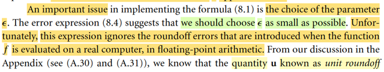</kbd>

<kbd>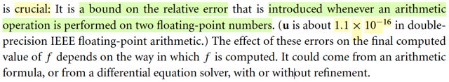</kbd>

> [!NOTE]
> đoạn này đại ý là, vì sai số khi tính xấp sỉ đạo hàm sẽ nhỏ đi một cách tuyến
> tính khi ε nhỏ đi, nên rõ ràng ta nên chọn ε càng nhỏ càng tốt.
>
> Tuy nhiên, như đã biết về vụ round off error Appendix mấy ngày qua, ta sẽ hiểu
> rằng không thể làm vậy được.
>
> Như một cách tổng kết lại những gì đã học trong hai phần A. 30, A.31 mình có
> thể tóm tắt hết sức ngắn gọn như sau.
>
> Máy tính cho 64 bits để lưu số thực, quy trình là:
>
> Chuyển sang chuỗi binary
>
> Tính e là số bước di dời dấu chấm, để đưa về dạng 1.d1d2.. ..d52d53d54...
>
> Chuyển (e + 1023) thành binary
>
> Lưu chuỗi d1d2...d52 vào 52 bits của phần Mantissa
>
> Lưu chuỗi binary của e vào 11 bits của phần exponent
>
> Lưu một bit chứa dấu
>
> Khi dịch ngược ra: Dịch chuỗi binary của Mantissa, dịch chuỗi binary của
> exponent  tính lại e thật, và dùng nó để đưa dấu phẩy đúng vị trí. Và 1 bit của
> sign part để khôi phục dấu.
>
> Công thức: (+/-) (1 + Σi=1:52 di*2^-t) * 2^e
>
> Như vậy: khi lưu vào máy tính, chuỗi binary từ d53 trở đi sẽ bị ko được lưu nên
> khiến khi khôi phục thay vì x, ta có fl(x), giữa chúng sẽ có sai số, gọi là sai số
> làm tròn (roundoff error)
>
> Vậy thì sai số này, lớn nhất, sẽ xảy ra khi x là số nằm ngay chính giữa hai
> floating point gần nhất.
>
> Hai floating point gần nhất, thì khoảng cách của chúng sẽ được tạo bởi việc đổi
> bit d52 từ 1 sang 0 hoặc ngược lại. Do đó, độ lớn (trong hệ thập phân) của
> khoảng cách này sẽ là 2^-52 * 2^e. Và giá trị sẽ tùy thuộc e, tức là hai cái mốc
> này đang có độ lớn cỡ nào (do e quy định)
>
> Như vậy thì sai số tuyệt đối lớn nhất sẽ là 1/2 của con số này: 2^-53 * 2^e
>
> Và bất cứ khi nào một con số nằm giữa hai mốc, thì sai số làm tròn của nó
> cũng sẽ đạt giá trị này.
>
> Và khi chia sai số tuyệt đối cho độ lớn của số ban đầu khi chưa bị làm tròn , ta
> sẽ có sai số tương đối.
>
> Vậy khi x nằm giữa hai mốc (1 + Σi=1:51 0 * 2^-i + 0*2^-52) * 2^e và  (1 +
> Σi=1:51 0 * 2^-i + 1*2^-52) * 2^e thì nó chính là có sai số tương đối = [sai số
> tuyệt đối] / |x|
>
> dĩ nhiên máy tính cũng phải dùng độ lớn của |fl(x)| chứ nó ko thể có độ lớn
> tuyệt đối của x được.
>
> .. = 2^-53 * 2^e / |fl(x)| = 2^-53 * 2^e / 2^e = 2^-53 =1.11×10⁻¹⁶
>
> Đây chính là u, unit roundoff, sai số tương đối lớn nhất.
>
> Như vậy fl(x) = x + x*ε = x*(1 + ε) với ε là sai số tương đối, và nó sẽ ko lớn hơn
> unit  round off, là sai số tương đối lớn nhất.
>
> Và khoảng cách giữa hai mốc floating point gần nhất  2^-52 * 2^e với e = 0
> sẽ được gọi là machine epsilon.
>
> Điều này dẫn đến, nếu có fl(x) thì số floating point gần nhất là fl(x) +/- 2^-52 * 2^e 
>
> Rồi, một ý nữa, vì Mantissa khi dịch ra phần thập phân, = (1 + Σi=1:52 di*2^-t)
> sẽ luôn là số từ 1 tới 2. Nên (1 + Σi=1:52 di*2^-t) * 2^e người ta sẽ cho là gần
> bằng 2^e
>
> Từ đó, |fl(x)| (= (1 + Σi=1:52 di*2^-t) * 2^e) ≈ 2^e
>
> Nên nếu có fl(x) thì floating point gần nhất sẽ là fl(x) +/- 2^-52 |fl(x)|
>
> =====
>
> Tiếp, vì hiện tượng round off, khiến fl(x) = x + x*ε với ε ≤ 2^-53 =1.11×10⁻¹⁶ 
>
> do đó, việc x*ε sẽ tạo ra con số có dạng 0.[15 số 0] [số khác 0], lấy ví dụ x có dạng
> 10^a, thì x*ε sẽ có dạng 0.[15-a số 9] 1.11...
>
> Dẫn đến x + x ε sẽ làm biến đổi số gốc x từ chữ số thứ 16-a trở đi.
>
> Nói cách khác, fl(x) sẽ khác x từ chữ số thứ 16-a trở đi.
>
> Nếu a = 0, ví dụ như x = π = 3.14p4p5..p15p16p17.... thì khi máy tính in ra số fl(π)
>
> nó sẽ khác với π từ con số 16 trở đi, tức là ta sẽ ko tin p16p17..., nó là do máy 
> bịa ra.
>
> Tương tự, nếu x = [123u4d5....u15].[u16u17...] thì ta cũng sẽ ko tin cái phần
> u16 trở đi, đồng nghĩa, phần thập phân hoàn toàn là do bịa mà ra, ko đáng tin.
>
> Và 15 con số đầu tiên (ko care vị trí dấu chấm) gọi là 15 significant digit.
>
> Từ đó dẫn tới, một hiện tượng: lấy hai con số A, B, giống nhau ở 15 chữ số đầu
> tiên, khác nhau ở phần còn lại, và mình muốn tính hiệu của chúng. Thì vì chữ số
> thứ 16 trở đi, nơi chúng khác nhau, là rác, nên kết quả hiệu của A - B chỉ là hiệu
> của hai mớ rác, hoàn toàn khác kết quả thật.
>
> Do đó mới có chuyện nếu mình muốn tính hiệu của hai con số, mà chúng chỉ khác
> nhau rất nhỏ, để từ kí tự thứ 16 trở đi mới khác nhau, thì cơ bản là vô ích.
>
> Còn bớt tệ hơn, nếu chúng chỉ khác nhau ở kí tự thứ 15 trở đi, thì kết quả tính ra
> ta chỉ tin được con số đầu tiên thôi.
>
> Bớt tệ hơn chút, nếu chúng chỉ khác nhau ở chữ số thứ 13, thì kết quả tính ra ta 
> chỉ tin được 3 con số đầu mà thôi.
>
> Nên khái quát, nếu hai số có k chữ số có nghĩa (ví dụ k = 15) và giống nhau ở k'
> con số đầu tiên, thì hiệu của chúng chỉ đáng tin ở k-k' con số đầu tiên.
>
> Và cái hiện tượng đang có A, B có 15 con số có nghĩa, tức là chính xác tới 15
> con số đầu tiên, nhưng lấy A - B thì ra con số vô nghĩa, gọi là LỖI CANCELLATION
> THẢM KHỐC (CATAROSPHIC CANCELLATION)

 

###### Ước lượng sai số đạo hàm

<kbd>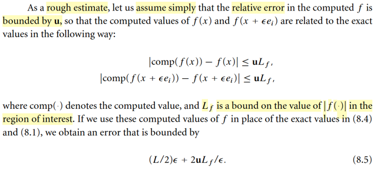</kbd>

> [!NOTE]
> Thế thì như note trước đã biết, khi ta dùng phương pháp finite differencing để tính đạo
> hàm xấp xỉ bằng công thức  [f(x + εei) - f(x)] / ε, nó tạo nên sai số, δ_ε có độ lớn giảm
> tuyến tính theo ε (thể hiện bởi |δ_ε|  ≤ (L/2) ε), đây sai số do ta đã cắt đi những term bậc
> cao trong triển khai Taylor, đây mới chính là được gọi là sai số cắt cụt (truncated error)
> (cái sai số mà do máy tính cắt đi các bit từ d52 trở đi do ko đủ chỗ để lưu chuỗi nhị phân,
> phải gọi là sai số làm tròn, đừng nhầm với sai số cắt cụt)
>
> Thế thì giờ đây, như đã nói, trong máy tính f(x + εei), f(x) sẽ trở thành comp(f(x
> + εei)),  comp(f(x)), là giá trị floating point, máy tính là tròn số. Điều này sẽ lại phát sinh
> round off error
>
> Do đó so với giá trị đạo hàm chính xác ∂f(x)/∂xi, thì giá trị đạo hàm xấp xỉ mà máy tính
> tính toán, sẽ là [comp(f(x + εei)) - comp(f(x))] / ε, hay viết tắt là [fc(x + εei) - fc(x)] / ε, sẽ
> mang thêm round off error nữa.
>
> Gọi E là total error:
>
> E = [fc(x + εei) - fc(x)] / ε - ∂f(x)/∂xi
>
> Lúc này ta sẽ thử tính cái bound cuả nó:
>
> Cộng và trừ thêm cho f(x + εei) - f(x)] / ε
>
> E = [fc(x + εei) - fc(x)] / ε - [f(x + εei) - f(x)] / ε + [f(x + εei) - f(x)] / ε - ∂f(x)/∂xi
>
> = [fc(x + εei) - fc(x)] / ε - [f(x + εei) - f(x)] / ε + [f(x + εei) - f(x)] / ε - ∂f(x)/∂xi
>
> Xét phần sau, [f(x + εei) - f(x)] / ε - ∂f(x)/∂xi
>
> thì dĩ nhiên nó chính là δ_ε, sai số cắt cụt, vốn dĩ đã biết có trị tuyệt đối ≤ (L/2) ε
>
> Vậy phần đầu chính là sai số do round off.
>
> Xét phần đầu, [fc(x + εei) - fc(x)] / ε - [f(x + εei) - f(x)] / ε
>
> = [fc(x + εei) - f(x + εei) + f(x) - fc(x)] / ε
>
> Thế thì tới đây, dùng kiến thức đã học ở Appendix:
>
> Ta biết sai số tương đối ε khi máy tính làm tròn số x thành fl(x) sẽ luôn ≤ u:
>
> |x - fl(x)| / |x| ≤ u
>
> Nên ta cũng có |f - fl(f)| / |f| ≤ u
>
> hay |f(x) - fc(x)| / |f(x)| ≤ u
>
> ⇨ |f(x) - fc(x)| ≤ u |f(x)|
>
> Nếu đặt L_f là một cái giá trị chặn trên nào của hàm |f| trong phạm vi đang xét, tức là
> |f(x)| ≤ L_f
>
> thì ta có |f(x) - fc(x)| ≤ u |f(x)| ≤ u L_f
>
> Tương tự, |f(x + εei) - fc(x + εei)| ≤ u L_f
>
> ⇨ [fc(x + εei) - f(x + εei) + f(x) - fc(x)] / ε ≤ (u L_f + u L_f) / ε = 2u L_f / ε
>
> Vậy round off error ≤ 2u L_f / ε
>
> Và dẫn đến total error ≤ 2u L_f / ε  + (L/2) ε

 

###### Tối ưu sai số đạo hàm

<kbd>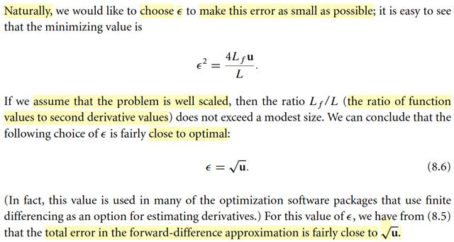</kbd>

> [!NOTE]
> Rồi, như vậy total error E ≤ 2u L_f / ε  + (L/2) ε
>
> Và do đó, bằng cách chọn ε nhỏ nhất, ta sẽ minimize total error
>
> Giải bài toán minimizing g(ε) = 2u L_f / ε  + (L/2) ε , dùng calculus thôi:
>
> Điều kiện cần tối ưu bậc nhất (first order necessary optimality condition) tìm
> critical point: g'(ε) = 0
>
> d/dε [2u L_f / ε^2  + (L/2) ε] = 0
>
> ⇔ (L/2) = 2u L_f / ε^2
>
> ⇔ ε^2 = 4u L_f / L
>
> Và đại ý là nếu có thể thêm một số điều kiện  thì ta có thể dùng √u, mà ta
> tin rằng nó sẽ khá gần với con số tối ưu.
>
> Như vậy đại ý là người ta sẽ dùng √u, u là roundoff unit = 2^-53 =1.11×10⁻¹⁶
> ⇨ ε = √2^-53 = 0.0000000105 làm giá trị ε giúp giảm thiểu sai số tổng khi
> tính đạo hàm bằng phương pháp xấp xỉ forward (nói vậy vì còn phương
> pháp xấp xỉ center và backward nữa)
>
> Khi đó sai số tổng sẽ  = 2u L_f / ε  + (L/2) ε | ε = √u
>
> = 2u L_f / √u  + (L/2) √u
>
> = 2√u L_f + (L/2) √u
>
> = √u (2 L_f + L/2)
>
> Và coi như ≈ √u
>
> và như trên đã nói, giá trị này 0.0000000105 cỡ 10^-8
>
> -----
>
> Như vậy có nghĩa là, sai số giá trị đạo hàm thật và đạo hàm xấp xỉ sẽ nhỏ
> nhất cũng = 10^-8, do đó tương đã hiểu từ mấy ngày qua cày phần
> Appendix:
>
> fl(x) = x + x ε (với ε là sai số làm tròn, ≤ 2^-53 =1.11×10⁻¹⁶) khiến cho fl(x) sẽ
> chỉ giống với x ở 15 digit đầu tiên, còn lại là sẽ khác, dẫn đến khi nhìn vào
> con số máy tính in ra thì ta sẽ chỉ tin rằng 15 digit đầu tiên là đúng (phản
> ánh đúng  giá trị của x mà thôi)
>
> Thì nay ở đây cũng vậy
>
> [giá trị đạo hàm do máy tính bởi phương pháp xấp xỉ] = [giá trị đạo hàm
> thật] + [giá trị đạo hàm thật] * 10^-8
>
> thì đồng nghĩa, [giá trị đạo hàm do máy tính bởi phương pháp xấp xỉ] chỉ
> giống với  [giá trị đạo hàm thật] ở 7 con số đầu tiên mà thôi. Cũng chính là,
> kết quả chỉ có 7 con số có nghĩa mà thôi.

 

###### Sai phân trung tâm

<kbd>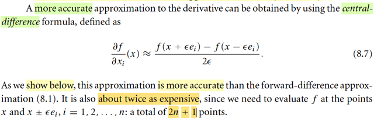</kbd>

> [!NOTE]
> Một cách xấp xỉ đạo hàm cho ra kết quả chính xác hơn so với forward differene
> là central-difference. (cái này cũng đã thấy trong cs231n, nhưng đây là lần sẽ
> hiểu rõ hơn về nó)
>
> Dễ thấy là ta sẽ phải tốn nhiều lần truy vấn giá trị hàm số hơn.

 

###### Sai số đạo hàm Central Difference

<kbd>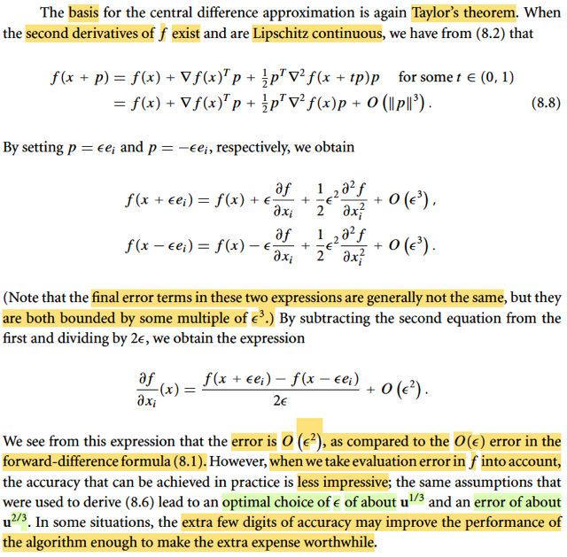</kbd>

> [!NOTE]
> Cùng nhau hiểu đoạn này, nền tảng của cái này cũng là Taylor theorem, ở đây gs
> nhắc đến giả định là đạo hàm bậc hai tồn tại và hàm số có tính Lipschitz
> continous
>
> Cái này gặp nhiều lần trong các bài trước cũng như trong sách thầy Boyd, mình
> nhớ đại ý ý nghĩa của cái tính chất này là: HÀM SỐ KO THAY ĐỔI QUÁ GẮT, tức
> là sự thay đổi độ dốc (đạo hàm bậc 1) cũng như độ cong (đạo hàm bậc 2) của
> hàm số không thể quá lớn. Hiểu nôm na là, đi từ đây đến kia, thì con đường dĩ
> nhiên có thể có độ dốc thay đổi nhưng ko thể thay đổi quá lớn.
>
> Nên diễn đạt toán học sẽ là: [thay đổi độ dốc từ A→ B ] / [khoảng cách AB] ≤
> hằng số nào đó
>
> Tương tự với độ cong cũng vậy [thay đổi độ cong từ A → B] / [khoảng cách AB] ≤
> hằng số nào đó
>
> Nên áp dụng ở đây khi đi từ x → x + tp, mức thay đổi của Hessian:
>
> ||[∇^2f(x + tp) - ∇^2f(x)]|| / ||tp|| ≤ L, gọi là hằng số Lipschitz
>
> -----
>
> Rồi, thế thì nói về định lý Taylor thì đã biết rồi:
>
> f(x + p) = f(x) + ∇f(x)Tp + (1/2)pT ∇^2f(x + tp)p for some t ∈ (0,1)
>
> Vậy thì xét Hessian tại ∇^2f(x + tp) và tại ∇^2f(x), khi đi từ x đến x + tp
>
> Theo điều kiện Lipschitz: ||∇^2f(x + tp) - ∇^2f(x)|| / ||x + tp - x|| ≤ L
>
> ⇔ ||∇^2f(x + tp) - ∇^2f(x)|| / |t|||p|| ≤ L
>
> ⇔ ||∇^2f(x + tp) - ∇^2f(x)|| / ≤ L |t| ||p|| (1)
>
> Vậy ||(1/2)pT ∇^2f(x + tp)p - (1/2)pT∇^2f(x)p||
>
> = ||(1/2)pT [∇^2f(x + tp)p - ∇^2f(x)]p||
>
> ≤ (1/2) ||p|| ||∇^2f(x + tp)p - ∇^2f(x)|| ||p||
>
> (Cái này do ||pTAp|| ≤ ||p|| ||Ap|| (triangular inequality) ≤ ||p|| ||A|| ||p|| (định nghĩa
> norm))
>
> ≤ (1/2) ||p|| L |t| ||p|| ||p|| (áp dụng inequality (1) trên)
>
> = [constant nào đó] ||p||^3
>
> Như vậy, sai khác giữa (1/2)pT ∇^2f(x + tp)p và (1/2)pT ∇^2f(x)p có độ lớn tỉ lệ với
> ||p||^3.
>
> Nên ta sẽ ghi là:
>
> f(x + p) = f(x) + ∇f(x)Tp + (1/2)pT ∇^2f(x)p + O(||p||^3)
>
> ====
>
> Rồi, áp dụng với p = εei và -εei
>
> f(x + εei) = f(x) + ∇f(x)Tεei + (1/2)(εei)T ∇^2f(x)(εei) + o(||εei||^3)
>
> = f(x) + ε ∇f(x)Tei + (1/2)ε^2(ei)T ∇^2f(x)ei + O(ε^3)
>
> Rồi ∇f(x)Tei, dĩ nhiên chính là ra phần tử thứ i của gradient, chính là ∂f(x)/∂xi
>
> Còn ε^2(ei)T ∇^2f(x) ei ra gì?
>
> = ε^2(ei)T[∇^2f(x) ei] = ε^2(ei)T[cột thứ i của ∇^2f(x)]
>
> = ε^2 ∇^2f(x)_ii
>
> = ε^2 ∂^2f/∂xi^2 (phần tử ii của Hessian chính là đạo hàm bậc hai wrt xi của f)
>
> ...= f(x) + ε∂f(x)/∂xi + (1/2)ε^2 ∂^2f/∂xi^2 + O(ε^3)
>
> Viết lại:
>
> f(x + εei) = f(x) + ε∂f(x)/∂xi + (1/2)ε^2 ∂^2f/∂xi^2 + O(ε^3)
>
> Tương tự:
>
> f(x - εei) = f(x) - ε∂f(x)/∂xi + (1/2)ε^2 ∂^2f/∂xi^2 - O(ε^3)
>
> Trừ vế theo vế:
>
> f(x + εei) - f(x - εei) = 2ε∂f(x)/∂xi + 2 O(ε^3)
>
> ⇔ [f(x + εei) - f(x - εei)] / 2ε = ∂f(x)/∂xi + O(ε^2)
>
> Và như vậy, đạo hàm xấp xỉ tính theo Central-difference sai số với đạo hàm chính
> xác O(ε^2). Và điều đó nó có nghĩa là nó chính xác Forward-difference (có sai số
> O(ε) - tuyến tính với ε)
>
> Và tuy rằng khi kết hợp với sai số làm tròn thì đôi khi sự chính xác hơn này không
> mấy ấn tượng nhưng có thể trong vài tính hướng nó trở nên quan trọng

 

###### Xấp xỉ Jacobian thưa

<kbd>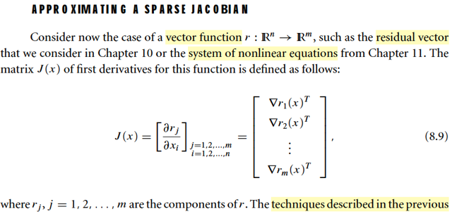</kbd>

<kbd>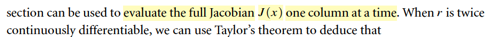</kbd>

> [!NOTE]
> Qua phần xấp xỉ một Jacobian thưa (spare). Đầu tiên đại ý là gs nhắc lại
> về Jacobian. Từ MIT 1802 cũng như MIT 18s096 mình đã biết rồi, khi xét
> hàm R^n x = (x1...xn) → R^m f(x) = [f1,...fm] thì, khi x thay đổi
> khoảng nhỏ dx (là R^n vector), khiến f(x) thay đổi một khoảng df
> là một R^m vector, = f' (x)[dx], với f' (x)[dx] là biểu diễn rằng
> đây là linear operator act on dx.
>
> Thế thì còn nhớ gs Steve dạy ta rằng: một phép tuyến tính tác động lên
> vector dx để cho ra vector df thì cái phép tuyến tính đó chỉ có thể là "lấy
> một matrix nhân với vector dx" thì cái matrix đó gọi là Jacobian.
>
> (Cách hiểu này sẽ giúp ta tìm Jacobian rất dễ)
>
> Còn nếu hiểu theo cách thức truyền thống thì ta biết nó là matrix mà hàng
> 1 sẽ vector đạo hàm riêng của f1 wrt vector x, thì cũng chính là gradient
> của f1: ∇f1(x)T (transpose để ý là nó thành 1 hàng / row vector)
>
> Tương tự, hàng 2 sẽ là ∇f2(x)T
>
> Ở đây gs bishop dùng kí hiệu r
>
> Vậy thì đại ý là ta có thể dùng cách làm của phần trước để mà tính xấp
> xỉ matrix Jacobian, từng cột một.
>
> Là sao?
>
> Còn nhớ cách xấp xỉ đạo hàm hàm R^n → R function f, theo finite difference, 
> cụ thể là forward diff
>
> ∂f(x)/∂xi ≈ [f(x + εei) - f(x)] / ε 
>
> nên 
>
> Như vậy với R^n → R^m function r(x)
>
> ∂r1(x)/∂xi ≈ [r1(x + εei) - r1(x)] / ε 
>
> ...
>
> ∂rm(x)/∂xi ≈ [rm(x + εei) - rm(x)] / ε 
>
> [∂r1(x)/∂xi,...,∂rm(x)/∂xi]T ≈ [r(x + εei) - r(x)] / ε 
>
> ∂r(x)/∂xi ≈ [r(x + εei) - r(x)] / ε 
>
> Tức là: bằng cách tính sai khác giá trị hàm r tại x + εei và tại x, chia cho ε,
> ta sẽ có cột thứ i của matrix J, chứa các đạo hàm riêng của r1,...rm đối
> với xi
>
> Làm n lần, ta có matrix xấp xỉ của Jacobian

 

###### Sai số Taylor Jacobian

<kbd>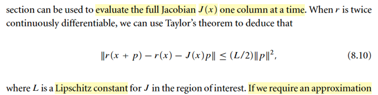</kbd>

> [!NOTE]
> Đoạn này, là sao:
>
> gọi J(x) là Jacobian của r wrt x. Dĩ nhiên ta có d/dx r(x) = J(x)
>
> Đặt hàm G(t) = r(x + tp) 
>
> d/dt r(x + tp) = d/d(x + tp) r(x + tp) . d/dt (x + tp)
>
> = J(x + tp) p, đặt hàm này là f(t) 
>
> Theo FTC 2, nếu ta có hàm G(t) là nguyên hàm của f(t), tức d/dt G(t) = f(t)
> thì ∫a:b f(t)dt = G(b) - G(a)
>
> Áp dụng vào cái này, ta đang có hàm G(t) là nguyên hàm của f(t) nên có
> thể áp dụng FTC2 với a:b = 0:1:
>
> ∫0:1 f(t)dt = G(1) - G(0)
>
> ⇔ ∫0:1 J(x + tp) pdt = r(x + 1*p) - r(x + 0*p)
>
> ⇔ ∫0:1 J(x + tp) pdt = r(x + p) - r(x)
>
> ⇨ r(x + p) - r(x) - J(x)p ≤ ∫0:1 J(x + tp) pdt - J(x)p
>
> = ∫0:1 J(x + tp) pdt - (∫0:1dt) J(x)p
>
> = ∫0:1 J(x + tp) pdt - ∫0:1J(x)p dt 
>
> = ∫0:1 [J(x + tp) - J(x)]p dt 
>
> Hai vector bằng nhau thì norm phải bằng nhau, ta có:
>
> ||r(x + p) - r(x) - J(x)p|| = ||∫0:1 ∫0:1 [J(x + tp) - J(x)]p dt|| 
>
> Vế trái, tích phân, có bản chất chỉ là tổng các vector Jpdt nhỏ xíu thôi.
>
> Và ta cũng có thể áp dụng bất đẳng thức tam giác ||u + v|| ≤ ||u|| + ||v|| 
>
>  ||∫0:1 [J(x + tp) - J(x)]p dt|| ≤  ∫0:1 ||[J(x + tp) - J(x)]p|| dt
>
> Tiếp, áp dụng tiếp bất đẳng thức: ||Ax|| ≤ ||A||||x||, cái này là do định nghĩa
> của norm A: ||A|| = sup_x ||Ax|| / ||x|| ⇨ ||A|| ≥ ||Ax|| / ||x|| ∀x ⇨ ||A|| ||x|| ≥ ||Ax||
>
> ⇨ ∫0:1 ||[J(x + tp) - J(x)]p|| dt ≤ ∫0:1 ||[J(x + tp) - J(x)]|| ||p|| dt
>
> Vậy ||r(x + p) - r(x)|| ≤ ∫0:1 ||J(x + tp) - J(x)|| ||p|| dt
>
> Tiếp, xét ||J(x + tp) - J(x)|| là mức thay đổi độ dốc của hàm f từ x → x + tp
>
> Với gỉa định hàm f có tính chất Lipschitz continuous, khi đi từ a → b, mức thay
> đổi độ dốc cũng như độ cong không thể qúa lớn, thể hiện bởi:
>
> ||J(x + tp) - J(x)|| / ||x + tp - x|| ≤ L (Lipschitz continuous)
>
> ⇔ ||J(x + tp) - J(x)|| ≤ L ||x + tp - x|| = L ||tp|| = L . |t| . ||p||
>
> Vậy ∫0:1 ||J(x + tp) - J(x)|| ||p|| dt ≤ ∫0:1 L . |t| . ||p|| ||p|| dt
>
> = L ||p||^2 ∫0:1 t dt
>
> = L ||p||^2 t^2/2|0:1
>
> = L ||p||^2 (1/2)
>
> = (L/2) ||p||^2
>
> ⇨ ||r(x + p) - r(x) - J(x)p|| ≤ (L/2) ||p||^2 chính là kết quả 8.10

 

###### Xấp xỉ tích Jacobian-vector

<kbd>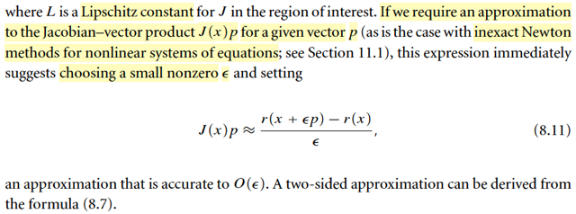</kbd>

> [!NOTE]
> Cái kết quả trên ||r(x + p) - r(x) - J(x)p|| ≤ (L/2) ||p||^2
>
> Vậy thì cái này có nghĩa là gì mới được:
>
> [norm của vector [r(x + p) - r(x)] - J(x)p] sẽ luôn ≤ (L/2) ||p||^2
>
> Nên nếu ta lấy r(x + p) - r(x) để xấp xỉ cho J(x)p thì mức sai số, tính theo norm sẽ
> luôn  bé (L/2) ||p||^2, nếu ||p|| nhỏ thì đây là chặn trên rất nhỏ → sai số cũng sẽ rất
> nhỏ.
>
> Do đó cho vector d, và số ε rất nhỏ:
>
> ||r(x + εd) - r(x) - J(x)ε d || ≤ (L/2) ||εd||^2
>
> ||r(x + εd) - r(x) - εJ(x)d|| ≤ (L/2) ε^2 ||d||^2
>
> ⇨ ||r(x + εd) - r(x) - εJ(x)d|| / ε ≤ (L/2) ε ||d||^2
>
> ⇔ ||[r(x + εd) - r(x)] / ε - J(x)d|| ≤ (L/2) ε ||d||^2
>
> Ý nghĩa của cái này là sai số của r(x + εd) - r(x)] / ε và J(x)d sẽ nhỏ tuyến tính
> theo ε, nếu ε rất nhỏ, ta có thể cho phép xấp xỉ J(x)d bởi r(x + εd) - r(x)] / ε với O(ε)
>
> J(x)d ≈ r(x + εd) - r(x)] / ε 
>
> Và như vậy ta có công thức tính gần đúng cho phép tính J(x)d tức là Jacobian nhân
> một  vector d nào đó. Vì đây là thứ mà trong thực tế ta cần, chứ ko phải là bản thân
> cái Jacobian.

**🔗 See also:** [Công thức xấp xỉ Hessian-vector](#node-tnspmvs)

 

###### Tính Jacobian thưa hiệu quả

<kbd>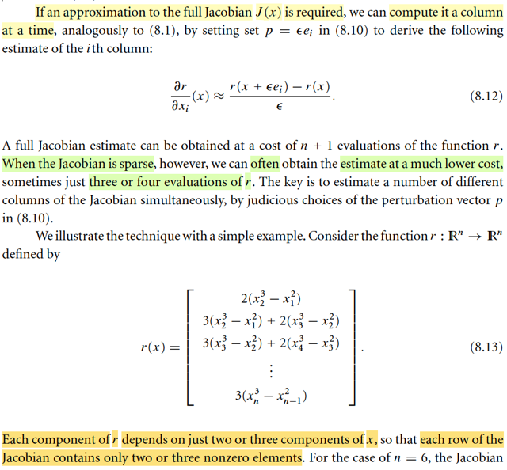</kbd>

<kbd>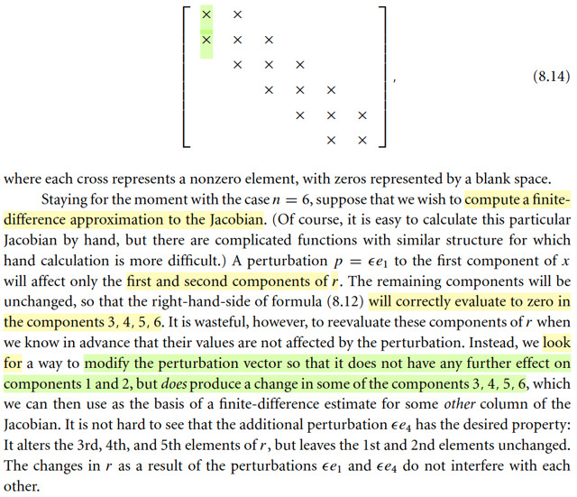</kbd>

<kbd>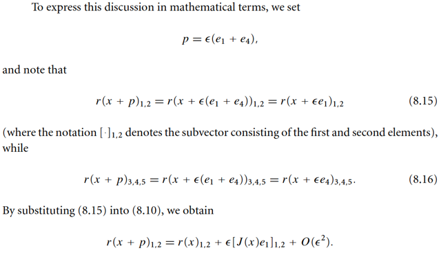</kbd>

<kbd>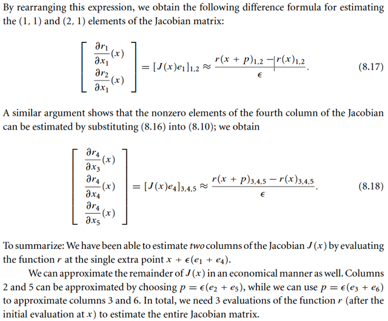</kbd>

> [!NOTE]
> Tiếp theo, tuy dài dòng nhưng không có gì khó, cùng nhau tìm hiểu:
>
> Đại ý là vừa rồi ta nói về việc tính gần đúng phép tính lấy Jacobian nhân với  vector d
> nào đó, vốn là cái hay cần hơn.
>
> Nhưng cũng có khi ta cần tính gần đúng Jacobian, thì ta sẽ dùng cách tính đạo hàm
> xấp xỉ để tính từ cột của J, như lúc nãy đã nói.
>
> Tuy nhiên, cái chính ở đây đó là, có khi, khi J có dạng thưa (sparse), thì  ta có thể tính
> J một cách tiết kiệm hơn.
>
> Cụ thể là sao:
>
> Gs lấy ví dụ cái hàm R^n ⇨ R^m, và cho cụ thể n = 6, r(x1,...x6) có dạng r(x1,..x6) =
> [r1(x1,x2), r2(x1,x2,x3), r4(x2,x3,x4),....]
>
> Có nghĩa là component r1 của kết quả, chỉ được tính từ x1, x2. r2 chỉ tính từ x1, x2,
> x3,..r3 chỉ tính bởi x2, x3, x4, r4 chỉ tính bởi x3, x4, x5cứ thế
>
> Phụ thuộc x1: r1,r2 (1)
>
> Phụ thuộc x2: r1,r2,r3 (2)
>
> Phụ thuộc x3: r2,r3,r4
>
> ....
>
> Và J, như đã nói, mỗi hàng, ví dụ hàng 2, sẽ là các vector đạo hàm riêng của r2 wrt
> x1,....xn: [∂r2/∂x1, ∂r2/∂x2, ...]
>
> thì mỗi cột, ví dụ cột 3, sẽ là vector các đạo hàm riêng của r1, r2,.. đối với x3:
>
> [∂r1/∂x3, ∂r2/∂x3, ..]
>
> Từ (1) ⇨ sẽ có nghĩa là: cột 1 của J, = [∂r1/∂x1, ∂r2/∂x1, ∂r3/∂x1 ..] sẽ chỉ có hai thằng
> đầu là khác 0: [∂r1/∂x1, ∂r2/∂x1, 0, 0, ..0]
>
> Từ (2) ⇨ cột 2 của J, sẽ chỉ có 3 vị trí đầu tiên khác 0
>
> Từ (3) ⇨ cột 3 chỉ có vị trí 2,3,4 khác 0.
>
> Và J trở thành matrix thưa, mà trong 18.06, mình đã gặp, gọi là tri-diagonal matrix.
>
> -----
>
> Vậy thì vấn đề là: Nếu ta làm theo kiểu như lúc đầu nói, tức là:
>
> Xấp xỉ cột 1, là [∂r1/∂x1, ∂r2/∂x1,..] bởi [r(x + εe1) - r(x)] / ε mang ý nghĩa:
>
> Perturb x1 tính ra cột 1(để có vị trí số 1,2 khác 0)
>
> Perturb x2, tính ra cột 2 (sẽ có vị trí 1,2,3 khác 0)
>
> Perturb x3, tính ra cột 3 (sẽ có vị trí 2,3,4 khác 0)
>
> Perturb x4, tính ra cột 4 (sẽ có vị trí 3,4,5 khác 0)
>
> .....
>
> Nếu làm vậy, ta sẽ phải evaluate hàm r tổng cộng 1 + n lần:
>
> 1 (tính r(x)) + n (tính r(x + εe1), ...r(x + εen)) lần
>
> Nếu n lớn ví dụ 1000 ta  phải tốn 1000 lần.
>
> -----
>
> Và lãng phí là ở chỗ: tính mấy cái số 0, như vừa thấy:
>
> Ta perturb x1 để ra cột 1 và chỉ lấy vị trí 1,2, rồi sau đó perturb x4 để ra cột 4 rồi chỉ
> lấy vị trí 3,4,5.
>
> Vậy ý tưởng là, sao ko perturb x1, x4 cùng lúc, thì kết quả ra được, ta sẽ lấy 2 cái đầu
> để cho hai vị trí đầu của cột 1 và 3 cái sau để cho 3 vị trí 3,4,5 của cột 4.
>
> Lí do làm vậy được là vì nhích thằng x1 thì ko ảnh hưởng gì đến vị trí 3,4,5, nên
> những gì khiến vị trí 3,4,5 nhúc nhích chỉ là do x4, ngược lại, nhích thằng x4 thì cũng
> ko ảnh hưởng gì đến vị trí 1, 2, những gì khiến 1,2 nhúc nhích  chỉ là do x1. Do đó,
> việc nhúc nhích x1, x4 cùng lúc thì những gì khiến 1,2 nhúc nhích chỉ do x1, và những
> gì khiến 3,4,5 nhúc nhích chỉ do x4 mà thôi,
>
> Nên hoàn toàn yên tâm để lấy kết quả r(x + εe1 + εe4)_1,2, trừ đi r(x)_1,2, chia ε , để
> làm hai thằng đầu của cột 1.
>
> Và r(x + εe1 + εe4)_3,4,5, trừ đi r(x)_3,4,5, chia ε để làm thằng 3,4,5 của cột 4
>
> Và trong sách ghi thế này để thể hiện kết quả như nhau: 
>
> [J(x)e1]_1,2 ≈ [r(x + εp)_1,2 - r(x)_1,2] / ε cũng bằng [r(x + εe1)_1,2,- r(x)_1,2] / ε 
>
> [J(x)e4]_3,4,5 ≈ [r(x + εp)_3,4,5 - r(x)_3,4,5] / ε cũng bằng [r(x + εe4)_3,4,5,- r(x)_3,4,5] / ε 
>
> Như vậy là làm 1 lần mà được 2 cột.
>
> Tương tự, với mấy cột khác ta cũng có thể tìm được cách ghép đôi tụi nó.
>
> Ý tưởng chỉ là như vậy, còn thể hiện toán học tuy nhìn vậy chứ ko có gì khó hiểu cả.
>
> Dẫn đến với dạng matrix thưa này, tác giả nói, ta chỉ cần evaluate hàm số 3 lần mà
> thôi.

 

###### Tô màu đồ thị Jacobian

<kbd>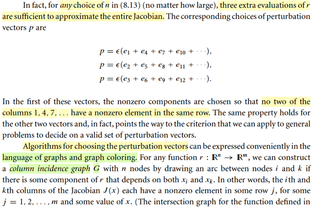</kbd>

<kbd>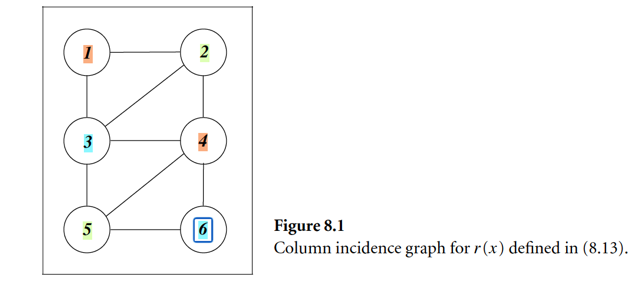</kbd>

<kbd>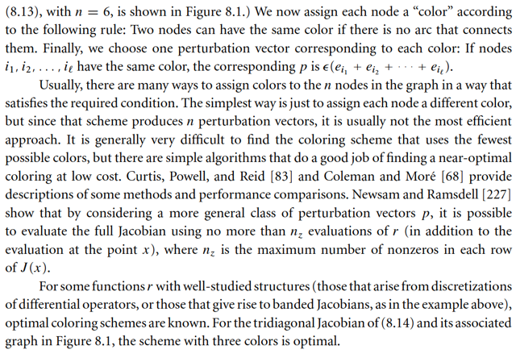</kbd>

> [!NOTE]
> QUAY LẠI SAU nhưng đại ý là vầy
>
> Ta cần biết các biến nào không ảnh hưởng nhau: ví dụ, nhúc nhích thằng x1  và
> x4 cùng lúc thì ảnh hưởng khiến r1, r2 nhúc nhích hoàn toàn là do x1, và r3,4,5
> nhúc nhích hoàn toàn là do x4. Ta cần tìm các bộ như vậy.
>
> Cách làm như sau: Ví dụ n = 6, ta vẽ 6 node. Xem node nào đại diện cho  các
> biến cùng nhau tác động với ri nào đó thì nối chúng lại. Ví dụ, (x1,x2) cùng tác
> động r1 (x1,x3), (x2,x3) cùng tác động r2, nên node 1 - node 2, node 1 - node 3
> và node 2 - node 3. Còn x1, x4 không có ri nào chung, khỏi nối.
>
> Cứ vậy, làm công tác nối dây này xong thì: Bắt đầu tô màu. Cứ tô màu lần lượt
> từng node, nhưng node nào nối nhau thì phải khác màu. Kết quả, 1, 4 cùng màu.
> 2,5 cùng màu, 3,6 cùng màu.
>
> Vậy ta sẽ nhúc nhích cùng lúc (x1,x4) và dùng nó để tính hai cột 1,4:
>
> [r(x + ε(e1+e4)) - r(x)] = a, thì [a1,a2,0,0,0,0]T và [0,0,a3,a4,a5,0] là  cột 1 và cột
> 4 của J (gần đúng)
>
> [r(x + ε(e2+e5)) - r(x)] = b, thì [0,b2,b3,b4,0,0]T và [0,0,0,0,b6,b6] là  cột 2 và cột
> 5 của J (gần đúng)
>
> [r(x + ε(e3+e6)) - r(x)] = c, thì [0,0,c3,c4,c5,0]T và [0,0,0,0,0,c6] là  cột 3 và cột
> 6 của J (gần đúng)

 

###### Xấp xỉ Hessian

<kbd>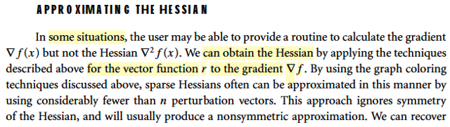</kbd>

<kbd>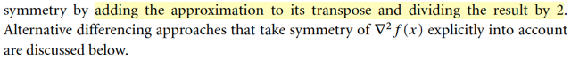</kbd>

> [!NOTE]
> Đại khái là, ta biết Hessian, là matrix đạo hàm cấp 2 của hàm vector → scalar
> f(x) nhưng nó cũng chính là matrix đạo hàm cấp 1 của hàm vector → vector
> ∇f(x).
>
> Nói cách khác, nếu ta xét ∇f(x), là một vector → vector function, thì Jacobian
> của nó cũng chính là Hessian của f(x).
>
> Mà vừa rồi ta bàn về cách để tìm Jacobian gần đúng, vậy thì chỉ cần áp dụng
> cách này cho hàm số g(x) = ∇f(x) thì ta sẽ có thể có Hessian gần đúng của f(x).
>
> Có điều đại ý là nếu làm kiểu đó thì Hessian xấp xỉ tính ra được nó mất đi tính
> đối xứng, nên người ta có thể khắc phục bằng cách, cộng với transpose của
> nó rồi chia 2.
>
> Nói chung khúc này ko có gì khó hiểu

 

###### Công thức xấp xỉ Hessian-vector

<kbd>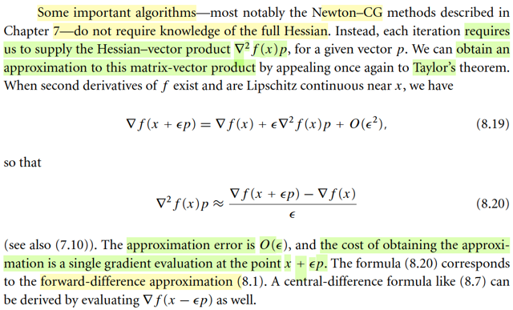</kbd>

> [!NOTE]
> Đại ý là một số thuật toán ko cần Hessian, mà chỉ cần tính Hessian nhân với
> vector p nào đó. Nên dựa vào Taylor's theorem, ta lại có thể derive ra công
> thức tính gần đúng của ∇^2f(x)p:
>
> Xài lại cái hồi nãy đã chứng minh:
>
> ||r(x + p) - r(x) - J(x)p|| ≤ (L/2) ||p||^2
>
> từ đó có J(x)d = r(x + εd) - r(x)] / ε + O(ε^2)
>
> và cho ta công thức xấp xỉ Jacobian: J(x)d ≈ r(x + εd) - r(x)] / ε
>
> Thì nay chỉ là thay r(x + p) là ∇f(x + p) (vì ∇f(x) cũng là vector → vector function)
>
> và thay J(x), Jacobian của r(x) = ∇f(x),thì chính là Hessian của f(x)
>
> ||∇f(x + p) - ∇f(x) - ∇^2f(x)p|| ≤ (L/2) ||p||^2
>
> ⇨ ∇^2f(x)d = ∇f(x + εd) - ∇(x)] / ε + O(ε)
>
> và ta có công thức xấp xỉ Hessian có sai số tuyến tính theo ε: 
>
> ∇^2f(x)d ≈ ∇f(x + εd) - ∇(x)] / ε
>
> Là tương tự như những phần trước ta sẽ có công thức xấp xỉ Hessian theo
> central difference có sai số nhỏ hơn, O(ε^2)

**🔗 See also:** [Xấp xỉ tích Jacobian-vector](#node-uv0qt75)

 

###### Xấp xỉ Hessian giá trị hàm

<kbd>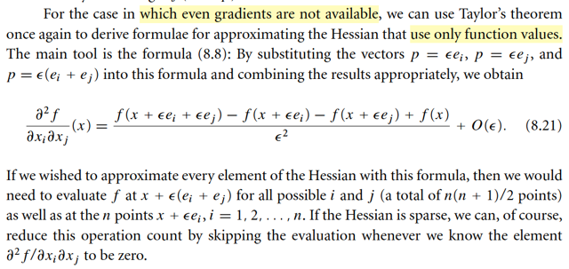</kbd>

> [!NOTE]
> Nhưng nếu hàm gradient ∇f(x) không có sẵn thì ta cũng có thể dùng
> công thức này để xấp xỉ Hessian bằng cách dùng hàm f.
>
> QUAY LẠI SAU

 

###### Xấp xỉ Hessian thưa

<kbd>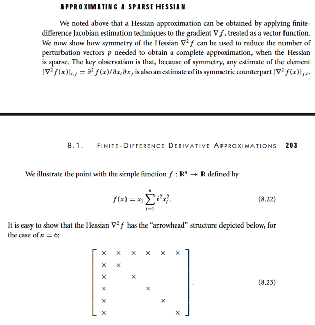</kbd>

> [!NOTE]
> QUAY LẠI CÁI NÀY SAU ĐỂ QUA MỘT PHẦN CỰC KÌ QUAN TRỌNG
> TRONG AI - AUTOMATIC DIFFERENTATION

 

