# 8.2 Automatic differentiation(*extremely important for AI)

📊 **Progress:** `36` Notes | `46` Screenshots | `2` AI Reviews

---

## 8.2 Automatic differentiation(*extremely important for AI)

> [!NOTE]
> 8.2 Automatic differentiation(*extremely important for AI)

 

## Đạo hàm tự động

<kbd></kbd>

> [!NOTE]
> gs nói sơ rằng Auto Diff là tên gọi chung cho những kĩ thuật mà trong đó
> người ta dùng một "computational representation" của một function để tính ra
> giá trị analytic của đạo hàm.
>
> Mình hiểu: analytic ý là giá trị chính xác, khác với numerical hay
> approximation là giá trị tính gần đúng của đạo hàm. Nhớ lại trong cs231n
> hay cs224n, cũng đã nghe cụm từ này. Trong đó ta dùng cách tính đạo hàm
> xấp xỉ để kiểm tra (debug, xem trong quá trình xây dựng mô hình có sai sót
> gì không).
>
> Ông nói, có kĩ thuật thì làm theo lối, tạo ra code để tính đạo hàm. còn có
> cách khác thì làm theo cách đại ý giữ giá trị của các biến trung gian khi tính
> function, và quay lại dùng lại cái này để tính đạo hàm.
>
> Mình nhận ra, đây chính là BACK-PROPAGATION huyền thoại: Giữ giá trị
> các bước trung gian trong forward mode và dùng nó để tính đạo hàm trong
> backward dựa theo chain-rule.
>
> Kiến thức này luôn được nói đến trong các lớp AI, và cả MIT 18s096, nhưng
> đây là lúc mình gặp lại nó ở mức độ sâu nhất.

 

### Chain Rule và Auto Diff

<kbd></kbd>

> [!NOTE]
> Khúc đầu đại ý gs nói rằng ý tưởng của Auto Diff xuất phát từ việc người ta nhận thấy
> là dù cái hàm f có phức tạp cỡ nào thì bản chất có thể chẻ nó ra thành các phép toán
> nhỏ cơ bản. Bao gồm có các phép toán nhận hai giá trị đầu vào và làm gì đó: như
> cộng , trừ, nhân , chia, lũy thừa. Và các phép toán nhận một gía trị đầu vào và làm gì
> đó: lấy log, e^, ...
>
> Sau đó, một công cụ nữa sẽ dùng, là chain-rule trong calculus, nói rằng nếu hàm h là
> hàm theo vector y, mà y lại là hàm theo vector x thì ta sẽ có: ∇_x h(y(x)) = blah blah...
>
> Là sao?
>
> Đầu tiên, h(y) là vector → scalar function, nhận vector y, trả ra scalar h(y)
>
> y(x) lại là vector → vector function: nhận vector x, trả ra vector y(x).
>
> Nên h(y(x)) sẽ là vector → scalar function: nhận vector x, trả ra scalar h(y(x)) do đó,
> đạo hàm của h wrt x là gradient vector: ∇h(x)
>
> Ghi như trong sách để làm rõ là coi cái nào là biến thôi: ∇_x h(y(x)) vì nếu coi y là biến,
> tức tính đạo hàm của h theo y ta sẽ ghi là ∇_y h(y)
>
> Cái này thì cũng chỉ là: d/dx h(y(x)) , đạo hàm của h đối với x
>
> Theo chain rule:
>
> d/dx h(y(x)) = d/d(y) h(y) . d/dx y(x)
>
> d/d(y) h(y) chính là ∇h(y)
>
> d/dx y(x), là đạo hàm của y wrt x, vì y(x) là vector → vector nên cái này là Jacobian
> matrix J(x)
>
> Vậy ta có một operation giữa vector gradient ∇h(y) và matrix J(x), và kết quả phải cho
> ra vector (∇h(x)) nên phải thể hiện nó là: matrix J(x)T nhân vector ∇h(y) (thì mới ra
> column vector được)
>
> Phải transpose vì J có shape là (m,n), (J)T có shape (n,m) thì nhân với gradient ∇h(y)
> có shape (m,1) thì mới khớp.
>
> ⇨ ∇x_h(y(x)) = J(x)T ∇h(y)
>
> Rồi, quay lại xét ∇h(y), viết rõ ra, nó là vector các đạo hàm riêng:
>
> [∂h(y)/∂y1,...∂h(y)/∂ym]
>
> Còn J(x), là Jacobian của y wrt x, ta biết, mỗi hàng của nó, ví dụ hàng 2 là vector  đạo
> hàm riêng của y2 đối với x: [∂y2/∂x1, ∂y2/∂x2,...,∂y2/∂xn], và nó cũng là gradient của y2
> wrt x: ∇y2(x)
>
> Để rồi khi transpose, để có J(x)T, thì cột thứ 2 chính là ∇y2(x). Cột thứ i chính là ∇yi(x)
>
> Và J(x)T ∇h(y), theo MIT 1806 góc nhìn nhân matrix với vector thứ hai đã biết: Ax là
> linear combination các cột của A với hệ số là các phần tử của x.
>
> Vậy J(x)T ∇h(y) = linear combination các cột J(x)T với hệ số là components của ∇h(y):
>
> J(x)T ∇h(y) = Σi=1:m ∂h(y)/∂yi ∇yi(x). Đây chính là công thức 8.25

 

#### Chế độ tiến phân biệt tự động

<kbd>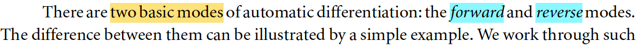</kbd>

<kbd></kbd>

<kbd>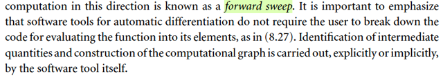</kbd>

> [!NOTE]
> gs lấy một ví dụ, ta sẽ xét hàm f(x) = x1x2sin(x3) + e^(x1x2)/x3.
>
> việc tính toán bên trong hàm số này có thể được bẻ ra thành các bước nhỏ,
> có thứ tự. Đặt các biến trung gian, và thể hiện quá trình tính toán các bước
> này như một đồ thị, nơi các phép tính sẽ biểu diễn bởi  các node.
>
> Cái này gọi là computational graph.
>
> Và việc tính toán từ trái sang phải (đi từ x1,x2,x3 → x9) gọi là FORWARD
> SWEEP
>
> gs có lưu ý ta là, các phần mềm auto diff sẽ tự làm bước bẻ nhỏ hàm f
> thành các bước nhỏ này

 

##### Đồ thị tính toán hàm

<kbd></kbd>

 

- **Mode Forward Đạo hàm theo hướng**

<kbd>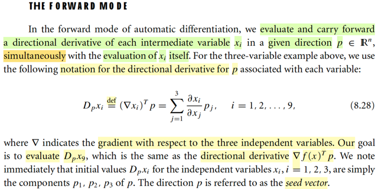</kbd>

> [!NOTE]
> Đại khái là, trong forward mode của auto diff, ta sẽ tính và mang theo một giá
> trị đạo hàm theo hướng p cho mội biến trung gian xi. Và ta làm việc này cùng
> lúc với việc evaluation xi.
>
> Lí do, hay mục đích của việc này thì chưa rõ lắm có thể tí nữa sẽ biết. Còn
> giờ cứ tạm hiểu vậy.
>
> Directional derivative của hàm f wrt hướng d, mình còn nhớ là như sau: Ý
> nghĩa của nó là độ dốc hàm f theo hướng d tại x
>
> Xét hàm R^n → R f(x), Xét hàm scalar → scalar g(α) = f(x + αd), thì g' (α)|α=0
> cũng là độ dốc của hàm f(x) theo hướng d tại x, chính là định nghĩa của
> directinal derivative của f(x) wrt d:
>
> lim ε → 0 [f(x + εd) - f(x)] / ε
>
> Ta sẽ xem vì sao nó là ∇f(x)Td:
>
> g'(α) = d/dα g(α) = d/dα f(x + αd)
>
> = d/d(x + αd) f(x + αd) . d/dα (x + αd) (chain rule)
>
> = ∇f(x + αd) . d
>
> (và vì g(α) là scalar → scalar, nên g'(α) phải là scalar, nên operation hợp trên
> chỉ có thể là dot product của hai vector)
>
> = ∇f(x + αd)Td.
>
> Và g'(α)|α=0 = ∇f(x)Td.
>
> ------
>
> Quay lại đây, đại khái là ta sẽ định nghĩa kí hiệu Dp_xi là directional
> derivative theo hướng p của xi
>
> Có nghĩa là sao:
>
> Tức là ta cứ xem x1, ...x6 đều là function theo x1, x2, x3.
>
> Ví dụ, x1, coi như là hàm x1(x1,x2,x3): Chữ x1 đầu tiên là tên hàm, x1, trong
> ngoại là argument / input. và cái hàm này = 1*x1 + 0*x2 + 0*x3.
>
> Thì như vậy, đây vẫn là hàm vector → scalar, với việc hiểu x là vector [x1, x2,
> x3], thì ta cũng ghi là x1(x) y như f(x) vậy.
>
> Rồi cũng có gradient vector ∇x1(x) (y như ∇f(x) vậy) là vector các partial
> derivative [∂x1(x)/∂x1, ∂x1(x)/∂x3, ∂x1(x)/∂x3], dĩ nhiên sẽ có giá trị là [1, 0, 0]
>
> Tương tự, x4 cứ coi như là hàm x4(x1,x2,x3) = x1*x2 + 0*x3.
>
> Và ∇x4(x) = [∂x4(x)/∂x1, ∂x4(x)/∂x3, ∂x4(x)/∂x3] 
>
> = [x2, x1, 0] (vì x4 = x1*x2 ⇨ ∂x4(x)/∂x1 = x2, ∂x4(x)/∂x2 = x1, và ∂x4(x)/∂x3 = 0)
>
> Tương tự với các ∇xi(x), i = 1,....9
>
> Và ta sẽ quan tâm đạo hàm theo hướng p của chúng
>
> Chỗ này hơi khó hiểu về kí hiệu, nhưng hãy nhìn thế này: Ta có hàm f(x), thì
> directional derivative của f wrt hướng d là ∇f(x)Td.
>
> Vậy giờ ta có hàm xi(x), ví dụ x4(x), thì directional derivative của x4 wrt p là:
>
> ∇x4(x)Tp
>
> Nên ∇x4(x)Tp = ∂x4(x)/∂x1 * p1 + ∂x4(x)/∂x3 * p2 + ∂x4(x)/∂x3 * p3
>
> = Σj=1,2,3 ∂x4(x)/∂xj * pj
>
> Tương tự, với mọi i = 1,...9
>
> ∇xi(x)Tp = Σi=1:3 ∂xi/∂xj * pj
>
> Từ đó có thể hiểu ∇x1(x)Tp = 1*p1 + 0*p2 + 0*p3  = p1
>
> tương tự ∇x2(x)Tp = p2, ∇x3(x)Tp = p3
>
> Nên ở đây mới nói "We note immediately that initial values Dpxi for the
> independent variables xi , i = 1, 2, 3" là vậy

 

- **Đạo hàm xuôi tự động**

<kbd></kbd>

> [!NOTE]
> Mấu chốt chỗ này là: Khi có x4, Dpx4, x5, thì vì x7 = x4 + x5 nên ta có thể tính x7
> và Dpx7 (tức ∇x7(x)Tp) cùng lúc.
>
> Là sao:
>
> Biết x4, x5 thì tính được x7 thì đương nhiên rồi: x7 = x4 + x5.
>
> Nhưng làm sao có Dpx7 (cũng là ∇x7(x)Tp)?
>
> → Dựa vào công thức 8.25: J(x)T ∇h(y) = Σi=1:m ∂h(y)/∂yi ∇yi(x).
>
> Đây nhé:
>
> Ở đây x7, trước tiên nó là hàm của x4, x5: x7(x4, x5) = x4 * x5
>
> Nên x7 là vai trò của h, [x4,x5] là trong vai y.
>
> Đạo hàm của h=x7 đối với y=[x4,x5] sẽ là gradient vector ∇h(y) = ∇x7(x4,x5)
>
> = [∂x7/∂x4, ∂x7/∂x5] = [x5, x4]
>
> Sau đó vì x4, x5 là hàm của x1, x2, x3: x4(x1,x2,x3), x5(x1,x2,x3) như note trước
> đã nói.
>
> Nên nếu xét y = [x4,x5] thì nó là R^3 → R^2 function y(x) = y(x1,x2,x3)
>
> = [x4(x1,x2,x3), x5(x1,x2,x3)]
>
> Và đạo hàm của y wrt x là Jacobian J(x).
>
> Có hàng 1 là ∇y1(x) = ∇x4(x)
>
> Và hàng 2 là ∇y2(x) = ∇x5(x)
>
> Vậy theo công thức trên:
>
> ∇x7 = ∂x7/∂x4 ∇x4 + ∂x7/∂x5 ∇x5 = x5 ∇x4 + x4 ∇x5
>
> Dot product hai vế với p:
>
> ∇x7Tp = (x5 ∇x4 + x4 ∇x5)Tp
>
> = x5 ∇x4Tp + x4 ∇x5Tp
>
> = x5 Dpx4 + x4 Dpx5
>
> =====
>
> Và cứ đi từ trái qua phải như vậy, mỗi lần ta sẽ tính cùng lúc một cặp (xi, Dpxi) và
> tại node cuối ta sẽ có (x9, Dpx9)
>
> Nhưng làm vậy để chi: Ta đang cần tính đạo hàm cơ mà:
>
> Thì cụ thể ở đây, với hàm f(x1,x2,x3) = (x1x2 sinx3 + e^(x1x2)) / x3 thì ∇f(x) chính
> là ∇x9(x), = [∂x9(x)/∂x1, ∂x9(x)/∂x2, ∂x9(x)/∂x3]
>
> Thế thì, giả sử ta có p = [1,0,0] thì khi tính xong cặp (x9, Dpx9) thì Dpx9 là cái gì:
> Nó là directional derivative của x9(x) wrt direction p, ∇x9(x)Tp. Khi p = e1 = [1,0,0],
> thì kết quả này chính là ∂x9(x)/∂x1, cũng chính là ∂f(x)/∂x1 là partial derivative của f
> wrt x1.
>
> Nên chỉ cần chạy thuật tóan này với lần lượt p = e1,e2,e3.
>
> Ta sẽ có ∂f(x)/∂x1, ∂f(x)/∂x2, ∂f(x)/∂x3 để có ∇f(x).
>
> (Dĩ nhiên, cũng cần input x = giá trị của x1,x2,x3 nào đó để có gradient tại điểm đó)
>
> Trong đoạn sau gs Nocedal sẽ nói về vụ này (dùng p - seed vector lần lượt là e1,..
> en để có được gradient)

 

- **Tự động hóa vi phân**

<kbd></kbd>

<kbd></kbd>

> [!NOTE]
> gs làm rõ vài ý:
>
> Ta, user, ko cần phải tự xây dựng computational graph, mà các phần mềm
> auto-diff sẽ làm việc này một cách tự động.
>
> Và máy tính khi tính / chạy cái forward sweep này nó cũng ko cần phải lưu
> mọi giá trị biến trung gian. Ví dụ tính xong (x7, Dpx7) thì vứt (x5, Dpx5) khỏi
> bộ nhớ luôn. Rồi khi tới (x9, Dpx9) thì vứt hết các cặp trước đi

 

- **Tính đạo hàm song song**

<kbd></kbd>

> [!NOTE]
> Và điểm mấu chốt của quá trình này, như đã nói lúc nãy: là tại mỗi note,
> máy tính sẽ tính cùng lúc cặp giá trị (xi, Dpxi).
>
> Y như trong ví dụ vừa rồi, khi tính x7 = x4*x5, thì nó cũng tính:
>
> Dpx7 = x5 Dpx4 + x4 Dpx5.
>
> Và công thức để tính Dpx7 sẽ được hardcode, bởi quy tắc đạo hàm
> của môt tích: (uv)' = udv + vdu
>
> Gs lấy ví dụ khác, trong một node nào đó mà được tính từ hai node
> trước: z = w/y. Thì công thức quotient rule cho ta:
>
> (w/y)' = (w'y - w y')/y^2 = w'/y - wy'/y^2
>
> Nên trong phần mềm người ta sẽ hard code để tính: 
>
> Dpz = (1/y) Dpw - (w/y^2)Dpy.

 

- **Chi phí tính toán gradient**

<kbd>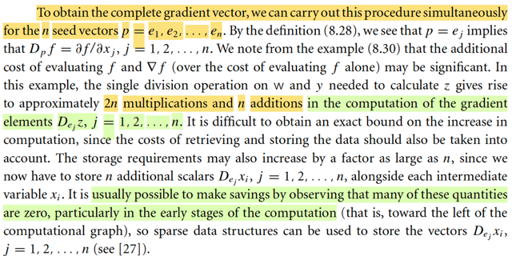</kbd>

> [!NOTE]
> Rồi, thế thì: Đại ý đoạn này đại khái là:
>
> Xét chi phí tính toán của quá trình Forward sweep đi qua cái node phép
> chia (tính z = w / y) này khi cần tính nguyên cái gradient.
>
> Như đã nói vừa rồi: Nếu ta dùng p = e1, thì tính z, Dpz xong thì Dpz chính
> là ∇z(x)Te1 = ∂z(x)/∂x1. 
>
> Rồi với p = e2, forward sweep sẽ cho ta ∂z(x)/∂e2.
>
> Và bằng cách stack e1,...en (giả sử input của hàm số là n chiều x = x1,..xn
> (giống như hồi nãy input là 3 chiều, x = [x1,x2,x3] vậy) lại thành matrix P = I
> thì forward sweep, sẽ cũng giống ta chạy p = e1, p = e2,..cùng lúc. Để kết
> quả ta có cùng lúc ∇z(x)T = [∂z(x)/∂x1, ...∂z(x)/∂xn]
>
> Thế thì nếu tính đơn lẻ một cái: Dpz = (1/y) Dpw - (w/y^2)Dpy
>
> ta sẽ tốn bao nhiêu phép tính: Lấy scalar (1/y) nhân scalar Dpw (Dpw, chỉ
> là ∇wTp, là directional derivative, NHỚ RẰNG, NÓ LUÔN LUÔN LÀ SCALAR)
>  rồi lấy (w/y^2) nhân Dpy, rồi lấy hai cái trừ nhau. → Tức là ta tốn 2 phép nhân
> scalar, và 1 phép trừ (hay gọi là phép cộng cũng được)
>
> Vậy nếu có n input x1,..xn, thì quá trình sẽ tốn 2n phép nhân và n phép cộng.
>
> Và đó là chi phí tính toán CỦA CHỈ MỘT NODE.
>
> Nên nếu như quá trình này áp dụng cho hàm số có rất nhiều node thì chi
> phí sẽ rất lớn.
>
> Ngoài ra giáo sư còn nói về việc ta còn phải tính đến chi phí LƯU TRỮ CŨNG
> SẼ TĂNG LÊN THEO NỮA.

 

- **Triển khai Đạo hàm Tự động**

<kbd>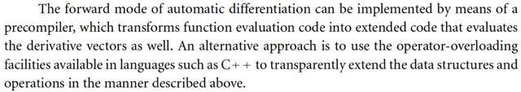</kbd>

 

- **Backpropagation và Đạo hàm ngược**

<kbd>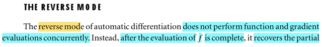</kbd>

<kbd>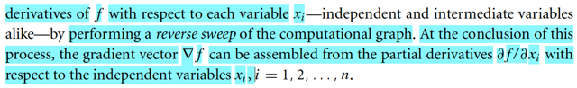</kbd>

> [!NOTE]
> Đây, đây chính là cái mà trong deep learning gọi là BACK-PROPAGATION
> đây.
>
> Nói ngắn gọn về FORWARD MODE: Ta sẽ đi từ node đầu đến node cuối,
> tại mỗi node, tính toán một cặp (xi, Dpxi) để rồi với p = e1, thì tại node cuối,
> ví dụ x9 thì Dpx9 chính là ∂x9(x)/∂x1 = ∂f(x)/∂x1. Và làm vậy cho n vector p
> = e1,..en ta sẽ có được gradient ∇x9(x) = ∇f(x). Và quá trình này gọi là
> FORWARD SWEEP
>
> Còn ở BACKWARD MODE, thì với cái này, ta sẽ không tính cùng lúc giá trị
> node và đạo hàm (tức xi và Dpxi) nữa. Thay vào đó ta sẽ evaluate hàm số
> trước, tức là tính toán các node từ trái sang phải trước, ví dụ như trong cái
> graph trong phần trước thì ta sẽ tính x4,x5,x6 → x9 (ko tính Dpx4, Dpx5 gì
> hết).
>
> Sau đó mới "quay lại" để tính ngược lại các ∂f(x)/∂x8, ∂f(x)/∂x7,....cho đến
> khi có ∂f(x)∂x1, ∂f(x)∂x2, ∂f(x)∂x3.
>
> và gom lại (assembled) ta sẽ có gradient ∇f(x). 
>
> Quá trình này gọi là REVERSE SWEEP
>
> Mình có thể nhận ra, đây chính là mô tả thứ mà trong Deep Learning
> ta FORWARD PROP (tính toán các layer từ input → loss function) sau đó
> BACKWARD PROP (tính toán các partial derivative của loss wrt các lớp
> trung gian (ý là các parameters) cho đến lớp đầu tiên. Và dùng các giá trị
>  gradient này để cập nhật mô hình. (dĩ nhiên trong bài toán đó, thứ mà ta
> cần là đạo hàm của hàm loss đối với các parameters của mô hình, chứ
> ko phải của input để làm gì, trừ vài bài toán đặc biệt như GAN, VAE)

 

- **Biến Adjoint (Backward Mode)**

<kbd></kbd>

> [!NOTE]
> Khác với FORWARD MODE, trong đó ta gắn với mỗi node xi một Dpxi. Thì  nay
> với BACKWARD MODE, ta sẽ gắn với mỗi node xi một xi^, sẽ chứa THÔNG
> TIN ∂f/∂xi, gọi là ADJOINT VARIABLE
>
> Biến này của mỗi node sẽ được khởi tạo bằng 0, trừ cái node cuối cùng. Lí do
> là vì cũng như trong cái graph trước, x9, chính là f. Nên x9^ = ∂f(x)/x9 cũng
> chính là ∂x9/∂x9 dĩ nhiên là luôn 1.
>
> Ở đây, gs nhắc đến chữ accumulated: Tích tụ, mình có thể hiểu vụ này:
> Như trong cs231n đã học: Khi backprop, đi qua mỗi node, upstream derivative
> sẽ nhân với local derivative để ra downstream derivative. Rồi khi đi ngược
> lại một node mà từ đó chẻ ra hai nhánh, đạo hàm đổ về từ hai nhánh sẽ cộng 
> lại.

 

- **Quy tắc chuỗi đảo ngược**

<kbd>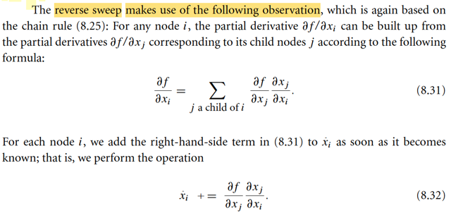</kbd>

> [!NOTE]
> Chỗ này là sao?
>
> Trong bài 11 của MIT 18.02, mình đã học một kiến thức: Total differentiation - vi phân toàn phần:
>
> Giả sử f là hàm của x,y: f(x, y) ⇨ df = ∂f/∂x dx + ∂f/∂y dy
>
> x = x(t, u, v) ⇨ dx = ∂x/∂t dt + ∂x/∂u du + ∂x/∂v dv
>
> y = y(t, u, v) ⇨ dy = ∂y/∂t dt + ∂y/∂u du + ∂y/∂v dv
>
> ⇨ df = ∂f/∂x (∂x/∂t dt + ∂x/∂u du + ∂x/∂v dv) + ∂f/∂y (∂y/∂t dt + ∂y/∂u du + ∂y/∂v dv)
>
> = (∂f/∂x . ∂x/∂t + ∂f/∂y . ∂y/∂t) dt + (∂f/∂x . ∂x/∂u + ∂f/∂y . ∂y/∂u) du + (∂f/∂x . ∂x/∂v + ∂f/∂y . ∂y/∂tv) dv
>
> Và nếu coi f là hàm f(t,u,v) thì df = ∂f/∂t dt + ∂f/∂u du + ∂f/∂v dv
>
> Từ đó suy ra:
>
> ∂f/∂t = ∂f/∂x . ∂x/∂t + ∂f/∂y . ∂y/∂t
>
> ∂f/∂u = ∂f/∂x . ∂x/∂u + ∂f/∂y . ∂y/∂u
>
> ∂f/∂v = ∂f/∂x . ∂x/∂v + ∂f/∂y . ∂y/∂v
>
> Quay lại đây
>
> Theo quy ước, nếu có node kéo từ i → j thì node i là cha của node j. node j là con node i
>
> Vậy, trong cái graph đang lấy làm ví dụ, node j = 6, 7 là node con của node 4, (cũng chính là
> vì x4 tham gia vào việc tính x6, x7):
>
> x6 = x6(x4) = exp(x4)
>
> x7 = x7(x4,x5) = x4*x5
>
> Áp dụng kiến thức total differentiation ở trên:
>
> Nếu coi f là hàm theo x6, x7 thì ta có:
>
> df = ∂f/∂x6 dx6 + ∂f/∂x7 dx7
>
> x6 là hàm theo x4: x6 = x6(x4) ⇨ dx6 = ∂x6/∂x4 dx4
>
> x7 là hàm theo x4,x5: x7 = x7(x4,x5) ⇨ dx7 = ∂x7/∂x4 dx4 + ∂x7/∂x5 dx5
>
> ⇨ df = ∂f/∂x6 ∂x6/∂x4 dx4 + ∂f/∂x7 (∂x7/∂x4 dx4 + ∂x7/∂x5 dx5) (1)
>
> = [∂f/∂x6 ∂x6/∂x4  + ∂f/∂x7 ∂x7/∂x4] dx4 + ∂x7/∂x5 dx5
>
> Nếu coi hàm f là hàm theo x4, x5 thì: 
>
> df = ∂f/∂x4 dx4 + ∂f/∂x5 dx5 (2)
>
> Từ (1) và (2) suy ra ∂f/∂x4 = ∂f/∂x6 ∂x6/∂x4  + ∂f/∂x7 ∂x7/∂x4
>
> = Σj=6,7 [∂f/∂xj ∂xj/∂x4]
>
> Và như đây chính là công thức mà trong sách đang nói áp dụng cho i = 4, j = 6,7
>
> ∂f/∂xi = Σ{j là con của i} ∂f/∂xj . ∂xj/∂xi.
>
> Khi đã hiểu công thức này, thì đại khái ở đây, gs nocedal nói Reverse Mode bắt nguồn từ
> cái này.

 

- **Cộng dồn Gradient Backprop**

<kbd>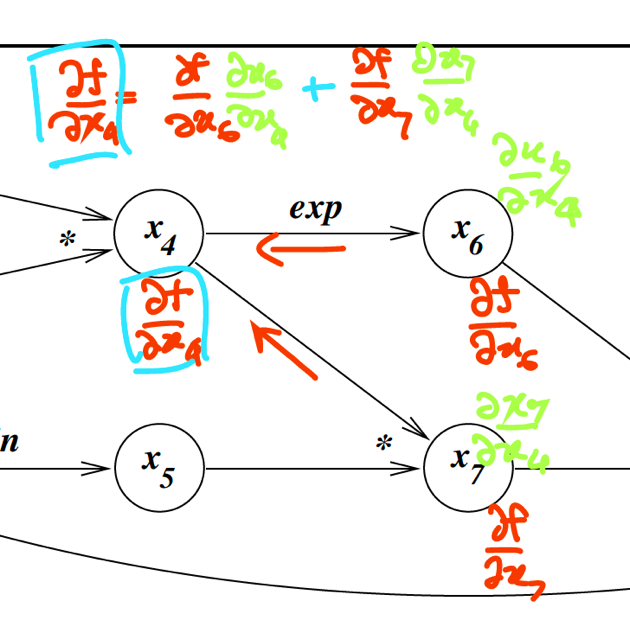</kbd>

> [!NOTE]
> Và đây cũng là cái mà trong cs231n đã học. Quá trình backprop, ta sẽ lấy
> upstream gradient (ví dụ ∂f/∂x6, ∂f/∂x7) nhân với local gradient (∂x6/∂x4,
> và ∂x7/∂x4) để có downstream gradient, và khi hai nhánh cùng đổ về
> thì ta sẽ cộng lại.
>
> Trong thuật toán, thì tại mỗi lần ta tính xong , ví dụ đã có gradient đổ về
> từ thượng lưu: ∂f/∂x4 từ nhánh x4-x6. Thì ta sẽ cộng dồn vào x^4, (biến
> adjoint của node 4). Khi có gradient đổ về từ nhánh x4-x7, thì tiếp tục
> cộng dồn vào.

 

- **Node Finalized và Backpropagation**

<kbd>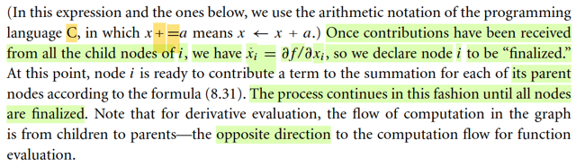</kbd>

> [!NOTE]
> Và khi một node đã nhận đủ gradient đổ về, nó được gọi là đã xong
> (finnalized) và sẵn sàng để tiếp tục đóng góp gradient cho các node cha của
> nó. Ví dụ x4 là con của x1, x2. Thì nhân upstream gradient ∂f/∂x4 với local
> gradient ∂x4/∂x1 để có downstream gradient đổ về x1 theo hướng x1-x4
>
> Quá trình sẽ đi ngược từ node cuối, nên có tên gọi là backpropagation trong
> deep learning
>
> Quá trình sẽ ngừng khi mọi node đều finalized.
>
> Về mấy chữ upstream, downstream thì hiểu đơn giản thôi.
>
> Ví dụ sau khi đã có ∂f/∂x6. Thì để tính gradient đổ về theo nhánh x4-x6 ta sẽ
> xem nó là upstream gradient
>
> đem nhân với local gradient là ∂x6/x4, để có downstream gradient: ∂f/x6 .
> ∂x6/x4.
>
> Vì node x6 giống như cái cống vậy: nước từ thượng lưu trả về là ∂f/∂x6, trước
> khi đi qua cống.
>
> Khi đi qua cống, nó sẽ được xử lí: đó là bước nhân với local gradient ∂x6/∂x4.
>
> Nước ra khỏi cống, là downstream gradient của ái node x6 đó. Nhưng sẽ là
> upstream gradient của một trong hai nhánh đổ về x4.
>
> Cộng với gradient từ nhánh x4-x7 nữa ta sẽ có upstrean gradient của node 4.
> Lại đi qua cống thì tùy vào việc tính đi nhánh nào, ta sẽ nhân với local
> gradient tương ứng: ∂x4/∂x1 hay ∂x4/x2 để đổ về node 1 và node 2

 

- **Chế độ đạo hàm tự động**

<kbd>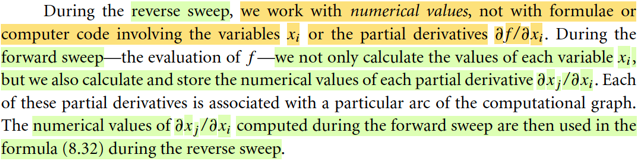</kbd>

> [!NOTE]
> Đại ý là với REVERSE MODE, ta sẽ chạy 2 pha: Forward sweep, đây là 
> quá trình đi từ trái sang phải, để tính các biến trung gian, để cuối cùng có
> f. Trong quá trình đó ta sẽ tính và lưu lại các local gradient (ví dụ khi qua
> node 7 thì tính ∂x7/∂x4 lưu đó)
>
> Sau đó, trong phase Backward sweep, ta sẽ đưa gradient đi ngược về,
> tới mỗi node thì nhân với local gradient như vừa nói.
>
> Chú ý, FORWARD MODE thì chỉ có 1 pha: Forward sweep, còn nhớ: đưa
> vào seed vector p, đi từ trái qua phải qua mỗi node, ta sẽ tính MỘT CẶP
> (xi, Dpxi = ∇xiTp là directional derivative của hàm xi(x) wrt p). Thì khi đi
> đến node cuối, cũng là có f. thì là xong. Để rồi nếu p là e1, thì khi forward
> sweep xong ta sẽ có ∂f(x)/∂x1. Và ta phải làm n lần (với các e1,..en để)
> (tuần tự hai cùng lúc gì thì cũng là forward sweep n lần) thì mới có đủ
> ∇f(x) = [∂f(x)/∂x1,...∂f(x)/∂xn]
>
> Còn ở REVERSE MODE, có thể thấy ta chỉ cần Forward sweep và backward
> sweep ĐÚNG 1 LẦN. Vì khi forward ta sẽ có hết các local gradient. Để khi
> backward, thì một khi hoàn tất, mọi node đều finalized thì ta cũng đã có 
> đủ mọi gradient của các node đầu tiên, tức là có đủ ∇f(x) = [∂f/∂x1,...∂f/∂xn]

 

- **Minh họa chế độ ngược**

<kbd>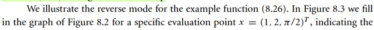</kbd>

<kbd>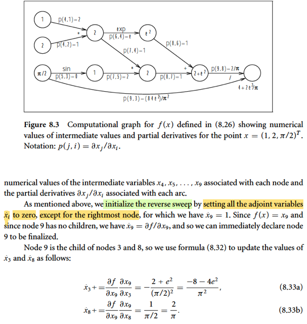</kbd>

<kbd>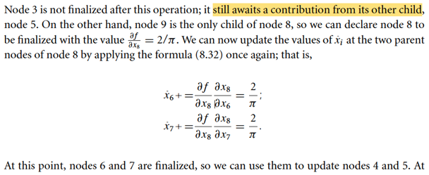</kbd>

<kbd>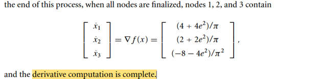</kbd>

> [!NOTE]
> Gs cho một ví dụ. cũng dễ hiểu khi ta đã nắm nguyên lí

 

- **Độ phức tạp Reverse/Forward**

<kbd>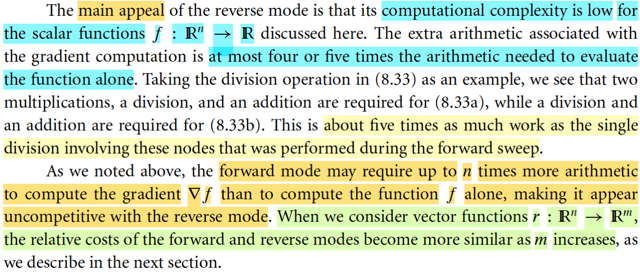</kbd>

> [!NOTE]
> Ở đây nói đến việc cái điểm hấp dẫn quan trọng nhất của Reverse Mode là
> đối với hàm R^n → R (scalar function) thì chi chí tính toán của nó rất rẻ.
> Việc tính gradient chỉ khiến chi phí tăng thêm gấp vài lần chi phí của việc
> evaluate hàm f. Ta nhớ với Forward mode, thì cần n lần chi phí evaluate
> hàm f (nhớ ko, mỗi lần forward sweep chỉ có được một partial derivative ∂f/∂xi,
> phải forward sweep n lần mới có đủ gradient).
>
> Nếu ta xem xét hàm R^n → R^m với m tăng dần thì chi phí của Forward mode
> và Reverse mode trở nên giống nhau

 

- **Kĩ thuật Checkpointing**

<kbd>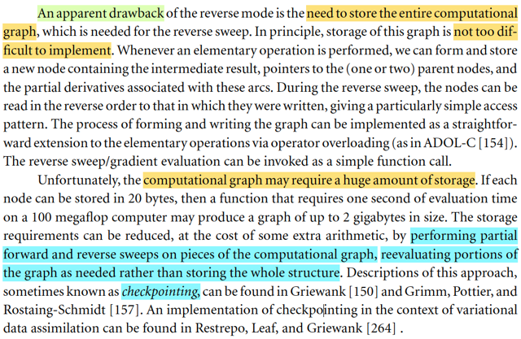</kbd>

> [!NOTE]
> Nói so về nhược điểm của Reverse Mode: Chi phí lưu trữ cái
> computational graph.
>
> Và đây cho đến giờ vẫn là một rào cản của training các mô hình deep 
> learning hiện đại: GPU tuy có tốc độ tính toán nhanh và memory đã trở
> nên lớn hơn, nhưng mô hình cũng trở nên lớn hơn rất nhiều (ví dụ như
> những LLM hiện nay)
>
> Một kĩ thuật mà gs Nocedal đề cập tới để giúp khắc phục phần nào: gọi là
> Checkpointing. Đại ý là, thay vì lưu trữ toàn bộ các giá trị trung gian gồm
> giá trị biến và gradient, để chờ cho pha reverse sweep, ta sẽ chỉ lưu của
> một vài node mà thôi. Để rồi, khi pha reverse, ta sẽ thực hiện những 
> đoạn forward sweep cục bộ để khôi phục lại giá trị.
>
> Ví dụ, trong cái graph bữa trước, thay vì trong forward sweep, ta save đủ
> giá trị (xj và local gradient ∂xj/∂xi với i là các node cha của node j). Thay vì
> vậy, ta chỉ lưu của node 6, 7 thôi chẳng hạn. Không save của node 4,5,8.
>
> Khi đó, quá trình reverse sweep từ node 9 về, gặp node 8, sẽ bị thiếu local
> gradient ∂x8/∂x6, và ∂x8/∂x7. Khi đó, dựa trên việc đã có x6,x7 được lưu. Ta
> sẽ forward lại cái đoạn từ x6,7 → x8, để tính x8 và ∂x8/∂x6, ∂x8/∂x7.
>
> Và kĩ thuật này đến nay vẫn được dùng trong training AI hiện đại, chính là
> cái gọi là Gradient Checkpointing

> [!TIP]
> **🤖 AI Feedback** — ✅ Score: **92/100**
>
> Bài làm xuất sắc trong việc nắm bắt nhược điểm chính của Reverse Mode và giải thích cơ chế checkpointing một cách chi tiết, kèm ví dụ minh họa rất rõ ràng. Tuy nhiên, việc đề cập tới "gs Nocedal" không có trong đoạn văn bản gốc được cung cấp, cần lưu ý chỉ trích dẫn thông tin trực tiếp từ nguồn đã cho.

 

- **Jacobian hàm vector**

<kbd>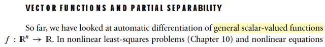</kbd>

<kbd>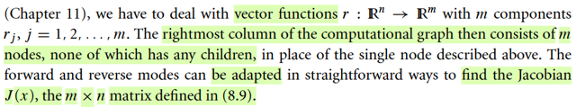</kbd>

> [!NOTE]
> Qua phần này, gs nói về việc ta sẽ điều chỉnh đề bàn về cách áp dụng
> Reverse  Mode để tính Jacobian của hàm vector → vector (bữa giờ là
> dùng Reverse Mode để tính gradient của hàm vector → scalar)
>
> Do đó, ở đây computational graph sẽ có m node ở cuối chứ không
> phải 1.
>
> Và đoạn này gs nói rằng ta có để adapt cái forward và reverse mode
> để tính Jacobian J(x).
>
> Là sao, qua phần sau ông thầy này mới nói

 

- **Vi phân tự động hàm tách rời**

<kbd>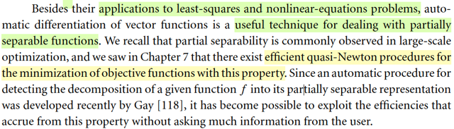</kbd>

> [!NOTE]
> Nói sơ vài công dụng của cái này: nó giúp ta deal với partially
> separable functions

 

- **Gradient Hàm Phân Tách Tô Màu**

<kbd>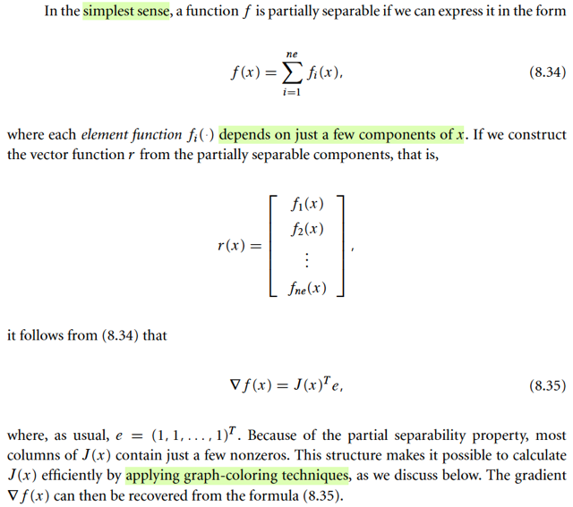</kbd>

> [!NOTE]
> ở dạng đơn giản, một function mà có thể thể hiện ở dạng f(x) = Σi=1:ne fi(x)
> trong đó fi(x) chỉ phụ thuộc vài component của x.
>
> Là sao.
>
> Đơn giản thôi, giả sử một hàm f(x) có thể được thể hiện bởi tổng n hàm f1(x), ...
> fn(x) mà mỗi hàm chỉ là hàm của vài phần tử của x. Ví dụ f(x) = x1^2 + x1e^x2
> + x1/x3. Thì tức là f(x) = f1(x) + f2(x) + f2(x) với f1(x) = x1^2, f2(x) = x1e^x2, f3(x)
> = x1/x3. Mỗi hàm chỉ phụ thuộc vài component của vector input x.
>
> (trong sách này ta tự hiểu x là vector, ko cần viết đậm như trong xác suất)
>
> Khi đó, cách tìm ∇f(x) là như sau:
>
> Đặt hàm vector → vector: R(x) = [f1(x), f2(x), f3(x)]
>
> Thế thì khi đó, ta có thể dùng cái cách làm tính Jacobian bằng forward mode áp
> dụng cho một Jacobian sparse như sau.
>
> Nhưng có lẽ nên ôn lại trước, về cách mà ta dùng forward mode để tính
> Jacobian:
>
> Thì đơn giản là, ta sẽ chạy n lần: mỗi lần pass vào một seed vector p = ei.  Với
> forward sweep, còn nhớ, tại mỗi node nó sẽ tính ra một cặp [xi, Dpxi] với Dpxi
> chính là ∇xi(x)Tp. Để cuối cái graph, ta sẽ có một loạt các cặp của n node cuối:
>
> Ví dụ với p = e1 ta có:
>
> r1(x), Dpr1(x)
>
> r2(x), Dpr2(x)
>
> ..
>
> Và gom lại [Dpr1(x), Dpr2(x),...], đây cũng chính là [∇r1(x)_1, ∇r2(x)_1,...
> ∇rn(x)_1]
>
> hay cũng là [∂r1(x)/∂x1, ∂r2(x)/∂x1,...∂rn(x)/∂x1], chính là cái cột 1 của J(x).
>
> Và lặp lại với e2,...en ta sẽ có đủ n cột của J(x)
>
> -----
>
> Tuy nhiên, làm vậy thì rõ ràng là tốn kém.
>
> Nên với một số trường hợp, Jacobian sparse, đồng nghĩa, hàm r(x) = [r1(x), ...
> rn(x)] có dạng ri(x) có thể chỉ phụ thuộc vài component của x chứ ko phải là tất
> cả.
>
> Do đó, ta sẽ làm cái trò tô màu. Với ý tưởng là vầy:
>
> Ta xác định các node cuối ri(x) nào mà chúng phụ thuộc các bộ input khác nhau.
> Ví dụ, r1(x) chỉ phụ thuộc x1,x2. r3(x) chỉ phụ thuộc x3,x4 r7(x) chỉ phụ thuộc x5,
> x6 và ví dụ n=6. Thì khi đó, trò tô màu sẽ giúp ta xác định được r1,r3,r7 là một
> nhóm. Và từ đó ta mới pass vào một seed vector = e1 + e3 + e7 (có 3 số 1),
> forward sweep. Và ta sẽ có được một vector chứa đồng thời thành phần của 3
> cột của Jacobian.
>
> Hai phần tử đầu tiên của kết quả, sẽ là 2 phần tử của cột 1: ∂r1(x)/∂x1, ∂r1(x)/∂x2
> (mấy phần tử còn lại của cột 1 dĩ nhiên là 0)
>
> Hai phần tử tiếp theo của vector kết quả là 2 phần thử 3,4 của cột 3: ∂r3(x)/∂x3,
> ∂r4(x)/∂x4 (mấy phần tử còn lại cũng là 0)
>
> Hai phần tử tiếp theo là phần tử 5,6 của cột 7,
>
> Nói chung là forward sweep một lần mà "xong" 3 cột của J.
>
> Tương tự, trò tô màu cũng sẽ xác định các "combo" khác, giúp forward một seed
> mà xong nhiều cột.
>
> Giúp cho thay vì phải forward sweep n lần thì chỉ còn vài lần thôi.
>
> -----
>
> Tương tự, ta dùng cái trò này để xác định Jacobian của r(x) nói trên. Và sau đó,
> ta sẽ gôm lại để tạo lại gradient ∇f(x) = J(x)Te (e cũng là vector toàn 1)
>
> Vì sao lại J(x)Te: À thì là vì ∇f(x) = [∂f(x)/∂x1, ∂f(x)/∂x2,...∂f(x)/∂xn]
>
> Mà f(x) = Σi fi(x) ⇨ ∂f(x)/∂x1 = Σi ∂fi(x)/∂x1, ∂f(x)/∂x2 = Σi ∂fi(x)/∂x2
>
> Nên bằng cách cộng các hàng của J(x), ta sẽ có [Σi ∂fi(x)/∂x1, Σi ∂fi(x)/∂x2,...]
>
> Đây chính là J(x)Te

**🔗 See also:** [AD nghịch đảo Jacobian thưa](#node-s7r8ypk)

 

- **Tối ưu hóa đạo hàm**

<kbd>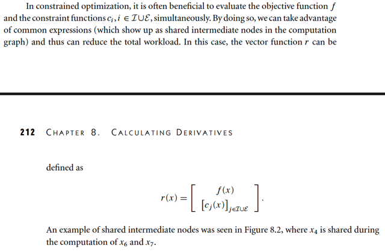</kbd>

> [!NOTE]
> QUAY LẠI SAU

 

- **Tính Jacobian Forward Mode**

<kbd>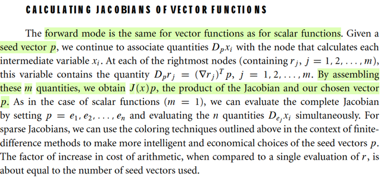</kbd>

> [!NOTE]
> Là vầy nè: với f(x) lúc này là R^n → R^m function, thì đạo hàm của
> f đối với x trở thành một matrix gọi là Jacobian (cái này thì từ MIT 1802
> đã biết rồi), và hàng thứ i của J(x) chính là vector [∂fi(x)/∂x1,.. ∂fi(x)/∂xn]
> và nó cũng chính là ∇fi(x).
>
> Với forward mode, ta còn nhớ, bằng cách truyền seed vector p = e1, forward
> sweep xong, ta sẽ có (f(x), Dpf(x) = ∇f(x)Te1, chính là ∂f(x)/∂x1) Và làm
> vậy với p = e2,..en ta sẽ có đủ gradient vector ∇f(x).
>
> Vậy thì, ở đây, start với seed p = e1, thì forward sweep sẽ cho ta ứng với
> mỗi một node cuối fi, ta sẽ có ∇fi(x)Te1 = ∂fi(x)/∂x1, tức là cái này đây:
>
> [∂f1(x)/∂x1, ∂f2(x)/∂x1, ...∂fm(x)/∂x1], và đây chính là CỘT 1 CỦA J(x).
>
> Tiếp tục với d = e2, forward sweep sẽ cho ta cột 2,... Cứ thế khi xong forward
> sweep với d = en ta sẽ có đủ J(x)
>
> Đó chính là dùng forward mode để tính J(x).
>
> Nếu Jacobian sparse thì ta sẽ làm cái vụ tô màu để gom các đầu ra không
> dậm chân nhau, đặng pass vào vector seed có số 1 ở những vị trí tương
> ứng của các đầu ra đó từ đó forward sweep một lần được nhiều cột
> của J cùng lúc (lúc nãy đã mô tả rồi)

> [!TIP]
> **🤖 AI Feedback** — ❌ Score: **55/100**
>
> Bài làm thể hiện sự nắm vững về cách tính từng cột của ma trận Jacobian bằng forward mode. Tuy nhiên, có sự nhầm lẫn về ý nghĩa của Dpf(x) đối với hàm vector và mô tả kỹ thuật tô màu cho Jacobian thưa trong forward mode còn chưa chính xác.

 

- **Reverse mode tính Jacobian**

<kbd>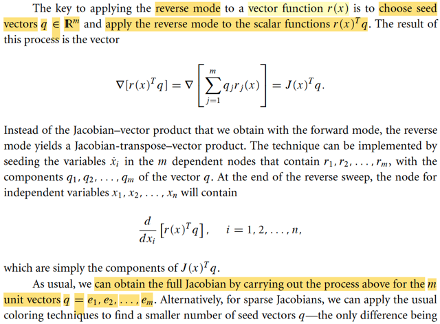</kbd>

> [!NOTE]
> Để áp dụng reverse mode trong việc tính Jacobian của hàm vector r(x) gs cho biết
> ta sẽ dùng một seed R^m vector q và áp dụng reverse mode đối với hàm scalar
> r(x)Tq. Và ta có công thức này.
>
> Là sao?
>
> Tức là xét hàm scalar g(x) = r(x)Tq, thì gradient của nó là gì:
>
> ∇g(x), cũng là d/dx g(x) = d/dx [r(x)Tq]
>
> = [d/dx r(x)]Tq
>
> = J(x)Tq.
>
> Hay viết như gs, ∇g(x) = ∇[r(x)Tq] = ∇[Σj rj(x)qj]
>
> Cũng là d/dx [Σj rj(x)qj]
>
> = Σj [d/dx rj(x)qj]
>
> = Σj [d/dx rj(x)]qj
>
> = Σj ∇rj(x)qj
>
> Và đây là linear combination các vector ∇r1(x), ∇r2(x) với hệ số q1,q2..
>
> nên gom các vector này thành các cột của matrix, thì nó chính là:
>
> [matrix]q, mà matrix này, có thể thấy chính là J(x)T (vì J(x) là matrix mà hàng i là
> vector đạo hàm riêng của ri(x) wrt x, tức là ∇ri(x))
>
> Kết quả cũng ra ∇[r(x)Tq] = J(x)Tq
>
> ====
>
> Ôn lại, với cách dùng reverse mode để tính gradient của hàm vector → scalar: Ta
> bắt đầu bằng việc gán các adjoint variable của các node = 0, trừ của node cuối là 1.
>
> Sau đó, quá trình backward sweep: đi ngược lại từ node cuối về, tại mỗi node trung
> gian, upstream gradient sẽ nhân với local gradient, để có downstream gradient.
> Nếu có nhiều nhánh đổ về một node trước đó thì gradient cũng cộng lại.
>
> Khi đến cái node input, ta sẽ có partial derivative của f đối với mỗi input. Cũng đồng
> nghĩa ta có ngay gradient vector.
>
> Vậy thì ở đây, với việc áp dụng reverse mode cho hàm r(x)Tq, nên sau khi reverse
> sweep, ta sẽ có gradient ∇[r(x)Tq], và như trên đã thấy, nó chính là J(x)Tq
>
> Và như vậy, bằng cách cho q = e1, ta sẽ có J(x)Te1, đây chính là lấy ra cột 1 của
> J(x)T, cũng là hàng 1 của J(x).
>
> Lần lượt làm vậy với q = e2, e3, ta sẽ lần lượt có hàng 2, hàng 3...của J để có đủ
> matrix J
>
> Nhưng một chú ý, là tuy nói là ta sẽ reverse sweep cái hàm r(x)Tq, nhưng kì thực
> không phải là ta vẽ thêm 1 node (bắt nguồn từ r1(x), r2(x)... để thành node cuối =
> r1q1 + r2q2..., để rồi reverse sweep bằng cách gán initial value = 1  cho node cuối
> này, và 0 cho các node còn lại. Không, ta sẽ ko làm vậy, thay vào đó, cứ dùng cái
> graph cũ (kết thúc với n node), và chỉ cần gán adjoint variable cho chúng bằng q1,
> q2,..qm (mấy node còn lại vẫn gán = 0) Và reverse sweep. Kết quả y chang.

 

- **AD nghịch đảo Jacobian thưa**

<kbd>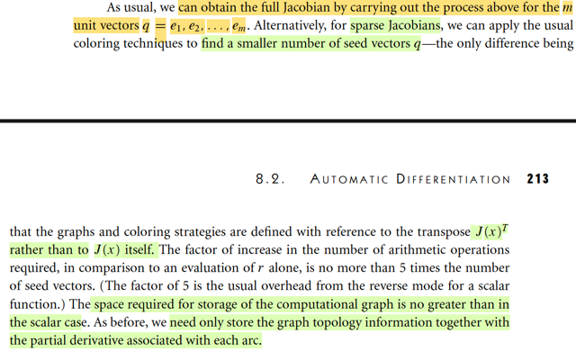</kbd>

> [!NOTE]
> Nếu Jacobian spares ta cũng làm cái trò tô màu để xác định các combo rj(x)
> nào không dẫm chân nhau (phụ thuộc các component khác nhau của x) (cái
> này giải thích nhiều rồi, đã hiểu rồi) khi đó, ta sẽ dùng seed vector, ví dụ
> combo r1(x1,x2), r3(x3,x4), r7(x5,x6), thì ta dùng q = e1 + e3 + e7.
>
> Gán qj vào các node (ý là initialize adjoint với q1,..qm) và reverse sweep. Đến
> cuối ta sẽ có một vector các partial derivative mà chứa thông tin của cả 3 hàng
> của J(x):
>
> [∂r1(x)/∂x1, ∂r1(x)/∂x2, ∂r3(x)/∂x3, ∂r3(x)/∂x4, ∂r7(x)/∂x5, ∂r7(x)/∂x6]
>
> Ta sẽ tách ra làm 3 hàng và điền 0 vào những vị trí còn lại như hồi nãy đã nói:
>
> [∂r1(x)/∂x1, 0,0,0,0] → đây là hàng 1 của J(x)
>
> [0, 0, ∂r1(x)/∂x3, ∂r1(x)/∂x4, 0,0] → đây là hàng 3 của J(x)
>
> [0,0,0,0, ∂r1(x)/∂x5, ∂r1(x)/∂x6] → đây là hàng 7 của J(x)
>
> -----
>
> Chú ý điểm này: Với forward mode, mỗi lần forward ta có một cột của J(x)
>
> Với reverse mode, mỗi lần ta có một hàng của J(x)

**🔗 See also:** [Gradient Hàm Phân Tách Tô Màu](#node-ooabjdi)

 

- **Forward mode tính J(x)p**

<kbd>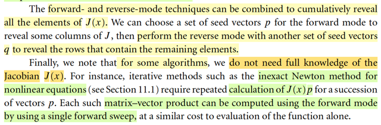</kbd>

> [!NOTE]
> Gs cho biết ta cũng có thể vừa forward mode vừa reverse mode cùng lúc:
>
> Chọn seed p (với trò tô màu) forward để ra một lần vài cột của J(x).
>
> Sau đó chọn seed q (cũng với trò tô màu) để reverse ra và hàng của J(x)
> sao cho nó fill hết những chỗ còn lại mà forward còn bỏ ngỏ. 
>
> (nói chung có thể hiểu được cái này)
>
> -----
>
> Còn đoạn cuối, đại khái là nhiều thuật toán ko yêu cầu ta phải có nguyên
> xi cái J(x), mà nhiều khi chỉ cần tính J(x)d nào đó.
>
> Vậy thì cách làm rất đơn giản: Áp dụng forward sweep với seed là p = d
> luôn thì kết quả cái ta có chính là J(x)d
>
> (ủa thì vì forward sweep, cái ta có ở mỗi node cuối là Dpri(x), tức ∇ri(x)Tp
>
> [∇r1(x)Tp, ∇r2(x)Tp, ...∇rm(x)Tp]
>
> chính là ∇r(x)p

 

- **Tính Hessian: Forward Mode**

<kbd>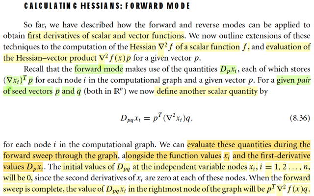</kbd>

> [!NOTE]
> Rồi, tới lượt dùng forward mode để tính Hessian ∇^2f(x) (của scalar function f)
> cũng như tính ra ∇^2f(x)p với vector p nào đó (vì có khi ta ko cần Hessian, mà
> cần product của Hessian với vector nào đó thôi)
>
> Tương tự như trong forward mode, bắt đầu với seed vector p, quá trình forward
> sweep, tại mỗi node xi, ta sẽ tính một cặp (xi, Dpxi (= ∇xi(x)Tp, tức directional
> derivative của hàm xi(x) wrt vector p. Còn nhớ ko: coi mỗi node xi là hàm của
> input x)
>
> Và khi kết thúc forward sweep ta sẽ có (f, Dpf = ∇f(x)Tp)
>
> Thế thì bây giờ, ta định nghĩa ra Dpqxi = pT ∇^2xi(x) q, để rồi khi forward, tại
> mỗi, node ta sẽ tính thêm cái này. Khi đó lúc kết thúc, ta sẽ có Dpq_f(x), tức pT
> ∇^2f(x) q
>
> (làm rõ tí: ∇^2xi(x) là cái gì? À, thì là như vừa nói, coi xi(x) là hàm vector →
> scalar x → xi thì ∇xi(x) là gradient vector, ∇^2xi(x) là Hessian matrix. Và pT
> ∇^2xi(x) q cũng là scalar)
>
> Và trước khi forward sweep ta cũng initialize chúng tại các node đầu (input) 
> bằng 0 
>
> (còn nhớ các Dpx1(x),..Dpxn(x) thì initialize = pi)

 

- **Quy tắc cộng Dpxi Dpqxi**

<kbd>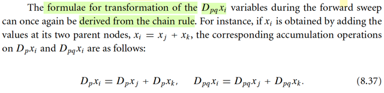</kbd>

> [!NOTE]
> Rồi, tương tự, như forward mode khi tính gradient, ta sẽ define các rule để 
> tính Dpxi(x) khi forward sweep.
>
> Thì nay ta cũng define các rule để tính Dpqxi(x) khi forward sweep.
>
> Cụ thể nếu xi = xj + xk
>
> thì d/dx xi(x) = d/dx xj(x) + d/dx xk(x) ⇔ ∇xi(x) = ∇xj(x) + ∇xk(x) (1)
>
> ⇔ ∇xi(x)Tp = ∇xj(x)Tp + ∇xk(x)Tp
>
> ⇔ Dpxi(x) = Dpxj(x) + Dpxk(x) 
>
> (này là cái rule để tính Dpxi khi xi = xj + xk, bữa trước biết rồi)
>
> Nhưng này, từ (1) ta có:
>
> d/dx ∇xi(x) = d/dx ∇xj(x) + d/dx ∇xk(x) 
>
> và đây chính là:
>
> ∇^2xi(x) = ∇^2xj(x) + ∇^2xk(x) 
>
> ⇔ pT∇^2xi(x)q = pT[∇^2xj(x) + ∇^2xk(x)]q
>
> ⇔ pT∇^2xi(x)q = pT∇^2xj(x)q + pT∇^2xk(x)q
>
> Đây chính là Dpq xi(x) = Dpq xj(x) + Dpq xk(x)
>
> ta có rule để tính Dpq xi khi xi = xj + xk

 

- **Đạo hàm biến đổi đơn vị**

<kbd>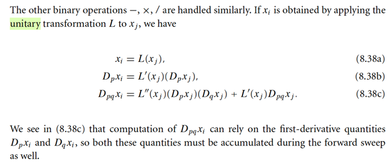</kbd>

> [!NOTE]
> Rồi, thế còn rule cho các unitaru transformation (tức là apply cái hàm nào  với
> input chỉ là một mình cái node đó thôi, ko phải combine các node  với nhau): xi(x)
> = L(xj(x))
>
> ⇔ d/dx xi(x) = d/dx L(xj(x))
>
> vế phải, chain rule = d/d[xj(x)] L(xj(x)) . d/dx xj(x) = L'(xj(x)) . ∇xj(x)
>
> Vậy d/dx xi(x) = ∇xi(x) = L'(xj(x)) . ∇xj(x) (1)
>
> ⇔ ∇xi(x)Tp = [L'(xj(x)) . ∇xj(x)]Tp
>
> (L(.) là unary, tức là scalar → scalar function nên đạo hàm cấp 1,2 đều là là
> scalar)
>
> ⇔ ∇xi(x)Tp = L'(xj(x)) ∇xj(x)Tp
>
> ⇔ Dpxi(x) = L'(xj(x)) Dpxj(x) → 8.38b
>
> Từ (1), đạo hàm theo x lần nữa:
>
> d/dx ∇xi(x) = d/dx [L'(xj(x)) . ∇xj(x)]
>
> Vế phải dùng product rule:
>
> ⇔ ∇^2xi(x) = [d/dx L'(xj(x))] ∇xj(x)T + L'(xj(x)) [d/dx ∇xj(x)]
>
> Chú ý: vì vế trái là matrix Hessian, nên vế phải cũng phải là tổng hai matrix,
> do đó term đầu tiên phải là [d/dx L'(xj(x))] ∇xj(x)T (có transpose ∇xj(x)), vì
> khi đó ta mới có outer product của hai vector thì mới có matrix)
>
> Còn cái term thứ hai thì (d/dx ∇xj(x)) đã là matrix rồi. 
>
> ⇔ ∇^2xi(x) = [d/dxi(x) L'(xj(x)) . d/dx xj(x)] ∇xj(x)T + L'(xj(x)) [∇^2xj(x)]
>
> ⇔ ∇^2xi(x) = L''(xj(x)) . ∇xj(x) ∇xj(x)T + L'(xj(x)) ∇^2xj(x)
>
> ⇔ pT∇^2xi(x)q = pT { L''(xj(x)) ∇xj(x) ∇xj(x)T + L'(xj(x)) ∇^2xj(x) } q
>
> ⇔ Dpqxi(x) = pT { L''(xj(x)) . ∇xj(x) ∇xj(x)T} q + pT { L'(xj(x)) ∇^2xj(x) } q
>
> ⇔ Dpqxi(x) = L''(xj(x)) pT [∇xj(x) ∇xj(x)T] q +  L'(xj(x)) pT ∇^2xj(x) q
>
> ⇔ Dpqxi(x) = L''(xj(x)) Dpxj(x) Dqxj(x) +  L'(xj(x)) Dpqxj(x) → 8.38c

 

- **Tính Hessian Forward Mode**

<kbd>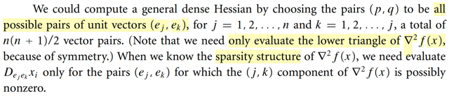</kbd>

> [!NOTE]
> Như vậy tính Hessian bằng forward mode thế nào?
>
> Vì như đã nói, ta sẽ đưa vào thêm seed vector q, để mỗi note, giờ đây ta sẽ
> tính một bộ ba (xi, Dpxi = ∇xi(x)Tp, Dqpxi = pT∇^2xi(x)q)
>
> thì khi đến node cuối ta sẽ có qT∇^2f(x)p.
>
> Thế thì nếu q = e1, p = e2 ta sẽ có e1T∇^2f(x)e2, và cái này là gì?
>
> Phân tích: ∇^2f(x)e2, theo MIT 18.06, góc nhìn nhân matrix vector là linear
> combination các cột của ∇^2f(x) với hệ số là các component của e2. Nên
> cái này chính là lấy ra cột 2 của ∇^2f(x). Tiếp, e1T[∇^2f(x)e2], thì chính là 
> lấy ra phần tử thứ 1 của cái [cột 2 của ∇^2f(x)] nói trên. Kết qủa là ∇^2f(x)_12
>
> Do đó, bằng cách forward mode với lần lượt các cặp ei, ej thì ta sẽ có các
> entry ij của Hessian.
>
> Nhưng vì tính đối xứng (symmetric) của Hessian, nên ta ko cần seed (e1,e2)
> rồi lại (e2,e1), mà chỉ cần (e1,e2) để có ∇^2f(x)_12 thì nó cũng chính là
> ∇^2f(x)_21.
>
> Do đó mới nói chỉ lấy ei, ej với i = 1,2...n và j = 1,2...,i.
>
> Vậy là chỉ tốn 1 + 2 + 3 + ...n = n(n+1)/2
>
> (là sao: vầy nè: i = 1, thì j = 1, i = 2, j = (1,2), i = 3, j = (1,2,3),....Nên số cặp 
> seed mà ta sẽ dùng là 1 + 2 + ...,)
>
> ------
>
> Và cuối cùng, nếu Hessian thưa, thì gs nói ta có thể có cách để xác định xem
> ông nào trong Hessian là khác ko để mà chuẩn bị bộ seed tương ứng để
> tính, để chi, để khỏi phải đưa seed vào, forward sweep để hóa ra kết quả = 0
> làm gì cho phí. (việc xác định như thế nào thì có lẽ có cách)

 

- **Chi phí Hessian Forward Mode**

<kbd>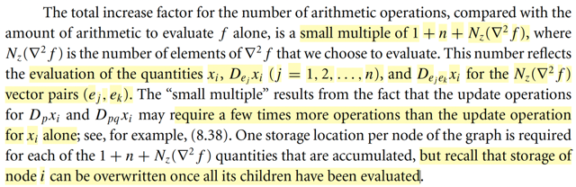</kbd>

> [!NOTE]
> Rồi, phần này gs Nocedal tổng kết lại chi phí của việc tính Hessian bằng
> forward mode.
>
> Ôn nhanh: Bằng cách với mỗi node, trong forward mode, ta tính thêm
> Dpqxi = pT ∇^2xi(x) q, thì tại cuối graph ta sẽ có Dpqf = pT∇^2f(x)q.
> Để rồi nếu p = ei, q = ej thì Dpqf sẽ cho ta ∇^2f(x)_ij, là phần tử ij của
> Hessian.
>
> Và để tính đủ Hessian, nhờ tính chất đối xứng, ta sẽ chỉ tính n(n+1)/2
> vị trí, ứng với việc forward sweep với các cặp seed p = ei, q = ej với
> i = 1,2....n và j = 1,2,...i. Nhưng có thể ít hơn nếu Hessian thưa (tức số
> non-zero entries của Hessian.
>
> Do đó ta sẽ cần tính các node xi, Dejxi với j = 1,2,....và Deiejxi
>
> Với mỗi node, ta sẽ tính phép tính để có xi, n phép tính để Dejxi với j = 1,2..
> và Nz(∇^2f) (là số non-zero entries của Hessian) phép tính để có Deiejxi
>
> Và mỗi phép tính có thể tốn thực tế vài lần phép tính đơn.
>
> Thành ra người ta mới áng chừng tổng số phép tính nó sẽ à một factor
> của (1 + n + Nz(∇^2f)) số phép tính cần thiết của việc evaluate function

 

- **Tích Hessian-vector Chế độ Tiến**

<kbd>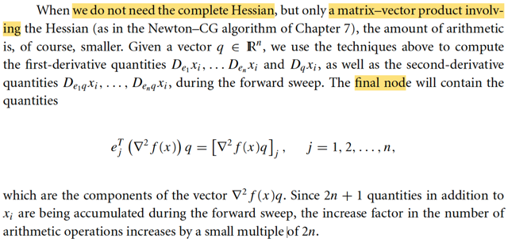</kbd>

> [!NOTE]
> Đại khái là có khi ta ko cần tính ra explicitly matrix Hessian, mà thật ra chỉ
> cần tính Hessian nhân với vector q nào đó. Khi đó ta có thể dùng forward
> mode để tính với các cặp seed p = ei và q, với i = 1,2,...n. Khi đó, tại node
> cuối ta sẽ lần lượt có e1T∇^2f(x)q, e2T∇^2f(x)q,..... Chính là các component
> của vector ∇^2f(x)q.
>
> Mình nên hiểu ko phải ta tính tuần tự từng cặp seed. Ví dụ để có Hessian,
> ko phải là ta sẽ chạy lần lượt forward sweep n(n+1)/2 lần, mỗi lần với một
> cặp seed p = ei, q = ej. Mà ta sẽ dùng vectorization, để đưa vào một matrix
> P, và Q, để cùng lúc tính ra, trong một lần. nhưng về chi phí, thì cứ coi như
> tính lần lượt cũng được.

 

- **Hessian Forward Mode Hàm Đơn Biến**

<kbd>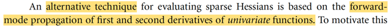</kbd>

<kbd>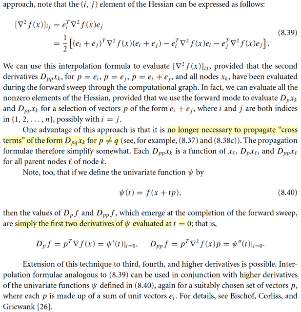</kbd>

> [!NOTE]
> Hiểu đoạn này một cách đại khái như sau. Bữa giờ khi nói về việc dùng
> forward mode để tính Hessian, ta đã hiểu là, với mỗi node, ta sẽ tính thêm
> Dpqxi(x) = pT ∇^2xi(x) q, để nếu p = ei, q= ej thì tại node cuối ta sẽ có
> eiT ∇f(x) ej chính là Hessian_ij.
>
> Vấn đề là xét Hessian_ij, thì công thức 8.39 cho thấy nó có thể được
> tạo ra từ các pT∇^2f(x)p với p = ei, ej và (ei + ej).
>
> Dẫn đến ta có thể không cần phải forward mode với cặp seed p, q 
> như lúc đầu nói. Mà chỉ cần dùng một seed p để rồi chỉ cần forward 
> sweep với p = ei, ej và (ei + ej) thì ta vẫn có thể tính ra Hessian_ij.
>
> Thêm nữa, nếu định ra hàm đơn biến Φ(t) = f(t + tp) là hàm f restrict theo
> direction t, thì ta sẽ có Dpf (=∇fTp) chính là Φ'(t)|t=0 và Dppf =(pT∇^2fp)
> chính là Φ''(t)|t=0.
>
> Nói chung tác dụng là giúp có thể thiết kế ra cách dùng forward mode
> để tính Hessian ít tốn kém hơn thông thường.

 

- **Hessian Vector Chế độ ngược**

<kbd>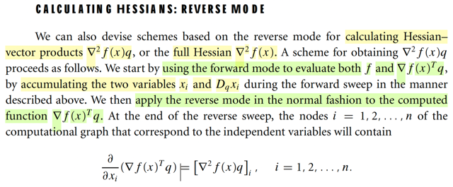</kbd>

> [!NOTE]
> Tiếp theo là cách tính Hessian bằng reverse mode.
>
> Đầu tiên phải nhận ra, giả sử ta cần tính [Hessian nhân vector q: ∇^2f(x)q]
> (như đã biết, nhiều thuật toán ta không cần Hessian ∇^2f(x) mà cần ∇^2f(x)
> nhân với vector q nào đó), thì nó chính là gradient của ∇f(x)Tq. Vì sao?
>
> Xét hàm g(x) = ∇f(x)Tq, đây là vector → scalar function.
>
> d/dx [∇f(x)Tq] = d/dx [Σi (∂f(x)/∂xi)*qi]
>
> = Σi d/dx [(∂f(x)/∂xi) qi]
>
> = Σi { [d/dx ∂f(x)/∂xi] qi}
>
> = Σi { [d/dx ∂f(x)/∂xi] qi}
>
> Xét d/dx ∂f(x)/∂x1.
>
> ∂f(x)/∂x1 là vector → scalar function, nhận vào x, trả ra ∂/∂x1 f(x)
>
> nên d/dx [∂f(x)/∂x1] là gradient vector:
>
> [∂[∂f(x)/∂x1]/∂x1 ,  ∂[∂f(x)/∂x1]/∂x2, ...]
>
> = [∂^2f(x)/∂x1^2 ,  ∂^2f(x)/∂x1x2, ∂^2f(x)/∂x1x3...]
>
> Đây chính là hàng thứ 1 của Hessian, hay cột thứ nhất cũng được vì Hessian
> đối xứng
>
> Tương tự như vậy với i = 2, ta có cột thứ 2 của Hessian.
>
> Do đó  Σi { [d/dx ∂f(x)/∂xi] qi} chính là linear combination các cột thứ i của
> Hessian với  phần tử qi. Do đó đây chính là ∇^2f(x)q
>
> -------
>
> Như vậy bài toán đi tìm ∇^2f(x)q chỉ là bài toán tìm gradient của hàm g(x) =
> ∇f(x)Tq
>
> Mà để tìm gradient của vector → scalar function, mình đã học cách làm
> reverse mode như sau:
>
> Initial mọi node với adjoint variable = 0, trừ node cuối = 1.
>
> Quá trình reverse sweep sẽ làm như sau: qua mỗi node, downstream
> gradient = upstream gradient * local gradient.
>
> và các gradient của các nhánh con sẽ dồn lại để đổ về.
>
> kết quả là khi xong, tại các node đầu nguồn (input node) ta sẽ có đồng loạt
> mọi partial derivative ∂f(x)/∂xi, làm thành gradient vector
>
> -----
>
> Vấn đề là, với reverse mode để tính gradient f(x) thông thường, thì ta
> chỉ việc làm như trên. Nhưng cái ta đang cần làm là gradient của ∇f(x)Tq.
> Và đây cũng chính là Dqf(x).
>
> Do đó, trước khi chạy reverse mode, ta cần forward mode: bắt đầu với seed
> p = q. Quá trình forward sweep của forward mode thì như đã biết, tại mỗi
> node nó sẽ tính một cặp (xi, Dpxi(x) = Dqxi(x)). để tại node cuối, ta sẽ có
> (f, Dqf(x)) và đây chính cũng chính là lúc trong máy tính đã xây được
> một graph tính toán cho Dqf(x), chính là ∇f(x)Tq mà ta cần.
>
> Từ đó ta sẽ reverse mode.
>
> Nói cách khác, việc forward mode sẽ giúp xây dựng computational graph
> cho hàm g(x) = ∇f(x)Tq, để dùng khi reverse mode.
>
> Và quá trình reverse mode xong, như đã nói, sẽ cho ta đồng loạt 
> các partial derivative ∂/∂xi[∇f(x)Tq], chính là các component của ∇^2f(x)q

 

- **Tính toán ma trận Hessian**

<kbd>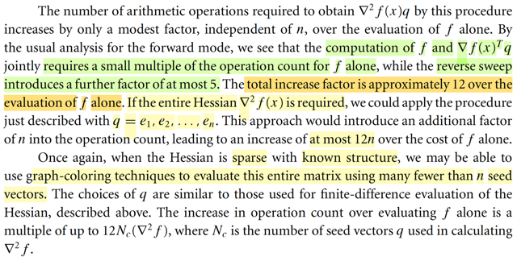</kbd>

> [!NOTE]
> Còn nếu muốn có bản thân Hessian ∇^2f(x) không thôi? Thì ta sẽ làm cái vụ
> forward-backward mode với q = e1, e2,....en. Vì sao?
>
> Thì như note trước vừa nói, kết thúc reverse sweep, tại các input node, ta
> sẽ có các các partial derivative ∂/∂xi[∇f(x)Tq], chính là các component của 
> [∇^2f(x)q]
>
> Vậy thì nếu q là e1, thì ta sẽ có ∇^2f(x)e1, mà đây chính là cột 1 của ∇^2f(x)
>
> chạy lần lượt với e2,...en ta sẽ có cột 2, ..cột n của Hessian.
>
> ------
>
> nói về chi phí tính toán, đại khái là gs nói rằng để tính ∇^2f(x)q thì số phép
> tính chỉ gấp (factor) cỡ 12 lần số phép tính cần thiết của việc tính f(x).
>
> Nhưng nếu tính Hessian, thì vì ta phải làm n lần với q = e1,...en nên số
> chi phí sẽ đội lên thành 12n lần.
>
> -----
>
> Cuối cùng, nếu Hessian thưa và có cấu trúc đã biết, ta sẽ có thể dùng
> kĩ thuật tô màu bữa trước để giảm chi phí tính toán xuống

 

- **Giới hạn vi phân tự động**

<kbd>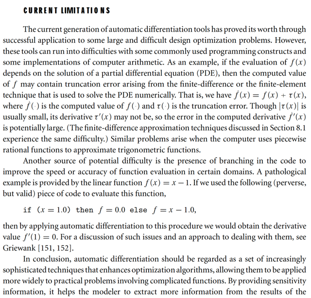</kbd>

> [!NOTE]
> Vài hạn chế, quay lại sau

 

