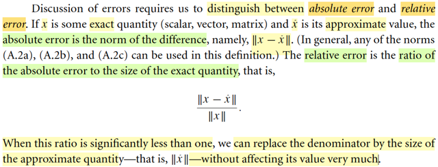
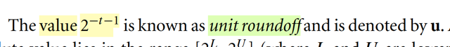
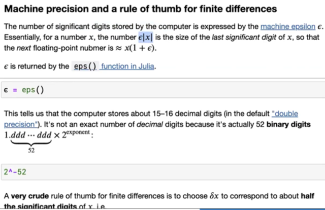
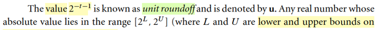
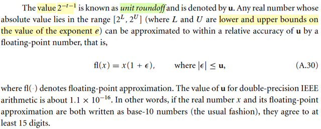
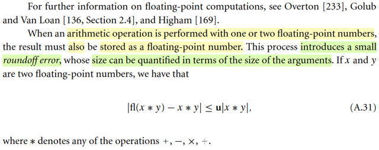
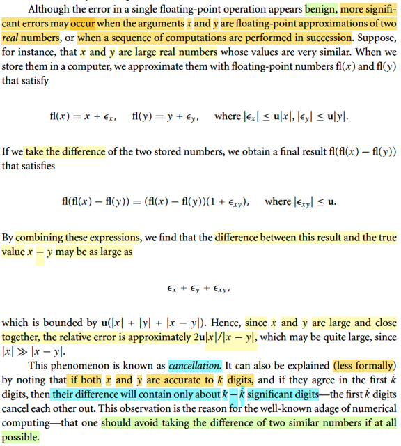

# A.1 Error Analysis & Floating-Point Arithmetic

📊 **Progress:** `8` Notes | `10` Screenshots

---

 

## Phân tích sai số dấu phẩy động

<kbd></kbd>

<kbd></kbd>

> [!NOTE]
> Đại ý các algorithm và analysis trong sách này hầu hết đều deal với số thực
> Tuy nhiên thực tế máy tính, nó không tính toán với số thực, mà thật ra tính 
> toán với một một tạp con của R gọi là floating-point numbers.
>
> Mọi con số lưu trữ trên máy tính đều được xấp xỉ bởi một floating point
> number.
>
> Và ta sẽ cố gắng thực hiện các phép tính sao cho sai số là nhỏ nhất.
>
> Nói về ý này, trong CS50 mình đã được học rằng, máy tính lưu trữ thông ở
> dạng nhị phân.
>
> Ví dụ với integer, máy tính assign 4 bytes, tương đương 4*8 = 32 bits.
>
> Nói một cách đơn giản nhất, với 8 bit, mỗi bit mang một trong hai giá trị
> binary: 0 hoặc 1 thì 1 byte = 8 bits ta có thể thể hiện tổng cộng là 256 chuỗi
> nhị phân khác nhau: ứng với các số thập phân từ 0 (=0*2^0 + 0*2^1 + .._0*2^7)
> tới 255 (=1*2^0 + 1*2^1 + ...1*2^7).
>
> Với 4 bytes thì con số này mở rộng lên lớn hơn. Nên đại ý là với số nguyên
> máy tính có thể lưu con số lớn nhất là 1*2^0 + 1*2^1 + ...+ 1*2^31.
>
> Còn với số thập phân, khi khai báo loại float hoặc double. Thì máy sẽ gán
> cho 8 bytes (32 bits) hoặc 16 bytes (64 bits)
>
> Thì loại này nó có cái kiểu là, ta sẽ dùng 1 bit để biểu hiện dấu (âm / dương)
> vài bit cho số mũ,...đại khái là vậy.

 

### Sai số tuyệt đối và tương đối

<kbd></kbd>

> [!NOTE]
> Đoạn này gs yêu cầu ta phân biệt giữa sai số tuyệt đối và tương đối. Nếu
> x, x^ là giá trị chính xác và giá trị xấp xỉ, với x là scalar, vector hay matrix
> thì sai số tuyệt đối được định nghĩa là norm của x - x^: ||x - x^||
>
> Còn sai số tương đối là tỉ số của cái này với norm x:
>
> ||x - x^|| / ||x||
>
> Và khi sai số tương đổi nhỏ hơn 1 nhiều thì có thể thay mẫu số bởi ||x^||

 

#### Biểu diễn số thực double

<kbd></kbd>

> [!NOTE]
> Phần này đại khái là gs nhắc lại một kiến thức trong cs, là về cái gọi là double precision arithmetic.
>
> Double, hay double precision có cái tên như vậy là vì trong lịch sử, lúc đầu người ta nghĩ ra cơ chế floating point để
> lưu số thập phân. Và dùng 4 bytes tức 32 bits để lưu trữ. Sau đó, người ta tăng gấp đôi lên, dành 64 bits (8 bytes) để
> lưu. Và do đó trong C, java ta có thể khai báo float hay double để lưu số thập phân (int là cho interger, 4 bytes, long thì
> lưu số lớn hơn, được 8 bytes)
>
> Trong cs50 mình đã biết việc máy tính lưu thông tin ở dạng binary thế nào rồi, nãy đã ôn lại.
>
> Thế thì với số double, với 64 bits, đại khái quy trình lưu một số vào ram sẽ diễn ra như sau:
>
> Cho một số thực thập phân, [phần nguyên].[phần thập phân], yêu cầu lưu vào máy tính 64 bit
>
> Đầu tiên nói trước, 64 bits để lưu, thì 52 bit (MANTISSA) để lưu thông tin về giá trị của số (ví dụ số -12.345 thì 
> 52 bit để lưu thông tin cho biết con số sẽ là 12345, 11 bits (EXPONENT) để lưu thông tin về vị trí dấu phẩy, để
> biết con số ban đầu là 12.345, và 1 bit (SIGN) để lưu thông tin là số ban đầu là âm: -12.345)
>
> 1) Chuyển phần nguyên thành chuỗi binary: 
>
> Theo quy tắc như đã biết trong cs59, ta sẽ xây dựng chuỗi binary sao cho trọng số 2^i với số mũ i 
> tăng từ 0 → lên dương khi đi từ phải qua trái. 
>
> 2) Chuyển phần thập phân thành chuỗi binary: Tương tự số mũ từ -1 → âm khi đi từ trái qua phải.
>
> 3) Dời dấu phẩy:
>
> + Theo chuẩn IEEE: Dời cho đến khi đứng trước dấu phẩy là số 1: có dạng 1.d1d2....d52 
>
> (d1...d52 chính là sẽ được vào 52 bit của MANTISSA)
>
> Ví dụ:
>
> Nếu đang có dạng 1.110 thì khỏi dời, e = 0, d1d2..d52 = 11[--50 số 0--]
>
> Nếu là 0.0101 thì dời qua phải thành 1.01, tính e = -2, d1d2..d52 = 01[--50 số 0--]
>
> Nếu đang là 100.001 thì dời qua trái thành 1.00001, tính e = 2, d1d2..d52 = 00001[--47 số 0--]
>
> + Theo Nocedal: Dời cho khi có dạng 0.1d1d2...d52 (và ta cũng sẽ lưu d1...d52 vào ram)
>
> Ví dụ trên:
>
> Nếu đang có dạng 1.110 → dời thành 0.1110, e = 1, d1d2..d52 = 11[-50 số 0--], ⇨ vào ram là chuỗi 11[--50 số 0--] y
> như theo IEEE
>
> Nếu là 0.0101 → dời thành 0.101, e = -1, d1d2...d52 = 01[--50 số 0--] ⇨ lưu vào ram cũng là chuỗi 01[--50 số 0--] y
> như IEEE
>
> Nếu đang là 100.001 → dời thành 0.100001, e = 3, d1d2..d52 = 00001[--47 số 0--] ⇨ lưu vào ram cũng là chuỗi
> 00001[--47 số 0--] y như IEEE
>
> Có thể thấy, dù theo cái nào thì thực chất là như nhau, đều lưu chuỗi d1..d52 vào ram. Chỉ khác là số e, là số sẽ quy
> định vị trí của dấu phẩy ban đầu, nếu dời kiểu nào thì tí nữa dùng công thức tương ứng để mà tính ra lại.
>
> Và dĩ nhiên thông tin của e cũng sẽ phải lưu ở dạng nhị phân, chính là 11 bits của exponent part
>
> 11 bit cho số e: Đầu tiên đem cộng 1023 rồi chuyển thành binary, và lưu vào 11 bit của phần exponent
>
> Mục đích của việc này là để khỏi phải lưu dấu của exponent. Lí do đại khái là vì, phần exponent được cho 11 bits. Với
> 11 bits, thì nó có thể lưu được con số lớn nhất là 2^11-1 = 2, 047 (giống như  với 1 byte = 8 bits thì con số lớn nhất có
> thể lưu là 255 = 2^8-1),
>
> đồng nghĩa là với 11 bits, ta có thể biểu diễn 2^11 con số, gồm 0, 1, 2, ...2047.
>
> Nhưng phải chia làm đôi để cho số âm nữa, nên đại khái là ta sẽ dùng 11 bits này để biểu diễn 1023 con số âm và
> 1023 con số dương
>
> tức là được lngười ta sẽ làm như sau: Lấy 2048 / 2 - 1 = 1,023. Dùng nó làm cái mốc cứng.
>
> Để rồi với một số e đã tính, trước khi chuyển thành binary để lưu vào phần exponent, nó sẽ + cho 1023, khiến cho dù
> e có thể là âm (mà giá trị (âm) lớn nhất có thể có là -1023, thì sau khi cộng 1023 thì sẽ thành không âm:
>
> con số âm bé nhất: -1023 sẽ thành 0
>
> -1022 sẽ thành 1
>
> -1 sẽ thành 1022
>
> 0 sẽ thành 1023
>
> 1 sẽ thành 1024
>
> 1023 sẽ thành 2046
>
> Và như vậy máy tính sẽ lưu số e gốc (sau khi tính toán ở bước trên) như sau:
>
> e = -1022, chuyển thành 1, dịch sang binary, và lưu chuỗi 11 bit này: 0000..001
>
> e = 0, chuyển thành 1023, lưu chuỗi 11 bit ứng với số 1023
>
> e = 1023, chuyển thành 2046 và lưu chuỗi 11 bit ứng với 2046.
>
> Khi dịch ngược lại từ ram sang số thực, nó sẽ chuyển thành thập phân và trừ đi 1023 để có lại e.
>
> Nhưng như vậy sẽ còn thừa 2 vị trí (11 bits, như đã nói, có thể represent số từ 0 → 2047 cơ mà trong khi như trên chỉ
> mới xài các con số 1,2,..2046, chưa xài số 0, và 2047:
>
> Có nghĩa là ta còn một chuỗi 11 bits toàn 0: 00....0, một chuỗi 11 bits toàn 1: 11...11.
>
> Thì người ta dùng nó để biểu diễn số 0 tuyệt đối và số vô cực.
>
> Vậy tới đây, bắt đầu lưu data:
>
> 1 bit cho dấu: 0 là dương, 1 là âm
>
> Cho chuỗi d1d2...d52 ở trên vào 52, như đã thấy, dù dịch dấu phẩy theo kiểu nào thì chuỗi này cũng giống nhau
>
> Cho chuỗi binary của e vào 11 bits 
>
> ------
>
> Ok, vậy khi dịch lại từ ram ra số thực:
>
> Trước khi qua phần "dịch lại": Chú ý, vì cách tính e khác nhau, nên giá trị lưu vào máy tính sẽ khác nhau tùy theo
> chuẩn nào (tất nhiên, trong thực tế, ta sẽ chỉ làm theo chuẩn IEEE, nhưng vì ở đây đang nói về cả hai chuẩn, nên phải
> ghi rõ là GIÁ TRỊ e SẼ KHÁC NHAU, chỉ chuỗi d1d2..d52 thì đều giống. Và vì sự khác nhau của e, nên tí nữa khi qua
> phần "dịch ra lại" ta sẽ hiểu vì sao nó sẽ ra cùng kết qủa số thực cuối cùng.
>
> i) Lấy giá trị 1 bit của sign, xem nó là 0 hay 1, để biết dấu
>
> ii) Lấy chuỗi binary của 11 bits của exponent, chuyển thành số thập phân. Đem trừ đi 1023 để ra giá trị e_real (trước
> khi + bias 1023)
>
> Cùng với chuỗi binary d1d2...d52 của 52 bit, ta sẽ ráp vào công thức nào dưới đây cũng được:
>
> Theo chuẩn IEEE: 
>
> Công thức sẽ là: 
>
> 1 + [lôi cái chuỗi sau dấy-phẩy-đã-dịch-chuyển theo IEEE ra tính với các trọng số 2^-1, 2^-2..., * 2^e_ieee
>
> Và vì chuẩn IEEE chuyển dấu phẩy để có 1.d1d2..d52, nên chuỗi-sau-dấu-phẩy-đã-dịch chuyển là d1d2..d52: 
>
> (1 + d1*2^-1 + d2*2^-2 + ...d52*2^-52) 2^e_ieee, 
>
> Viết gọn: (1 + Σi=1:52 di*2^-i) * 2^e_ieee 
>
> (e này là e được dịch chuyển dấu phẩy theo lối IEEE, ta viết là e_ieee)
>
> Theo Nocedal:  
>
> Công thức là: 
>
> [lôi cái chuỗi sau dấy phẩy đã dịch chuyển theo IEEE ra tính với các trọng số 2^-1, 2^-2...,] * 2^e_nocedal
>
> Nhưng vì chuẩn Nocedal chuyển dấu phẩy thành 0.1d1d2...d52 chuỗi-sau-dấu-phẩy-đã-dịch-chuyển sẽ là 1d1..d52 nên:
>
> (1*2^-1 + d1^2^-2 + d2*2^-3 + ...+ d52*2^-53) * 2^e
>
> Viết gọn: (1*2^-1 + Σi=1:52 di*2^(-i-1)) * 2^e_nocedal
>
> Nhắc lại, trong cả hai case, d1d2...mới là thứ lưu trong ram. Nếu gọi f1f2...f53 = 1d1d2..d52 thì cái công thức trên
> sẽ thành (Σi=1:53 fi*2^-i) * 2^e, và công thức này MỚI LÀ CÁI CÔNG THỨC TRONG SÁCH NOCEDAL
> VIẾT LÀ (Σi=1:t di*2^-i) * 2^e với chú thích fractional part là .d1d2...dt
>
> (Nhắc lại, giá trị của e sẽ khác nhau ở hai công thức trên, e_nocedal = e_ieee + 1)
>
> Biến đổi chút ta sẽ thấy thật ra nó giống nhau thôi:
>
> (1*2^-1 + Σi=1:52 di*2^(-i-1)) * 2^e_nocedal
>
> = (1*2^-1 + Σi=1:52 di*2^(-i-1)) * 2^(e_ieee + 1)
>
> = (1*2^-1 + Σi=1:52 di*2^(-i-1)) * 2^e_ieee * 2^1
>
> = (1*2^0 + Σi=1:52 di*2^-i) * 2^e_ieee 
>
> = (1 + Σi=1:52 di*2^-i) * 2^e_ieee → y như công thức trên
>
> -----
>
> Câu hỏi 2: Vì sao công thức dịch ngược ra, lại có dạng (...) * 2^e ?
>
> Vì tương tự như 142.3678 = 0.1423678 * 10^3 = 1*10^-1 + 4*10^-2 + 2*10^-3 + ..
>
> Thì chuỗi 1010.1001 = 0.10101001 * 2^4 = (1*2^-1 + 0*2^-2 +1*2^-3 + ..) * 2^3
>
> Và chỗ này phải hiểu vầy:
>
> Trong hệ thập phân, nhân 0.1423678 với 10^3 tức là NÓ LÀM ĐỘNG TÁC DỜI DẤU PHẨY SANG BÊN PHẢI
> 3 bước để có 142.3678
>
> Thì trong hệ nhị phân, nhân 0.10101001 với 2^4 cũng chính là NÓ LÀM ĐỘNG TÁC DỜI DẤU PHẨY SANG BÊN 
> PHẢI 4 bước, để có 1010.1001
>
> Nên khi ta thực hiện việc dời 142.3678 dấu phẩy sang bên trái để có dạng 0.1423678 theo kiểu nocedal, ví dụ, đã dời
> 3 bước, thì về bản chất ta đã làm số đó nhỏ đi 10^3 lần, do đó phải nhân với 10^3 để bù lại.
>
> Tương tự, khi dời 1010.1001 thành 0.10101001 thì ta đã làm cho nó nhỏ đi 2^4 lần, nên phải nhân với 2^4 để bù lại.
>
> Như vậy nếu ko làm theo nocedal mà chỉ làm theo IEEE, dời 1010.1001 thành 1.0101001, thì ta chỉ  đã dời 3 bước,
> làm cho nó nhỏ đi 2^3 lần. Do đó phải nhân thêm với chỉ 2^3 để bù lại.
>
> Vậy thì con số 1010.1001 thực chất là = 0.10101001 * 2^4 và cũng bằng 1.0101001 * 2^3 mà thôi.
>
> Và tính toán để chuyển nó ra số thập phân, cũng sẽ ra cùng kết qủa:
>
> 1010.1001 → 1*2^3 + 0*2^2 + 1*2^1 + 0*2^0 + 1*2^-1 + 0*2^-2 + 0*2^-3 + 1*2^-4 + 
>
> Nocedal
>
> 0.10101001 * 2^4  → (1*2^-1 + 0*2^-2 + 1*2^-3 + 0*2^-4 + 1*2^-5 +0*2^-6 + 0*2^-7 + 1*2^-8) * 2^4
>
> (đây cũng chính là (Σi=1:53 di*2^-i) 2^e)
>
> = 1*2^3 + 0*2^2 + 1*2^1 + 0*2^0 + 1*2^-1 +0*2^-2 + 0*2^-3 + 1*2^-4, cũng y kết quả trên
>
> "IEEE"
>
> 1.0101001 * 2^3 → (1*2^0 + 0*2^-1 + 1*2^-2 + 0*2^-3 + 1*2^-4 + 0*2^-5 + 0*2^-6 + 1*2^-7) * 2^3
>
> (đây cũng chính là (1 + Σi=1:52 di*2^-i) 2^e
>
> = 1*2^3 + 0*2^2 + 1*2^1 + 0*2^0 + 1*2^-1 + 0*2^-2 + 0*2^-3 + 1*2^-4

 

##### Sai số làm tròn đơn vị

<kbd></kbd>

<kbd></kbd>

> [!NOTE]
> Tiếp, ông nói 2^-t-1 chính là cái gọi là UNIT ROUND OFF. kí hiệu là u.
>
> Vì sao?
>
> Là như vầy:
>
> Như vừa biết cái "quy trình" mà máy tính sẽ lưu con số thực nào đó vào 64 bits  của ram.
>
> Chuyển phần nguyên, thập phân thành chuỗi binary. Dời dấu phẩy (theo chuẩn IEEE) để thành 1.
> d1d2.. d53. e là số bước dời, dương hay âm thì tùy qua trái hay qua phải. Lưu e vào 11 bits của
> phần exponent theo quy trình: +1023, chuyển thành binary. Lưu chuỗi binary của phần thập phân
> vào phần fractional (52 bits) Lưu dấu dương hay âm vào 1 bit còn lại.
>
> Ta biết ta chỉ có 52 bits của Mantissa để lưu cái chuỗi binary mang thông tin về giá trị của con
> số ban đầu (đây mới là phần quan trọng (11 bits của exponent chỉ cho biết dấu phẩy nó nằm
> đâu  mà thôi)
>
> Và không khó để hiểu rằng giả sử đối diện với một chuỗi binary trong Mantissa của con số x nào
> đó, bằng cách đổi cái đổi cái bit cuối cùng (thứ t = 52) từ 0 sang 1 (hay nếu đang 1 thì thành
> 0), thì ta sẽ có được một mức tăng (giảm) nhỏ nhất có thể mà máy tính lưu được. Gọi nó
> là x'
>
> Ý là, hay nói cách khác là, máy tính ko thể lưu chính xác những con số nào khác mà nằm giữa x
> và x', vì chúng đều cần thêm bit để thể hiện độ chính xác
>
> Ví dụ ta đang có số 10.1234567 giả sử chuỗi binary của fractional của nó là:
>
> d1d2d3d4d5d6.....d51[0], d52 = 0,
>
> thì cái số gần nó nhất mà máy tính lưu được là cái số mà chuỗi binary fractional  của nó là:
>
> d1d2d3d4d5d6.....d51[1] (d52 = 1), giả sử dịch ra thập phân là 10.1234568
>
> Thì bất kì cái số nào khác nằm giữa chúng để ko thể được thể hiện chính xác bởi máy tính,
> ví dụ 10.12345671xx..,10.12345672xx..,...10.12345679xx..., 
>
> Do đó, khoảng cách nhỏ nhất giữa hai số SẼ CHÍNH LÀ CÁI KHOẢNG TƯƠNG ỨNG VỚI VIỆC
> chuyển d52 từ 0 sang 1.
>
> Mà ta có x = [1 + Σi=1:52 2^-i] * 2^e, và giả sử d52 của x là 0
>
> thì x = [1 + Σi=1:51 2^-i + 0*2^-52] * 2^e
>
> Thì đổi d52 từ 0 sang 1 ta sẽ có x' gần với x nhất có thể được lưu mà ko bị làm tròn nói trên:
>
> x' = [1 + Σi=1:51 2^-i + 1*2^-52] * 2^e
>
> Khoảng cách giữa chúng, chính là con số (thep hệ 10) sau đây:
>
> [1 + Σi=1:51 2^-i + 1*2^-52] * 2^e - [1 + Σi=1:51 2^-i + 0*2^-52] * 2^e
>
> = 1*2^-52 * 2^e
>
> = 2^-52 * 2^e
>
> Tức là 2^-t * 2^e
>
> Vậy thì sai số LỚN NHẤT sẽ xảy ra khi máy tính cần thể hiện con số nào đó mà nó nằm ngay
> CHÍNH GIỮA hai số liền kề có thể lưu trên máy tính, vì đã nói bất kì con số nào nằm giữa đều
> ko thể thể hiện chính xác, cũng đồng nghĩa là phải làm tròn thành cái mốc gần nhất.
>
> Ví dụ, mọi thằng trong đám 10.12345671xx..,10.12345672xx..,...10.12345679xx... sẽ đều bị làm
> tròn thành 10.1234567 hoặc 10.1234568 (gần với ai hơn thì làm tròn về đó). Mà đã làm tròn thì
> có nghĩa là có sai số. Vậy dễ thấy thằng 10.1234567500... là sẽ có sai số lớn nhất, vì nó nằm
> chính giữa 10.1234567 và 10.1234568
>
> Do đó, độ lệch giữa nó và kết quả làm tròn sẽ chính là "nửa quãng đường unit này":
>
> [2^-t * 2^e] / 2 = [2^-t * 2^e] * 2^-1 = 2^-t-1 * 2^e
>
> Và đây là sai số tuyệt đối lớn nhất.
>
> Ta sẽ đi tính sai số tương đối lớn nhất (chính là u, unit roundoff)
>
> Theo định nghĩa, sai số tương đối sẽ bằng sai số tuyệt đối chia độ lớn của con số:
>
> Tức = |x - x^| / |x|,
>
> hay, nếu gọi fl(x) là con số mà máy sẽ lưu thì sai số tương đối sẽ là:
>
> |ε| = |fl(x) - x| / |x|
>
> Trong đó mình đã có sai số tuyệt đối lớn nhất, tức đã có |x - fl(x)| ≤ 2^-t-1 * 2^e
>
> để tìm sai số tương đối ứng với sai số tuyệt đối lớn nhất này, ta chỉ việc chia nó cho giá trị của x
> nhỏ nhất mà sai số tuyệt đối lớn nhất xảy ra.
>
> Thế thì chú ý, cứ mỗi số nào giữa hai số này:
>
> (1 + Σi=1:51 di * 2^-i + 0 * 2^-52) x 2^e và
>
> (1 + Σi=1:51 di * 2^-i + 1 * 2^-52) x 2^e
>
> Sẽ đều có sai số làm tròn tuyệt đối = sai số tuyệt đối lớn nhất, 2^-t-1 * 2^e
>
> Và dễ thấy con số nhỏ nhất đó chính là số mà chuỗi d1..d52 đều = 0:
>
> (1 + Σi=1:52 0 * 2^-i) x 2^e
>
> = 1 x 2^e = 2^e
>
> Vậy sai số tương đối lớn nhất, cũng là unit roundoff u = 2^-t-1 * 2^e  / 2^e = 2^-t-1
>
> Đó chính là u.
>
> ------
>
> Như vậy, ở trên mình cũng đã hiểu 2^-52 * 2^e là khoảng cách giữa số x và số liền kề x' mà máy tính
> có thể lưu chính xác. 
>
> Thế thì dĩ nhiên khoảng cách này, sẽ phụ thuộc x, vì nó có dính tới e, e ở đây dĩ nhiên gắn với x.
>
> Ví dụ x = 10.1234567, e (tính theo chuẩn IEEE) = 3. Ví chuỗi binary trước khi dịch dấu là:
>
> 1010.b1b2... (1010 là chuỗi binary của số 10: 0*2^0 + 1*2^1 + 0*2^2 + 1*2^3 = 10, và b1b2..là chuỗi 
> binary của 1234567). 
>
> Dịch dấu để có dạng 1.d1d2...d52 ⇨ e sẽ = 3, và d1d2..d52 chính là 010b1b2...
>
> Vậy, trong trường hợp này, khoảng cách nhỏ nhất là 2^-52 * 2^3
>
> Tức là x = 10.1234567 thì hàng xóm gần nhất của nó có thể thể hiện chính xác trên máy tính là:
>
> fl(10.1234567) +/- 2^-52 * 2^3
>
> Lí do phải có fl(..) vì bản thân con số 10.1234567 cũng có thể sẽ bị làm tròn, nên phải làm tròn trước
> rồi mới tính đến hàng xóm của nó.
>
> Khái quát, với x, có floating point fl(x) thì 
>
> con số floating point tiếp theo / kế cận nó chính là: fl(x) +/- 2*10^-52 * 2^e (I)
>
> -----
>
> Tuy nhiên, có thể lập luận tiếp như sau để cho ra công thức gần đúng:
>
> Ta biết x = [1 + Σi=1:52 di * 2^-i] * 2^e
>
> Và cái cục [1 + Σi=1:52 di * 2^-i] được gọi là Mantissa
>
> ⇨ x = Mantissa * 2^e
>
> , có thể thấy nó là con số có dạng:
>
> 1 + d1/2 + d2/4 + d3/8 + ...d52/2^52
>
> Nó sẽ luôn nằm trong range này: 1 ≤ Mantissa ≤ 1 + 1/2 + 1/4 + ...1/2^52 
>
> Và 1/2 + 1/4 + ...1/2^52 thì → 1 số < 1
>
> Do đó 1 ≤ Mantissa ≤ 2
>
> Do đó |x| = |Mantissa * 2^e| = |Mantissa| * 2^e ta có thể cho là nó ≈ 2^e vì Mantissa chỉ là
> con số từ 1 → 2 là cùng.
>
> Viết lại |x| ≈ 2^e 
>
> Do đó nếu x có floating point fl(x) thì có thể tính gần đúng floating point tiếp theo là:
>
> fl(x) +/- 2^-52 * |x| (II)
>
> Và đây chính là công thức mà thầy Alan viết trong bài giảng của MIT 18s096 mà mình đã học
> qua nhưng lúc đó chưa hiểu rõ.
>
> Trong đó, ông nói "for a number x, the number ε|x| is the size of the last significant digit of x, so that
> the next floating point number is ≈ x(1 + ε)" chính là ý nói:
>
> (Trong bối cảnh bài giảng của gs Allan thì ε chính là 2^-52)
>
> "number ε|x| is the size of the last significant digit of x": last significant digit ở đây đang nói tới
> chính là cái d52 của chuỗi Mantissa. Khi ta nhích cái d52 trong chuỗi binary Mantissa
> của x, thì mức thay đổi 
>
> (khi trong ngữ cảnh khác, ví dụ nói 15 first significant digit thì
> có thể phải hiểu là 15 chữ số đầu tiên của số gốc x) 
>
> "so that the next floating point number is ≈ x(1 + ε)"
>
> Nếu ta có số x, thì bằng cách đổi cái bit thứ 52 trong Mantissa của nó, ta sẽ có hàng xóm floating
> point gần nhất của nó sẽ ≈ x + x ε
>
> Là sao? Như đã hiểu, ở (I) ở trên nếu ta có x, thì next floating number của nó sẽ là fl(x) +/- 2^-52 2^e
>
> sau đó ở (II) ta tính gần đúng bằng fl(x) +/- 2^-52 * |x|
>
> Có điều, trong bối cảnh bài giảng của thầy Steve và Allan trong MIT 18s096, ông đang "khai
> báo biến x trong máy tính", tức là, mình sẽ tự hiểu x mang giá trị trong máy tính, chứ ko phải số thực
> tuyệt đối. Nói cách khác, ví dụ mình gõ x = 3.14123123 thì bản thân nó đã là fl(x) rồi.
>
> Nên công thức mà thầy ghi "next floating point number is ≈ x(1 + ε)" 
>
> thực chất chính là nói 
>
> "next floating point number fl(x) +/- 2^-52 * |x|"

 

###### Phạm vi số dấu phẩy động

<kbd></kbd>

> [!NOTE]
> Khi đã hiểu cái unit roundoff, thì cũng hiểu luôn khúc sau, như sau:
>
> Ôn lại nhanh về cách máy tính lưu số thực thập phân vào 64 bit:
>
> 1) Chuyển phần nguyên, phần thập phân thành chuỗi binary, theo quy luật: phần
> nguyên thì đi từ phải qua trái, số mũ tăng dần từ 0 phần thập phân thì đi từ trái qua
> phải, số mũ giảm dần từ -1.
>
> 2) Dời dấu phẩy: Theo chuẩn IEEE: qua phải / trái cho đến khi có dạng 1.xxxx  (ví dụ
> 101.01 → 1.0101, e = 2; 0.00101 → 1.01 e = -3). Tính e là số bước di chuyển (qua
> phải thì âm, qua trái thì dương).
>
> Theo Nocedal: Dời cho đến khi có dạng 0.1xxxx.
>
> (101.01 → 0.10101, e = 3; 0.00101 → 0.101 e = -2)
>
> Có nghĩa là theo e của Nocedal thì e của chuẩn IEEE + 1: e_nocedal = e_ieee + 1
>
> 3) Lưu e: Cộng nó cho 1023, chuyển thành binary, lưu vào 11 bits của exponent. Lưu
> fractional: Lưu chuỗi binary phần nguyên + thập phân vào 52 bit của fractional part
> (d1d2... d52). 1 bit còn lại lưu dấu (0 = dương, 1 = âm)
>
> Khi dịch ra lại:
>
> Dịch chuỗi binary của exponent thành thập phân, trừ đi 1023 để có e.
>
> Theo Nocedal: Tính (Σi=1:53 di*2^-i) * 2^e_nocedal
>
> Theo IEEE: Tính (1 + Σi=1:52 di*2^-i ) * 2^e_ieee
>
> Thực ra hai cái này là một mà thôi, như đã chứng minh ở note trước
>
> -----
>
> Như vậy, có thể thấy thế này, giả sử ta đối mặt với một con số B nào đó mà khi thực
> hiện bước + 1023 ta ra con số vượt qua 2047. Ví dụ e = 1025 đi, cộng 1023 = 2048.
> Lúc này, khi chuyển sang binary, nó cần 12 bits để thể hiện.
>
> Vì với 11 bits, ta đi từ :
>
> 0 (chuỗi 11 số 0)
>
> tới
>
> 2047 (chuỗi 11 con số 1) = 1*2^10 + 1*2^9 + ...+ 1*2^1 + 1*2^0 = 2047
>
> Để thể hiện được 2048, ta cần chuỗi 1[11 số 0]:
>
> vì khi đó 1*2^11 + Σi=10:0 0*2^i = 2^11 = 2048
>
> (Chú ý, với b bit, con số lớn nhất có thể chỉ là 2^n - 1 = Σi=n-1:0 2^i)
>
> Ví dụ với 8 bit:
>
> 0 = 00000000 = 0
>
> 1 = 00000001 = 1*2^0
>
> ..
>
> 255 = 11111111 = 1*2^7 + 1*2^6 + ...+ 1*2^0
>
> Nên con số lớn nhất với 8 bit là 2^8 - 1 = 255
>
> Để có 256 thì phải là 1 00000000 (2^8 + 0*2^7 + 0*2^6 + ... = 256)
>
> Như vậy, với 11 bit, thì máy tính ko đủ chỗ để lưu e (sau khi cộng 1023) = 2048 và nó
> sẽ báo lỗi.
>
> -----
>
> Tương tự, nếu con số e quá nhỏ, để khi + 1023, nó vẫn ra âm, ví dụ e = -1024, sau khi
> cộng 1023 ra -1. Thì -1 không thể biểu diễn bởi chuỗi 11 bits → error luôn.
>
> Và thực tế, chỉ cần e mang giá trị mà sau khi cộng 1023 chạm hai cái mốc là 0 hoặc
> 2047, máy tính sẽ trả về 0 hoặc infinity:
>
> e_real = -1023 → e = 0 → trả về 0
>
> e_real = 1024 → e = 2047 → trả về infinity.
>
> Do đó, e phải nằm trong phạm vi L = -1022 ≤ e_real ≤ U = 1023
>
> và đây là theo chuẩn IEEE, vì sao ư, là vì cái chuẩn Nocedal chỉ là cái chuẩn lí thuyết
> để phân tích toán học, chứ thực tế, ta sẽ tính e, và lưu e vào ram theo IEEE, tức là
> dời dấu phẩy về dạng 1.d1d2.. chứ ko phải dời thành 0.1d1d2.... 
>
> Vậy theo chuẩn IEEE: L = -1022 ≤ e_real_ieee ≤ U = 1023
>
> Còn theo chuẩn Nocedal thì range sẽ là -1022 + 1 ≤ e_real_Nocedal ≤ 1023 + 1
>
> (e_real_nocedal = e_real_IEEE + 1)
>
> Dẫn đến hai con số trong phạm vi cho phép sẽ là,
>
> dịch theo IEEE: (1 + Σi=1:52 di*2^-i) * 2^e_ieee
>
> Thì số lớn nhất được phép:
>
> (1 + Σi=1:52 di*2^-i) * 2^1023
>
> = (1 + Σi=1:52 1*2^-i) * 2^1023 (dĩ nhiên đang xét số lớn nhất nên di = 1 hết)
>
> = [1 + (1/2 + 1/4 + ....+ 2^-52)] * 2^1023
>
> = (1 + 1 - 2^-52) * 2^1023
>
> = (2 - 2^-52) * 2^1023
>
> ≈ 1.79 * 10^308
>
> Còn số nhỏ nhất được phép:
>
> (1 + Σi=1:52 di*2^-i) * 2^-1022
>
> = (1 + Σi=1:52 0*2^-i) * 2^-1022 (dĩ nhiên đang xét số nhỏ nhất thì di = 0 hết)
>
> = (1 + 0) * 2^-1022
>
> = 2^-1022
>
> ≈ 2.2 * 10^-308
>
> -----
>
> Hoặc dịch theo Nocedal: 
>
> (Σi=1:53 fi*2^-i) * 2^e_nocedal với f1f2..f53 = 1d1d2...d52
>
> = (1*2^-1 + Σi=2:53 fi*2^-i) * 2^e_nocedal
>
> = (1*2^-1 + Σi=2:53 d_i-1*2^-i) * 2^e_nocedal (d1 = f2, d2 = f3...⇨ di-1 = fi)
>
> = (1*2^-1 + d1*2^-2 + d2*2^-3 + ...d52*2^-53) * 2^e_nocedal
>
> Số lớn nhất được phép: e_nocedal = 1024 và d1,d2,...d52 = 1
>
> = (1*2^-1 + 1*2^-2 + 1*2^-3 + ...1*2^-53) * 2^1024
>
> = (1 + 2^-1 + 2^-2 + ..+ 2^-52) * 2^1023
>
> = (1 + 1/2 + 1/4 + ..+ 2^-52) * 2^1023
>
> = (2 - 2^-52) * 2^1023
>
> ≈ 1.79 * 10^308
>
> Số nhỏ nhất được phép: e = -1021, d1,d2,...d52 = 0
>
> (1*2^-1 + 0*2^-2 + 0*2^-3 + ...0*2^-53) * 2^-1021
>
> = 2^-1 * 2^-1021
>
> = 2^-1022
>
> ≈ 2.2 * 10^-308 (giống ở trên)
>
> Và đây chính là hai con số 2^L và 2^U nói đến trong sách.

 

###### Độ chính xác 15 chữ số

<kbd></kbd>

> [!NOTE]
> Như vậy, bất cứ số nào ở ngoài phạm vi này, sẽ đều không thể biểu diễn
> được trên máy tính.
>
> Còn trong đó, thì chúng sẽ được làm tròn với sai số ε với |ε| ≤ u với u =
> 2^-t-1, với t = 52 như đã biết, con số này là 1.1 x 10^-16.
>
> Giá trị làm tròn sẽ biểu diễn bởi công thức fl(x) = x + xε
>
> Công thức này là sao? Đơn giản là theo định nghĩa sai số tương đối 
>
> được định nghĩa là, ε = [fl(x) - x] / x
>
> ⇨ fl*(x) = x + x ε 
>
> -----
>
> Do đó nếu ta có x và số floating point của nó fl(x) thì chúng sẽ giống nhau ở
> 15 chữ số đầu tiên. Là sao?
>
> Có nghĩa là, vì fl(x) = x + xε, mà ε ≤ 1.1 x 10^-16.
>
> Tức là: 0.[15 con số 0]11... (ví dụ 1.1 x 10^-3 = 0.0011 = 0.[2 con số 0]11...
>
> Nên xε sẽ là con số có dạng 0.[15 - "số digit phần nguyên của x - 1" con số
> 0]11
>
> Ví dụ x là 1 thì 15 - 0 = 15 → εx = 0.[15 số 0]11
>
> Khi đó fl(x) = x + εx sẽ biến đổi từ con số thập phân thứ 16 của x trở đi, đồng
> nghĩa 1 con số của phần nguyên và 15 con số thập phân đầu tiên fl(x) là
> giống với x
>
> Ví dụ x là 1 tỷ, 1[9 số 0] thì εx = 0.[15 - 9 = 6 số 0]11
>
> Khi đó fl(x) sẽ biến đổi từ con số thập phân thứ 8 của x trở đi, đồng nghĩa [10
> con số phần nguyên] và 6 con số thập phân đầu tiên của fl(x) là giống với x
>
> Vậy, fl(x) và x sẽ GIỐNG NHAU Ở 16 CON SỐ ĐẦU TIÊN (KO CARE
> TRƯỚC  HAY SAU DẤU PHẨY) tính từ con số khác 0 đâù tiên từ bên trái.
>
> Nhưng vì vài lí do khác, ta sách sẽ nói chỉ 15 thôi, nhưng đại ý lập luận là
> như trên

 

###### Sai số làm tròn Floating Point

<kbd></kbd>

> [!NOTE]
> Qua phần này, gs nói về việc, khi ta tính toán giữa hai con số floating 
> point, thì kết quả dĩ nhiên cũng sẽ được lưu trữ ở dạng floating point.
> Và quá trình này sẽ sinh ra error thể hiện bởi A.31
>
> Vì đâu có A.31?
>
> x*y ở đây ám chỉ operation (cộng trừ nhân chia) giữa x và y
>
> Và nó là kết quả chính xác khi (ví dụ cộng x và y)
>
> fl(x*y), dĩ nhiên là kết quả floating point mà máy tính lưu trữ
>
> Hồi nãy ta có công thức fl(x) = x(1 + ε) với ε là sai số làm tròn, |ε| ≤ u =
> 2^-t-1 = 2^-53 = 1.11×10⁻¹⁶
>
> Nên fl(x*y) = x*y(1 + ε) = x*y + (x*y) ε 
>
> ⇨ fl(x*y) - x*y = (x*y) ε 
>
> ⇨ |fl(x*y) - x*y| = |(x*y) ε| = |x*y| |ε| ≤ |x*y| u
>
> Vậy nên ta có |fl(x*y) - x*y| ≤ u |x*y|
>
> Mang ý nghĩa, sai số tuyệt đối giữa kết quả x*y và phiên bản floating
> point lưu trên máy, sẽ ≤ lấy kết quả x*y nhân với round off unit

 

###### Sai số hủy bỏ

<kbd></kbd>

> [!NOTE]
> Ta có thể hiểu đại khái như vầy trước, về hiện tượng gọi là
> CANCELATION mà mình đã nghe qua trong MIT 18s096.
>
> Như nãy vừa nói, với unit round off u = 2^-53 =1.11×10⁻¹⁶  thì bất cứ
> con số nào trên máy tính thì ta chỉ có thể tin tưởng 15 chữ số đầu
> tiên thôi. Ví dụ, a1a2... a15a16... thì ta chỉ tin tưởng là giá trị
> đúng chỉ đến a15 thôi (tính cả trước và sau dấu phẩy), sau đó thì
> đừng tin nên gọi là 15 chữ số có nghĩa (significant digits)
>
> Vậy thì hiểu cancelation như vầy:
>
> Ta có A, B là hai con số mà 15 digit đầu nó y chang nhau, chỉ  khác
> nhau ở digit 16 trở đi:
>
> ví dụ, dấu phẩy ở sau a1a2
>
> A = a1a2.a3...a15a16a17...
>
> B = a1a2.a3...a15b16b17... (phần đầu giống nhau)
>
> Và ta muốn tính  A - B
>
> Thì kết qủa đúng sẽ là:
>
> A - B =
>
> a1a2.a3..a15 + a16a17... x 10^-16
>
> -
>
> a1a2.a3..a15 + b16b17... x 10^-16
>
> = [a16a17...- b16b17...] x 10^-16 
>
> = [something] x 10^-16  Đây là giá trị đúng.
>
> Nhưng khi tính toán trên máy thì máy tính sẽ biến nó thành fl(A),
> fl(B)
>
> Và như đã nói, thì digit thứ 16 trở đi là vô nghĩa, là rác.  Nên
> a16a17... x 10^-16 và b16b17... x 10^-16 hoàn toàn vô nghĩa,
> mang giá trị do máy tính bịa ra  Nên nó chỉ là [hiệu của 2 chuỗi số
> rác do máy tính bịa ra] * 10^-15
>
> và hoàn toàn ko thể thể hiện chính đúng hiệu thật của A - B.
>
> Và đây cũng có thể nói theo cách khác rằng:
>
> Kết quả trên [hiệu của 2 chuỗi số rác do máy tính bịa ra] * 10^-15
>
> CHỈ CÓ 0 CON SỐ CÓ NGHĨA.
>
> VÀ NGUỒN CƠN CỦA CON SỐ  0 NÀY LÀ VÌ: A, B ĐÃ GIỐNG
> NHAU Ở 15 CON SỐ ĐẦU TIÊN VÀ NHƯ VẬY NÓ ĐÃ GIỐNG
> NHAU Ở CẢ 15 CON SÓ CÓ NGHĨA, ĐỂ RỒI CHỈ KHÁC NHAU Ở
> NHỮNG CON SỐ VÔ NGHĨA. NÊN CHỈ 0 = 15 - 15, LÀ SỐ CON
> SỐ CÓ NGHĨA CỦA KẾT QUẢ TRỪ A - B.
>
> Tương tự như vật, nếu A, B giống nhau ở 16 chữ số đầu tiên, và chỉ
> khác từ chữ số thứ 17 trở đi,  thì cũng vậy, vô máy tính, thì những
> chữ số mà chúng khác nhau đều thành vô nghĩa.
>
> Nếu A, B giống nhau ở 14 con số đầu tiên, thì vô máy tính trong mấy
> con số mà chúng khác nhau (15 trở đi thì chỉ có 1 thằng số 15 có
> nghĩa, còn lại vô nghĩa), nên kết quả, chỉ có 1 con số có nghĩa. Tức
> là trong cái kết quả [hiệu của 2 chuỗi số rác do máy tính bịa ra] *
> 10^-15, ta chỉ tin được cái số đầu tiên mà thôi.
>
> Khái quát lên, nếu chúng có k chữ số có nghĩa (ví dụ k = 15) và giống
> nhau ở k' chữ số đầu tiên, thì kết quả trừ nhau chỉ có nghĩa ở  k - k' =
> 15 - k' chữ số mà thôi. Đây chính là ý ông Nocedal nói trong đoạn này:
>
> "...can also be explained (less formally) by noting that if both x and y
> are accurate to k digits, and if they agree in the first  k^ digits, then
> their difference will contain only about k − k^ significant digits"

 

