# A.1 Matrix Factorizations: Cholesky, LU, QR

📊 **Progress:** `9` Notes | `11` Screenshots | `7` AI Reviews

---

 

## Phân tách ma trận và hoán vị

<kbd>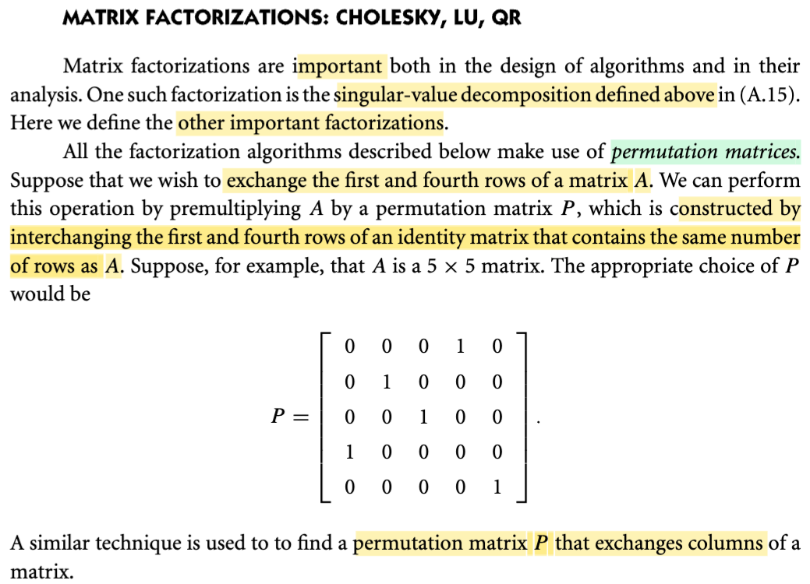</kbd>

> [!NOTE]
> Phân tách ma trận là một yếu tố quan trọng và rất hữu ích. Trong phần trước, chúng ta đã thảo luận về singular value decomposition (phân tách giá trị kỳ dị). Trong môn 1806, chúng ta đã học một số phép phân tách, tiêu biểu có phân tách vector riêng giá trị riêng hay Eigen decomposition. Phần này sẽ tìm hiểu thêm một số phép phân tách khác như Cholesky, LU hoặc QR. Đầu tiên, tác giả đề cập đến một ma trận đặc biệt gọi là ma trận hoán vị. Ma trận hoán vị này, trong MIT 1806, chúng ta cũng đã gặp. Về cơ bản, nó là một ma trận được tạo ra từ ma trận đơn vị. Ví dụ, khi muốn dùng ma trận hoán vị để thay đổi vị trí hai hàng của một ma trận, chúng ta sẽ hoán đổi hai hàng tương ứng trong ma trận đơn vị. Chẳng hạn, nếu muốn tạo một ma trận hoán vị để đổi hàng 1 và hàng 3 của ma trận A, khi nhân ma trận hoán vị này với ma trận A, ta sẽ thu được ma trận mới với hàng 1 và hàng 3 của A được hoán đổi. Kết quả là một ma trận mới có hàng 1 là hàng 3 của A và hàng 3 là hàng 1 của A. Vậy làm thế nào để tạo được ma trận hoán vị đó? Đơn giản là ta lấy ma trận đơn vị và hoán đổi hàng 1 với hàng 3 của nó. Như vậy, ta sẽ có ma trận giúp hoán đổi hàng 1 với hàng 3 của một ma trận khác khi nhân từ bên trái. Từ MIT 1806, chúng ta đã biết, trong bốn góc nhìn về phép nhân ma trận, góc nhìn thứ hai cho thấy khi nhân ma trận A với ma trận B, mỗi hàng của ma trận kết quả là tổ hợp tuyến tính của các hàng của ma trận B, với các hệ số lấy từ hàng tương ứng của ma trận A. Ví dụ, nếu C là ma trận kết quả thì hàng thứ ba của ma trận C là tổ hợp tuyến tính của các hàng của ma trận B, sử dụng các hệ số từ hàng số 3 của ma trận A. Với góc nhìn này, chúng ta dễ dàng hiểu tại sao ma trận hoán vị P có thể giúp hoán vị các hàng của ma trận A. Tương tự vậy, chúng ta cũng có thể hoán vị các cột của ma trận A bằng cách nhân với một ma trận hoán vị từ bên phải, hoàn toàn tương tự.

> [!TIP]
> **🤖 AI Feedback** — ✅ Score: **95/100**
>
> Bạn đã giải thích rất xuất sắc về ma trận hoán vị, cách tạo và cơ chế hoạt động của chúng để hoán đổi hàng hoặc cột của ma trận. Việc liên hệ với kiến thức đã học (MIT 1806) để làm rõ lý do tại sao phép nhân ma trận hoán vị lại hoạt động là một điểm cộng lớn, thể hiện sự hiểu biết sâu sắc.

 

### Khử Gauss và phân tích PA=LU

<kbd>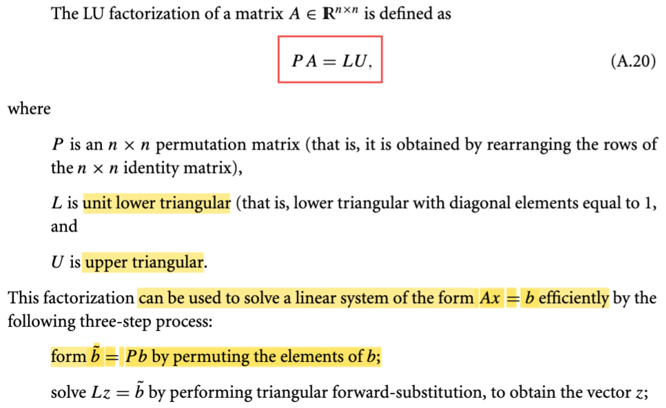</kbd>

<kbd>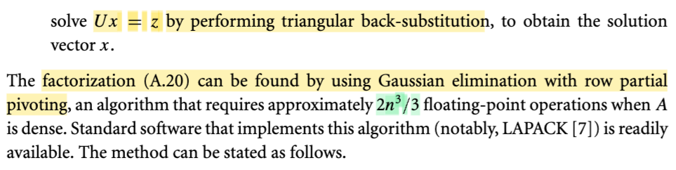</kbd>

> [!NOTE]
> Cái này thì mình đã học ở trong MIT 1806, mình đã nghe thầy Strang nói về cái này rồi. Cụ thể là trong những cái bài đầu tiên khi học về phép khử Gauss đó, đưa một cái ma trận A về cái dạng là **row echelon form**, dạng bậc thang đó. Thì đại ý là trong cái quá trình khử Gauss về cơ bản là mình có thể có những cái bước là mình đổi vị trí các hàng. Sau đó là mình sẽ thực hiện những cái việc ví dụ như lấy hàng này trừ đi cho mấy lần cái hàng trên. Trong đó những cái **pivot** là những cái thằng đứng ở đầu mỗi hàng. Thì cái quá trình khử Gauss nó được thể hiện bởi **PA = LU** (Và ở đây gs cũng nói PA = LU có thể được tìm thấy bởi Gaussian elimination).
>
>
>
> Vậy thì với PA = LU, nó có thể giúp ta gỉai hệ Ax = b tương đối hiểu quả:
>
>
>
> Ax = b ⇔ PAx = Pb ⇔ LUx = Pb. Nên bước đầu tiên là tính b\~ = Pb, sau đó giải L z = b\~, và cuối cùng giải Ux = z. Có thể thấy việc giải hai hệ Lz = b\~ và Ux = z chỉ là deal với matrix tam giác, nên nó chỉ là quá trình back substitution hoặc forward subtitution mà thôi. Và thuật toán này có chi phí (2/3)n^3 (cái này mình đã phân tích trong ee364, tốn kém nhất chính bước elimination, để đưa PA = LU, tốn (2/3) n^3, còn lại mấy bước giải hệ với matrix tam giác thì chỉ tốn n^2, nên tổng cộng lại chỉ coi như (2/3) n^3
>
>
>
> ---
>
>
>
> Dừng lại tí để nói thêm về PA = LU. Vì sao L là matrix tam giác dưới:
>
>
>
> EPA = U ⇨ PA = Einv U, Einv chính là L.
>
>
>
> EA = ...(E31)(E21)A), tức E là tích các eliminate matrix, ví dụ E21 eliminate hàng 2 cột 1, E31 eliminate hàng 3 cột 1. Mà E21A sẽ lấy hàng 2 trừ A21/A11 × hàng 1, tức là hàng 2 của E21A sẽ = \[hàng 2 của A\] - (A21/A11) \[hàng 1 của A\] ⇨ hàng 2 của E21 = \[-(A21/A11), 1, 0,...0\]. Còn các hàng khác của E21 đều giống matrix I (để giữ nguyên các hàng khác của A). Và có thể để ý là, E21 là matrix tam giác dưới, với điểm mấu chốt là, hàng 2 của nó chỉ tác động đến hàng 2 và một hàng trước đó của A. Và một điểm nữa cũng để ý để tí nữa xài, là đường chéo của nó cũng toàn số 1.
>
>
>
> Mô tuýp này cũng dễ nhìn thấy với các matrix khác, ví dụ E31). Thành ra, các elimination matrix đều là matrix tam giác dưới (lower triangular), có đường chéo = 1
>
>
>
> Cuối cùng, tích của chúng cũng sẽ là matrix tam giác dưới, có đường chéo = 1 (phân tích sẽ thấy)
>
>
>
> Vậy E là matrix tam giác dưới → Einv, chính là L cũng vậy. Vì sao? Vì EL = I ⇨ hàng 1 của I, là e1T, = linear combination các hàng của L với hệ số là row 1 của E, mà vector này chỉ có E11 khác 0. Nên hàng 1 của EL = E11 × \[row 1 của L\] + 0 × \[row 2 của L\] + ... = E11 × \[row 1 của L\]. Muốn ra kết quả là e1T thì nhất định row 1 của L phải có dạng: \[1/E11, 0, 0....0\].
>
>
>
> Tiếp, hàng 2 của EL = E21 × \[row 1 của L\] + E22 × \[row 2 của L\] + 0 × \[row 3 của L\] + .... Vì row 1 của L có dạng \[1/E11, 0, 0, ...\] nên để row 2 của EL = e2T, thì row 2 của L phải bằng \[(-E21/E11E22), 1/E22, 0, 0, ...\].
>
>
>
> Và tương tự như vậy, ta có thể thấy các hàng của L cũng sẽ khiến L là matrix tam giác dưới. Và để ý, 1/E11 = 1, 1/E22 = 1,...⇨ tương tự, có thể thấy đường chéo của L cũng toàn số 1.
>
>
>
> Như vậy giải thích vì sao L là **matrix tam giác dưới có đường chéo = 1** (gọi là **unit lower triangular**) như trong sách.
>
>
>
> Còn vì sao U là matrix tam giác trên thì là do bản chất của quá trình khử ta muốn đưa A về dạng này

> [!TIP]
> **🤖 AI Feedback** — ✅ Score: **98/100**
>
> Bài giải thích rất sâu sắc và chính xác, không chỉ mô tả mà còn giải thích chi tiết nguồn gốc của ma trận L là unit lower triangular, điều này vượt xa nội dung trong tài liệu cung cấp. Cách trình bày các bước giải hệ Ax=b cũng rất rõ ràng và mạch lạc. Để bài viết hoàn hảo hơn, bạn có thể thử cô đọng lại phần giải thích về ma trận nghịch đảo L một chút.

 

#### Khử Gauss: Hoán vị và Khử

<kbd>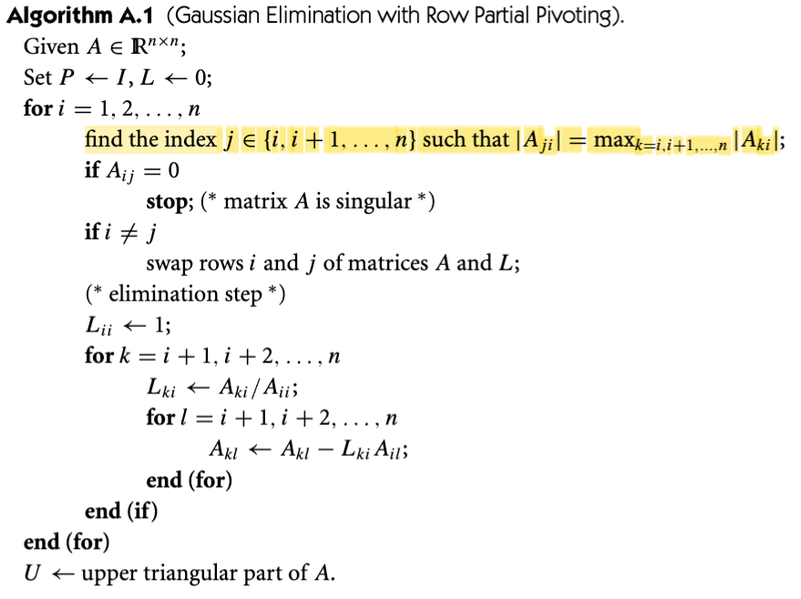</kbd>

> [!NOTE]
> Đây là lần đầu tiên thấy thuật toán khử Gauss, dù đã học về nó trong những bài đầu của MIT 18.06.
>
>
>
> Hiểu đại khái như sau, chuẩn bị matrix P là I, L là O.
>
>
>
> Vòng lặp ngoài cùng: xét i = 1,...n. Có thể hiểu đây là xét qua từng cột.
>
>
>
> Hành động đầu tiên là tìm trong cột đang xét (i), từ phần tử thứ i trở đi, thì cái nào có trị tuyệt đối lớn nhất. Ví dụ nếu đang xét cột 5, thì chỉ tìm thằng lớn nhất trong các thằng từ hàng 5 trở đi, xem index của nó là bao nhiêu, gán cho j.
>
>
>
> Tại đây nếu cái phần tử lớn nhất trong cột lại là 0, ta suy ra matrix A có 1 cột bằng 0, nên nó là matrix singular, và dừng thuật toán luôn.
>
>
>
> Nếu i khác j, đồng nghĩa cái thằng lớn nhất từ index i trở đi trong cột i lại không phải là thằng đầu tiên, thì ta sẽ thực hiện row exchange (swap row) để đưa nó lên. Tức là ta sẽ đổi hàng i và hàng j. 
>
>
>
> Sau bước này, tức là trong cột i thì thằng lớn nhất đã chính là Aii. Ta sẽ thực hiện bước khử đi hết các phần tử phía dưới của Aii trong cột i. Hai vòng lặp for k và for l chỉ là thực hiện việc này.
>
>
>
> Để dễ hiểu ví dụ khi A11 đã là pivot, ta sẽ khử hết A21, A31,..
>
>
>
> Khử A21 bằng cách nào? → Lấy hàng 2 trừ hàng 1 nhân L21 = A21/A11.
>
>
>
> Khử A31? → Lấy hàng 3 trừ hàng 1 nhân L31 = A31/A11
>
>
>
> Tương tự vậy, thì từ đó có thể thấy vòng lặp k chính là đi qua các hàng bên dưới Aii. Rồi tính Lki = Aki/Aii. Và vòng lặp l chính là hành động lấy hàng k trừ đi Lki nhân hàng i.
>
>
>
> Cũng có thể thấy lí do phải dừng khi gặp Aij = 0, là vì bước tính Lki.

> [!TIP]
> **🤖 AI Feedback** — ✅ Score: **95/100**
>
> Bài giải thích rất chi tiết và dễ hiểu, đặc biệt là phần tìm phần tử pivot và các bước khử Gauss. Bạn đã nắm rất vững các bước và ý nghĩa của chúng, đồng thời giải thích rõ ràng lý do dừng thuật toán khi ma trận suy biến. Một điểm nhỏ có thể bổ sung là việc gán L_ii = 1 trong quá trình tạo ma trận L.

 

##### Ưu điểm xoay cột ma trận thưa

<kbd>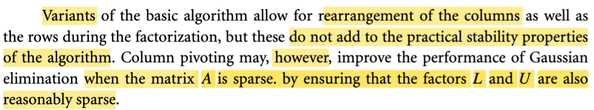</kbd>

> [!NOTE]
> Tạm hiểu đoạn này đại khái nói là có nhiều cái biến thể đối với cái thuật toán cơ bản cho cái phép cho cái thuật toán khử Gaus này. Trong đó là người ta sẽ sử dụng cái phương pháp là sắp xếp lại các cái cột thay vì là sắp xếp lại các cái hàng như là cái thuật toán vừa rồi. Tuy nhiên là nó không đưa thêm vào, tức là không tạo ra bất cứ một cái tính chất nào hơn về cái vấn đề ổn định cả cho cái thuật toán cả. 
>
>
>
> Tuy nhiên, nếu như mà mình xét cái trường hợp ma trận A là ma trận thưa đó, thay vì nó là ma trận đặt, chữ dance là chữ đặt. Thì nếu như mà mình xét ma trận A là ma trận thưa thì cái việc sử dụng column pivoting tức là thay vì row pivoting thì dùng column pivoting sẽ có thể giúp cải thiện cái hiệu suất của cái phép khử Gaus bằng cách là nó đảm bảo rằng cái ma trận L và ma trận U cũng là những ma trận sparse. Nói chung cái đoạn này mình có thể hiểu rằng là nếu như với cái ma trận A là một ma trận dense thì làm theo kiểu row pivoting hay là column pivoting thì được như nhau. Nhưng mà với ma trận A là ma trận thưa thì làm theo kiểu column sẽ có một chút cái sự cải thiện, nó sẽ có một chút ưu điểm.

> [!TIP]
> **🤖 AI Feedback** — ✅ Score: **90/100**
>
> Bạn đã nắm bắt rất chính xác hai ý chính của đoạn văn: việc xoay cột không cải thiện tính ổn định nhưng lại tối ưu hiệu suất cho ma trận thưa bằng cách giữ L và U thưa. Để nâng cao hơn nữa, hãy lưu ý rằng việc sắp xếp lại cột và hàng trong thuật toán ban đầu là các biến thể song song, không hẳn là "thay vì" nhau.

 

###### Phân tích LU matrix chữ nhật

<kbd>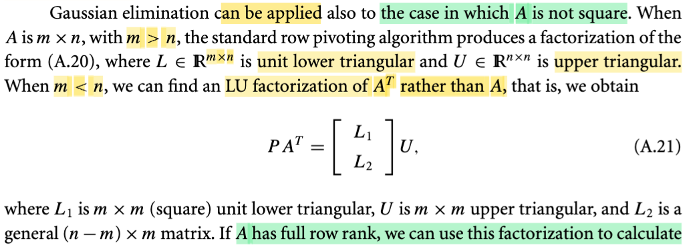</kbd>

<kbd>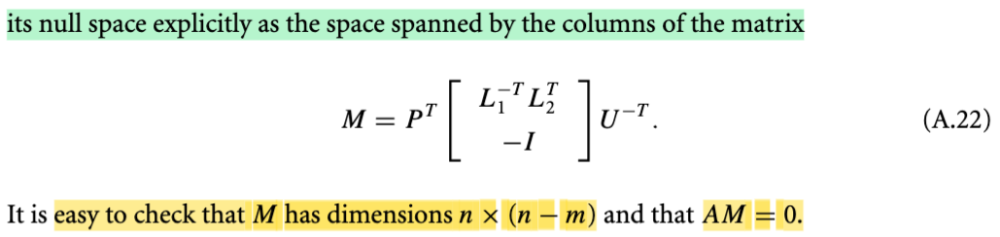</kbd>

> [!NOTE]
> Đại khái là, thuật toán khử Gauss cũng có thể áp dụng với matrix chữ nhật.
>
>
>
> Nếu A là matrix vuông, và full rank, khử Gauss sẽ cho ra U là matrix tam giác trên có đủ pivot.
>
>
>
> Nếu A vuông không full rank, có cột nào đó ko độc lập, thì U sẽ có cột tự do (ko có pivot), và có bao nhiêu free column thì sẽ có tương ứng bấy nhiêu hàng bằng 0 ở dưới.
>
>
>
> Thế thì, nếu A là matrix chữ nhật, thì qúa trình khử Gauss vẫn diễn ra bình thường: Xác định các pivot, thực hiện đảo hàng nếu cần, và dùng các matrix khử để khử các phần tử dưới pivot mỗi cột.
>
>
>
> Nếu A là matrix cao ốm, kích thức m × n, giả sử có rank = r, thì U sẽ là matrix cao ốm có shape m × n, có r hàng trên cùng là pivot row, m - r hàng dưới đều là 0 và trong n cột, cũng sẽ có r cột pivot. Và ta vẫn có PA = LU, với L có shape m × m, A và U có shape m × n.
>
>
>
> Vì sao L có shape m × m? Là vì L là Einv, và E, như đã nói, là matrix biến đổi các hàng của A để khử các vị trí dưới mỗi pivot, nên để kết quả có đủ m hàng, thì E dĩ nhiên phải có m hàng, cũng như vì A có m hàng, nên mỗi hàng của E, đóng vai trò là một bộ hệ số để tổ hợp tuyến tính chúng, cũng phải có m con số → E có m cột. Nên E phải có shape m × m ⇨ L là Einv, có thể nhìn theo cách khác là matrix đảo ngược quá trình đó biến U → A, nên L cũng phải có shape m × m.
>
>
>
> Nói dài dòng như vậy nhằm chỉ ra một chỗ trong sách viết ở đây hơi khác với mô tả trên: Là L lại có shape m × n, và U có shape n × n. Mà điều này có nghĩa là, A ban đầu có shape m × n lại biến thành U có shape n × n?
>
>
>
> → Tìm hiểu sau.
>
>
>
> Tương tự, nếu shape của A là m × n với m < n, thì A là matrix mập, lùn. Thì đại khái là thay vì "làm" cho A, người ta làm cho AT, tức là lật nó lại để trở về trường hợp khử Gauss cho matrix cao ốm.
>
>
>
> Nếu A full row rank, tức các hàng đều độc lập thì ta có thể có matrix M, là cách thể hiện tường minh của Nullspace của A. Tạm thời biết vậy thôi. Chỉ nhớ là nullspace là vector nhân với A thành 0. Nên AM = 0 thì mọi cột của M chính là tạo nên các nullspace vector.
>
>
>
> Thử check xem AM = 0?
>
>
>
> AM = A PT \[L1invTL2T; -I\] UinvT
>
>
>
> = A PT \[L1invTL2T; -I\] UinvT
>
>
>
> Từ P AT = \[L1; L2\] U ⇨ A = Pinv \[L1; L2\] U = PT \[L1; L2\] U
>
>
>
> ⇨ AT = UT \[L1; L2\]T P = UT \[L1T, L2T\] P
>
>
>
> ⇨ A PT \[L1invTL2T; -I\] UinvT
>
>
>
> = UT \[L1T, L2T\] P PT \[L1invTL2T; -I\] UinvT
>
>
>
> = UT \[L1T, L2T\] \[L1invTL2T; -I\] UinvT
>
>
>
> = UT (L1TL1invTL2T - L2T) UinvT (L1T nhân L1invT = (L1inv L1 )T = (I)T = I
>
>
>
> = UT (L2T - L2T) UinvT
>
>
>
> = UT (0) UinvT
>
>
>
> = 0 ⇨ AM = 0, đúng là M là nullspace matrix của A.

 

###### Phân tích Cholesky và công thức

<kbd>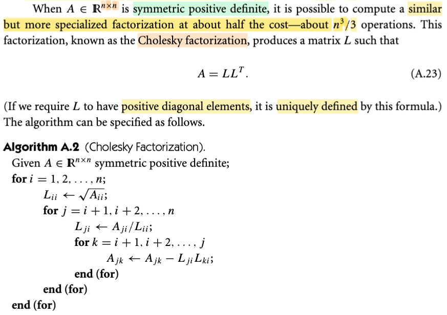</kbd>

> [!NOTE]
> Tiếp, đại khái là khi A là matrix đối xứng xác định dương, thì dạng khử Gauss PA = LU nó trở thành một dạng phân tách đẹp hơn nữa: A = L(LT). Có nghĩa là, với PA = LU, thì L, và U là matrix tam giác dưới và trên. Còn với A đối xứng thì U trở thành chính là LT (L transpose), và chẳng cần phải đổi hàng bằng matrix P làm gì nữa. Và cái này có tên là Cholesky Factorization, nó có chi phí chỉ bằng một nửa của PA = LU (khử Gauss), tức n^3/3
>
>
>
> Thuật toán Choleski factorization A.2 cũng ko khó hiểu lắm. Một đặc điểm là đường chéo của Lii là dương.
>
>
>
> Thử xem vì sao thuật toán lại tính toán như vậy:
>
>
>
> A đối xứng xác định dương → mọi trị riêng đều dương.
>
>
>
> A = LLT
>
>
>
> Aij = \[L's row i\] T \[L's col j\] = \[L's row i\]T \[L's row j\] = Σk Lik × Ljk
>
>
>
> Nên Aii = \[L's row i\]T \[L's row i\] = Σk Lik^2
>
>
>
> Vậy A11 = L11^2 ⇨ **L11 = √A11**
>
>
>
> A21 = \[L's row 2\]T \[L's row 1\] = L21L11 + L22L12 + 0 ... = L21L11
>
>
>
> ⇨ **L21 = A21/L11**
>
>
>
> A22 = L21^2 + L22^2
>
>
>
> ⇨ **L22 = √(A22 - L21^2)**
>
>
>
> A31 = \[L's row 3\]T \[L's row 1\] = L31L11 + L32L12 + L33L13 + 0 + ... = L31L11 (do L12, L13 và sau đó = 0)
>
>
>
> ⇨ **L31 = A31/L11**
>
>
>
> A32 = \[L's row 3\]T \[L's row 2\] = L31L21 + L32L22 + L33L23 + ... = L31L21 + L32L22 (do L23 và sau đó đều = 0)
>
>
>
> ⇨ **L32 = (A32 - L31L21)/L22**
>
>
>
> A33 = L31^2 + L32^2 + L33^2
>
>
>
> ⇨ **L33 = √(A33 - L31^2 - L32^2)**
>
>
>
> Như vậy ta thấy cho đến L33, thì các bước tính toán như sau:
>
>
>
> **L11 = √A11 (a)**
>
>
>
> **L21 = A21/L11 (b)**
>
>
>
> **L22 = √(A22 - L21^2)**
>
>
>
> **L31 = A31/L11 (c)**
>
>
>
> **L32 = (A32 - L31L21)/L22**
>
>
>
> **L33 = √(A33 - L31^2 - L32^2)**
>
>
>
> Đáng lẽ nếu theo cách làm tuần tự của mình ở trên thì thuật toán sẽ như sau
>
>
>
> (lặp qua từng cột)
>
>
>
> n = 1 (tính cột 1): i) Tính L11 = √A11, ii) chạy vòng lặp j để tính L21 = A21/L11, L31 = A31/L11,.....cho đến hết cột 1.
>
>
>
> n = 2 (tính cột 2): i) Tính L22 = √(A22 - L21^2), ii) chạy vòng lặp j để tính L32 = (A32 - L31L21)/L22, L42 = ...cho đến hết cột 2.
>
>
>
> n = 3 (tính cột 3): Tương tự.
>
>
>
> ...cho đến cột cuối cùng.
>
>
>
> Nhưng thuật toán A2 sẽ làm hơi khác chỗ này:
>
>
>
> i = 1 (tính cột 1): i) Tính L11 = √A11, ii) chạy vòng lặp j để tính L21 = A21/L11, L31 = A31/L11,.....cho đến hết cột 1.
>
>
>
> Thì tại mỗi j, ta tính Lj1, sau đó chạy vòng lặp để cập nhật các phần tử Ai+1, Ai+1 trong hàng j: Aj,(i+1), Aj,(i+2)..
>
>
>
> Ví dụ j = 2, tính L21, thì chạy vòng lặp cập nhật các phần tử trong hàng 2 của A: A22, A23,...
>
>
>
> Aj2 = Aj2 - LjiLki ⇨ A22 = L22 - L21L21 = L22 - (L21)^2, A23 = A23 - L21L31,...
>
>
>
> Rồi j = 3, tính L31, và chạy vòng lặp cập nhật các phần tử trong hàng 3 của A: A32, A33,..
>
>
>
> Đại khái là như vậy, sang vòng lặp i = 2, chỉ việc tính L22 = √A22, thay vì √(A22 - L21^2), và L32 = A32/L22 thay vì L32 = (A32 - L31L21)/L22 (vì A22 đã được cập nhật tại vòng lặp trước để = A22 - L21^2 rồi, tương tự mấy cái khác cũng vậy)
>
>
>
> Nói chung là tạm hiểu về thuật toán này như vậy

> [!TIP]
> **🤖 AI Feedback** — ✅ Score: **90/100**
>
> Bạn đã nắm vững các điều kiện và hình thức của phép phân tích Cholesky, bao gồm cả việc tiết kiệm chi phí và tính duy nhất của L. Việc tự mình suy ra các công thức cho từng phần tử của L cho thấy sự hiểu biết sâu sắc và khả năng phân tích tuyệt vời. Bạn cũng đã giải thích rất tốt về cách thuật toán A.2 tối ưu hóa việc tính toán bằng cách cập nhật ma trận A tại chỗ, đây là một điểm quan trọng. Để cải thiện thêm, hãy xem xét kỹ hơn các chỉ số trong bước cập nhật Ajk <- Ajk - LjiLki của vòng lặp trong cùng để đảm bảo khớp chính xác với định nghĩa của thuật toán.

 

###### Hoán vị ma trận trong Cholesky

<kbd>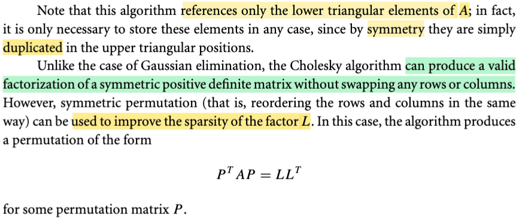</kbd>

> [!NOTE]
> Đại khái là, không như thuật toán khử Gauss, vốn có thể cần bước swap row, thì Cholesky thì ko. Tuy nhiên có thể dùng matrix permutation để sắp xếp lại các hàng của A giúp cho kết quả phân tách ra L(L)T sẽ có thể sparse hơn. Khi đó, ta có phương trình thể hiện việc phân tách: (PT)AP = L(LT)

 

###### Ứng dụng phân tách Cholesky

<kbd>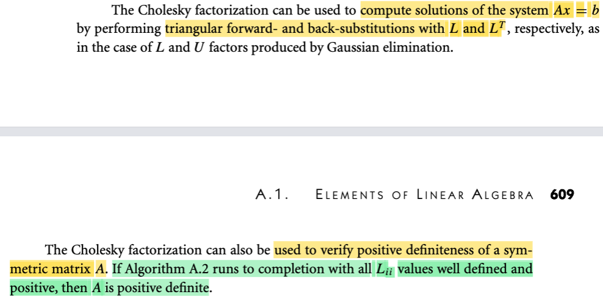</kbd>

> [!NOTE]
> Hai ý nói về công dụng của thuật toán phân tách Cholesky:
>
>
>
> Giải Ax = b, cũng như tác dụng của thuật toán khử Gauss trong việc này, ta sẽ rã A thành L(LT), sau đó giải Ax = b ⇔ L(LT)x = b, và việc này dẫn đến giải hai hệ với matrix tam giác: L u = b, LT x = u, và đây chỉ có O(n^2) vì chỉ là backward / forward substitution.
>
>
>
> Ngoài ra, như đã biết hồi học ở mấy chapter trước, thuật toán này còn công dụng là check tính xác định dương của matrix: Nếu matrix xác định dương thì thuật toán sẽ chạy từ đầu đến cuối, ko bị lỗi, để tính ra được hết các Lii đều dương, nhưng nếu matrix không xác định dương, thì thuật toán sẽ dừng → matrix có eigenvalue = 0, hoặc chạy xong nhưng có Lii âm

> [!TIP]
> **🤖 AI Feedback** — ✅ Score: **98/100**
>
> Bài viết giải thích chính xác hai công dụng chính của phân tích Cholesky và bổ sung các chi tiết sâu sắc về độ phức tạp tính toán cũng như các trường hợp ma trận không xác định dương, cho thấy sự hiểu biết vững chắc. Để hoàn thiện hơn, bạn có thể nhấn mạnh rằng ma trận A cần phải đối xứng khi kiểm tra tính xác định dương.

 

###### Phân tích QR và Gram-Schmidt

<kbd>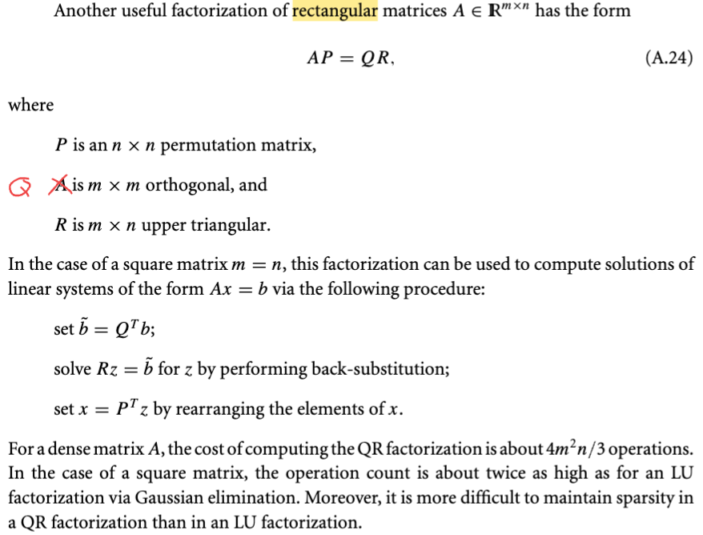</kbd>

> [!NOTE]
> Rồi, ta gặp lại cái QR factorization đã học qua trong EE263a: Phương trình của nó là AP = QR
>
>
>
> Còn nhớ, có thể xét dạng đơn giản hơn: A = QR (với matrix A full column rank (mọi cột đều độc lập)) để hiểu cái này có liên quan đến Gram - Smidth đã học trong MIT 1806, ôn lại nhanh:
>
>
>
> G-S đặt ra bài toán tạo một orthogonal basis q1,q2,...qn của C(A), gọi a1, a2,...an là các cột của A, ta sẽ làm như sau:
>
>
>
> Cho q1 = a1,normalize để có unit norm: q1 = a1 / ||a1|| ⇔ a1 = ||a1|| q1
>
>
>
> q2: Chiếu a2 lên span{q1}, lấy phần dư đem chuẩn hóa: gọi p = αq1 là hình chiếu của a2 lên q1, phần dư r = a2 - p sẽ vuông góc span{q1}:
>
>
>
> q1Tr = 0 ⇔ q1T(a2 - p) = 0
>
>
>
> ⇔ q1Ta2 = q1Tp
>
>
>
> ⇔ q1Ta2 = q1Tαq1 = αq1Tq1 = α
>
>
>
> ⇔ α = q1Ta2
>
>
>
> ⇨ q2 lấy bằng phần dư đã chuẩn hóa:
>
>
>
> r = a2 - p = a2 - αq1 = a2 - (q1Ta2)q1
>
>
>
> → q2 = r / ||r||
>
>
>
> (⇔ r = ||r||q2)
>
>
>
> Và r = a2 - (q1Ta2)q1
>
>
>
> ⇔ a2 = (q1Ta2)q1 + r = (q1Ta2)q1 + ||r||q2
>
>
>
> Để có q3, tương tự, chiếu a3 lên span{q1, q2} và lấy phần dư, đem chuẩn hóa:
>
>
>
> Chiếu q3 lên span{q1, q2} được p → p là linear combination các q1, q2, gọi Q là matrix tạo bởi hai cột q1, q2: p = Qx (x là vector hệ số) ⇨ phần dư r = a3 - p3 sẽ vuông góc với span{q1, q2} → r ∈ left nullspace của Q:
>
>
>
> QTr = 0 ⇔ QT(a3 - p) = 0
>
>
>
> ⇔ QTa3 = QTp
>
>
>
> ⇔ QTa3 = QTQx (Đây là normal equation)
>
>
>
> Mà vì Q có hai cột orthogonal và unit norm nên QTQ = I ⇨ Ta có QTa3 = x
>
>
>
> ⇨ x = QTa3
>
>
>
> ⇨ p = Qx = QQTa3 = (q1Ta3)q1 + (a2Ta3)q2
>
>
>
> r = a3 - p = a3 - (q1Ta3)q1 - (a2Ta3)q2
>
>
>
> và q3 = r/||r||
>
>
>
> ⇨ q3||r|| = a3 - (q1Ta3)q1 - (a2Ta3)q2
>
>
>
> ⇔ a3 = ||r||q3 + (q1Ta3)q1 + (a2Ta3)q2
>
>
>
> ⇔ a3 = (q1Ta3)q1 + (a2Ta3)q2 + ||r||q3
>
>
>
> Tương tự như vậy với q4, q5,...
>
>
>
> Nhưng với q1, q2, q3
>
>
>
> với a1 = ||a1|| q1
>
>
>
> a2 = (q1Ta2)q1 + ||r||q2
>
>
>
> a3 = (q1Ta3)q1 + (a2Ta3)q2 + ||r||q3
>
>
>
> Ta có thể đủ để thấy cấu trúc A = QR
>
>
>
> Vì MIT 1806 đã học, QR, góc nhìn nhân matrix với matrix thứ 3: cột j của A, là linear combination các cột của Q bởi hệ số là cột j của R.
>
>
>
> Nên a1 = ||a1|| q1 ⇨ cột 1 của R là \[||a1||, 0, 0,...0\]
>
>
>
> a2 = (q1Ta2)q1 + ||r||q2 ⇨ cột 2 của R là \[q1Ta2, |r||, 0, 0,....\] vói ||r|| = ||a2 - (q1Ta2)q1||
>
>
>
> a3 = (q1Ta3)q1 + (a2Ta3)q2 + ||r||q3 ⇨ cột 3 của R là \[q1Ta3, a2Ta3, ||r||, 0,....0\] với ||r|| = ||a3 - (q1Ta3)q1 - (a2Ta3)q2||\\
>
> Và như vậy giúp hiểu vì sao R là matrix tam giác trên
>
>
>
>  Nói chung là, thuật toán Gram-Smidth là một cách để tạo ra bộ orthogonal basis của C(A), cũng là giúp QR factorization.
>
>
>
> Và ta có thể ứng dụng nó trong việc giải hệ Ax = b đối với matrix vuông (dĩ nhiên điều kiện luôn là A full colum rank, nên nếu vuông thì sẽ full rank / invertible luôn)
>
>
>
> Là vì khi đó, x = Ainv b = (QR)inv b = Rinv Qinv b, từ đó cách giải hệ Ax = b như sau:
>
>
>
> 1. Factor A thành QR,
>
>
>
> 2. Tính Qinv b, mà vì Q là orthogonal matrix, nên Qinv = QT, tính Qinvb chỉ là tính QTb, là phép nhân matrix với vector. (gán kết quả thành b\~)
>
>
>
> 3. Giải Rinv b\~, dĩ nhiên là không phải đi tìm Rinv, mà là ta sẽ giải Rx = b\~, và đây là hệ có matrx tam giác ⇨ chỉ là back-substitution.
>
>
>
> Nếu nói về phân tách AP = QR, thì giải Ax = b ⇔ QR(PT)x = b thì như vậy sau khi giải bước 3 mới chỉ là Rz = b\~, cần làm thêm bước cuối: PTx = z ⇨ x = Pz

> [!TIP]
> **🤖 AI Feedback** — ✅ Score: **90/100**
>
> Ghi chú cung cấp một phân tích rất sâu sắc về phân tích QR, đặc biệt là việc liên hệ với quá trình Gram-Schmidt để giải thích cấu trúc của R, và trình bày chính xác các bước giải hệ Ax=b. Tuy nhiên, nó chưa đề cập đến chi phí tính toán và khả năng duy trì tính thưa của ma trận, những khía cạnh thực tiễn quan trọng từ tài liệu gốc.

**🔗 See also:** [Optimal x* Solution](./102_linear_least_square_problem.md#node-4qw5hsw)

 

