# 1.1 Example: Polynomial Curve Fitting

📊 **Progress:** `13` Notes | `20` Screenshots

---

 

## Hồi quy đường cong đa thức

<kbd></kbd>

> [!NOTE]
> Ví dụ về một bài toán regression đơn giản: Xây dựng một thuật toán
> học máy làm cái việc, nhận vào một con số thực x, dự đoán con số t
>
>
>
> Và đại ý là ta sẽ tạo một bộ  dataset nhân tạo, dùng cách sau: Cho xi
> là các giá trị cách đều nhau trong khoảng 0,1 (không phải là phải là
> uniform(0,1) nhé), và tính ti = sin(2πx) + zi với zi sampling từ một
> normal distribution (chưa thấy nói về tham số distribution của z).
>
>
>
> Và vì ta biết quy trình tạo ra observed data xi, ti nên kiểu như ta có thể
> so sánh mô hình mà ta xây dựng với mô hình thật (mô hình chỉ là nói
> đến hàm số, cái thuật toán mà mình muốn tạo, về bản chất cũng chỉ là
> xây dựng một hàm số t(x): nhận x → trả ra t. Vậy thì mô hình thật,
> chính là hàm f(x) = sin(2πx) và ta sẽ so sánh nó mô hình mà thuật toán
> học được.
>
>
>
> Gs nói thêm, về yếu tố noise zi thì trong đời thực, có thể đến từ yếu tố
> ngẫu nhiên nội tại của hiện tượng, ví dụ như quá trình phân rã phóng
> xạ, nhưng cũng có thể đến từ việc data ko chứa đủ các feature ẩn

 

### Xác suất và quyết định học máy

<kbd></kbd>

> [!NOTE]
> đại ý nói là mục tiêu của chúng ta sẽ là khai thác training set để train
> một thuật toán machine learning giúp dự đoán t^ của một new input x^ nào
> đó. Và vấn đề này không đơn giản, vì việc ta phải làm là dựa vào một số
> lượng hữu hạn dữ liệu để nắm bắt được quy luật phổ quát tạo ra dữ liệu 
> này.
>
>
>
> Thế thì ta sẽ thấy vai trò của lí thuyết xác suất và decision theory giúp đem
> lại những công cụ giúp ta giải bài toán này

 

#### Khớp đường cong hàm đa thức

<kbd></kbd>

> [!NOTE]
> Đại khái là, trong ví dụ này, ta sẽ chưa bàn đến các công cụ mà lí thuyết
> xác suất và lí thuyết quyết định cung cấp. Thay vào đó chỉ làm đơn giản
> thôi, với cách tiếp cận dựa trên "curve fitting". Cụ thể là ta sẽ đặt ra bài
> toán là tìm cách xây dựng một hàm đa thức bậc M sao cho nó có thể khớp
> được bộ dữ liệu huấn luyện.
>
>
>
> Hàm đa thức bậc M (polynomial function of M order) có dạng:
>
>
>
> y(x, **w**) = Σj=0:M wj*x^j
>
>
>
> Và **w** là vector các hệ số của đa thức (polynomial coefficient) [w0, w1,...wM]
>
>
>
> Gs nói đến việc đây tuy là hàm bậc M theo biến x, nhưng là hàm tuyến tính
> theo wj. Cũng dễ hiểu, ta có thể thể hiện ở dạng y(x, **w**) = **w**T[1, x, x^2,...,x^M]
> Và ông đây là một function thuộc họ linear models, sẽ bàn kĩ ở chap 4

**🔗 See also:** [Curve Fitting Góc Nhìn Xác Suất](./125_curve_fitting_re_visited.md#node-21cf3yh) · [Gaussian Basis Functions](./310_linear_regression_and_basis_functions.md#node-2e9r7fm)

 

##### Giải pháp bình phương tối thiểu

<kbd>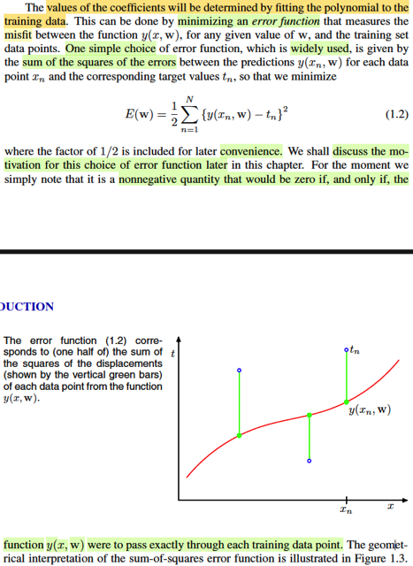</kbd>

> [!NOTE]
> Rồi, không có gì khó hiểu, giá trị của wj sẽ quyết định dạng của
> polynomial function, giúp nó khớp được cỡ nào với data. Và ta có thể tìm
> bộ wj giúp khớp nhất với data bằng cách minimize error function với error
> function được chọn sao cho nó phản ánh độ không khớp (misfit) của hàm
> số với data.
>
>
>
> Và một cái được sử dụng phổ biến là : sum squared of error
>
>
>
> E(**w**) = (1/2) Σn=1:N (y(xn, **w**) - tn)^2
>
>
>
> Con số 1/2 như chỉ là số dương nhân vào, nếu muốn nói dài dòng theo
> kiểu ee364a thì nó giúp ta có một equivalent optimization problem, tức là
> không làm thay đổi bản chất bài toán, tức là **w*** minimize (1/2) sum
> squared error cũng sẽ minimize sum squared error, nhưng dễ thấy nó sẽ
> giúp tính toán thuận tiện hơn.
>
>
>
> Gs nói ta sẽ bàn về error function sau.
>
>
>
> Dừng lại để recall chút xíu, trong Casella mình đã gặp squared error loss
> rồi. Nói chung, theo gs Casella, đây là địa hạt của **decision theory**, khi
> mà ta tiếp cận vấn đề đánh giá (evaluate) một phương pháp suy luận, ví
> dụ như point estimator, hypothesis testing test hoặc một interval
> estimator bằng cách dùng hàm **loss function**, được chọn để phản ánh
> cách mà ta đánh giá sai sót của estimator. Ví dụ trong bài toán point
> estimator, ta có thể dùng squared error loss, hoặc absolute error loss:
>
>
>
> L(δ(**X**), θ) = [δ(**X**) - θ]^2,  L(δ(**X**), θ) = |δ(**X**) - θ|
>
>
>
> Một công cụ tiếp theo sẽ dùng, là risk function (của một estimator),  được
> định nghĩa là hàm theo θ:
>
>
>
> R(δ, θ) = E_θ[L(δ(**X**), θ)]
>
>
>
> Và risk function sẽ cho ta một hàm theo θ gắn với estimator δ(**X**), để
> rồi, ta muốn tạo ra estimator mà risk của nó tại θ bất kì đều nhỏ hơn risk
> của mọi estimator khác tại đó. 
>
>
>
> Rồi, khi theo Bayesian, θ là random variable, người ta lại average cái 
> này, tức là nhìn theo góc độ R lúc bấy giờ là random variable tạo bởi
> hàm theo θ, để đi average nó: E[R(θ, δ(**X**)) = ∫_Θ R(θ, δ(**X**) π(θ) dθ.
> Thì đây gọi là Bayes risk.
>
>
>
> Và thay R(θ, δ(**X**)) = E_θ[L(δ(**X**), θ] = ∫_/**X** /L(δ(**x**), θ) f(**x**|θ) d**x**  vào:
>
>
>
> Bayes risk: ∫_Θ R(θ, δ(**X**) π(θ) dθ = ∫_Θ  ∫_/**X**/ L(δ(**x**), θ) f(**x**|θ) d**x** π(θ) dθ
>
>
>
> = ∫_/**X**/ ∫_Θ L(δ(**x**), θ) f(**x**|θ) π(θ) dθ d**x** 
>
>
>
> = ∫_/**X**/ ∫_Θ L(δ(**x**), θ) [f(θ|**x**) f(**x**) / π(θ)] π(θ) dθ d**x**  
>
>
>
> = ∫_/**X**/ ∫_Θ L(δ(**x**), θ) f(θ|**x**) f(**x**) dθ d**x**  
>
>
>
> = ∫_**X** [ ∫_Θ L(δ(**x**), θ) f(θ|**x**) dθ] f(**x**) d**x**  
>
>
>
> Thì cái cụm [ ∫_Θ L(δ(**x**), θ) f(θ|**x**) dθ], chính là E_θ[L(δ(**x**), θ)|**X**=**x**] được 
> gọi là **posterior expected loss**
>
>
>
> -----
>
>
>
> Thế thì quay lại đây, nhìn cái E(**w**), mình có thể thấy đây chính là gì:
>
>
>
> Thứ nhất:
>
>
>
> Y như việc ta dùng squared error loss để đo độ sai của suy luận:
> L(δ(**X**), θ) = [δ(**X**) - θ]^2
>
>
>
> Thì ở đây, ta cũng dùng squared error loss để đo độ sai của dự đoán:
> [y(w, x) - t]^2
>
>
>
> Chỉ khác ở chỗ, cái trên, δ(**X**) là suy luận (statistical inference) cho giá
> trị tham số population θ.
>
>
>
> Còn ở dưới, y(w, X) là prediction.
>
>
>
> Nó giống hơn như việc ta áp squared error loss lên:
>
>
>
> [g(δ(X) - g(θ)]^2 với g mang ý nghĩa là một prediction function nào đó.
>
>
>
> Và điều thứ hai nhận ra ở đây:
>
>
>
> Với risk function, ta lấy kì vọng của loss, và như đã biết, L(δ(X), θ) với θ
> fix, thì có thể coi nó như một random variable. Và lấy kì vọng chính là lấy
> POPULATION MEAN của loss's distribution
>
>
>
> Với cái dưới, chính ta lấy SAMPLE MEAN
>
>
>
> Và còn nhớ đại khái LLN nói rằng: sample mean sẽ hội tụ in probability
> về  true mean
>
>
>
> Quay lại đây, dễ thấy vì objective là hàm không âm, nên nó sẽ nhỏ nhất
> khi nó bằng 0, và khi đó (với **w***) hàm đa thức y(**w***, x) sẽ có đồ thị đi
> qua một cách chính xác mọi điểm {xi, ti} trong training dataset
>
>
>
> ------
>
>
>
> Thật ra để chặt chẽ hơn ta phải giải bằng calculus (vì hàm không âm
> chưa chắc đã đạt min = 0):
>
>
>
> Viết lại hàm objective: E(w) = (1/2) Σi=1:N [y(xi, w) - tn]^2
>
>
>
> Đặt h(x) là hàm scalar → vector: f(x) = [1, x, x^2,...x^M]
>
>
>
> thì E(w) = (1/2) Σi=1:N [wThi - ti]^2
>
>
>
> Đặt H là matrix các hàng là hi và vector t là [t1, ..tM]T thì E(w)  trên chính
> là
>
>
>
> = (1/2)(Hw - t)T(Hw - t)
>
>
>
> = (1/2)(wTHT - tT)(Hw - t)
>
>
>
> = (1/2)(wTHTHw - tTHw - wTHTt + tTt)
>
>
>
> tTHw là scalar, nên = (tTHw)T = wTHTt
>
>
>
> = (1/2)(wTHTHw - 2tTHw + tTt)
>
>
>
> = (1/2)wTHTHw - tTHw + (1/2) tTt)
>
>
>
> Đây là dạng của hàm quadratic xTPx + qTx + r
>
>
>
> Dùng điều kiện cần tối ưu bậc nhất để giải stationary point
>
>
>
> ∇E(w) = 0
>
>
>
> ⇔ HTHw - (tTH)T = 0
>
>
>
> ⇔ HTHw - HTt = 0
>
>
>
> ⇔ HTHw = HTt
>
>
>
> ⇔ w = (HTH)inv HTt
>
>
>
> Dĩ nhiên matrix Hessian ∇^2E(w) chính là HTH
>
>
>
> Hessian tại w* = HTH, có xác positive semi definite không?
>
>
>
> Có, theo MIT 1806, ta chỉ cần check quadratic form:
>
>
>
> zTHTHz xem có không âm với mọi z không.
>
>
>
> = (Hz)T(Hz) = ||Hz||^2 ≥ 0 với mọi z ⇨ positive semi definite
>
>
>
> Thế vào, E(w*) = (1/2)(Hw - t)T(Hw - t) | w = (HTH)inv HTt
>
>
>
> = (1/2)||Hw - t||^2 | w = (HTH)inv HTt
>
>
>
> = (1/2)||H(HTH)inv HTt - t||^2
>
>
>
> Thế thì H(HTH)inv HTt chính là gì?
>
>
>
> Nhớ lại, derive lại matrix chiếu lên C(A):
>
>
>
> Chiếu b lên C(A): được p ∈ C(A), residual: e = b - p sẽ vuông góc C(A) →
> e ∈ N(AT) ⇨ ATe = 0 ⇨ AT(b - Ax^) = 0 ⇔ ATb = ATAx^ ⇔ x^ = (ATA)inv
> ATb ⇨ p = Ax^ = A(ATA)invATb
>
>
>
> ⇨ matrix P chiếu b lên C(A) chính là:
>
>
>
> P = A(ATA)invAT
>
>
>
> Vậy H(HTH)inv HTt chính là chiếu t lên C(H).
>
>
>
> Mà t là vector trong R^N (N-dimensional space)
>
>
>
> C(H) cũng là subset của R^N, và H có M + 1 cột.
>
>
>
> Dễ thấy các cột độc lập vì mọi cột đều là power của cột 2. Do đó chỉ cần
> M + 1 ≥ N, thì C(H) trùng R^N và t nhất định ∈ C(H) ⇨ H(HTH)inv HTt = t
>
>
>
> Và khi đó E(w) sẽ có min nhỏ nhất là 0.
>
>
>
> Và đây chính là giúp ta hiểu, nếu như ta dùng một đa thức bậc M với M >
> N - 1 thì chắc chắn là sum square error có thể đạt 0 → hàm đa thức đi
> qua hoàn hảo các điểm dữ liệu.

 

###### Tối ưu hóa và lựa chọn mô hình

<kbd></kbd>

> [!NOTE]
> đoạn này nói về việc ta sẽ minimize E(w) và như đã thấy ở note vừa rồi, nó
> là hàm bậc hai theo w, lấy đạo hàm (để dùng điều kiện tối ưu cần bậc nhất)
> sẽ là hàm bậc 1, và đại ý là chắc chắn sẽ có một nghiệm duy nhất, giải
> được ở dạng closed-form (kết quả mình vừa tính ra w = (HTH)inv HTt chính
> là closed form solution.
>
>
>
> Gs đề cập đến một vấn đề mà ta phải giải quyết nữa: Chọn M bằng bao nhiêu.
> Ông cho một số giá trị và nhận thấy nếu nhỏ quá, (0,1) thì đa thức bậc 0,1
> không khớp tốt với data, và điều này đồng nghĩa, nó ko đủ mạnh (linh hoạt)
> để biểu diễn được hàm sin 2πx (là cái model thật sự đằng sau dữ liệu mà 
> ta muốn "tìm lại")
>
>
>
> Nhưng M cao quá, thì lại có hiện tượng quá khớp: tức là dù đi qua chính xác
> các điểm dữ liệu nhưng nó vẫn ko biểu diễn tốt hàm số gốc. Thay vào đó nó
> có mức giao động (oscillate) phức tạp hoàn toàn vượt quá mức cần thiết.
>
>
>
> Và việc chọn M, sẽ thuộc phạm trù quan trọng gọi là MODEL SELECTION

 

###### Khớp đa thức các bậc

<kbd>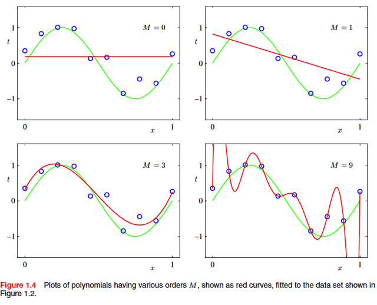</kbd>

 

###### Lỗi mô hình và độ phức tạp

<kbd></kbd>

<kbd>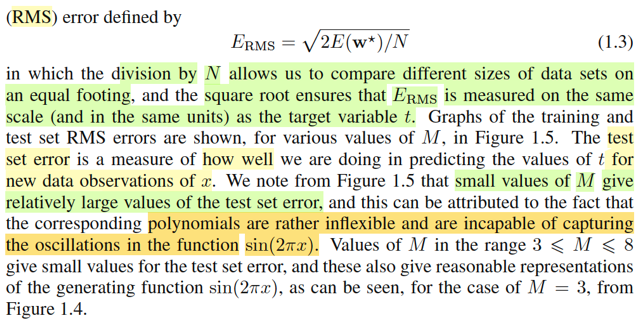</kbd>

> [!NOTE]
> Đại khái là, cũng dễ hiểu, như đã nói, mục đích cuối cùng là xây dựng
> được một hàm số mô phỏng (model) y(x, w) được hàm số gốc sin(2πx) - là
> cái quy luật thật sự (sau khi loại bỏ nhiễu) của dữ liệu quan sát được.
>
>
>
> Và ta chuyển mục tiêu đó thành một dạng khác: là những dự đoán của
> hàm mô phỏng đó, sẽ khớp với những kết quả quan sát thấy, mà một biểu
> hiện bởi đường cong của đồ thị hàm số mô phỏng sẽ đi qua các điểm dữ
> liệu, và E(w*) nhỏ.
>
>
>
> Tuy nhiên, đó chỉ là điều kiện cần, nói cách khác, khớp được training set
> chỉ là một biểu hiện, chứ chưa chắc giúp cho thấy hàm mô phỏng đã tái
> hiện được, biểu diễn được đúng cái hàm sin(2πx) mong muốn mà ví dụ
> vừa rồi với M lớn đã cho thấy điều đó.
>
>
>
> Do do, hay nói đúng hơn là ta sẽ dùng một bộ test set, được tạo ra cùng
> quy trình của training set. Và ta sẽ tính toán một đại lượng mang tên Root
> Mean Square error (RMS): √[2E(w*)/N] được thiết kế như vậy nhằm mục
> đích tí nữa ta sẽ nói. Nhưng đại ý là, ta sẽ cho M thay đổi. với mỗi giá trị
> của M, ta tính RMS trên training set và test set. Và plot kết quả ra.
>
>
>
> Kết quả cho thấy, (cũng chính là khớp với các nhận định lúc nãy):
>
>
>
> Khi M nhỏ, thì training error và test error đều lớn: Thể hiện rằng, hàm mô
> phỏng không đủ mạnh, KHÔNG ĐỦ NĂNG LỰC biểu diễn những pattern phức
> tạp), mà mình hay ví von như ta có một thanh gỗ quá cứng nhắc, không
> thể uốn nó để tạo ra hình dạng cong lên cong xuống mong muốn. Và do
> đó, nó đều có error cao ở cả hai set.
>
>
>
> Khi M lớn dần, training và test error giảm dần: Thể hiện rằng: với bậc đa
> thức tăng lên, hàm y(w,x) được ban cho thêm sức mạnh nội tại giúp nó có
> thể biểu diễn các mô tuýp phức tạp hơn, cây gỗ bây giờ là thanh nứa, dẻo
> hơn, dễ uốn cong hơn. Và một lúc nào đó, ở độ dẻo đủ để uốn nắn như
> mong muốn (giúp  đi sát được nhất với mọi cây đinh dữ liệu) thì lúc này
> cũng chính là lúc, nó nắm bắt được tốt nhất hàm gốc ẩn sin(2πx), và chính
> điều này khiến test error cũng thấp.
>
>
>
> Nhưng mình cũng có thể mạnh dạn nhận định: Test error sẽ ko bao giờ về
> 0 được: Lí do là do yếu tố nhiễu của cả training set và test set. Nên tại thời
> điểm đáy của chữ U màu đỏ mày (vì sao chữ U ta sẽ nói sau) thì hàm mô
> phỏng có thể đã trở thành y chang hàm ẩn gốc. Giúp nó kéo error cả hai
> set xuống thấp nhưng vì yếu tố nhiễu của data (nhớ ko, data được tạo bởi
> ti = sin(2πxi) + zi với zi ~ normal distribution) nên ta sẽ ko thể loại trừ được
> error do nhiễu (trừ khi error do nhiễu tự triệt nhau, nhưng điều này là hên
> xui). do đó mới nói test error sẽ hầu như không thể thành 0 (nhưng training
> error sẽ có thể, do overfit, sẽ nói tiếp ở dưới)
>
>
>
> Tiếp, khi M tăng lên nữa, hàm mô phỏng bây giờ trở nên DƯ NĂNG LỰC
> (năng lực biểu diễn / độ linh hoạt), và khi đó nếu tiếp tục training để đẩy
> training error  thấp xuống mức cực hạn (đó là nói theo kiểu thuật toán tối
> ưu, chứ còn ở bài toán này thì tính w* bởi closed form solution thì nó vốn
> dĩ đã ra luôn minimizer của hàm số rồi) thì hàm mô phỏng sẽ dùng năng
> lực biểu diễn của mình để HỌC NHỮNG QUY LUẬT TỒN TẠI TRONG
> NHIỄU, nói đúng hơn, nó bắt đầu học luôn cái pattern của data có nhiễu,
> và với M đủ lớn, nó học được luôn.
>
>
>
> Kết quả, training error = 0, hàm mô phỏng trở thành khớp tuyệt đối training
> set vì nó đã học được quy luật data + nhiễu.
>
>
>
> Tuy nhiên, test error sẽ tăng lên, vì đơn giản là: test data là data bởi hàm
> gốc
> + một loại nhiễu khác, có pattern khác (dĩ nhiên là pattern gì thì hoàn toàn
> là random) so với training set, nên cái quy luật data + nhiễu mà nó học
> trong trainig set là trật lất với test set ⇨ test error TĂNG VỌT.
>
>
>
> Lúc này ta có thể hình dung cây nứa đã trở thành: cuộn dây, có thể map
> hoàn  hảo các cây đinh dữ liệu nhưng, nó "thích map kiểu nào thì map", có
> VÔ VÀN CÁCH để đi qua hết cây đinh, và do đó, nó có XÁC SUẤT RẤT
> THẤP để đi theo đường cong mà ta muốn nó đi: đường sin(2πx).

 

###### Sai số và Overfitting

<kbd>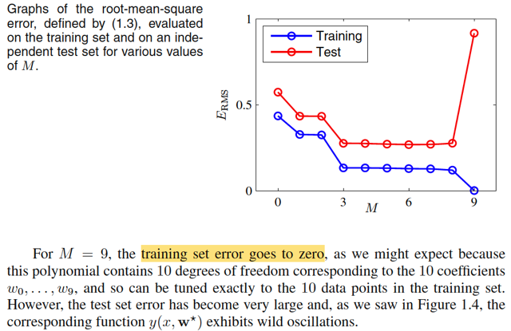</kbd>

 

###### Nghịch lý bậc đa thức

<kbd>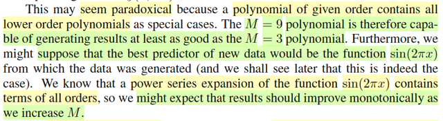</kbd>

> [!NOTE]
> đại ý gs nói kết quả này, (nếu bỏ qua việc ta hiểu như trong note vừa rồi) thì
> có thể sẽ thấy mâu thuẫn: vì ta biết hàm đa thức bậc càng lớn thì năng
> lực biểu diễn càng mạnh, và nó chính là câu nói đa thức bậc 9 sẽ có năng
> lực ít nhất là bằng đa thức bậc 3. Vậy tại sao lại có chuyện M tăng thì kết
> quả lại kém đi (mình đã hiểu lí do như trong note trước đã nói rồi)

 

###### M và Độ lớn Hệ số

<kbd>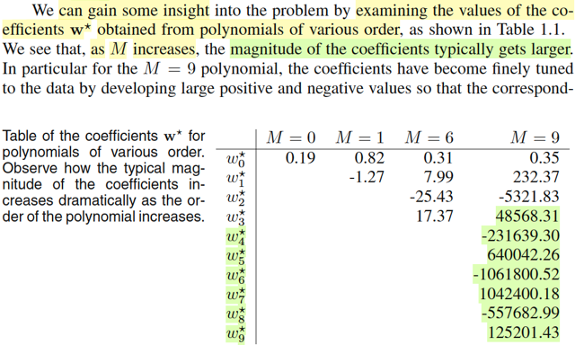</kbd>

<kbd>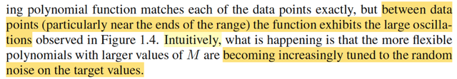</kbd>

> [!NOTE]
> Đại ý là, gs nói ta có thể có cái nhiều sâu hơn giúp trả lời thắc mắc vừa rồi
> bằng cách nhìn vào giá trị của các hệ số của đa thức.
>
>
>
> Nhận ra ngay, trong các kết quả ứng với case M lớn thì độ lớn của trọng
> số tăng rất cao (ví dụ có thể thấy ở bậc 9, trọng số của những term bậc 
> cao từ 5 → 9 mang những giá trị lớn) và gs giải thích là: điều này khiến
> hàm mô phỏng có thể match chính xác các điểm dữ liệu nhưng cũng khiến
> mức dao động của hàm số giữa các điểm đó là rất lớn.
>
>
>
> Và về mặt trực giác, gs nói, có thể hiểu như trong note trước mình đã ghi:
> là M lớn thì sự linh hoạt lớn của hàm đa thức khiến nó học / tuned (tinh
> chỉnh) các trọng số để khớp được với cả yếu tố nhiễu của data

 

###### Overfitting và Phương pháp Bayesian

<kbd>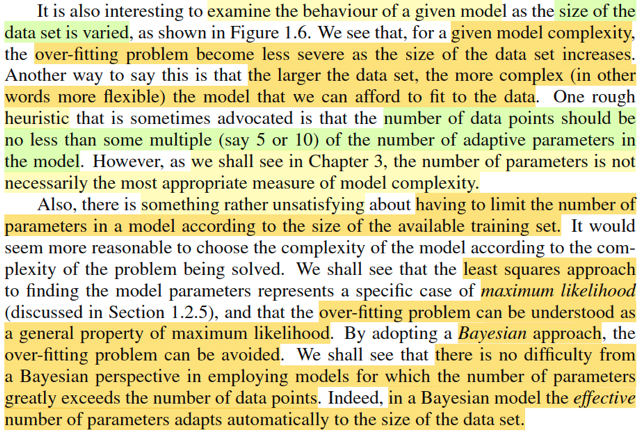</kbd>

> [!NOTE]
> Đoạn này đại ý là, ta cũng có thể kiểm tra hành vi của một model (hàm
> mô phỏng, mô hình mô phỏng) khi thay đổi độ lớn dataset. Nói chung
> cũng dễ hiểu rằng khi training set càng lớn, thì mô hình dù có độ flexible
> lớn cũng sẽ dần cảm thấy khó để mà match được hết các yếu tố nhiễu.
> Do đó, khi data còn nhỏ, nó sẽ overfit, nhưng data lớn dần thì nó sẽ bớt
> overfit.
>
>
>
> Và gs có nhắc đến một ý kiểu như kinh nghiệm: là điểm dữ liệu nên lớn ít
> nhất bằng 5, hay 10 lần số param sẽ giúp mô hình giảm overfit
>
>
>
> Nhưng chap 3 ta sẽ thấy ko phải cứ nhiều params là thước đo cho thấy
> độ phức tạp của mô hình
>
>
>
> -----
>
>
>
> Tuy vậy, sẽ rất khó chịu nếu như ta phải giới hạn số param của model
> dựa trên quy mô của dataset ta có. Do đó, trong những phần sau ta sẽ
> học được rằng cách tiếp cận least-square thực chất là một trường hợp cụ
> thể của  bài toán maximum-likelihood, và ta sẽ thấy over-fit là một thuộc
> tính của  phương pháp này. Từ đó, với công cụ Bayesian approach, ta sẽ
> khắc phục được điều này, để rồi có thể phát triển những mô hình mà số
> param thậm  chí còn lớn hơn số điểm dữ liệu nhưng hoàn toàn ko overfit.
>
>
>
> Để rồi thật sự rằng, trong một Bayesian model, thì số param hiệu quả (ý
> là những param phát huy tác dụng) sẽ tự động được adapt với kích thước
> dataset
>
>
>
> -----
>
>
>
> Tiện đây ôn lại chút xíu về hai khái niệm nhắc đến vừa rồi: maximum
> likelihood và Bayesian approach.
>
>
>
> Trong Casella, khi học về point estimator. ta đã học một vài phương pháp,
> như method of moment estimator, maximum likelihood estimator, Bayes
> estimator.
>
>
>
> Point estimator (của tham số θ), đầu tiên, theo định nghĩa, là any function
> of sample **X**): W(**X**). Thế thì với MLE, cái hàm W đó chính là hàm
> này:
>
>
>
> W(**x**) = argmax_θ L(θ|**x**), với L(θ|**x**) là likelihood function, là
> function theo θ, define bởi L(θ|**x**) = f(**x**|θ), là joint pdf/pmf của sample
> **X** tại observed value **x**. mang ý nghĩa là độ hợp lí của θ khi quan sát
> thấy **X** = **x.**  Và ta sẽ maximize L(θ|**x**) over θ ∈ Θ: tìm θ khiến độ
> hợp lí khi quan sát thấy  **X** = **x** là lớn nhất. Và đó chính là ML
> estimate of θ: δ^_mle(**x**)
>
>
>
> Thế còn Bayes estimator?
>
>
>
> Thì đầu tiên phải nói về Bayesian approach: Mà trước khi nói về nó, ta
> phải nói về Classic approach, hay Frequentist approach: Trong đó người
> ta coi population parameter θ là fixed nhưng chưa biết. Trong khi đó,
> Bayesian sẽ coi θ là quantity of random (coi như random variable). Và đã
> là random variable thì sẽ có distribution: kí hiệu là prior distribution π(θ).
> Thông qua Bayes rule, ta có thể có một distribution khác của θ: condition
> on **X** = **x**:
>
>
>
> Bayes rule: f(**x**|θ) π(θ) = π(θ|x) f(**x**) ⇨ π(θ|x) = f(**x**|θ) π(θ) / f(**x**)
>
>
>
> Và ý nghĩa của cái distribution này là: việc quan sát được **X** = **x sẽ
> giúp ta cập nhật lại distribution của θ, mà ban đầu dựa trên niềm tin của
> experimenter (prior), và người ta gọi nó là posterior distribution, kí hiệu
> π(θ|x)**
>
>
>
> Thế thì, khi đã có posterior distribution của θ, lẽ tự nhiên, ta sẽ dùng
> mean hoặc median (tùy vào dùng loss function nào) của θ để làm dự
> đoán cho θ. Và đó chính là Bayes estimator:
>
>
>
> δ^B(**X**) = Expectation của [θ] với θ ~ π(θ|**x**) và phải kí hiệu cho đúng
> là E[]θ|**X**=**x**], là kì vọng của θ  với θ ~ theo phân phối dựa trên **x**

 

###### Kỹ thuật Regularization và Shrinkage

<kbd>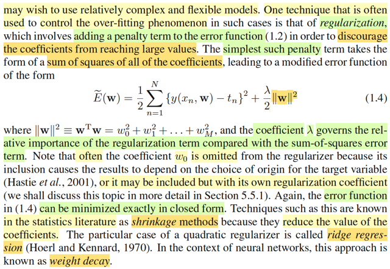</kbd>

<kbd>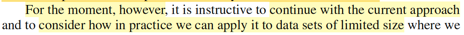</kbd>

> [!NOTE]
> Đại ý là, tuy là "vài bữa" ta sẽ có các công cụ như vừa nói (Bayesian
> inference) để deal với vấn đề overfit, nhưng tạm thời ở đây, ta sẽ làm theo
> một kĩ thuật phổ biến để trị overfit mang tên REGULARIZATION.
>
>
>
> Ideas rất đơn giản, ta muốn quá trình tối ưu ko tạo ra kết quả các hệ số đa
> thức lớn, thì ta thêm vào error loss function, một term để đóng vai trò PHẢN
> ÁNH objective này:
>
>
>
> Cái này y như vừa học ở Casella về việc tiếp cận vấn đề đánh giá một
> interval estimator theo lối tiếp cận optimality function: Trong bài toán interval
> estimator, ta đã biết là mình quan tâm đến hai thứ: Muốn nó chứa θ, và size
> (length) nhỏ. Do đó, ta sẽ thiết kế hàm loss của một interval estimator:
> L(C(X), θ) = b * Length[C(**X**)] + I_C(θ)
>
>
>
> với b là trọng số giúp điều chỉnh mức độ quan trọng của hai tiêu chí này.
>
>
>
> Và từ đó ta mới xây dựng risk function, R(C, θ) = E_θ[L(C, θ)]
>
>
>
> Quay lại đây, hoàn toàn có thể thấy cách làm tương tự, combine tuyến tính
> hai objective, dùng trọng số λ/2 để điều chỉnh mức độ quan trọng tương đối
> của hai mục tiêu: [Học được cách biểu diễn quy luật, thông qua giảm sum
> squared error] và [không cho hệ số mang giá trị lớn, thể hiện bởi việc giảm
> sum squared các hệ số: ||w||^2 = wTw = Σi wi^2]
>
>
>
> Gs lưu ý là có khi người ta bỏ w0 ra, hoặc có nó nhưng phải có regularizer
> coefficient riêng (sẽ hiểu sau, có thể trong sách này hoặc sách Tibshirani)
>
>
>
> Cuối cùng, gs nói trong thống kê, kĩ thuật này gọi là SHRINKAGE, mà cụ thể
> khi ta dùng hàm bậc hai của các weight như này thì ta gọi nó là RIDGE
> REGRESSION. Trong neural network thì gọi là WEIGHT DECAY,

**🔗 See also:** [Ước lượng Bayes và MAP](./125_curve_fitting_re_visited.md#node-8z48xwr)

 

###### Ảnh hưởng của λ

<kbd>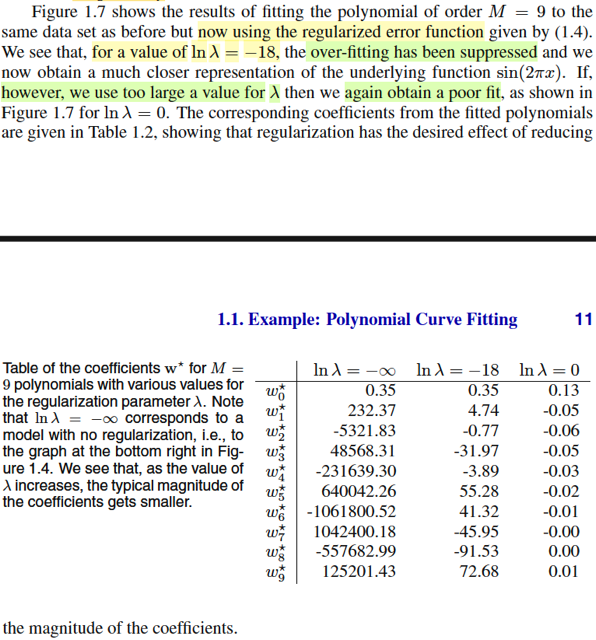</kbd>

> [!NOTE]
> Kết quả cho thấy, khi λ phù hợp, thì regularizer phát huy tác dụng, giúp
> hàm số ko bị overfit (hình 1.7 a), nó biểu diễn khá tốt đường cong màu
> xanh của hàm gốc.
>
>
>
> Nhưng nếu λ quá lớn, thì lúc này, đại khái là regularizer term khiến cho
> việc tối ưu hàm loss tổng đặt nhiều trọng tâm vào việc giảm cái term thứ
> hai, khiến cho bóp nghẹt giá trị trọng số, điều này đã làm giảm độ
> complex / tính flexible / khả năng biểu diễn của mô hình. Dẫn đến là khả
> năng fit data của nó giảm, trở nên giống như một mô hình đa thức với bậc
> M thấp.
>
>
>
> (Nhìn vào cái bản dưới, có thể thấy λ lớn (ln(λ) = 0) thì các trọng số wi
> nhỏ tí ≈ 0 (cột bên phải), với λ phù hợp, thí chúng đều có độ lớn vừa phải
> (cột giữa), còn nếu λ quá nhỏ, coi như ko có regularizer, thì trọng số trở
> nên rất lớn (cột trái) → overfit)

 

###### Khớp đa thức chính quy hóa

<kbd>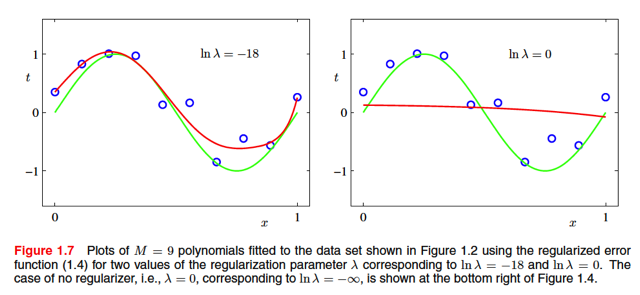</kbd>

 

###### Tác động của λ

<kbd>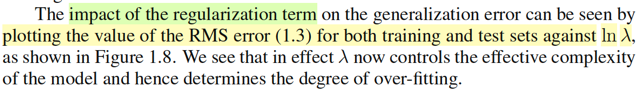</kbd>

<kbd>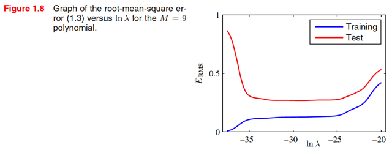</kbd>

> [!NOTE]
> Biểu đồ cho thấy tác động "chống" overfit: λ tăng dần, mô hình đi từ nơi 
> overfit (training error nhỏ, test error lớn) đến trạng thái tốt (cả hai error
> đều nhỏ).
>
>
>
> Nhưng tăng hơn nữa, thì nó tác dụng ngược khiến phế võ công của
> mô hình, dẫn đến mô hình bị underfit: cả hai error đều cao)

 

###### Tối ưu độ phức tạp mô hình

<kbd>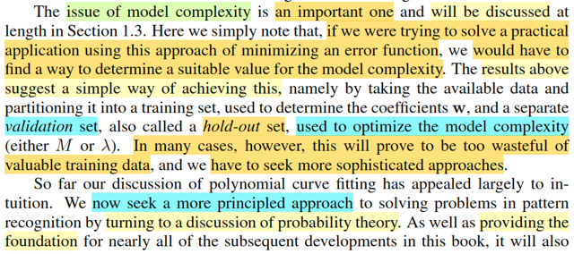</kbd>

> [!NOTE]
> Đại ý là, gs nói bài toán chọn độ phức tạp của mô hình là một bài toán
> quan trọng, và ta sẽ còn bàn đến nhiều trong những phần sau.
>
>
>
> Còn ở đây thì ít nhất cũng đã cho ta một cách tíếp cận trong vấn đề này:
> Là để dành một phần training set, tách riêng cho việc tối ưu độ phức tạp
> của mô hình, gọi là VALIDATION SET.
>
>
>
> (dễ hiểu thôi, giống như ta sẽ đánh giá performance của mô hình với các
> độ phức tạp khác nhau (ví dụ, M khác nhau) train bởi training set trên
> validation  set và chọn ra độ phức tạp phù hợp. Sau đó mới đánh giá lần
> cuối cùng với test set. Đây là thứ mà trong ML Spec, gs Andrew gọi là
> hyperparameter  tuning: độ phức tạp của mô hình được cho là một loại
> siêu tham số)
>
>
>
> Tuy nhiên, thực tế chứng minh có nhiều khi cách này hơi phí dữ liệu, nên
> ta sẽ bàn tới nhiều cách khác.
>
>
>
> Cuối cùng, gs nhắc lại, nãy giờ, ví dụ này kiểu như cho ta một cái nhìn trực
> giác về những một bài toán pattern recognition thôi, còn lại, ta sẽ đi sâu
> vào việc dùng các lí thuyết xác suất và decision theory để tiếp cận bài toán
> này một cách bài bản hơn

 

