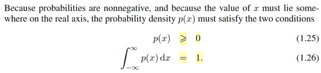
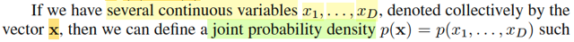
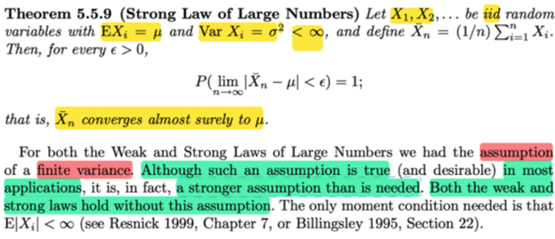
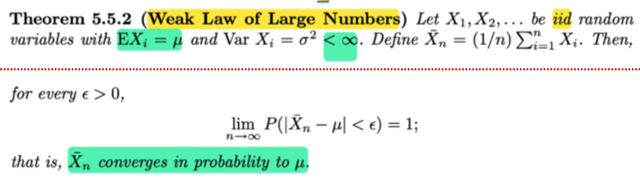
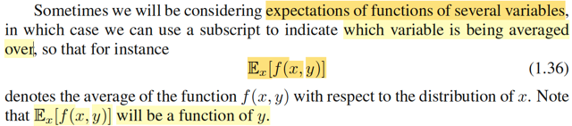
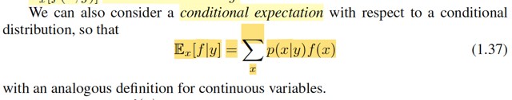
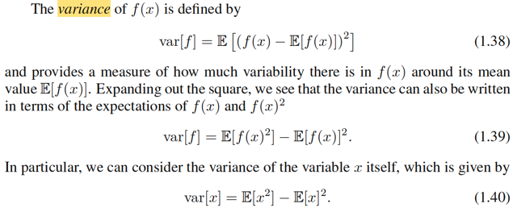
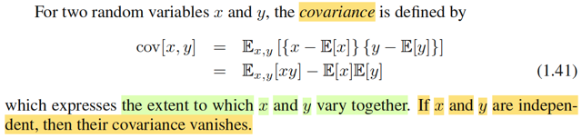
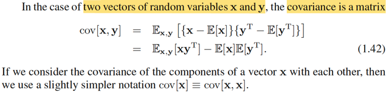

# 1.2.1&2 Probability densities & Expectations Covariances

📊 **Progress:** `14` Notes | `18` Screenshots

---

## 1.2.1&2 Probability densities & Expectations Covariances

 

## Định nghĩa PDF

<kbd></kbd>

> [!NOTE]
> Gs nói về pdf. (ông cũng nhấn mạnh ta sẽ thảo luận những cái này theo
> một cách tương đối không chính thức)
>
>
>
> Cách mà gs Bishop nói về pdf mình thấy giống cách nói của gs Blizstein
> trong Stat110:
>
>
>
> Nhớ lại vài ý trong cách dẫn dắt của Stat110 và Casella về cái này.
>
>
>
> Đại khái là, với biến liên tục, thì xác suất nó mang một giá trị cụ thể nào đó
> là bằng 0. (trong Casella mình đã chứng minh điều này)
>
>
>
> Nên ta sẽ không nói để pmf. Thay vào đó người ta define ra cái gọi là pdf.
> Và mình nhớ, trong Casella, pdf của biến liên tục X được định nghĩa như
> sau:
>
>
>
> là hàm f(x) sao cho: F(x) = ∫-inf:x f(t)dt
>
>
>
> Với định nghĩa này, dùng FTC2 ta sẽ có kết luận cdf F(x) là nguyên hàm
> của pdf f(x): Đó là nó nói rằng, nếu hàm G(x) được định nghĩa là ∫-inf:x f(t)dt
> thì G là nguyên hàm của f: d/dx G(x) = f(x).
>
>
>
> Do đó ở đây vì f được định nghĩa như vậy nên F là nguyên hàm của f. Mà
> khi đó theo FTC1, thì ta sẽ có: ∫a:b f(x)dx = F(b) - F(a) = P(X ≤ b) - P(X ≤ a)
> = P(a < X < b) = P(X ∈ (a,b))
>
>
>
> again, ở đây gs Bishop ko tuân theo convention của toán nên ghi x (viết
> thường là rv. p viết thường nốt, hic)

**🔗 See also:** [Hàm phân phối tích lũy](#node-vgduzcj)

 

### Tính chất PDF

<kbd></kbd>

> [!NOTE]
> Rồi, gs nói qua hai tính chất mà pdf phải tuân thủ: p(x) ≥ 0 và ∫-inf:inf p(x)dx = 1
>
>
>
> Mình còn nhớ trong sách Casella, đây là định lí 1.6.5 sách Casella

 

#### Định lý biến đổi hàm mật độ

<kbd></kbd>

> [!NOTE]
> Ở đây nói gs Bishop nói về Transformation Theorem
>
>
>
> Nhớ lại trong Stat110, Casella, nếu ta có X ~ fX(x) và Y = g(X) và
> mapping giữa x ∈ range X tới y ∈ range Y là 1-1. Tức là nếu y = g(x) thì
> tồn tại duy nhất x trong range X = ginv(y) trong range X (vẫn cho phép có
> thể có x' khác cũng map với y nhưng x' phải không thuộc range X)
>
>
>
> Khi đó fY(y) = fX(x) |dx/dy| = fX(ginv(y) |d/dy x| = fX(ginv(y)) |d/dy ginv(y)|
>
>
>
> Ở đây gs Bishop đặt hơi ngược lại, rằng x = g(y), nên kết quả ông cho 
> ra như vậy.

 

##### Cực đại PDF và biến đổi

<kbd></kbd>

> [!NOTE]
> Gs nói, một hệ quả của tính chất này là maximum của pdf có phụ thuộc
> cách chọn biến.
>
>
>
> Ý tác giả là, giá trị x* khiến maximize pdf fX(x) thì y = g(x*) CHƯA CHẮC
> ĐÃ là maximizer của fY(y).
>
>
>
> Thử chứng minh xem:
>
>
>
> Nếu x* là maximizer của f(x): thì theo calculus: f'X(x*) = 0 và f''X(x*) < 0
>
>
>
> Ta có fY(y) = fX(x) |d/dy ginv(y)|
>
>
>
> Đặt ginv là h cho gọn: fY(y) =  fX(x) |h'(y)| = fX(h(y)) |h'(y)|
>
>
>
> Vậy cần chứng minh là fY'(g(x*)) khác 0.
>
>
>
> fY'(y) = d/dy fY(y) = d/dy fX(h(y)) |h'(y)|
>
>
>
> = [d/dy fX(h(y))] |h'(y)| + fX(h(y)) d/dy |h'(y)| (product rule)
>
>
>
> = [d/dh(y) fX(h(y)) . d/dy h(y)] |h'(y)| + fX(h(y)) d/dy |h'(y)|  (chain rule)
>
>
>
> = [fX'(h(y)) . d/dy h(y)] |h'(y)| + fX(h(y)) d/dy |h'(y)|
>
>
>
> = fX'(h(y)) . h'(y) |h'(y)| + fX(h(y)) d/dy |h'(y)|
>
>
>
> Thay g(x*) vào:
>
>
>
> fY'(g(x*)) = fX'(h(g(x*))) . h'(g(x*)) |h'(g(x*))| + fX(h(g(x*))) d/dy |h'(g(x*))|
>
>
>
> = fX'(x*)) . h'(g(x*)) |h'(g(x*))| + fX(x*)) d/dy |h'(g(x*))|
>
>
>
> = 0 + fX(x*) d/dy |h'(g(x*))| (Do f'X(x*) = 0)
>
>
>
> = fX(x*) d/dy |h'(g(x*))|
>
>
>
> Và fX(x*) thì là maximum value của fX(x),
>
>
>
> Còn d/dy |h'(g(x*))| là d/dy [d/dy ginv(y)] | y = g(x*).
>
>
>
> tức là đạo hàm cấp hai của ginv, evaluate tại y = g(x*)
>
>
>
> Nếu g là hàm phi tuyến thì ginv cũng vậy, nên đạo hàm cấp 1 của nó của
> nó ko phải hằng số (ví dụ hàm đa thức bậc 2 thì đạo hàm là bậc một),  và
> khi đó đạo hàm cấp 2 chắc chắn là khác 0
>
>
>
> (ví dụ nếu ginv(x) = x^2, thì d/dx ginv(x) = 2x, d/dx [d/dx ginv(x)] = 2
>
>
>
> d/dx [d/dx ginv(x)] chỉ bằng 0 khi d/dx ginv(x) = constant, và khi đó ginv(x)
> phải là hàm bậc 1, cũng là g phải là phép biến đổi tuýen tính)
>
>
>
> Như vậy chưa chắc fX(x*) d/dy |h'(g(x*))| đã bằng 0 ⇨ g(x*) chưa chắc đã
> là critical point ⇨ chưa chắc đã là maximizer của fY

 

- **Hàm phân phối tích lũy**

<kbd></kbd>

> [!NOTE]
> Gs lướt qua cdf, như đã biết trong stat110, Casella, cdf của X được kí hiệu FX(x)
> và là hàm định nghĩa bởi FX(x) = P(X ≤ x). Và vì định nghĩa của pdf nên dùng
> FTC ta có F là nguyên hàm của f như lúc nãy đã nói

**🔗 See also:** [Định nghĩa PDF](#node-ainsl7e)

 

- **Hàm mật độ đồng thời**

<kbd></kbd>

<kbd></kbd>

> [!NOTE]
> Gs tiếp tục lướt qua joint pdf của nhiều random variables X1,...Xn làm thành
> vector **X** = [X1,...Xn] (ở đây là x = [x1,...xn], again, phải hiểu là đang nói
> đến random variable vì mr Bishop đã thoát li khỏi convention kí hiệu của
> toán như trong Casella, Stat110, vốn viết hoa để chỉ rv, viết thường để 
> chỉ possible value của rv)
>
>
>
> Hai tính chất này tương tự của pdf cho single variable, đã chứng minh trong
> sách Casella rồi.
>
>
>
> Ông cũng lướt nhẹ qua pmf
>
>
>
> Mình nghĩ (nếu ko có nền tảng xác suất thông kê từ Stat110, Casella, đọc 
> phần này về cơ bản là chả hiểu gì, vì thực tế thì mr Bishop chỉ lướt qua 
> vài khái niệm)

 

- **Quy tắc tổng tích PDF**

<kbd></kbd>

> [!NOTE]
> Rồi, cuối cùng, gặp lại cái vụ marginalizing joint pdf để có marginal pdf
> cũng như là conditional pdf. Ko có gì mới, đã biết ở Casella, Stat110 rồi

 

- **Kì vọng hàm số**

<kbd></kbd>

> [!NOTE]
> Gs Bishop nói đại ý là một tronng nhưng phép tính quan trọng nhất liên quan
> đến xác suất chính là tính weighted average của một function.
>
>
>
> Với hàm f(x) có xác suất p(x), thì weighted average value của f(x) dưới phân
> phối p(x) được gọi là kì vọng của f(x), kí hiệu E[f]. Tính bởi E[f] = Σx p(x)d(x)
>
>
>
> Nhờ được soi sáng bởi stat110, Casella, mình nhận ra đây chính là LOTUS.
> Nhớ lại kiến thức trong stat110, gs Joe đầu tiên khi nói về kì vọng, ông nói nó
> chỉ là tính trung bình, ví dụ ta có random variable X, giả sử là một discrete rv,
> có các possible value x1,x2,.... Thì E[X], chỉ là weighted average của X: Σi
> αixi với αi là xác suất X mang giá trị possible xi: P(X = xi), cũng là pmf của X
> tại xi.
>
>
>
> E[X] = Σxi xiP(X=xi)
>
>
>
> Với biến liên tục, thì ta có công thức E[X] = ∫-inf:inf xfX(x)dx với fX(x) là pdf
> của X
>
>
>
> Rồi, ông mới nói qua việc, giả sử ta có random variable khác, Y, tạo thành
> bằng cách áp hàm g(.) vào X. Y = g(X), thì khi muốn tính E[Y], tức E[g(X)],
> theo lẽ  thường, ta sẽ phải đi tìm distribution của Y, tức P(Y = y) với discrete
> case, hay fY(y), pdf của Y với continuous case.
>
>
>
> Nhưng nhờ có LOTUS (Law Of Unconscious Statistician) ta có thể chỉ việc áp
> cái hàm g vào trong x của công thức EX, còn lại, cứ dùng pmf/pdf của X:
>
>
>
> EY = E[g(X)] = Σxi g(xi)P(X=xi) (discrete)
>
>
>
> EY = E[g(X)] = ∫-inf:inf g(x)fX(x)dx (continuous)
>
>
>
> Và thể hiện với notation của gs Bishop thì nó chính công thức trong sách
>
>
>
> E[f(x)] = Σx f(x)p(x) hay ∫f(x)pxdx
>
>
>
> Again, phải nhớ trong sách này gs Bishop đã kí hiệu khác.
>
>
>
> x, viết thường, thật ra là random variable, tương ứng với X ở trên
>
>
>
> p(x) chính là pmf (tương ứng với P(X=x) của X) hoặc pdf fX(x) của X ở trên.
>
>
>
> và f() ở đây tương ứng với hàm g() ở trên. Nên phải hiểu thứ tự nếu ghi
> tương  ứng (cho dễ thấy) phải là E[f] = ∫f(x)p(x)dx
>
>
>
> Một điểm nữa, gs Joe trong Stat110 cũng đã nhắc đi nhắc lại, khi áp một
> function lên một rv thì ta được một rv. Nên ở đây nói tính kì vọng của function
> f(x) thì mình tự hiểu nó là tính kì vọng của random variable có được khi áp
> function f lên random variable x

 

- **Xấp xỉ kì vọng**

<kbd></kbd>

<kbd></kbd>

<kbd></kbd>

<kbd></kbd>

> [!NOTE]
> Thế thì gs nói nếu ta có N điểm lấy (sampling, giá trị quan sát được x1,...xN) từ
> distribution,  thì kì vọng E[f] có thể **tính xấp xỉ** bởi:
>
>
>
> E[f] ≈ (1/N) Σn=1:N f(xn)
>
>
>
> Và khi N → inf thì xấp xỉ này trở nên đúng với E[f].
>
>
>
> Thử nghĩ xem vì sao có vụ này:
>
>
>
> Thì cái này chính là dựa trên thứ đã học trong Casella: LLN: Law of Large
> Number theorem, đại khái nói là, nếu ta có random sample X1,...Xn có
> population distribution với mean μ, (dĩ nhiên tức là E[Xi] = μ), thì với vài điều kiện
> cần thiết, sample mean Xbar sẽ converge in probability về μ (Weak LLN) hay
> converges almost surely về μ (Strong LLN)
>
>
>
> lim n→inf P(|Xbar_n - μ| < ε) = 1 ∀ ε > 0 (Weak LLN)
>
>
>
> P(lim n → inf |Xbar_n - μ| < ε) = 1 ∀ ε > 0 (Strong LLN)
>
>
>
> Xbar → μ. tức là, ta đã học Theorem nói rằng:
>
>
>
> Và ý nghĩa là, khi **số lượng sample càng lớn** đến vô hạn thì **Xbar sẽ converge
> về true population mean** của distribution.
>
>
>
> Thì khi n → inf,  Xbar →  θ
>
>
>
> -----
>
>
>
> Quay lại đây, mình có thể hiểu bối cảnh là
>
>
>
> Ta có random sample X1,...XN (và dù gs Bishop ko nói, nhưng mình đoán là ngầm
> hiểu chúng iid), áp hàm f vào ta có các rvs f(X1),...f(XN)
>
>
>
> Cũng làm thành một random sample F1,...Fn, cũng iid: đều mutually independent, và 
> identity distribution: đều ~ theo phân phối của f(Xi), có mean E[Fi] = E[f(Xi)]
>
>
>
> Áp dụng LLN, ta có thể nói
>
>
>
> Khi N → inf, Fbar converge về E[f(X)] , nên Fbar ≈ E[f(X)]
>
>
>
> Viết theo notation gs Bishop: (1/N) Σi=1:N f(xi) ≈ E[f]

 

- **Kì vọng theo một biến**

<kbd></kbd>

> [!NOTE]
> Khúc này gs nói sơ về tính kì vọng của function f(x,y) wrt distribution của x
>
>
>
> E_x[f(x, y)]
>
>
>
> Để cho tiện mình dùng z thay y.
>
>
>
> Thì thật ra cái này ko có gì lạ. Giả sử ta có random variables X và Z, áp cái hàm
> f(x, z) vào X, Z ta có một random variable mới f(X, Z).
>
>
>
> Thế thì, nếu xét trên mỗi giá trị possible value z của Z, thì f(X, z) sẽ cũng là một
> random variable, phụ thuộc X.
>
>
>
> Khi đó, muốn tính kì vọng của f(X, z) thì câu chuyện giống như ta có rv X. và muốn
> tính kì vọng của Y = g(X), LOTUS cho phép ta tính:
>
>
>
> EY = E[g(X)] = ∫g(x)fX(x)dx với fX(x) là pdf của X vậy.
>
>
>
> Thì ở đâu E[f(X,z)] = ∫f(x,z)fX(x)dx
>
>
>
> và khi đã tích phân trên toàn range của X rồi thì kết quả không còn phụ thuộc x
> nữa, chỉ còn phụ thuộc z, nên nó là hàm theo z.
>
>
>
> Và thật ra cái này mình đã gặp hoài trong chap 7 - Point estimator của  Casella:
> MSE của một point estimator của θ, δ(**X**), được định nghĩa là
>
>
>
> MSE(δ, θ) = E_θ[L(δ(**X**), θ)] với L(δ, θ) là squared error loss
>
>
>
> L(δ(**X**), θ) = [δ(**X**) - θ]^2
>
>
>
> ⇨ MSE(δ, θ) = E_θ[[δ(**X**) - θ]^2]
>
>
>
> Và ta phân tích cái này như sau:
>
>
>
> [δ(**X**) - θ]^2, dĩ nhiên là một hàm apply lên sample **X** (và θ), nên nó là  một
> random variable.
>
>
>
> Lấy kì vọng của random variable này, thì theo lotus, ta sẽ tính bởi
>
>
>
> ∫..∫[δ(**x**) - θ]^2 f(**x**|θ)d**x**  với f(**x**|θ) là distribution của sample
>
>
>
> Nên kết quả sẽ là hàm phụ thuộc θ.
>
>
>
> Ở đây mình hiểu kí hiệu E_θ[[δ(**X**) - θ]^2], ý là, nó sẽ là hàm phụ thuộc θ
>
>
>
> Còn trong E_x[f(x,y)] thì mang ý nghĩa là, tính kì vọng wrt distribution của x. Nói
> chung là ý nghĩa nó khác, cần phải tự hiểu.
>
>
>
> Có thể cần nói thêm, khi theo trường phái cổ điển (Frequentist), θ là fixed, nhưng
> unknown thì ta có thể cho là ví dụ trên ko xác đáng lắm, vì mình đang ví dụ hàm
> f(X,Z) với cả X, Z đều là rv.
>
>
>
> Nhưng sự thật thì ta nhớ nếu theo Bayesian, θ làm rv.
>
>
>
> Nên lúc này tính MSE(δ(**X**), θ)) với δ là Bayes estimator thì quả thật cả δ(X) và θ
> đều là rv thì khi đó MSE(δ(**X**), θ)) là ví dụ điển hình của cái mà gs Bishop đang
> nói tới.
>
>
>
> Và MSE có ý nghĩa là: Nếu với L(δ(**X**), θ) ta có loss của estimator trong dựa trên
> observed value **X** = **x**. Thì bằng cách tính trung bình loss trên mọi possible value
> của **X**, ta sẽ không còn phụ thuộc **X** nữa.

 

- **Kỳ vọng có điều kiện: Ước lượng Bayes**

<kbd></kbd>

> [!NOTE]
> Qua cái này.
>
>
>
> E_x[f|y] tức là kì vọng của f(x) wrt distribution của x.
>
>
>
> Liên hệ với Casella, thì mình đã gặp nó ở cái này đây: Bayes estimator.
>
>
>
> Còn nhớ, trong chap 7 Casella, cái estiamator thứ 3 được học chính là
> Bayes estimator. δB(**X**)
>
>
>
> Với lập luận như sau, với Bayesian approach, ta coi θ như quantity of
> randomness (tức là cũng là random variable luôn) và nó có distribution
> khi chưa biết gì hết (chưa quan sát được dữ liệu gì), chỉ dựa vào niềm
> tin ban đầu của experimemter Ta gọi là prior distribution, π(θ).
>
>
>
> Nhưng khi thấy **X** = **x**, dùng Bayes theorem, ta có thể xây dựng
> distribution của θ dựa trên biết **X** = **x**, π(θ|**x**) = f(**x**|θ) π(θ) /
> f(**x**), gọi là posterior distribution.
>
>
>
> Và với distribution này, ta có thể dùng mean hoặc median để đóng vai trò
> là point estimator cho θ.
>
>
>
> Ví dụ khi tính dùng loss là squared error loss, Bayes estimator sẽ là
> E[θ|**x**] với θ ~ π(θ|**x**)
>
>
>
> Khi đó, E[θ|**x**] = ∫θ π(θ|**x**) dθ thì nếu coi θ = f(θ) (identity function)
>
>
>
> thì nó chính là E[f|**x**] = ∫f(θ) π(θ|**x**) dθ = ∫π(θ|**x**) f(θ) dθ
>
>
>
> chính là có dạng của E[f|y] = ∫p(x|y)f(x) đó.

 

- **Định nghĩa Variance**

<kbd></kbd>

> [!NOTE]
> Gs lướt qua variance, ko có gì mới. Nhớ lại lời giảng của gs Joe Blizstein trong
> Stat110, câu chuyện là ban đầu ta muốn một đại lượng để đo tính phân tán
> (dispersion) của phân phối. Thì đầu tiên, ta có thể nghĩ đến việc tính sai khác
> của nó mean giá trị trung bình: X - EX. Và lấy trung bình của cái này, tức
> E[X - EX]. Tuy nhiên làm vậy, theo linearity, ta sẽ ra 0: E[X - EX] = EX - E[EX]
> = EX - EX = 0. Lí do là vì các gía trị đối xứng qua mean sẽ triệt nhau.
>
>
>
> Do đó, ta có thể lấy trị tuyệt đối nhưng có cách hay hơn là bình phương lên.
> Và đó chính là Variance: VarX = E[(X - EX)^2].
>
>
>
> Khai triển ra ta sẽ có công thức thứ hai:
>
>
>
> VarX = E[(X - EX)^2] = E[X^2 -2XEX + (EX)^2] 
>
>
>
> = EX^2 -E[2XEX] + E[(EX)^2]
>
>
>
> = EX^2 -2EXE[X] + (EX)^2 | EX là constant, dùng linearity E[cX] = cEX
>
>
>
> = EX^2 -2(EX)^2 + (EX)^2
>
>
>
> = EX^2 - (EX)^2
>
>
>
> Thì ở đây gs Bishop nói về Var[f(x)] thì cũng coi như ta đang tính variance
> của random variable F, F = f(X) thôi. Nói chung ko có gì

 

- **Covariance và biến độc lập**

<kbd></kbd>

> [!NOTE]
> Lướt qua khái niệm covariance, như còn nhớ, Cov(X,Y) = E[(X - EX)(Y - EY)]
>
>
>
> khai triển ra
>
>
>
> = E[XY - (EX)Y - XEY + EXEY]
>
>
>
> = E[XY] - E[(EX)Y] - E[XEY] + E[EXEY]
>
>
>
> = E[XY] - EXEY - EYE[X] + EXEY
>
>
>
> = E[XY] - EXEY
>
>
>
> Chính là công thức 1.41
>
>
>
> Khi X, Y độc lập thì E[XY] = EXEY, nên Cov(X,Y) = EXEY - EXEY = 0.
>
>
>
> (Chính là ý "covariance vanishes" theo gs Bishop)
>
>
>
> Thử chứng minh lại điều này:
>
>
>
> E[XY], là E[Z] với Z = g(X,Y) = XY
>
>
>
> Theo 2D LOTUS, E[Z] = ∫g(x,y)f(x,y)dxdy (f(x,y) là joint pdf của X,Y)
>
>
>
> Vì X, Y độc lập, nên joint pdf = tích marginal pdf: f(x,y) = fX(x) fY(y) (fX(x) và
> fY(y) là marginal pdf của X, Y)
>
>
>
> ⇨ E[Z] = ∫∫g(x,y)fX(x)fY(y)dxdy
>
>
>
> ∫∫xyfX(x)fY(y)dxdy
>
>
>
> Tính tích phân theo x trước, coi y, f(y) như constant, đưa ra ngoài tích phân
>
>
>
> = ∫yfY(y)[∫xfX(x)dx]dy
>
>
>
> Xét tích phân theo y, thì nguyên cái cục [∫xfX(x)dx] như constant, đưa ra ngoài
> tích phân
>
>
>
> = [∫xfX(x)dx] ∫yfY(y)dy
>
>
>
> = ∫xfX(x)dx ∫yfY(y)dy
>
>
>
> Và đây chính là EX*EY
>
>
>
> -----
>
>
>
> Nói một chút về kí hiệu của gs Bishop khi ghi là E_x,y[...] thì ý giáo sư là  tính
> kì vọng này theo joint pdf/pmf của X, Y (Nhưng thật ra theo kiến thức Stat110,
> mình đương nhiên phải hiểu là ta sẽ dùng joint distribution)

 

- **Ma trận Hiệp Phương Sai**

<kbd></kbd>

> [!NOTE]
> Rồi, gs nhắc đến việc khi **X**, **Y** là random variables vector (chữ thường là biến,
> chữ đậm là vector)(Nếu có ai đọc note này ngoài mình thì sorry các bạn, ở đây, mình cứ dùng
> notation theo chuẩn toán học (như sách Casella, Stat110-Joe Blizstein) (viết hoa với
> biến, viết thường với giá trị của biến, cho đỡ rối, và so nó với công thức trong  sách,
> nơi mr Bishop dùng kí hiệu khác chuẩn như viết x, y thường nhưng vẫn đang ám
> chỉ random variable (trong khi đáng lẽ phải viết hoa)
>
>
>
> Khi đó Cov[**X**, **Y**] = E[(**X** - E**X**)(**Y**T - E[**Y**T])] (T ý là cách ghi
> transpose của mình)
>
>
>
> Cái này thì quả thật trong Casella lẫn Stat110 thật sự chưa từng nói tới. Nhưng có
> thể nó cũng ko có gì khó, vì cơ bản là trong case này, Covariance giữa **X**, **Y**
> sẽ là phản ánh covariance giữa từng random variable Xi (phần tử của **X**) và Yj
> (phần tử của **Y**) thôi.
>
>
>
> Khi **X** là vector, = [X1,...Xn]T, thì E**X** cũng là vector**:** [EX1, EX2, ... EXn]T
>
>
>
> → **X** - E**X** sẽ là vector [X1 - EX1, X2 - EX2, ...Xn - EXn]
>
>
>
> Tương tự, **Y** - E**Y** là vector [Y1 - EY1, ...Yn - EYn]
>
>
>
> → (**X** - E**X**)(**Y**T - E(**Y**T) sẽ là gì?
>
>
>
> chính là [**X** - E**X**)(**Y** - E**Y**)T] và theo MIT 1806 đã biết, nhân vector u với
> vT chính chính là outer product (tích ngoài), kết quả sẽ là một rank 1 matrix.
>
>
>
> Mà mỗi phần tử sẽ là (Xi - EXi)(Yj - EYj)
>
>
>
> Xong, lấy kì vọng của cái này, ta sẽ có Covariance giữa Xi, Yj
>
>
>
> Và matrix đó gọi là Covariance Matrix - Ma trận hiệp phương sai.
>
>
>
> -----
>
>
>
> Cũng dễ thấy nếu tính Covariance của **X** với chính nó: Cov(**X**, **X**) thì phần
> tử trên đường chéo, sẽ chính là E[(Xi - EXi)(Ei - EXi)] = E[(Xi - EXi)^2] chính là
> Var(Xi)
>
>
>
> Và trong sách này, gs Bishop sẽ ghi là Cov(**X**) cho gọn, tự hiểu là Cov(**X**,
> **X**)
>
>
>
> -----
>
>
>
> Biến đổi tương tự, E{[**X** - E**X**)(**Y** - E**Y**)T]}
>
>
>
> = E{[**X** - E**X**)(**Y**T - E(**Y**T)]}
>
>
>
> = E{**XY**T - (E**X**)(**Y**T) - **X**E(**Y**T) + E**X**E(**Y**T)} (nhân phân phối vô)
>
>
>
> = E[**XY**T] - E[(E**X**)(**Y**T)] - E[**X**E(**Y**T)] + E[E**X**E(**Y**T)] (linearity)
>
>
>
> = E[**XY**T] - (E**X**) E[(**Y**T)] - E(**Y**T) E[**X**] + E**X**E(**Y**T) (linearity)
>
>
>
> = E[**XY**T] - (E**X**)E(**Y**T), chính là công thức 1.42

**🔗 See also:** [Covariance of Predictive Distributions](./332_predictive_distribution.md#node-yslp52z)

 

