# 1.2.4 The Gaussian distribution

📊 **Progress:** `10` Notes | `14` Screenshots

---

 

## Phân phối Gaussian

<kbd></kbd>

> [!NOTE]
> Gs nói qua về Gaussian distribution, loại phân phối sẽ rất phổ biến trong sách
> này.
>
>
>
> Cái này thì biết rồi, nhưng đây là cơ hội để nhìn lại những gì đã học trong
> Stat110 và Casella về cái này.
>
>
>
> Trong Stat110, gs Joe Blizstein nói về Normal(0,1) từ standard normal trước,
> có pdf là f(z) = 1/√2π exp[-z^2/2]
>
>
>
> Rồi ông nói công thức này dễ nhớ hơn, để từ đó ta mới dùng location scale
> family để derive công thức pdf của normal(μ, σ). Location scale theorem nói
> rằng: nếu ta có X ~ f(x) là pdf thuộc location scale family, ứng với location μ,
> scale σ thì Z = (X - μ) / σ sẽ là random variable có pdf thuộc family ứng với
> location 0, scale = 1 gọi là standard member. Ngược lại nếu Z là rv ~ pdf
> standard member thì σZ + μ  sẽ là thành viên ứng với location μ, scale σ
>
>
>
> Và normal là loại của một location scale family, với location trùng với mean, và
> scale trùng với standard deviation.
>
>
>
> Nên ở đây ta có f(z) là standard member thì X = σZ + μ sẽ là thành viên có
> location μ, scale σ
>
>
>
> Dùng transformation theorem ta derive pdf của X = σZ + μ như sau:
>
>
>
> với x = g(z) = σz + u ⇨ z = ginv(x) = (x - μ) / σ
>
>
>
> fX(x) = fZ(z) |dz/dx|
>
>
>
> fZ(ginv(x)) |d/dx ginv(x)|
>
>
>
> = 1/√2π exp[-[(x-μ)/σ]^2/2] . (1/σ)
>
>
>
> = 1/√2π exp[-(x-μ)^2/2σ^2] . (1/σ)
>
>
>
> = 1/σ√2π exp[-(x-μ)^2/2σ^2]
>
>
>
> Và đây là pdf của X, là thành viên trong họ location scale, ứng với location μ,
> scale σ, Mà như đã nói, với Normal thì location cũng là mean, scale cũng là
> standard deviation. Do đó, đây chính là pdf của normal(μ, σ).
>
>
>
> Ở đây có thể có điểm mà có thể Casella đã nói nhưng ít để ý, 1/σ^2 gọi là
> precision.

 

### Kì vọng Phân phối Chuẩn

<kbd>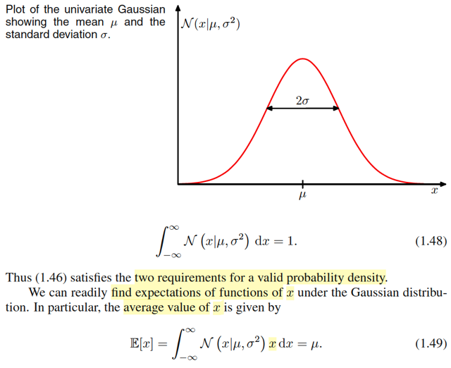</kbd>

> [!NOTE]
> Dĩ nhiên nó là một valid pdf nên nó phải thỏa hai tính chất, sum trên toàn miền
> phải  = 1 và không âm.
>
>
>
> Và mr Bishop để cập đến mean của distribution là μ.
>
>
>
> Còn ở đây, dĩ nhiên để tính mean, tức EX với X ~ normal(μ, σ) có pdf như vậy, thì
> ta sẽ theo định nghĩa của kì vọng mà tính: ∫x f(x)dx
>
>
>
> Để cho dễ ta có thể tính EZ (Z ~ normal(0,1)) trước:
>
>
>
> EZ = ∫-inf:inf zfZ(z)dz = ∫-inf:inf z (1/√2π) e^-z^2/2 dz
>
>
>
> = (1/√2π)∫-inf:inf z e^-z^2/2 dz
>
>
>
> = (1/√2π) [nguyên hàm của z e^-z^2/2] | -inf:inf
>
>
>
> nguyên hàm của z e^-z^2/2 chính là -e^-z^2/2, 
>
>
>
> vì d/dz (-e^-z^2/2) = - d(-z^2/2) e^-z^2/2 . d/dz -z^2/2 (chain rule)
>
>
>
> = - e^-z^2/2  (-z)
>
>
>
> = z e^-z^2/2
>
>
>
> = (1/√2π) [e^-z^2/2] | -inf:inf
>
>
>
> z → -inf → -z^2/2 → -inf → [e^-z^2/2] → 0
>
>
>
> z → inf → -z^2/2 → -inf → [e^-z^2/2] → 0
>
>
>
> → kết quả tích phân = 0.
>
>
>
> Cách nhanh hơn là nhận xét hàm k(z) = zfZ(z) là hàm lẻ, vì:
>
>
>
> k(-z) = (-z)fZ(-z) = -z (1/√2π) e^-(-z)^2/2 = -z (1/√2π) e^-z^2/2 = -k(z)
>
>
>
> Và như vậy thì tích phân từ -inf với inf cũng sẽ = 0.
>
>
>
> Vậy EX = E(σZ + μ), theo tính linearity của kì vọng, = σEZ + μ = 0 + μ = μ 
>
>
>
> Ở đây mình nhắc lại, Normal distribution là một họ distribution thuộc loại location
> scale family, nhưng nó có tính chất đặc biệt là location chính là mean. và scale
> chính là standard deviation. Nói vậy là vì trong Casella ta đã biết, có những
> location scale familly khác thì location chưa chắc đã là mean.

 

#### MGF, moment, phương sai Chuẩn

<kbd>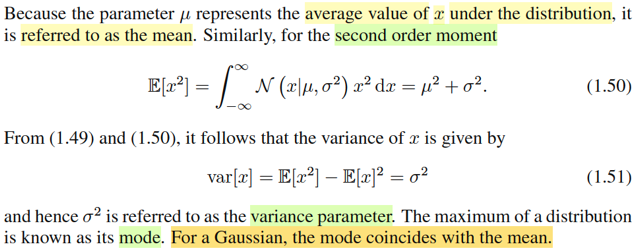</kbd>

> [!NOTE]
> Tiếp, còn nhớ trong stat110 và Casella đã học khái niệm mgf (moment generating
> function) - hàm sinh moment. Với moment được định nghĩa là EX là first moment, EX^2
> là second moment.
>
>
>
> Hàm mgf, được định nghĩa là mX(t) = E[e^tX].
>
>
>
> Thế thì có thể tính second moment bằng cách dùng lotus: ∫x^2fX(x)dx
>
>
>
> Cũng có thể derive công thức mgf của X, để rồi Taylor expansion và lấy hệ số của term
> bậc hai, thì nó cũng chính là second moment.
>
>
>
> Tính theo cách 1: E[X^2] = ∫x^2fX(x)dx (fX(x) là pdf của normal(μ, σ) nếu muốn ghi rườm
> ra thì ghi là f(x|μ, σ) như trong sách này gs Bishop kí hiệu là chữ N hoa luôn)
>
>
>
> = ∫x^2 (1/σ√2π) exp[-(x-μ)^2/2σ^2] dx
>
>
>
> = (1/σ√2π) ∫x^2 exp[-(x-μ)^2/2σ^2] dx
>
>
>
> Để tính cái này cần dùng kĩ thuật integration by part
>
>
>
> Để nhớ lại coi, mình nhớ "story" của cái kĩ thuật này vốn chỉ là bắt nguồn từ product rule
> của gỉai tích:
>
>
>
> d(uv) = udv + vdu ⇨ udv = d(uv) - vdu
>
>
>
> ⇨ ∫udv = ∫d(uv) - ∫vdu
>
>
>
> Ta đã giải cái này trong stat110, Casella rồi, ko viết lại nữa.
>
>
>
> Còn làm theo cách kia, thì mgf của X là exp[μt + (1/2)σ^2t^2]
>
>
>
> Lấy đạo hàm bậc 1 (cũng chính là expand Taylor và lấy hệ số gắn với term bậc 1)
> evaluate tại t = 0 thì ta có fisrt moment (EX)
>
>
>
> d/dt [exp[μt + (1/2)σ^2t^2]]
>
>
>
> = d/d[μt + (1/2)σ^2t^2] exp[μt + (1/2)σ^2t^2] . d/dt [μt + (1/2)σ^2t^2]
>
>
>
> = exp[μt + (1/2)σ^2t^2] . (μ + σ^2t)
>
>
>
> ⇨ d/dt [exp[μt + (1/2)σ^2t^2]] | t = 0 =  exp[0] . (μ) = μ
>
>
>
> Lấy đạo hàm bậc 2, evaluate tại t = 0 ta sẽ có second moment, EX^2:
>
>
>
> d/dt [đạo hàm bậc nhất] = d/dt [exp[μt + (1/2)σ^2t^2] . (μ + σ^2t)]
>
>
>
> = { d/dt exp[μt + (1/2)σ^2t^2] } (μ + σ^2t)] + [exp[μt + (1/2)σ^2t^2]  d/dt  (μ + σ^2t)] |
> product rule
>
>
>
> = { đạo hàm bậc nhất } (μ + σ^2t)] + [exp[μt + (1/2)σ^2t^2]  σ^2]
>
>
>
> ⇨ [đạo hàm bậc 2] | t = 0 = { đạo hàm bậc nhất | t=0} (μ)] + [exp[0]  σ^2]
>
>
>
> = [μ (μ)] + [exp[0]  σ^2]
>
>
>
> = μ^2 + σ^2 → như trong sách
>
>
>
> Và dùng công thức thứ hai của Variance: VarX = EX^2 - (EX)^2 = μ^2 + σ^2 - μ^2 = σ^2.
>
>
>
> ====
>
>
>
> Cái ý mà gs Bishop nói rằng với Normal thì mode trùng với mean là một ý mới mà mình
> chưa nghe trong Casella

 

##### PDF Gaussian Đa Biến

<kbd>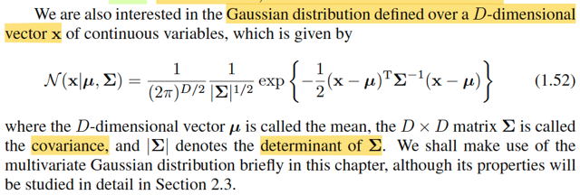</kbd>

> [!NOTE]
> Sự thật thì mình nhớ cả Stat110 và Casella đều chưa từng nói về công thức này.
>
>
>
> Nhưng có thể xây dựng công thức của trường hợp iid standard normal trước, tức là joint pdf của iid Zi \~n(0,1) Khi đó **Z** sẽ có mean E**Z** = **0** và covariance matrix Cov(**Z**) = **I**.
>
>
>
> Từ đó, đổi biến **X** = A**Z** + **μ** để E**X** = μ và covariance matrix Cov(**X**) = Σ
>
>
>
> Đầu tiên xây dựng joint pdf của **Z**:
>
>
>
> f(z1,...zn) = Πi f(zi) (do tính iid) = Πi (1/√2π) exp\[-zi^2/2\]
>
>
>
> = \[(2π)^-n/2\] Πi exp\[-zi^2/2\]
>
>
>
> = \[(2π)^-n/2\] exp\[-Σizi^2/2\]
>
>
>
> Thể hiện dưới dạng vector: Σizi^2 = **z**T**z**
>
>
>
> .. = \[(2π)^-n/2\] exp\[-**z**T**z**/2\]
>
>
>
> Thế thì, tất nhiên E**Z** = \[EZ1, EZ2,...EZd\] = \[0, ...0\] = **0** Bữa trước đã nói covariance của hai random variable vector **X**, **Y** sẽ là một matrix: Cov(**X**, **Y**) = E\[(**X** - E**X**)(**Y** - E**Y**)T\], để rồi phần tử hàng i cột j: ij sẽ là E\[(Xi - EXi)(Yj - EYj)\] chính là Cov(Xi, Yj)
>
>
>
> ⇨ Cov(**Z**, **Z**), có thể viết tắt là Cov(**Z**), = E\[(**Z** - E**Z**)(**Z** - E**Z**)T\]
>
>
>
> = E\[**ZZ**T\] (kì vọng của **Z** outer product với **Z**)
>
>
>
> Và matrix này sẽ có phần tử thứ ij là Cov(Zi, Zj). Và phần tử trên đường chéo ii chính là Var(Zi) (Cov(Zi, Zi) chính là Var(Zi))
>
>
>
> Vấn đề là Zi, Zj độc lập, do ta đang xét iid Zi: Nhớ lại định nghĩa iid đã học trong Stat110 và Casella: Random sample of size n X1,....Xn \~ f(x|θ) được định nghĩa là: Ta thực hiện quan sát một đại lượng ngẫu nhiên nào đó, n lần Mỗi lần giá trị của nó sẽ được đại diện bằng random variables Xi. Và cách thực hiện đảm bảo sao cho các rvs Xi MUTUALLY INDEPENDENT, và chúng đều có chung population distribution f(x|θ), gọi là IDENTICALLY DISTRIBUTED.
>
>
>
> Và đã biết nếu X, Y độc lập thì E(XY) = EXEY ⇨ Cov(X, Y) = 0. Vậy Cov(Zi, Zj) = 0 ∀ i ≠ j.
>
>
>
> Còn Var(Zi) thì vì Zi \~ n(0,1), nên nó bằng 1.
>
>
>
> Do đó Cov(**Z**,**Z**) CHÍNH LÀ IDENTITY MATRIX.
>
>
>
> Rồi, ta sẽ
>
>
>
> Đổi biến **X** = g(**Z**) = **AZ** + **μ** với **Σ = AA**T là covariance matrix mong muốn, **μ** là vector \[μ1, ...,μn\]. Và ta sẽ xây dựng pdf của **X**, mà ta cho rằng nó sẽ chính là pdf của multivariate Normal(**μ**, **Σ**)
>
>
>
> Do đó cần làm rõ hai điểm:
>
>
>
> 1. Đổi biến như vậy, thì **X** có phải là normal không.
>
>
>
> 2. Mean và covariance có phải là **μ** và **Σ** không.
>
>
>
> Trả lời ý 1:
>
>
>
> Điều này đồng nghĩa với việc Xi có phải là normal distribution nữa không.
>
>
>
> Với **X** = **AZ** + **μ**, Xi = \[hàng i của A\]TZ + μi
>
>
>
> = Σj=1:d aij Zi + μi
>
>
>
> tức là một affine combination của Zi (ko phải là linear combination nhé)
>
>
>
> Thế thì hồi Stat110 đã học, nếu X, Y đều là normal rv thì X + Y cũng là normal
>
>
>
> Chứng minh thì cũng dễ thôi, dùng một theorem liên quan MGF: Đó là nếu X, Y độc lập thì với U = X + Y thì ΜU(t) = MX(t)\*MY(t). Chứng minh rất dễ:
>
>
>
> Theo định nghĩa, moment generating function mgt của X, kí hiệu là MX(t) được định nghĩa là = E\[e^tX\].
>
>
>
> ⇨ Μ(t) = E\[e^tU\] = E\[e^t(X+Y)\] = E\[e^tX \* e^tY\]
>
>
>
> Và theo 2D LOTUS, ta tính cái này: ∫∫ e^tx e^ty fXY(x,y)dxdy (fXY(.) là joint pdf của X, Y)
>
>
>
> Mà X, Y độc lập thì joint pdf = tích marginal pdf:
>
>
>
> ∫∫ e^tx e^ty fXY(x,y)dxdy = ∫∫ e^tx e^ty fX(x)fY(y)dxdy
>
>
>
> = ∫e^tyfY(y) \[∫e^tx fX(x)dx\] dy | tính tích phân theo x trước coi term liên quan đến y như constant, đưa ra
>
>
>
> = ∫e^tx fX(x)dx ∫e^tyfY(y)dy | tính tích phân theo y thì coi ∫e^tx fX(x)dx như constant, đưa ra
>
>
>
> = Đây chính là E\[e^tX\] E\[e^tY\]
>
>
>
> cũng chính là MX(t) \* MY(t).
>
>
>
> Áp dụng theorem này, nếu X \~ normal(μ1, σ1^2) và Y \~ normal(μ2, σ2^2)
>
>
>
> và với normal μ, σ ta biết mgf có dạng: exp(μt + σ^2t^2/2)
>
>
>
> thì ΜU(t) = MX(t) \* MY(t) = exp(μ1t + σ1^2t^2/2) exp(μ2t + σ2^2t^2/2)
>
>
>
> = exp(μ1t+μ2t + σ1^2t^2/2 + σ2^2t^2/2)
>
>
>
> = exp\[(μ1+μ2)t + \[σ1^2/2 + σ2^2/2\]t^2)
>
>
>
> có dạng một mgf của normal(μ1 + μ2, σ1^2 + σ2^2)
>
>
>
> và như đã biết trong Stat110, hay Casella, MGF, cũng như CDF, PDF, PMF có thể định nghĩa một distribution. Có nghĩa là ta có thể kết luận U = X + U chính là một normal(μ1 + μ2, σ1^2 + σ2^2).
>
>
>
> Vậy thì quay lại đây:
>
>
>
> Đầu tiên phải nói a1i Zi, với việc Zi \~ normal(0,1), tức standard normal, mà như đã biết, normal là một location scale family, với điểm đặc biệt là location trùng với mean, scale cũng chính là standard deviation. Và theo lí thuyết location scale family, thì nếu ta có Z là standard member, tức là pdf có location 0, scale 1, thì σZ + μ sẽ là rv có pdf thuộc family nhưng ứng với location μ, scale σ.
>
>
>
> Vậy ở đây a1iZi chính là thành viên ứng với location 0, scale a1i. Cũng đồng nghĩa, nó là normal(0, a1i^2) với với i = 1,...,d.
>
>
>
> Vậy thì xét a11Z1 + a12Z2, đây là tổng của hai rvs: a11Z1\~ normal(0, a11^2) và a12Z2 \~ normal(0, a12^2)
>
>
>
> Nên theo điều vừa ôn lại, nó chính là rv \~ normal(0+0, a11^2 + a12^2)
>
>
>
> Và lặp lại lập luận này, ta sẽ có Σj a1jZj chính là một normal(0, Σj a1j^2), tức là variance của rv này là tổng các phần từ hàng 1 của A.
>
>
>
> Tiếp, ta, theo location scale cũng dễ thấy Σj a1jZj + μ1 cũng là một normal(μ1, Σj a1j^2)
>
>
>
> Vậy X1 là normal(μ1, Σj a1j^2), ..
>
>
>
> Xi \~ normal(μi, Σj aij^2)
>
>
>
> Như vậy ta sẽ trả lời ý 2 luôn:
>
>
>
> Với Xi \~ normal(μi, Σj aij) ⇨ E\[**X**\] = \[EX1,...EXd\] = \[μ1, ..μd\] = **μ**.
>
>
>
> Cov(**X**, **X**) = E\[(**X** - E**X**)(**X** - E**X**)T\]
>
>
>
> = E\[(**X** - E**X**)(**X**T - (E**X**)T)\]
>
>
>
> = E\[(A**Z** + **μ** - **μ**)((A**Z** + **μ**)T - **μ**T)\]
>
>
>
> = E\[(A**Z**)(**Z**T**A**T + μT - μT)\]
>
>
>
> = E\[**AZZ**T**A**T\]
>
>
>
> = **A**E\[**ZZ**T\]**A**T (Linearity)
>
>
>
> Xét E\[**ZZ**T\]: Để thấy nó là cái gì, ta xét Cov(**Z**,**Z**) = E\[(**Z**-E**Z**)(**Z**-E**Z**)T\] = E\[(**Z** - **0**)(**Z**T - **0**T\] (**0** là vector zero)
>
>
>
> = E\[**ZZ**T\]. À như vậy,E\[ZZT\] = Cov(**Z,Z**) và như ở trên mình đã biết, nó là Identity matrix: I
>
>
>
> Vậy.. = A I AT = AAT và như đã nói, ta chọn A sao cho Σ (covariance matrix mong muuốn) = AAT
>
>
>
> ⇨ Cov(**X**,**X**) = **Σ**
>
>
>
> =====
>
>
>
> Tới đây ta đã chứng minh xong **X** sẽ là normal(**μ**, **Σ**). Việc bây giờ là xây dựng pdf của X
>
>
>
> Tất nhiên là ko thể tích các marginal pdf của Xi được, vì Xi KHÔNG ĐỘC LẬP, COVARIANCE MATRIX KO PHẢI LÀ DIAGONAL MATRIX (các term ngoài đường chéo, là covariance các Xi, Xj)
>
>
>
> Ta sẽ dùng công cụ transformation:Thế thì, đã học trong Casella, nếu ta có random vector (vector of random variable) \[X,Y\] và thông qua một phép biến đổi để có \[U,V\] = \[g1(X,Y), g2(X,Y)\]
>
>
>
> Sao cho mapping giữa (X,Y) ∈ support set của \[X,Y\] và (U,V) là 1-1.
>
>
>
> (support set của X còn nhớ, đại khái là subset của range X sao cho tại đó / trên đó pdf/pmf của X dương, vậy thì support set của random vector \[X, Y\], là subset của R^2, sao cho trên đó joint pdf fX,Y(x,y) dương)
>
>
>
> Có nghĩa là, với U,V ∈ support set của \[U,V\] ta có thể tìm được (X, Y) = \[h1(U,V), h2(U,V)\] thuộc support set của random vector \[X,Y\])
>
>
>
> Thì khi đó ta có transformation theorem cho phép tính joint pdf của U,V từ joint pdf của X,Y:
>
>
>
> fU,V(u,v) = fX,Y(x,y) |J|
>
>
>
> = fX,Y(h1(u,v), h2(u,v)) |∂(x,y) /∂(u,v)|
>
>
>
> Như đã biết từ MIT 18.02, kí hiệu này ∂(x,y) /∂(u,v) nhằm chỉ Jacobian matrix, mà hàng 1 sẽ là ∂x/∂u, ∂x/∂v hàng 2 sẽ là ∂y/∂u, ∂y/∂v.
>
>
>
> Thế thì giả sử \[U,V\]T = A \[X,Y\]T + μ (tức là cũng là một affine transformation)
>
>
>
> Ôn lại kiến thức giải tích nếu ta có f(x) = Ax + b là R^n → R^m function ⇨ ∇f(x), cũng là Jacobian.
>
>
>
> Theo MIT 18s096, ta có thể tính ∇f(x) như sau: df = f(x + dx) - f(x) = Ax + Adx + b - Ax - b = Adx linear operation act on dx, Và bản chất của đạo hàm bậc nhất là một linear operation act on dx : f'(x)\[dx\] Từ đó suy ra matrix Jacobian chính là A.
>
>
>
> Nếu A invertible, ta có quan hệ ngược lại: x = Ainv(f - b) = Ainvf - Ainvb
>
>
>
> Và khi đó ∇x(f), là Jacobian của phép biến đởi f → x chính là Ainv.
>
>
>
> Vậy thì quay lại đây nếu gọi vector **f** = \[u,v\]T và **x** = (x,y) thì Jacobian ∂(x,y) / ∂(u,v) chính là Ainv.
>
>
>
> Và cái ta cần là determinant của nó: |det A|
>
>
>
> Và ta cũng đã biết trong MIT 1806: det Ainv = 1/ det A. Chứng minh rất dễ: AAinv = Ainv A = I ⇨ det(AAinv) = det I = 1 (tính chất đầu tiên của det thầy Strang dạy trong bài định thức chính là det I = 1)
>
>
>
> Rồi det(AB) = det A det B ⇨ det (AAinv) = det A det Ainv = 1 ⇨ det Ainv = 1 / det A
>
>
>
> Vậy cái cần |∂(x,y) /∂(u,v)|, chính là 1 / |det A|
>
>
>
> ====
>
>
>
> Tiếp tục: fU,V(u,v) = fX,Y(x,y) |J|
>
>
>
> Công thức này (bivariate case) cũng sẽ khát quát lên cho multivariate case.
>
>
>
> Nên áp dụng nó, với random vector X = A Z + μ
>
>
>
> fX(x) = fZ(z) |J|
>
>
>
> Và ta đã hiểu |J| cũng chính là 1/ |det A|
>
>
>
> Thay fZ(z) vô: = \[(2π)^-d/2\] exp\[-**z**T**z**/2\]
>
>
>
> Với **x** = A**z** + **μ** ⇨ z = Ainv**x** - Ainv**μ**
>
>
>
> ⇨ **z**T**z** = (Ainv**x** - Ainv**μ**)T(Ainv**x** - Ainv**μ**)
>
>
>
> = (**x**TAinv - **μ**TAinvT)(Ainv**x** - Ainv**μ**)
>
>
>
> = **x**TAinvTAinv**x** - **μ**TAinvTAinv**x** - **x**TAinvTAinv**μ** + **μ**TAinvTAinv**μ**
>
>
>
> Dùng hai identity:
>
>
>
> (AB)inv = BinvAinv (nếu A, B invertible). chứng minh dễ ẹt: (AB)(BinvAinv) = A I Ainv = AAinv = I ⇨ invert của AB chính là BinvAinv
>
>
>
> Và (Ainv)T = (AT)inv, cũng dễ chứng minh: AAinv = I ⇔ (AAinv)T = I ⇔ AinvT AT = I ⇨ inverse của AT chính là AinvT
>
>
>
> ⇨ AinvTAinv = (AT)invAinv = (AAT)inv = Σinv
>
>
>
> ⇨ **x**TAinvTAinv**x** - μTAinvTAinv**x** - **x**TAinvTAinv**μ** + **μ**TAinvTAinv**μ**
>
>
>
> = (**x**T - μT)Σinv**x** - (**x**T- **μ**T)Σinv**μ**
>
>
>
> = (**x**T - **μ**T)(Σinv**x** - Σinv**μ**)
>
>
>
> = (**x**T - **μ**T)Σinv(**x** - **μ**)
>
>
>
> = (**x** - **μ**)TΣinv(**x** - **μ**)
>
>
>
> Vậy f**X**(**x**) = \[(2π)^-d/2\] exp\[-(**x** - **μ**)TΣinv(**x** - **μ**)/2\] \[1 / |det A|\]
>
>
>
> = \[(2π)^-d/2\] \[1/|det A|\] exp\[-(**x** - **μ**)TΣinv(**x** - **μ**)/2\]
>
>
>
> Và Σ = AAT ⇨ det Σ = det A det AT
>
>
>
> Và det A = det AT: Vì sao?
>
>
>
> Theo MIT 1806, trong bài 18. phần cuối gs Strang có nói vần đề này. Đại khái là vầy:
>
>
>
> Khi khử Gaussian đưa A → U, ta có A = LU. ⇨ det A = det L det U.
>
>
>
> L và U đều là lower triangular matrix: det = tích đường chéo (tính chất chung của det của triangular matrix)
>
>
>
> Và L là matrix đường chéo = 1, vì sao? ⇨ det L = 1
>
>
>
> ⇨ det A = det U
>
>
>
> AT = (LU)T = LT UT ⇨ det (AT) = det LT det UT
>
>
>
> = 1 \* det UT = det U
>
>
>
> Vậy det A = det AT vì đều bằng det U
>
>
>
> VẬY det Σ = det A det AT = (det A)^2 ⇨ |det A| = (det Σ)^1/2
>
>
>
> Và kết quả cuối cùng là f**X**(**x**) = \[(2π)^-d/2\] \[1/(det Σ)^1/2\] exp\[(**x** - **μ**)TΣinv(**x** - **μ**)/2\]
>
>
>
> trong sách gs Bishop dùng R^D vector, và |Σ| chính là kí hiệu của det như đã biết
>
>
>
> nên ta có công thức trong sách.
>
>
>
> \[(2π)^-D/2\] \[1/|Σ|^1/2\] exp\[(**x** - **μ**)TΣinv(**x** - μ)/2\]
>
>
>
> =====
>
>
>
> Cuối cùng để chặt chẽ, ta cần nói về việc vì sao có thể tồn tại A
>
>
>
> Σ = AAT, lí do có thể phân tách Σ, hay nói cách khác, có thể tìm được A thỏa điều này là vì Σ là matrix xác định dương (positive definite)

 

###### Ký hiệu vector và mẫu ngẫu nhiên

<kbd>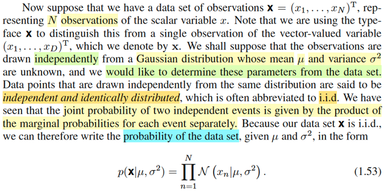</kbd>

> [!NOTE]
> Dưới ánh sáng của Casella thì đoạn này không có gì khó hiểu:
>
>
>
> Như trong cái note vừa rồi mình derive công thức pdf của multivariate Gaussian cũng đã
> ôn lại khái niệm iid: random sample là một bộ các random variable X1,..Xn có cùng
> population distribution f(x|θ) (identically distributed) và chúng mutually independent
>
>
>
> Khi đó xét random vector **X** = [X1,...Xn] có pdf, cũng là joint pdf của X1,..Xn f(**x**).
> Do tính iid, = Πi=1:n f(xi|θ)
>
>
>
> Thì chỗ này gs Bishop có một ý có thể gây confuse đây:
>
>
>
> ông nói x = (x1,....xD)T để chỉ một observed value của random variable vector.
>
>
>
> Còn **x** = (x1,....xN) là chỉ một tập các observed value được drawn iid từ Normal (μ,
> σ^2)
>
>
>
> Hồi nãy, khi xây dựng công thức multivariate Gaussian (**μ**, **Σ**), mình đã bắt đầu với
> **Z** = (Z1,...ZD) là random variable vector, với Zi ~ normal(0,1). Để rồi đổi biến với X =
> A**Z** + **μ** ta có **X** là vector (X1,...XD)
>
>
>
> Thế thì theo đó (x1,...xD) đúng là một observed value của **X**, là một R-D dimensional
> random variable vector ~ Normal(**μ**, **Σ**).
>
>
>
> Thật ra nếu theo notation Casella, thì nếu đặt x = (x1,...xD) thì ta cũng sẽ viết x bold vì
> quy ước luôn là bold cho vector, thường cho scalar. Nên **x** = (x1,... xD)
>
>
>
> Còn ở đây, **X** = (X1,...,Xn) chính là một random sample, như định nghĩa vừa nhắc lại
> ở trên. Do đó vector thì lúc này **x** = (x1,...xn) lại là vector các observed values tức là
> X1 = x1, X2 = x2,...
>
>
>
> Nên X trong bối cảnh sau và bối cảnh trước nó hơi khác nhau.
>
>
>
> Nhưng nếu cứ theo toán mà làm, thì thật ra cũng đều là **X**, random variable vector và
> **x** là giá trị quan sát được của nó.
>
>
>
> Và sự thật thì distribution của **X** trong bối cảnh sau cũng là N-dimensional Normal chỉ
> có điều μ và Σ = diag(σ^2) = σ^2 I (vì các biến X1,...Xn độc lập, nên Covariance matrix
> sẽ là matrix chéo có đường chéo là variance của các Xi, đều là σ^2, còn ngoài đường
> chéo thì = 0 hết do Cov(Xi, Xj) = 0
>
>
>
> Do đó, đoạn này gs phân biệt như vậy, có thể gây khó hiểu.
>
>
>
> Tóm lại ngắn gọn thế này:
>
>
>
> Nếu ta có **X** là một D-dimensional Normal(**μ, Σ**), thì một observed value của nó, sẽ
> là vector:
>
>
>
> thì X là vector các random variable [X1,...XD] trong đó:
>
>
>
> Xi sẽ có distribution là Normal(μi, Σii),
>
>
>
> Xj có distribution là Normal(μj, Σjj)
>
>
>
> Cov(Xi, Xj) = Σij
>
>
>
> Và x = (x1,...xD)là vector các possible value / observed values của X1,...XD
>
>
>
> -----
>
>
>
> Rồi, nếu bây giờ, đổi distribution của X đi chút, để nó là **D-dimensional Normal**(μ
> **1**, σ^2 **I**)
>
>
>
> μ***1** có nghĩa là nhân scalar μ cho vector 1 = [1,...1] để có vector [μ,...μ]
>
>
>
> σ^2 * **I** có nghĩa là nhân scalar σ^2 cho Identity matrix để có matrix với diagonal là
> [σ^2, ...σ^2]
>
>
>
> Thì khi đó, Xi sẽ ~ Normal(μ, σ^2) ∀i, và Cov(Xi, Xj) = 0
>
>
>
> Và x = (x1, ...xD) cũng là vector các possible value của X1,...XD
>
>
>
> ------
>
>
>
> Nhưng nếu, ta có **1-dimensional distribution Normal**(μ, σ^2), và ta sampling từ nó N
> lần, để tạo random sample size N: X1,..Xn, independent identically distributed.
>
>
>
> Thì khi đó Xi cũng ~ Normal (μ, σ^2) với mọi i
>
>
>
> Và nếu gom tụi nó lại, để có vector **X**' = (X1,...XN) thì VỀ BẢN CHẤT, X' SẼ CÓ
> DISTRIBUTION LÀ Normal(μ * **1**, σ^2 * I) y như ở case trên
>
>
>
> Chẳng qua chỉ khác đây là **N-dimensional Normal**(μ * **1**, σ^2 * I).
>
>
>
> ====
>
>
>
> Rồi, thế thì như vậy giúp hoàn toàn rõ ràng rằng, ở đây ta có **X** (mà gs dùng chữ
> **x**, vốn là đã khiến ta mệt mỏi, vì ông làm vậy ông đã không còn theo quy tắc đặt tên
> của toán rồi nhưng may mà mình học Casella nên hiểu rõ để ko bị lú. Nên cứ viết theo
> notation của Stat110 hay Casella: Viết hoa cho biến, viết thường cho giá trị biến, chữ
> đậm cho vector, chữ ốm cho scalar) là random sample của các X1,...XN có population
> distribution là Normal (μ, σ^2) (và như đã nói, đồng nghĩa **X** = (X1,..Xn) sẽ ~
> N-dimensional Normal(μ * **1**, σ^2 * I) Để rồi sampling từ cái 1-dimensional Normal(μ,
> σ^2) n lần để có **x** = (x1,...xn) thì cũng Y CHANG sampling đúng một lần, từ
> N-dimensional Normal(μ * **1**, σ^2 * I) để có **x** = (x1,...xn)
>
>
>
> Và đó chính là data set, và tới đây CHÚ Ý CỤM TỪ NÀY CỦA mr BISHOP:
>
>
>
> **PROBABILITY OF THE DATA SET**
>
>
>
> Ý ông là sao?
>
>
>
> → Nó chính là ông đang nói: 
>
>
>
> GIÁ TRỊ JOINT PDF CỦA RANDOM SAMPLE **X** = (X1,.. XN) TẠI OBSERVED VALUE **X** = **x**
>
>
>
> Và vì hai cách hiểu trên hoàn toàn phản ánh cùng bản chất, nên ta có thể làm theo lối
> hay làm trong Casella:
>
>
>
> f**X**(x1,...xn|μ,σ^2), với X1,...Xn iid, tức independent, nên joint pdf  = tích marginal pdf:
>
>
>
> = f(x1|μ,σ^2)f(x2|μ,σ^2)...f(xN|μ,σ^2)
>
>
>
> = Πi=1:N f(xi|μ,σ^2) với f(x|μ, σ^2) là pdf của Normal(μ, σ^2)
>
>
>
> Còn nếu theo góc nhìn là giá trị của pdf của **X, ~ N-dimensional Normal**(μ * **1**, σ^2
> * I), tại **X** = **x**, thì ta có:
>
>
>
> f**X**(**x**) với f**X**(**x**) là pdf của **X** ~ N-dimensional Normal(μ * 1, σ^2 * I)
>
>
>
> và nó là công thức vector mà ta chứng minh hồi nãy chỉ thay μ = μ * 1 và Σ = σ^2 * I vô
> thôi
>
>
>
> Dĩ nhiên HAI GÓC NHÌN ĐỀU PHẢN ÁNH CÙNG MỘT BẢN CHẤT VÀ NÓ LÀ MỘT
>
>
>
> Nên nến dùng chữ /N/ (N kiểu)  làm pdf của Normal như trong sách, thì ta có:
>
>
>
> Πi=1:N /N/(xi| μ, σ^2) cũng chính là N(**x**| μ***1**, σ^2***I**)

 

###### Hàm hợp lý và phân phối Chuẩn

<kbd>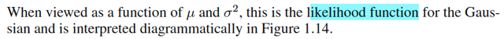</kbd>

<kbd>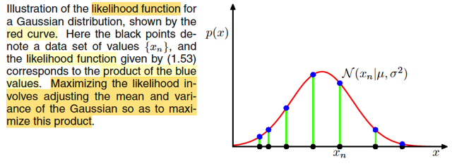</kbd>

> [!NOTE]
> Rồi, thế thì, đã nhắc lại vài lần trong các note trước, trong Casella, ta đã biết
> khái niệm likelihood function, nó làm hàm của θ, (mang ý nghĩa độ hợp lí của θ
> nếu như observed value là **x**), kí hiệu L(θ|**x**) và hàm này được định nghĩa
> là L(θ|**x**) = f(**x**|θ), tức joint pdf của random sample tại **x**.
>
>
>
> Do đó mới nói, cái mà ta có vưa rồi, **XÁC SUẤT CỦA DATA SET**,
>
>
>
> N(**x** | μ**1**, σ^2*I) = Πi=1:N N(xi | μ, σ^2)  **CHÍNH LÀ** **LIKELIHOOD
> FUNCTION CỦA** θ = (μ***1,** σ^2*I) **TẠI X = x**
>
>
>
> L(μ***1**, σ^2*I | **x**), hoặc coi là hàm theo scalar μ, σ^2 thôi cũng được
> L((μ, σ^2)| **x**)
>
>
>
> = N(**x** | μ**1**, σ^2*I) = Πi=1:N N(xi| μ, σ^2)
>
>
>
> -----
>
>
>
> Và người ta mới vẽ cái hình này là sao.
>
>
>
> Chú ý, đường màu đỏ: KHÔNG PHẢI LÀ ĐỒ THỊ HÀM LIKELIHOOD.
>
>
>
> Vì hàm likelihood là hàm của (μ, σ^2)
>
>
>
> Cái hình đó, người ta đang vẽ cái gì:
>
>
>
> Với các đỉem x1, ....xn
>
>
>
> giá trị marginal pdf của Normal(μ, σ^2) tại đó f(x1| μ, σ^2),...f(xn | μ, σ^2) là các
> đoạn xanh lá)
>
>
>
> THÌ **TÍCH CỦA CHÚNG**, MỚI LÀ GIÁ TRỊ CỦA LIKELIHOOD TẠI (μ, σ^2):
> L((μ, σ^2) | **x**)
>
>
>
> Vậy đường màu đỏ là gì, thực ra nó rất dễ confuse
>
>
>
> NÓ KO PHẢI LÀ ĐỒ THỊ CỦA LIKELIHOOD, RẤT NHẢM NHÍ NẾU NGHĨ VẬY.
>
>
>
> NÓ CŨNG KHÔNG PHẢI LÀ ĐỒ THỊ CỦA POPULATION NORMAL N(μ, σ^2)
> VÌ BẢN CHẤT TA KO BIẾT μ, σ^2 là bao nhiêu.
>
>
>
> SỰ THẬT, NÓ CHỈ LÀ MINH HỌA CHO ĐỒ THỊ CỦA NORMAL
> TẠI MỘT CẶP (μ, σ^2) **NÀO ĐÓ**.
>
>
>
> ĐỂ RỒI TA SẼ ĐI MAXIMIZE CÁI LIKELIHOOD, CHÍNH LÀ ĐI TÌM MỘT
> CẶP (μ, σ^2) SAO CHO TÍCH CỦA MẤY CÁCH ĐOẠN MÀU XANH LÁ NÀY
> LỚN NHẤT.
>
>
>
> Vì với mỗi 1 cặp μ, σ^2, ta sẽ có f(x1|μ, σ^2), f(x2|μ, σ^2) khác nhau, và nhân
> tụi nó lại để được L(μ, σ^2|**x**) khác nhau. Và sẽ có 1 cặp nào đó maximize
> giá trị này.
>
>
>
> Và đó chính là MAXIMUM LIKELIHOOD ESTIMATOR CỦA θ = (μ, σ^2)

 

###### Ước lượng Tham số Likelihood

<kbd>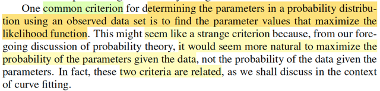</kbd>

> [!NOTE]
> đoạn ông nói một tiêu chí (criterion) để tìm ra parameter của một distribution
> dựa trên  giá trị observed data đó là tìm param khiến maximize likelihood.
>
>
>
> Và có thể thấy lạ, vì đáng lí thì phải maximize distribution của param dựa
> trên observed data chứ sao lại maximize likelihood, nhưng thực ra thì nó có
> liên hệ nhau"
>
>
>
> Như đã biết, dựa vào Bayes rule, ta xây dựng posterior distribution của θ:
> π(θ|**x**) = f(**x**|θ) π(θ) / f**(**x) và với f(**x**|θ) = L(θ|**x**) nên  π(θ|**x**) = L(θ|**x**) π(θ) / f(**x**)
> và nếu π(θ) chọn là uniform, tức π(θ) = constant thì maximize L(θ|**x**) cũng
> chính là maximize π(θ|**x**)

 

###### MLE phân phối chuẩn

<kbd>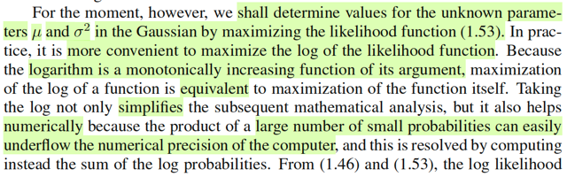</kbd>

<kbd>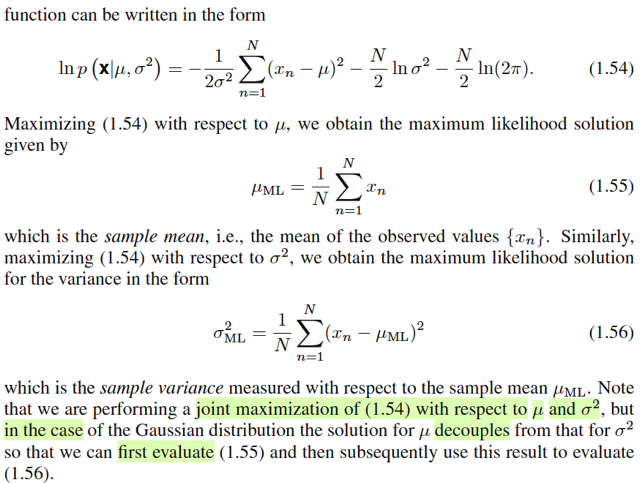</kbd>

> [!NOTE]
> Rồi, đại khái là, vừa rồi nói rằng ta sẽ đi tìm θ để sao cho maximize cái π(θ|**x**) và ta sẽ thấy rằng
> nó có liên hệ với việc maximize L(θ|**x**) sau.
>
>
>
> Còn giờ, ta thử đi tìm θ maximize likelihood L(θ|**x**) trước, cụ thể là với θ là params của normal
> distribution: θ = (μ, σ^2).
>
>
>
> Thì thật đây chính là cái ví dụ mình đã làm trong Casella: Đi tìm MLE của Normal, đây là cơ hội để
> làm lại ví dụ này.
>
>
>
> Đầu tiên ôn lại chút, bối cảnh chương 7 sách Casella là ta deal với bài toán: point estimator - Dựa
> trên giá trị quan sát được của random sample **X** ~ f(**x**|θ) ta muốn thực hiện một suy luận về
> giá trị của θ, và mục tiêu là xây dựng một point estimator, được định nghĩa là một hàm của sample,
> một statistic W(**X**)  bất kì (tức là bất kì hàm số nào của random sample thì đều có thể đóng vai
> một point estimator của θ)
>
>
>
> Dĩ nhiên, theo định nghĩa trên thì việc tìm point estimator tốt sẽ rất mơ hồ Do đó ta mới bàn đến vài
> cách tiếp cận - 3 phương pháp đề cập trong sách Casella: method of moment, maximum likelihood,
> Bayes:
>
>
>
> Thế thì, với MLE, định nghĩa của nó là: ta sẽ maximize hàm likelihood L(θ|**x**) là hàm của θ, define
> bởi L(θ|**x**) = f(**x**|θ), nên θ^_mle(**x**) = argmax_θ L(θ|**x**) = argmax_θ f(**x**|θ), và vì tính iid
> của random sample, f(x|θ) = Πi=1:n f(xi|θ) ⇨ θ^_mle(**x**) = argmax_θ Πi=1:n f(xi|θ)
>
>
>
> Và từ đó, maximum likelihood estimator của θ, như định nghĩa nói trên, là một function của random
> sample: W(**X**), thì ở đây nó chính là:
>
>
>
> argmax_θ f(**X**|θ) = argmax_θ Πi=1:n f(Xi|θ)
>
>
>
> Vậy thì ở đây, ta sẽ đi giải bài toán:
>
>
>
> maximize_(μ, σ^2) { L[(μ,σ^2)|**x**) }
>
>
>
> = maximize_(μ, σ^2) { f(**x**|μ, σ^2) }
>
>
>
> L[(μ,σ^2)|**x**) = f(**x**|μ, σ^2) (kí hiệu như sách là p(**x**|μ, σ^2) nhưng mình cứ dùng kí hiệu
> chuẩn toán học cho dễ)
>
>
>
> = Πi=1:n f(xi|μ, σ^2)
>
>
>
> = Πi=1:n (1/σ√2π) exp[-(xi-μ)^2/2σ^2]
>
>
>
> = (1/σ√2π)^n Πi=1:n exp[-(xi-μ)^2/2σ^2] (tích n cái cục (1/σ√2π))
>
>
>
> = (1/σ√2π)^n exp[Σi=1:n -(xi-μ)^2/2σ^2] (e^a * e^b = e^(a+b))
>
>
>
> = (1/σ√2π)^n exp[(1/2σ^2) Σi=1:n -(xi-μ)^2]
>
>
>
> Tiếp, như đã biết trong Casella, ta luôn nên dùng log để chuyển thành bài toán tối ưu tương đương
> (equivalent), lí do là hàm log monotone increasing, và việc này sẽ khiến tính toán dễ, cũng như
> trong thực tế học máy, sẽ giúp giảm các nguy cơ về lỗi tính toán máy tính
>
>
>
> Nên bài toán tối ưu tương đương cần giải sẽ có objective là:
>
>
>
> log L(**x**|μ, σ^2) = log { (1/σ√2π)^n exp[(1/2σ^2) Σi=1:n -(xi-μ)^2] }
>
>
>
> = log { (1/σ√2π)^n } + log { exp[(1/2σ^2) Σi=1:n -(xi-μ)^2] }
>
>
>
> = n log (1/σ√2π) + (1/2σ^2) Σi=1:n -(xi-μ)^2
>
>
>
> = n log (σ√2π)^-1 + (1/2σ^2) Σi=1:n -(xi-μ)^2
>
>
>
> = -n log (σ√2π) + (1/2σ^2) Σi=1:n -(xi-μ)^2
>
>
>
> Đây chỉ là bài toán tối ưu không ràng buộc, ta sẽ dùng Calculus, điều kiện cần tối ưu bậc nhất:
> Gradient hàm objective, đặt là F đi, = **0**:
>
>
>
> ∇F(μ, σ^2) = **0**
>
>
>
> ⇔ [∂F(μ, σ^2)/∂μ, ∂F(μ, σ^2)/∂σ^2] = 0
>
>
>
> Tính hai cái partial derivative trước:
>
>
>
> ∂F(μ, σ^2)/∂μ
>
>
>
> = ∂/∂μ [-n log (σ√2π) + (1/2σ^2) Σi=1:n -(xi-μ)^2]
>
>
>
> Tính đạo hàm theo μ thì coi σ^2 như constant:
>
>
>
> = (1/2σ^2) ∂/∂μ [Σi=1:n -(xi-μ)^2]
>
>
>
> = (1/2σ^2)  [Σi=1:n -∂/∂μ (xi-μ)^2]
>
>
>
> = (1/2σ^2)  [Σi=1:n -∂/∂(xi-μ) (xi-μ)^2 . ∂/∂μ (xi-μ)] | chain rule
>
>
>
> = (1/2σ^2)  [Σi=1:n -2(xi-μ) . (-1)]
>
>
>
> = (1/2σ^2)  [Σi=1:n 2(xi-μ)]
>
>
>
> = (1/σ^2)  [Σi=1:n (xi-μ)]
>
>
>
> = (1/σ^2)  (Σixi-nμ)
>
>
>
> ∂F(μ, σ^2)/∂σ^2:
>
>
>
> = ∂/∂σ^2 [-n log (σ√2π) + (1/2σ^2) Σi=1:n -(xi-μ)^2]
>
>
>
> = -n ∂/∂σ^2 [log (σ√2π)] + ∂/∂σ^2 [(1/2σ^2) Σi=1:n -(xi-μ)^2]
>
>
>
> = -n ∂/∂σ^2 [log (√2πσ^2)] + [Σi=1:n -(xi-μ)^2] ∂/∂σ^2 (1/2[σ^2])
>
>
>
> = -n [∂/∂(√2πσ^2) log (√2πσ^2) . ∂/∂σ^2 (√2πσ^2)] + (1/2) [Σi=1:n -(xi-μ)^2] ∂/∂σ^2 (1/(σ^2)) }
>
>
>
> = -n [1/(√2πσ^2) . √2π ∂/∂σ^2 (σ^2)^1/2] + (1/2) [Σi=1:n -(xi-μ)^2] (-1/(σ^2)^2)
>
>
>
> = -n [1/(√2πσ^2) . √2π (1/2) (σ^2)^-1/2] + (-1/2(σ^4)) [Σi=1:n -(xi-μ)^2]
>
>
>
> = -n [1/2σ . (σ^-1)]  - (1/2σ^4) [Σi=1:n -(xi-μ)^2]
>
>
>
> = -n/2σ^2  - (1/2σ^4) [Σi=1:n -(xi-μ)^2]
>
>
>
> Giải hai phương trình:
>
>
>
> ∂F(μ, σ^2)/∂μ = 0 ⇔ (1/σ^2)  (Σixi-nμ) = 0
>
>
>
> ⇔ (Σixi-nμ) = 0 ⇔ Σixi = nμ ⇔ μ =Σixi/n ⇨ μ = xbar
>
>
>
> ∂F(μ, σ^2)/∂σ^2 = 0 ⇔ -n/2σ^2  - (1/2σ^4) [Σi=1:n -(xi-μ)^2] = 0
>
>
>
> Thay μ = xbar
>
>
>
> ⇔ -(1/2σ^4) n σ^2 - (1/2σ^4) [Σi-(xi - xbar)^2] = 0
>
>
>
> ⇔ -(1/2σ^4) [n σ^2 + Σi-(xi - xbar)^2] = 0
>
>
>
> ⇨ n σ^2 + Σi-(xi - xbar)^2 = 0
>
>
>
> ⇔ n σ^2 = Σi(xi - xbar)^2
>
>
>
> ⇔ σ^2 = Σi(xi - xbar)^2 / n
>
>
>
> Và đây chính là công thức **biased sample variance**: [Σi (Xi - Xbar)^2] / n
>
>
>
> vs **unbiased sample variance** S^2 = [Σi (Xi - Xbar)^2] / (n - 1)
>
>
>
> ====
>
>
>
> Dĩ nhiên đây mới chỉ là critical point, nơi đạo hàm vanish
>
>
>
> Để chứng minh nó là maximizer, ta sẽ phải chứng minh Hessian tại (μ^_mle, (σ^2)^_mle) xác định
> âm (để tại đó hàm số cong xuống). Và để làm vậy thì việc tính toán rất dài.  Phải chứng minh det
> của Hessian âm. Nên trong sách Casella ở ví dụ 7.2.12 đề cập đến  điều này, trong đó ông cũng ko
> làm việc này, mà chỉ nói sự thật thì kết quả trên chính là normal MLE.
>
>
>
> =====
>
>
>
> Như vậy
>
>
>
> μ_ML(**X**) = Xbar, sample mean
>
>
>
> (Mình cũng có thể viết Xbar(**X**), viết vậy để nhớ trong Casella từng nói, Xbar chỉ là viết tắt của
> Xbar(**X**) vì nó là một hàm của sample **X**)
>
>
>
> Giờ mới viết theo notation của Bishop:
>
>
>
> μ_ML = (1/N) Σi=1:N (xi) / N
>
>
>
> (σ^2)_ml = [Σi (Xi - Xbar)^2] / n
>
>
>
> Viết như Bishop:
>
>
>
> (σ^2)_ml = [Σi=1:N (xi - μ_ML)^2] / N
>
>
>
> ------
>
>
>
> Khúc cuối gs Bishop đại ý là nói, như ta làm ở trên, chính là maximize likelihood cùng lúc over μ,
> σ^2 Nhưng trong EE364a, ta biết cái vụ nếu ta có hàm f(x, y), thì có thể maximize over x trước sau
> đó maximize over y: sup_x,y f(x,) = sup_x [sup_y f(x,y)] = sup_y [sup_x f(x,uy)]. Có thể là ông đang 
> nói đến việc ta có thể giải bài toán maximize over μ  trước rồi giải bài toán maximize over σ^2 sau.

**🔗 See also:** [Ước lượng hợp lí cực đại](./125_curve_fitting_re_visited.md#node-r1gqc9l)

 

###### Sai lệch phương sai MLE

<kbd>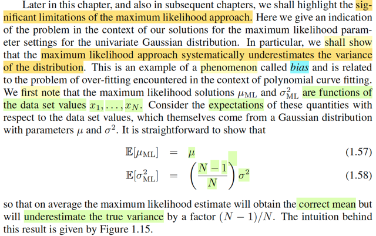</kbd>

> [!NOTE]
> Đạon này ông nói về việc MLE có những hạn chế. Cụ thể là như mình vừa làm
> xong, μ_ML(**X**) = Xbar, theo Casella đã biết, gọi là unbiased estimator của
> μ, còn (σ^2)_ML(**X**) = (1/n) Σi (Xi - Xbar)^2 thì lại là biased estimator của σ^2.
>
>
>
> Còn nhớ, là vì, ta có đã học khái niệm Bias của một estimator, được định
> nghĩa trong sách Casella là 7.32 là:
>
>
>
> Bias_θ(W(**X**)) = E[W(**X**)] - θ,
>
>
>
> để rồi nếu kì vọng E[W(**X**)] mà  = θ thì gọi là unbiased estimator còn không thì là
> biased estimatoe
>
>
>
> Xem thử μ_ML và σ^2_ML có phải là biased estimator không:
>
>
>
> ====
>
>
>
> Nên Bias_μ[Xbar] = E_μ,σ^2[Xbar] - μ = E_μ[(ΣiXi)/n] - μ 
>
>
>
> = Σi E_μ,σ^2 (Xi)/n - μ (linearity)
>
>
>
> = (Σiμ) /n - μ = μ - μ = 0 Do đó **Xbar** là **unbiased** **estimator của μ** 
>
>
>
> ====
>
>
>
> Bias_σ^2[(σ^2)_ML] = E_μ,σ^2[(1/n) Σi (Xi - Xbar)^2] - σ^2
>
>
>
> Để tính kì vọng của (1/n) Σi (Xi - Xbar)^2, theo sách Casella, sẽ 
>
>
>
> khai triển Σi (xi - a)^2 như sau: 
>
>
>
> Σi (xi - a)^2 = Σi (xi - xbar + xbar - a)^2 
>
>
>
> = Σi [(xi - xbar)^2 + 2(xi - xbar)(xbar - a) + (xbar - a)^2]
>
>
>
> =  Σi (xi - xbar)^2 + 2Σi [(xi - xbar)(xbar - a)] + Σi (xbar - a)^2
>
>
>
> =  Σi (xi - xbar)^2 + 2(xbar - a) Σi [(xi - xbar)] + Σi (xbar - a)^2
>
>
>
> =  Σi (xi - xbar)^2 + 2(xbar - a) [(n xbar - n xbar)] + Σi (xbar - a)^2
>
>
>
> =  Σi (xi - xbar)^2 + 2(xbar - a) * 0 + Σi (xbar - a)^2
>
>
>
> =  Σi (xi - xbar)^2 + Σi (xbar - a)^2
>
>
>
> Viết lại: Σi (xi - a)^2 = Σi (xi - xbar)^2 + Σi (xbar - a)^2
>
>
>
> Từ đây, nếu muốn cái này nhỏ nhất thì a chính là xbar, đó là ý a) của Thereom
> 5.2.4 Casella
>
>
>
> Và áp dụng a = 0, thì ta sẽ có công thức: Σi (xi)^2 = Σi (xi - xbar)^2 + Σi (xbar)^2
>
>
>
> ⇔ Σi (xi - xbar)^2 = Σi (xi)^2 - Σi (xbar)^2, đây là ý b) của Theorem 5.2.4 Casella.
>
>
>
> Và ta sẽ dùng ý này để làm tiếp.
>
>
>
> Như vậy E[(1/n) Σi (Xi - Xbar)^2]
>
>
>
> = E[(1/n) [Σi (Xi)^2 - Σi (Xbar)^2]]
>
>
>
> = (1/n) E[Σi (Xi)^2 - Σi (Xbar)^2] | linearity E[cX] = cEX
>
>
>
> = (1/n) [Σi E(Xi)^2 - Σi E(Xbar)^2] | linearity E[X + Y] = EX + EY (1)
>
>
>
> Tới đây ta cần E(Xi)^2 và E(Xbar)^2
>
>
>
> Xét E(Xi)^2, ta đã biết công thức hai của VarX = EX^2 - (EX)^2 ⇨ EX^2 = Var(X) + (EX)^2
>
>
>
> ⇨ E(Xi)^2 = Var(Xi) + (EXi)^2 
>
>
>
>  = σ^2 + μ^2
>
>
>
> (Dĩ nhiên vì X1,...Xn là các rv ~ normal(μ, σ^2) nên EXi chính là μ, VarXi = σ^2)
>
>
>
> Tương tự E(Xbar)^2 = Var(Xbar) + [E(Xbar)]^2
>
>
>
> Với Xbar, Casella cho ta theorem 5.2.6:
>
>
>
> EXbar = μ, Var(Xbar) = σ^2/n, chứng minh dễ:
>
>
>
> EXbar = E[(Σi Xi) / n] = (Σi EXi) / n = n μ / n = μ 
>
>
>
> Var[Xbar] = E[Xbar - EXbar]^2 = E[Xbar - μ]^2 = E[(Σi Xi) / n - μ]^2
>
>
>
> = E[(Σi Xi - n μ) / n]^2
>
>
>
> = E[Σi (Xi - μ) / n]^2
>
>
>
> = (1/n^2) E[Σi (Xi - μ)]^2
>
>
>
> = (1/n^2) Σi Var(Xi)
>
>
>
> = (1/n^2) n σ^2 = σ^2 / n
>
>
>
> ⇨ E(Xbar)^2 = Var(Xbar) + [E(Xbar)]^2
>
>
>
> = σ^2 / n + μ^2
>
>
>
> Vậy, tiếp tục (1), ta có: 
>
>
>
> (1/n) [Σi E(Xi)^2 - Σi E(Xbar)^2]
>
>
>
> = (1/n) [Σi [σ^2 + μ^2] - Σi [σ^2 / n + μ^2]]
>
>
>
> = (1/n) [nσ^2 + nμ^2 - σ^2 - nμ^2]
>
>
>
> = (1/n) [(n - 1)σ^2 ]
>
>
>
> = [(n - 1)/n]σ^2 
>
>
>
> Vậy Bias_σ^2[(σ^2)_ML] = E_μ,σ^2[(1/n) Σi (Xi - Xbar)^2] - σ^2
>
>
>
> = [(n - 1)/n]σ^2 - σ^2, khác 0 nên (**σ^2)_ML là biased estimator của σ^2**
>
>
>
> Phiên bản unbiased như đã biết, chính là S^2, sample variance = (1/n-1) Σi (Xi - Xbar)^2
> (nếu tính kì vọng sẽ ra đúng bằng σ^2)
>
>
>
> ====
>
>
>
> Thành ra gs Bishop nói rằng, **trung bình** mà nói thì **maximum likelihood** sẽ cho ta **giá trị
> đúng của μ** nhưng cho **giá trị underestimate của true variance σ^2**.

 

###### Ước lượng không chệch phương sai

<kbd>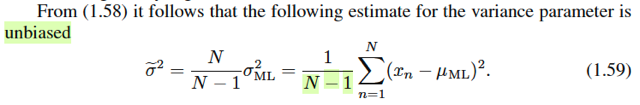</kbd>

<kbd>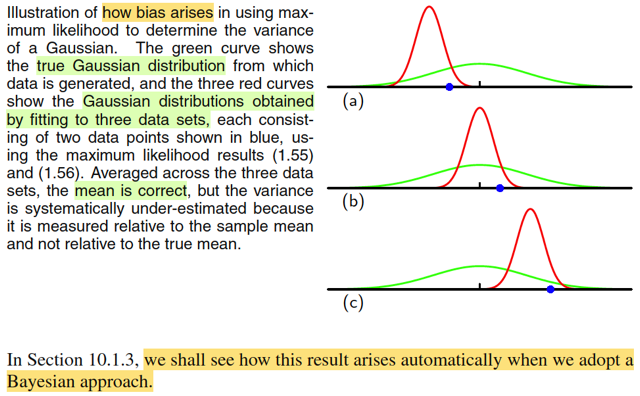</kbd>

<kbd>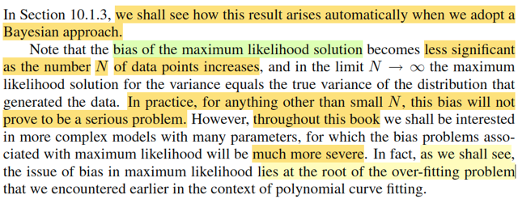</kbd>

> [!NOTE]
> Như vừa nói, sumof (1/(n-1))Σi (Xi - Xbar), tức sample variance (theo sách
> Casella) mới là **unbiased estimator cho σ^2**
>
>
>
> Gs Bishop cho rằng nếu ta giải bài toán theo Bayesian thì ta sẽ ra kết
> quả này thay vì kết quả biased vừa rồi.
>
>
>
> Cuối cùng, đại ý cũng dễ hiểu là khi N lớn (số data sample) thì biased này
> không nghiêm trọng mấy. Nhưng trong sách này ta sẽ phân tích những
> trường hợp mà biased này có thể tạo ra những sai sót nghiêm trọng
>
>
>
> Ông cũng nói thêm, ta sẽ thấy, biased này có bản chất là hiện tượng **overfit**
> mà ta đã gặp trong bài toán polynomial fitting.

 

