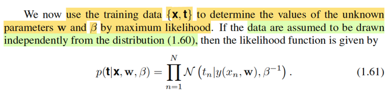
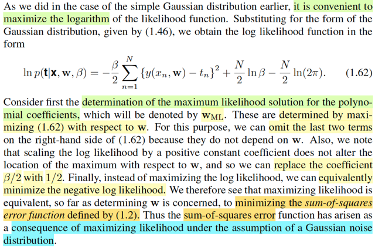
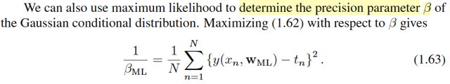
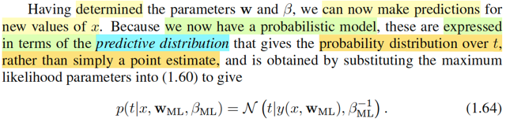
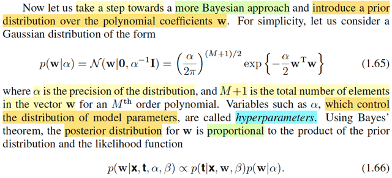
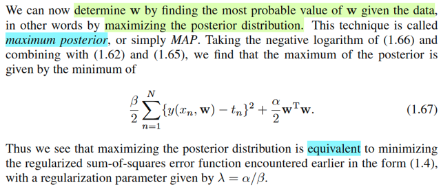

# 1.2.5 Curve fitting re-visited.

📊 **Progress:** `9` Notes | `11` Screenshots

---

 

## Curve Fitting Góc Nhìn Xác Suất

<kbd></kbd>

> [!NOTE]
> Đại khái là ta sẽ quay lại bài toán Curve fitting. Lúc trước, ta tiếp cận bài
> toán này ở góc độ là tìm cách (thay đổi tham số của hàm đa thức) để giảm
> thiểu  error.
>
>
>
> Còn trong lần này, ta sẽ tiếp cận nó dưới GÓC NHÌN XÁC SUẤT
> (probability perspective)
>
>
>
> Và từ đó ta sẽ bắt đầu hướng tới cách tiếp cận toàn diện theo trường phái
> Bayesian (như đã nói, sách này của mr Bishop sẽ chuyên về giải bài toán
> học máy theo góc nhìn Bayesian)

**🔗 See also:** [Khớp đường cong hàm đa thức](./11_example_polynomial_curve_fitting.md#node-79h9mtc)

 

### Mô hình xác suất khớp đường cong

<kbd></kbd>

> [!NOTE]
> Thế thì như đã biết, mục tiêu của bài toán curve fitting (khớp đường cong) là
> ta muốn tái hiện / xây dựng một hàm đa thức mô phỏng hàm số ẩn đằng sau
> quy luật của bộ dữ liệu - vốn được tạo ra theo hàm số t = sin(2πx) + z với z là
> giá trị nhiễu lấy từ phân phối normal(0,1). Và mục đích mô phỏng được hàm
> số này (sin(2πx)) sẽ giúp ta dự đoán được giá trị t từ giá trị x mới một cách
> chính xác.
>
>
>
> Dựa trên cơ sở là ta có một training data set gồm N input (x1,...xn)T và n
> target value (t1,...tN).
>
>
>
> Thế thì tiếp theo gs Bishop nói một ý rất quan trọng mang tính chất bước
> ngoặt để mình có thể tiếp cận bài toán theo góc nhìn xác suất:
>
>
>
> Đó là: Ta sẽ **THỂ HIỆN TÍNH KHÔNG CHẮC CHẮN / NGẪU NHIÊN CỦA
> TARGET VARIABLE BẰNG CÁCH COI NÓ LÀ RANDOM VARIABLE** và dĩ
> nhiên gắn với random variable thì sẽ có distribution.
>
>
>
> Và ta sẽ đặt ra giả định là biến T (như đã nói, mình cứ theo notation của toán
> thống kê, viết hoa cho tên biến, viết thường cho giá trị) sẽ có phân phối
> Normal với mean là y(x, **w**) và variance là 1/β.
>
>
>
> Để rồi pdf của T: f(t | y(x,**w**),1/β) sẽ là pdf của Normal(y(x, **w**),1/β),
>
>
>
> (gs Bishop dùng N kiểu để ý nói là normal pdf, mình hiểu là được)
>
>
>
> Và cũng có có thể ghi là f(t | x,w,β) để nhìn nó như hàm của t dựa trên các giá
> trị x, **w**, β (thông qua trung gian y(x, **w**) và 1/β)

 

#### Phân phối chuẩn điều kiện

<kbd></kbd>

<kbd></kbd>

> [!NOTE]
> Như vậy, với góc nhìn này, dựa trên x,
> **w**, β thì T ~ normal(y(**x**, w), 1/β)

 

##### Phân phối chung và Likelihood

<kbd></kbd>

> [!NOTE]
> Đây là đoạn mấu chốt đây:
>
>
>
> Vừa rồi, ta COI gắn với x=x0 thì T  ~ Normal(y(x0, **w**), 1/β)
>
>
>
> để rồi pdf của nó là f_T(t| y(x0, **w**), 1/β)
>
>
>
> như vậy, với i = 1,2...N, để ta có x=x1,...xN thì ta cũng sẽ có N random variable
> T1, ...TN với:
>
>
>
> Ti ~ Normal(y(xi, **w**), 1/β), có (marginal) pdf f_Ti(ti | y(x0, **w**), 1/β)
>
>
>
> Và gs nói rằng, giả sử data được lấy mẫu theo lối independent và đều từ
> distribution 1.60 thì ...blah blah:
>
>
>
> Chỗ này cần hiểu vầy, rất quan trọng. Nên ôn lại chút về định nghĩa của random
> sample, trong Stat110 và Casella, đã được biết, random sample size n X1,...Xn
> là một bộ các random variable được thu thập sao cho chúng **mutually
> independent** và có chung một population distribution, gọi là **identically
> distributed**. Có nghĩa là marginal distribution của Xi ~ f(xi|θ) với mọi i (thằng
> nào cũng có chung pdf/pmf f(.|θ) hết.
>
>
>
> Vấn đề là, gs giả định đám Ti này độc lập thì ok đi. Nhưng có thể đặt câu hỏi là
> **chúng có cùng population distribution không**?
>
>
>
> Nguồn cơn thắc mắc là ở chỗ, mean của distribution của Ti lại là hàm phụ thuộc
> x: y(x, **w**). Nên rõ ràng là với x khác nhau, ETi = y(xi,w) sẽ khác nhau cho nên
> không thể nói T1 và T2 ứng với x1, x2 là cùng một distribution được.
>
>
>
> Do đó không thể hiểu như bối cảnh của Casella, rằng T1,...Tn đều có chung
> population distribution, chúng chỉ độc lập thôi. Nhưng thật ra, cái ý tiếp theo sau
> đây, **chỉ cần chúng độc lập** là đủ:
>
>
>
> Đó là, ta xét  **JOINT DISTRIBUTION**  của T1,...Tn
>
>
>
> fT1,...Tn(**t**|x1,..xn,**w**,β), hay f**T**(**t**|**x**,**w**,β)
>
>
>
> Vì T1,...Tn độc lập, nên joint distribution của chúng bằng tích marginal
> distribution:
>
>
>
> = fT1(t1|y(x1, **w**), 1/β) * fT2(t2|y(x2, **w**), 1/β) *...* fTn(tn|y(xn, **w**), 1/β)
>
>
>
> = Πi=1:n f(ti| y(xi, **w**), 1/β)
>
>
>
> viết theo notation của gs Bishop, chính là 1.61:
>
>
>
> p(**t** | **x**,**w**,β) = Πi=1:n N(ti| y(xi, **w**), 1/β).
>
>
>
> Và như đã nhắc lại về định nghĩa của hàm likelihood trong các note trước, Với
> sample **X** ~ f(**x**|θ)thì likelihood là hàm số của θ, kí hiệu: L(θ|**x**), có độ
> lớn  được đặt bởi độ lớn của hàm joint pdf của **X** tại **x**: f(**x**|θ), và mang ý
> nghĩa là độ hợp lí của θ khi ta quan sát thấy giá trị **X** = **x** (nói nôm na là:
> tao biết giá trị của **X bị quy định bởi θ**, vậy thì nếu tao thấy giá trị cụ thể x của
> nó, thì với các giá trị θ = θ1 thì có hợp lí không / độ hợp lí là bao nhiêu để giải
> thích hiện tượng này (quan  sát được giá trị này của X), thì cái độ hợp lí đó là
> L(θ1|x).
>
>
>
> Vậy ở đây, nói likelihood thì phải hiểu likelihood của cái gì?
>
>
>
> Theo định nghĩa trên, nó là likelihood của tham số θ, chi phối distribution của **X**.
> Vậy ở đây, dĩ nhiên là nói về likelihood của tham số chi phối distribution của **T**
> = (T1,...Tn). Và trong cái nùi Πi=1:n N(ti| y(xi, **w**), 1/β), dĩ nhiên tham số là **w**, và 
> β (còn x1,..xn đều là giá trị đã biết)
>
>
>
> Do đó, theo định nghĩa trên, ta sẽ có:
>
>
>
> L((**w**,β)|**t,x**) = f**T**(**t**|**x**,**w**,β) = Πi=1:n f(ti| y(xi, **w**), 1/β)

**🔗 See also:** [Phân phối hậu nghiệm Normal](./126_bayesian_curve_fitting.md#node-6vqfvyl)

 

###### Ước lượng hợp lí cực đại

<kbd></kbd>

> [!NOTE]
> Rồi, như vậy tiếp theo ta làm gì:
>
>
>
> Như hôm qua mình đã ôn lại về point estimator đã học trong Casella.
>
>
>
> Ôn nhanh: trong bài toán thống kê suy luận, point estimation là bài toán mà ta muốn xây dựng một estimator, được định nghĩa là một hàm của sample W(**X**) để mục đích là với observed data **X** = **x**, ta có estimate value W(**x**) cho θ sao cho chính xác. Và những phương pháp chính bao gồm method of moment, maximum likelihood estimator và Bayes estimator.
>
>
>
> Với ML estimator, được định nghĩa là θ^\_mle(**X**) = argmax\_θ L(θ|**X**), mang ý nghĩa là θ khiến tối đa hóa độ hợp lí khi quan sát được giá trị của **X**
>
>
>
> Còn Bayes estimator, được định nghĩa là, mean hoặc median của phân phối posterior π(θ|**x**).
>
>
>
> Vậy thì ở đây, θ chính là (**w**, β), ta sẽ làm theo cách thứ nhất, xây dựng ML estimator của (**w**, β). Để rồi lát nữa, ở phần sau ta sẽ làm theo Bayes estimator.
>
>
>
> Như vậy theo định nghĩa trên, ta cần giải bài toán tối ưu sau:
>
>
>
> maximize\_**w**, β L(**w**, β | **t**,**x**) = Πi f(ti| y(xi, w), 1/β)
>
>
>
> Thế thì, tương tự như đã nói ở phần trước, ta có thể chuyển bài toán tối ưu gốc này sang các dạng tương đương (equivalent), là các bài toán mà solution của nó cũng là solution của bài toán gốc, mục đích là để dễ làm hơn
>
>
>
> Và ta có vài cách để chuyển, điển hình là thay việc tối ưu hàm mục tiêu f(x) bằng bài toán tối ưu hàm g(f(x)) với g là một hàm monotone. Nên ở đây, vì log(.) là hàm monotone increasing, nên maximize log L cũng là maximize L
>
>
>
> log L(w, β | **t**, **x**) = log Πi f(ti| y(xi, **w**), 1/β)
>
>
>
> Lôi công thức pdf của normal ra ráp vô
>
>
>
> = log { Πi \[1/√\[2π(1/β)\]\] exp\[-\[ti-y(xi,**w**)\]^2/2(1/β)\] }
>
>
>
> = log { \[1/β^(-1/2)√2π\]^n exp\[Σi-\[ti-y(xi,**w**)\]^2/2(1/β)\] }
>
>
>
> = log { \[β^(1/2)/√2π\]^n } + log exp\[Σi-\[ti-y(xi,**w**)\]^2)/2(1/β)\]
>
>
>
> = n log \[β^(1/2)/√2π\] - (β/2) Σi \[ti-y(xi,**w**)\]^2
>
>
>
> = n log β^(1/2) - n log√2π - (β/2) Σi \[ti-y(xi,**w**)\]^2
>
>
>
> = (n/2) log β - (n/2) log (2π) - (β/2) Σi \[ti-y(xi,**w**)\]^2
>
>
>
> = - (β/2) Σi \[ti-y(xi,**w**)\]^2 + (n/2) log β - (n/2) log (2π), đây chính là 1.62
>
>
>
> ---
>
>
>
> Rồi, một kĩ thuật nữa để có equivalent (optimization) problem là, thay vì maximize hàm objective, ta có thể minimize \[- hàm objective\], cái này đơn giản. Cũng như khi maximize, hay minimize, ta bỏ đi các hằng số không dính đến biến, vì maximize f(x) thì cũng như maximize f(x) + c.
>
>
>
> Và một ý nữa như đã nói ở note trước (xem link), việc giải bài toán tối ưu hai biến, có thể làm theo từng biến lần lượt. Nên ở đây, ta có thể maximize over w trước, để tìm w\*. Sau đó maximize over β, để có β\*.
>
>
>
> Dĩ nhiên w\*, β\* chính là w_ML và β\_ML
>
>
>
> Thử làm:
>
>
>
> Như đã nói, ta sẽ chuyển thành bài toán tìm w\*:
>
>
>
> maximize_w - (β/2) Σi \[ti-y(xi,**w**)\]^2 + (n/2) log β - (n/2) log (2π)
>
>
>
> ⇔ maximize_w - (β/2) Σi \[ti-y(xi,**w**)\]^2 | bỏ constant
>
>
>
> ⇔ minimize_w (β/2) Σi \[ti-y(xi,**w**)\]^2 | maximize objective = minimize negative objective
>
>
>
> ⇔ minimize_w (1/2) Σi \[ti-y(xi,**w**)\]^2 | vì nhân objective cho cho constant 1/β
>
>
>
> Mục đích là để tới đây ta thấy cái hàm objective (của bài toán tương đương lúc này chính là SUM OF SQUARED ERROR (y như cách tiếp cận bài toán này bữa trước) để rồi giúp ta hiểu một điều quan trọng:
>
>
>
> **ĐI TÌM w BẰNG CÁCH MINIMIZE SUM OF SQUARED ERROR LOSS CŨNG CHÍNH LÀ VIỆC ĐI TÌM MAXIMUM LIKELIHOOD ESTIMATOR CỦA w VỚI GIẢ ĐỊNH GAUSSIAN NOISE**.
>
>
>
> Gaussian noise là sao?
>
>
>
> ta đã thấy gs giả định Ti \~ Normal(y(xi, **w**), 1/β)
>
>
>
> Thế thì, Ti - y(xi, **w**) chính là gì:
>
>
>
> Y như việc ta có X \~ Normal(μ, σ^2) thì theo location scale theorem X - μ chính là một Normal(0, σ^2).
>
>
>
> Vậy, Ti - y(xi, **w**) chính là random variable \~ Normal(0, 1/β)
>
>
>
> Như vậy rv có được bằng cách áp hàm error(Ti, y(xi, **w**)) = Ti - y(xi, **w**) sẽ chính là một random variable \~ Normal(0,1/β)
>
>
>
> Mà ta đã biết y(xi, w) là prediction của mô hình, thì e = error(ti, y(xi, **w**)) = ti-y(xi, **w**) là sai số của dự đoán.
>
>
>
> Như vậy với giả định Ti \~ Normal(y(xi, w), 1/β), **CŨNG CHÍNH LÀ TA ĐANG GIẢ ĐỊNH RẰNG SAI SỐ CỦA DỰ ĐOÁN SẼ CÓ PHÂN PHỐI NORMAL(0, 1/β)** Đó chính là ý "under the assumption of a Gaussian noise" của thầy Bishop.

**🔗 See also:** [MLE phân phối chuẩn](./124_the_gaussian_distribution.md#node-alwk6lh)

 

###### Ước lượng ML w và β

<kbd></kbd>

<kbd></kbd>

> [!NOTE]
> minimize_w (1/2) Σi [ti-y(xi,w)]^2
>
>
>
> Rồi, thử đi tìm w_ML
>
>
>
> y(xi, w) = **w**TΦ(xi) với Φ(xi) = [1, xi, xi^2,...]
>
>
>
> ⇨ (1/2) Σi [ti - y(xi,**w**)]^2 = (1/2) Σi [ti - **w**TΦ(xi)]^2
>
>
>
> = (1/2) (**t** - X**w**)T(**t** - X**w**) với row i của X = Φ(xi)T
>
>
>
> = (1/2) (**t**T - **w**TXT)(**t** - X**w**)
>
>
>
> = (1/2) (**t**T**t** - **w**TXT**t** - **t**TX**w** + **w**TXTX**w**)
>
>
>
> = (1/2) (**t**T**t** - 2**t**TX**w** + **w**TXTX**w**)
>
>
>
> = (1/2)**w**TXTX**w** - **t**TX**w** + (1/2) **t**T**t**
>
>
>
> Đây là quadratic function của **w**.
>
>
>
> Với quadratic function f(x) = (1/2)xTPx + qTx + r (x là vector)
>
>
>
> thì gradient là Px + q
>
>
>
> ∇f(**w**) = XTX**w** - XT**t**
>
>
>
> Điều kiện cần tối ưu bậc nhất: ∇f(**w**) = 0
>
>
>
> ⇔ XTX**w** - XT**t** = 0
>
>
>
> ⇔ **w** = (XTX)_invXT**t**
>
>
>
> Và dĩ nhiên đây chỉ là critical point, cần check secondary test: Hessian tại w*
> có positive semi definite thì mới đủ kết luận w* là local minimum
>
>
>
> Dễ thấy Hessian chính là XTX, và đương nhiên nhờ MIT 1806 ta biết,  nó gọi là
> Gram matrix, chắc chắn là positive semi definite vì: Check quadratic form:
> zT(XTX)z = (XTz)T(XTz) = ||Xz||^2 ≥ 0 ∀z.Và đây chính là **w**_ML, dĩ nhiên nó là hàm của **t**,**x** (vì **X** là hàm
> của **x**)(nói vậy để soi chiếu kiến thức trong Casella: point estimator của θ  ,
> θ^_ml(**X**) là hàm của sample **X**)
>
>
>
> Sau đó, ta tiếp tục giải bài toán minimize - log L(**w**_ML, β|t,x) để tìm β_ML.
>
>
>
> Nhưng tiện thể nói thêm tí về w_ML = (XTX)_invXT**t**
>
>
>
> Nó chính là cái gì nhỉ:
>
>
>
> Còn nhớ trong MIT 1806, nói về bài toán tìm projection matrix onto C(A). Lập
> luận như sau: giả sử có vector b, để tìm p là hình chiếu của b lên C(A) Ta làm
> như sau: p ∈ C(A) ⇨ p = Ax^ (p thuộc C(A) nên chắc chắn tồn tại linear
> combination các cột của A để tạo ra p). Phần dư e = b - p sẽ vuông góc với
> C(A), mà C(A) và left nullspace N(AT) orthogonal complement, nên e phải ∈
> N(AT), đồng nghĩa: ATe = 0. Vậy AT(b-p) = 0 ⇔ ATb = ATp ⇔ ATb = ATAx^. Đây
> chính là normal equation.
>
>
>
> Và nếu A full column rank, ATA sẽ full rank / invertible
>
>
>
> ⇨ x^ = (ATA)invATb ⇨ p^ = Ax^ = (ATA)invATb = Pb
>
>
>
> ⇨ P = A(ATA)invAT chính là projection onto C(A) matrix
>
>
>
> Vậy xem lại cái phương trình XTX**w** - XT**t** = 0 ở trên để thấy nó chính là
> normal equation, đi tìm **w**, là hệ số giúp linear combination các cột của XTX
> cho ra **t**.
>
>
>
> Và X**w** = chính là gì, chính là projection của **t** lên C(**X**)
>
>
>
> Mà X**w là gì nhìn lại coi:** Với X là matrix mà row i là Φ(xi)T thì X**w** chính là
> vector [Φ(x1)T**w**, Φ(x2)T**w**, ...]  = [y(x1,**w**),...y(xn,**w**)]
>
>
>
> Từ đó giúp mình hiểu bản chất của bài toán least square này cũng chỉ là t**ìm
> hình chiếu của vector** **t** **lên không gian** C(**X**), như trong MIT 1806 đã học
> với thầy Strang
>
> Tiếp, giải bài toán minimize - log L(**w**_ML, β|t,x) để tìm 1/β_ML.
>
>
>
> Xét hàm objective - (β/2) Σi [ti-y(xi,**w**_ML)]^2 + (n/2) log β - (n/2) log (2π), lúc này
>
>
>
> tương tự, ta sẽ chuyển về bài toán equivalent bằng cách bỏ các constant đi
>
>
>
> (chú ý (β/2) Σi [ti-y(xi,**w**_ML)]^2 + (n/2) log β - (n/2) log (2π) đã đang là log L rồi,
> giờ ta chỉ thêm dấu trừ để chuyển maximize thành minimize và bỏ các constant
> đi thôi)
>
>
>
> minimize_β - { - (β/2) Σi [ti-y(xi,**w**_ML)]^2 + (n/2) log β] }, đặt là f(β)
>
>
>
> df(β)/dβ = d/dβ {(β/2) Σi [ti-y(xi,**w**_ML)]^2 - (n/2) log β]}
>
>
>
> = d/dβ { (β/2) Σi [ti-y(xi,**w**_ML)]^2} - d/dβ [(n/2) log β]
>
>
>
> = Σi [ti-y(xi,**w**_ML)]^2 d/dβ (β/2) - (n/2) d/dβ (log β)
>
>
>
> = (1/2) Σi [ti-y(xi,**w**_ML)]^2 - (n/2) 1/β
>
>
>
> Again, dùng first order optimality condition:
>
>
>
> df(β)/dβ = 0 ⇔ (1/2) Σi [ti-y(xi,**w**_ML)]^2 - (n/2) 1/β = 0
>
>
>
> ⇔ Σi [ti-y(xi,**w**_ML)]^2 - n/β = 0
>
>
>
> ⇔ Σi [ti-y(xi,**w**_ML)]^2 = n/β 
>
>
>
> ⇔ (1/n) Σi [ti-y(xi,**w**_ML)]^2 = 1/β
>
>
>
> Vậy 1/β_ml = (1/n) Σi [ti-y(xi, **w**_ML)]^2 chính là công thức 1.63 trong sách.

 

###### Ước lượng ML, Phân phối tiên đoán

<kbd></kbd>

> [!NOTE]
> Recall sơ lại một chút, so sánh với những gì mình học về ML estimator của
> Casella để soi sáng:
>
>
>
> Trong Casella, để thực hiện một inference point estimation cho θ, tham số chi phối
> phân phối xác suất của sample **X**: (X1,...,Xn) ~ f(**x**|θ). Thì ta có ba phương
> pháp quan trọng. MoM, MLE và Bayes.
>
>
>
> Với MLE: được định nghĩa là θ^_mle(**X**) = argmax_θ L(θ|**X**),
>
>
>
> Với Bayes: Thì ta sẽ theo trường phái Bayesian để coi θ như random variable có
> prior và posterior distribution π(θ) và π(θ|**x**), từ đó bằng cách lấy mean hoặc
> median của π(θ|**x**): Ví dụ E[θ|**X**], thì đó chính là Bayes estimator 
> minimize Bayes risk  với squared error loss 
>
>
>
> (Bayes risk = ∫R(θ, δ(**X**))π(θ)dθ) = R(θ, δ(**X**)) = E_θ[L(δ(**X**), θ)])
>
>
>
> Thế thì đó là kíên thức ở bối cảnh lí thuyết thống kê. Còn sang áp dụng cho bài
> toán curve fitting. Mình cần làm rõ vài điểm để kết nối với kiến thức  nền ở trên:
>
>
>
> Ta thấy điểm quan trọng trong lập luận sẽ là: Ta thể hiện tính chất uncertainty theo
> góc nhìn xác suất, bằng cách giả định Ti là biến ngẫu nhiên tuân theo phân phối
> Normal(y(xi, **w**), 1/β), điều này đồng nghĩa ta cũng đang giả định sai số giữa dự
> đoán của mô hình y(xi, **w**) và Ti: error(Tn) = Ti - y(xi, **w**) là biến số tuân theo
> phân phối N(0, 1/β).
>
>
>
> Từ đó, ta mới nói về joint distribution của T1,...Tn, vì tính độc lập, nên
>
>
>
> f**T**(**t**|**w**,β) = Πi f(ti|**w**, β) = Πi N(ti|y(xi, **w**),1/β)
>
>
>
> Và từ đó ta xây dựng hàm likelihood của **w**, β: L(**w**, β | **t**, **x**) = fT(t|**w**,β)
>
>
>
> = Πi N(ti|y(xi, **w**),1/β)
>
>
>
> Và đi maximize hàm này ta sẽ có (**w**, β)_ML(**X**,**T**) là ML estimator của
> (**w**, β)  Và (w, β)_ML(**x**, **t**) chính là ML estimate của (**w**, β), mang ý
> nghĩa là với giá trị quan sát được (**x**, **t**) thì (w, β)_ML(x, t) là giá trị của w, β
> có độ hơp lí cao nhất.
>
>
>
> Thế thì một điểm cần nhấn mạnh: Đây dĩ nhiên vẫn chỉ là làm theo trường phái cổ
> điển / Frequentist. Vì dù ra nói là coi Ti là biến, có distribution N(y(xi, w), 1/β) thì
> mean của distribution này, là y(xi, w) và variance 1/β **VẪN ĐANG ĐƯỢC COI
> NHƯ CÓ GIÁ TRỊ CỐ ĐỊNH NHƯNG CHƯA BIẾT (FIXED UNKNOWN**
>
>
>
> **Chỉ khi nào ta coi y(xi,w), 1/β như random variable, cũng là coi w, β là random
> variable, và xem xem posterior distribution của nó. Thì lúc đó mới là ta tiến sáng
> Bayesian approach.**
>
>
>
> Như vậy, giúp làm rõ chỗ dễ gây confuse này.
>
>
>
> Với việc dùng (w, β)_ML, ta sẽ có phân phối xác suất của Ti. Và cũng hiểu rằng,
> cũng như θ^_mle(x)  **chỉ là giá trị θ hợp lí nhất**  giải thích cho dữ liệu quan sát được
> X = x, chứ  **chưa chắc nó đã là giá trị chính xác của θ**.
>
>
>
> Nên phân phối N(y(xi, w_ML), 1/ β_ML) chỉ là phân phối tạm gọi là hợp lí nhất dựa
> trên quan sát được data (x,t) mà thôi
>
>
>
> Và nó được gọi là  **predictive distribution**  ta sẽ dùng nó để đưa ra dự đoán:
>
>
>
> Với một giá trị x mới, ta có predictive distribution của t: N(y(x, **w**_ML), 1/β_ML).
>
>
>
> Dĩ nhiên, mình có thể lấy mean của distribution này, vì đây là Normal nên nó là nơi
> có pdf cao nhất.
>
>
>
> ====
>
>
>
> Tới đây chợt nhớ đến language model: Trong các lớp NLP như NLP Spec,
> DLSpec, cs224n mình đã biết các mô hình ngôn ngữ, những mô hình xịn nhất hiện
> nay đều là dự đoạn token tiếp theo dựa trên context là những token xung quanh.
> Thế thì, cái mà ta cần dự đoán, trong bài toán đó, là một trong những từ trong
> dictionary (đã được tokenized), thì bây giờ nhìn lại, có thể thấy, nó chính là một
> multi-nomial random variable (phiên bản khái quát của binomial), vì  possible
> outcome của nó là một trong một dải các options - là các tokens trong dictionary,
> đúng hơn là id của chúng.
>
>
>
> Và cái distribution output ra, (bởi hàm softmax) chính là predictive distribution, để
> rồi từ đó người ta có thể chọn token có xác xuất cao nhất hoặc chọn random từ
> một set các token có xác suất cao nhất.
>
>
>
> Các mô hình ngôn ngữ lớn hiện nay (lõi transformer) vẫn là có cái lõi này.

**🔗 See also:** [Thành phần phương sai dự đoán](./126_bayesian_curve_fitting.md#node-ejt1ih6)

 

###### Phân phối Bayesian của w

<kbd></kbd>

> [!NOTE]
> Rồi, đây mới là lúc tiến sang lãnh địa Bayesian. Như đã ôn lại ở note trước,
> trong Casella, khi ta coi θ là random variable để rồi chọn cho nó một prior
> distribution nào đó phản ảnh hiểu biết sơ khai của ta về nó, sau đó, dùng
> Bayes rule để xây dựng distribution của θ dựa trên quan sát **X** = **x**, mang
> ý nghĩa là cập nhật lại hiểu biết của ta về θ nhờ quan sát thấy sự kiện **X** =
> **x** xảy ra. Và dùng cái distribution này để làm inference / estimator θ. Thì đó
> chính là Bayes estiamtor θ^_B(**X**).
>
>
>
> Vậy nên, ở đây, ta sẽ bắt đầu coi w, β như random variable. và chọn prior
> distribution cho nó.
>
>
>
> Cụ thể là với w, gs Bishop cho rằng nó có phân phối Normal(0, α^-1 * **I**). Cái
> này là sao?
>
>
>
> Ta biết **w**, là **vector** các hệ số của hàm đa thức: [1, w1, w2,...wM] vì hàm
> đa thức là 1 + w1x^1 + w2x^2 + ...wMx^M. Nên giờ coi nó là random variable,
> thì tức là **w lúc này là vector of random variables [1, w1, w2,...wM]**  Đáng lẽ
> tới đây mình nên chuyển thành **W** = [1, W1,...WM] để nhất quán với quy tắc
> kí hiệu của Casella: Chữ hoa cho tên biến, chữ thường cho giá trị biến.
>
>
>
> Thế thì, chọn phân phối Normal(0, α^-1 * **I**) cho **W** chỉ đơn giản nói là: Wi
> đều có phân phối Normal(0, (1/α))
>
>
>
> Mấy phần trước gs đã nói về pdf của multivariate Normal, mình cũng đã tự
> derive lại để hiểu bản chất. thì covariance matrix Σ = (1/α) * **I** cho thấy
> variance của W1,..WM đều bằng 1/α và covariance giữa chúng đều bằng 0.
>
>
>
> Ta còn nhớ trong Stat110 và Casella đã học: Covariance = 0 thì chưa chắc đã
> độc lập, nên ko thể gọi W1,..WM là iid được. Tuy nhiên, còn nhớ trong  Casella,
> bổ đề 5.3.3 giúp nói rằng, với Normal random variables, thì tính độc lập và
> covariance của chúng là là một, tức là, covariance bằng 0 sẽ đồng nghĩa rằng
> chúng độc lập. Do đó ở đây, W1,...WM có tính iid: độc lập và cùng distribution
> Normal(0, (1/α))
>
>
>
> Theo công thức 1.52 (xem link) pdf của N(**μ**, **Σ**)
>
>
>
> = [1/(2π)^D/2] (1/|**Σ**|^1/2) exp {-1/2(**x** - **μ**)T Σinv (**x** - **μ**)}
>
>
>
> **Σ** = (1/α) **I** ⇨det **Σ** = (1/α)^(M+1);
>
>
>
> pdf của W: f(**w**|α) = N(**w**|0, (1/α) **I**)
>
>
>
> = [1/(2π)^(M+1)/2] (1/1/α)^(M+1)) exp {-1/2(**w** - 0)T α (**w** - 0)}
>
>
>
> = [α/(2π)^(M+1)/2] exp {-(α/2)**w**T**w**} → đây là 1.65 trong sách
>
>
>
> -----
>
>
>
> α, là tham số chi phối tham số (variance) của distribution, nên người ta gọi nó
> là  siêu tham số (hyper-parameter).
>
>
>
> -----
>
>
>
> Tiếp, như đã biết đã có prior distribution π(θ), ta sẽ dùng Bayes rule để xây
> dựng posterior:
>
>
>
> π(θ|**x**) = f(**x**|θ) π(θ) / f(**x**) với f(x|θ) là joint distribution của sample **X**,
> f(**x**) có thể coi là prior distribution của **X** cũng được nhưng thường ta không
> care nó, mà chỉ coi nó như hằng số, và nó đóng vai trò là normalizing constant,
> giúp đảm bảo tính valid của pdf π(θ|**x**) (sum / integral over range θ ra được
> 1 và không âm)
>
>
>
> Do đó ta sẽ chuyển sang dùng kí hiệu tỉ lệ thuận:
>
>
>
> π(θ|**x**) ∝ f(**x**|θ) π(θ)
>
>
>
> Vậy thì ở đây cũng vậy:Gs Bishop nói rằng posterior distribution của **w**:
>
>
>
> π(**w**|**x**,**t**,α,β) ∝ f(**t**|**x**,**w**,β) π(**w**|α) (mình vẫn dùng kí hiệu π, và f,
> chả sao)
>
>
>
> Mình có thể đặt câu hỏi:
>
>
>
> i) θ là tham số, ở đây tương ứng phải là cả w, và β chứ nhỉ.
>
>
>
> Nên ở đây có thể hiểu là ta chỉ đang xét Bayes estimator của w, chưa xét của
> β. nên β ở đây coi như đã biết.
>
>
>
> ii) vì sao lại là π(**w**|α), prior trong casella là π(θ) thôi mà:
>
>
>
> → Là vì **w** ~ Normal(0, (1/α) * **I**), nên nó vẫn phụ thuộc α, nhưng đây vẫn
> là prior distribution vì posterior là distribution dựa trên quan sát **X** = **x** (tức
> là **T** = **t**) kìa.

 

###### Ước lượng Bayes và MAP

<kbd></kbd>

> [!NOTE]
> Rồi, tới đây, với việc ta có π(**w**|**x**,**t**,α,β) ∝ f(**t**|**x**,**w**,β) π(**w**|α)
>
>
>
> thì làm gì nữa?
>
>
>
> Đối chiếu với việc tìm Bayes estimator trong Casella: Với công thức posteriori
> π(θ|**x**) = f(**x**|θ) π(θ) / f(**x**), mình sẽ áp công thức f(**x**|θ) và π(θ) vô, triển khai
> ra và xác định được nó là kernel của pdf của distribution nào đó, và từ đó với f(**x**)
> đóng vai normalizing constant thì ta sẽ kết luận distribution của θ given **X** = **x**.Xong, ta sẽ lấy kì vọng của cái này E[θ|**x**], và đó sẽ chính Bayes estimator giúp
> minimize sum squared error loss Bayes risk function.(nếu chọn loss là absolute error loss thì
> Bayes estimator minimize Bayes risk sẽ là median của π(θ|**x**)
>
>
>
> Còn trong bài toán machine learning này, ta làm gì?
>
>
>
> → Ta sẽ thay f(**x**|θ) = L(θ|**x**) (cơ bản chỉ là đổi tên gọi, hay đổi góc nhìn từ việc
> xem nó là hàm pdf của **X** tại **x** sang góc nhìn là hàm likelihood của θ)
>
>
>
> Khi đó ta có π(θ|**x**) = L(θ|**x**) π(θ) / f(**x**), xem nó như hàm g(θ|**x**) nào đó. Và
> ta sẽ đi maximize over θ cái này.
>
>
>
> Đây gọi là **MAXIMIZE POSTERIORI**
>
>
>
> Chỗ này suy ngẫm tí xíu: Trong sách Casella khi nói về Bayes estimator thì thường
> **chỉ nói rằng ta sẽ lấy mean của posterior distribution**. Còn ở đây, trong machine
> learning, ta **lại đi tìm θ khiến maximize** π(θ|**x**). Ngẫm lại, thì không phải
> distribution nào cái mean cũng là nơi có pdf cao nhất.
>
>
>
> Nhưng ví dụ với normal, thì mean cũng là nơi có pdf cao nhất.
>
>
>
> Và 1.2.6 gs Bishop sẽ nói về ý này.
>
>
>
> -----
>
>
>
> Rồi, quay lại bài toán này, làm như trên vừa nói, thay
>
>
>
> ta sẽ đi giải bài toán: maximize_**w** π(**w**|**x**,**t**,α,β)
>
>
>
> nó sẽ tương đương maximize_**w** f(**t**|**x**,**w**,β) π(**w**|α)
>
>
>
> equivalent: maximize_**w** log [L(**w**|**t**,**x**,β) π(**w**|α)] = log L(**w**|t,x,β) + log
> [π(**w**|α)]
>
>
>
> term đầu tiên chính là 1.62: [- (β/2) Σi [ti-y(xi,**w**)]^2 + (n/2) log β - (n/2) log (2π) ]
>
>
>
> term thứ hai: log { [α/(2π)^(M+1)/2] exp {-(α/2)**w**T**w**} }
>
>
>
> = log [α/(2π)^(M+1)/2] + log exp {-(α/2)**w**T**w**}
>
>
>
> = log [α/(2π)^(M+1)/2] - (α/2)**w**T**w**
>
>
>
> Bài toán trở thành: maximize objective function:
>
>
>
> \- (β/2) Σi [ti-y(xi,**w**)]^2 + (n/2) log β - (n/2) log (2π) ] + log [α/(2π)^(M+1)/2 -
> (α/2)**w**T**w**
>
>
>
> và ta sẽ chuyển thành bài toán tương đương tiếp: bỏ các constant không dính tới w
> đi,  nhân cho constant dương 2/β, maximize_**w** { - Σi [ti-y(xi,**w**)]^2 - (α/β) **w**T**w** }
>
>
>
> và chuyển tương đương lần cuối: maximize thành minimize negative:
>
>
>
> minimize_**w** { Σi [ti-y(xi,**w**)]^2 + (α/β)**w**T**w** }
>
>
>
> Và lúc này, nó hiện hình ra đây  **CHÍNH LÀ BÀI TOÁN MINIMIZE SUM SQUARED
> ERROR FUNCTION CÓ REGULARIZER**  mà trong phần 1 (xem link) mình đã làm:
> thêm regularizer vào total error để giúp giảm overfit, với regularizer hyperparam là λ =
> α / β
>
>
>
> Từ đó giúp mình hiểu được rằng: Khi ta giải bài toán curve fitting bằng cách minimize
> error function dùng sum squared error có regularizer là quadratic function của param
> thì thật ra ta đang giải bài toán maximizing posterior distribution với prior được chọn là
> Normal

**🔗 See also:** [Kỹ thuật Regularization và Shrinkage](./11_example_polynomial_curve_fitting.md#node-bwb4qwy)

 

