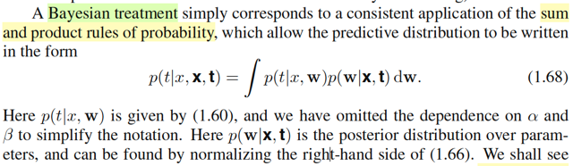
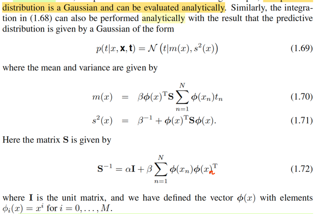
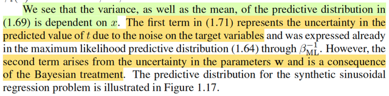
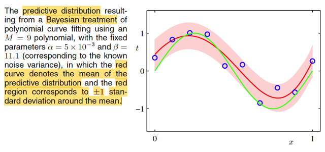
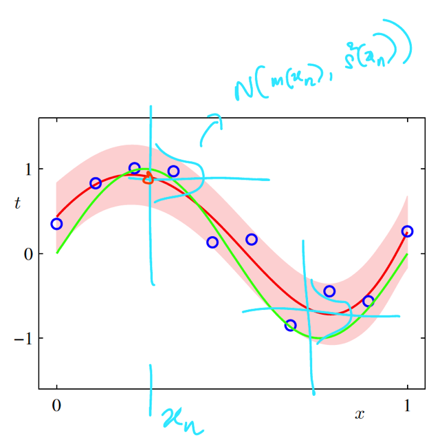

# 1.2.6 Bayesian curve fitting

📊 **Progress:** `6` Notes | `7` Screenshots

---

 

## Xử lý Bayesian đầy đủ

<kbd></kbd>

> [!NOTE]
> Đây, đây chính là chỗ gs giúp làm rõ cái thắc mắc hồi nãy đây. Lúc nãy mình
> có thắc mắc một điểm: Rõ ràng là trong Casella, khi nói về Bayes estimator
> của θ, ta sẽ đi tìm posterior, rồi lấy mean của nó (hoặc median), và đó mới
> là Bayes estimator: θ^_B(**X**) = E[θ|**X**]; θ ~ π(θ|**X**). Còn khi nãy ta lại đi
> tìm θ khiến maximize π(θ|**X**) thôi, nên nó chưa phải là Bayes estimator.
>
>
>
> Thì ở đây ông nói đúng vậy, ta chưa thật sự làm theo full Bayesian treatment,
> mà tí nữa sẽ thấy, khi có posteriori thì ta sẽ INTEGRATE over mọi possible
> value của **w**. Và cái việc này làm ở trái tim của Bayesian method

 

### Phân phối dự đoán Bayes

<kbd></kbd>

> [!NOTE]
> Thế thì, để hiểu phần này, mình sẽ cần ôn lại một kiến thức xác suất gọi là khi
> có joint pdf/pmf của hai random variable X, Y marginalizing over mọi possible
> values của Y, ta sẽ có marginal pmf của X.
>
>
>
> Lấy ví dụ, xét X, Y là hai discrete random variables có possible value {x1,x2. .}
> và {y1,y2....}. Khi đó:
>
>
>
> P(X = x) = Σi P(X = x, Y = yi)
>
>
>
> Dạng tương tự đối với continuous rvs: fX(x) = ∫_{range Y} f(x, y)dy
>
>
>
> Thế thì, tiếp tục dựa trên một theorem: conditional probability theorem:
>
>
>
> f(x, y) = f(x|y)f(y), ta có fX(x) = ∫_{range Y} f(x|y)f(y)dy
>
>
>
> Và ý nghĩa của nó đại khái là ta tổng hợp (marginalizing) mọi khả năng của (giá
> trị) y
>
>
>
> Vậy thì quay lại đây:
>
>
>
> Ta đã có posterior distribution của **w**: π(**w**|**x**,**t**) (tương ứng với
> π(θ|**x**) trong Casella)
>
>
>
> Nhưng, trong Casella, cái ta muốn (suy luận - inference - estimate) là θ, nên ta
> sẽ đi lấy mean để có point estimate cho θ, hoặc maximize posterior, cũng để có
> một point estimate của θ.
>
>
>
> Còn ở đây, trong bối cảnh bài toán curve fitting nói riêng và trong bài toán
> machine  learning nói chung, ta KHÔNG CẦN **w**. Cái ta cần là **predictive
> distribution**:
>
>
>
> f(t|x,**x**,**t**): tức là, ta chỉ cần tính xác suất của T dựa trên traing data **x**, **t
> thôi, không care w**
>
>
>
> Còn nhớ phân phối xác suất của Tn, ta đã assume là sẽ ~ normal(y(xi,**w**),
> 1/β), có pdf là f(t|x,**w**,β).
>
>
>
> Vì không cần **w**, nên ở đây, ta mới làm một động tác: marginalizing joint pdf
> của T và **W trên mọi possible value của W**. Để từ đó, ta có marginal pdf của T
> thôi:
>
>
>
> f(t) = ∫f(t,**w**)d**w** (cái này tương tự như fX(x) = ∫_range Y f(x,y)dy
>
>
>
> và thay f(t,**w**) = f(t|**w**) f(**w**) (tương tự f(x,y) = f(x|y)f(y))
>
>
>
> ta sẽ có: f(t) = ∫f(t|**w**)f(**w**)d**w**
>
>
>
> Cái khung, cái ý tưởng chính là như vậy, ta marginalizing joint pdf của T và **W
> trên  mọi possible value của W, để có marginal pdf của T.**
>
>
>
> Nhưng để có hình hài đầy đủ của 1.68, ta sẽ hiểu rằng các pdf trên đều
> condition trên cái gì đó:
>
>
>
> ví dụ f(t|**w**) phải là f(t|x,**w**,β) vì distribution của Ti ~ normal(y(xi,**w**), β) nên pdf
> của T cần thêm xi, β nữa. Nhưng vì β coi như đã biết, hoặc ở đây gs nói là ta bỏ
> đi bớt (omit) cho đỡ dài, nên ta chỉ ghi là f(t|x,**w**) thôi.
>
>
>
> Tương tự f(**w**) cũng sẽ trở thành f(**w**|**x**,**t**) (hay nên dùng chữ π, vốn
> được quy ước thông thường trong thống kê kí hiệu để chỉ prior và posterior
> distribution π(w|**x**,**t**)) ở trên (đúng ra sẽ là π(**w**|x,t,α) nữa, nhưng cũng
> bỏ bớt α cho đỡ dài.
>
>
>
> f(t|x,**x,t**) = ∫f(t|x,**w**)π(**w**|**x**,**t**)d**w**. Đây là công thức 1.68
>
>
>
> -----
>
>
>
> Một ý nhỏ: ở đây ông Bishop nói có thể tìm thấy π(**w**|**x**,**t**) (theo kí hiệu của ổng
> là p(**w**|**x**,**t**)) bằng cách marginalizing vế bên phải của 1.66 là sao?
>
>
>
> → Thì đơn giản là vì: công thức đầy đủ posterior distribution được xây dựng từ
> Bayes theorem: π(θ|**x**) = f(**x**|θ)π(θ) / f(**x**)
>
>
>
> Hay ở đây sẽ là π(**w**|x,t,α,β) = f(t|x,**w**,β) π(**w**|α) / f(t|x)
>
>
>
> Nhưng vì cái mẫu số, chỉ là đóng vai trò normalizing constant, nên người ta
> thường bỏ qua nó, để chuyển thành kí hiệu tỉ lệ thuận.
>
>
>
> Nên nếu muốn có công thức đầy đủ của posterior, thì đừng quên là còn
> cái mẫu số này, mà mẫu số này thì không biết được là bao nhiêu, vì ta ko
> có f(t|x). Tuy nhiên, ta biết nó phải là giá trị c khiến [ ∫f(t|x,**w**,β) π(**w**|α) / c] d**w** = 1
> ⇨ c = ∫f(t|x,**w**,β) π(**w**|α)] d**w**, đó chính là giá trị của f(t|x).

 

#### Phân phối hậu nghiệm Normal

<kbd></kbd>

> [!NOTE]
> Gs nói trong phần sau, ta sẽ thấy posterior (với Prior giả định là Normal thì) hóa ra cũng sẽ là Normal. Cái này thì
> trong ví dụ 7.2.16 sách Casella mình đã làm rồi, với random sample X ~ normal(θ, σ^2) và θ được giả định có prior
> distribution θ ~ normal(μ, τ^2) thì khi mình xây dựng posterior ta cũng sẽ thấy nó là pdf của normal
>
>
>
> Vậy thì ở đây có thể làm luôn:
>
>
>
> π(**w**|**x**,**t**), như phần trước đã biết, hay lúc nãy đã nhắc lại ∝ f(**t**|**x**,**w**)π(**w**|α)
>
>
>
> ∝ [Πi=1:n N(ti| y(xi, **w**), 1/β)] . [α/(2π)^(M+1)/2] exp {-(α/2)**w**T**w**}
>
>
>
> Xét N(t|y(x,**w**), 1/β).
>
>
>
> y(x, **w**) = w0x^0 + w1x^1 + ...wmx^M = w0 + w1x^1 + ...wmx^M
>
>
>
> Như phần trước mình cũng đã làm, để thể hiện cái này ở dạng compact ta sẽ:
>
>
>
> Đặt Φ(x) là scalar → vector function: nhận vào scalar x, trả ra vector [1, x, x^2,..,x^M]
>
>
>
> Khi đó với việc w đã biết là vector [w0,...wM] thì y(x, **w**) có thể thể hiện ở dạng vectorization: **w**TΦ(x).
>
>
>
> N(t|y(x,**w**), 1/β) = N(t|**w**TΦ(x), 1/β)
>
>
>
> = {1/√[2π(1/β)]} exp[-(t-**w**TΦ(x))^2/2(1/β)]
>
>
>
> = {1/√[2π(1/β)]} exp[-(t-**w**TΦ(x))^2/2(1/β)]
>
>
>
> Ráp vô:
>
>
>
> π(**w**|**x**,**t**) ∝ {Πi=1:n {1/√[2π(1/β)]} exp[-(ti-**w**TΦ(xi))^2/2(1/β)] } . { [α/(2π)^(M+1)/2] exp {-(α/2)**w**T**w**} }
>
>
>
> ∝ {1/√[2π(1/β)]}^n [α/(2π)^(M+1)/2]  exp[-Σi (ti-**w**TΦ(xi))^2/2(1/β)] . exp {-(α/2)**w**T**w**} }
>
>
>
> ∝ exp[-Σi (ti-**w**TΦ(xi))^2/2(1/β) - (α/2)**w**T**w**]
>
>
>
> ∝ exp[-(β/2) Σi (ti-**w**TΦ(xi))^2 - (α/2)**w**T**w**]
>
>
>
> Xét phần bên trong exp[..]:
>
>
>
> -(β/2) Σi [(ti-**w**TΦ(xi))^2] - (α/2)**w**T**w**
>
>
>
> Đặt **X** là matrix mà hàng i là Φ(xi)T
>
>
>
> .. = -(β/2) ||(**t**-**Xw**)||^2 - (α/2)**w**T**w**
>
>
>
> = -(β/2) (**t**-**Xw**)T(**t**-**Xw**) - (α/2)**w**T**w**
>
>
>
> = -(β/2) (**t**T-**w**T**X**T)(**t**-**Xw**) - (α/2)**w**T**w**
>
>
>
> = -(β/2) (**t**T**t**-**w**T**X**T**t**-**t**T**Xw**+**w**T**X**T**Xw**) - (α/2)**w**T**w**
>
>
>
> = -(β/2) (**t**T**t** - 2**t**T**Xw** + **w**T**X**T**Xw**) - (α/2)**w**T**w**
>
>
>
> = -(1/2) (β**t**T**t** - 2β**t**T**Xw** + β**w**T**X**T**Xw** + α**w**T**w**)
>
>
>
> = -(1/2) (**w**T(β**X**T**X** + **α**I)**w** - 2β**t**T**Xw** + β**t**T**t**)
>
>
>
> Như vậy bên trong exp(..) của posterior là hàm bậc hai theo **w**, điều này cho thấy posterior là Normal, để xác
> định được mean và covariance matrix, ta chỉ việc khớp nó với công thức multivariate Gaussian pdf nói bữa trước.
>
>
>
> Xét phần bên trong exp của multivariate Gaussian pdf: -(1/2)(**x** - **μ**)T Σinv (**x** - **μ**)
>
>
>
> = -(1/2)(**x**T Σinv - **μ**T Σinv) (**x** - **μ**)
>
>
>
> = -(1/2)(**x**T Σinv **x** - **μ**T Σinv **x** - **x**T Σinv **μ** + **μ**T Σinv **μ**)
>
>
>
> = -(1/2)(**x**T Σinv **x** - 2 **μ**T Σinv **x** + **μ**T Σinv **μ**)
>
>
>
> Tiến hành khớp pattern:
>
>
>
> β**X**T**X** + α**I** = **Σinv** → Covariance matrix là (β**X**T**X** + αI)inv
>
>
>
> β**t**T**X** = **μ**T Σinv = **μ**T (β**X**T**X** + α**I**)
>
>
>
> ⇔ β**t**T**X**(β**X**T**X** + αI)inv = **μ**T **Σinv** = **μ**T
>
>
>
> ⇔ [β**t**T**X**(β**X**T**X** + α**I**)inv]T = **μ** 
>
>
>
> ⇔ **μ** = [(β**X**T**X** + α**I**)inv]T(β**t**T**X**)T
>
>
>
> = (β**X**T**X** - α**I**)inv(β**X**T**t)**
>
>
>
> Posterior π(**w**|**x**,**t**) là Normal((β**X**T**X** + α**I**)invβ**X**T**t**,  (β**X**T**X** + α**I**)inv)

**🔗 See also:** [Phân phối chung và Likelihood](./125_curve_fitting_re_visited.md#node-8u1p4w9)

 

##### Đạo hàm phân phối dự đoán Bayesian

<kbd></kbd>

> [!NOTE]
> Tương tự, theo gs Bishop, ta có thể g**iải cái tích phân 1.68** (analytically tạm hiểu là có thể giải ra kết
> quả ở dạng closed form)
>
>
>
> Nhưng thật ra ta **có thể làm cách khác,** dựa trên lập luận sau.
>
>
>
> Cái ta đang muốn tìm là distribution của Ti không phụ thuộc **W**. Bằng cách  marginalizing joint pdf
> của Ti, **W** (bản chất của cái tích phân 1.68 là vậy)
>
>
>
> Từ đầu đến giờ gs Bishop đang dùng một assumption: Ti ~ normal(y(xi,**w**), 1/β)
>
>
>
> và ta đã từng nhận ra, điều này đồng nghĩa Ti - y(xi, **w**), chính là sai số của dự đoán, chính là một
> rv ~ Normal(0, 1/β) (do location scale theorem)
>
>
>
> Rồi, đó, là vẫn trong bối cảnh ta dùng trường phái cổ điển (Frequentist), để rồi coi **w** như fixed và
> unknown.
>
>
>
> Sau đó, khi trong bối cảnh hiện tại, ta dùng trường phái Bayesian, thì **w lúc này được đối xử như
> random variable W** có distribution prior và posterior như đã thấy.
>
>
>
> Như vậy, lúc này ta có Zi = Ti - y(xi,**W**) ~ normal(0, 1/β).
>
>
>
> À như vậy ta có Ti = Zi + y(xi, **W**),
>
>
>
> Ti là tổng của một normal(0, 1/β) với y(xi, **W**), lúc này (theo trường phái Bayesian) đã cũng là một
> random variable khác (được tạo bởi hàm y áp lên random variables **W**) có dạng cụ thể là
> **W**TΦ(xi) (hay Φ(x)T**W** đều được vì nó là một scalar)
>
>
>
> Rồi, WTΦ(xi) dĩ nhiên có bản chất là linear combination của các phần tử của W bởi hệ số là các phần
> tử của Φ(xi):
>
>
>
> [1 * x^0 + W1 * x^1 + W2 * x^2 + ....WM * x^M]
>
>
>
> Mà W1,..WM là các random variable có distribution gì?
>
>
>
> Như vừa mới làm xong, W là random vector, có posterior distribution là multivariate
> Normal((β**X**T**X** + α**I**)invβ**X**T**t**,  (β**X**T**X** + α**I**)inv)
>
>
>
> Thì, đương nhiên các random variable W1,...WM cũng là những normal mà mean và variance của
> chúng sẽ là:
>
>
>
> EWi = [(β**X**T**X** + α**I**)invβ**X**T**t**]_i, tức là phần tử thứ i của vector
>
>
>
> VarWi = (β**X**T**X** + α**I**)inv)_ii, tức là entries thứ i trên đường chéo của covariance matrix
>
>
>
> --------------------
>
>
>
> Đến đây mới dùng một kiến thức trong Stat110 và Casella đã học: Tổng các normal sẽ là normal. Hay
> **linear combination các normal cũng là normal** (vì scale một normal rv với α dĩ nhiên cũng ra normal (do
> location scalar theorem)
>
>
>
> Như vậy [1 * x^0 + W1 * x^1 + W2 * x^2 + ....WM * x^M] sẽ là một normal:
>
>
>
> W1 * x^1 + W2 * x^2 + ....WM * x^M là normal, cộng với 1 *x^0 thì kết quả cũng là normal có location
> khác đi bởi 1.
>
>
>
> Vậy tóm lại, Φ(xi)T**W** là một normal random variable
>
>
>
> Thử xem mean và variance của nó:
>
>
>
> Mean: Dùng tính linearity của kì vọng thôi:
>
>
>
> E[Φ(xi)T**W**]  = E[1 * x^0 + W1 * x^1 + W2 * x^2 + ....WM * x^M]
>
>
>
> = 1 + x^1 EW1 + x^2 EW2 + ..x^M EWM
>
>
>
> mà cũng chả cần làm kiểu này, cứ để dạng compact:
>
>
>
> E[Φ(xi)T**W**] = Φ(xi)TE[**W**]
>
>
>
> Thay mean của posterior distribution của **W** vào
>
>
>
> = Φ(xi) (β**X**T**X** + αI)invβ**X**Tt
>
>
>
> Variance: Var[**W**TΦ(xi)]. Tí nữa quay lại cái này.
>
>
>
> Như vậy **W**TΦ(xi) ~ normal(Φ(xi) (β**X**T**X** + α**I**)invβ**X**T**t**, Var[**W**TΦ(xi)])
>
>
>
> --------------------
>
>
>
> Do đó, quay lại Ti = **W**TΦ(xi) + Zi, thì cũng lại thấy Ti là tổng của hai normal.
>
>
>
> Suy ra Ti cũng là normal.
>
>
>
> Và again, chỉ việc dùng linearity để tính mean và variance:
>
>
>
> ETi = E[**W**TΦ(xi) + Zi] = E[**W**TΦ(xi)] + EZi
>
>
>
> = E[Φ(xi)TW] + EZi
>
>
>
> = Φ(xi)T E**W** + 0
>
>
>
> =  Φ(xi)T [(β**X**T**X** + α**I**)invβ**X**T**t**] + 0
>
>
>
> = Φ(xi)T (β**X**T**X** + α**I**)inv β**X**T**t**
>
>
>
> = βΦ(xi)T (β**X**T**X** + α**I**)inv **X**T**t**
>
>
>
> Đây thật ra **chính là công thức của 1.70** m(x) **trong sách Bishop**.
>
>
>
> Trong sách, m(x) = βΦ(x)T **S** Σn Φ(xn) tn
>
>
>
> với **S**inv = α**I** + β Σi Φ(xn) Φ(xn)T (gs Bishop viết thiếu chữ n trong Φ(x) cuối cùng, phải là Φ(xn))
>
>
>
> Phân tích: Σi=1:N Φ(xn) Φ(xn)T là tổng các outer product tại bởi Φ(xn) với Φ(xn).
>
>
>
> Cái này chính là **X**T**X như công thức của mình**, vì sao? 
>
>
>
> → Vì theo công thức của mình, mình đã đặt **X** là matrix mà hàng thứ i là Φ(xi). 
>
>
>
> Nên **X**T**X,** theo góc nhìn nhân matrix vs matrix thứ 4 của thầy Strang: 
>
>
>
> Khi nhân A với B, nó là một tổng các rank 1 matrix tạo bởi outer product của một cột của A và một hàng
> của B. 
>
>
>
> Do đó **X**T**X** sẽ là Σi=1:N ([**X**T]_cột i) (**X**_hàng i)T, 
>
>
>
> và đây chính là Σi=1:N Φ(xi)Φ(xi)TVậy nên **S**inv thật ra chính là β**X**T**X** + αI, hay **S** chính là (β**X**T**X** + α**I**)inv.
>
>
>
> Vậy m(x) trong sách sẽ là βΦ(x)T (β**X**T**X** + α**I**)inv Σn Φ(xn) tn
>
>
>
> Còn cái đuôi Σn Φ(xn) tn, chính là **X**T**t** vì sao? Vì **X** là matrix có các hàng là Φ(xn) thì **X**T là
> matrix có các cột là Φ(xn) ⇨ **X**T**t** theo góc nhìn 18.06, là **linear combination** các cột Φ(xn) của
> **X**T, với bộ hệ số là các phần tử của vector **t**: Σn Φ(xn) tn
>
>
>
> Vậy cho thấy βΦ(xi)T (β**X**T**X** + α**I**)inv **X**T**t** **đích thị là dạng compact của công thức 1.70**
>
>
>
> --------------------
>
>
>
> Còn cái Variance? Quay lại cái còn để ngỏ. Var[**W**TΦ(x)]
>
>
>
> W có covariance matrix (β**X**T**X** + α**I**)inv thì Variance của **W**Tu:
>
>
>
> = Var(**X**Tc)= Var(c1X1 + c2X2 + ...cnXn)
>
>
>
> Công thức Var(X + Y) = VarX + VarY + 2Cov(X,Y)
>
>
>
> ⇨ Var(c1X1 + c2X2 + ...cnXn) 
>
>
>
> = Var(c1X1) + Var(c2X2) + ..Var(cnXn) + 2Cov(c1X1,c2X2) + 2Cov(c1X1,c3X3),,,
>
>
>
> = c1^2Var(X1) + c2^2Var(X2) + ..
>
>
>
> Và đây chính là cTCov(**X**, **X**)c
>
>
>
> ⇨ Var[**W**TΦ(x)] = Φ(x)T Cov(**W**,**W**) Φ(x)
>
>
>
> = Φ(x)T (β**X**T**X** + α**I**)inv Φ(x)
>
>
>
> Và Ti = **W**TΦ(xi) + Zi
>
>
>
> ⇨ Var(Ti) = Var[**W**TΦ(xi) + Zi] = Var[**W**TΦ(xi)] + Var[Zi] + 2Cov(**W**TΦ(xi), Zi)
>
>
>
> Cov(WTΦ(xi), Zi) = 0 do **W**TΦ(xi) và Zi **độc lập**. Vì sao?
>
>
>
> Vì ta phải tự hiểu **đây là một assumption hiển nhiên**: Noise Z độc lập với tham số **W**
>
>
>
> ⇨ Var(Ti) = Var[**W**TΦ(xi)] + Var[Zi]
>
>
>
> = Φ(x)T (β**X**T**X** + α**I**)inv Φ(x) + 1/β 
>
>
>
> Và với việc mình đã chỉ ra S "của gs Bishop" chính là (β**X**T**X** + α**I**)inv "của mình"
>
>
>
> thì đây **chính là công thức s^2(x) 1.71** trong sách.

 

###### Thành phần phương sai dự đoán

<kbd></kbd>

> [!NOTE]
> Đại ý là, khi nhìn vào variance của Ti ~ predictive distribution là normal(mean
> = βΦ(xi)T (β**X**T**X** + α**I**)inv **X**T**t**, Variance = Φ(x)T (β**X**T**X** + α**I**)inv Φ(x) + 1/β
>
>
>
> Thì đại khái là, có 2 yếu tố / cấu phần: 1/β và Φ(x)T (β**X**T**X** + α**I**)inv Φ(x)
>
>
>
> Cấu phần thứ nhất 1/β, dĩ nhiên đến từ việc ta cho rằng sai số của dự đoán
> Ti - y(xi, **w**) là biến tuân theo Normal(0, 1/β)
>
>
>
> Thì cái này, đại ý là cũng tương tự như trong kết quả khi ta giải bài toán 
> maximum likelihood để tìm ML estimator của w và β: w_ML và β_ML 
>
>
>
> (1/β_ml = (1/n) Σi [ti-y(xi, w_ML)]^2)
>
>
>
> Cái chính muốn nói, là, cái cấu phần thứ hai là kết quả đến từ việc ta tiếp
> cận theo Bayesian, để rồi coi **w** như random variable **W**) nên kiểu như điều
> này khiến  **PHÁT SINH THÊM MỘT YẾU TỐ UNCERTAINTY NỮA**  (yếu tố
> uncertainty **do coi w là random variable**), và cái cấu phần thứ hai trong
> variance của Ti phản ánh điều này, quả thật, nó là một term liên quan đến
> covariance variance của posterior distribution của **W**

**🔗 See also:** [Ước lượng ML, Phân phối tiên đoán](./125_curve_fitting_re_visited.md#node-iw7c6u7)

 

###### Phân phối dự đoán

<kbd></kbd>

<kbd></kbd>

> [!NOTE]
> hình ảnh minh họa predictive distribution.
>
>
>
> Đường màu đỏ chính là mean.
>
>
>
> Dĩ nhiên với x khác nhau ta sẽ có các normal(mean = βΦ(xi)T (βXTX +
> αI)inv XTt, Variance = Φ(x)T (βXTX + αI)inv Φ(x) + 1/β) khác nhau
>
>
>
> thì tại một x = xn nào đó, ta sẽ có phân phối của Tn ~normal(mean = βΦ(xn)T (β**X**T**X** +
> αI)inv **X**T**t**, Variance = Φ(xn)T (β**X**T**X** + α**I**)inv Φ(xn) + 1/β)

 

