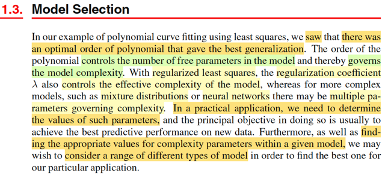
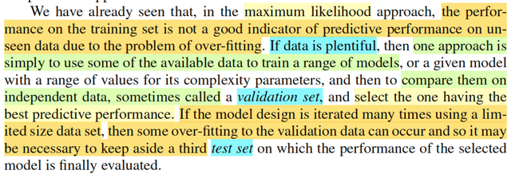
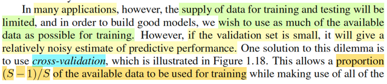
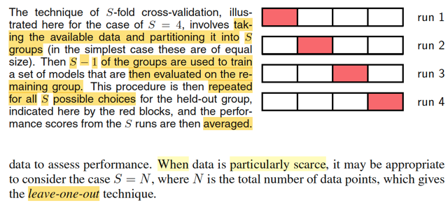
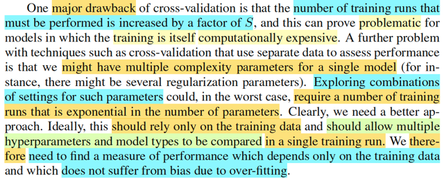
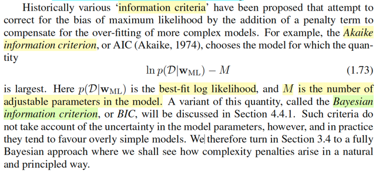

# 1.3 Model Selection

📊 **Progress:** `5` Notes | `6` Screenshots

---

 

## Lựa chọn mô hình

<kbd></kbd>

> [!NOTE]
> Đại khái là, trong ví dụ polynomial curve fitting, mình đã thấy rằng có thể
> chọn một giá trị tối ưu cho bậc đa thức để cho ra kết quả tốt nhất (trong
> tiêu chí generalization - dự đoán cho các data mới - test set)
> '
> Thì trong cách làm theo cách tiếp cận regularized least squares (tức là
> add thêm vào error function một term (λ/2) **w**T**w** giúp gỉam overfit, mà
> ta cũng đã thấy bản chất của nó chính là maximize posteriori của **w**)
> **thì λ, là siêu tham số giúp kiểm soát độ phức tạp (complexity) của
> mô hình.**
>
>
>
> Thế thì đại ý là, ta sẽ thấy, trong thực tế, ta sẽ phải quyết định / đi
> tìm giá trị của các siêu tham số này, giúp kiểm soát độ phức tạp
> của mô hình hoặc thậm chí ta phải cân nhắc để quyết định lọại mô
> hình nào phù hợp với bài toán đang giải nữa.
>
>
>
> Liên hệ với DlSpec, cs231n, mình biết tất cả các yếu tố như số layer,
> số neuron, loại activation function gì, dropout layer, nói chung là kiến trúc
> gì được dùng, đều là hyper-parameter giúp kiểm soát complexity của
> mô hình. (các loại tham số khác như learning rate, thì không nhé, chúng
> là siêu tham số sẽ kiểm soát quá trình tối ưu hóa - training, chứ ko ảnh 
> hưởng đến complexity của mô hình)

 

### Bộ Dữ Liệu Chống Overfit

<kbd></kbd>

> [!NOTE]
> Như đã thấy trong cách tiếp cận maximum likelihood, việc mô hình làm việc
> tốt trên training set chưa chắc đã là chỉ báo tốt cho khả năng generalization.
> Vì mô hình bị overfit sẽ có performance trên trainning set rất tốt nhưng với
> test set sẽ rất tệ.
>
>
>
> Nên nếu data có dư dả (plentiful) thì để kiểm soát overfit, ta có thể thực hiện
> việc chọn các siêu tham số tốt nhất giúp giảm overfit. Bằng cách chia data
> thành 3 bộ: Training set để training, giúp đạt training perform tốt. Sau đó,
> dùng validation set để test và chọn siêu tham số. Cuối cùng là report kết
> quả cuối với test set (gs Andrew Ng đã nhắc đi nhắc lại nhiều lần vụ này:
> test set chỉ được dùng để final report, ko được dùng để chọn cái gì hết)
>
>
>
> Tuy nhiên, ở đây gs Bishop cũng nói đến một vấn đề mà gs Andrew cũng
> từng nhắc đến: Nếu quá trình phát triển mô hình cứ dùng đi dùng lại một
> validation set thì kiểu gì cũng có ngày nó overfit với chính cái validation set.

 

#### Cross-validation với dữ liệu ít

<kbd></kbd>

<kbd></kbd>

> [!NOTE]
> Đại ý là nói về bối cảnh mà giả sử ta có quá ít data. Nên nếu chia làm 3 bộ
> thì bộ validation sẽ quá ít, vô dụng.  Khi đó, một giải pháp là cross-validation.
> Ideas cũng dễ hiểuL: Chia data thành S phần. Bốc S-1 phần đem train, validate
> trên phần còn lại. Và làm vậy với S cặp [S-1 phần cho trainining, 1 phần còn lại]
> và cuói cùng lấy trung bình kết quả.
>
>
>
> Phải hiểu là mỗi một lần train - validate như vậy (làm S lần, mỗi lần train trên
> S-1 phần và test trên 1 phần còn lại) thì ta đang dùng một cấu hình siêu tham
> số nào đó, để có performance của mô hình với cấu hình siêu tham số đó đó.
>
>
>
> Và làm vậy với nhiều cấu hình siêu tham số để rồi lấy kết quả so với nhau để
> chọn ra cấu hình tốt nhất.
>
>
>
> Nói thêm, nếu data quá ít, thì cho S = N, để có cái gọi là leave-one-out. Cái này
> dễ hiểu thôi. Ví dụ N = 1000, và chọn S = 10, thì mỗi lần train sẽ dùng 900
> data points, validate trên 100 cái còn lại,
>
>
>
> Nhưng giả sử quá ít data, ví dụ có vỏn vẹn 100 cái, thì cho S = 100 luôn, để
> mỗi lần train trên 99 data point, và test trên có vỏn vẹn 1 data point còn lại. Do 
> đó mới gọi tên là "chừa ra 1" (leaving one out) technique

 

##### Tiêu chí đánh giá mô hình

<kbd></kbd>

> [!NOTE]
> Đoạn này rất hay: Gs nói cái nhược điểm chính của cách làm này đó là:
>
>
>
> Nếu S mà lớn thì số lần training sẽ tăng theo S. Mà có nhiều khi quá trình
> training RẤT TỐT KÉM (về mặt tính toán), khi đó sẽ không ổn.
>
>
>
> Tệ hơn nữa, có những mô hình mà có nhiều siêu tham số kiểm soát độ
> phức tạp khi đó, để mà đi tìm cái combo những cái tốt nhất của chúng thì
> số lần train và validate còn tốn kém bạo nữa.
>
>
>
> Do đó, ta phải tìm cách khác, cụ thể là phải làm sao để quá trình train và
> validate siêu tham số SẼ :
>
>
>
> 1) CHỈ PHỤ THUỘC TRAING SET, nếu được vậy, có nhiêu data thì xài để
> train hết, khỏi phải để dành cho validate gì cả.
>
>
>
> 2) VIỆC ĐÁNH GIÁ CHỈ CẦN 1 LẦN TRAINING DUY NHẤT, dĩ nhiên vậy
> thì quá tốt, tiết kiệm chi phí tính toán, khỏi phải chạy đi chạy lại nhiều lần.
>
>
>
> Do đó, yêu cầu là ta PHẢI TÌM RA MỘT CHỈ SỐ / MỘT THƯỚC ĐO MỚI
> ĐỂ ĐÁNH GIÁ MÔ HÌNH SAO CHO TA CHỈ CẦN ĐÁNH GIÁ THƯỚC ĐO
> NÀY TRÊN TRAINING SET VÀ SAO CHO THƯỚC ĐO NÀY KHÔNG BỊ
> ẢNH HƯỞNG BỞI HIỆN TƯỢNG  OVERFIT

 

###### Tiêu chí thông tin và Bayes

<kbd></kbd>

> [!NOTE]
> Gs điểm qua một số cách tiếp cận
> mà ta sẽ còn gặp lại sau.

 

