# 1.4 The Curse Of Dimensionality

📊 **Progress:** `6` Notes | `15` Screenshots

---

 

## Lời nguyền của chiều không gian

<kbd>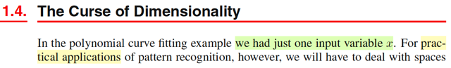</kbd>

<kbd>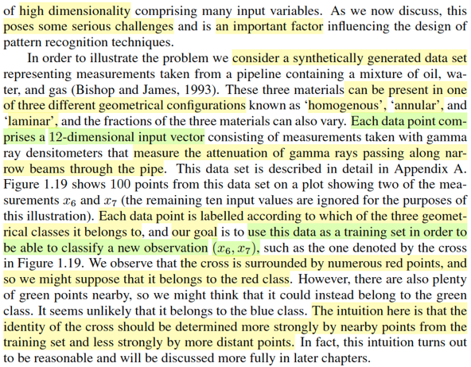</kbd>

> [!NOTE]
> Đại ý là phần này gs sẽ nói về một thách thức với bài toán pattern
> recognition thực tế: Dimension. Ông nói bài toán khớp hàm đa thức bữa
> trước chỉ deal với input đơn biến (xây dừng hàm y(x,w) dự đoán t từ x  thì
> x chỉ là scalar, một con số), nhưng thực tế ta sẽ phải làm việc với bài toán
> có x là vector đa chiều (high dimensional).
>
>
>
>
> Ông lấy ví dụ, đại ý là bài toán mà ta dùng các features - là các thông số
> đo đạc của xăng để dự đoán nó thuộc một trong ba loại gì: homogenous,
> annular và laminar (cụ thể nó là cái gì thì ko quan trọng lắm, chỉ cần biết
> đây là bài toán classification là được), Và các thông số đầu vào, sẽ có 12
> loại thông số, có nghĩa là, mỗi điểm dữ liệu (x, t) thì x sẽ là một vector 12
> chiều, và t sẽ là index / label đại diện một trong 3 class.
>
>
>
> Và người ta vẽ đại khái là 100 điểm dữ liệu thể hiện các class của nó bởi
> 3 màu, chú ý, dĩ nhiên ko thể vẽ đủ 12 chiều được, nên họ sẽ chỉ vẽ mỗi
> điểm với hai feature x6,x7 thôi.
>
>
>
> (Chú ý, đây ko phải là giảm chiều không gian, mà đây là họ dùng thông
> tin của x6, x7 để vẽ - còn gỉam chiều không gian dữ liệu như PCA thì nó
> khác, ví dụ sẽ chiếu data 16 chiều lên mặt phẳng 2 chiều)
>
>
>
> Và nói chung bài toán là muốn train một mô hình giúp dự đoán 1 data 
> point mới xem nó thuộc loại nào.
>
>
>
> Thế thì ông nhận định rằng, ví dụ như new data (x6,x7) cần dự đoán, thể
> hiện bằng dấu x trên đồ thị, thì ta thấy quây quanh nó là mấy cái loại mày
> đỏ hoặc xanh, nên ta có thể đoán nó thuộc loại đỏ hoặc xanh. Và ông nói
> nhận định kiểu này: dùng mấy thằng hàng xóm để dự đoán cũng có khá 
> hợp lí và ta sẽ còn thảo luận kĩ hơn

 

### Lời nguyền chiều dữ liệu

<kbd>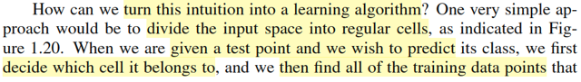</kbd>

<kbd>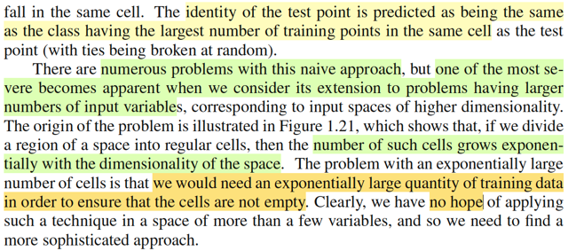</kbd>

<kbd>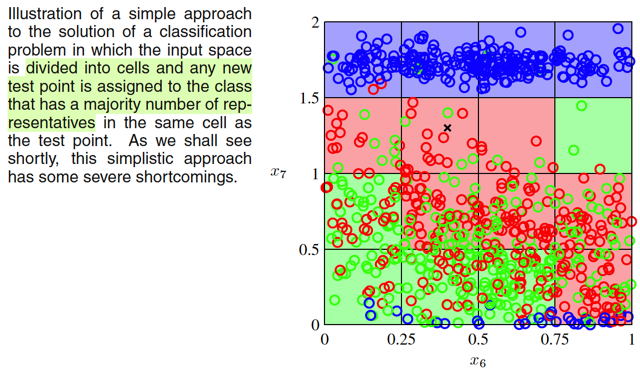</kbd>

<kbd>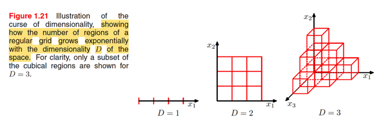</kbd>

> [!NOTE]
> Đại ý là, ta có thể dựa vào cái trực giác vừa nói để thiết kế nên một thuật toán
> phân loại, có thể làm theo kiểu ngây thơ nhất (naive): cứ chia cái plot thành
> các cùng bằng nhau (ví dụ như thành các ô vuông) rồi xem thử trong cái ô 
> chứa cái data mà ta muốn đoán class của nó, thì có những data point loại 
> nào chiếm đa số, thì kết luận cái data ta cần dự đoán cũng thuộc class đó.
>
>
>
> Và ông nói, có hàng tá vấn đề với cách làm ngây thơ kiểu đó, nhưng nghiêm
> trọng nhất là cái này: Số lượng các phân vùng sẽ tăng theo cấp mũ khi tăng
> số chiều dữ liệu lên: Đơn giản là vầy: giả sử ta có không gian 1 chiều (input
> x chỉ là scalar, thì giả sử ta chia một đoạn từ a đến b thành n vùng, thì ta 
> có n vùng. Rồi, giả sử giờ input x là 2 chiều, thì lúc bấy giờ, trong không gian
> dữ liệu ta có thể chia thành nxn là n^2 vùng (ô vuông), Tiến lên input 3 chiều,
> thì số vùng (khối lập phương) sẽ là n^3, cứ thể giả sử là bài toán 12 inputs,
> thì số phân vùng sẽ là n^12, là con số đã rất khổng lồ. Nếu chưa nói, có những
> bài toán thực tế mà input là hàng ngàn.
>
>
>
> Khi đó có nghĩa là sao? Là phần lớn các phân vùng sẽ đều trống, vì lúc này,
> số lượng của nó vượt xa số data point mà ta có. Mà như vậy, phương pháp
> ngây thơ vừa rồi sẽ fail miserable, vì một data point cần dự đoán có khả năng
> rất cao là chả có ma nào nằm chung phân vùng mới nó để mà lấy class gán
> cho nó hết. Do đó mới nói, muốn làm cách này thì số lượng data phải cực lớn

 

#### Khớp Đa Thức Kích Thước Cao

<kbd>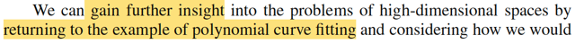</kbd>

<kbd>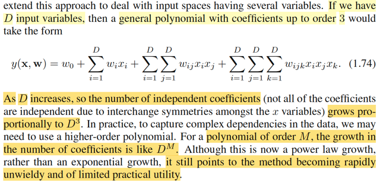</kbd>

> [!NOTE]
> Lấy ví dụ bài toán khớp hàm đa thức, giả sử input là đa biến (D biến) thì
> dạng của hàm đa thức sẽ như vầy, ý chính muốn nói là: số lượng tham số
> của hàm đa thức sẽ tăng chóng mặt, khi muốn dùng bậc đa thức M cao lên
> thì số hệ số sẽ là D^M.

 

##### Trực giác hình học đa chiều

<kbd>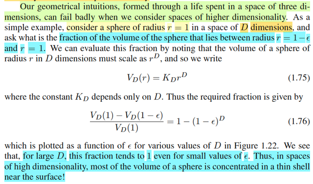</kbd>

<kbd>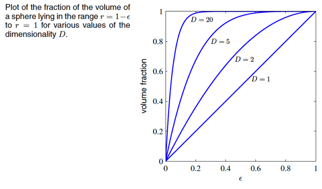</kbd>

> [!NOTE]
> Gs lấy một ví dụ nhằm minh họa rằng: Trong không gian cao chiều, thì 
> mọi thứ nó ko còn như ta hình dung (não trạng của ta đã quen với không
> gian 1,2,3 chiều): Ông lấy ví dụ, xét một cái quả banh bán kính r (ví dụ 
> trong 2D là hình tròn, 3D là hình cầu,...) thì luật toán học cho ta biết thể
> tích của quả banh đó sẽ tỉ lệ với bán kính mũ D (ví dụ diện tích hình
> tròn 2D là πr^2, thể tích của hình cầu là 4/3πr^3....
>
>
>
> Thế thì ta mới xét tỉ lệ giữa thể tích của lớp vỏ bề dày ε rất nhỏ và thể
> tích của phần bên trong.
>
>
>
> Chưa làm gì hết, mình sẽ dễ dàng hình dung là cái tỉ lệ này rất nhỏ
>
>
>
> Nhưng toán học chứng minh, khi D tăng lên → ví dụ 20, thì lúc này, 
> cái lớp vỏ mỏng của quả banh 20D này lại chiếm 99% thể tích của 
> quả banh: điều là thứ mà ta có thể thấy kinh ngạc vì nó hoàn toàn ngược
> với trực giác 2D, 3D của ta

 

###### Phân phối Gaussian không gian D

<kbd>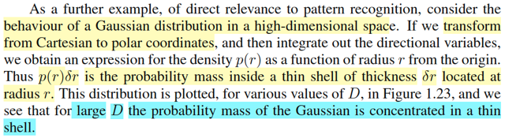</kbd>

<kbd>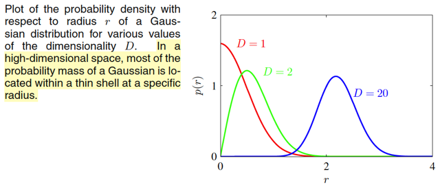</kbd>

> [!NOTE]
> một ví dụ khác, là hàm Normal trong không gian D chiều, hành vi của nó cũng
> thay đổi. Đó là y như vấn đề quả cầu vừa rồi khi trong không gian 20 chiều
> phần vỏ dày ε cực nhỏ cũng chiếm 99% thể tích, Thì hình chuông trong
> không gian 20 chiều cũng vậy: Phần thể tích của một lớp vỏ cách tâm một
> bán kính r, cũng sẽ có thể tích rất lớn, và dẫn đến mật độ xác suất của nó sẽ rát
> lớn. Dẫn đến hiện tượng, trong không gian 20 chiều, xác suất không tập trung
> ở mean, mà tập trung ở ngoài.

 

###### Ràng buộc không gian trong học máy

<kbd>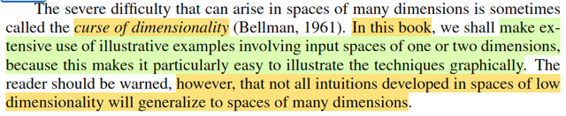</kbd>

<kbd>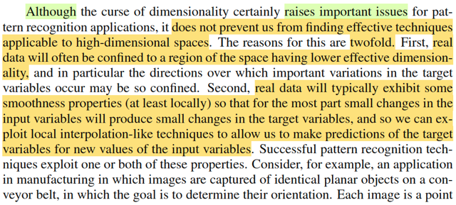</kbd>

<kbd>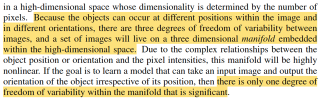</kbd>

> [!NOTE]
> Và cái này được ông Bellman gọi là "lời nguyền của không gian".
>
>
>
> Nên mr Bishop nhắc ta rằng dù phần lớn trong sách ta sẽ thấy hình minh
> hoạ trong 2D, 3D nhưng phải luôn nhớ rằng trong không gian cao chiều
> mọi thứ nó hành xử khác đi rất nhiều.
>
>
>
> Cuối cùng, tuy là vậy, nhưng không phải là nó ngăn ta tạo các thuật toán
> học máy hiệu quả trong không gian đa chiều.
>
>
>
> Lí do đại khái là, cái này cũng khó giải thích, nhưng mình hiểu đại ý là 
> vầy: Ví dụ ta làm mô hình phân loại hình ảnh đi. Thì ví dụ như ảnh chụp
> có kích thước 1000x1000 , tức là sau khi số hóa, nó là vector 3000.000
> chiều (ảnh màu RGB), nhưng bản chất nó là ảnh chụp từ thế giới mà mắt
> người nhìn thấy (để rồi, gán nhãn và dùng nó để training), thì khi đó nó
> thật ra có những pattern của thế giới 3 chiều mà ta đang sống.
>
>
>
> Hiểu đại ý thế này, giả sử với 3 triệu điểm ảnh, thì số lượng bức hình
> có thể tạo ra là con số rất khủng khiếp, vì một giá trị của cái vector đó có
> thể từ 0 - 255, thì ta sẽ có tới 256^(3 triệu) giá trị khả dĩ. Tuy nhiên, vì ta
> sẽ chỉ dùng (training, predict) với ảnh là chụp từ thế giới quanh ta, nên nó
> có những ràng buộc: ví dụ cái hình chụp cái xe ô tô thì luôn phải có 
> ràng buộc nào đó giữa các pixel trong 3 triệu cái pixel đó. Và những ràng
> buộc này, sẽ khiến số possible outcome của một vector mà thông tin của
> nó phản ánh 1 bức hình trong thế giới mà mắt người nhìn thấy, sẽ nhỏ
> hơn rất nhiều con số 256^(3 triệu)

 

