# 1.6 Information Theory

📊 **Progress:** `24` Notes | `32` Screenshots

---

## 1.6 Information Theory

 

## Lý thuyết thông tin

<kbd>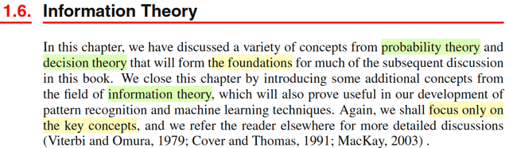</kbd>

> [!NOTE]
> Phần cuối của chap 1, gs sẽ nói về một số key concept của Information
> Theory đóng vai trò hữu ích cho bài toán machine learning bên cạnh hai trụ
> cột lí thuyết xác suất và quyết định.
>
>
>
> Sau này, mình sẽ đọc kĩ hơn trong cuốn của Mac Kay

 

### Định nghĩa lượng thông tin

<kbd>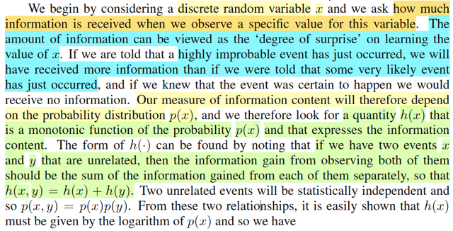</kbd>

<kbd>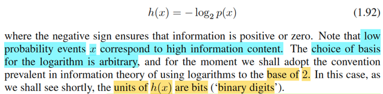</kbd>

> [!NOTE]
> Rồi, đầu tiên là xét một biến rời rạc (discrete) X (như đã nói, trong notebook
> này mình sẽ theo quy chuẩn kí hiệu chuẩn thống kê, viết hoa cho tên biến, còn
> gs Bishop viết thường khiến mình dễ lú lẫn).
>
>
>
> Thế thì, lí thuyết thông tin bắt đầu với việc: ta muốn đặt ra một đại lượng để đo
> mức độ thông tin nhiều hay ít ẩn chứa trong một event. Sao cho nếu một event
> mà gây ngạc nhiên càng lớn thì thông tin nó chứa càng lớn và ngược lại.
>
>
>
> Và độ ngạc nhiên của một event sẽ dễ thấy hợp lí khi ta gắn nó với xác suất
> của event: event càng ít xảy ra (xác suất thấp) mà nó xảy ra, thì ta sẽ ngạc
> nhiên nhiều. Ngược lại, event có xác suất cao, mà xảy ra thì ta không ngạc
> nhiên mấy.
>
>
>
> Do đó, đại lượng thông tin, của event gắn với X, sẽ dựa trên xác suất của X
> (pmf)
>
>
>
> Ngoài ra, trực giác cũng cho ta thấy: Nếu hai event không liên quan đến nhau
> mà cùng xảy ra, thì sẽ hợp logic nếu cho rằng lượng thông tin có được là tổng
> lượng thông tin của cả hai event: h(x,y) = h(x) + h(y)
>
>
>
> Trong khi đó, lí thuyết xác suất cho ta biết, nếu hai biến X, Y độc lập thì joint
> probability của hai event gắn với chúng, sẽ là tích của từng xác suất đơn lẻ:
> f(x,y) = f(x) f(y). Như vậy, ta sẽ suy ra hàm thông tin của x phải là logarit của
> f(x).
>
>
>
> Là sao? là vì ta có f(x,y) = f(x)f(y). Mà h(x,y) = h(x) + h(y). Nên h(x,y)
>
>
>
> h(.) phải là gì đó của log(.) vì chỉ như vậy thì ta mới dựa trên tính chất  log(xy)
> = log(x) + log(y) để có h(x,y) = h(x) + h(y)
>
>
>
> Và người ta sẽ dùng log base 2. Mà theo gs, chỉ là một lựa chọn tùy (arbitrary)
> tiện (tức là ko có lí do gì đặc biệt cả, chọn base nào cũng được). Và thêm dấu
> -, để có hàm không âm phản ánh sự hợp lí là thông tin thì thì ko âm.
>
>
>
> Từ đó ta có công thức h(x) = -log(f(x)) (base 2). Có đơn vị là bits.
>
>
>
> Như vậy, xác suất của một event (một possible value x của X, tức f(x), hay ở
> đây là P(X=x)) càng nhỏ, thì h(x) càng lớn

 

#### Định nghĩa Entropy

<kbd>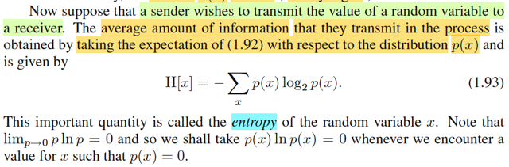</kbd>

> [!NOTE]
> Rồi, giả sử một sender (người gửi) muốn truyền giá trị của random variable
> X này cho người nhận (receiver) thì lượng thông tin trung bình mà họ truyền
> đi sẽ được tính bằng cách lấy kì vọng của h(x), với phân phối f(x). Và cái
> này được gọi là ENTROPY.
>
>
>
> Cùng phân tích để hiểu cái công thức này:
>
>
>
> Như vừa biết h(x), là hàm số define bởi h(x) = -log(f(x)) với f(x) là pmf của X.
>
>
>
> Như vậy, theo lí thuyết xác suất, lớp stat110, gs Joe hay nhấn mạnh, bất cứ
> khi nào ta áp một hàm số lên random variable X,  thì ta có một random
> variable mới. Và từ đó có quyền nói về kì vọng của nó. Ví dụ Y = g(X), thì Y
> là random variable. Và kì vọng, EX, có bản chất chỉ là weighted average các
> possible value của X, với weight là xác suất tương ứng: EX  = Σ{mọi
> possible value x của X} x*P(X=x) Thế thì khi muốn tính EY, đáng lí ta cũng
> phải đi kiếm pmf của Y, rồi tính tương tự. Nhưng LOTUS cho phép ta cứ
> dùng pmf của X mà tính EY:
>
>
>
> EY = Eg(X) = Σ{mọi possible value x của X} g(x)P(X=x),
>
>
>
> hay viết pmf của X là f(x), thì ta có Σ{mọi possible value x của X} g(x)f(x)
>
>
>
> QUay lại đây, chính là ta đang có h(X), là random variable có được bằng
> cách áp hàm h(x) = - log(f(x)) lên X. Nên theo LOTUS, ta tính kì vọng của
> nó:
>
>
>
> E[h(X)] = Σ{mọi possible value x của X} h(x)f(x)
>
>
>
> = Σ{mọi possible value x của X} [-log(f(x))] f(x)
>
>
>
> = - Σ{mọi possible value x của X} log(f(x) f(x). Đây chính là công thức 1.93
>
>
>
> Và người ta đặt cái này là hàm Entropy
>
>
>
> Như vậy, có thể hiểu, Entropy là một **fixed number**, k**hông phải biến
> ngẫu nhiên**, vì ta **đã lấy trung bình của biến ngẫu nhiên** h(X) -
> information quantity của X rồi.
>
>
>
> Và vì hàm x log(x) → 0 khi x → 0 nên khi f(x) = 0 thì ta cho entropy = 0

 

##### Entropy và độ dài mã

<kbd>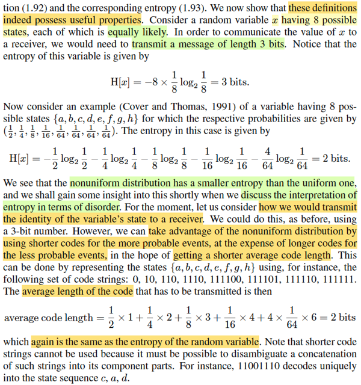</kbd>

> [!NOTE]
> Thế thì để truyền giá trị của X cho receiver thì ta cần dùng một message
> có chiều dài 3 bits (vì cần 3 bits mới có thể mã hóa 8 giá trị khác nhau của
> X).
>
>
>
> Muốn cho receiver biết X = 1 hay 2, hay...8. Ta phải gửi chuỗi nhị phân
> 000 hoặc 001, hoặc 010,... Với 1 bits, ta chỉ có thể gửi 2 giá trị, với 2 bits
> ta có thể gửi 4 giá trị, và với 3 bits mới có thể gửi 8 giá trị khác nhau
>
>
>
> Thế thì, ý chính là, nếu mà ta chọn cách mã hóa trong đó coi mỗi trong 8
> giá trị khả dĩ của X đều có xác suất như nhau. thì entropy tính theo công
> thức trên sẽ ra = 3, phản ánh đúng câu chuyện trên: Là về trung bình, ta
> cần 3 bits để chuyển đi giá trị của X.
>
>
>
> Nhưng giả sử X lại có xác suất pmf khác nhau ở các possible values. Thì
> entropy tính ra chỉ có 2 bits như trong ví dụ.
>
>
>
> Điều này gợi ý rằng, bằng cách thiết kế kiểu mã hoá khác, sao cho các
> possible value mà hay gặp  hơn bằng các chuỗi bits ngắn hơn và dành
> chuỗi bit dài hơn để mã hóa  những giá trị khả dĩ ít gặp khi đó số bits trung
> bình để truyền đạt đi giá trị của X sẽ chỉ là 2.
>
>
>
> Ví dụ trong 8 possible values của X, tương ứng với 8 kí tự a,b..g,h. Với
> xác suất từ cao đến thấp là 1/2, 1/4,....1/64.
>
>
>
> Thì bằng cách dùng chuỗi 0 cho a, 10 cho b, 110 cho c, ...,111111 cho h.
> Thì khi đó, số bits trung bình chỉ là 2:
>
>
>
> 1/2*(1 bits của "0") + 1/4*(2 bits của "10") + 1/8*(3 bits của "110") +...
>
>
>
> đúng bằng 2 bits = entropy của X với phân phối không đều nói trên
>
>
>
> Gs lưu ý ta rằng ko thể dùng ít bits hơn cho b, ví dụ a là 0, b ko thể là 1
> mà phải là 10, rồi c phải là 110 vì mục đích là như vậy mới đảm bảo tính
> độc nhất của 1 chuỗi thông tin, chứ nếu ko một chuỗi sau khi nhận có thể
> được decode thành nhiều khả năng thì ko được.

 

- **Entropy: Bits và Nats**

<kbd>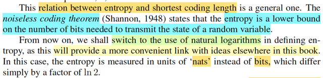</kbd>

> [!NOTE]
> Và theo lí thuyết thông tin, thì entropy là số bit ít nhất cần thiết để transmit
> giá trị của một biến ngẫu nhiên.
>
>
>
> Nhưng phần sau trở đi, ta sẽ define entropy theo log base e (log tự nhiên)
> khi đó đơn vị là nats. thay vì bits.

 

- **Entropy: Thước đo sự hỗn loạn**

<kbd></kbd>

<kbd>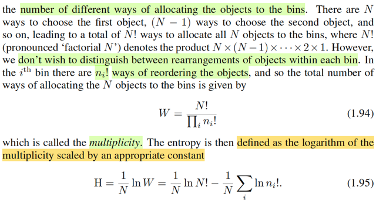</kbd>

> [!NOTE]
> Thế thì, nãy giờ ta đang định nghĩa, hay hiểu khái niệm entropy theo góc 
> nhìn là "trung bình của số lượng thông tin chứa trong một biến ngẫu nhiên"
> (nhớ công thức không: Entropy = E[h(X)] = E[-log(f(X))] = -Σi log(f(xi)) f(xi))
> để rồi cho ta biết trung bình cần bao nhiêu bits thì mới transmit được đủ
> giá trị của X.
>
>
>
> Còn ở đây, gs giới thiệu một định nghĩa khác của entropy: Thước đo của
> sự hỗn lọan (disorder).
>
>
>
> Ông cho ví dụ, ta có N cái object giống nhau (ví dụ N trái banh), và muốn
> bỏ vào một số cái lọ, SAO CHO n_i là số banh của lọ thứ i'th.
>
>
>
> (Chú ý, đây là ràng buộc, tức là phải xắp sếp sao cho lọ 1 có n1 trái,
> lọ 2 có n2 trái với n1, n2 ... là số đã biết)
>
>
>
> Ta sẽ lập luận như vầy:
>
>
>
> Như hồi học phương pháp đếm trong stat110.
>
>
>
> với N trái banh, ta có N~ hoán vị.
>
>
>
> Vỗi mỗi một hoán vị, cứ bỏ lần lượt n1 trái vào lọ 1, n2 trái tiếp theo vào lọ
> 2, cho đến hết (tất nhiên đề bài đã cho vậy thì Σi ni phải bằng N)
>
>
>
> Vấn đề là, ta sẽ ko care thứ tự các banh trong mỗi lọ.
>
>
>
> Như vậy, với N! hoán vị, thì đã có n1! over count cho lọ 1, tức là, ví dụ có 3
> banh đi a,b,c, và hai lọ, lọ một hai banh lọ hai một banh. 
>
>
>
> Thì 3 banh → 3! hoán vị: abc, acb, bca, bac, cba, cab
>
>
>
> Như vậy các banh trong lọ 1 là: ab, ac, bc, ba, cb, ca là 6, và nó đã overcount
> 2! lần, vì ta ko care thứ tự, nên chỉ cần biết :{a,b} {b,c} {c,a} thôi.
>
>
>
> Do đó, để adjust, ta chia đi cho 2!. 
>
>
>
> Tương tự, chia 1! để adjust số overcount của lọ 2.
>
>
>
> Nên công thức tổng quát là: [N! / n1!) / n2! /...] = N! / (Πi ni!)
>
>
>
> Cái này gọi là MULTIPLICITY
>
>
>
> Và định nghĩa của entropy là : (1/N) ln N! / (Πi ni!) (ln: log base e)
>
>
>
> = (1/N) [ ln N! - ln (Πi ni!) ]
>
>
>
> = (1/N) ln N! - (1/N) ln (Πi ni!) 
>
>
>
> = (1/N) ln N! - (1/N) Σi ln (ni!)

 

- **Xấp xỉ Stirling và Entropy**

<kbd></kbd>

> [!NOTE]
> (1/N) ln N! - (1/N) Σi ln (ni!)
>
>
>
> Xét cái term này tại limit N → inf
>
>
>
> Tiếp, dùng một  cái xấp xỉ: Stirling's approximation.
>
>
>
> ln N! ≈ N ln (N) - N
>
>
>
> ta có:
>
>
>
> lim N→inf {(1/N) ln N! - (1/N) Σi ln (ni!)}
>
>
>
> = lim N→inf {(1/N) [N ln (N) - N] - (1/N) Σi [ni ln(ni) - ni] }
>
>
>
> = lim N→inf { [ln (N) - 1] - (1/N) [Σi ni ln(ni) - Σi ni] }
>
>
>
> = lim N→inf { ln (N) - 1 - [(1/N)Σi ni ln(ni) - 1] }
>
>
>
> = lim N→inf { ln (N) - 1 - (1/N)Σi ni ln(ni) + 1 }
>
>
>
> = lim N→inf { ln (N) - (1/N)Σi ni ln(ni) }
>
>
>
> = - lim N→inf { (1/N)Σi ni ln(ni) - ln (N) }
>
>
>
> = - lim N→inf { (1/N)Σi ni ln(ni) - 1 * ln (N) }
>
>
>
> = - lim N→inf { Σi (ni/N) ln(ni) - (Σi ni / N) ln (N) }
>
>
>
> = - lim N→inf { Σi (ni/N) ln(ni) - Σi (ni/N) ln (N) }
>
>
>
> = - lim N→inf { Σi (ni/N) [ ln(ni) - ln (N) ] }
>
>
>
> = - lim N→inf { Σi (ni/N) ln(ni/N) }
>
>
>
> Đây là công thức 1.97
>
>
>
> -----
>
>
>
> Đặt pi = lim N→inf (ni/N), vì sao nó lại là xác suất một object xuất hiện
> trong lọ i'th?
>
>
>
> vì N banh, giống như N possible outcome trong Ω, tức size Ω = N,
>
>
>
> ni banh trong lọ i'th là số possible outcome trong event/subset Ni: object
> nằm trong lọ i'th,
>
>
>
> theo góc nhìn frequentist, xác suất của subset/event Ni:
>
>
>
> lim N → inf [size of Ni] / [size of Ω] = lim N → inf {ni / N}

 

- **Microstate, Macrostate, Trọng số**

<kbd>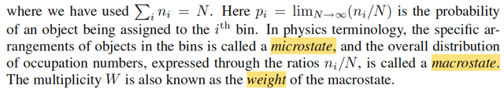</kbd>

> [!NOTE]
> Thuật ngữ vật ló dùng microstate để chỉ một sự sắp xếp cụ thể các object vào 
> các lọ.
>
>
>
> Còn macrostate để chỉ phân phối tổng thể, thể hiện qua tỉ lệ ni/N
>
>
>
> Là sao. Tức là, ví dụ, [ab][c] hay [ba][c], tức là những cách sắp cụ thể 2 banh
> vào lọ 1 và 1 banh vào lọ 2 như nãy nói, là những microstate.
>
>
>
> Còn macrostate sẽ quy định: lọ 1 có 2 banh, lọ 2 có 1 banh. Hay xác suất banh
> xuất hiện trong lọ 1 là 2/3, xác suất banh xuất hiện trong lọ 2 là 1/3.
>
>
>
> Thì khi đó, multiplicity W gọi là trọng số của macro state. Ví dụ, trong ví dụ
> này W = 3!/(2!1!) = 3. Tức là với macrostate  nói trên, thì ta sẽ có 3 cách sắp
> 3 banh vào 2 lọ ko care thứ tự trong mỗi lọ.

 

- **Đối chiếu Entropy Thông tin Vật lý**

<kbd>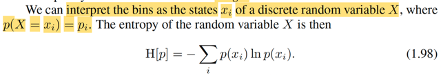</kbd>

> [!NOTE]
> Nhớ lại chút xíu bài học hôm qua. Mình được học định nghĩa của entropy
> theo góc nhìn thông tin: Cho biến X, thì ta dùng hàm -log(f(x)) để đo lượng
> thông tin trong mỗi possible value của nó. Possible value nào có xác suất
> thấp thì chứa nhiều thông tin và ngược lại.
>
>
>
> Khi đó, entropy được định nghĩa là trung bình (kì vọng) của hàm thông tin này:
> Entropy = - Σ{xi} log(f(xi))f(xi) với log base nào cũng được nhưng ta chọn base 2
>
>
>
> Và áp dụng vào bài toán truyền thông tin bằng chuỗi nhị phân thì nó sẽ cho 
> biết giới hạn nhỏ nhất của số bit trong chuỗi có thể dùng để truyền đi đủ các giá
> trị của X.
>
>
>
> Xong gs mới nói qua cách định nghĩa Entropy trong vật lí: Nó là đại lượng mô
> tả sự hỗn loạn.
>
>
>
> Bằng cách đưa ra bài toán rải N banh vào các lọ (bin) mỗi lọ có sức chứa cho
> trước: lọ ith có ni banh. Ta tìm số cách có thể rải banh, và ko care thứ tự các banh
> trong mỗi lọ. Kết quả là N!/{Πi ni!}, thì đây gọi là multiplicity W Và entropy được
> định nghĩa là H = (1/N) ln(W).
>
>
>
> Để rồi ta sẽ xét nó tại limit N → inf.
>
>
>
> khi đó ta có H = lim N → inf Σi (ni/N) ln(ni/N)
>
>
>
> Và đặt pi = lim N → N ni/N :
>
>
>
> H = Σi pi ln(pi)
>
>
>
> Lúc này chỉ cần coi pi là ứng với P(X = xi), hay f(xi) thì ta có lạ công thức định
> nghĩa entropy theo cách thứ nhất

 

- **Entropy và Phân phối Xác suất**

<kbd>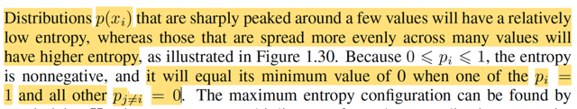</kbd>

<kbd>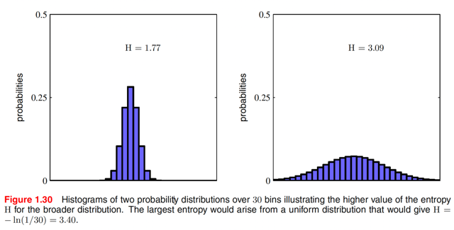</kbd>

> [!NOTE]
> Thế thì khi phân phối f(x) mà có vài đỉnh, tức là xác suất tập trung xung quanh
> vài giá trị, thì khi đó entropy sẽ thấp. Ngược lại xác suất mà dàn trải thì
> entropy sẽ cao.
>
>
>
> Vì sao nhỉ?
>
>
>
> Mình nghĩ, vì entropy là gì, là trung bình / kì vọng của thông tin của X.
> E[-log(f(X))] = Σi f(xi)log(f(xi)) và thông tin của X, đúng ra phải nói là thông tin
> của một possible value x của X sẽ nhỏ nếu f(x) lớn và sẽ lớn nếu f(x) nhỏ.
>
>
>
> Nếu phân phối f(x) tập trung, thì những điểm f(x) dương cao thì đều có thông
> tin rất thấp và nó lại chiếm trọng số cực lớn nên đóng góp của lượng thông tin
> thấp này chiếm phần lớn: , còn lại những chỗ khác, tuy chứa nhiều thông tin
> nhưng trọng số lại nhỏ gần như 0 khiến chúng ko đóng góp vào trung bình
> thông tin, tức entropy nhỏ
>
>
>
> Nếu phân phối f(x) dàn trải, thì mỗi f(x) đều nhỏ (nhưng ko quá nhỏ ~ 0) →
> lượng  thông tin lớn kha khá, nhân với trọng số f(x) không quá nhỏ khiến
> trung bình thông tin, tức entropy sẽ lớn.
>
>
>
> Và cũng dễ hiểu entropy sẽ đạt nhỏ nhất nếu mọi phân phối chỉ có đúng một
> đỉnh chiếm 100% xác suất (thông tin = 0).
>
>
>
> Và ta dự đoán entropy sẽ tối đa khi sự dàn trải xác suất là tối đa: xác suất
> tại mọi xi đều bằng nhau

 

- **Tối ưu Entropy và Hàm Lagrangian**

<kbd>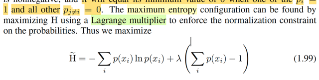</kbd>

<kbd>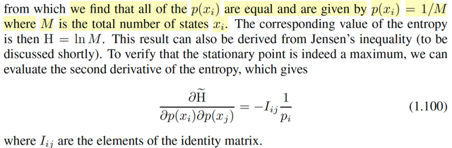</kbd>

> [!NOTE]
> Ở đây chính là gs đặt ra bài toán này: maximize entropy.
>
>
>
> Đây là lúc mình gặp lại kiến thức của bài toán tối ưu có ràng buộc đây.
>
>
>
> Đó là, ta cần maximize_over {p1,...pn} entropy = -Σi pi ln(pi)
>
>
>
> vì sao over {p1,..pn}. Là vì cái ta cần tìm là các giá trị của pi sao cho maximize entropy, nên chúng chính là biến tối ưu (optimization variable) Tuy nhiên, vì p1,..pi phải thỏa tính valid của một phân phối xác suất: không âm và tổng bằng 1, nên bài toán tối ưu có ràng buộc equality và inequality:
>
>
>
> maximize_p1,..pn -Σi pi ln(pi) subject to: pi ≥ 0, Σi pi = 1
>
>
>
> Ôn lại kiến thức bài toán equality & inequality constraint optimization đã học trong ee364a chút xíu:
>
>
>
> Xét bài toán minimize f0(x) s.t với n inequality constraint fi(x) ≤ 0 và m equality constrain hi(x) = 0, i = 1,2,..j = 1,2. ..
>
>
>
> Dĩ nhiên, nhiệm vụ là đi tìm x\* thuộc domain của mọi hàm số và cũng thuộc feasible set sao cho f0(x\*) có giá trị nhỏ nhất.
>
>
>
> Khi đó, ta có vài cách tiếp cận. Nếu được có thể chuyển thành bài toán tương đương như bỏ bớt constraint bằng cách tích hợp constraint vào objective.
>
>
>
> Nhưng theo chuẩn, ta sẽ xây dựng Lagrangian function, như là cách ta gom objective và constraint lại thành một.
>
>
>
> L(x, ν, λ) = f0(x) + Σi λifi(x) + Σi νihi(x).
>
>
>
> x gọi là primal variable, λ, v là dual variable
>
>
>
> Và ta sẽ hình thành bài toán minimize hàm Lagrangian với các constraint sau:
>
>
>
> λi ≥ 0. Đây gọi là dual constraint. Theo trực giác, ta cần λ ≥ 0 để khi minimize Lagrangian, thì fi(x) sẽ phải giảm về -inf để λifi(x) giảm.
>
>
>
> Tiếp, ta mới định nghĩa là hàm dual function:
>
>
>
> g(λ, v) = inf_x L(x, λ, v).
>
>
>
> và đặt ra bài toán dual problem:
>
>
>
> maximize\_λ, v g(λ, ν)
>
>
>
> Khi đó ta sẽ có lập luận sau:
>
>
>
> Gọi d\* = g(λ\*, v\*) với λ\*, v\* là solution của dual problem, gọi là dual optimal
>
>
>
> Gọi p\* = f0(x\*), x\* là solution của bài toán gốc (minimize f0(x) s.t constraint) x\* gọi là primal optimal
>
>
>
> Khi đó ta có d\* ≤ p\* và p\* - d\* gọi là duality gap.
>
>
>
> Ta có cái chuỗi bất đẳng thức sau:
>
>
>
> p\* = f0(x\*)
>
>
>
> Vì λi fi(x) ≤ 0 ∀i, và vi hj(x) = 0 ∀j ⇨ λ*i fi(x) ≤ 0 ∀i, và v*i hj(x) = 0 ∀j
>
>
>
> ⇨ f0(x\*) + Σi λ*ifi(x*) + Σj v*jhj(x*) ≤ f0(x\*)
>
>
>
> ⇔ L(x\*, λ\*, v\*) ≤ f0(x\*) = p\*
>
>
>
> Và g(λ\*, v\*) ≤ L(x\*, λ\*, v\*) do định nghĩa g(λ,v) = inf_x L(x, λ, v), nên dĩ nhiên g(λ, v) ≤ L(x, λ, v) ∀x trong đó có x\*
>
>
>
> ⇨ g(λ\*, v\*) ≤ L(x\*, λ\*, v\*) ≤ f0(x\*) = p\*
>
>
>
> Và g(λ, v) ≤ g(λ\*, v\*) do định nghĩa của dual optimal
>
>
>
> Vậy g(λ, v) ≤ g(λ\*, v\*) = d\* **≤** L(x\*, λ\*, v\*) **≤** f0(x\*) = p\*
>
>
>
> Thế thì, trong trường mà bài toán thỏa một số điều kiện gọi là constraint qualification, ví dụ Slater's condition
>
>
>
> thì ta sẽ có strong duality: p\* = d\*
>
>
>
> khi đó, hai cái dấu ≤ in đậm ở trên phải xảy ra, dẫn đến:
>
>
>
> Dấu ≤ thứ 2: L(x\*, λ\*, v\*) = f0(x\*)
>
>
>
> ⇔ f0(x\*) + Σi λ*ifi(x*) + Σi v*ihi(x*) = f0(x\*)
>
>
>
> ⇔ Σi λ*ifi(x*) = 0 (vì Σihi(x\*) thì dĩ nhiên là bằng 0 do x\* là primal optimal, nên nó phải thỏa inequality constraint rồi)
>
>
>
> Và đây gọi là điều kiện: **complementary slackness**
>
>
>
> Nó nói rằng nếu fi(x\*) &lt; 0 thì λi\* phải = 0.
>
>
>
> Nếu λi\* &gt; 0 thì fi(x\*) phải bằng 0
>
>
>
> Dấu ≤ thứ nhất: g(λ\*, v\*) = d\* ≤ L(x\*, λ\*, v\*)
>
>
>
> cũng là inf_x L(x, λ\*, v\*) = L(x\*, λ\*, v\*). Điều này có nghĩa là x\* là minimizer của L(x, λ\*, v\*)
>
>
>
> ⇨ ∇\_x L(x, λ\*, v\*)|x=x\* = 0. Đây gọi là **stationary condition**
>
>
>
> Tóm lại, ta có các điều kiện tối ưu (giúp giải x\*, λ\*, v\*) như sau:
>
>
>
> ∇\_x L(x, λ\*, v\*)|x=x\* = 0 (Stationary condition)
>
>
>
> Σi λ*i fi(x*) = 0 (Complementary slackness)
>
>
>
> λ\*i ≥ 0 (Dual constraint)
>
>
>
> fi(x\*) ≤ 0, hi(x\*) = 0 (Primal constraint)
>
>
>
> Và những cái này tạo thành KKT conditions.
>
>
>
> Nếu bài toán không lồi, thỏa KKT conditions là điều kiện cần (nhưng chưa đủ)
>
>
>
> Nếu bài toán là lồi, KKT là điều kiện cần và đủ của optimal.
>
> Trong bài toán này, thì inequality constraint pi ≥ 0 nó trùng với domain, nên ta có thể bỏ cái constraint đi.
>
>
>
> Bài toán trở thành minimize Σi pi ln pi s.t Σi pi = 1 ⇔ Σi pi - 1 = 0 (chuyển từ maximize objective sang minimize negative objective)
>
>
>
> Và ta có bài toán equality constraint optimization problem
>
>
>
> Lagrangian function:
>
>
>
> L(p, λ) = Σi pi ln(pi) + λ(Σi pi - 1)
>
>
>
> KKT condition:
>
>
>
> ∇\_p L(p\*, λ\*) = 0
>
>
>
> ⇔ d/dp \[Σi pi ln(pi) + λ\*(Σi pi - 1)\] = 0
>
>
>
> ⇔ d/dp \[Σi pi ln(pi)\] + d/dp\[λ\*(Σi pi - 1)\] = 0
>
>
>
> ⇔ d/dp \[Σi pi ln(pi)\] + λ\* d/dp (Σi pi - 1) = 0
>
>
>
> ---
>
>
>
> Xét d/dp \[Σi pi ln(pi)\]
>
>
>
> i) Làm theo lối truyền thống:
>
>
>
> hàm Σi pi ln(pi) là vector → scalar function, là tổng các hàm pi ln(pi) mà mỗi cái phụ thuộc một component duy nhất của p.
>
>
>
> Nên d/dp \[Σi pi ln(pi)\] = Σi d/dp \[pi ln(pi)\]
>
>
>
> d/dp \[pi ln(pi)\] = \[∂/∂p1 \[pi ln(pi)\], ∂/∂p2 \[pi ln(pi)\], ..∂/∂pi \[pi ln(pi)\] ....\]
>
>
>
> = \[0, 0 ..,ln(pi) + 1, ....\] (do ∂/∂pi \[pi ln(pi)\] = \[∂/∂pi pi\] ln(pi) + pi \[∂/∂pi ln(pi)\] = ln(pi) + pi / pi = ln(pi) + 1
>
>
>
> Vậy d/dp \[Σi pi ln(pi)\] = \[ln(p1) + 1, ln(p2) + 1,....\], hay viết ở dạng vector ln(p) + 1
>
>
>
> ii) Làm theo lối holistically của 18.s096:
>
>
>
> d/dp \[Σi pi ln(pi)\] = d/dp \[pTln(p)\]
>
>
>
> Xét df, f(p) = pTln(p).
>
>
>
> df = (p + dp)Tln(p + dp) - pTln(p) = pTln(p + dp) + dpTln(p + dp) - pTln(p)
>
>
>
> Từ MIT 18.01 ta đã biết ln(1 + ε) ≈ ε ⇨ ln(1 + dx/x) ≈ dx/x
>
>
>
> ⇨ ln(x + dx) = ln(x(1 + dx/x)) = ln(x) + ln(1 + dx/x) = ln(x) + dx/x
>
>
>
> ⇨ pTln(p + dp) + dpTln(p + dp) - pTln(p)
>
>
>
> = Σi pi ln(pi + dpi) + Σi dpi ln(pi + dpi) - Σi pi ln(pi)
>
>
>
> = Σi pi \[ln(pi) + dpi/pi\] + Σi dpi \[ln(pi) + dpi/pi\] - Σi pi ln(pi)
>
>
>
> = Σi pi ln(pi) + Σi pi dpi/pi + Σi dpi \[ln(pi) + dpi/pi\] - Σi pi ln(pi)
>
>
>
> = Σi pi dpi/pi + Σi dpi \[ln(pi) + dpi/pi\]
>
>
>
> = Σi pi dpi/pi + Σi dpi ln(pi) + Σi dpi dpi/pi
>
>
>
> = Σi dpi + Σi dpi ln(pi) (bỏ tern bậc cao Σi dpi dpi/pi)
>
>
>
> = Σi \[dpi + dpi ln(pi)\]
>
>
>
> = Σi dpi \[1 + ln(pi)\]
>
>
>
> = \[1 + ln(p)\]Tdp
>
>
>
> Vậy df(p) = \[1 + ln(p)\]Tdp ⇨ ∇f = 1 + ln(p) giống cách 1.
>
>
>
> ---
>
>
>
> Quay lại phương trình d/dp \[Σi pi ln(pi)\] + λ\* d/dp (Σi pi - 1) = 0, xét hạng tử thứ 2
>
>
>
> Còn d/dp (Σi pi - 1) = d/dp (Σi pi) = d/dp (pT1) = 1 (tự hiểu đây là vector \[1,...1\])
>
>
>
> Vậy ta có: ln(p\*) + 1 + λ*1 = 0 (λ*1 là λ\* nhân vector 1)
>
>
>
> ⇔ ln(p*i) + 1 + λ* = 0 ∀i
>
>
>
> ⇔ ln(p*i) = -(1 + λ*) ∀i
>
>
>
> ⇔ p*i = exp\[-(1 + λ*)\] ∀i
>
>
>
> À như vậy stationary point p*1,p*2,..đều bằng nhau, bằng exp\[-(1+λ\*)\]
>
>
>
> Ta cũng ko cần tính ra λ\* làm gì, vì đã đủ kết luận phân phối p1,..pm có entropy lớn nhất chính là p1=p2=...=1/M
>
>
>
> ---
>
>
>
> Để kết luận p*1, p*2 ... là optimal ta còn phải secondary test (vì ko chắc hàm objective là hàm lồi nên chưa kết luận ngay dựa trên KKT condition được)
>
>
>
> Xét Hessian của \[-entropy\] tại p\*:
>
>
>
> Viết lại entropy dạng vectorized: Σi pi ln pi = pTln(p)
>
>
>
> Như đã làm, gradient ∇\[pTln(p)\] = 1 + ln(p)
>
>
>
> Để tìm Hessian của entropy, thì cũng là Jacobian của ∇\[pTln(p)\], tức d/dp \[1 + ln(p)\]
>
>
>
> Lại làm theo lối Holistically của mit18s096:
>
>
>
> d∇\[pTln(p)\] = 1 + ln(p + dp) - 1 - ln(p) = ln(p + dp) - ln(p)
>
>
>
> Xét vector ln(p + dp), phần tử thứ i: = ln(pi + dpi) = ln(pi(1+dpi/pi)) = ln(pi) + ln(1 + dpi/pi)
>
>
>
> tương tự như trên, ln(1 + dpi/pi) = dpi/pi
>
>
>
> ⇨ ln(pi) + ln(1 + dpi/pi) = ln(pi) + dpi/pi
>
>
>
> ⇨ ln(p + dp) - ln(p) là vector \[ln(p1) + dp1/p1 - ln(p1), ln(p2) + dp2/p2 - ln(p2) ...\]
>
>
>
> = \[dp1/p1, dp2/p2, ...\]
>
>
>
> = \[matrix chéo tạo có đường chéo là 1/p1, 1/p2,....\] dp
>
>
>
> = diag(1/p1, 1/p2,....) dp
>
>
>
> Vậy d∇\[pTln(p)\] = diag(1/p1, 1/p2,....)dp
>
>
>
> ⇨ Jacobian của ∇\[pTln(p)\]\] cũng chính là Hessian của pTln(p) chính là diag(1/p1, 1/p2,....)
>
>
>
> (đây chính là 1.100 trong sách, trong đó ông đang xét hàm entropy, và đạo hàm cấp hai cho ra âm, nên giúp kết luận critical point là maximum, còn mình vì đã chuyển sang bài toán minimization hàm - entropy, nên đạo hàm cấp hai dương, hay đúng hơn matrix Hessian xác định dương sẽ đủ kết luận critical / stationary point giải ra từ KKT condition là minimum)
>
>
>
> Và matrix này chắc chắn là xác định dương vì pi đều dương (còn nó bằng 0 thì sao ta)
>
>
>
> Do đó theo secondary test, p*1, p*2 ...là minimum.

**🔗 See also:** [Phân phối Gaussian](./230_gaussian_distribution.md#node-arii2cl)

 

- **Mở rộng PDF biến liên tục**

<kbd>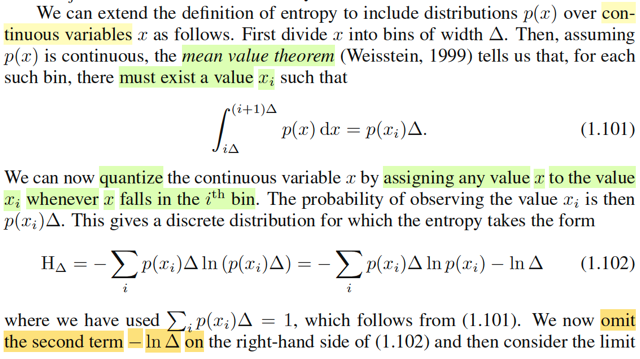</kbd>

<kbd>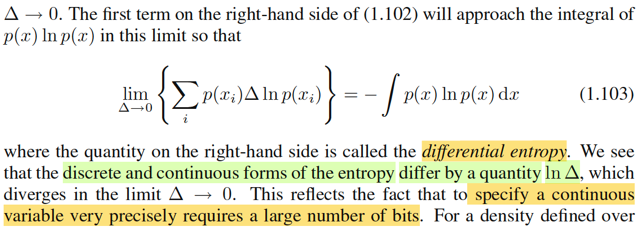</kbd>

> [!NOTE]
> Tiếp, ta sẽ mở rộng qua trường hợp khi X là biến liên tục. Khi đó, như đã biết, hàm pmf sẽ ko còn ý nghĩa, vì P(X=x) đều bằng 0 với mọi x, f(x) lúc này là pdf.
>
>
>
> Thế thì cách lập luận sẽ là:
>
>
>
> Ta sẽ biến bài toán trở lại công thức của trường hợp biến rời rạc nãy giờ.
>
>
>
> Bằng cách như sau, ta chia trục số x thành các khoảng bề rộng Δ.
>
>
>
> Ví dụ ta sẽ có khoảng đầu tiên từ 0 → mốc = Δ, khoảng thứ hai từ 1*Δ → 2*Δ
>
>
>
> Khi đó cứ hình dung trong một khoảng Δ nào đó, nằm từ cái mốc (i\*Δ → i+1)\*Δ (giống như cái khoảng Δ thứ hai ở trên), thì xác suất X nằm trong khoảng này sẽ là P(X ∈ \[iΔ,(i+1)Δ\]) = ∫iΔ:(i+1)Δ f(x)dx
>
>
>
> (Cái này chính là vì dựa trên định nghĩa của hàm pdf: Theo định nghĩa, pdf của random variable X là f(x) sao cho P(X ∈ A) = ∫\_A f(x)dx)
>
>
>
> Thế thì, còn nhớ hồi học MIT 18.01, ta đã học mean value theorem, nói rằng, khi đi từ A → B thì nhất định tồn tại điểm C nào đó trên đoạn A B sao cho độ dốc của hàm số g(x) tại C bằng độ dốc trung bình của hàm số trên đoạn AB:
>
>
>
> g'(xC) = \[g(xB) - g(xA)\] / (xB-xA)
>
>
>
> Mà theo FTC 2, khi G(x) là nguyên hàm của g(x), tức G'(x) = g(x) thì:
>
>
>
> ∫a:b g(x)dx = G(b) - G(a)
>
>
>
> Vậy ở đây g(x) là nguyên hàm của g'(x) nên: ∫xA:xB g'(x)dx = g(xB) - g(xA)
>
>
>
> ⇨ định lí mean value sẽ là tồn tại xC ∈ \[xA, xB\] sao cho:
>
>
>
> g'(xC) = ∫xA:xB g'(x)dx / (xB-xA)
>
>
>
> Áp dụng vào bài toán của ta, khi đi từ xA = iΔ tới xB = (i+1)Δ thì tồn tại xC ∈ \[xA, xB\] sao cho với g'(x) là pdf f(x)
>
>
>
> f(xC) = \[∫iΔ:(i+1)Δ f(x)dx\] / Δ
>
>
>
> Hay ∫iΔ:(i+1)Δ f(x)dx = f(xC) Δ
>
>
>
> Trong sách gọi xC là xi, ta có: Tồn tại xi ∈ \[iΔ, (i+1)Δ\] sao cho:
>
>
>
> ∫iΔ:(i+1)Δ f(x)dx = f(xi) Δ → đây chính là 1.101
>
>
>
> Như vậy xác suất P(X ∈ \[iΔ, (i+1)Δ\]) = f(xi) Δ với xi là điểm nào đó trong \[iΔ, (i+1)Δ\]
>
>
>
> ---
>
>
>
> Lúc này, kiểu như là ta đã chuyển bối cảnh về lại giống như biến rời rạc.
>
>
>
> Có nghĩa là, lúc này coi như mình đang xét biến rời rạc Y, có các possible value làm mấy cái xi của mỗi bins ở trên. Và pmf tại đó chính là f(xi) Δ:
>
>
>
> fY(xi) = Δ f(xi)
>
>
>
> Nên ta sẽ lại áp dụng cách làm đối biến rời rạc:
>
>
>
> Entropy = -Σi fY(xi) ln(fY(xi)) = -Σi Δf(xi) ln(Δf(xi))
>
>
>
> = -Σi {Δf(xi) \[ln(Δ) + ln(f(xi))\]}
>
>
>
> = -Σi {Δf(xi) ln(Δ) + Δf(xi) ln(f(xi))}
>
>
>
> = -Σi {Δf(xi) ln(Δ)} - Σi {Δf(xi) ln(f(xi))}
>
>
>
> = - ln(Δ) Σi {Δf(xi)} - Σi {Δf(xi) ln(f(xi))}
>
>
>
> Σi {Δf(xi)} chính là Σi fY(xi), đương nhiên 1 do tính valid của pmf
>
>
>
> = -ln(Δ) - Σi {Δf(xi) ln(f(xi))}
>
>
>
> Rồi, với việc cho bề rộng Δ → 0, ta có Σi {Δf(xi)ln(f(xi))} trở thành ∫ f(x)ln(f(x)) dx
>
>
>
> (vì sao? MIT 1801, nếu ta có tổng Riemann: Σi f(x) δ và xét limit δ → 0 \[Σi f(x) δ\]
>
>
>
> thì nó trở thành ∫ f(x)dx.)
>
>
>
> và cái này gọi là differential entropy.
>
>
>
> vậy entropy = lim Δ→0 \[-ln(Δ)\] - ∫ f(x) ln(f(x)) dx
>
>
>
> Và lim Δ→0 \[-ln(Δ)\] = +inf
>
>
>
> Nói lên sự thật là, với biến liên tục, entropy cuả nó sẽ tăng vô hạn nếu cho Δ → 0 mang ý nghĩa là số bit cần thiết để transmit giá trị của một biến ngẫu nhiên liên tục sẽ tăng vô hạn nếu ta cố gắng tính chính xác đến tuyệt đối. Là sao? Là vì khi xét Δ → 0, để biến tổng Reimann thành tích phân thì chính là đang cố gắng tính chính xác đến tuyệt đối khi ta chia trục số thành các khoảng ngày càng nhỏ đến vô cùng nhỏ, thì nó sẽ giống như ta muốn lấy chính xác một số thực đến phần thập phân ngày càng dài, khi đó entropy, mà như đã biết, sẽ thể hiện trung bình của lượng thông tin chứa trong biến sẽ tăng đến inf, nên sẽ cần số lượng bit rất lớn mới transmit nổi

 

- **Entropy vi phân**

<kbd>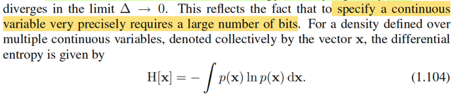</kbd>

> [!NOTE]
> Với random vector **X**, differential entropy H(**X**) = ∫f(**x**)ln(f(**x**))d**x**(f(**x**) lúc này là joint pdf)

 

- **Phân phối chuẩn entropy tối đa**

<kbd>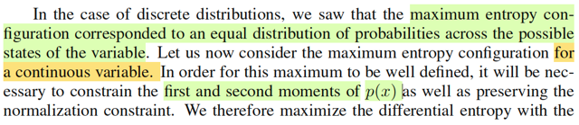</kbd>

<kbd>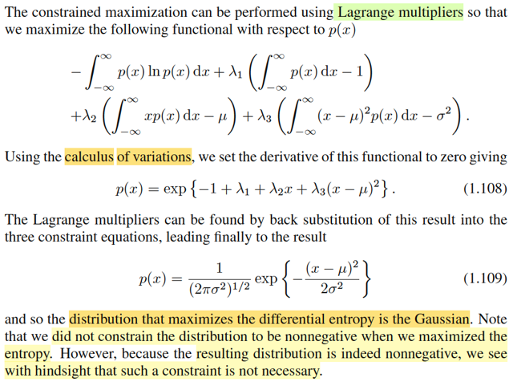</kbd>

> [!NOTE]
> Đại khái là như phần trước ta đã chứng minh **distribution rời rạc có entropy cao nhất chính là discrete uniform**. Nay ta đặt vấn đề là với **continuous distribution thì cái nào có differential entropy cao nhất**.
>
>
>
> Có lẽ nên dừng lại ôn tập nhanh chút xíu.
>
>
>
> Nói về Entropy đầu tiên, là theo góc nhìn của truyền thông tin, sẽ được định nghĩa là giá trị trung bình / expected value của lượng thông tin của một random variable, và thông tin của một possible value của biến thì lại được định nghĩa sao cho xác suất càng lớn thì thông tin càng ít: info(x) = -log f(x) Và Entropy(f(x)) = E\[info(x)\] = -Σi f(xi) log \[f(xi)\].
>
>
>
> Với log có thể chọn base nào cũng được, nhưng nếu chọn base 2, ta sẽ liên hệ với việc truyền dữ liệu: Entropy chính là số bit nhỏ nhất cần có để truyền đầy đủ các giá trị khả dĩ của một random variable discrete.
>
>
>
> Kể từ đây, ta chuyển sang dùng log base e: ln
>
>
>
> Rồi, sau đó ta học góc nhìn khác của Entropy, theo đó nó đại diện cho độ hỗn loạn. Lấy ví dụ là rải N banh vào các lọ (bins) sao cho lọ thứ i có n_i banh, và không care thứ tự trong từng lọ. Câu trả lời là, N banh sẽ có N! hoán vị, chia bớt cho số hoán vị của n_i banh trong lọ i, và làm vậy cho các lọ, ta sẽ có N!/ Πi n_i!. Và đây gọi là multiplicity W, để rồi Entropy được định nghĩa là log của W tại N → infinity: Entropy = -(1/N) ln N!/ Πi n_i!
>
>
>
> Bằng một số biến đổi đại số, ta sẽ có Entropy = lim N → inf {-Σi (ni/N) ln (ni/N)} Và từ đó nếu coi việc banh rơi vào lọ i là event X = xi, thì lim N → inf {Σi (ni/N) log (ni/N)} chính là {Σi f(xi) ln f(xi)} để đồng nhất với công thức trước đó.
>
>
>
> Và bằng cách giải bài toán tối ưu có ràng buộc: maximize\_{p1,p2} \[-Σi pi ln(pi)\] s.t Σi pi = 1, ta được p1 = p2 = ...constraint, là discrete uniform.
>
>
>
> Sau đó, xét qua biến liên tục, thì ta phải chuyển sang dùng pdf.
>
>
>
> Bằng cách lập luận quantization: cho trục số thành các khoảng Δ, khi đó, với mỗi khoảng, ta xét cái điểm mà pdf tại đó nhân với Δ sẽ bằng tích phân pdf trên khoảng đó: ∫i\*Δ:(i+1)\*Δ f(x)dx = f(xi)\*Δ. Khi đó, ta mới quay về áp dụng lập luận cho biến rời rạc đặt mới: Y, với các possible value discrete yi: fY(yi) = f(xi)\*Δ
>
>
>
> - Σi fY(yi) ln\[fY(yi)\] = - Σi f(xi) Δ ln \[f(xi) Δ\]
>
>
>
> Và ta mới lấy giá trị của cái này tại limit Δ → 0:
>
>
>
> lim Δ → 0 \[-Σi f(xi) Δ ln \[f(xi) Δ\]\] = lim Δ → 0 \[-Σi f(xi) Δ {ln f(xi) + ln Δ}\]
>
>
>
> = lim Δ → 0 \[-Σi {f(xi) Δ ln f(xi) + f(xi) Δ ln Δ}\]
>
>
>
> = lim Δ → 0 \[-Σi {f(xi) Δ ln f(xi)} + {-ln Δ Σi Δf(xi)}\]
>
>
>
> = lim Δ → 0 \[-Σi {f(xi) Δ ln f(xi)} + {-ln Δ}\]
>
>
>
> = lim Δ → 0 \[-Σi {f(xi) Δ ln f(xi)} + lim Δ → 0 {-ln Δ}\]
>
>
>
> = lim Δ → 0 \[-Σi {f(xi) Δ ln f(xi)}\] + "một con số lớn khổng lồ"
>
>
>
> = ∫ f(x) ln f(x) dx, đây gọi là differential entropy, và con số lớn vô hạn kia sẽ thể hiện rằng khi muốn truyền đi giá trị chính xác tuyệt đối của một biến liên tục thì số bit cần dùng là vô hạn.
>
>
>
> Vừa rồi là ôn nhanh lại những gì đã học bữa giờ, giờ quay lại bài.
>
> Thế thì, bài toán đặt ra ở đây là trong các distribution liên tục, thì cái nào có entropy cao nhất (như với discrete thì là discrete uniform).
>
>
>
> Do đó ta phải đối mặt với bài toán tối ưu:
>
>
>
> maximize_f(x) {differential entropy} với f là một valid pdf. Dịch ra bằng lời là tìm hàm pdf f(x) sao cho differential entropy của nó là cao nhất.
>
>
>
> vì yêu cầu f(x) phải là valid pdf, nên tương tự như discrete case ta có ràng buộc ∫f(x)dx = 1. Bên cạnh đó, gọi μ và σ^2 là mean và variance, ta cũng sẽ có ∫xf(x)dx = μ và ∫(x - μ)^2f(x)dx = σ^2, là hai ràng buộc khác.
>
>
>
> Như vậy bài toán tối ưu này là một bài toán có ràng buộc đẳng thức (equality constraint optimization problem).
>
>
>
> maximize_f(x) { -∫f(x)ln\[f(x)\]dx } s.t ∫f(x)dx = 1, ∫xf(x)dx = μ, ∫(x - μ)^2f(x)dx = σ^2.
>
>
>
> Lagrangian: L(x, λ) = -∫f(x)ln\[f(x)\]dx + λ1(∫f(x)dx - 1) + λ2(∫xf(x)dx - μ) + λ3(∫(x - μ)^2f(x)dx - σ^2)
>
>
>
> = -∫f(x)ln\[f(x)\]dx + λ1∫f(x)dx - λ1 + λ2∫xf(x)dx - λ2μ + λ3∫(x - μ)^2f(x)dx - λ3σ^2
>
>
>
> = -∫f(x)ln\[f(x)\]dx + λ1∫f(x)dx + λ2∫xf(x)dx + λ3∫(x - μ)^2f(x)dx - λ1 - λ2μ - λ3σ^2
>
>
>
> = ∫ {-f(x)ln\[f(x)\] + λ1f(x) + λ2xf(x) + λ3(x - μ)^2f(x)} dx - λ1 - λ2μ - λ3σ^2
>
>
>
> Tới đây, cần chú ý, biến số của bài toán tối ưu này không phải là x. Mà là f(x). Và objective của bài toán ko phải là hàm số (function) mà là functional. H\[f(x)\].
>
>
>
> Nhờ kiến thức về Calculus of variation ở Appendix, ta đã được học, khi xét một functional F\[y(x)\] có dạng F\[y(x)\] = ∫G(y(x),y'(x),x)dx thì stationary condition:
>
>
>
> ∂F/∂y(x) = 0 sẽ ⇔ ∂G/∂y(x) + d/dx\[∂G/∂y'(x)\] = 0, đây gọi là Euler-Lagrange equation
>
>
>
> Tuy nhiên nếu G chỉ phụ thuộc y(x) và x, thì equation trên trở thành ∂G/∂y(x) = 0.
>
>
>
> Thì ở đây, ta có Lagrangian là một functional: L\[f(x)\] có dạng ∫(G(f(x),x)dx với
>
>
>
> G(f(x),x) = {-f(x)ln\[f(x)\] + λ1f(x) + λ2xf(x) + λ3(x - μ)^2f(x)}
>
>
>
> Nên ta có stationary condition:
>
>
>
> ∂G/∂f(x) = 0
>
>
>
> ⇔ ∂/∂f(x) {-f(x)ln\[f(x)\] + λ1f(x) + λ2xf(x) + λ3(x - μ)^2f(x)} = 0
>
>
>
> ⇔ ∂/∂f(x) {-f(x)ln\[f(x)\]} + ∂/∂f(x) {λ1f(x)} + ∂/∂f(x) {\[λ2xf(x)\] + ∂/∂f(x) {λ3(x - μ)^2f(x)} = 0
>
>
>
> ⇔ {∂/∂f(x) \[-f(x)\]} ln\[f(x)\] + {-f(x) \[∂/∂f(x) \[f(x)\]} + λ1 ∂/∂f(x) {f(x)} + λ2x ∂/∂f(x) {f(x)} + λ3(x - μ)^2 ∂/∂f(x) {f(x)} = 0
>
>
>
> ⇔ - ln f(x) + {-f(x) \[1/f(x)\]} + λ1 + λ2x + λ3(x - μ)^2 = 0
>
>
>
> ⇔ - ln f(x) - 1 + λ1 + λ2x + λ3(x - μ)^2 = 0
>
>
>
> ⇔ - 1 + λ1 + λ2x + λ3(x - μ)^2 = lnf(x)
>
>
>
> ⇔ exp\[-1 + λ1 + λ2x + λ3(x - μ)^2\] = f(x) ⇨ Đây là 1.108 trong sách Bishop
>
>
>
> Viết lại f(x) = exp\[-1 + λ1\] exp\[λ2x + λ3(x - μ)^2\]
>
>
>
> Giờ ta sẽ tìm các λi để đảm bảo tính valid của f(x) (thỏa các constraint)
>
>
>
> Đầu tiên xét exp\[λ2x + λ3(x - μ)^2\]
>
>
>
> = exp\[λ2x + λ3(x^2 - 2xμ + μ^2)\]
>
>
>
> = exp\[λ2x + λ3x^2 - 2λ3xμ + λ3μ^2\]
>
>
>
> = exp\[λ3x^2 - 2λ3xμ + λ2λ3x/λ3 + λ3μ^2\]
>
>
>
> = exp{λ3\[x^2 - 2xμ + λ2x/λ3 + μ^2\]}
>
>
>
> = exp{λ3\[x^2 - 2x(μ - λ2/2λ3) + μ^2\]}
>
>
>
> = exp{λ3\[x^2 - 2x(μ - λ2/2λ3) + (μ - λ2/2λ3)^2 - (μ - λ2/2λ3)^2 + μ^2\]}
>
>
>
> = exp{λ3\[x - (μ - λ2/2λ3)\]^2 - λ3(μ - λ2/2λ3)^2 + λ3μ^2\]}
>
>
>
> = exp{λ3\[x - (μ - λ2/2λ3)\]^2 - λ3\[(μ - λ2/2λ3)^2 - μ^2\]}
>
>
>
> = exp{λ3\[x - (μ - λ2/2λ3)\]^2} / exp {λ3\[(μ - λ2/2λ3)^2 - μ^2\]}
>
>
>
> ⇨ f(x) = exp(-1 + λ1) / exp {λ3\[(μ - λ2/2λ3)^2 - μ^2\]} exp{-\[x - (μ - λ2/2λ3)\]^2 / (-2/2λ3)}
>
>
>
> Đây có dạng của pdf của normal với mean μ - λ2/2λ3
>
>
>
> và variance = -1/2λ3
>
>
>
> và exp(-1 + λ1) / exp {λ3\[(μ - λ2/2λ3)^2 - μ^2\]} đóng vai trò là normalizing constant.
>
>
>
> Để thỏa mean = μ ⇨ λ2 = 0
>
>
>
> Để variance = σ^2 ⇨ -1/2λ3 = σ^2 ⇨ λ3 = -1/2σ^2
>
>
>
> và exp(-1 + λ1) / exp {λ3\[(μ - λ2/2λ3)^2 - μ^2\]} = 1/√2πσ^2
>
>
>
> ⇔ exp(-1 + λ1) / exp {λ3\[μ^2 - μ^2\]} = 1/√2πσ^2
>
>
>
> ⇔ exp(-1 + λ1) = 1/√2πσ^2
>
>
>
> ⇔ -1 + λ1 = ln\[1/√2πσ^2\]
>
>
>
> ⇔ -1 + λ1 = ln1 - ln\[√2πσ^2\]
>
>
>
> ⇔ λ1 = 1 + 0 - ln\[√2πσ^2\]
>
>
>
> ⇔ λ1 = 1 - ln\[(2πσ^2)^1/2\]
>
>
>
> ⇔ λ1 = 1 - 1/2 ln\[2πσ^2\]
>
>
>
> Vậy, kết quả là f(x) = pdf của normal(μ, σ^2). như kết quả 1.109 trong sách

**🔗 See also:** [Phân phối Gaussian](./230_gaussian_distribution.md#node-arii2cl)

 

- **Entropy phân phối Gauss**

<kbd>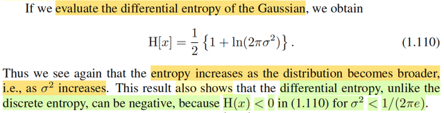</kbd>

> [!NOTE]
> Rồi, thế thì thử tìm differential entropy của Normal
>
>
>
> H[x] = -∫f(x)lnf(x)dx
>
>
>
> = -∫ [1/√2πσ^2] exp[-(x-μ)^2/2σ^2] ln {[1/√2πσ^2] exp[-(x-μ)^2/2σ^2]} dx
>
>
>
> = -∫ [1/√2πσ^2] exp[-(x-μ)^2/2σ^2] {ln [1/√2πσ^2] + ln exp[-(x-μ)^2/2σ^2]} dx | ln(ab) = lna + lnb
>
>
>
> = -∫ [1/√2πσ^2] exp[-(x-μ)^2/2σ^2] {ln [1/√2πσ^2] - (x-μ)^2/2σ^2} dx
>
>
>
> = -∫ [1/√2πσ^2] exp[-(x-μ)^2/2σ^2] {ln [1/√2πσ^2]} dx  +  ∫ [1/√2πσ^2] exp[-(x-μ)^2/2σ^2] (x-μ)^2/2σ^2} dx}
>
>
>
> = - ln [1/√2πσ^2] ∫[1/√2πσ^2] exp[-(x-μ)^2/2σ^2] dx  +  ∫ [1/√2πσ^2] exp[-(x-μ)^2/2σ^2] (x-μ)^2/2σ^2} dx}
>
>
>
> Vì tính valid của pdf: ∫[1/√2πσ^2] exp[-(x-μ)^2/2σ^2] dx = 1
>
>
>
> = -ln [1/√2πσ^2] * 1 + ∫ [1/√2πσ^2] exp[-(x-μ)^2/2σ^2] (x-μ)^2/2σ^2} dx
>
>
>
> Xét  ∫[1/√2πσ^2] exp[-(x-μ)^2/2σ^2] (x-μ)^2/2σ^2} dx
>
>
>
> ∫(1/√2πσ^2) exp[-(x-μ)^2/2σ^2] (x-μ)^2/2σ^2} dx
>
>
>
> = (1/2σ^2) ∫(1/√2πσ^2) exp[-(x-μ)^2/2σ^2] (x-μ)^2} dx
>
>
>
> = (1/2σ^2) ∫f(x) (x - μ)^2 dx
>
>
>
> = (1/2σ^2) E[(X - μ)^2] | X ~ f(x)
>
>
>
> = (1/2σ^2) σ^2 = 1/2
>
>
>
> Vậy kết quả là -ln [1/√2πσ^2] + 1/2 = - ln [(2πσ^2)^-1/2] + 1/2
>
>
>
> = 1/2 ln (2πσ^2) + 1/2
>
>
>
> = 1/2 [ln (2πσ^2) + 1] → Đây là kết quả 1.110
>
>
>
> Nhờ kết quả này ta có nhận xét: khi σ^2 tăng (variance tăng) thì 1/2 [ln (2πσ^2) + 1] cũng tăng theo.
>
>
>
> như vậy nó khớp với nhận định rằng, khi distribution mà càng phân tán đồng đều, (variance của normal
> tăng, thì chính là cái chuông Normal ngày càng bẹt ra, → xác suất phân tán đều hơn) thì entropy sẽ tăng

 

- **Entropy có điều kiện**

<kbd>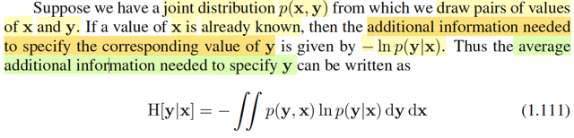</kbd>

<kbd>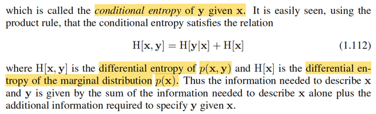</kbd>

> [!NOTE]
> Cuối cùng ta được học một khái niệm nữa, đại khái là xét một joint distribution
> f(**x**,**y**). Và draw **X**, **Y** từ đó. Tác giả cho biết giả sử đã biết **X=x**, thì lượng thông
> tin cần thiết để xác định giá trị của Y tương ứng là -ln f(**y**|**x**).
>
>
>
> Là sao? 
>
>
>
> → Thì cái này chỉ là định nghĩa thôi. giống như khi ta định nghĩa lượng thông
> tin chứa trong một giá trị khả dĩ của X: info(x) = - log(f(x)). Thì ở đây, tương tự
> ta định nghĩa thông tin chứa trong giá trị khả dĩ y khi đã biết X=x là -log(f(y|x))
> Và ta dùng log base e, nên có -ln f(y|x). Hay ở đây là vector, nên là -ln(f(**y**|**x**))
>
>
>
> Và tương tự, khi ta định nghĩa entropy là trung bình của lượng thông tin 
> trong mọi possible value của X: E[info(X)] = E[-ln(f(X))] = -∫f(x) ln f(x)dx
>
>
>
> thì nay, trung bình của -ln(f(**y**|**x**)), tức E[-ln(f(**Y**|**X**))] = ∫∫-ln(f(**y**,**x**))f(**y**,**x**)d**y**d**x**
>
>
>
> được gọi là **CONDITIONAL ENTROPY** của **Y** given **X:** H(**Y**|**X**)Mình hiểu cái này như vầy:
>
>
>
> Người ta gọi, định nghĩa additional information needed to specify **y** given
> **x** là -ln(f(**y**|**x**)), thì nên hiểu ý nghĩa của nó đó là:
>
>
>
> khi đã biết **X** = **x** thì lượng thông tin cần thiết để xác định ra giá trị **y** của biến
> **Y** là -ln(f(**y**|**x**)).
>
>
>
> Nên cơ bản là mình đang có một random variable W có được bằng cách áp
> hàm g(**x**,**y**) lên hai biến **X**,**Y**: W = -ln(f(**Y**|**X**)). Và ta sẽ gọi EW là conditional
> entropy of **Y** given **X**.
>
>
>
> Vậy tính EW thế nào? → Dùng 2D lotus thôi:
>
>
>
> EW = Eg(**X**,**Y**) = ∫∫g(x,y)f(x,y)dxdy
>
>
>
> = ∫∫-ln(f(**y**|**x**))f(**x**,**y**)d**x**d**y**
> Ta có H(**Y**|**X**) = ∫∫-ln(f(**y**|**x**))f(**y**,**x**)d**x**d**y**
>
>
>
> ∫∫-ln(f(**y**,**x**)/f(**x**))f(**y**,**x**)d**x**d**y**
>
>
>
> = ∫∫-[lnf(**y**,**x**) - lnf(**x**)]f(**y**,**x**)d**x**d**y** 
>
>
>
> = ∫∫-ln(f(**y**,**x**))f(**y**,**x**)d**x**d**y** - ∫∫-ln(f(**x**))f(**y**,**x**)d**x**d**y**
>
>
>
> = ∫∫-ln(f(**y**,**x**))f(**y**,**x**)d**x**d**y** - ∫-ln(f(**x**))[∫f(**y**,**x**)d**y**]d**x** 
>
>
>
> = ∫∫-ln(f(**y**,**x**))f(**y**,**x**)d**x**d**y** - ∫-ln(f(**x**))f(**x**)d**x**
>
>
>
> = ∫∫-ln(f(**y**,**x**))f(**y**,**x**)d**x**d**y** - ∫-ln(f(**x**))f(**x**)d**x**
>
>
>
> Đây chính là H(**X**,**Y**) - H(**X**)
>
>
>
> Vậy H(**Y**|**X**) = H(**X**,**Y**) - H(**X**)

 

- **KL Divergence**

<kbd>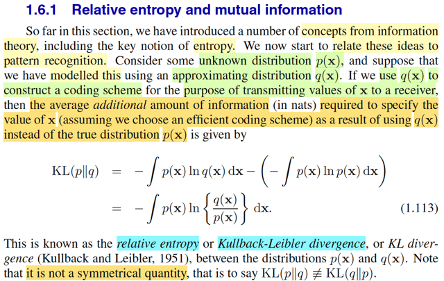</kbd>

> [!NOTE]
> Đại ý là từ đầu đến giờ ta đã làm quen nhiều khái niệm trong lí thuyết thông
> tin, trong đó quan trọng nhất là entropy. Nay ta sẽ bắt đầu thảo luận tác
> dụng của chúng trong bài toán pattern recognition
>
>
>
> Và cụ thể là ta sẽ gặp một trong những khái niệm cực quan trọng: KL
> Divergence, hay relative entropy. Được định nghĩa là vầy:
>
>
>
> Giả sử ta có một population distribution p(**x**). (đến đây mình sẽ dùng chữ
> p, thay vì bữa giờ vẫn xài chữ f cho thuận theo notation convention của
> toán), và ta trong quá trình làm việc đã mô phỏng p(**x**) bằng một
> distribution xấp xỉ q(x).
>
>
>
> Vậy thì như đã biết khái niệm entropy, là trung bình thông tin của một biến
> ngẫu nhiên có phân phối xác suất f(x) là: E[Info(**X**)] = [E[-ln(f(**X**))] =
> -∫f(**x**)lnf(**x**)d**x**.
>
>
>
> Vậy thì ở đây, E[Info(**X**)] = E[-ln(p(**X**))]= -∫p(**x**)lnp(**x**)dx là trung
> bình thông tin của random  variable **X** ~ p(**x**)
>
>
>
> Nhưng bây giờ, nếu như đã nói ở trên, ta dùng q(**x**) để xấp xỉ cho / mô
> phỏng cho p(**x**), để rồi thông tin của **X** sẽ được tính từ q(**x**) thay vì
> p(**x**). Info(**X**) = -ln(q(**X**)).  Và trung bình thông tin của x sẽ là
> E[Info(**X**)] = E[-ln(q(**X**)]
>
>
>
> thì đây cũng là kì vọng của biến ngẫu nhiên có được từ việc áp hàm g(**x**)
> = -ln(q(**x**)) lên **X**
>
>
>
> theo **lotus** cho phép ta tính: = E[-ln(q(**X**)] = -∫p(**x**)lnq(**x**)d**x**.
>
>
>
> Nói vậy để **hiểu bản chất giúp ta khỏi thắc mắc** vì sao ko phải là
> -∫q(**x**)lnq(**x**)dx.
>
>
>
> Thế thì mức chênh lệch giữa chúng, gọi là lượng thông tin bổ sung
> (additional) để có thể xác định được giá trị của **x** một cách đầy đủ mà sự
> thiếu hụt gây ra là do ta dùng q(**x**) thay vì p(**x**), chính là relative
> entropy hay KL Divergence, kí hiệu LK(p||q)
>
>
>
> -∫p(x)lnq(x)dx -[-∫p(**x**)lnp(**x**)d**x**]
>
>
>
> = -∫[p(**x**)ln[q(**x**)-lnp(**x**)]d**x**
>
>
>
> = -∫p(**x**)ln[q(**x**)/p(**x**)]d**x**.
>
>
>
> Gs lưu ý, cái này ko có tính đối xứng, LK(p||q) khác LK(q||p)

 

- **Hàm lồi: Đạo hàm bậc hai**

<kbd>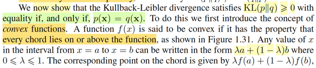</kbd>

<kbd>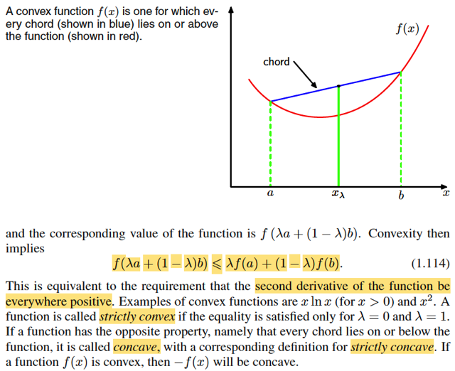</kbd>

> [!NOTE]
> Thế thì đại ý là tiếp theo ta sẽ đi chứng minh rằng LK(p||q) sẽ không âm, và chỉ
> bằng 0 khi và chỉ khi p(**x**) = q(**x**).
>
>
>
> Nhưng trước đó thì ông nói về hàm lồi (convex function). Những khái niệm này
> mình đã học ở ee364a nên biết hết rồi.
>
>
>
> Sẵn ôn lại chút xíu.
>
>
>
> Mình nhớ trong lớp đó cũng như trong cuốn Convex Optimization của S.Boyd
> mình được học các khái niệm như:
>
>
>
> Xét Σi αi xi
>
>
>
> Với αi bất kì thì đây là linear combination
>
>
>
> nếu αi có tổng bằng 1, thì ta có một affine combination
>
>
>
> nếu αi không âm và tổng bằng 1, ta có một mixture / convex combination,  cũng
> gọi nếu giữa hai vector thì ta có line segment
>
>
>
> và định nghĩa chính thức của convex function là hàm thỏa tập xác định (domain
> là convex set - tức mọi mixture đều nằm trong tập) và:
>
>
>
> f(λx + (1-λ)y) ≤ λf(x) + (1-λ)f(y)
>
>
>
> Và dựa vào định nghĩa này, ta có thể derive ra tính chất "non-negative
> curvature" của hàm lồi (đạo hàm bậc 2 không âm ở mọi điểm như gs Bishop
> nói ở đây"
>
>
>
> Thử chứng minh:
>
>
>
> Giả sử hàm số có đạo hàm bậc hai không âm ở mọi điểm
>
>
>
> Ta có f''(x) ≥ 0 ∀x
>
>
>
> Định lí Taylor:
>
>
>
> f(y) = f(x) + f'(x)(y-x) + f''(x+α(y-x))(y-x)^2/2 for some α ∈ (0,1)
>
>
>
> Vì (1) ⇨ f''(x+α(y-x))(y-x)^2/2 ≥ 0
>
>
>
> ⇨ f(y) ≥ f(x) + f'(x)(y-x), đây chính là convex first order condition
>
>
>
> Và cái này đúng với mọi x, y.
>
>
>
> Ta mới áp dụng với các cặp điểm: x, z và y, z với z = λx + (1-λ)y
>
>
>
> f(x) ≥ f(z) + f'(z)(x-z) (i)
>
>
>
> f(y) ≥ f(z) + f'(z)(y-z) (ii)
>
>
>
> Nhân (i) với λ ∈ [0,1] và (ii) với (1-λ) và cộng vế theo vế
>
>
>
> λf(x) + (1-λ)f(y) ≥ λf(z) + λf'(z)(x-z) + (1-λ)f(z) + (1-λ)f'(z)(y-z)
>
>
>
> ⇔ λf(x) + (1-λ)f(y) ≥ f(z) + f'(z)[λ(x-z) + (1-λ)(y-z)]
>
>
>
> ⇔ λf(x) + (1-λ)f(y) ≥ f(z) + f'(z)(λx - λz + y - λy - z + λz)
>
>
>
> ⇔ λf(x) + (1-λ)f(y) ≥ f(z) + f'(z)(λx  + y(1 - λ) - z)
>
>
>
> ⇔ λf(x) + (1-λ)f(y) ≥ f(z) + f'(z)(z - z)
>
>
>
> ⇔ λf(x) + (1-λ)f(y) ≥ f(z)
>
>
>
> ⇔ λf(x) + (1-λ)f(y) ≥ f(λx + (1-λ)y)
>
>
>
> Vậy, đến đây, vì thỏa định nghĩa của convex function nên đây là hàm convex
>
>
>
> Tạm bỏ qua chứng minh điều kiện cần (hàm convex ⇨ non-negative curvature)
>
>
>
> Vậy nếu hàm số đạo **hàm bậc hai không âm tại mọi điểm thì hàm convex**
>
>
>
> -----
>
>
>
> Bên cạnh đó còn các khái niệm strictly convex, concave và strictly concave
> đã biết ở sách S.Boyd rồi.

 

- **Bất đẳng thức Jensen**

<kbd>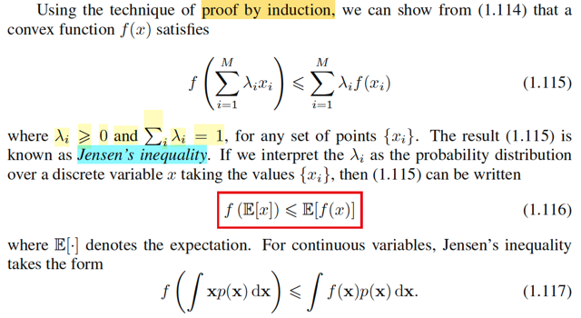</kbd>

> [!NOTE]
> Thế thì tiếp theo, gs nói bằng cách chứng minh quy nạp (induciton) ta có thể
> chứng mình rằng cái tính chất "f của mixture ≤ mixture của f" với mixture của
> một bộ M điểm.
>
>
>
> Tức là theo định nghĩa của convex function ta chỉ có với x1, x2 và mixture của
> nó (convex combination / line segment):
>
>
>
> f(λ1x1 + λ2x2) ≤ λ1f(x1) + λ2f(x2) (λ1 + λ2 = 1, và đều ko âm)
>
>
>
> Giả sử nó đúng với mixture của n điểm ta sẽ chứng minh nó đúng với n+1
> điểm:
>
>
>
> Nó đúng với n điểm:
>
>
>
> f(Σi=1:n λixi) ≤ Σi=1:n λif(xi) với Σiλi = 1, λi ≥ 0 ∀i
>
>
>
> f(α Σi=1:n λixi + (1-α) y) ≤ αf(Σi=1:n λixi) + (1-α)f(y) ≤ α[Σi=1:n λif(xi)] + (1-α)f(y)
>
>
>
> ⇔ f(α Σi=1:n λixi + (1-α) y) ≤ Σi=1:n αλi f(xi) + (1-α)f(y)
>
>
>
> Đến đây vế phải là f của linear combination x1,..xn,y và vế phải là linear
> combination  của f(x1),...f(xn), f(y)  với convex combination coefficient là (αλ1,
> αλ2,...,(1-α))
>
>
>
> Chúng đều ko âm và tổng = Σi=1:n α λi + (1 - α) = 1
>
>
>
> Vậy đây chính tính chất này đúng với là mixture của n+1 điểm. Chứng minh
> xong.
>
>
>
> f(Σiλixi) ≤ Σi λif(xi)
>
>
>
> Thế thì, nếu ta coi x1,x2,...xn là các possible value của random variable X có
> pmf tương ứng là λ1,...λn (vì tính ko âm và tổng = 1 khiến ta có một valid pmf)
> thì rõ ràng vế trái chính là f(Σi xiP(X=xi)), chính là f(EX).
>
>
>
> Còn vế phải. Σi λif(xi) = Σi f(xi)P(X=xi), đây chính là E[f(X)]
>
>
>
> Vậy ta có f(EX) ≤ E[f(X)].
>
>
>
> Và cái bất đẳng thức này, chính là JENSEN'S INEQUALITY nổi tiếng, 
>
>
>
> Với biến liên tục, với pdf fX(x) ta cũng có phiên bản tương đương:
>
>
>
> f(∫xfX(x)dx) ≤ ∫f(x)fX(x)dx

 

- **KL-divergence và tính chất**

<kbd>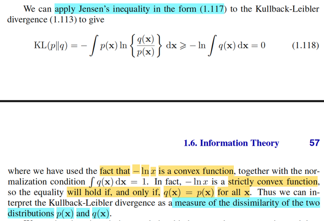</kbd>

> [!NOTE]
> Thế thì vừa rồi ta đã biết Jensen's inequality: f(EX) ≤ E[f(X)].
>
>
>
> và dĩ nhiên nó áp dụng với mọi random variable X.
>
>
>
> Quay lại đây, xét KL(p||q) = -∫p(x)ln[q(x)/p(x)]dx
>
>
>
> = -∫p(x)ln[q(x)/p(x)]dx
>
>
>
> Nếu đặt T(X) = q(X)/p(X), là random variable có được khi áp hàm q(x)/p(x) lên
> X, và xét tính chất concave của hàm ln(), nên -ln() là convex function.
>
>
>
> Khi đó áp dụng Jensen's inequality cho T và f(T) = -ln(T):
>
>
>
> f(E[T]) ≤ E[f(T)]
>
>
>
> ⇔ -ln(E[T]) ≤ E[-ln(T)]
>
>
>
> Vì T = q(X) / p(X), theo LOTUS khi ta có Y = g(X), ta có thể tính EY dùng
> pdf/pmf của X: EY = Eg(X) = ∫g(x)fX(x)dx
>
>
>
> Nên E[T] = ∫T(x)fX(x)dx
>
>
>
> = ∫[q(x)/p(x)] p(x)dx = ∫q(x)dx
>
>
>
> và cái này = 1 do tính valid của pdf q(x)
>
>
>
> Còn E[-ln(T)], tương tự đây cũng chỉ là kì vọng của biến ngẫu nhiên có được
> khi áp hàm -ln(T(x)) lên X, LOTUS cho ta tính:
>
>
>
> E[-ln(T)] = ∫-ln(T(x))fX(x)dx = ∫-ln(q(x)/p(x))p(x)dx
>
>
>
> = KL(p||q)
>
>
>
> Vậy ta có -ln(E[T]) ≤ E[-ln(T)]
>
>
>
> ⇔ -ln(1) ≤ KL(p||q)
>
>
>
> ⇔ 0 ≤ KL(p||q)
>
>
>
> -----
>
>
>
> Thế thì khi nào dấu bằng xảy ra?
>
>
>
> Dấu bằng xảy ra khi dấu bằng của Jensen's inequality xảy ra. Và f(EX) ≤
> E[f(X)]. chỉ xảy ra khi EX = constant c. khi đó f(EX) = f(c) và vì f(X) = f(c) cũng
> là hằng số nên E(f(X)) = f(c).
>
>
>
> Áp dụng cho trường hợp của T: dấu bằng xảy ra khi T(x) = q(x)/p(x) = c.
>
>
>
> ⇔ q(x) = c p(x)
>
>
>
> tích phân hai vế theo x ta được ∫q(x)dx = ∫cp(x)dx = c∫p(x)dx
>
>
>
> ⇔ 1 = c
>
>
>
> Vậy, dấu bằng xảy ra khi p(x) = q(x) với mọi x. tức là hai distribution này y
> chang nhau. Khi đó KL-divergence (p||q) sẽ đạt min = 0
>
>
>
> Và nó sẽ càng lớn nếu p(x) càng khác q(x). Chính vì vây mà khái niệm
> này được dùng để đo sự khác nhau (phân tách / divergence) của hai
> phân phối xác suất

 

- **Nén dữ liệu và Entropy thông tin**

<kbd>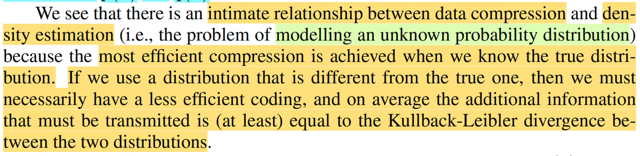</kbd>

> [!NOTE]
> Đoạn này đại ý là tác giả nói rằng ta sẽ thấy rằng có sự liên hệ gần gũi  giữa bài
> toán nén dữ liệu và bài toán density estimation (ví dụ, là bài toán mà ta tìm cách
> inference một phân phối xác suất, xây dựng một phân phối ước lượng của phân
> phối gốc chưa biết).
>
>
>
> Và sự liên hệ đó là: nếu như ta có thể estimate phân phối gốc càng chính xác thì
> việc nén dữ liệu sẽ càng hiệu quả. Và khi đó trung bình lượng thông tin bổ sung
> cần thiết (để transmit đủ data từ phân phối thật p(x)) nhưng lại dùng phân phối
> approx q(x) sẽ chính là KL-divergence
>
>
>
> Có lẽ nên recall lại chút về định nghĩa của KL-divergence cho nhớ
>
>
>
> Còn nhớ ta đã học rằng, người ta muốn đặt ra một function để đánh giá mức
> thông tin chứa trong một sự kiện. Thì dựa trên logic: sự kiện càng khó xảy ra thì
> khi nó xảy ra, ta sẽ càng ngạc nhiên, → chứa nhiều thông tin và ngược lại, sự
> kiện mà dễ xảy ra thì khi xảy ra, ta không ngạc nhiên mấy → ít thông tin.
>
>
>
> Từ đó người ta định ra info của sự kiện A là - ln(xác suất của A). (thật ra log
> base nào cũng được, chọn base 2 ta có đơn vị info là bits,  còn chọn base e ta
> có đơn vị là nats.
>
>
>
> Thế thì, như vậy xét một biến ngẫu nhiên rời rạc X, thì lượng thông tin chứa
> trong event X = x sẽ là info(X=x) = -ln(f(x)) với f(x) là pmf của X.
>
>
>
> Và lấy trung bình trên của info(x) với mọi x: E[info(X)] = Σ{possible value x của
> X} -ln(f(x))f(x) ta sẽ đặt nó là entropy của X, nói đúng hơn là của distribution của
> X. Nó cho ta biết tính trung bình thì distribution của X, hay X cũng được chứa
> lượng thông tin bao nhiêu.
>
>
>
> Và nếu dùng lob base 2, thì đây cũng là số bits trong chuỗi nhị phân cần dùng
> để truyền đi đầy đủ thông tin về các giá trị khả dĩ của X.
>
>
>
> Còn với biến liên tục, ta có differential entropy -∫ln(f(x))f(x)dx.
>
>
>
> Vậy thì, nếu ta không có population distribution f(x) thì sao, mà giờ ta gọi là p(x)
> đi, nếu ko có p(x), mà thay vào đó ta dùng một phân phối ước lượng cho nó,
> q(x). thì khi đó thế nào.
>
>
>
> Khi đó, lượng thông tin của một possible value x của X sẽ là:
>
>
>
> Info(X=x) = -ln(q(x)) (ta dùng q(x) thay cho p(x))
>
>
>
> Và lấy trung bình cái này, tức E[Info(X)], sẽ là Σ{possible value x của X}
> -ln(q(x))p(x)
>
>
>
> hay với pdf: -∫ln(q(x))p(x)dx
>
>
>
> Chú ý, trung bình, hay kì vọng của -ln(q(X)) thì đây là biến ngẫu nhiên được tạo
> ra bằng cách áp hàm số -ln(q(x)) lên random variable X, nên LOTUS, cho phép
> ta tính kì vọng của nó dựa trên pdf/pmf của X
>
>
>
> Và người ta gọi sai khác giữa lượng thông tin trung bình khi ta dùng q(x) để đo
> thông tin của X thay vì dùng phân phối thật của nó p(x), là relative enropy, hay
> KL-divergence(p||q):
>
>
>
> -∫ln(q(x))p(x)dx - [-∫ln(p(x))p(x)dx]
>
>
>
> gom lại ta có -∫ln(q(x)/p(x))p(x)dx,
>
>
>
> mang ý nghĩa là lượng DƯ THỪA / BỊ LÃNG PHÍ THÊM, bắt nguồn từ việc ta ko
> có distribution chính xác của X

 

- **Ước lượng độ phân kỳ KL**

<kbd>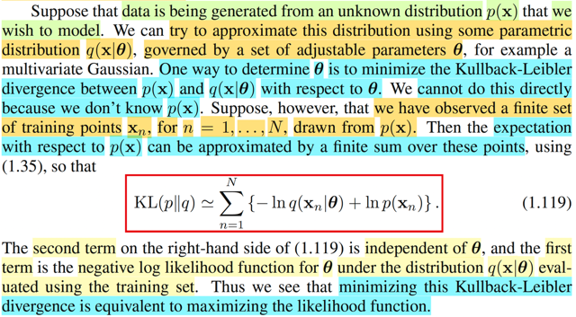</kbd>

> [!NOTE]
> Thế thì như vừa ôn lại, KL-divergence(p||q)), trung bình lượng thông tin cần
> phải bổ sung / dư thừa khi ta dùng q(x) thay vì p(x) để transmit thông tin của
> distribution p(x) = -∫ln(q(x)/p(x))p(x)dx, và cái này, dễ thấy cũng chính là
> E{-ln[q(X)/p(X)]} với X ~ p(x)
>
>
>
> Vậy thì, đại khái là, giả sử p(x) vẫn là population distribution, thứ đẻ ra dữ liệu
> quan sát được. Và ta xây dựng q(x|θ) là một distribution ước lượng cho p(x),
> có tham số θ điều chỉnh được.
>
>
>
> Thế thì, quay lại nói về KL-divergence, E{-ln[q(X)/p(X)]}. vì ta ko biết p(x) là gì,
> nên dĩ nhiên ko thể tính chính xác cái này được.
>
>
>
> Do đó, người ta approx cái này bằng một tổng hữu hạn:
>
>
>
> Σn=1:N [-ln[q(xn|θ)/p(xn)]]
>
>
>
> Vì sao lại approx như vậy? Mình có thể liên tưởng đến Xbar, vì ta ko biết θ
> của population f(x|θ, σ^2), tức có mean θ, variance σ^2, nơi sinh ra các giá trị
> quan sát được của random sample X1,..Xn. Thì ta mới dùng Xbar = (Σi Xi)/n để
> estimator cho θ. Và quả thật, đây là một unbiased estimator của θ khi E(Xbar)
> = θ và theo LLN (law of large number) khi kích thước mẫu n → inf thì Xbar  sẽ
> converge in probability về θ: lim n→inf P(|Xbar - θ| < ε) = 1 ∀ε
>
>
>
> Vậy thì ở đây, đại khái là ta cũng đang xét một distribution của random
> variable Y = -ln[q(X)/p(X)], và cụ thể là muốn estimate mean của nó: EY =
> E{-ln[q(X)/p(X)]}.
>
>
>
> Và ta dùng Y_bar để estimate cho EY.
>
>
>
> Ybar = (Σi Yi) / N = {Σi -ln[q(Xi|θ)/p(Xi)]} / N
>
>
>
> Và dù sao thì N cũng chỉ là constant, nên có tiếp theo khi ta tìm cách
> minimize cái này thì vai trò của nó ko quan trọng lắm nên trong sách Bishop
> mới ko nhắc đến, chỉ dùng Σn=1:N [-ln[q(xn|θ)/p(xn)]] để estimate cho
> KL-divergence = E{-ln[q(X)/p(X)]}.
>
>
>
> Rồi, như vậy, ta sẽ đi minimize_θ Ybar = {Σi -ln[q(Xi|θ)/p(Xi)]} / N
>
>
>
> biến đổi chút hàm mục tiêu:
>
>
>
> {Σi -ln[q(xi|θ)/p(xi)]} / N = Σi {-ln q(xi|θ) + ln p(xi)} / N
>
>
>
> = {Σi -ln q(xi|θ) + Σi ln p(xi)} / N
>
>
>
> chuyển sang bài toán tương đương bằng cách bỏ đi các constant (ko dính tới
> biến tối ưu θ)
>
>
>
> minimize_θ Σi -ln q(xi|θ)
>
>
>
> Và đây chính là cái gì?
>
>
>
> với q(xi|θ) là phân phối xác suất mà ta xây dựng để mô phỏng / ước lượng
> p(x)
>
>
>
> thì còn nhớ với tính chất iid của các random variable trong random sample
>
>
>
> joint distribution của cả bộ f(**x**|θ) = tích các marginal distribution Πi f(xi|θ)
>
>
>
> Và lại nhớ định nghĩa của likelihood function, là hàm của θ, mang ý nghĩa độ
> hợp lí của θ khi giá trị quan sát được của random sample là **X** = **x**:
>
>
>
> L(θ|**x**) = f(**x**|θ), theo tính iid nói trên, tiếp tục = Πi f(xi|θ).
>
>
>
> Nếu ta đi maximize likelihood, ta sẽ tìm được maximize likelihood estimator
> của θ, kí hiệu θ^_ml(**X**), và trong quá trình làm vậy, ta có thể chuyển thành
> bài toán tương đương là minimize - ln likelihood: - ln L(θ|x) = - ln Πi f(xi|θ)
>
>
>
> = - Σi ln f(xi|θ) (do tính chất ln(ab) = ln(a) + ln(b)
>
>
>
> Chính vì vậy mà gs nói bài toán minimize_θ Σi -ln q(xi|θ) đang xét chính là
> minimize negative log likelihood.
>
>
>
> Và ý chính đó là, muốn chỉ ra rằng, việc ta **đi tìm maximum likelihood
> estimator của θ**, là θ có độ hợp lí cao nhất dựa trên dữ liệu quan sát được,
> thì c**ũng chính là đi tìm θ giúp giảm thiểu trung bình thông tin dư thừa khi
> transmit thông tin của phân phối p(x) bằng việc dùng phân phối ước lượng
> q(x)**. Với "trung bình thông tin dư thừa.." ở đây cũng là một unbiased
> estimator  của là trung bình thật (tức là dùng Ybar thay vì EY thật)

 

- **Đo lường độc lập bằng KL-divergence**

<kbd>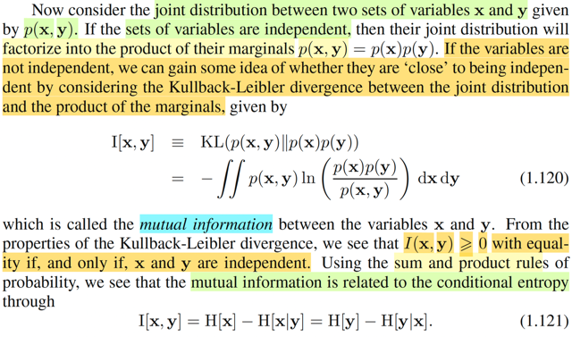</kbd>

> [!NOTE]
> Tiếp, phần này cũng dễ hiểu, nói rằng nếu ta xét hai random variable
> (vector) **X**  và **Y**, thì từ Stat110 hay Casella ta cũng đã biết nếu chúng
> độc lập nhau, thì joint pdf f**X**,**Y**(**x**,**y**) sẽ có thể tách thành tích các
> marginal pdf f**X**(**x**)f**Y**(**y**).
>
>
>
> Vậy thì ý tưởng ở đây là, người ta dùng KL-divergence giữa joint pdf và tích
> marginal pdf để mà đánh giá tính độc lập của **X**, **Y**.
>
>
>
> Đó là vì như đã biết KL(p||q) sẽ chỉ bằng 0 khi và chỉ khi p(x) = q(x) ∀x tức là
> hai phân phối trùng nhau.
>
>
>
> Nên tương tự, KL(fX,Y(x,y)||fY(x)fY(y)) sẽ = 0 khi fX,Y(x,y) = fX(x)fY(y) ∀ x,y
> tức là khi **X**, **Y** độc lập. Thành ra KL-divergence này có thể dùng để
> thể hiện **mức độ** độc lập giữa **X**, **Y**

 

- **Giảm bất định của thông tin tương hỗ**

<kbd>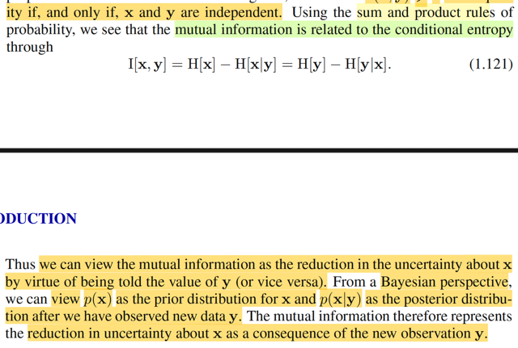</kbd>

> [!NOTE]
> Tiếp, thay công thức vào và biến đổi một chút ta sẽ có I(x,y) = H(x) - H(y|x) =
> H(y) - H(x|y).
>
>
>
> từ đó có thể nhìn nhận I(x,y) (kí hiệu của mutual information vừa rồi) là 
> khoảng giảm về độ không chắc về x khi ta được cho biết giá trị của y.
>
>
>
> Dưới góc nhìn của trường phái Bayesian, ta có thể xem p(x) là prior distribution
> của X và p(x|y) là posterior distribution của X given Y = y. Khi đó, mutual
> information là mức giảm của độ không chắc chắn về X sau khi ta biết giá
> trị của Y

 

