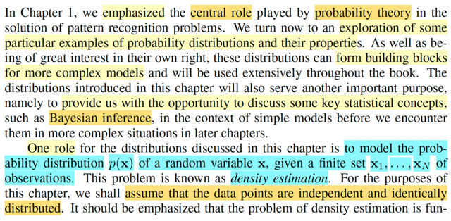
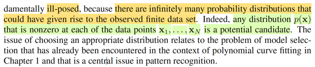
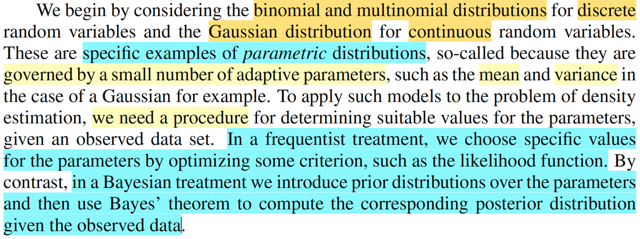
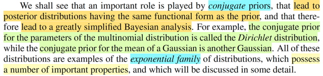
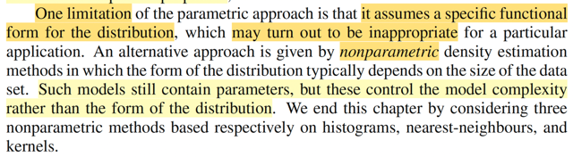

# 2.0 Intro

📊 **Progress:** `4` Notes | `5` Screenshots

---

 

## Phân phối xác suất và ước lượng mật độ

<kbd></kbd>

<kbd></kbd>

> [!NOTE]
> Mở đầu ông nhắc lại vai trò trung tâm trong lĩnh vực pattern recognition
> là lí thuyết xác suất. Nên chương này, ta sẽ khám phá các phân phối
> xác suất quan trọng và tính chất của chúng. Để sau này, ta sẽ dùng
> chúng như những viên gạch giúp xây dựng các mô hình phức tạp.
>
>
>
> Bên cạnh đó, thông qua việc này, ta cũng sẽ thảo luận các khái niệm 
> quan trọng trong thống kê.
>
>
>
> Thế thì ông nói, một vai trò của các distribution sẽ thảo luận là dùng để
> mô hình hóa một phân phối p(x) của các random variable **X**, cho biết
> **x1**, ..., **xN** là các giá trị quan sát của chúng. Bài toán này gọi là DENSITY
> ESTIMATION. Và ta sẽ giả định tính iid.
>
>
>
> Dừng lại chút, sau khi đã học Casella, thì mình thấy đây chính là bài 
> toán statistical inference. Vì mục đích cũng là, dựa trên giá trị quan sát
> được cuả một random sample X1,X2,...,Xn iid (mutually independent
> và identically distributed) ~ f(**x**|θ), ta sẽ muốn estimate ra θ
>
>
>
> gs nói thêm, bài toán này thực chất là ill-posed, hiểu đại khái là có nhiều
> nghiệm. Tức là, với observed data trên, thì thật ra có nhiều hàm phân
> phối p(x) chứ không phải chỉ có một, và nhiệm vụ là ta đi tìm cái nào tốt
> nhất

 

### Ước lượng tham số: Frequentist/Bayesian

<kbd></kbd>

> [!NOTE]
> Nói sơ, ta sẽ khởi đầu với binomial / multinomial và Normal, đại diện quan
> trọng cho discrete và continous random variable. Ông gọi đây là
> PARAMETRIC  distribution là vì nó sẽ phụ thuộc các tham số ví dụ như với
> normal thì là  mean và variance.
>
>
>
> Và để giải bài toán density estimation này (inference theo Casella)  ông nói
> ta sẽ cần một quy trình. Với trường phái Frequentist / Classical thì có thể là
> ta đi tối ưu hóa một tiêu chí nào đó ví dụ maximize likelihood. (này tương
> đương với việc trong Casella ta tìm ML estimator của θ đây mà)
>
>
>
> hoặc với Bayesian thì ta chọn prior, rồi dùng Bayes rule để xây dựng
> posterior distribution (cái này cũng tương đương với xây dựng Bayes
> estimator  trong Casella)

 

#### Priors liên hợp

<kbd></kbd>

> [!NOTE]
> Tiếp, ông nói sơ về conjugate priors. Như trong casella mình đã học, rằng
> có những distribution nếu được chọn làm priori thì posterior hóa ra cũng
> sẽ cùng loại. Ví dụ còn nhớ bài toán mà random sample X ~ binomial(n, θ)
> bằng cách chọn prior của θ  là phân phối β, thì posterior hóa ra cũng là
> phân phối β, chỉ thay đổi giá trị tham số.
>
>
>
> Ở đây gs lấy ví dụ với multinomial thì như nếu chọn Dirichlet thì posterior
> thì posterior cũng là Dirichlet. 
>
>
>
> Hay conjugate prior cho mean của Normal cũng là Normal
>
>
>
> Rồi ta cũng sẽ gặp lại exponential family đã học ở casella, phân tích các
> tính chất quan trọng của nó

 

##### Tiếp cận Nonparametric

<kbd></kbd>

> [!NOTE]
> Cuối cùng ông nói sơ về hạn chế của cách tiếp cận parametric, đó là
> nó dựa trên giả định là ta sẽ cho là population distribution thuuộc một
> dạng cụ thể nào đó, chỉ là ko biết parameter thôi.
>
>
>
> Cách tiếp cận này đôi khi sẽ không phù hợp khi hóa ra distribution mà
> ta giả định hóa ra là sai.
>
>
>
> Chương này ta cũng sẽ xem xét vài phương pháp của cách tiếp cận
> non-params

 

